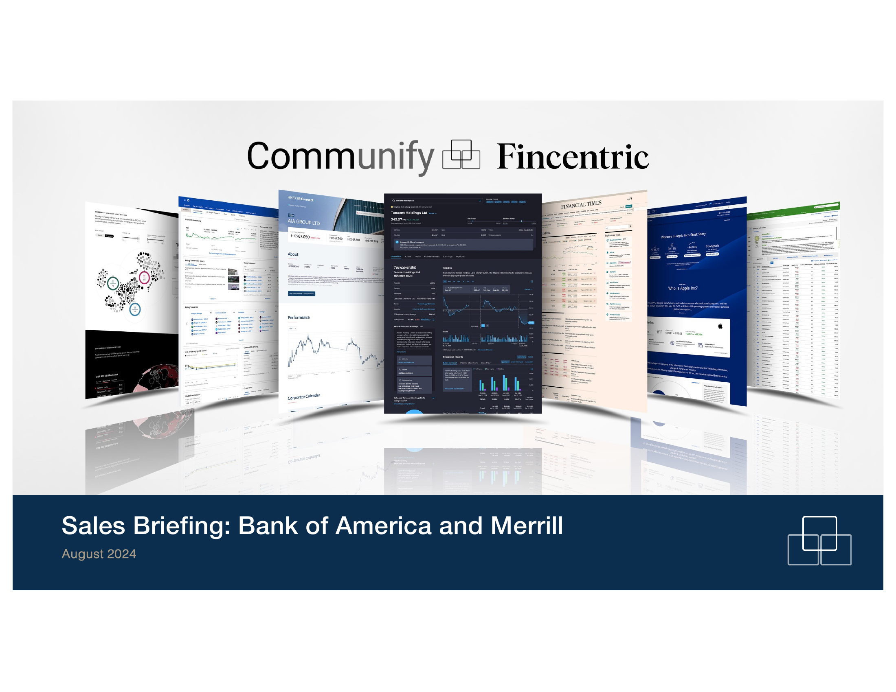

##### No title found]


````col
```col-md
flexGrow=.5
===
> [!info] [Page 1](_attachments/images_SalesBriefing-BAML20240916.pdf_191831/page_1.png)
> 
```  
```col-md
Community &) Fincentric  
Sales Briefing: Bank of America and Merrill  
```
````
Notes:    
````col
```col-md
flexGrow=.5
===
> [!info] [Page 2](_attachments/images_SalesBriefing-BAML20240916.pdf_191831/page_2.png)
> 
```  
```col-md  
```
````
Notes:    
````col
```col-md
flexGrow=.5
===
> [!info] [Page 3](_attachments/images_SalesBriefing-BAML20240916.pdf_191831/page_3.png)
> 
```  
```col-md
Bank of America & Merrill  
Solutions Provided Summary  
+ We provide design and development resources across various
lines of business across online brokerage, wealth management
and retirement solutions.  
+ Managed Services and Platform Subscription for research
platform and quotes.  
By the Numbers  
$16.4M $15.1M
2023 Revenue December 2023 ACV
91% 1995
Recurring Revenue % Client Since  
Power Map  
Power Map: Bank of America and Merrill  
Client Health Commentary  
+ Merrill knows we can develop faster with higher quality
than their internal teams and design with more innovation.  
+ Very happy across business lines and engagements.  
+ Various business owners were not pleased with a price
increase for 2024 as budgets had been set.  
Contract
Date
(Work
Originated)
2024
GWM Annual OB & WM 1995
Annual Retainer for OB 2024
Merrill Edge 2016
Annual Retainer for 2024
Retirement Solutions WM ~ Clients 2018
Annual Design
Retainer for WM — 2024
Collaborative Onboard Advisory 2020
ing Experience
Market Data 2024
Management OB & WM 2018  
Key Active SOWs  
Capabilities Sets Utilized  
Merrill Edge, Advisory and Retirement Platform Sub & 19 FTE retainer
Increased fees for core retail brokerage, quotes, research platform and
managed services  
Additional 15 FTE retainer team for Edge  
Retirement tools and fund info for plan sponsors
6 FTE retainer  
Ongoing 4.5 FTE design retainer for their Advisory onboarding
experience  
Real-time market data service provider management within Fincentric
environment  
Repricing Opportunities (Renewal Opportunities)  
2024/25 Price  
Increase OB  
Workplace wn - Design, develop
Benefits — Retiremen and host a new
Target Date t Target Date Fund
Fund Tool tool
Benefits WM —  
OnLine-BOL Retiremen Redesign the BOL
Admin/Spons t& Sponsor view.
or Redesign Benefits  
$1,410,000  
$1,701,000  
90% = Price increase for design team for Merrill.com  
Upsell Opportunities  
Managing
Avera get op P
Other BOL Business TBD
agencies Stakeholders  
Private & Confidential  
$6.24M  
$3.85M  
$1.53M  
$1.19M  
$756K  
October
2024  
$138K  
De ap
sropepuny to cies  
56%  
82%  
```
````
Notes:    
````col
```col-md
flexGrow=.5
===
> [!info] [Page 4](_attachments/images_SalesBriefing-BAML20240916.pdf_191831/page_4.png)
> 
```  
```col-md
A NG
SALES BRIEFING Private & Confidential  
Company Background: Bank of America & Merrill  
Overall Sales Box Score: 78%  
Company Size / AUM: 213,000 (BoA) and 15,000 (Merrill) / $1.62 trillion
(BoA) and $2.75 trillion AUM  
Industry: Banking and Investment Wealth Management  
Key Stakeholders: SVP Strategic Marketing (Patricia Page), Various
Managing Director (Tom Matazzaro and Steve Avera), VP Procurement
and Global Technology and Market Data (Don Ballard and Catherine
Beck)  
Current Technology Stack (Optional): In-house built experiences for
Merrill Edge, MyMerrill/Merrill.com, Advisory tools and solutions,
retirement and investment reporting, client onboarding experiences,
redesigning the Alternative Investments platform, Benefits OnLine sales
demo tool, ongoing FactSet data support, APIs, to name a few.    
```
````
Notes:    
````col
```col-md
flexGrow=.5
===
> [!info] [Page 5](_attachments/images_SalesBriefing-BAML20240916.pdf_191831/page_5.png)
> 
```  
```col-md
SALES BRIEFING  
Sales Box: Bank of America & Merrill — Increased Annual Retainer for Retirement  
Solutions and Merrill.com Sales Pages  
Need  
Increase annual retainer and
support team for Retirement Solutions
for investment reporting. Included is a
+1 FTE upsell from 2023’s renewal.  
Increase design support fees for
Merrill.com Sales Pages  
Need Score: 10,  
Competition  
Internal Merrill teams  
Internal Merrill teams  
Competition Score:  
Economics  
$1,947,000 one-time
(repaper annually)  
$618,000 one-time (repaper
annually)  
Economics Score: 10/10  
Decision Making  
Managing Director (Tom
Matarazzo) holds the budget.  
Managing Director (Kate
Horrigan) holds the budget  
Decision Score: 9/10  
Timing
2025 roadmap planning meeting
Sept 18'* then draft will be sent out.  
Annual fee has been provided to BoA
financing for approval and budget.  
Draft sent, target execution by
Sept 30th  
Timing Score: 10/10  
How to Win  
Ensuring our 2025 roadmap
is robust and filled to support the 7
FTEs.  
Continue delivering on
designs to assist with Merrill.com sales
pages  
TOTAL Score: 98/100
Likelihood: 98%  
Private & Confidential  
```
````
Notes:    
````col
```col-md
flexGrow=.5
===
> [!info] [Page 6](_attachments/images_SalesBriefing-BAML20240916.pdf_191831/page_6.png)
> 
```  
```col-md
SALES BRIEFING Private & Confidential  
Sales Box: Merrill — Benefits OnLine (BOL) Redesign for Plan Admins/Sponsors  
Need Economics Timing
Redesign the plan admin / plan $1,701,000 one-time Q4, Reviewing with BOL
sponsor site of Merrill Benefits OnLine stakeholders and business partners.
(BOL) (retirement and benefits. The business is currently reviewing
services) to be more modern and up to other agencies to move forward.  
competitors’ standards.  
Need Score: 10, Economics Score: 10/10 Timing Score: 8/10  
Competition Decision Making How to Win
Merrill BOL is vetting out SVP of Marketing (Patricia Our proposal was a high-  
multiple other agencies to help Page) and the Fincentric team had a high level to get in the door and
redesign the site. They went through a great call and appreciated our compete with other agencies.
pricy engagement with Northstar / “thoughtful proposal”. She knows our Continuing to follow up with Patricia
Starcom in 2015 to envision the future work with the BOL sales demo tool and and see how we can help while she
of BOL for plan admins. thinks there is value with Fincentric reviews with the business.  
helping as we know their brand and  
site.  
Competition Score: 5/10 Decision Score: 8/10 TOTAL Score: 82/100  
Likelihood: 82%  
```
````
Notes:    
````col
```col-md
flexGrow=.5
===
> [!info] [Page 7](_attachments/images_SalesBriefing-BAML20240916.pdf_191831/page_7.png)
> 
```  
```col-md
SALES BRIEFING Private & Confidential  
Sales Box: Merrill - Workplace Benefits Institutional Retirement — Target Date
Fund Tool  
Need Economics Timing
Proactive proposal to design, $100-150K one-time Study 2025
develop and manage a new Target $510,000 one-time,
Date Fund Tool. $900,000 recurring  
Need Score: 10/10 Economics Score: 0/10 Timing Score: 8/10  
Competition Decision Making How to Win
Internal Merrill teams Managing Director Institutional Demo our capabilities and
Retirement (Steve Avera) holds the expertise on data and design of a
budget and was not on the initial call. target date fund tool.  
Comp Score: 5/10 Decision Score: 5/10 TOTAL Score: 56/100  
Likelihood: 56%  
```
````
Notes:    
````col
```col-md
flexGrow=.5
===
> [!info] [Page 8](_attachments/images_SalesBriefing-BAML20240916.pdf_191831/page_8.png)
> 
```  
```col-md
A G
| SALES BRIEFING Private & Confidential  
Power Map: Bank of America and Merrill  
Brian Moynihan  
Bank of America Chair and CEO H  
Hl Executive Leadership
©) Functional Roles  
anasia  
Eric Schimpf
President and Co-head, Merrill President and Co-head, Merrill
Wealth Management Wealth Management  
Preside.
Regional Banking
Consumer and Small Bi  
Nancy Fahmy  
Head of Investment
Solutions  
R Ezra Lightman  
Retail CXO
Merrill Edge  
Kate Horrigan Precious Gamer Joe Paolantonio  
an Furey  
Managing Director
Head of Workplace
Benetits  
Managing Director  
SVP Strategic Marketing| iinancial Sponsors Grout  
Georgio Vuolde  
Tim Paul  
Steve Avera  
Tom Matazzaro  
Craig Tillman Tien Meehan  
Ayan Gupta Frank DeBartolis.  
Mike Daoust  
Alex Rajan  
Carrie Jensen  
liver H
Jeannie Vaughn @issdn Tey  
Jonathan Alexander  
Don Ballard Catherine Beck  
Note: Functional roles are not presented in order of reporting hierarchy.  
```
````
Notes:    
````col
```col-md
flexGrow=.5
===
> [!info] [Page 9](_attachments/images_SalesBriefing-BAML20240916.pdf_191831/page_9.png)
> 
```  
```col-md
SALES BRIEFING  
Power Map Notes: Bank of America & Merrill  
Key Decision Makers  
. Name: Tom Matarazzo  
° Title: Managing Director  
° Department: Institutional Retirement, Advisor Programs and Financial Wellness Solutions
° Reports To: John Quinn  
° Influence Level: High  
° Notes: Budget holder for Retirement Solutions  
. Name: Steve Avera  
* Title: Managing Director  
. Department: Institutional Retirement  
. Reports To:  
. Influence Level: High  
° Notes: Budget holder for Institutional Retirement  
° Name: Patricia Page  
° Title: SVP Strategic Marketing  
. Department: Data, Digital, and Global Marketing  
° Reports To:  
. Influence Level: High  
° Notes: Key influencer to various business stakeholders for Benefits OnLine team  
. Name: Kate Horrigan  
° Title: SVP  
° Department: Merrill.com sales  
° Reports To:  
. Influence Level: High  
° Notes: Budget holder for Merrill.com sales pages  
. Name: Precious Garner  
* Title: Digital Investing Lead  
° Department: Merrill Edge Digital Investing StrategyReports To: Ryan Furey  
. Influence Level: High  
° Notes: New budget holder for Merrill Edge  
Private & Confidential  
Influencers and Gatekeepers  
Name: Don Ballard  
Title: Vice President  
Department: Global Procurement, Market Data and Information Services  
Reports To:  
Influence Level: High  
Notes: Has the final say in all major contracting decisions with business stakeholders and
helps to execute all our agreements.  
Name: Catherine Beck  
Title: VP, Third-Party Engagement Manager  
Department: Global technology — Application Production Services & Engineering
Reports To: Jonathan Alexander (new contact with Tom Fearon’s retirement)  
Influence Level: High  
Notes: Has the final say in all major contracting decisions with business stakeholders and
owners of our enterprise agreement, Schedule 100.  
```
````
Notes:    
````col
```col-md
flexGrow=.5
===
> [!info] [Page 10](_attachments/images_SalesBriefing-BAML20240916.pdf_191831/page_10.png)
> 
```  
```col-md
SALES BRIEFING  
Ryan Furey  
Category  
Title/Company  
LinkedIn  
Primary
Relationship  
Objective  
Relate/Comments  
Education  
Meeting/Time
CF Team  
Private & Confidential  
Business Network  
Retail CXO  
LinkedIn  
Renee Spampinato  
ntroduce John and grow Renee’s relationship to Ryan  
> Lives in Charlotte, NC  
> Joined the Merrill Edge relationship earlier in 2024 after many
years as head of Digital & Marketing Strategy for Retail Banking on
the BoA side.  
> Fincentric team met Ryan onsite in Charlotte April 2024  
BS Chemical Engineering, Virginia Tech  
10  
```
````
Notes:    
````col
```col-md
flexGrow=.5
===
> [!info] [Page 11](_attachments/images_SalesBriefing-BAML20240916.pdf_191831/page_11.png)
> 
```  
```col-md
ALES BRIEFING  
Appendix — Active Schedules as of August 2024  
Private & Confidential  
Business Unit Contract Date GEES MS/PS Fee
Annual  
120  
135  
140 CO#3  
165  
167  
168  
169  
170  
173  
Advisory/Edge CEW  
Merrill.com  
Advisory  
Benefits Online  
COBE  
Alternative Investments
Retirement and Personal Wealth
Solutions
(Workplace Benefits)  
Edge  
Workplace Benefits — IRT  
July 1, 2024 — June 30, 2027  
April 1, 2024 — March 31, 2025
Auto-annual renewal  
October 1, 2023 — September 30,  
2024  
April 1, 2024 — March 31, 2025  
November 1, 2024 — October 31,
2025  
January 1, 2024 —- December 31,
2024  
January 1, 2024 —- December 31,
2024  
January 1, 2024 — December 31,
2024  
January 1, 2024 —- December 31,
2024  
Fixed Scope  
GWM Support and Enhancements — 19 FTEs
Price increased effective July 1, 2024  
Ongoing Support for FactSet Market Data Feed
Price increased effective April 2024  
2 Design FTEs
Price increase in progress for October 1, 2024 —
September 30, 2025  
0.7 Video Design FTEs
Price increased April 2024  
Managed Services  
4.5 Design and Other Skill Sets FTEs
Price increased effective July 2024  
2 Design FTEs
Price increase effective July 2024  
6 Other Skill Sets FTEs
Price increased July 2024
2025 renewal in progress with price increase  
15 Enhancement FTEs
Price increased July 2024  
Site Wide Search for Retirement Screener fixed scope
Revenue recognition August 29, 2024  
$6.24M
Recurring  
$756K  
Recurring  
$618K  
$201,600  
$180K  
$1,196,250  
$810,000  
$1,530,000  
$3,855,000  
$170K  
$756K  
N/A  
N/A  
$180K  
N/A  
N/A  
Sch100  
Sch100  
Sch100  
11  
```
````
Notes:  


![[_attachments/Sales Briefing - BAML 2024 09 16.pdf]