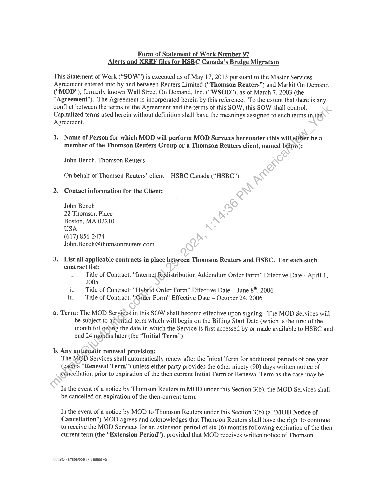

##### Statement of Work Number 97: Alerts and XREF Files for HSBC Canada’s Bridge Migration]

  
````col
```col-md
flexGrow=.5
===
> [!info] [Page 1](_attachments/images_Refinitiv-3.6.1.2.100207491.pdf_210305/page_1.png)
> 
```  
```col-md
Form of Statement of Work Number 97
Alerts and XREF files for HSBC Canada’s Bridge Migration  
This Statement of Work (“SOW”) is executed as of May 17, 2013 pursuant to the Master Services
Agreement entered into by and between Reuters Limited (“Thomson Reuters”) and Markit On Demand
(“MOD”), formerly known Wall Street On Demand, Inc. (“WSOD”), as of March 7, 2003 (the
“Agreement”). The Agreement is incorporated herein by this reference. To the extent that there is any
conflict between the terms of the Agreement and the terms of this SOW, this SOW shall control.
Capitalized terms used herein without definition shall have the meanings assigned to such terms in, the
Agreement.  
1. Name of Person for which MOD will perform MOD Services hereunder (this will either be a
member of the Thomson Reuters Group or a Thomson Reuters client, named bélow):  
John Bench, Thomson Reuters  
On behalf of Thomson Reuters’ client: HSBC Canada (“HSBC”)
2. Contact information for the Client:  
John Bench  
22 Thomson Place  
Boston, MA 02210  
USA  
(617) 856-2474
John.Bench@thomsonreuters.com  
3. List all applicable contracts in place between Thomson Reuters and HSBC. For each such  
contract list:
i. Title of Contract: “Internet Redistribution Addendum Order Form” Effective Date - April 1,
2005  
ii. Title of Contract: “Hybrid Order Form” Effective Date — June 8", 2006
iii. Title of Contract: “Order Form” Effective Date — October 24, 2006  
a. Term: The MOD Seryices in this SOW shall become effective upon signing. The MOD Services will
be subject to anNnitial term which will begin on the Billing Start Date (which is the first of the
month following the date in which the Service is first accessed by or made available to HSBC and
end 24 months later (the “Initial Term”).  
b. Any automatic renewal provision:
The MOD Services shall automatically renew after the Initial Term for additional periods of one year
(eath-a “Renewal Term”) unless either party provides the other ninety (90) days written notice of
cancellation prior to expiration of the then current Initial Term or Renewal Term as the case may be.  
In the event of a notice by Thomson Reuters to MOD under this Section 3(b), the MOD Services shall
be cancelled on expiration of the then-current term.  
In the event of a notice by MOD to Thomson Reuters under this Section 3(b) (a “MOD Notice of
Cancellation”) MOD agrees and acknowledges that Thomson Reuters shall have the right to continue
to receive the MOD Services for an extension period of six (6) months following expiration of the then
current term (the “Extension Period”); provided that MOD receives written notice of Thomson  
BO - 87508/0001 - 149596 v2  
```
````
Notes:    
````col
```col-md
flexGrow=.5
===
> [!info] [Page 2](_attachments/images_Refinitiv-3.6.1.2.100207491.pdf_210305/page_2.png)
> 
```  
```col-md
Reuters’ request to extend the MOD Services within forty-five (45) days of Thomson Reuters’ receipt
of the MOD Notice of Cancellation.  
Unless otherwise agreed in writing by and between the parties, on expiration of the Extension Period,
the MOD Services shall automatically terminate with no further action of either party.  
Notwithstanding the foregoing or anything to the contrary herein or in the Agreement, MOD agrees
and acknowledges that after the Initial Term in the event HSBC cancels the services Thomson Reuters
provides to HSBC in connection with which Thomson Reuters receives MOD Services from MOD.
hereunder, Thomson Reuters shall be entitled to cancel the MOD Services and this SOW on 90-days’
prior written notice to MOD.
ce. If MOD will be hosting Reuters data on behalf of the HSBC, describe:
a, the Reuters data to be hosted: N/A
b. whether exchange data is included: N/A  
c. HSBC’s permitted usage of the Reuters data: N/A  
4. MOD will provide the following MOD Services to the HSBC:  
RBIT Hosting  
MOD will provide RBIT Hosting Services to the Client (an RBIT Subscriber) in
accordance with the terms of Schedule II of the Agreement and the Specifications set
forth in Section 7 below.  
Hosting/Development Services  
MOD will develop a web site (the “Client Site”) for the Client (a Hosting/Development
Subscriber).in accordance with the Specifications set forth in Section 7 below and the
projectschedule set forth in Section 8 below. MOD will host the Client Site in
accordance with the terms of Schedule [II of the Agreement.  
Design Services
MOD will perform presentation design services for the Client in accordance with the  
Specifications set forth in Section 7 below and the project schedule set forth in Section 8
below.  
BQ - 87508/0001 - 149596 v2  
```
````
Notes:    
````col
```col-md
flexGrow=.5
===
> [!info] [Page 3](_attachments/images_Refinitiv-3.6.1.2.100207491.pdf_210305/page_3.png)
> 
```  
```col-md
Help Desk Services  
MOD will perform Help Desk Services for HSBC (a Help Desk Subscriber) in
accordance with Schedule IV of the Agreement and the Specifications set forth in Section
7 below, which Specifications set forth the terms that have been agreed to between
Reuters and HSBC with respect to such services.  
Alerts Service  
MOD will provide the Alerts Service to HSBC in accordance with Schedule V of the
Agreement.  
Reports Service  
[MOD/Reuters] will provide the Reports Service to the Client\(a Reuters Subscriber) in
accordance with Schedule V of the Agreement.  
API Services  
MOD will provide the API Services to HSBC in accordance with Schedule VI of the
Agreement and the Specifications set forth in Section 7 below.  
Fulfillment Services  
MOD will provide the Fulfillment Services to Reuters on behalf of the Client (a
Fulfillment Subscriber) itaccordance with Schedule VII of the Agreement.  
Other  
MOD will perform the services described herein on behalf of HSBC.  
5. Description of Deliverables:  
AsHSBC is migrating away from Bridge symbols, MOD will provide two pieces of
functionality being retired by Thomson Reuters: nightly reference (XREF) files and alerting.  
Nightly files via FTP (push or pull) to HSBC by 4:00 am ET:  
BO - 87508/0001  
Coverage universe anticipated to match HSBC’s current coverage universe.
XREF_HSBC.dat file to contain RIC instead of current Bridge symbol; other content
expected to remain close to current file definition.  
HSBC_PERF_MISC.dat file to contain RIC instead of current Bridge symbol; other
content expected to remain close to current file definition.  
HSBC_RIC_MAP.dat file to contain RICs (as today) + Bridge symbols/exchanges that
exist as of date of last file from Thomson Reuters. Where no Bridge symbol exists, MOD
will populate RIC exchange instead of Bridge exchange.  
* 149596 v2  
```
````
Notes:    
````col
```col-md
flexGrow=.5
===
> [!info] [Page 4](_attachments/images_Refinitiv-3.6.1.2.100207491.pdf_210305/page_4.png)
> 
```  
```col-md
6.  
7.  
8.  
Alerts — Email delivery of text-based price/volume/news/research alerts as exist today
- There may be slight changes in functionality (e.g. price gap measured in % and not $),
but commercially reasonable efforts will be made to match current HSBC alerts.
- MOD builds alert API for HSBC to set/clear alerts & poll for alert history.
- HSBC can migrate alerts via the API if HSBC can provide a file of user identification.
There will be additional cost if MOD has to manually migrate alerts.
- Integrating required news content via FTP transfer from Thomson Reuters.
o This shall be provided via Thomson Reuters News Feed Direct and used by MOD
solely in connection with HSBC Alerts Service portion of the MOD Services
provided hereunder.  
Additional uses either internally by MOD or externally in connectiop with other
client services must be licensed separately with Thomson Reuters.  
- Integrating required research content via existing data transfer methods from Thomson
Reuters.  
Commencement of MOD Services, Term and Billing of this SOWs  
Commencement of MOD Services
MOD replacement of alerts and XREF files is scheduled ¢o-be fully in Production by July 19,
2013.  
Billing
Billing for the work enumerated in this Statemént‘of Work #97 will begin on the Billing Start
Date set forth in 3(a) above.  
Qwnership of Work Product:  
x Language set forth in Artitle VI of the Agreement, as amended by the Side Letter dated
September 7, 2005, applies.  
Fees and Invoicing:  
(a) Monthly Fees. Subject to Section 8(c) below, Thomson Reuters agrees to pay MOD US $9,000
per month (the “Monthly Fees”).  
(b) One-time Development Fee. In addition to the Monthly Fees, Thomson Reuters shall pay MOD
a one-timesdevelopment fee of US $35,000 (the “One-Time Development Fee”). The One-Time
Development Fee shall be due upon the earliest of the following: (1) commencement of MOD
deliyety of XREF files in Production; (2) MOD delivering alerts to HSBC clients in Production; or
(3) August 30, 2013.  
(c) Adjusted Monthly Fees for Early Cancellation by HSBC.  
Notwithstanding Section 8(a) above, in the event HSBC cancels the services Thomson Reuters
provides to HSBC in connection with which Thomson Reuters receives MOD Services from MOD.
hereunder prior to expiration of the Initial Term, Thomson Reuters shall only be obligated to pay
MOD the following adjusted monthly fees (the “Adjusted Monthly Fees”):  
- if cancellation by HSBC occurs within the first twelve month period following the Billing
Start Date (“Year 1”), Thomson Reuters shall continue to pay the Monthly Fees set forth in  
4  
BO» 875080001» 149596 v2  
```
````
Notes:    
````col
```col-md
flexGrow=.5
===
> [!info] [Page 5](_attachments/images_Refinitiv-3.6.1.2.100207491.pdf_210305/page_5.png)
> 
```  
```col-md
Section 8(a) above on account of the remainder of Year | plus $2,000 (rather than $9,000)
per month on account of the second twelve month period of the Initial Term (“Year 2”)  
- if cancellation by HSBC occurs during Year 2, Thomson Reuters will pay MOD $2,000
(rather than $9,000) per month for the period commencing with the month in which HSBC's
cancellation took effect through the remainder of Year 2.  
9. Client Materials:  
Thomson Reuters will use commercially reasonable efforts to cause HSBC to provide to MOD all
information and materials necessary for MOD to perform the MOD Services, including amy licenses
to materials that are necessary for MOD to perform the MOD Services. If Thomson Reuters or
HSBC (as the case may be) does not provide the information and materials necessatyfor MOD to
perform any MOD Services, MOD will not be obligated to perform those MOD Setvices or the time
for performance will be extended to a date after Thomson Reuters or HSBC _(@8)the case may be) has  
provided such required items.  
Thomson Reuters (Markets) LLC  
By: Ell breliom  
Title: p- Cust. Ddincn
pate: 01 AUG 2013
Legal Review: CCarlson  
BO - 87508/0001 - 1.49596 v2  
MARKIT ON DEMAND, INC.  
By:
€atherine Allegra
Head of Markit On Demand  
T|>1|201%  
Date:  
```
````
Notes:  


![[_attachments/Refinitiv-3.6.1.2.1 00207491.pdf]