##### Statement of Work Number 100 - Advisor Equity Research Solution for Ameriprise Financial, Inc.]

  
````col
```col-md
flexGrow=.5
===
> [!info] [Page 1](_attachments/images_Refinitiv-3.6.1.2.200207476.pdf_210248/page_1.png)
> 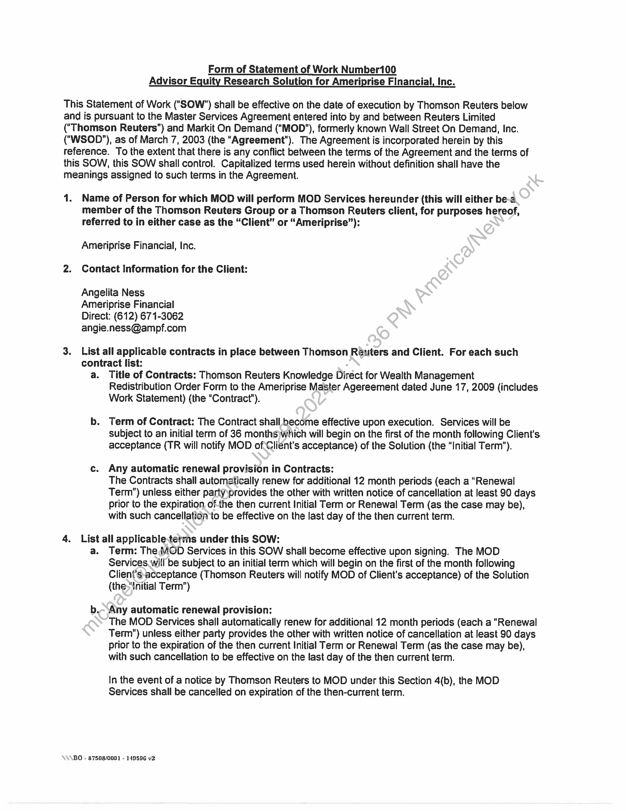
```  
```col-md
Form of Statement of Work Number100  
Advisor Equity Research Solution for Ameriprise Financial, Inc.  
This Statement of Work ("SOW") shall be effective on the date of execution by Thomson Reuters below
and is pursuant to the Master Services Agreement entered into by and between Reuters Limited
(‘Thomson Reuters”) and Markit On Demand (“MOD”), formerly known Wall Street On Demand, Inc.
("WSOD"), as of March 7, 2003 (the “Agreement"). The Agreement is incorporated herein by this
reference. To the extent that there is any conflict between the terms of the Agreement and the terms of
this SOW, this SOW shall control. Capitalized terms used herein without definition shall have the
meanings assigned to such terms in the Agreement.  
1.  
Name of Person for which MOD will perform MOD Services hereunder (this will either be-a
member of the Thomson Reuters Group or a Thomson Reuters client, for purposes hereof,
referred to in either case as the “Client” or “Ameriprise”):  
Ameriprise Financial, Inc.
Contact Information for the Client:  
Angelita Ness
Ameriprise Financial
Direct: (612) 671-3062
angie.ness@ampf.com  
List all applicable contracts in place between Thomson Réuters and Client. For each such
contract list:
a. Title of Contracts: Thomson Reuters Knowledge Direct for Wealth Management  
Redistribution Order Form to the Ameriprise Master Agereement dated June 17, 2009 (includes
Work Statement) (the “Contract”).  
. Term of Contract: The Contract shall become effective upon execution. Services will be  
subject to an initial term of 36 months)which will begin on the first of the month following Client's.
acceptance (TR will notify MOD of:Cliént's acceptance) of the Solution (the “Initial Term”).  
Any automatic renewal provision in Contracts:  
The Contracts shall automatically renew for additional 12 month periods (each a "Renewal
Term”) unless either partyprovides the other with written notice of cancellation at least 90 days
prior to the expiration of-the then current Initial Term or Renewal Term (as the case may be),
with such cancellation to be effective on the last day of the then current term.  
4. List all applicable.terms under this SOW:  
a. Term: The (MOD Services in this SOW shall become effective upon signing. The MOD  
Services. will be subject to an initial term which will begin on the first of the month following
Client's acceptance (Thomson Reuters will notify MOD of Client's acceptance) of the Solution
(the-‘Initial Term”)  
.- Any automatic renewal provision:  
The MOD Services shall automatically renew for additional 12 month periods (each a “Renewal
Term") unless either party provides the other with written notice of cancellation at least 90 days
prior to the expiration of the then current Initial Term or Renewal Term (as the case may be),
with such cancellation to be effective on the last day of the then current term.  
In the event of a notice by Thomson Reuters to MOD under this Section 4(b), the MOD
Services shall be cancelled on expiration of the then-current term.  
BO - 87508/000) - 149596 v2  
```
````
Notes:    
````col
```col-md
flexGrow=.5
===
> [!info] [Page 2](_attachments/images_Refinitiv-3.6.1.2.200207476.pdf_210248/page_2.png)
> 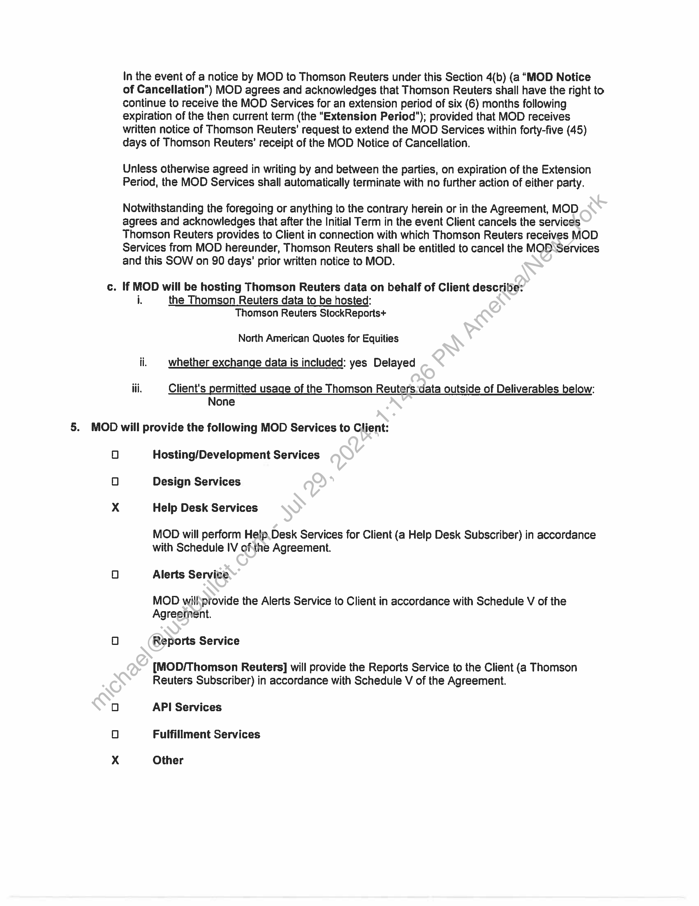
```  
```col-md
c  
In the event of a notice by MOD to Thomson Reuters under this Section 4(b) (a “MOD Notice
of Cancellation”) MOD agrees and acknowledges that Thomson Reuters shall have the right to
continue to receive the MOD Services for an extension period of six (6) months following
expiration of the then current term (the “Extension Period"); provided that MOD receives
written notice of Thomson Reuters’ request to extend the MOD Services within forty-five (45)
days of Thomson Reuters’ receipt of the MOD Notice of Cancellation.  
Unless otherwise agreed in writing by and between the parties, on expiration of the Extension
Period, the MOD Services shall automatically terminate with no further action of either party.  
Notwithstanding the foregoing or anything to the contrary herein or in the Agreement, MOD
agrees and acknowledges that after the Initial Term in the event Client cancels the services
Thomson Reuters provides to Client in connection with which Thomson Reuters receives MOD
Services from MOD hereunder, Thomson Reuters shall be entitled to cancel the MOD Services
and this SOW on 90 days’ prior written notice to MOD.  
If MOD will be hosting Thomson Reuters data on behalf of Client descrite:
i. the Thomson Reuters data to be hosted:
Thomson Reuters StockReports+
North American Quotes for Equities  
ii, | whether exchange data is included: yes Delayed  
iii, Client's permitted usage of the Thomson Reuters:data outside of Deliverables below:
None  
5. MOD will provide the following MOD Services to Client:  
in)  
in)  
Hosting/Development Services
Design Services
Help Desk Services  
MOD will perform Help. Desk Services for Client (a Help Desk Subscriber) in accordance
with Schedule IV ofthe Agreement.  
Alerts Service.  
MOD willprovide the Alerts Service to Client in accordance with Schedule V of the
Agreement.  
Reports Service  
[MOD/Thomson Reuters] will provide the Reports Service to the Client (a Thomson
Reuters Subscriber) in accordance with Schedule V of the Agreement.  
API Services
Fulfillment Services  
Other  
```
````
Notes:    
````col
```col-md
flexGrow=.5
===
> [!info] [Page 3](_attachments/images_Refinitiv-3.6.1.2.200207476.pdf_210248/page_3.png)
> 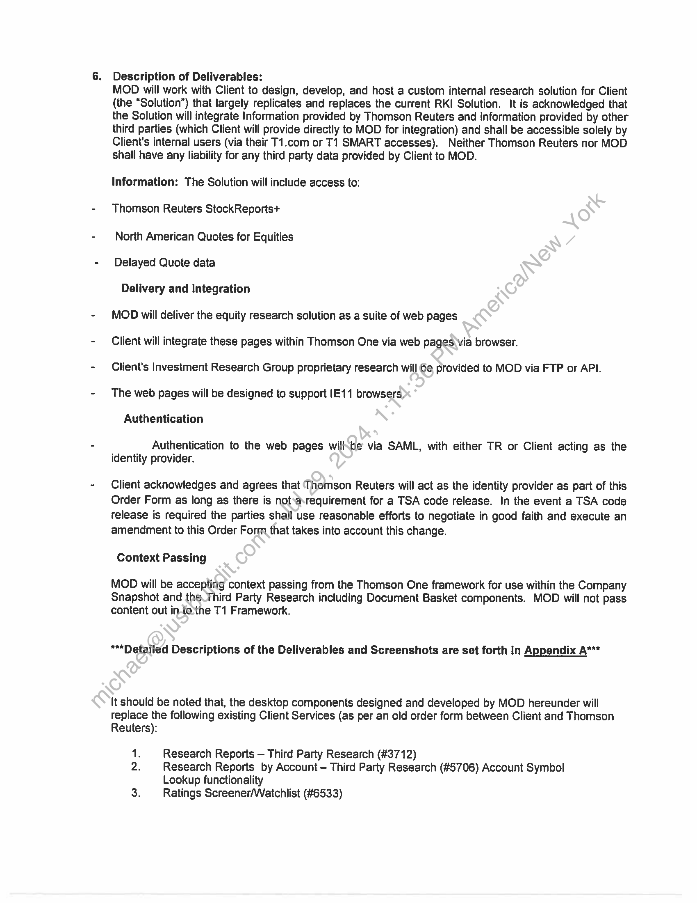
```  
```col-md
6. Description of Deliverables:
MOD will work with Client to design, develop, and host a custom internal research solution for Client
(the “Solution’) that largely replicates and replaces the current RKI Solution. It is acknowledged that
the Solution will integrate Information provided by Thomson Reuters and information provided by other
third parties (which Client will provide directly to MOD for integration) and shall be accessible solely by
Client's internal users (via their T1.com or T1 SMART accesses). Neither Thomson Reuters nor MOD
shall have any liability for any third party data provided by Client to MOD.  
Information: The Solution will include access to:  
- Thomson Reuters StockReports+
- North American Quotes for Equities
- Delayed Quote data  
Delivery and Integration
- MOO will deliver the equity research solution as a suite of web pages
- Client will integrate these pages within Thomson One via web pages. via browser.
- Client's Investment Research Group proprietary research will 6e provided to MOD via FTP or API.
- The web pages will be designed to support IE11 browsers,  
Authentication  
- Authentication to the web pages willsbe via SAML, with either TR or Client acting as the
identity provider.  
- Client acknowledges and agrees that Thomson Reuters will act as the identity provider as part of this
Order Form as long as there is nota.requirement for a TSA code release. In the event a TSA code
telease is required the parties shail use reasonable efforts to negotiate in good faith and execute an
amendment to this Order Form that takes into account this change.  
Context Passing  
MOD will be accepting context passing from the Thomson One framework for use within the Company
Snapshot and the Third Party Research including Document Basket components. MOD will not pass
content out in-tothe T1 Framework.  
***Detailed Descriptions of the Deliverables and Screenshots are set forth In Appendix A***  
It should be noted that, the desktop components designed and developed by MOD hereunder will
replace the following existing Client Services (as per an old order form between Client and Thomson
Reuters):  
1. Research Reports — Third Party Research (#3712)  
2. Research Reports by Account - Third Party Research (#5706) Account Symbol
Lookup functionality  
3. Ratings Screener/Watchlist (#6533)  
```
````
Notes:    
````col
```col-md
flexGrow=.5
===
> [!info] [Page 4](_attachments/images_Refinitiv-3.6.1.2.200207476.pdf_210248/page_4.png)
> 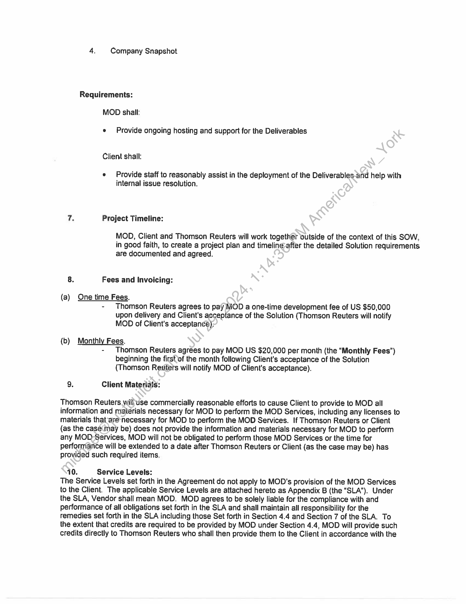
```  
```col-md
4, Company Snapshot  
Requirements:
MOD shall:  
e Provide ongoing hosting and support for the Deliverables  
Client shall:  
e Provide staff to reasonably assist in the deployment of the Deliverables-and help with
internal issue resolution.  
ite Project Timeline:  
MOD, Client and Thomson Reuters will work together outside of the context of this SOW,
in good faith, to create a project plan and timeline-after the detailed Solution requirements
are documented and agreed.  
8. Fees and Invoicing:  
(a) One time Fees.
- Thomson Reuters agrees to pay|MOD a one-time development fee of US $50,000
upon delivery and Client's acceptance of the Solution (Thomson Reuters will notify
MOD of Client's acceptance):  
(b) Monthly Fees.
- Thomson Reuters agrees to pay MOD US $20,000 per month (the “Monthly Fees”)
beginning the firsttof the month following Client’s acceptance of the Solution
(Thomson Reuters will notify MOD of Client's acceptance).  
9. Client Materials:  
Thomson Reuters wil) use commercially reasonable efforts to cause Client to provide to MOD all
information and materials necessary for MOD to perform the MOD Services, including any licenses to
materials that‘are necessary for MOD to perform the MOD Services. If Thomson Reuters or Client
(as the case(may be) does not provide the information and materials necessary for MOD to perform
any MOD-Services, MOD will not be obligated to perform those MOD Services or the time for
performance will be extended to a date after Thomson Reuters or Client (as the case may be) has
provided such required items.  
10. Service Levels:
The Service Levels set forth in the Agreement do not apply to MOD's provision of the MOD Services
to the Client. The applicable Service Levels are attached hereto as Appendix B (the “SLA”). Under
the SLA, Vendor shall mean MOD. MOD agrees to be solely liable for the compliance with and
performance of all obligations set forth in the SLA and shall maintain all responsibility for the
remedies set forth in the SLA including those Set forth in Section 4.4 and Section 7 of the SLA. To
the extent that credits are required to be provided by MOD under Section 4.4, MOD will provide such
credits directly to Thomson Reuters who shall then provide them to the Client in accordance with the  
```
````
Notes:    
````col
```col-md
flexGrow=.5
===
> [!info] [Page 5](_attachments/images_Refinitiv-3.6.1.2.200207476.pdf_210248/page_5.png)
> 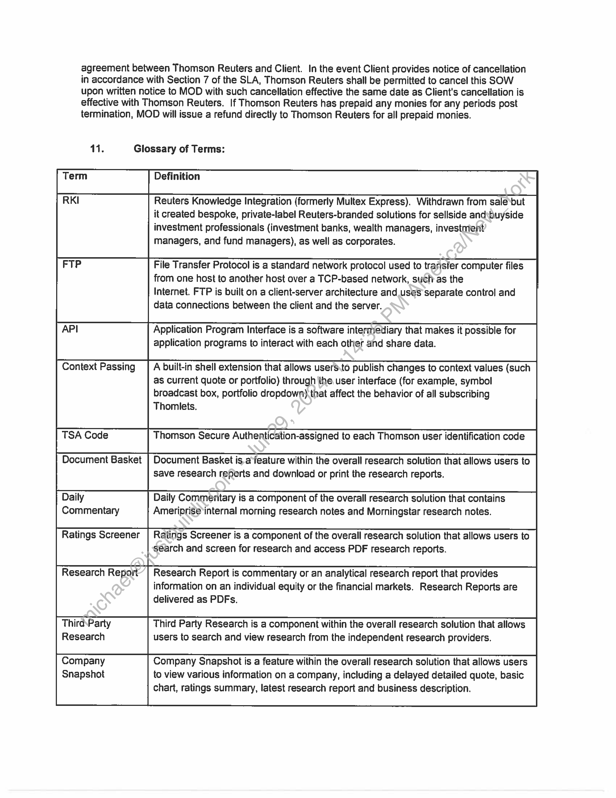
```  
```col-md
agreement between Thomson Reuters and Client. In the event Client provides notice of cancellation
in accordance with Section 7 of the SLA, Thomson Reuters shall be permitted to cancel this SOW
upon written notice to MOD with such cancellation effective the same date as Client's cancellation is
effective with Thomson Reuters. If Thomson Reuters has prepaid any monies for any periods post
termination, MOD will issue a refund directly to Thomson Reuters for all prepaid monies.  
11. Glossary of Terms:  
Definition  
Reuters Knowledge Integration (formerly Multex Express). Withdrawn from sale ‘but
it created bespoke, private-label Reuters-branded solutions for sellside and\buyside
investment professionals (investment banks, wealth managers, investment
managers, and fund managers), as well as corporates.  
File Transfer Protocol is a standard network protocol used to transfer computer files
from one host to another host over a TCP-based network, such as the  
Internet. FTP is built on a client-server architecture and uses separate control and
data connections between the client and the server.  
Application Program Interface is a software intermediary that makes it possible for
application programs to interact with each other and share data.  
Context Passing | A built-in shell extension that allows users.to publish changes to context values (such
as current quote or portfolio) through \the. user interface (for example, symbol
broadcast box, portfolio dropdown) that affect the behavior of all subscribing
Thomlets.  
TSA Code Thomson Secure Authentication-assigned to each Thomson user identification code  
Document Basket | Document Basket is.afeature within the overall research solution that allows users to
save research reports and download or print the research reports.  
Daily Daily Commentary is a component of the overall research solution that contains  
Commentary Ameriprise internal morning research notes and Morningstar research notes.  
Ratings Screener | Ratings Screener is a component of the overall research solution that allows users to
search and screen for research and access PDF research reports.  
Research Report’ | Research Report is commentary or an analytical research report that provides  
information on an individual equity or the financial markets. Research Reports are
delivered as PDFs.  
Thira\Party Third Party Research is a component within the overall research solution that allows
Research users to search and view research from the independent research providers.  
Company Company Snapshot is a feature within the overall research solution that allows users
Snapshot to view various information on a company, including a delayed detailed quote, basic
chart, ratings summary, latest research report and business description.  
```
````
Notes:    
````col
```col-md
flexGrow=.5
===
> [!info] [Page 6](_attachments/images_Refinitiv-3.6.1.2.200207476.pdf_210248/page_6.png)
> 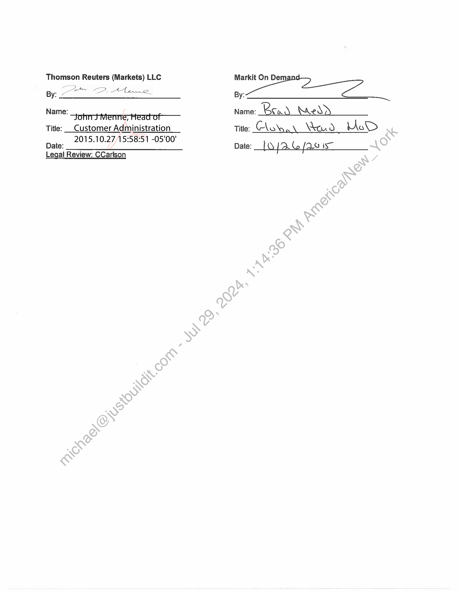
```  
```col-md
Thomson Reuters (Markets) LLC Markit On Dem:
—2 =) 5
By: << eee By:  
Name: ' ¢ Name: iWin 2s
Title: __ Customer Administration Title: Aoron\ Wnuwd MoD  
2015.10.27 15:58:51 -05'00'  
Date: Date: | ie} | Blo fae is”  
Legal Review: CCarlson  
```
````
Notes:    
````col
```col-md
flexGrow=.5
===
> [!info] [Page 7](_attachments/images_Refinitiv-3.6.1.2.200207476.pdf_210248/page_7.png)
> 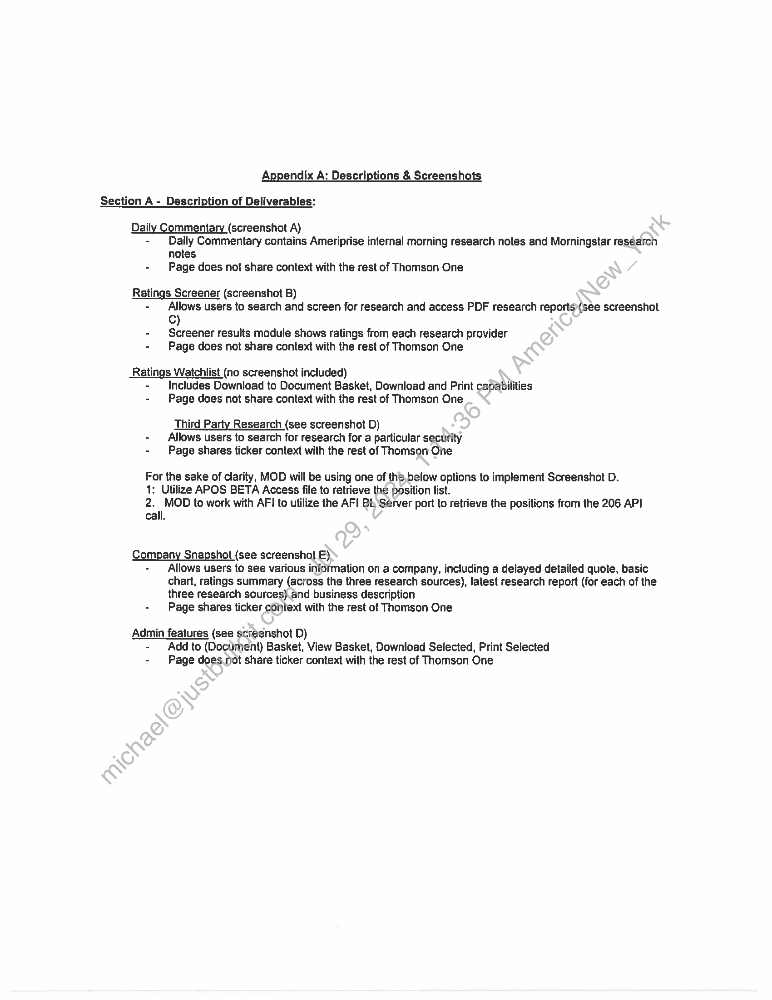
```  
```col-md
Appendix A: Descriptions & Screenshots
Section A - Description of Deliverables:  
Daily Commentary (screenshot A)
- Daily Commentary contains Ameriprise internal morning research notes and Morningstar research
notes
- Page does not share context with the rest of Thomson One  
Ratings Screener (screenshot B)
- Allows users to search and screen for research and access PDF research reports\(see screenshot
Cc)
- Screener results module shows ratings from each research provider
- Page does not share context with the rest of Thomson One  
Ratings Watchlist (no screenshot included)
- Includes Download to Document Basket, Download and Print capabilities
- Page does not share context with the rest of Thomson One  
Third Party Research (see screenshot D)
- Allows users to search for research for a particular security
- Page shares ticker context with the rest of Thomson One  
For the sake of clarity, MOD will be using one of ths,below options to implement Screenshot D.  
1: Utilize APOS BETA Access file to retrieve the position list.  
2. MOD to work with AFI to utilize the AFI Bi Server port to retrieve the positions from the 206 API
call.  
Company Snapshot (see screenshot E)  
- Allows users to see various information on a company, including a delayed detailed quote, basic
chart, ratings summary (across the three research sources), latest research report (for each of the
three research sources).and business description  
- Page shares ticker context with the rest of Thomson One  
Admin features (see screenshot D)
- Add to (Document) Basket, View Basket, Download Selected, Print Selected
- Page does.not share ticker context with the rest of Thomson One  
```
````
Notes:    
````col
```col-md
flexGrow=.5
===
> [!info] [Page 8](_attachments/images_Refinitiv-3.6.1.2.200207476.pdf_210248/page_8.png)
> 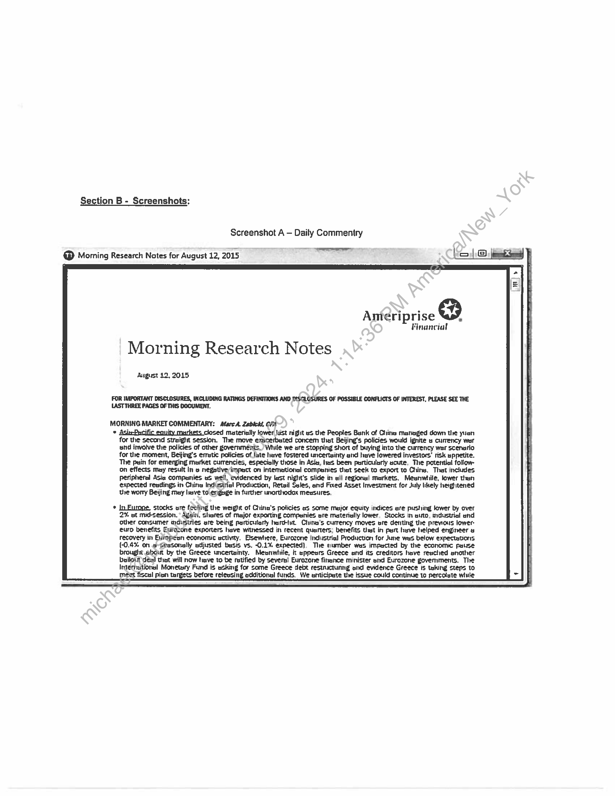
```  
```col-md
Section B - Screenshots:  
Screenshot A — Daily Commentry  
@ Morning Research Notes for August 12, 2015 {a Cel  
Ameriprise &@  
Financial
Morning Research Notes  
August 12, 2015  
FOR IMPORTANT DISCLOSURES, INCLUDING RATINGS DEFINITIONS AND INSCLOSURES OF POSSIBLE CONFLICTS OF INTEREST, PLEASE SEE THE
LAST THREE PAGES OF THES DOCUMENT.  
MORNING MIARKET COMMENTARY: AfarcA. Zabickl, CF  
© AsiePucific enuity markets closed materially lower lést night us the Peoples Bank of Chins managed down the yuan
for the second straight session. The move exicerbated concem that Beijing's policies would ignite u currency wer
end involve the policies of other governments.) Wile we ure stopping short of buying into the currency war scenario
for the moment, Beijing's erratic policies of late have fostered tmcertwinty and huve lowered investocs’ sk eppetite.
The pain for emerging murket currencies, especiully those in Asia, his been purticularly scute. The potential foltowOn effects may result in a negativerimpect on intemational compentes thet seek to export to Chins. That includes
Periphend Asie compunies us well, evidenced by ksst nigtt’s slide in ull regional markets. Meunwiile, lower than
expected readings in Chine Indistrial Production, Retail Sales, and Fixed Asset Investment for July likely hegitened
the worry Beijing muy lnsve to enguge in further unorthodox meusures.  
* In Europe, stocks ure feeling the weight of China's policies as some mayor equity indices are pushing lower by over
2% at mid-session. * Again, shares of major exporting companies ere maternally lower. Stocks in auto, indusvial and
other consumer mdustries ure being particulary hurctut. Ctunn’s currency moves ore denting the previous lower:
euro benefits Eurozone exporters huve witnessed in recent quarters; benefits Uwt in part huve helped engineer a
recovery in Euiopesn economic activity. Elsewhere, Eurozone Industrial Production for June was below expectutions
(0.4% on s-seesonally odjusted basis vs. 0.1% expected). The number wus impacted by the economic pause
browgtt shor by the Greece umcertuinty. Meunwhile, ik eppeors Greece and its creditors have reached enother
builotat déad thet will now lave to be ratified by severn! Eurozone finance minister snd Eurozone governments. The
International Monetery Fund is ashing for some Greece debt restructunng and evidence Greece is tubing steps to
Inset fiscul plon targets before releasing odditional funds. We unticipute the issue could continue to percotute whule  
```
````
Notes:    
````col
```col-md
flexGrow=.5
===
> [!info] [Page 9](_attachments/images_Refinitiv-3.6.1.2.200207476.pdf_210248/page_9.png)
> 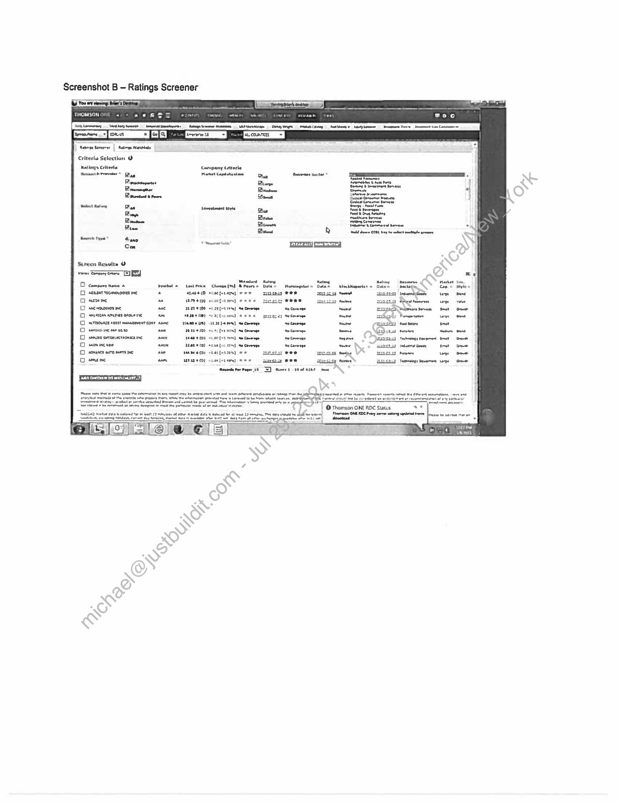
```  
```col-md
Screenshot B — Ratings Screener  
aeeret  
Resings Serverer | Ratios Watchbat.  
Criterks Selection @  
Ratings Ceiteria Company Uiterka
Aenaanh Provide” Rhy Market Cepdatuatmen  
Flveceapetes  
Brnemegeter  
Cendant 8 heart  
Fae  
Rises  
|  
Flew  
Sano
Con  
Screen Results U
Viens Sorpony Core TES)  
CD compens Nowe & Laat pre  
AGENT Tear DeTED De A2Ab4 UD eet fot ara]  
sac38 we WANS) confers] en ee  
AAG ORBUIE INE ETUPIDD we rata 786 Me Coverage  
snpatcan aseepen tage ve dere m9 se zebeanl ao ae  
sa THOUAEE 26081 cunadewant cote HANS LN) 10.29 [4.99] we cernge  
seeoec ee et 00.90 FAA 91D on 9) [54 208) ne Cena  
snore CoTORL ACTORS Ie A448 940) oe-m0 [53 my  
6.0m Wc 2aaneta) sous fo mS) se Cormnge  
dovaNeH Mara BATH De manse sear cate vee Patent)  
son 322 ¢¢2) won peerer oe)
ae rey  
qoaognogo0can  
Ade Cat ea w Te wea 7 aI  
‘looms nate Dot wome caves the baomaten by ane nepnrt mopy be eetendttert wows wn cece Stored emitters ore Then th ttmtraptraeerend enter pein Resee-r’ sonerty rettct 4 Chere mame, tt ba
sera trathae UF the ensiyt vine gropart Mom Whe to wtereten proved hoe = Levavad H4 ba rom abate peartss. Setrtfiartis Ge necera) Panis tt be fortetered os erairurt ed wrstoennenerwt al any beet  
meeting Mi teny wadind  pervhsn Grvudied One and wend be guatenined Teas Mlertrwon y Lamy Srerad wy a» Yamal ip (4 rege ee  
Novatel a ha eenemnaad pa She soared tr evese mee Porvwan Maat af oe Dobe! strainer @ Thomson ONE ADC Status  
Thekzang morte gate blared far at laet 23 mlevtnes of ether mecha its 9 dalrnd tr a nut 23 menane Ton os cnewte ne wy tee wiery Theron ONE RD Prany serves sieny watered Sarre losaste verted (Net
Sarhdares ay eorng Sandor fetant doveiond  
```
````
Notes:    
````col
```col-md
flexGrow=.5
===
> [!info] [Page 10](_attachments/images_Refinitiv-3.6.1.2.200207476.pdf_210248/page_10.png)
> 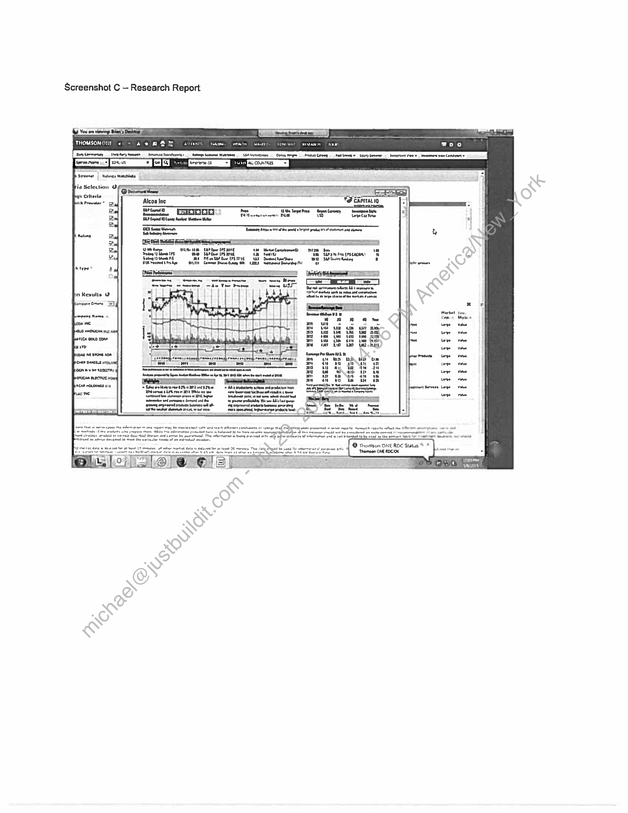
```  
```col-md
Screenshot C — Research Report  
WAT Muar (Ce wistaRce teu  
awe tunes Warton luctireicees Orie trp imeaiiveny _tectwoeny yy irene bmmvet Yee y Jmermen vee Consnen ©  
Alcoa Ine ¥@ ChettaLIO  
eee treet
mee ro qgeee Epes eee
Emo
TAP Capindl 11 Caney hactest Matte Mes  
pares Senay Atos 0 Os wnt wget protec ers ol Amana ond chee
Sch ateery hireomee  
Tre ees ia soe  
2M. Ce etitant 19 Mader Coreaironeld zm bom  
Faden 17 ame UPS A SP Ceoe 15 2K, 6 seater pm he scan?
et  
aden tha AE A Pow SB Bowe ULITM 21 Defend tare aay kang e
Ret hwsewd shade BL InD Eameon Stole Osemy BA LEI Merneed Demering i) a  
[na sans rr = 2
rey me | eee ete were eee Mews, a se |
evens ST  
Oarrat atenea orth Ad 6 pavers
| (Whats geek oat a eects
shaky er rps arta ma Fans,  
ee *
Seven abe ©
Ld na 8 te bers
un ieee Vibe
hed on
bs te ae
tet rd  
amt  
woke
Yoke  
a Gs md
7 #  
von
vee
ty ay
ade emus any cla 31 WE I whe ent wad wn  
ant CJ
CE a 8! ao
vHeacelht amet TeMbaitTie = Aki wudcwe umes monicusinn ei farnanahe coeur oe
Bae vervas 327% roa EU Pha Hae — od coe
totaeed om alan ree a 8 ape  
ea teeas  
smtorwtve tod serenney Eom sad fot PY
a  
wre areered predons beans wl i  
tout  
ts datarare temakovona 04 wuegs of eahedeon ste pegcemad a ine sar Retterh “pert rac hy AA menempnae es a
Js methane the wintrte whe frepeve om White tun ndrumatens foe hem m belaned fp he her ronste sowrengmgiedo pe hes atari sMdd wrt be (enmedered bn eat vectd ore prem d sora
caged phy tied tying enters haa to mages Soares  
```
````
Notes:    
````col
```col-md
flexGrow=.5
===
> [!info] [Page 11](_attachments/images_Refinitiv-3.6.1.2.200207476.pdf_210248/page_11.png)
> 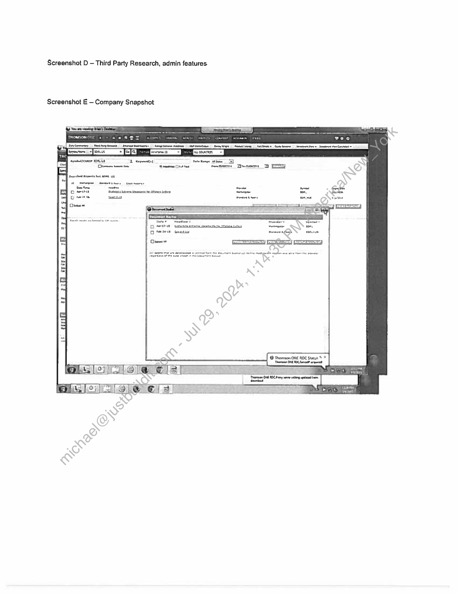
```  
```col-md
Screenshot D — Third Party Research, admin features.  
Screenshot E — Company Snapshot  
‘You are i  
THOMSONONE «> aw OT  
mun 257% | win Laity come) MuAeM | rene woo  
| Dncormenr Tint feytrnenh bev bates Ramet tones tabard EAP eraione fem Wwe | Reel nen fettven lay tener _ieawet ters brated tn Cenvert =
THe
Kyrebel/ CUSIP TORUS Leeper} DateRange dete “S)
(eemaany Rana ie meee O02 memo Trane CMY
Karrthed Kroes ton AOAL Ash  
AE Memepie  dterd timers teen eeoeray  
ae = or ret ef
on ee pe a peers ber fox
ates macs netene ES Net
Crest = Preiesenusci dl
Pa TR eee
—— cr
s amend
N=.
LY a cares ese
ep en eee eter Oe ta
~ epee rhea ett pennies
=
rm
=
C4
=
es  
as Sle ef 3 Saas E  
```
````
Notes:    
````col
```col-md
flexGrow=.5
===
> [!info] [Page 12](_attachments/images_Refinitiv-3.6.1.2.200207476.pdf_210248/page_12.png)
> 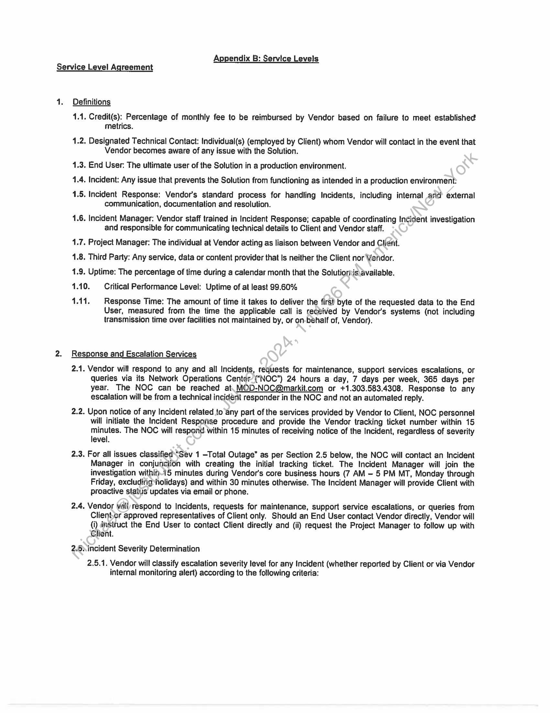
```  
```col-md
Appendix B: Service Levels  
Service Level Agreement  
1.  
Definitions  
1.1. Credit(s): Percentage of monthly fee to be reimbursed by Vendor based on failure to meet established
metrics.  
1.2, Designated Technical Contact: Individual(s) (employed by Client) whom Vendor will contact in the event that
Vendor becomes aware of any issue with the Solution.  
1.3. End User: The ultimate user of the Solution in a production environment.
1.4, Incident: Any issue that prevents the Solution from functioning as intended in a production environment:  
1.5. Incident Response: Vendor's standard process for handling Incidents, including intemal and extemal
communication, documentation and resolution.  
1.6. Incident Manager: Vendor staff trained in Incident Response; capable of coordinating Incident investigation
and responsible for communicating technical details to Client and Vendor staff.  
1.7. Project Manager: The individual at Vendor acting as liaison between Vendor and Client.
1.8. Third Party: Any service, data or content provider that Is neither the Client nor Vendor.
1.9. Uptime: The percentage of time during a calendar month that the Solutionis available.
1.10. Critical Performance Level: Uptime of at least 99.60%  
1.11. Response Time: The amount of time it takes to deliver the first byte of the requested data to the End
User, measured from the time the applicable call is received by Vendor's systems (not including
transmission time over facilities not maintained by, or on-behalf of, Vendor).  
Response and Escalation Services  
2.1. Vendor will respond fo any and all Incidents, requests for maintenance, support services escalations, or
queries via its Network Operations Center ("NOC") 24 hours a day, 7 days per week, 365 days per
year. The NOC can be reached at. MOD-NOC@markit.com or +1.303.583.4308. Response to any
escalation will be from a technical incident responder in the NOC and not an automated reply.  
2.2. Upon notice of any Incident related to any part of the services provided by Vendor to Client, NOC personnel
will initiate the Incident Response procedure and provide the Vendor tracking ticket number within 15
minutes. The NOC will respond. within 15 minutes of receiving notice of the Incident, regardless of severity
level.  
2.3. For all issues classified“Sev 1 —-Total Outage” as per Section 2.5 below, the NOC will contact an Incident
Manager in conjunction with creating the initial tracking ticket. The Incident Manager will join the
investigation within.i5 minutes during Vendor's core business hours (7 AM - 5 PM MT, Monday through
Friday, excludingholidays) and within 30 minutes otherwise. The Incident Manager will provide Client with
proactive status updates via email or phone.  
2.4. Vendor vall respond to Incidents, requests for maintenance, support service escalations, or queries from
Client,or approved representatives of Client only. Should an End User contact Vendor directly, Vendor will
(i) dnstruct the End User to contact Client directly and (ii) request the Project Manager to follow up with
Client.  
2.5. incident Severity Determination  
2.5.1. Vendor will classify escalation severity level for any Incident (whether reported by Client or via Vendor
internal monitoring alert) according to the following criteria:  
```
````
Notes:    
````col
```col-md
flexGrow=.5
===
> [!info] [Page 13](_attachments/images_Refinitiv-3.6.1.2.200207476.pdf_210248/page_13.png)
> 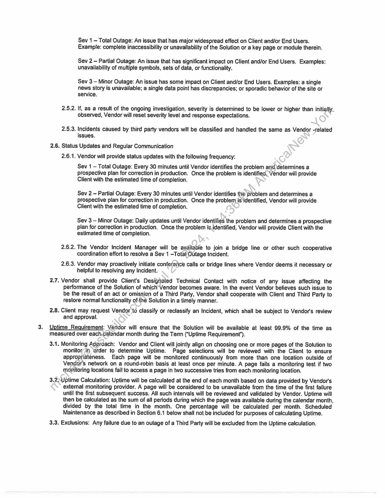
```  
```col-md
Sev 1 — Total Outage: An issue that has major widespread effect on Client and/or End Users.
Example: complete inaccessibility or unavailability of the Solution or a key page or module therein.  
Sev 2 — Partial Outage: An issue that has significant impact on Client and/or End Users. Examples:
unavailability of multiple symbols, sets of data, or functionality.  
Sev 3 — Minor Outage: An issue has some impact on Client and/or End Users. Examples: a single
news story is unavailable; a single data point has discrepancies; or sporadic behavior of the site or
service.  
2.5.2. If, as a result of the ongoing investigation, severity is determined to be lower or higher than initially.
observed, Vendor will reset severity level and response expectations.  
2.5.3. Incidents caused by third party vendors will be classified and handled the same as Vendor -related
issues.  
2.6. Status Updates and Regular Communication
2.6.1. Vendor will provide status updates with the following frequency:  
Sev 1 — Total Outage: Every 30 minutes until Vendor identifies the problem ard,determines a
prospective plan for correction in production. Once the problem is identified, Vendor will provide
Client with the estimated time of completion.  
Sev 2 — Partial Outage: Every 30 minutes until Vendor identifies the problem and determines a
prospective plan for correction in production. Once the problem is identified, Vendor will provide
Client with the estimated time of completion.  
Sev 3 — Minor Outage: Daily updates until Vendor identifies the problem and determines a prospective
plan for correction in production. Once the problem is identified, Vendor will provide Client with the
estimated time of completion.  
2.6.2. The Vendor Incident Manager will be available to join a bridge line or other such cooperative
coordination effort to resolve a Sev 1 -Total Outage Incident.  
2.6.3. Vendor may proactively initiate conference calls or bridge lines where Vendor deems it necessary or
helpful to resolving any Incident.  
2.7. Vendor shall provide Client's Designated Technical Contact with notice of any issue affecting the
performance of the Solution of which ‘Vendor becomes aware. In the event Vendor believes such issue to
be the result of an act or omission of a Third Party, Vendor shalt cooperate with Client and Third Party to
restore normal functionality ofthe Solution in a timely manner.  
2.8. Client may request Vendor ‘to classify or reclassify an Incident, which shall be subject to Vendor's review
and approval.  
Uptime Requirement: Vendor will ensure that the Solution will be available at least 99.9% of the time as
measured over each.calendar month during the Term (“Uptime Requirement’).  
3.1. Monitoring Approach: Vendor and Client will jointly align on choosing one or more pages of the Solution to
monitorin ‘order to determine Uptime. Page selections will be reviewed with the Client to ensure
appropriateness. Each page will be monitored continuously from more than one location outside of
Vendor's network on a round-robin basis at least once per minute. A page fails a monitoring test if two
monitoring locations fail to access a page in two successive tries from each monitoring location.  
3.2Uptime Calculation: Uptime will be calculated at the end of each month based on data provided by Vendor's
extemal monitoring provider. A page will be considered to be unavailable from the time of the first failure
until the first subsequent success. All such intervals will be reviewed and validated by Vendor. Uptime will
then be calculated as the sum of all periods during which the page was available during the calendar month,
divided by the total time in the month. One percentage will be calculated per month. Scheduled
Maintenance as described in Section 6.1 below shall not be included for purposes of calculating Uptime.  
3.3. Exclusions: Any failure due to an outage of a Third Party will be excluded from the Uptime calculation.  
```
````
Notes:    
````col
```col-md
flexGrow=.5
===
> [!info] [Page 14](_attachments/images_Refinitiv-3.6.1.2.200207476.pdf_210248/page_14.png)
> 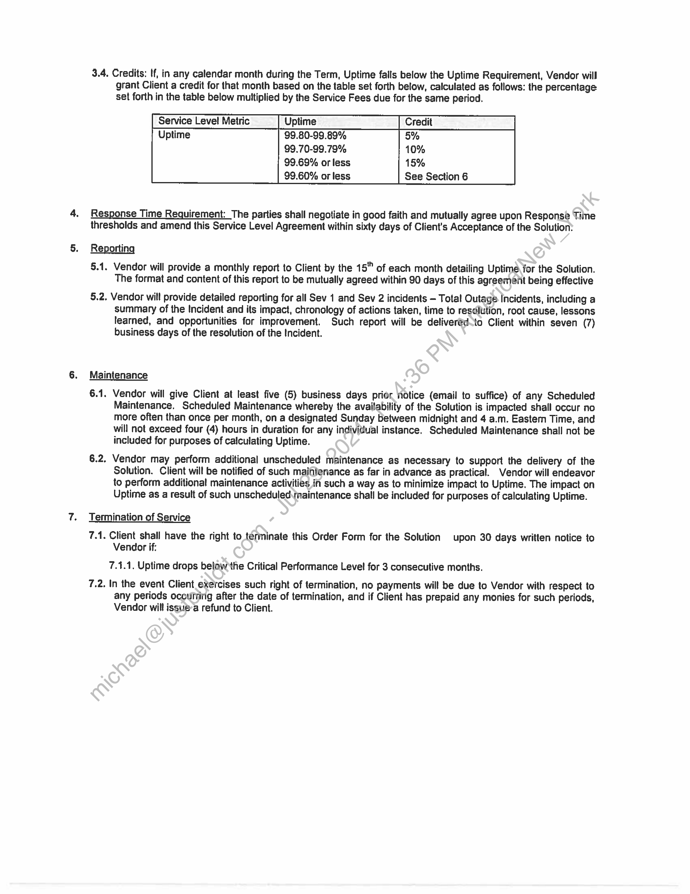
```  
```col-md
3.4. Credits: If, in any calendar month during the Term, Uptime falls below the Uptime Requirement, Vendor will
grant Client a credit for that month based on the table set forth below, calculated as follows: the percentage
set forth in the table below multiplied by the Service Fees due for the same period.  
Service Level Metric Uptime  
99.80-99.89% 5%
99.70-99.79% 10%
99.69% or less 15%
99.60% or less See Section 6  
4. Response Time Requirement: The parties shall negotiate in good faith and mutually agree upon Response Time
thresholds and amend this Service Level Agreement within sixty days of Client's Acceptance of the Solution:  
5. Reporting  
§.1. Vendor will provide a monthly report to Client by the 15" of each month detailing Uptime jor the Solution.
The format and content of this report to be mutually agreed within 90 days of this agreement being effective  
5.2. Vendor will provide detailed reporting for all Sev 1 and Sev 2 incidents - Total Outage Incidents, including a
summary of the Incident and its impact, chronology of actions taken, time to resdlution, root cause, lessons
learned, and opportunities for improvement. Such report will be deliver@d-to Client within seven (7)
business days of the resolution of the Incident.  
6, Maintenance  
6.1. Vendor will give Client at least five (5) business days prier Notice (email to suffice) of any Scheduled
Maintenance. Scheduled Maintenance whereby the availability of the Solution is impacted shall occur no
more often than once per month, on a designated Sunday between midnight and 4 a.m. Eastem Time, and
will not exceed four (4) hours in duration for any indivitiual instance. Scheduled Maintenance shall not be
included for purposes of calculating Uptime.  
6.2. Vendor may perform additional unscheduled maintenance as necessary to support the delivery of the
Solution. Client will be notified of such maihienance as far in advance as practical. Vendor will endeavor
to perform additional maintenance activities in such a way as to minimize impact to Uptime. The impact on
Uptime as a result of such unscheduled. maintenance shall be included for purposes of calculating Uptime.  
7. Termination of Service  
7.1. Client shall have the right to terminate this Order Form for the Solution upon 30 days written notice to
Vendor if:  
7.1.1, Uptime drops below the Critical Performance Level for 3 consecutive months.  
7.2. In the event Client exercises such right of termination, no payments will be due to Vendor with respect to
any periods occurring after the date of termination, and if Client has prepaid any monies for such periods,
Vendor will issue-a refund to Client.  
```
````
Notes:  


![[_attachments/Refinitiv-3.6.1.2.2 00207476.pdf]