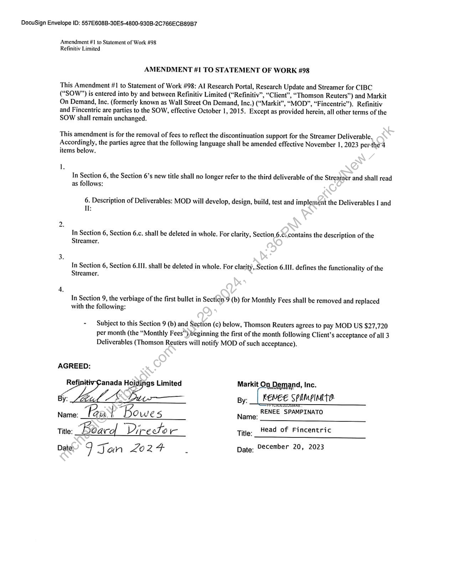

##### Amendment #1 to Statement of Work #98: Al Research Portal, Research Update and Streamer for CIBC]

  
````col
```col-md
flexGrow=.5
===
> [!info] [Page 1](_attachments/images_Refinitiv-3.6.1.2.300207483-a.pdf_212804/page_1.png)
> 
```  
```col-md
DocuSign Envelope ID: 557E608B-30E5-4800-930B-2C766ECB89B7  
Amendment #1 to Statement of Work #98
Refinitiv Limited  
AMENDMENT #1 TO STATEMENT OF WORK #98  
This Amendment #1 to Statement of Work #98: Al Research Portal, Research Update and Streamer for CIBC
(“SOW”) is entered into by and between Refinitiv Limited (“Refinitiv”, “Client”, “Thomson Reuters”) and Markit
On Demand, Inc. (formerly known as Wall Street On Demand, Inc.) (“Markit”, “MOD”, “Fincentric”). Refinitiv
and Fincentric are parties to the SOW, effective October 1, 2015. Except as provided herein, all other terms of the
SOW shall remain unchanged.  
This amendment is for the removal of fees to reflect the discontinuation support for the Streamer Deliverable.
Accordingly, the parties agree that the following language shall be amended effective November 1, 2023 per-the4
items below.  
1.
In Section 6, the Section 6’s new title shall no longer refer to the third deliverable of the Streamer and shall read
as follows:  
6. Description of Deliverables: MOD will develop, design, build, test and implement the Deliverables I and
Il:  
2.
In Section 6, Section 6.c. shall be deleted in whole. For clarity, Section 6.¢¢. contains the description of the
Streamer.
3s
In Section 6, Section 6.III. shall be deleted in whole. For clarity, Section 6.III. defines the functionality of the
Streamer.
4.
In Section 9, the verbiage of the first bullet in Secticn’9 (b) for Monthly Fees shall be removed and replaced
with the following:
- Subject to this Section 9 (b) and Section (c) below, Thomson Reuters agrees to pay MOD US $27,720
per month (the “Monthly Fees”), beginning the first of the month following Client’s acceptance of all 3
Deliverables (Thomson Reuters will notify MOD of such acceptance).
AGREED:
Refinitiv-Ganada Hoidings Limited Markit On, Demand, Inc.
bin CA py. _| REMEE SPAMPIMLTERENEE SPAMPINATO
Name: Paw | “Bo Wes Name:  
Title: Béacol “Director Title. ead of Fincentric  
Date: q Jan Z02 4 - Date: December 20, 2023  
```
````
Notes:  


![[_attachments/Refinitiv-3.6.1.2.3 00207483 - a.pdf]