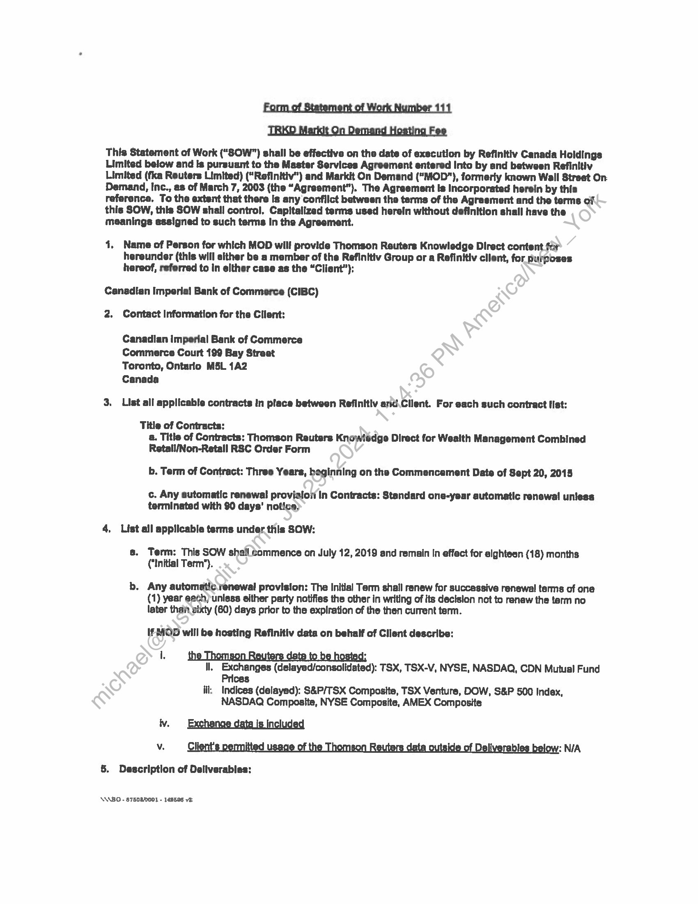
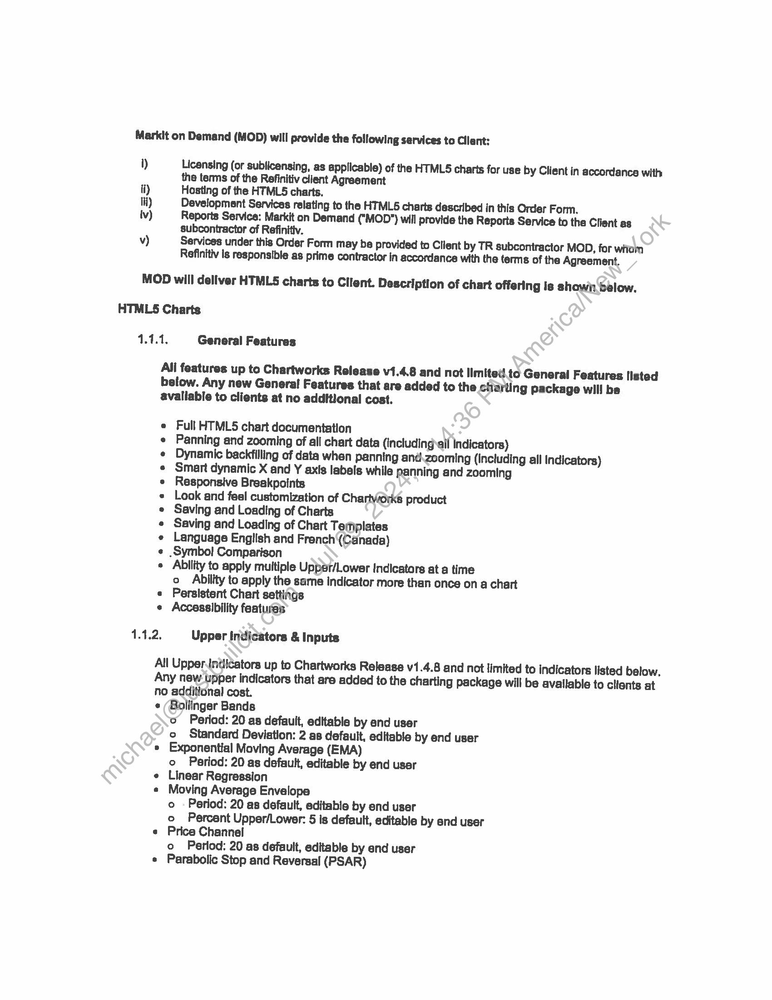
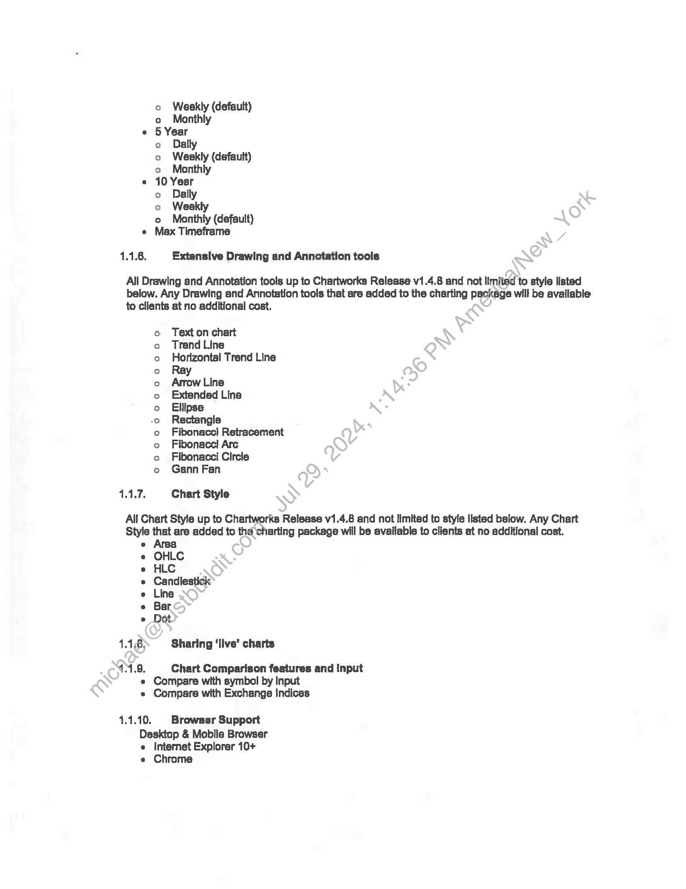
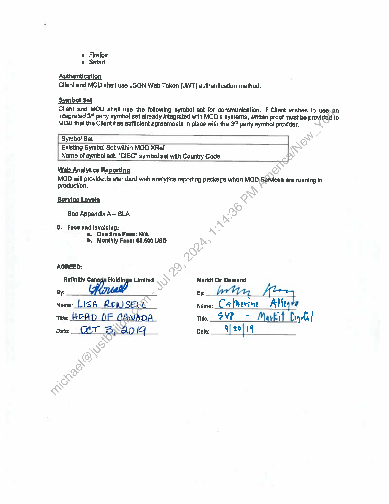

##### Statement of Work - IRKD Markit On Demand Hosting Fee for Canadian Imperial Bank of Commerce]

  
````col
```col-md
flexGrow=.5
===
> [!info] [Page 1](_attachments/images_Refinitiv-3.6.1.2.400207472.pdf_205945/page_1.png)
> 
```  
```col-md
Form of Statement of Work Number 111
IRKD Markit On Demand Hosting Fee  
This Statement of Work ("SOW") shall be effective on the date of execution by Refinitiv Canada Holdings
Limited below and Is pursuant to the Master Services Agreement entered Into by and between Refinitiv
Limited (fka Reuters Limited) (“Refinitiv”) and Markit On Demand ("MOD"), formerly known Wall Street On:
Demand, Inc., as of March 7, 2003 (the “Agreement"). The Agreement Is Incorporated herein by this
reference. To the extent that there Is any conflict between the terms of the Agreement and tho terms of
this SOW, this SOW shall control. Capitalized terms used herein without definition shall have the
meanings assigned to such terms In the Agreement.  
1. Name of Person for which MOD will provide Thomson Reuters Knowledge Direct content far
hereunder (this will either be a member of the Refinitiv Group or a Refinitly client, for purposes
hereof, referred to in elther case as the “Cliant’):  
Canadian Imperial Bank of Commerce (CIBC)
2. Contact Information for the Client:  
Canadian imperial Bank of Commerce
Commerce Court 199 Bay Streat
Toronto, Ontario MSL 1A2  
Canada  
bd  
List all applicable contracts in place between Refinitiv and.Client. For each such contract list:
Title of Contracts:
a. Title of Contracts: Thomson Reuters Knowledge Direct for Wealth Management Combined
Retall/Non-Retall RSC Order Form
b. Term of Contract: Three Years, beginning on the Commencement Date of Sept 20, 2015  
c. Any automatic renewal provisloii In Contracts: Standard one-year automatic renewal unless
terminated with 90 days’ notice)  
4, List all applicable terms under this SOW:  
8. Term: This SOW shall commence on July 12, 2019 and remain in effect for alghteen (18) months
(‘Initial Term’).  
b. Any automatle.renewal provision: The Initial Tarm shail renew for successive renewal terms of one
(1) year each) unless either party notifies the other in writing of its decision not to ranew the term no
later than gixty (60) days prior to the explration of the then current term.  
If MOD will be hosting Refinitiv data on behalf of Client describe:  
ne |homson Reuters date to be hoste
Il. Exchanges (delayed/consolidated): TSX, TSX-V, NYSE, NASDAQ, CDN Mutual Fund
ces  
Pri
ili; Indices (delayed): S&P/TSX Composite, TSX Venture, DOW, S&P 500 Index,
NASDAQ Composite, NYSE Composite, AMEX Composite  
5. Dascription of Dollverables:  
\AABO - 87508001 - 148598 vE  
```
````
Notes:    
````col
```col-md
flexGrow=.5
===
> [!info] [Page 2](_attachments/images_Refinitiv-3.6.1.2.400207472.pdf_205945/page_2.png)
> 
```  
```col-md
Markit on Demand (MOD) will provide the following services to Cllant:  
1) Licensing (or sublicansing, as @pplicable) of the HTMLS charts for use by Client in accordance with
the terms of the Refinitiv client Agreament  
ti) Hosting of the HTMLS5 charts.  
tii) Development Services relating to the HTMLS charts described in this Order Form.  
iv) Reports Service: Markit on Demand ("MOD") will provide the Reports Service to the Client es
subcontractor of Refinitiv.  
vy) Services under this Order Form may be provided to Client by TR subcontractor MOD, for wriain
Refinitiv is responsible as prime contractor in accordance with the terms of the Agreement.  
MOD will deliver HTMLS charts to Client. Description of chart offering is shown below.
HTMLS Charts  
1.1.1, General Features  
Ali features up to Chartworks Release v1.4.8 and not Imited.to General Features IIlsted
below. Any new General Features that are added to the charting package will be
avallable to clients at no additional cost.  
Full HTMLS chart documentation  
Panning and zooming of all chart data (including\ail Indicators)
Dynamic backfilling of data when panning and.zooming (including all Indicators)
Smart dynamic X and Y axis labels while panning and zooming
Responsive Breakpoints  
Look and feel customization of Charivrorks product  
Saving and Loading of Charts  
Saving and Loading of Chart Templates  
Language English and French (Canada)Symbol! Comparison  
Abliity to apply multiple Upper/Lower Indicators at a time  
2 Ability to apply the same indicator more than once on a chart
Persistent Chart settings  
Accessibility features  
eee ee eaeeneeen  
1.1.2. Upper indicators & Inputs  
All Uppertntlicators up to Chartworks Release v1.4.8 and not limited to indicators listed below.
Any new: upper indicators that are added to the charting package will be available to clients at
no additional cost.
¢ (Bollinger Bands
o Period: 20 as default, editable by and user
o Standard Deviation: 2 as default, editable by end user
e Exponential Moving Average (EMA)
o Period: 20 as default, editable by end usar
Linear Regression
Moving Average Envelope
o - Period: 20 as default, editable by end user
o Percent Upper/Lower: 5 is default, editable by end user
« Price Channel
o Period: 20 as default, editable by end user
« Parabolic Stop and Reversal (PSAR)  
```
````
Notes:    
````col
```col-md
flexGrow=.5
===
> [!info] [Page 3](_attachments/images_Refinitiv-3.6.1.2.400207472.pdf_205945/page_3.png)
> 
```  
```col-md
o Acceleration Increase: 0.02 as default, editable by end user
o Acceleration Maximum: 0.02 as default, editable by end user
e Simple Moving Average (SMA)
o Period: 20 as default, editable by end user
» Time Series Forecast
o Period: 20 as default, editable by end user
» Welghted Moving Average (WMA)
o Perlod: 20 as default, editable by end user  
1.1.3. Lower Indicators & Inputs  
All Lower Indicators up to Chartworks Release v1.4.8 and not limited to Indicators listad below.
Any new lower indicators that are added to the charting package will be available“ clients at
no additional cost.  
e Accumulation Distribution Line
« Average True Range
o Period: 14 as default, editable by end user
Chaikin's Volatility
o EMA Period: 10 as default, editable by end user
o Difference Period: 10 as default, editable by end uger
Dividend Yield
Directional Movement Index (DMI)
o Perlod: 14 as default, editable by end user
* Moving Average Convergence Divergence (MACD)
o Fast Points: 12 as default, editable by and user
o Slow Points: 26 as default, editable by'end user
o Smoothing: 9 as default, editable.by\end user
« Mass Index
o Period: 25 as default, editable)by end user
e Momentum
o Period: 20 as default, editable by end user
Money Flow
Money Flow Index (with Overbought/Oversold bands)
o Period: 14 as default, editable by and user
On Balance Volume
Price Rate of Change (PROC)
ce Period: 1428 default, editable by end user
Historical Dividend
Relative Strength index (RSI) (with Overbought/Oversald bands)
o Poftiod: 14 as default, editable by end user
e FasatStochastics
©) °K Period: 14 as default, editable by end user
eo D Perlod: 3 as default, editable by end user
* Slow Stochastics
o K Period: 14 as default, editable by end user
o D Period: 3 as default, editable by and user
e Ultimate Oscillator
o Period 1: 7 as default, editable by end user
Period 2: 14 as default, editable by end user
Period 3: 28 as default, editable by end user
Factor 1: 4 as default, editable by end usar
Factor 2: 2 as default, editable by end usar
Factor 3: 1 as default, editable by end user  
goooo0o9d9  
```
````
Notes:    
````col
```col-md
flexGrow=.5
===
> [!info] [Page 4](_attachments/images_Refinitiv-3.6.1.2.400207472.pdf_205945/page_4.png)
> 
```  
```col-md
e Volume (single color)
e Volume (positive/negative colored)
« Volume Rate of Change (VROC)
o Period: 10 as default, editable by end user
e Willams %R
o Penrod: 14 as default, editable by and user  
1.1.4, Events  
Events are displayed as markers on the chart and on rollover show additional information listed
befow. Any Events that are added to the charting package will be available to clients at no
additional cost.  
« Splits  
o Split Date  
o Ratio of split  
Dividends (based on ex-date)
o Dividend date  
o Dividend amount  
e Custom Events  
1.1.5. Chart Timeframes & Frequencies
e 1 Day  
oc 1minute  
o 3 minute (default)  
o & minute  
o 15 minute  
2  
o § minute (default)
o 15 minute
o ‘hour
e 1 Month
o Dally (default)
o Weskly
e 3Month  
°o  
o Dally (default)
Weekly  
6 Month  
fe]
o°
°  
Dally (default)
Weekly
Monthly  
Year to date  
°
o
°o  
Dally (default)
Weekly
Monthly  
1 Year  
°
o
a  
Daily (default)
Weekly
Monthly  
3 Year  
a  
Daily  
```
````
Notes:    
````col
```col-md
flexGrow=.5
===
> [!info] [Page 5](_attachments/images_Refinitiv-3.6.1.2.400207472.pdf_205945/page_5.png)
> 
```  
```col-md
o Weekly (defauit)
o Monthly
« 5 Year
o Dally
o Weekly (default)
o Monthly
e 10 Year
o Dally
° Weakly
o Monthly (default)
e Max Timeframe  
1.1.8. Extensive Drawing and Annotation tools  
All Drawing and Annotation tools up to Chartworks Release v1.4.8 and not limited to style listed
below. Any Drawing and Annotation tools that are added to the charting package will be available
to clients at no additional cost,  
Text on chart  
Trend Line
Horizontal Trend Line
Ray  
Arrow Line  
Extended Line
Ellipse  
Rectangle  
Fibonaccl Retracement
Fibonacel Arc
Fibonacci Circle
Gann Fan  
eo00000 00000  
1.1.7, Chart Style  
All Chart Style up to Chartworks Release v1.4.8 and not limited to style listed below. Any Chart
Style that are added to the charting package will be available to clients at no additional cost.
e Area
OHLC
HLC
Candlestick
Line
Bar.
Dot  
1.18) Sharing ‘live’ charts  
11.9. Chart Comparison features and Input
« Compare with symbol by Input
« Compare with Exchange Indices  
1.1.10. Browser Support
Desktop & Mobila Browser
e Internet Explorer 10+
« Chrome  
```
````
Notes:    
````col
```col-md
flexGrow=.5
===
> [!info] [Page 6](_attachments/images_Refinitiv-3.6.1.2.400207472.pdf_205945/page_6.png)
> 
```  
```col-md
e Firefox
e Safari  
Authentication
Client and MOD shail use JSON Web Token (JWT) authentication methad.  
Symbol Set  
Cllent and MOD shall use the following symbo! set for communication. If Client wishes to use\an
integrated 3” party symbol set already integrated with MOD’s systems, written proof must be provided to
MOD that the Cllent has sufficiant agreements In place with the 3% party symbol provider.  
Symbol Set  
Existing Symbol Set within MOD XRef
Name of symbol set: “CIBC” symbol set with Country Code  
Web Analytics Reporting
MOD will provide its standard web analytics reporting package when MOD, Services are running in
production.  
Service Levels
See Appendix A— SLA  
8. Fees and Invoicing:
a. One time Fees: N/A
b, Monthly Fees: $5,500 USD  
AGREED:  
Refinitiv Canagia Holdings Limited Markit On Demand
By: By: etry Mma,  
Name: LISA RowWSEee _ Name: Catherine Alley
THe: HEAD DF CANDA we: 2VP_- Markit Drgilaf
Data: Or 2} AdIG Date: 4] 20/19  
```
````
Notes:  


![[_attachments/Refinitiv-3.6.1.2.4 00207472.pdf]