##### Statement of Work Number 98: Research Portal, Research Update and Amer for CIBC]

  
````col
```col-md
flexGrow=.5
===
> [!info] [Page 1](_attachments/images_Refinitiv-3.6.1.2.500207483-b.pdf_212159/page_1.png)
> 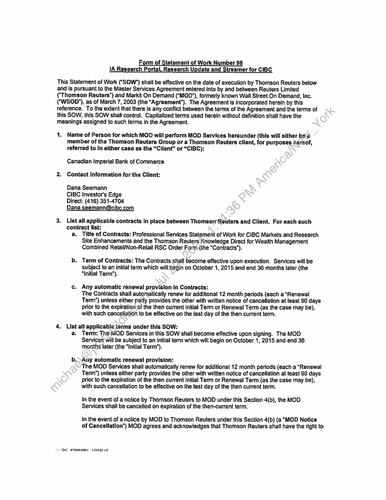
```  
```col-md
Eorm of Statement of Work Number 98
1A rch Portal, Research Update and amer for CIBC  
This Statement of Work ("SOW") shall be effective on the date of execution by Thomson Reuters below
and is pursuant to the Master Services Agreement entered into by and between Reuters Limited
(‘Thomson Reuters”) and Markit On Demand ("MOD"), formerly known Wall Street On Demand, Inc.
(‘WSOD"), as of March 7, 2003 (the “Agraement"). The Agreement is incorporated herein by this
reference. To the extent that there is any conflict between the terms of the Agreement and the terms of
this SOW, this SOW shall control. Capitalized terms used herein without definition shall have the
Meanings assigned to such terms in the Agreement.  
1. Name of Person for which MOD will perform MOD Services hereunder (this will either bea
member of the Thomson Reuters Group or a Thomson Reuters client, for purposes hereof,
referred to in either case as the “Client” or “CIBC):  
Canadian Imperial Bank of Commerce  
2. Contact information for the Client:  
Dana Seemann
CIBC Investor's Edge
Direct: (416) 351-4704  
Dana.seemann@cibc.com  
3. List all applicable contracts In place between Thomson’Reuters and Client. For each such
contract list:  
b  
Titte of Contracts: Professional Services Statement of Work for CIBC Markets and Research
Site Enhancements and the Thomson Reuters Knowledge Direct for Wealth Management
Combined Retail/Non-Retail RSC Order Formi{the “Contracts”).  
Term of Contracts: The Contracts shall become effective upon execution. Services will be
subject to an initial term which will(begin on October 1, 2015 and end 36 months later (the
“Initial Term”).  
Any automatic renewal provision in Contracts:  
The Contracts shall automatically renew for additional 12 month periods (each a “Renewal
Term”) unless either party provides the other with written notice of cancellation at least 90 days
Prior to the expiration}of the then current Initial Term or Renewal Term (as the case may be),
with such cancellation to be effective on the last day of the then current term.  
4. List all applicable terms under this SOW:  
Term: The MOD Services in this SOW shall become effective upon signing. The MOD
Services will be subject to an initiat term which will begin on October 1, 2015 and end 36
months later (the “Initial Term’).  
Avy automatic renewal provision:  
The MOD Services shall automatically renew for additional 12 month periods (each a “Renewal
Term”) unless either party provides the other with written notice of cancellation at teast 90 days
prior to the expiration of the then current Initial Term or Renewal Term (as the case may be),
with such cancellation to be effective on the last day of the then current term.  
In the event of a notice by Thomsen Reuters to MOD under this Section 4(b), the MOD
Services shall be cancelled on expiration of the then-current term.  
In the event of a notice by MOD to Thomson Reuters under this Section 4(b) (a "MOD Notice
of Cancellation”) MOD agrees and acknowledges that Thomson Reuters shall have the right to  
BO stsoen001 | 149596 vz  
```
````
Notes:    
````col
```col-md
flexGrow=.5
===
> [!info] [Page 2](_attachments/images_Refinitiv-3.6.1.2.500207483-b.pdf_212159/page_2.png)
> 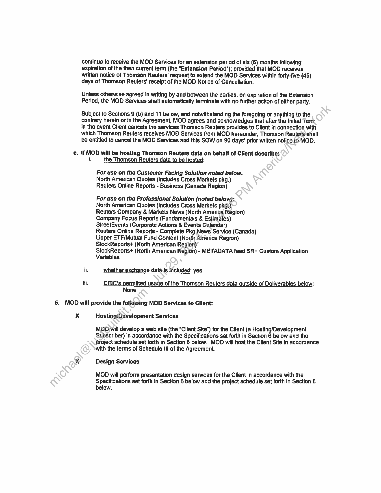
```  
```col-md
c  
continue to receive the MOD Services for an extension period of six (6) months following
expiration of the then current term (the “Extension Period"); provided that MOD receives
written notice of Thomson Reuters’ request to extend the MOD Services within forty-five (45)
days of Thomson Reuters’ receipt of the MOD Notice of Cancellation.  
Unless otherwise agreed in writing by and between the parties, on expiration of the Extension
Period, the MOD Services shall automatically terminate with no further action of either party.  
Subject to Sections 9 (b) and 11 below, and notwithstanding the foregoing or anything to the
contrary herein or in the Agreement, MOD agrees and acknowledges that after the Initial Terra
in the event Client cancels the services Thamson Reuters provides to Client in connection with
which Thomson Reuters receives MOD Services from MOD hereunder, Thomson Reutefs'shall
be entitled to cancel the MOD Services and this SOW on 90 days’ prior written notice. a, MOD.  
(f MOD will be hosting Thomson Reuters data on behalf of Client describe:
i. the Thomson Reuters data to be hosted:  
For use on the Customer Facing Solution noted below.
North American Quotes (includes Cross Markets pkg.)
Reuters Ontine Reports - Business (Canada Region)  
For use on the Professional Solution (noted below):  
North American Quotes (includes Cross Markets pkgi}  
Reuters Company & Markets News (North America Region)  
Company Focus Reports (Fundamentals & Estimates)  
StreetEvents (Corporate Actions & Events Calendar)  
Reuters Online Reports - Complete Pkg News Service (Canada)  
Lipper ETF/Mutual Fund Content (North America Region)  
StockReports+ (North American Region)  
StockReports+ (North American Region) - METADATA feed SR+ Custom Application
Variables  
ii. whether exchange datas included: yes  
tii. CIBC" ited usage of the Thomson Reuters data outside of Deliverables below:
None  
5. MOD will provide the foliowing MOD Services to Client:  
x  
Hosting/Oavelopment Services  
MD, will develop a web site (the “Client Site’) for the Client (a Hosting/Development
Subscriber) in accordance with the Specifications set forth in Section 6 below and the
project schedule set forth in Section 8 below. MOD will host the Client Site in accordance
with the terms of Schedule li! of the Agreement.  
Design Services
MOD will perform presentation design services for the Client in accordance with the  
Specifications set forth in Section 6 below and the project schedule set forth in Section 8
below,  
```
````
Notes:    
````col
```col-md
flexGrow=.5
===
> [!info] [Page 3](_attachments/images_Refinitiv-3.6.1.2.500207483-b.pdf_212159/page_3.png)
> 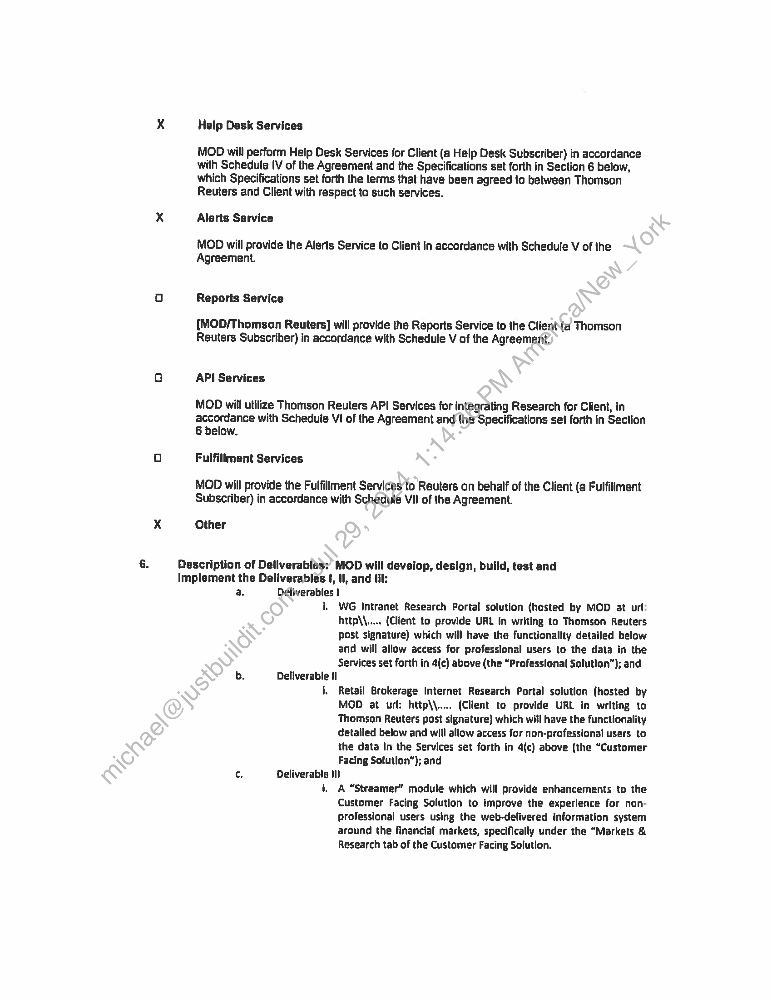
```  
```col-md
6.  
Help Desk Services  
MOD will perform Help Desk Services for Client (a Help Desk Subscriber) in accordance
with Schedule IV of the Agreement and the Specifications set forth in Section 6 below,
which Specifications set forth the terms that have been agreed to between Thomson
Reuters and Client with respect to such services.  
Alerts Service  
MOO will provide the Alerts Service to Client in accordance with Schedule V of the
Agreement.  
Reports Service  
(MOD/Thomson Reuters] will provide the Reports Service to the Client¥a Thomson
Reuters Subscriber) in accordance with Schedule V of the Agreement,  
API Services  
MOD will utilize Thomson Reuters API Services for integrating Research for Client, in
accordance with Schedule VI of the Agreement and tha Specifications set forth in Section
6 below.  
Fulfillment Services  
MOD will provide the Fulfillment Services to Reuters on behalf of the Client (a Fulfillment
Subscriber) in accordance with Schedule Vil of the Agreement.  
Other  
Description of Deliverables: MOD will devsiop, design, build, test and
Implement the Deliverables f, il, and lil:
a. Deliverables !
i, WG Intranet Research Portal solution (hosted by MOD at url:
http\\.   (Client to provide URL in writing to Thomson Reuters
Post signature) which will have the functionality detailed below
and will allow access for professional users to the data in the
Services set forth in 4(c) above (the “Professional Solution”); and
b. Deliverable I!
i, Retail Brokerage Internet Research Portal solution (hosted by
MOD at url: http\\.   (Client to provide URL in writing to
Thomson Reuters post signature) which will have the functionality
detailed below and will allow access for non-professional users to
the data In the Services set forth in 4(c) above (the “Customer
Facing Solutlan*); and
c. Deliverable Ill
i, A “Streamer” module which will provide enhancements to the
Customer Facing Solution to improve the experience for nonProfessional users using the web-delivered information system
around the financial markets, specifically under the “Markets &
Research tab of the Customer Facing Solution.  
```
````
Notes:    
````col
```col-md
flexGrow=.5
===
> [!info] [Page 4](_attachments/images_Refinitiv-3.6.1.2.500207483-b.pdf_212159/page_4.png)
> 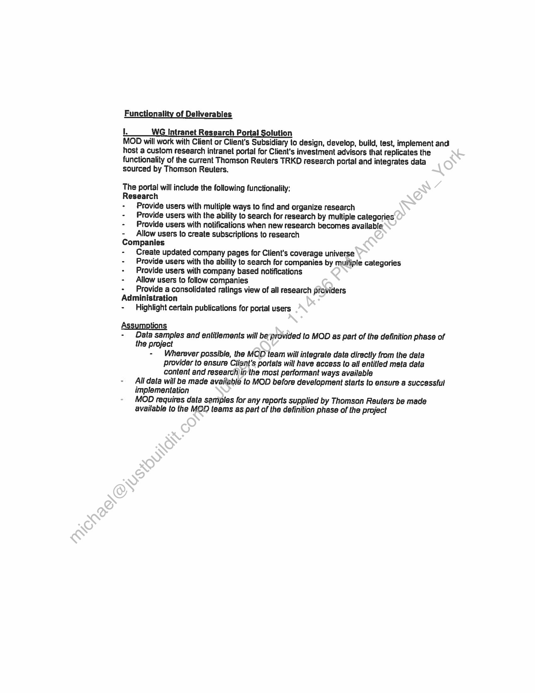
```  
```col-md
Functionality of Deliverables
5 WG Intranet Research Portal Solution  
MOD will work with Client or Client's Subsidiary to design, develop, build, test, implement and
host a custom research intranet portal for Client’s investment advisors that replicates the
functionality of the current Thomson Reuters TRKD research portal and integrates data
sourced by Thomson Reuters.  
The portal will include the following functionality:  
Research  
+ Provide users with multiple ways to find and organize research  
- Provide users with the ability to search for research by multiple categories
- Provide users with notifications when new research becomes available  
- Allow users to create subscriptions to research  
Companies  
- Create updated company pages for Client's coverage universe  
- Provide users with the ability to search for companies by multiple categories
+ Provide users with company based notifications  
- _ Allow users to follow companies  
+ _ Provide a consolidated ratings view of all research providers
Administration  
> Highlight certain publications for portal users  
Assumptions
- Data samples and entitlements will be provided to MOD as part of the definition phase of
the project
- Wherever possible, the MOD team willl integrate data directly from the data
Provider to ensure Cligat's portals will have access (o ail entitled meta data
content and research inthe most performant ways available
All data will be made available to MOD before development starts to ensure a successful
implementation
MOD requires data samples for any reports supplied by Thomson Reuters be made
available to the MOD teams as part of the definition phase of the project  
```
````
Notes:    
````col
```col-md
flexGrow=.5
===
> [!info] [Page 5](_attachments/images_Refinitiv-3.6.1.2.500207483-b.pdf_212159/page_5.png)
> 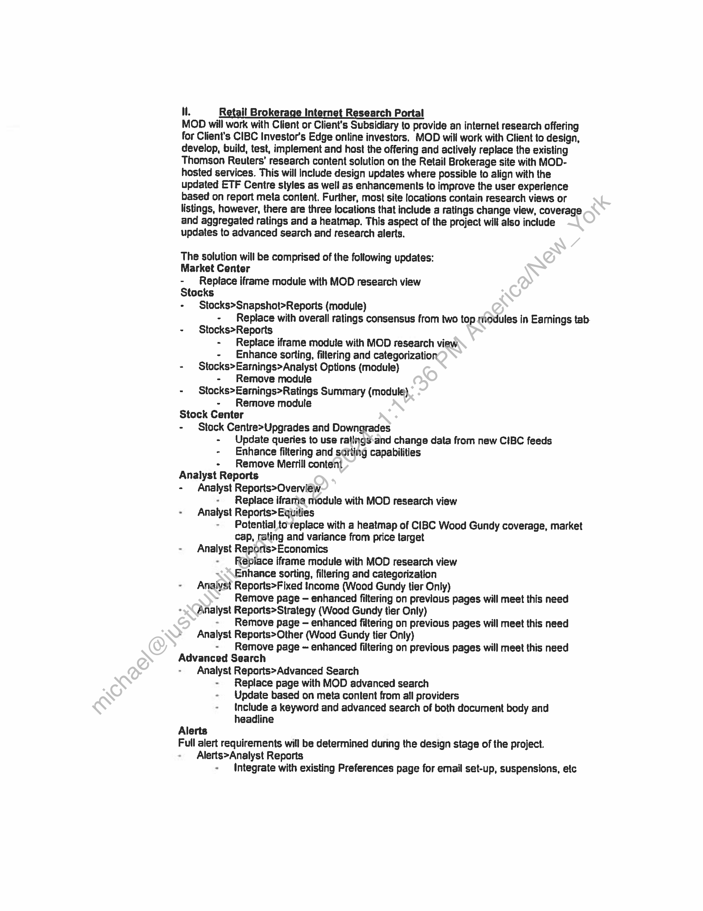
```  
```col-md
i. Retail Brokerage Internet Research Portal  
MOD will work with Client or Client's Subsidiary to provide an internet research offering
for Client's CIBC Investor's Edge online investors. MOD will work with Client to design,
develop, build, test, implement and host the offering and actively replace the existing
Thomson Reuters’ research content solution on the Retail Brokerage site with MODhosted services. This will Include design updates where possible to align with the
updated ETF Centre styles as well as enhancements to improve the user experience
based on report meta content. Further, most site locations contain research views or
listings, however, there are three locations that include a ratings change view, coverage
and aggregated ratings and a heatmap. This aspect of the project will also include
updates to advanced search and research alerts.  
The solution will be comprised of the following updates:
Market Center
- Replace iframe module with MOD research view
Stocks
+ Stocks>Snapshot>Reports (module)
- Replace with overall ratings consensus from two top modules in Eamings tab- Stocks>Reports
- Replace iframe module with MOD research view
- Enhance sorting, filtering and categorization
- Stocks>Earnings> Analyst Options (module)
- Remove module
- Stocks>Earnings>Ratings Summary (module)
- Remove module
Stock Center
- Stock Centre>Upgrades and Downgrades
- Update queries to use ratings:and change data from new CIBC feeds
- Enhance filtering and sorting capabilities
+ Remove Merrill content
Analyst Reports
- Analyst Reports>Overview
Replace iframa module with MOD research view
Analyst Reporis> Equities
Potential toveplace with a heatmap of CIBC Wood Gundy coverage, market
cap, rating and variance from price target
Analyst Reports>Economics
Repiace iframe module with MOD research view
Enhance sorting, filtering and categorization
Analyst Reports>Fixed tncome (Wood Gundy tier Only)
Remove page — enhanced filtering on previous pages will meet this need
Analyst Reports>Strategy (Wood Gundy tier Only)
- Remove page — enhanced filtering on previous pages will meet this need
Analyst Reports>Other (Wood Gundy tier Only)
- Remove page ~ enhanced filtering on previous pages will meet this need
Advanced Search
Analyst Reports>Advanced Search
- Replace page with MOD advanced search
- Update based on meta content from all providers
(nctude a keyword and advanced search of both document body and
headline
Alerts
Full alert requirements will be determined during the design stage of the project.
Alerts>Analyst Reports
- Integrate with existing Preferences page for email set-up, suspensions, etc  
```
````
Notes:    
````col
```col-md
flexGrow=.5
===
> [!info] [Page 6](_attachments/images_Refinitiv-3.6.1.2.500207483-b.pdf_212159/page_6.png)
> 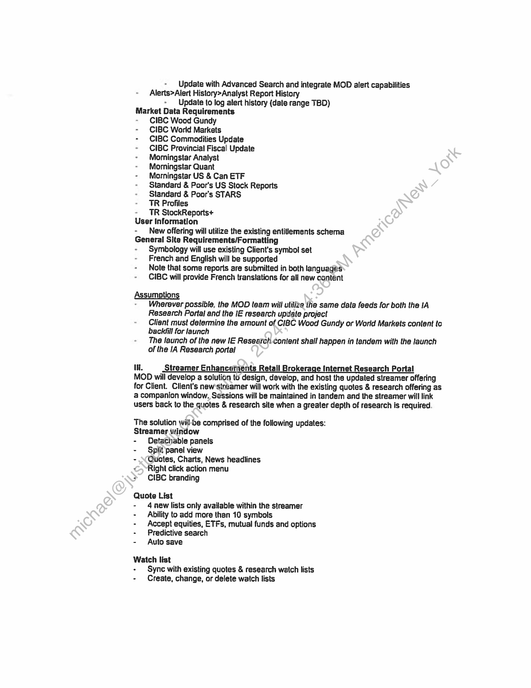
```  
```col-md
- Update with Advanced Search and integrate MOD alert capabilities
Alerts>Alert History>Analyst Report History
Update to log alert history (date range TBD)
market Data Requirements
CIBC Wood Gundy
- CIBC World Markets
- CIBC Commodities Update
- CIBC Provincial Fiscal Update
- Morningstar Analyst
- Morningstar Quant
- Morningstar US & Can ETF
- Standard & Poor's US Stock Reports
Standard & Poor's STARS
TR Profiles
TR StockReports+
User Information
- New offering will utilize the existing entitements schema
General Site Requirements/Formatting
-  Symbology will use existing Client's symbol set
French and English will be supported
- Note that some reports are submitted in both languages
CIBC will provide French translations for all new content  
Assumptions  
- Wherever possible, the MOD team will ulilize the same data feeds for both the 1A
Research Portal and the IE research update project
Client must determine the amount of CIBC Wood Gundy or World Markets content to
backdill for launch
The launch of the new IE Research content shall happen in tandem with the launch
of the IA Research portal  
Wl. Streamer Enhancements Retail Brokerage internet Research Portal  
MOD will develop a solution to design, develop, and host the updated streamer offering
for Client. Client's new streamer will work with the existing quotes & research offering as
a companion window, Sessions will be maintained in tandem and the streamer will link
users back to the quotes & research site when a greater depth of research is required  
The solution will-be comprised of the following updates:
Streamer window  
- Detachable panels  
-  Split/panel view  
- (Quotes, Charts, News headlines  
<> Right click action menu  
> CIBC branding  
Sucte List
4 new lists only available within the streamer
- Ability to add more than 10 symbols
- Accept equities, ETFs, mutual funds and options
- Predictive search
- Auto save  
Watch list
- Sync with existing quotes & research watch lists
- Create, change, or delete watch lists  
```
````
Notes:    
````col
```col-md
flexGrow=.5
===
> [!info] [Page 7](_attachments/images_Refinitiv-3.6.1.2.500207483-b.pdf_212159/page_7.png)
> 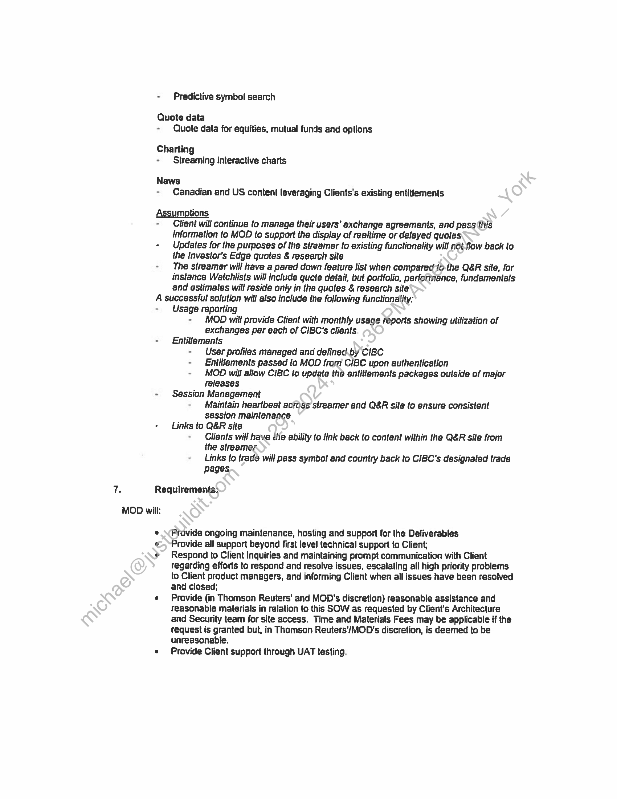
```  
```col-md
Predictive symbol search  
Quote data  
Quote data for equities, mutual funds and options  
Charting  
Streaming interactive charts  
News  
Canadian and US content leveraging Clients's existing entitlements  
tions
Client will continue to manage their users' exchange agreements, and pass this
information to MOD to support the display of realtime or delayed quotes
Updates for the purposes of the streamer to existing functionality will not flow back to
the Investor's Edge quotes & research site
The streamer will have a pared down feature list when comparedto-the Q&R site, for
instance Watchlists will include quote detail, but portfolio, performance, fundamentals
and estimates will reside only in the quotes & research site  
A successful solution will also include the following functionality:  
Usage reporting
MOD will provide Client with monthly usage reports showing utilization of
exchanges per each of CIBC's clients  
Entitlements
User profiles managed and defined.by CIBC
Entitlements passed to MOD from Ci8C upon authentication
MOD will allow CIBC to update the entitlements packages outside of major
releases  
Session Management
Maintain heartbeat across streamer and Q&R site to ensure consistent
session maintenance  
Links to Q&R site
Clients will have ile ability to link back to content within the Q&R site from
the streamer.
Links to trade will pass symbol! and country back to CIBC's designated trade
pages  
7. Requirements:  
MOD will:  
Provide ongoing maintenance, hosting and support for the Deliverables  
Provide all support beyond first level technical support to Client;  
Respond to Client inquiries and maintaining prompt communication with Client
regarding efforts to respond and resolve issues, escalating all high priority problems
to Client product managers, and informing Client when all issues have been resolved
and closed;  
Provide (in Thomson Reuters' and MOD's discretion) reasonable assistance and
reasonable materials in relation to this SOW as requested by Client's Architecture
and Security team for site access. Time and Materials Fees may be applicable if the
request is granted but, in Thomson Reuters'/MOD's discretion, is deemed to be
unreasonable.  
Provide Client support through UAT testing.  
```
````
Notes:    
````col
```col-md
flexGrow=.5
===
> [!info] [Page 8](_attachments/images_Refinitiv-3.6.1.2.500207483-b.pdf_212159/page_8.png)
> 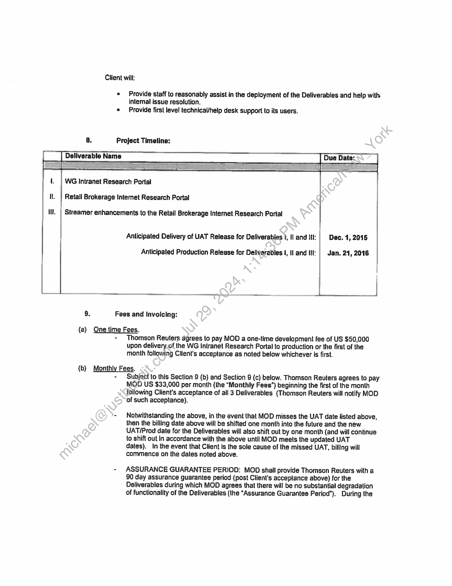
```  
```col-md
Client will:  
* Provide staff to reasonably assist in the deployment of the Deliverables and help with
internal issue resolution.
e Provide first level technical/help desk support to its users.  
8. Project Timeline:
Deliverable Name
[- 2 So ie ee ae Se ee  
WG Intranet Research Portal  
Due Date:  
Retail Brokerage Internet Research Portal  
It. | Streamer enhancements to the Retail Brokerage Internet Research Portal  
Anticipated Delivery of UAT Release for Deliverabias I, II and It: Dec. 4, 2015  
Anticipated Production Release for Deliverables |, II and Ill:  
dan. 21, 2016  
9. Fees and Invoicing:  
(a) One time Fees.
- Thomson Reuters agrees to pay MOD a one-time development fee of US $50,000
upon delivery of the WG Intranet Research Portal to production or the first of the
month following Client's acceptance as noted below whichever is first.  
(b) nihly Fees.
- Subject to this Section 9 (b) and Section 9 (c) below, Thomson Reuters agrees to pay
MOD US $33,000 per month (the “Monthly Fees”) beginning the first of the month
following Client's acceptance of ail 3 Deliverables (Thomson Reuters will notify MOD
of such acceptance).  
- Notwithstanding the above, in the event that MOD misses the UAT date listed above,
then the billing date above will be shifted one month into the future and the new
UAT/Prod date for the Deliverables will also shift out by one month (and will continue
to shift out in accordance with the above until MOD meets the updated UAT
dates). In the event that Client is the sole cause of the missed UAT, billing will
commence on the dates noted above.  
- ASSURANCE GUARANTEE PERIOD: MOD shall provide Thomson Reuters with a
90 day assurance guarantee period (post Client's acceptance above) for the
Deliverables during which MOD agrees that there will be no substantial degradation
of functionality of the Deliverables (the "Assurance Guarantee Period”). During the  
```
````
Notes:    
````col
```col-md
flexGrow=.5
===
> [!info] [Page 9](_attachments/images_Refinitiv-3.6.1.2.500207483-b.pdf_212159/page_9.png)
> 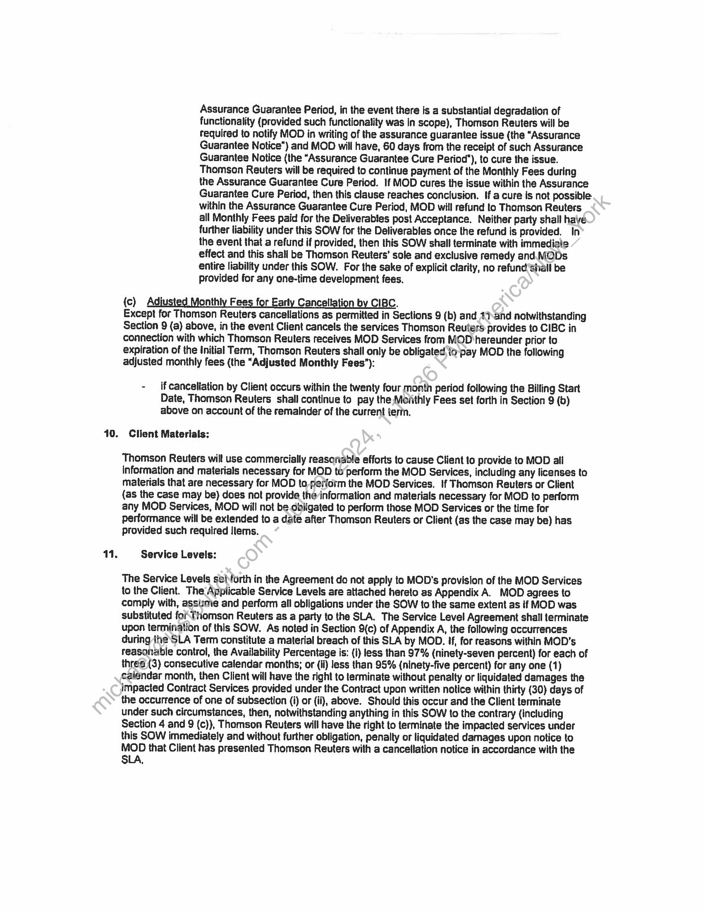
```  
```col-md
10.  
11,  
Assurance Guarantee Period, in the event there Is a substantial degradation of
functionality (provided such functionality was in scope), Thomson Reuters will be
required to notify MOD in writing of the assurance guarantee issue (the “Assurance
Guarantee Notice") and MOO will have, 60 days from the receipt of such Assurance
Guarantee Notice (the “Assurance Guarantee Cure Period’), to cure the issue.
Thomson Reuters will be required to continue payment of the Monthly Fees during
the Assurance Guarantee Cure Period. If MOD cures the issue within the Assurance
Guarantee Cure Period, then this clause reaches conclusion. If a cure is not possible
within the Assurance Guarantee Cure Period, MOD will refund to Thomson Reuters
all Monthly Fees paid for the Deliverables post Acceptance. Neither party shall have
further liability under this SOW for the Deliverables once the refund is provided. In
the event that a refund if provided, then this SOW shall terminate with immediate
effect and this shall be Thomson Reuters’ sole and exclusive remedy and MODs
entire liability under this SOW. For the sake of explicit clarity, no refund Shall be
Provided for any one-time development fees.  
{c) Adju: lonthly Fees for Early Cancellati CIBC.  
Except for Thomson Reuters cancellations as permitted in Sections 9 (b) and 47-and notwithstanding
Section 9 (a) above, in the event Client cancels the services Thomson Reuters provides to CIBC in
connection with which Thomson Reuters receives MOD Services from MOD hereunder prior to
expiration of the initial Term, Thomson Reuters shall only be obligated to pay MOD the following
adjusted monthly fees (the “Adjusted Monthly Fees”):  
- _ if cancellation by Client occurs within the twenty four month period following the Billing Start
Date, Thomson Reuters shall continue to pay the Moiithly Fees set forth in Section 9 (b)
above on account of the remainder of the current term.  
Client Materials:  
Thomson Reuters will use commercially reasonable efforts to cause Client to provide to MOD all
information and materials necessary for MOD to’perform the MOD Services, including any licenses to
materials that are necessary for MOD ta pefiorm the MOD Services. If Thomson Reuters or Client
(as the case may be) does not provide the information and materials necessary for MOD to perform
any MOD Services, MOD will not be obligated to perform those MOD Services or the time for
performance will be extended to a date after Thomson Reuters or Client (as the case may be) has
provided such required Items.  
Service Levels:  
The Service Levels selforth in the Agreement do not apply to MOD’s provision of the MOD Services
to the Client. The Applicable Service Levels are attached hereto as Appendix A. MOD agrees to
comply with, assume and perform all obligations under the SOW to the same extent as if MOD was
substituted for Thomson Reuters as a party to the SLA. The Service Level Agreement shall terminate
upon termination of this SOW. As noted in Section 9(c) of Appendix A, the following occurrences
during ihe SLA Term constitute a material breach of this SLA by MOD. if, for reasons within MOD's
reasonable control, the Availability Percentage is: (i) less than 97% (ninety-seven percent) for each of
thre (3) consecutive calendar months; or (ii) less than 95% (ninety-five percent) for any one (1)
calendar month, then Client will have the right to terminate without penalty or liquidated damages the
impacted Contract Services provided under the Contract upon written notice within thirty (30) days of
the occurrence of one of subsection (i) or (ii), above. Should this occur and the Client terminate
under such circumstances, then, notwithstanding anything in this SOW to the contrary (including
Section 4 and 9 (c)), Thomson Reuters will have the right to terminate the impacted services under
this SOW immediately and without further obligation, penalty or liquidated damages upon notice to
MOD that Client has presented Thomsen Reuters with a cancellation notice in accordance with the
LA,  
```
````
Notes:    
````col
```col-md
flexGrow=.5
===
> [!info] [Page 10](_attachments/images_Refinitiv-3.6.1.2.500207483-b.pdf_212159/page_10.png)
> 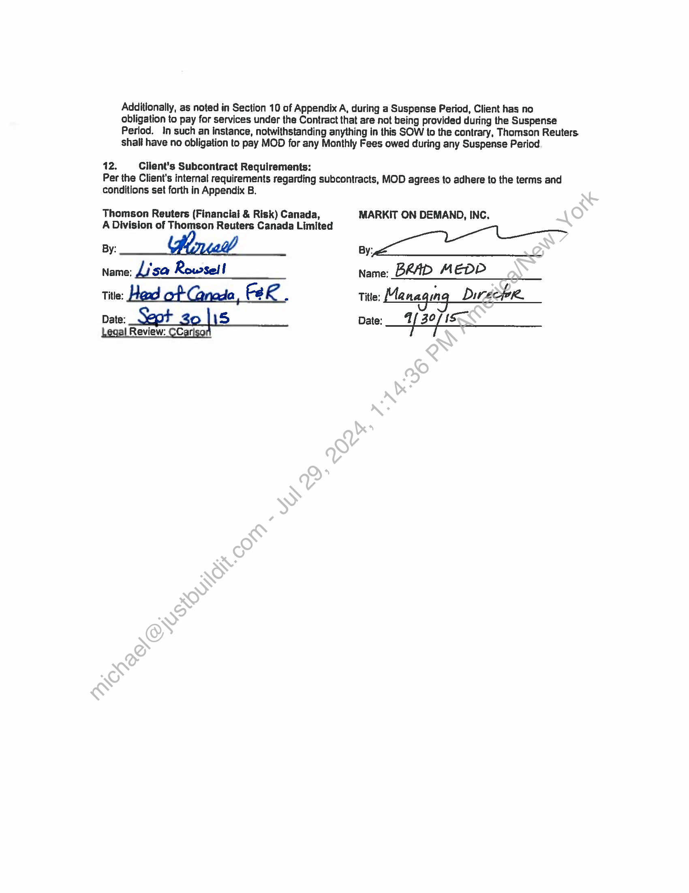
```  
```col-md
Additionally, as noted in Section 10 of Appendix A, during a Suspense Period, Client has no
obligation to pay for services under the Contract that are not being provided during the Suspense
Period. In such an instance, notwithstanding anything in this SOW to the contrary, Thomson Reuters.
shall have no obligation to pay MOD for any Monthly Fees owed during any Suspense Period  
12. Client's Subcontract Requirements:  
Per the Client's internal requirements regarding subcontracts, MOD agrees to adhere to the terms and  
conditions set forth in Appendix B.  
Thomson Reuters (Financial & Risk) Canada, MARKIT ON DEMAND, INC.  
A Division of Thomson Reuters Canada Limited
By: Hniat By =  
Name: Lisa Rowsel U Name: BRAD MEDP
Title: Had of Ganada, F8R . Title: Managing Dircehr.  
Date: 5 Date: 4 30/ sm
Review: Cari  
```
````
Notes:    
````col
```col-md
flexGrow=.5
===
> [!info] [Page 11](_attachments/images_Refinitiv-3.6.1.2.500207483-b.pdf_212159/page_11.png)
> 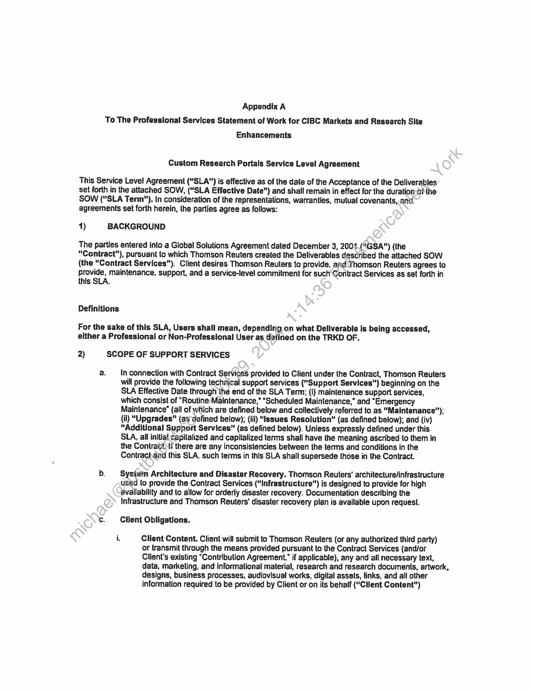
```  
```col-md
Appendix A
To The Professional Services Statement of Work for CIBC Markets and Research Site
Enhancements  
Custom Research Portals Service Level Agreement  
This Service Level Agreement ("SLA") is effective as of the date of the Acceptance of the Deliverables
set forth in the attached SOW, (SLA Effective Date”) and shall remain in effect for the duration-d! the
SOW (“SLA Term”). In consideration of the representations, warranties, mutual covenants, ant!
agreements set forth herein, the parties agree as follows:  
1) BACKGROUND  
The parties entered into a Global Solutions Agreement dated December 3, 2004.(“GSA") (the
“Contract”), pursuant to which Thomson Reuters created the Deliverables described the attached SOW
{the “Contract Services”). Client desires Thomson Reuters to provide, and \ Thomson Reuters agrees to
provide, maintenance. support, and a service-level commitment for such‘Contract Services as set forth in
this SLA.  
Definitions  
For the sake of this SLA, Users shall mean, depending on what Deliverable is being accessed,
either a Professional or Non-Professtonal User as defined on the TRKD OF.  
2) SCOPE OF SUPPORT SERVICES  
a. —_ Inconnection with Contract Services provided to Client under the Contract, Thomson Reuters
will provide the following technical support services (“Support Services") beginning on the
SLA Effective Date through the end of the SLA Term; (i) maintenance support services,
which consist of "Routine Maintenance,” "Scheduled Maintenance,” and “Emergency
Maintenance” (all of which are defined below and collectively referred to as “Maintenance”);
(il) “Upgrades” (as defined below); (iii) “Issues Resolution” (as defined below); and (iv)
“Additional Support Services” (as defined below). Unless expressly defined under this
SLA, all initial.capitalized and capitalized terms shall have the meaning ascribed to them in
the Contracts there are any inconsistencies between the terms and conditions in the
Contractand this SLA, such terms in this SLA shall supersede those in the Contract.  
b. System Architecture and Disaster Recovery. Thomson Reuters’ architecture/infrastructure
used to provide the Contract Services (“Infrastructure”) is designed to provide for high
&vailability and to allow for orderly disaster recovery. Documentation describing the
Infrastructure and Thomson Reuters’ disaster recovery plan is available upon request.  
c.  Cllent Obligations.  
i. Client Content. Client will submit to Thomson Reuters (or any authorized third party)
or transmit through the means provided pursuant to the Contract Services (and/or
Client's existing “Contribution Agreement.” if applicable), any and all necessary text,
data, marketing, and informational material, research and research documents, artwork,
designs, business processes, audiovisual works, digital assets, links, and all other
information required to be provided by Client or on its behalf ("Cllent Content")  
```
````
Notes:    
````col
```col-md
flexGrow=.5
===
> [!info] [Page 12](_attachments/images_Refinitiv-3.6.1.2.500207483-b.pdf_212159/page_12.png)
> 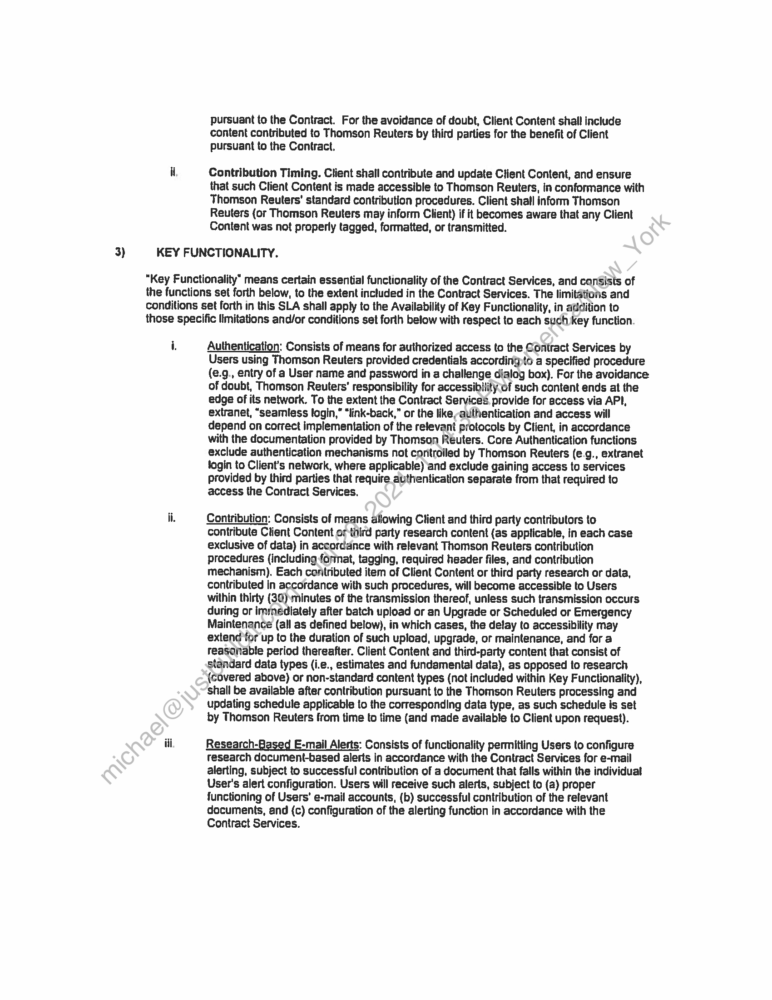
```  
```col-md
3)  
pursuant to the Contract. For the avoidance of doubt, Client Content shall include
content contributed to Thomson Reuters by third parties for the benefit of Client
pursuant to the Contract.  
Contribution Timing. Client shall contribute and update Client Content, and ensure
that such Client Content is made accessible to Thomson Reuters, in conformance with
Thomson Reuters’ standard contribution procedures. Client shall inform Thomson
Reuters (or Thomson Reuters may inform Client) if it becomes aware that any Client
Content was not properly tagged, formatted, or transmitted.  
KEY FUNCTIONALITY.  
“Key Functionality’ means certain essential functionality of the Contract Services, and cansisis of
the functions set forth below, to the extent included in the Contract Services. The limitations and
Conditions set forth in this SLA shall apply to the Availability of Key Functionality, in atidition to
those specific Imitations and/or conditions set forth befow with respect to each such key function.  
Authentication: Consists of means for authorized access to the Contract Services by
Users using Thomson Reuters provided credentials according; a specified procedure
(2.g., entry of a User name and password in a challenge dialog box). For the avoidance
of doubt, Thomson Reuters’ responsibility for accessibilityof such content ends at the
edge of its network. To the extent the Contract Services. provide for access via API,
extranet, “seamless login,” “link-back,” or the like authentication and access will
depend on correct implementation of the relevant protocols by Client, in accordance
with the documentation provided by Thomson Reuters. Core Authentication functions
exclude authentication mechanisms not controlled by Thomson Reuters (e.g., extranet
fogin to Client's network, where applicable) ‘and exclude gaining access to services
provided by third parties that require authentication separate from that required to
access the Contract Services,  
Contribution: Consists of means allowing Client and third party contributors to
contribute Client Content or third party research content (as appticable, in each case
exclusive of data) in accordance with relevant Thomson Reuters contribution
procedures (including format, tagging, required header files, and contribution
mechanism). Each contributed item of Client Content or third party research or data,
contributed in accordance with such procedures, will become accessible to Users
within thirty (3G)minutes of the transmission thereof, unless such transmission occurs
during or immediately after batch upload or an Upgrade or Scheduled or Emergency
Maintenance (all as defined below), in which cases, the delay to accessibility may
extend for up to the duration of such upload, upgrade, or maintenance, and for a
reasonable period thereafter. Client Content and third-party content that consist of
standard data types (i.e., estimates and fundamental data), as opposed to research
(Covered above) or non-standard content types (not included within Key Functionality),
Shall be available after contribution pursuant to the Thomson Reuters processing and
updating schedule applicable to the corresponding data type, as such schedule is set
by Thomson Reuters from time to time (and made available to Client upon request).  
Research-Based E-mail Alerts: Consists of functionality permitting Users to configure
research document-based alerts in accordance with the Contract Services for e-mail
alerting, subject to successful contribution of a document that falls within the individuat
User's alert configuration. Users will receive such alerts, subject to (a) proper
functioning of Users’ e-mail accounts, (b) successful contribution of the relevant
documents, and (c) configuration of the alerting function in accordance with the
Contract Services.  
```
````
Notes:    
````col
```col-md
flexGrow=.5
===
> [!info] [Page 13](_attachments/images_Refinitiv-3.6.1.2.500207483-b.pdf_212159/page_13.png)
> 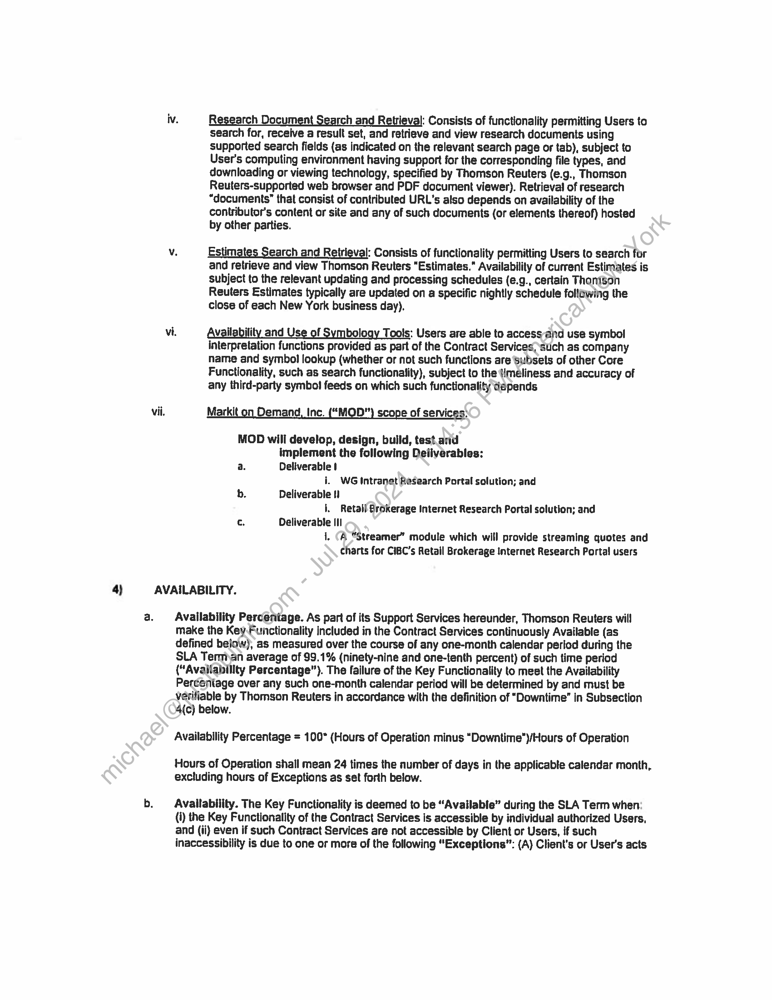
```  
```col-md
v. arch Documen' ch and Retrieval: Consists of functionality permitting Users to
search for, receive a result set, and retrieve and view research documents using
supported search fields (as indicated on the relevant search page or tab), subject to
User's computing environment having support for the corresponding file types, and
downloading or viewing technology, specified by Thomson Reuters (e.g., Thomson
Reuters-supported web browser and PDF document viewer). Retrieval of research
“documents” that consist of contributed URL's also depends on availability of the
contributors content or site and any of such documents (or elements thereof) hosted
by other parties.  
v. Estimates Search and Retrieval: Consists of functionality permitting Users to search for
and retrieve and view Thomson Reuters “Estimates.” Availability of current Estimates is
subject to the relevant updating and processing schedules (e.g., certain Thanison
Reuters Estimates typically are updated on a specific nightly schedule following the
close of each New York business day).  
vi. Availability and Use of Symbology Tools: Users are able to access and use symbol  
interpretation functions provided as part of the Contract Services, such as company
name and symbol lookup (whether or not such functions are subsets of other Core
Functionality, such as search functionality), subject to the {imeliness and accuracy of
any third-party symbol feeds on which such functionality depends  
vii. Markit on Demand, Inc. (“MOD") scope of services?  
MOD will develop, design, build, test.and
implement the following Deliverables:  
a. Deliverable t  
i. WG Intranet Research Portal salution; and
b. Deliverable 1!  
i. Retail Brokerage Internet Research Portal solution; and
c. Deliverable II  
1, (A "Steeamer” module which will provide streaming quotes and
charts for CIBC’s Retail Brokerage Internet Research Portal users  
4) AVAILABILITY.  
a. Availability Percentage. As part of its Support Services hereunder, Thomson Reuters will
make the Key.Functionality included in the Contract Services continuously Available (as
defined beiow), as measured over the course of any one-month calendar period during the
SLA Terman average of 99.1% (ninety-nine and one-tenth percent) of such time period
(“Availabillty Percentage”). The failure of the Key Functionality to meet the Availability
Percentage over any such one-month calendar period will be determined by and must be
verifiable by Thomson Reuters in accordance with the definition of “Downtime” in Subsection
4(c) below.  
Availability Percentage = 100* (Hours of Operation minus “Downtime”)/Hours of Operation  
Hours of Operation shall mean 24 times the number of days in the applicable calendar month,
exctuding hours of Exceptions as set forth below.  
b. Availability. The Key Functionality is deemed to be “Available” during the SLA Term when:
(i) the Key Functionallty of the Contract Services is accessible by individual authorized Users,
and (ii) even if such Contract Services are not accessible by Client or Users, if such
inaccessibility is due to one or more of the following “Exceptions”: (A) Client's or User's acts  
```
````
Notes:    
````col
```col-md
flexGrow=.5
===
> [!info] [Page 14](_attachments/images_Refinitiv-3.6.1.2.500207483-b.pdf_212159/page_14.png)
> 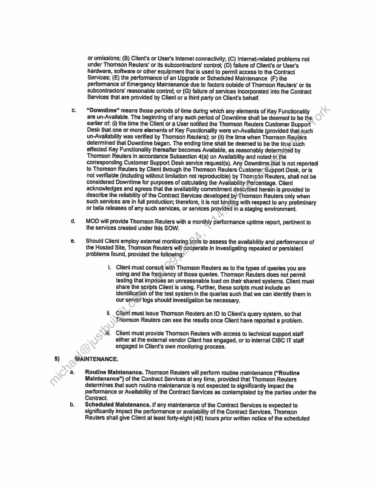
```  
```col-md
or omissions; (B) Client's or User's Internet connectivity; (C) Internet-related problems not
under Thomson Reuters’ or its subcontractors’ control; (D) failure of Client's or User's
hardware, software or other equipment that is used to permit access to the Contract
Services; (E) the performance of an Upgrade or Scheduled Maintenance (F) the
performance of Emergency Maintenance due to factors outside of Thomson Reuters’ or its
subcontractors’ reasonable control; or (G) failure of services incorporated into the Contract
Services that are provided by Client or a third party on Client's behaif.  
c. “Downtime” means those periods of time during which any elements of Key Functionality
are un-Available. The beginning of any such period of Downtime shall be deemed to be the
earlier of: (i) the time the Client or a User notified the Thomson Reuters Customer Support
Desk that one or more elements of Key Functionality were un-Available (provided that.such
un-Availability was verified by Thomson Reuters); or (ii) the time when Thomson Reciars
determined that Downtime began. The ending time shall be deemed to be the time such
affected Key Functionality thereafter becomes Available, as reasonably determined by
Thomsen Reuters in accordance Subsection 4(a) on Availability and noted ir the
corresponding Customer Support Desk service request(s). Any Downtime:ihat is not reported
to Thomson Reuters by Client through the Thomson Reuters Customer Support Desk, or is
not verifiable (including without limitation not reproducible) by Thomsan Reuters, shall not be
Considered Downtime for purposes of catculating the Availability Percentage. Client
acknowledges and agrees that the availability commitment described herein is provided to
describe the reliability of the Contract Services developed by Thomson Reuters only when
such services are in full production; therefore, it is not binding with respect to any preliminary
or beta releases of any such services, or services pravided in a staging environment.  
d. MOD will provide Thomson Reuters with a monthly performance uptime report, pertinent to
the services created under this SOW.  
e. Should Client employ external monitoring tcols to assess the availability and performance of
the Hosted Site, Thomson Reuters will cooperate in investigating repeated or persistent
problems found, provided the following:  
i. Client must consult with Thomson Reuters as to the types of queries you are
using and the frequency of those queries. Thomson Reuters does not permit
testing that imposes an unreasonable load on their shared systems. Client must
share the scripts Client is using. Further, these scripts must include an
identification of the test system in the queries such that we can identify them in
our server togs should investigation be necessary.  
ii. Client must issue Thomson Reuters an ID to Client's query system, so that
Thomson Reuters can see the results once Client have reported a problem.  
iii, Client must provide Thomson Reuters with access to technical support staff
either at the external vendor Client has engaged, or to internal CIBC IT staff
engaged in Client's own monitoring process.  
5) MAINTENANCE.  
a. Routine Maintenance. Thomson Reuters will perform routine maintenance (“Routine
Maintenance") of the Contract Services at any time, provided that Thomson Reuters
determines that such routine maintenance is not expected to significantly impact the
performance or Availability of the Contract Services as contemplated by the parties under the
Contract.  
b. Scheduled Maintenance. If any maintenance of the Contract Services is expected to
significantly impact the performance or availability of the Contract Services, Thomson
Reuters shall give Client at least forty-eight (48) hours prior written notice of the scheduled  
```
````
Notes:    
````col
```col-md
flexGrow=.5
===
> [!info] [Page 15](_attachments/images_Refinitiv-3.6.1.2.500207483-b.pdf_212159/page_15.png)
> 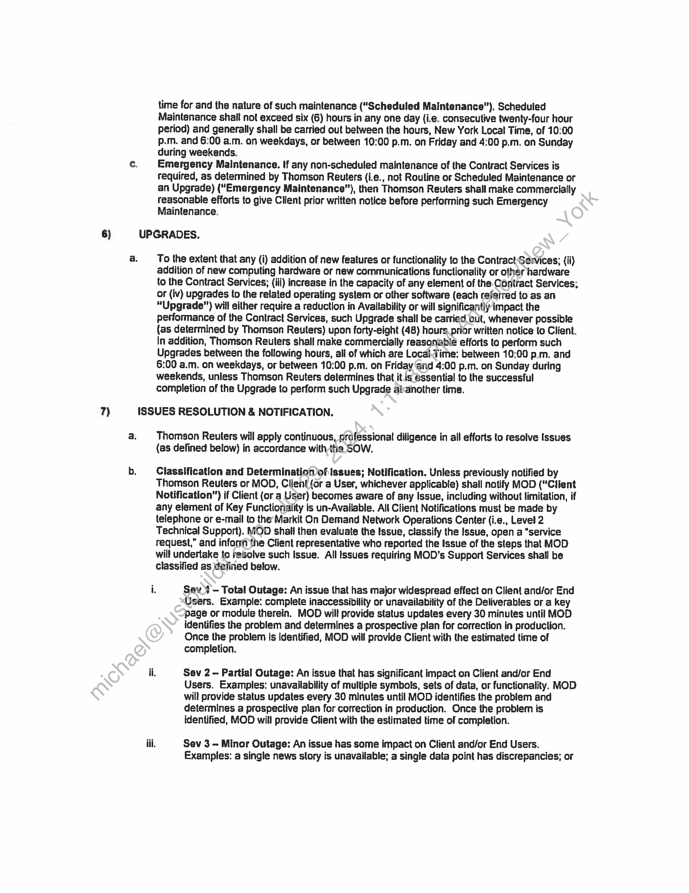
```  
```col-md
time for and the nature of such maintenance (“Scheduled Maintenance"). Scheduled
Maintenance shall not exceed six (6) hours in any one day (i.e. consecutive twenty-four hour
period) and generally shall be carried out between the hours, New York Local Time, of 10:00
p.m. and 6:00 a.m. on weekdays, or between 10:00 p.m. on Friday and 4:00 p.m. on Sunday
during weekends.  
Emergency Maintenance. If any non-scheduled maintenance of the Contract Services is
required, as determined by Thomson Reuters (i.e., not Routine or Scheduled Maintenance or
an Upgrade) (“Emergency Maintenance"), then Thomson Reuters shall make commercially
reasonable efforts to give Client prior written notice before performing such Emergency
Maintenance.  
6) UPGRADES.  
To the extent that any (i) addition of new features or functionality to the Contract: Services; (ii)
addition of new computing hardware or new communications functionality or other hardware
to the Contract Services; (iii) incraase in the capacity of any element of the.Contract Services;
or (iv) upgrades to the related operating system or other software (each referred to as an
“Upgrade”) will either require a reduction in Availability or will significantly impact the
performance of the Contract Services, such Upgrade shall be carried out, whenever possible
(as determined by Thomson Reuters) upon forty-eight (48) hours, prior written notice to Client.
In addition, Thomson Reuters shall make commercially reasonable efforts to perform such
Upgrades between the following hours, all of which are Local ime: between 10:00 p.m. and
6:00 a.m, on weekdays, or between 10:00 p.m. on Friday and 4:00 p.m. on Sunday during
weekends, unless Thomson Reuters determines that itis essential to the successful
completion of the Upgrade to perform such Upgrade alanother time.  
7) ISSUES RESOLUTION & NOTIFICATION.  
Thomson Reuters will apply continuous, prafessionat diligence in all efforts to resolve Issues
(as defined below) in accordance withthe SOW.  
Classification and Determination of Issues; Notification. Unless previously notified by
Thomson Reuters or MOD, Client (or a User, whichever applicable) shall notify MOD ("Client
Notification”) if Client (or a User) becomes aware of any Issue, including without limitation, if
any element of Key Functionality is un-Available. All Client Notifications must be made by
telephone or e-mail to the Markit On Demand Network Operations Center (i.¢., Level 2
Technical Support). MOD shall then evaluate the Issue, classify the Issue, open a “service
request,” and inform the Client representative who reported the Issue of the steps that MOD
will undertake to resolve such Issue. All Issues requiring MOD's Support Services shail be
classified as defined below.  
Sav? —- Total Outage: An issue that has major widespread effect on Client and/or End
Users, Example: complete inaccessibility or unavailability of the Deliverables or a key
page or module therein. MOD will provide status updates every 30 minutes until MOD
identifies the problem and determines a prospective plan for correction in production.
Once the problem Is identified, MOD will provide Client with the estimated time of
completion.  
Sev 2 — Partial Outage: An issue that has significant impact on Client and/or End
Users. Examples: unavailability of multiple symbols, sets of data, or functionality. MOD
will provide status updates every 30 minutes until MOD identifies the problem and
determines a prospective plan for correction in production. Once the problem is
identified, MOD will provide Client with the estimated time of completion.  
Sev 3 - Minor Outage: An issue has some impact on Client and/or End Users.
Examples: a single news story is unavailable; a single data point has discrepancies; or  
```
````
Notes:    
````col
```col-md
flexGrow=.5
===
> [!info] [Page 16](_attachments/images_Refinitiv-3.6.1.2.500207483-b.pdf_212159/page_16.png)
> 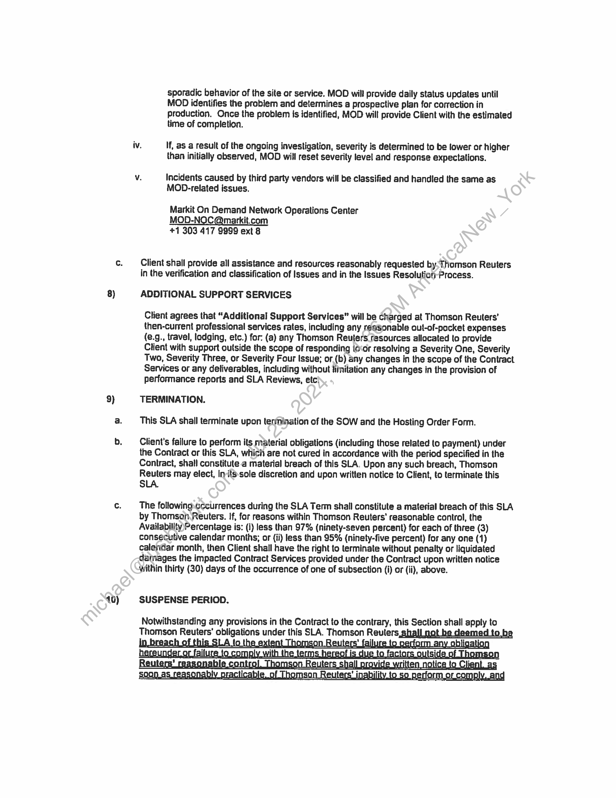
```  
```col-md
8)  
8)  
40)  
sporadic behavior of the site or service. MOD will provide daily status updates until
MOD identifies the problem and determines a prospactive plan for correction in
production. Once the problem is identified, MOD will provide Client with the estimated
time of completion.  
iv. If, as a result of the ongoing investigation, severity is determined to be tower or higher
than initially observed, MOD will reset severity level and response expectations.  
v. Incidents caused by third party vendors will be classified and handled the same as
MOD-related issues,  
Markit On Demand Network Operations Center  
MOD-NOC@markit.com
+1 303 417 9999 ext 8  
Client shall provide all assistance and resources reasonably requested by. Thomson Reuters
in the verification and classification of Issues and in the Issues Resolution Process.  
ADDITIONAL SUPPORT SERVICES  
Client agrees that “Additional Support Services” will be charged at Thomson Reuters’
then-current professional services rates, including any reasonable out-of-pocket expenses
(e.g., travel, lodging, etc.) for: (a) any Thomson Reuters resources allocated to provide
Client with support outside the scope of responding ic‘or resolving a Severity One, Severity
Two, Severity Three, or Severity Four Issue; or (b) any changes in the scope of the Contract
Services or any deliverables, including without limitation any changes in the provision of
performance reports and SLA Reviews, etc!  
TERMINATION.
This SLA shall terminate upon termination of the SOW and the Hosting Order Form.  
Client's failure to perform its material obligations (including those related to payment) under
the Contract or this SLA, which are not cured in accordance with the period specified in the
Contract, shall constitute a material breach of this SLA. Upon any such breach, Thomson
Reuters may elect, In itSsole discretion and upon written notice to Client, to terminate this
SLA.  
The following-occurrences during the SLA Term shall constitute a material breach of this SLA
by Thomsan. Reuters. If, for reasons within Thomson Reuters’ reasonable control, the
Availability Percentage is: (i) less than 97% (ninety-seven percent) for each of three (3)
consecutive calendar months; or (ii) less than 95% (ninety-five percent) for any one (1)
calendar month, then Client shall have the right to terminate without penalty or liquidated
datnages the impacted Contract Services provided under the Contract upon written notice
{within thirty (30) days of the occurrence of one of subsection (i) or (ii), above.  
SUSPENSE PERIOD.  
Notwithstanding any provisions in the Contract to the contrary, this Section shall apply to
Thomson Reuters’ obligations under this SLA. Thomson Reuters,
J this SLA ent Reuters’ e :  
```
````
Notes:    
````col
```col-md
flexGrow=.5
===
> [!info] [Page 17](_attachments/images_Refinitiv-3.6.1.2.500207483-b.pdf_212159/page_17.png)
> 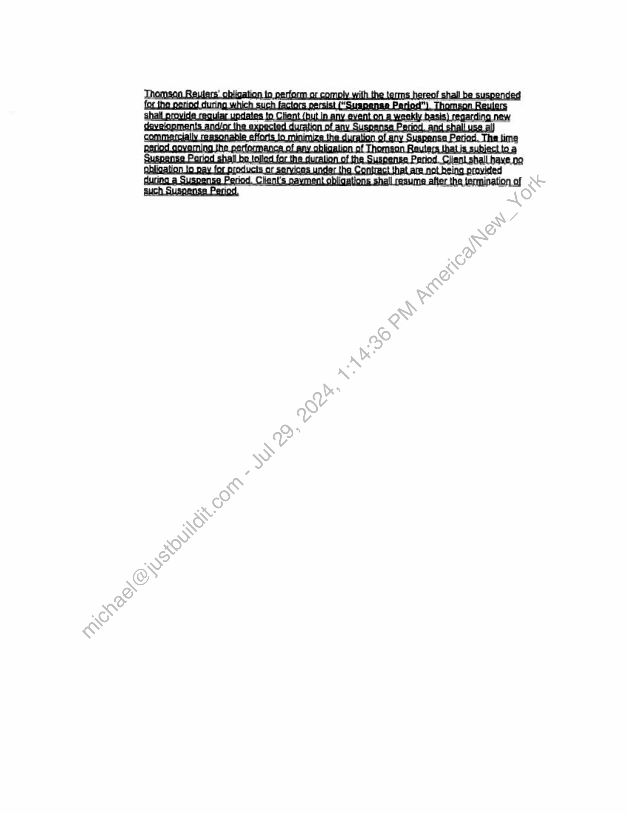
```  
```col-md  
```
````
Notes:    
````col
```col-md
flexGrow=.5
===
> [!info] [Page 18](_attachments/images_Refinitiv-3.6.1.2.500207483-b.pdf_212159/page_18.png)
> 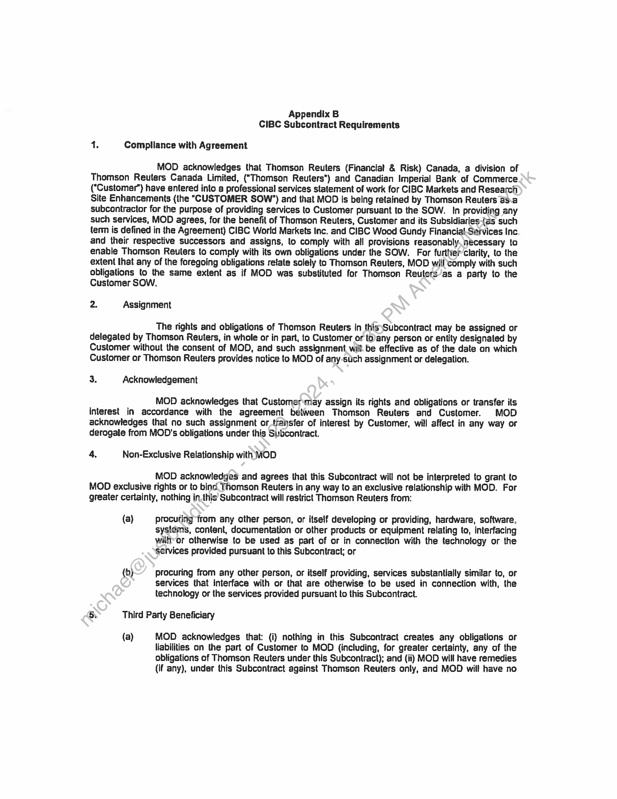
```  
```col-md
Appendix B
CIBC Subcontract Requirements  
1. Compliance with Agreement  
MOD acknowledges that Thomson Reuters (Financial & Risk) Canada, a division of
Thomson Reuters Canada Limited, ("Thomson Reuters’) and Canadian Imperial Bank of Commerce
(‘Customer’) have entered into a professional services statement of work for CIBC Markets and Research
Site Enhancements (the “CUSTOMER SOW") and that MOD Is being retained by Thomson Reuters asa
subcontractor for the purpose of providing services to Customer pursuant to the SOW. In providing any
such services, MOD agrees, for the benefit of Thomson Reuters, Customer and its Subsidiaries-{as such
term is defined in the Agreement) CIBC World Markets Inc. and CIBC Wood Gundy Financial.Services Inc
and their respective successors and assigns, to comply with all provisions reasonably, necessary to
enable Thomson Reuters to comply with its own obligations under the SOW. For furthierclarity, to the
extent that any of the foregoing obligations refate solely to Thomson Reuters, MOD will comply with such
obligations to the same extent as if MOD was substituted for Thomson Reuters/as a party to the
Customer SOW.  
2. Assignment  
The rights and obligations of Thomson Reuters in thissSubcontract may be assigned or
delegated by Thomson Reuters, in whole or in part, to Customer or todany person or entity designated by
Customer without the consent of MOD, and such assignment will. be effective as of the date on which
Customer or Thomson Reuters provides notice to MOD of any-stch assignment or delegation.  
3. Acknowledgement  
MOD acknowledges that Customermay assign its rights and obligations or transfer its
interest in accordance with the agreement between Thomson Reuters and Customer. MOD
acknowledges that no such assignment or transfer of interest by Customer, will affect in any way or
derogale from MOD's obligations under this Subcontract.  
4. Non-Exclusive Relationship with MOD  
MOD acknowledges and agrees that this Subcontract will not be interpreted to grant to
MOD exclusive rights or to bind Thomson Reuters in any way to an exclusive relationship with MOD. For
greater certainty, nothing in,this Subcontract will restrict Thomson Reuters from:  
(a) procuring from any other person, or itself developing or providing, hardware, software,
systems, content, documentation or other products or equipment relating to, interfacing
withror otherwise to be used as part of or in connectton with the technology or the
services provided pursuant to this Subcontract; or  
(b) procuring from any other person, or itself providing, services substantially similar to, or
services that interface with or that are otherwise to be used in connection with, the
technology or the services provided pursuant to this Subcontract.  
a Third Party Beneficiary  
(a) MOD acknowledges that: (i) nothing in this Subcontract creates any obligations or
liabilities on the part of Customer to MOD (including, for greater certainty, any of the
obligations of Thomson Reuters under this Subcontract); and (ii) MOD will have remedies
(if any), under this Subcontract against Thomson Reuters only, and MOD will have no  
```
````
Notes:    
````col
```col-md
flexGrow=.5
===
> [!info] [Page 19](_attachments/images_Refinitiv-3.6.1.2.500207483-b.pdf_212159/page_19.png)
> 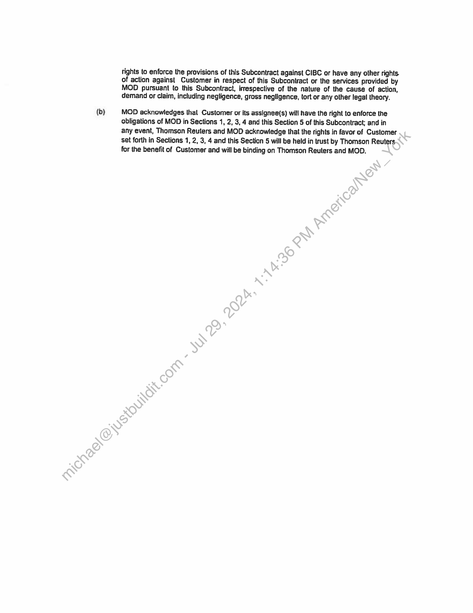
```  
```col-md
(b)  
rights to enforce the provisions of this Subcontract against CIBC or have any other rights.
of action against Customer in respect of this Subcontract or the services provided by
MOD pursuant to this Subcontract, irrespective of the nature of the cause of action,
demand or claim, including negligence, gross negligence, tort or any other legal theory.  
MOD acknowledges that Customer or its assignee(s) will have the right to enforce the
obligations of MOD in Sections 1, 2, 3, 4 and this Section 5 of this Subcontract; and in
any event, Thomson Reuters and MOD acknowledge that the rights in favor of Customer
Set forth in Sections 1, 2, 3, 4 and this Section 5 will be held in trust by Thomson Reuters
for the benefit of Customer and will be binding on Thomson Reuters and MOD.  
```
````
Notes:  


![[_attachments/Refinitiv-3.6.1.2.5 00207483 - b.pdf]