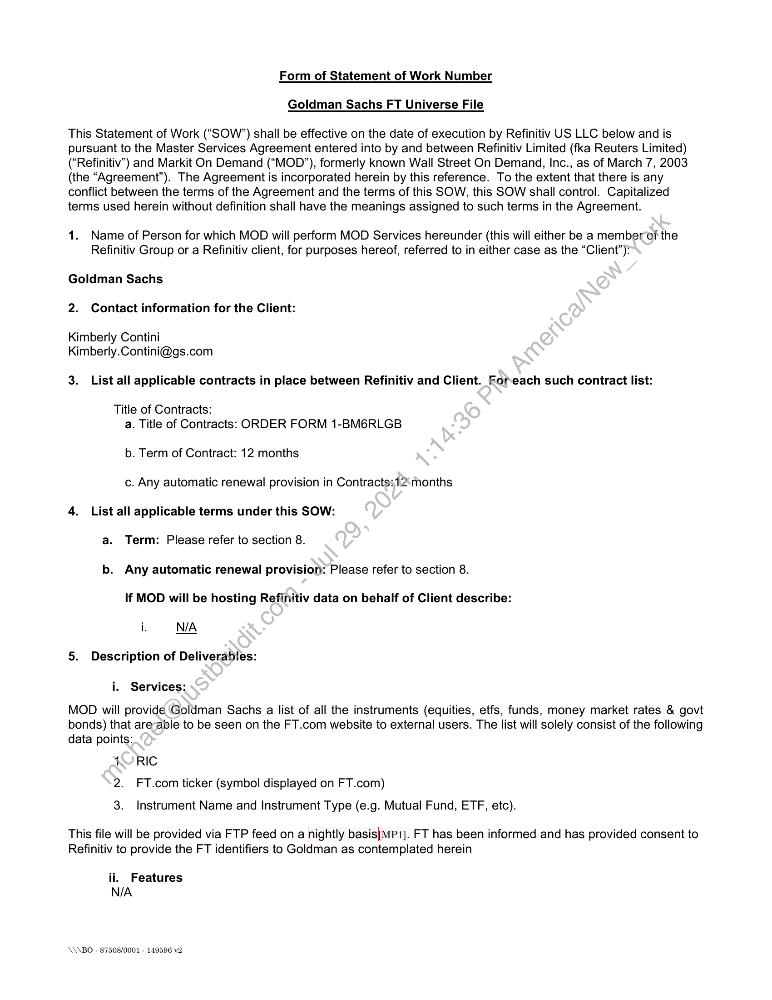
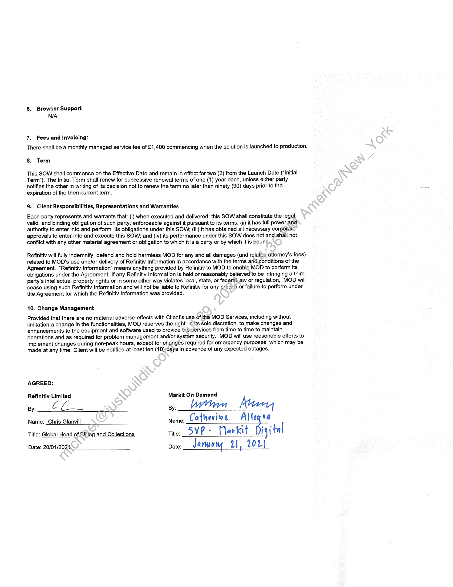

##### Statement of Work for Goldman Sachs FT Universe File]

  
````col
```col-md
flexGrow=.5
===
> [!info] [Page 1](_attachments/images_Refinitiv-Limited-3.6.1.3.100183367.pdf_210420/page_1.png)
> 
```  
```col-md
Form of Statement of Work Number
Goldman Sachs FT Universe File  
This Statement of Work (“SOW”) shall be effective on the date of execution by Refinitiv US LLC below and is
pursuant to the Master Services Agreement entered into by and between Refinitiv Limited (fka Reuters Limited)
(“Refinitiv’) and Markit On Demand (“MOD”), formerly known Wall Street On Demand, Inc., as of March 7, 2003
(the “Agreement”). The Agreement is incorporated herein by this reference. To the extent that there is any
conflict between the terms of the Agreement and the terms of this SOW, this SOW shall control. Capitalized
terms used herein without definition shall have the meanings assigned to such terms in the Agreement.  
1. Name of Person for which MOD will perform MOD Services hereunder (this will either be a member of the
Refinitiv Group or a Refinitiv client, for purposes hereof, referred to in either case as the “Client”):  
Goldman Sachs
2. Contact information for the Client:  
Kimberly Contini
Kimberly.Contini@gs.com  
3. List all applicable contracts in place between Refinitiv and Client. Foreach such contract list:  
Title of Contracts:
a. Title of Contracts: ORDER FORM 1-BM6RLGB  
b. Term of Contract: 12 months
c. Any automatic renewal provision in Contracts;12‘months
4. List all applicable terms under this SOW:
a. Term: Please refer to section 8.
b. Any automatic renewal provision: Please refer to section 8.
If MOD will be hosting Refinitiv data on behalf of Client describe:
i. N/A
5. Description of Deliverables:  
i. Services:  
MOD will provide Goldman Sachs a list of all the instruments (equities, etfs, funds, money market rates & govt
bonds) that are-able to be seen on the FT.com website to external users. The list will solely consist of the following
data points:  
4 RIC
2. FT.com ticker (symbol displayed on FT.com)  
3. Instrument Name and Instrument Type (e.g. Mutual Fund, ETF, etc).  
This file will be provided via FTP feed on a nightly basis{mp1). FT has been informed and has provided consent to
Refinitiv to provide the FT identifiers to Goldman as contemplated herein  
ii. Features
N/A  
\\\BO - 87508/0001 - 149596 v2  
```
````
Notes:    
````col
```col-md
flexGrow=.5
===
> [!info] [Page 2](_attachments/images_Refinitiv-Limited-3.6.1.3.100183367.pdf_210420/page_2.png)
> 
```  
```col-md
6. Browser Support
N/A  
7. Fees and Invoicing:
There shall be a monthly managed service fee of £1,400 commencing when the solution is launched to production.  
8. Term  
This SOW shall commence on the Effective Date and remain in effect for two (2) from the Launch Date (“Initial
Term”). The Initial Term shall renew for successive renewal terms of one (1) year each, unless either party
notifies the other in writing of its decision not to renew the term no later than ninety (90) days prior to the
expiration of the then current term.  
9. Client Responsibilities, Representations and Warranties  
Each party represents and warrants that: (i) when executed and delivered, this SOW shall constitute the legal,
valid, and binding obligation of such party, enforceable against it pursuant to its terms; (ii) it has full power. and
authority to enter into and perform its obligations under this SOW; (iii) it has obtained all necessary corporate
approvals to enter into and execute this SOW; and (iv) its performance under this SOW does not and.shall not
conflict with any other material agreement or obligation to which it is a party or by which it is bound.  
  
Refinitiv will fully indemnify, defend and hold harmless MOD for any and all damages (and related attorney's fees)
related to MOD’s use and/or delivery of Refinitiv Information in accordance with the terms arid.conditions of the
Agreement. “Refinitiv Information” means anything provided by Refinitiv to MOD to enable MOD to perform its
obligations under the Agreement. If any Refinitiv Information is held or reasonably believed'to be infringing a third
party's intellectual property rights or in some other way violates local, state, or federal,law or regulation, MOD will
cease using such Refinitiv Information and will not be liable to Refinitiv for any breach or failure to perform under
the Agreement for which the Refinitiv Information was provided.  
10. Change Management  
Provided that there are no material adverse effects with Client's use of the MOD Services, including without
limitation a change in the functionalities, MOD reserves the right, in its sole discretion, to make changes and
enhancements to the equipment and software used to provide the.services from time to time to maintain
operations and as required for problem management and/or system security. MOD will use reasonable efforts to
implement changes during non-peak hours, except for changes required for emergency purposes, which may be
made at any time. Client will be notified at least ten (10)days in advance of any expected outages.  
AGREED:  
Refinitiv Limited
py: C  
Name: _Chris Glanvill  
Title: Global Head of Billing and Collections  
Date: 20/01/2021,  
Markit On Demand  
py, Wn Mun,
Name: Catherine Alle va
tite: SVP - [larkit Di ital  
pate__Jarmury 21, 2021  
```
````
Notes:  


![[_attachments/Refinitiv-Limited-3.6.1.3.1 00183367.pdf]