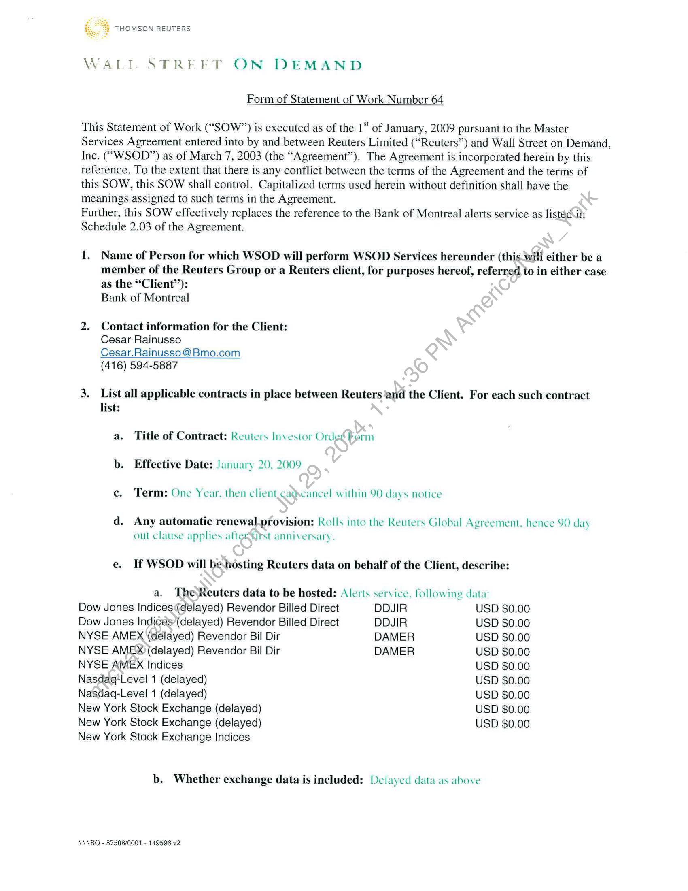
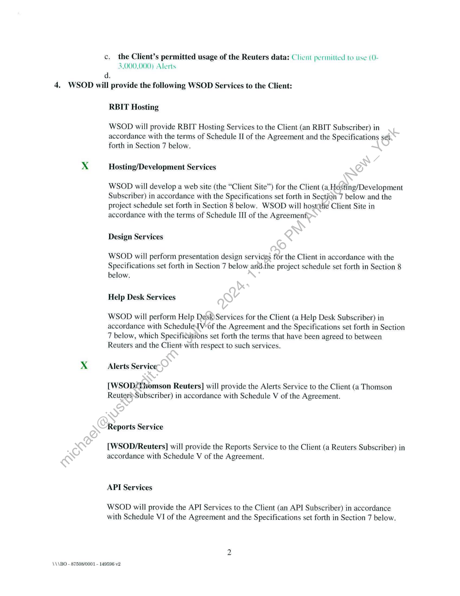
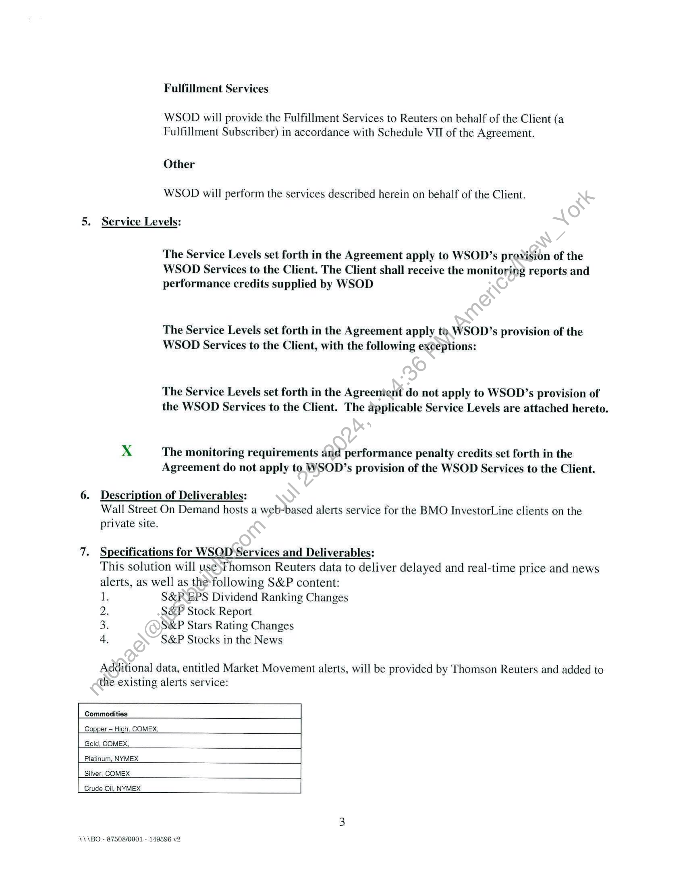
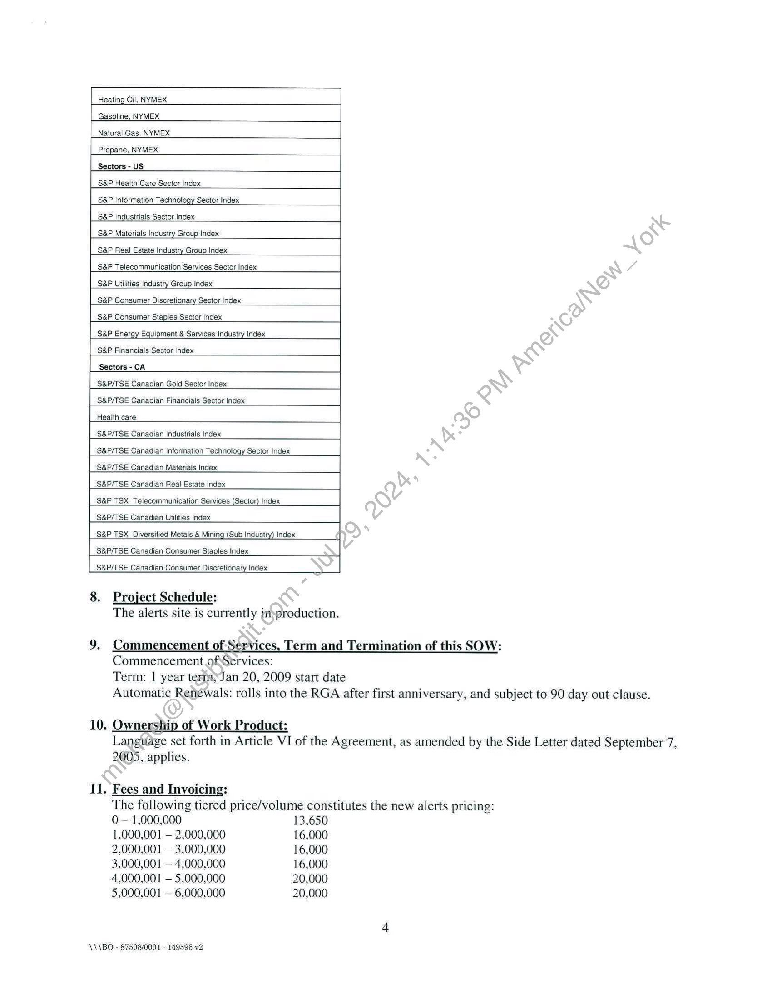
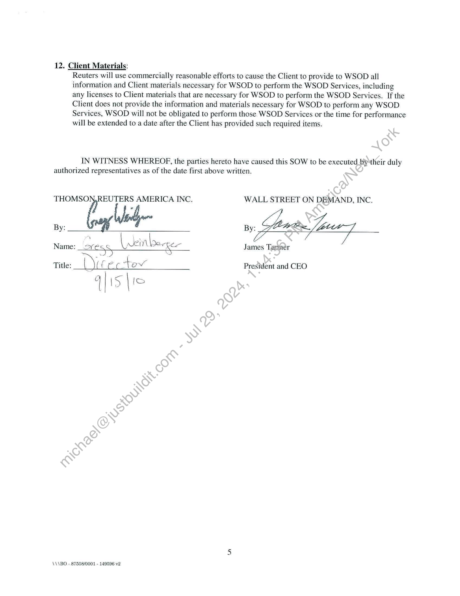

##### Statement of Work]

  
````col
```col-md
flexGrow=.5
===
> [!info] [Page 1](_attachments/images_Refinitiv-Limited-3.6.1.3.200183291.pdf_210525/page_1.png)
> 
```  
```col-md
THOMSON REUTERS  
WALT STREET ON DEMAND  
Form of Statement of Work Number 64  
This Statement of Work (“SOW”) is executed as of the 1“ of January, 2009 pursuant to the Master
Services Agreement entered into by and between Reuters Limited (“Reuters”) and Wall Street on Demand,
Inc. (““WSOD”) as of March 7, 2003 (the “Agreement”). The Agreement is incorporated herein by this
reference. To the extent that there is any conflict between the terms of the Agreement and the terms of  
this SOW, this SOW shall control. Capitalized terms used herein without definition shall have the
meanings assigned to such terms in the Agreement.  
Further, this SOW effectively replaces the reference to the Bank of Montreal alerts service as listédin
Schedule 2.03 of the Agreement.  
1. Name of Person for which WSOD will perform WSOD Services hereunder (this_will either be a
member of the Reuters Group or a Reuters client, for purposes hereof, referred to in either case
as the “Client’’):  
Bank of Montreal  
2. Contact information for the Client:
Cesar Rainusso
Cesar.Rainusso @ Bmo.com
(416) 594-5887  
3. List all applicable contracts in place between Reuters ‘and the Client. For each such contract
list:  
a. Title of Contract: Reuters Investor Ordex Form
b. Effective Date: January 20, 2009
ce. Term: One Year. then client cadscancel within 90 days notice  
d. Any automatic renewal_provision: Rolls into the Reuters Global Agreement. hence 90 day
out clause apphes aftemgyst anniversary.  
e. If WSOD will be.hosting Reuters data on behalf of the Client, describe:  
a. The Reuters data to be hosted: Alerts service. following data:  
Dow Jones Indices¢delayed) Revendor Billed Direct DDJIR USD $0.00
Dow Jones Indices (delayed) Revendor Billed Direct DDJIR USD $0.00
NYSE AMEX (delayed) Revendor Bil Dir DAMER USD $0.00
NYSE AMEX) (delayed) Revendor Bil Dir DAMER USD $0.00
NYSE AMEX Indices USD $0.00
Nasdag+Level 1 (delayed) USD $0.00
Nasdaq-Level 1 (delayed) USD $0.00
New York Stock Exchange (delayed) USD $0.00
New York Stock Exchange (delayed) USD $0.00  
New York Stock Exchange Indices  
b. Whether exchange data is included: Delayed data as above  
\\\BO - 87508/0001 - 149596 v2  
```
````
Notes:    
````col
```col-md
flexGrow=.5
===
> [!info] [Page 2](_attachments/images_Refinitiv-Limited-3.6.1.3.200183291.pdf_210525/page_2.png)
> 
```  
```col-md
c. the Client’s permitted usage of the Reuters data: Clicni permitted to use (03.000.000) Alerts
d.
4. WSOD will provide the following WSOD Services to the Client:  
RBIT Hosting
WSOD will provide RBIT Hosting Services to the Client (an RBIT Subscriber) in  
accordance with the terms of Schedule II of the Agreement and the Specifications set
forth in Section 7 below.  
xX Hosting/Development Services
WSOD will develop a web site (the “Client Site”) for the Client (a, Hosting/Development
Subscriber) in accordance with the Specifications set forth in Section 7 below and the  
project schedule set forth in Section 8 below. WSOD will hostthe Client Site in
accordance with the terms of Schedule III of the Agreement,  
Design Services
WSOD will perform presentation design services for the Client in accordance with the  
Specifications set forth in Section 7 below andthe project schedule set forth in Section 8
below.  
Help Desk Services
WSOD will perform Help Desk Services for the Client (a Help Desk Subscriber) in
accordance with Schedule[Vof the Agreement and the Specifications set forth in Section  
7 below, which Specifications set forth the terms that have been agreed to between
Reuters and the Client with respect to such services.  
xX Alerts Service  
[WSOD/Thomson Reuters] will provide the Alerts Service to the Client (a Thomson
ReutersSubscriber) in accordance with Schedule V of the Agreement.  
Reports Service  
[WSOD/Reuters] will provide the Reports Service to the Client (a Reuters Subscriber) in
accordance with Schedule V of the Agreement.  
API Services  
WSOD will provide the API Services to the Client (an API Subscriber) in accordance
with Schedule VI of the Agreement and the Specifications set forth in Section 7 below.  
\\\BO - 87508/0001 - 149596 v2  
```
````
Notes:    
````col
```col-md
flexGrow=.5
===
> [!info] [Page 3](_attachments/images_Refinitiv-Limited-3.6.1.3.200183291.pdf_210525/page_3.png)
> 
```  
```col-md
Fulfillment Services  
WSOD will provide the Fulfillment Services to Reuters on behalf of the Client (a
Fulfillment Subscriber) in accordance with Schedule VII of the Agreement.  
Other
WSOD will perform the services described herein on behalf of the Client.  
5. Service Levels:  
The Service Levels set forth in the Agreement apply to WSOD’s provision of the
WSOD Services to the Client. The Client shall receive the monitoring reports and
performance credits supplied by WSOD  
The Service Levels set forth in the Agreement apply to. WSOD’s provision of the
WSOD Services to the Client, with the following ex¢eptions:  
The Service Levels set forth in the Agreenierit do not apply to WSOD’s provision of
the WSOD Services to the Client. The applicable Service Levels are attached hereto.  
XxX The monitoring requirements and performance penalty credits set forth in the
Agreement do not apply to. WSOD’s provision of the WSOD Services to the Client.  
6. Description of Deliverables:
Wall Street On Demand hosts a web-based alerts service for the BMO InvestorLine clients on the  
private site.  
7. Specifications for WSQD Services and Deliverables:  
This solution will use;Thomson Reuters data to deliver delayed and real-time price and news
alerts, as well as the following S&P content:  
1 S&P EPS Dividend Ranking Changes
2. S&P Stock Report  
3. S&P Stars Rating Changes  
4 S&P Stocks in the News  
Additional data, entitled Market Movement alerts, will be provided by Thomson Reuters and added to
the existing alerts service:  
Commodities |  
Copper ~ High, COMEX,  
Gold, COMEX,  
Platinum, NYMEX  
Silver, COMEX  
Crude Oil, NYMEX  
\\\BO - 87508/0001 - 149596 v2  
```
````
Notes:    
````col
```col-md
flexGrow=.5
===
> [!info] [Page 4](_attachments/images_Refinitiv-Limited-3.6.1.3.200183291.pdf_210525/page_4.png)
> 
```  
```col-md
Heating Oil, NYMEX.  
Gasoline, NYMEX  
Natural Gas, NYMEX  
Propane, NYMEX  
Sectors - US  
S&P Health Care Sector Index  
S&P Information Technology Sector Index  
S&P Industrials Sector Index  
S&P Materials Industry Group Index  
S&P Real Estate Industry Group Index  
S&P Telecommunication Services Sector Index  
S&P Utilities Industry Group Index  
S&P Consumer Discretionary Sector Index  
S&P Consumer Staples Sector Index  
S&P Energy Equipment & Services Industry Index  
S&P Financials Sector Index  
Sectors - CA  
S&P/TSE Canadian Gold Sector Index  
S&P/TSE Canadian Financials Sector Index  
Health care  
S&P/TSE Canadian Industrials Index  
S&P/TSE Canadian Information Technology Sector index
S&P/TSE Canadian Materials Index  
S&P/TSE Canadian Real Estate Index  
S&P TSX_Telecommunication Services (Sector) Index  
S&P/TSE Canadian Utilities Index  
S&P TSX Diversified Metals & Minin,  
S&P/TSE Canadian Consumer Staples index  
S&P/TSE Canadian Consumer Discretionary Index  
8. Project Schedule:
The alerts site is currently inyproduction.  
9. Commencement of Services, Term and Termination of this SOW:
Commencement of Services:  
Term: 1 year tertnyJan 20, 2009 start date
Automatic Renewals: rolls into the RGA after first anniversary, and subject to 90 day out clause.  
10. Ownership of Work Product:
Language set forth in Article VI of the Agreement, as amended by the Side Letter dated September 7,  
2005, applies.  
11. Fees and Invoicing:
The following tiered price/volume constitutes the new alerts pricing:  
0 — 1,000,000 13,650
1,000,001 — 2,000,000 16,000
2,000,001 — 3,000,000 16,000
3,000,001 — 4,000,000 16,000
4,000,001 — 5,000,000 20,000
5,000,001 — 6,000,000 20,000  
\\\BO - 87508/0001 - 149596 v2  
```
````
Notes:    
````col
```col-md
flexGrow=.5
===
> [!info] [Page 5](_attachments/images_Refinitiv-Limited-3.6.1.3.200183291.pdf_210525/page_5.png)
> 
```  
```col-md
12. Client Materials:
Reuters will use commercially reasonable efforts to cause the Client to provide to WSOD all
information and Client materials necessary for WSOD to perform the WSOD Services, including
any licenses to Client materials that are necessary for WSOD to perform the WSOD Services. If the
Client does not provide the information and materials necessary for WSOD to perform any WSOD
Services, WSOD will not be obligated to perform those WSOD Services or the time for performance
will be extended to a date after the Client has provided such required items.  
IN WITNESS WHEREOF, the parties hereto have caused this SOW to be executed by ‘their duly
authorized representatives as of the date first above written.  
THOMSO Nhe AMERICA INC. WALL STREET ON DEMAND, INC.  
» Poet law  
Name: ore: SS Ht e+ Ke James Taner  
Title: 7 ffs Cc tov President and CEO
q}15 re  
\\\BO - 87508/0001 - 149596 v2  
```
````
Notes:  


![[_attachments/Refinitiv-Limited-3.6.1.3.2 00183291.pdf]