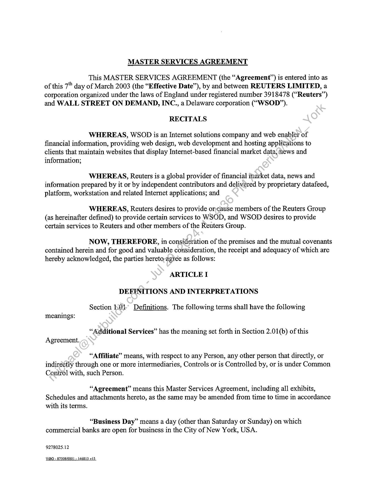
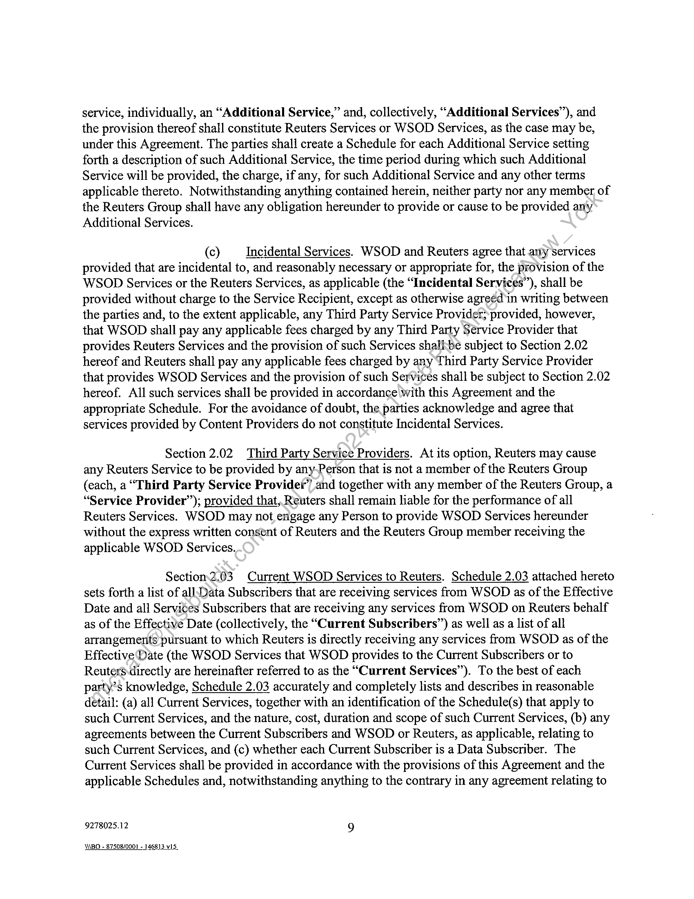
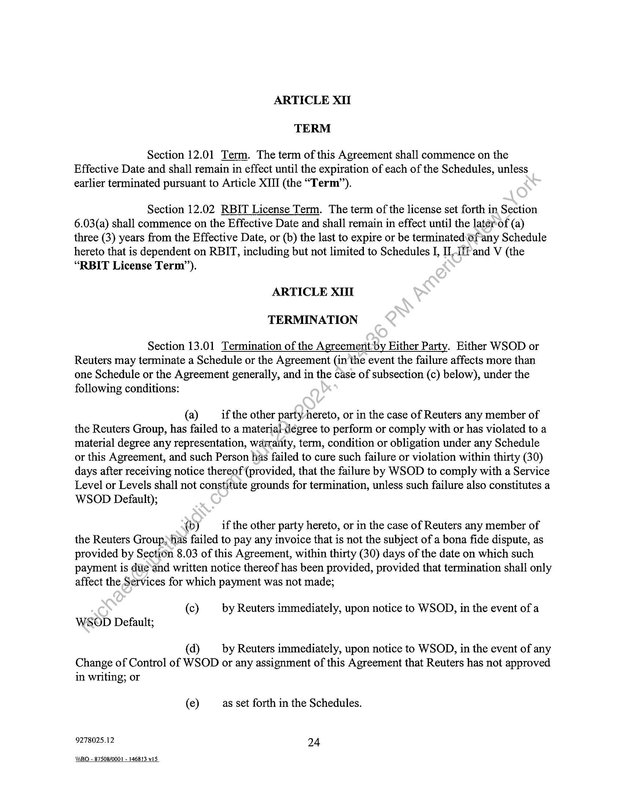
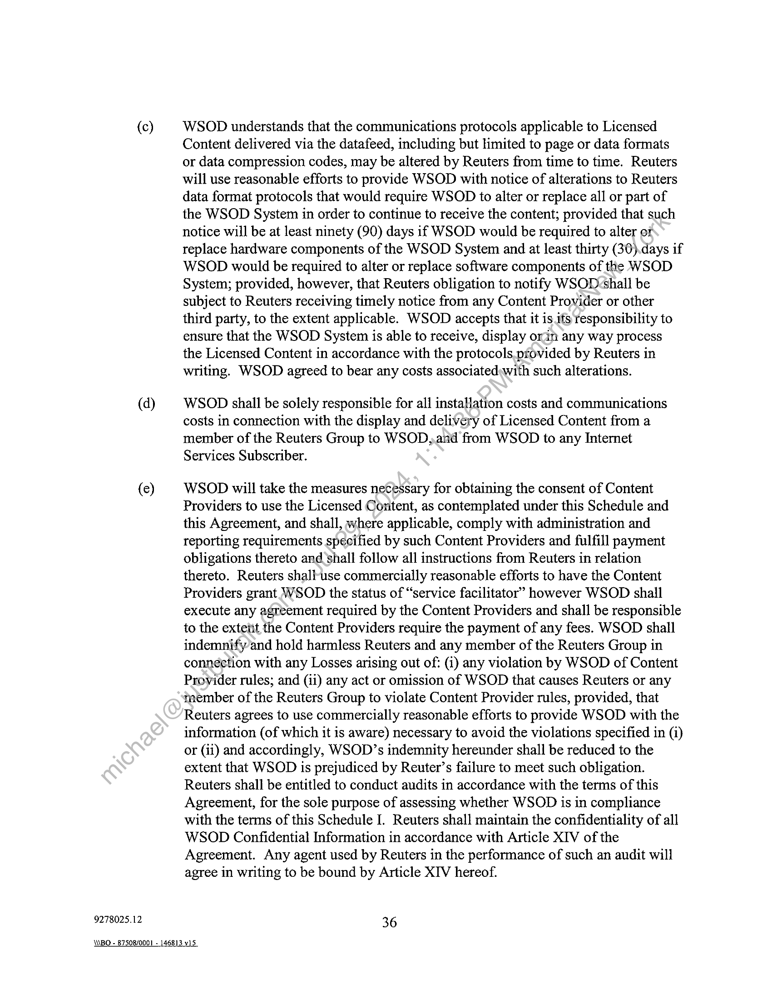
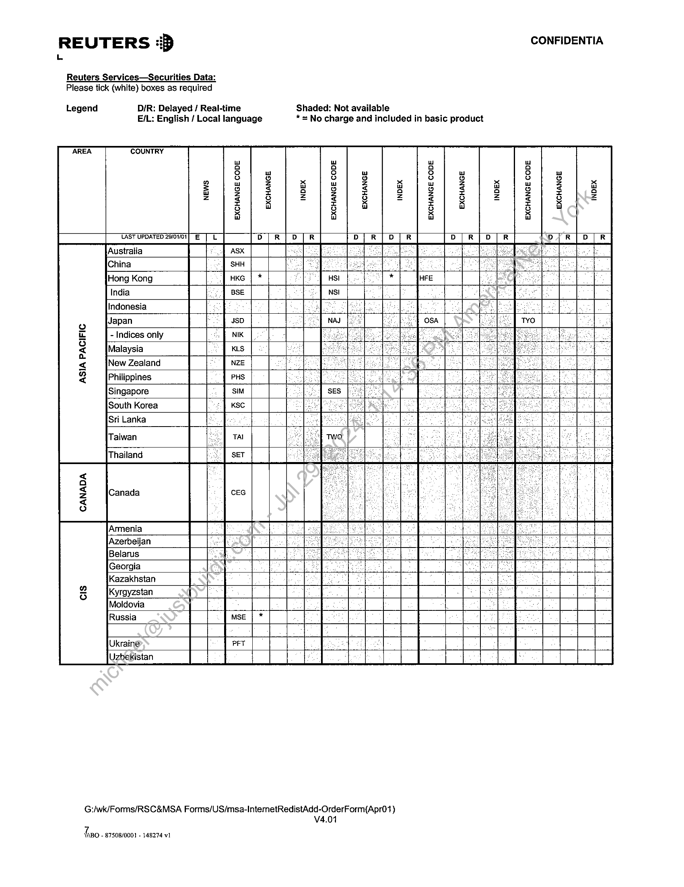
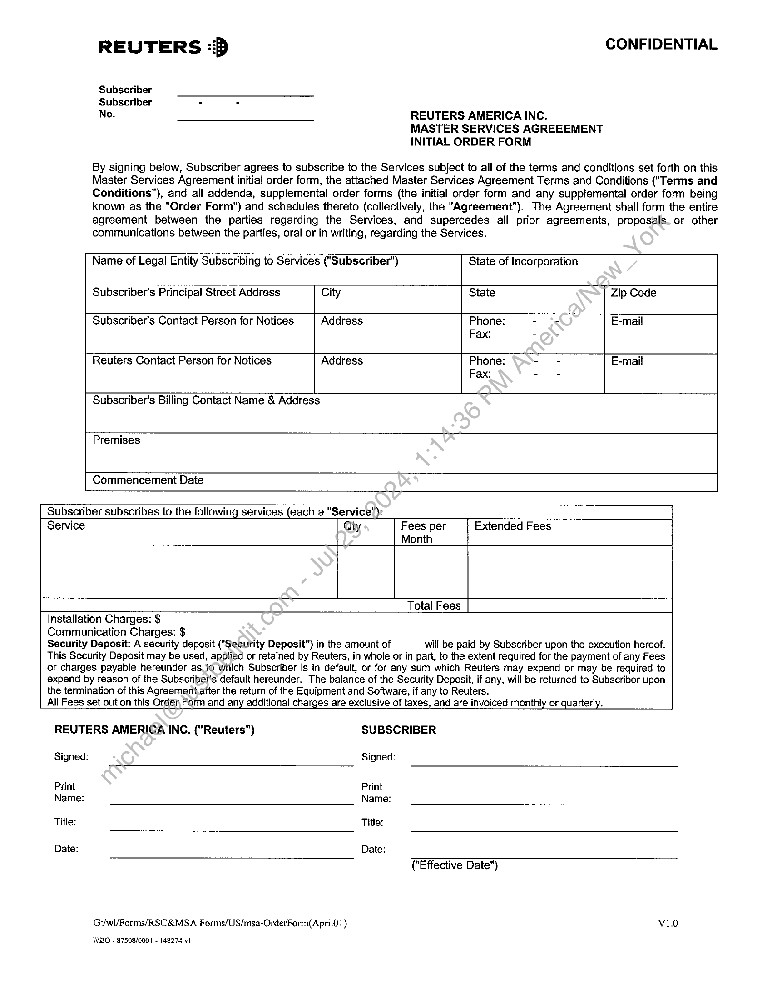
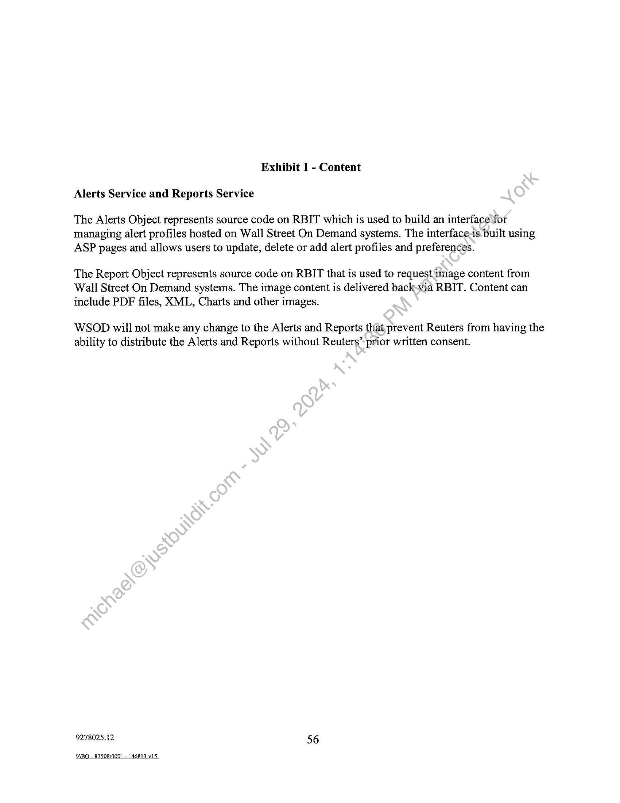
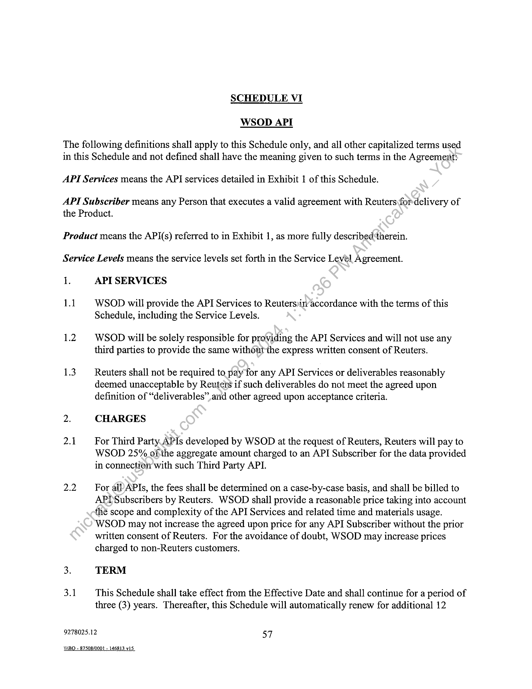

##### MASTER SERVICES AGREEMENT]

  
````col
```col-md
flexGrow=.5
===
> [!info] [Page 1](_attachments/images_Refinitiv-Limited-3.6.1.3.3MSA-2003.pdf_210619/page_1.png)
> 
```  
```col-md
MASTER SERVICES AGREEMENT  
BY AND BETWEEN  
REUTERS LIMITED  
AND  
WALL STREET ON DEMAND, INC.  
Dated March:7, 2003  
9278025.12  
ABO - 87508/0001 - 146813 v15.  
```
````
Notes:    
````col
```col-md
flexGrow=.5
===
> [!info] [Page 2](_attachments/images_Refinitiv-Limited-3.6.1.3.3MSA-2003.pdf_210619/page_2.png)
> 
```  
```col-md
MASTER SERVICES AGREEMENT  
This MASTER SERVICES AGREEMENT (the “Agreement”) is entered into as
of this 7" day of March 2003 (the “Effective Date”), by and between REUTERS LIMITED, a
corporation organized under the laws of England under registered number 3918478 (“Reuters”)
and WALL STREET ON DEMAND, INC., a Delaware corporation (“WSOD”).  
RECITALS  
WHEREAS, WSOD is an Internet solutions company and web enabler of
financial information, providing web design, web development and hosting applications to
clients that maintain websites that display Internet-based financial market data, news and
information;  
WHEREAS, Reuters is a global provider of financial market data, news and
information prepared by it or by independent contributors and delivered by proprietary datafeed,
platform, workstation and related Internet applications; and  
WHEREAS, Reuters desires to provide orcatise members of the Reuters Group
(as hereinafter defined) to provide certain services to WSOD, and WSOD desires to provide
certain services to Reuters and other members of the Reuters Group.  
NOW, THEREFORE, in consideration of the premises and the mutual covenants
contained herein and for good and valuable consideration, the receipt and adequacy of which are
hereby acknowledged, the parties hereto-agtee as follows:  
ARTICLE I
DEFINITIONS AND INTERPRETATIONS  
Section 1:01 Definitions. The following terms shall have the following
meanings:  
“Additional Services” has the meaning set forth in Section 2.01(b) of this
Agreement.  
“Affiliate” means, with respect to any Person, any other person that directly, or
indirettiy through one or more intermediaries, Controls or is Controlled by, or is under Common
Conirol with, such Person.  
“Agreement” means this Master Services Agreement, including all exhibits,
Schedules and attachments hereto, as the same may be amended from time to time in accordance
with its terms.  
“Business Day” means a day (other than Saturday or Sunday) on which
commercial banks are open for business in the City of New York, USA.  
9278025.12  
ABO - 87508/0001 - 14 viS  
```
````
Notes:    
````col
```col-md
flexGrow=.5
===
> [!info] [Page 3](_attachments/images_Refinitiv-Limited-3.6.1.3.3MSA-2003.pdf_210619/page_3.png)
> 
```  
```col-md
“Change of Control of WSOD” means any (i) sale of all or substantially all of
the assets of WSOD, (ii) sale or other transfer, whether by merger, consolidation or otherwise, of
greater than the Applicable Percentage of the outstanding voting securities of WSOD to any
Person, or (iii) issuance by WSOD of greater than the Applicable Percentage of new voting
securities of WSOD to any Person other than to the existing holders of securities of WSOD. The
term “Applicable Percentage” shall mean (x) where the Person is an entity, or an affiliate or,
successor of Bloomberg, L.P., MoneyLine Telerate, Sungard Data Systems, Thomson Finanezal,
Multex, Screaming Media, fifteen percent (15%) and (y) where the Person is any other entity not
listed in (x) above, fifty percent (50%). The merger of WSOD with or into its sole parent
corporation, WSOD Acquisition Corp., shall not be considered a Change of Controlof WSOD
(provided that the surviving company shall assume all rights and obligations of WSOD under
this Agreement).  
“Confidential Information” has the meaning set forth in Section 14.01 of this
Agreement.  
“Content” means data or information in any form, whether text, visual (still or
moving) audio or any combination of the foregoing.  
“Content Provider” means all exchanges and third party providers of news,
information, indices, and any other data made available to Subscribers.  
“Control” means (including the.terms “Controlled by” and “under Common
Control’), with respect to the relationship between or among two or more Persons, the
possession, directly or indirectly, or as trustee or executor, of the power to direct or cause the
direction of the affairs or management.of a Person, whether through the ownership of voting
securities, as trustee or executor, by contract or otherwise, including the ownership directly or
indirectly, of securities having the power to elect a majority of the board of directors or similar
body governing the affairs of'such Person.  
“Data Subscriber” has the meaning given to that term in the definition of
“Subscriber” herein.  
‘Pirectives” has the meaning set forth in Section 21.02 of this Agreement.
“Dispute Notice” has the meaning set forth in Section 15.01 of this Agreement.  
“Documentation” means the operator and user manuals and training materials for
use in conjunction with a computer program or component supplied under this Agreement.  
“Effective Date” has the meaning set forth in the preamble to this Agreement.
“Enhancements” has the meaning set forth in Section 6.04(a).  
“Incidental Services” has the meaning set forth in Section 2.01(c) of this
Agreement.  
9278025.12 2  
\\BO - 87508/0001 - 146813 v15  
```
````
Notes:    
````col
```col-md
flexGrow=.5
===
> [!info] [Page 4](_attachments/images_Refinitiv-Limited-3.6.1.3.3MSA-2003.pdf_210619/page_4.png)
> 
```  
```col-md
“Intellectual Property Rights” means patents, trade secrets and know-how,
Trademarks, rights in designs, trade or business names or signs, copyrights (including rights in
computer software), database rights and typography rights (whether or not any of these are
registered and including applications for registration of any such thing) and all rights or forms of
protection of similar nature or having equivalent or similar effect to any of these which may
subsist anywhere in the world.  
“Invalid Data Subscriber” means any Data Subscriber other than a Valid Data
Subscriber.  
“Invoicing Party” has the meaning set forth in Section 8.01.  
“Licensed Content” means any Content provided to WSOD.by any member of
the Reuters Group regardless of whether the Content is considered Reuters Content or that of
Third Party Content Providers.  
“Licensed Software” means any software licensed and provided to WSOD by
any member of the Reuters Group, whether or not it is Reutersproprietary Software.  
“Loss” or “Losses” means claims, liabilities, obligations, losses, costs, expenses,
litigation, proceedings, assessments, charges, demands or judgments of any kind or nature
whatsoever, including reasonable attorneys’ fees-and including claims by third parties (including
customers, employees and agents of Reuters or WSOD).  
“Negotiation Period” has the'meaning set forth in Section 15.01.
“Object Code” means the machine-readable form of a computer program.
“Paying Party” has the meaning set forth in Section 8.01.  
“Person” means any corporation, partnership, joint venture, limited liability
company, organization; entity, authority or individual.  
“Premises” means 3005 Center Green Drive, Boulder, Colorado 80301 and 8101
South Shaffer Parkway, Unit 5, Littleton, Colorado 80127.  
“Privacy Policy” has the meaning set forth in Section 21.03 of this Agreement.  
“Purchase Agreement” means that certain purchase agreement entered into by
and among Reuters International Holdings Sarl, WSOD and certain investors in connection with
the acquisition of WSOD by such investors, to the extent such agreement is executed and
delivered by the parties thereto.  
“RBIT” or “RBIT Software” means the Reuters Bridge Internet Toolkit, which
is a web services development toolkit enabling the construction of products and services utilizing
Internet technologies and the selected content offerings from Reuters, including the E-Core  
9278025.12 3  
MBO - 87508/0001 - 146813 v15.  
```
````
Notes:    
````col
```col-md
flexGrow=.5
===
> [!info] [Page 5](_attachments/images_Refinitiv-Limited-3.6.1.3.3MSA-2003.pdf_210619/page_5.png)
> 
```  
```col-md
entitlements functionality, as may be modified or enhanced from time to time by Reuters or its
designees.  
“RBIT License Term” has the meaning set forth in Section 12.02 of this
Agreement.  
“Releases” has the meaning set forth in Section 6.04.  
“Relevant Intellectual Property” means all Intellectual Property Rights which
are from time to time:  
i) owned by a Service Recipient; or  
(ii) used by a Service Recipient under license from a third party, where such
Service Recipient has the right to grant a sub-license to use the same to the Service Provider, or
can procure such right to grant a sub-license (or a direct license from, the licensor) without
incurring material costs.  
“Reuters” has the meaning set forth in the Recitals.  
“Reuters Content” has the meaning given to that term in Schedule I attached
hereto. The term “Reuters Content” shall only include content owned by a member of the
Reuters Group and shall exclude any content provided by Content Providers or other third
parties.  
“Reuters Equipment” means any hardware, networking equipment, middleware
and cabling as well as all related consumables used by Reuters in connection with the Reuters
Services, whether owned or leased by Reuters.  
“Reuters Group” means Reuters and its direct and indirect subsidiaries (whether
or not wholly-owned by.Reuters) and any holding company and any subsidiaries of such holding
company from time to.time, together with such entities as are from time to time operating as
authorized distributors in territories due to the local law not permitting Reuters to operate
through a subsidiary in those territories, and any joint ventures in which any of the foregoing
Persons has an‘interest. For the purpose of this definition, a company is a “subsidiary” of a
“holding company” (including where appropriate Reuters) if that holding company owns at least
fifty percent (50%) of that company or otherwise has the right to exercise Control over such
company.  
“Reuters Master Service Agreement” means the Reuters Master Service
Agreement - General Terms and Conditions between Reuters and any third party, including any
Internet Redistribution Addendum and related addenda and order forms. The Reuters Master
Service Agreement — General Terms and Conditions in effect as of the Effective Date is attached
as Exhibit 2 to Schedule I hereto, as may be modified from time to time in the sole and absolute
discretion of Reuters.  
9278025.12 4  
\WBO - 87508/0001 - 146813 vIS  
```
````
Notes:    
````col
```col-md
flexGrow=.5
===
> [!info] [Page 6](_attachments/images_Refinitiv-Limited-3.6.1.3.3MSA-2003.pdf_210619/page_6.png)
> 
```  
```col-md
“Reuters Services” has the meaning set forth in Section 2.01(a)(i) of this
Agreement.  
“Reuters Software” means, collectively, the RBIT Software and any other
software provided by Reuters in connection with the provision of WSOD Services or the receipt
of Reuters Services, but excluding any third party software.  
“RIC” means a Reuters Instrument Code.  
“Scope of Use” means the scope of use and other restrictions applicable to a
Person’s use of the Licensed Content and/or Licensed Software, or both, pursuarit-to the
applicable Reuters Master Services Agreement or any other agreement between’ Reuters and such
Person or between a third party software provider or Content Provider and such Person,
including the restrictions set forth in Section 6.05 of this Agreement.  
“Service Level Agreement” means the Service Level Agreement attached as
Schedule 3.01 to this Agreement and any service levels referredto in the Schedules attached
hereto.  
“Service Levels” has the meaning set forth in Section 3.03 of this Agreement.
“Service Provider” has the meaning:set forth in Section 2.02 of this Agreement.  
“Service Recipient” means (i) any member of the Reuters Group that receives
any WSOD Services, or (ii) WSOD, as applicable.  
“Services” means any\service or services provided by any member of the Reuters
Group (or any Third Party Service Provider on behalf of any member of the Reuters Group) or
by WSOD (or any Third Party Service Provider on behalf of WSOD) pursuant to this
Agreement, as described onthe applicable Schedules attached to this Agreement, including
Reuters Services and WSOD Services (each as defined herein).  
“Services Subscriber” has the meaning given to that term in the definition of
“Subscriber” herein.  
“Software” means, collectively, a computer program or component and its
associated Documentation.  
“Subscriber” means, except to the extent otherwise defined for the purposes of
any Schedule hereto, any Person that (i) receives Licensed Content as of the Effective Date or at
any time thereafter from Reuters or from WSOD or any other Person on behalf of Reuters (each,
a “Data Subscriber”), and/or (ii) receives WSOD Services as of the Effective Date or at any
time thereafter from Reuters or from WSOD or any other Person on behalf of Reuters (each, a
“Services Subscriber’).  
9278025.12 5  
ABO - 87508/0001 - 146813 v15  
```
````
Notes:    
````col
```col-md
flexGrow=.5
===
> [!info] [Page 7](_attachments/images_Refinitiv-Limited-3.6.1.3.3MSA-2003.pdf_210619/page_7.png)
> 
```  
```col-md
“Tax” or “Taxes” includes all taxes, levies, duties, imposts, charges and
withholdings of any nature whatsoever, including taxes on gross or net income profits or gains
and taxes on receipts, sales, use, operation, franchise, transfer, value added and personal
property, together with all penalties, charges and interest relating to any of them or to any late or
incorrect return in respect of any of them regardless of whether any such taxes, levies, duties,
imposts, charges, withholdings, penalties and interest are chargeable directly or primarily against
or attributable directly or primarily to any Service Provider, any member of the Reuters Group if
the Service Provider is a member of the Reuters Group or any other Person and of whether any
amount in respect of any of them is recoverable from any other Person.  
“Term” has the meaning set forth in Section 12.01 of this Agreement.  
“Third Party Service Provider” has the meaning set forth-in Section 2.03 of this
Agreement.  
“Trademarks” means trademarks, service marks, brand names, certification
marks, collective marks, d/b/a’s, Internet domain names, logos, symbols, trade dress, assumed
names, fictitious names, trade names, and other indicia of origisi, all applications and
registrations for all of the foregoing, and all goodwill associated therewith and symbolized
thereby, including all extensions, modifications and renewals of same.  
“Valid Data Subscriber” meansany Data Subscriber that has executed a valid
Reuters Master Service Agreement and is in good standing thereunder, including being in
compliance with the Scope of Use.  
“VAT” has the meaning set forth in Section 8.02(c) of this Agreement.  
“WIT” means the WSOD Intemet Toolkit, a WSOD proprietary web services
development toolkit.  
“Work Product” has the meaning set forth in Section 6.01 of this Agreement.
“WSOD” has the meaning set forth in the Recitals.  
“WSOD Default” means any failure of WSOD to meet any material Service
Level relating to any Subscriber for a period of five (5) consecutive days, or on ten (10) separate
occasionsin any thirty (30) day period, or on twenty (20) occasions in any ninety (90) day
periods.as reasonably measured by commercially available tools which can confirm legitimate
requests from Subscribers are not being fulfilled, except to the extent that such failure results
from: (i) Reuters network problems; (ii) any failure due to the Subscriber or its network; (iii) any
failure due to any third party telecommunications provider or internet services provider; or (iv)
any other cause beyond WSOD’s reasonable control, including, but not limited to, any event set
forth in Section 16.01 of this Agreement.  
“WSOD Services” has the meaning set forth in Section 2.01(a)(i) of this
Agreement.  
9278025.12 6  
\WBO - 87508/0001 - 146813 v15.  
```
````
Notes:    
````col
```col-md
flexGrow=.5
===
> [!info] [Page 8](_attachments/images_Refinitiv-Limited-3.6.1.3.3MSA-2003.pdf_210619/page_8.png)
> 
```  
```col-md
“WSOD Software” means any Software of WSOD that is reasonably necessary
or appropriate in connection with the provision of any WSOD Service, but excluding the Reuters
Software.  
Section 1.02 Interpretation, Terms Generally, Rules of Construction.  
(a) The Schedules shall have the same force and effect as if expressly
set out in the body of this Agreement, and any reference to this Agreement shall include-the
Schedules or any other Exhibit or attachment to this Agreement. To the extent that there is an
inconsistency or conflict between the terms of the body of this Agreement and the Scliedules, the
terms of the Schedule shall prevail to the extent of such inconsistency or conflict?  
(b) In construing this Agreement, unless the context otherwise
requires:  
(i) all defined terms shall apply.equally to both the plural as
well as the singular forms of the terms defined; any pronoun shal also include the corresponding
masculine, feminine and neuter forms;  
Gi) unless otherwise stated, the words “herein”, “hereunder”
and other similar words refer to this Agreement as a whole and not to a particular Section or
other subdivision;  
Gii) references to “Sections” and “Schedules” are to sections of,
and schedules to, this Agreement;  
(iv) ‘ateference to any statute or statutory provision shall be
construed as a reference to the same as it may have been, or may from time to time be, amended,
modified or re-enacted;  
(v) any reference to a “day” (including within the phrase
“Business Day”) means-a period of twenty-four (24) hours running from midnight to midnight;  
(vi) references to times are to local times in New York, New
York, unless-otherwise stated;  
(vii) areference to any other document referred to in this
Agreement is a reference to that other document as amended, varied, notated or supplemented
(other than in breach of the provisions of this Agreement) at any time;  
(viii) headings and titles are for convenience only and do not
affect the interpretation of this Agreement;  
(ix)  areference in relation to any particular jurisdiction to any  
specific legal term for any action, remedy, method of judicial proceeding, legal document, legal  
9278025.12 7  
BO - 87508/0001 - 146813 vIS  
```
````
Notes:    
````col
```col-md
flexGrow=.5
===
> [!info] [Page 9](_attachments/images_Refinitiv-Limited-3.6.1.3.3MSA-2003.pdf_210619/page_9.png)
> 
```  
```col-md
status, court, official or any legal concept or thing shall in respect of any other jurisdiction be
treated as a reference to any analogous term in that jurisdiction;  
(x) any list or examples following the word “including” shall
be interpreted without limitation to the generality of the preceding words;  
(xi) general words shall not be given a restrictive meaning,
where introduced by the word “other”, by reason of the fact that they are preceded by words
indicating a particular class of acts, matters or things, nor by reason of the fact that they are
followed by particular examples intended to be embraced by the general words; and  
(xii) references to “$” are to U.S. Dollars.  
Section 1.03 Agreement of the Reuters Group. For the avoidance of doubt, this
Agreement is entered into by Reuters for the benefit of the members ofthe Reuters Group and
the members of the Reuters Group shall be subject to the obligations.of Reuters under this
Agreement.  
ARTICLE IT  
PROVISION OF SERVICES
Section 2.01 Provision of Services.  
(a) Services. Beginning on the Effective Date of this Agreement, and
continuing until the termination of this Agreement or the termination of the applicable Service as
provided in Articles XII hereof:  
@ Reuters or any member of the Reuters Group shall provide
or cause to be provided to WSOD the Services listed in the attached Schedule I to this
Agreement (the “Reuters Services”).  
Gi) | WSOD shall provide to members of the Reuters Group the
Services listed incthe attached Schedule II through Schedule VII to this Agreement (the “WSOD
Services’).  
For the avoidance of doubt, Reuters shall not be required to refer the provision of the Services or
any other services to WSOD or to engage WSOD exclusively in connection therewith and
WSOD shall not be required to refer the provision of the Services or any other services to any
member or the Reuters Group or to engage any member of the Reuters Group exclusively in
connection therewith.  
(b) Additional Services. From time to time after the Effective Date,
the parties hereto may identify additional services that, upon the mutual written agreement of the
parties hereto, become Reuters Services or WSOD Services, as the case may be (any such
9278025.12 8  
BO - 87508/0001 - 146813 v15  
```
````
Notes:    
````col
```col-md
flexGrow=.5
===
> [!info] [Page 10](_attachments/images_Refinitiv-Limited-3.6.1.3.3MSA-2003.pdf_210619/page_10.png)
> 
```  
```col-md
service, individually, an “Additional Service,” and, collectively, “Additional Services”), and
the provision thereof shall constitute Reuters Services or WSOD Services, as the case may be,
under this Agreement. The parties shall create a Schedule for each Additional Service setting
forth a description of such Additional Service, the time period during which such Additional
Service will be provided, the charge, if any, for such Additional Service and any other terms
applicable thereto. Notwithstanding anything contained herein, neither party nor any member of
the Reuters Group shall have any obligation hereunder to provide or cause to be provided any
Additional Services.  
(c) Incidental Services. WSOD and Reuters agree that any services
provided that are incidental to, and reasonably necessary or appropriate for, the provision of the
WSOD Services or the Reuters Services, as applicable (the “Incidental Services”), shall be
provided without charge to the Service Recipient, except as otherwise agreéd'in writing between
the parties and, to the extent applicable, any Third Party Service Provider; provided, however,
that WSOD shall pay any applicable fees charged by any Third Party Service Provider that
provides Reuters Services and the provision of such Services shalibe subject to Section 2.02
hereof and Reuters shall pay any applicable fees charged by any Third Party Service Provider
that provides WSOD Services and the provision of such Services shall be subject to Section 2.02
hereof. All such services shall be provided in accordance with this Agreement and the
appropriate Schedule. For the avoidance of doubt, the parties acknowledge and agree that
services provided by Content Providers do not constitute Incidental Services.  
Section 2.02 Third Party Service Providers. At its option, Reuters may cause
any Reuters Service to be provided by any-Person that is not a member of the Reuters Group
(each, a “Third Party Service Provider’ and together with any member of the Reuters Group, a
“Service Provider’); provided that, Reuters shall remain liable for the performance of all
Reuters Services. WSOD may not engage any Person to provide WSOD Services hereunder
without the express written consent of Reuters and the Reuters Group member receiving the
applicable WSOD Services.  
Section.2.03 Current WSOD Services to Reuters. Schedule 2.03 attached hereto
sets forth a list of all.Data Subscribers that are receiving services from WSOD as of the Effective
Date and all Services Subscribers that are receiving any services from WSOD on Reuters behalf
as of the Effective Date (collectively, the “Current Subscribers’) as well as a list of all
arrangements-pursuant to which Reuters is directly receiving any services from WSOD as of the
Effective Date (the WSOD Services that WSOD provides to the Current Subscribers or to
Reuters directly are hereinafter referred to as the “Current Services”). To the best of each
party’s knowledge, Schedule 2.03 accurately and completely lists and describes in reasonable
detail: (a) ali Current Services, together with an identification of the Schedule(s) that apply to
such Current Services, and the nature, cost, duration and scope of such Current Services, (b) any
agreements between the Current Subscribers and WSOD or Reuters, as applicable, relating to
such Current Services, and (c) whether each Current Subscriber is a Data Subscriber. The
Current Services shall be provided in accordance with the provisions of this Agreement and the
applicable Schedules and, notwithstanding anything to the contrary in any agreement relating to  
9278025.12 9  
\WBO - 87508/0001 - 146813 vI5  
```
````
Notes:    
````col
```col-md
flexGrow=.5
===
> [!info] [Page 11](_attachments/images_Refinitiv-Limited-3.6.1.3.3MSA-2003.pdf_210619/page_11.png)
> 
```  
```col-md
the Current Services, the provision of such Current Services shall at a minimum comply with the
applicable Service Levels.  
Section 2.04 Delinquent Subscribers. The term “Delinquent Subscribers”
means those Persons identified on Schedule 2.04 hereto. During the six (6) month period
following the Effective Date (the “Grace Period”), WSOD shall enter into discussions with
Reuters and, to the extent deemed necessary by Reuters, such Delinquent Subscriber, with the
purpose of requiring such Delinquent Subscriber to become Valid Data Subscribers as sooras
reasonably practicable after the Effective Date and in any event within the Grace Period.
Notwithstanding the foregoing:  
(a) after the Grace Period, Reuters shall have the right to immediately,
with notice to WSOD, but without notice to such Delinquent Subscriber, cease providing any
Licensed Content to any Delinquent Subscriber; and  
(b) no Grace Period shall apply to any Invalid Data Subscribers other
than the Delinquent Subscribers.  
Section 2.05 Protocols. In order to ensure’the proper implementation of this
Agreement, the parties agree to implement and strictly adhere to the protocols set forth in
Schedule 2.05, which Schedule may be amended at any time upon the mutual agreement of the
parties.  
ARTICLE TI
WSOD SERVICE LEVEES AND REVIEWS; WSOD OBLIGATIONS
Section 3.01 Service Levels for WSOD Services. WSOD shall provide or cause  
to be provided to Reuters or the applicable member of the Reuters Group any WSOD Service
according to the Service Level Agreement.  
Section3.02 Obligations of the Service Recipient. Specific obligations with
respect to any Service Recipient hereunder may be set forth in the applicable Schedule. Where
no specific obligations for the applicable Service Recipient hereunder are set forth in the
applicable Schedule, such Service Recipient shall use commercially reasonable efforts, in
connectionwith receiving any such Service, to follow the reasonable policies, procedures and
practices\of the applicable Service Provider applicable to the Service in effect as of the
applicable date and shall also provide information and documentation sufficient for the
applicable Service Provider to perform the Service and making available, as reasonably
requested by the applicable Service Provider, sufficient resources and timely decisions,
approvals and acceptances to permit such Service Provider to meet its obligations hereunder.
The Service Provider’s obligation to provide any Services shall be contingent upon the Service
Recipient’s timely provision of all information, documentation, resources, approvals and
acceptances necessary for the Service Provider to perform such Services. For the avoidance of
doubt, the foregoing shall not apply to any party’s obligation to pay Content Provider fees.  
9278025.12 10  
\WBO - 87508/0001 - 146813 v15.  
```
````
Notes:    
````col
```col-md
flexGrow=.5
===
> [!info] [Page 12](_attachments/images_Refinitiv-Limited-3.6.1.3.3MSA-2003.pdf_210619/page_12.png)
> 
```  
```col-md
Section 3.03 _Service Levels Defined. For the purpose of this Agreement, the
service levels set forth in Sections 3.01 and in any Schedules and as may be supplemented,
amended or modified from time to time shall be referred to as “Service Levels.” The parties
shall utilize the necessary measurement and monitoring tools and procedures required to
accurately measure and report performance of the Services against the Service Levels, and shall
meet on a periodic basis as reasonably determined by Reuters to discuss and evaluate the actual
performance of such listed services against the Service Levels.  
Section 3.04 Technical Reviews. Reuters reserves the right to perform or have
third parties perform technical audits of any facilities, systems and/or applications. used by
WSOD to provide WSOD Services (“Reviews’’) with reasonable prior notice to\WSOD for the
sole purposes of ensuring that there are no security risks to the networks, applications, hardware,
systems or websites used by WSOD to perform WSOD Services hereunder and that WSOD has
sufficient continuity of business procedures in place. The Reviews may include physical
inspection, external scan, internal scan, process reviews and reviews of system configurations.
The Reviews shall be conducted by Reuters or its designees and atReuters’s expense. In
performing any Review, Reuters wil] not unreasonably interfere with the conduct of WSOD’s
business. Should any Review result in the discovery of material security risks to the network,
applications, hardware, systems or web sites used by WSOD to perform services for Reuters (the
“Systems”), Reuters shall immediately notify WSOD of such risks and WSOD shall respond to
Reuters in writing within three (3) days of WSOD’s receipt of such notice with WSOD’s plan to
take reasonable measures to promptly correct, repair or modify the Systems to effectively
eliminate the risk at no cost to Reuters. ShouldWSOD fail to initiate reasonable measures to
remedy the identified risk within ten (10) days of Reuters’ notice, Reuters may terminate this
Agreement immediately, under no cost or penalty, and such failure shall be deemed a “WSOD
Default” for the purposes of this Agreement. Reuters and its designees will maintain the
confidentiality of all WSOD Confidential Information to which they have access in accordance
with Article XIV, and all Reuters‘designees will agree in writing to be bound by Article XIV
hereof.  
Section3.05 Insurance. WSOD is responsible for and shall procure and
maintain for its own-benefit (i) commercial general liability insurance coverage, with respect to
the operations to.be-conducted by WSOD, and (ii) all insurance coverage required by Federal,
State or local law, including workers’ compensation insurance and employer’s liability coverage
for all employees of WSOD.  
Section 3.06 Additional WSOD Obligations. If Reuters owns or leases any
equipment on sites occupied by WSOD, WSOD shall (1) provide to Reuters or a member of the
Reuters Group with reasonable access to the equipment on such sites, (ii) use its commercially
reasonable efforts to perform any routine maintenance on such equipment (subject to
reimbursement by Reuters for all reasonable costs incurred by WSOD in so doing), (iii) maintain
any customary insurance WSOD has with respect to such sites and covering such equipment, and
(iv) provide Reuters with reasonable written notice at least one hundred eighty (180) Business
Days prior to the closing of any such site in order to allow Reuters or a member of the Reuters
Group to remove such equipment.  
9278025.12 11  
\WBO - 87508/0001 146813 v15  
```
````
Notes:    
````col
```col-md
flexGrow=.5
===
> [!info] [Page 13](_attachments/images_Refinitiv-Limited-3.6.1.3.3MSA-2003.pdf_210619/page_13.png)
> 
```  
```col-md
ARTICLE IV
Intentionally Omitted
ARTICLE V
EMPLOYEES  
Section 5.01 Performance. All Services hereunder shall be rendered in a
competent, professional and workmanlike manner, consistent with industry standards prevailing
at any time during the Term of this Agreement, by personnel having a level of skillin the area
commensurate with the requirements of the Services to be performed.  
Section 5.02 Replacement. Either party may, upon reasonable prior written
notice to the other party, request the replacement of any employee or Contractor who, in the
reasonable judgment of requesting party, has been delinquent in the performance of the Services.  
Section 5.03 Space. In the event the parties-agree that certain employees of
either party shall regularly report to work at the premises of the other party, the other party shall
provide such employees with adequate space, furniture.and network connectivity, provided that
such party shall be reimbursed for its actual cost (to be‘agreed between the parties) in providing
such space, furniture and network connectivity.  
ARTICLE VI
INTELLECTUAL PROPERTY  
Section 6.01 Ownership. WSOD acknowledges and agrees that Reuters owns
all Intellectual Property Rights‘in and to the Reuters Services, the Reuters Content, the Reuters
Software (including RBIT) and any RICs (including all Releases and Enhancements), each of
which constitute the valuable intellectual property and trade secrets of members of the Reuters
Group protected by database rights and other Intellectual Property Rights. The parties
acknowledge and agree that, in the past, there may have been RBIT code in WIT. WSOD
represents and warrants that WIT does not currently contain any RBIT code. Reuters
acknowledges that WSOD owns all Intellectual Property Rights in and to WIT, as well as all
IntellectualProperty Rights in and to the Alerts and Reports (as the Alerts and Reports are
defined in Schedule V). WSOD does not assert any copyright, trademark or trade dress rights
with fespect to the look and feel of the websites created or files delivered by WSOD as a part of
the.Current Services. As between WSOD and Reuters, WSOD owns all other Intellectual
Property Rights with respect to any WSOD products and/or WSOD Services provided in
connection with the Current Services, unless as otherwise specifically agreed by the parties in
writing. In the case of projects hereunder other than the Current Services, WSOD acknowledges
and agrees that except as otherwise agreed to by the parties in writing, Reuters will own all right,
title and interest in all Work Product arising from such other projects, including all Intellectual
Property Rights in such Work Product. For purposes of this Agreement, ““Work Product” means,  
9278025.12 12  
\WBO - 87508/0001 - 146813 v15  
```
````
Notes:    
````col
```col-md
flexGrow=.5
===
> [!info] [Page 14](_attachments/images_Refinitiv-Limited-3.6.1.3.3MSA-2003.pdf_210619/page_14.png)
> 
```  
```col-md
collectively: (a) all work product created, conceived, developed or first reduced to practice
hereunder by any member of the Reuters Group; and (b) all deliverables provided by WSOD in
connection with its provision of WSOD Services to, or on behalf of, any member of the Reuters
Group (subject to WSOD’s ownership of all pre-existing WSOD Intellectual Property contained
in such deliverables); either solely or in collaboration with others, including designs, inventions,
improvements, processes, computer programs, graphics, pictorial representations, user interfaces,
functional specifications, reports, spreadsheets, presentations and analyses. Except as otherwise
agreed to by the parties in writing, WSOD agrees that all of the Work Product is, shall be
deemed to be created and prepared as, and shall therefore constitute, a “work made forhire” by
Reuters as the “author” and owner to the extent permitted by United States copyright law.
Except as otherwise agreed to by the parties in writing, or to the extent that any, copyright or
other rights in the Work Product may be deemed not to constitute a “work made for hire,”
WSOD hereby agrees that this Section 6.01 shall automatically constitute @n irrevocable
assignment from WSOD to Reuters for good and valuable considerationthe receipt and
sufficiency of which are hereby acknowledged, of such rights (including any Trademark rights
and goodwill associated therewith). WSOD shall execute and deliver to Reuters any and all
further documents or instruments and do any and all further acts which Reuters (or its agents or
designees) reasonably requests, at Reuters’ expense, in orderio perfect and confirm Reuters’
rights in the Work Product and assist Reuters’ recordation of such rights in the United States
Copyright Office and other official offices, and shall provide all assistance reasonably requested
by Reuters, at Reuters’ expense, for purposes of defending, enforcing and otherwise protecting
its rights in and to the Work Product. Without-limiting the foregoing, WSOD shall obtain from
its employees and subcontractors all documents necessary to confirm Reuters’ exclusive
ownership of all rights in the Work Product, and shall promptly provide copies of such
documents to Reuters upon Reuters’ request. Reuters does not assert any copyright, trademark
or trade dress rights with respect to the’look and feel of any web site designed by WSOD using
RBIT which is not designed for, or on behalf of, any member of the Reuters Group. WSOD shall
retain all rights in any WSOD proprietary Intellectual Property, know-how, expertise or
techniques it brings with it,cuses or develops in providing the WSOD Services. To the extent that
a Subscriber or Reuters (on its own behalf or on behalf of any Subscriber) needs a license to use
any WSOD proprietary tools in order to use any WSOD deliverables that constitute Work
Product, WSOD hereby grants such entity a license to use the same (for purposes hereof, the
“WSOD LicensedIntellectual Property”), subject to the restrictions set forth in Section 6.05
below.  
Section 6.02 Reuters Trademarks. All rights with respect to Reuters’
Trademarks, whether now existing or which may hereafter come into existence, which are not
expressly granted to WSOD herein, are reserved to the Reuters Group. Reuters hereby grants to
WSOD a non-exclusive right (but not an obligation) to use the Reuters Trademarks solely as
reasonably necessary or appropriate in connection with the provision or receipt of Reuters
Services. WSOD will comply with any procedures with respect to the use of Reuters Trademarks
that are set forth in the Reuters Master Services Agreement or otherwise provided by Reuters to
WSOD in writing. Any goodwill generated through WSOD’s use of the Reuters Trademarks
shall inure solely to the benefit of the Reuters Group.  
9278025.12 13  
\WBO - 87508/0001 - 146813 vIS  
```
````
Notes:    
````col
```col-md
flexGrow=.5
===
> [!info] [Page 15](_attachments/images_Refinitiv-Limited-3.6.1.3.3MSA-2003.pdf_210619/page_15.png)
> 
```  
```col-md
Section 6.03 Licenses.  
(a) RBIT Software. During the RBIT License Term, Reuters hereby
grants to WSOD a non-exclusive, non-transferable, non-sublicensable, royalty-free, worldwide
license to copy and use the RBIT Software, in Object Code form, and the Documentation, and
any portion of WSOD software that is RBIT-Derivative, only for the purpose of (i) supporting
RBIT Subscribers for whom WSOD provides hosting services pursuant to Schedule II, (ii)
enabling WSOD to ensure that the Alerts Service and Reports Service (as defined in Schedule V)
operate properly as part of RBIT, and (iii) using portions of the RBIT Object Code to_gain access
to Reuters Content for the purpose of designing websites for Subscribers or any other Person
(provided that no portion of the RBIT Software may be provided to such Subscriber or Person).
WSOD shall attempt to procure for Reuters the right to designate all new Subscribers or Persons
for whom WSOD creates websites using RBIT as “clients of RBIT” or a sitnilar designation.  
For the avoidance of doubt, WSOD shall be entitled to use the E-Core functionality of the RBIT
Software solely in order to facilitate Reuters’ control of Data Subscriber entitlements.  
(b) Licensed Software. During the Term, Reuters hereby grants to
WSOD a non-exclusive, non-transferable, non-sublicensable}-royalty-free, worldwide license to
copy and use the Licensed Software (excluding RBIT or the RBIT Software, and excluding any
third party software described in Schedule 6.03 hereto) solely as reasonably necessary for
WSOD to receive the Reuters Services. WSOD acknowledges and agrees that it shall not have
the right to integrate the code of any Licensed Software, or any Release or Enhancement thereto,
into WIT.  
(c) RICs. Dufing the Term, Reuters hereby grants to WSOD a nonexclusive, non-transferable, non-sublicensable, royalty-free, worldwide license to use the RICs
solely for the purpose of retrieving and displaying Licensed Content from the applicable Service
pursuant to Schedule I attached hereto, and no other use of RICs may be made without the prior
written consent of Reuters.  
(d) Trademarks. WSOD hereby grants to Reuters and each member of
the Reuters Group a non-exclusive right (but not an obligation) to use the WSOD Trademarks
solely as reasonably-necessary or appropriate in connection with the provision or receipt of
Reuters Services)or WSOD Services, as applicable. Any goodwill generated through the Reuters
Group’s use of the WSOD Trademarks shall insure solely to the benefit of WSOD.  
(e) Third Party Software. Schedule 6.03 hereto (as the same may be
updated by the parties from time to time by amendment of such Schedule or as otherwise agreed
by the parties in writing) describes third party software that is necessary for WSOD to benefit
from the Reuters Services and is not included within the Licensed Software provided by Reuters.
WSOD acknowledges and agrees that it may be required to enter into an agreement directly with
such third party software provider in order to obtain a license to such third party software.  
( Equipment. If Reuters supplies any Reuters Equipment as part of
any Service the following will apply: @) WSOD will provide insurance coverage to protect the  
9278025.12 14  
ABO - 87508/0001 - 146813 v15_  
```
````
Notes:    
````col
```col-md
flexGrow=.5
===
> [!info] [Page 16](_attachments/images_Refinitiv-Limited-3.6.1.3.3MSA-2003.pdf_210619/page_16.png)
> 
```  
```col-md
Equipment against loss and damage and shall be liable for all loss or damage to the Equipment,
unless due to an act or omission of Reuters; and (ii) WSOD agrees it will be responsible for
keeping its own software and hardware compatible with the Equipment.  
Section 6.04 Software Maintenance.  
(a) Supply of Releases. During the Term, Reuters will provide WSOD
with all (i) maintenance releases (including fixes and patches) (“Releases”) and (ii) generally
available enhancements (including those which include new functionality) (“Enhancements”)
for the Reuters Software, and other enhancements to the foregoing computer programms as may be
necessary to maintain software compatibility and functionality with the network, atthe same
time they are implemented and generally made available as part of Reuters business. Nothing
herein shall require Reuters to develop any Release or Enhancement. WSOD shall install any
such Releases and Enhancements after receipt from Reuters; provided that, if there is a problem
with any Release or Enhancement, WSOD shall so notify Reuters and-the parties shall work
together to resolve the issue.  
(b) WSOD Recommendations. WSOD may not create enhancements
or derivative works of, or modifications to, RBIT or the RBIT Software. WSOD shall have the
right to make recommendations to Reuters regarding modifications to the functionality of RBIT.
Reuters may, at its sole option, include some recommendations in any Enhancements. Reuters
shall own all Intellectual Property Rights in suchyEnhancements, and shall provide such
Enhancements in accordance with Section 6.04(a).  
Section 6.05 Restrictions: Subject to the foregoing rights granted to WSOD
pursuant to this Article VI, WSOD shall not do, attempt to do, nor permit any other Person to do,
any of the following with respect to the Licensed Software, and Reuters shall not do, attempt to
do, nor permit any other Person.to do, any of the following with respect to the WSOD Licensed
Intellectual Property:  
(a) use the Licensed Software or the WSOD Licensed Intellectual
Property for any purpose, at any location or in any manner not specifically authorized by this
Agreement;  
(b) make or retain any copy of the Licensed Software or the WSOD
Licensed Intellectual Property except as specifically authorized by this Agreement and as
reasonably necessary in connection with: (i) the provision of the WSOD Services or receipt of
the Reuters Services, in the case of WSOD’s use of Licensed Software; and (ii) the use of
WSOD deliverables that constitute Work Product, in the case of Reuters’ use of the WSOD
Licensed Intellectual Property;  
(c) create or recreate the source code for the Licensed Software or
WSOD Licensed Intellectual Property, or re-engineer, reverse engineer, decompile or
disassemble the Licensed Software or WSOD Licensed Intellectual Property;  
9278025.12 15  
AWBO - 87508/0001 - 146813 vI5  
```
````
Notes:    
````col
```col-md
flexGrow=.5
===
> [!info] [Page 17](_attachments/images_Refinitiv-Limited-3.6.1.3.3MSA-2003.pdf_210619/page_17.png)
> 
```  
```col-md
(d) modify, adapt, translate or create derivative works based upon the
Licensed Software or WSOD Licensed Intellectual Property, or combine or merge any part of the
Licensed Software or WSOD Licensed Intellectual Property with or into any other software;  
(e) remove, erase or tamper with any copyright or other proprietary
notice printed or stamped on, affixed to, or encoded or recorded in any Licensed Software or
WSOD Licensed Intellectual Property, or fail to preserve all copyright and other proprietary
notices in any copy of the Licensed Software or WSOD Licensed Intellectual Property;  
() sell, market, license, sublicense, distribute or otherwise grant to
any Person, including any outsourcer, vendor, consultant or partner, any right to\Use any
Licensed Software or WSOD Licensed Intellectual Property;  
(g) use the Licensed Software or WSOD Licensed Intellectual
Property in any manner as to violate any federal, state or local law or regulation, domestic or
foreign, or to harass, threaten or defame (whether through libel orslander) any Person, or to send
or assist in the sending of unsolicited advertisements or solicitations to any Person;  
(h) use the Licensed Software or WSOD Licensed Intellectual
Property to conduct any type of service bureau or time-sharing operation or to provide remote
processing, network processing, network telecommunications or similar services to any Person,
whether on a fee basis or otherwise (subject to Reuter’s acknowledgement that WSOD’s use of
the Licensed Software in the manner(s) used as.of the Effective Date does not violate this
subsection (h)); or  
(0) disclose-the Licensed Software or WSOD Licensed Intellectual
Property to any Person. WSOD shalimaintain the Licensed Software and Reuters shall maintain
the WSOD Licensed Intellectual.Property in confidence, protecting it using the same means as it
uses to protect its own most sensitive trade secrets and proprietary information, and in any event
reasonable means, and shall \not use it for any purposes other than the purposes contemplated by
this Agreement. The foregoing obligations of confidentiality will apply to all officers, directors
and employees, and al!permitted consultants and contractors, of WSOD and Reuters and are in
addition to, and notvn lieu of, the obligations regarding Confidential Information set forth in
Article XIV hereof.  
ARTICLE VII
FEES AND CHARGES  
Section 7.01 Payment Terms. The fees and charges for the Services shall be as
set forth on the applicable Schedule to this Agreement for each of the Services listed therein.  
Section 7.02 Revenue Sharing. In the event Reuters is required to collect fees
from Subscribers for a particular Service and remit a portion or percentage of such fees to  
9278025.12 16  
\WBO - 87508/0001 - 146813 vis  
```
````
Notes:    
````col
```col-md
flexGrow=.5
===
> [!info] [Page 18](_attachments/images_Refinitiv-Limited-3.6.1.3.3MSA-2003.pdf_210619/page_18.png)
> 
```  
```col-md
WSOD, and WSOD instead receives fees from a Subscriber in respect of such Services, WSOD
shall remit to Reuters the portion or percentage of fees that Reuters otherwise would have been
entitled to had Reuters received the fees for such Services directly from the Subscriber. In the
event WSOD is required to collect fees from Subscribers for a particular Service and remit a
portion or percentage of such fees to Reuters, and Reuters instead receives fees from a
Subscriber in respect of such Services, Reuters shall remit to WSOD the portion or percentage of
fees that WSOD otherwise would have been entitled to had WSOD received the fees for such
Services directly from the Subscriber.  
ARTICLE VII
INVOICING AND PAYMENT  
Section 8.01 Invoices. Each party shall invoice (the “Invoicing Party”) the
other party (the “Paying Party”) monthly for all charges for Services, Unless otherwise specified
in the applicable schedule to this Agreement. For the avoidance of doubt, where a pre-specified
amount, or minimum amount, of fees are specified to be paid per.month, and where the Services
are provided for only a portion of such month, the fees payable’shall be the pro rata amount
corresponding to the portion of such month during which the Services were provided. The
parties shall mutually agree on an appropriate invoicing process to ensure the timely payment of
invoices. Where Reuters is the Paying Party, Reuters may set off any fees or other consideration
due to any member of the Reuters Group pursuant to the Agreement or any other agreement
between the WSOD and any member of the Reuters Group, against the fees that it owes to
WSOD.  
Section 8.02 Taxes.and Duties. All sums payable by the applicable Service
Recipient (or in the case of Reuters, the applicable member of the Reuters Group) to Reuters or
the applicable member of the Reuters Group or WSOD, as the case may be, or any Third Party
Service Provider, pursuant to‘the terms of this Agreement shall be:  
(a) Paid within thirty (30) days of receipt of an invoice;  
(b) __ paid free and clear of all deductions or withholdings on account of
Taxes, except-asmay be required by any applicable law. In the event that any payment is subject
to a withholding or deduction required by law, the applicable Service Provider shall be entitled to
receive from the applicable Service Recipient (and in the case of Reuters, the applicable
members’of the Reuters Group) all reasonable assistance to enable it to obtain a credit in respect
of such withholding or deduction;  
(c) exclusive of amounts in respect of value added tax (“WAT”), sales
tax and other indirect Taxes (if any) which shall be paid in addition to such amount by the
applicable Service Recipient on issue of a valid VAT invoice or equivalent document at the rate
and in the manner from time to time being prescribed by law.  
9278025.12 17  
AWNBO - 87508/0001 - 146813 ¥15.  
```
````
Notes:    
````col
```col-md
flexGrow=.5
===
> [!info] [Page 19](_attachments/images_Refinitiv-Limited-3.6.1.3.3MSA-2003.pdf_210619/page_19.png)
> 
```  
```col-md
Section 8.03 Disputed Invoices. If either party in good faith disputes the
accuracy or legitimacy of any charge or invoice, such party shall promptly notify the other party
of such dispute and pay or procure the payment of any undisputed amount by the due date. To
the extent that the dispute cannot be resolved between Reuters and WSOD as set forth in Section
15.01, the parties shall seek to resolve the matters in dispute in accordance with Section 15.02
hereof.  
Section 8.04 Records. Each party shall maintain complete and accurate-records
of, and supporting documentation for, the amounts billable to and payments made by the Paying
Party hereunder, in accordance with generally accepted accounting principles as in effect in the
United States on a consistent basis, and all Licensed Content provided. The Invoicing Party
agrees to provide the Paying Party with documentation and other information-with respect to
each invoice as may be reasonably requested by the Paying Party to verify-accuracy and
compliance with the provisions of this Agreement. Each party will retaiaall such monthly
records for a period of two years.  
Section 8.05 Audits. Each party shall allow the‘other party or its agents, upon
reasonable prior notice, to inspect, audit, copy and analyze such party’s books and records as
reasonably necessary for the sole purpose of substantiating any fees and expenses incurred by
the Paying Party hereunder, during business hours at the Invoicing Party’s place of business.
Such inspection (i) shall occur no more than once per contract year commencing on the Effective
Date, (ii) will not commence any later than nine‘months subsequent to the termination of this
Agreement unless such audit is required by either party because such party is being audited by a
third party, in which event such audit will not commence any later than two years subsequent to
the termination of this Agreement, and (iti) the party initiating the inspection shall bear the cost
of the inspection and audit; provided, however, that in the event during the course of an audit of
the Invoicing Party, the Paying Party finds evidence which suggests that the Invoicing Party has
engaged in unauthorized activities, improper record keeping or overbilling of payments in excess
of ten percent (10%) of the amount required to be paid by the Paying Party, such evidence is
presented to the Invoicing Party, and the Invoicing Party is unable to reconcile such evidence
after being given a reasonable period of time in which to do so, then such cost shall be borne by
the Invoicing Party,All overpayments shall be promptly remitted to the Paying Party, together
with interest at the, rate of eighteen percent (18%) per annum or the maximum rate allowed by
law, whicheveris lower, accruing from the dates such payments were due and owing. The
Paying Party-and its agents shall maintain the confidentiality of all of the Invoicing Party’s
Confidential Information to which they have access in accordance with Article XTV, and the
Paying Party’s agents will agree in writing to be bound by Article XIV hereof.  
ARTICLE Ix
REPRESENTATIONS, WARRANTIES AND COVENANTS
Section 9.01 Reuters Representations, Warranties and Covenants. Reuters
hereby represents, warrants and covenants that (a) it and each member of the Reuters Group has  
full power to enter into and perform their obligations under this Agreement; (b) it has obtained  
9278025.12 18  
\WBO - $7508/0001 - 146813 vI5.  
```
````
Notes:    
````col
```col-md
flexGrow=.5
===
> [!info] [Page 20](_attachments/images_Refinitiv-Limited-3.6.1.3.3MSA-2003.pdf_210619/page_20.png)
> 
```  
```col-md
all necessary corporate approvals to enter into and execute this Agreement; (c) the use by WSOD
of the Reuters Software as permitted hereunder does not and shall not infringe upon the
Intellectual Property Rights of any Person, (d) other than as listed on Schedule 6.03, it has all
necessary rights and licenses to use any Licensed Software owned by third parties and to license
such Licensed Software to WSOD in accordance with the terms hereof; (e) the Reuters Services
(other than the Licensed Content and other than any Licensed Software listed on Schedule 6.03)
do not and shall not infringe upon the Intellectual Property Rights of any Person, and (f) its
performance and the performance by each member of the Reuters Group under this Agreement
does not or shall not conflict with any other material agreement or obligation to whichany of
them is a party or by which any of them is bound.  
Section 9.02 Exceptions. The warranty set forth in Section 9:01(c) above shall
not apply to the extent the alleged infringement is attributable to (a) the combination of the
Licensed Software with products or software not provided by Reuters, (b)-the modification or
alteration of the Licensed Software by any Person other than Reuters or its agent, (c) use of any
version of the Licensed Software other than the latest version provided by Reuters more than six
months after Reuters delivered such latest version to WSOD, or (d) use of the Licensed Software
in any manner not permitted under this Agreement or for any-purpose for which it was not
intended. In the event that WSOD’s use of the Licensed Software is enjoined by a court of
competent authority, or in the event that Reuters determines in its sole discretion that the Reuters
Software may become the subject of an infringement claim, Reuters may, at its sole option and at
its expense, either: (i) procure for WSOD the right to use the Licensed Software, or (ii) modify
the Licensed Software to avoid infringement«without material impairment of its functionality, or
(iii) if neither of the foregoing remedies can be obtained upon commercially reasonable terms,
terminate the applicable Software license and require WSOD to remove and return to Reuters all
copies of the applicable Software inits;possession. THIS SECTION AND SECTION 10.04
STATE REUTER’S SOLE LIABILITY HEREUNDER WITH RESPECT TO
INFRINGEMENT OF ANY INTELLECTUAL PROPERTY RIGHTS IN CONNECTION
WITH ANY LICENSED SOFTWARE.  
9278025.12 19  
\WBO - 87508/0001 - 146813 vI5  
```
````
Notes:    
````col
```col-md
flexGrow=.5
===
> [!info] [Page 21](_attachments/images_Refinitiv-Limited-3.6.1.3.3MSA-2003.pdf_210619/page_21.png)
> 
```  
```col-md
Section 9.03 WSOD Representations, Warranties and Covenants. WSOD
hereby represents, warrants and covenants: that (i) it has full power to enter into and perform its
obligations under this Agreement; (ii) it has obtained all necessary corporate approvals to enter
into and execute this Agreement; (iii) except as disclosed in, and subject to the terms of, the
Purchase Agreement, the WSOD Software and the Services provided hereunder by WSOD,
including the Alerts Service and Reports Service, do not and shall not infringe upon the
Intellectual Property Rights of any Person; and (iv) its performance under this Agreement does
not or shall not conflict with any other material agreement or obligation to which it is a party or
by which it is bound. The warranty set forth in subparagraph (iii) shall not apply to the extent
that the infringement is attributable to Licensed Content, and furthermore, shall not@pply with
respect to any claim that the WSOD Software and the Services provided by WSOD, including
the Alerts Service and Reports Service, infringes any third party rights, which claim arises prior
to the Effective Date of this Agreement.  
ARTICLE X  
DISCLAIMER OF WARRANTIES, LIMITATION OF LIABILITY AND
INDEMNIFICATION  
Section 10.01 REUTERS DISCLAIMER’OF WARRANTIES. EXCEPT AS
OTHERWISE PROVIDED IN THIS AGREEMENT, REUTERS, ON BEHALF OF ITSELF
AND EACH MEMBER OF THE REUTERS GROUP, EXPRESSLY DISCLAIMS ALL
WARRANTIES, CONDITIONS, GUARANTEES OR REPRESENTATIONS, WHETHER
EXPRESS OR IMPLIED, IN LAW OR INFACT, ORAL OR IN WRITING. WITHOUT
LIMITING THE GENERALITY OF THE- FOREGOING, NEITHER REUTERS NOR ANY
CONTENT PROVIDER OR OTHER THIRD PARTY PROVIDER MAKES ANY
WARRANTY, EXPRESS OR IMPLIED, AS TO THE RESULTS THAT MAY BE
OBTAINED FROM THE USE-OF THE LICENSED SOFTWARE, THE LICENSED
CONTENT, OR ANY OTHER SERVICES PROVIDED BY REUTERS OR ANY REUTERS
GROUP MEMBER HEREUNDER, AND REUTERS AND EACH CONTENT PROVIDER OR
OTHER THIRD PARTY PROVIDER EXPRESSLY DISCLAIMS ANY CONDITION OF
QUALITY AND ANY IMPLIED WARRANTY OF TITLE, NON-INFRINGEMENT,
MERCHANTABILITY OR FITNESS FOR A PARTICULAR PURPOSE. REUTERS MAKES
NO REPRESENTATIONS OR WARRANTIES AS TO THE QUALITY, SUITABILITY OR
ADEQUACY OF THE LICENSED SOFTWARE, THE LICENSED CONTENT, AND ANY
OTHER-SERVICES FOR ANY PURPOSE OR USE.  
Section 10.02 INACCURACIES OF SERVICE. ALTHOUGH REUTERS
MAKES REASONABLE EFFORTS TO ENSURE THE ACCURACY AND RELIABILITY
OF THE REUTERS SOFTWARE AND REUTERS CONTENT, NEITHER REUTERS NOR
ANY CONTENT PROVIDER OR OTHER THIRD PARTY PROVIDER GUARANTEES THE
ACCURACY OR RELIABILITY OF THE LICENSED SOFTWARE, THE LICENSED
CONTENT AND ANY OTHER SERVICES PROVIDED BY REUTERS OR ANY MEMBER
OF THE REUTERS GROUP, AND WSOD AND EACH SUBSCRIBER ACKNOWLEDGES
THAT REUTERS, ITS EMPLOYEES, AGENTS, CONTRACTORS, SUB-CONTRACTORS,  
9278025.12 20  
\WBO - 87508/0001 - 1. vl  
```
````
Notes:    
````col
```col-md
flexGrow=.5
===
> [!info] [Page 22](_attachments/images_Refinitiv-Limited-3.6.1.3.3MSA-2003.pdf_210619/page_22.png)
> 
```  
```col-md
CONTENT PROVIDERS AND OTHER THIRD PARTY PROVIDERS WILL NOT BE HELD
LIABLE FOR ANY DAMAGES SUFFERED OR INCURRED BY ANY SUBSCRIBER, ANY
CUSTOMER OF A SUBSCRIBER OR ANY OTHER PERSON OR ENTITY ARISING OUT
OF ANY FAULT, INTERRUPTION OR DELAY IN ANY LICENSED SOFTWARE,
LICENSED CONTENT OR OTHER SERVICE OR OUT OF ANY INACCURACY, ERROR
OR OMISSION IN ANY LICENSED SOFTWARE, LICENSED CONTENT OR OTHER
SERVICE, HOWEVER SUCH FAULTS, INTERRUPTIONS, DELAYS, INACCURACIES,
ERRORS OR OMISSIONS ARISE EXCEPT TO THE EXTENT ARISING OUT OF THE
GROSS NEGLIGENCE OR INTENTIONAL MISCONDUCT OF REUTERS OR ANY
MEMBER OF THE REUTERS GROUP.  
Section 10.03 WSOD DISCLAIMER OF WARRANTIES.  
 EXCEPT AS
OTHERWISE PROVIDED IN THIS AGREEMENT, WSOD DISCLAIMS.ALL
WARRANTIES, EXPRESS OR IMPLIED, INCLUDING, BUT NOT LIMITED TO, THE
IMPLIED WARRANTIES OF MERCHANTABILITY AND FITNESS FOR A PARTICULAR
PURPOSE, WITH RESPECT TO THE WSOD SERVICES. WITHOUT LIMITING THE
GENERALITY OF THE FOREGOING, WSOD DOES NOT-MAKE ANY WARRANTY,
EXPRESS OR IMPLIED, AS TO THE RESULTS THAT MAY BE OBTAINED FROM THE
USE OF THE WSOD SERVICES PROVIDED BY WSO HEREUNDER, AND WSOD
EXPRESSLY DISCLAIMS ANY CONDITION OF QUALITY AND ANY IMPLIED
WARRANTY OF TITLE, NON-INFRINGEMENT, MERCHANTABILITY OR FITNESS FOR
A PARTICULAR PURPOSE. EXCEPT AS OTHERWISE PROVIDED IN THIS
AGREEMENT, WSOD MAKES NO REPRESENTATIONS OR WARRANTIES AS TO THE
QUALITY, SUITABILITY OR ADEQUACY OF THE WSOD SERVICES FOR ANY
PURPOSE OR USE.  
Section 10.04 Limitation of Liability; Indemnification of WSOD.  
(a) Subject to the limitations provided in Sections 10.01 and 10.04(b),
Reuters shall be solely liable-and responsible for, and shall indemnify WSOD, the members of its
group, and its directors, officers, employees, agents, representatives and Affiliates from, any and
all Losses arising from-(i) any breach by any member of the Reuters Group under this Agreement
including breach ofany representation, warranty or covenant hereunder, (ii) the gross negligence
or willful misconduct of any member of the Reuters Group with respect to the performance of
the Reuters Services to be provided hereunder; and (iii) any member of the Reuters Group’s use
of any license hereunder in violation of the scope of the license rights granted hereunder. To the
extentithat this Section constitutes an obligation for Reuters to indemnify WSOD with respect to
Losses arising from any claim that Licensed Software not owned by Reuters infringes the
Intellectual Property Rights of any Person, such indemnification obligation shall only apply to
the extent that Reuters has an indemnity from its licensor thereof that would cover such claim.  
(b) In no event shall any member of the Reuters Group or any Third
Party Service Provider of Reuters be liable to WSOD for Losses in excess of $1,000,000;
provided, however, that this limitation shall not apply to actions set forth in Section 9.01(c), (d)
or (e), Section 10.04.(a)(ii), any obligation to pay fees for services rendered, and Reuters  
9278025.12 21  
ABO - 87508/0001 - 146813 v15.  
```
````
Notes:    
````col
```col-md
flexGrow=.5
===
> [!info] [Page 23](_attachments/images_Refinitiv-Limited-3.6.1.3.3MSA-2003.pdf_210619/page_23.png)
> 
```  
```col-md
obligations under Article’s XIV and XXI. In no event shall any member of the Reuters Group or
any Third Party Service Provider of Reuters have any liability for any incidental, indirect, special
or consequential damages, whether or not caused by or resulting from negligence, willful
misconduct or breach of any obligations hereunder, and whether or not informed of the
possibility of the existence of such damages.  
(c) Upon termination of this Agreement or the earlier termination‘of
any Reuters Services hereunder, the members of the Reuters Group and any Third Party-Service
Provider of Reuters shall be obligated to return to WSOD, as soon as is reasonably practicable,
any equipment or other property of WSOD relating to the Reuters Services whichis" its control
or possession.  
Section 10.05 Limitation of Liability; Indemnification of Reuters.  
(a) Subject to the limitations provided in Séetions 10.03 and 10.05(b),
WSOD shall be solely liable and responsible for, and shall indemnify Reuters, the members of
the Reuters Group, and its directors, officers, employees, agents;representatives and Affiliates
from, any and all Losses arising from (i) any breach by WSOQD under this Agreement, including
breach of any representation, warranty or covenant hereurider, (ii) the gross negligence or willful
misconduct of WSOD with respect to the performance ofthe WSOD Services to be provided
hereunder, and (111) WSOD’s use of the Licensed Software in violation of the scope of the license
rights granted hereunder.  
(b) In no event shall’ WSOD or any Third Party Service Provider of
WSOD be liable to Reuters and the members of Reuters Group for Losses in excess of
$1,000,000; provided, however, that this limitation shall not apply to actions set forth in Section
9.03 (iii), Section 10.05(a)(ii), any obligation to pay fees for services rendered, and WSOD’s
obligations under Article’s XTV,XXI and Section 2.2(e) of Schedule I hereto; and provided that,
with respect to penalties under,all Service Level Agreements, in no event shall WSOD or any
Third Party Service Provider-of WSOD be liable to Reuters and the members of the Reuters
Group for Losses in excess of $1,000,000 per calendar year. In no event shail WSOD or any
Third Party Service Provider of WSOD have any liability for any incidental, indirect, special or
consequential damages, whether or not caused by or resulting from negligence, willful
misconduct or bieach of any obligations hereunder, and whether or not informed of the
possibility ofithe existence of such damages.  
(c) Upon termination of this Agreement or the earlier termination of
any. WSOD Services hereunder, WSOD and any Third Party Service Provider of WSOD shall be
obligated to return to Reuters, as soon as is reasonably practicable, any equipment or other
property of Reuter’s or any member of the Reuters Group relating to the WSOD Services which
is in its control or possession.  
Section 10.06 Indemnification Procedure. In the event of the assertion or
commencement by any Person of any claim with respect to which WSOD or Reuters may
become obligated to indemnify the other party (a ““Claim’”) the indemnitee shall promptly send to  
9278025.12 22  
\WBO - 87508/0001 - 146813 vI5  
```
````
Notes:    
````col
```col-md
flexGrow=.5
===
> [!info] [Page 24](_attachments/images_Refinitiv-Limited-3.6.1.3.3MSA-2003.pdf_210619/page_24.png)
> 
```  
```col-md
the indemnitor a written notice specifying the nature of such claim, and the amount or estimated
amount if known (which estimate shall not be conclusive of the final amount of such claim and
demand) (a “Claim Notice”); provided, however, that any failure to give such notice will not
waive any rights of the indemnitee except to the extent that the rights of the indemnitor are
actually prejudiced. In the event of a Claim and promptly after delivery of a Claims Notice, the
indemnitor shall be entitled to participate therein and, if it so desires, assume the defense thereof
and, after notice from the indemnitor to the indemnitee of its election to assume the defense;
except as provided below, the indemnitor shall not be liable to such indemnitee for any fees of
other counsel or any other expenses subsequently incurred by such indemnitee in connection
with the defense thereof. Notwithstanding the indemnitor's election to assume the défense of a
Claim, the indemnitee shall have the right to employ separate counsel and to patticipate in the
defense of such claim, and the indemnitor shall bear the reasonable fees, costs and expenses of
such separate counsel if (i) the actual or potential defendants in, or targets,of, any such claim
include both the indemnitor and the indemnitee, and the indemnitee shallhave reasonably
concluded that there may be legal defenses available to it which are different from or additional
to those available to the indemnitor, (ii) the indemnitor shall not have employed counsel
reasonably satisfactory to the indemnitee to represent the indemnitee within ten (10) business
days after delivery of a Claims Notice or shall not diligently defend such action, (iii) the
indemnitor shall authorize the indemnitee to employ separate counsel at the indemnitor’s
expense, or (iv) in the reasonable belief of the indemnitee, the Loss asserted in such claim
exceeds the amount for which the indemnitor is obligated to indemnitee pursuant to this
Agreement (in which case the indemnitee shall-bear the expenses of such separate counsel). The
indemnitor, in defense of any such claim or litigation, shall not, except with the consent of the
indemnitee, which shall not be unreasonably withheld, consent to entry of any judgment or enter
into any settlement which does not include as an unconditional form thereof the giving by the
claimant or plaintiff to such indemniteé‘a release from all liability in respect to such claim or
litigation without imposing any restrictions or limitations on the indemnitee. The indemnitee, in
defense of any such claim or litigation, shall not, without the consent of the indemnitor, consent
to the entry of any judgment or settlement.  
ARTICLE XI
CONTACT PERSON  
Section 11.01 Contact Person. Reuters shall appoint an employee as the primary
contact person for WSOD with respect to each of the Reuters Services and WSOD shall appoint
an employee as the primary contact person for Reuters with respect to each of the WSOD
Services (each, a “Contact Person”). A party may choose to designate additional Contact
Persons for one or more Services, as applicable, as set forth in the Schedules for such Services.
A party may change its primary contact person at any time upon written notice to the other party
as provided for in this Agreement.  
9278025.12 23  
BO - 87508/000) - 146813 vI5.  
```
````
Notes:    
````col
```col-md
flexGrow=.5
===
> [!info] [Page 25](_attachments/images_Refinitiv-Limited-3.6.1.3.3MSA-2003.pdf_210619/page_25.png)
> 
```  
```col-md
ARTICLE Xi
TERM  
Section 12.01 Term. The term of this Agreement shall commence on the
Effective Date and shall remain in effect until the expiration of each of the Schedules, unless
earlier terminated pursuant to Article XIII (the “Term’”).  
Section 12.02 RBIT License Term. The term of the license set forth in Section
6.03(a) shall commence on the Effective Date and shall remain in effect until the later of (a)
three (3) years from the Effective Date, or (b) the last to expire or be terminated\of'any Schedule
hereto that is dependent on RBIT, including but not limited to Schedules I, If,-I!Pand V (the
“RBIT License Term’).  
ARTICLE XIII
TERMINATION
Section 13.01 Termination of the Agreement:by Either Party. Either WSOD or
Reuters may terminate a Schedule or the Agreement (in the event the failure affects more than  
one Schedule or the Agreement generally, and in the case of subsection (c) below), under the
following conditions:  
(a) if the other party hereto, or in the case of Reuters any member of
the Reuters Group, has failed to a material-degree to perform or comply with or has violated to a
material degree any representation, warranty, term, condition or obligation under any Schedule
or this Agreement, and such Person has failed to cure such failure or violation within thirty (30)
days after receiving notice thereof (provided, that the failure by WSOD to comply with a Service
Level or Levels shall not constitute grounds for termination, unless such failure also constitutes a
WSOD Default);  
(b) if the other party hereto, or in the case of Reuters any member of
the Reuters Group» has failed to pay any invoice that is not the subject of a bona fide dispute, as
provided by Section 8.03 of this Agreement, within thirty (30) days of the date on which such
payment is due‘and written notice thereof has been provided, provided that termination shal! only
affect the Services for which payment was not made;  
(c) by Reuters immediately, upon notice to WSOD, in the event of a
WSOD Default;  
(d) by Reuters immediately, upon notice to WSOD, in the event of any
Change of Control of WSOD or any assignment of this Agreement that Reuters has not approved
in writing; or  
(e) as set forth in the Schedules.  
9278025.12 24  
AWBO - 87508/0001 - 146813 v15  
```
````
Notes:    
````col
```col-md
flexGrow=.5
===
> [!info] [Page 26](_attachments/images_Refinitiv-Limited-3.6.1.3.3MSA-2003.pdf_210619/page_26.png)
> 
```  
```col-md
Section 13.02 Termination of Less than All of the Schedules. In the event of any
termination with respect to one or more, but less than all Schedules, this Agreement shall
continue in full force and effect with respect to any Schedules not terminated hereby except
where Reuters exercises its right to terminate this Agreement and all Schedules.  
Section 13.03 Post-Term. Upon the expiration or earlier termination of the
scheduled Term for any reason, the following terms and conditions shall apply:  
(a) Without limiting the rights of either party under Section.13.03(c),
neither party will have any right to damages or indemnification of any nature due solely to any
expiration or termination of this Agreement as permitted hereunder, specifically including
commercial severance pay whether by way of loss of future profits, payment for goodwill
generated or other commitments made in connection with the business contemplated by this
Agreement or other similar matters.  
(b) The payment obligations pursuant to Article VII will survive any
termination of this Agreement if, and to the extent, any fees have accrued or are otherwise due
and owing as of the date of termination of this Agreement, and such payment obligations should
be remitted promptly to the Invoicing Party.  
(c) Any rights arising out of‘a breach of any terms of this Agreement
will survive any termination of this agreement. Each’of the parties hereto reserves all rights and
remedies available to it in connection with such breach or otherwise in connection with any
termination of this Agreement or any Schedule:  
(d) The provisions of Article X, Article XIV, and any term or
condition of this Article XIII that mustsurvive in order to give it full force and effect shall
survive the expiration or earlier termination of this Agreement.  
ARTICLE XIV
CONFIDENTIALITY  
Section 14.01 Confidential Information. For purposes of this Agreement,
“Confidential tuformation” of a party means information which has a commercial value in the
business of.the party and is reasonably maintained in confidence by the party, and shall include
know-how, processes, ideas, inventions (whether or not patentable), formulas, algorithms,
computer programs, databases, technical drawings, designs, circuits, layouts, interfaces,
materials, schematics, names and information about the expertise of employees or consultants,
customer lists, other technical, business, financial, customer and product development plans,
supplier information, forecasts, strategies and the like. Information shall be considered
Confidential Information hereunder whether or not the information was received or observed
prior to, on or after the Effective Date.  
Section 14.02 Use of Confidential Information. During the Term of this
Agreement and for a period of five (5) years from the date of its expiration or termination  
9278025.12 25  
\WBO - 87508/0001 - 146813 v15  
```
````
Notes:    
````col
```col-md
flexGrow=.5
===
> [!info] [Page 27](_attachments/images_Refinitiv-Limited-3.6.1.3.3MSA-2003.pdf_210619/page_27.png)
> 
```  
```col-md
(including all extensions thereof), each party agrees to maintain in strict confidence all
Confidential Information received by it from the other party.  
Section 14.03 Return of Confidential Information. Upon the request of the party
having proprietary rights to Confidential Information, the party in possession of such information
shall promptly return it (including any copies, extracts, and summaries thereof, in whatever form
and medium recorded) to the requesting party or, with the other party’s prior written consent,
shall promptly destroy it and provide the other party with written certification of such
destruction.  
Section 14.04 Waiver. Either party may request in writing, in compliance with
Section 22.01 hereof, that the other party waive all or any portion of the requesting party’s
responsibilities relative to the other party’s Confidential Information. Such'waiver request shall
identify the affected information and the nature of the proposed waiver.The receiving party
shall respond within a reasonable time and, if it determines, in its sole discretion, to grant the
requested waiver, it will do so in writing over the signature of an employee authorized to grant
such request. Any failure by a party not to respond to such requést will not be deemed approval
of such request.  
Section 14.05 Remedy. Reuters and the members of the Reuters Group and
WSOD acknowledge that any disclosure or misappropriation of Confidential Information in
violation of this Agreement could cause irreparable’harm, the amount of which may be difficult
to determine, thus potentially making any remedy at law or in damages inadequate. Each party,
therefore, agrees that the other party shall have'the right to apply to any court of competent
jurisdiction for an order restraining any breach or threatened breach of this Section and for any
other appropriate relief. This right shallbe in addition to, and not in lieu of, any other remedy
available in law or equity.  
Section 14.06 Required Disclosures. Nothing contained in this Agreement shall
prevent a party from disclosing to the appropriate party any information which is required to be
disclosed in connection with legal or regulatory requirements, or a request pursuant to legal
process; provided that;the party obligated to disclose shall use commercially reasonable efforts
to: (i) notify the other party in writing of such obligation as soon as practicable in order to enable
the other party toyseek a protective order or other appropriate remedy; (ii) cooperate with the
other party in taking appropriate protective measures; and (iii) make such disclosure in a fashion
that maximizes protection of the Confidential Information from further disclosure.  
Section 14.07 Public Information. Notwithstanding the foregoing, this Section
willnot apply to any information which a party can demonstrate was:  
(6) at the time of disclosure to it, in the public domain;  
(ii) after disclosure to it, published or otherwise became part of
the public domain through no fault of the party;  
9278025.12 26  
\WBO - 87508/0001 - 146813 yI15.  
```
````
Notes:    
````col
```col-md
flexGrow=.5
===
> [!info] [Page 28](_attachments/images_Refinitiv-Limited-3.6.1.3.3MSA-2003.pdf_210619/page_28.png)
> 
```  
```col-md
(iii) lawfully in the possession of the receiving party at the time
of disclosure to it;  
(iv) received after disclosure to it from a third party who had a
lawful right to disclose such information to it; or  
(v) independently developed by it without reference to
Confidential Information of the other party.  
ARTICLE XV
DISPUTE RESOLUTION  
Section 15.01 Dispute Resolution. In the event that any-dispute between the
parties hereto arises from or concerns in any manner the subject matter of this Agreement, each
party will attempt, in good faith, to resolve such dispute through discussion between its
employees in the following order: first, within five (5) days of receipt of any written request by
Reuters or a member of the Reuters Group or WSOD, as thecase may be, of a dispute hereunder
(a “Dispute Notice”), the Contact Person of each of WSOP and Reuters shall attempt to resolve
the dispute; in the event the Contact Persons are unable to resolve such dispute within ten (10)
days of receipt of a Dispute Notice, then, comparative executives of each of WSOD and Reuters
shall meet in person to resolve such dispute; and finally in the event the respective executives are
unable to resolve such dispute within twenty-five (25) days of receipt of a Dispute Notice, then
the Director of Online Solutions of Reutersand the Chief Executive Officer of WSOD shall meet
in person to resolve such dispute. If the'respective Officers cannot resolve the dispute within ten
(10) days of such dispute being submitted to them (“Negotiation Period”), the dispute resolution
mechanism set forth in Sections 15.02 and 15.03 shall be employed as appropriate. Any
meetings between the employees set forth above may occur in New York, New York, if such
meeting is to be in person, or‘may occur via telephone or videoconference, as the parties may
mutually determine. Notwithstanding anything to the contrary herein, this Article XV shall not
apply to any breach ofsArticle XIV hereof.  
Section 15.02 Other Unresolved Disputes. All disputes of or relating to this
Agreement that.are not resolved pursuant to Section 15.01 may be resolved by litigation.  
Section 15.03 Jurisdiction Venue and Service of Process. Any litigation brought
arising from or concerning in any manner the subject matter of this Agreement shall be brought
in the’state and federal courts of the County of New York, State of New York. Each of the
parties hereby submits itself to the exclusive jurisdiction and venue of such courts for purposes
of any such litigation. Reuters hereby appoints the General Counsel, Reuters America Inc. at its
principal place of business in New York, New York, and WSOD hereby appoints the Chief
Executive Officer, Wall Street on Demand, Inc. at its principal place of business in Boulder,
Colorado, in each case, respectively, as such party’s authorized agent to accept and acknowledge
on such party’s behalf service of any and all process that may be served in any such litigation.
Any and all service of process and any other notice in any such litigation shall be effective  
9278025.12 27  
\WBO - 87508/0001 - 146813 v15  
```
````
Notes:    
````col
```col-md
flexGrow=.5
===
> [!info] [Page 29](_attachments/images_Refinitiv-Limited-3.6.1.3.3MSA-2003.pdf_210619/page_29.png)
> 
```  
```col-md
against the other party hereto if given personally, or by registered or certified mail, return receipt
requested, or by any other means of mail that requires a signed receipt, postage prepaid, mailed
to such party as herein provided, or by personal service on such party’s authorized agent with a
copy of such process mailed to such party by first class mail or registered or certified mail,
postage prepaid and return receipt requested, at its address as set forth herein or at such other
address as it may furnish to the other party. Nothing contained herein shall be deemed to affect
the right of any party hereto to serve process in any manner permitted by law.  
ARTICLE XVI
FORCE MAJEURE  
Section 16.01 Events of Force Majeure. In no event shall either party be liable to
the other for any failure to perform its obligations hereunder that is duecto’war, riots, acts of
terrorism, embargoes, strikes, other concerted acts of workers, casualties, accidents, other acts of
God or any other reason beyond such party’s control to the extenthat such failure and the
consequences thereof are reasonably beyond the control and without the fault or negligence of
the party claiming excuse. Each party shall use reasonable efforts to mitigate the extent of any
failure to perform and the adverse consequences thereof,  
Section 16.02 Termination. In the,event that a force majeure condition shall
continue for more than sixty (60) days, the non-claiming party may terminate this Agreement to
the extent of the affected portion of the Services with no further liability to the other party other
than for obligations incurred with respectto such affected portion prior to the occurrence of the
force majeure condition.  
Section 16.03 Consequences. The consequences arising from the existence and
continuation of a force majeurecondition, including any interruption of the applicable Services,
shall be deemed not to constitute a breach by either party hereto of any representations,
warranties or covenants hereunder.  
ARTICLE XVII  
REMEDIES AND WAIVERS  
Section 17.01 Delay or Omission. No delay or omission by any party to this
Agreement in exercising any right, power or remedy provided by law or under this Agreement
shall:  
(a) affect that right, power or remedy; or
(b) operate as a waiver of it.  
Section 17.02 Single or Partial Exercise. The single or partial exercise of any
right, power or remedy provided by law or under this Agreement shall not preclude any other or
further exercise of it or the exercise of any other right, power or remedy.  
9278025.12 28  
\WBO - 87508/0001 - 146813 v15  
```
````
Notes:    
````col
```col-md
flexGrow=.5
===
> [!info] [Page 30](_attachments/images_Refinitiv-Limited-3.6.1.3.3MSA-2003.pdf_210619/page_30.png)
> 
```  
```col-md
Section 17.03 Cumulative Rights. The rights, powers and remedies provided in
this Agreement are cumulative and not exclusive of any rights, powers and remedies provided by
law.  
ARTICLE XVIII  
COSTS AND EXPENSES  
Section 18.01 Costs and Expenses. Except as otherwise stated in this Agreement,
each party shall pay its own costs and expenses in relation to the negotiation, preparation,
execution and carrying into effect of this Agreement.  
ARTICLE XIX  
ASSIGNMENT  
Section 19.01 Succession. Subject to Section 13<above, this Agreement shall be
binding upon and inure to the benefit of the parties hereto and'their respective successors and
permitted assigns, and except as otherwise expressly provided herein, no other person shall have
any right, benefit or obligation hereunder.  
ARTICLE XX
ANNOUNCEMENTS  
Section 20.01 Press Release and Public Announcements. The parties hereto shall
consult with each other and shall mutually agree (the agreement of each party not to be
unreasonably withheld or delayed) upon the content and timing of any press release or other
public statements with respect-to the transactions contemplated by this Agreement and shall not
issue any such press release.or other public statement prior to such consultation and agreement,
except as may be requirédby applicable law or by obligations pursuant to any listing agreement
with any securities exchange or any stock exchange regulations as advised by legal counsel to
such party; provided, however, that to the extent practicable, each party shall give prior notice to
the other party of the content and timing of any such press release or other public statement prior
to issuance,  
ARTICLE XXI
DATA PROTECTION AND PRIVACY  
Section 21.01 Sensitive Business Information. Each party shall cooperate in
good faith and use commercially reasonable endeavors to ensure that, as soon as reasonably
possible, they are not able to access the sensitive business information of the other, including
customer information. Such steps will include establishing separate customer relationship  
9278025.12 29  
\WBO ~ 87508/0001 - 146813 v15.  
```
````
Notes:    
````col
```col-md
flexGrow=.5
===
> [!info] [Page 31](_attachments/images_Refinitiv-Limited-3.6.1.3.3MSA-2003.pdf_210619/page_31.png)
> 
```  
```col-md
management databases. To the extent the parties are not able to separate their sensitive business
information for some period of time, they will cooperate in good faith to establish processes
designed to limit as much as reasonably possible access to those employees with a need to know
in order to perform the applicable Services.  
Section 21.02 EU Privacy Directive.  
(a) Each party agrees that it will comply with the principles of the
European Union Protection Directive and the Telecoms Data Protection Directive 97 and
Electronic Communications Data Protection Directive 2002, The Gramm Leach Bliley Act as
amended, and any other applicable laws or regulations, and any successor legislation, in relation
to any “personal data” (as defined in the Directives) received by or originating from the other
party or the other party’s clients and of which the other party is the data processor as opposed to
the data controller. Each party will comply with such requirements whether or not they apply in
the local territory where the data is being processed or where each respective party is based or
incorporated.  
(b) In particular and without limitation, each party warrants and
represents that (i) it has in place now and will on a continuing basis take all reasonable technical
and organizational measures to keep such personal data secure and to protect it against accidental
loss or unlawful destruction, alteration, disclosure or access; and (ii) it will act only in
accordance with the other party’s instructions, provided they are reasonable and in accordance
with the law.  
(c) WSOD agrees to indemnify and hold Reuters, each member of the
Reuters Group and their respective directors, officers, employees, agents, successors and assigns
(each a “Reuters Indemnified Party’) from and against any and al! Losses incurred by any
Reuters Indemnified Party in relation to a breach by WSOD of this Section 21.02, provided
always that Reuters or the relevant member of the Reuters Group acts reasonably. In turn,
Reuters agrees to indemnify WSOD and its respective directors, officers, employees, agents,
successors and assigns (each a “WSOD Indemnified Party”) from and against any and all
Losses incurred by any WSOD Indemnified Party in relation to a breach by Reuters or any
member of the Retiters Group of this Section 21.02, provided that WSOD acts reasonably.  
(d) | WSOD and Reuters each agree to ensure that any subcontractors
that it, or inthe case of Reuters any member of the Reuters Group, uses, and that process
personal‘data as envisaged by this Section, enter into an agreement containing substantially the
same-terms and conditions as set forth in this Section 21.02.  
Section 21.03 Privacy Policy.  
(a) For any personal data provided to WSOD by Reuters on behalf of
Subscribers, WSOD agrees to protect and use such personal data only in accordance with any
privacy policy as may be adopted by Reuters, amended from time to time by Reuters in Reuters
sole discretion, and provided to WSOD (the “Privacy Policy”). At no time shall WSOD archive  
9278025.12 30  
\WWBO - 87508/0001 - 146813 v15  
```
````
Notes:    
````col
```col-md
flexGrow=.5
===
> [!info] [Page 32](_attachments/images_Refinitiv-Limited-3.6.1.3.3MSA-2003.pdf_210619/page_32.png)
> 
```  
```col-md
or keep any records or back up of such personal data unless such data is maintained in
accordance with the Privacy Policy.  
(b) For any personal data provided to Reuters by WSOD on behalf of
Subscribers, Reuters agrees to protect and use such personal data in accordance with its own
Privacy Policy until such time that WSOD develops its own privacy policy and provides the
same to Reuters in writing, and thereafter in accordance with WSOD’s privacy policy. At no
time shall Reuters archive or keep any records or back up of such data unless such data is
maintained in accordance with the applicable privacy policy.  
ARTICLE XXII
GENERAL PROVISIONS  
Section 22.01 Notices. All notices, requests, demandsyclaims, and other
communications hereunder will be in writing. Any notice, request;demand, claim, or other
communication hereunder shall be deemed duly given on the second (2nd) Business Day after it
is sent by overnight courier and addressed to the intended recipient as set forth below:  
If to Reuters: Reuters Limited
85 Fleet Street
London, EC4P 4A5
Attention: Head of Vendor Relations and Communications
With copy to General Counsel
44-207-542-5896 (fax)  
Reuters America  
The Reuters Building  
3Times Square  
New York, NY 10036  
Attention: Michael Peace, Chief Executive Officer, Lipper  
And a copy to:  
Reuters America Inc.  
The Reuters Building  
3 Times Square — 20th Floor
New York, NY  
Attention: General Counsel
(646) 223-4241 (fax)  
Ifto WSOD: Wall Street on Demand, Inc.
3005 Center Green Drive
Boulder, CO 80301
Attention: Chief Executive Officer  
9278025.12 31  
MBO 8758/0001 - 146813 15  
```
````
Notes:    
````col
```col-md
flexGrow=.5
===
> [!info] [Page 33](_attachments/images_Refinitiv-Limited-3.6.1.3.3MSA-2003.pdf_210619/page_33.png)
> 
```  
```col-md
Any party may send any notice, request, demand, claim, or other communication hereunder to
the intended recipient at the address set forth above using personal delivery, expedited courier,
messenger service, telecopy, telex, electronic mail or registered mail (return receipt requested),
but no such notice, request, demand, claim, or other communication shall be deemed to have
been duly given unless and until it actually is received by the intended recipient. Any party may
change the address to which notices, requests, demands, claims, and other communications
hereunder are to be delivered by giving the other party notice in the manner herein setforth.  
Section 22.02 Severability. Any term or provision of this Agreement that is
invalid or unenforceable in any situation in any jurisdiction shall not affect the validity or
enforceability of the remaining terms and provisions hereof or the validity-or enforceability of
the offending term or provision in any other situation or in any other jurisdiction.  
Section 22.03 Entire Agreement. This Agreementincluding the Schedules
referred to herein) constitutes the complete and exclusive understanding between the parties and
supersedes any prior understandings, agreements, or repres¢ritations by or between the parties,
written or oral, regarding the subject matter herein. For,the avoidance of doubt, this Agreement
shall not supersede (a) any agreement between a member of the Reuters Group and any
Subscriber (as between the Reuters Group and that Subscriber), (b) that certain Master Services
Agreement between Reuters America, Inc. and WSOD dated November 1, 2002, and (c) that
certain Agreement between WSOD and Lipper dated April 19, 2002.  
Section 22.04 Further Assurances. Each party shall, upon the reasonable request
of another party, execute and deliver such additional documents and instruments, and shall
perform such additional acts including any governing or regulatory filings, as may be necessary
or appropriate to carry out or clarify the terms of this Agreement. Without limiting the
generality of the preceding séntence, each of the parties shall provide the other with
commercially reasonable assistance (but without any obligation to incur additional financial
obligations) in the performance of such other party’s obligations under this Agreement.  
Section 22.05 Relationship of the Parties. Nothing in this Agreement and no
action taken by:the parties under this Agreement shall be construed to create a joint venture,
partnership or agency relationship between any of the parties. All Reuters employees,
consultants, advisors or subcontractors (regardless of whether or not such persons are employed
by any member of the Reuters Group) providing Reuters Services pursuant to this Agreement on
behalf of any member of the Reuters Group shall remain Reuters personnel and shall not
constitute WSOD personnel. Neither WSOD nor any of WSOD’s employees or contractors are
to be considered employees of Reuters insofar as the subject matter of this Agreement is
concerned or in performing WSOD Services under this Agreement.  
Section 22.06 Counterparts. This Agreement may be executed in one or more
counterparts, each of which shall be deemed an original but all of which together will constitute
one and the same instrument.  
9278025.12 32  
ANBO - 87508/0001 - 146813 v15  
```
````
Notes:    
````col
```col-md
flexGrow=.5
===
> [!info] [Page 34](_attachments/images_Refinitiv-Limited-3.6.1.3.3MSA-2003.pdf_210619/page_34.png)
> 
```  
```col-md
Section 22.07 Third Party Rights. This Agreement shall not confer any nights
and remedies upon any person or entity other than the parties and their respective successors and
permitted assigns.  
Section 22.08 WAIVER OF JURY TRIAL. EACH PARTY TO THIS
AGREEMENT WAIVES ANY RIGHT TO TRIAL BY JURY IN ANY ACTION, MATTER
OR PROCEEDING REGARDING THIS AGREEMENT OR PROVISION HEREOF.  
Section 22.09 Amendments and Waivers. The provisions of this Agreement may
not be amended, modified, supplemented or terminated, and waivers or consents to départure
from the provisions hereof may not be given, except by written instrument duly executed by the
party against which enforcement of such amendment, modification, supplement; termination,
waiver or consent to departure is sought. Except as expressly provided herein; no delay or
omission to exercise any right, power or remedy accruing to any party, upon any breach or
default of another party under this Agreement, shall impair any such fight, power or remedy of
such party nor shall it be construed to be a waiver of any such breach or default, or an
acquiescence therein, or of or in any similar breach or default thereafter occurring; nor shall any
waiver of any single breach or default be deemed a waiver of any other breach or default
theretofore or thereafter occurring.  
Section 22.10 Governing Law. This Agreement shall be governed by and
construed in accordance with the domestic laws of the State of New York, as such laws are
applied to agreements made, entered into, performed entirely within New York by New York
residents without regard to the actual residence’or domicile of the parties and without giving
effect to any choice or conflict of law provision or rule (whether of the State of New York or any
other jurisdiction) that would cause thé.application of the laws of any jurisdiction other than the
State of New York.  
IN WITNESS WHEREOF the parties hereto have caused this Master Services
Agreement to be executed as of the date first above written.  
WALL STREET ON DEMAND, INC.  
By:  
Ske Umnes Tyne
‘itle:
S¥silant + CEO
REUTERS LIMITED
By:  
Name:  
Title:  
9278025.12 33  
\WBO - 87508/000} - 146813 vIS  
```
````
Notes:    
````col
```col-md
flexGrow=.5
===
> [!info] [Page 35](_attachments/images_Refinitiv-Limited-3.6.1.3.3MSA-2003.pdf_210619/page_35.png)
> 
```  
```col-md
Section 22.07 Third Party Rights. This Agreement shall not confer any rights
and remedies upon any person or entity other than the parties and their respective successors and
penmitted assigns.  
Section 22.08 WAIVER OF JURY TRIAL. EACH PARTY TO THIS
AGREEMENT WAIVES ANY RIGHT TO TRIAL BY JURY IN ANY ACTION, MATTER
OR PROCEEDING REGARDING THIS AGREEMENT OR PROVISION HEREOF.  
Section 22.09 Amendments and Waivers. The provisions of this Agreement may
not be amended, modified, supplemented or terminated, and waivers or consents to departure
from the provisions hereof may not be given, except by written instrument duly executed by the
party against which enforcement of such amendment, modification, supplement, termination,
waiver or consent to departure is sought. Except as expressly provided herein} no delay or
omission to exercise any right, power or remedy accruing to any party, upon any breach or
default of another party under this Agreement, shall impair any such right, power or remedy of
such party nor shall it be construed to be a waiver of any such breacitor default, or an
acquiescence therein, or of or in any similar breach or default thereafter occurring; nor shall any
waiver of any single breach or default be deemed a waiver of any other breach or default
theretofore or thereafter occurring.  
Section 22.10 Governing Law. This Agréement shall be governed by and
construed in accordance with the domestic laws of thé State of New York, as such laws are
applied to agreements made, entered into, performed entirely within New York by New York
residents without regard to the actual residence ot domicile of the parties and without giving
effect to any choice or conflict of law provision or rule (whether of the State of New York or any
other jurisdiction) that would cause the application of the laws of any jurisdiction other than the
State of New York.  
IN WITNESS WHEREOF the parties hereto have caused this Master Services
Agreement to be executed asofthe date first above written.  
WALL STREET ON DEMAND, INC.  
By:  
Name:  
Title:
REUTERS LIMITED
By:  
Name: EAI Li:
Title: Atuder 0) FACT  
33  
```
````
Notes:    
````col
```col-md
flexGrow=.5
===
> [!info] [Page 36](_attachments/images_Refinitiv-Limited-3.6.1.3.3MSA-2003.pdf_210619/page_36.png)
> 
```  
```col-md
SCHEDULE I  
DATA LICENSE  
The following definitions shall apply to this Schedule only, and all other capitalized terms used
in this Schedule and not defined shall have the meaning given to such terms in the Agreement:  
Internet Services means (i) web site design, development or hosting services, and (ii) the Alerts
Service and Reports Service as defined in Schedule V.  
Internet Services Subscriber means any Person who executes a valid agreement‘with Reuters or
WSOD, as applicable, for receipt of Internet Services.  
Products means those Reuters products detailed in Exhibit 1 hereto, as may be modified from
time to time by Reuters in its sole discretion.  
Reuters Content means those portions of the Licensed Content owned by Reuters, excluding
Content provided by Content Providers.  
1.  
1.1  
1.2  
1.3  
USE OF REUTERS CONTENT  
Grant of Right. Reuters will provide WSOD with access to the Products at the Premises.
Reuters hereby grants to WSOD, during-the term, the non-exclusive, non-transferable,
non-sublicensable right, subject to the terms and conditions of this Schedule, to distribute
the Licensed Content solely by displaying it on the Internet Services in accordance with
the terms of this Schedule. WSOD”shall allow such Licensed Content to be accessed only
by Internet Services Subscribers who are Valid Data Subscribers. WSOD may also make
such internal copies as are necessary to create such display, including caching the
Licensed Content pursuant to this Schedule. Except as set forth herein, no other use,
copying, display or distribution, in any form, of the Licensed Content, in whole or in part,
by WSOD is permitted without the prior written consent of Reuters.  
Limitations.and Restrictions. WSOD’s use of the Licensed Content will at all times
comply with the Scope of Use restrictions set forth in the Reuters Master Service
Agreemeént attached as Exhibit 2 to this Schedule or as otherwise set forth in a Statement
of Work hereunder. WSOD shall monitor each Internet Services Subscriber’s use of the
Licensed Content and shall immediately notify Reuters in the event an Internet Services
Subscriber’s use exceeds the Scope of Use. The Licensed Content is provided “AS-IS”
and Reuters makes no representation or warranty with respect to the Licensed Content,
including any representation that the Licensed Content will meet the requirements of
WSOD or any Internet Services Subscriber or that the Licensed Content will include, or
will at all times include, any particular content.  
Third Party Service Providers. WSOD shall not permit any Person to benefit from the
rights granted to WSOD under this Schedule I, including any Third Party Service
Provider.  
9278025.12 34  
\WBO - 87508/0001 - 146813 vI5  
```
````
Notes:    
````col
```col-md
flexGrow=.5
===
> [!info] [Page 37](_attachments/images_Refinitiv-Limited-3.6.1.3.3MSA-2003.pdf_210619/page_37.png)
> 
```  
```col-md
1.4  
15  
2.1  
2.2  
Third Party Content. WSOD acknowledges that the Products contain Content supplied or
owned by Content Providers. WSOD agrees to comply with any restrictions or
conditions of the Content Providers. Reuters will use commercially reasonable efforts to
notify WSOD of all such restrictions and conditions upon becoming aware of such
restrictions and conditions. WSOD may be required to enter into a separate agreement
with one or more Content Providers in order to receive a Service which contains such
Content. Without limiting the generality of the foregoing, WSOD acknowledges and
agrees that Reuters may require WSOD to acquire directly from one or more Content
Providers certain Content for the use of Internet Services Subscribers and provide such
Content to Internet Services Subscribers as directed by Reuters, and to enteranto any
agreement required by such Content Provider in connection therewith.  
WSOD may not bill or collect any fees from any Internet Services Subscriber for
Licensed Content unless otherwise agreed by the parties in writing. All Licensed Content
shall be billed and collected by Reuters directly to the Internet\Services Subscriber.  
REUTERS DATAFEED  
Datafeed Delivery. Reuters will supply and instal}the equipment necessary for WSOD to
receive the Licensed Content datafeed, and the Datafeed Software, at the Premises.
During the Term, Reuters hereby grants to WSOD a limited term, non-exclusive, nontransferable, non-sublicensable, royalty-free license to use the Licensed Content and any
Datafeed Software solely in accordance.with the terms of the Agreement and this
Schedule I, solely at the Premises and solely in connection with supporting Valid Data
Subscribers pursuant to this Schedule. “Datafeed Software” means any software that
Reuters provides to WSOD in connection with the provision of the Licensed Content,
excluding third party software.  
WSOD System. Reuters will make the Licensed Content available to WSOD by means
of a datafeed which may be accessed by means of a system containing certain hardware
and/or software supplied by WSOD or an entity other than Reuters (the “WSOD
System”) at the’Premises, and Reuters agrees to make all necessary connections between
any Reuters Equipment and the WSOD System, subject to the following conditions:  
(a) The connection of the WSOD System is conditioned upon the technical and
functional compatibility of such system to the datafeed and the Reuters
Equipment and compliance of the WSOD entitlements system with Reuters
requirements, as determined by Reuters in its reasonable discretion.  
(b) Reuters reserves the right to disconnect the datafeed in the event that the WSOD
System is not technically or functionally compatible with the datafeed or Reuters
Equipment and such incompatibility is not cured within thirty (30) days of
WSOD’s receipt of written notice from Reuters specifying the incompatibility.  
9278025.12 35  
\WBO - 87508/0001 - 146813 vI5.  
```
````
Notes:    
````col
```col-md
flexGrow=.5
===
> [!info] [Page 38](_attachments/images_Refinitiv-Limited-3.6.1.3.3MSA-2003.pdf_210619/page_38.png)
> 
```  
```col-md
(c) WSOD understands that the communications protocols applicable to Licensed
Content delivered via the datafeed, including but limited to page or data formats
or data compression codes, may be altered by Reuters from time to time. Reuters
will use reasonable efforts to provide WSOD with notice of alterations to Reuters
data format protocols that would require WSOD to alter or replace all or part of
the WSOD System in order to continue to receive the content; provided that such
notice will be at least ninety (90) days if WSOD would be required to alter or
replace hardware components of the WSOD System and at least thirty (30).days if
WSOD would be required to alter or replace software components of the WSOD
System; provided, however, that Reuters obligation to notify WSOD:shall be
subject to Reuters receiving timely notice from any Content Provider or other
third party, to the extent applicable. WSOD accepts that it is ifs responsibility to
ensure that the WSOD System is able to receive, display orin any way process
the Licensed Content in accordance with the protocols.provided by Reuters in
writing. WSOD agreed to bear any costs associatedwith such alterations.  
(d) WSOD shall be solely responsible for all installation costs and communications
costs in connection with the display and delivery of Licensed Content from a
member of the Reuters Group to WSOD, and from WSOD to any Internet
Services Subscriber.  
(e) WSOD will take the measures necessary for obtaining the consent of Content
Providers to use the Licensed Content, as contemplated under this Schedule and
this Agreement, and shall, where applicable, comply with administration and
reporting requirements specified by such Content Providers and fulfill payment
obligations thereto and shall follow all instructions from Reuters in relation
thereto. Reuters shall-use commercially reasonable efforts to have the Content
Providers grant WSOD the status of “service facilitator” however WSOD shail
execute any agreement required by the Content Providers and shall be responsible
to the exteiit the Content Providers require the payment of any fees. WSOD shall
indemnifyand hold harmless Reuters and any member of the Reuters Group in
connection with any Losses arising out of: (i) any violation by WSOD of Content
Provider rules; and (ii) any act or omission of WSOD that causes Reuters or any
member of the Reuters Group to violate Content Provider rules, provided, that
Reuters agrees to use commercially reasonable efforts to provide WSOD with the
information (of which it is aware) necessary to avoid the violations specified in (i)
or (ii) and accordingly, WSOD’s indemnity hereunder shall be reduced to the
extent that WSOD is prejudiced by Reuter’s failure to meet such obligation.
Reuters shall be entitled to conduct audits in accordance with the terms of this
Agreement, for the sole purpose of assessing whether WSOD is in compliance
with the terms of this Schedule I. Reuters shall maintain the confidentiality of all
WSOD Confidential Information in accordance with Article XIV of the
Agreement. Any agent used by Reuters in the performance of such an audit will
agree in writing to be bound by Article XIV hereof.  
9278025.12 36  
ABO - 87508/0001 - 146813 vi5.  
```
````
Notes:    
````col
```col-md
flexGrow=.5
===
> [!info] [Page 39](_attachments/images_Refinitiv-Limited-3.6.1.3.3MSA-2003.pdf_210619/page_39.png)
> 
```  
```col-md
3.1  
3.2  
41  
4.2  
4.3  
(63) WSOD hereby acknowledges and agrees that the Licensed Content provided
under this Agreement contains information obtained, selected and consolidated by
Content Providers under the authority of Content Providers and that WSOD’s and
any Internet Services Subscriber’s use of the data is authorized and regulated by
such Content Providers. WSOD also acknowledges that the Content Providers
may modify the data they provide, discontinue availability of data they provide or
modify the rules concerning availability and applicable royalty fees of news,
historical data, real-time data, delayed data or any other data they provide; in
which case neither any member of the Reuters Group nor any Content Provider
may be held responsible for such modification and discontinuance.  
CHARGES AND REPORTING  
Charges. WSOD will pay the following charges (“Charges”) in-accordance with the
terms of the Agreement after receipt of an invoice for the same’from Reuters: (a) all
installation, relocation and removal charges relating to any:Service; (b) all charges for
communications facilities; (c) all charges for Licensed-Content, Licensed Software and
Equipment relating to any Service supplied by third parties (d) any fees pursuant to
Section 1.5 of this Schedule.  
Changes to Charges. WSOD acknowledges that the Charges may change without notice
if imposed on Reuters by a third party.  
TERM AND TERMINATION  
Term. This Schedule shall také.effect from the Effective Date and shall continue for a
period of three (3) years. Thereafter, this Schedule will automatically renew for
additional twelve (12) month terms unless either party gives the other written notice of
termination at least ninety (90) days prior to the expiration of the then-current term.  
Termination. Notwithstanding anything to the contrary herein or in the Agreement,
Reuters may terminate this Schedule with respect to any Internet Services Subscriber
upon 90 days)prior written notice to WSOD, unless otherwise provided in, and subject to
the terms.of, the Reuters Master Services Agreement (or its equivalent) then in force with
such intemet Services Subscriber.  
Obligations Upon Termination. Promptly upon termination of this Schedule for any
reason, WSOD will: (a) allow Reuters or its nominees access to the Premises to remove
the Reuters Equipment and Datafeed Software; and (b) promptly destroy all stored
Licensed Content as required by Reuters, and any other Licensed Content to the extent
required by any Content Provider or other third party.  
9278025.12 37  
\NBO - 87508/0001 - 146813 v15.  
```
````
Notes:    
````col
```col-md
flexGrow=.5
===
> [!info] [Page 40](_attachments/images_Refinitiv-Limited-3.6.1.3.3MSA-2003.pdf_210619/page_40.png)
> 
```  
```col-md
Exhibit 1 — Reuters Products and Licensed Content
Reuters Products
Reuters BridgeFeed
Reuters Datafeed
Reuters News Distribution Feed  
Reuters Investor API  
9278025.12 38  
W\BO - 87508/000) - 146813 v15.  
```
````
Notes:    
````col
```col-md
flexGrow=.5
===
> [!info] [Page 41](_attachments/images_Refinitiv-Limited-3.6.1.3.3MSA-2003.pdf_210619/page_41.png)
> 
```  
```col-md
Exhibit 2 — Reuters Master Services Agreement  
9278025.12 39  
ABO - 87508/0001 - 146813 vI5  
```
````
Notes:    
````col
```col-md
flexGrow=.5
===
> [!info] [Page 42](_attachments/images_Refinitiv-Limited-3.6.1.3.3MSA-2003.pdf_210619/page_42.png)
> 
```  
```col-md
REUTERS +B CONFIDENTIAL  
SUBSCRIBER
SUBSCRIBER No:
Internet Redistribution Addendum
to Master Services Agreement
This is an Addendum to the Master Services Agreement between Reuters America Inc. and (“Subscriber”) dated _  
2001 (the “Agreement”). Capitalized terms used but not defined in this Addendum have the same meaning as in the Agreement.  
1.  
3.2  
3.3  
34  
3.5  
3.6  
3.7  
SCOPE OF ADDENDUM  
This Addendum is in addition to and supplemental to the Agreement and will apply whenever Subscriber subscribes to a Service and desires to
redistribute certain Content from the Service via an Internet site, interactive voice response system, corporate intranet, corporate extranet and/or a
wireless device as set forth on the Order Form. If there are any inconsistencies between the terms of this Addendum and the Agreement, the terms
of this Addendum will prevail.  
DEFINITIONS  
“Order Form” means the Internet Redistribution Addendum Order Form executed by the parties.  
“Data View” means each billable item of Reuters Content retrieved by or sent/pushed to a user of Subscriber’s Internet Service, for example: (i) a
collection of news or events headlines (e.g. GLANCE-G); (ii) a full news story or market report (e.g. N<fa>); (iii)\a’full quote (whether delayed or
real-time) (e.g. RTR.L); (iv) a quote chain (whether delayed or real-time) (index/industry constituents) (e.g. FTSE<F3>); or (v) a RIC search or a
time series (chart).  
“Reuters Content” means the Reuters Content from the Service(s) set out on the Order Form.  
“Subscriber's Internet Service” means the application(s) and/or service(s) owned and/or operated by Subscriber as described on the Order Form
located at the URL(s) set forth on the Order Form.  
USE OF REUTERS CONTENT
Grant of Right. Reuters hereby grants to Subscriber, during the term, the non-exclusive, non-transferable, non-sublicensable right, subject to the
terms and conditions of the Agreement and this Addendum, to distribute the Reuters Content solely by displaying it on Subscriber's Internet Service
and to make such internal copies as are necessary to create that display, including caching the Reuters Content pursuant to Section 8.2(iii). For
the avoidance of doubt, this will not include distribution of Reuters Content using a Wireless communications medium unless indicated on the Order
Form. If so indicated, Subscriber is also permitted to display and distribute the Reuters Content on wireless devices, including, but not limited to,
cellular phones, personal digital assistants and pagers ("Wireless Devices”))to users of Subscriber's Internet Service (‘Wireless Users”) through
Wireless Device carriers whose primary and intended market for such services is set forth on the Order Form. Except as set forth herein, no other
use, copying, display or distribution, in any form, of the Reuters Content}in, whole or in part, by Subscriber is permitted without the prior written
consent of Reuters.
Limitations and Restrictions. Subscriber shall display or transmit the Reuters Content verbatim as received and may not edit, modify or translate
the Reuters Content in any way, provided that Subscriber shall be permitted to: (a) modify the layout of the Reuters Content to fit within the layout
of Subscriber's Internet Service; and (b) extract headlines fronnthe news portion of the Reuters Content for display on Subscriber's Internet Service
in accordance with Section 3.1 hereof, provided that each Sch headline shall contain a hypertext link to the corresponding story as displayed on
Subscriber's Internet Service. Subscriber shall not re-write’or otherwise use any portion of the Reuters Content to create original content for
publication. If Reuters Content is displayed in a registered user area of Subscriber's Internet Service, Subscriber will provide Reuters with three
passwords or similar access to such area in order to permit Reuters to verify Subscriber's compliance with this Addendum.
Release of Content. With respect to any news portion of the Reuters Content, Subscriber will display such Reuters Content promptly after the later
of (a) the time the Reuters Content is received at Subscriber's Premises; or (b) the end of any applicable delay period. In no event may Subscriber
display such Reuters Content received more;than 24 hours earlier in any section entitled “Today's News’, “Current”, or any title of similar import.
Display and Storage. Subscriber may display each item of Reuters Content incorporated in Subscriber's Internet Service for 7 days after which
such Reuters Content will be deleted. Subscriber may not store or authorize any person to store news elements of the Reuters Content in any
medium for more than 15 days without the prior written consent of Reuters except to the extent required to fulfill any obligations imposed by
regulatory authorities or similar bodies but may store Securities Data for the duration of this Agreement. Notwithstanding the foregoing, Subscriber
acknowledges that storage of any-Reuters Content distributed by means of wireless communications medium by Wireless Users is specifically
prohibited, other than transient.storage prior to Wireless Users accessing the Reuters Content. Subscriber shall use reasonable commercial efforts
to ensure that Wireless Users comply with this restriction and shail co-operate with Reuters to prevent such unauthorized storage.  
Securities Data. The following additional terms apply if the Reuters Content includes any real-time and/or delayed data on securities trading from  
exchanges (“Securities Data’):  
(a) Subscriber shall.display Securities Data either in snapshot (static) format or event-driven updates with a refresh time no more frequent than 2
minutes and/or in a search and retrieval process on Subscriber's Internet Service, whereby a user submits stock symbols or company name
(or references such information previously submitted to Subscribers Internet Service) and receives back the corresponding Securities Data.
For additional fees set forth on the Order Form, Subscriber may also display Securities Data in a streaming or auto-refresh format provided
that Subscriber has met the requirements of subsection (b) below.  
(b) Subscriber shall obtain and maintain all necessary licenses and consents, and make all payments and reports required by the exchanges or
similar bodies for the receipt, use and display of any Securities Data. Subscriber shall provide copies of all required exchange authorizations
to Reuters prior to displaying/transmitting any Securities Data or other data requiring such approval.  
Third Party Hosting. If Subscriber is using a third party to host or maintain Subscriber's Internet Service (a “Third Party Host’), Subscriber shall  
ensure that such Third Party Host is in compliance with the terms and conditions of this Agreement and Subscriber agrees that any breach by such  
Host shall be treated as a breach by Subscriber.  
Indemnification by Subscriber. Subscriber will indemnify and hold Reuters and its affiliates harmless from and against any and all liabilities,  
damages, awards, settlements, losses, claims and expenses, including reasonable attorneys fees and costs of investigation (‘Damages’), due to  
any claim by a third party relating to or arising out of Subscriber's Internet Service, including infringement of any third person’s intellectual property
rights, except Damages arising solely out of Subscriber's use of the Reuters Content, unmodified, in accordance with this Addendum.  
G:/wk/Forms/RSC&MSA Forms/US/msa-InternetRedistAdd(Apr01)  
4-04  
\WBO -  
87508/0001 - 148274 v1  
```
````
Notes:    
````col
```col-md
flexGrow=.5
===
> [!info] [Page 43](_attachments/images_Refinitiv-Limited-3.6.1.3.3MSA-2003.pdf_210619/page_43.png)
> 
```  
```col-md
REUTERS *) CONFIDENTIAL  
3.8  
4.
44  
4.2  
5.1  
5.2  
5.3  
Support. Subscriber will provide ail first level support to users of Subscriber’s Internet Service, and Reuters shall have no responsibility therefor.  
API (if applicable —- see Order Form)  
License. Reuters grants to Subscriber during the term of this Addendum a non-exclusive, non-transferable right to use the Reuters Investor Market
Data Application Programming Interface (“API”) solely for the purpose of accessing the Reuters Content. Subscriber may not sub-license, assign,
copy (except for back-up purposes), distribute, modify, merge, transfer, decompile or reverse engineer the API except to the extent permitted in
writing by Reuters or to the extent this restriction is not permitted by applicable law.  
Templates. White Reuters developed templates can be displayed by the majority of browsers, Reuters does not guarantee that the API will perform
satisfactorily with any browser or software supplied by Subscriber, and Reuters will not be responsible for any reduced performance of the
applicable Service or loss (including loss of Reuters Content) or damage which is due to Subscriber adding or accessing Reuters Content in
conjunction with any system, software, or equipment not provided by Reuters.  
REUTERS DATAFEED (if applicable - see Order Form)  
Datafeed Delivery. Subscriber's local Reuters entity will supply and install the equipment necessary for Subscriber to receive the datafeed and  
related Software at Subscriber's Installation Address, so that Subscriber may access the Reuters Content, under the terms and conditions of  
Reuters standard agreement existing between Subscriber and its local Reuters entity as referenced in the Order Form (“Local Terms”).  
Installation, use and support of the datafeed and Software will be governed by such Local Terms except to the extent they are contradicted herein.  
Subscriber acknowledges that all payment relating to the datafeed and Software will be invoiced by and payable direcily'to the local Reuters entity.  
Minimum Delay. All Reuters Content delivered to Subscriber through a Reuters datafeed will be delivered in ‘real-time and Subscriber shall be  
solely responsible for applying any “Minimum Delay’ (being the minimum time delay required to render the Reuters Content non-fee liable to the  
exchange or market from which it was sourced, unless no amount of delay would render the Reuters Content non-fee liable) required by the
relevant exchanges as agreed between the Subscriber and the exchanges.  
Subscriber System. Reuters will make the Reuters Content available to Subscriber by means of a datafeed which may be accessed by means of a  
system containing certain hardware and/or software supplied by an entity other than Reuters (the “Subscriber System”) at the Premises and to  
make all necessary connections between any Equipment and the Subscriber System, subject to the following conditions:  
(a) The connection of the Subscriber System is conditioned upon the technical and functional compatibility of such system to the datafeed and the
Equipment, as determined by Reuters in its reasonable discretion.  
(b) Reuters reserves the right to disconnect the datafeed in the event that the Subscriber System is not technically or functionally compatible with
the datafeed or Equipment and such incompatibility is not cured within 30 days of Subscriber's receipt of written notice from Reuters specifying
the incompatibility.  
(c) Subscriber understands that the communications protocols applicable to content.delivered via the datafeed, including but not limited to page or
data formats or data compression codes, may be altered by Reuters from time to time. Reuters will use reasonable efforts to provide
Subscriber with notice of alterations to Reuters data format protocols ‘that would require Subscriber to alter or replace all or part of the
Subscriber System in order to continue to receive the content; provided that such notice will be at least 180 days if Subscriber would be
required to alter or replace hardware components of the Subscriber’System and at least 90 days if Subscriber would be required to alter or
replace software components of the Subscriber System. Subscriber accepts that it is its responsibility to ensure that the Subscriber System is
able to receive, display or in any way process the content notwithstanding any such alteration, and agrees to bear any costs associated with
such alteration. Reuters will have no liability to Subscriber for any loss, cost, damage, claim or action arising out of Subscriber's failure to
make any necessary modifications as aforesaid.  
(d) Subscriber shall be solely responsible for all installation costs, communications, line costs and payments to exchanges.  
(e) Subscriber is solely responsible for obtaining exchange consents to use the Reuters Services as contemplated under this Agreement,
complying with administration and reporting requirements specified by the exchanges, and fulfilling payment obligations to exchanges.  
PROMOTION, CREDIT AND BRANDING  
Notices. Subscriber shall not remove or conceal any copyright or other proprietary notice or any credit-line or date-line included in the Reuters  
Content (including as displayed in any still or moving images).  
(a) On pages containing any Reuters Content except Securities Data Pages and Mixed Content Pages (as defined below), Subscriber will insert
in close proximity to the Reutérs.Content, the following notice: Copyright [insert current year] Reuters. Click Here for Limitations and
Restrictions on Use.” |n the case-of audio or video, the foregoing notice will be inserted in the clip information area of the media player used to
access such audio or video. Each such notice shall contain a hypertext link to the following notice, which shall appear in a legal notice area on
Subscriber’s Internet Service: “Reuters content is the intellectual property of Reuters Limited. Any copying, republication or redistribution of
Reuters content, including by caching, framing or similar means, is expressly prohibited without the prior written consent of Reuters. Reuters
shall not be liable for any errors or delays in content, or for any actions taken in reliance thereon. Reuters, Reuters Logo and the Sphere Logo
are trademarks/and vegistered trademarks of the Reuters Group of companies around the world”. Reuters reserves the right to alter these
notices from time:to time. Subscriber will notify Reuters promptly if it becomes aware of any unauthorized use or distribution of the Reuters
Content and will cooperate with Reuters in taking all reasonable steps necessary to prevent any such unauthorized distribution.  
(b) On pages‘on which the only Reuters Content is headlines and such Reuters headlines are displayed with news content from other sources
("Mixed Content Pages”), Subscriber will attribute each Reuters headline or group of Reuters headlines on such pages to Reuters. For
clarity,-any pages containing only Reuters Content or containing a Reuters news story or photograph is subject to the copyright and branding
requirements in Sections 6.1(a) and 6.2. Subscriber will also identify Reuters below any video still used to launch a Reuters video.  
(c) On*pages containing Securities Data (“Securities Data Pages”), Subscriber will insert in close proximity to the Securities Data, the following
text “Market data provided by Reuters” and clearly identify the exchange from which the Securities Data is sourced. On any Securities Data
Page, Subscriber shall include the following notice at the bottom of such page: “Disclaimer.” The foregoing notice shall contain a hypertext
link to the following disclaimer notice, which shall appear in a legal notice area on Subscriber's Internet Service: “Data is provided for
information purposes only and is not intended for trading purposes. Reuters shall not be liable for any errors or delay in the content, or for any
action taken in reliance thereon. The RIC or Reuters Instrument Code set has been developed and maintained by Reuters and is the
intellectual property of Reuters.” Except as relates to real-time Securities Data, Subscriber shall include in close proximity to the Securities
Data an explicit notice that the Securities Data has been delayed, an indication of the time at which the Securities Data was current (time to be
provided by the Reuters Content) and the frequency of updates.  
\WBO - 87508/0008 - 148274 v1  
```
````
Notes:    
````col
```col-md
flexGrow=.5
===
> [!info] [Page 44](_attachments/images_Refinitiv-Limited-3.6.1.3.3MSA-2003.pdf_210619/page_44.png)
> 
```  
```col-md
REUTERS ‘> CONFIDENTIAL  
6.2  
6.3  
6.4  
65  
6.6  
8.1  
8.2  
Reuters reserves the right to alter these notices from time to time. Subscriber will notify Reuters promptly if it becomes aware of any unauthorized
use or distribution of the Reuters Content and will cooperate with Reuters in taking all reasonable steps necessary to prevent any such
unauthorized distribution.
Reuters Branding. Reuters will provide Subscriber with a graphics fite containing the Reuters logo (“Logo”). On pages containing any Reuters
Content except for Mixed Content Pages, Subscriber shall insert the Logo near the top of such Reuters Content, in a size not smaller than 164 X 41
pixels square. Reuters reserves the right to replace this Logo with another graphic identifying Reuters. If Subscriber is displaying Reuters Content
containing third party content, Subscriber may be required to display an identifier of such third party.
Linking and Framing. Subscriber may not solicit or encourage other Internet sites or on-line services to frame, or hypertext link directly to, the
Reuters Content on Subscriber's Internet Service without the prior written consent of Reuters. To the extent technologically feasible and
commercially reasonable, Subscriber shall not permit any third party Intermet site or on-line service fo frame Subscriber's Internet Service such that
any Reuters Content appears on the same screen as such third party’s Internet site or on-line service. To the extent that it is not technologically
feasible or commercially reasonable to prevent such framing, upon Reuters request and at Reuters expense, Subscriber shall cooperate with
Reuters in causing such third party to cease and desist from such framing.
No Co-Branding. Subscriber may not co-brand pages containing any Reuters Content. For purposes of this Section 6.4, to, “Cosbrand” means to
display the name, logo, trademark or other identifier of another entity (except for Reuters or Subscriber) in such a manner aS‘to give the viewer the
impression that such other entity is a publisher or distributor of the Reuters Content. This section is not intended, to prohibit conventional
advertising or sponsorships that do not create such impression.
Misleading Advertising. Subscriber will not include any advertising on pages containing Reuters Content that breaches any law or regulation where
Subscriber’s Internet Service is viewed or that falsely implies that the advertiser is associated with Reuters or the Reuters Content.
Notice/Branding for Wireless Distribution. The following copyright notice and branding requirements shall apply‘to.wireless distribution in lieu of the
requirements set out in Sections 6.1 and 6.2 above. For purposes of this Section 6.6:
“Wireless Alerts” means text messages delivered to Wireless Devices at certain time intervals pursuant to.a delivery schedule set up by a Wireless
User on a User Profile Page.
“User Profile Page” means the written application form and/or page on Subscriber's Internet Service on which a Wireless User pre-submits a
profile of news topics, company name(s) or other data identifiers and receives back the corresponding Reuters Content to a Wireless Device.
“Wireless Browsing” means browsing the Internet using a Wireless Device in an interactive format (i.e., the Wireless User can browse the Internet
and review or scroll through Internet information on the Wireless Device while connected to the Internet).
(a) Notices.
(i) Where Reuters Content is delivered to a user by means of Wireless Alerts, Subscriber shall insert the disclaimer notices set forth in
Sections 6.1(a) and (c) above on the User Profile Page.
(ii) Where Reuters Content is delivered to a user by means of Wireless Browsing, Subscriber shall insert the disclaimer notices on a legal
notices page on Subscriber's Internet Service to the extent technologically feasible.
{b) Reuters Branding.
(i) Subscriber shall insert the Logo at the top of the User Profile Page, in a size no smaller than 164 X 41 pixels square (and no less
prominent than the logos of any other content providers to the.Subscriber’s Internet Service on such form or page).
(ji) To the extent technologically feasible, Subscriber shall insert in’ all wireless transmissions to users containing Reuters Content (i.e., both
Wireless Alerts and Wireless Browsing), in close proxiniity-to the Reuters Content: (i) the Logo at the top in the form and size mutually
agreed between the parties, or (ji) the text “Reuters” or such other credit reasonably notified to Subscriber.  
REUTERS INSTRUMENT CODES  
Reuters Instrument Codes (RICs”) are the valuable intellectual property of the Reuters Group protected by database rights and other intellectual
property rights. Subscriber is permitted to use RICs solely for the purpose of retrieving and displaying Reuters Content from the applicable Service
on Subscriber's Internet Service pursuant to this Addendum. For clarity, no other use of RICs may be made without the prior written consent of
Reuters.  
FEES, CHARGES AND REPORTING  
Monthly Fees. In consideration of the rights granted to Subscriber in this Addendum, Subscriber will pay Reuters (or any affiliate designated by
Reuters) all fees and charges set forth.on the Order Form and any other schedule as may be mutually agreed between the parties (“Fees”) in
accordance with the payment terms,set out in this Addendum. Any Fees calculated on the basis of Users and Data Views over and above any
Minimum Charges indicated on the Order Form shall be invoiced monthly in arrears. Uniess otherwise agreed, billing shall commence on the
earlier of when Reuters Content appears on Subscriber's Internet Service or sixty (60) days after Reuters enables Subscriber to receive the
Services.  
Reporting.  
(a) Data View Declaration Reports.  
(i) If Subscriber's Internet Service is hosted by Reuters, Reuters will provide to Subscriber a monthly report stating the number of Data Views
retrieved(by Subscriber from the API in the previous month.  
(ii) If the Reuters Content is delivered through a datafeed, Subscriber will provide to Reuters within 5 business days after the first day of each
monith’a report stating the aggregate number of Data Views retrieved by users of Subscriber's Internet Service in the previous month, with
a breakdown of Data Views of news, delayed quotes, real-time quotes and any other billable item of Reuters Content.  
(iii) ff Subscriber stores any Reuters Content on a proxy cache on Subscriber's Internet Service, Subscriber will provide to Reuters within 5
business days after the first day of each month a report stating the number of hits to any proxy cache where data is stored (such cache
being any copy of Reuters Content made by Subscriber that enables Subscriber's copy to be “hit” more than once for each “hit’ Subscriber
makes on Reuters). Subscriber hereby agrees to use commercially reasonable means to count the number of such proxy cache hits, and
Subscriber shall set forth in such report a description of the means used to count proxy cache hits. If Subscriber does not store any
Reuters Content on a proxy cache on Subscriber's Internet Service, Subscriber shall report that Subscriber has not cached any Reuters
Content.  
(b) User Declaration Reports.  
If Subscriber is required to pay fees to Reuters based on the number of users of Subscriber's Internet Service, Subscriber shall provide a  
report to Reuters within 5 business days after the first day of each month stating the aggregate number of unique users in the previous month.  
\BO - 87508/0001 - 148274 v1  
```
````
Notes:    
````col
```col-md
flexGrow=.5
===
> [!info] [Page 45](_attachments/images_Refinitiv-Limited-3.6.1.3.3MSA-2003.pdf_210619/page_45.png)
> 
```  
```col-md
REUTERS ‘> CONFIDENTIAL  
8.3 Administration and Record Keeping. Subscriber shall on request demonstrate to Reuters that administration systems are in place to count Data
Views and unique users, as appropriate. Subscriber's administration system must have an audit trail and data needs to be stored for a minimum
period of 24 months. Subscriber shall keep such books and records as are necessary to verify the amounts owed to Reuters under the Agreement
and this Addendum. All reports shall distinguish between Reuters Content distributed by means of wireless communication medium and by other
means.  
8.4 Audit Rights. Once a calendar year during the term of the Agreement and the first year thereafter, Reuters, at its expense and upon 10 days’ notice
to Subscriber, will have the right to examine Subscriber's relevant books and records in order to verify the figures reported in any report or
statement required hereunder and the amounts owed to Reuters pursuant to the Agreement and this Addendum. Such books and records will be
made available at the place where these records are kept in the ordinary course of business. If, as a result of such examination, Reuters
determines that Subscriber misreported any figure or underpaid any amount, Reuters will promptly furnish to Subscriber a copy of the results of its
audit setting forth the discrepancy and showing, in reasonable detail, the bases upon which the same was determined. Subscriber will remit to
Reuters a sum equal to the amount of any underpayment within 30 days after notification of the discrepancy. If such discrepancy;is greater than
10% of the total amount reported by Subscriber for the period audited, then Subscriber will reimburse Reuters for the cost of the audit.  
8.5 Marketing. Neither party will issue any external press statement regarding the availability of the Reuters Services on Subscriber's Internet Service
unless (a) it has received the express written consent of the other party, which will not be unreasonably withheld; or (b) it is required to do so by
law. However, Reuters shall have the right to refer to Subscriber as a distributor of Reuters Services for marketing purposes only, and Subscriber
acknowledges that Reuters may use Subscriber's Internet Service as an example, and demonstration, of the use of Reuters Services.  
9. REUTERS NEWS GALLERY (if applicable—see Order Form)  
9.1 Withdrawal of News Gallery Service. Notwithstanding Section 2.3 of the Terms and Conditions, Reuters may withdraw the News Gallery Service by
serving not less than 90 days notice on Subscriber.  
9.2 Redefinition of News Gallery Service. Notwithstanding Sections 2.3 and 3.2 of the Terms and Conditions, Reuters reserves the right to alter or
redefine the content or functionality of the News Gallery Service, by serving not less than 30 days notice ‘on Subscriber. Should such alteration
change the fundamental nature of the News Gallery Service or substantially frustrate Subscriber's purpose in subscribing to the News Gallery
Service, Subscriber may cancel the News Gallery Service with immediate effect on serving notice to.Reuters.  
REUTERS AMERICA INC. SUBSCRIBER
Signed: Signed:
Print Print,
Name: Name:
Title: Title:
Date: Date:
4 V1.2  
\\BO - 87508/0001 - 148274 vi  
```
````
Notes:    
````col
```col-md
flexGrow=.5
===
> [!info] [Page 46](_attachments/images_Refinitiv-Limited-3.6.1.3.3MSA-2003.pdf_210619/page_46.png)
> 
```  
```col-md
REUTERS ‘> CONFIDENTIA  
SUBSCRIBER: REUTERS AMERICA INC
SUBSCRIBER No.: MASTER SERVICES AGREEMENT  
INTERNET REDISTRIBUTION ADDENDUM ORDER FORM
This Internet Redistribution Addendum Order Form dated , 200_ is annexed to and forms a part of the Master
Services Agreement by and between Reuters America Inc., and dated as amended (the "Agreement").  
Capitalized terms not defined herein shall have the same meanings as set forth in the Agreement.  
(“Subscriber”) |
Subscriber’s Address  
State/Country of incorporation i  
Type of Service? Public: Internet site accessible to the general public  
(check all that‘apply) Closed User Group: Password-protected Internet site or corporate extranet  
Corporate Intranet: Password-protected private network  
Interactive Voice Response System: Output to registered users through a telephone unit
Wireless Distribution: Wireless alerts and/or wireless browsing  
Delivery Mechanism: RI Market Data API
SelectServer (datafeed)
RDF (datafeed)  
RBIT  
G:/wk/Forms/RSC&MSA Forms/US/msa-InternetRedistAdd-OrderForm(Apr01)
V4.01  
Rao - 8750870001 -148274 v1  
```
````
Notes:    
````col
```col-md
flexGrow=.5
===
> [!info] [Page 47](_attachments/images_Refinitiv-Limited-3.6.1.3.3MSA-2003.pdf_210619/page_47.png)
> 
```  
```col-md
REUTERS 3B CONFIDENTIA
L  
Subscription
Subscriber subscribes to the following Reuters Content and shall pay to Reuters:  
(1) the Minimum Charges per month;  
(2) the Variable Charges per month, to the extent they exceed the Minimum Charges, consisting of (i) the CPM Fee (Number of Data
Views during the prior month x CPM Rate) and/or (ii) the User Fee (Number of Users during the prior month x Per User Rate), as
indicated below;  
(3) Monthly Infrastructure Fees;  
(4) Once Off Set Up Fees; and  
(5) Additional Fees. All amounts are in US Dollars.  
“CPM Rate” means the fee that Subscriber shall pay to Reuters per thousand (1,000) Data Views.  
“User” means each individual user who accesses the Reuters Content via the Subscriber's Internet Service.  
n  
+
as
a3
a
gS
>>
<4
5
co}  
items licable to AP! Delivery Mechanism  
Language for HTML Pages: English Italian
(select one) French Spanish
_. __German
(
Note that this URL can be updated latenifnot yet known) :
ages: English Danish
(select up to three; “Any” is recommended for French Dutch |__|
XML only): (Note that Englistnis recommended German |__|} Finnish |
as one option) Italian Norwegian
Spanish Portuguese |__|
Swedish Any (for XML)  
G:/wk/Forms/RSC&MSA Forms/US/msa-InternetRedistAdd-OrderForm(Apr01)
V4.01  
Reo = 87508/0001 - 148274 v1  
```
````
Notes:    
````col
```col-md
flexGrow=.5
===
> [!info] [Page 48](_attachments/images_Refinitiv-Limited-3.6.1.3.3MSA-2003.pdf_210619/page_48.png)
> 
```  
```col-md
REUTERS “3 CONFIDENTIA
L  
Reuters Services—Securities Data:
Please tick (white) boxes as required  
Legend D/R: Delayed / Real-time Shaded: Not available
E/L: English / Local language * = No charge and included in basic product
AREA COUNTRY
w we Ww ws
a i=} Q i=}
8] 8 8 | 8 8] 8 8} 8
218/22] 8 |e] 2] 8 )e] 2) 8 yet eze | &
wu z = = 3 = z z = z z = =
Zz < Oo = < rey = < og = < Sg =
5 | 4 5] o 5] 3 5 | 3
i i in] in
LAST UPDATED 29/01/01| E L D
Austratia
China
Hong Kong
India
Indonesia
o Japan fo FSD
ir - Indices only &. NIK
Fs Malaysia oy ks
< New Zealand : NZE
g Philippines | Pxs
Singapore * | SIM
South Korea iS
Sri Lanka
Taiwan TAL
Thailand SET
<
a
ES Canada s | CES
<
3)
Armenia
|Azerbeijan verge
Belarus i ee
Georgia
Kazakhstan
Fy Kyrgyzstan
Moldovia
Russia MSE | *
Ukraine . PET
Uzbekistan  
G:/wk/Forms/RSC&MSA Forms/US/msa-InternetRedistAdd-OrderForm(Apr01)}
V4.01  
Kno - 87508/000! - 148274 v1  
```
````
Notes:    
````col
```col-md
flexGrow=.5
===
> [!info] [Page 49](_attachments/images_Refinitiv-Limited-3.6.1.3.3MSA-2003.pdf_210619/page_49.png)
> 
```  
```col-md
CONFIDENTIA  
REUTERS
L  
Legend D/R: Delayed / Real-time Shaded: Not available
E/L: English / Local language * = No charge and included in basic product  
AREA COUNTRY  
NEWS
EXCHANGE CODE
EXCHANGE
INDEX
EXCHANGE CODE
EXCHANGE
INDEX
EXCHANGE CODE
EXCHANGE
INDEX
EXCHANGE CODE
EXCHANGE
INDEX  
TAST UPDATED 20707707] E | L D[R{D|R D[R|D|R DT R|[D|R OTR pPOTR
Bahrain
Kuwait
(Oman
Qatar
Saudi Arabia
UAE
Egypt
Israel
Jordan
Lebanon
Pakistan
Algeria
Morocco
Tunisia
[South Africa
Argentina
Brazil
Chile
Columbia
Mexico
Peru
Portugal
Spain
Venezuela
Denmark
Estonia
Finland
Lithuania
Norway ee
Sweden SOM oa STO STG  
LATAM & IBERIA  
NORDIC &
BALTICS  
G:/wk/Forms/RSC&MSA Forms/US/msa-internetRedistAdd-OrderForm(Apr01)
V4.01  
Rao - 87508/0001 - 148274 v1  
```
````
Notes:    
````col
```col-md
flexGrow=.5
===
> [!info] [Page 50](_attachments/images_Refinitiv-Limited-3.6.1.3.3MSA-2003.pdf_210619/page_50.png)
> 
```  
```col-md
REUTERS CONFIDENTIA
L
Legend - D/R: Delayed / Real-time Shaded: Not available
E/L: English / Local language * = No charge and included in basic product
AREA COUNTRY
a a a a
8] 8 8 | 8 8] 8 8]
2/2) 2/8 18) 2]8 |e) 2] 8 )8) 213
“72/5 | ~ |e) By > |e] e ] 7 |e] & | *
ii ai ii ai
LAST UPDATED 29/01/01] & D R D R D D R [a R
Austria OTB
Belgium ENS
NXT
Cyprus cys
‘Czech Republic PRA
Denmark CPH
Estonia
Finland HEL
France ENS
Germany DEU |“| GER
Greece ‘| ATH
Hungary | Bu
z
Fi} Italy m
z Lithuania oy
< Luxembourg LUX
Malta MLT
Netherlands ENS
Norway OSL
Poland WSE
Portugal Lit
Romania BUA
Slovakia .
Spain MCE
Sweden SOM
Switzerland CHX
Turkey Ist
UK LSE1D
UK BFE
< USA ASE NYS NAS1 CME
g cBT : :
~ Indices only Dow SPG SPM OPR |. “| *
Legend - D/R: Delayed / Real-time Shaded: Not available  
G:/wk/Forms/RSC&MSA Forms/US/msa-tnternetRedistAdd-OrderForm(Apr01)  
Reo - 87508/0001 - 148274 v1  
V4.01  
```
````
Notes:    
````col
```col-md
flexGrow=.5
===
> [!info] [Page 51](_attachments/images_Refinitiv-Limited-3.6.1.3.3MSA-2003.pdf_210619/page_51.png)
> 
```  
```col-md
REUTERS :3B CONFIDENTIA
L  
E/L: English / Local language * = No charge and included in basic product  
COUNTRY  
EXCHANGE CODE
EXCHANGE CODE
EXCHANGE CODE
EXCHANGE
EXCHANGE CODE  
COMMODITIES  
Equipment/ Software
Please provide reference to any contract between Reuters and Subscriber for any Equipment or Software provided by Reuters for
Subscriber to receive the Reuters Content.  
Equipment provided to receive Reuters Content *
Software provided to receive Reuters Content an  
Security Deposit  
A security deposit (Security Deposit”) in the amount of will be paid by Subscriber upon the execution hereof. The
Security Deposit may be used, applied or retained by Reuters, in whole or in part, to the extent required for the payment of any fees or
charges payable hereunder as to which Subscriber is in-default, or for any sum which Reuters may expend or may be required to expend
by reason of Subscriber's default hereunder. The balance of the Security Deposit, if any, will be returned to Subscriber upon the
termination of this Agreement.  
G:/wk/Forms/RSC&MSA Forms/US/msa-internetRedistAdd-OrderForm(Apr01)
V4.01  
Wo = 87508/0001 - 148274 v1  
```
````
Notes:    
````col
```col-md
flexGrow=.5
===
> [!info] [Page 52](_attachments/images_Refinitiv-Limited-3.6.1.3.3MSA-2003.pdf_210619/page_52.png)
> 
```  
```col-md
REUTERS *B CONFIDENTIA
L  
By signing below, the parties agree to amend the Agreement by adding the Services, Fees, Additional Charges and/or
other terms and conditions set forth in this Internet Redistribution Addendum Order Form. Any Services ordered under this
internet Redistribution Addendum Order Form shall be coterminous with the Agreement and, except as set forth herein, all
of the terms and conditions of the Agreement shall remain in full force and effect.  
REUTERS AMERICA INC. (“Reuters”) SUBSCRIBER  
By: asasastsssaseanssnssenarsescesateseseseseneretereonees Name: oeeeceessessssssessnesesssesnsessnenesnsesesseesereseseseseseneeesseseseet
Name: eesesesssssersesesesersessoesesenerstsnseensnnersnsene Name: ee eseseecesesessssnersnenstsenestenstscacacananevevesesereneecssenenebaanes
Title: aeseesnsssssnnsssensserssuansesarevensusansnsaauavas Tithe: acsaceseeseeteeeseneseceneeseesesesenenenessssnagifvuobssssetenseenseeeee
Dates srsssssssssesersseessennsersesscoessensncseeseanenteens Date: sasasssesscsearsanatsnsanencacnearsnssnsoydpeneenesessrarensensnsensnsenses  
G:/wk/Forms/RSC&MSA Forms/US/msa-internetRedistAdd-OrderForm(Apr01)
V4.01  
dbo - 87508/0001 - 148274 v1  
```
````
Notes:    
````col
```col-md
flexGrow=.5
===
> [!info] [Page 53](_attachments/images_Refinitiv-Limited-3.6.1.3.3MSA-2003.pdf_210619/page_53.png)
> 
```  
```col-md
REUTERS  
CONFIDENTIA  
Subscriber REUTERS AMERICA INC.  
Subscriber No. a MASTER SERVICES AGREEMENT  
GENERAL TERMS AND CONDITIONS  
All capitalized terms not defined herein shall have the meanings set
forth in the Order Form.  
Subject to Section 11, this Agreement will take effect on the
Effective Date and will continue for a term of 24 months from the
Commencement Date. This Agreement will automatically renew
for additional 24 month terms unless either party gives the other
written notice of termination at least 90 days prior to the expiration
of the then current term.  
2. REUTERS
SERVICES  
241 Provision of Services. Reuters will provide Subscriber with
access to the Services at the Subscriber's location(s) set out in
the Order Form ("Premises"). Reuters will not be obliged to
provide any Service until it has countersigned the Order Form.  
2.2 Cancellation of Services. Subject to Section 11, Subscriber may
cancel a Service at any time, such cancellation to take effect at
the expiration of the then current term, by providing Reuters 90
days’ prior written notice.  
2.3 Withdrawal of Service by Reuters. Reuters may cancel or
withdraw all or part of any Service at any time on 6 months’ prior
written notice to Subscriber, and on less notice if: (a) Reuters
determines that the provision of the Service has become unlawful;
(b) an agreement between any member of the Reuters Group and
a third party on which the Service depends is terminated; or (c)
the Service becomes subject to a claim that it infringes the rights
of any third party. If Reuters cancels all or part of any Service,
Reuters only obligation to Subscriber will be to refund any Fees
paid in advance for the cancelled Service. Subscriber may
terminate this Agreement on 30 days’ prior written notice Ao
Reuters in the event Reuters cancellation or withdrawal -of a
Service substantially frustrates Subscribers purpose ‘in entering
into this Agreement. In each case, Subscriber shall pay any
Fees, Additional Charges and taxes owed through’ the time of
termination.  
2.4 General. Subscriber agrees that: (a) it will not knowingly take any
action to harm Reuters or any other subscriber of Reuters, or use
the Services in contravention of any laws or regulations; (b) it is
responsible for obtaining and maintaining all required licenses
and consents to receive and use the Services including those of
the SEC and FCC; (c) Reuters ‘will have no obligation to check
any e-mail or other messages.\Subscriber receives via the Service
for viruses, time bombs or.similar bugs; (d) Reuters may distribute
Software upgrades by ‘downline loading and in doing so
Subscriber agrees, Reuters may upload information regarding
Subscriber's network.and install agent software on the Premises
to enable such downline loading (and Reuters agrees it will keep
confidential any\information it uploads); (e) if Reuters is required
to store personal data on Subscriber's employees in order to
provide‘any Services, Subscriber agrees that it shall complete, or
have its) employees complete, any forms Reuters reasonably
requires in order for Reuters to comply with any statutory
obligations relating to the storage of such personal data; and (f)
when Reuters provides a Service which is accessed using a
password, account name or other identifier (collectively,
"Password"), Subscriber agrees that it shall; (i) ensure each
Password is kept confidential and not shared among individuals,
and (ii) notify Reuters promptly if Subscriber becomes aware of
any Password being used by a person not authorized by
Subscriber to access that Service.  
3. CONTENT  
3.1  
3.2  
3:3  
41  
4.2  
43  
Use of Content. Reuters grants Subscriber during the term of
this Agreement, subject to the terms and conditions of this
Agreement, the non-exclusive, non-transferable right to
receive and use the text, data, graphics, moving and still
images or sound recordings contained in the Service
(‘Content’) in the ordinary course of Subscriber's business
solely on those devices or accesses set out or declared in
any Order Form or Addenda. Except, for employees
specifically authorized to access or retrieve the Content or
as expressly set forth in this Agreement, Subscriber shall
not, and shall not authorize an eriployee to, redistribute the
Content to anyone, including “but not limited to others in
Subscriber's organization. Notwithstanding the foregoing,
Subscriber may, on an_Occasional and infrequent basis,
disseminate insubstantial portions of Content to a limited
number of employees’ in Subscriber's organization and
incorporate limited(extracts of Content in marketing or client
materials, provided: (a) Subscriber prominently identifies
Reuters as “the source of the Content; and (b) the
dissemination is not intended to substitute for, and does not
have the result of substituting for, Subscriber paying for an
additional device or access.  
Editorial Control. Reuters has complete editorial freedom
with regard to the form and content of the Services and may
alter the same from time to time, although Reuters
acknowledges that, except as permitted by Section 2.3, it will
not alter the fundamental nature of the Content.  
Storage. Subscriber may store Content on those devices
and accesses on which the Content is received during the
term it is subscribing to the relevant Service. Unless
otherwise specified in any Addenda, Subscriber must
destroy all stored Content and all copies thereof upon
cancellation of the relevant Service, or termination or
expiration of this Agreement; provided Subscriber may
continue to store Content for such period as required to
comply with any applicable law or regulation.  
SOFTWARE (if applicable)  
Use of Software. Subscriber is granted a non-exclusive, nontransferable right to use any software ("Software") provided
as part of any Service solely at the Premises. Subscriber
may not sub-license, assign, copy (except for back-up
purposes), modify, merge, transfer, decompile or reverse
engineer the Software.  
Remedies for Defective Software. In the event that the
Software is or becomes defective, Reuters sole liability will
be to replace the same after receipt of written notice or, in its
discretion, to refund the portion of any prepaid Fees
applicable, from the date of receipt of notice, to the portion of
the Service no longer accessible because of the defective
Software.  
Third Party Provider Benefit. Subscriber agrees that the
provisions of this Section 4 wilt inure to the benefit of any
third party provider of Software, and agrees to indemnify and
hold Reuters and any such third party provider harmless
from and against any Damages arising out of Subscriber's
breach of this Section 4.  
5. EQUIPMENT (if  
applicable)  
If Reuters supplies any equipment ("Equipment") as part of
any Service the following will apply: (a) Subscriber will
provide insurance coverage to protect the Equipment
against loss and damage and shall be liable for all loss or
damage to the Equipment, unless due to an act or omission  
G:/wk/Forms/RSC&MSA Forms/US/msa-InternetRedistAdd-OrderForm(Apr01)  
v4.01
NBo - 87508/0001 - 148274 v1  
```
````
Notes:    
````col
```col-md
flexGrow=.5
===
> [!info] [Page 54](_attachments/images_Refinitiv-Limited-3.6.1.3.3MSA-2003.pdf_210619/page_54.png)
> 
```  
```col-md
REUTERS ‘iD  
of Reuters; and (b) Subscriber agrees it will be responsible for
keeping its own software and hardware compatible with the
Equipment.  
6.1 Rights of Reuters. Subject to Section 6.2, the Services are the
valuable intellectual property of Reuters Group PLC and its
affiliates (collectively, "Reuters Group"). All rights with respect to
Reuters name and trademarks and the Services, whether now
existing or which may hereafter come into existence, which are
not expressly granted to Subscriber herein, are reserved to the
Reuters Group. Any goodwill generated through Subscriber's use
of the Reuters name and trademarks shall inure solely to the
benefit of the Reuters Group. Except as set forth in this
Agreement, Subscriber may not use the Reuters name or
trademarks without Reuters prior written consent.  
Third Party Content. Subscriber acknowledges that the Services
contain Content supplied by third parties ("Information
Providers"). Subscriber agrees to comply with any restrictions or
conditions imposed on the use, access, storage or redistribution
of Content by the relevant Information Provider as notified to
Subscriber by Reuters or such Information Provider. Subscriber
may be required to enter into a separate agreement with an
Information Provider in order to receive a Service which contains
such Content.  
7.1 Fees. In consideration of the rights granted to Subscriber in this
Agreement, Subscriber will pay Reuters all fees and charges
("Fees") for each Service set forth in the applicable Order Form
for that Service and any schedule thereto. Unless otherwise
agreed, Fees for each Service will accrue from the "Installation
Date" for that Service, which is the earlier of: {a) the date when
that Service is installed and operational at the Premises; and (b)
the date when that Service is first accessed by Subscriber. All
Fees shall be paid in advance and are due and payable within 30
days after the date of an invoice from Reuters, except that the first
payment for any Service shall be due and payable on jthe
\nstallation Date for that Service.  
Additional Charges. In addition to the Fees, Subscriber will pay
the following charges ("Additional Charges") within 30 days after
the date of an invoice for the same from Reuters: (a) all
installation, relocation and removal charges Yelating to any
Service; (b) all charges for communications facilities; (c) all
charges for Content, Software and Equipment relating to any
Service supplied by third parties; and (d)’any charges for support
outside standard hours.  
Changes to Additional Charges. Subscriber acknowledges that
Additional Charges may change without notice if imposed on
Reuters by a third party.  
Taxes. In addition to the amounts set forth above, Subscriber will
pay to Reuters or to the,relevant taxing authority, as appropriate,
any applicable sales, (ise; goods and services, value added or
other taxes payable under this Agreement (other than taxes levied
or imposed on Reuters income).  
No Set-off. In all-cases, the amounts due under this Agreement
will be paid by) Subscriber in full without any withholding, set-off,
counterclaim)or deduction.  
Late Payments. All amount owed hereunder not paid when due
will bear interest from the date such amount became due at the
lesser of: (a) 1.5 percent per month; or (b) the maximum
allowable rate of interest in the State of New York for transactions
between sophisticated commercial! entities.  
Fee Increases. Reuters reserves the right to increase the Fees
each year, subject to Subscriber's cancellation right described
below. Reuters will notify Subscriber of any such increase for the
following year by October 15 of the current year, and such
increase will become effective as of January 1 of the following
year. So long as the increase for the following year in the
aggregate Fees payable by Subscriber for all Services provided at
the time of notification, expressed as a percentage ("Aggregate
Fee Increase”) is at or below the increase in the consumer price  
6.2  
7.2  
73  
74  
7.5  
7.6  
77  
13
MBO - 87508/0001 - 148274 v1  
CONFIDENTIAL  
index for all urban consumers in the New York/New Jersey
Metropolitan area as reported by the Bureau of Labor
Statistics of the U.S. Department of Labor, as measured by
the increase in such index from September of the previous
year through August of the current year, expressed as a
percentage ("CPI"), Subscriber will not be entitled to cancel  
any Service.  
If the Aggregate Fee Increase exceeds the  
CPI, Subscriber may cancel one or more Services selected
by Subscriber whose Fees have increased at a rate that
exceeds the CPI, until the Aggregate Fee Increase with
respect to the remaining Services is less than or equal to the
CPI. Subscriber may effect any such cancellation by giving
Reuters written notice prior to December 1 of the current  
year. Notwithstanding the foregoing} upon  
the  
commencement of any renewal term, Reuters shall have the
right to charge Subscriber the then currentslist price for any
Service and any resulting increase in Fees shall not be  
subject to Subscriber’s cancellation.tight described herein.
8. DISCLAIMER OR
WARRANTIES.  
EXCEPT AS EXPRESSLY STATED IN
AGREEMENT,  
THIS
THERE.) ARE NO WARRANTIES,  
CONDITIONS, GUARANTIES OR REPRESENTATIONS,
WHETHER EXPRESS~OR IMPLIED, IN LAW OR IN FACT,  
ORAL OR IN. WRITING.  
FOREGOING, \ NEITHER REUTERS  
WITHOUT LIMITING THE
NOR ANY  
INFORMATION PROVIDER OR OTHER THIRD PARTY
SUPPLIERS MAKES ANY WARRANTY, EXPRESS OR
IMPLIED, AS TO THE RESULTS THAT MAY BE
OBTAINED FROM THE USE OF THE SERVICES,
EQUIPMENT, SOFTWARE OR CONTENT PROVIDED  
HEREUNDER, AND REUTERS AND  
EACH  
INFORMATION PROVIDER OR OTHER THIRD PARTY
SUPPLIER EXPRESSLY DISCLAIMS ANY CONDITION OF
QUALITY AND ANY IMPLIED WARRANTY OF TITLE,
NON-INFRINGEMENT, MERCHANTABILITY OR FITNESS
FOR A PARTICULAR PURPOSE. SUBSCRIBER HEREBY
ACKNOWLEDGES THAT IT HAS NOT RELIED UPON ANY  
WARRANTY, CONDITION, GUARANTY  
OR  
REPRESENTATION MADE BY: REUTERS OR ANY
INFORMATION PROVIDER OR OTHER THIRD PARTY
SUPPLIER, EXCEPT AS SPECIFICALLY SET FORTH IN  
THIS AGREEMENT.  
9.1  
Inaccuracies of Service. ALTHOUGH REUTERS MAKES  
REASONABLE EFFORTS TO ENSURE THE ACCURACY
AND RELIABILITY OF THE SERVICES, NEITHER
REUTERS NOR ANY INFORMATION PROVIDER OR
OTHER THIRD PARTY SUPPLIER GUARANTEES SUCH
ACCURACY OR_ RELIABILITY, AND SUBSCRIBER
ACKNOWLEDGES THAT REUTERS, ITS EMPLOYEES,  
AGENTS, CONTRACTORS,  
SUB-CONTRACTORS,  
INFORMATION PROVIDERS AND OTHER THIRD PARTY
SUPPLIERS WILL NOT BE HELD LIABLE FOR ANY
DAMAGES SUFFERED OR INCURRED BY SUBSCRIBER,
ANY CUSTOMER OF SUBSCRIBER OR ANY OTHER
PERSON OR ENTITY ARISING OUT OF ANY FAULT,
INTERRUPTION OR DELAY IN ANY SERVICE OR OUT OF
ANY INACCURACY, ERROR OR OMISSION IN ANY
SERVICE SUPPLIED TO SUBSCRIBER, HOWEVER SUCH
FAULTS, INTERRUPTIONS, DELAYS, INACCURACIES,
ERRORS OR OMISSIONS ARISE, UNLESS DUE TO
REUTERS GROSS NEGLIGENCE OR WILLFUL  
MISCONDUCT. .
9.2  
Acts of God. Except for Subscriber's failure to comply with  
any payment obligations, neither party will be liable for any
failure to perform any obligation hereunder, or for any delay
in the performance thereof, due to causes beyond its control,
including industrial disputes of whatever nature, acts of God,  
public enemy, acts of government, _ failure  
telecommunications, fire or other casualty.  
of  
```
````
Notes:    
````col
```col-md
flexGrow=.5
===
> [!info] [Page 55](_attachments/images_Refinitiv-Limited-3.6.1.3.3MSA-2003.pdf_210619/page_55.png)
> 
```  
```col-md
REUTERS :3
9.3. Exclusion of Special Damages. UNDER NO CIRCUMSTANCES
WILL EITHER PARTY, ANY INFORMATION PROVIDER OR
OTHER THIRD PARTY SUPPLIER BE LIABLE FOR ANY
INDIRECT, INCIDENTAL, SPECIAL OR CONSEQUENTIAL
DAMAGES WITH RESPECT TO THE SUBJECT MATTER OF
THIS AGREEMENT, INCLUDING LOST PROFITS,
REGARDLESS OF WHETHER SUCH DAMAGES COULD HAVE
BEEN FORESEEN OR PREVENTED.  
Agaregate Liability. In no event will the aggregate liability of either  
party to the other or to any third party for Damages, direct or  
otherwise, arising out of or in connection with this Agreement,
exceed the total amount of Fees actually paid to Reuters by  
Subscriber during the 12 month period immediately preceding the  
act or omission giving rise to the loss, regardless of the cause or  
form of action, provided however, that the foregoing limitation of
liability shall not apply to each party’s obligation to indemnify the
other pursuant to this Agreement, or any Damages suffered by  
Reuters, any Information Provider or other third party supplier  
caused by any violation by Subscriber of Sections 2.4{a), 2.4(b),  
3.1, 3.3, 4.1 or 5 of this Agreement.  
10.1 Indemnification by Subscriber. Subscriber will indemnify and hold
harmless Reuters, its officers, directors, employees and agents,
and all Information Providers and other third party suppliers
hereunder, from and against any and all liabilities, damages,
awards, settlements, losses, claims and expenses, including
reasonable attorney fees and expenses and costs of investigation
(collectively, "Damages") resulting from third party claims arising
from any: (a) breach of this Agreement by Subscriber; or (b) third
party accessing all or part of the Service through or by means of
Subscriber to the extent such claim, if brought by Subscriber
directly against Reuters, would be excluded pursuant to Section
9.1.  
10.2 Indemnification by Reuters. Reuters will indemnify and hold  
harmless Subscriber, its officers, directors, employees and agents  
from and against any and all Damages resulting from third party
claims arising from any: (a) breach of the Agreement by Reuters;
or (b) claim that the supplied Software or Reuters created Content
infringes any third party intellectual property right, provided that
the relevant claim: (i) does not arise from any modification to the  
Software or Reuters created Content made by Subscriber; (ii)  
does not arise from the combination of the Software or Reuters  
created Content with other products or technology not supplied by  
Reuters; and (iii) if the relevant claim is based upon content  
obtained from a third party only to the extent such third party has  
agreed to indemnify Reuters licensees.  
Notice and Participation. A party_seeking indemnification  
pursuant to this Agreement ("Indemnified Party") will give prompt  
notice to the party from whom indemnification is sought  
(‘Indemnifying Party"); provided; however, that failure to give  
prompt notice will not relieve the Indemnifying Party of any liability  
hereunder (except to the )extent the Indemnifying Party has
suffered actual prejudice by such failure). The parties will
cooperate (at the expense of the Indemnifying Party) in the  
defense or prosecution of any third party claim.
11. TERMINATION  
11.1. Termination for Breach. In addition to any other remedy available
at law or ‘in»equity, either party may terminate this Agreement
immediately, without further obligation to the other party, in the
event. of (a) any material breach of this Agreement by the other
party ‘that is not remedied within 30 days’ after receiving written
notice of such breach; (b) any sale, lease or other transfer of all or
substantially all of the assets of the other party to any nonaffiliated person; (c) any change in control of the other party
(whether by merger, stock transfer or otherwise) except in the
case of an initial public offering; or (d) the other party's making of
an assignment for the benefit of its creditors, the filing by the other
party or its creditors of a voluntary or involuntary petition under
any bankruptcy or insolvency law, under the reorganization or
arrangement provisions of the United States Bankruptcy Code or
under the provisions of any faw of like import, or the appointment
of a trustee or receiver for the other party or its property.  
9.4  
10.3  
14
MBO - 87508/0001 - 148274 v1  
11.2  
11.3  
12.4  
12.2  
12.3  
12.4  
12.5  
12.6  
12.7  
12.8  
CONFIDENTIAL  
Obligations Upon Termination. Promptly upon termination of
this Agreement for any reason, Subscriber will: (a) pay all
Fees, Additional Charges, taxes and other charges owed
through the time of termination; (b) allow Reuters or its
nominees access to the Premises to remove the Equipment
and Software; and (c) promptly destroy all stored Content as
required pursuant to Section 3.3.  
Liquidated Damages. If Reuters terminates this Agreement
pursuant to Section 11.1, or if Subscriber terminates this
Agreement or cancels any Service except as expressly
permitted hereunder, Reuters will be entitled to recover from
Subscriber, as liquidated damages, an amount equal to 75%
of the Fees that would have been payable by Subscriber
from the date of termination or cancellation until the
Subscriber could have next terminated this Agreement or
cancelled the relevant Service in accordance with the terms
of this Agreement.  
Controlling Law, Jurisdiction and. Waiver of Jury Trial. This
Agreement will be governed by:and construed in accordance
with the laws of State of New)York. Both parties consent to
the non-exclusive jurisdiction of any state or federal court
sitting in the State of NewYork, and of any court to which an
appeal therefrom “may be taken. Each party hereby
irrevocably waives, the right to a trial by jury in any action or
proceeding arisiig out of this Agreement.  
Notices. Whenever any notice or other communication is
given by one party to the other ("Notice"), such Notice shall
be in. writing and shall be delivered by facsimile (with
confirmation of receipt duly obtained by the sending party) or
registered or certified mail, return receipt requested,
addressed as set out in the initia} Order Form. Notices
properly given in accordance with this Section 12.2 shall be
effective on the date sent; all other notices shail be effective
on the date actually received.  
Assignments. This Agreement will be binding upon and
inure to the benefit of the parties, their respective personal
representatives, and permitted successors and assigns.
Subscriber may not assign or otherwise transfer any of its
rights or delegate any of its duties under this Agreement
without the prior written consent of Reuters. Any attempted
assignment in violation of this Section 12.3 is void.
Relationship Between the Parties. There is no joint venture,
partnership, agency or fiduciary relationship existing
between the parties and the parties do not intend to create
any such relationship by this Agreement. This Agreement is
non-exclusive.  
Amendments, Waivers. This Agreement may only be
amended in writing signed by authorized representatives of
both parties. If either party delays or fails to exercise any
right or remedy under this Agreement, it will not have waived
that right or remedy.  
Severability. If any provision or term of this Agreement, not
being of a fundamental nature, is held to be invalid, illegat or
unenforceable, the validity, legality and enforceability of the
remainder of this Agreement will not be affected.  
Survival. Sections 3.3, 8, 9, 10, 11.2 and 12 of this
Agreement will survive the termination or expiration of this
Agreement.  
Headings. The headings to this Agreement are for
convenience only and shall not be used as an aid to the
interpretation of the Agreement.  
```
````
Notes:    
````col
```col-md
flexGrow=.5
===
> [!info] [Page 56](_attachments/images_Refinitiv-Limited-3.6.1.3.3MSA-2003.pdf_210619/page_56.png)
> 
```  
```col-md
REUTERS + CONFIDENTIAL  
Subscriber  
Subscriber - -  
No. REUTERS AMERICA INC.
MASTER SERVICES AGREEEMENT
INITIAL ORDER FORM  
By signing below, Subscriber agrees to subscribe to the Services subject to all of the terms and conditions set forth on this
Master Services Agreement initial order form, the attached Master Services Agreement Terms and Conditions ("Terms and
Conditions"), and all addenda, supplemental order forms (the initial order form and any supplemental order form being
known as the "Order Form") and schedules thereto (collectively, the "Agreement"). The Agreement shall form the entire
agreement between the parties regarding the Services, and supercedes all prior agreements, proposals. or other
communications between the parties, oral or in writing, regarding the Services.  
Name of Legal Entity Subscribing to Services ("Subscriber") State of Incorporation  
Subscriber’s Principal Street Address City State Zip Code  
Subscriber's Contact Person for Notices Address Phone: - oS E-mail
Fax: -oO.  
Reuters Contact Person for Notices Address Phone: - oe E-mail
Fax: -  
Subscriber's Billing Contact Name & Address  
Premises  
Commencement Date  
Subscriber subscribes to the following services (each a "Service'):
Service Qiy  
Fees per Extended Fees  
Month  
Total Fees  
Installation Charges: $
Communication Charges: $
Security Deposit: A security deposit ("Security Deposit") in the amount of will be paid by Subscriber upon the execution hereof.
This Security Deposit may be used, applied or retained by Reuters, in whole or in part, to the extent required for the payment of any Fees
or charges payable hereunder as.to which Subscriber is in default, or for any sum which Reuters may expend or may be required to
expend by reason of the Subscriber's default hereunder. The balance of the Security Deposit, if any, will be returned to Subscriber upon
the termination of this Agreementatter the return of the Equipment and Software, if any to Reuters.  
All Fees set out on this Orden Form and any additional charges are exclusive of taxes, and are invoiced monthly or quarterly.  
REUTERS AMERICA INC. ("Reuters") SUBSCRIBER
Signed: Signed:  
Print Print  
Name: Name:  
Title: Tite:  
Date: Date:  
("Effective Date")  
G:/wl/Forms/RSC&MSA Forms/US/msa-OrderForm(April01) V1.0  
\WBO - 87508/0001 - 148274 vI  
```
````
Notes:    
````col
```col-md
flexGrow=.5
===
> [!info] [Page 57](_attachments/images_Refinitiv-Limited-3.6.1.3.3MSA-2003.pdf_210619/page_57.png)
> 
```  
```col-md
SCHEDULE II  
RBIT HOSTING  
The following definitions shall apply to this Schedule only, and all other capitalized terms used
in this Schedule and not defined shall have the meaning given to such terms in the Agreement:  
RBIT Hosting Services has the meaning set forth in Section 1.1 of this Schedule.  
RBIT Subscriber means any Person that executes a valid agreement with Reuters-for delivery of
hosted implementation of RBIT.  
Service Levels means the service levels set forth in the Service Level Agréement and as
otherwise modified by this Schedule.  
1.  
11  
1.2  
1.3  
1.4  
RBIT Services  
WSOD will provide the RBIT hosting services (the “RBIT Hosting Services”) to RBIT
Subscribers on behalf of Reuters in accordance with the terms of this Schedule, including
the Service Levels and any Statement of Work executed by the parties with respect
thereto. RBIT hosting services include (a) provision of rack space, electrical power,
network connectivity and maintenance and/all other infrastructure and services
reasonably necessary in connection with the hosting of RBIT solutions for an RBIT
Subscriber; and (b) development_and hosting of a demo web site reasonably satisfactory
to Reuters.  
WSOD shall not perform any RBIT Hosting Services relating to any RBIT Subscriber
until it has been informéd in writing by Reuters that Reuters desires for WSOD to
perform the RBIT Hosting Services for such RBIT Subscriber. A current list of RBIT
Subscribers for whom WSOD shall perform the RBIT Hosting Services is set forth in
Schedule 2.03:to-this Agreement, which further describes the RBIT Hosting Services.
WSOD agreesto perform the RBIT Hosting Services in accordance with this Schedule
and any Statement of Work executed by the parties.  
Reuters may elect to have WSOD cease to perform the RBIT Hosting Services for a
specific RBIT Subscriber or all RBIT Subscribers at any time upon thirty (30) days notice
to WSOD.  
Reuters consents to WSOD installing monitoring agents on the Equipment for the
purposes of doing technical analysis, billing and reporting. WSOD shall not use these
agents for any purpose other than performing the RBIT Hosting Services, except it may
produce and retain statistical reports on general performance and availability and for
technical planning purposes.  
9278025.12 40  
\WBO - 87508/000) - 146813 v15.  
```
````
Notes:    
````col
```col-md
flexGrow=.5
===
> [!info] [Page 58](_attachments/images_Refinitiv-Limited-3.6.1.3.3MSA-2003.pdf_210619/page_58.png)
> 
```  
```col-md
2.1  
month;  
2.2  
3.1  
3.2  
4.1  
Charges  
Reuters shall be responsible for billing RBIT Subscribers. Reuters shall remit to WSOD
80% of the infrastructure fees in respect of each RBIT Subscriber from whom fees are
collected for so long as the RBIT Hosting Services are provided for such RBIT
Subscriber, subject to the following per RBIT Subscriber minimum payments:  
(a) For a one month hosting engagement for an RBIT Subscriber - $8,000 forthe  
(b) For a two month hosting engagement for an RBIT Subscriber - $4,000 per month;  
(c) For a hosting engagement for an RBIT Subscriber of three months or more $2,000 per month.  
Each payment to WSOD in accordance with Section 2.1 shall be accompanied by a
statement showing the corporate names and addresses of invoiced RBIT Subscriber and
the fees collected in respect of each such RBIT Subscriber.  
Duration and Termination  
This Schedule shall take effect from the Effective Date and shall continue for a period of
three (3) years. Thereafter, this Schedule will automatically renew for additional twelve
(12) month terms unless either party gives the other written notice of termination at least
ninety (90) days prior to the expiration of the then-current term. Notwithstanding the
foregoing, Reuters may terminate this Schedule at any time upon ninety (90) days prior
written notice to WSOD.  
On termination of this Schedule or any RBIT Hosting Services, for whatever reason,
Reuters may, during,business hours, and on reasonable notice to WSOD, have access to
the Premises to collect Reuters Equipment. Reuters shall use commercially reasonable
efforts to avoid.any unreasonable disruption of the business activities of WSOD.  
Service Levels  
The RBIT Services and WSOD's provision thereof shall at all times comply with the
Service Levels defined in Schedule 3.01 subject to the following modifications to
Schedule 3.01 which modifications shall apply to RBIT Services only:  
9278025.12 4l  
ABO - 87508/0001 - 146813 vI5  
```
````
Notes:    
````col
```col-md
flexGrow=.5
===
> [!info] [Page 59](_attachments/images_Refinitiv-Limited-3.6.1.3.3MSA-2003.pdf_210619/page_59.png)
> 
```  
```col-md
Service Response Time  
4 Seconds  
Service Monitoring Frequency  
Once every 5 Minutes during Available Hours  
Service Monitoring Process  
The Monitoring Client shall attempt to connect to
the Services from the Internet and shall attempt
no less than five requests, which represent thetop
5 requests generated by Subscribers during the
previous calendar month.  
9278025.12  
MWBO - 87508/0001 - 146813 v15  
42  
```
````
Notes:    
````col
```col-md
flexGrow=.5
===
> [!info] [Page 60](_attachments/images_Refinitiv-Limited-3.6.1.3.3MSA-2003.pdf_210619/page_60.png)
> 
```  
```col-md
SCHEDULE Ill  
THIRD PARTY HOSTING, DESIGN AND DEVELOPMENT  
The following definitions shall apply to this Schedule only, and all other capitalized terms used
in this Schedule and not defined shall have the meaning given to such terms in the Agreement:  
Development Services means the development and design of (a) graphical interfaces,
components, objects, files and other works for display on web pages and in documents, in any
media and format, including PDF formats; and (b) hardware, software and code’  
Hosting/Development Services has the meaning set forth in Section 1.1 ofthis Schedule.  
Hosting/Development Subscriber means any Person who executes a Valid agreement with
Reuters for delivery of hosting services and/or design and development services.  
Reuters Content means the Reuters Content as defined in Schedule I, excluding third party
content.  
Service Levels means the service levels set forth in the-Service Level Agreement.
1. Hosting/Development Services  
1.1 WSOD will provide the following services (the “Hosting/Development Services”) to
Hosting/Development Subscribers‘on behalf of Reuters in accordance with the terms of
this Schedule and any Statement of Work entered into by the parties, including the
Service Levels: hosting services and Development Services for Hosting/Development
Subscribers, including provision of rack space, electrical power, network connectivity
and maintenance. TheStatement of Work will describe the services to be performed by
WSOD, including-the delivery schedule, applicable specifications, ownership of any
work product, and payment to WSOD.  
1.2. WSOD shail not perform any Hosting/Development Services relating to any
Hosting/Development Subscriber until the parties have entered into a Statement of Work
with respect thereto. A current list of Hosting/Development Subscribers for whom
WSOD shall perform the Hosting/Development Services is set forth in Schedule 2.03 to
this Agreement, which further describes the Hosting/Development Services. WSOD
agrees to perform the Hosting/Development Services in accordance with this Schedule
and any Statement of Work entered into between the parties.  
1.3 Reuters shall not be required to pay for any Hosting/Development Services or
deliverables reasonably deemed unacceptable by Reuters if such deliverables do not meet
the agreed upon definition of “deliverables” and other agreed upon acceptance criteria, as
set forth in the Statement of Work.  
9278025.12 43  
ABO - 87508/0001 - 146813 ¥15.  
```
````
Notes:    
````col
```col-md
flexGrow=.5
===
> [!info] [Page 61](_attachments/images_Refinitiv-Limited-3.6.1.3.3MSA-2003.pdf_210619/page_61.png)
> 
```  
```col-md
2.1  
2.2  
2.3  
3.1  
3.2  
4.1  
Charges  
The fees to be charged to Hosting/Development Subscribers in connection with the
Hosting/Development Services shall be on a case-by-case basis as set forth in the
Statement of Work, and shall be billed to Hosting/Development Subscribers by Reuters.
WSOD shall provide a reasonable price for the WSOD Services taking into account the
scope and complexity of the Hosting/Development Services and related time and
materials usage. WSOD shall provide Reuters with proposal phase prototyping at‘no
charge unless WSOD gives prior notice that prototyping for a particular project will be
for a charge. WSOD may not increase the agreed upon price for any
Hosting/Development Subscriber without the prior written consent of Reuters.  
For each Hosting/Development Subscriber, Reuters shall receive a-;commission
equivalent to the highest monthly fee charged by WSOD to Reutets in connection with
Hosting/Development Services provided to such Hosting/Development Subscriber. Such
commission shall immediately be applied as a credit to any-amounts owed by Reuters
hereunder or under any other Schedule. Notwithstanding the foregoing, Reuters shall not
be entitled to any commission unless it passes such commission on to the appropriate
salesperson(s).  
WSOD shall be solely responsible for all installation costs and communications costs in
connection with the provision of Hosting/Development Services.  
Duration and Termination  
This Schedule shall take effect-from the Effective Date and shall continue for a period of
three (3) years. Thereafter, this Schedule will automatically renew for additional twelve
(12) month terms unless either party gives the other written notice of termination at least
ninety (90) days prior;to-the expiration of the then-current term. Notwithstanding the
foregoing, Reuters.may terminate this Schedule at any time upon ninety (90) days prior
written notice toWSOD.  
Notwithstanding anything to the contrary herein or in the Agreement, Reuters may
terminaté,this Schedule at any time with respect to any Hosting/Development Subscriber
uponninety (90) days prior written notice to WSOD, unless otherwise agreed by the
parties in writing with respect to a specific project.  
Service Levels  
The Hosting/Development Services and WSOD's provision thereof shall at all times
comply with the Service Levels defined in Schedule 3.01.  
9278025.12 44  
\WBO - 87508/0001 - 146813 vI5.  
```
````
Notes:    
````col
```col-md
flexGrow=.5
===
> [!info] [Page 62](_attachments/images_Refinitiv-Limited-3.6.1.3.3MSA-2003.pdf_210619/page_62.png)
> 
```  
```col-md
SCHEDULE IV  
HELP DESK SERVICES  
The following definitions shall apply to this Schedule only, and all other capitalized terms used
in this Schedule and not defined shall have the meaning given to such terms in the Agreement:  
Help Desk Services means the help desk services provided by WSOD under this Schedule as
detailed in Section 1.1.  
Help Desk Subscriber means any Person who executes a valid agreement with Reuters for
delivery of a Product.  
Products means those products detailed in Exhibit 2, the title and content of which may be
modified by Reuters from time to time in its sole discretion.  
Service Levels means the service levels set forth in Exhibit ofthis Schedule.
1. Help Desk Services  
1.1 WSOD will provide the following help desk.services (the “Help Desk Services”) to Help
Desk Subscribers on behalf of Reuters inaccordance with the terms of this Schedule,
including the Service Levels: first level help desk support for the Products.  
1.2. WSOD shall not perform any HelpDesk Services relating to any Help Desk Subscriber
until it has been informed in‘writing by Reuters that Reuters desires for WSOD to
perform the Services for such Help Desk Subscriber. A current list of Help Desk
Subscribers for whom WSOD shall perform the Help Desk Services is detailed in
Schedule 2.03 to this Agreement, which further describes such Help Desk Services.
Reuters will inform-WSOD of the terms agreed between Reuters and the Help Desk
Subscriber and\WSOD agrees to perform the Help Desk Services in accordance with such
terms.  
2. Charges  
2.1 Reuters shall be responsible for billing Help Desk Subscribers. Reuters shall remit to
WSOD five percent (5%) of all product fees in respect of each Help Desk Subscriber
from whom fees are collected for so long as the Help Desk Services are provided for such
Help Desk Subscriber. For so long as this Schedule remains in effect, Reuters agrees to
remit to WSOD a monthly minimum of $10,000 in the aggregate in connection with the
provision of Help Desk Services. For the avoidance of doubt, Reuters will only be
required to pay WSOD a percentage of fees for those Reuters Products for which WSOD
is providing Help Desk Services, and for no other Products.  
3. Duration and Termination  
9278025.12 45  
ABO - 87508/0001 - 146813 v15.  
```
````
Notes:    
````col
```col-md
flexGrow=.5
===
> [!info] [Page 63](_attachments/images_Refinitiv-Limited-3.6.1.3.3MSA-2003.pdf_210619/page_63.png)
> 
```  
```col-md
3.1  
3.2  
3.3  
41  
This Schedule shall take effect from the Effective Date and shall continue for an
indefinite period, provided that Reuters may terminate this Schedule at any time upon
ninety (90) days prior written notice to WSOD.  
Notwithstanding anything to the contrary herein or in the Agreement, Reuters may
terminate this Schedule at any time with respect to any Help Desk Subscriber upon ninety
(90) days prior written notice to WSOD.  
Under no circumstances shall WSOD be entitled to terminate this Schedule or the
provision of Services to any Help Desk Subscriber.  
Service Levels  
The Help Desk Services and WSOD’s provision thereof shall at al!‘times comply with the
Service Levels.  
9278025.12 46  
ABO - 87508/0001 - 146813 viS  
```
````
Notes:    
````col
```col-md
flexGrow=.5
===
> [!info] [Page 64](_attachments/images_Refinitiv-Limited-3.6.1.3.3MSA-2003.pdf_210619/page_64.png)
> 
```  
```col-md
Exhibit 1 - Service Levels  
Performance/Scale
a) Using a three week trailing average, 95% of all calls will be answered within 30 seconds.  
b) In the event that the Reuters’ product that is being supported by the Call Center is not
operating correctly (a Reuters’ Outage), WSOD will be relieved of its hold-time
responsibilities until two hours after the problem is corrected.  
c) Using a three week trailing average, no more than 10% hourly abandonment rate (subject to
the understanding that persons that hang-up within the first 30 seconds shall.not be included
in the calculation of the abandonment rate)  
Monitoring/Reporting  
a) Reuters’ or its Subscribers’ representatives may monitoricalls to WSOD if deemed
necessary to enhance service quality.  
b) Reuters or its Subscribers may conduct unscheduled test calls.  
c) WSOD will provide the following reports weekly in a format similar to the current
format of the reports. The reports should be provided to Bob Bommarito until WSOD
is otherwise notified:  
e Daily Average Response Time  
e Daily Average Rep Talk Time  
e¢ Daily Call Total  
e Daily Average Abandonment Rate
e Compliance with SLA, by week.  
d) WSOD will deploy a warm call handoff to customer representatives  
Revenue Impact Recoupment  
a) In the eventthat WSOD fails to meet any of the performance objectives outlined in this
ServiceLevel Agreement, Reuters may terminate the Schedule with 30 days written notice.
In addition to the above rights, WSOD shall pay Reuters for the benefit of the Help Desk
Subscriber an amount equal to one half of the fees paid to WSOD by Reuters during the
month in which such breach of the Service Level Agreement occurred.  
9278025.12 47  
WWBO - 87508/0001 - 146813 v15  
```
````
Notes:    
````col
```col-md
flexGrow=.5
===
> [!info] [Page 65](_attachments/images_Refinitiv-Limited-3.6.1.3.3MSA-2003.pdf_210619/page_65.png)
> 
```  
```col-md
Exhibit 2 —Products
BridgeChannel
BridgeStreamer  
Market Caster  
9278025.12 48  
ABO - 87508/0001 - 146813 viS  
```
````
Notes:    
````col
```col-md
flexGrow=.5
===
> [!info] [Page 66](_attachments/images_Refinitiv-Limited-3.6.1.3.3MSA-2003.pdf_210619/page_66.png)
> 
```  
```col-md
SCHEDULE V  
ALERTS AND REPORTS SERVICE  
The following definitions shall apply to this Schedule only, and all other capitalized terms used
in this Schedule and not defined shall have the meaning given to such terms in the Agreement:  
Alerts means the Content provided by WSOD and agreed between the parties as described in
Exhibit 1, as updated, enhanced, modified, altered or changed in accordance with this
Agreement;  
Alerts Service means the service to consist of or consisting in the supply of'the Alerts to Reuters
Subscribers, including the application through which the Alerts are delivered;  
Qualifying Revenue means the aggregate value of all subscriptions collected by Reuters in
respect of the supply of the Alerts Service and Reports Service excluding fees due to third
patties, including information providers, sales taxes and/or otiier taxes, and/or tariff duties
directly levied;  
Reports means the Content provided by WSOD and agreed between the parties as described in
Exhibit 1, as updated, enhanced, modified, altered or’changed in accordance with this
Agreement;  
Reports Service means the service to consistof or consisting in the supply of the Reports to
Reuters Subscribers, including the application through which the Alerts are delivered;  
Reuters Service means the services provided by Reuters to Reuters Subscribers through RBIT
from time to time;  
Reuters Subscriber means.a Person who subscribes to any Reuters Service delivered through
RBIT from time to time;  
Service Levels means the service levels set forth in the Service Level Agreement and as
otherwise modified by this Schedule;  
Specification means the document setting out details in respect of the Alerts and Reports
including technical, security, delivery, support and format requirements for the Alerts Service
and.Reports Service, as described in Exhibit 1;  
Subscription Agreement means any subscription agreement pursuant to which Reuters or
relevant group members provide Reuters Subscribers with access to the Reuters Service as may
be amended from time to time by Reuters;  
Trade Marks means the registered and/or unregistered trade and/or service marks of WSOD or
Reuters.  
9278025.12 49  
ABO - 87508/0001 - 146813 v15  
```
````
Notes:    
````col
```col-md
flexGrow=.5
===
> [!info] [Page 67](_attachments/images_Refinitiv-Limited-3.6.1.3.3MSA-2003.pdf_210619/page_67.png)
> 
```  
```col-md
1.1  
1.2  
1.3  
2.1  
2.2  
2.3  
TERM  
This Schedule shall take effect from the Effective Date and shall continue for an initial
period of three (3) years. Thereafter, Reuters shall have the right, but not the obligation,
to extend this Schedule for further successive one (1) year periods in the event the total
Aggregate Fees paid to WSOD under this Schedule during the immediately preceding
year exceeded $1,000,000 (the initial three year term and all such extension terms aré.
collectively referred to as the “Term”). The term “Aggregate Fees” shall include-fees
paid by Reuters in connection with the delivery of Alerts and Reports, fees paid for
development and design work, and costs of delivery and shipping.  
Notwithstanding anything to the contrary herein or in the Agreement, Reuters may
terminate this Schedule at any time with respect to any Reuters Subscriber.  
On termination of this Schedule or any of the Alerts Services atid Reports Services, for
whatever reason, Reuters may, during business hours, and:on reasonable notice to
WSOD, have access to the Premises to collect Reuters Equipment. Reuters shall use
commercially reasonable efforts to avoid any unreasonable disruption of the business
activities of WSOD.  
SUPPLY  
WSOD will make available the Alerts Service and Reports Service as set out in this
Schedule as of the Effective Date.  
WSOD shall be responsible forall’expenses involved in producing, formatting and
supplying the Alerts and Reports to Reuters in accordance with the Specification unless
otherwise agreed. For the avoidance of doubt this includes any and all
telecommunications costs incurred in the delivery of the Alerts and Reports to Reuters
but does not include'‘SMS charges, which would need to be negotiated for international
alert projects.  
During the,Term, the Alerts and Reports shall meet the requirements set out in the
Specification. The Alerts Service and Reports Service and WSOD's provision thereof
shallat all times comply with the Service Levels defined in Schedule 3.01 subject to the
following definitions which shall apply to the Alerts Service and the Reports Service
only:  
9278025.12 50  
MWBO - 87508/0001 - 146813 vI5  
```
````
Notes:    
````col
```col-md
flexGrow=.5
===
> [!info] [Page 68](_attachments/images_Refinitiv-Limited-3.6.1.3.3MSA-2003.pdf_210619/page_68.png)
> 
```  
```col-md
3.1  
3.2  
3.3  
3:4  
Service Response Time 95% of all alerts will be triggered and sent within
5 minutes of the triggering event except as
otherwise provided in agreements with
Subscribers and/or Content Providers.  
Service Monitoring Client WSOD Too! that has ability to interrogate
application logs from the Alerts Service and ‘the
Reports Service.  
Service Monitoring The Monitoring Client shall comparelog entries
from the Reports Service with log entries from
the Alerts Service comparing entries by a session
identifier or unique identifier-generated by the
Alert Object and maintained. by the Reports
Object. The Alerts Object shall generate a log
entry each time an Aleit is triggered representing
the occurrence of an event being tracked from the
Customer Alert profile. The Reports Object shall
generate a log entry each time the output from a
triggered\Alert has been successfully delivered by
the WSOD SMTP mail gateway to the WSOD
Internet gateway.  
USE OF ALERTS AND REPORTS  
WSOD grants to Reuters, for-and on behalf of the Reuters Group, a non-exclusive, worldwide right to use the Alerts and Reports in accordance with the provisions of this
Schedule.  
For the purposes.of this Schedule, “use” means: (a) to make the Alerts and Reports
available to Reuters Subscribers; and (b) for internal purposes including development,
help desk-support, marketing, sales and demonstration purposes; and (c) for Reuters
editorial. purposes which will include but not be limited to using the Alerts and Reports as
an atiributed source in Reuters newswires.  
Reuters may develop its own alerts service and reports service at any time.  
Notwithstanding anything to the contrary herein, subject to the terms of the Purchase
Agreement (a) WSOD acknowledges and agrees that Reuters owns all right, title and
interest in and to the RBIT interface technology and RBIT software that allows the Alerts
Service to be used in connection with RBIT (including any Alert or Report object
incorporated in RBIT) and the data feeding into the Alerts Service, including all
Intellectual Property Rights therein and thereto; and (b) Reuters acknowledges and agrees
that, subject to Section 3.4(a) above, WSOD owns all right, title and interest in and to the  
9278025.12 51  
MBO - 87508/000) - 146813 v15.  
```
````
Notes:    
````col
```col-md
flexGrow=.5
===
> [!info] [Page 69](_attachments/images_Refinitiv-Limited-3.6.1.3.3MSA-2003.pdf_210619/page_69.png)
> 
```  
```col-md
Alerts Service and Reports Service including all Intellectual Property Rights therein and
thereto.  
4. CONTENT AND EDITORIAL CONTROL  
4.1 WSOD shall not include any Content in the Alerts and Reports which may, in the
reasonable opinion of Reuters, adversely affect the reputation of Reuters as an
independent press agency or the Reuters Service.  
4.2 | WSOD undertakes that it will not include in the Alerts and Reports provided:to Reuters
Subscribers any:  
(a) defamatory or obscene content;  
(b) content, the dissemination of which is contrary to the law-of any stock or
commodity exchange in any country in which WSOD.or a member of its group is
deemed for the purpose of applicable tax legislation ‘to be carrying on a business,
or any banking regulations or any other applicable market regulations or
conventions;  
(c) content which is in breach of any Intellectual Property Rights of any third party;  
(d) content which is in breach of the-data protection laws of any country in which
WSOD is deemed for the purpose of applicable tax legislation to be carrying on a
business; or  
(e) advertising.  
Reuters acknowledges any agrees that WSOD shall not be in breach of the foregoing provisions
of Section 4.1 or 4.2 except tothe extent caused by an act or omission of WSOD (.  
e., for
purposes of Sections 4. l:and 4.2, WSOD is not responsible for the content of, or control over,
third party Content).  
WSOD shall observe any restrictions which Reuters notifies to WSOD regarding the use of the
Alerts Service and Reports Service including any restrictions imposed on Reuters by any court of
competent.authority.  
5. MARKETING  
5 Reuters may promote the Alerts and Reports in such manner as it considers fit from time
to time but is under no obligation to do so.  
5.2 | WSOD shall provide, where generally available, free of charge such user manuals and
guides, as Reuters may reasonably request relating to the Alerts and Reports or any part
of it.  
9278025.12 52  
ABO - 87508/0001 - 146813 vi5  
```
````
Notes:    
````col
```col-md
flexGrow=.5
===
> [!info] [Page 70](_attachments/images_Refinitiv-Limited-3.6.1.3.3MSA-2003.pdf_210619/page_70.png)
> 
```  
```col-md
5.3  
5.4  
5.5  
6.1  
6.2  
6.3  
Ta  
At Reuters request, at the times and places agreed by the parties, and on the commercial
terms agreed to by the parties, WSOD shall provide reasonable training to sales
executives nominated by Reuters on matters concerning the Alerts and Reports.  
Subject to Section 5.5, each party grants the other in return for use of the other’s name
and Trade Marks in accordance with this section 5.4, a non-exclusive license to use its
name and/or the Trade Marks to identify WSOD as the source of the Alerts and Reports
or Reuters as the distributor of the Alerts and Reports or in any announcement,
advertisement, publication or similar promotional material relating directly or indirectly
to Alerts and Reports. Each party shall comply with the guidelines for use of the other
party’s name or Trade Marks as may be notified to such other party from time to time.  
Any use of the other party’s name and/or Trade Marks as set out in Section 5.4 above,
shall be approved in advance by the other party, such approval not-to be unreasonably
withheld, within thirty (30) days of receipt of such any request/~If no objections are
received within such thirty (30) day period then the materials shall be deemed to be
approved. Marketing material which is substantially similar to material previously
approved does not have to be resubmitted for approval:  
DISTRIBUTION OF THE ALERTS AND REPORTS  
Reuters will distribute the Alerts and Reports only after a Reuters Subscriber has signed a
Subscription Agreement. WSOD acknowledges that Reuters Subscribers have the right,
in certain circumstances, to cancel the Alerts Service or Reports Service upon thirty (30)
days’ notice in which event the Subscription payable by the Reuters Subscriber will cease
to be payable, without penalty,-at the expiration of the thirty (30) day notice period.  
Reuters may terminate any Reuters Subscriber’s use of or access to the Reuters Service
including the Alerts Service or Reports Service for any reason in Reuters sole discretion.  
If WSOD gives Reuters notice in writing of any matter which might entitle Reuters to
terminate any Reuters Subscriber’s access to the Alerts Service and Reports Service,
Reuters may promptly terminate the Reuters Subscriber’s access to the Alerts Service and
Reports Service subject to the provisions of the Subscription Agreement and provided
Reutets considers that reasonable grounds for such termination to exist.  
SUPPORT  
WSOD undertakes to provide Second Level Support : for the purpose of this Section
7.1(b) Second Level Support means that Reuters or Reuters Subscriber shall be entitled to
call WSOD’s help desk for advice and assistance in respect of the Alerts and Reports.
WSOD shall, when it receives the call from Reuters, escalate the call to the appropriately
qualified personnel to resolve Reuters queries in respect of the Alerts and Reports as soon
as is reasonably practicable and as more particularly set out in the Specification.  
9278025.12 53  
AMBO - 87508/0001 - 146813 v15.  
```
````
Notes:    
````col
```col-md
flexGrow=.5
===
> [!info] [Page 71](_attachments/images_Refinitiv-Limited-3.6.1.3.3MSA-2003.pdf_210619/page_71.png)
> 
```  
```col-md
8.1  
8.2  
9.1  
9.2  
9.3  
10.  
10.1  
SUBSCRIPTIONS  
For the purpose of providing guidance to Reuters only, but not for the purpose of placing
a legally binding obligation on Reuters, WSOD shall recommend the notional annual
subscription (the “Notional Subscription”) to be paid by Reuters Subscribers for the
Alerts Service and Reports Service and shall notify Reuters accordingly. The Notional
Subscription shall recommend the prices in the relevant currency or currencies. The
Notional Subscription recommended by WSOD shail be fair and reasonable under the
circumstances.  
WSOD may change the Notional Subscription as it reasonably considers advisable in
view of market conditions by giving Reuters at least 120 days advance written notice.
Reuters will only change the subscription fee for Alerts Service and‘Reports Services on
the first day of any calendar quarter.  
PAYMENT  
Reuters shall pay to WSOD an amount equal to the following for each Reuters Subscriber
from whom fees are collected:  
@ 50% of the Qualifying Revenue with respect to Reuters Subscribers who received
the Alerts Service through a non-custom application of RBIT for the calendar
month, subject to an aggregate monthly minimum of $2,500;  
(ii) 75% of the Qualifying Reveiue with respect to Reuters Subscribers who received
the Alerts Service through’a custom application of RBIT for the calendar month,
subject to an aggregatemonthly minimum of $5,000; and  
(iti) 25% of the Qualifying Revenue with respect to Reuters Subscribers who received
the Reports Service through RBIT for the calendar month (“WSOD Revenue”) .  
Where any subscription fee is invoiced by Reuters in a currency other than US Dollars,
the equivalent-amount for the purpose of computing WSOD Revenue in the relevant
calendar month shall be determined by applying the appropriate Reuters Book Rate for
the last‘business day of such calendar month.  
Each payment to WSOD in accordance with Section 9.1 shall be accompanied by a
statement showing the corporate names and addresses of Reuters Subscribers, the
Qualifying Revenue in respect of each such Reuters Subscriber, and the exchange rates to
be applied in determining WSOD Revenue, if any.  
OWNERSHIP OF DATA AND GOODWILL  
As between WSOD and the Reuters Group, WSOD retains all Intellectual Property
Rights subsisting in or relating to the Alerts and Reports.  
9278025.12 54  
ABO. - 87508/0001 - 146813 v15  
```
````
Notes:    
````col
```col-md
flexGrow=.5
===
> [!info] [Page 72](_attachments/images_Refinitiv-Limited-3.6.1.3.3MSA-2003.pdf_210619/page_72.png)
> 
```  
```col-md
10.2 Each party agrees to notify the other promptly if it becomes aware of any unauthorized
distribution of the Alerts Service and Reports Service and to provide all reasonable cooperation to the other party to prevent the use or distribution of the Alerts Service and
Reports Service in any manner not expressly authorized by this Schedule.  
10.3. WSOD warrants and represents that:  
10.3.1 the Alerts Service and the Reports Service shall materially conform to the
Specification and its documentation;  
10.3.2 it has used all reasonable commercial efforts to ensure that the Alerts Service, the
Reports Service and the WSOD Software used in connection therewith is free
from all viruses and similar problems as at the date of delivery to Reuters.  
9278025.12 55  
ABO - 87508/0001 - 146813 vIS.  
```
````
Notes:    
````col
```col-md
flexGrow=.5
===
> [!info] [Page 73](_attachments/images_Refinitiv-Limited-3.6.1.3.3MSA-2003.pdf_210619/page_73.png)
> 
```  
```col-md
Exhibit 1 - Content
Alerts Service and Reports Service  
The Alerts Object represents source code on RBIT which is used to build an interface\for
managing alert profiles hosted on Wall Street On Demand systems. The interfaces built using
ASP pages and allows users to update, delete or add alert profiles and preferences.  
The Report Object represents source code on RBIT that is used to request image content from
Wail Street On Demand systems. The image content is delivered back-via RBIT. Content can
include PDF files, XML, Charts and other images.  
WSOD will not make any change to the Alerts and Reports that prevent Reuters from having the
ability to distribute the Alerts and Reports without Reuters” prior written consent.  
9278025.12 56  
WWBO - 87508/000] - 146813 v15  
```
````
Notes:    
````col
```col-md
flexGrow=.5
===
> [!info] [Page 74](_attachments/images_Refinitiv-Limited-3.6.1.3.3MSA-2003.pdf_210619/page_74.png)
> 
```  
```col-md
SCHEDULE VI  
WSOD API  
The following definitions shall apply to this Schedule only, and all other capitalized terms used
in this Schedule and not defined shall have the meaning given to such terms in the Agreement:  
API Services means the API services detailed in Exhibit 1 of this Schedule.  
API Subscriber means any Person that executes a valid agreement with Reuters fordelivery of
the Product.  
Product means the API(s) referred to in Exhibit 1, as more fully described therein.  
Service Levels means the service levels set forth in the Service Level Agreement.  
1.  
1.1  
1.2  
1.3  
2.1  
2.2  
3.1  
API SERVICES  
WSOD will provide the API Services to Reuters»in accordance with the terms of this
Schedule, including the Service Levels.  
WSOD will be solely responsible for providing the API Services and will not use any
third parties to provide the same without-the express written consent of Reuters.  
Reuters shall not be required to pay for any API Services or deliverables reasonably
deemed unacceptable by Reuters if such deliverables do not meet the agreed upon
definition of “deliverables” and other agreed upon acceptance criteria.  
CHARGES  
For Third Party. APIs developed by WSOD at the request of Reuters, Reuters will pay to
WSOD 25% ofthe aggregate amount charged to an API Subscriber for the data provided
in connection with such Third Party API.  
For al APIs, the fees shall be determined on a case-by-case basis, and shall be billed to
APDSubscribers by Reuters. WSOD shall provide a reasonable price taking into account
thé scope and complexity of the API Services and related time and materials usage.
WSOD may not increase the agreed upon price for any API Subscriber without the prior
written consent of Reuters. For the avoidance of doubt, WSOD may increase prices
charged to non-Reuters customers.  
TERM  
This Schedule shall take effect from the Effective Date and shall continue for a period of
three (3) years. Thereafter, this Schedule will automatically renew for additional 12  
9278025.12 57  
BO -  
> 146813 viS  
```
````
Notes:    
````col
```col-md
flexGrow=.5
===
> [!info] [Page 75](_attachments/images_Refinitiv-Limited-3.6.1.3.3MSA-2003.pdf_210619/page_75.png)
> 
```  
```col-md
month terms unless either party gives the other written notice of termination at least
ninety (90) days prior to the expiration of the then-current term. Notwithstanding the
foregoing, Reuters may terminate this Schedule at any time upon ninety (90) days prior
written notice to WSOD.  
3.2 Notwithstanding anything to the contrary herein or in the Agreement, Reuters may
terminate this Schedule at any time with respect to any API Subscriber upon ninety (90)
days prior written notice to WSOD.  
3.3 On termination of this Schedule or any API Services, for whatever reason, Reuters may,
during business hours, and on reasonable notice to WSOD, have access t0-the Premises to
collect Reuters Equipment. Reuters shall use commercially reasonable efforts to avoid
any unreasonable disruption of the business activities of WSOD.  
4. Service Levels  
4.1. The API Services and WSOD's provision thereof shali atall times comply with the
Service Levels defined in Schedule 3.01.  
9278025.12 58  
ABO - 87508/0001 - 146813 v15  
```
````
Notes:    
````col
```col-md
flexGrow=.5
===
> [!info] [Page 76](_attachments/images_Refinitiv-Limited-3.6.1.3.3MSA-2003.pdf_210619/page_76.png)
> 
```  
```col-md
Exhibit 1 — Services and Products
Third Party API
Alert API (Bear Stearns)  
The Products include any API that WSOD designs and develops at the request of Reuters for the
benefit of any API Subscriber.  
9278025.12 59  
\WBO - 87508/0001 - 146813 v15  
```
````
Notes:    
````col
```col-md
flexGrow=.5
===
> [!info] [Page 77](_attachments/images_Refinitiv-Limited-3.6.1.3.3MSA-2003.pdf_210619/page_77.png)
> 
```  
```col-md
SCHEDULE VH
BRIDGE.COM HOSTING AND FULFILLMENT  
The following definitions shall apply to this Schedule only, and all other capitalized terms used
in this Schedule and not defined shall have the meaning given to such terms in the Agreement:  
Fulfillment Services means the services provided or procured by WSOD under this Schedule as
detailed in Exhibit 1 of this Schedule.  
Fulfillment Subscriber means any Person who executes a valid agreement with Reuters enabling
such Person to order any of the Products through the www.bridge.com web site’or other means
specified by Reuters.  
Products means those products detailed in Exhibit 1 of this Schedulesas-may be modified from
time to time by Reuters in its sole discretion.  
Service Levels means the service levels set forth in the Service-Level Agreement and as
otherwise modified by this Schedule.  
1. Fulfillment Services  
11 WSOD will provide the Fulfillment Services to Reuters in accordance with the terms of
this Schedule, including the Service Level Agreement, and any other terms agreed to by
the parties in writing.  
1.2. Reuters consents to WSOD installing monitoring agents on the Reuters equipment for the
purposes of doing technical analysis, billing and reporting. WSOD shall not use these
agents for any purpose other than performing the Fulfillment Services, except it may
produce and retain statistical reports on general performance and availability and for
technical planningpurposes.  
2. Charges
2.1 WSOD:shall remit to Reuters 75% of all fees collected from Fulfillment Subscribers.  
2.2 Each payment to Reuters in accordance with Section 3.1 shall be accompanied by a
statement showing relevant information on each Fulfillment Subscriber collected from
the site, and the fees received.  
3. Duration and Termination  
3.1 This Schedule shall take effect from the Effective Date and shall continue for a period of
one (1) year. Thereafter, this Schedule will automatically renew for additional twelve
(12) month terms unless either party gives the other written notice of termination at least
ninety (90) days prior to the expiration of the then-current term. Notwithstanding the  
9278025.12 60  
BO - 1/0001 - 146813 v15.  
```
````
Notes:    
````col
```col-md
flexGrow=.5
===
> [!info] [Page 78](_attachments/images_Refinitiv-Limited-3.6.1.3.3MSA-2003.pdf_210619/page_78.png)
> 
```  
```col-md
3.2  
3.3  
4.1  
foregoing, Reuters may terminate this Schedule at any time upon ninety (90) days prior
written notice to WSOD.  
Notwithstanding anything to the contrary herein or in the Agreement, Reuters may
terminate this Schedule with respect to any Fulfillment Subscriber upon ninety (90) days’
prior written notice to WSOD.  
On termination of this Schedule or any Fulfillment Services, for whatever reason, Reuters
may, during business hours, and on reasonable notice to WSOD, have access to the
Premises to collect Equipment owned or leased by it. Reuters shall use commercially
reasonable efforts to avoid any unreasonable disruption of the business activities of
WSOD.  
Service Levels
The Fulfillment Services and WSOD's provision thereof shall at all times comply with  
the Service Levels defined in Schedule 3.01 subject to the following definitions which
shall apply to the Fulfillment Services only:  
Service Response Time 10 Seconds
Service Monitoring Frequency | Once every 5 Minutes during Available Hours
Service Monitoring Client WSOD Tool that has ability to both interrogate  
application logs from the fulfillment Service, and
interrogate logs generated to track the Response
Time.  
9278025.12 61  
WwW  
~ 87508/000] - 146813 v15  
```
````
Notes:    
````col
```col-md
flexGrow=.5
===
> [!info] [Page 79](_attachments/images_Refinitiv-Limited-3.6.1.3.3MSA-2003.pdf_210619/page_79.png)
> 
```  
```col-md
Exhibit 1 - Products and Services
The Fulfillment Services shall include the following:
(a) WSOD agrees to host the e-commerce section of the Reuters bridge.com or
equivalent web site. Hosting includes provision of rack space, electrical power,  
network connectivity and maintenance.  
(b) | WSOD will manage all administrative aspects of the billing and administration
for Products ordered by Subscribers, including all credit card administration.  
(c) The Product for which WSOD agrees to perform the Fulfillment‘Services is
BridgeChamnel via bridge.com or its equivalent.  
(d) Reuters shall set the fees for each Product.  
9278025.12 62  
ABO - 87508/0001 - 146813 vI5  
```
````
Notes:    
````col
```col-md
flexGrow=.5
===
> [!info] [Page 80](_attachments/images_Refinitiv-Limited-3.6.1.3.3MSA-2003.pdf_210619/page_80.png)
> 
```  
```col-md
SCHEDULE 2.03  
See attachment  
9278025.12 63  
WBO - 87508/0001 - 146813 v15  
```
````
Notes:    
````col
```col-md
flexGrow=.5
===
> [!info] [Page 81](_attachments/images_Refinitiv-Limited-3.6.1.3.3MSA-2003.pdf_210619/page_81.png)
> 
```  
```col-md
‘SR 2p s10May £0 MARES “OOEM  
in PIS ar SeRaTaOA GL OS RUT MT ram
eae Peo, fg ana ag YIVOU ad ONS Ne onwenas FeNMID RIEL LOH IO —
Peover eae Tay Fe SE TCO TD PRINS TST, pmnauer seq ZppaUeIe STOO PEND Toners Wausaiby| aR GOD'S aT oa inser Waa
Ppercene ye 10} wed um) far 16 PED ioc - Eo, fA Rev 804 ep op eemba: eoyusg pew pur GUIEOH SMS /RY oO TPeAUED Ly pau]
eamuerope ‘ray yuopuodseLioa 10) see) ReOPPY “GOSIA PUR eI UOeNIA OGG
WOUZL ‘we uuow sz | Ys Man obed Jed 10'S oR EZ eiogY BuO abe oR Sz FORT
poe Cored nag aM weed — WRG Lsadied ni eae $a ry ai SoSH RT
Pemrorem myxtesemvey frx'sn susea a2 formsiony, 20, | op so enemog iy mend
‘Asioed par eyo
SasEINOU GOS NE ON.
ESSE — fe aS a] Ins] Tease it aa Lo} rz poe a)
herpore mised eng fore so painng-eea fomsiene ses | op wot enpmig uy Roman 2equon ejep erinay 70 spt of 00188 boy OND Ie:
“Aqwond pve musulegoa! -00844 a uo ep yen rn} jo 9m ig Jes00 cps aa:
epesow aosmn WIE ON ‘ets 24 go's Gunrwuss eu. GOSH ol aeiNeY Aq Ped Bea BuO
‘ad 000'28 Took! wu 30)
a eid viFeT Poe “pons 0 6 ure YD Fe cory oe BOEE aE AT]
Sseatveenepapoese fo 4 Se fee Honk Yun Ts) MAN OBL Pouge voweade joes 989pa 1 peugne woe} WEIN ‘epaf%d aL
Pr osiemney etary feo pu paicieg ‘a0, Syotue pur veureng ‘anusy pun TM Hue? pug REMY “ORANG!  
oa OTE RRS AS | ara]
ubingy ueaniog 061 Pore way oBed Jed 02 MUL “O00'0SZ
1 Mo Obed sod 105 ray we O00 957 PEPHA(OOE'Z18) 28) BIOL  
cael ROR OOO aR OTS Ta]  
“GSE ORION HET ERT OTR  
saat oa FTIR 3 7 loons pore oars [tao |
uated wep repost a easter nam osin ‘oni tund wn uonéeace fy
eaeaior SS AR PTA OE ae “aT
seep rey mpsoms 0 uonen Pum oy ed GO3 0 eepnand COS)
a ia es onze pos eayiny Tea)
ia [Saas aaa POR ORS aks aFOH ND}
ous —fene ‘eH BA [Seem eRmbeR os af ss Basson wetroL
oases — Wyn ‘eH Bu ‘empoire tson [Bale 0 OF ON 1 TTS fos ood Taney wero
fazer fH am Joos oye hp og arias peur 6 of Suoasby OH Pe FO STATA PS a ooo 0 re ooo ats Baie WET
roaee —\ee ia PN swe pening azqney | Teovea tue guow 2, IN ea GO WTRATON Promarar aearen [coo 01s spar Doo ois sah
eam
sacar fa [ae joorzer aaa lasers mio a Ta
pvennwesanzeo 2 sounaiy Ba0H ou ZoCRE2OS AIM PUR 2002 up yous pane Moca]
1. pes ent por sey eae uewey 72/0 Leer
ait Fx 7 og ye a/b ME ons i wa ToRRESSA
anes Ba Px TESTE aa WOK ALN oy TAD RTT OT i [oes — = poze Heys wor a3 our]
tooz py ee Lcdnd pS ATE 2D HHI LALIT Hea wT Sr)
oP loc open tiny summed Jon siamese org ue obra ir erate fret
‘usced pos euvopbet
hyo wot! OSM AS OL
[omer a a 2 a SL — homer gal — Tas TT
famine — WT im is aap oenaro warty —— a ara eos Fae 700 eH POSS BITS wT
"soa seen [pests poe my vsanaq enueo aN ‘o/h ene yoddes 2
(ene po ep og) ty ero eons ive suru paualaeny ope. a
ouauoo sain fas) imvouis't16 em eee rode woponpas eect op EQUI 10 FY
nu
ee [pares er lata ca TRE | RIS ROR BAA BA TO
pepurg unpayfy eugewos un paueumy el OEM Ps Wane eee Wes O59 200271 pose nye
frsntanomsrgosuesd power oan = [oor S| an Trae POS
‘aber ow  
na} are RRO ET aT | ——— SR TES OT TOS OORT TOT ORE T FT aaa ea
304] reymy en posojep oA]  
aR]
2x] 124 Gr pak /c04]  
```
````
Notes:    
````col
```col-md
flexGrow=.5
===
> [!info] [Page 82](_attachments/images_Refinitiv-Limited-3.6.1.3.3MSA-2003.pdf_210619/page_82.png)
> 
```  
```col-md
‘ST Pon sing c07 eMnateS “OOS  
we m= aor c a aR TS TESA a co a7
oem prone ed ly gr BHO 8h nop 40, vison cneoumaioyen co pone) caste eepeg, quel od gen ied y's evan or fad WM GOSM
aa SPE 6 HLT TO AD WOT OPV OL STEN GOS WHIMS Ee VIS OSIRIA TE |
palgcacaad aE PRINS a Lcd TS Ta oy TOE TET BOR OSES aR OSE —— [OBST oor ees (OOOsTE a7) RETR
Ppawccere ey sod wera fovsn patna se, oma ste, [ep yore opm way erompard sap 99 sembas —butueomy mbeyiny 82g ‘own J0d7$ 200 00G'c suo “H0Hn WO
‘Arued pn puawombe ensues ye ROPE LY GOSIA “BP eH UO Ee geLRA.0| F>URUCO aos
‘Suoxw0w OSM NTS ON. Zh 1m NeW Be
SOOT RoR a PSTRT TT RING TOTAL ra ca aS a 00 GOTT TS BUS AH DOOE GOAT Roo ne TERPS
[200] siunyare pees 1 Bue pain 204 fen arene 905 Pr anouEs FLED
oj mene shed Wad  
```
````
Notes:    
````col
```col-md
flexGrow=.5
===
> [!info] [Page 83](_attachments/images_Refinitiv-Limited-3.6.1.3.3MSA-2003.pdf_210619/page_83.png)
> 
```  
```col-md
‘Sviga NIT ppIaeneR Seve Buyson WoIshg — SOppaTEUNSIOg TeuUeNS E00]  
s10q CANDY GOSWVSIONOY COLE  
```
````
Notes:    
````col
```col-md
flexGrow=.5
===
> [!info] [Page 84](_attachments/images_Refinitiv-Limited-3.6.1.3.3MSA-2003.pdf_210619/page_84.png)
> 
```  
```col-md
lo00's$
\® eseyd jesodoig  
000'01$  
Bunsoy Woysng  
JOUOINS 490}S-plenBueA,  
Jausal0s 490}g-psenbue|  
lwinwiuiw ooo'e$
® sseug lesodoig  
000'S$  
suey  
SHY SS2IOIM  
S19}NOy  
i000'S$ eseud Iseodold  
sue  
lenuepnid  
renuepnag  
lo00‘o6$
® eseud jesodoig  
000'00z$  
Buysoy woysnd  
SYS [[eyey]-wwoo'snuer  
“BJEP S1BINBY 104 000'L$ ‘000'r$ “12101  
000'e$  
Bunsoy woysng  
US UlUpy pue sabeqeionD  
sieved  
gosm  
0} Buysoy Ajyju0W  
3ag Aag  
yoolorg  
$]B3Q sA990S01d COSM/S193NOY ZO/OE/eb  
walla  
```
````
Notes:    
````col
```col-md
flexGrow=.5
===
> [!info] [Page 85](_attachments/images_Refinitiv-Limited-3.6.1.3.3MSA-2003.pdf_210619/page_85.png)
> 
```  
```col-md
2002 PO  
dal  
Z00z/0z/eL  
agl  
aal
ZOOz/SIE
Z00Z/61/8  
S00c/ Lt  
£00% LO  
SeM 33eq  
youne+  
“sjuewpedap  
pabueyp uejdeys auls ploH UO
(s0yyedwio9) you'Aouoyy  
Um 06 0} papioeg ZO/L} ‘lesodoud  
0} YORQpeEy yUO!]O J0y HuNLEM ‘Ploy UO :ZO/OL
“payeusuusy |29q ZO/0Z/S  
“eGie] 00) BLUN|OA BUNUd-ZO/LZ/6  
“ypne
Jopuan eyep sayajduoo yusHo se pjoy UO  
€0, LD Ipun ploy UO  
“sajou ag  
“29
4@MO| 10} JOUAUOPY 10}, 90 WOD YIM JUS),
“ay  
JOMO] JO} JoU"KOUOPY JOYadLWUOD YIM JUS/AA
‘soyjeduoo e YIM 06 0} paplpsg  
“yeGpng ys} yu  
“Se}OU 88S  
“€00% LO 1aUN Ploy UO-ZO/B L/L  
98d8.U9  
siayney 0} 000'S$ VIN
GosM o%  
000'01$ eselid jesodolg
Zo0z/e 49 se AjuyUoUL  
SZL‘e$ ‘onuanai jo-%cz
eseyd jesodoig  
ogz$ 900's$
o00‘oL$
000'8$ o00'oaks  
Q00'sz$ eseud jesodaig  
o00'oz$ 000'0zL$  
® eseud jesodoig
aseud jesodolg  
000‘Z2$ eseyd jesodosy —000'09$  
000'OL$ esetd jesodold  
winwiutw Ajyjuow
000'S$ ‘enuanes Jo %GZ
ZO0z/E JO SB AjyjuOW
000‘S$ ‘anuaral Jo %GZ  
uoddng 000'%$
BunsoH 000'rLs  
000'sz$  
oos‘z$  
o00'oe$
@ eseug jesodoig  
daosm
0} Buysoy Ajyjuow  
yueuidojeneq
eulj-2UuQ  
Bunsoy woysng  
BOsWIWODS  
spely
Bulysoy wojsng,  
spodey  
spoday  
BunsoH woysng
6uysoH woysnD
Bupsop woysng
Buysoy waisng,
suary
adJOWLUODS
edJWLWOD2  
Buysoy woysno  
spery
Buysoy wojsno.  
Buysoy woysng.  
sjuswealby despy-4911D.  
saunyry 0}s
9|6urs 104 }oo} Burwiesys  
see eBesey01g 1800981  
Jepling |eyoq sieynoy
Buisn Buysoy 9 ubisap-ay
4Qd puny fenyny
-jueweBeueyy JUeWyseAu|
OHS SBuIPIOH Jeqo|
wis|ueysa)\)  
Assalaqg pue uones6ajuy  
| eseyg Jag JR puns
quewebeuey jessy  
91S Yoleesey  
syle
‘saUae0S ‘YOIeESal ‘SMON
suely Lig  
ebesayorg  
+g Bupjueg quougsenu
obeleyo1g  
9 Bupjueg yuUysaAu|
“SUL  
Jequiew woy Buloud puog
40 Asealjep pue uoneGasbby
eBbeseyog  
wy BiiUeg yueUSeAU]
OOO, ‘Yessy ‘suey  
(uemexeyy
$89 Buoejdays) sousas0g  
si9yney  
344M OVASVN  
Agiueyg ueBioyy  
sPeuy/UeBloW df
lesayeyjog Bune yey snuer|
aig SWeH
yueg eyosineq  
yueq
SOJONH LY 10} Bunsoy 3089)
Joweans 1035]
yoddns pue pied pas OSD
uoneoossy Jaye puog
SHely SWa}s 128g
eu yueg
SpseMpz OV]  
ywuend  
PseJeUIWISL JO PjOH UO Sjeoq COSM/SIONSY ZO/OE/T  
```
````
Notes:    
````col
```col-md
flexGrow=.5
===
> [!info] [Page 86](_attachments/images_Refinitiv-Limited-3.6.1.3.3MSA-2003.pdf_210619/page_86.png)
> 
```  
```col-md
Gai BunsoH La feujwue] 11@ Buweens epeued esnowleiem CL
da. “sjuetuedep PIOH UO idv Idv eased
poBueyo uejdey’s eouls ploH UO -shejdsiq }x81 Yory
“sjuauupedap aa. ‘Buysoy woysnQ oodil ‘SJaNOY
pebuey uejdey's souls pjoyH uO. Woy UOeBU Wco'sua]nay  
“syuawpedep aa Buysoy woysn5 UWA! BuuBisap-oy sajna
pafueyo uejdey’s aouls ploy UO  
dai Buysoy woystigy  
ZUeIpeYy siejnay  
éAtleussyu! }! OP 0} Paploep jue, (peuwuejep Buysoy woysng JOA MON JO yueg :yodapesL sueyned
aq 0}) yuo / Q00'0ES  
“AEwWO}U! SIy} SONPOLA [IY SaINeY 000'0L$ 000'00z$ spodey (uodey)y00g siajnay
uoneUuoyuy o1qNg  
“syueuedep dads uO Buysoy woysng jdeq uy, sieney suajney  
peBueyo uejdey's eouls pjoy UD.  
“syuawipedep dads uO Buysoy woysna Jousaing oseg ezonpold suejney  
peBueyo uejdey's eouls pjoH uD.  
“syusuipedap gads uO syaty SHA|Y OZONPOL suajney  
paBueyo uejdey's eouls ploy UO  
“syuawpedep oeds uO Buysoy woysno, sade suayney  
paGueys uejdey's aouls pjop] UD. Ayeg Pig ezponpold  
“sjuawpedap oeds uQ Buysoy woysno, SUONT|OS SULUC JO} siajney  
peBueyo uejdey's aouls ploy UO ays UOReSUOUIEG 9}2019  
SBM 27eq uoyjeueldxy aqosm quauidojenaq uonduaseq yeloig WAS  
youne] 0} Bunsoy Ajyzu0oW @UWEL-2UO,  
PSJEUIUSL JO PJOH UO Sjeeq] COSM/S4e}NeY ZO/OE/ZL  
```
````
Notes:    
````col
```col-md
flexGrow=.5
===
> [!info] [Page 87](_attachments/images_Refinitiv-Limited-3.6.1.3.3MSA-2003.pdf_210619/page_87.png)
> 
```  
```col-md
SCHEDULE 2.04
DELINQUENT SUBSCRIBERS  
Client Notes  
Goldman Sachs Reuters market data usage covered by existing Reuters Investor billing to
Goldman Sachs. Contract addendum has been sent to the client (signature
outstanding).  
US Trust Reuters market data usage covered by Reuters / Schwab agreement; contract
addendum has been sent to the client (signature outstanding).
WSOD retail sites | Market data will be removed or no action will be taken if usage is very low.  
Blake will make this determination at some point in the future.
Scotia Bank There is a possibility that market data will be bartered-for WSOD services to
Reuters at some point in the future.  
9278025.12 64  
ABO - 87508/0001 - 146813 v5  
```
````
Notes:    
````col
```col-md
flexGrow=.5
===
> [!info] [Page 88](_attachments/images_Refinitiv-Limited-3.6.1.3.3MSA-2003.pdf_210619/page_88.png)
> 
```  
```col-md
SCHEDULE 2.05  
Protocols/Statements of Work  
New Services  
For each Person for whom WSOD will be performing WSOD Services on behalf of
Reuters the parties agree to execute a Protocol/Statement of Work which includes the
following:  
Name of Person.
Address and other contact information.  
Description of all services and deliverables being provided by WSOD on behalf of
Reuters. (Reference relevant Schedules of Agreement)  
Is WSOD intending to host any Reuters data for the Person? If yes, indicate if there is a
contract, what data is being hosted, whether exchange data is included, permitted usage
of the data, term of agreement and if there is an’automatic renewal.  
If services other than 4 above are being provided on behalf of Reuters, indicate if there is
an agreement with Reuters, describe service (if not already described), term of agreement
and automatic renewal.  
Indicate fees to be paid to WSOD, including any special payment terms.  
List any additional or special terms, including acceptance of services and/or deliverables,
any performance warranties, ownership of work product, etc.  
Provide a copy of the SLA that is proposed to be used by WSOD for this Subscriber if
differentfrom the standard SLA agreed to by the parties. WSOD acknowledges and
agrees that it will not provide any SLA to a Person without Reuters’ express prior written
approval.  
‘Any Person is permitted to contract directly with WSOD for the provision of WSOD
Services and does not have to contract with Reuters for WSOD Services. If the
prospective client is not a Person for whom WSOD is performing WSOD Services on
behalf of Reuters, then WSOD need not provide information regarding the client;
provided, however, that WSOD and such client shall be subject to the provisions of
Schedule I to the extent such client wishes to be a Data Subscriber.  
9278025.12 65  
ABO - 87508/0001 - 146813 v15,  
```
````
Notes:    
````col
```col-md
flexGrow=.5
===
> [!info] [Page 89](_attachments/images_Refinitiv-Limited-3.6.1.3.3MSA-2003.pdf_210619/page_89.png)
> 
```  
```col-md
Change Procedures  
Either party may request any change to this Schedule 2.05 and/or to the Services, in
accordance with these Change Procedures, by written notice to the other party’s Contact
Person. Each such request (“Request for Change”) shall:  
(a) be made in writing (it can be electronic);  
(b) be signed and dated or, if sent electronically, shall originate fromthe relevant
Change Manager, and shall include the name of the person making the Request
for Change;  
(c) identify the reason for the Request for Change where itrelates to a new Service or
a modification or development of an existing Service;  
(d) contain a detailed description of the change that is requested; and  
(e) contain details of the desired impact of the change on the Services, Service
Levels, pricing, scope of the Agreemenit, delivery dates, information systems and
proposed timetables for implementing-a change.  
The party receiving a Request for Change (the “Recipient”) shall acknowledge receipt of
a Request for Change within at least,2 Business Days of receiving it from the party
requesting a Change (the “Sender”). The Recipient shall notify Sender whether there are
any objectively fair and reasonable costs associated with preparing a Response (as
defined below) in relation to the Sender’s Request for Change, after which Sender may
withdraw its Request forChange on written notice to the Recipient.  
As soon as reasonably practicable after receipt of a Request for Change, and in any event
within 3 Busiriess Days of receipt of the Request for Change, the Recipient shall provide
to the Sender’s nominated Change Manager a written proposal (“Response”) in response
to a Request for Change which shall include:  
(a) a description of the change as set out in the Request for Change, specifying the
timeframe for implementing the change and any cost implications for the change,
including the ongoing charge for the Service and any once-off charges, if any;  
(b) any proposed changes to the terms of this Agreement which are necessary to
allow the Request for Change to be satisfied; and  
(c) any reason why the Recipient is unable to supply a variation to an existing Service
or the provision of a new Service in the manner required by the Sender.  
9278025.12 66  
MBO - 87508/0001 - 146813 vI5  
```
````
Notes:    
````col
```col-md
flexGrow=.5
===
> [!info] [Page 90](_attachments/images_Refinitiv-Limited-3.6.1.3.3MSA-2003.pdf_210619/page_90.png)
> 
```  
```col-md
e The Sender shall promptly review the Response and, as soon as reasonably practicable
after receipt of the Response and in any event within 30 days thereafter, will notify
Recipient’s Change Manager whether Sender accepts the proposed change and the
requirements in the Response or requires further clarification (in which case the
paragraphs above shall apply again in relation to such clarification).  
9278025.12 67  
\WBO - 87508/0001_- 146813 v15  
```
````
Notes:    
````col
```col-md
flexGrow=.5
===
> [!info] [Page 91](_attachments/images_Refinitiv-Limited-3.6.1.3.3MSA-2003.pdf_210619/page_91.png)
> 
```  
```col-md
SCHEDULE 3.01
SERVICE LEVEL AGREEMENT
WALL STREET ON DEMAND SERVICE LEVEL AGREEMENT  
1. Definitions. In the event of conflict or inconsistency between the definitions in this
Schedule and those set forth in the Agreement, the definitions in this Schedule.shall
govern to the extent of such conflict or inconsistency.  
“Available Hours” means all times of day and night, 7 days‘a-week, 365 days a
year, excluding Scheduled Outages.  
“Connections” means that the requested web page1s.displayed with the
appropriate content.  
“Emergency Maintenance” means maintenance that occurs outside of the
Scheduled Maintenance Period that Reuters has not agreed to and will likely include the
immediate release of a software or hardware component change in order to prevent Service
Failure. An example can include implementation.ofiewly released patches for preventing virus
attacks. Emergency Maintenance may be conducted without prior approval from Reuters.  
“Equipment” means the hardware, software, networking equipment, middleware
and cabling as well as all related consumables used by WSOD to provide the hosting services.  
“Fix” means the permanent application of software changes, systems changes or
other remediation such that Monitored Service Failures have been corrected and that Users can
access the Service.  
“Monitoring” shall mean the Service Monitoring Process defined in the
applicable Schedule or if not defined in the applicable Schedule, means executing programs or
using third party Monitoring services to attempt to connect to the Service and shall attempt to
make a requestihat is representative of a typical request generated by Users.  
"Monitored Service Failure” means when the Service does not produce Positive
Resulis‘as determined by Monitoring. A Monitored Service Failure shall not include:  
(i) a failure of the monitoring software to operate in accordance with its
manufacturer’s specifications;  
(ii) Reuters network or data delivery problems;  
(iii)any failure due to User or User’s network;  
9278025.12 68  
BO - 87508/0001 - 146813 v15  
```
````
Notes:    
````col
```col-md
flexGrow=.5
===
> [!info] [Page 92](_attachments/images_Refinitiv-Limited-3.6.1.3.3MSA-2003.pdf_210619/page_92.png)
> 
```  
```col-md
(iv)any failure due to any third party telecommunications provider, User’s local
telephone service or User’s Internet service provider, or other force majeure
event;  
(v) Monitored Service Failure due to unavailability of a third party data provider of
Reuters or designated by Reuters;  
(vi) the failure of any third party hardware or software to perform in accordance with
its manufacturer’s specifications, unless the failure was caused by WSOD
negligence, willful misconduct or, failure to maintain and exercise@
maintenance contract on the hardware or software which has failed;  
(vii) connections attempted during Scheduled Outages;  
(viii) connections attempted between 10 PM and 2 AM Eastern Time during
Emergency Maintenance;  
(ix)any Third Party Data Integrity Failures.
(x) Any Reuters data integrity, entitlement, or data delivery failures.  
“N + 1 Model” means a model forredundant system planning, which requires
sufficient system resources to be in place, such-that a failure of one node will not saturate the
remaining nodes.  
“Peak Hours” shall be defined as the hours between 7:00 AM and 6:00 PM
Eastern Time.  
“Positive Result”.means the Service Response Time defined in the applicable
Schedule or if not defined inthe applicable Schedule, that the Response Time of pages or images
in the Service that WSOD:and Reuters have agreed to measure are less than or equal to 10
seconds.  
“Service Availability” shall be calculated as a percentage using the following
formula:  
(i) the total number of minutes within the Available Hours for the month minus
(ii) the total number of minutes of Monitored Service Failure
and the result divided by  
(iii)the total number of minutes within the Available Hours for the month.
To illustrate, in a thirty day month, there are 43,200 minutes during a 30-day month
(assuming all minutes in the month are counted as Available Hours). During this month,
432 minutes having Monitored Service Failures would constitute a 1% loss of Service
Availability; (43,200 - 432)/43,200 = 99% Service Availability.  
9278025.12 69  
ABO - 87508/0001 - 146813 v15  
```
````
Notes:    
````col
```col-md
flexGrow=.5
===
> [!info] [Page 93](_attachments/images_Refinitiv-Limited-3.6.1.3.3MSA-2003.pdf_210619/page_93.png)
> 
```  
```col-md
“Service Response Time” means the time period measured in seconds, beginning
when WSOD servers are activated from a client computer residing on a third party monitoring
system (“Monitoring Client”) and ending when Monitoring Client begins to receive the page as
defined in the monitoring criteria, delivered by such server. Response Time shall be measured by
third party monitoring vendor(s).  
“Scheduled Outage” means a period once each month not to exceed four (4)
concurrent hours in length during which the Service shall be inaccessible. Scheduled Outages
shall normally occur between the hours of 10:00 PM and 4:00 AM Eastern Time. During the
Scheduled Outage, WSOD shall be permitted to conduct System Maintenance and _ other
activities on the Equipment. Monitoring will not be counted for the Scheduled Outage period.
WSOD may require Scheduled Outages in excess of four (4) hours or additional’ Scheduled
Outages. WSOD will submit any such request to Reuters in writing not less.than four (4)
business days prior to the proposed date of the Scheduled Outage and wili-assume Reuters’s  
approval unless otherwise notified. Reuters approval of each request shall not be unreasonably
withheld.  
“Service” means the Services set forth in the Schedules as applicable.  
“Severity 1” means Users are unable to access the Service due to the Equipment
not performing.  
“Severity 2” means Users are experiencing significantly degraded access to the
Service due to the Equipment not performing.  
“Severity 3” means Users are minimally impacted from accessing the Service due
to the Equipment not performing.  
“System Maintenance” means incremental software changes, system changes or
other preventative actions thatdo not negatively impact the performance of the Service and are
not considered a Fix, Workaround or Upgrade. Any System Maintenance shall be conducted
outside of Peak Hours:  
“Farget Service Availability” shall mean ninety-nine point fifty percent (99.5%)
target levels for.Service Availability except that in the first month of Service for a Subscriber, it
shall meam98.5%.  
“Third Party Data Integrity” means the presentation of reliable and accurate
data from Third Party Content Providers or other third party information providers to the
Service.  
“Third Party Data Integrity Failures” shall include, but are not limited to:  
@ any data transmission interrupted by a party other than WSOD, including a
User;  
9278025.12 70  
ABQ - 87508 =~ 146813 v15  
```
````
Notes:    
````col
```col-md
flexGrow=.5
===
> [!info] [Page 94](_attachments/images_Refinitiv-Limited-3.6.1.3.3MSA-2003.pdf_210619/page_94.png)
> 
```  
```col-md
(ii) —_ any failure or loss of data due to User or Service or Reuters network
problems;  
(iii) —_ any failure or loss of data due to any third party telecommunications
provider, User’s local telephone service or User’s Internet service
provider;  
(iv) any incorrect data or loss of data that is received from a Third Party
Content Provider  
(v) any failure or loss of data during Scheduled Outage.  
“Third Party Content Provider” means any third party providerof data.
Examples of Third Party Content Providers include but are not limited to, Standard and Poor’s,
Market Guide and First Call.  
“User” means an individual who has access to the Service.  
“Upgrade” means the permanent release of a significant software or hardware
component change. Upgrades will take place outside of Peak‘Hours. Upgrades may be installed
during Scheduled Outages. Reuters and all applicable Subscribers will be notified of any change
to Equipment that will impact the Service four (4) days i advance. Reuters agrees to reply
within 24 hours acknowledging receipt of the notification or WSOD will assume Reuters
approval.  
“Workaround” means the temporary and timely applying of software changes,
systems changes or other remediation suc that Monitored Service Failure has been corrected
and that Users can access the Service.  
2. Service Requirements
(a) System Capacities  
(i) WSOD shail work with Reuters to define peak load and expansion
requirements for the Service (collectively, “Requirements”).  
(ii) | WSOD shall provide applications and Equipment designed to meet the
Requirements.  
(iii) \~Based on Requirements, WSOD shall employ a redundancy and capacity
planning process based on an N + 1 model, which provides for sufficient
capacity in case of Equipment failure to ensure the Requirements are met.
This model is applied to all aspects of the service delivery environment,
including data connections and server pools for the front end, back end and
middle tiers. Data connections can include but are not limited to: Internet /
Server bandwidth to and from the Service and bandwidth to and from backend data providers and networking equipment. Server pools can include but
are not limited to Web Servers, Quote Servers, Mail Servers and other
middleware servers.  
(b) Monitoring  
9278025.12 71  
ABO - 87508/0001 - 146813 v15  
```
````
Notes:    
````col
```col-md
flexGrow=.5
===
> [!info] [Page 95](_attachments/images_Refinitiv-Limited-3.6.1.3.3MSA-2003.pdf_210619/page_95.png)
> 
```  
```col-md
di) Each Schedule shall define its Service Monitoring Client or if not defined in
the applicable Schedule, WSOD shall use a tool that has the ability to
interrogate logs generated to track the Response Time and measure Service
Availability and Monitored Service Failures.  
i. Service Availability shall be monitored either as often as the applicable
Schedule defines Service Monitoring Frequency or if not defined in the
applicable Schedule, at minimum every five (5) minutes, from multiple
locations on a round-robin basis.  
ii. The Service will be considered available if Monitoring returns a Positive
Result.  
tii. Ifthe Service does not return a Positive Result, the test will-be considered
a test failure and will run a second time. If consecutive tésts from number
of locations monitored + 1 fail, the time period of consecutive failed tests
will be counted as a Monitored Service Failure,  
Gi) — The following assumptions have been made.  
i. The testing periods will exclude any Scheduled Outages or Emergency
Maintenance taking place between 10 PM and 2 AM Eastern Time.  
ii. The testing periods will exclude any non-scheduled and scheduled outages
of the Third Party Monitoring Provider.  
(c) Data Center
WSOD shall maintain a 24 hour a day, 7 day ajweek Data Center (“DC”). Reuters or any
applicable Subscriber may notify WSOD of-problems by contacting the DC at the following
number:  
Phone: 303-583-4308  
Email: data.center@wallst.com
The DC will employ a tracking process for both internal and external communications.
Please see the Communication section for further details.
3. Communication
(a) Reporting
WSOD will provide.a:monthly service level report to Reuters and any applicable Subscriber
no later than the fifteenth (15™) of each month showing availability statistics for the previous
calendar month,
(b) Problem Escalation
WSOD willprovide a primary, secondary and tertiary contact for reporting production issues.
The primary contact will be the Data Center which will acknowledge calls according to the
defined Severity Level, and WSOD will keep Reuters and any applicable Subscriber
informed about the status of a Workaround or Fix, with the frequency of updates outlined in
the table below:
Priority
Level  
WwsoD
Acknowledgement  
Updates to Reuters and any
applicable Subscriber regarding
Workaround or Fix  
Every 30 minutes  
Every hour
One per day  
15 Minutes
30 Minutes
240 Minutes  
Severity 3  
9278025.12 72  
WBOQ - 87508/000} - 146813 v15  
```
````
Notes:    
````col
```col-md
flexGrow=.5
===
> [!info] [Page 96](_attachments/images_Refinitiv-Limited-3.6.1.3.3MSA-2003.pdf_210619/page_96.png)
> 
```  
```col-md
All acknowledgements and updates will be directed to the following Reuters Contacts and to
any applicable Subscriber contacts which Reut  
Blake Morris Vice President, Sales Online 646-223-4857
Solutions and Media Blake.Morris@
Reuters.com
Robert Limp Vice President, CRMC Americas | 314-468-8585
Robert:kimp@
Reuters.com  
Mike Massimino Director, MDS Technology 314-468-3923
Mike.Massimino@
Reuters.com  
Communication relating to the Service, including product assurance issues and change
management will be directed to the Primary, Secondary and Tertiary contacts listed in the
following table and to licable Subscriber contacts-which Reuters provides to WSOD.
Primary Contact | Primary Contact at WSOD. DC will Data Center
- answer calls from Reuters or any
Data Center applicable Subscriber relating to Phone: 303-583-4308
production assurance of the Service. DC | Cell Phone: 720-317will communicate status updates to 5736
Reuters and.any applicable Subscriber. If | data.center@wallst.com
a Fix or a Workaround is not
accomplished in the time frames listed
above, or if Reuters or the applicable
Subscriber is not satisfied with the
communication, Reuters or the applicable
Subscriber may contact the Secondary
Contact.
Secondary Secondary Contact at WSOD. Name: Production
Contact Support
Production Phone: 303-583-4308
Support Email:
ProductionSupportPOC
@wallst.com  
(c) Change Management
Reuters and any applicable Subscriber will be notified of any change that will impact the
Service four (4) days in advance. Reuters agrees to reply within 24 hours acknowledging
receipt of the notification or WSOD will assume Reuters approval unless otherwise
notified.  
9278025.12 73  
ABO - 87508/0001 - 146813 v15  
```
````
Notes:    
````col
```col-md
flexGrow=.5
===
> [!info] [Page 97](_attachments/images_Refinitiv-Limited-3.6.1.3.3MSA-2003.pdf_210619/page_97.png)
> 
```  
```col-md
4, Performance Credit  
If WSOD fails to meet availability levels in a given calendar month as defined above in
relation to any Subscriber, then WSOD will credit Reuters account the amount (“Product  
Credit’’) as documented herein.  
(a) Product Credits for failure to meet the Target Service Availability. Target will be as  
follows:
Percentage Service Availability Product Credit for
for any applicable Subscriber Outages for any  
applicable Subscriber  
99.5%-100% 0%
99.0%-99.5% 10%
98.0% -99.0% 20%
Less than 98.0% 30%  
The percentages specified in the above table are meant to be restricted to fees paid or payable by
a Subscriber to Reuters for the Services provided by WSOD ¢xcept where it relates to fees paid
or payable by Reuters to WSOD for Services performed by WSOD directly for Reuters and not  
on behalf of a Subscriber, in which case the percentages’shall refer to fees paid or payable by  
Reuters to WSOD.  
(b) Credit will only be paid to Reuters if Reutets then passes the credit along to the
Subscriber except where it relates to fees paid or payable by Reuters to WSOD for
Services performed by WSOD directly for Reuters and not on behalf of a Subscriber.  
(c) Service credits will be applied against the fees charged by WSOD for the month
following the failure to meet the target performance.  
5. Limitations  
Reuters acknowledges and-agrees that the terms of this Service Level Agreement do not
operate by way of penalty and constitute a genuine attempt to pre-estimate loss.  
9278025.12  
\NBO - 87508/0001 - 146813 v15  
74  
```
````
Notes:    
````col
```col-md
flexGrow=.5
===
> [!info] [Page 98](_attachments/images_Refinitiv-Limited-3.6.1.3.3MSA-2003.pdf_210619/page_98.png)
> 
```  
```col-md
SCHEDULE 6.03  
REQUIRED SOFTWARE NOT LICENSED TO WSOD  
None as of the Effective Date.  
9278025.12  
MWBO - 87508/0001 - 146813 vI5.  
```
````
Notes:  


![[_attachments/Refinitiv-Limited-3.6.1.3.3 MSA - 2003.pdf]