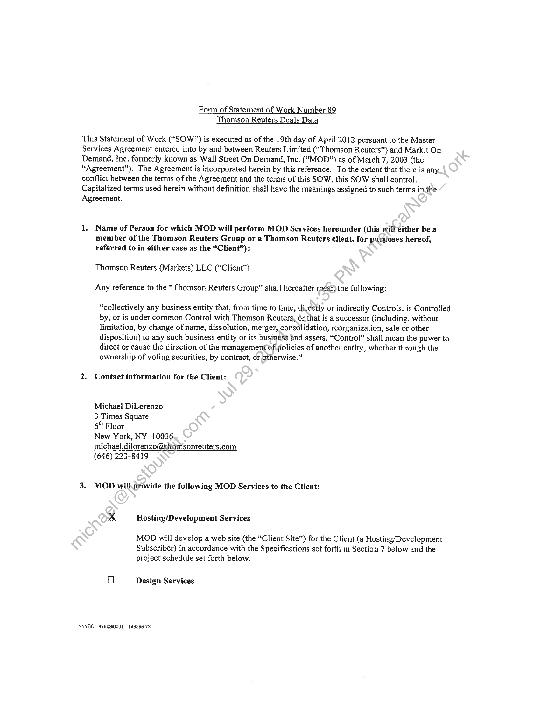
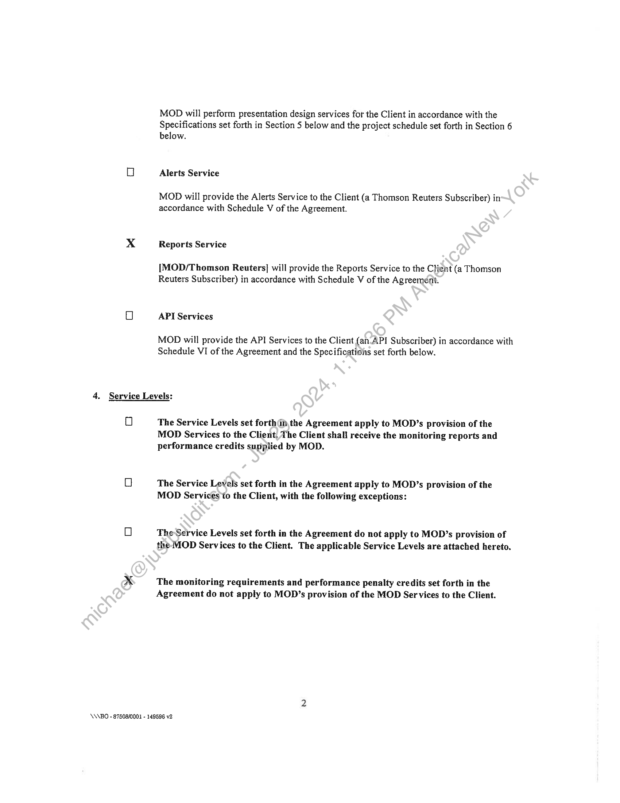
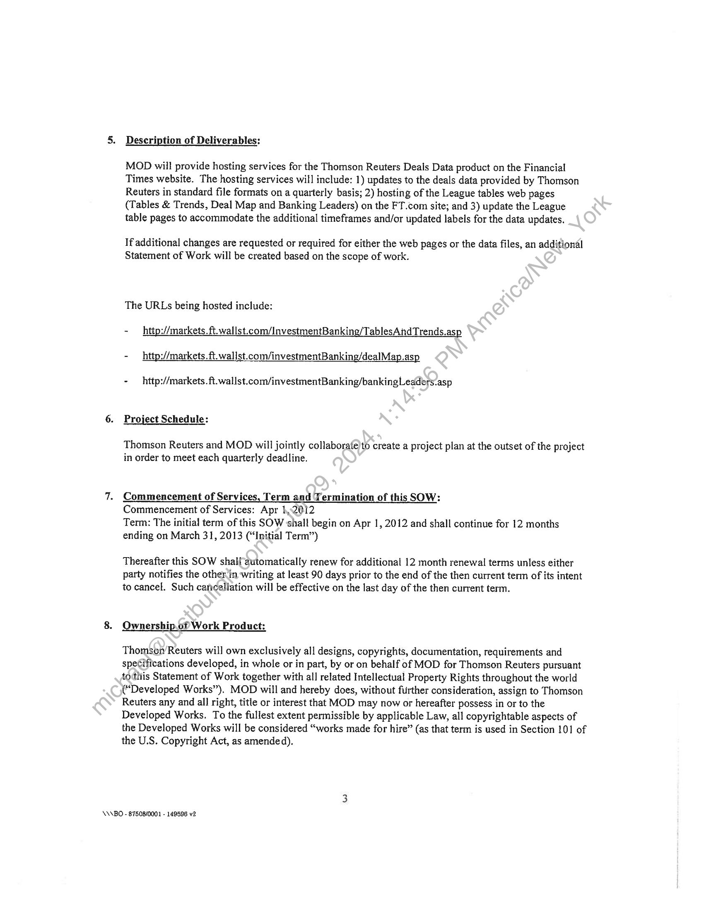
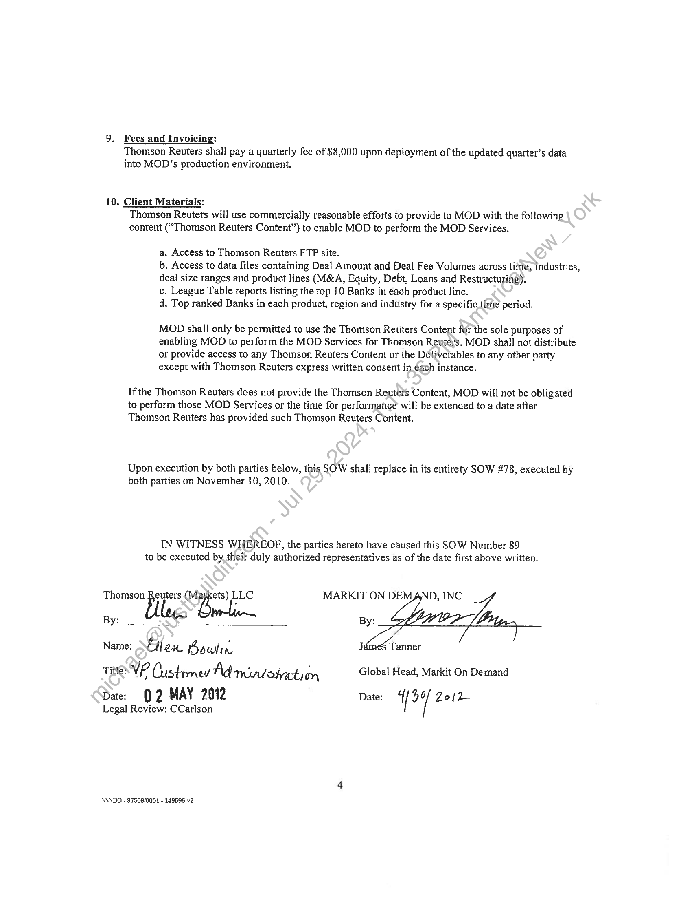

##### Statement of Work Number 89 - Thomson Reuters Deals Data]

  
````col
```col-md
flexGrow=.5
===
> [!info] [Page 1](_attachments/images_Refinitiv-Limited-3.6.1.3.400183294.pdf_212931/page_1.png)
> 
```  
```col-md
Form of Statement of Work Number 89
Thomson Reuters Deals Data  
This Statement of Work (“SOW”) is executed as of the 19th day of April 2012 pursuant to the Master
Services Agreement entered into by and between Reuters Limited (“Thomson Reuters”) and Markit On
Demand, Inc. formerly known as Wall Street On Demand, Inc. (“MOD”) as of March 7, 2003 (the
“Agreement”). The Agreement is incorporated herein by this reference. To the extent that there is any.
conflict between the terms of the Agreement and the terms of this SOW, this SOW shall control.
Capitalized terms used herein without definition shall have the meanings assigned to such terms inthe
Agreement.  
1. Name of Person for which MOD will perform MOD Services hereunder (this will either be a
member of the Thomson Reuters Group or a Thomson Reuters client, for purposes hereof,
referred to in either case as the “Client”):  
Thomson Reuters (Markets) LLC (“Client”)
Any reference to the “Thomson Reuters Group” shall hereafter mean) the following:  
“collectively any business entity that, from time to time, directly or indirectly Controls, is Controlled
by, or is under common Control with Thomson Reuters, or that is a successor (including, without
limitation, by change of name, dissolution, merger, consolidation, reorganization, sale or other
disposition) to any such business entity or its business and assets. “Control” shall mean the power to
direct or cause the direction of the management of policies of another entity, whether through the
ownership of voting securities, by contract, or otherwise.”  
2. Contact information for the Client:
Michael DiLorenzo
3 Times Square  
6" Floor
New York, NY 10036  
michael .dilorenzo@thomsonreuters.com
(646) 223-8419  
3. MOD will.provide the following MOD Services to the Client:  
5.4 Hosting/Development Services
MOD will develop a web site (the “Client Site”) for the Client (a Hosting/Development
Subscriber) in accordance with the Specifications set forth in Section 7 below and the
project schedule set forth below.  
Oo Design Services  
\N\BO - 87508/0001 - 149596 v2  
```
````
Notes:    
````col
```col-md
flexGrow=.5
===
> [!info] [Page 2](_attachments/images_Refinitiv-Limited-3.6.1.3.400183294.pdf_212931/page_2.png)
> 
```  
```col-md
MOD will perform presentation design services for the Client in accordance with the
Specifications set forth in Section 5 below and the project schedule set forth in Section 6
below.  
Alerts Service  
MOD will provide the Alerts Service to the Client (a Thomson Reuters Subscriber) in
accordance with Schedule V of the Agreement.  
Reports Service  
[MOD/Thomson Reuters] will provide the Reports Service to the Client (a Thomson
Reuters Subscriber) in accordance with Schedule V of the Agreement.  
API Services  
MOD will provide the API Services to the Client (an. API Subscriber) in accordance with
Schedule VI of the Agreement and the Specifications set forth below.  
4. Service Levels:  
Oo  
The Service Levels set forthan the Agreement apply to MOD’s provision of the
MOD Services to the Client, The Client shall receive the monitoring reports and
performance credits supplied by MOD.  
The Service Levels set forth in the Agreement apply to MOD’s provision of the
MOD Services to the Client, with the following exceptions:  
The-Service Levels set forth in the Agreement do not apply to MOD’s provision of
the MOD Services to the Client. The applicable Service Levels are attached hereto.  
The monitoring requirements and performance penalty credits set forth in the
Agreement do not apply to MOD’s provision of the MOD Ser vices to the Client.  
\NABO - 87608/0003 - 149596 v2  
```
````
Notes:    
````col
```col-md
flexGrow=.5
===
> [!info] [Page 3](_attachments/images_Refinitiv-Limited-3.6.1.3.400183294.pdf_212931/page_3.png)
> 
```  
```col-md
5. Description of Deliverables:  
MOD will provide hosting services for the Thomson Reuters Deals Data product on the Financial
Times website. The hosting services will include: 1) updates to the deals data provided by Thomson
Reuters in standard file formats on a quarterly basis; 2) hosting of the League tables web pages
(Tables & Trends, Deal Map and Banking Leaders) on the FT.com site; and 3) update the League
table pages to accommodate the additional timeframes and/or updated labels for the data updates.  
If additional changes are requested or required for either the web pages or the data files, an additional
Statement of Work will be created based on the scope of work.  
The URLs being hosted include:  
- — http://markets. ft.wallst.com/InvestmentBanking/TablesAndTrends.asp
- _ http://markets. ft. wallst.com/investmentBanking/dealMap.asp  
- _ http://markets. ft.wallst.com/investmentBanking/bankingLeaders.asp  
6. Project Schedule:  
Thomson Reuters and MOD will jointly collaborate) to create a project plan at the outset of the project
in order to meet each quarterly deadline.  
7. Commencement of Services, Term and Termination of this SOW:
Commencement of Services: Apr 41,2012  
Term: The initial term of this SOW shalt begin on Apr 1, 2012 and shall continue for 12 months
ending on March 31, 2013 (“Initial Term”)  
Thereafter this SOW shal{ automatically renew for additional 12 month renewal terms unless either
party notifies the other.in writing at least 90 days prior to the end of the then current term of its intent
to cancel. Such cancellation will be effective on the last day of the then current term.  
8. Ownership.of Work Product:  
Thomson Reuters will own exclusively all designs, copyrights, documentation, requirements and
specifications developed, in whole or in part, by or on behalf of MOD for Thomson Reuters pursuant
tothis Statement of Work together with all related Intellectual Property Rights throughout the world
(“Developed Works”). MOD will and hereby does, without further consideration, assign to Thomson
Reuters any and all right, title or interest that MOD may now or hereafter possess in or to the
Developed Works. To the fullest extent permissible by applicable Law, all copyrightable aspects of
the Developed Works will be considered “works made for hire” (as that term is used in Section 101 of
the U.S. Copyright Act, as amended),  
\ANBO - 875080001 - 149596 v2  
```
````
Notes:    
````col
```col-md
flexGrow=.5
===
> [!info] [Page 4](_attachments/images_Refinitiv-Limited-3.6.1.3.400183294.pdf_212931/page_4.png)
> 
```  
```col-md
9. Fees and Invoicing:
Thomson Reuters shall pay a quarterly fee of $8,000 upon deployment of the updated quarter’s data  
into MOD’s production environment.  
10. Client Materials:
Thomson Reuters will use commercially reasonable efforts to provide to MOD with the following
content (“Thomson Reuters Content”) to enable MOD to perform the MOD Services.  
a. Access to Thomson Reuters FTP site.  
b. Access to data files containing Deal Amount and Deal Fee Volumes across tiine, industries,
deal size ranges and product lines (M&A, Equity, Debt, Loans and Restructuring).  
c. League Table reports listing the top 10 Banks in each product line.  
d. Top ranked Banks in each product, region and industry for a specific time period.  
MOD shall only be permitted to use the Thomson Retiters Content for the sole purposes of
enabling MOD to perform the MOD Services for Thomson Reuters. MOD shall not distribute
or provide access to any Thomson Reuters Content or the Déliverables to any other party
except with Thomson Reuters express written consent in éach instance.  
Ifthe Thomson Reuters does not provide the Thomson Reuteis Content, MOD will not be obligated  
to perform those MOD Services or the time for performance will be extended to a date after
Thomson Reuters has provided such Thomson Reuters Content.  
Upon execution by both parties below, this SOW shall replace in its entirety SOW #78, executed by
both parties on November 10, 2010.  
IN WITNESS WHEREOF, the parties hereto have caused this SOW Number 89
to be executed by, their duly authorized representatives as of the date first above written.  
Thomson fils. wie LLC MARKIT ON DEMAND, INC
By: log. :  
Name: Silex Boutin J  
Tite: VP Custrmey Ad mivstaction Global Head, Markit On Demand
Dat: 02 MAY 7012 Date: ‘ / Zoi  
Legal Review: CCarlson  
§ Tanner  
\A\BO - 87508/0001 - 149596 v2  
```
````
Notes:  


![[_attachments/Refinitiv-Limited-3.6.1.3.4 00183294.pdf]