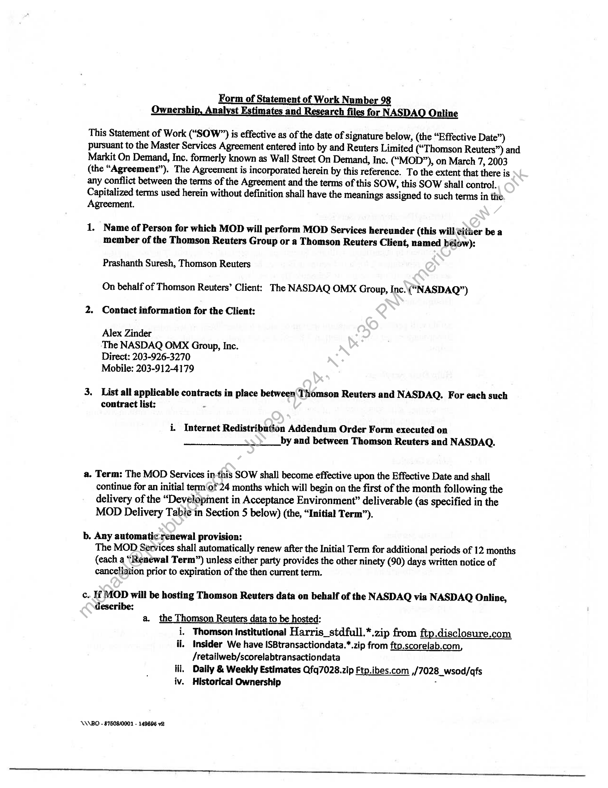
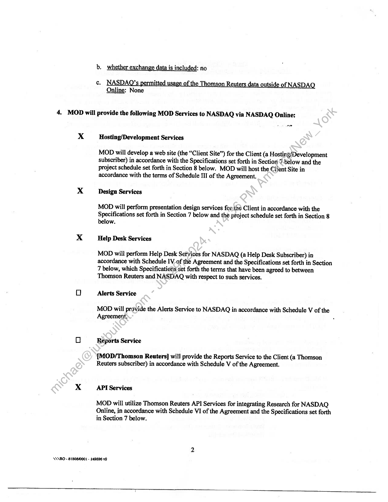
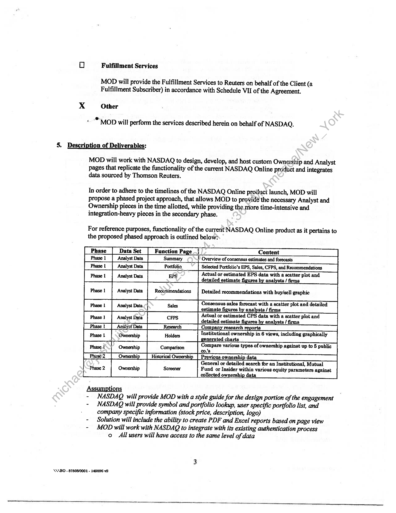
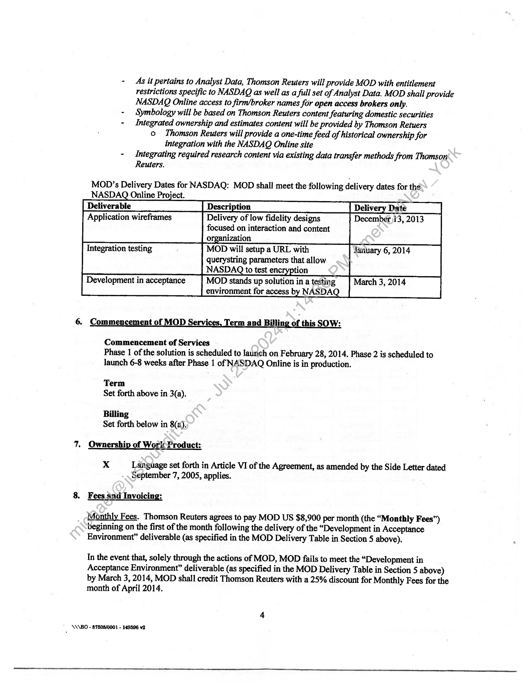
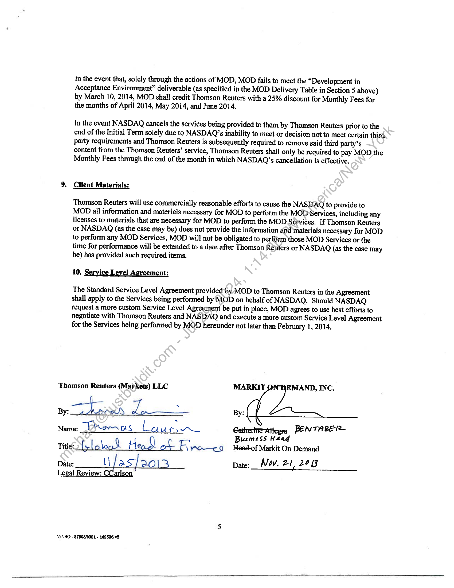
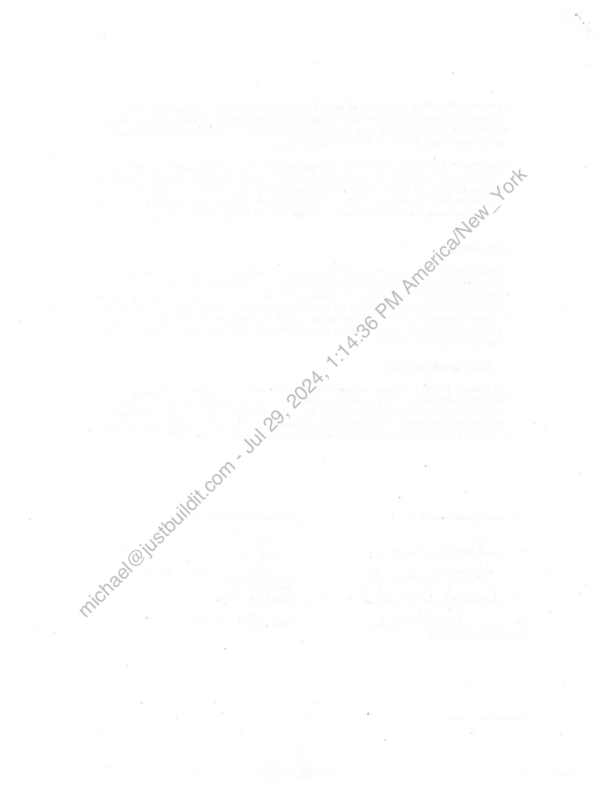

##### Statement of Work Number 98 - Ownership, Analyst Estimates and Research files for NASDAQ Online]

  
````col
```col-md
flexGrow=.5
===
> [!info] [Page 1](_attachments/images_Refinitiv-Limited-3.6.1.3.500183275.pdf_210845/page_1.png)
> 
```  
```col-md
Form of Statement of Work Number 98
Ownership, Analyst Estimates and Research files for NASDAQ Online  
This Statement of Work (“SOW”) is effective as of the date of signature below, (the “Effective Date”)
pursuant to the Master Services Agreement entered into by and Reuters Limited (“Thomson Reuters”) and
Markit On Demand, Inc. formerly known as Wall Street On Demand, Inc. (“MOD”), on March 7, 2003
(the “Agreement”). The Agreement is incorporated herein by this reference. To the extent that there is
any conflict between the terms of the Agreement and the terms of this SOW, this SOW shall control.
Capitalized terms used herein without definition shall have the meanings assigned to such terms in the
Agreement.  
1. Name of Person for which MOD will perform MOD Services hereunder (this will either be a
member of the Thomson Reuters Group or a Thomson Reuters Client, named below):  
Prashanth Suresh, Thomson Reuters  
On behalf of Thomson Reuters’ Client: The NASDAQ OMX Group, Inc. (“NASDAQ”)
2. Contact information for the Client:  
Alex Zinder  
The NASDAQ OMX Group, Inc.  
Direct: 203-926-3270  
Mobile: 203-912-4179  
3. List all applicable contracts in place between‘ Thomson Reuters and NASDAQ. For each such
contract list: -  
i. Internet Redistribution Addendum Order Form executed on
by and between Thomson Reuters and NASDAQ.  
a. Term: The MOD Services in-this SOW shall become effective upon the Effective Date and shall
continue for an initial term of 24 months which will begin on the first of the month following the
delivery of the “Developinent in Acceptance Environment” deliverable (as specified in the
MOD Delivery Table in Section 5 below) (the, “Initial Term”).  
b, Any automatic renewal provision:
The MOD Services shall automatically renew after the Initial Term for additional periods of 12 months
(cach a “Renewal Term”) unless either party provides the other ninety (90) days written notice of
cancellation prior to expiration of the then current term.  
c. If MOD will be hosting Thomson Reuters data on behalf of the NASDAQ via NASDAQ Online,  
describe:
a. the Thomson Reuters data to be hosted:
i, Thomson Institutional Harris_stdfull.*.zip from ftp.disclosure.com
il. Insider We have [SBtransactiondata.*.zip from ftp.scorelab.com,
/retailweb/scorelabtransactiondata
lil. Daily & Weekly Estimates Qfq7028.zip Ftp.ibes.com ,/7028_wsod/afs
iv. Historical Ownership °  
ANABO - 875080001 - 149896 v2.  
```
````
Notes:    
````col
```col-md
flexGrow=.5
===
> [!info] [Page 2](_attachments/images_Refinitiv-Limited-3.6.1.3.500183275.pdf_210845/page_2.png)
> 
```  
```col-md
b. whether exchange data is included: no  
c. DAQ’ itted of the Thomson Reuters data outside of NASDA\
Online: None  
4. MOD will provide the following MOD Services to NASDAQ via NASDAQ Online:  
Xx  
Ps  
Hosting/Development Services  
MOD will develop a web site (the “Client Site”) for the Client (a Hosting/Development
subscriber) in accordance with the Specifications set forth in Section 7-below and the
project schedule set forth in Section 8 below. MOD will host the Client Site in
accordance with the terms of Schedule III of the Agreement.  
Design Services
MOD will perform presentation design services fon the Client in accordance with the  
Specifications set forth in Section 7 below and the project schedule set forth in Section 8
below.  
Help Desk Services
MOD will perform Help Desk Services for NASDAQ (a Help Desk Subscriber) in
accordance with Schedule IV-of the Agreement and the Specifications set forth in Section  
7 below, which Specifications set forth the terms that have been agreed to between
Thomson Reuters and NASDAQ with respect to such services.  
Alerts Service  
MOD will provide the Alerts Service to NASDAQ in accordance with Schedule V of the
Agreement, .  
Reports Service  
[MOD/Thomson Reuters] will provide the Reports Service to the Client (a Thomson
Reuters subscriber) in accordance with Schedule V of the Agreement.  
API Services  
MOD will utilize Thomson Reuters API Services for integrating Research for NASDAQ
Online, in accordance with Schedule VI of the Agreement and the Specifications set forth
in Section 7 below.  
NNABO - 875080001 - 149596 v2  
```
````
Notes:    
````col
```col-md
flexGrow=.5
===
> [!info] [Page 3](_attachments/images_Refinitiv-Limited-3.6.1.3.500183275.pdf_210845/page_3.png)
> 
```  
```col-md
Oo Fulfillment Services  
MOD will provide the Fulfillment Services to Reuters on behalf of the Client (a
Fulfillment Subscriber) in accordance with Schedule VII of the Agreement.  
xX Other  
« * MOD will perform the services described herein on behalf of NASDAQ.  
5. Description of Deliverables:  
MOD will work with NASDAQ to design, develop, and host custom Ownership and Analyst
pages that replicate the functionality of the current NASDAQ Online product and integrates
data sourced by Thomson Reuters.  
In order to adhere to the timelines of the NASDAQ Online product launch, MOD will
Propose a phased project approach, that allows MOD to provide the necessary Analyst and
Ownership pieces in the time allotted, while providing the more time-intensive and
integration-heavy pieces in the secondary phase.  
For reference purposes, functionality of the current NASDAQ Online product as it pertains to
the proposed phased approach is outlined below:  
estimate figures by analysts / firms
Actual or estimated CPS data with a scatter plot and
detailed estimate figures by analysts / firme  
. Institutional ownership in 6 views, including graphically
=Compare various types of ownership against up to 5 public
co.'3,
General or detailed search for an Inatitutional, Mutual
Fund or Insider within various equity parameters against
collected ownership data  
- NASDAQ will provide MOD with a style guide for the design portion of the engagement
- NASDAQ will provide symbol and portfolio lookup, user specific portfolio list, andcompany specific information (stock price, description, logo)
- Solution will include the ability to create PDF and Excel reports based on page view
- MOD will work with NASDAQ to integrate with its existing authentication process
o Ail users will have access to the same level of data  
\ANBO - 87508/0001 - 149586 v2  
```
````
Notes:    
````col
```col-md
flexGrow=.5
===
> [!info] [Page 4](_attachments/images_Refinitiv-Limited-3.6.1.3.500183275.pdf_210845/page_4.png)
> 
```  
```col-md
- As it pertains to Analyst Data, Thomson Reuters will provide MOD with entitlement
restrictions specific to NASDAQ as well as a full set of Analyst Data. MOD shall provide
NASDAQ Online access to firm/broker names for open access brokers only.  
- _ Symbology will be based on Thomson Reuters content featuring domestic securities  
- Integrated ownership and estimates content will be provided by Thomson Retuers  
© Thomson Reuters will provide a one-time feed of historical ownership for
integration with the NASDAQ Online site  
- Integrating required research content via existing data transfer methods from Thomson
Reuters.  
MOD’s Delivery Dates for NASDAQ: MOD shall meet the following delivery dates for the  
NASDAQ Online Project.
Deliverable  
Application wireframes Delivery of low fidelity designs December )i3, 2013
focused on interaction and content
organization  
Integration testing MOD will setup a URL with January 6, 2014
querystring parameters that allow
NASDAQ to test encryption  
Development in acceptance MOD stands up solution in a testing March 3, 2014
environment for access by NASDAQ  
6. Commencement of MOD Services, Term and Billing of this SOW:  
Commencement of Services
Phase 1 of the solution is scheduled to launch on February 28, 2014. Phase 2 is scheduled to
launch 6-8 weeks after Phase 1 of NASDAQ Online is in production.  
Term
Set forth above in 3(a).  
Billing
Set forth below in 8(a).  
7. Ownership of Work Product:  
x Language set forth in Article VI of the Agreement, as amended by the Side Letter dated
September 7, 2005, applies.  
8. Fees and Invoicing:  
Monthly Fees. Thomson Reuters agrees to pay MOD US $8,900 per month (the “Monthly Fees”)
beginning on the first of the month following the delivery of the “Development in Acceptance
Environment” deliverable (as specified in the MOD Delivery Table in Section 5 above).  
In the event that, solely through the actions of MOD, MOD fails to meet the “Development in
Acceptance Environment” deliverable (as specified in the MOD Delivery Table in Section 5 above)
by March 3, 2014, MOD shall credit Thomson Reuters with a 25% discount for Monthly Fees for the
month of April 2014.  
\\\BO - 87508/0001 - 149596 v2  
```
````
Notes:    
````col
```col-md
flexGrow=.5
===
> [!info] [Page 5](_attachments/images_Refinitiv-Limited-3.6.1.3.500183275.pdf_210845/page_5.png)
> 
```  
```col-md
In the event that, solely through the actions of MOD, MOD fails to meet the “Development in
Acceptance Environment” deliverable (as specified in the MOD Delivery Table in Section 5 above)
by March 10, 2014, MOD shall credit Thomson Reuters with a 25% discount for Monthly Fees for
the months of April 2014, May 2014, and June 2014.  
In the event NASDAQ cancels the services being provided to them by Thomson Reuters prior to the
end of the Initial Term solely due to NASDAQ’s inability to meet or decision not to meet certain third.
party requirements and Thomson Reuters is subsequently required to remove said third party’s
content from the Thomson Reuters’ service, Thomson Reuters shall only be required to pay MOD the
Monthly Fees through the end of the month in which NASDAQ’s cancellation is effective.  
9. Client Materials:  
Thomson Reuters will use commercially reasonable efforts to cause the NASDAQ to provide to
MOD all information and materials necessary for MOD to perform the MOD Services, including any
licenses to materials that are necessary for MOD to perform the MOD Séivices. If Thomson Reuters
or NASDAQ (as the case may be) does not provide the information and materials necessary for MOD
to perform any MOD Services, MOD will not be obligated to perform those MOD Services or the
time for performance will be extended to a date after Thomson Réuters or NASDAQ (as the case may
be) has provided such required items.  
10. Service Level Agreement:  
The Standard Service Level Agreement provided-by MOD to Thomson Reuters in the Agreement
shall apply to the Services being performed by MOD on behalf of NASDAQ. Should NASDAQ
request a more custom Service Level Agreement be put in place, MOD agrees to use best efforts to
negotiate with Thomson Reuters and NASDAQ and execute a more custom Service Level Agreement
for the Services being performed by MOD hereunder not later than February 1, 2014.  
Thomson Reuters (Markets) LLC MARKIT EMAND, INC.  
By: rN By:  
Name: Tomas Laurin Catherine Attegrn PEN TABE [2
g Busmess Heed  
Title: fy. | clo Head of iat Yo—co Head-of Markit On Demand  
Date: Was, Date:__ Mov. a 2°B  
Legal Review: CCarlson  
NN\BO - 87508/0001 - 149596 v2  
```
````
Notes:    
````col
```col-md
flexGrow=.5
===
> [!info] [Page 6](_attachments/images_Refinitiv-Limited-3.6.1.3.500183275.pdf_210845/page_6.png)
> 
```  
```col-md  
```
````
Notes:  


![[_attachments/Refinitiv-Limited-3.6.1.3.5 00183275.pdf]