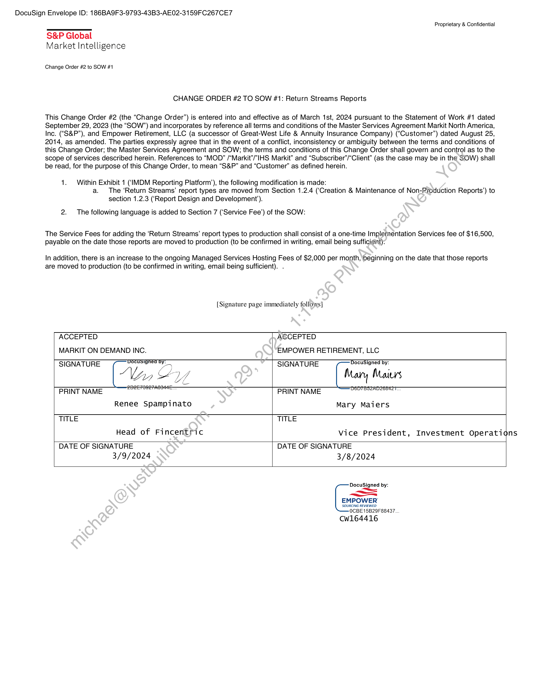
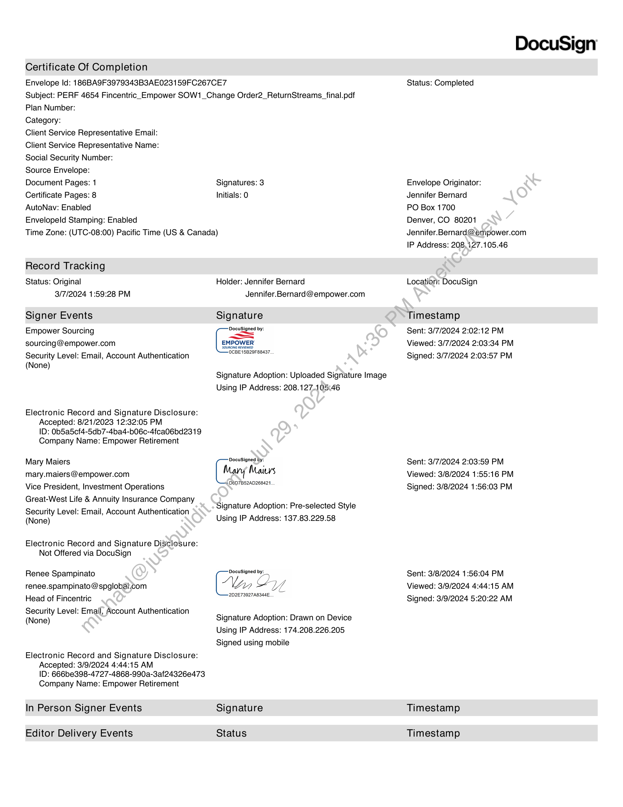
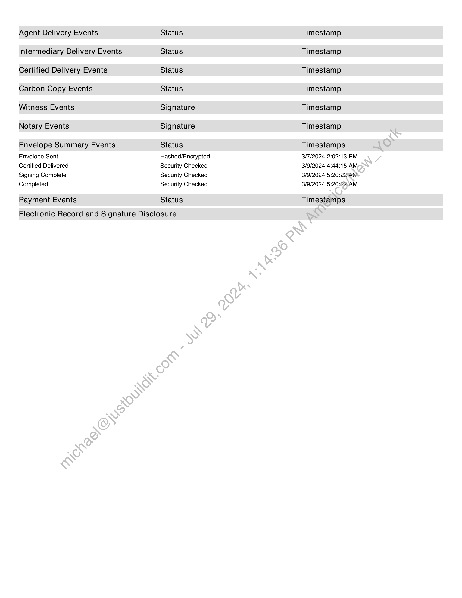
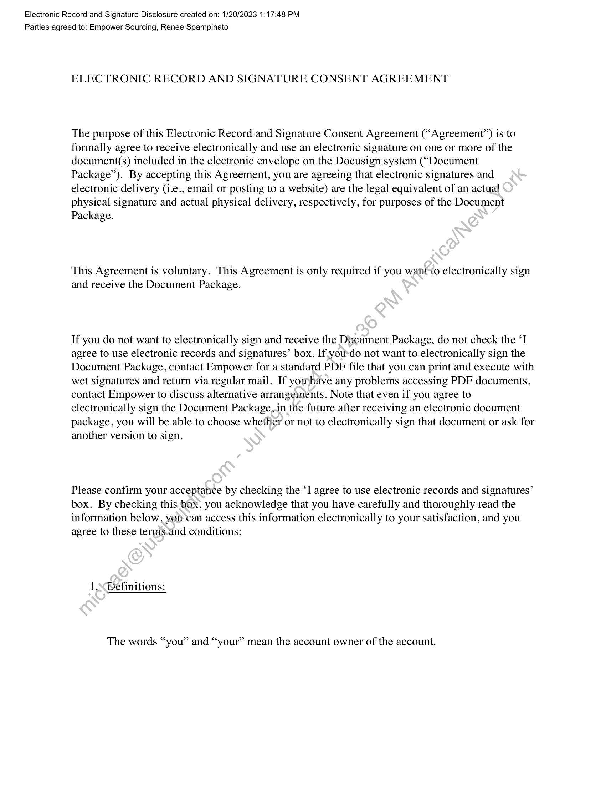
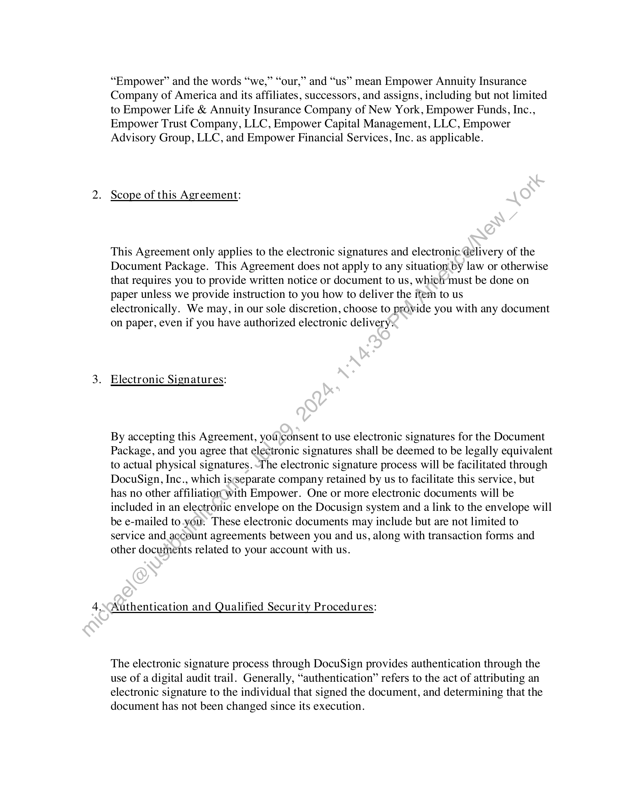
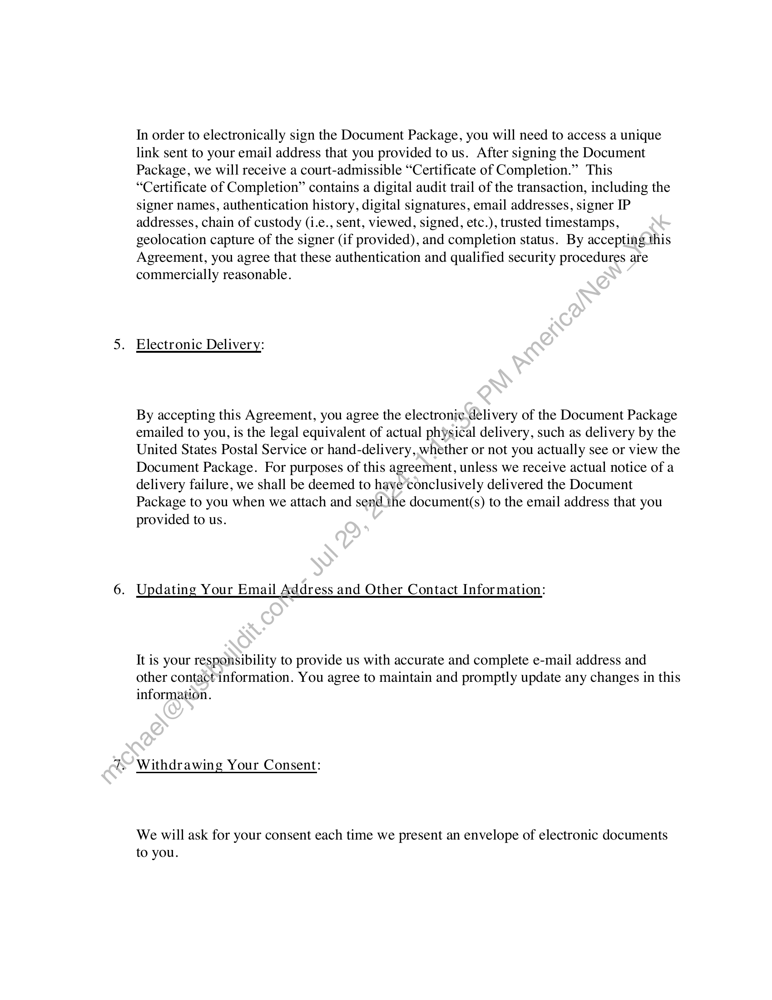
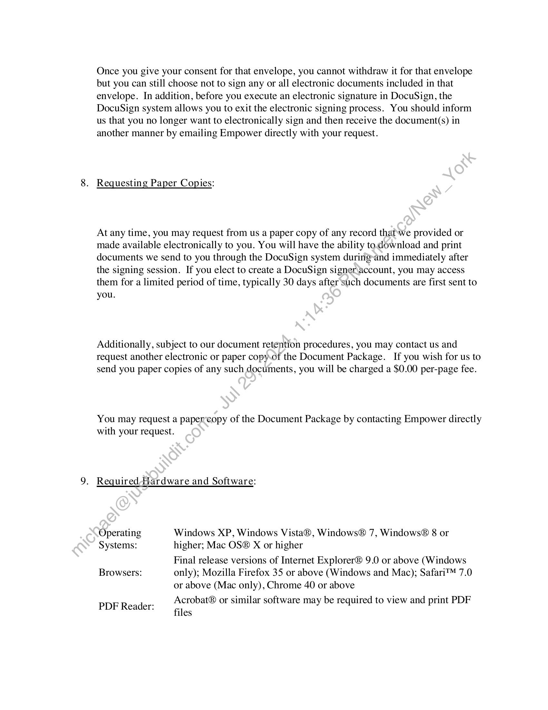
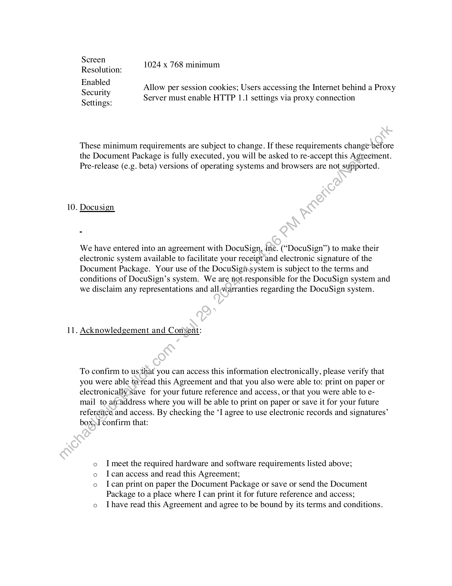
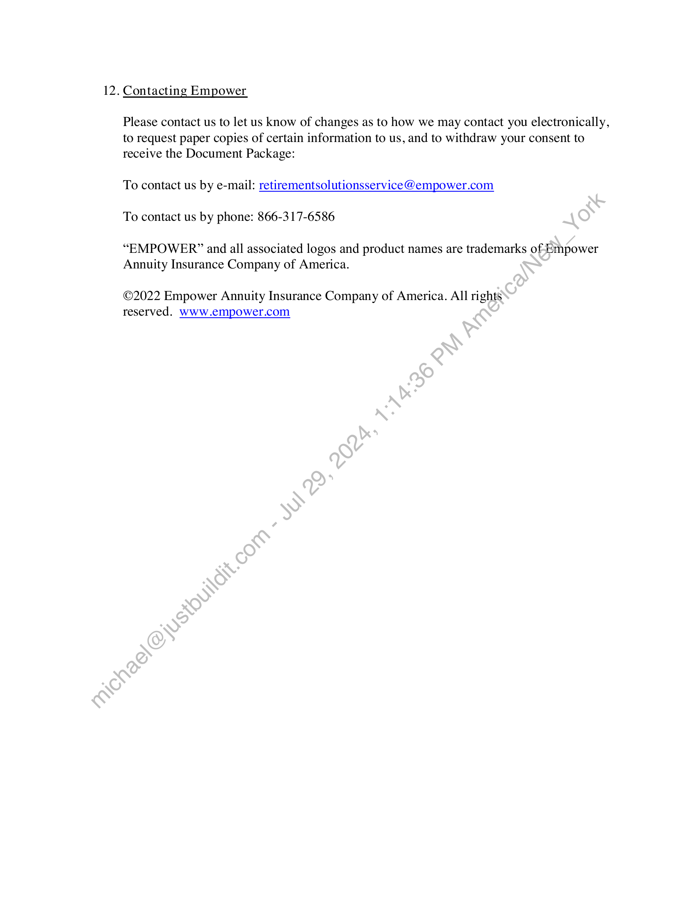

##### Change Order #2 to SOW #1: Return Streams Reports]

  
````col
```col-md
flexGrow=.5
===
> [!info] [Page 1](_attachments/images_Empower-3.6.1.4.100255887-b.pdf_205937/page_1.png)
> 
```  
```col-md
DocuSign Envelope ID: 186BA9F3-9793-43B3-AE02-3159FC267CE7  
S&P Global
Market Intelligence  
Change Order #2 to SOW #1  
Proprietary & Confidential  
CHANGE ORDER #2 TO SOW #1: Return Streams Reports  
This Change Order #2 (the “Change Order”) is entered into and effective as of March 1st, 2024 pursuant to the Statement of Work #1 dated
September 29, 2023 (the “SOW’”) and incorporates by reference all terms and conditions of the Master Services Agreement Markit North America,
Inc. (“S&P”), and Empower Retirement, LLC (a successor of Great-West Life & Annuity Insurance Company) (“Customer”) dated August 25,
2014, as amended. The parties expressly agree that in the event of a conflict, inconsistency or ambiguity between the terms and conditions of
this Change Order; the Master Services Agreement and SOW; the terms and conditions of this Change Order shall govern and control as to the
scope of services described herein. References to “MOD” /“Markit’/"IHS Markit” and “Subscriber’/“Client” (as the case may be in the SOW) shall
be read, for the purpose of this Change Order, to mean “S&P” and “Customer” as defined herein.  
1. Within Exhibit 1 (‘IMDM Reporting Platform’), the following modification is made:
a. The ‘Return Streams’ report types are moved from Section 1.2.4 (‘Creation & Maintenance of Non-PRroduction Reports’) to  
section 1.2.3 (‘Report Design and Development’).  
2. The following language is added to Section 7 (‘Service Fee’) of the SOW:  
The Service Fees for adding the ‘Return Streams’ report types to production shall consist of a one-time Implementation Services fee of $16,500,
payable on the date those reports are moved to production (to be confirmed in writing, email being sufficient):  
In addition, there is an increase to the ongoing Managed Services Hosting Fees of $2,000 per month, ‘beginning on the date that those reports
are moved to production (to be confirmed in writing, email being sufficient). .  
[Signature page immediately follows]  
ACCEPTED ACCEPTED
MARKIT ON DEMAND INC. EMPOWER RETIREMENT, LLC
SIGNATURE Docusigned By: SIGNATURE DocuSigned by:
/ .
1p SVs Mary Maiers  
PRINT NAME oer PRINT NAME DOOTESZADZONIZT  
Renee Spampinato Mary Maiers
TITLE TITLE  
Head of Fincentric vice President, Investment Operatia
DATE OF SIGNATURE DATE OF SIGNATURE  
3/9/2024 3/8/2024  
DocuSigned by:  
f  
EMPOWER’  
‘SOURCING REVIEWED  
0CBE15B29F88437.  
cw164416  
ns  
```
````
Notes:    
````col
```col-md
flexGrow=.5
===
> [!info] [Page 2](_attachments/images_Empower-3.6.1.4.100255887-b.pdf_205937/page_2.png)
> 
```  
```col-md
Certificate Of Completion  
Envelope Id: 186BA9F3979343B3AE023159FC267CE7
Subject: PERF 4654 Fincentric_Empower SOW1_Change Order2_ReturnStreams_final.pdf  
Plan Number:  
Category:  
Client Service Representative Email:
Client Service Representative Name:
Social Security Number:  
Source Envelope:  
Document Pages: 1  
Certificate Pages: 8  
AutoNav: Enabled  
Envelopeld Stamping: Enabled  
Signatures: 3
Initials: 0  
Time Zone: (UTC-08:00) Pacific Time (US & Canada)  
Record Tracking  
Status: Original
3/7/2024 1:59:28 PM  
Signer Events  
Empower Sourcing
sourcing@empower.com  
Security Level: Email, Account Authentication
(None)  
Electronic Record and Signature Disclosure:
Accepted: 8/21/2023 12:32:05 PM
ID: Ob5a5cf4-5db7-4ba4-b06c-4fca06bd2319
Company Name: Empower Retirement  
Mary Maiers  
mary.maiers@empower.com  
Vice President, Investment Operations
Great-West Life & Annuity Insurance Company  
Security Level: Email, Account Authentication
(None)  
Electronic Record and Signature Disclosure:
Not Offered via DocuSign  
Renee Spampinato
renee.spampinato @spglobal.com
Head of Fincentric  
Security Level: Email, Account Authentication
(None)  
Electronic Record and Signature Disclosure:
Accepted: 3/9/2024 4:44:15 AM
ID: 666be398-4727-4868-990a-3af24326e473
Company Name: Empower Retirement  
In Person Signer Events  
Editor Delivery Events  
Holder: Jennifer Bernard
Jennifer.Bernard@empower.com  
Signature  
Docusigned by:
—
EMPOWER  
OCBE15B29F88437.  
Signature Adoption: Uploaded Signature Image
Using IP Address: 208.127.105:46  
D8D7B52AD268421  
Signature Adoption: Pre-selected Style
Using IP Address: 137.83.229.58  
Signature Adoption: Drawn on Device
Using IP Address: 174.208.226.205
Signed using mobile  
Signature  
Status  
Status: Completed  
Envelope Originator:
Jennifer Bernard
PO Box 1700
Denver, CO 80201  
Jennifer.Bernard@ empower.com  
IP Address: 208,1.27.105.46  
Location: DocuSign  
Timestamp  
Sent: 3/7/2024 2:02:12 PM
Viewed: 3/7/2024 2:03:34 PM
Signed: 3/7/2024 2:03:57 PM  
Sent: 3/7/2024 2:03:59 PM
Viewed: 3/8/2024 1:55:16 PM
Signed: 3/8/2024 1:56:03 PM  
Sent: 3/8/2024 1:56:04 PM
Viewed: 3/9/2024 4:44:15 AM
Signed: 3/9/2024 5:20:22 AM  
Timestamp  
Timestamp  
DocuSign  
```
````
Notes:    
````col
```col-md
flexGrow=.5
===
> [!info] [Page 3](_attachments/images_Empower-3.6.1.4.100255887-b.pdf_205937/page_3.png)
> 
```  
```col-md
Agent Delivery Events
Intermediary Delivery Events
Certified Delivery Events
Carbon Copy Events
Witness Events  
Notary Events  
Envelope Summary Events
Envelope Sent  
Certified Delivered  
Signing Complete  
Completed  
Payment Events  
Status
Status
Status
Status
Signature
Signature  
Status
Hashed/Encrypted
Security Checked
Security Checked
Security Checked  
Status  
Electronic Record and Signature Disclosure  
Timestamp
Timestamp
Timestamp
Timestamp
Timestamp
Timestamp
Timestamps
3/7/2024 2:02:13 PM
3/9/2024 4:44:15 AM  
3/9/2024 5:20:22°AM
3/9/2024 5:20:22.AM  
Timestamps  
```
````
Notes:    
````col
```col-md
flexGrow=.5
===
> [!info] [Page 4](_attachments/images_Empower-3.6.1.4.100255887-b.pdf_205937/page_4.png)
> 
```  
```col-md
Electronic Record and Signature Disclosure created on: 1/20/2023 1:17:48 PM
Parties agreed to: Empower Sourcing, Renee Spampinato  
ELECTRONIC RECORD AND SIGNATURE CONSENT AGREEMENT  
The purpose of this Electronic Record and Signature Consent Agreement (“Agreement”) is to
formally agree to receive electronically and use an electronic signature on one or more of the
document(s) included in the electronic envelope on the Docusign system (“Document
Package”). By accepting this Agreement, you are agreeing that electronic signatures and
electronic delivery (i.e., email or posting to a website) are the legal equivalent of an actual
physical signature and actual physical delivery, respectively, for purposes of the Document
Package.  
This Agreement is voluntary. This Agreement is only required if you want-to electronically sign
and receive the Document Package.  
If you do not want to electronically sign and receive the Document Package, do not check the ‘I
agree to use electronic records and signatures’ box. If yourdo not want to electronically sign the
Document Package, contact Empower for a standard PDF file that you can print and execute with
wet signatures and return via regular mail. If yowhave any problems accessing PDF documents,
contact Empower to discuss alternative arrangements. Note that even if you agree to
electronically sign the Document Package,-in the future after receiving an electronic document
package, you will be able to choose whether or not to electronically sign that document or ask for
another version to sign.  
Please confirm your acceptance by checking the ‘I agree to use electronic records and signatures’
box. By checking this box, you acknowledge that you have carefully and thoroughly read the
information below, you can access this information electronically to your satisfaction, and you
agree to these terms-and conditions:  
1.\Definitions:  
The words “you” and “your” mean the account owner of the account.  
```
````
Notes:    
````col
```col-md
flexGrow=.5
===
> [!info] [Page 5](_attachments/images_Empower-3.6.1.4.100255887-b.pdf_205937/page_5.png)
> 
```  
```col-md
99 66  
“Empower” and the words “we,” “our,” and “us” mean Empower Annuity Insurance
Company of America and its affiliates, successors, and assigns, including but not limited
to Empower Life & Annuity Insurance Company of New York, Empower Funds, Inc.,
Empower Trust Company, LLC, Empower Capital Management, LLC, Empower
Advisory Group, LLC, and Empower Financial Services, Inc. as applicable.  
Scope of this Agreement:  
This Agreement only applies to the electronic signatures and electronic delivery of the
Document Package. This Agreement does not apply to any situation by law or otherwise
that requires you to provide written notice or document to us, which must be done on
paper unless we provide instruction to you how to deliver the item to us  
electronically. We may, in our sole discretion, choose to provide you with any document
on paper, even if you have authorized electronic delivery:  
Electronic Signatures:  
By accepting this Agreement, you)consent to use electronic signatures for the Document
Package, and you agree that electronic signatures shall be deemed to be legally equivalent
to actual physical signatures. -The electronic signature process will be facilitated through
DocuSign, Inc., which isseparate company retained by us to facilitate this service, but
has no other affiliation with Empower. One or more electronic documents will be
included in an electronic envelope on the Docusign system and a link to the envelope will
be e-mailed to .you: These electronic documents may include but are not limited to
service and account agreements between you and us, along with transaction forms and
other documents related to your account with us.  
Authentication and Qualified Security Procedures:  
The electronic signature process through DocuSign provides authentication through the
use of a digital audit trail. Generally, “authentication” refers to the act of attributing an
electronic signature to the individual that signed the document, and determining that the
document has not been changed since its execution.  
```
````
Notes:    
````col
```col-md
flexGrow=.5
===
> [!info] [Page 6](_attachments/images_Empower-3.6.1.4.100255887-b.pdf_205937/page_6.png)
> 
```  
```col-md
In order to electronically sign the Document Package, you will need to access a unique
link sent to your email address that you provided to us. After signing the Document
Package, we will receive a court-admissible “Certificate of Completion.” This
“Certificate of Completion” contains a digital audit trail of the transaction, including the
signer names, authentication history, digital signatures, email addresses, signer IP
addresses, chain of custody (i.e., sent, viewed, signed, etc.), trusted timestamps,
geolocation capture of the signer (if provided), and completion status. By accepting this
Agreement, you agree that these authentication and qualified security procedures are
commercially reasonable.  
Electronic Delivery:  
By accepting this Agreement, you agree the electronic delivery of the Document Package
emailed to you, is the legal equivalent of actual physical delivery, such as delivery by the
United States Postal Service or hand-delivery, whether or not you actually see or view the
Document Package. For purposes of this agreement, unless we receive actual notice of a
delivery failure, we shall be deemed to have’conclusively delivered the Document
Package to you when we attach and send ihe document(s) to the email address that you
provided to us.  
Updating Your Email Address and Other Contact Information:  
It is your responsibility to provide us with accurate and complete e-mail address and
other contactinformation. You agree to maintain and promptly update any changes in this
information.  
Withdrawing Your Consent:  
We will ask for your consent each time we present an envelope of electronic documents
to you.  
```
````
Notes:    
````col
```col-md
flexGrow=.5
===
> [!info] [Page 7](_attachments/images_Empower-3.6.1.4.100255887-b.pdf_205937/page_7.png)
> 
```  
```col-md
Once you give your consent for that envelope, you cannot withdraw it for that envelope
but you can still choose not to sign any or all electronic documents included in that
envelope. In addition, before you execute an electronic signature in DocuSign, the
DocuSign system allows you to exit the electronic signing process. You should inform
us that you no longer want to electronically sign and then receive the document(s) in
another manner by emailing Empower directly with your request.  
8. Requesting Paper Copies:  
At any time, you may request from us a paper copy of any record thatwe provided or
made available electronically to you. You will have the ability to.download and print
documents we send to you through the DocuSign system during-and immediately after
the signing session. If you elect to create a DocuSign signeraccount, you may access
them for a limited period of time, typically 30 days after'such documents are first sent to
you.  
Additionally, subject to our document retention procedures, you may contact us and
request another electronic or paper copy.of the Document Package. If you wish for us to
send you paper copies of any such documents, you will be charged a $0.00 per-page fee.  
You may request a papercopy of the Document Package by contacting Empower directly
with your request.  
9. Required Hardware and Software:  
Operating Windows XP, Windows Vista®, Windows® 7, Windows® 8 or
Systems: higher; Mac OS® X or higher  
Final release versions of Internet Explorer® 9.0 or above (Windows
Browsers: only); Mozilla Firefox 35 or above (Windows and Mac); Safari™ 7.0  
or above (Mac only), Chrome 40 or above  
Acrobat® or similar software may be required to view and print PDF  
PDF Reader: .
files  
```
````
Notes:    
````col
```col-md
flexGrow=.5
===
> [!info] [Page 8](_attachments/images_Empower-3.6.1.4.100255887-b.pdf_205937/page_8.png)
> 
```  
```col-md
10.  
11.  
Screen 1024 x 768 minimum  
Resolution:
Enabled . . . .
nave Allow per session cookies; Users accessing the Internet behind a Proxy
Security : . :
: Server must enable HTTP 1.1 settings via proxy connection
Settings:  
These minimum requirements are subject to change. If these requirements change before
the Document Package is fully executed, you will be asked to re-accept this Agreement.
Pre-release (e.g. beta) versions of operating systems and browsers are not supported.  
Docusign  
We have entered into an agreement with DocuSign, Ine. (“DocuSign’’) to make their
electronic system available to facilitate your receipt and electronic signature of the
Document Package. Your use of the DocuSiginsystem is subject to the terms and
conditions of DocuSign’s system. We are not.responsible for the DocuSign system and
we disclaim any representations and all;warranties regarding the DocuSign system.  
Acknowledgement and Consent:  
To confirm to us,that you can access this information electronically, please verify that
you were able to’read this Agreement and that you also were able to: print on paper or
electronicallysave for your future reference and access, or that you were able to email to atvaddress where you will be able to print on paper or save it for your future
reference and access. By checking the ‘I agree to use electronic records and signatures’
box;I confirm that:  
I meet the required hardware and software requirements listed above;
I can access and read this Agreement;
I can print on paper the Document Package or save or send the Document
Package to a place where I can print it for future reference and access;
o Ihave read this Agreement and agree to be bound by its terms and conditions.  
```
````
Notes:    
````col
```col-md
flexGrow=.5
===
> [!info] [Page 9](_attachments/images_Empower-3.6.1.4.100255887-b.pdf_205937/page_9.png)
> 
```  
```col-md
12. Contacting Empower
Please contact us to let us know of changes as to how we may contact you electronically,
to request paper copies of certain information to us, and to withdraw your consent to  
receive the Document Package:  
To contact us by e-mail: retirementsolutionsservice@empower.com  
To contact us by phone: 866-317-6586  
“EMPOWER?” and all associated logos and product names are trademarks of Empower
Annuity Insurance Company of America.  
©2022 Empower Annuity Insurance Company of America. All rights
reserved. www.empower.com  
```
````
Notes:  


![[_attachments/Empower-3.6.1.4.1 00255887 - b.pdf]