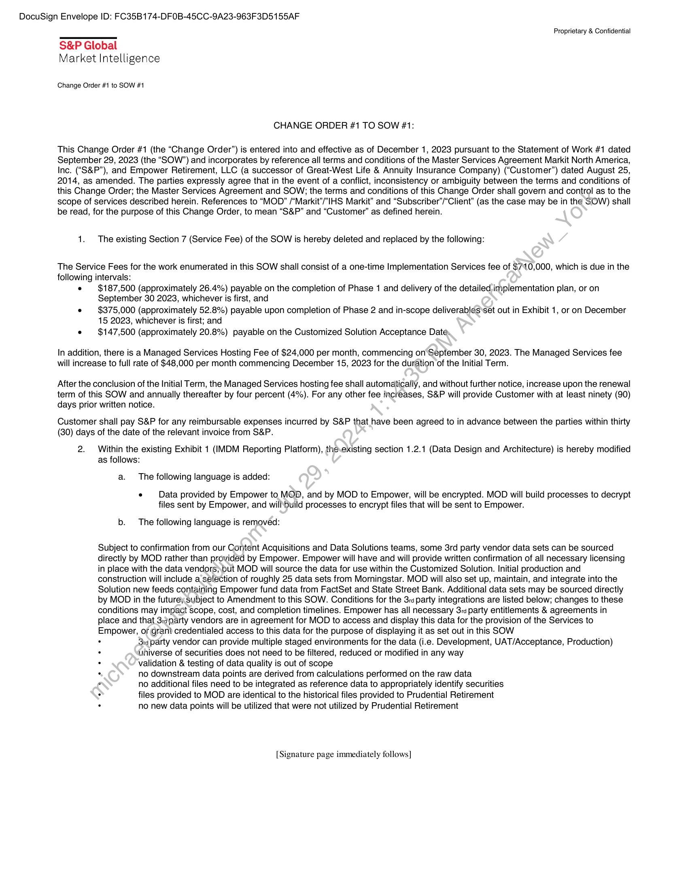
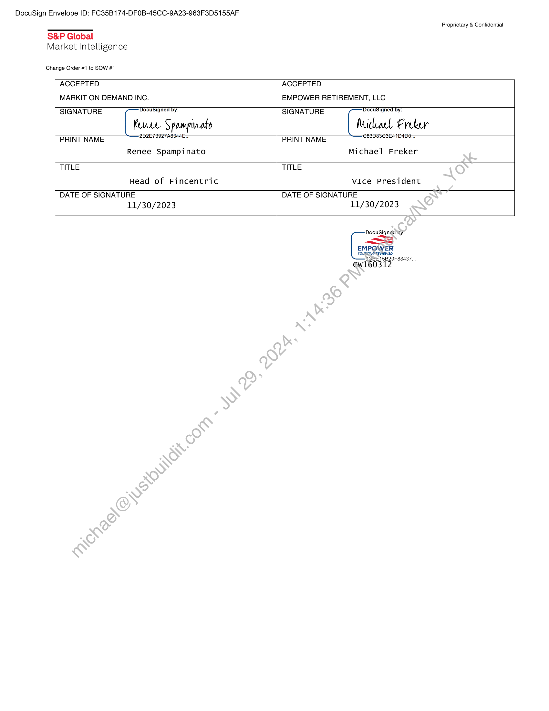
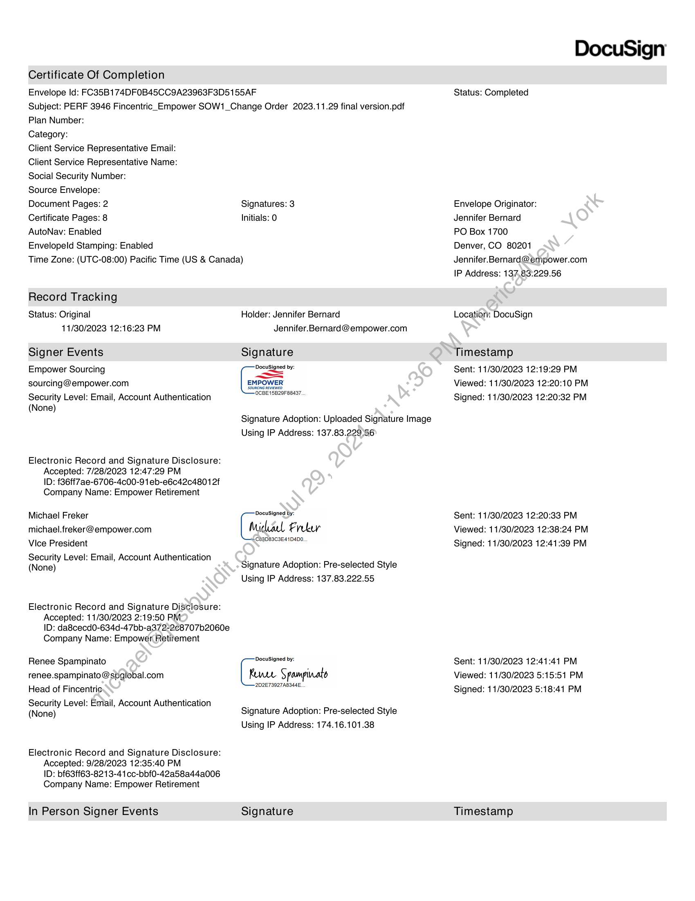
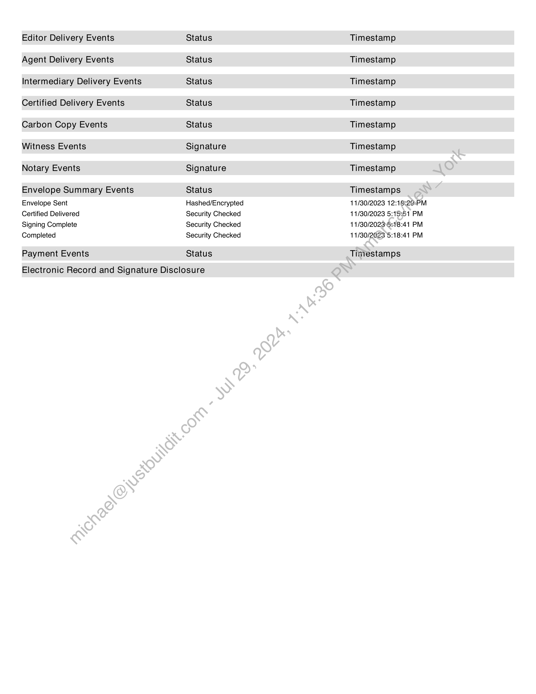
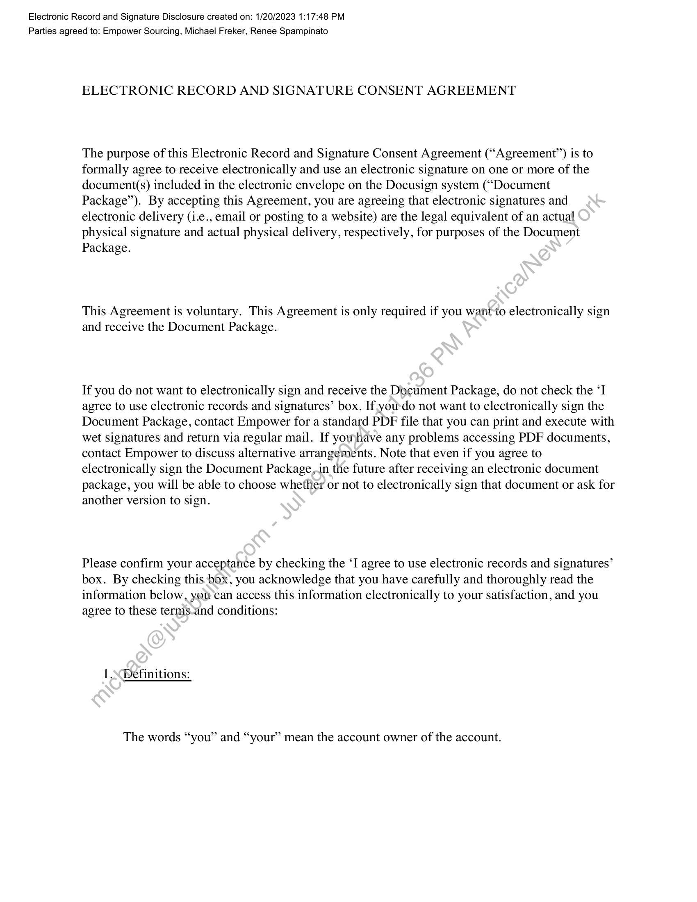
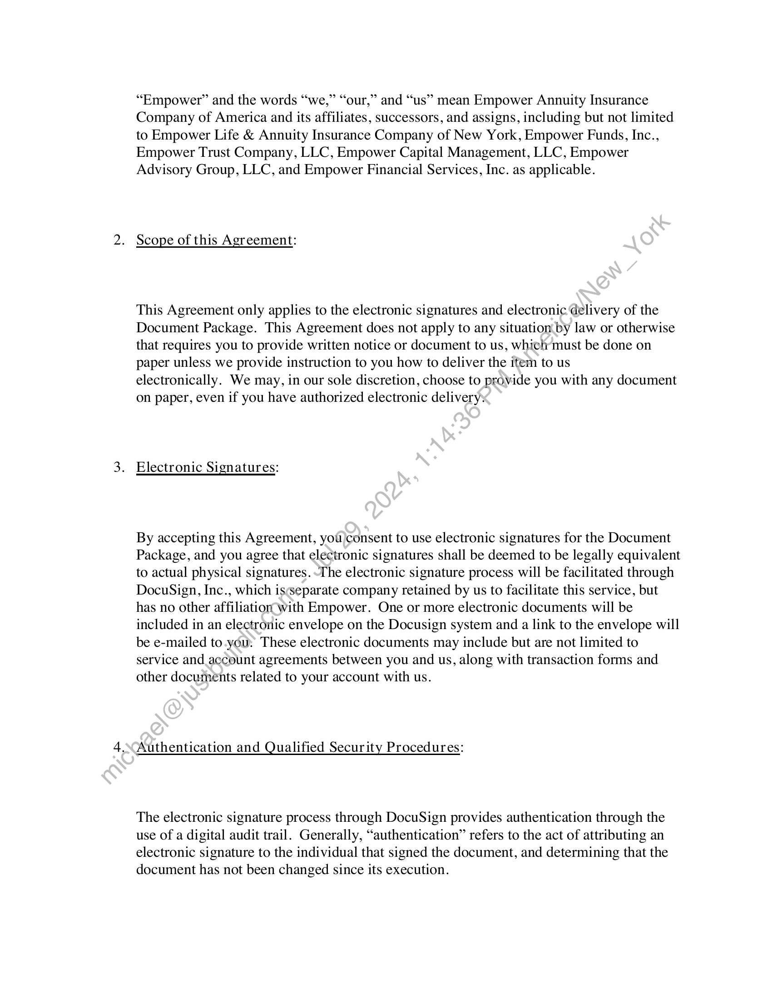
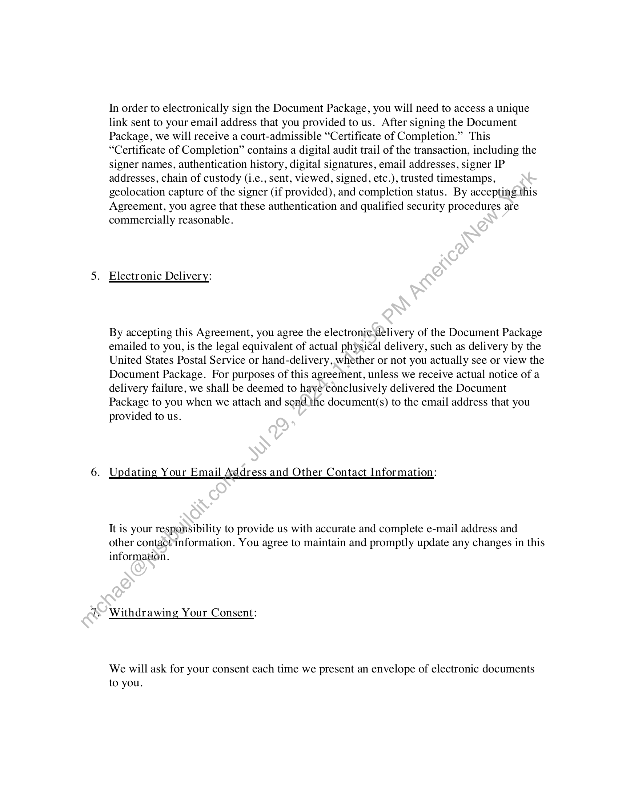
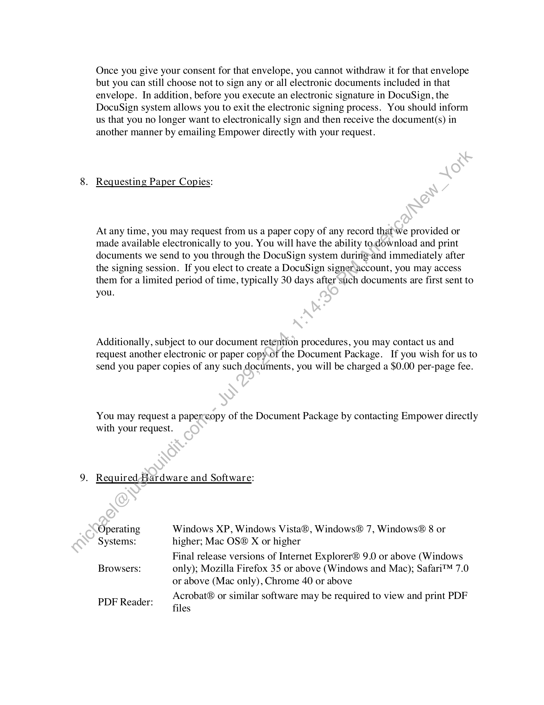
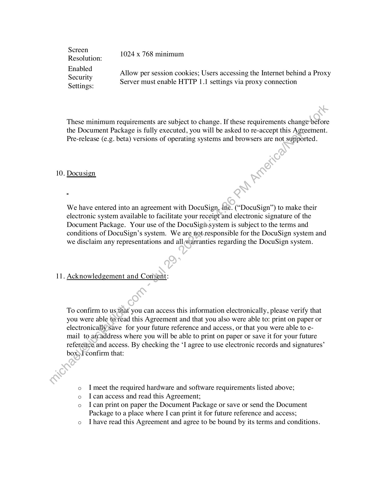
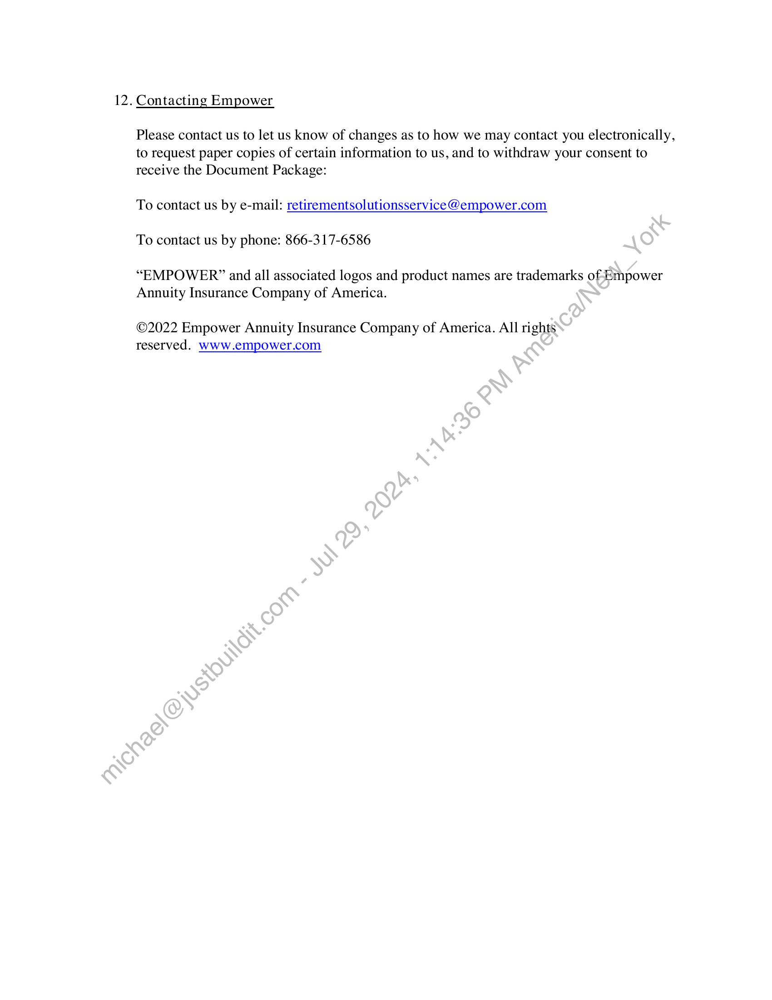

##### Change Order #1 to Statement of Work #1]

  
````col
```col-md
flexGrow=.5
===
> [!info] [Page 1](_attachments/images_Empower-3.6.1.4.200191339.pdf_210556/page_1.png)
> 
```  
```col-md
DocuSign Envelope ID: FC35B174-DFOB-45CC-9A23-963F3D5155AF  
Proprietary & Confidential  
S&P Global
Market Intelligence  
Change Order #1 to SOW #1  
CHANGE ORDER #1 TO SOW #1:  
This Change Order #1 (the “Change Order”) is entered into and effective as of December 1, 2023 pursuant to the Statement of Work #1 dated
September 29, 2023 (the “SOW’”) and incorporates by reference all terms and conditions of the Master Services Agreement Markit North America,
Inc. (“S&P”), and Empower Retirement, LLC (a successor of Great-West Life & Annuity Insurance Company) (“Customer”) dated August 25,
2014, as amended. The parties expressly agree that in the event of a conflict, inconsistency or ambiguity between the terms and conditions of
this Change Order; the Master Services Agreement and SOW; the terms and conditions of this Change Order shall govern and control as to the
scope of services described herein. References to “MOD” /“Markit’/"IHS Markit” and “Subscriber’/“Client” (as the case may be in the SOW) shall
be read, for the purpose of this Change Order, to mean “S&P” and “Customer” as defined herein.  
1. The existing Section 7 (Service Fee) of the SOW is hereby deleted and replaced by the following:  
The Service Fees for the work enumerated in this SOW shall consist of a one-time Implementation Services fee of $710,000, which is due in the
following intervals:
¢ $187,500 (approximately 26.4%) payable on the completion of Phase 1 and delivery of the detailed.implementation plan, or on
September 30 2023, whichever is first, and
¢ $375,000 (approximately 52.8%) payable upon completion of Phase 2 and in-scope deliverablés‘set out in Exhibit 1, or on December
15 2023, whichever is first; and
¢ $147,500 (approximately 20.8%) payable on the Customized Solution Acceptance Date.  
In addition, there is a Managed Services Hosting Fee of $24,000 per month, commencing on'‘September 30, 2023. The Managed Services fee
will increase to full rate of $48,000 per month commencing December 15, 2023 for the duration of the Initial Term.  
After the conclusion of the Initial Term, the Managed Services hosting fee shall automatically, and without further notice, increase upon the renewal
term of this SOW and annually thereafter by four percent (4%). For any other fee increases, S&P will provide Customer with at least ninety (90)
days prior written notice.  
Customer shall pay S&P for any reimbursable expenses incurred by S&P that.have been agreed to in advance between the parties within thirty
(30) days of the date of the relevant invoice from S&P.  
2. Within the existing Exhibit 1 (IMDM Reporting Platform), the.existing section 1.2.1 (Data Design and Architecture) is hereby modified
as follows:  
a. The following language is added:  
. Data provided by Empower to MOD, and by MOD to Empower, will be encrypted. MOD will build processes to decrypt
files sent by Empower, and will\build processes to encrypt files that will be sent to Empower.  
b. The following language is removed:  
Subject to confirmation from our Content Acquisitions and Data Solutions teams, some 3rd party vendor data sets can be sourced
directly by MOD rather than provided by Empower. Empower will have and will provide written confirmation of all necessary licensing
in place with the data vendors;but MOD will source the data for use within the Customized Solution. Initial production and
construction will include a sélection of roughly 25 data sets from Morningstar. MOD will also set up, maintain, and integrate into the
Solution new feeds containing Empower fund data from FactSet and State Street Bank. Additional data sets may be sourced directly
by MOD in the futurey subject to Amendment to this SOW. Conditions for the 3:1 party integrations are listed below; changes to these
conditions may impact scope, cost, and completion timelines. Empower has all necessary 3: party entitlements & agreements in
place and that 3:¢party vendors are in agreement for MOD to access and display this data for the provision of the Services to
Empower, of grant credentialed access to this data for the purpose of displaying it as set out in this SOW  
° Sid party vendor can provide multiple staged environments for the data (i.e. Development, UAT/Acceptance, Production)
uhiverse of securities does not need to be filtered, reduced or modified in any way  
validation & testing of data quality is out of scope  
no downstream data points are derived from calculations performed on the raw data  
no additional files need to be integrated as reference data to appropriately identify securities  
: files provided to MOD are identical to the historical files provided to Prudential Retirement  
. no new data points will be utilized that were not utilized by Prudential Retirement  
[Signature page immediately follows]  
```
````
Notes:    
````col
```col-md
flexGrow=.5
===
> [!info] [Page 2](_attachments/images_Empower-3.6.1.4.200191339.pdf_210556/page_2.png)
> 
```  
```col-md
DocuSign Envelope ID: FC35B174-DFOB-45CC-9A23-963F3D5155AF  
Proprietary & Confidential  
S&P Global
Market Intelligence  
Change Order #1 to SOW #1  
ACCEPTED ACCEPTED
MARKIT ON DEMAND INC. EMPOWER RETIREMENT, LLC
SIGNATURE DocuSigned by: SIGNATURE DocuSigned by:
Kure Spompinato Michal Freer
PRINT NAME OPE me PRINT NAME PESESETTOAOT
Renee Spampinato Michael Freker
TITLE TITLE
Head of Fincentric VIce President
DATE OF SIGNATURE DATE OF SIGNATURE  
11/30/2023  
11/30/2023  
DocuSigned ‘hy:
Se nal
EMPOWER  
SOURCING REVIEWED
OCBE15B29F 88437  
Gw160312  
```
````
Notes:    
````col
```col-md
flexGrow=.5
===
> [!info] [Page 3](_attachments/images_Empower-3.6.1.4.200191339.pdf_210556/page_3.png)
> 
```  
```col-md
Certificate Of Completion  
Envelope Id: FC35B174DFOB45CC9A23963F3D5155AF  
DocuSign  
Status: Completed  
Subject: PERF 3946 Fincentric_Empower SOW1_Change Order 2023.11.29 final version.pdf  
Plan Number:  
Category:  
Client Service Representative Email:
Client Service Representative Name:
Social Security Number:  
Source Envelope:  
Document Pages: 2  
Certificate Pages: 8  
AutoNav: Enabled  
Envelopeld Stamping: Enabled  
Time Zone: (UTC-08:00) Pacific Time (US & Canada)  
Record Tracking  
Status: Original
11/30/2023 12:16:23 PM  
Signer Events  
Empower Sourcing
sourcing@empower.com  
Security Level: Email, Account Authentication
(None)  
Electronic Record and Signature Disclosure:
Accepted: 7/28/2023 12:47:29 PM
ID: f86ff7ae-6706-4c00-91 eb-e6c42c4801 2f
Company Name: Empower Retirement  
Michael Freker
michael.freker@ empower.com
Vice President  
Security Level: Email, Account Authentication
(None)  
Electronic Record and Signature Disclosure:
Accepted: 11/30/2023 2:19:50 PM
ID: da8cecd0-634d-47bb-a372-2c8707b2060e
Company Name: Empower Retifement  
Renee Spampinato
renee.spampinato @spglobal.com
Head of Fincentrie.  
Security Level: Email, Account Authentication
(None)  
Electronic Record and Signature Disclosure:
Accepted: 9/28/2023 12:35:40 PM
ID: bf63ff6E3-821 3-41 cc-bbf0-42a58a44a006
Company Name: Empower Retirement  
In Person Signer Events  
Signatures: 3
Initials: 0  
Envelope Originator:  
Jennifer Bernard  
PO Box 1700  
Denver, CO 80201
Jennifer.Bernard@ empower.com
IP Address: 137,83:229.56  
Holder: Jennifer Bernard
Jennifer.Bernard@empower.com  
Location: DocuSign  
Signature  
Docusigned by
Te
EMPOWER  
OCBE15829F88437.  
Timestamp  
Sent: 11/30/2023 12:19:29 PM
Viewed: 11/30/2023 12:20:10 PM
Signed: 11/30/2023 12:20:32 PM  
Signature Adoption: Uploaded Signature Image
Using IP Address: 137.83.229 56  
DocuSigned by:  
Midal Freer  
(C83D83C3E41D4D0.  
Sent: 11/30/2023 12:20:33 PM
Viewed: 11/30/2023 12:38:24 PM
Signed: 11/30/2023 12:41:39 PM  
Signature Adoption: Pre-selected Style
Using IP Address: 137.83.222.55  
DocuSigned by:  
Rune Spampinato  
-2D2E73927AB344E,  
Sent: 11/30/2023 12:41:41 PM
Viewed: 11/30/2023 5:15:51 PM
Signed: 11/30/2023 5:18:41 PM  
Signature Adoption: Pre-selected Style
Using IP Address: 174.16.101.38  
Signature Timestamp  
```
````
Notes:    
````col
```col-md
flexGrow=.5
===
> [!info] [Page 4](_attachments/images_Empower-3.6.1.4.200191339.pdf_210556/page_4.png)
> 
```  
```col-md
Editor Delivery Events
Agent Delivery Events
Intermediary Delivery Events
Certified Delivery Events
Carbon Copy Events
Witness Events  
Notary Events  
Envelope Summary Events
Envelope Sent  
Certified Delivered  
Signing Complete
Completed  
Payment Events  
Status
Status
Status
Status
Status
Signature
Signature  
Status
Hashed/Encrypted
Security Checked
Security Checked
Security Checked  
Status  
Electronic Record and Signature Disclosure  
Timestamp
Timestamp
Timestamp
Timestamp
Timestamp
Timestamp
Timestamp
Timestamps
11/30/2023 12:19:20PM
11/30/2023 5:15:51 PM  
11/30/2023'5:18:41 PM
11/30/2023 5:18:41 PM  
Timestamps  
```
````
Notes:    
````col
```col-md
flexGrow=.5
===
> [!info] [Page 5](_attachments/images_Empower-3.6.1.4.200191339.pdf_210556/page_5.png)
> 
```  
```col-md
Electronic Record and Signature Disclosure created on: 1/20/2023 1:17:48 PM
Parties agreed to: Empower Sourcing, Michael Freker, Renee Spampinato  
ELECTRONIC RECORD AND SIGNATURE CONSENT AGREEMENT  
The purpose of this Electronic Record and Signature Consent Agreement (“Agreement”) is to
formally agree to receive electronically and use an electronic signature on one or more of the
document(s) included in the electronic envelope on the Docusign system (“Document
Package”). By accepting this Agreement, you are agreeing that electronic signatures and
electronic delivery (i.e., email or posting to a website) are the legal equivalent of an actual
physical signature and actual physical delivery, respectively, for purposes of the Document
Package.  
This Agreement is voluntary. This Agreement is only required if you want-to electronically sign
and receive the Document Package.  
If you do not want to electronically sign and receive the Document Package, do not check the ‘I
agree to use electronic records and signatures’ box. If yourdo not want to electronically sign the
Document Package, contact Empower for a standard PDF file that you can print and execute with
wet signatures and return via regular mail. If yowhave any problems accessing PDF documents,
contact Empower to discuss alternative arrangements. Note that even if you agree to
electronically sign the Document Package,-in the future after receiving an electronic document
package, you will be able to choose whether or not to electronically sign that document or ask for
another version to sign.  
Please confirm your acceptance by checking the ‘I agree to use electronic records and signatures’
box. By checking this box, you acknowledge that you have carefully and thoroughly read the
information below, you can access this information electronically to your satisfaction, and you
agree to these terms-and conditions:  
1.\Definitions:  
The words “you” and “your” mean the account owner of the account.  
```
````
Notes:    
````col
```col-md
flexGrow=.5
===
> [!info] [Page 6](_attachments/images_Empower-3.6.1.4.200191339.pdf_210556/page_6.png)
> 
```  
```col-md
99 66  
“Empower” and the words “we,” “our,” and “us” mean Empower Annuity Insurance
Company of America and its affiliates, successors, and assigns, including but not limited
to Empower Life & Annuity Insurance Company of New York, Empower Funds, Inc.,
Empower Trust Company, LLC, Empower Capital Management, LLC, Empower
Advisory Group, LLC, and Empower Financial Services, Inc. as applicable.  
Scope of this Agreement:  
This Agreement only applies to the electronic signatures and electronic delivery of the
Document Package. This Agreement does not apply to any situation by law or otherwise
that requires you to provide written notice or document to us, which must be done on
paper unless we provide instruction to you how to deliver the item to us  
electronically. We may, in our sole discretion, choose to provide you with any document
on paper, even if you have authorized electronic delivery:  
Electronic Signatures:  
By accepting this Agreement, you)consent to use electronic signatures for the Document
Package, and you agree that electronic signatures shall be deemed to be legally equivalent
to actual physical signatures. -The electronic signature process will be facilitated through
DocuSign, Inc., which isseparate company retained by us to facilitate this service, but
has no other affiliation with Empower. One or more electronic documents will be
included in an electronic envelope on the Docusign system and a link to the envelope will
be e-mailed to .you: These electronic documents may include but are not limited to
service and account agreements between you and us, along with transaction forms and
other documents related to your account with us.  
Authentication and Qualified Security Procedures:  
The electronic signature process through DocuSign provides authentication through the
use of a digital audit trail. Generally, “authentication” refers to the act of attributing an
electronic signature to the individual that signed the document, and determining that the
document has not been changed since its execution.  
```
````
Notes:    
````col
```col-md
flexGrow=.5
===
> [!info] [Page 7](_attachments/images_Empower-3.6.1.4.200191339.pdf_210556/page_7.png)
> 
```  
```col-md
In order to electronically sign the Document Package, you will need to access a unique
link sent to your email address that you provided to us. After signing the Document
Package, we will receive a court-admissible “Certificate of Completion.” This
“Certificate of Completion” contains a digital audit trail of the transaction, including the
signer names, authentication history, digital signatures, email addresses, signer IP
addresses, chain of custody (i.e., sent, viewed, signed, etc.), trusted timestamps,
geolocation capture of the signer (if provided), and completion status. By accepting this
Agreement, you agree that these authentication and qualified security procedures are
commercially reasonable.  
Electronic Delivery:  
By accepting this Agreement, you agree the electronic delivery of the Document Package
emailed to you, is the legal equivalent of actual physical delivery, such as delivery by the
United States Postal Service or hand-delivery, whether or not you actually see or view the
Document Package. For purposes of this agreement, unless we receive actual notice of a
delivery failure, we shall be deemed to have’conclusively delivered the Document
Package to you when we attach and send ihe document(s) to the email address that you
provided to us.  
Updating Your Email Address and Other Contact Information:  
It is your responsibility to provide us with accurate and complete e-mail address and
other contactinformation. You agree to maintain and promptly update any changes in this
information.  
Withdrawing Your Consent:  
We will ask for your consent each time we present an envelope of electronic documents
to you.  
```
````
Notes:    
````col
```col-md
flexGrow=.5
===
> [!info] [Page 8](_attachments/images_Empower-3.6.1.4.200191339.pdf_210556/page_8.png)
> 
```  
```col-md
Once you give your consent for that envelope, you cannot withdraw it for that envelope
but you can still choose not to sign any or all electronic documents included in that
envelope. In addition, before you execute an electronic signature in DocuSign, the
DocuSign system allows you to exit the electronic signing process. You should inform
us that you no longer want to electronically sign and then receive the document(s) in
another manner by emailing Empower directly with your request.  
8. Requesting Paper Copies:  
At any time, you may request from us a paper copy of any record thatwe provided or
made available electronically to you. You will have the ability to.download and print
documents we send to you through the DocuSign system during-and immediately after
the signing session. If you elect to create a DocuSign signeraccount, you may access
them for a limited period of time, typically 30 days after'such documents are first sent to
you.  
Additionally, subject to our document retention procedures, you may contact us and
request another electronic or paper copy.of the Document Package. If you wish for us to
send you paper copies of any such documents, you will be charged a $0.00 per-page fee.  
You may request a papercopy of the Document Package by contacting Empower directly
with your request.  
9. Required Hardware and Software:  
Operating Windows XP, Windows Vista®, Windows® 7, Windows® 8 or
Systems: higher; Mac OS® X or higher  
Final release versions of Internet Explorer® 9.0 or above (Windows
Browsers: only); Mozilla Firefox 35 or above (Windows and Mac); Safari™ 7.0  
or above (Mac only), Chrome 40 or above  
Acrobat® or similar software may be required to view and print PDF  
PDF Reader: .
files  
```
````
Notes:    
````col
```col-md
flexGrow=.5
===
> [!info] [Page 9](_attachments/images_Empower-3.6.1.4.200191339.pdf_210556/page_9.png)
> 
```  
```col-md
10.  
11.  
Screen 1024 x 768 minimum  
Resolution:
Enabled . . . .
nave Allow per session cookies; Users accessing the Internet behind a Proxy
Security : . :
: Server must enable HTTP 1.1 settings via proxy connection
Settings:  
These minimum requirements are subject to change. If these requirements change before
the Document Package is fully executed, you will be asked to re-accept this Agreement.
Pre-release (e.g. beta) versions of operating systems and browsers are not supported.  
Docusign  
We have entered into an agreement with DocuSign, Ine. (“DocuSign’’) to make their
electronic system available to facilitate your receipt and electronic signature of the
Document Package. Your use of the DocuSiginsystem is subject to the terms and
conditions of DocuSign’s system. We are not.responsible for the DocuSign system and
we disclaim any representations and all;warranties regarding the DocuSign system.  
Acknowledgement and Consent:  
To confirm to us,that you can access this information electronically, please verify that
you were able to’read this Agreement and that you also were able to: print on paper or
electronicallysave for your future reference and access, or that you were able to email to atvaddress where you will be able to print on paper or save it for your future
reference and access. By checking the ‘I agree to use electronic records and signatures’
box;I confirm that:  
I meet the required hardware and software requirements listed above;
I can access and read this Agreement;
I can print on paper the Document Package or save or send the Document
Package to a place where I can print it for future reference and access;
o Ihave read this Agreement and agree to be bound by its terms and conditions.  
```
````
Notes:    
````col
```col-md
flexGrow=.5
===
> [!info] [Page 10](_attachments/images_Empower-3.6.1.4.200191339.pdf_210556/page_10.png)
> 
```  
```col-md
12. Contacting Empower
Please contact us to let us know of changes as to how we may contact you electronically,
to request paper copies of certain information to us, and to withdraw your consent to  
receive the Document Package:  
To contact us by e-mail: retirementsolutionsservice@empower.com  
To contact us by phone: 866-317-6586  
“EMPOWER?” and all associated logos and product names are trademarks of Empower
Annuity Insurance Company of America.  
©2022 Empower Annuity Insurance Company of America. All rights
reserved. www.empower.com  
```
````
Notes:  


![[_attachments/Empower-3.6.1.4.2 00191339.pdf]