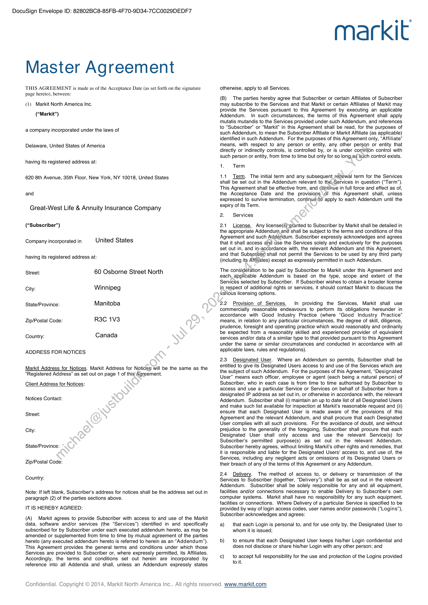
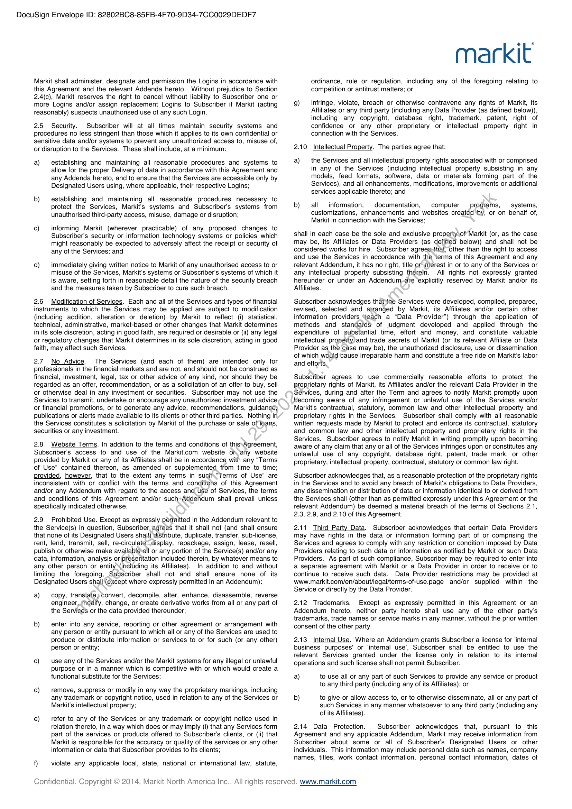
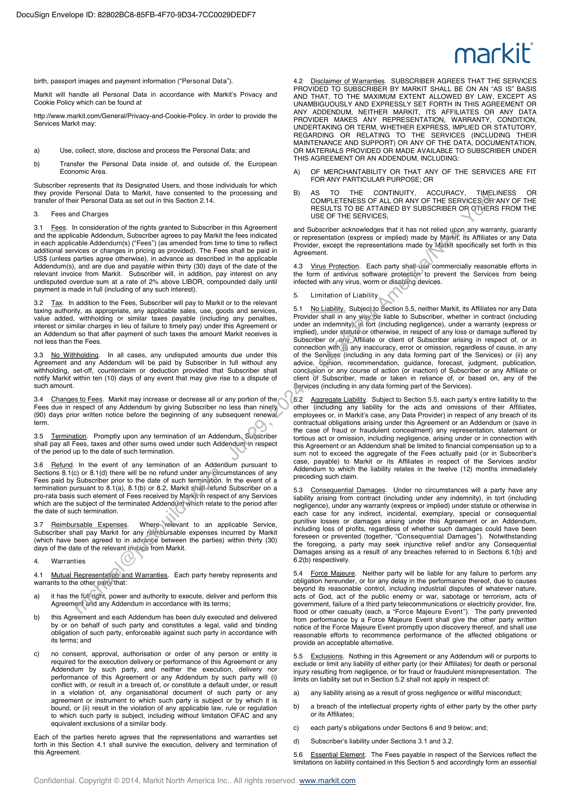
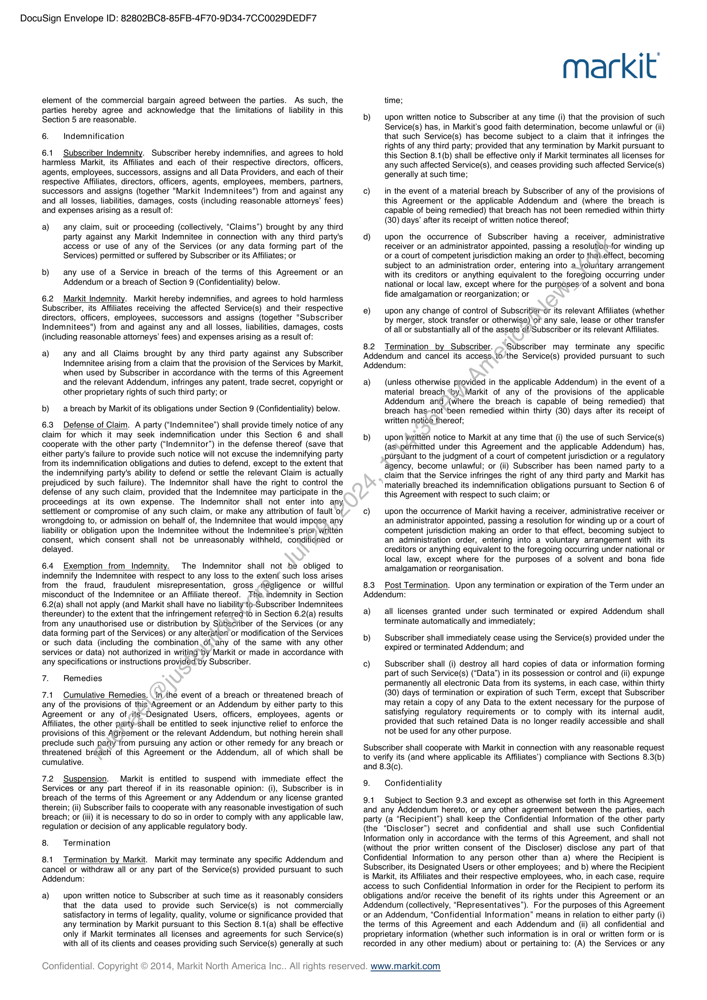
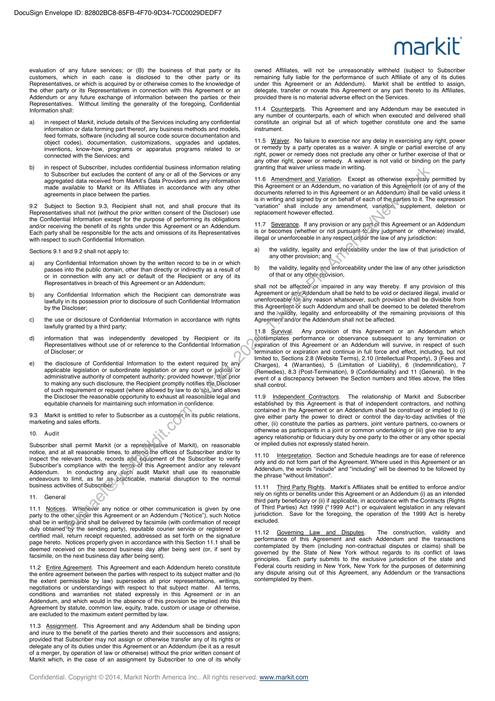
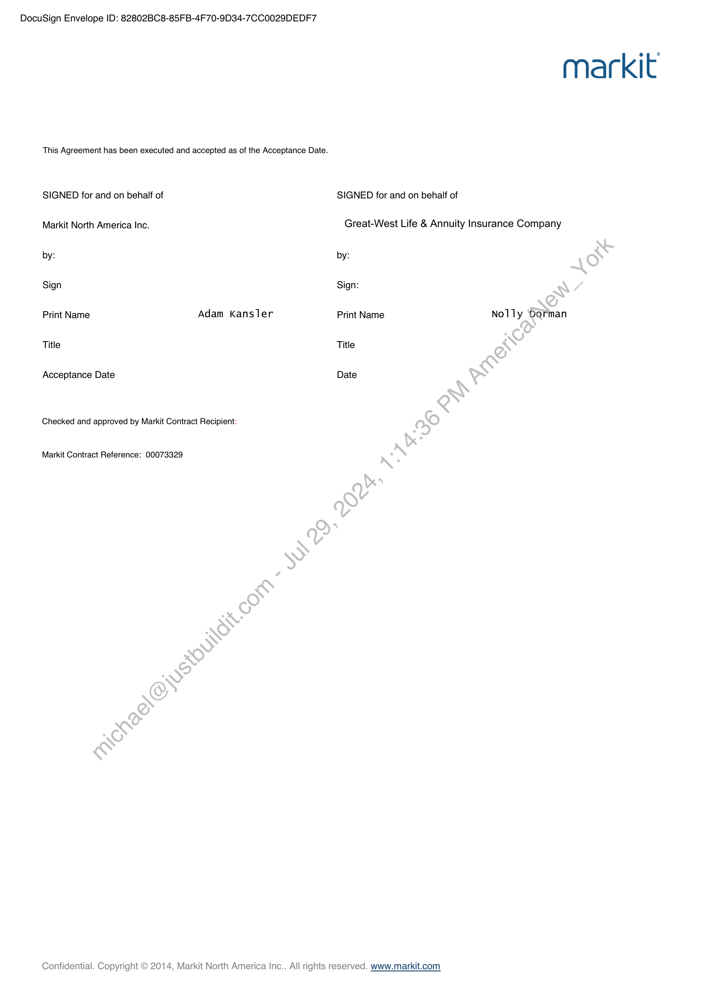

##### Master Agreement]

  
````col
```col-md
flexGrow=.5
===
> [!info] [Page 1](_attachments/images_Empower-3.6.1.4.3MasterAgreementforGreatWestLifecoInc_Sent.pdf_212807/page_1.png)
> 
```  
```col-md
DocuSign Envelope ID: 82802BC8-85FB-4F70-9D34-7CCO029DEDF7  
markit  
Master Agreement  
THIS AGREEMENT is made as of the Acceptance Date (as set forth on the signature otherwise, apply to all Services.  
page hereto), between: j ; oo ;
(B) The parties hereby agree that Subscriber or certain Affiliates of Subscriber  
(1) Markit North America Inc. may subscribe to the Services and that Markit or certain Affiliates of Markit may
m ag provide the Services pursuant to this Agreement by executing an applicable
(“Markit”) Addendum. In such circumstances, the terms of this Agreement shall apply  
mutatis mutandis to the Services provided under such Addendum, and references
to “Subscriber” or “Markit” in this Agreement shall be read, for the purposes of
such Addendum, to mean the Subscriber Affiliate or Markit Affiliate (as applicable)
identified in such Addendum. For the purposes of this Agreement only, “Affiliate”
Delaware, United States of America means, with respect to any person or entity, any other person or entity that  
directly or indirectly controls, is controlled by, or is under common control with  
such person or entity, from time to time but only for so long,as Such control exists.  
a company incorporated under the laws of  
having its registered address at:
1. Term  
620 8th Avenue, 35th Floor, New York, NY 10018, United States 1.1. Term. The initial term and any subsequent renewal term for the Services
shall be set out in the Addendum relevant to the Services in question (“Term”).
This Agreement shall be effective from, and contifue in full force and effect as of,
and the Acceptance Date and the provisions \\of this Agreement shall, unless
expressed to survive termination, continue‘to apply to each Addendum until the
expiry of its Term.  
Great-West Life & Annuity Insurance Company
2. Services  
(“Subscriber”) 2.1 License. Any license(s);granted to Subscriber by Markit shall be detailed in
the appropriate Addendum. and shall be subject to the terms and conditions of this  
. . 4 Agreement and such Addendum. Subscriber expressly acknowledges and agrees
Company incorporated in United States that it shall access dnd Use the Services solely and exclusively for the purposes
set out in, and in-accordance with, the relevant Addendum and this Agreement,
and that Subseriber shall not permit the Services to be used by any third party  
having its registered address at: (including its Affiliates) except as expressly permitted in such Addendum.  
. The consideration to be paid by Subscriber to Markit under this Agreement and  
Street: 60 Osborne Street North each, applicable Addendum is based on the type, scope and extent of the  
Services selected by Subscriber. If Subscriber wishes to obtain a broader license  
City: Winnipeg in respect of additional rights or services, it should contact Markit to discuss the
various licensing options.  
State/Province: Manitoba 2.2 Provision of Services. In providing the Services, Markit shall use
commercially reasonable endeavours to perform its obligations hereunder in
accordance with Good Industry Practice (where “Good Industry Practice”  
Zip/Postal Code: R3C 1V3 means, in relation to any particular circumstances, the degree of skill, diligence,  
prudence, foresight and operating practice which would reasonably and ordinarily  
be expected from a reasonably skilled and experienced provider of equivalent
services and/or data of a similar type to that provided pursuant to this Agreement
under the same or similar circumstances and conducted in accordance with all  
ADDRESS FOR NOTICES applicable laws, rules and regulations).  
2.3 Designated User. Where an Addendum so permits, Subscriber shall be
entitled to give its Designated Users access to and use of the Services which are
the subject of such Addendum. For the purposes of this Agreement, “Designated
User” means each officer, employee or agent (each being a natural person) of
Client Address for Notices: Subscriber, who in each case is from time to time authorised by Subscriber to
access and use a particular Service or Services on behalf of Subscriber from a
designated IP address as set out in, or otherwise in accordance with, the relevant
Addendum. Subscriber shall (i) maintain an up to date list of all Designated Users
and make such list available for inspection at Markit’s reasonable request and (ii)
ensure that each Designated User is made aware of the provisions of this
Agreement and the relevant Addendum, and shall procure that each Designated
User complies with all such provisions. For the avoidance of doubt, and without
City: prejudice to the generality of the foregoing, Subscriber shall procure that each  
Designated User shall only access and use the relevant Service(s) for  
Subscriber's permitted purpose(s) as set out in the relevant Addendum.
State/Province: Subscriber hereby agrees, without limiting Markit’s other rights and remedies, that
it is responsible and liable for the Designated Users' access to, and use of, the
Services, including any negligent acts or omissions of its Designated Users or
their breach of any of the terms of this Agreement or any Addendum.  
Country: Canada  
Markit Address for Notices. Markit Address for Notices will be the same as the
“Registered Address’ as set out on page 1 of this Agreement.  
Notices Contact:  
Street:  
Zip/Postal Code:  
2.4 Delivery. The method of access to, or delivery or transmission of the  
Country: Services to Subscriber (together, “Delivery”) shall be as set out in the relevant
Addendum. Subscriber shall be solely responsible for any and all equipment,
Note: If left blank, Subscriber's address for notices shall be the address set out in facilities and/or connections necessary to enable Delivery to Subscriber's own
paragraph (2) of the parties sections above. computer systems. Markit shall have no responsibility for any such equipment,
facilities or connections. Where Delivery of a particular Service is specified to be
IT IS HEREBY AGREED: provided by way of login access codes, user names and/or passwords (“Logins”),  
. , . Subscriber acknowledges and agrees:
(A) Markit agrees to provide Subscriber with access to and use of the Markit  
data, software and/or services (the “Services”) identified in and specifically a) _ that each Login is personal to, and for use only by, the Designated User to
subscribed for by Subscriber under each executed addendum hereto, as may be whom it is issued;  
amended or supplemented from time to time by mutual agreement of the parties  
hereto (any executed addendum hereto is referred to herein as an “Addendum’). b) to ensure that each Designated User keeps his/her Login confidential and
This Agreement provides the general terms and conditions under which those does not disclose or share his/her Login with any other person; and  
Services are provided to Subscriber or, where expressly permitted, its Affiliates.
Accordingly, the terms and conditions set out herein are incorporated by
reference into all Addenda and shall, unless an Addendum expressly states  
c) to accept full responsibility for the use and protection of the Logins provided
toit.  
Confidential. Copyright  
) 2014, Markit North America Inc.  
 All rights reserved. www.markit.com  
```
````
Notes:    
````col
```col-md
flexGrow=.5
===
> [!info] [Page 2](_attachments/images_Empower-3.6.1.4.3MasterAgreementforGreatWestLifecoInc_Sent.pdf_212807/page_2.png)
> 
```  
```col-md
DocuSign Envelope ID: 82802BC8-85FB-4F70-9D34-7CCO029DEDF7  
Markit shall administer, designate and permission the Logins in accordance with
this Agreement and the relevant Addenda hereto. Without prejudice to Section
2.4(c), Markit reserves the right to cancel without liability to Subscriber one or
more Logins and/or assign replacement Logins to Subscriber if Markit (acting
reasonably) suspects unauthorised use of any such Login.  
2.5 Security. Subscriber will at all times maintain security systems and
procedures no less stringent than those which it applies to its own confidential or
sensitive data and/or systems to prevent any unauthorized access to, misuse of,
or disruption to the Services. These shall include, at a minimum:  
a) establishing and maintaining all reasonable procedures and systems to
allow for the proper Delivery of data in accordance with this Agreement and
any Addenda hereto, and to ensure that the Services are accessible only by
Designated Users using, where applicable, their respective Logins;  
b) establishing and maintaining all reasonable procedures necessary to
protect the Services, Markit’s systems and Subscriber's systems from
unauthorised third-party access, misuse, damage or disruption;  
c) informing Markit (wherever practicable) of any proposed changes to
Subscriber's security or information technology systems or policies which
might reasonably be expected to adversely affect the receipt or security of
any of the Services; and  
d) — immediately giving written notice to Markit of any unauthorised access to or
misuse of the Services, Markit’s systems or Subscriber's systems of which it
is aware, setting forth in reasonable detail the nature of the security breach
and the measures taken by Subscriber to cure such breach.  
2.6 Modification of Services. Each and all of the Services and types of financial
instruments to which the Services may be applied are subject to modification
(including addition, alteration or deletion) by Markit to reflect (i) statistical,
technical, administrative, market-based or other changes that Markit determines
in its sole discretion, acting in good faith, are required or desirable or (ii) any legal
or regulatory changes that Markit determines in its sole discretion, acting in good
faith, may affect such Services.  
2.7 No Advice. The Services (and each of them) are intended only for
professionals in the financial markets and are not, and should not be construed as
financial, investment, legal, tax or other advice of any kind, nor should they be
regarded as an offer, recommendation, or as a solicitation of an offer to buy, sell
or otherwise deal in any investment or securities. Subscriber may not use the
Services to transmit, undertake or encourage any unauthorized investment advice.
or financial promotions, or to generate any advice, recommendations, guidangé)
publications or alerts made available to its clients or other third parties. Nothing in,
the Services constitutes a solicitation by Markit of the purchase or sale of leans,
securities or any investment.  
2.8 Website Terms. In addition to the terms and conditions of this\Agreement,
Subscriber's access to and use of the Markit.com website of any website
provided by Markit or any of its Affiliates shall be in accordance with any “Terms
of Use” contained thereon, as amended or supplemented from time to time;
provided, however, that to the extent any terms in such.“Terms of Use” are
inconsistent with or conflict with the terms and conditions of this Agreement
and/or any Addendum with regard to the access and use of Services, the terms
and conditions of this Agreement and/or such*Addendum shall prevail unless
specifically indicated otherwise.  
2.9 Prohibited Use. Except as expressly permitted in the Addendum relevant to
the Service(s) in question, Subscriber agrees that it shall not (and shall ensure
that none of its Designated Users shall) distribute, duplicate, transfer, sub-license,
rent, lend, transmit, sell, re-circulate;display, repackage, assign, lease, resell,
publish or otherwise make availablevall or any portion of the Service(s) and/or any
data, information, analysis or presentation included therein, by whatever means to
any other person or entity (including its Affiliates). In addition to and without
limiting the foregoing, Subscriber shall not and shall ensure none of its
Designated Users shall (except where expressly permitted in an Addendum):  
a) copy, translate, convert, decompile, alter, enhance, disassemble, reverse
engineer, modify, change, or create derivative works from all or any part of
the Services or the data provided thereunder;  
b) enter into any service, reporting or other agreement or arrangement with
any person or entity pursuant to which all or any of the Services are used to
produce or distribute information or services to or for such (or any other)
person or entity;  
c) use any of the Services and/or the Markit systems for any illegal or unlawful
purpose or in a manner which is competitive with or which would create a
functional substitute for the Services;  
d) remove, suppress or modify in any way the proprietary markings, including
any trademark or copyright notice, used in relation to any of the Services or
Markit's intellectual property;  
e) refer to any of the Services or any trademark or copyright notice used in
relation thereto, in a way which does or may imply (i) that any Services form
part of the services or products offered to Subscriber's clients, or (ii) that
Markit is responsible for the accuracy or quality of the services or any other
information or data that Subscriber provides to its clients;  
f) violate any applicable local, state, national or international law, statute,  
markit  
ordinance, rule or regulation, including any of the foregoing relating to
competition or antitrust matters; or  
g) _ infringe, violate, breach or otherwise contravene any rights of Markit, its
Affiliates or any third party (including any Data Provider (as defined below)),
including any copyright, database right, trademark, patent, right of
confidence or any other proprietary or intellectual property right in
connection with the Services.  
2.10 Intellectual Property. The parties agree that:  
a) _ the Services and all intellectual property rights associated with or comprised
in any of the Services (including intellectual property subsisting in any
models, feed formats, software, data or materials forming part of the
Services), and all enhancements, modifications, improvements or additional
services applicable thereto; and  
b) all information, | documentation, computer programs, systems,
customizations, enhancements and websites created ‘by, or on behalf of,
Markit in connection with the Services;  
shall in each case be the sole and exclusive property\of Markit (or, as the case
may be, its Affiliates or Data Providers (as defined below)) and shall not be
considered works for hire. Subscriber agrees-that; other than the right to access
and use the Services in accordance with the terms of this Agreement and any
relevant Addendum, it has no right, title or interest in or to any of the Services or
any intellectual property subsisting therein. All rights not expressly granted
hereunder or under an Addendum-are ‘explicitly reserved by Markit and/or its
Affiliates.  
Subscriber acknowledges thatthe Services were developed, compiled, prepared,
revised, selected and arranged by Markit, its Affiliates and/or certain other
information providers “each a “Data Provider”) through the application of
methods and standafds of judgment developed and applied through the
expenditure of substantial time, effort and money, and constitute valuable
intellectual property and trade secrets of Markit (or its relevant Affiliate or Data
Provider as the case may be), the unauthorized disclosure, use or dissemination
of which would cause irreparable harm and constitute a free ride on Markit's labor
and efforts.  
Subscriber agrees to use commercially reasonable efforts to protect the
proprietary rights of Markit, its Affiliates and/or the relevant Data Provider in the
Services, during and after the Term and agrees to notify Markit promptly upon
becoming aware of any infringement or unlawful use of the Services and/or
Markit's contractual, statutory, common law and other intellectual property and
proprietary rights in the Services. Subscriber shall comply with all reasonable
written requests made by Markit to protect and enforce its contractual, statutory
and common law and other intellectual property and proprietary rights in the
Services. Subscriber agrees to notify Markit in writing promptly upon becoming
aware of any claim that any or all of the Services infringes upon or constitutes any
unlawful use of any copyright, database right, patent, trade mark, or other
proprietary, intellectual property, contractual, statutory or common law right.  
Subscriber acknowledges that, as a reasonable protection of the proprietary rights
in the Services and to avoid any breach of Markit's obligations to Data Providers,
any dissemination or distribution of data or information identical to or derived from
the Services shall (other than as permitted expressly under this Agreement or the
relevant Addendum) be deemed a material breach of the terms of Sections 2.1,
2.3, 2.9, and 2.10 of this Agreement.  
2.11 Third Party Data. Subscriber acknowledges that certain Data Providers
may have rights in the data or information forming part of or comprising the
Services and agrees to comply with any restriction or condition imposed by Data
Providers relating to such data or information as notified by Markit or such Data
Providers. As part of such compliance, Subscriber may be required to enter into
a separate agreement with Markit or a Data Provider in order to receive or to
continue to receive such data. Data Provider restrictions may be provided at
www.markit.com/en/about/legal/terms-of-use.page and/or supplied within the
Service or directly by the Data Provider.  
2.12 Trademarks. Except as expressly permitted in this Agreement or an
Addendum hereto, neither party hereto shall use any of the other party's
trademarks, trade names or service marks in any manner, without the prior written
consent of the other party.  
2.13 Internal Use. Where an Addendum grants Subscriber a license for ‘internal
business purposes' or ‘internal use’, Subscriber shall be entitled to use the
relevant Services granted under the license only in relation to its internal
operations and such license shall not permit Subscriber:  
a) to use all or any part of such Services to provide any service or product
to any third party (including any of its Affiliates); or  
b) to give or allow access to, or to otherwise disseminate, all or any part of
such Services in any manner whatsoever to any third party (including any
of its Affiliates).  
2.14 Data Protection. Subscriber acknowledges that, pursuant to this
Agreement and any applicable Addendum, Markit may receive information from
Subscriber about some or all of Subscriber's Designated Users or other
individuals. This information may include personal data such as names, company
names, titles, work contact information, personal contact information, dates of  
Confidential. Copyright © 2014, Markit North America Inc.  
 All rights reserved. www.markit.com  
```
````
Notes:    
````col
```col-md
flexGrow=.5
===
> [!info] [Page 3](_attachments/images_Empower-3.6.1.4.3MasterAgreementforGreatWestLifecoInc_Sent.pdf_212807/page_3.png)
> 
```  
```col-md
DocuSign Envelope ID: 82802BC8-85FB-4F70-9D34-7CCO029DEDF7  
birth, passport images and payment information (“Personal Data”).  
Markit will handle all Personal Data in accordance with Markit’s Privacy and
Cookie Policy which can be found at  
http://www.markit.com/General/Privacy-and-Cookie-Policy. In order to provide the
Services Markit may:  
a) Use, collect, store, disclose and process the Personal Data; and  
b) Transfer the Personal Data inside of, and outside of, the European
Economic Area.  
Subscriber represents that its Designated Users, and those individuals for which
they provide Personal Data to Markit, have consented to the processing and
transfer of their Personal Data as set out in this Section 2.14.  
3. Fees and Charges  
3.1 Fees. In consideration of the rights granted to Subscriber in this Agreement
and the applicable Addendum, Subscriber agrees to pay Markit the fees indicated
in each applicable Addendum(s) (“Fees”) (as amended from time to time to reflect
additional services or changes in pricing as provided). The Fees shall be paid in
US$ (unless parties agree otherwise), in advance as described in the applicable
Addendum(s), and are due and payable within thirty (30) days of the date of the
relevant invoice from Markit. Subscriber will, in addition, pay interest on any
undisputed overdue sum at a rate of 2% above LIBOR, compounded daily until
payment is made in full (including of any such interest).  
3.2 Tax. In addition to the Fees, Subscriber will pay to Markit or to the relevant
taxing authority, as appropriate, any applicable sales, use, goods and services,
value added, withholding or similar taxes payable (including any penalties,
interest or similar charges in lieu of failure to timely pay) under this Agreement or
an Addendum so that after payment of such taxes the amount Markit receives is
not less than the Fees.  
3.3. No Withholding. In all cases, any undisputed amounts due under this
Agreement and any Addendum will be paid by Subscriber in full without any
withholding, set-off, counterclaim or deduction provided that Subscriber shall
notify Markit within ten (10) days of any event that may give rise to a dispute of
such amount.  
3.4 Changes to Fees. Markit may increase or decrease all or any portion of the.
Fees due in respect of any Addendum by giving Subscriber no less than ninety,
(90) days prior written notice before the beginning of any subsequent renewal
term.  
3.5 Termination. Promptly upon any termination of an Addendum, Subscriber
shall pay all Fees, taxes and other sums owed under such Addendum\in respect
of the period up to the date of such termination.  
3.6 Refund. In the event of any termination of an Addendum pursuant to
Sections 8.1(c) or 8.1(d) there will be no refund under anycircumstances of any
Fees paid by Subscriber prior to the date of such termination. In the event of a
termination pursuant to 8.1(a), 8.1(b) or 8.2, Markit strallefund Subscriber on a
pro-rata basis such element of Fees received by Markitin respect of any Services
which are the subject of the terminated Addendum which relate to the period after
the date of such termination.  
3.7 Reimbursable Expenses. Where» \‘elevant to an applicable Service,
Subscriber shall pay Markit for any réimbursable expenses incurred by Markit
(which have been agreed to in advari¢e between the parties) within thirty (30)
days of the date of the relevant invoice from Markit.  
4. Warranties  
4.1 Mutual Representation’ and Warranties. Each party hereby represents and
warrants to the other parfy that:  
a) _ it has the full right, power and authority to execute, deliver and perform this
Agreement and any Addendum in accordance with its terms;  
b) — this Agreement and each Addendum has been duly executed and delivered
by or on behalf of such party and constitutes a legal, valid and binding
obligation of such party, enforceable against such party in accordance with
its terms; and  
c) no consent, approval, authorisation or order of any person or entity is
required for the execution delivery or performance of this Agreement or any
Addendum by such party, and neither the execution, delivery nor
performance of this Agreement or any Addendum by such party will (i)
conflict with, or result in a breach of, or constitute a default under, or result
in a violation of, any organisational document of such party or any
agreement or instrument to which such party is subject or by which it is
bound, or (ii) result in the violation of any applicable law, rule or regulation
to which such party is subject, including without limitation OFAC and any
equivalent exclusions of a similar body.  
Each of the parties hereto agrees that the representations and warranties set
forth in this Section 4.1 shall survive the execution, delivery and termination of
this Agreement.  
markit  
4.2 Disclaimer of Warranties. SUBSCRIBER AGREES THAT THE SERVICES
PROVIDED TO SUBSCRIBER BY MARKIT SHALL BE ON AN “AS IS” BASIS
AND THAT, TO THE MAXIMUM EXTENT ALLOWED BY LAW, EXCEPT AS
UNAMBIGUOUSLY AND EXPRESSLY SET FORTH IN THIS AGREEMENT OR
ANY ADDENDUM, NEITHER MARKIT, ITS AFFILIATES OR ANY DATA
PROVIDER MAKES ANY REPRESENTATION, WARRANTY, CONDITION,
UNDERTAKING OR TERM, WHETHER EXPRESS, IMPLIED OR STATUTORY,
REGARDING OR RELATING TO THE SERVICES (INCLUDING THEIR
MAINTENANCE AND SUPPORT) OR ANY OF THE DATA, DOCUMENTATION,
OR MATERIALS PROVIDED OR MADE AVAILABLE TO SUBSCRIBER UNDER
THIS AGREEMENT OR AN ADDENDUM, INCLUDING:  
A) OF MERCHANTABILITY OR THAT ANY OF THE SERVICES ARE FIT
FOR ANY PARTICULAR PURPOSE; OR  
B) AS TO THE CONTINUITY, ACCURACY, TIMELINESS OR
COMPLETENESS OF ALL OR ANY OF THE SERVICES/OR’ANY OF THE
RESULTS TO BE ATTAINED BY SUBSCRIBER OR GTHERS FROM THE
USE OF THE SERVICES,  
and Subscriber acknowledges that it has not relied upon any warranty, guaranty
or representation (express or implied) made by Markit, its Affiliates or any Data
Provider, except the representations made by Markit specifically set forth in this
Agreement.  
4.3 Virus Protection. Each party shall-use commercially reasonable efforts in
the form of antivirus software protection to prevent the Services from being
infected with any virus, worm or disabling devices.  
5. Limitation of Liability  
5.1 No Liability. Subjeci,to Section 5.5, neither Markit, its Affiliates nor any Data
Provider shall in any Way be liable to Subscriber, whether in contract (including
under an indemnity); in tort (including negligence), under a warranty (express or
implied), under statutevor otherwise, in respect of any loss or damage suffered by
Subscriber or,any_Affiliate or client of Subscriber arising in respect of, or in
connection with (i) any inaccuracy, error or omission, regardless of cause, in any
of the Services (including in any data forming part of the Services) or (ii) any
advice, Opinion, recommendation, guidance, forecast, judgment, publication,
conclusion or any course of action (or inaction) of Subscriber or any Affiliate or
client of Subscriber, made or taken in reliance of, or based on, any of the
Services (including in any data forming part of the Services).  
5.2 Aggregate Liability. Subject to Section 5.5, each party's entire liability to the
other (including any liability for the acts and omissions of their Affiliates,
employees or, in Markit’s case, any Data Provider) in respect of any breach of its
contractual obligations arising under this Agreement or an Addendum or (save in
the case of fraud or fraudulent concealment) any representation, statement or
tortious act or omission, including negligence, arising under or in connection with
this Agreement or an Addendum shall be limited to financial compensation up to a
sum not to exceed the aggregate of the Fees actually paid (or in Subscriber's
case, payable) to Markit or its Affiliates in respect of the Services and/or
Addendum to which the liability relates in the twelve (12) months immediately
preceding such claim.  
5.3 Consequential Damages. Under no circumstances will a party have any
liability arising from contract (including under any indemnity), in tort (including
negligence), under any warranty (express or implied) under statute or otherwise in
each case for any indirect, incidental, exemplary, special or consequential
punitive losses or damages arising under this Agreement or an Addendum,
including loss of profits, regardless of whether such damages could have been
foreseen or prevented (together, “Consequential Damages”). Notwithstanding
the foregoing, a party may seek injunctive relief and/or any Consequential
Damages arising as a result of any breaches referred to in Sections 6.1(b) and
6.2(b) respectively.  
5.4 Force Majeure. Neither party will be liable for any failure to perform any
obligation hereunder, or for any delay in the performance thereof, due to causes
beyond its reasonable control, including industrial disputes of whatever nature,
acts of God, act of the public enemy or war, sabotage or terrorism, acts of
government, failure of a third party telecommunications or electricity provider, fire,
flood or other casualty (each, a “Force Majeure Event”). The party prevented
from performance by a Force Majeure Event shall give the other party written
notice of the Force Majeure Event promptly upon discovery thereof, and shall use
reasonable efforts to recommence performance of the affected obligations or
provide an acceptable alternative.  
5.5 Exclusions. Nothing in this Agreement or any Addendum will or purports to
exclude or limit any liability of either party (or their Affiliates) for death or personal
injury resulting from negligence, or for fraud or fraudulent misrepresentation. The
limits on liability set out in Section 5.2 shall not apply in respect of:  
a) any liability arising as a result of gross negligence or willful misconduct;  
b) a breach of the intellectual property rights of either party by the other party
or its Affiliates;  
c) each party's obligations under Sections 6 and 9 below; and;
d) Subscriber's liability under Sections 3.1 and 3.2.  
5.6 Essential Element. The Fees payable in respect of the Services reflect the
limitations on liability contained in this Section 5 and accordingly form an essential  
Confidential. Copyright © 2014, Markit North America Inc.  
 All rights reserved. www.markit.com  
```
````
Notes:    
````col
```col-md
flexGrow=.5
===
> [!info] [Page 4](_attachments/images_Empower-3.6.1.4.3MasterAgreementforGreatWestLifecoInc_Sent.pdf_212807/page_4.png)
> 
```  
```col-md
DocuSign Envelope ID: 82802BC8-85FB-4F70-9D34-7CCO029DEDF7  
element of the commercial bargain agreed between the parties. As such, the
parties hereby agree and acknowledge that the limitations of liability in this
Section 5 are reasonable.  
6. Indemnification  
6.1 Subscriber Indemnity. Subscriber hereby indemnifies, and agrees to hold
harmless Markit, its Affiliates and each of their respective directors, officers,
agents, employees, successors, assigns and all Data Providers, and each of their
respective Affiliates, directors, officers, agents, employees, members, partners,
successors and assigns (together "Markit Indemnitees") from and against any
and all losses, liabilities, damages, costs (including reasonable attorneys’ fees)
and expenses arising as a result of:  
a) any claim, suit or proceeding (collectively, “Claims”) brought by any third
party against any Markit Indemnitee in connection with any third party's
access or use of any of the Services (or any data forming part of the
Services) permitted or suffered by Subscriber or its Affiliates; or  
b) any use of a Service in breach of the terms of this Agreement or an
Addendum or a breach of Section 9 (Confidentiality) below.  
6.2 Markit Indemnity. Markit hereby indemnifies, and agrees to hold harmless
Subscriber, its Affiliates receiving the affected Service(s) and their respective
directors, officers, employees, successors and assigns (together "Subscriber
Indemnitees") from and against any and all losses, liabilities, damages, costs
(including reasonable attorneys’ fees) and expenses arising as a result of:  
a) any and all Claims brought by any third party against any Subscriber
Indemnitee arising from a claim that the provision of the Services by Markit,
when used by Subscriber in accordance with the terms of this Agreement
and the relevant Addendum, infringes any patent, trade secret, copyright or
other proprietary rights of such third party; or  
b) —abreach by Markit of its obligations under Section 9 (Confidentiality) below.  
6.3 Defense of Claim. A party (“Indemnitee”) shall provide timely notice of any
claim for which it may seek indemnification under this Section 6 and shall
cooperate with the other party (“Indemnitor”) in the defense thereof (save that
either party's failure to provide such notice will not excuse the indemnifying party
from its indemnification obligations and duties to defend, except to the extent that
the indemnifying party's ability to defend or settle the relevant Claim is actually
prejudiced by such failure). The Indemnitor shall have the right to control the
defense of any such claim, provided that the Indemnitee may participate in the
proceedings at its own expense. The Indemnitor shall not enter into any
settlement or compromise of any such claim, or make any attribution of fault of
wrongdoing to, or admission on behalf of, the Indemnitee that would impose any
liability or obligation upon the Indemnitee without the Indemnitee’s prior written
consent, which consent shall not be unreasonably withheld, conditioned or
delayed.  
6.4 Exemption from Indemnity. The Indemnitor shall not be obliged to
indemnify the Indemnitee with respect to any loss to the extent such loss arises
from the fraud, fraudulent misrepresentation, gross negligence or willful
misconduct of the Indemnitee or an Affiliate thereof. The, indemnity in Section
6.2(a) shall not apply (and Markit shall have no liability’to-Subscriber Indemnitees
thereunder) to the extent that the infringement referred*to in Section 6.2(a) results
from any unauthorised use or distribution by Subscriber of the Services (or any
data forming part of the Services) or any alteration or modification of the Services
or such data (including the combination.of any of the same with any other
services or data) not authorized in writing by Markit or made in accordance with
any specifications or instructions provided by Subscriber.  
7. Remedies  
7.1 Cumulative Remedies. In ihe event of a breach or threatened breach of
any of the provisions of this Agreement or an Addendum by either party to this
Agreement or any of,its~Designated Users, officers, employees, agents or
Affiliates, the other party-shall be entitled to seek injunctive relief to enforce the
provisions of this Agreement or the relevant Addendum, but nothing herein shall
preclude such party from pursuing any action or other remedy for any breach or
threatened breach of this Agreement or the Addendum, all of which shall be
cumulative.  
7.2 Suspension. Markit is entitled to suspend with immediate effect the
Services or any part thereof if in its reasonable opinion: (i), Subscriber is in
breach of the terms of this Agreement or any Addendum or any license granted
therein; (ii) Subscriber fails to cooperate with any reasonable investigation of such
breach; or (iii) it is necessary to do so in order to comply with any applicable law,
regulation or decision of any applicable regulatory body.  
8. Termination  
8.1 Termination by Markit. Markit may terminate any specific Addendum and
cancel or withdraw all or any part of the Service(s) provided pursuant to such
Addendum:  
a) _upon written notice to Subscriber at such time as it reasonably considers
that the data used to provide such Service(s) is not commercially
satisfactory in terms of legality, quality, volume or significance provided that
any termination by Markit pursuant to this Section 8.1(a) shall be effective
only if Markit terminates all licenses and agreements for such Service(s)
with all of its clients and ceases providing such Service(s) generally at such  
markit  
time;  
b) upon written notice to Subscriber at any time (i) that the provision of such
Service(s) has, in Markit’s good faith determination, become unlawful or (ii)
that such Service(s) has become subject to a claim that it infringes the
rights of any third party; provided that any termination by Markit pursuant to
this Section 8.1(b) shall be effective only if Markit terminates all licenses for
any such affected Service(s), and ceases providing such affected Service(s)
generally at such time;  
c) _ in the event of a material breach by Subscriber of any of the provisions of
this Agreement or the applicable Addendum and (where the breach is
capable of being remedied) that breach has not been remedied within thirty
(30) days’ after its receipt of written notice thereof;  
d) upon the occurrence of Subscriber having a receiver, administrative
receiver or an administrator appointed, passing a resolution-for winding up
or a court of competent jurisdiction making an order to that.effect, becoming
subject to an administration order, entering into a_voluntary arrangement
with its creditors or anything equivalent to the foregoing occurring under
national or local law, except where for the purposes’of a solvent and bona
fide amalgamation or reorganization; or  
e) upon any change of control of Subscriber-or its relevant Affiliates (whether
by merger, stock transfer or otherwise) or any sale, lease or other transfer
of all or substantially all of the assets of Subscriber or its relevant Affiliates.  
8.2 Termination by Subscriber. ~ Subscriber may terminate any specific
Addendum and cancel its access. to the Service(s) provided pursuant to such
Addendum:  
a) (unless otherwise provided in the applicable Addendum) in the event of a
material breach “by\ Markit of any of the provisions of the applicable
Addendum and (where the breach is capable of being remedied) that
breach has-not ‘been remedied within thirty (30) days after its receipt of
written notice thereof;  
b) upon written notice to Markit at any time that (i) the use of such Service(s)
(as\permitted under this Agreement and the applicable Addendum) has,
pursuant to the judgment of a court of competent jurisdiction or a regulatory
agency, become unlawful; or (ii) Subscriber has been named party to a
claim that the Service infringes the right of any third party and Markit has
materially breached its indemnification obligations pursuant to Section 6 of
this Agreement with respect to such claim; or  
c) — upon the occurrence of Markit having a receiver, administrative receiver or
an administrator appointed, passing a resolution for winding up or a court of
competent jurisdiction making an order to that effect, becoming subject to
an administration order, entering into a voluntary arrangement with its
creditors or anything equivalent to the foregoing occurring under national or
local law, except where for the purposes of a solvent and bona fide
amalgamation or reorganisation.  
8.3 Post Termination. Upon any termination or expiration of the Term under an
Addendum:  
a) all licenses granted under such terminated or expired Addendum shall
terminate automatically and immediately;  
b) Subscriber shall immediately cease using the Service(s) provided under the
expired or terminated Addendum; and  
c) | Subscriber shall (i) destroy all hard copies of data or information forming
part of such Service(s) (“Data”) in its possession or control and (ii) expunge
permanently all electronic Data from its systems, in each case, within thirty
(30) days of termination or expiration of such Term, except that Subscriber
may retain a copy of any Data to the extent necessary for the purpose of
satisfying regulatory requirements or to comply with its internal audit,
provided that such retained Data is no longer readily accessible and shall
not be used for any other purpose.  
Subscriber shall cooperate with Markit in connection with any reasonable request
to verify its (and where applicable its Affiliates’) compliance with Sections 8.3(b)
and 8.3(c).  
9. Confidentiality  
9.1 Subject to Section 9.3 and except as otherwise set forth in this Agreement
and any Addendum hereto, or any other agreement between the parties, each
party (a “Recipient”) shall keep the Confidential Information of the other party
(the “Discloser”) secret and confidential and shall use such Confidential
Information only in accordance with the terms of this Agreement, and shall not
(without the prior written consent of the Discloser) disclose any part of that
Confidential Information to any person other than a) where the Recipient is
Subscriber, its Designated Users or other employees; and b) where the Recipient
is Markit, its Affiliates and their respective employees, who, in each case, require
access to such Confidential Information in order for the Recipient to perform its
obligations and/or receive the benefit of its rights under this Agreement or an
Addendum (collectively, “Representatives”). For the purposes of this Agreement
or an Addendum, “Confidential Information” means in relation to either party (i)
the terms of this Agreement and each Addendum and (ii) all confidential and
proprietary information (whether such information is in oral or written form or is
recorded in any other medium) about or pertaining to: (A) the Services or any  
Confidential. Copyright © 2014, Markit North America Inc.  
 All rights reserved. www.markit.com  
```
````
Notes:    
````col
```col-md
flexGrow=.5
===
> [!info] [Page 5](_attachments/images_Empower-3.6.1.4.3MasterAgreementforGreatWestLifecoInc_Sent.pdf_212807/page_5.png)
> 
```  
```col-md
DocuSign Envelope ID: 82802BC8-85FB-4F70-9D34-7CCO029DEDF7  
evaluation of any future services; or (B) the business of that party or its
customers, which in each case is disclosed to the other party or its
Representatives, or which is acquired by or otherwise comes to the knowledge of
the other party or its Representatives in connection with this Agreement or an
Addendum or any future exchange of information between the parties or their
Representatives. Without limiting the generality of the foregoing, Confidential
Information shall:  
a) in respect of Markit, include details of the Services including any confidential
information or data forming part thereof, any business methods and models,
feed formats, software (including all source code source documentation and
object codes), documentation, customizations, upgrades and updates,
inventions, know-how, programs or apparatus programs related to or
connected with the Services; and  
b) in respect of Subscriber, includes confidential business information relating
to Subscriber but excludes the content of any or all of the Services or any
aggregated data received from Markit’s Data Providers and any information
made available to Markit or its Affiliates in accordance with any other
agreements in place between the parties.  
9.2 Subject to Section 9.3, Recipient shall not, and shall procure that its
Representatives shall not (without the prior written consent of the Discloser) use
the Confidential Information except for the purpose of performing its obligations
and/or receiving the benefit of its rights under this Agreement or an Addendum.
Each party shall be responsible for the acts and omissions of its Representatives
with respect to such Confidential Information.  
Sections 9.1 and 9.2 shall not apply to:  
a) any Confidential Information shown by the written record to be in or which
passes into the public domain, other than directly or indirectly as a result of
or in connection with any act or default of the Recipient or any of its
Representatives in breach of this Agreement or an Addendum;  
b) any Confidential Information which the Recipient can demonstrate was
lawfully in its possession prior to disclosure of such Confidential Information
by the Discloser;  
c) the use or disclosure of Confidential Information in accordance with rights
lawfully granted by a third party;  
d) information that was independently developed by Recipient or its
Representatives without use of or reference to the Confidential Information
of Discloser; or  
e) the disclosure of Confidential Information to the extent required by any
applicable legislation or subordinate legislation or any court or judicial or
administrative authority of competent authority; provided however, that prior
to making any such disclosure, the Recipient promptly notifies the Discloser
of such requirement or request (where allowed by law to do’so),/and allows
the Discloser the reasonable opportunity to exhaust all reasonable legal and
equitable channels for maintaining such information in confidence.  
9.3. Markit is entitled to refer to Subscriber as a customér in its public relations,
marketing and sales efforts.  
10. Audit  
Subscriber shall permit Markit (or a representative of Markit), on reasonable
notice, and at all reasonable times, to attend»the offices of Subscriber and/or to
inspect the relevant books, records and equipment of the Subscriber to verify
Subscriber's compliance with the terms~of this Agreement and/or any relevant
Addendum. In conducting any.such audit Markit shall use its reasonable
endeavours to limit, as far as\practicable, material disruption to the normal
business activities of Subscriber:  
11. General  
11.1. Notices. Whenever any notice or other communication is given by one
party to the other.under this Agreement or an Addendum (“Notice”), such Notice
shall be in writing.and shall be delivered by facsimile (with confirmation of receipt
duly obtained’ by the sending party), reputable courier service or registered or
certified mail, return receipt requested, addressed as set forth on the signature
page hereto. Notices properly given in accordance with this Section 11.1 shall be
deemed received on the second business day after being sent (or, if sent by
facsimile, on the next business day after being sent).  
11.2 Entire Agreement. This Agreement and each Addendum hereto constitute
the entire agreement between the parties with respect to its subject matter and (to
the extent permissible by law) supersedes all prior representations, writings,
negotiations or understandings with respect to that subject matter. All terms,
conditions and warranties not stated expressly in this Agreement or in an
Addendum, and which would in the absence of this provision be implied into this
Agreement by statute, common law, equity, trade, custom or usage or otherwise,
are excluded to the maximum extent permitted by law.  
11.3 Assignment. This Agreement and any Addendum shall be binding upon
and inure to the benefit of the parties thereto and their successors and assigns;
provided that Subscriber may not assign or otherwise transfer any of its rights or
delegate any of its duties under this Agreement or an Addendum (be it as a result
of a merger, by operation of law or otherwise) without the prior written consent of
Markit which, in the case of an assignment by Subscriber to one of its wholly  
markit  
owned Affiliates, will not be unreasonably withheld (subject to Subscriber
remaining fully liable for the performance of such Affiliate of any of its duties
under this Agreement or an Addendum). Markit shall be entitled to assign,
delegate, transfer or novate this Agreement or any part thereto to its Affiliates,
provided there is no material adverse effect on the Services.  
11.4 Counterparts. This Agreement and any Addendum may be executed in
any number of counterparts, each of which when executed and delivered shall
constitute an original but all of which together constitute one and the same
instrument.  
11.5 Waiver. No failure to exercise nor any delay in exercising any right, power
or remedy by a party operates as a waiver. A single or partial exercise of any
right, power or remedy does not preclude any other or further exercise of that or
any other right, power or remedy. A waiver is not valid or binding on the party
granting that waiver unless made in writing.  
11.6 Amendment and Variation. Except as otherwise expressly permitted by
this Agreement or an Addendum, no variation of this Agreement (or of any of the
documents referred to in this Agreement or an Addendum) shall be valid unless it
is in writing and signed by or on behalf of each of the parties to it. The expression
“variation” shall include any amendment, variation, supplement, deletion or
replacement however effected.  
11.7 Severance. If any provision or any part\of this Agreement or an Addendum
is or becomes (whether or not pursuant-to_any judgment or otherwise) invalid,
illegal or unenforceable in any respect,under the law of any jurisdiction:  
a) _ the validity, legality and enforceability under the law of that jurisdiction of
any other provision; and  
b) _ the validity, legality and enforceability under the law of any other jurisdiction
of that or any othér-provision,  
shall not be affected or impaired in any way thereby. If any provision of this
Agreement or any/Addendum shall be held to be void or declared illegal, invalid or
unenforceable for any reason whatsoever, such provision shall be divisible from
this Agreement-or such Addendum and shall be deemed to be deleted therefrom
and the )validity, legality and enforceability of the remaining provisions of this
Agreement and/or the Addendum shall not be affected.  
11.8 Survival. Any provision of this Agreement or an Addendum which
contemplates performance or observance subsequent to any termination or
expiration of this Agreement or an Addendum will survive, in respect of such
termination or expiration and continue in full force and effect, including, but not
limited to, Sections 2.8 (Website Terms), 2.10 (Intellectual Property), 3 (Fees and
Charges), 4 (Warranties), 5 (Limitation of Liability), 6 (Indemnification), 7
(Remedies), 8.3 (Post-Termination), 9 (Confidentiality) and 11 (General). In the
event of a discrepancy between the Section numbers and titles above, the titles
shall control.  
11.9 Independent Contractors. The relationship of Markit and Subscriber
established by this Agreement is that of independent contractors, and nothing
contained in the Agreement or an Addendum shall be construed or implied to (i)
give either party the power to direct or control the day-to-day activities of the
other, (ii) constitute the parties as partners, joint venture partners, co-owners or
otherwise as participants in a joint or common undertaking or (iii) give rise to any
agency relationship or fiduciary duty by one party to the other or any other special
or implied duties not expressly stated herein.  
11.10 Interpretation. Section and Schedule headings are for ease of reference
only and do not form part of the Agreement. Where used in this Agreement or an
Addendum, the words "include" and "including" will be deemed to be followed by
the phrase "without limitation".  
11.11 Third Party Rights. Markit’s Affiliates shall be entitled to enforce and/or
rely on rights or benefits under this Agreement or an Addendum (i) as an intended
third party beneficiary or (ii) if applicable, in accordance with the Contracts (Rights
of Third Parties) Act 1999 ("1999 Act") or equivalent legislation in any relevant  
jurisdiction. Save for the foregoing, the operation of the 1999 Act is hereby
excluded.
11.12 Governing Law _and__Disputes. The construction, validity and  
performance of this Agreement and each Addendum and the transactions
contemplated by them (including non-contractual disputes or claims) shall be
governed by the State of New York without regards to its conflict of laws
principles. Each party submits to the exclusive jurisdiction of the state and
Federal courts residing in New York, New York for the purposes of determining
any dispute arising out of this Agreement, any Addendum or the transactions
contemplated by them.  
Confidential. Copyright © 2014, Markit North America Inc.  
 All rights reserved. www.markit.com  
```
````
Notes:    
````col
```col-md
flexGrow=.5
===
> [!info] [Page 6](_attachments/images_Empower-3.6.1.4.3MasterAgreementforGreatWestLifecoInc_Sent.pdf_212807/page_6.png)
> 
```  
```col-md
DocuSign Envelope ID: 82802BC8-85FB-4F70-9D34-7CCO029DEDF7  
markit  
This Agreement has been executed and accepted as of the Acceptance Date.  
SIGNED for and on behalf of SIGNED for and on behalf of  
Markit North America Inc. Great-West Life & Annuity Insurance Company
by: by:  
Sign Sign:  
Print Name Adam Kansler Print Name Nolly ‘Dorman
Title Title  
Acceptance Date Date  
Checked and approved by Markit Contract Recipient:  
Markit Contract Reference: 00073329  
Confidential. Copyright © 2014, Markit North America Inc.  
 All rights reserved. www.markit.com  
```
````
Notes:  


![[_attachments/Empower-3.6.1.4.3 Master Agreement for Great West Lifeco Inc_Sent.pdf]