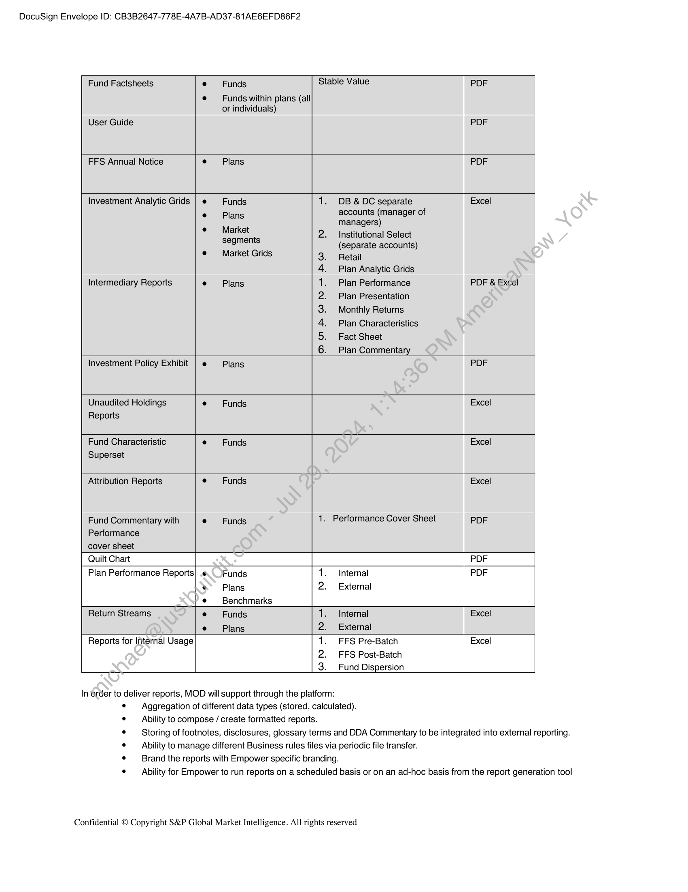
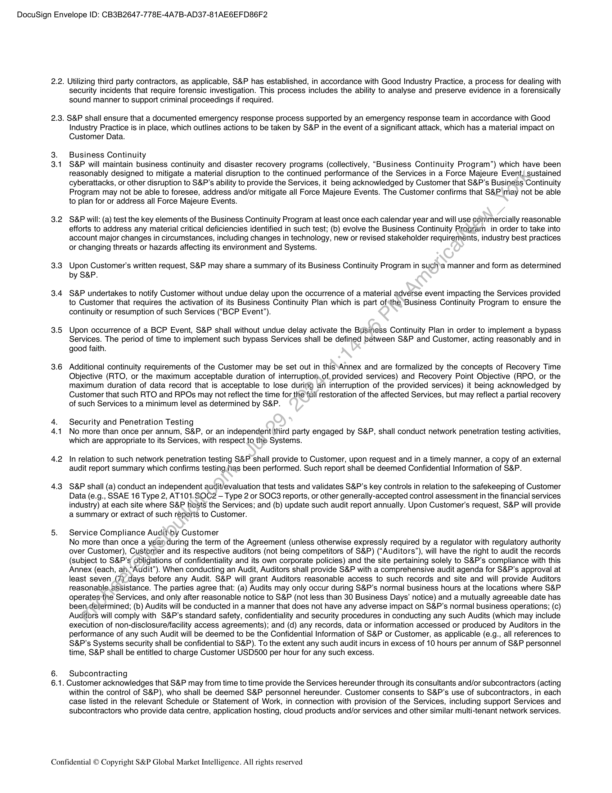

##### Statement of Work # 1: Implementation, Hosting & Support of IMDM Platform for Empower Retirement]

  
````col
```col-md
flexGrow=.5
===
> [!info] [Page 1](_attachments/images_Empower-3.6.1.4.400255887-a.pdf_210609/page_1.png)
> 
```  
```col-md
DocuSign Envelope ID: CB3B2647-778E-4A7B-AD37-81AE6EFD86F2  
S&P Global
Market Intelligence  
STATEMENT OF WORK 1:
Implementation, Hosting & Support of IMDM Platform
for Empower Retirement  
This Statement of Work (“SOW”) is entered into between Markit On
Demand, Inc. (“S&P” or “MOD”) and Empower Retirement, LLC (a
successor of Great-West Life & Annuity Insurance Company),
(‘Customer” or “Empower”) pursuant to, and incorporating by
reference all terms and conditions of the Master Agreement
between Markit North America, Inc. (an affiliate to S&P) and GreatWest Life & Annuity Insurance Company dated August 25, 2014 and
the Markit Digital Addendum dated September 29, 2023 (the
“Agreement’).  
This SOW constitutes a separate agreement between S&P and
Customer for the services described herein. The parties agree that
this SOW and the services provided hereunder are subject to the
terms and conditions of the Agreement, incorporated into this SOW
by reference. In case of inconsistency between the terms of the
Agreement and the terms of this SOW, the terms of this SOW shall
prevail. All capitalized terms used but not defined in this SOW shall
have the meanings given to such terms in the Agreement.  
This SOW commences on September 29, 2023 (“Effective Date’).  
Project Description
14 Customized Solution  
S&P will design, develop, deploy, and provide ongoing services
(including but not limited to hosting, maintenance, support,
enhancement, and reporting) for the IMDM reporting platform, which
was originally developed for use by Prudential Insurance Company
of America (the “Prudential Retirement”) and will now be utilized
by Customer (the “Customized Solution”). The Customized
Solution will be independent of the platform developed for
Prudential Retirement. For the avoidance of doubt, the Prudential
Retirement platform will continue to be supported by S&P and
running separately until such time it is decommissioned /in
accordance with the underlying agreement with Prudential
Retirement.  
The Initial Scope for structure and capabilities of the Customized
Solution is set out below and further described in in Exhibit 1
attached hereto:  
. Hosting: Redundancy is provided across multiple S&P
data centers that include all the-necessary physical and
virtual hardware, facilities,.connectivity, CDN utilization,
software licensing, patching, network bandwidth and
support  
e Support: (a) On business days (excluding bank holidays
and public holidays), 9am to 5pm MT in the US from
product feature team and (b) 24/7/365 production support
through Tier! Support Center  
o\~ Product feature team will be US-based
employees  
o Tier 1 Support Center will open incident ticket
and assign to product feature team.  
o Processes for Tier 1 Support will be defined in
Exhibit 2 (Service Level Agreement).  
. Production, development, acceptance, and UAT
environments  
e Ongoing data feed support and management for
proprietary data sources  
Confidential © Copyright S&P Global Market Intelligence. All rights reserved  
. License to MOD’s Software as a Service (SaaS)
platform:  
o Data management  
o Content Management System (CMS)
° Charting  
° Document Management  
° Accessibility  
° Entitlement  
o  Single-Sign On (SSO)  
. Hardware and software version program Reports usage,
as described more fully in Exhibit-1-attached hereto.  
e The hosting of the Customized Solution will be in
compliance with the Servicé)Levels Agreement (SLA) set
out in Exhibit 2 to this‘SOW.
Maintaining server certificates
Researching missing’or incorrect data
Managing quarterly batch runs
Framework updates
Production\incidents remediation
Resolving Processing Errors
For-the duration of the second phase of this project
(Construction & Implementation as further described
below) only:
o Testing and modification for data updates
o Process Updates required due to evolving data
sets
o Monitoring and adjusting tasks for data
ingestion  
Should the Customer want S&P to perform additional work beyond
what is described in this SOW, the parties may need to execute an
amendment or a separate Statement of Work.  
1.2 Assumptions  
Files sent by Customer will be exactly the same as files currently
sent by Prudential Retirement. Any deviations may necessitate
additional changes be made to the Customized Solution. Further
assumptions are set out in Section 1.3 below and Exhibit 1 attached
hereto.  
1.3 Project Phases  
The following outlines planned activities and deliverables for each
phase of the project, as well as estimated completion dates for
guidance purposes only:  
a) The first phase of this project will be data validation, process
mapping, and Customized Solution design validation and
mapping to create a plan for the implementation of each
report type, performance and statistical calculation. S&P will
provide written detail of the implementation plan for the
reports, performance and statistical calculations. The first
phase of this project is estimated to be completed by
September 30, 2023.  
b) The second phase of this project will be the Customized
Solution Construction & Implementation — building and
implementing the Customized Solution. When complete, the
solution will be ready for parallel testing. Upon completion of
this phase, the parties will review and mutually agree in  
```
````
Notes:    
````col
```col-md
flexGrow=.5
===
> [!info] [Page 2](_attachments/images_Empower-3.6.1.4.400255887-a.pdf_210609/page_2.png)
> 
```  
```col-md
DocuSign Envelope ID: CB3B2647-778E-4A7B-AD37-81AE6EFD86F2  
writing upon changes required to any of the following in light
of the progress made, the scope of the project, the
development schedule and the project fees. The second
phase of this project is estimated to be completed between
December 15, 2023 and December 31, 2023.  
c) The third phase of the project will be Parallel Testing,
currently set to begin January 1, 2024 and estimated to be
completed by March 31, 2024. Parallel testing will involve
data flowing through the new Customer platform and reports
being generated, while the original Prudential Retirement
platform continues to function as designed separately.  
d) The fourth phase of the project is for Additional Development
and testing after a parallel testing phase has been done, to
solve for any outstanding questions and finalize outstanding
details of the platform’s initial build. The fourth phase is
expected to be ongoing throughout the first quarter of 2024.  
If Customer has met all specifications in Section 1.3 of this Exhibit
1 to this SOW (collectively the “Assumptions”), and S&P is unable
to meet that agreed-upon Parallel Testing timeline for reasons
unrelated to Customer and under S&P’s control, S&P will grant
Customer a credit in the amount of $50,000 which can be applied to
any future fees arising from this Statement of Work.  
The Production phase Launch Date of the Customized Solution is
currently set for April 1, 2024. If Customer has met all Assumptions,
and S&P is unable to meet that agreed-upon Production phase
timeline for reasons under S&P’s control, S&P will grant Customer
a credit in the amount of $50,000 which can be applied to any future
fees arising from this Statement of Work.  
After completion of the Initial Scope of this SOW (as specified in
Section 1.1 above and Section 1.2.4 of the Exhibit 1), Customer may
request in writing (email being sufficient) to add the legacy
Prudential Retirement reports noted in Section 1.2.4 of Exhibit 1
(‘Creation and Maintenance of Non-Production Reports”) to the
Customized Solution. The implementation and Maintenance of NonProduction Reports will require an amendment to this SOW, which
will include, among other details, costs of implementation of such
reports and increase to the Managed Services Hosting Fee For the
specified Non-Production reports, the increases to the.Managed
Services Hosting Fee shall not exceed $2,000 per month,per Report
Type. The total Managed Services Hosting Fee if all NonProduction Reports are added to production hall not exceed
$66,000 per month during the initial Term.  
2 Redundancy  
The Customized Solution will be operational in all of S&P managed
data centers.  
3 Reporting  
S&P will provide its(Cstandard reporting package when the
Customized Solution‘is running in production.  
4 Content  
Customer Will be responsible for licensing and providing data,
content ahd fonts required for this project. S&P can recommend and
make introductions to appropriate providers, but Customer will be
responsible for agreements with and payments to such providers.  
Where Customer chooses to leverage S&P’s services around data
and providers, S&P is authorized to act as the agent of Customer
for the purchase of certain data and/or content required by
Customer for this project and is authorized to contract on behalf of
Customer for such purchase. Customer is responsible for paying the
provider(s) for all licensing expenses; any amount of sales, use,  
Confidential © Copyright S&P Global Market Intelligence. All rights reserved  
excise, gross receipts, value added, goods and services, or other
taxes; and any other fees applicable to or arising from the provision
or the use of such data and/or content, including any additional fees
should the provider(s) increase their fees at any time.  
For data & content where S&P acts as the agent of Customer,
written exhibit shared with S&P by Customer (email is sufficient) will
be required with proof of entitlement detail for each provider and
data packages.  
Customer will be responsible for all exchange agreements,
obtaining exchange approvals, and any additional, third-party
content, where applicable.  
5 Term  
This SOW shall commence on the Effective’ Date and remain in
effect for one (1) year from the Production Launch Date (“Initial
Term”). The Initial Term shall renew.for’successive renewal terms
of one (1) year each, unless eitherparty notifies the other in writing
of its decision not to renew therterm no later than sixty (60) days
prior to the expiration of the then current term.  
6 Acceptance  
Upon completion’oi the Customized Solution as described in Exhibit
1 attached hereto, Customer shall commence and conduct testing
on all in-scopé\deliverables as noted in Exhibit 1 within thirty (30)
business days (the “Acceptance Period”). Within the Acceptance
Period, Gustomer shall provide written notice of acceptance or
rejection. In the event Customer rejects any part of the deliverables
foi\that milestone, Customer shall provide adequate explanation
regarding the material defects. If Customer fails to provide written
notice of rejection within the Acceptance Period, S&P may deem the
milestone deliverables accepted. The date upon which the
Customer accepts the milestone deliverables, or the milestone
deliverables have been deemed accepted, shall be referred to as
the "Acceptance Date".  
Notwithstanding the remainder of this section, Customer's right to
accept the Customized Solution is applicable solely to completion
of listed project milestones and overall completion of development
services. Hosting Services are not subject to Customer's
acceptance. Customer agrees that the usage of hosting services by
Customer constitutes acceptance of the hosting services.  
7 Service Fee
The Service Fees for the work enumerated in this SOW shall consist
of a one-time Implementation Services fee of $750,000, which is
due in the following intervals:
© 25% ($187,500) payable on the completion of Phase 1
and delivery of the detailed implementation plan, or on
September 30 2023, whichever is first, and
*¢ 50% ($375,000) payable upon completion of Phase 2
and in-scope deliverables set out in Exhibit 1, or on
December 15 2023, whichever is first; and
e 25% ($187,500) payable on the Customized Solution
Acceptance Date.  
In addition, there is a Managed Services Hosting Fee of $27,000
per month, commencing on September 30, 2023. The Managed
Services fee will increase to full rate of $54,000 per month
commencing December 15, 2023 for the duration of the Initial Term.  
After the conclusion of the Initial Term, the Managed Services
hosting fee shall automatically, and without further notice, increase
upon the renewal term of this SOW and annually thereafter by four
percent (4%). For any other fee increases, S&P will provide
Customer with at least ninety (90) days prior written notice.  
```
````
Notes:    
````col
```col-md
flexGrow=.5
===
> [!info] [Page 3](_attachments/images_Empower-3.6.1.4.400255887-a.pdf_210609/page_3.png)
> 
```  
```col-md
DocuSign Envelope ID: CB3B2647-778E-4A7B-AD37-81AE6EFD86F2  
Customer shall pay S&P for any reimbursable expenses incurred by
S&P that have been agreed to in advance between the parties within
thirty (30) days of the date of the relevant invoice from S&P.  
8 Enhancement Hours  
Customer is entitled to a monthly enhancement budget equal to
forty-eight (48) hours of work or equal to 15% of the monthly
managed services fee, whichever is higher, to fund enhancements
to the Customized Solution as requested and prioritized by
Customer, which may include design changes, addition of new
features, or integration of new data (the “Enhancement Hours’).
The Enhancement Hours shall be accrued on a rolling monthly
basis. Any of the foregoing enhancement activities that exceed the
48 hours threshold will be charged at the rate of $225 an hour,
subject to availability of S&P’s personnel.  
9 Bug Fixes and Material Changes  
S&P will not charge any additional fees for work done to address
any material defects in the Customized Solution, so it conforms to
the original requirements set out in this SOW and its functional
documentation (“Bug Fixes”) to the extent that we are hosting the
Customized Solution.  
S&P will make any changes beyond Bug Fixes at the rate of $225
an hour.  
Should the Customer want S&P to perform additional work, the
parties will enter a separate Statement of Work.  
10 Representations and Warranties  
Each party represents and warrants that: (i) when executed and
delivered, this SOW shall constitute the legal, valid and binding
obligation of such party, enforceable against it pursuant to its terms;
(ii) it shall comply with all applicable federal and state laws,
regulations and statutes in the performance of its obligations
hereunder; (iii) it has full power and authority to enter into and
perform its obligations under this SOW; (iv) it has obtained all
necessary corporate approvals to enter into and execute this SOW;
and (v) its performance under this SOW does not and shall not
conflict with any other material agreement or obligation to which it is
a party or by which it is bound.  
11. Data Protection  
Customer represents and warrants to S&P thatthose individuals or
entities for which they provide Personal. Data to S&P have
consented to the processing and transfer. of their Personal Data as
contemplated by this SOW, including. but not limited to individuals
authorized to access the Services)on its behalf (“Designated
Users”). This information may<inelude personal data such as but
not limited to names, titles and-work contact information, (“Personal
Data’).  
Each party agrees that-it shall comply with all applicable data
privacy laws including implementing appropriate technical and
organisational measures against the unauthorised or unlawful
processing of Personal Data and against the accidental loss or
destruction of, or damage to, Personal Data. S&P will handle all
PersonalData in accordance with S&P’s Privacy Policy which can
be found at https://insmarkit.com/legal/privacy-policy.html. In order
to provide the Services S&P may use, collect, store, disclose and
process the Personal Data and transfer the Personal Data inside
the United States.  
12 Change Management  
S&P reserves the right, in its sole discretion, to make changes and
enhancements to the equipment and software used to provide the
services from time to time to maintain operations and as required  
Confidential © Copyright S&P Global Market Intelligence. All rights reserved  
for problem management and/or system security. S&P will use
commercially reasonable efforts to implement changes during nonpeak hours, except for changes required for emergency purposes,
which may be made at any time. To the extent reasonable and
commercially practicable, Customer will be notified in advance of
any expected outages via email at: Michele.Willis@empower.com,
pop-up notification window or other communication means.  
13 Service Levels  
The Services Levels for this SOW shall be as per the attached
Exhibit 2 (Service Level Agreement).  
14 Invoices  
S&P may submit invoices only after execution, and in accordance
with Section 7 and Section 14 of this SOW. The invoices must
provide enough information to enableeEmpower to verify to which
Services the invoice applies. S&P shalh use the Ariba System to
transact all purchases with Empower;including accepting electronic
orders and submitting electronic-invoices. Any potential costs
incurred by S&P in using the Ariba System or obtaining an Ariba
System supplier ID, or both, will be S&P's sole responsibility.
Empower shall pay any‘dueand payable fees within thirty (80) days
after receipt of a relevant invoice. Empower will notify S&P of any
disputed portion of an\invoice and the parties shall work in good faith
to resolve the\dispute. S&P shall not withhold any relevant
information to-resolve a dispute. Empower shall not be responsible
for the paymeni or reimbursement of any moneys, charges, fees or
expenses to’S&P for the Services, except as otherwise stated in a
sow,  
Allinvoices for S&P services provided under this SOW shall be sent,
as set forth above and to the attention of the following representative
of Customer:  
Michele Willis  
Empower Retirement LLC
8515 E Orchard Road
Greenwood Village, CO 80111
Tel 303-737-7151
Michele. willis @empower.com  
15 Transition Services  
In case of a termination or earlier expiration of the Agreement or this
SOW (excluding termination pursuant to Section 8.1 of the
Agreement), if requested by Empower, the parties will discuss in
good faith and agree in writing to post-termination support (at
mutually agreed timelines and costs) required to facilitate a
transition to Customer's own hosting environment, or to a hosting
environment supplied by a third-party provider, save that nothing
herein shall oblige S&P to incur any costs or transfer any of its
intellectual property rights in respect of such assistance or disclose
any of its Confidential Information to any of its competitors.  
16 Subcontracting  
As of the Effective Date of this SOW, Customer consents to S&P’s
use of the following subcontractors in the provision of the
Customized Solution:  
a) NTT Data Services (location: Cincinnati, OH and
Plano, TX)  
S&P shall not permit Customer Data to be transferred to or
accessed from outside the United States of America without
Customer's prior consent. United States of America means the  
```
````
Notes:    
````col
```col-md
flexGrow=.5
===
> [!info] [Page 4](_attachments/images_Empower-3.6.1.4.400255887-a.pdf_210609/page_4.png)
> 
```  
```col-md
DocuSign Envelope ID: CB3B2647-778E-4A7B-AD37-81AE6EFD86F2  
continental states and Alaska and does not include US territories.
Should S&P require to change or add new subcontractors, as may
be required for the provision or enhancement of the Customized
Solution, S&P will notify Customer as soon as reasonably
practicable. Where Customer reasonably objects in writing to a
subcontractor, S&P shall consider Customer's objection in good
faith and should the parties not reach an agreement regarding
S&P’s use of such subcontractor, Customer shall have the right to
terminate this SOW without penalty or prejudice.  
[signature page immediately follows]  
Confidential © Copyright S&P Global Market Intelligence. All rights reserved  
```
````
Notes:    
````col
```col-md
flexGrow=.5
===
> [!info] [Page 5](_attachments/images_Empower-3.6.1.4.400255887-a.pdf_210609/page_5.png)
> 
```  
```col-md
DocuSign Envelope ID: CB3B2647-778E-4A7B-AD37-81AE6EFD86F2  
ACCEPTED ACCEPTED
Markit On Demand, Inc. DocuSigned by: Empower Retirement, LLC DocuSigned by:
SIGNATURE - SIGNATURE |
Bill Burton
PRINT NAME . PRINT NAME .
Renee Spampinato Bill Burton
TITLE TITLE
Head of Markit Digital Senior Vice President - IT
DATE OF SIGNATURE DATE OF SIGNATURE
9/28/2023 9/28/2023
To be completed by the Customer:
ed Customer Signatory
Name: Bill Burton
Title: Senior Vice President - IT Email: bi11.burton@empower .com
Phone: 4 (855) 756-4738 City Greenwood \Willage, Co
Note: Information necessary for S&P's contract compliance and due diligence purpose  
DocuSighéd by:
———
EMPOWER  
SOURCING REVIEWED  
OCBE15B29F88437.  
Cw156877  
Confidential © Copyright S&P Global Market Intelligence. All rights reserved  
```
````
Notes:    
````col
```col-md
flexGrow=.5
===
> [!info] [Page 6](_attachments/images_Empower-3.6.1.4.400255887-a.pdf_210609/page_6.png)
> 
```  
```col-md
DocuSign Envelope ID: CB3B2647-778E-4A7B-AD37-81AE6EFD86F2  
Exhibit 1  
IMDM REPORTING PLATFORM  
1.1 Markit On Demand, Inc. (MOD) Customized Solution  
MOD (working collaboratively with Prudential Retirement) designed and built a workflow-based IMDM reporting solution that served
Prudential Retirement's internal and external reporting needs. MOD developed the overall report generation tool and the key capabilities
within it, including but not limited to report templates, data calculation engine and an administrative interface to manage content such
as footnotes, disclosures, glossary of terms and DDA commentary. All data within the IMDM reporting solution was (with the exception
of Yield curve information) provided by Prudential Retirement. The data provided by Prudential Retirement was sourced primarily
through Prudential Retirement 's implementation of MOD EDM, and other sources as needed.  
The report preview tool allows End Users the ability to view, distribute and store fund related reports.
This Statement of Work covers the design and data architecture for the implementation of each report type as described above; the
design, development of the report preview tool as well as the workflow tool that covers the life cycle of the report production process.  
The Customized Solution was planned by the parties and completed by MOD in phases. An overall project plan, including phases,
milestones and timelines for each phase, was mutually agreed upon between the parties in writing before the project commenced. The
phased project plan was revised upon mutual written agreement between the parties during the coutse’ of the project. Prudential
Retirement provided written business requirements for all deliverables contained in this schedule. MOD.created additional requirements
as needed in order to deliver the Customized Solution for Prudential Retirement. MOD followed,a teview and sign-off process agreed
to by the parties for design, development, testing and implementation of the Customized Solution. This review and sign-off process was
developed and agreed upon between Prudential Retirement and MOD in writing. Additionally; the review and sign-off process was
required for each of the mutually agreed upon project phases. Prudential Retirement provided to MOD a list of authorized parties who
were required to sign-off on all Customized Solution documents including design, development and testing requirements as well as
implementation sign-off and post implementation sign-offs.  
Empower Retirement, LLC, having acquired Prudential Retirement, will be integrating and utilizing the IMDM reporting solution. MOD
will work with Empower to create the solution for Empower’s use, with the following specifications. The majority of data within the IMDM
Reporting Solution for Empower will be provided by Empower, with MOD aeting as Empower’s agent to source certain specific content
sets.  
1.2 Features
The Customized Solution will include the following features:  
1.2.1 Data Design and Architecture  
MOD and Empower will participate in a data / process\design and architecture phase for the implementation of each report type and
performance and statistical calculation.
¢ MOD will create a modular plan for the implementation of each report type. The implementation plan will leverage and
repurpose the mapped data sets and modules across report types where possible.
¢* MOD will utilize existing Empower style guides for reports and extend them for report interface features that may not
be included in the style“guides provided.
¢ Empower will provide’data sets to MOD. These data sets will be used by MOD to perform calculations, and the results
will be persisted.in MOD, and also sent back to Empower.  
© The majority of the data used will be provided by Empower to MOD.  
¢ During the full engagement, MOD will be working to identify and propose to Empower any potential areas of Data or
Process improvement in the Solution.  
= Subject to confirmation from our Content Acquisitions and Data Solutions teams, some 3rd party vendor
data sets can be sourced directly by MOD rather than provided by Empower. Empower will have and
will provide written confirmation of all necessary licensing in place with the data vendors, but MOD will
source the data for use within the Customized Solution. Initial production and construction will include
a selection of roughly 25 data sets from Morningstar. MOD will also set up, maintain, and integrate into
the Solution new feeds containing Empower fund data from FactSet and State Street Bank. Additional
data sets may be sourced directly by MOD in the future, subject to Amendment to this SOW. Conditions
for the 3 party integrations are listed below; changes to these conditions may impact scope, cost, and
completion timelines.  
. Empower has all necessary 3" party entitlements & agreements in place and that 3"
party vendors are in agreement for MOD to access and display this data for the
provision of the Services to Empower, or grant credentialed access to this data for
the purpose of displaying it as set out in this SOW  
. 3 party vendor can provide multiple staged environments for the data (i.e.
Development, UAT/Acceptance, Production)  
. universe of securities does not need to be filtered, reduced or modified in any way  
. validation & testing of data quality is out of scope  
Confidential © Copyright S&P Global Market Intelligence. All rights reserved  
```
````
Notes:    
````col
```col-md
flexGrow=.5
===
> [!info] [Page 7](_attachments/images_Empower-3.6.1.4.400255887-a.pdf_210609/page_7.png)
> 
```  
```col-md
DocuSign Envelope ID: CB3B2647-778E-4A7B-AD37-81AE6EFD86F2  
. no downstream data points are derived from calculations performed on the raw datano additional files need to be integrated as reference data to appropriately identify  
securities  
. files provided to MOD are identical to the historical files provided to Prudential
Retirement  
. no new data points will be utilized that were not already utilized by Prudential
Retirement  
1.2.2 Fund Performance Calculation and Statistical Calculations
MOD will perform and deliver to Empower the results of the following fund performance as described in this section and further detailed
in Empower’s Requirements documents.
Fund performance calculations:
¢ Extended Performance
© Standard Cumulative Performance (Actual)
© Standard Annualized Performance (Actual)
© Blended / Composite Performance — Cumulative
© Blended / Composite Performance — Annualized
® Stable Value — based on rates rather than prices  
1.2.3 Report Design and Development
The following reports will be part of the initial production solution:  
Report Types Inputs Templates Final
Format  
Fund Factsheets  
Dynamic template 1 PDF
Dynamic template 2
Custom Funds  
Fund of Fund Products
Sponsor Fund of Fund  
Funds  
e = Funds within
plans (all or
individuals)  
aRON>  
Investment Reviews e Funds
Plan(s)
Due Diligence Advisor © DDAflagged  
Reports Funds
(DDA)  
Manager of Manager PDF  
Retail Monitor  
Front Cover PDF  
Executive Summary  
Executive Summary  
Performance  
Executive Summary  
Watchlist (provided by  
Empower)  
Fund Disclosures  
Fund Profiles  
Glossary of Terms  
MorningStar ratings  
Program Overview (provided by  
Empower)  
10. Quarterly Fund Review
(provided by Empower)  
11. Back Cover  
DDA ¢ DDAflagged 1. Ranked Scorecard Excel  
Supplemeniary Funds
Reports  
-F ONAN >  
CONAN  
1.2.4 Creation & Maintenance of Non-Production Reports  
The code to generate the following reports will be part of the platform & solution but will not be updated / tested for this project and will
not go into production; they will be ‘on ice’. The code and processes / tasks will remain in MOD’s environment for use by Empower at a
future date to be determined, subject to Amendment to this SOW:  
Report Types e = Inputs Templates Final Format  
Confidential © Copyright S&P Global Market Intelligence. All rights reserved  
```
````
Notes:    
````col
```col-md
flexGrow=.5
===
> [!info] [Page 8](_attachments/images_Empower-3.6.1.4.400255887-a.pdf_210609/page_8.png)
> 
```  
```col-md
DocuSign Envelope ID: CB3B2647-778E-4A7B-AD37-81AE6EFD86F2  
Fund Factsheets e  =Funds Stable Value PDF
e Funds within plans (all
or individuals)
User Guide PDF
FFS Annual Notice e Plans PDF
Investment Analytic Grids | e Funds 1. DB &DC separate Excel
e ~~ Plans accounts (manager of
managers)
° seaonts 2. _ Institutional Select
(separate accounts)
@ = Market Grids 3. Retail
4. Plan Analytic Grids
Intermediary Reports e Plans 1. Plan Performance PDF & Excel
2. Plan Presentation
3. Monthly Returns
4. Plan Characteristics
5. Fact Sheet
6. Plan Commentary
Investment Policy Exhibit | e Plans PDF
Unaudited Holdings e Funds Excel
Reports
Fund Characteristic e Funds Excel
Superset
Attribution Reports e Funds Excel
Fund Commentary with e Funds 1. Performance Cover Sheet PDF
Performance
cover sheet
Quilt Chart PDF
Plan Performance Reports] .6.\. Funds 1. Internal PDF
®* Plans 2. External
e Benchmarks
Return Streams e Funds 1. Internal Excel
e Plans 2. External
Reports for Internal Usage 1. FFS Pre-Batch Excel
2. FFS Post-Batch
3. Fund Dispersion  
In order to deliver reports, MOD will support through the platform:
e — Aggregation of different data types (stored, calculated).
e — Ability to compose / create formatted reports.
¢ — Storing of footnotes, disclosures, glossary terms and DDA Commentary to be integrated into external reporting.
e — Ability to manage different Business rules files via periodic file transfer.
¢ Brand the reports with Empower specific branding.
e Ability for Empower to run reports on a scheduled basis or on an ad-hoc basis from the report generation tool  
Confidential © Copyright S&P Global Market Intelligence. All rights reserved  
```
````
Notes:    
````col
```col-md
flexGrow=.5
===
> [!info] [Page 9](_attachments/images_Empower-3.6.1.4.400255887-a.pdf_210609/page_9.png)
> 
```  
```col-md
DocuSign Envelope ID: CB3B2647-778E-4A7B-AD37-81AE6EFD86F2  
1.2.4 Changes to Existing Reports — Initial Scope
© The scope of the project includes the following known changes to the existing reports. Additional changes
may occur and will be performed by the MOD team, but will not be considered part of the initial scope and
will not impact completion & acceptance of the Solution.Format, structure, and process for Disclosures, Footnotes and Terms for the various reports
may change based on Empower providing different data to MOD than in the previous system.
= Due Diligence Advisor (“DDA”) reports must be able to run with 2 years of content, for funds
that have less than 3 years of performance data
= Investment Review Report — remove Lipper Benchmark selection from Report Content page
= Investment Analytic Grids — remove Lipper Benchmark selection from Report Content Page
= Investment Review — make the executive summary optional
= For performance calculations, the current process uses the last calendar day (non-business)
of the month if weekend or holiday fell on the month or quarter end date. The change
requested is to change the methodology to use business instead of calendar days.when
calculating performance.  
1.2.5 Report Generation Tool Design and Development  
MOD developed the overall report generation tool and the following key capabilities, which will be made
available to Empower:
¢ Document creation:
= Automatic (Batches): based on a schedule (determined by the control number rules file) the requested
reports will be generated, and loaded into the report library. On creation, 2 versions of the report are
created, one with a watermark that says “Unapproved’\and another version that is exactly the same but
without the watermark. The Unapproved version,will be displayed in the library until it goes through the
workflow process. Once the report is approved)the version without the watermark is displayed and
can be sent to clients.
= Manual (Builder): Reports are generated based on the report type selected, reporting period and criteria
(funds, plans, benchmarks, market segments, etc.). Similar to batch, 2 versions of the report are created
(one with the “Unapproved” watermark and another without) and the Unapproved version will be
displayed in the library until it goes)through the workflow process. Once the report is approved, the
version without the watermark is displayed and can be sent to clients  
1.2.6 Document management
¢ — Allisting of reports will be available through the report library with links for viewing or deleting the reports. Report listing
will be sortable. The report Library willinclude status such as: Pending, Generating, Failed, Unapproved and Approved.
¢ — The Dashboard will allow users/to view reports and move them through the approval workflow. Workflow status on
unapproved reports will include.Draft, Rejected, Reviewing, Reviewing (REG), Approved and Deleted.
= Not all status may be applicable for each reporting deliverable. All reports that have received final
approval will be saved under the "Approved" tab for historical reference.  
= The*reports will remain archived according to Empower’s records retention guidelines. Currently MOD
is storing the reports for the life of the fund/report plus 10 years.  
. If any reports’ cannot be approved based on data discrepancies, Empower will send or cause to be sent a new data
feed. The-iool shows the creation date of the report to allow Empower to see which dated/incorrect data is included in
the"Whapproved" reports. Users can “Re-Run” unapproved reports to include the updated data.  
¢ _Ernpower cannot re-run reports that have been approved. Empower will have to generate a new version with new
data that was fed to MOD. Once the reports are generated, they follow the approval workflow required for that report.  
Confidential © Copyright S&P Global Market Intelligence. All rights reserved  
```
````
Notes:    
````col
```col-md
flexGrow=.5
===
> [!info] [Page 10](_attachments/images_Empower-3.6.1.4.400255887-a.pdf_210609/page_10.png)
> 
```  
```col-md
DocuSign Envelope ID: CB3B2647-778E-4A7B-AD37-81AE6EFD86F2  
The Customized Solution will provide Empower with the ability to create, maintain, access, track and edit a list of all end users through
a set of workflow files.  
¢ Each end user will have a login created based on such user's level of entitlements. Certain end users will have
different roles (e.g. ISRO — RS, ISRO — IS) for different documents.  
¢ Interface will support three tiers of end users able to view reports; Create, Edit & Approve.
e — End users can change status of reports through the Dashboard.
e — End users with certain access roles will have the ability to edit reports.  
Deleting reports:
¢ Inthe Report library, users can filter to find reports to delete.
¢ — Confirmation notification will appear prompting a user to confirm they want to delete a report.
¢ — There is also the ability to add notes or comments to statuses of reports within the tool for tracking purposes.
e — User cannot Delete Approved reports.  
1.2.6 Report usage
¢ — The system will allow manager to track usage by user:
e What reports were run (via the Dashboard or Library).
e What components were included (via the Library using the edit functionality.report by report).
e What audience was used in creation (via the Library using the edit furictionality report by report with the
exception of Factsheets where this is identified in the name).
¢ Plan Specific or Fund Specific and details (via the Library).
¢ How many were approved (via the Dashboard or Library).
¢ How many remain unapproved (via the Dashboard or Library).
*¢ Batches — how many produced by report type, including audienée, plan/funds scope (via the Pre and Post- batch
files).
¢ How many rejections have occurred (via the Dashboard).
¢ — Allreports that were run for a specific client or by product types (via the Dashboard or Library).  
¢ — Elapsed time from creation through approval, by the different gates and how long each gate is taking; how long
someone took to approve (via the Dashboard by individual report).  
¢ — Who authored, who peer approved; and who did the regulatory approval (via the Dashboard by individual report).  
1.2.7 Content Management System
e Footnotes, Disclosures and Terms:  
¢ MOD will support and host a set of tools for authoring and approving footnotes, disclosures and
terms.  
e Usage:
= How many were approved (via the Dashboard).
= How.many remain unapproved (via the Dashboard).
= How many are ready to expire (via the individual tool).
= ‘How many are related to specific Investment Platform Types (via the induvial tool).  
¢ = DDA Commeniary:
¢ —M@D will support and host a tool for authoring DDA Commentary.  
1.2.8 Tools  
The platforn/will provide a series of tools allowing users to manage the following:
¢ — Performance Calculation Debugging
= Allows users to run performance calculations on Price ID or Benchmark IDs to see Actual and 3-Line
performance for a specific set of dates.
e — Re-Run Performance
= Allows users to enter in a set of Price IDs and have the system generate performance and send it
back to EmpowerUsers can select Price, Benchmark, and GIA performance for a specific set of dates.
¢ Fund Fact Sheet Batch Status
= Allows users to see the Fund Fact Sheets run at a batch level by Control number.  
= Users can select one or more reports and move them through the workflow or schedule them to rerun.  
¢ — Processed Data Feeds  
Confidential © Copyright S&P Global Market Intelligence. All rights reserved  
```
````
Notes:    
````col
```col-md
flexGrow=.5
===
> [!info] [Page 11](_attachments/images_Empower-3.6.1.4.400255887-a.pdf_210609/page_11.png)
> 
```  
```col-md
DocuSign Envelope ID: CB3B2647-778E-4A7B-AD37-81AE6EFD86F2  
= Allows users to see what data files send by Empower have been processed.
= Users can select a specific feed and see all the monthly and daily files that have been successfully
processed.  
1.2.9 Changes to Existing Tools
e — Advisor Tool - The code to generate the Advisor Tool will be part of the platform, but will not be updated / tested for this
project and will not go into production. The code and processes / tasks will remain in MOD’s environment for use by
Empower at a future date to be determined, subject to Amendment to this SOW:
= Allows users to see all the plans the system has created Intermediary Reports for. Users can select a plan
and trigger a manual re-run of the underlying reports.  
¢ — Goalmaker Reports — Goalmaker is not in scope for Empower’s use of the Solution and will not be created.  
1.3 Assumptions  
¢ — The data provided by Empower will not be sourced from MOD EDM, thus potentially causing downstream changes that MOD will map
and solve for.  
¢ — Files sent by Empower, including Control Number File for batch generation and Rules Files that govern the Reports business rules, will
be exactly the same as files currently sent by Prudential Retirement, with none to minimal changes-tovalid values. Empower will provide
a data map between the existing files and the new files that will be delivered. Any changes to those files from their current structure, form,
format or content will have additional downstream impact, which may impact completion & delivery.timelines and require MOD to investigate
the scope of the necessary changes. At MOD’s discretion, a separate Amendment to this SOW may be required to incorporate such
changes.  
e¢ MOD will provide timelines for delivery of test files by Empower, and will communicatewith at least one month's notice that delivery date.
Delays in delivery will delay completion timelines.  
¢ — The current logic for all business rules will stay the same. The new Solution will leverage the same Investment Platform Type hierarchy
and Asset Class levels for report generation and footnote/disclosure & terms‘ogic as in the existing platform. If these business rules change
it will have a significant impact on completion timelines.  
¢ — The report generation tool is designed and built for desktop use (not mobile or tablet).
* — Client watchlists, fund scores and client data are not manipulated via MOD systems.  
e — Return inputs required for statistics will be prepared before-delivery to MOD by Empower, with a minimum of daily and monthly
values.  
¢ Empower will deliver all images to be included within feports in proper PDF format.
1.4 Browser Support
MOD will provide support for the Customized Solution inthe following browsers and versions:
¢ — Microsoft Edge
*¢ — Windows/Mac Google Chrome All  
MOD will support the most recent browser versions as they become available. Legacy versions will be retired in due course.
1.5 Accessibility Support
The system creates the Fund Fact Sheet PDF reports that align with WCAG 2.0 Level AA standards that are supported by the Vendor’s PDF  
manipulation tools and have been Accepted by Empower. Additional PDF reports do not adhere to the WCAG 2.0 standards. Empower may
partner with MOD to align additional PDF reports with the WCAG 2.0 standards using an additional SOW.  
Confidential © Copyright S&P Global Market Intelligence. All rights reserved  
```
````
Notes:    
````col
```col-md
flexGrow=.5
===
> [!info] [Page 12](_attachments/images_Empower-3.6.1.4.400255887-a.pdf_210609/page_12.png)
> 
```  
```col-md
DocuSign Envelope ID: CB3B2647-778E-4A7B-AD37-81AE6EFD86F2  
Exhibit 2  
Service Level Agreement  
1 Definitions  
14
1.2  
1.3
1.4
1.5  
1.6  
1.7
1.8
1.9
1.10  
Credit(s): Percentage of monthly fee to be reimbursed by S&P based on failure to meet established metrics.  
Designated Technical Contact: Individual(s) (employed by Customer) whom S&P will contact in the event that S&P becomes
aware of any issue with the Customized Solution.  
End User: The ultimate user of the Customized Solution in a production environment.
Incident: Any issue that prevents the Customized Solution from functioning as intended in a production environment.  
Incident Response: S&P’s standard process for handling Incidents, including internal and external communication,
documentation and resolution.  
Incident Manager: S&P staff trained in Incident Response; capable of coordinating Incident investigation and responsible for
communicating technical details to Customer and S&P staff.  
Project Manager: The individual at S&P acting as liaison between S&P and Customer.  
Support Hours: 9am to 5pm MT within the United States, on business days (excluding bank holidays and public holidays)  
Third Party: Any service, data or content provider that is neither the Customer nor S&P.  
Uptime: The percentage of time during a calendar month that the Customized, Solution is available.  
2 Response and Escalation Services  
21  
2.2  
2.3  
2.4  
Customer will communicate any and all Incidents, requests for maintenance, support services escalations, or queries to S&P via its
Tier 1 Support Center (“Tier 1”) or the product feature team. Tier 1 %can-be reached at MOD-NOC @ihsmarkit.com. Response to any
escalation to Tier 1 will be from a Incident Manager in the Tier 1. and not an automated reply.  
Customer will not include in any communication to Tier 1 (Incidenis, requests for maintenance, support services escalations, or queries)
any client information.  
Upon notice of any Incident related to any part of the services provided by S&P to Customer, Tier 1 personnel will create an Incident
ticket and assign such ticket to the product feature team. Tier 1 will provide the S&P tracking ticket number within 15 minutes and have
no further responsibility. Product feature team will respond during Support Hours.  
S&P will respond to Incidents, requests for\maintenance, support service escalations, or queries from Customer or approved
representatives of Customer only. Should an.End User contact S&P directly, S&P will (i) instruct the End User to contact Customer
directly and (ii) request the Project Manager to follow up with Customer.  
Incident Severity Determination  
a) S&P will classify escalation severity level for any Incident (whether reported by Customer or via S&P internal monitoring alert)
according to the following. criteria:  
Severity Level Definition  
Sev 1 - Total | An Issue that has major widespread effect on all S&P Customers and/or End Users. Example: complete  
Outage inaccessibility or unavailability of the Customized Solution due to a major failure across multiple
Customers.  
Sev 2 — Major | 3 An Issue that has significant impact on Customer and/or its End Users. Examples: complete
Outage inaccessibility or unavailability of the Customized Solution or a key page or module therein  
Sev 3a — Major | An Issue that affects one of Supplier's products or services, multiple users; a single symbol’s business
Impact critical content; Examples: multiple data points on multiple securities have discrepancies or multiple
incorrectly calculated data points. Intermittent/sporadic issues.  
Sev 3b — Minor | Any minor service or data degradation or stale non-business critical data. Examples: multiple documents  
Impact or multiple symbols impacted by same data point.  
Sev 6 — Minor | An Issue has some impact on Customer and/or End Users but has no material impact. Examples: a
Issue and | single data point has discrepancies; a question about a single data source or calculation of a data point.
Inquiries  
Note: Sev 4 and Sev 5 issues are reserved for internal issues.  
Confidential © Copyright S&P Global Market Intelligence. All rights reserved  
```
````
Notes:    
````col
```col-md
flexGrow=.5
===
> [!info] [Page 13](_attachments/images_Empower-3.6.1.4.400255887-a.pdf_210609/page_13.png)
> 
```  
```col-md
DocuSign Envelope ID: CB3B2647-778E-4A7B-AD37-81AE6EFD86F2  
4  
2.6  
2.7  
b) If, as a result of the ongoing investigation, severity is determined to be lower or higher than initially observed, S&P will reset  
severity level and response expectations.  
c) Incidents caused by S&P third party vendors (contracting directly with S&P) will be classified and handled the same as S&P-  
related issues.  
Status Updates and Regular Communication: (During Support Hours Only):  
a) S&P will provide status updates with the following frequency:  
Sev 1 - Total Outage: Every 30 minutes until S&P identifies the problem and determines a prospective plan
for correction in production. Once the problem is identified, S&P will provide. Customer
with the estimated time of completion.  
Sev 2 — Major Outage Every 30 minutes until S&P identifies the problem and determines,a prospective plan
for correction in production. Once the problem is identified, S&P_will provide Customer
with the estimated time of completion.  
Sev 3a — Major Impact: Every 4 hours until S&P identifies the problem and determines a prospective plan for
correction in production. Once the problem is identified,S&P will provide Customer with
the estimated time of completion.  
Sev 3b — Minor Impact: Daily updates until S&P identifies the problem and determines a prospective plan for
correction in production. Once the problem is\identified, S&P will provide Customer with
the estimated time of completion.  
Sev 6 — Minor Outage and | Once the problem is identified, S&P<will\provide Customer with an estimated time of
Inquiries: completion.  
b) The S&P Incident Manager will be available to join a bridge line or otier such cooperative coordination effort to resolve a Sev 1  
—Total Outage or Sev 2 — Major Outage Incident.  
c) S&P may proactively initiate conference calls or bridge lines whére S&P deems it necessary or helpful to resolving any Incident.  
S&P shall provide Customer's Designated Technical Contact with notice of any issue affecting the performance of the Customized
Solution of which S&P becomes aware. In the event S&P.believes such issue to be the result of an act or omission of a Third Party,
S&P shall cooperate with Customer and Third Party to restore normal functionality of the Customized Solution in a timely manner
during Support Hours.  
Uptime Requirement: S&P will ensure that the Customized Solution will be available at least 99.9% of the time during Support Hours as
measured over each calendar month during the Term (“Uptime Requirement”).  
3.1  
3.2  
3.3  
3.4  
Monitoring Approach: S&P will choose one or-more pages of the Customized Solution to monitor in order to determine Uptime. Page
selections will be reviewed with the Customer to ensure appropriateness. Each page will be monitored continuously from more than
one location outside of S&P’s network on’a round-robin basis at least once per minute. A page fails a monitoring test if two monitoring
locations fail to access a page in two'successive tries from each monitoring location.  
Uptime Calculation: Uptime willbe calculated at the end of each month based on data provided by S&P’s external monitoring provider.
A page will be considered.tq be unavailable from the time of the first failure until the first subsequent success. All such intervals will be
reviewed and validated by.S&P. Uptime will then be calculated as the sum of all periods during which the page was available during
the calendar month, divided by the total time in the month. One percentage will be calculated per month. Scheduled Maintenance as
described in Section6:4 below shall not be included for purposes of calculating Uptime.  
Exclusions: Any:failure due to an outage of a Third Party will be excluded from the Uptime calculation. Additionally, for the purposes
of the Uptime, calculation, only Support Hours will be considered and any outage time outside of US business hours will be excluded.  
Credits: {fin any calendar month during the Term, Uptime falls below the Uptime Requirement, S&P will grant Customer a credit for
that month based on the table set forth below, calculated as follows: the percentage set forth in the table below multiplied by the
Service Fees due for the same period.  
Service Level Metric Uptime Credit  
Uptime 99.80-99.89% 5%
99.70-99.79% 10%  
99.69% or less 15%  
99.60% or less See Section 6.1  
Reporting  
41  
S&P will provide regular reporting detailing Uptime for the Customized Solution and will proactively provide the appropriate credit, in
writing, as set forth in the above table.  
Confidential © Copyright S&P Global Market Intelligence. All rights reserved  
```
````
Notes:    
````col
```col-md
flexGrow=.5
===
> [!info] [Page 14](_attachments/images_Empower-3.6.1.4.400255887-a.pdf_210609/page_14.png)
> 
```  
```col-md
DocuSign Envelope ID: CB3B2647-778E-4A7B-AD37-81AE6EFD86F2  
4.2 S&P will provide detailed reporting for all Sev 1 — Total Outage or Sev 2 — Major Outage Incidents, including a summary of the Incident
and its impact, chronology of actions taken, time to resolution, lessons learned, and opportunities for improvement. Such report will be
delivered to Customer within five (5) business days of the resolution of the Incident.  
5 Maintenance  
5.1 S&P will give Customer at least five (5) business days prior notice (email to suffice) of any Scheduled Maintenance. Scheduled
Maintenance whereby the availability of the Customized Solution is impacted shall occur no more often than once per month,
Scheduled Maintenance shall not be included for purposes of calculating Uptime.  
5.2 S&P may perform additional unscheduled maintenance as necessary to support the delivery of the Customized Solution. Customer
will be notified of such maintenance as far in advance as practical via email at: Michele.Willis@Empower.com pop-up notification
window or other communication means. S&P will endeavor to perform additional maintenance activities in such a way,as‘to minimize
impact to Uptime. The impact on Uptime as a result of such unscheduled maintenance shall be included for purpesesof calculating
Uptime.  
6 Termination of Service  
6.1 Customer shall have the right to terminate the Customized Solution upon 30 days written notice if Uptime drops below the lowest
percentage identified in the table in Section 3.4 for a period of 3 consecutive months.  
6.2 In the event Customer exercises such right of termination, no payments will be due to S&P with respect to any periods occurring after
the date of termination. If Customer has prepaid any monies for periods after the date of termiriation, S&P shall issue a refund to
Customer.  
Confidential © Copyright S&P Global Market Intelligence. All rights reserved  
```
````
Notes:    
````col
```col-md
flexGrow=.5
===
> [!info] [Page 15](_attachments/images_Empower-3.6.1.4.400255887-a.pdf_210609/page_15.png)
> 
```  
```col-md
DocuSign Envelope ID: CB3B2647-778E-4A7B-AD37-81AE6EFD86F2  
Exhibit 3
Markit Digital Information Security Annex  
The following shall apply to the information technology systems used by S&P to provide the Services (“Systems”).  
0.  
Definitions  
“Annex” means this information security annex.  
“Personal Data” means any information relating to an identified or identifiable natural person.  
“Customer Data” means any Personal Data or Confidential Information provided by Customer to S&P pursuant to this Annex.  
“Encrypt” or “Encrypted” or “Encryption” mean the transformation of data using an algorithmic process, or an alternative method at least as
secure, into a form in which meaning cannot be assigned without the use of a confidential process or key.  
“Good Industry Practice” means in relation to any particular circumstances, the degree of skill, diligence, prudence, foresight and*operating
practice which would reasonably and ordinarily be expected from a reasonably skilled and experienced provider of equivalent Services and/or
data of a similar type to that provided pursuant to the Agreement under the same or similar circumstances) and conducted in accordance with all
laws and regulations applicable as provider of such Services.  
1.
14  
1.2  
1.3  
1.4  
1.5  
1.6  
2.1.  
Information Security Function and Governance
S&P warrants to Customer that it: (a) will manage the Systems which process Customer Data received in the ‘performance of the Services
in a way that is reasonably designed to maintain the safeguards of such Systems in accordance with Good.Industry Practice and applicable
laws and regulations; and (b) has adopted and will maintain and abide by a comprehensive information-security program (“Information
Security Program”) that incorporates appropriate administrative, technical, and physical safeguards including the following, where
appropriate and relevant in the context of the Services being provided, including the following:
i. measures to provide for the ongoing confidentiality, integrity, availability and resilience-of. Customer Data (including Encryption of
Personal Data using commercially reasonable encryption key management, as required by applicable laws);
ii. the ability to restore the availability and access to Customer Data used in S&P’s Services from an archival copy in a timely manner
in the event of a physical or technical incident;
iii. a process for regularly testing, assessing and evaluating the effectiveness of technical and organizational measures with respect
to the security of the processing;
iv. to use industry standard measures to protect against any anticipated threats or hazards to the security or integrity and against
unauthorized access to or use of Customer Data (including, where reasonably practicable, multi-factor authentication process for
individuals accessing the System from an external network);  
v. to use industry standard measures to prevent the loss, destruction, damage, disclosure or detrimental alteration of the Customer
Data; and
vi. subject to the terms of this Annex and the Agreement arid to the extent practically feasible, to provide Customer with a copy of,  
and then erase all electronic and hard-copy materials Containing Customer Data, upon expiry or termination of the Services and
following Customer's written request. Notwithstanding the foregoing, S&P may retain Customer Data for the purpose of satisfying
regulatory requirements, to comply with its internal audit or verification of the Services or due to technical or other reasons, S&P
shall ensure that such retained Customer Data,is ho longer readily accessible, is not used for any other purposes and complies
with the requirements of this section 1.1.  
S&P shall regularly review and revise its Information, Security Program with respect to its continued effectiveness and determining whether
adjustments are necessary considering changing circumstances, including changes in applicable Good Industry Practice and/or laws or
regulations.  
Networks & Firewalls: S&P shall ensure*that all tiers of any application used in the performance of Services are separated logically by VLAN
or Subnet. Any public facing interface shall be restricted to a DMZ environment that has only approved connectivity to remaining application
tiers. S&P will deploy firewall protection throughout its environment and all firewalls will contain explicit rule sets designed to disallow
unwarranted access and are audited annually.  
Intrusion Detection: Intrusion.detection solution (“IDS”) is deployed and is designed to detect anomalous activity within the S&P network. In
addition, all Systems require antivirus, and anti-malware, to detect malicious access to Systems. Data in transit on external networks is
Encrypted and access‘right to data at rest is provisioned based on roles.  
Audit Logs: Forsany Services that require Logins, and where applicable audit logs are maintained. The logs contain information regarding
access and us¢ of the Services.  
Breaches: To track, monitor and address data breaches, S&P has invested in logging, and Network IDS monitoring tools are deployed across
its environments.  
Security Breaches  
Breach Process and Notification: Upon occurrence of any unauthorized access to or disclosure of Customer Data as determined by the S&P
information security team (each a “Security Breach”), S&P shall: (a) notify Customer without undue delay upon within two (2) business days
becoming aware of the Security Breach (but only after having followed its internal protocol to notify the relevant S&P team member of such
Security Breach) and provide to Customer a report setting out the nature and impact of the Security Breach. S&P shall also set out the
measures taken or proposed to be taken to address and mitigate the Security Breach; (b) proceed to mitigate any adverse impact or other
harm to Customer (and any affected individuals) resulting from such Security Breach; and (c) implement measures designed to prevent
similar Security Breaches from occurring in the future.  
Confidential © Copyright S&P Global Market Intelligence. All rights reserved  
```
````
Notes:    
````col
```col-md
flexGrow=.5
===
> [!info] [Page 16](_attachments/images_Empower-3.6.1.4.400255887-a.pdf_210609/page_16.png)
> 
```  
```col-md
DocuSign Envelope ID: CB3B2647-778E-4A7B-AD37-81AE6EFD86F2  
2.2.  
2.3.  
3.2  
3.3  
3.4  
3.5  
3.6  
41
4.2  
4.3  
6.
6.1.  
Utilizing third party contractors, as applicable, S&P has established, in accordance with Good Industry Practice, a process for dealing with
security incidents that require forensic investigation. This process includes the ability to analyse and preserve evidence in a forensically
sound manner to support criminal proceedings if required.  
S&P shall ensure that a documented emergency response process supported by an emergency response team in accordance with Good
Industry Practice is in place, which outlines actions to be taken by S&P in the event of a significant attack, which has a material impact on
Customer Data.  
Business Continuity  
S&P will maintain business continuity and disaster recovery programs (collectively, “Business Continuity Program”) which have been
reasonably designed to mitigate a material disruption to the continued performance of the Services in a Force Majeure Event, sustained
cyberattacks, or other disruption to S&P’s ability to provide the Services, it being acknowledged by Customer that S&P’s Business Continuity
Program may not be able to foresee, address and/or mitigate all Force Majeure Events. The Customer confirms that S&P may not be able
to plan for or address all Force Majeure Events.  
S&P will: (a) test the key elements of the Business Continuity Program at least once each calendar year and will use cormmercially reasonable
efforts to address any material critical deficiencies identified in such test; (b) evolve the Business Continuity Program in order to take into
account major changes in circumstances, including changes in technology, new or revised stakeholder requirements, industry best practices
or changing threats or hazards affecting its environment and Systems.  
Upon Customer's written request, S&P may share a summary of its Business Continuity Program in such’a manner and form as determined
by S&P.  
S&P undertakes to notify Customer without undue delay upon the occurrence of a material adverse event impacting the Services provided
to Customer that requires the activation of its Business Continuity Plan which is part ofthe Business Continuity Program to ensure the
continuity or resumption of such Services (“BCP Event”).  
Upon occurrence of a BCP Event, S&P shall without undue delay activate the Business Continuity Plan in order to implement a bypass
Services. The period of time to implement such bypass Services shall be defined between S&P and Customer, acting reasonably and in
good faith.  
Additional continuity requirements of the Customer may be set out in this\Annex and are formalized by the concepts of Recovery Time
Objective (RTO, or the maximum acceptable duration of interruption of, provided services) and Recovery Point Objective (RPO, or the
maximum duration of data record that is acceptable to lose duritig an interruption of the provided services) it being acknowledged by
Customer that such RTO and RPOs may not reflect the time for the full restoration of the affected Services, but may reflect a partial recovery
of such Services to a minimum level as determined by S&P.  
Security and Penetration Testing
No more than once per annum, S&P, or an independent third party engaged by S&P, shall conduct network penetration testing activities,
which are appropriate to its Services, with respect to the Systems.  
In relation to such network penetration testing S&P shall provide to Customer, upon request and in a timely manner, a copy of an external
audit report summary which confirms testing.as been performed. Such report shall be deemed Confidential Information of S&P.  
S&P shall (a) conduct an independent audit/evaluation that tests and validates S&P’s key controls in relation to the safekeeping of Customer
Data (e.g., SSAE 16 Type 2, AT101.SOC2 — Type 2 or SOC3 reports, or other generally-accepted control assessment in the financial services
industry) at each site where S&P hosts the Services; and (b) update such audit report annually. Upon Customer's request, S&P will provide
a summary or extract of such reports to Customer.  
Service Compliance Audit\by Customer  
No more than once a year) during the term of the Agreement (unless otherwise expressly required by a regulator with regulatory authority
over Customer), Customer and its respective auditors (not being competitors of S&P) (“Auditors”), will have the right to audit the records
(subject to S&P’s obligations of confidentiality and its own corporate policies) and the site pertaining solely to S&P’s compliance with this
Annex (each, af.“Audit”). When conducting an Audit, Auditors shall provide S&P with a comprehensive audit agenda for S&P’s approval at
least seven (7) days before any Audit. S&P will grant Auditors reasonable access to such records and site and will provide Auditors
reasonable. assistance. The parties agree that: (a) Audits may only occur during S&P’s normal business hours at the locations where S&P
operates:the Services, and only after reasonable notice to S&P (not less than 30 Business Days’ notice) and a mutually agreeable date has
been,determined; (b) Audits will be conducted in a manner that does not have any adverse impact on S&P’s normal business operations; (c)
Auditors will comply with S&P’s standard safety, confidentiality and security procedures in conducting any such Audits (which may include
execution of non-disclosure/facility access agreements); and (d) any records, data or information accessed or produced by Auditors in the
performance of any such Audit will be deemed to be the Confidential Information of S&P or Customer, as applicable (e.g., all references to
S&P’s Systems security shall be confidential to S&P). To the extent any such audit incurs in excess of 10 hours per annum of S&P personnel
time, S&P shall be entitled to charge Customer USD500 per hour for any such excess.  
Subcontracting  
Customer acknowledges that S&P may from time to time provide the Services hereunder through its consultants and/or subcontractors (acting
within the control of S&P), who shall be deemed S&P personnel hereunder. Customer consents to S&P’s use of subcontractors, in each
case listed in the relevant Schedule or Statement of Work, in connection with provision of the Services, including support Services and
subcontractors who provide data centre, application hosting, cloud products and/or services and other similar multi-tenant network services.  
Confidential © Copyright S&P Global Market Intelligence. All rights reserved  
```
````
Notes:    
````col
```col-md
flexGrow=.5
===
> [!info] [Page 17](_attachments/images_Empower-3.6.1.4.400255887-a.pdf_210609/page_17.png)
> 
```  
```col-md
DocuSign Envelope ID: CB3B2647-778E-4A7B-AD37-81AE6EFD86F2  
S&P shall provide Customer with information relating to the nature of the processing performed by the subcontractors who have access to
Customer's Confidential Information (“Subcontractors”) as may be reasonably required by the Customer from time to time, including the
country location of the subcontractors and the technical and organization controls put in place by S&P to monitor such subcontractors’
compliance with the requirements of the Addendum or Schedule with respect to their relevant tasks. S&P remains liable to Customer for the
performance of the subcontracted obligations performed by the Subcontractors under this Annex as if acts or omissions of a Subcontractor
were acts or omissions of S&P. For avoidance of doubt, S&P is prohibited from storing, using or transmitting data to locations outside the
continental United States or permitting viewing or accessing Customer information by individuals outside of the continental United States.  
6.2. S&P shall ensure that commensurate security requirements in this Annex extend to any material services undertaken by Subcontractors in  
6.3  
S&P’s delivery of the Services to Customer, but such requirements: (a) may only be covered in principle; and (b) exclude assessments,
mandatory training and audits or other requirements reasonably satisfied by certification or other evidentiary documentation.  
Should S&P require to change or add a new consultant and/or Subcontractor that is not approved by Customer to be utilized forthe provision
or enhancement of the Services, S&P will notify the Customer as soon as reasonably practicable, but in no event less than’sixty (60) days.
Where Customer reasonably objects in writing to a Subcontractor, S&P shall consider Customer's objection in good faith and should the
parties not reach an agreement regarding S&P’s use of such Subcontractor, Customer shall have the right to terminate the relevant Schedule
or Statement of Work without penalty or prejudice.  
Due Diligence and Compliance information requests  
During the term of the Agreement, S&P shall respond in writing to Customer's reasonable due diligence questionnaires (DDQs) relating to
the Services, sent to S&P’s Customer Response group at such email address as S&P may notify fo Customer from time to time, each
questionnaire not to be provided more than once per annum during the term of the Agreement, including those questionnaires provided in
response to a regulatory or supervisory request for the purpose of inspecting, examining and asséssing (i) S&P’s provision and performance
of the Services and Software, (ii) that S&P’s invoices to Customer are accurate, and/or (iii) S&P’s compliance with the terms and conditions
of this Annex and applicable laws and regulations. S&P agrees, subject to its obligations-of confidentiality and its own corporate policies, to
respond to all reasonable requests for information without undue delay and to the best ofits knowledge. To the extent any such response
incurs in excess of 10 hours per annum of S&P personnel time, S&P shall be entitled-to charge Customer USD500 per hour for any such
excess, provided that S&P shall first notify Customer of such charges before proceeding. Customer acknowledges that all information
disclosed by S&P under this process shall be deemed Confidential Information of S&P. S&P reserves the right to redact any proprietary or
personally identifiable information.  
Vulnerability Management  
S&P will implement an IT Risk Management Program that meets Good ‘Industry Practice to proactively identify and mitigate vulnerabilities in
its Systems and procedures to protect Customer Data. The IT Risk-Management Program, will define periodic vulnerability scanning and
patching of its Systems and solutions including steps to identify.and mitigate Web Application vulnerabilities commonly classified as OWASP
Top 10.  
Access Control  
Access to S&P information assets is based on business arid functional requirements, as well as role requirements.  
Authentication services are provided through S&P provisioning processes. Credentials not specifically required are disabled or deleted.
Access controls are documented, and activities are logged and are regularly reviewed by for appropriate configuration and effectiveness.
All S&P processes and Systems employ the coricept of least privilege, allowing only authorized accesses for users (and processes acting
on behalf of users) which are necessary to accomplish assigned tasks in accordance with organizational missions and business functions.  
All equipment and users are uniquely identified while accessing S&P information resources. Equipment and users are identified based on
standards managed by the S&P Infrastructure team.  
Confidential © Copyright S&P Global Market Intelligence. All rights reserved  
```
````
Notes:  


![[_attachments/Empower-3.6.1.4.4 00255887 - a.pdf]