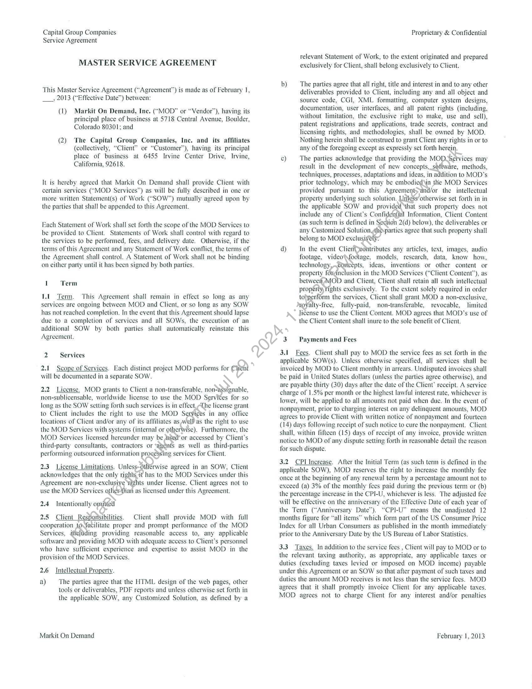
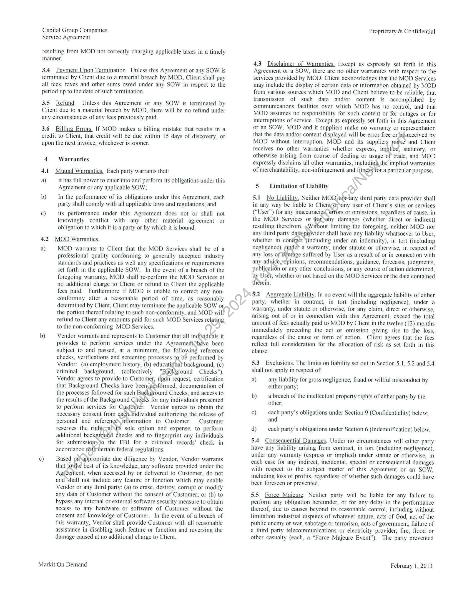
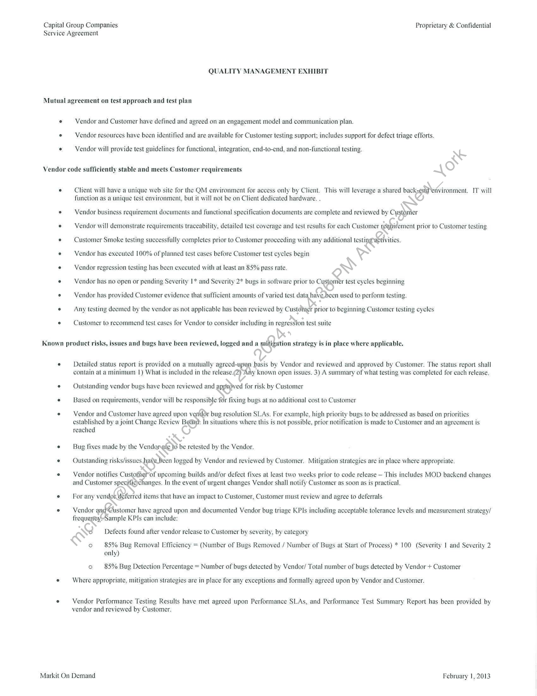
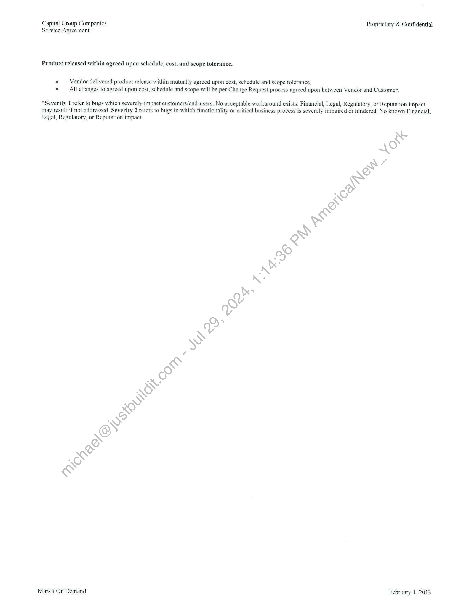

##### Master Service Agreement]

  
````col
```col-md
flexGrow=.5
===
> [!info] [Page 1](_attachments/images_CapGroupResearch-3.6.1.5.3CapitalGroup-MA.pdf_212118/page_1.png)
> 
```  
```col-md
Capital Group Companies
Service Agreement  
MASTER SERVICE AGREEMENT  
This Master Service Agreement (“Agreement”) is made as of February 1,
___, 2013 (“Effective Date”) between:  
(1) Markit On Demand, Inc. (*~MOD” or “Vendor’), having its
principal place of business at 5718 Central Avenue, Boulder,
Colorado 80301; and  
(2) The Capital Group Companies, Inc. and its affiliates
(collectively, “Client” or “Customer”), having its principal
place of business at 6455 Irvine Center Drive, Irvine,
California, 92618.  
It is hereby agreed that Markit On Demand shall provide Client with
certain services (“MOD Services”) as will be fully described in one or
more written Statement(s) of Work (“SOW”) mutually agreed upon by
the parties that shall be appended to this Agreement.  
Each Statement of Work shall set forth the scope of the MOD Services to
be provided to Client. Statements of Work shall control with regard to
the services to be performed, fees, and delivery date. Otherwise, if the
terms of this Agreement and any Statement of Work conflict, the terms of
the Agreement shall control. A Statement of Work shall not be binding
on either party until it has been signed by both parties.  
1 Term  
1.1 Term. This Agreement shall remain in effect so long as any
services are ongoing between MOD and Client, or so long as any SOW
has not reached completion. In the event that this Agreement should lapse
due to a completion of services and all SOWs, the execution of an
additional SOW by both parties shall automatically reinstate this
Agreement.  
2 Services  
2.1 Scope of Services. Each distinct project MOD performs for Client
will be documented in a separate SOW.  
2.2 License. MOD grants to Client a non-transferable, non-assignable,
non-sublicensable, worldwide license to use the MOD Servites for so
long as the SOW setting forth such services is in effect.¢The license grant
to Client includes the right to use the MOD Services in any office
locations of Client and/or any of its affiliates as ell as the right to use
the MOD Services with systems (internal or otherWwise). Furthermore, the
MOD Services licensed hereunder may be used or accessed by Client's
third-party consultants, contractors or ‘a&ents as well as third-parties
performing outsourced information pro¢e§sing services for Client.  
2.3 License Limitations. Unless-otlierwise agreed in an SOW, Client
acknowledges that the only rights it has to the MOD Services under this
Agreement are non-exclusive ights under license. Client agrees not to
use the MOD Services other than as licensed under this Agreement.  
2.4 Intentionally omitfetl  
2.5 Client Responsibilities. Client shall provide MOD with full
cooperation tofacilitate proper and prompt performance of the MOD
Services, ifeltiding providing reasonable access to, any applicable
software and providing MOD with adequate access to Client's personnel
who have sufficient experience and expertise to assist MOD in the
provision of the MOD Services.  
2.6 Intellectual Property.  
a) The parties agree that the HTML design of the web pages, other
tools or deliverables, PDF reports and unless otherwise set forth in
the applicable SOW, any Customized Solution, as defined by a  
Markit On Demand  
Proprietary & Confidential  
relevant Statement of Work, to the extent originated and prepared
exclusively for Client, shall belong exclusively to Client.  
b) The parties agree that all right, title and interest in and to any other
deliverables provided to Client, including any and all object and
source code, CGI. XML formatting. computer system designs,
documentation, user interfaces, and all patent rights (including,
without limitation, the exclusive right to make, use and sell),
patent registrations and applications. trade secrets, contract and
licensing rights, and methodologies, shall be owned by MOD.
Nothing herein shall be construed to grant Client any rights in or to
any of the foregoing except as expressly set forth herein.  
c) The parties acknowledge that providing the MOD Services may
result in the development of new concepts,_software, methods,
techniques, processes, adaptations and ideas, in addition to MOD’s
prior technology, which may be embodied \in the MOD Services
provided pursuant to this Agreement>and/or the intellectual
property underlying such solution. UnieSs otherwise set forth in in
the applicable SOW and provided ‘that such property does not
include any of Client’s Confidential Information, Client Content
(as such term is defined in Section 2(d) below), the deliverables or
any Customized Solution ythesparties agree that such property shall
belong to MOD exclusively:  
d) In the event Clien®eontributes any articles, text, images, audio
footage, video(footage, models, research, data, know how,
technology,.coneepts, ideas, inventions or other content or
property fordnclusion in the MOD Services (“Client Content”), as
betwee MOD and Client, Client shall retain all such intellectual
property, rights exclusively. To the extent solely required in order
to)perform the services, Client shall grant MOD a non-exclusive,
voYalty-free, fully-paid, non-transferable, revocable, limited
license to use the Client Content. MOD agrees that MOD’s use of
the Client Content shall inure to the sole benefit of Client,  
3. Payments and Fees  
3.1 Fees. Client shall pay to MOD the service fees as set forth in the
applicable SOW(s). Unless otherwise specified, all services shall be
invoiced by MOD to Client monthly in arrears. Undisputed invoices shall
be paid in United States dollars (unless the parties agree otherwise), and
are payable thirty (30) days after the date of the Client’ receipt. A service
charge of 1.5% per month or the highest lawful interest rate, whichever is
lower, will be applied to all amounts not paid when due. In the event of
nonpayment, prior to charging interest on any delinquent amounts, MOD
agrees to provide Client with written notice of nonpayment and fourteen
(14) days following receipt of such notice to cure the nonpayment. Client
shall, within fifteen (15) days of receipt of any invoice, provide written
notice to MOD of any dispute setting forth in reasonable detail the reason
for such dispute.  
3.2. CPI Increase. After the Initial Term (as such term is defined in the
applicable SOW), MOD reserves the right to increase the monthly fee
once at the beginning of any renewal term by a percentage amount not to
exceed (a) 3% of the monthly fees paid during the previous term or (b)
the percentage increase in the CPI-U, whichever is less. The adjusted fee
will be effective on the anniversary of the Effective Date of each year of
the Term (“Anniversary Date”). “CPI-U” means the unadjusted 12
months figure for “all items” which form part of the US Consumer Price
Index for all Urban Consumers as published in the month immediately
prior to the Anniversary Date by the US Bureau of Labor Statistics.  
3.3. Taxes. In addition to the service fees , Client will pay to MOD or to
the relevant taxing authority, as appropriate, any applicable taxes or
duties (excluding taxes levied or imposed on MOD income) payable
under this Agreement or an SOW so that after payment of such taxes and
duties the amount MOD receives is not less than the service fees. MOD
agrees that it shall promptly invoice Client for any applicable taxes.
MOD agrees not to charge Client for any interest and/or penalties  
February 1, 2013  
```
````
Notes:    
````col
```col-md
flexGrow=.5
===
> [!info] [Page 2](_attachments/images_CapGroupResearch-3.6.1.5.3CapitalGroup-MA.pdf_212118/page_2.png)
> 
```  
```col-md
Capital Group Companies
Service Agreement  
resulting from MOD not correctly charging applicable taxes in a timely
manner.  
3.4 Payment Upon Termination. Unless this Agreement or any SOW is
terminated by Client due to a material breach by MOD, Client shall pay
all fees, taxes and other sums owed under any SOW in respect to the
period up to the date of such termination.  
3.5 Refund. Unless this Agreement or any SOW is terminated by
Client due to a material breach by MOD, there will be no refund under
any circumstances of any fees previously paid.  
3.6 Billi ‘ors. If MOD makes a billing mistake that results in a
credit to Client, that credit will be due within 15 days of discovery, or
upon the next invoice, whichever is sooner.  
4 Warranties  
4.1 Mutual Warranties. Each party warrants that:  
a) it has full power to enter into and perform its obligations under this
Agreement or any applicable SOW;  
b) In the performance of its obligations under this Agreement, each
party shall comply with all applicable laws and regulations; and  
c) its performance under this Agreement does not or shall not
knowingly conflict with any other material agreement or
obligation to which it is a party or by which it is bound.  
4.2) MOD Warranties.  
a) MOD warrants to Client that the MOD Services shall be of a
professional quality conforming to generally accepted industry
standards and practices as well any specifications or requirements
set forth in the applicable SOW. In the event of a breach of the
foregoing warranty, MOD shall re-perform the MOD Services at
no additional charge to Client or refund to Client the applicable
fees paid. Furthermore if MOD is unable to correct any nonconformity after a reasonable period of time, as reasonably
determined by Client, Client may terminate the applicable SOW or,
the portion thereof relating to such non-conformity, and MOD will
refund to Client any amounts paid for such MOD Services relating
to the non-conforming MOD Services.  
b) Vendor warrants and represents to Customer that all individuals it
provides to perform services under the AgreemeritShave been
subject to and passed, at a minimum, the following reference
checks, verifications and screening processes to be performed by
Vendor: (a) employment history, (b) educati6nal background, (c)
criminal background, (collectively "Baékground Checks").
Vendor agrees to provide to Customer, tipon request, certification
that Background Checks have been.pewérmed, documentation of
the processes followed for such Background Checks, and access to
the results of the Background Chevks for any individuals presented
to perform services for CusfOier. Vendor agrees to obtain the
necessary consent from each individual authorizing the release of
personal and referencé\ information to Customer. Customer
reserves the rightscatNtS sole option and expense, to perform
additional backgrowid checks and to fingerprint any individuals
for submission to the FBI for a criminal records' check in
accordance withrcertain federal regulations.  
c) Based on appropriate due diligence by Vendor, Vendor warrants
that tothe best of its knowledge, any software provided under the
Agfeement, when accessed by or delivered to Customer, do not
and ‘shall not include any feature or function which may enable
Vendor or any third party: (a) to erase, destroy, corrupt or modify
any data of Customer without the consent of Customer: or (b) to
bypass any internal or external software security measure to obtain
access to any hardware or software of Customer without the
consent and knowledge of Customer. In the event of a breach of
this warranty, Vendor shall provide Customer with all reasonable
assistance in disabling such feature or function and reversing the
damage caused at no additional charge to Client.  
Markit On Demand  
Proprietary & Confidential  
4.3 Disclaimer_of Warranties. Except as expressly set forth in this
Agreement or a SOW, there are no other warranties with respect to the
services provided by MOD. Client acknowledges that the MOD Services
may include the display of certain data or information obtained by MOD
from various sources which MOD and Client believe to be reliable, that
transmission of such data and/or content is accomplished by
communications facilities over which MOD has no control, and that
MOD assumes no responsibility for such content or for outages or for
interruptions of service. Except as expressly set forth in this Agreement
or an SOW, MOD and it suppliers make no warranty or representation
that the data and/or content displayed will be error free or bé-received by
MOD without interruption. MOD and its suppliers make’ and Client
receives no other warranties whether express, implied, statutory, or
otherwise arising from course of dealing or usage of trade, and MOD
expressly disclaims all other warranties, includiag the implied warranties
of merchantability, non-infringement and fitness Yor a particular purpose.  
5 Limitation of Liability  
5.1 No Liability. Neither MOD;norany third party data provider shall
in any way be liable to Clieny@rvany user of Client’s sites or services
(“User”) for any inaccuracies erfors or omissions, regardless of cause, in
the MOD Services or fersany damages (whether direct or indirect)
resulting therefrom. «Without limiting the foregoing, neither MOD nor
any third party date:piovider shall have any liability whatsoever to User,
whether in contract (including under an indemnity), in tort (including
negligence), (de? a warranty, under statute or otherwise, in respect of
any loss of Wamage suffered by User as a result of or in connection with
any adyicesopinions, recommendations, guidance, forecasts, judgments,
publication or any other conclusions, or any course of action determined,
by User, whether or not based on the MOD Services or the data contained
therein.  
5.2° Aggregate Liability. In no event will the aggregate liability of cither
party, whether in contract, in tort (including negligence), under a
warranty, under statute or otherwise, for any claim, direct or otherwise,
ig out of or in connection with this Agreement, exceed the total
amount of fees actually paid to MOD by Client in the twelve (12) months
immediately preceding the act or omission giving rise to the loss,
regardless of the cause or form of action. Client agrees that the fees
reflect full consideration for the allocation of risk as set forth in this
clause.  
5.3. Exclusions. The limits on liability set out in Section 5.1, 5.2 and 5.4
shall not apply in respect of:
a) any liability for gross negligence, fraud or willful misconduct by:  
either party;  
b) a breach of the intellectual property rights of either party by the
other;  
c) cach party’s obligations under Section 9 (Confidentiality) below;
and  
d) each party’s obligations under Section 6 (Indemnification) below.  
5.4 Consequential Damages. Under no circumstances will either party
have any liability arising from contract, in tort (including negligence),
under any warranty (express or implied) under statute or otherwise, in
each case for any indirect, incidental, special or consequential damages
with respect to the subject matter of this Agreement or an SOW,
including loss of profits, regardless of whether such damages could have
been foreseen or prevented.  
5.5 Force Majeure. Neither party will be liable for any failure to
perform any obligation hereunder, or for any delay in the performance
thereof, due to causes beyond its reasonable control, including without
limitation industrial disputes of whatever nature, acts of God, act of the
public enemy or war, sabotage or terrorism, acts of government, failure of
a third party telecommunications or electricity provider, fire, flood or
other casualty (each, a “Force Majeure Event”). The party prevented  
February 1, 2013  
```
````
Notes:    
````col
```col-md
flexGrow=.5
===
> [!info] [Page 3](_attachments/images_CapGroupResearch-3.6.1.5.3CapitalGroup-MA.pdf_212118/page_3.png)
> 
```  
```col-md
Capital Group Companies
Service Agreement  
from performance by a Force Majeure Event shall give the other party
written notice of such event promptly upon discovery thereof, and shall
use reasonable efforts to recommence performance of the affected
obligations or provide an acceptable alternative.  
5.6 Essential Element. These warranty disclaimers, limitations on
liability and remedy limitations contained herein are reflected in the
pricing of the MOD Services and are essential elements of, and are
materially bargained for, bases of the commercial agreement between the
parties, and they have been taken into account and are reflected in the
consideration given by each party to enter into and to perform the
Agreement.  
6 — Indemnification  
6.1 Indemnity by MOD. MOD will indemnify, defend and hold
harmless Client and its directors, officers, agents, employees, successors,
and assigns from and against any and all claims brought by any third
party arising from (i) any misrepresentation or breach of warranty by
MOD contained in this Agreement; (ii) any breach of MOD obligations  
under this Agreement (including but limited to a breach of  
confidentiality); (iii) the gross negligence, intentional misconduct or any  
fraudulent or criminal acts of Vendor or its employees or subcontractors:  
and (iv) based upon an alleged infringement of any intellectual property
right of a third party by the MOD Services, any deliverables or work
product provided by MOD under this Agreement provided that:  
a) MOD is notified in writing of such action within thirty (30) days
of Client’s receipt of notice of such action. No failure to so notify
Vendor shall relieve Vendor of its obligations under this
Agreement except to the extent that it can demonstrate damages
attributable to such failure. Customer agrees to reasonably
cooperate with Vendor during such proceedings:  
b) MOD shall have the first option to defend and/or settle the action:  
c) Client furnishes to MOD all information reasonably available to
the Client for defense of such action;  
d) Client cooperates, and agrees to work with MOD in good faith, in
any defense and/or settlement of such action;  
e) Client shall not admit any such action or any allegations made igt
such action without the prior written consent of MOD.  
ions. MOD’s indemnity obligation under Section, 6. shall  
not apply to:  
a) any claim that arises out of the substance of a specifi¢ direction
from Client to MOD to add or modify a functionality in the MOD
Services, provided such claim did not arise fronMOD disclosing
such added or modified functionality to a thirg*party  
b) any intellectual property owned by Chienhat is not part of the
MOD Services:  
c) any portion of the MOD Services.that replaces services, features or
functions or hosted by Clientpridr to the launch of the MOD
Services:  
d) any loss to the extent-stichoss arises from the fraud, gross
negligence or willfLimisconduct of Client.  
6.3 Duty to Replace(/Jn the event of an alleged infringement, MOD
shall at no additional tharge to Client promptly replace, in whole or in
part, MOD Services, deliverables or work product with a substantially
compatible aridéfunctionally equivalent product or modify the MOD
Services, délivérables or work product to avoid the infringement. Should
it be commercially unreasonable to make the MOD Services, deliverables
or work product non-infringing, MOD shall allow Client to terminate the
relevant SOW and owe no further fees.  
6.4 Indemnity by Client. Client will indemnify, defend and hold
harmless MOD and its directors, officers, agents, employees, successors
and assigns from any all claims brought by any third party arising from
any misrepresentation or breach of warranty by Client contained in this  
Markit On Demand  
Proprietary & Confidential  
Agreement or any breach by Client of its obligations under this
Agreement, provided that:  
a) Client is notified in writing of such action within thirty (30) days
of Client’s receipt of notice of such action. No failure to so notify
Client shall relieve Client of its obligations under this Agreement
except to the extent that it can demonstrate damages attributable to
such failure. Client agrees to reasonably cooperate with MOD
during such proceedings;  
b) Client shall have the first option to defend and/or settle the action;  
c) MOD furnishes to Client all information reasonably available to
the MOD for defense of such action:  
d) MOD cooperates, and agrees to work with Client in goedhfaith, in
any defense and/or settlement of such action;  
e) MOD shall not admit any such action or any allegations made in
such action without the prior written consent of Client.  
s. Client’s indemnity obligatiof/ynder Section 6.3 shall
not apply to:  
a) any intellectual property owned_by MOD; and
b) any loss to the extent such0ss ‘arises from the fraud, gross
negligence or willful mis¢6nduct of MOD.  
7 Remedies  
7.1 Suspension/MOD is entitled to suspend the MOD Services or any
part thereof if (i) if\its reasonable opinion, Client is in material breach of
the terms ofthis Agreement or any SOW, which is not cured thirty (30)
days from receipt of written notice thereof; (ii) Client fails to cooperate
with any>reasonable investigation of such breach; or (iii) MOD is
requiret.to do so by any legal or regulatory authority.  
8 = Termination  
8.1 Termination of the Agreement, Either party may terminate this  
Agreement or any individual SOW if the other party:  
a) commits a material breach of this Agreement which is incapable of
remedy. Such termination shall be effective immediately upon
giving Notice pursuant to Section 10.1;  
b) commits a material breach of this Agreement which remains
unremedied thirty (30) days after receipt of Notice. In this event,
the non-breaching party shall have the option, to be exercised at its
sole discretion, to terminate immediately without further notice:  
c) makes an assignment for the benefit of its creditors, files or has
filed against it a petition under any bankruptcy, insolvency,
reorganization or similar law, appoints or has appointed against it
a trustee or receiver for any of its property or commences or has
commenced against it (by resolution or otherwise) the liquidation
or winding-up of its affairs, which termination shall be effective
immediately upon giving Notice.  
8.2 Termination of a Statement of Work. The parties’ termination for
any reason of any individual SOW shall not result in a termination of this
Agreement but shall result in only the termination of the relevant SOW.
The provisions of this Agreement relating to the effects of termination
shall apply to each SOW as an independent contract.  
8.3 Obligations Upon Termination. In any of the events in Section
8.1(a) or (b) where Client is the breaching party, upon termination of any
SOW, Client shall pay any outstanding fees accrued through the date of
termination, Furthermore, upon notice of termination of this Agreement
for any reason. MOD and Client agree to provide their committed
cooperation to effect an orderly transition of MOD’s duties and
responsibilities hereunder to a new service provider selected by the Client
or to Client as soon as reasonably practicable. Such cooperation shall
include the development and implementation by the parties of a
conversion plan for the orderly migration of the MOD Services. For the  
February 1, 2013  
```
````
Notes:    
````col
```col-md
flexGrow=.5
===
> [!info] [Page 4](_attachments/images_CapGroupResearch-3.6.1.5.3CapitalGroup-MA.pdf_212118/page_4.png)
> 
```  
```col-md
Capital Group Companies
Service Agreement  
purpose of successful migration of the MOD Services, the parties may
agree to have this Agreement remain in effect for an additional period
after the termination date (the “Extension Period”). During the Extension
Period, MOD shall perform such services as the parties in good faith
agree are reasonably necessary to facilitate the orderly transition of the
MOD Services to the successor service provider or to the Client. Any
such services shall be provided by MOD under the terms and conditions,
and subject to payment of the fees and charges, applicable to the
performance of MOD Services under this Agreement on the date of
notice of termination (or, with respect to any services that are not then
MOD Services, as may be agreed to by the parties in good faith).  
9 Confidentiality  
9.1 Confidentiality Obligations. From time to time, either party (the
“Disclosing Party”) may disclose Confidential Information to the other
party (the “Receiving Party”). Confidential Information is all nonpublic
information concerning the business, technology, internal structure and
strategies of the Disclosing Party that is conveyed to the Receiving Party
either verbally or in tangible form and is either marked as “confidential”
or which, due to the circumstances surrounding its disclosure, should be
reasonably construed as confidential. In the case of Client, Confidential
Information shall also include without limitation to, certain confidential
and/or proprietary financial, sales and distribution, marketing, research
and development, organizational, employee, technical and business
information, Client Content, policies or practices, portfolio holdings and
securities related information and certain non-public personal or financial
information received from or relating to third parties such as Client's own
clients and customers. During the term of this Agreement and in
perpetuity thereafter, the Receiving Party will keep in confidence and
will not disclose, or permit any employee, agent or other person working
under the Receiving Party’s direction to disclose any Confidential
Information to any other person, If Receiving Party requires access of the
Disclosing Party’s Confidential Information by a third party agent, then
Receiving Party agrees to ensure that such agent executes a separate
confidentiality agreement with Receiving Party to ensure protection of
the Disclosing Party’s Confidential Information to the same extent that
such information is protected under this Agreement. Receiving Party will
employ at least the same methods and degree of care, but no less than a
reasonable degree of care. to prevent disclosure of the Confidential
Information as the Receiving Party employs with respect to its/own
confidential information.  
9.2 Permitted Disclosures. There will be no obligatiéns on the  
Receiving Party with respect to any Confidential Information which:  
a) Is now generally known or available or whieh, subsequently
through no act or failure to act on the par(Ofthe Receiving Party,
becomes generally known or available  
b) Is rightfully known to the Receiving Party at the time of receiving
such information as evidenced inywriting:  
c) Is provided to the Receiving Pajty by a third party without
restriction on disclosure aiid Without the Receiving Party having
actual notice or reason:to)know that the third party lacks authority
to provide it;  
d) Is independentlysdeveloped by the Receiving Party without the use
of the Disclosin@ Party’s Confidential Information; or  
e) Is required torbe disclosed by operation of law or by any
government or regulatory authority, provided that, Receiving Party
promptly notifies Disclosing Party and tender to it the defense of
such demand. Upon request by the Disclosing Party, Receiving
Party shall cooperate (at the expense of the Disclosing Party) in
the defense of the demand. Unless the demand shall have been
timely limited, suppressed or extended, the Receiving Party shall
thereafter be entitled to comply with such demand to the extent
required by law.  
9.3 In the event Receiving Party is provided access to any portfolio
holdings or securities related information, Receiving Party agrees not to  
Markit On Demand  
Proprietary & Confidential  
trade on any such information. Receiving Party shall promptly notify
Disclosing Party of any breach or suspected breach of this section, but in
no event shall such notice be later than ten (10) days from the date that
Receiving Party is made aware of the breach or suspected breach.
Receiving Party agrees to comply with all applicable federal and state
data privacy laws, including any requirements to establish and maintain
safeguards and a written information security program.  
9.4 Confidentiality Obligations Upon Termination. Upon termination of
this Agreement, each party shall, at the other party’s option, either return
or destroy all Confidential Information of the other party. Each party
shall certify to the other party its compliance with the foregoing sentence.  
10 General  
10.1 Notices. Whenever any notice or other communication is given by
one party to the other (“Notice”), such Notice shall be‘in writing and shall
be delivered by facsimile (with confirmationyef Yeceipt duly obtained by
the sending party), email, reputable couliér’ service or registered or
certified mail, return receipt requested) ‘addressed as set forth on the
signature page hereto. Notices properly given in accordance with this
Section 10.1 shall be effective op the immediately succeeding business
day after being received.  
10.2 Entire Agreement. This Agreement constitutes the — entire
understanding between \the parties regarding its subject matter and
supersedes all proposals, verbal or written, and all other representations,
statements, negotiations and undertakings relating to such subject matter.
In entering this Agreement, neither party has relied on any statement,
warranty orrepiesentation (except in the case of fraud) made by the other
save as set Out in this Agreement. No change in, addition to, or waiver of
any provision of this Agreement shall be binding upon cither party unless
in writing signed by an authorized representative of such party.  
10.3 Assignment. Neither party may transfer any of its rights or
obligations under this Agreement without the prior written consent of the
other party, which consent shall not be unreasonably withheld. This
clause shall not be construed as limiting MOD’s right to use
subcontractors to carry out any of its obligations under this Agreement.
Vendor shall be responsible for the performance of all subcontractors
performing any services hereunder. Vendor shall provide to Customer
upon request information concerning its subcontractors, including the
name, address and principals. Customer reserves the right to reject any
subcontractor who is not reasonably satisfactory to Customer. Customer
shall have no responsibility or obligation to any subcontractor of Vendor.
Vendor shall ensure that its subcontractors perform the services in
accordance with this Agreement, and Vendor shall remain responsible for
all acts and omissions of its subcontractors. Each subcontractor is subject
to all of the terms and conditions of the Agreement. It is the responsibility
of Vendor to facilitate compliance by its subcontractors. Any assignment
not in conformity with this clause is void. For the avoidance of doubt, in
the event Vendor is using a third party hosting site to host any of
Customer’s content, such third party hosting site shall be deemed a
“subcontractor” under this Section 10.3.  
10.4 Counterparts. This Agreement and any SOW may be executed in
any number of counterparts. each of which when executed and delivered
shall constitute an original but all of which together constitute one and
the same instrument.  
10.5 Waiver. No failure to exercise nor any delay in exercising any
ight, power or remedy by a party operates as a waiver. A single or partial
exercise of any right, power or remedy does not preclude any other or
further exercise of that or any other right, power or remedy. A waiver is
not valid or binding on the party granting that waiver unless made in  
10.6 Amendment_and_ Variation. Except as otherwise expressly
permitted by this Agreement or an SOW, no variation of this Agreement
shall be valid unless it is in writing and signed by or on behalf of each of
the parties to it. The expression “variation” shall include any amendment,  
February 1, 2013  
```
````
Notes:    
````col
```col-md
flexGrow=.5
===
> [!info] [Page 5](_attachments/images_CapGroupResearch-3.6.1.5.3CapitalGroup-MA.pdf_212118/page_5.png)
> 
```  
```col-md
Capital Group Companies
Service Agreement  
variation, modification, supplement, deletion or replacement however
effected.  
10.7 Severance. If any provision in or any part of this Agreement or an
Addendum hereto shall be found to be illegal or unenforceable under any
enactment or rule of law, then that provision or part shall to that extent be
deemed not to form part of this Agreement or such Addendum and the
remaining provisions shall continue in full force and effect.  
10.8 Survival. Any provision of this Agreement which contemplates
performance or observance subsequent to any termination or expiration
of this Agreement will survive any termination or expiration of this
Agreement and continue in full force and effect, including, but not
limited to, Sections 2.6 (Intellectual Property), 3 (Payments and Fees), 4
(Warranties), 5 (Limitation of Liability), 6 (Indemnification), 7
(Remedies), 9 (Confidentiality) and 11 (General). In the event of a
discrepancy between the Section numbers and titles above, the titles shall
control.  
10.9 Independent Contractors. The relationship of MOD and Client
established by the Agreement is that of independent contractors, and
nothing contained in the Agreement or an SOW shall be construed or
implied to (i) give either party the power to direct or control the day-today activities of the other, (ii) constitute the parties as partners, joint
venture partners, co-owners or otherwise as participants in a joint or
common undertaking or (iii) give rise to any agency relationship or
fiduciary duty by one party to the other or any other special or implied
duties not expressly stated herein. Since Vendor and any personnel used
by Vendor in connection with the services are not Customer's employees,
Vendor and related personnel are not entitled to participate in any plans
established for Customer's employees. Customer will not withhold any
amounts from compensation paid hereunder as federal or state income tax
withholding or as contributions under the Federal Insurance
Contributions Act or applicable state law. Vendor will therefore be
solely responsible for the estimation and payment of any federal or state
income tax, or federal insurance contributions on self-employment
income attributable to its compensation hereunder. Vendor is responsible
to maintain all applicable insurance, including workers' compensation  
Proprietary & Confidential  
and general liability as further set forth in the Insurance Rider attached
hereto and incorporated herein by reference.  
10.10 No Publicity. Neither party shall use the other party’s name,
trademarks, service marks, logos, trade names and/or branding for
marketing or publicity purposes, without such other party’s written
consent.  
10.11 Business Continuity _and_Disaster_Recovery. Vendor shall
implement reasonable disaster recovery and business continuity
procedures to prevent any disruption to Customer’s use of Vendor's
products and services.  
10.12 Access. For the avoidance of doubt, where the peMormance of
services requires that Vendor be provided access ¢to’ Customer's
equipment, systems or facilities, Customer is only ebligated to provide
Vendor with the level of access strictly necessary for Vendor to perform
the services. Any such access shall be subjeet\to/all of Customer's
security processes and procedures, and Vebdor agrees that it shall
perform all services in a manner whichtha&no or minimal impact to
Customer’s business operations. Vendor'shall ensure that its employees
and agents comply at all times with-Customer’s company policies and
procedures, including any data secyrity’procedures.  
10.13 Data Security Procedgive~Exhibit. Vendor shall comply with
Customer's data security provedures as set forth in Data Security
Procedure Exhibit attaghedthereto and incorporated herein by reference.  
10.14 Governingyhaw. This Agreement will be governed by and
construed in accordance with the laws of the State of New York, without
regard to the prificipals thereof relating to conflict of laws. if the State of
New York, ad9pts the current proposed Uniform Computer Information
Transactjdas* Act (UCITA, formerly proposed Article 2B to the Uniform
Comynexcial Code), or a version of the proposed UCITA, that part of the
laWs_ shall not apply to any transaction under this Agreement. Both
parties consent to the exclusive jurisdiction of any state or federal court
Sitting in the State of New York, and of any court to which an appeal
there from may be taken.  
MARKIT ON DEMAND, INC.  
THE CAPITAL GROUP COMPANIES, INC.  
Catherine Allegra  
“Michael S Brahe w  
Global Head, Markit On Demand  
264 \4  
Authivized S: gna tory  
2)¢/ 20)  
Markit On Demand  
February 1, 2013  
```
````
Notes:    
````col
```col-md
flexGrow=.5
===
> [!info] [Page 6](_attachments/images_CapGroupResearch-3.6.1.5.3CapitalGroup-MA.pdf_212118/page_6.png)
> 
```  
```col-md
Capital Group Companies Proprietary & Confidential
Service Agreement  
Exhibit A: Service Level Agreement  
1 Response Time  
MOD will be available to receive requests for maintenance and support services via the Network Operations Center (“NOC”) 24 hours a day, 7 days per week,
365 days a year. The NOC can be reached at Boulder-NOC@markit.com or 303.583.4308.  
Problems with the Customized Solution will be classified according to the impact that they have on Client.  
Level One —  
Critical Impact/Failure: A problem that threatens Client’s key business operations. This would include greater than 20 second load time forPreview Pages.
Examples include: Client’s entire site is nonfunctional; Client’s key services are unavailable; and Client’s APIs are unavailable.  
Level Two —  
Major Impact/Failure: A problem that has a significant impact on Client’s business operations. This would include greateh than 9 seconds but less than 20
seconds load time for Preview Pages. Examples include: Client's site or pages are loading more slowly than usual; a-ceéttin set of data or images are not
appearing on Client’s site.  
Level Three —  
Minor Impact: A problem that has an impact on Client’s business operations, but does not impair the ysability to the extent that it leads to abandonment.
This would include greater than 2 seconds but less than 8 seconds load time for Preview Pages. 4§xamples include: Noticeable delay in site, page or
component display that does not disrupt navigation or intended use.  
For avoidance of doubt, Preview Page load times are classified according to the following table¢  
Severity Level Preview Pages
| Performance Target <= 2 seconds
| Minor Failure Level Three >2 seconds find«<= 8 seconds
| Major Failure Level Two >9 seconis)ahd <= 20 seconds
{Critical Failure Level One >20 sebonds  
MOD will respond to problems within the following timeframes;  
Severity Response Lime Kesolution Limes Status Updates Provided
Work on issue consistently, Hourly until MOD identifies the
5 Minutes 24/7, until resolved. problem; once the problem is
Level One identified, MOD will provide  
estimated time of completion.  
20 Minates Work on issue until resolved.
Twice daily
Level Two  
1 hour Work on issue to identify Daily.
problem. Once identified, MOD
will provide an estimated time
to correct the issue and reach the
performance target time.  
Level Three  
“Response Time” refers to the interval between Client notifying MOD*s NOC of the issue, and the NOC providing written or verbal acknowledgement that
they have received such notification  
MOD is not responsible for any problem that MOD identifies as being due to a data or content provider.  
Markit On Demand February 1, 2013  
```
````
Notes:    
````col
```col-md
flexGrow=.5
===
> [!info] [Page 7](_attachments/images_CapGroupResearch-3.6.1.5.3CapitalGroup-MA.pdf_212118/page_7.png)
> 
```  
```col-md
Capital Group Companies Proprietary & Confidential
Service Agreement  
2 Availability  
“Availability” means the amount of time in a calendar month during which the MOD Services are available. “Available Hours” means all times of day and
night, 24 hour a day, 7 days a week, 365 days a year, excluding any Scheduled Maintenance Period.  
“Uptime Percentage” shall be calculated by taking the total number of minutes within the Available Hours in a given month, subtracting the total number of
minutes during which the MOD Services are not available, and dividing by the total number of minutes within the Available Hours. For example, in a thirty
day month, there are 43,200 minutes, assuming no Scheduled Maintenance Period. If during this month, the MOD Services are unavailable for a total of 432
minutes, the Uptime Percentage would be 99% (43,200-432/43.200).  
The following shall be excluded for purposes of Uptime Percentage calculations:  
a) Any outage that occurs during a Scheduled Maintenance Period. MOD may be required to perform system-wide maintenance, duritgywhich period the
Customized Solution may be inaccessible (each such period, a “Scheduled Maintenance Period”). Any such Scheduled Maintenance Period shall occur
no more often than once per month, on a designated Sunday between midnight and 4 a.m. Eastern Time. MOD will provide Clint With at least five (5)
business days’ notice via email of any Scheduled Maintenance Period.  
b) Any failure due to any outage of a third party monitoring provider, third party data provider or any other type of third paitvendor contracted by Client.  
3 Monitoring  
For purposes of determining the Uptime Percentage, MOD and Client will mutually agree on a subset of pages to ntertitor. Each page will be monitored by an
independent third party monitoring provider engaged by MOD from more than one location outside of MODs fetWwork on a round-robin basis at least once
every five minutes. A page fails a monitoring test if two monitoring locations fail to access a page in two succe¥sive tries from each monitoring location. On
a monthly basis, MOD shall provide Client a written report which contains the results of the monitoring.  
4 Remedies  
MOD shall provide the following remedies for failure to meet the specified Uptime Percentage:  
Uptime Credit Action  
Less than 5% of MOD shall devote resources to review  
99.80% monthly and assess the cause of the problem
hosting fees and shall provide Client with written
for those documentation as to the problem and
MOD the proposed or implemented solution.
Servic  
MOD shall devote resources to(reVieW  
Less than 10% of and assess the cause of thée\problem
99.5.0% monthly and shall provide Client«witlp Written
hosting fees documentation as to the problem and  
for those - ' i et i
MOD the proposed or impleménted solution.
Services.
Less than 20% of the Client shell “have the option to
97.0% monthly terminate‘the applicable SOW without
hosting fees any fwrtltr payment obligations upon
for those thirty. (30) days’ written notice
MOD
Services.  
Client shall be entitled to OG}y/one credit set forth above per measurement period.  
For the avoidance(Of doubt. Markit’s monthly allowed outage based on total minutes of outage per month are as follows:  
Uptime Down time Down Time — Min/Mo Down Time — Hr/Mo Credit %
99.8% 0.20% 86.40 1.440 5%
99.5% 0.50% 216.00 3.600 10%
99.0% 1.00% 432.00 7.200 20%  
For illustration purposes:  
Example I:
Three outage events in a given month at 20 min each.  
Markit On Demand February 1, 2013  
```
````
Notes:    
````col
```col-md
flexGrow=.5
===
> [!info] [Page 8](_attachments/images_CapGroupResearch-3.6.1.5.3CapitalGroup-MA.pdf_212118/page_8.png)
> 
```  
```col-md
Capital Group Companies Proprietary & Confidential
Service Agreement  
Total minutes per month outage 20X 3 = 60 minutes.
60 < 86.40 Credit due = 0%  
Example 2:
Three outage events in a given month at 30 min each.
Total minutes per month outage 30X 3 = 90 minutes.
86.4<90<216.0 Credit due=5%  
Markit On Demand February 1, 2013  
```
````
Notes:    
````col
```col-md
flexGrow=.5
===
> [!info] [Page 9](_attachments/images_CapGroupResearch-3.6.1.5.3CapitalGroup-MA.pdf_212118/page_9.png)
> 
```  
```col-md
Capital Group Companies Proprietary & Confidential
Service Agreement  
INSURANCE RIDER  
Without limiting MOD’s liability to Client or third parties hereunder, MOD agrees to maintain the following insurance coverages with insurance carriers with
an A.M. Best rating no lower than A- VIII:  
Ix All insurance coverages required by federal, state or local law and statute, including Workers’ Compensation insurance. The Workers’
Compensation insurance shall include an All States and Stop Gap endorsement.  
2. Employer’s Liability insurance, including Bodily Injury coverage, with a minimum coverage limit of $1,000,000 each person.  
3, Commercial General Liability (CGL) insurance, including coverage for Products/Completed Operations, Broad Form Bodily Injury,-Property
Damage and Advertising Liability (including Copyright Infringement) and Personal Injury, and a Severability of Interests and Cross Liability endorsement.  
Such CGL insurance shall provide a minimum combined Bodily Injury and Property Damage coverage limit of $10,000,000 per occurrence, If
MOD’s CGL coverage limit is less than $10,000,000 per occurrence, MOD shall provide evidence of Umbrella or Excess Liability ingubance coverage limits
for the difference between the CGL coverage limit and $10,000,000 per occurrence.  
4. Comprehensive Automobile Liability insurance with a minimum combined Bodily Injury and Property Damage_coyetage limit of $1,000,000 per
occurrence.
5: Comprehensive Crime insurance, including Employee dishonesty/Fidelity, (must cover all of MOD’s employees, officers and agents who perform  
work or provide services under this contract), Computer Crime, On-line Transactions, On-Premises (Loss Inside, Premises) and In-Transit (Loss Outside
the Premises) coverage parts for a minimum limit of $10,000,000 per occurrence.  
6. Professional Liability (Errors and Omissions) insurance including coverage for wrongfulacts by MOD in rendering or failing to render the
Professional Services provided for under this contract for a minimum limit of $2,000,000 per ocetyrence and $4,000,000 annual aggregate.  
7. Property Insurance including “All Risk” coverage for MOD’s computers systems, data, media and extra expense/business interruption.  
The insurance coverages and limits required to be maintained by MOD shall be primary te insurance coverage, if any, maintained by Client. Client’s
insurance coverage, if any, shall be excess and non-participatory with respect to any Joss or claim covered by any policies provided by MOD in conformance
with this agreement. Insurance coverages required to be maintained by MOD upfierthis agreement, shall not provide for deductibles or self-insurance of any
amount without prior consent from Client.  
Prior to the performance of any services or the commencement of anyavork under this contract, MOD shall furnish Client with a Certificate of Insurance
which provides evidence of the required insurance coverages. Said Certificate shall include a provision whereby MOD is required to provide, directly to
Client, thirty (30) days advance written notice before termination)charige or cancellation of coverage takes effect for such policies evidenced on such  
Certificate, regardless of whether canceled by the MOD, Insuredser Insurance Carrier.  
Markit On Demand February 1, 2013  
```
````
Notes:    
````col
```col-md
flexGrow=.5
===
> [!info] [Page 10](_attachments/images_CapGroupResearch-3.6.1.5.3CapitalGroup-MA.pdf_212118/page_10.png)
> 
```  
```col-md
Capital Group Companies Proprietary & Confidential
Service Agreement  
DATA SECURITY PROCEDURE EXHIBIT  
The Vendor shall conform to the following Data Security procedures, which may be amended from time to time by mutual agreement of Customer and
Vendor:  
1.  
Security Management  
1.1. Document and implement a security program that safeguards confidential information.
1.2. Document and communicate Data Security policies, procedures and guidelines throughout company and to all impacted personnel.  
Confidentiality of Information  
2.1, Deploy access controls to ensure confidential information residing within the Vendor’s computer system is not improperly\acceSsed, disclosed,
deleted or rendered unavailable.  
2.2. Require all Vendor personnel to sign an agreement to follow the confidentiality and security standards for handling.all confidential information
accessible by Vendor, including Customer information.  
Protecting Confidential Data  
3.1. Data Privacy
3.1.1. Restrict access to non-public personal information of Customer's clients, customers and employees only to authorized Vendor personnel
who require such access to perform services in accordance with the terms of a mutually agf@edupon and executed agreement between
Vendor and Customer.
3.1.2. Deploy physical, clectronic and procedural safeguards that comply with all applicabléfedral and state data privacy laws, including any
requirements to establish and maintain safeguards and a written information security program.
3.2. Responsibilities
3.2.1. Take appropriate steps to ensure Vendor personnel who have custody do not(réadér or make available confidential information to
unauthorized persons; such steps may include but are not limited to:
3.2.1.1. Do not forward confidential information to multiple individualguunless there is a clear business reason to do so.
3.2.1.2. Obtain approval from Customer prior to storing confidential ifformation on removable electronic storage devices (e.g. USB drive,
diskette, CD/DVD, etc.)
3.2.1.3. Delete or erase confidential information stored on rem@yable electronic storage de
prior to transferring control of these devices.
3.2.1.4. Do not leave confidential information displayed dn WY unattended computer screen.
3.3. Storing and Handling Confidential Information
3.3.1. Do not permit unauthorized persons access to hard-copy confidential information in a file cabinet, desk, safe or other enclosure,
3.3.2. Do not permit unauthorized persons access to ejevttohic media (floppy disks, CD-ROMS, etc.) containing confidential information in a file
cabinet, desk, safe or other enclosure.
3.4. Disposing Hard-Copy Materials
3.4.1. Dispose of confidential information in hardycopy form (paper, microfilm, microfiche, etc.) by shredding or incinerating by Vendor's
personnel or a bonded document destruetion firm.
3.5. Sending Confidential Data Over Non-Secrife, Networks
3.5.1. Enerypt all confidential data transmitted over non-secure communication networks (e.
3.6. Protecting Confidential Data on Portable’ Devices
3.6.1. Encrypt all confidential inforniation stored on portable electronic devices such as laptop computers and personal data assistants (PDAs),  
(e.g. USB drive, diskette, CD/DVD, etc.)  
the Internet).  
Physical Security  
4.1. Restrict and monito®agvess to facilities.
4.1.1. Log and review access activity.
4.1.2. Ensuréthe access log is available to identify and research security events.
4.2. Restrict a¢ees$-to technology areas only to authorized personnel.
4.2.1. Désighate computer and technology centers such as data centers, communication rooms, labs and other IT infrastructure areas supporting
‘Ciistomer as closed shops.
Prohibit physical access of anyone without a business need unless escorted by a Supervisor or Manager.
Limit access to magnetic tape, disk and documentation libraries only to authorized individuals.
Review access to technology centers on a regular basis.
Obtain technology area manager approval prior to processing access requests.
4.3. The responsibility for physical security must be assigned to designated personnel.
44. Restrict the ability to perform additions, deletions, and changes to the physical security systems to authorized individuals.
4.5. Permit only authorized removal of IT assets from company premises.
4.6. Deploy controls to warn and protect against environmental threats, to include:
4.6.1. fire detection and suppression mechanisms;
4.6.2. temperature and humidity monitors;
4.6.3. water sensors under the raised floors;
4.6.4. backup power via Uninterrupted Power Supply (UPS) and generators:  
Markit On Demand February 1, 2013  
```
````
Notes:    
````col
```col-md
flexGrow=.5
===
> [!info] [Page 11](_attachments/images_CapGroupResearch-3.6.1.5.3CapitalGroup-MA.pdf_212118/page_11.png)
> 
```  
```col-md
Capital Group Companies Proprietary & Confidential
Service Agreement  
4.6.5.  
and automated alarms  
4.7. Remove or overwrite confidential data and licensed software on all equipment or storage media prior to disposal.
4.8. Render hardcopy reports and output containing confidential data unreadable prior to disposal.  
5. Entitlement and Logical Access  
5.1. Manage System Administration Accounts  
Sdicthe
S:12s  
ay
iv  
$2.1.  
Restrict system administration access to a limited number of authorized personnel.
Disable or rename all default privileged user or configuration IDs (e.g., administrator, auditor or installer) prior to placing computers into
production processing environments.  
Restrict Production Access  
General  
5.2.1.1. Restrict access to the production environment to authorized individuals.
5.2.1.2. Grant computer and communications system access to users based on the minimum access required to perform their intended and  
5.2.2.  
regular job duties.
Log-in Banners  
5.2.2.1. Present users with a warning banner informing them that the system is restricted to authorized businegs.users.
5.2.2.2. Display the minimum information needed to facilitate the logon process systems.
5.2.2.3. Inform users that they are consenting to monitoring when using the system.  
5223:  
Change Control  
5.2.3.1. Ensure that only authorized changes are introduced to the computing environment.
5.2.3.2. Control and monitor emergency fixes.  
5.2.4,  
5.2.4.1. Assign responsibility for identifying and classi  
3:25;  
System Ownership
ing security requirements.  
Access Provisioning  
Track user access requests for authority additions, modifications or deletions  
Verify that approvers are authorized.  
Maintain a list of current users for applications that contain confidentiabinformation.  
Review user access capabilities periodically with business and application development teams.  
5.2.5.5. Remove and/or disable system accesses promptly for terminatedor transferred personnel or consultants.  
5.2.6.  
Log significant security events including  
5.2.6.1. excessive attempts to log-on or access confidential informations
5.2.6.2. attempts to change the security database or rules;
5.2.6.3. attempts to escalate privilege authority  
Se2iT::  
Restrict IT personnel access to production  
5.2.7.1. Keep business application software in non-production environments (e.g., development & QA) separate from production  
application software.
Maintain segregation of duties within themformation technology group.
Prohibit developer write/commit access to production data except for authorized emergency and temporary access  
5.2.7.4. Approve and document emergency.anthtemporary developer access to production data.
5.2.7.5. Log developer emergency and temporary access to production data.
5.2.7.6. Restrict ability to manipulate these audit logs.  
Saul.
533.2.
5,33:  
Assign users unique IDs and passwords (or password equivalent).
Prohibit sharing of individual WSer4D's. Reinforce this concept through security awareness training.
Control the use of shared system accounts (e.g., administrative, default, system automation IDs) by:  
5.3.3.1. Document and.approve shared system account use and provide these additional controls where appropriate;  
5.3.3.1.1, Restrigttoa particular workstation or by a particular program, or
§.3.3.1.2. Restrict to only necessary access rights, or
5.3.3.1.3. _Bitnit access only to non-confidential information.  
5.4. Password Security  
5.4.1.
5.4.2.
5.4.3.
5.4.4.
5.4.5.
5AG
SAK
5.4.8.  
5.4.9.
5.4.10.  
5.4.11.
5.4.12.
3.4.13.  
Match the password complexity to the confidentiality level of the data and systems.  
Require@-password length of at least eight (8) characters.  
Require password reset at a user’s initial login.  
Requite an encrypted password history of at least the last eight (8) passwords to prevent password reuse.  
Mask, suppress or otherwise obscure password when displayed or printed.  
Require that users change their passwords on all access accounts at least once every ninety (90) days.  
Change Shared system account passwords when group members terminate or transfer.  
Design. test and control computer systems to prevent the unauthorized retrieval of stored passwords, whether encrypted, unencrypted or
hashed.  
Change all default passwords before a computer or communications system is used for Customer’s business.  
Do not store passwords in readable form (e.g., in batch files, automatic log-in scripts, software macros, terminal function keys, or in other
locations) where unauthorized persons might discover or use them unless there is adequate physical or logical access control to protect
those passwords.  
Disclose or reset password only once identity of the user is confirmed.  
Suspend or require a system administrator reset after a set number of consecutive failed logon attempts.  
Do not inform user the source of the problem of an unsuccessful login attempt.  
Markit On Demand February 1, 2013  
```
````
Notes:    
````col
```col-md
flexGrow=.5
===
> [!info] [Page 12](_attachments/images_CapGroupResearch-3.6.1.5.3CapitalGroup-MA.pdf_212118/page_12.png)
> 
```  
```col-md
Capital Group Companies Proprietary & Confidential
Service Agreement  
ww
in  
5.8.  
5.4.14. Automatically blank the screen and lock the session after a period of inacti
5.4.15. Validate the identity of persons placing computer support telephone calls.
Security Training  
5.5.1. Provide appropriate and recurring security awareness training to vendor personnel.  
5.5.2. Provide functional security training to personnel who are responsible for the security function.  
5.5.3. Emphasize user responsibility regarding separation of duties, internal controls, and security as it relates to information systems.  
Network Security  
5.6.1. Protect the network from unauthorized and unintended external access.  
5.6.2. Periodically perform perimeter security and vulnerability assessments.  
External-facing network connections must terminate on properly secured network zones which allow traffic to be controlled to the extent  
that the vendor can enforce access and traffic restrictions, monitor connections, and manually disconnect remote connections)  
5.6.4. Run external-facing network firewall devices on computers dedicated to security functions.  
5.6.5. Change rules for configuring firewalls and permitting services as needed after extensive evaluation risks assessment.  
5.6.6. Obtain written approval from Customer prior to any third party being permitted to access Customer's data. Requests for approval must
specify the business requirement for the access, the security-related responsibilities (and liability exposure) of the ¥endor, the common
carrier (if one is used) and all other third parties.  
5.6.7. Use two-factor authentication for all remote access into the networks used to process Customer’s data,  
5.6.8. Require appropriate functional Department Manager and the Vendor Data Security approval for all modem’ (other than those provided as
part of standard company desktops/laptops) used for communication into to the Vendor’s network.  
5.6.9. Immediately terminate any failed log-on attempts by remote users after no more than five (5) consegiltiVe attempts. Require that users
contact the appropriate support personnel to re-enable their log-on ability.  
5.6.10. Use encryption, VPN and/or dedicated lines to secure communications of confidential informgngn between the Vendor's location and any
external third parties when transmitting Customer’s data.  
Malware Protection (Viruses, Trojans, etc.)
5.7.1. Take adequate measures to protect against Malware.  
-7.2. Install and maintain anti-malware products on all systems used to access to the iffternét, including laptops and desktops.
7 7.3. Employ network segregation strategies to minimize the risk of malware trans(mission from externally-connect machines to protected
aments,
neident Management
8.1. Establish incident management responsibilities and procedures to ensiire quick, effective and orderly response to security incidents.
5.8.2. Communicate and make available procedures to all Vendor personnel:
8.3. Perform risk assessments and regularly monitor vulnerabilities}and,exploits to identify the necessity and timing of implementing the
associated patches on computer systems used to process CuStbiher’s data.
Promptly notify Customer of any breach to computer systen)s‘security, whether or not Customer's data has been compromised.
Evaluate all reported incidents to determine if mitigation reaction, recovery, and/or regulatory reporting actions are necessary.
System Logging
5.9.1, Identify requirements for user and system activity Togging for each system processing or storing Customer's confidential information.
Implement controls consistent with those requirehfents, to record and examine system and user activity.
5.9.2. Secure all system and application logs sothe¥,are accessible only to those who use the logs as part of the regular duties of their job.
5.9.3, Review all system and application logs on 9 regular basis. Match the frequency of the log review to the confidentiality of the system as well
as the importance of the information inthe particular log.
5.9.4, Retain Logs containing security-rel@vant event information must be for at least three (3) months. Secure these logs so they cannot be
modified, and only read by authorized persons.
5.9.5. Use mechanisms to detect an(’reeord significant computer security events, including attempts to deactivate, modify or delete the logging
sofiware and/or the logs themselves.
Securing Software Configurations
5.10.1. Define and implement standards to ensure secure system software configurations.
5.10.2. Follow rigorous patch? management strategy for all systems. including all laptops and desktops, to ensure that all standard sofiware is free of
known defects?
5.10.3. Use configufetion management tools to control all installs and updates to production server sofiware,Use of Security Software and Utilities
5.11.1, Require\that the Vendor Data Security function review and approve the implementation and configuration of information security tools and
techniques in the Vendor's environment.
5.11.2. Prohibit personnel from creating, installing or utilizing any software that circumvents application, database or operating system security  
Markit On Demand February 1, 2013  
```
````
Notes:    
````col
```col-md
flexGrow=.5
===
> [!info] [Page 13](_attachments/images_CapGroupResearch-3.6.1.5.3CapitalGroup-MA.pdf_212118/page_13.png)
> 
```  
```col-md
Capital Group Companies Proprietary & Confidential
Service Agreement  
QUALITY MANAGEMENT EXHIBIT  
Mutual agreement on test approach and test plan  
e — Vendor and Customer have defined and agreed on an engagement model and communication plan.
° Vendor resources have been identified and are available for Customer testing support; includes support for defect triage efforts.
° Vendor will provide test guidelines for functional, integration, end-to-end, and non-functional testing.
Vendor code sufficiently stable and meets Customer requirements
e — Client will have a unique web site for the QM environment for access only by Client. This will leverage a shared back-end environment. IT will
function as a unique test environment, but it will not be on Client dedicated hardware. .
*® — Vendor business requirement documents and functional specification documents are complete and reviewed by Cystonier
e — Vendor will demonstrate requirements traceability, detailed test coverage and test results for each Customer reqbifement prior to Customer testing
e Customer Smoke testing successfully completes prior to Customer proceeding with any additional testingattivities.
e — Vendor has executed 100% of planned test cases before Customer test cycles begin
° Vendor regression testing has been executed with at least an 85% pass rate.
e — Vendor has no open or pending Severity 1* and Severity 2* bugs in software prior to Customer test cycles beginning
e — Vendor has provided Customer evidence that sufficient amounts of varied test data have been used to perform testing.
e Any testing deemed by the vendor as not applicable has been reviewed by Customer prior to beginning Customer testing cycles  
e — Customer to recommend test cases for Vendor to consider including in regression test suite  
Known product risks, issues and bugs have been reviewed, logged and a piitigation strategy is in place where applicable.  
¢ Detailed status report is provided on a mutually agreed-upen basis by Vendor and reviewed and approved by Customer. The status report shall
contain at a minimum 1) What is included in the release.2) Any known open issues. 3) A summary of what testing was completed for cach release.  
¢ Outstanding vendor bugs have been reviewed and approved for risk by Customer  
e — Based on requirements, vendor will be responsible for fixing bugs at no additional cost to Customer  
° Vendor and Customer have agreed upon vendor bug resolution SLAs. For example, high priority bugs to be addressed as based on priorities
established by a joint Change Review Beard: In situations where this is not possible, prior notification is made to Customer and an agreement is
reached  
e —_ Bug fixes made by the Vendonafe }o be retested by the Vendor.  
e — Outstanding risks/issues have been logged by Vendor and reviewed by Customer. Mitigation strategies are in place where appropriate.  
e Vendor notifies Custofierof upcoming builds and/or defect fixes at least two weeks prior to code release — This includes MOD backend changes
and Customer specificjchanges. In the event of urgent changes Vendor shall notify Customer as soon as is practical.  
e For any vendor deferred items that have an impact to Customer, Customer must review and agree to deferrals  
° Vendor andCustomer have agreed upon and documented Vendor bug triage KPIs including acceptable tolerance levels and measurement strategy/
frequeyfeySample KPIs can include:  
© —_ Defects found after vendor release to Customer by severity, by category  
© 85% Bug Removal Efficiency = (Number of Bugs Removed / Number of Bugs at Start of Process) * 100 (Severity 1 and Severity 2
only)  
© 85% Bug Detection Percentage = Number of bugs detected by Vendor/ Total number of bugs detected by Vendor + Customer  
° Where appropriate, mitigation strategies are in place for any exceptions and formally agreed upon by Vendor and Customer.  
° Vendor Performance Testing Results have met agreed upon Performance SLAs, and Performance Test Summary Report has been provided by
vendor and reviewed by Customer.  
Markit On Demand February 1, 2013  
```
````
Notes:    
````col
```col-md
flexGrow=.5
===
> [!info] [Page 14](_attachments/images_CapGroupResearch-3.6.1.5.3CapitalGroup-MA.pdf_212118/page_14.png)
> 
```  
```col-md
Capital Group Companies Proprietary & Confidential
Service Agreement  
Product released within agreed upon schedule, cost, and scope tolerance.  
° Vendor delivered product release within mutually agreed upon cost, schedule and scope tolerance.
e All changes to agreed upon cost. schedule and scope will be per Change Request process agreed upon between Vendor and Customer.  
*Severity 1 refer to bugs which severely impact customers/end-users. No acceptable workaround exists. Financial, Legal, Regulatory, or Reputation impact
may result if not addressed. Severity 2 refers to bugs in which functionality or critical business process is severely impaired or hindered. No known Financial,
Legal, Regulatory, or Reputation impact.  
Markit On Demand February 1, 2013  
```
````
Notes:  


![[_attachments/CapGroupResearch-3.6.1.5.3 Capital Group - MA.pdf]