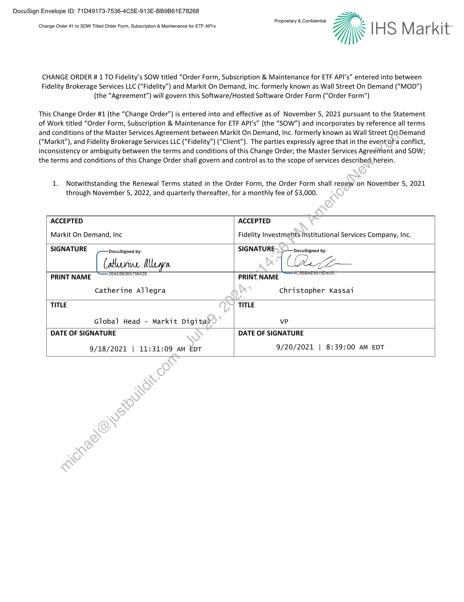

##### Change Order #1 to SOW Titled Order Form, Subscription & Maintenance for ETF API's]

  
````col
```col-md
flexGrow=.5
===
> [!info] [Page 1](_attachments/images_Fidelity-Brokerage-3.6.1.6.3.100191815.pdf_210439/page_1.png)
> 
```  
```col-md
DocuSign Envelope ID: 71D49173-7536-4C5E-913E-BB9B61E78268  
Proprietary & Confidential  
¥% .
Change Order #1 to SOW Titled Order Form, Subscription & Maintenance for ETF API's i\S S M a r k t  
CHANGE ORDER 1 TO Fidelity’s SOW titled “Order Form, Subscription & Maintenance for ETF API’s” entered into between
Fidelity Brokerage Services LLC (“Fidelity”) and Markit On Demand, Inc. formerly known as Wall Street On Demand (“MOD”)
(the “Agreement”) will govern this Software/Hosted Software Order Form ("Order Form")  
This Change Order #1 (the “Change Order”) is entered into and effective as of November 5, 2021 pursuant to the Statement
of Work titled “Order Form, Subscription & Maintenance for ETF API’s” (the “SOW”) and incorporates by reference all terms
and conditions of the Master Services Agreement between Markit On Demand, Inc. formerly known as Wall Street On-Demand
(“Markit”), and Fidelity Brokerage Services LLC (“Fidelity”) (“Client”). The parties expressly agree that in the event ofa conflict,
inconsistency or ambiguity between the terms and conditions of this Change Order; the Master Services Agreement and SOW;
the terms and conditions of this Change Order shall govern and control as to the scope of services described herein.  
1. Notwithstanding the Renewal Terms stated in the Order Form, the Order Form shall renew’on November 5, 2021
through November 5, 2022, and quarterly thereafter, for a monthly fee of $3,000.  
ACCEPTED ACCEPTED
Markit On Demand, Inc Fidelity Investments.institutional Services Company, Inc.
SIGNATURE Docusigned by: SIGNATURE Docusigned by:
Catherine MUemra. [az
ACSBBAESSTSOAUS.  
PRINT NAME PRINT NAME  
Catherine Allegra Christopher Kassai
TITLE TITLE  
Global Head - Markit Digital vP
DATE OF SIGNATURE DATE OF SIGNATURE  
9/18/2021 | 11:31:09 am EDT 9/20/2021 | 8:39:00 AM EDT  
```
````
Notes:    
````col
```col-md
flexGrow=.5
===
> [!info] [Page 2](_attachments/images_Fidelity-Brokerage-3.6.1.6.3.100191815.pdf_210439/page_2.png)
> 
```  
```col-md
DocuSign Envelope ID: 71D49173-7536-4C5E-913E-BB9B61E78268  
Certificate Of Completion  
Envelope Id: 86A9CD5BC7DC469B8D3260CA475ADB65
Subject: C€W2382123 - 202108052 Markit Digital Change Order 1 to Fidelity Order Form Subscription and Maintena  
Source Envelope:  
Document Pages: 1  
Certificate Pages: 4  
AutoNav: Enabled  
Envelopeld Stamping: Enabled  
Signatures: 1
Initials: 0  
Time Zone: (UTC-05:00) Eastern Time (US & Canada)  
Record Tracking  
Status: Original
9/16/2021 6:44:23 AM  
Signer Events  
Catherine Allegra
Catherine.Allegra@ihsmarkit.com
Global Head - Markit Digital  
Security Level: Email, Account Authentication  
(None)  
Electronic Record and Signature Disclosure:  
Accepted: 9/18/2021 11:30:50 AM  
ID: 28€81880-e2ea-4aef-9e20-9492107d885f  
In Person Signer Events
Editor Delivery Events
Agent Delivery Events
Intermediary Delivery Events
Certified Delivery Events
Carbon Copy Events
Witness Events  
Notary Events  
Envelope Summary Events
Envelope Sent  
Certified Delivered  
Signing Complete  
Completed  
Payment Events  
Holder: Ganapathi Aithal
ganapathi.aithal@fmr.com  
Signature  
Docusigned by:
Catherine Alara
-26AE663B5756428. legp
Signature Adoption: Pre-selected Style  
Using IP Address: 107.115.41.4.
Signed using mobile  
Signature
Status
Status
Status
Status
Status
Signature
Signature  
Status
Hashed/Encrypted
Security Checked
Security Checked
Security Checked  
Status  
Electronic Record and Signature Disclosure  
DocuSign  
Status: Completed  
Envelope Originator:
Ganapathi Aithal  
Two Destiny Way  
MZ: WF2E  
Westlake, TX 76262
ganapathi.aithal@fmr.com
IP Address: 216.109.110.114  
Location: DocuSign  
Timestamp  
Sentv9/16/2021 6:45:25 AM
Viewed: 9/18/2021 11:30:50 AM
Signed: 9/18/2021 11:31:09 AM  
Timestamp
Timestamp
Timestamp
Timestamp
Timestamp
Timestamp
Timestamp
Timestamp
Timestamps
9/16/2021 6:45:25 AM
9/18/2021 11:30:50 AM  
9/18/2021 11:31:09 AM
9/18/2021 11:31:09 AM  
Timestamps  
```
````
Notes:    
````col
```col-md
flexGrow=.5
===
> [!info] [Page 3](_attachments/images_Fidelity-Brokerage-3.6.1.6.3.100191815.pdf_210439/page_3.png)
> 
```  
```col-md
DocuSign Envelope ID: 71D49173-7536-4C5E-913E-BB9B61E78268 AM
Parties agreed to: Catherine Allegra  
ELECTRONIC RECORD AND SIGNATURE DISCLOSURE  
From time to time, Fidelity Procurement (we, us or Company) may be required by law to provide
to you certain written notices or disclosures. Described below are the terms and conditions for
providing to you such notices and disclosures electronically through your DocuSign, Inc.
(DocuSign) Express user account. Please read the information below carefully and thoroughly,
and if you can access this information electronically to your satisfaction and agree to these terms
and conditions, please confirm your agreement by clicking the 'I agree’ button at the bottom of,
this document.  
Getting paper copies  
At any time, you may request from us a paper copy of any record provided or made available
electronically to you by us. For such copies, as long as you are an authorized user_ofthe
DocuSign system you will have the ability to download and print any documents we send to you
through your DocuSign user account for a limited period of time (usually 30:days) after such
documents are first sent to you. After such time, if you wish for us to send ‘you paper copies of
any such documents from our office to you, you will be charged a $0.00 per-page fee. You may
request delivery of such paper copies from us by following the procedure described below.
Withdrawing your consent  
If you decide to receive notices and disclosures from us electronically, you may at any time
change your mind and tell us that thereafter you want to receive required notices and disclosures
only in paper format. How you must inform us of your décision to receive future notices and
disclosure in paper format and withdraw your consent to receive notices and disclosures
electronically is described below.  
Consequences of changing your mind  
If you elect to receive required notices and disclosures only in paper format, it will slow the
speed at which we can complete certain steps in transactions with you and delivering services to
you because we will need first to send the required notices or disclosures to you in paper format,
and then wait until we receive back from you your acknowledgment of your receipt of such
paper notices or disclosures. To indicate to us that you are changing your mind, you must
withdraw your consent using the DocuSign 'Withdraw Consent' form on the signing page of your
DocuSign account. This willindicate to us that you have withdrawn your consent to receive
required notices and disclosures electronically from us and you will no longer be able to use your
DocuSign Express useraccount to receive required notices and consents electronically from us
or to sign electronically documents from us.  
All notices and. disclosures will be sent to you electronically  
Unless you tellus otherwise in accordance with the procedures described herein, we will provide
electronically to you through your DocuSign user account all required notices, disclosures,
authorizations, acknowledgements, and other documents that are required to be provided or
madesavailable to you during the course of our relationship with you. To reduce the chance of
you inadvertently not receiving any notice or disclosure, we prefer to provide all of the required
notices and disclosures to you by the same method and to the same address that you have given
us. Thus, you can receive all the disclosures and notices electronically or in paper format through
the paper mail delivery system. If you do not agree with this process, please let us know as
described below. Please also see the paragraph immediately above that describes the
consequences of your electing not to receive delivery of the notices and disclosures
electronically from us.  
```
````
Notes:    
````col
```col-md
flexGrow=.5
===
> [!info] [Page 4](_attachments/images_Fidelity-Brokerage-3.6.1.6.3.100191815.pdf_210439/page_4.png)
> 
```  
```col-md
DocuSign Envelope ID: 71D49173-7536-4C5E-913E-BB9B61E78268  
How to contact Fidelity Procurement:  
You may contact us to let us know of your changes as to how we may contact you electronically,
to request paper copies of certain information from us, and to withdraw your prior consent to
receive notices and disclosures electronically as follows:  
To contact us by email send messages to: esignaturenoreply_fssproc@fmr.com  
To advise Fidelity Procurement of your new e-mail address
To let us know of a change in your e-mail address where we should send notices and disclosures
electronically to you, you must send an email message to us at
esignaturenoreply_fssproc@fmr.com and in the body of such request you must state: your
previous e-mail address, your new e-mail address. We do not require any other information from
you to change your email address.  

In addition, you must notify DocuSign, Inc to arrange for your new email address\to be reflected
in your DocuSign account by following the process for changing e-mail in DocuSign.
To request paper copies from Fidelity Procurement
To request delivery from us of paper copies of the notices and disclosures previously provided
by us to you electronically, you must send us an e-mail to esignaturénoreply_fssproc@fmr.com
and in the body of such request you must state your e-mail address, ‘full name, US Postal address,
and telephone number. We will bill you for any fees at that time, if any.
To withdraw your consent with Fidelity Procurement
To inform us that you no longer want to receive future notices and disclosures in electronic
format you may:
i. decline to sign a document from within your DocuSign account, and on the subsequent
page, select the check-box indicating you wish to withdraw your consent, or you may;
ii. send us an e-mail to esignaturenoreply/ fssproc@fmr.com and in the body of such
request you must state your e-mail;full'name, IS Postal Address, telephone number, and
account number. We do not needsany other information from you to withdraw consent.  

The consequences of your withdrawing consent for online documents will be that
transactions may take a longer time to process.  
  
Required hardware and software  
Operating Systems: Windows2000? or WindowsXP?  
Browsers (for SENDERS): Internet Explorer 6.0? or above  
Browsers (for SIGNERS): Internet Explorer 6.0?, Mozilla FireFox 1.0,
NetScape 7.2 (or above)  
Email: Access to a valid email account  
Screen Resolution: 800 x 600 minimum  
Enabléd Security Settings:
eAllow per session cookies  
Users accessing the internet behind a Proxy
Server must enable HTTP 1.1 settings via
proxy connection  
** These minimum requirements are subject to change. If these requirements change, we will  
provide you with an email message at the email address we have on file for you at that time  
providing you with the revised hardware and software requirements, at which time you will  
```
````
Notes:    
````col
```col-md
flexGrow=.5
===
> [!info] [Page 5](_attachments/images_Fidelity-Brokerage-3.6.1.6.3.100191815.pdf_210439/page_5.png)
> 
```  
```col-md
DocuSign Envelope ID: 71D49173-7536-4C5E-913E-BB9B61E78268  
have the right to withdraw your consent.  
Acknowledging your access and consent to receive materials electronically  
To confirm to us that you can access this information electronically, which will be similar to
other electronic notices and disclosures that we will provide to you, please verify that you
were able to read this electronic disclosure and that you also were able to print on paper or
electronically save this page for your future reference and access or that you were able to
e-mail this disclosure and consent to an address where you will be able to print on paper or
save it for your future reference and access. Further, if you consent to receiving notices and
disclosures exclusively in electronic format on the terms and conditions described above,
please let us know by clicking the 'I agree’ button below.  
By checking the 'I Agree’ box, I confirm that:  
¢ Ican access and read this Electronic CONSENT TO ELECTRONIC RECEIPT OF
ELECTRONIC RECORD AND SIGNATURE DISCLOSURES document; and  
¢ Ican print on paper the disclosure or save or send the disclosure to a place where I can
print it, for future reference and access; and  
¢ Until or unless I notify Fidelity Procurement as described above, I consent to receive
from exclusively through electronic means all notices, disclosures, authorizations,
acknowledgements, and other documents that,are required to be provided or made
available to me by Fidelity Procurement during the course of my relationship with
you.  
```
````
Notes:    
````col
```col-md
flexGrow=.5
===
> [!info] [Page 6](_attachments/images_Fidelity-Brokerage-3.6.1.6.3.100191815.pdf_210439/page_6.png)
> 
```  
```col-md
Certificate Of Completion  
Envelope Id: 71D4917375364C5E913EBB9B61E78268  
Subject: CW2382123 - Signed_Contract Documents.pdf  
Source Envelope:  
Document Pages: 5 Signatures: 1
Certificate Pages: 1 Initials: 0
AutoNav: Enabled  
Envelopeld Stamping: Enabled  
Time Zone: (UTC-05:00) Eastern Time (US & Canada)  
DocuSign  
Status: Completed  
Envelope Originator:
Ganapathi Aithal
Two Destiny Way
MZ: WF2E
Westlake, TX 76262  
ganapathi.aithal@fmr.com
IP Address: 216.109.110.114  
Record Tracking  
Status: Original Holder: Ganapathi Aithal Location: DocuSign
9/20/2021 5:22:36 AM ganapathi.aithal@fmr.com
Signer Events Signature Timestamp
Christopher Kassai Cee EAL Senty9/20/2021 5:34:05 AM
christopher.kassai@fmr.com C Viewed: 9/20/2021 8:38:51 AM
4C5BBAE8915D405  
VP.
Fidelity Procurement  
ignature Adoption: Di Devi
Security Level: Email, Account Authentication Signa ure Adoption: Drawn on Device
(None) Using IP Address: 192.223.242.29  
Signed: 9/20/2021 8:39:00 AM  
Electronic Record and Signature Disclosure:
Not Offered via DocuSign  
In Person Signer Events Signature Timestamp
Editor Delivery Events Status Timestamp
Agent Delivery Events Status Timestamp
Intermediary Delivery Events Status Timestamp
Certified Delivery Events Status Timestamp
Carbon Copy Events Status Timestamp
Witness Events Signature Timestamp
Notary Events Signature Timestamp
Envelope Summary Events Status Timestamps
Envelope Sent Hashed/Encrypted 9/20/2021 5:34:05 AM
Certified Delivered Security Checked 9/20/2021 8:38:51 AM
Signing Complete Security Checked 9/20/2021 8:39:00 AM
Completed Security Checked 9/20/2021 8:39:00 AM  
Payment Events Status Timestamps  
```
````
Notes:  


![[_attachments/Fidelity-Brokerage-3.6.1.6.3.1 00191815.pdf]