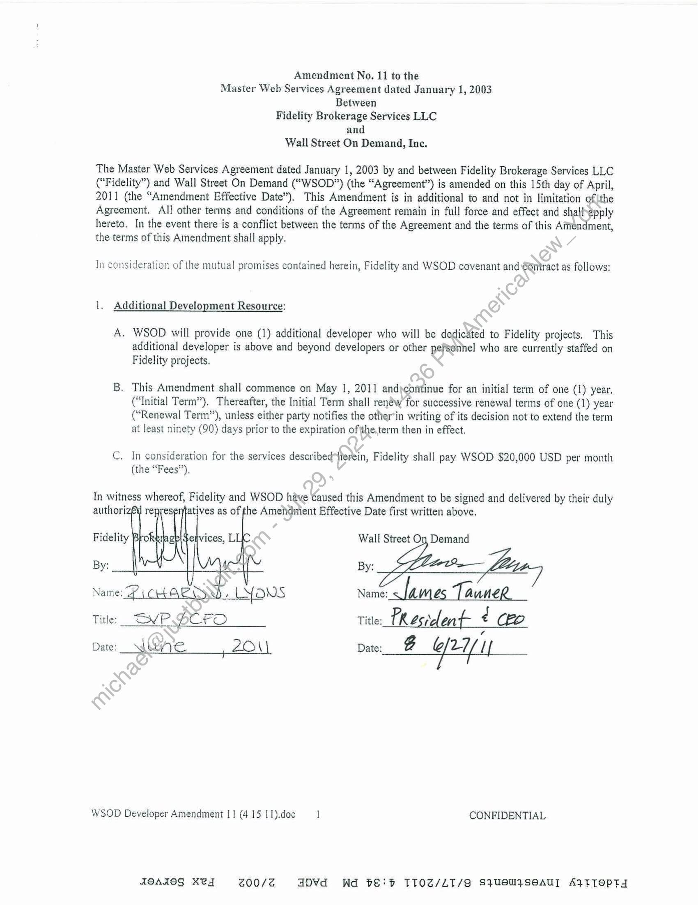

##### Amendment No. 11 to the Master Web Services Agreement]

  
````col
```col-md
flexGrow=.5
===
> [!info] [Page 1](_attachments/images_Fidelity-Brokerage-3.6.1.6.3.300191827.pdf_211326/page_1.png)
> 
```  
```col-md
Amendment No. 11 to the
Master Web Services Agreement dated January 1, 2003
Between
Fidelity Brokerage Services LLC
and
Wall Street On Demand, Inc.  
The Master Web Services Agreement dated January 1, 2003 by and between Fidelity Brokerage Services LLC
(“Fidelity”) and Wall Street On Demand (“WSOD*) (the “Agreement”) is amended on this 15th day of April,
2011 (the “Amendment Effective Date”). This Amendment is in additional to and not in limitation of {the
Agreement. All other terms and conditions of the Agreement remain in full force and effect and shalhapply
hereto, In the event there is a conflict between the terms of the Agreement and the terms of this Atiendment,
the terms of this Amendment shall apply.  
In consideration of the mutual promises contained herein, Fidelity and WSOD covenant and Gontract as follows:  
1. Additional Development Resource:  
A. WSOD will provide one (1) additional developer who will be dedic&ted to Fidelity projects. This
additional developer is above and beyond developers or other pefsonhel who are currently staffed on
Fidelity projects.  
B. This Amendment shall commence on May 1, 2011 and)continue for an initial term of one (1) year.
(“Initial Term”), Thereafter, the Initial Term shall renéw for successive renewal terms of one (1) year
(“Renewal Term”), unless either party notifies the other’in writing of its decision not to extend the term
at least ninety (90) days prior to the expiration of the,term then in effect,  
C. In consideration for the services described-fterein, Fidelity shall pay WSOD $20,000 USD per month
(the “Fees’’),  
In witness whereof, Fidelity and WSOD have Caused this Amendment to be signed and delivered by their duly  
authoriz6¥ representatives as of the Amendnient Effective Date first written above.  
Fidelity Brofser opal envices, L| Wall Street On Demand
By:  
von Puaaadls e LYONS Name: — lames LauneR.  
Title:_ GVP.DCFO Title; CResrdeat cd Ck2
Date: Wene 20 \\ Date: B @/ 27/ /|  
WSOD Developer Amendment 11 (4 15 11).doc ] CONFIDENTIAL  
ABAIEG KCL 200/24 HOvVd Wd beE:b TTOZ/LT/g S}USW}SeAU] A}TTSPTY  
```
````
Notes:  


![[_attachments/Fidelity-Brokerage-3.6.1.6.3.3 00191827.pdf]