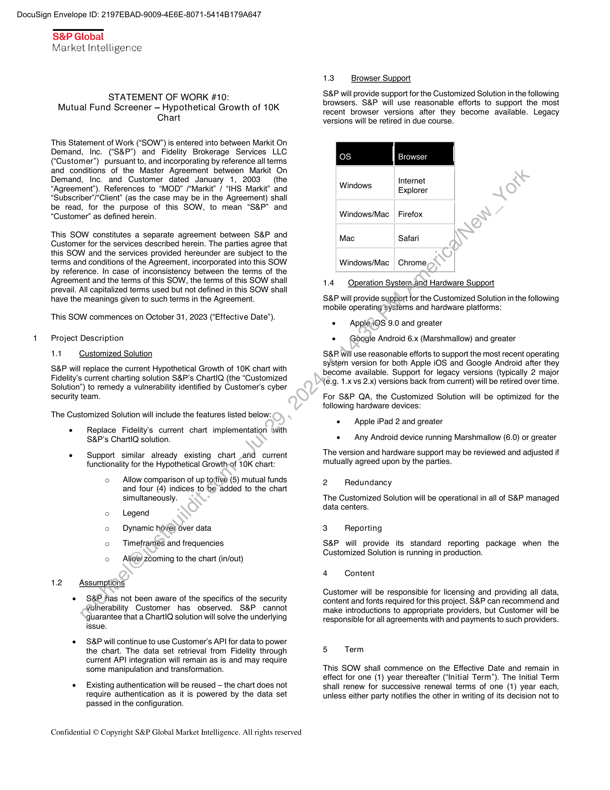
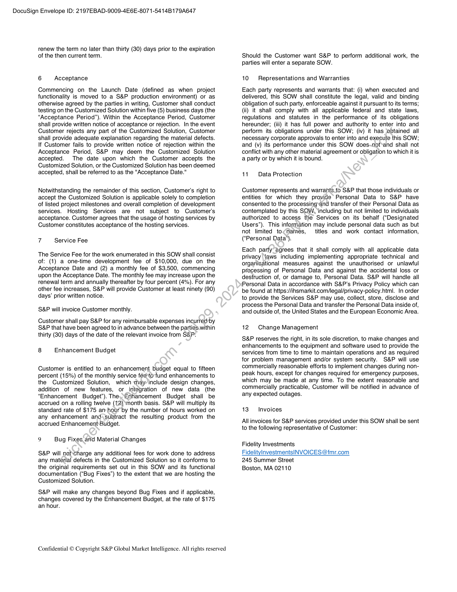
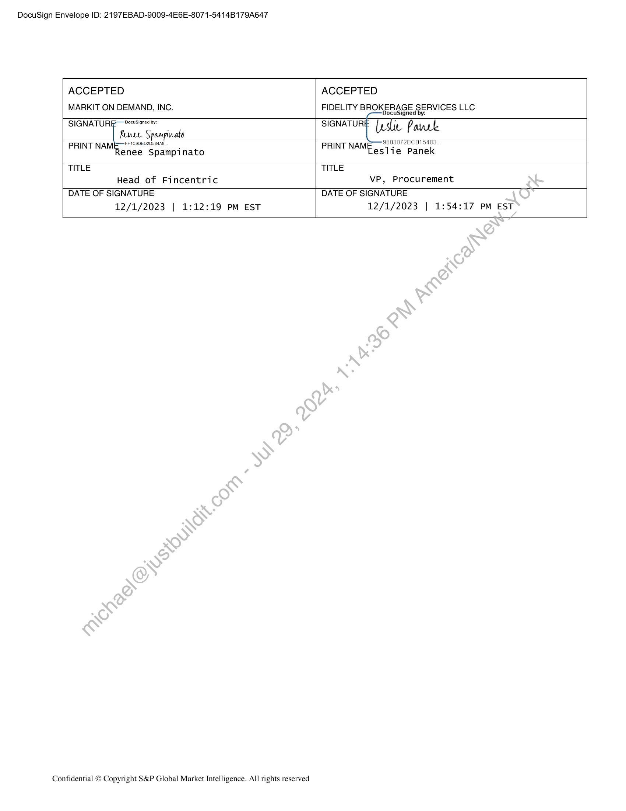

##### Statement of Work #10: Mutual Fund Screener — Hypothetical Growth of 10K Chart]

  
````col
```col-md
flexGrow=.5
===
> [!info] [Page 1](_attachments/images_Fidelity-Brokerage-3.6.1.6.3.400191823.pdf_211004/page_1.png)
> 
```  
```col-md
DocuSign Envelope ID: 2197EBAD-9009-4E6E-807 1-5414B179A647  
S&P Global
Market Intelligence  
STATEMENT OF WORK #10:
Mutual Fund Screener — Hypothetical Growth of 10K
Chart  
This Statement of Work (“SOW”) is entered into between Markit On
Demand, Inc. (“S&P”) and Fidelity Brokerage Services LLC
(“Customer”) pursuant to, and incorporating by reference all terms
and conditions of the Master Agreement between Markit On
Demand, Inc. and Customer dated January 1, 2003 (the
“Agreement”). References to “MOD” /“Markit” / “IHS Markit” and
“Subscriber’/“Client” (as the case may be in the Agreement) shall
be read, for the purpose of this SOW, to mean “S&P” and
“Customer” as defined herein.  
This SOW constitutes a separate agreement between S&P and
Customer for the services described herein. The parties agree that
this SOW and the services provided hereunder are subject to the
terms and conditions of the Agreement, incorporated into this SOW
by reference. In case of inconsistency between the terms of the
Agreement and the terms of this SOW, the terms of this SOW shall
prevail. All capitalized terms used but not defined in this SOW shall
have the meanings given to such terms in the Agreement.  
This SOW commences on October 31, 2023 (“Effective Date’).  
Project Description
14 Customized Solution  
S&P will replace the current Hypothetical Growth of 10K chart with
Fidelity’s current charting solution S&P’s ChartlQ (the “Customized
Solution”) to remedy a vulnerability identified by Customer’s cyber
security team.  
The Customized Solution will include the features listed below:  
. Replace Fidelity’s current chart implementation with
S&P’s ChartlQ solution.  
e Support similar already existing chart anid current
functionality for the Hypothetical Growth-of 10K chart:  
o Allow comparison of up tosfive (5) mutual funds
and four (4) indices to be added to the chart
simultaneously.  
o Legend
o Dynamic hover over data
o Timeframes and frequencies  
o Allow zooming to the chart (in/out)  
1.2 Assumptions  
e S&P jhas not been aware of the specifics of the security
Vulnerability Customer has observed. S&P cannot
guarantee that a ChartlQ solution will solve the underlying
issue.  
e S&P will continue to use Customer's API for data to power
the chart. The data set retrieval from Fidelity through
current API integration will remain as is and may require
some manipulation and transformation.  
e Existing authentication will be reused — the chart does not
require authentication as it is powered by the data set
passed in the configuration.  
Confidential © Copyright S&P Global Market Intelligence. All rights reserved  
1.3 Browser Support  
S&P will provide support for the Customized Solution in the following
browsers. S&P will use reasonable efforts to support the most
recent browser versions after they become available. Legacy
versions will be retired in due course.  
Internet
Explorer  
Windows
Windows/Mac | Firefox  
Mac Safari  
Windows/Mac Chrome  
1.4 Operation System.and Hardware Support  
S&P will provide support for the Customized Solution in the following
mobile operating systems and hardware platforms:  
¢  Applei@S 9.0 and greater
e Google Android 6.x (Marshmallow) and greater  
S&P will use reasonable efforts to support the most recent operating
system version for both Apple iOS and Google Android after they
become available. Support for legacy versions (typically 2 major
(e.g. 1.x vs 2.x) versions back from current) will be retired over time.  
For S&P QA, the Customized Solution will be optimized for the
following hardware devices:  
e Apple iPad 2 and greater  
e — Any Android device running Marshmallow (6.0) or greater
The version and hardware support may be reviewed and adjusted if
mutually agreed upon by the parties.
2 Redundancy
The Customized Solution will be operational in all of S&P managed
data centers.
3 Reporting
S&P will provide its standard reporting package when the
Customized Solution is running in production.  
4 Content  
Customer will be responsible for licensing and providing all data,
content and fonts required for this project. S&P can recommend and
make introductions to appropriate providers, but Customer will be
responsible for all agreements with and payments to such providers.  
5 Term  
This SOW shall commence on the Effective Date and remain in
effect for one (1) year thereafter (“Initial Term”). The Initial Term
shall renew for successive renewal terms of one (1) year each,
unless either party notifies the other in writing of its decision not to  
```
````
Notes:    
````col
```col-md
flexGrow=.5
===
> [!info] [Page 2](_attachments/images_Fidelity-Brokerage-3.6.1.6.3.400191823.pdf_211004/page_2.png)
> 
```  
```col-md
DocuSign Envelope ID: 2197EBAD-9009-4E6E-807 1-5414B179A647  
renew the term no later than thirty (30) days prior to the expiration
of the then current term.  
6 Acceptance  
Commencing on the Launch Date (defined as when project
functionality is moved to a S&P production environment) or as
otherwise agreed by the parties in writing, Customer shall conduct
testing on the Customized Solution within five (5) business days (the
“Acceptance Period”). Within the Acceptance Period, Customer
shall provide written notice of acceptance or rejection. In the event
Customer rejects any part of the Customized Solution, Customer
shall provide adequate explanation regarding the material defects.
If Customer fails to provide written notice of rejection within the
Acceptance Period, S&P may deem the Customized Solution
accepted. The date upon which the Customer accepts the
Customized Solution, or the Customized Solution has been deemed
accepted, shall be referred to as the "Acceptance Date."  
Notwithstanding the remainder of this section, Customer's right to
accept the Customized Solution is applicable solely to completion
of listed project milestones and overall completion of development
services. Hosting Services are not subject to Customer's
acceptance. Customer agrees that the usage of hosting services by
Customer constitutes acceptance of the hosting services.  
7 Service Fee  
The Service Fee for the work enumerated in this SOW shall consist
of: (1) a one-time development fee of $10,000, due on the
Acceptance Date and (2) a monthly fee of $3,500, commencing
upon the Acceptance Date. The monthly fee may increase upon the
renewal term and annually thereafter by four percent (4%). For any
other fee increases, S&P will provide Customer at least ninety (90)
days’ prior written notice.  
S&P will invoice Customer monthly.  
Customer shall pay S&P for any reimbursable expenses incurted/by
S&P that have been agreed to in advance between the parties.within
thirty (30) days of the date of the relevant invoice from S&P.  
8 Enhancement Budget  
Customer is entitled to an enhancement budget equal to fifteen
percent (15%) of the monthly service feeto'fund enhancements to
the Customized Solution, which may include design changes,
addition of new features, or integration of new data (the
“Enhancement Budget”). The,Enhancement Budget shall be
accrued on a rolling twelve (12) ‘month basis. S&P will multiply its
standard rate of $175 an hour by the number of hours worked on
any enhancement and\subtract the resulting product from the
accrued EnhancementBudget.  
9 Bug Fixes and Material Changes  
S&P will net.charge any additional fees for work done to address
any material defects in the Customized Solution so it conforms to
the original requirements set out in this SOW and its functional
documentation (“Bug Fixes”) to the extent that we are hosting the
Customized Solution.  
S&P will make any changes beyond Bug Fixes and if applicable,
changes covered by the Enhancement Budget, at the rate of $175
an hour.  
Confidential © Copyright S&P Global Market Intelligence. All rights reserved  
Should the Customer want S&P to perform additional work, the
parties will enter a separate SOW.  
10 Representations and Warranties  
Each party represents and warrants that: (i) when executed and
delivered, this SOW shall constitute the legal, valid and binding
obligation of such party, enforceable against it pursuant to its terms;
(ii) it shall comply with all applicable federal and state laws,
regulations and statutes in the performance of its obligations
hereunder; (iii) it has full power and authority to enter into and
perform its obligations under this SOW; (iv) it has {obtained all
necessary corporate approvals to enter into and execute this SOW;
and (v) its performance under this SOW does-not*and shall not
conflict with any other material agreement or obligation to which it is
a party or by which it is bound.  
11. Data Protection  
Customer represents and warrants.to S&P that those individuals or
entities for which they provide Personal Data to S&P have
consented to the processingyand transfer of their Personal Data as
contemplated by this SOW, ‘including but not limited to individuals
authorized to access the Services on its behalf (“Designated
Users”). This information may include personal data such as but
not limited to¢names, titles and work contact information,
(‘Personal Data’).  
Each party agrees that it shall comply with all applicable data
privacy laws including implementing appropriate technical and
organisational measures against the unauthorised or unlawful
processing of Personal Data and against the accidental loss or
destruction of, or damage to, Personal Data. S&P will handle all
Personal Data in accordance with S&P’s Privacy Policy which can
be found at https://insmarkit.com/legal/privacy-policy.html. In order
to provide the Services S&P may use, collect, store, disclose and
process the Personal Data and transfer the Personal Data inside of,
and outside of, the United States and the European Economic Area.  
12 Change Management  
S&P reserves the right, in its sole discretion, to make changes and
enhancements to the equipment and software used to provide the
services from time to time to maintain operations and as required
for problem management and/or system security. S&P will use
commercially reasonable efforts to implement changes during nonpeak hours, except for changes required for emergency purposes,
which may be made at any time. To the extent reasonable and
commercially practicable, Customer will be notified in advance of
any expected outages.  
13 Invoices  
All invoices for S&P services provided under this SOW shall be sent
to the following representative of Customer:  
Fidelity Investments
FidelityInvestmentsINVOICES @fmr.com
245 Summer Street  
Boston, MA 02110  
```
````
Notes:    
````col
```col-md
flexGrow=.5
===
> [!info] [Page 3](_attachments/images_Fidelity-Brokerage-3.6.1.6.3.400191823.pdf_211004/page_3.png)
> 
```  
```col-md
DocuSign Envelope ID: 2197EBAD-9009-4E6E-807 1-5414B179A647  
ACCEPTED
MARKIT ON DEMAND, INC.  
ACCEPTED  
FIDELITY BROKERAGE SERVICES LLC
DocuSigned by.  
SIGNATURE 2eexSisred by:  
SIGNATURE (este Paurk  
PRINT NAMES roxossiR
Renee Spampinato  
SeNseTIBCRTHtEs
PRINTNAMF aslie Panek  
TITLE
Head of Fincentric  
TITLE
VP, Procurement  
DATE OF SIGNATURE
12/1/2023 | 1:12:19 PM EST  
DATE OF SIGNATURE
12/1/2023 | 1:54:17 PM EST  
Confidential © Copyright S&P Global Market Intelligence. All rights reserved  
```
````
Notes:  


![[_attachments/Fidelity-Brokerage-3.6.1.6.3.4 00191823.pdf]