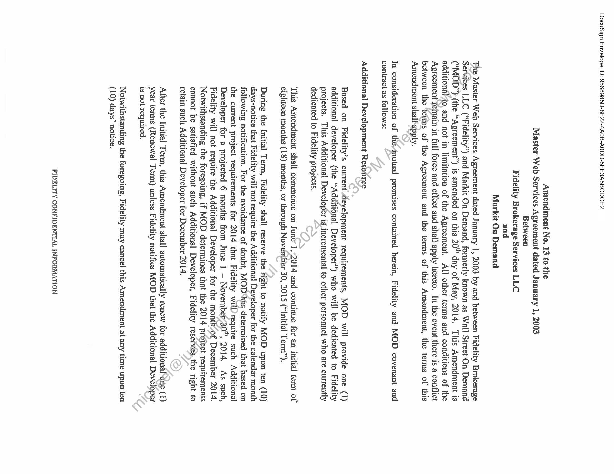
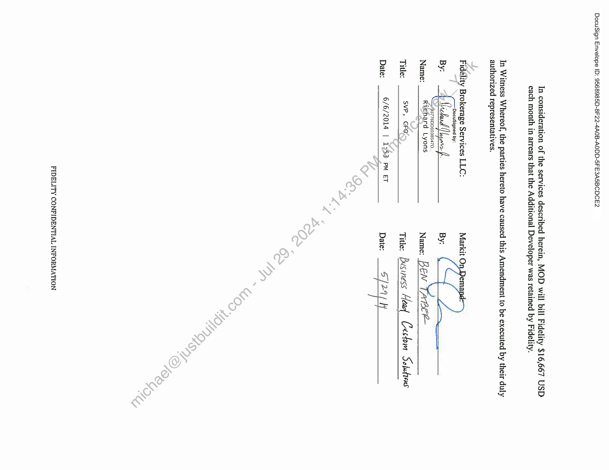
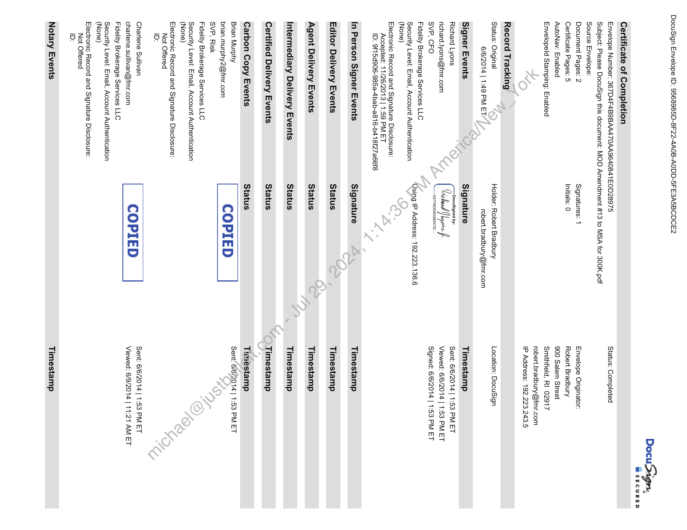
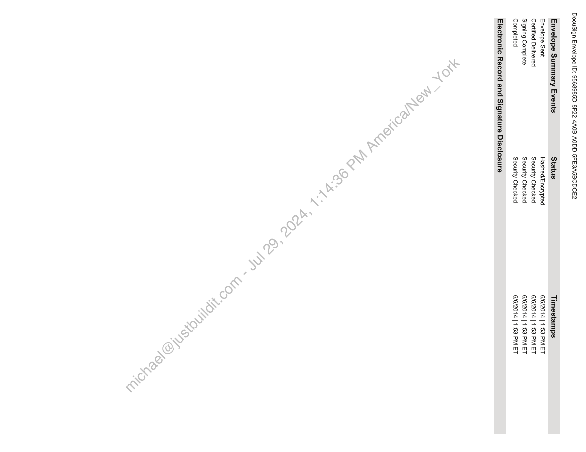
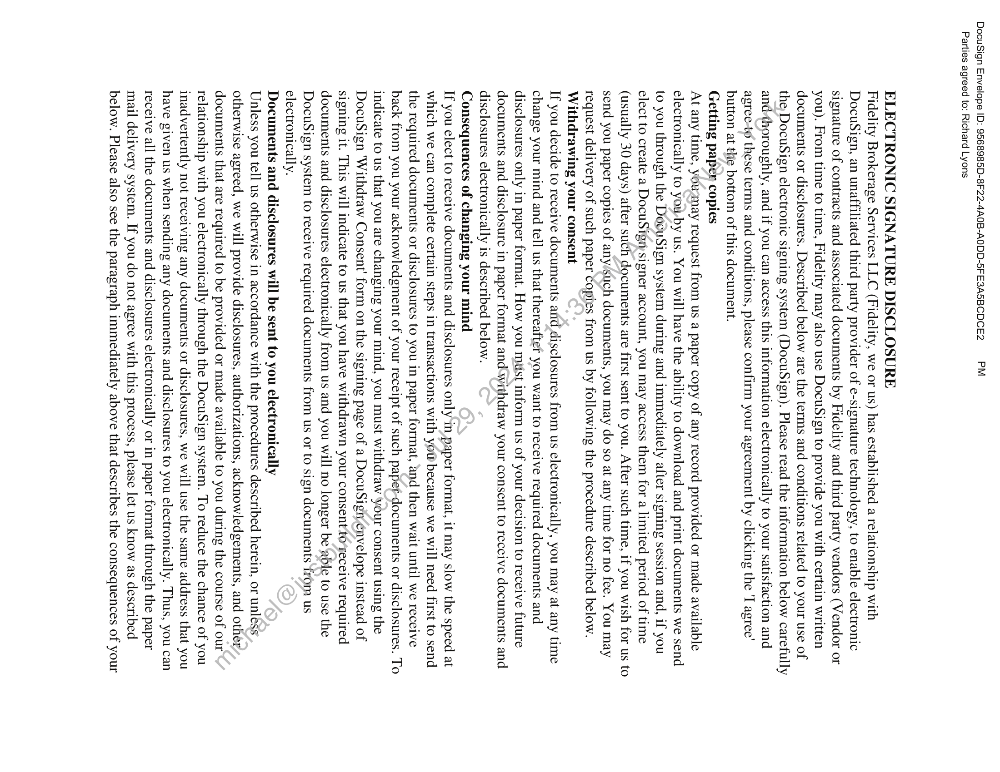
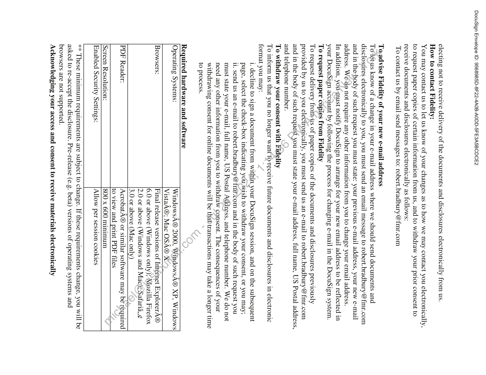
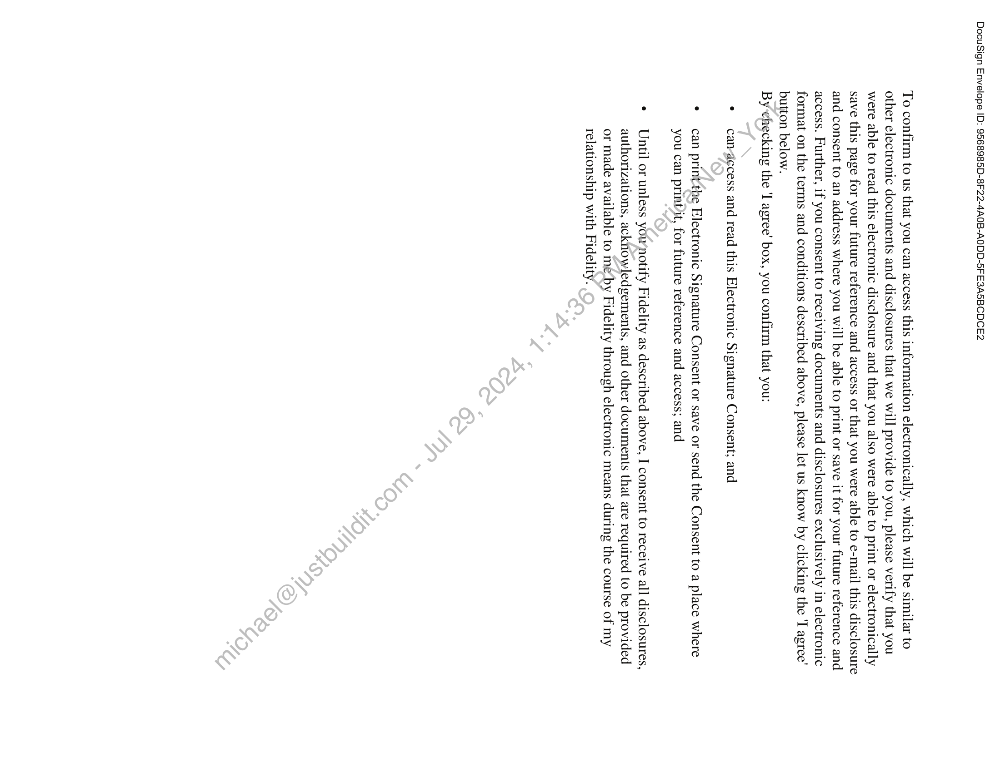

##### Amendment No. 13 to the Master Web Services Agreement]

  
````col
```col-md
flexGrow=.5
===
> [!info] [Page 1](_attachments/images_Fidelity-Brokerage-3.6.1.6.3.500191817.pdf_211302/page_1.png)
> 
```  
```col-md
DocuSign Envelope ID: 9568985D-8F22-4A0B-AODD-5FE3A5BCDCE2  
Amendment No. 13 to the
Master Web Services Agreement dated January 1, 2003
Between
Fidelity Brokerage Services LLC
and
Markit On Demand  
The Master Web Services Agreement dated January 1, 2003 by and between Fidelity Brokerage
Services LLC (‘Fidelity’) and Markit On Demand, formerly known as Wall Street On Demand
(“MOD”) (the “Agreement”) is amended on this 20 day of May, 2014. This Amendment is
additionalAo, and not in limitation of the Agreement. All other terms and conditions of the
Agreement Teinain in full force and effect and shall apply hereto. In the event there is a conflict
between the ‘terms of the Agreement and the terms of this Amendment, the terms of this
Amendment shallapply.  
In consideration of thé/mutual promises contained herein, Fidelity and MOD covenant and
contract as follows:  
Additional Development Resource  
Based on Fidelity’s current development requirements, MOD will provide one (1)
additional developer (the “Additional Developer”) who will be dedicated to Fidelity
projects. This Additional Developer is,incremental to other personnel who are currently
dedicated to Fidelity projects.  
This Amendment shall commence on June’ !,2014 and continue for an initial term of
eighteen months (18) months, or through November 30, 2015 (“Initial Term”).  
During the Initial Term, Fidelity shall reserve the right to notify MOD upon ten (10)
days-notice that Fidelity will not require the Additional Developer for the calendar month
following notification. For the avoidance of doubt, MOD«has determined that based on
the current project requirements for 2014 that Fidelity wil require such Additional
Developer for a projected 6 months from June 1 — November 30", 2014. As such,
Fidelity will not require the Additional Developer for the month’of December 2014.
Notwithstanding the foregoing, if MOD determines that the 2014 project requirements
cannot be satisfied without such Additional Developer, Fidelity reserves.the right to
retain such Additional Developer for December 2014.  
After the Initial Term, this Amendment shall automatically renew for additional-one (1)
year terms (Renewal Term) unless Fidelity notifies MOD that the Additional Developer  
is not required.  
Notwithstanding the foregoing, Fidelity may cancel this Amendment at any time upon ten
(10) days’ notice.  
FIDELITY CONFIDENTIAL INFORMATION  
```
````
Notes:    
````col
```col-md
flexGrow=.5
===
> [!info] [Page 2](_attachments/images_Fidelity-Brokerage-3.6.1.6.3.500191817.pdf_211302/page_2.png)
> 
```  
```col-md
DocuSign Envelope ID: 9568985D-8F22-4A0B-AODD-5FE3ASBCDCE2  
In consideration of the services described herein, MOD will bill Fidelity $16,667 USD
each month in arrears that the Additional Developer was retained by Fidelity.  
In Witness Whereof, the parties hereto have caused this Amendment to be executed by their duly
authorized representatives.  
Fidelity Brokerage Services LLC: Markit On Dema:  
DocuSigned by:  
93776DD6938547D.  
Name: ___Rishard tyons Name: BEM TAPER  
Title: ___ SVP» FO Title: Business Hea Custom Soletens  
Date: 6/6/2014 | 1753 pm eT Date: 9, [204 if  
FIDELITY CONFIDENTIAL INFORMATION  
```
````
Notes:    
````col
```col-md
flexGrow=.5
===
> [!info] [Page 3](_attachments/images_Fidelity-Brokerage-3.6.1.6.3.500191817.pdf_211302/page_3.png)
> 
```  
```col-md
DocuSign Envelope ID: 9568985D-8F22-4A0B-AODD-5FE3ASBCDCE2  
Certificate of Completion  
Envelope Number: 367D4F4B9BAA470AA9640841E0D28975
Subject: Please DocuSign this document: MOD Amendment #13 to MSA for 300K.pdf  
Source Envelope:  
Document Pages: 2  
Certificate Pages: 5  
AutoNav: Enabled  
Envelopeld Stamping: Enabled  
Record Tracking  
Status: Original
6/6/2014 | 1:49 PM ET.  
Signer Events  
Richard Lyons
richard.lyons@fmr.com  
SVP, CFO  
Fidelity Brokerage Services LLC  
Security Level: Email, Account Authentication
(None)  
Electronic Record and Signature Disclosure:
Accepted: 11/26/2013 | 1:59 PM ET
ID: 9f15d906-985a-4bab-a816-b4 18f27a66f8  
In Person Signer Events
Editor Delivery Events
Agent Delivery Events
Intermediary Delivery Events
Certified Delivery Events  
Carbon Copy Events  
Brian Murphy
brian.murphy2@fmr.com  
SVP, Risk  
Fidelity Brokerage Services LLC  
Security Level: Email, Account Authentication
(None)  
Electronic Record and Signature Disclosure:
Not Offered
ID:  
Charlene Sullivan
charlene.sullivan@fmr.com
Fidelity Brokerage Services LLC  
Security Level: Email, Account Authentication
(None)  
Electronic Record and Signature Disclosure:
Not Offered
ID:  
Notary Events  
Signatures: 1
Initials: 0  
Holder: Robert Bradbury
robert.bradbury@fmr.com  
Signature  
03776DD6038547D.  
Using IP Address: 192.223.136.6  
Signature
Status
Status
Status
Status  
Status  
COPIED |  
COPIED |  
Docu Sign,  
MsecuRED  
Status: Completed  
Envelope Originator:
Robert Bradbury  
900 Salem Street
Smithfield, RI 02917
robert.bradbury@fmr.com
IP Address: 192.223.243.5  
Location: DocuSign  
Timestamp  
Sent: 6/6/2014 | 1:53 PM ET
Viewed: 6/6/2014 | 1:53 PM ET
Signed: 6/6/2014 | 1:53 PM ET  
Timestamp
Timestamp
Timestamp
Timestamp
Timestamp  
Timestamp
Sent! 6/6/2014 | 1:53 PM ET  
Sent: 6/6/2014 | 1:53 PM ET
Viewed: 6/9/2014 | 11:21 AM ET  
Timestamp  
```
````
Notes:    
````col
```col-md
flexGrow=.5
===
> [!info] [Page 4](_attachments/images_Fidelity-Brokerage-3.6.1.6.3.500191817.pdf_211302/page_4.png)
> 
```  
```col-md
DocuSign Envelope ID: 9568985D-8F22-4A0B-AODD-5FE3ASBCDCE2  
Envelope Summary Events Status  
Envelope Sent Hashed/Encrypted
Certified Delivered Security Checked
Signing Complete Security Checked
Completed Security Checked  
Electronic Record and Signature Disclosure  
Timestamps  
6/6/2014 | 1:53 PM ET
6/6/2014 | 1:53 PM ET
6/6/2014 | 1:53 PM ET
6/6/2014 | 1:53 PM ET  
```
````
Notes:    
````col
```col-md
flexGrow=.5
===
> [!info] [Page 5](_attachments/images_Fidelity-Brokerage-3.6.1.6.3.500191817.pdf_211302/page_5.png)
> 
```  
```col-md
DocuSign Envelope ID: 9568985D-8F22-4A0B-AODD-5FE3A5BCDCE2 PM
Parties agreed to: Richard Lyons  
ELECTRONIC SIGNATURE DISCLOSURE  
Fidelity Brokerage Services LLC (Fidelity, we or us) has established a relationship with
DocuSign, an unaffiliated third party provider of e-signature technology, to enable electronic
signature of contracts and associated documents by Fidelity and third party vendors (Vendor or
you). From time to time, Fidelity may also use DocuSign to provide you with certain written
documents or disclosures. Described below are the terms and conditions related to your use of
the, DocuSign electronic signing system (DocuSign). Please read the information below carefully
and-thoroughly, and if you can access this information electronically to your satisfaction and
agree-to these terms and conditions, please confirm your agreement by clicking the 'I agree'
button at the bottom of this document.  
Getting paper copies  
At any time, yousmay request from us a paper copy of any record provided or made available
electronically to youw-by us. You will have the ability to download and print documents we send
to you through the DocuSign system during and immediately after signing session and, if you
elect to create a DocuSign signer account, you may access them for a limited period of time
(usually 30 days) after such documents are first sent to you. After such time, if you wish for us to
send you paper copies of any/such documents, you may do so at any time for no fee. You may
request delivery of such paper Copies from us by following the procedure described below.
Withdrawing your consent  
If you decide to receive documents afid disclosures from us electronically, you may at any time
change your mind and tell us that thereafter you want to receive required documents and
disclosures only in paper format. How you must inform us of your decision to receive future
documents and disclosure in paper format and\withdraw your consent to receive documents and
disclosures electronically is described below.  
Consequences of changing your mind  
If you elect to receive documents and disclosures only in paper format, it may slow the speed at
which we can complete certain steps in transactions with yow because we will need first to send
the required documents or disclosures to you in paper format, and then wait until we receive
back from you your acknowledgment of your receipt of such papet-documents or disclosures. To
indicate to us that you are changing your mind, you must withdraw your consent using the
DocuSign 'Withdraw Consent’ form on the signing page of a DocuSign’énvelope instead of
signing it. This will indicate to us that you have withdrawn your consent to‘receive required
documents and disclosures electronically from us and you will no longer beable to use the
DocuSign system to receive required documents from us or to sign documents from us
electronically.  
Documents and disclosures will be sent to you electronically  
Unless you tell us otherwise in accordance with the procedures described herein, or unless
otherwise agreed, we will provide disclosures, authorizations, acknowledgements, and other
documents that are required to be provided or made available to you during the course of our
relationship with you electronically through the DocuSign system. To reduce the chance of you
inadvertently not receiving any documents or disclosures, we will use the same address that you
have given us when sending any documents and disclosures to you electronically. Thus, you can
receive all the documents and disclosures electronically or in paper format through the paper
mail delivery system. If you do not agree with this process, please let us know as described
below. Please also see the paragraph immediately above that describes the consequences of your  
```
````
Notes:    
````col
```col-md
flexGrow=.5
===
> [!info] [Page 6](_attachments/images_Fidelity-Brokerage-3.6.1.6.3.500191817.pdf_211302/page_6.png)
> 
```  
```col-md
DocuSign Envelope ID: 9568985D-8F22-4A0B-AODD-5FE3ASBCDCE2  
electing not to receive delivery of the documents and disclosures electronically from us.  
How to contact Fidelity:  
You may contact us to let us know of your changes as to how we may contact you electronically,
to request paper copies of certain information from us, and to withdraw your prior consent to
receive documents and disclosures electronically as follows:  
To contact us by email send messages to: robert.bradbury @fmr.com  
To,advise Fidelity of your new e-mail address
Toletus know of a change in your e-mail address where we should send documents and
disclesures electronically to you, you must send an email message to robert.bradbury @fmr.com
and in the-body of such request you must state: your previous e-mail address, your new e-mail
address. We-do not require any other information from you to change your email address.
In addition, you-must notify DocuSign to arrange for your new email address to be reflected in
your DocuSign account by following the process for changing e-mail in the DocuSign system.
To request paper copies from Fidelity
To request delivery frormis of paper copies of the documents and disclosures previously
provided by us to you electronically, you must send us an e-mail to robert.bradbury @fmr.com
and in the body of such request you must state your e-mail address, full name, US Postal address,
and telephone number.
To withdraw your consent with Fidelity
To inform us that you no longer want tovreceive future documents and disclosures in electronic
format you may:
i. decline to sign a document from within your DocuSign session, and on the subsequent
page, select the check-box indicating you,wish to withdraw your consent, or you may;
ii. send us an e-mail to robert.bradbury@fmr.com and in the body of such request you
must state your e-mail, full name, US Postal Address, and telephone number. We do not
need any other information from you to withdraw consent. The consequences of your
withdrawing consent for online documents will be thattransactions may take a longer time
to process.  
Required hardware and software  
Operating Systems: WindowsA® 2000, WindowsA® XP, Windows
VistaA®; Mac OSA® X
Browsers: Final release versions of Internet ExplorerA®  
6.0 or above (Windows only); Mozilla Firefox
2.0 or above (Windows and Mac);)Safaria,,¢
3.0 or above (Mac only)  
PDF Reader: AcrobatA® or similar software may be required
to view and print PDF files  
Screen Resolution: 800 x 600 minimum  
Enabled Security Settings: Allow per session cookies  
** These minimum requirements are subject to change. If these requirements change, you will be
asked to re-accept the disclosure. Pre-release (e.g. beta) versions of operating systems and
browsers are not supported.  
Acknowledging your access and consent to receive materials electronically  
```
````
Notes:    
````col
```col-md
flexGrow=.5
===
> [!info] [Page 7](_attachments/images_Fidelity-Brokerage-3.6.1.6.3.500191817.pdf_211302/page_7.png)
> 
```  
```col-md
DocuSign Envelope ID: 9568985D-8F22-4A0B-AODD-5FE3ASBCDCE2  
To confirm to us that you can access this information electronically, which will be similar to
other electronic documents and disclosures that we will provide to you, please verify that you
were able to read this electronic disclosure and that you also were able to print or electronically
save this page for your future reference and access or that you were able to e-mail this disclosure
and consent to an address where you will be able to print or save it for your future reference and
access. Further, if you consent to receiving documents and disclosures exclusively in electronic
format on the terms and conditions described above, please let us know by clicking the 'I agree’
button below.  
By checking the 'I agree’ box, you confirm that you:  
* canraccess and read this Electronic Signature Consent; and  
* can printthe Electronic Signature Consent or save or send the Consent to a place where
you can printit, for future reference and access; and  
¢ Until or unless yownotify Fidelity as described above, I consent to receive all disclosures,
authorizations, acknowledgements, and other documents that are required to be provided
or made available to me by Fidelity through electronic means during the course of my
relationship with Fidelity.  
```
````
Notes:  


![[_attachments/Fidelity-Brokerage-3.6.1.6.3.5 00191817.pdf]