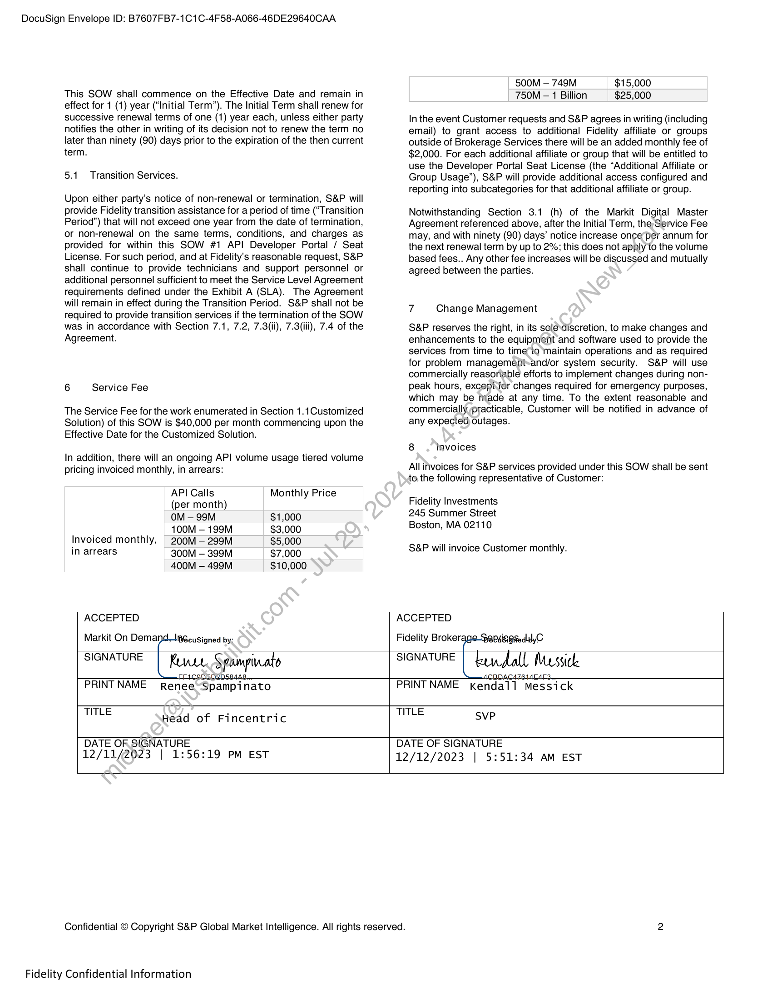

##### Statement of Work #1 - API Developer Portal / Seat License]

  
````col
```col-md
flexGrow=.5
===
> [!info] [Page 1](_attachments/images_Fidelity-Brokerage-3.6.1.6.3.600191830.pdf_210217/page_1.png)
> 
```  
```col-md
DocuSign Envelope ID: B7607FB7-1C1C-4F58-A066-46DE29640CAA  
S&P Global
Market Intelligence  
STATEMENT OF WORK #1
API Developer Portal / Seat License  
This Statement of Work (“SOW”) is entered into between Markit On
Demand, Inc. (“S&P”) and Fidelity Brokerage Services LLC,
(“Customer”) pursuant to, and incorporating by reference all terms
and conditions of the Markit Digital API Dev Portal Only Master
Agreement between Markit On Demand, Inc. and Customer dated
December 4, 2023(the “Agreement”). References to “MOD”
I“Markit” / “IHS Markit” / “S&P” and “Subscriber” / “Client” /
“Customer” or “Fidelity’(as the case may be in the Agreement) shall
be read, for the purpose of this SOW, to mean “S&P” and
“Customer” as defined herein.  
This SOW constitutes a separate agreement between S&P and
Customer for the services described herein. The parties agree that
this SOW and the services provided hereunder are subject to the
terms and conditions of the Agreement, incorporated into this SOW
by reference. In case of inconsistency between the terms of the
Agreement and the terms of this SOW, the terms of this SOW shall
prevail. All capitalized terms used but not defined in this SOW shall
have the meanings given to such terms in the Agreement.  
This SOW commences on December 18,2023 (“Effective Date’).  
Project Description  
14 Customized Solution  
S&P will provide an API seat license to Customer (including
enterprise technology personnel who support Brokerage Services)
(the “Developer Portal Seat License”).  
The Developer Portal Seat License is a SaaS-based portal allowing
Customer access to a large library of APIs. Under this seat license,
Customer will gain access to S&P’s library of Platform APIs, which
are reusable APIs across data (vendor specific APIs that‘require
entitlements to access) and service (additional value add.services
to connect to S&Ps backend capabilities) APIs. As new reusable
APIs are created by S&P, Customer will have access to them in the
Developer Portal Seat License to utilize. Includediin.this seat license
will be general maintenance and technology modernization efforts
to ensure the APIs are up to current standard_practices.  
The Developer Portal Seat License.allows access to entitled APIs
residing on the Portal, which.\include both Fidelity-specific
(“Custom”) and client-agnostic APIs (“Platform”) for use in all three
environments (Development; QA and Production).  
For the avoidance of.doubt, nothing in this SOW shall amend any
previously executed-agreement or SOW, unless specifically stated
herein. This includes, but is not limited to, any SOWs for Custom
APIs that reference the Master Web Services Agreement between
the parties, dated January 1, 2003.  
The Developer Portal Seat License includes documentation of APIs.
S&P will provide standard Managed Services package to support
the production support layer of APIs.  
S&P will also support additional future groups within Fidelity to use
the Developer Portal Seat License with access and reporting into
subcategories (the “Additional Fidelity Group Usage”).  
Confidential © Copyright S&P Global Market Intelligence. All rights reserved.  
Fidelity Confidential Information  
1.2 Assumptions  
e S&P will provide access to all available and Customer
entitled APIs on the Markit Digital Developer Portal (the
“Portal”) assuming Customer has appropriate data
licenses in place. Customer will be responsible for
ensuring appropriate entitlement permissions and use for
the data are in place.  
e Access and review of API documentation for each API will
be provided.  
e Future API Versioning will be handled by S&P’s standard
versioning procedure, which includes version numbers
(such as v1 or v2) and releases will be numbered with the
following format: <major>.<minor>.<pateh>.  
e S&P will not support more than two major versions of an
API at one time and will provide formal notification
following a Production release to migrate users off
previous major versions before any planned retirement of
a previous version.  
o  Majore version bumps are defined as an
architecture from the ground up resulting in an
‘API structure not compatible with its current.  
©, “Minor version bumps are defined as
functionality added in a backwards compatible
manner (e.g. new endpoints, methods, inputs
and/or outputs).  
o Patch version bumps are defined as backwards
compatible fixes.  
e Ongoing maintenance and future modernization efforts
for APIs in the Portal will be handled as part of this SOW.  
e Any feature changes to APIs such as new
customizations, enhancements, additional data or
request that would change the initial makeup of an API
are not in scope. These changes will be handled
separately and outside of this SOW.  
e Any new request to build a new Custom API will be
handled separately and outside of this SOW.  
e S&P will provide monthly usage metrics for standard
reporting.  
o _XREF API calls will not be included in APIs total
calls.
2 Redundancy
The Customized Solution will be operational in all of S&P managed
data centers.
3 Reporting
S&P will provide its standard reporting package when the  
Customized Solution is running in production.  
4 Content  
Customer will be responsible for licensing and providing all data,
content and fonts required for this project. S&P can recommend and
make introductions to appropriate providers, but Customer will be
responsible for all agreements with and payments to such providers.  
5 Term  
```
````
Notes:    
````col
```col-md
flexGrow=.5
===
> [!info] [Page 2](_attachments/images_Fidelity-Brokerage-3.6.1.6.3.600191830.pdf_210217/page_2.png)
> 
```  
```col-md
DocuSign Envelope ID: B7607FB7-1C1C-4F58-A066-46DE29640CAA  
This SOW shall commence on the Effective Date and remain in
effect for 1 (1) year (“Initial Term”). The Initial Term shall renew for
successive renewal terms of one (1) year each, unless either party
notifies the other in writing of its decision not to renew the term no
later than ninety (90) days prior to the expiration of the then current
term.  
5.1 Transition Services.  
Upon either party's notice of non-renewal or termination, S&P will
provide Fidelity transition assistance for a period of time (“Transition
Period”) that will not exceed one year from the date of termination,
or non-renewal on the same terms, conditions, and charges as
provided for within this SOW #1 API Developer Portal / Seat
License. For such period, and at Fidelity’s reasonable request, S&P
shall continue to provide technicians and support personnel or
additional personnel sufficient to meet the Service Level Agreement
requirements defined under the Exhibit A (SLA). The Agreement
will remain in effect during the Transition Period. S&P shall not be
required to provide transition services if the termination of the SOW
was in accordance with Section 7.1, 7.2, 7.3(ii), 7.3(iii), 7.4 of the
Agreement.  
6 Service Fee  
The Service Fee for the work enumerated in Section 1.1Customized
Solution) of this SOW is $40,000 per month commencing upon the
Effective Date for the Customized Solution.  
In addition, there will an ongoing API volume usage tiered volume
pricing invoiced monthly, in arrears:  
500M — 749M $15,000
750M — 1 Billion $25,000  
In the event Customer requests and S&P agrees in writing (including
email) to grant access to additional Fidelity affiliate or groups
outside of Brokerage Services there will be an added monthly fee of
$2,000. For each additional affiliate or group that will be entitled to
use the Developer Portal Seat License (the “Additional Affiliate or
Group Usage”), S&P will provide additional access configured and
reporting into subcategories for that additional affiliate or group.  
Notwithstanding Section 3.1 (h) of the Markit Digital Master
Agreement referenced above, after the Initial Term, the Service Fee
may, and with ninety (90) days’ notice increase once’per annum for
the next renewal term by up to 2%; this does not apply to the volume
based fees.  
 Any other fee increases will be discussed and mutually
agreed between the parties.  
7 Change Management  
S&P reserves the right, in its sole.discretion, to make changes and
enhancements to the equipment and software used to provide the
services from time to timeto maintain operations and as required
for problem managemeni»and/or system security. S&P will use
commercially reasonable efforts to implement changes during nonpeak hours, excepifor changes required for emergency purposes,
which may be made at any time. To the extent reasonable and
commercially practicable, Customer will be notified in advance of
any expected outages.  
8 invoices  
All invoices for S&P services provided under this SOW shall be sent
to. the following representative of Customer:  
API Calls Monthly Price a
(per month) Fidelity Investments
OM — 99M $1,000 245 Summer Street
100M — 199M $3,000 Boston, MA 02110  
Invoiced monthly, _  
in arrears y 200M _ 20M eo S&P will invoice Customer monthly.
400M — 499M $10,000  
ACCEPTED ACCEPTED  
Markit On Demai IS cuSigned by:  
Fidelity Broker:  
EMG RedldyC  
SIGNATURE Kune. Spampinato  
FEICOnENDSs4a8  
SIGNATURE kendall Messick
BAAEAE3,  
PRINTNAME Renee “Spampinato  
n
PRINTNAME Kendall Messick  
TITLE . .
Head of Fincentric  
TITLE SVP  
DATE OF, SIGNATURE
12/11/2023 | 1:56:19 PM EST  
DATE OF SIGNATURE
12/12/2023 | 5:51:34 AM EST  
Confidential © Copyright S&P Global Market Intelligence. All rights reserved. 2  
Fidelity Confidential Information  
```
````
Notes:  


![[_attachments/Fidelity-Brokerage-3.6.1.6.3.6 00191830.pdf]