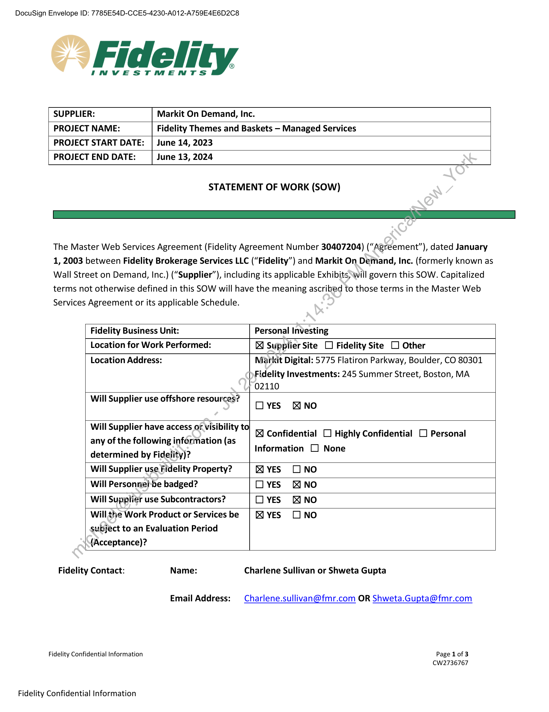
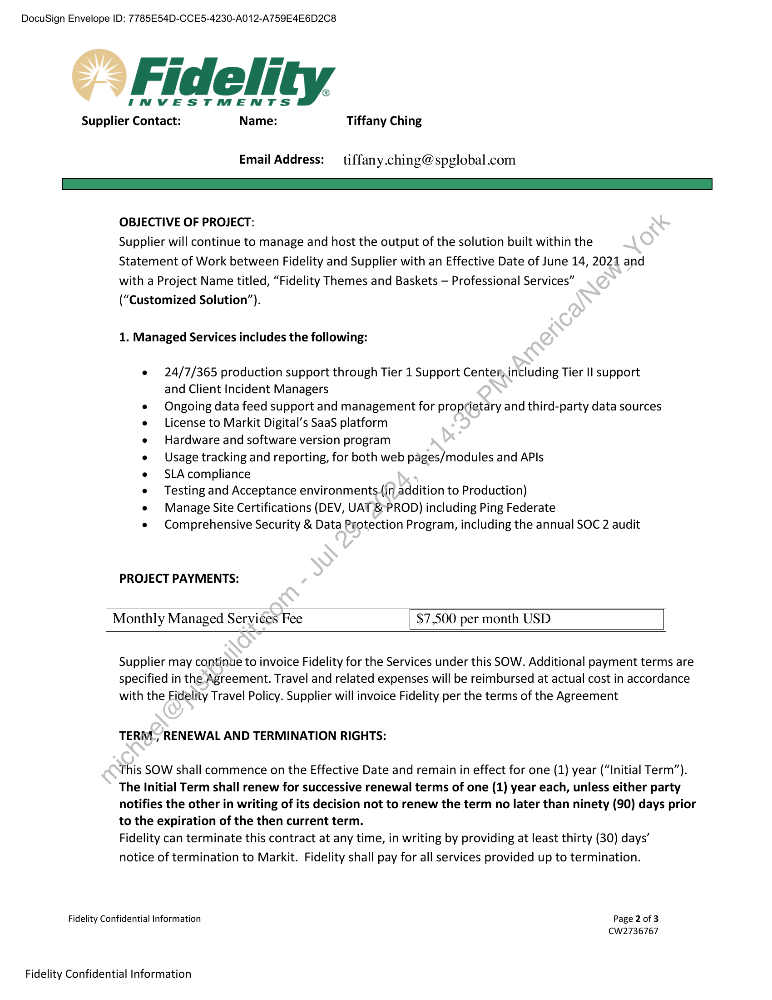
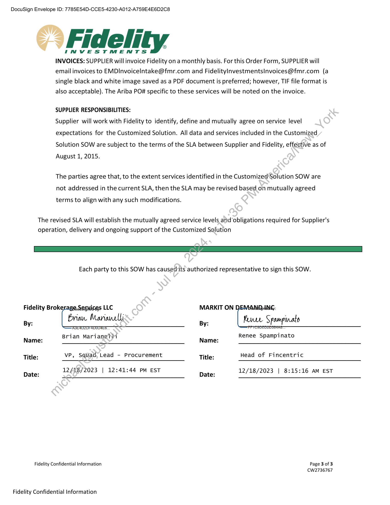
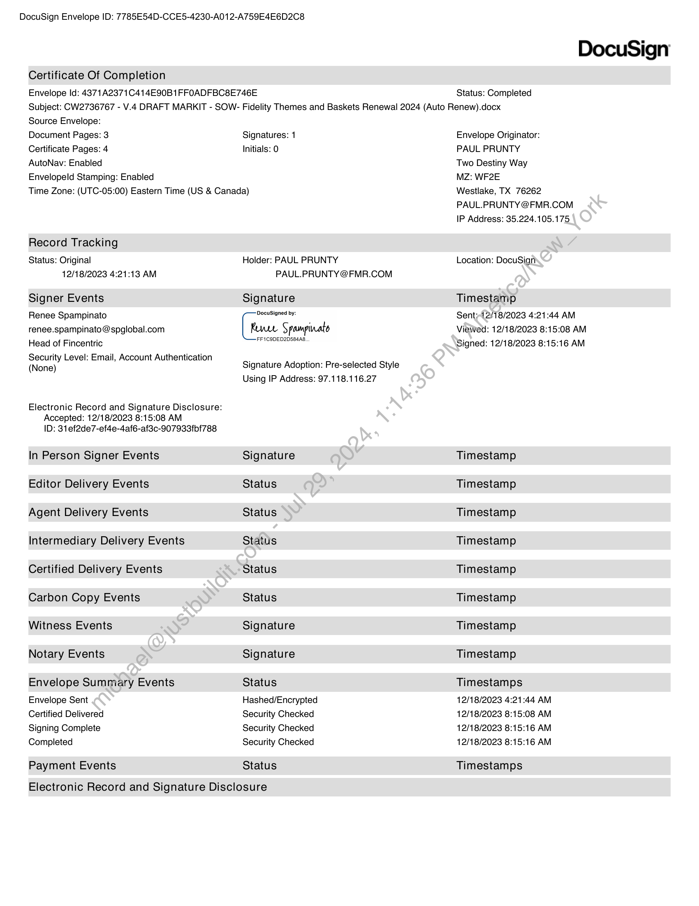
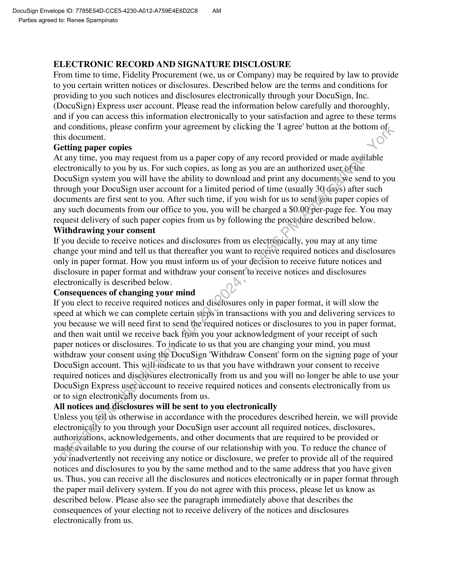
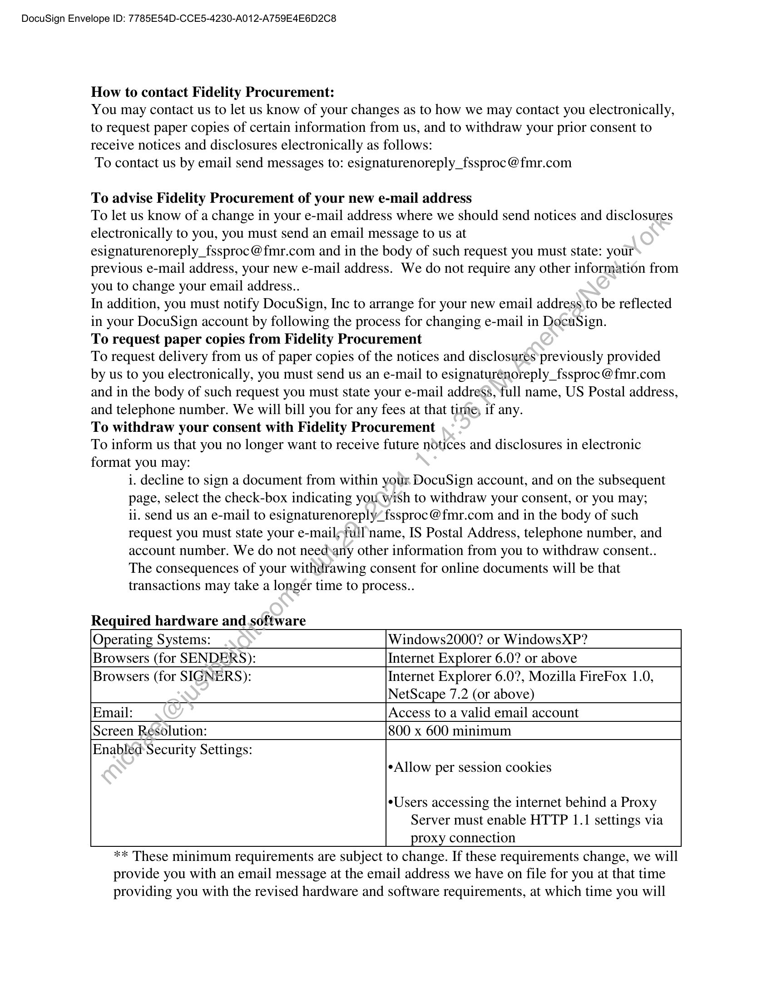
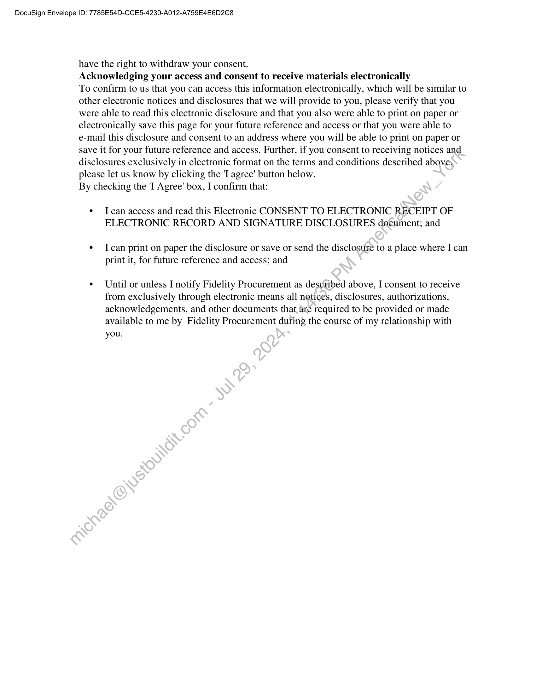

##### Statement of Work (SOW) for Fidelity Themes and Baskets — Managed Services]

  
````col
```col-md
flexGrow=.5
===
> [!info] [Page 1](_attachments/images_Fidelity-Brokerage-3.6.1.6.3.700191816.pdf_210045/page_1.png)
> 
```  
```col-md
DocuSign Envelope ID: 7785E54D-CCE5-4230-A012-A759E4E6D2C8  
-> Fidelity  
INVESTMENTS  
SUPPLIER:  
Markit On Demand, Inc.  
PROJECT NAME:  
Fidelity Themes and Baskets — Managed Services  
PROJECT START DATE:  
June 14, 2023  
PROJECT END DATE:  
June 13, 2024  
STATEMENT OF WORK (SOW)  
The Master Web Services Agreement (Fidelity Agreement Number 30407204) (“Agreement”), dated January  
1, 2003 between Fidelity Brokerage Services LLC (“Fidelity”) and Markit On Demand, Inc. (formerly known as  
Wall Street on Demand, Inc.) (“Supplier”), including its applicable Exhibits, will govern this SOW. Capitalized
terms not otherwise defined in this SOW will have the meaning ascribed to those terms in the Master Web
Services Agreement or its applicable Schedule.  
Fidelity Business Unit:  
Personal Investing  
Location for Work Performed:  
& Supplier Site LO Fidelity Site [1 Other  
Location Address:  
Markit Digital: 5775 Flatiron Parkway, Boulder, CO 80301
Fidelity Investments: 245 Summer Street, Boston, MA  
02110  
Will Supplier use offshore resources?  
YES NO  
Will Supplier have access or visibility to
any of the following information (as
determined by Fidelity)?  
& Confidential LO Highly Confidential
Information LJ None  
Personal  
Will Supplier use Fidelity Property? & YES NO
Will Personnel-be badged? YES NO
Will Supplier use Subcontractors? YES MNO
Will the Work Product or Servicesbe | KI YES [INO
subject to an Evaluation Period
(Acceptance)?
Fidelity Contact: Name: Charlene Sullivan or Shweta Gupta  
Email Address: Charlene.sullivan@fmr.com OR Shweta.Gupta@fmr.com  
Fidelity Confidential Information  
Fidelity Confidential Information  
Page 1 of 3
CW2736767  
```
````
Notes:    
````col
```col-md
flexGrow=.5
===
> [!info] [Page 2](_attachments/images_Fidelity-Brokerage-3.6.1.6.3.700191816.pdf_210045/page_2.png)
> 
```  
```col-md
DocuSign Envelope ID: 7785E54D-CCE5-4230-A012-A759E4E6D2C8  
©” Fidelity  
INVESTMENTS
Supplier Contact: Name: Tiffany Ching  
Email Address: _ tiffany.ching@spglobal.com  
OBJECTIVE OF PROJECT:  
Supplier will continue to manage and host the output of the solution built within the
Statement of Work between Fidelity and Supplier with an Effective Date of June 14, 2021 and
with a Project Name titled, “Fidelity Themes and Baskets — Professional Services”
(“Customized Solution”).  
1. Managed Services includes the following:  
e 24/7/365 production support through Tier 1 Support Center; including Tier II support
and Client Incident Managers  
e Ongoing data feed support and management for proprietary and third-party data sources  
e License to Markit Digital’s SaaS platform  
e Hardware and software version program  
e Usage tracking and reporting, for both web pages/modules and APIs  
e SLAcompliance  
e Testing and Acceptance environments.(in addition to Production)  
e Manage Site Certifications (DEV, UAT & PROD) including Ping Federate  
e Comprehensive Security & Data Protection Program, including the annual SOC 2 audit  
PROJECT PAYMENTS:  
Monthly Managed Services Fee $7,500 per month USD  
Supplier may continue to invoice Fidelity for the Services under this SOW. Additional payment terms are
specified in the Agreement. Travel and related expenses will be reimbursed at actual cost in accordance
with the Fidelity Travel Policy. Supplier will invoice Fidelity per the terms of the Agreement  
TERWL, RENEWAL AND TERMINATION RIGHTS:  
This SOW shall commence on the Effective Date and remain in effect for one (1) year (“Initial Term”).
The Initial Term shall renew for successive renewal terms of one (1) year each, unless either party
notifies the other in writing of its decision not to renew the term no later than ninety (90) days prior
to the expiration of the then current term.  
Fidelity can terminate this contract at any time, in writing by providing at least thirty (30) days’  
notice of termination to Markit. Fidelity shall pay for all services provided up to termination.  
Fidelity Confidential Information Page 2 of 3
CW2736767  
Fidelity Confidential Information  
```
````
Notes:    
````col
```col-md
flexGrow=.5
===
> [!info] [Page 3](_attachments/images_Fidelity-Brokerage-3.6.1.6.3.700191816.pdf_210045/page_3.png)
> 
```  
```col-md
DocuSign Envelope ID: 7785E54D-CCE5-4230-A012-A759E4E6D2C8  
© Fidelity  
INVESTMENTS  
INVOICES: SUPPLIER will invoice Fidelity on a monthly basis. For this Order Form, SUPPLIER will
email invoices to EMDInvoicelntake@fmr.com and FidelityInvestmentsInvoices@fmr.com (a
single black and white image saved as a PDF document is preferred; however, TIF file format is
also acceptable). The Ariba POspecific to these services will be noted on the invoice.  
SUPPLIER RESPONSIBILITIES:  
Supplier will work with Fidelity to identify, define and mutually agree on service level
expectations for the Customized Solution. All data and services included in the Customized
Solution SOW are subject to the terms of the SLA between Supplier and Fidelity, effective as of
August 1, 2015.  
The parties agree that, to the extent services identified in the Customized'Solution SOW are
not addressed in the current SLA, then the SLA may be revised based _on mutually agreed  
terms to align with any such modifications.  
The revised SLA will establish the mutually agreed service levels and obligations required for Supplier's
operation, delivery and ongoing support of the Customized Solution  
Each party to this SOW has caused-its authorized representative to sign this SOW.  
Fidelity Brokerage Segvicgs LLC MARKIT ON ANG:
By: Brian Marioncll By: Rue Spampinato  
Brian Marianeli Renee Spampinato
Name: Name:
Title: vp, Squad) Lead - Procurement Title: Head of Fincentric
12/18/2023 | 12:41:44 PM EST 215:
Date: /18/ | Date: 12/18/2023 | 8:15:16 AM EST
Fidelity Confidential Information Page 3 of 3  
CW2736767  
Fidelity Confidential Information  
```
````
Notes:    
````col
```col-md
flexGrow=.5
===
> [!info] [Page 4](_attachments/images_Fidelity-Brokerage-3.6.1.6.3.700191816.pdf_210045/page_4.png)
> 
```  
```col-md
DocuSign Envelope ID: 7785E54D-CCE5-4230-A012-A759E4E6D2C8  
DocuSign  
Certificate Of Completion  
Envelope Id: 4371A2371C414E90B1FFOADFBC8E746E Status: Completed
Subject: CW2736767 - V.4 DRAFT MARKIT - SOW- Fidelity Themes and Baskets Renewal 2024 (Auto Renew).docx
Source Envelope:  
Document Pages: 3 Signatures: 1 Envelope Originator:  
Certificate Pages: 4 Initials: 0 PAUL PRUNTY  
AutoNav: Enabled Two Destiny Way  
Envelopeld Stamping: Enabled MZ: WF2E  
Time Zone: (UTC-05:00) Eastern Time (US & Canada) Westlake, TX 76262
PAUL.PRUNTY @FMR.COM  
IP Address: 35.224.105.175  
Record Tracking  
Status: Original Holder: PAUL PRUNTY Location: DocuSign
12/18/2023 4:21:13 AM PAUL.PRUNTY @FMR.COM
Signer Events Signature Timestamp
Renee Spampinato Cesare aL Senty12/18/2023 4:21:44 AM
renee.spampinato @ spglobal.com Renee Spampinato Viewed: 12/18/2023 8:15:08 AM  
. | FFICODEDZDSG4A8
Head of Fincentric  
Security Level: Email, Account Authentication . .
(None) Signature Adoption: Pre-selected Style  
Using IP Address: 97.118.116.27  
Signed: 12/18/2023 8:15:16 AM  
Electronic Record and Signature Disclosure:
Accepted: 12/18/2023 8:15:08 AM
ID: 31 ef2de7-ef4e-4af6-af3c-907933fbf788  
In Person Signer Events Signature Timestamp
Editor Delivery Events Status Timestamp
Agent Delivery Events Status Timestamp
Intermediary Delivery Events Status Timestamp
Certified Delivery Events Status Timestamp
Carbon Copy Events Status Timestamp
Witness Events Signature Timestamp
Notary Events Signature Timestamp
Envelope Summary Events Status Timestamps
Envelope Sent Hashed/Encrypted 12/18/2023 4:21:44 AM
Certified Delivered Security Checked 12/18/2023 8:15:08 AM
Signing Complete Security Checked 12/18/2023 8:15:16 AM
Completed Security Checked 12/18/2023 8:15:16 AM
Payment Events Status Timestamps  
Electronic Record and Signature Disclosure  
```
````
Notes:    
````col
```col-md
flexGrow=.5
===
> [!info] [Page 5](_attachments/images_Fidelity-Brokerage-3.6.1.6.3.700191816.pdf_210045/page_5.png)
> 
```  
```col-md
DocuSign Envelope ID: 7785E54D-CCE5-4230-A012-A759E4E6D2C8 AM
Parties agreed to: Renee Spampinato  
ELECTRONIC RECORD AND SIGNATURE DISCLOSURE  
From time to time, Fidelity Procurement (we, us or Company) may be required by law to provide
to you certain written notices or disclosures. Described below are the terms and conditions for
providing to you such notices and disclosures electronically through your DocuSign, Inc.
(DocuSign) Express user account. Please read the information below carefully and thoroughly,
and if you can access this information electronically to your satisfaction and agree to these terms
and conditions, please confirm your agreement by clicking the 'I agree’ button at the bottom of,
this document.  
Getting paper copies  
At any time, you may request from us a paper copy of any record provided or made available
electronically to you by us. For such copies, as long as you are an authorized user_ofthe
DocuSign system you will have the ability to download and print any documents we send to you
through your DocuSign user account for a limited period of time (usually 30:days) after such
documents are first sent to you. After such time, if you wish for us to send ‘you paper copies of
any such documents from our office to you, you will be charged a $0.00 per-page fee. You may
request delivery of such paper copies from us by following the procedure described below.
Withdrawing your consent  
If you decide to receive notices and disclosures from us electronically, you may at any time
change your mind and tell us that thereafter you want to receive required notices and disclosures
only in paper format. How you must inform us of your décision to receive future notices and
disclosure in paper format and withdraw your consent to receive notices and disclosures
electronically is described below.  
Consequences of changing your mind  
If you elect to receive required notices and disclosures only in paper format, it will slow the
speed at which we can complete certain steps in transactions with you and delivering services to
you because we will need first to send the required notices or disclosures to you in paper format,
and then wait until we receive back from you your acknowledgment of your receipt of such
paper notices or disclosures. To indicate to us that you are changing your mind, you must
withdraw your consent using the DocuSign 'Withdraw Consent' form on the signing page of your
DocuSign account. This willindicate to us that you have withdrawn your consent to receive
required notices and disclosures electronically from us and you will no longer be able to use your
DocuSign Express useraccount to receive required notices and consents electronically from us
or to sign electronically documents from us.  
All notices and. disclosures will be sent to you electronically  
Unless you tellus otherwise in accordance with the procedures described herein, we will provide
electronically to you through your DocuSign user account all required notices, disclosures,
authorizations, acknowledgements, and other documents that are required to be provided or
madesavailable to you during the course of our relationship with you. To reduce the chance of
you inadvertently not receiving any notice or disclosure, we prefer to provide all of the required
notices and disclosures to you by the same method and to the same address that you have given
us. Thus, you can receive all the disclosures and notices electronically or in paper format through
the paper mail delivery system. If you do not agree with this process, please let us know as
described below. Please also see the paragraph immediately above that describes the
consequences of your electing not to receive delivery of the notices and disclosures
electronically from us.  
```
````
Notes:    
````col
```col-md
flexGrow=.5
===
> [!info] [Page 6](_attachments/images_Fidelity-Brokerage-3.6.1.6.3.700191816.pdf_210045/page_6.png)
> 
```  
```col-md
DocuSign Envelope ID: 7785E54D-CCE5-4230-A012-A759E4E6D2C8  
How to contact Fidelity Procurement:  
You may contact us to let us know of your changes as to how we may contact you electronically,
to request paper copies of certain information from us, and to withdraw your prior consent to
receive notices and disclosures electronically as follows:  
To contact us by email send messages to: esignaturenoreply_fssproc@fmr.com  
To advise Fidelity Procurement of your new e-mail address
To let us know of a change in your e-mail address where we should send notices and disclosures
electronically to you, you must send an email message to us at
esignaturenoreply_fssproc@fmr.com and in the body of such request you must state: your
previous e-mail address, your new e-mail address. We do not require any other information from
you to change your email address.  

In addition, you must notify DocuSign, Inc to arrange for your new email address\to be reflected
in your DocuSign account by following the process for changing e-mail in DocuSign.
To request paper copies from Fidelity Procurement
To request delivery from us of paper copies of the notices and disclosures previously provided
by us to you electronically, you must send us an e-mail to esignaturénoreply_fssproc@fmr.com
and in the body of such request you must state your e-mail address, ‘full name, US Postal address,
and telephone number. We will bill you for any fees at that time, if any.
To withdraw your consent with Fidelity Procurement
To inform us that you no longer want to receive future notices and disclosures in electronic
format you may:
i. decline to sign a document from within your DocuSign account, and on the subsequent
page, select the check-box indicating you wish to withdraw your consent, or you may;
ii. send us an e-mail to esignaturenoreply/ fssproc@fmr.com and in the body of such
request you must state your e-mail;full'name, IS Postal Address, telephone number, and
account number. We do not needsany other information from you to withdraw consent.  

The consequences of your withdrawing consent for online documents will be that
transactions may take a longer time to process.  
  
Required hardware and software  
Operating Systems: Windows2000? or WindowsXP?  
Browsers (for SENDERS): Internet Explorer 6.0? or above  
Browsers (for SIGNERS): Internet Explorer 6.0?, Mozilla FireFox 1.0,
NetScape 7.2 (or above)  
Email: Access to a valid email account  
Screen Resolution: 800 x 600 minimum  
Enabléd Security Settings:
eAllow per session cookies  
Users accessing the internet behind a Proxy
Server must enable HTTP 1.1 settings via
proxy connection  
** These minimum requirements are subject to change. If these requirements change, we will  
provide you with an email message at the email address we have on file for you at that time  
providing you with the revised hardware and software requirements, at which time you will  
```
````
Notes:    
````col
```col-md
flexGrow=.5
===
> [!info] [Page 7](_attachments/images_Fidelity-Brokerage-3.6.1.6.3.700191816.pdf_210045/page_7.png)
> 
```  
```col-md
DocuSign Envelope ID: 7785E54D-CCE5-4230-A012-A759E4E6D2C8  
have the right to withdraw your consent.  
Acknowledging your access and consent to receive materials electronically  
To confirm to us that you can access this information electronically, which will be similar to
other electronic notices and disclosures that we will provide to you, please verify that you
were able to read this electronic disclosure and that you also were able to print on paper or
electronically save this page for your future reference and access or that you were able to
e-mail this disclosure and consent to an address where you will be able to print on paper or
save it for your future reference and access. Further, if you consent to receiving notices and
disclosures exclusively in electronic format on the terms and conditions described above,
please let us know by clicking the 'I agree’ button below.  
By checking the 'I Agree’ box, I confirm that:  
¢ Ican access and read this Electronic CONSENT TO ELECTRONIC RECEIPT OF
ELECTRONIC RECORD AND SIGNATURE DISCLOSURES document; and  
¢ Ican print on paper the disclosure or save or send the disclosure to a place where I can
print it, for future reference and access; and  
¢ Until or unless I notify Fidelity Procurement as described above, I consent to receive
from exclusively through electronic means all notices, disclosures, authorizations,
acknowledgements, and other documents that,are required to be provided or made
available to me by Fidelity Procurement during the course of my relationship with
you.  
```
````
Notes:  


![[_attachments/Fidelity-Brokerage-3.6.1.6.3.7 00191816.pdf]