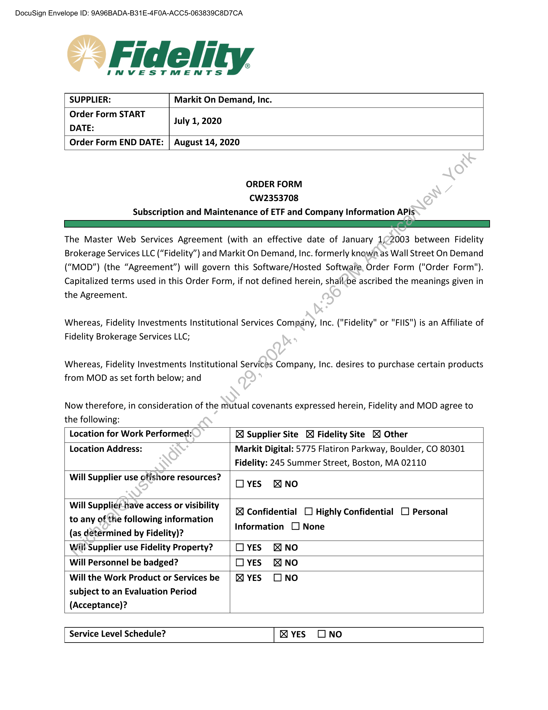
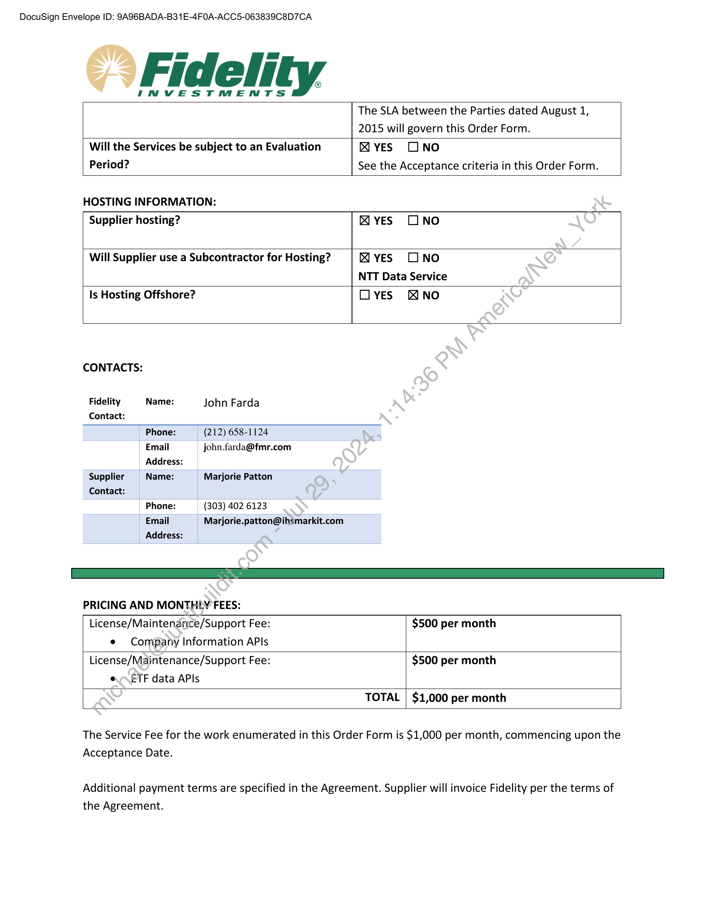
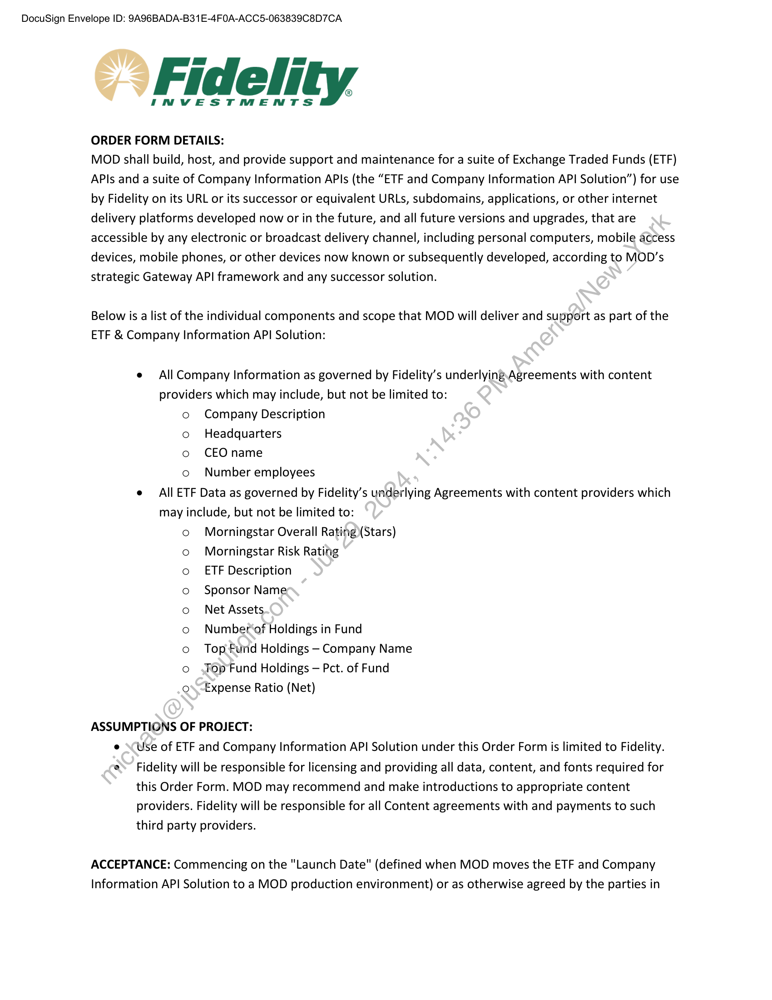
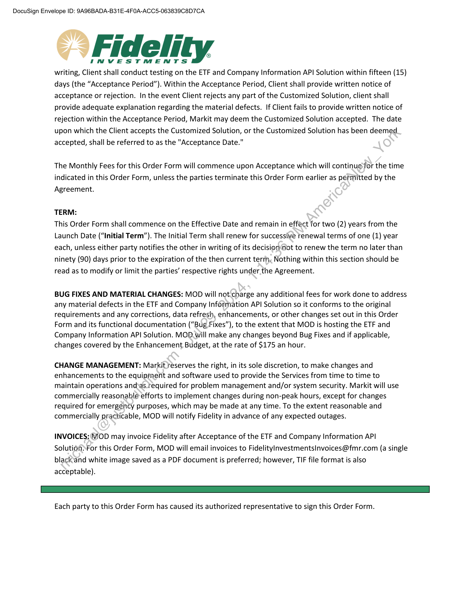
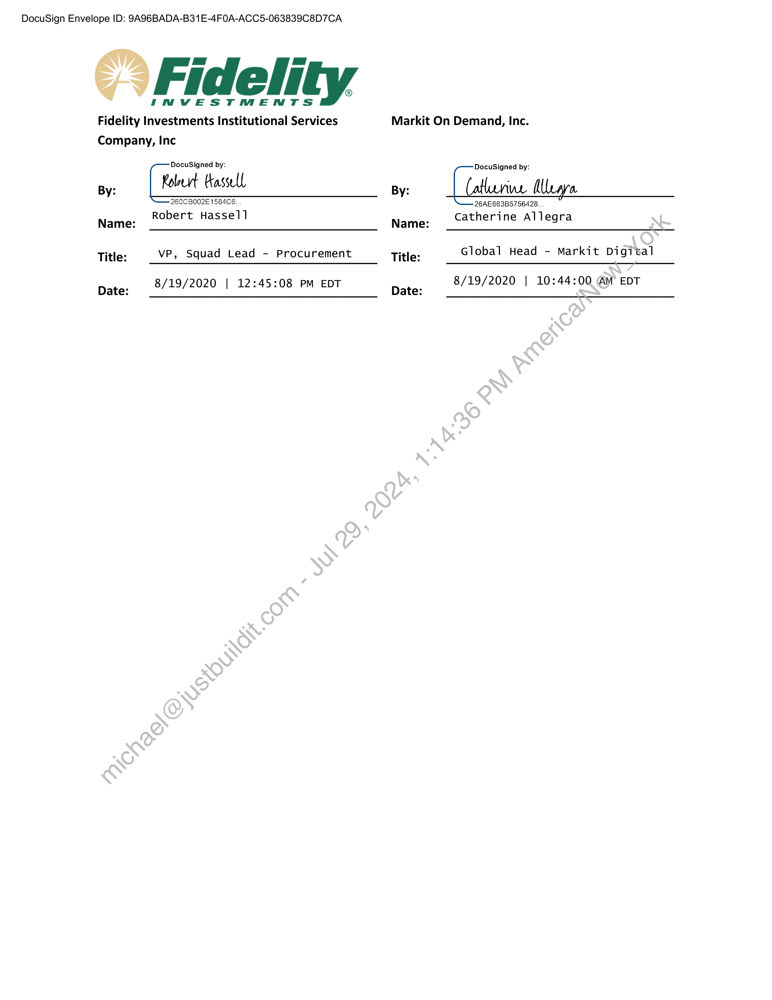
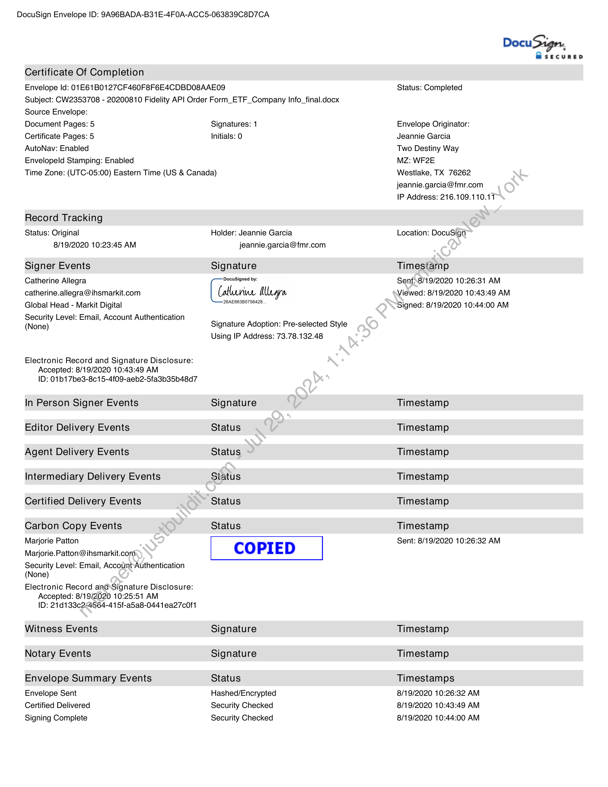
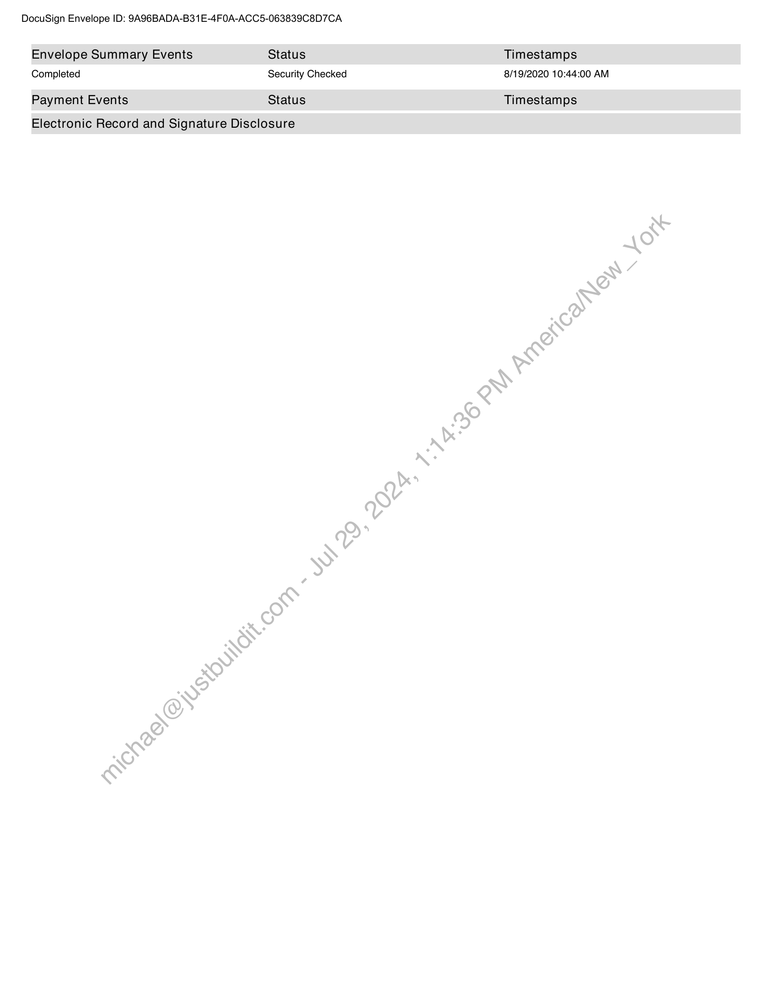
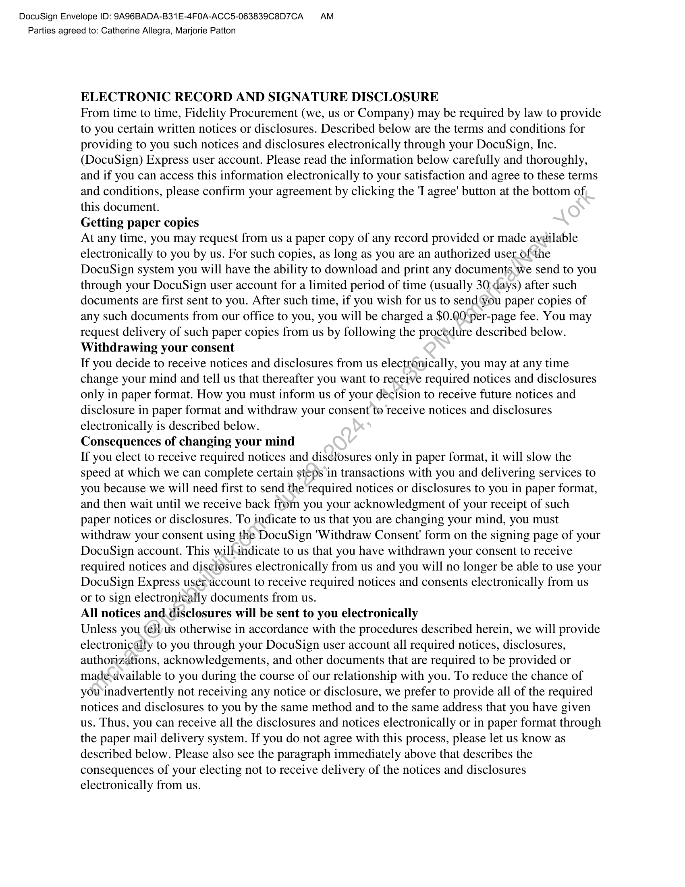
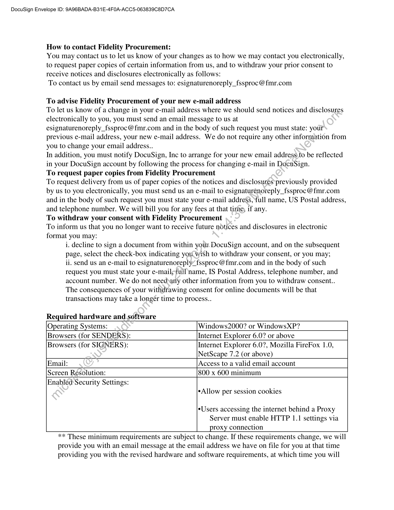
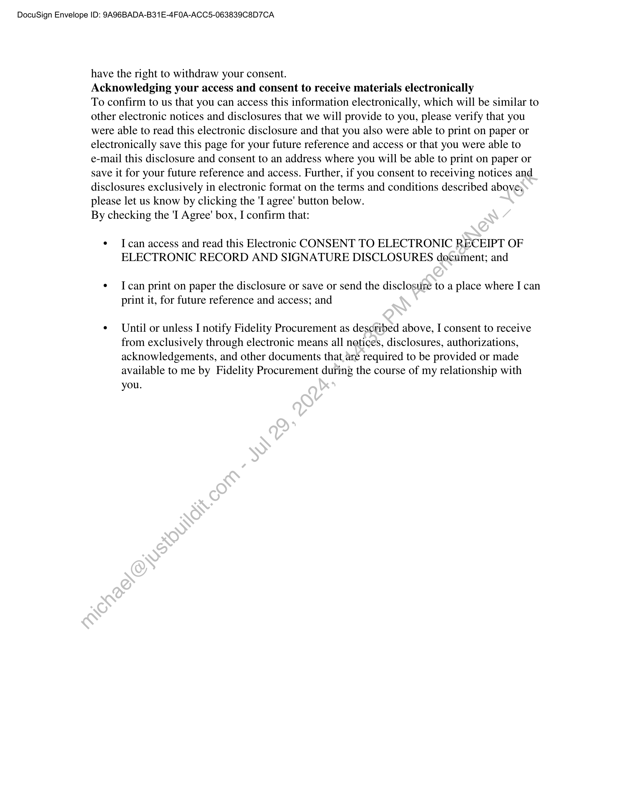

##### Order Form for Subscription and Maintenance of ETF and Company Information APIs]

  
````col
```col-md
flexGrow=.5
===
> [!info] [Page 1](_attachments/images_Fidelity-Brokerage-3.6.1.6.3.800191814.pdf_211009/page_1.png)
> 
```  
```col-md
DocuSign Envelope ID: 9A96BADA-B31E-4FOA-ACC5-063839C8D7CA  
-> Fidelity  
INVESTMENTS  
SUPPLIER: Markit On Demand, Inc.
Order Form START
July 1, 2020
DATE:
Order Form END DATE: | August 14, 2020  
ORDER FORM
CW2353708
Subscription and Maintenance of ETF and Company Information APIs  
LY oF
The Master Web Services Agreement (with an effective date of January 1/72003 between Fidelity
Brokerage Services LLC (“Fidelity”) and Markit On Demand, Inc. formerly knawnas Wall Street On Demand
(“MOD”) (the “Agreement”) will govern this Software/Hosted Software, Order Form ("Order Form").
Capitalized terms used in this Order Form, if not defined herein, shalléoe ascribed the meanings given in
the Agreement.  
Whereas, Fidelity Investments Institutional Services Company, Inc. ("Fidelity" or "FIIS") is an Affiliate of
Fidelity Brokerage Services LLC;  
Whereas, Fidelity Investments Institutional Services Company, Inc. desires to purchase certain products
from MOD as set forth below; and  
Now therefore, in consideration of the mutual covenants expressed herein, Fidelity and MOD agree to
the following:  
Location for Work Performed: & Supplier Site &X Fidelity Site XX Other  
Location Address: Markit Digital: 5775 Flatiron Parkway, Boulder, CO 80301
Fidelity: 245 Summer Street, Boston, MA 02110  
Will Supplier use offshore resources?  
DYES &NO  
Will Supplier-have access or visibility
to any of the following information
(as determined by Fidelity)?  
Will Supplier use Fidelity Property? Olyes &NO
Will Personnel be badged? Olyes &NO
Will the Work Product or Servicesbe | XI YES [INO
subject to an Evaluation Period
(Acceptance)?  
& Confidential OD Highly Confidential LO Personal
Information [None  
Service Level Schedule? RK yves ONO  
```
````
Notes:    
````col
```col-md
flexGrow=.5
===
> [!info] [Page 2](_attachments/images_Fidelity-Brokerage-3.6.1.6.3.800191814.pdf_211009/page_2.png)
> 
```  
```col-md
DocuSign Envelope ID: 9A96BADA-B31E-4FOA-ACC5-063839C8D7CA  
©” Fidelity  
INVESTMENTS  
The SLA between the Parties dated August 1,
2015 will govern this Order Form.
Will the Services be subject to an Evaluation X yes ONO  
Period? See the Acceptance criteria in this Order Form.  
HOSTING INFORMATION:
Supplier hosting? yes ONO  
Will Supplier use a Subcontractor for Hosting? KR yves LINO
NTT Data Service  
Is Hosting Offshore? Olyes MNO
CONTACTS:  
Fidelity Name: John Farda  
Contact:
Phone: (212) 658-1124
Email john.farda@fmr.com ,
Address:  
Supplier Name: Marjorie Patton  
Contact:
Phone: (303) 402 6123
Email Marjorie.patton@ihsmarkit.com
Address:  
PRICING AND MONTHLY FEES:
License/Maintenance/Support Fee: $500 per month
e Company Information APIs
License/Maintenance/Support Fee: $500 per month
e\ ETF data APIs  
TOTAL | $1,000 per month  
The Service Fee for the work enumerated in this Order Form is $1,000 per month, commencing upon the
Acceptance Date.  
Additional payment terms are specified in the Agreement. Supplier will invoice Fidelity per the terms of
the Agreement.  
```
````
Notes:    
````col
```col-md
flexGrow=.5
===
> [!info] [Page 3](_attachments/images_Fidelity-Brokerage-3.6.1.6.3.800191814.pdf_211009/page_3.png)
> 
```  
```col-md
DocuSign Envelope ID: 9A96BADA-B31E-4FOA-ACC5-063839C8D7CA  
©” Fidelity  
INVESTMENTS  
ORDER FORM DETAILS:  
MOD shall build, host, and provide support and maintenance for a suite of Exchange Traded Funds (ETF)
APls and a suite of Company Information APIs (the “ETF and Company Information API Solution”) for use
by Fidelity on its URL or its successor or equivalent URLs, subdomains, applications, or other internet
delivery platforms developed now or in the future, and all future versions and upgrades, that are
accessible by any electronic or broadcast delivery channel, including personal computers, mobile access
devices, mobile phones, or other devices now known or subsequently developed, according to MOD’s
strategic Gateway API framework and any successor solution.  
Below is a list of the individual components and scope that MOD will deliver and support as part of the
ETF & Company Information API Solution:  
e All Company Information as governed by Fidelity’s underlying Agreements with content
providers which may include, but not be limited to:
o Company Description
o Headquarters
o CEO name
o Number employees
e All ETF Data as governed by Fidelity’s underlying Agreements with content providers which
may include, but not be limited to:
Morningstar Overall Rating\(Stars)
Morningstar Risk Rating
ETF Description
Sponsor Name
Net Assets
Number‘of Holdings in Fund
Top Fund Holdings - Company Name
Top Fund Holdings — Pct. of Fund
Expense Ratio (Net)  
oO 0000 0 0 0  
ASSUMPTIONS OF PROJECT:
e \(Use of ETF and Company Information API Solution under this Order Form is limited to Fidelity.
®. Fidelity will be responsible for licensing and providing all data, content, and fonts required for
this Order Form. MOD may recommend and make introductions to appropriate content
providers. Fidelity will be responsible for all Content agreements with and payments to such
third party providers.  
ACCEPTANCE: Commencing on the "Launch Date" (defined when MOD moves the ETF and Company
Information API Solution to a MOD production environment) or as otherwise agreed by the parties in  
```
````
Notes:    
````col
```col-md
flexGrow=.5
===
> [!info] [Page 4](_attachments/images_Fidelity-Brokerage-3.6.1.6.3.800191814.pdf_211009/page_4.png)
> 
```  
```col-md
DocuSign Envelope ID: 9A96BADA-B31E-4FOA-ACC5-063839C8D7CA  
©” Fidelity  
INVESTMENTS
writing, Client shall conduct testing on the ETF and Company Information API Solution within fifteen (15)
days (the “Acceptance Period”). Within the Acceptance Period, Client shall provide written notice of
acceptance or rejection. In the event Client rejects any part of the Customized Solution, client shall
provide adequate explanation regarding the material defects. If Client fails to provide written notice of
rejection within the Acceptance Period, Markit may deem the Customized Solution accepted. The date
upon which the Client accepts the Customized Solution, or the Customized Solution has been deemed
accepted, shall be referred to as the "Acceptance Date."  
The Monthly Fees for this Order Form will commence upon Acceptance which will continuefor the time
indicated in this Order Form, unless the parties terminate this Order Form earlier as permitted by the
Agreement.  
TERM:  
This Order Form shall commence on the Effective Date and remain in effect for two (2) years from the
Launch Date (“Initial Term”). The Initial Term shall renew for successive renewal terms of one (1) year
each, unless either party notifies the other in writing of its decision‘not to renew the term no later than
ninety (90) days prior to the expiration of the then current term, Nothing within this section should be
read as to modify or limit the parties’ respective rights under, the Agreement.  
BUG FIXES AND MATERIAL CHANGES: MOD will not.charge any additional fees for work done to address
any material defects in the ETF and Company Information API Solution so it conforms to the original
requirements and any corrections, data refresh, enhancements, or other changes set out in this Order
Form and its functional documentation (“Bug Fixes”), to the extent that MOD is hosting the ETF and
Company Information API Solution. MOD will make any changes beyond Bug Fixes and if applicable,
changes covered by the Enhancement Budget, at the rate of $175 an hour.  
CHANGE MANAGEMENT: Markit reserves the right, in its sole discretion, to make changes and
enhancements to the equipment and software used to provide the Services from time to time to
maintain operations and‘as required for problem management and/or system security. Markit will use
commercially reasonable efforts to implement changes during non-peak hours, except for changes
required for emergency purposes, which may be made at any time. To the extent reasonable and
commercially practicable, MOD will notify Fidelity in advance of any expected outages.  
INVOICES: MOD may invoice Fidelity after Acceptance of the ETF and Company Information API
SolutioasFor this Order Form, MOD will email invoices to FidelityInvestmentsInvoices@fmr.com (a single
blackand white image saved as a PDF document is preferred; however, TIF file format is also
acceptable).  
Each party to this Order Form has caused its authorized representative to sign this Order Form.  
```
````
Notes:    
````col
```col-md
flexGrow=.5
===
> [!info] [Page 5](_attachments/images_Fidelity-Brokerage-3.6.1.6.3.800191814.pdf_211009/page_5.png)
> 
```  
```col-md
DocuSign Envelope ID: 9A96BADA-B31E-4FOA-ACC5-063839C8D7CA  
© Fidelity  
INVESTMENTS
Fidelity Investments Institutional Services Markit On Demand, Inc.
Company, Inc  
DocuSigned by: DocuSigned by:
bert Kassell ;
By: [toe tase By: ve Alegre
‘260CB002E1584C6. 26AE663B5756428.  
Name: Robert Hassel] Name: Catherine Allegra
Title: vp, Squad Lead - Procurement Title: Global Head - Markit Digital
8/19/2020 | 12:45:08 PM EDT 8/19/2020 | 10:44:00 (AM EDT  
Date: Date:  
```
````
Notes:    
````col
```col-md
flexGrow=.5
===
> [!info] [Page 6](_attachments/images_Fidelity-Brokerage-3.6.1.6.3.800191814.pdf_211009/page_6.png)
> 
```  
```col-md
DocuSign Envelope ID: 9A96BADA-B31E-4FOA-ACC5-063839C8D7CA  
Certificate Of Completion  
Envelope Id: 01E61B0127CF460F8F6E4CDBDO8AAE09
Subject: CW2353708 - 20200810 Fidelity API Order Form_ETF_Company Info_final.docx  
Source Envelope:  
Document Pages: 5  
Certificate Pages: 5  
AutoNav: Enabled  
Envelopeld Stamping: Enabled  
Signatures: 1
Initials: 0  
Time Zone: (UTC-05:00) Eastern Time (US & Canada)  
Record Tracking  
Status: Original
8/19/2020 10:23:45 AM  
Signer Events  
Catherine Allegra
catherine.allegra@ihsmarkit.com
Global Head - Markit Digital  
Security Level: Email, Account Authentication
(None)  
Electronic Record and Signature Disclosure:
Accepted: 8/19/2020 10:43:49 AM
ID: 01b17be3-8c15-4f09-aeb2-5fa3b35b48d7  
In Person Signer Events
Editor Delivery Events
Agent Delivery Events
Intermediary Delivery Events
Certified Delivery Events  
Carbon Copy Events
Marjorie Patton
Marjorie.Patton@ihsmarkit.com  
Security Level: Email, Account-Authentication
(None)  
Electronic Record and\Signature Disclosure:
Accepted: 8/19/2020 10:25:51 AM
ID: 21d133c¢2:4564-41 5f-a5a8-0441ea27c0f1  
Witness Events  
Notary Events  
Envelope Summary Events
Envelope Sent  
Certified Delivered
Signing Complete  
Holder: Jeannie Garcia
jeannie.garcia@fmr.com  
Signature
Docusigned by
Catlurive Alegre  
26AE663B5756428,  
Signature Adoption: Pre-selected Style
Using IP Address: 73.78.132.48  
Signature
Status
Status
Status
Status  
Status  
COPIED  
Signature
Signature  
Status
Hashed/Encrypted
Security Checked
Security Checked  
DocuSign,  
MsecurReD  
Status: Completed  
Envelope Originator:
Jeannie Garcia  
Two Destiny Way  
MZ: WF2E  
Westlake, TX 76262
jeannie.garcia@fmr.com  
IP Address: 216.109.110.11  
Location: DocuSign  
Timestamp  
Sents8/19/2020 10:26:31 AM
Viewed: 8/19/2020 10:43:49 AM
Signed: 8/19/2020 10:44:00 AM  
Timestamp
Timestamp
Timestamp
Timestamp
Timestamp  
Timestamp
Sent: 8/19/2020 10:26:32 AM  
Timestamp
Timestamp  
Timestamps  
8/19/2020 10:26:32 AM
8/19/2020 10:43:49 AM
8/19/2020 10:44:00 AM  
```
````
Notes:    
````col
```col-md
flexGrow=.5
===
> [!info] [Page 7](_attachments/images_Fidelity-Brokerage-3.6.1.6.3.800191814.pdf_211009/page_7.png)
> 
```  
```col-md
DocuSign Envelope ID: 9A96BADA-B31E-4FOA-ACC5-063839C8D7CA  
Envelope Summary Events Status Timestamps
Completed Security Checked 8/19/2020 10:44:00 AM
Payment Events Status Timestamps  
Electronic Record and Signature Disclosure  
```
````
Notes:    
````col
```col-md
flexGrow=.5
===
> [!info] [Page 8](_attachments/images_Fidelity-Brokerage-3.6.1.6.3.800191814.pdf_211009/page_8.png)
> 
```  
```col-md
DocuSign Envelope ID: SA96BADA-B31E-4FO0A-ACC5-063839C8D7CA AM
Parties agreed to: Catherine Allegra, Marjorie Patton  
ELECTRONIC RECORD AND SIGNATURE DISCLOSURE  
From time to time, Fidelity Procurement (we, us or Company) may be required by law to provide
to you certain written notices or disclosures. Described below are the terms and conditions for
providing to you such notices and disclosures electronically through your DocuSign, Inc.
(DocuSign) Express user account. Please read the information below carefully and thoroughly,
and if you can access this information electronically to your satisfaction and agree to these terms
and conditions, please confirm your agreement by clicking the 'I agree’ button at the bottom of,
this document.  
Getting paper copies  
At any time, you may request from us a paper copy of any record provided or made available
electronically to you by us. For such copies, as long as you are an authorized user_ofthe
DocuSign system you will have the ability to download and print any documents we send to you
through your DocuSign user account for a limited period of time (usually 30:days) after such
documents are first sent to you. After such time, if you wish for us to send ‘you paper copies of
any such documents from our office to you, you will be charged a $0.00 per-page fee. You may
request delivery of such paper copies from us by following the procedure described below.
Withdrawing your consent  
If you decide to receive notices and disclosures from us electronically, you may at any time
change your mind and tell us that thereafter you want to receive required notices and disclosures
only in paper format. How you must inform us of your décision to receive future notices and
disclosure in paper format and withdraw your consent to receive notices and disclosures
electronically is described below.  
Consequences of changing your mind  
If you elect to receive required notices and disclosures only in paper format, it will slow the
speed at which we can complete certain steps in transactions with you and delivering services to
you because we will need first to send the required notices or disclosures to you in paper format,
and then wait until we receive back from you your acknowledgment of your receipt of such
paper notices or disclosures. To indicate to us that you are changing your mind, you must
withdraw your consent using the DocuSign 'Withdraw Consent' form on the signing page of your
DocuSign account. This willindicate to us that you have withdrawn your consent to receive
required notices and disclosures electronically from us and you will no longer be able to use your
DocuSign Express useraccount to receive required notices and consents electronically from us
or to sign electronically documents from us.  
All notices and. disclosures will be sent to you electronically  
Unless you tellus otherwise in accordance with the procedures described herein, we will provide
electronically to you through your DocuSign user account all required notices, disclosures,
authorizations, acknowledgements, and other documents that are required to be provided or
madesavailable to you during the course of our relationship with you. To reduce the chance of
you inadvertently not receiving any notice or disclosure, we prefer to provide all of the required
notices and disclosures to you by the same method and to the same address that you have given
us. Thus, you can receive all the disclosures and notices electronically or in paper format through
the paper mail delivery system. If you do not agree with this process, please let us know as
described below. Please also see the paragraph immediately above that describes the
consequences of your electing not to receive delivery of the notices and disclosures
electronically from us.  
```
````
Notes:    
````col
```col-md
flexGrow=.5
===
> [!info] [Page 9](_attachments/images_Fidelity-Brokerage-3.6.1.6.3.800191814.pdf_211009/page_9.png)
> 
```  
```col-md
DocuSign Envelope ID: 9A96BADA-B31E-4FOA-ACC5-063839C8D7CA  
How to contact Fidelity Procurement:  
You may contact us to let us know of your changes as to how we may contact you electronically,
to request paper copies of certain information from us, and to withdraw your prior consent to
receive notices and disclosures electronically as follows:  
To contact us by email send messages to: esignaturenoreply_fssproc@fmr.com  
To advise Fidelity Procurement of your new e-mail address
To let us know of a change in your e-mail address where we should send notices and disclosures
electronically to you, you must send an email message to us at
esignaturenoreply_fssproc@fmr.com and in the body of such request you must state: your
previous e-mail address, your new e-mail address. We do not require any other information from
you to change your email address.  

In addition, you must notify DocuSign, Inc to arrange for your new email address\to be reflected
in your DocuSign account by following the process for changing e-mail in DocuSign.
To request paper copies from Fidelity Procurement
To request delivery from us of paper copies of the notices and disclosures previously provided
by us to you electronically, you must send us an e-mail to esignaturénoreply_fssproc@fmr.com
and in the body of such request you must state your e-mail address, ‘full name, US Postal address,
and telephone number. We will bill you for any fees at that time, if any.
To withdraw your consent with Fidelity Procurement
To inform us that you no longer want to receive future notices and disclosures in electronic
format you may:
i. decline to sign a document from within your DocuSign account, and on the subsequent
page, select the check-box indicating you wish to withdraw your consent, or you may;
ii. send us an e-mail to esignaturenoreply/ fssproc@fmr.com and in the body of such
request you must state your e-mail;full'name, IS Postal Address, telephone number, and
account number. We do not needsany other information from you to withdraw consent.  

The consequences of your withdrawing consent for online documents will be that
transactions may take a longer time to process.  
  
Required hardware and software  
Operating Systems: Windows2000? or WindowsXP?  
Browsers (for SENDERS): Internet Explorer 6.0? or above  
Browsers (for SIGNERS): Internet Explorer 6.0?, Mozilla FireFox 1.0,
NetScape 7.2 (or above)  
Email: Access to a valid email account  
Screen Resolution: 800 x 600 minimum  
Enabléd Security Settings:
eAllow per session cookies  
Users accessing the internet behind a Proxy
Server must enable HTTP 1.1 settings via
proxy connection  
** These minimum requirements are subject to change. If these requirements change, we will  
provide you with an email message at the email address we have on file for you at that time  
providing you with the revised hardware and software requirements, at which time you will  
```
````
Notes:    
````col
```col-md
flexGrow=.5
===
> [!info] [Page 10](_attachments/images_Fidelity-Brokerage-3.6.1.6.3.800191814.pdf_211009/page_10.png)
> 
```  
```col-md
DocuSign Envelope ID: 9A96BADA-B31E-4FOA-ACC5-063839C8D7CA  
have the right to withdraw your consent.  
Acknowledging your access and consent to receive materials electronically  
To confirm to us that you can access this information electronically, which will be similar to
other electronic notices and disclosures that we will provide to you, please verify that you
were able to read this electronic disclosure and that you also were able to print on paper or
electronically save this page for your future reference and access or that you were able to
e-mail this disclosure and consent to an address where you will be able to print on paper or
save it for your future reference and access. Further, if you consent to receiving notices and
disclosures exclusively in electronic format on the terms and conditions described above,
please let us know by clicking the 'I agree’ button below.  
By checking the 'I Agree’ box, I confirm that:  
¢ Ican access and read this Electronic CONSENT TO ELECTRONIC RECEIPT OF
ELECTRONIC RECORD AND SIGNATURE DISCLOSURES document; and  
¢ Ican print on paper the disclosure or save or send the disclosure to a place where I can
print it, for future reference and access; and  
¢ Until or unless I notify Fidelity Procurement as described above, I consent to receive
from exclusively through electronic means all notices, disclosures, authorizations,
acknowledgements, and other documents that,are required to be provided or made
available to me by Fidelity Procurement during the course of my relationship with
you.  
```
````
Notes:  


![[_attachments/Fidelity-Brokerage-3.6.1.6.3.8 00191814.pdf]