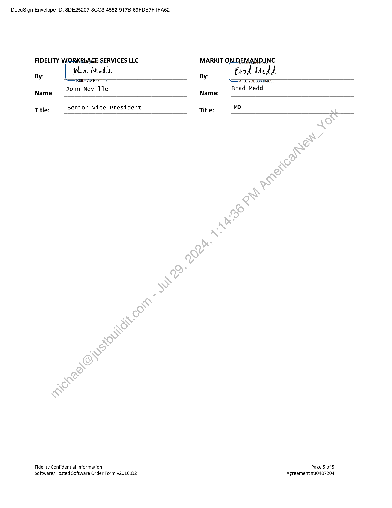

##### Software/Hosted Software Order Form]

  
````col
```col-md
flexGrow=.5
===
> [!info] [Page 1](_attachments/images_Fidelity-Brokerage-3.6.1.6.3.900191825.pdf_210025/page_1.png)
> 
```  
```col-md
DocuSign Envelope ID: 8DE25207-3CC3-4552-917B-69FDB7F1FA62  
SOFTWARE/HOSTED ORDER FORM  
The Master Web Services Agreement with an effective date of January 1, 2003 between Fidelity Brokerage
Services LLC (“Fidelity”) and Markit On Demand Inc, formerly known as Wall Street On Demand (“MOD”) (the
“Agreement”) will govern this Software/Hosted Software Order Form ("Order Form"). Capitalized terms used in
this Order Form, if not defined herein, shall be ascribed the meanings given in the Agreement.  
Whereas, Fidelity Workplace Services LLC is an Affiliate of Fidelity Brokerage Services LLC;  
Whereas, Fidelity Workplace Services LLC ("Fidelity") desires to purchase certain products from MOD as set forth
below;  
Whereas Fidelity and MOD will enter into the accompanying SOW dated April 4, 2018 (“SOW”) to this
Software/Hosted Order Form and  
Now therefore, in consideration of the mutual covenants expressed herein, Fidelity and MOD agree to the
following:  
Fidelity Business Unit: WI Investment Services
Fidelity Contact: Name: Andrew Hauck  
Phone: 617-392-8913  
Email Address: andrew.hauck@fmr.com
Supplier Contact: Name: Dan Scaglione  
Phone: 512-813-6304  
Email Address: daniel.scaglione@ihsmarkit.com  
ORDER FORM DETAILS:  
MOD shall host, make Updates, and provide the Software Maintenance Services to the Mutual Fund Pricing
Pages and Evaluation Tool-on behalf of Fidelity which will collectively comprise of software ("Hosted Software")
for Fidelity's mutual fund pricing pages and screener tools functionality on Fidelity's Digital Properties for Retail
and NetBenefits in-accordance with the pricing specified in the in this Order Form and in compliance with the
applicable specifications stated in the accompanying SOW dated April 4, 2018 (“SOW”) and the applicable
Service Level?  
The Monthly Fees for this Order Form will commence after the completion of each applicable Phase | or Phase II
as specified in the SOW and upon Acceptance which will continue for the time indicated in this Order Form,
unless the parties terminate this Order Form earlier as permitted by the Agreement.  
Fidelity is entitled to an Enhancement Budget equal to fifteen percent (15%) of the monthly service fee to fund
enhancements to the original project, which is equal to fifteen (15) hours per month for Retail MFE, and five (5)  
Fidelity Confidential Information Page 1 of 5
Software/Hosted Software Order Form v2016.Q2 Agreement #30407204  
```
````
Notes:    
````col
```col-md
flexGrow=.5
===
> [!info] [Page 2](_attachments/images_Fidelity-Brokerage-3.6.1.6.3.900191825.pdf_210025/page_2.png)
> 
```  
```col-md
DocuSign Envelope ID: 8DE25207-3CC3-4552-917B-69FDB7F1FA62  
hours per month for NetBenefits BFE (totaling 20 hours across the Customized Solution). Such enhancements
could include design changes, addition of new features, or integration of new data. The Enhancement Budget
shall be accrued on a rolling twelve (12) month basis. MOD will multiply its standard hourly rate of $175 per
hour by the number of hours worked on any enhancement, and subtract the resulting product from the accrued
Enhancement Budget.  
MOD will not charge any additional fees for work done subsequent to the launch to ensure that the services
conform to the original specifications and functional documentation (“Bug Fixes”) in the accompanying SOW
dated Month Xx, 2018.  
MOD will make any changes beyond Bug Fixes and those covered by the Enhancement\Budget at the rate of
$175 an hour. Changes requested after Fidelity has given final Acceptance, MOD will bill-at the rate of $175 an
hour for actual hours worked. Any services that expand beyond Bug Fixes and the.Enhancement Budget will
accompany SOW to be mutually agreed between the parties.  
MOD shall insure the migration path for all Updates which incorporates a process to allow Fidelity to regress
from the Updates if problems develop that Fidelity perceives to be attributable to the Updates. MOD shall
document and test the process methodology prior to the Update delivery. In all cases, MOD shall reverse
changes to enable back out, if necessary.  
CHANGE MANAGEMENT:  
MOD reserves the right, in its sole discretion, to make changes and enhancements to the equipment and
software used to provide the services from time to time to maintain operations and as required for problem
management and/or system security. MOD\will use commercially reasonable efforts to implement changes
during non-peak hours, except for changes ‘required for emergency purposes, which may be made at any time.
To the extent reasonable and commercially practicable, Fidelity will be notified in advance of any expected
outages.  
TERM:  
This Order Form shall commence after the completion of the applicable Phase | or Phase II deliverables specified
in the SOW, and upon Acceptance of each Phase in accordance with the SOW however, upon Acceptance of the
Phase II Launch Date»this Order Form will remain in effect for two (2) years thereafter (“Initial Term”). The Initial
Term shall renew for successive renewal terms of one (1) year each, unless either party notifies the other in
writing of its decision not to extend the term no later than ninety (90) days prior to the expiration of the term
then in effect.  
OPEN SOURCE SOFTWARE:  
Is Open Source Software provided with or included in the software or Services: Yes No_ x . (If
yes, please identify all Open Source Software that is part of or distributed with the software, along with the
name of the open source license applicable to each item of Open Source Software.)  
OWNERSHIP/LICENSING:  
Fidelity Confidential Information Page 2 of 5
Software/Hosted Software Order Form v2016.Q2 Agreement #30407204  
```
````
Notes:    
````col
```col-md
flexGrow=.5
===
> [!info] [Page 3](_attachments/images_Fidelity-Brokerage-3.6.1.6.3.900191825.pdf_210025/page_3.png)
> 
```  
```col-md
DocuSign Envelope ID: 8DE25207-3CC3-4552-917B-69FDB7F1FA62  
The parties agree that the Hosted Software to the extent originated and prepared exclusively for Fidelity, and to
the extent copyrightable under copyright law, shall belong exclusively to Fidelity.  
The parties agree that all right, title and interest in and to any other deliverables provided to Fidelity, including
any and all object and source code, CGI, XML formatting, computer system designs, documentation, user
interfaces, and all patent rights (including, without limitation, the exclusive right to make, use and sell), patent
registrations and applications, trade secrets, contract and licensing rights, and methodologies, shall be owned by
MOD. Nothing herein shall be construed to grant Fidelity any rights in or to any of the foregoing except as
expressly set forth herein.  
In the event Fidelity contributes any articles, articles, text, images, audio footage, video-footage, models,
research, data, know how, technology, concepts, ideas, inventions or other content or property for inclusion in
the MOD Services (“Fidelity Content”), as between MOD and Fidelity, Fidelity shall.retain all such intellectual
property rights exclusively for the life of such rights. To the extent required in order to perform the services,
Client shall grant MOD a non-exclusive, royalty-free, fully-paid, non-transferable» revocable, limited license to
use the Fidelity Content. MOD agrees that MOD’s use of the Fidelity marks shall inure to the sole benefit of
Fidelity. Fidelity agrees to hold MOD harmless from any infringement of Fidelity’s intellectual property in the
performance of the MOD Services, including but not limited to patents, trademarks, and copyrights as well as
Fidelity Content.  
REPORTING
MOD will provide our standard reporting package when the Hosted Software is running in production.  
DEFINITIONS:  
"Digital Properties" means the intranet and Internet websites, applications, products, and services  
owned, operated, or distributed by or on behalf of Fidelity or a Fidelity Affiliate now or in the future, including
any successor or equivalent URLs, subdomains, or applications and all future versions and upgrades, that are
accessible by any electronic or broadcast delivery channel, including personal computers, mobile access devices,
mobile phones, or other devices.now known or subsequently developed  
"Equipment" means any hardware or networking services (if applicable) utilized by MOD in providing the Hosted
Software under the Agreement including equipment, hardware, consumables, operating systems, software,
middleware, firmware, and telecommunications, networking, routing, cabling, and electrical or other
infrastructure,equipment that is owned, operated or controlled by MOD as a platform or otherwise part of the
operating environment for the Hosted Software.  
“Services” means any services that MOD performs or provides under the SOW and any ancillary services to
those services (administrative functions required in order to perform those services).  
"Software Maintenance Services" means Services to support the Hosted Software provided during the Term of
this Order Form under the Agreement including (a) provision of the Updates; (b) access to customer support via
phone and email for assistance; (c) diagnosis of error or defects; (d) responding to Fidelity’s report of an error in  
Fidelity Confidential Information Page 3 of 5
Software/Hosted Software Order Form v2016.Q2 Agreement #30407204  
```
````
Notes:    
````col
```col-md
flexGrow=.5
===
> [!info] [Page 4](_attachments/images_Fidelity-Brokerage-3.6.1.6.3.900191825.pdf_210025/page_4.png)
> 
```  
```col-md
DocuSign Envelope ID: 8DE25207-3CC3-4552-917B-69FDB7F1FA62  
accordance with the Severity Level and responses defined in the Service Level; and (e) emergency support, as
defined in the Service Level"Resolution” means the correction or elimination of an Error, as determined by the
Fidelity Companies.  
“Update” Fidelity is entitled to an enhancement budget equal to fifteen percent (15%) of the monthly service fee
to fund enhancements to the Hosted Software. Such enhancements could include, for example, design changes,
addition of new features, or integration of new data. The Enhancement Budget shall be accrued on,a rolling
twelve (12) month basis. Markit will multiply its standard hourly rate of $175 per hour by the number, of hours
worked on any enhancement, and subtract the resulting product from the accrued Enhancement Budget.  
PRICING AND FEES:  
License/Subscription Fee: so
Maintenance/Support Fee (if applicable): Retail Monthly Fees $ 17,000
Maintenance/Support Fee (if applicable): NetBenefits Monthly Fees $5,000
Other Fees:{description of fees] So
Other Fees: [description of fees] so
TOTAL: $ 22,000
Mission Critical? Yes LINo  
Service Level Schedule? lYes LINo  
The SLA between the Parties dated August 1, 2015 will govern
this Order‘Form.  
Will the Software/Hosted Software be | XlYes HINo  
subject to an Evaluation Period? The SOW with the Effective Date of Month XX, 2018 will contain
the details of Acceptance.  
Will Supplier have access, visibility, or |,1 Confidential CJ Highly Confidential LJ Personal  
store any of the following information| Information KX None  
(as determined by Fidelity)?  
HOSTING INFORMATION:  
Supplier Hosting? KlYes LINo If yes, fill out the remaining section.
Does Supplier use a Subcontractor for | KYes No  
Hosting? If yes, NTT Data Services  
Is Hosting Offshore? Yes XINo If yes, [country name/location]  
In the event that any provision of this Order Form conflicts or is inconsistent with any provision of the original
Agreement, the provisions of this Order Form will control for purposes of this Order Form only.  
Each party to this Order Form has caused its authorized representative to sign this Order Form.  
Fidelity Confidential Information Page 4 of 5
Software/Hosted Software Order Form v2016.Q2 Agreement #30407204  
```
````
Notes:    
````col
```col-md
flexGrow=.5
===
> [!info] [Page 5](_attachments/images_Fidelity-Brokerage-3.6.1.6.3.900191825.pdf_210025/page_5.png)
> 
```  
```col-md
DocuSign Envelope ID: 8DE25207-3CC3-4552-917B-69FDB7F1FA62  
FIDELITY PISAGESERVICES LLC
Jol Mowille
By:
John Neville
Name:
Title: Senior Vice President  
Fidelity Confidential Information
Software/Hosted Software Order Form v2016.Q2  
MARKIT ON_LDEMANDJINC  
Brod. Medd  
By:
AFOD2DB33648483.
Brad Medd
Name:
Title: MD  
Page 5 of 5
Agreement #30407204  
```
````
Notes:  


![[_attachments/Fidelity-Brokerage-3.6.1.6.3.9 00191825.pdf]