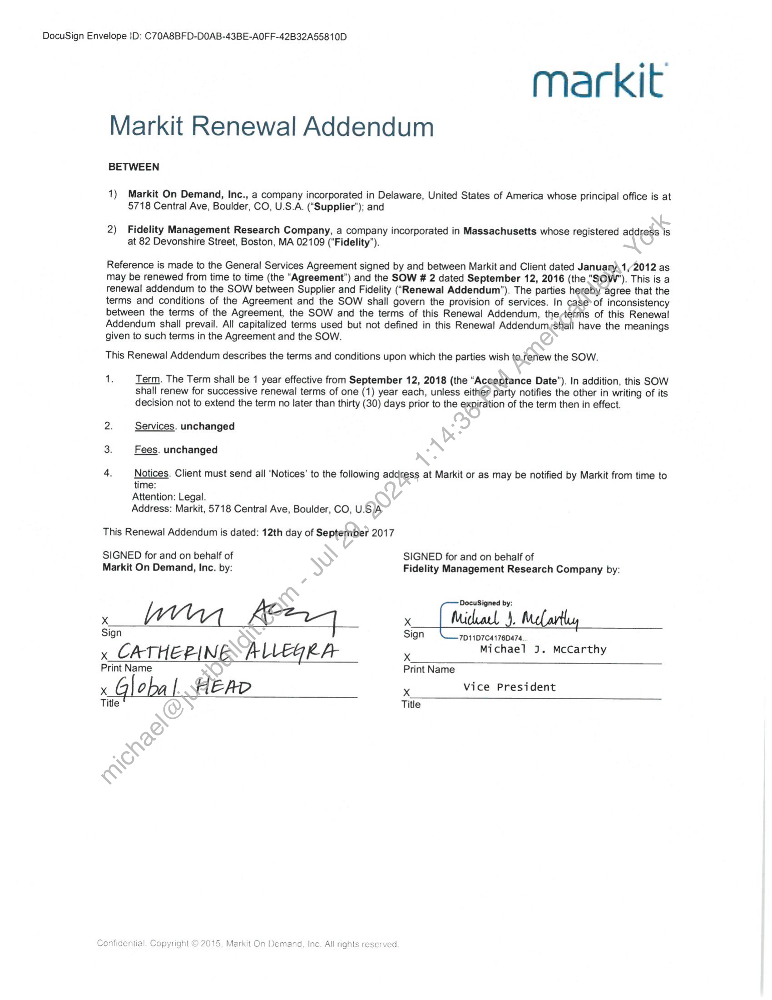
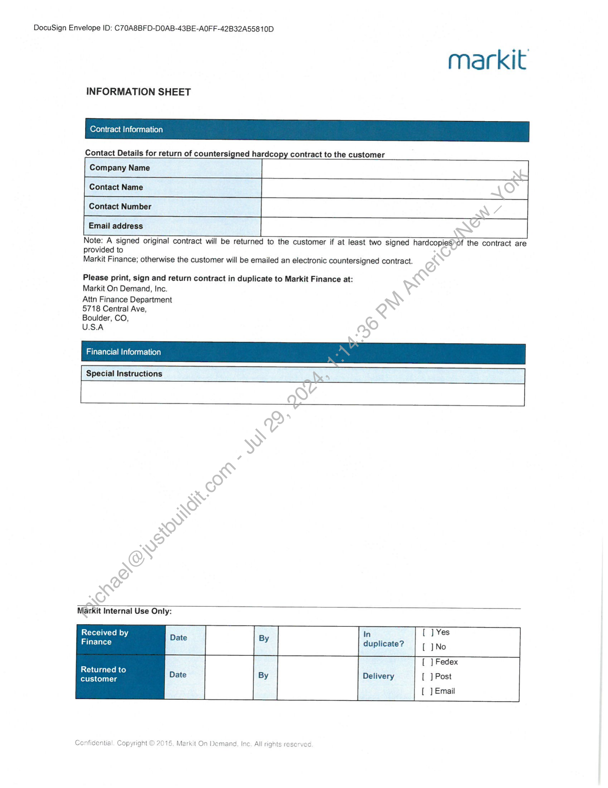
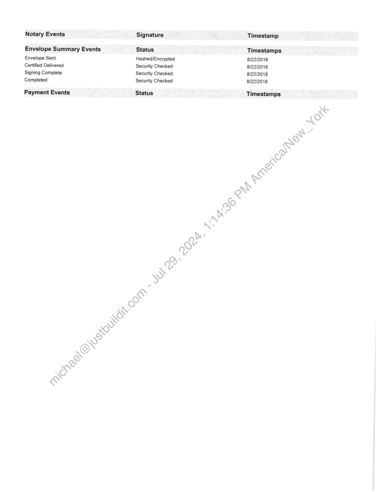

##### Markit Renewal Addendum]

  
````col
```col-md
flexGrow=.5
===
> [!info] [Page 1](_attachments/images_Fidelity-MgtAndResearch3.6.1.6.1.100155772.pdf_210152/page_1.png)
> 
```  
```col-md
DocuSign Envelope iD: C70A8BFD-D0AB-43BE-A0FF-42B32A55810D  
markit
Markit Renewal Addendum  
BETWEEN  
1) Markit On Demand, Inc., a company incorporated in Delaware, United States of America whose principal office is at
5718 Central Ave, Boulder, CO, U.S.A. (“Supplier”); and  
2) Fidelity Management Research Company, a company incorporated in Massachusetts whose registered address is
at 82 Devonshire Street, Boston, MA 02109 (“Fidelity”).  
Reference is made to the General Services Agreement signed by and between Markit and Client dated Januany\1,/2012 as
may be renewed from time to time (the “Agreement”) and the SOW 2 dated September 12, 2016 (the."SOW’"). This is a
renewal addendum to the SOW between Supplier and Fidelity (‘Renewal Addendum’). The parties hereby agree that the
terms and conditions of the Agreement and the SOW shall govern the provision of services. In ca&é*of inconsistency
between the terms of the Agreement, the SOW and the terms of this Renewal Addendum, the;tefms of this Renewal
Addendum shall prevail. All capitalized terms used but not defined in this Renewal AddendumyShall have the meanings  
given to such terms in the Agreement and the SOW.
This Renewal Addendum describes the terms and conditions upon which the parties wish to.reriew the SOW.
ts Term. The Term shall be 1 year effective from September 12, 2018 (the “Aceeptance Date’). In addition, this SOW  
shall renew for successive renewal terms of one (1) year each, unless eithep party notifies the other in writing of its
decision not to extend the term no later than thirty (30) days prior to the expiration of the term then in effect.  
2: Services. unchanged  
3. Fees. unchanged  
4. Notices. Client must send all ‘Notices’ to the following address at Markit or as may be notified by Markit from time to
time:
Attention: Legal.
Address: Markit, 5718 Central Ave, Boulder, CO, U.S/A  
This Renewal Addendum is dated: 12th day of September 2017  
SIGNED for and on behalf of SIGNED for and on behalf of
Markit On Demand, Inc. by: Fidelity Management Research Company by:  
Sign 7D11D704176D474.  
x CATHEPINE ALLEGRA Michael J. McCarthy
Print Name Print Name  
J Gleba | HEAD x Vice President  
Title Title  
```
````
Notes:    
````col
```col-md
flexGrow=.5
===
> [!info] [Page 2](_attachments/images_Fidelity-MgtAndResearch3.6.1.6.1.100155772.pdf_210152/page_2.png)
> 
```  
```col-md
DocuSign Envelope ID: C70A8BFD-DOAB-43BE-A0FF-42B32A55810D  
markit  
INFORMATION SHEET  
Contract Information  
Contact Details for return of countersigned hardcopy contract to the customer  
Company Name  
Contact Name  
G Email address  
Note: A signed original contract will be returned to the customer if at least two signed hardcopi ir contract are
provided to }~
@  
Markit Finance; otherwise the customer will be emailed an electronic countersigned contract.  
Please print, sign and return contract in duplicate to Markit Finance at: ~
Markit On Demand, Inc. P
Attn Finance Department ~)  
5718 Central Ave, Q  
Boulder, CO,
U.S.A  
Financial Information  
Special Instructions  
In  
Received by ; =
duplicate?  
Finance  
[ ] Fedex  
Returned to
customer  
Delivery [ ] Post
[ ] Email  
Confidential. Copyright © 2015, Markit On Demand, Inc. All rights reserved  
```
````
Notes:    
````col
```col-md
flexGrow=.5
===
> [!info] [Page 3](_attachments/images_Fidelity-MgtAndResearch3.6.1.6.1.100155772.pdf_210152/page_3.png)
> 
```  
```col-md
Certificate Of Completion  
Envelope Id: C70A8BFDDOAB43BEA0FF42B32A55810D  
Subject: Please DocuSign: PACK_MarkitOnDemand_BOS-GSA-AMD-SOW-3.pdf
Source Envelope:  
Document Pages: 3 Signatures: 3  
Certificate Pages: 2 Initials: 1  
AutoNav: Enabled  
Envelopeld Stamping: Enabled  
Time Zone: (UTC-05:00) Eastern Time (US & Canada)  
Record Tracking  
Status: Original Holder: Donna Keane
8/14/2018 donna.keane@fmr.com  
Signer Events Signature  
David Aiello ad  
david.aiello@fmr.com 2a  
Director  
Fidelity Vendor Relations
Security Level: Email, Account Authentication
(None)  
Signature Adoption: Pre-selected Style
Using IP Address: 192.223.236.250  
Electronic Record and Signature Disclosure:
Not Offered via DocuSign  
DocuSigned by:  
Michael J. McCarthy
Midwacl J. MeCartly  
michael.j.mccarthy@fmr.com
Vice President
Fidelity Management  
Security Level: Email, Account Authentication
(None)  
7D11D7¢4176D474  
Signature Adoption: Pre-selected Style
Using IP Address?192.223.236.250  
Electronic Record and Signature Disclosure:
Not Offered via DocuSign  
DocuSigned by:  
Bryan Collins .
Bryan. (allins  
bryan.collins@fmr.com
Security Level: Email, Account Authentication PLAINS  
(None)
Signature Adoption: Pre-selected Style  
Using IP Address: 192.223.236.250  
Electronic Record and Signature’Disclosure:
Not Offered via DocuSiga  
In Person Signer Events Signature
Editor Delivery Events Status
Agent Delivery Events Status
Intermediary Delivery Events Status
Certified Delivery Events Status  
Carbon Copy Events Status  
@ secured  
Status: Completed  
Envelope Originator:  
Donna Keane  
245 Summer Street  
Boston, MA 02210
donna.keane@fmr.com  
IP Address: 192.223.236.250.  
Location: DocuSiga  
Timestamp  
Sent: 8/14/2018  
Resént? 8/15/2018
Viewed: 8/15/2018
Signed: 8/15/2018  
Sent: 8/15/2018  
Resent: 8/20/2018
Resent: 8/22/2018
Viewed: 8/15/2018
Signed: 8/22/2018  
Sent: 8/22/2018
Viewed: 8/22/2018
Signed: 8/22/2018  
Timestamp
Timestamp
Timestamp
Timestamp
Timestamp  
Timestamp  
```
````
Notes:    
````col
```col-md
flexGrow=.5
===
> [!info] [Page 4](_attachments/images_Fidelity-MgtAndResearch3.6.1.6.1.100155772.pdf_210152/page_4.png)
> 
```  
```col-md
Notary Events  
Envelope Summary Events
Envelope Sent  
Certified Delivered  
Signing Complete  
Completed  
Payment Events  
Signature  
Status
Hashed/Encrypted
Security Checked
Security Checked
Security Checked  
Status  
Timestamp  
Timestamps
8/22/2018
8/22/2018
8/22/2018
8/22/2018  
Timestamps  
```
````
Notes:  


![[_attachments/Fidelity-MgtAndResearch3.6.1.6.1.1 00155772.pdf]