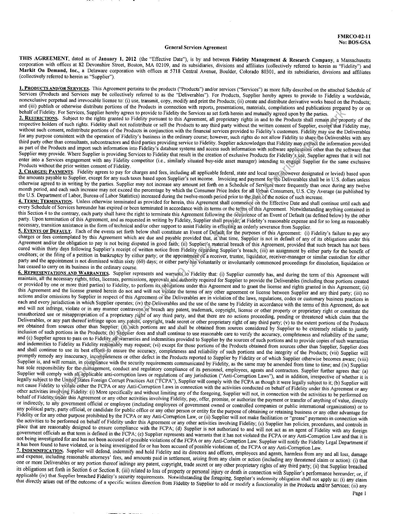

##### General Services Agreement]

  
````col
```col-md
flexGrow=.5
===
> [!info] [Page 1](_attachments/images_Fidelity-MgtAndResearch3.6.1.6.1.220111214GSA_MarkitOnDemandfkaWallStreetOnDemand_BOS-GS0001-AssetManagementCharts.pdf_210602/page_1.png)
> 
```  
```col-md
FMRCO-02-11
No: BOS-GSA
General Services Agreement  
THIS AGREEMENT, dated as of January 1, 2012 (the “Effective Date”), is by and between Fidelity Management & Research Company, a Massachusetts
corporation with offices at 82 Devonshire Street, Boston, MA 02109, and its subsidiaries, divisions and affiliates (collectively referred to herein as “Fidelity”) and
Markit Oa Demand, Inc., a Delaware corporation with offices at 5718 Central Avenue, Boulder, Colorado 80301, and its subsidiaries, divisions and affiliates
(collectively referred to herein as “Supplier”).  
1. PRODUCTS AND/OR SERVICES. This Agreement pertains to the products (“Products”) and/or services (“Services”) as more fully described on the attached Schedule of
Services (Products and Services may be collectively referred to as the “Deliverables”). For Products, Supplier hereby agrees to provide to Fidelity a worldwide,
nonexclusive perpetual and irrevocable license to: (i) use, transmit, copy, modify and print the Products; (ii) create and distribute derivative works based on the Products;
and (iii) publish or otherwise distribute portions of the Products in connection with reports, presentations, materials, compilations and publications prepared by or on
behalf of Fidelity. For Services, Supplier hereby agrees to provide to Fidelity the Services as set forth herein and mutually agreed upon by the parties.  
2. RESTRICTIONS. Subject to the rights granted to Fidelity pursuant to this Agreement, all proprietary rights in and to the Products shall remain dhie\property of the
respective holders of such rights. Fidelity shall not redistribute or sell the Products to any third party without the written consent of Supplier, except that Fidelity may,
without such consent, redistribute portions of the Products in conjunction with the financial services provided to Fidelity’s customers. Fidelity may use the Deliverables
for any purpose consistent with the operation of Fidelity’s business in the ordinary course; however, such rights do not allow Fidelity to sharethe Deliverables with any
third party other than consultants, subcontractors and third parties providing service to Fidelity. Supplier acknowledges that Fidelity may extract the information provided
as part of the Products and import such information into Fidelity’s database systems and access such information with software applications other than the software that
Supplier may provide. Where Supplier is providing Services to Fidelity that result in the creation of exclusive Products for Fidelity’s. use, Supplier agrees that it will not
enter into a Services engagement with any Fidelity competitor (i.¢., similarly situated buy-side asset manager) intending to, engage Supplier for the same exclusive
Products without the prior written consent of Fidelity.  
3. CHARGES; PAYMENTS. Fidelity agrees to pay for charges and fees, including all applicable federal, state and local taxes (however designated or levied) based upon
the amounts payable to Supplier, except for any such taxes based upon Supplier’s net income. Invoicing and payment for the Deliverables shall be in U.S. dollars unless
otherwise agreed to in writing by the parties. Supplier may not increase any amount set forth on a Schedule of Serviees*more frequently than once during any twelve
month period, and each such increase may not exceed the percentage by which the Consumer Price Index for all Urban Consumers, U.S. City Average (as published by
the U.S. Department of Labor, Bureau of Labor Statistics) increased during the twelve-month period prior to the date of the notice of such increase.  
4. TERM; TERMINATION, Unless otherwise terminated as provided for herein, this Agreement shall commehce on the Effective Date and shall continue until each and
every Schedule of Services hereunder has expired or been terminated in accordance with its terms or the teffas of this Agreement. Notwithstanding anything contained in
this Section 4 to the contrary, each party shall have the right to terminate this Agreement following the 6ceurrence of an Event of Default (as defined below) by the other
party. Upon termination of this Agreement, and as requested in writing by Fidelity, Supplier shall provide; at Fidelity’s reasonable expense and for so long as reasonably
necessary, transition assistance in the form of technical and/or other support to assist Fidelity in effecting an orderly severance from Supplier.  
5. EVENTS OF DEFAULT. Each of the events set forth below shall constitute an Event of Default for the purposes of this Agreement: (i) Fidelity’s failure to pay any
charges or fees contemplated by this Agreement which are due and payable provided that, at ‘that time, Supplier is not in default of any of its obligations under this
Agreement and/or the obligation to pay is not being disputed in good faith; (ii) Supplief’s, material breach of this Agreement, provided that such breach has not been
cured within thirty days following Supplier’s receipt of written notice from Fidelity fegatding Supplier’s breach; (iii) an assignment by either party for the benefit of
creditors, or the filing of a petition in bankruptcy by either party, or the appointment\of a receiver, trustee, liquidator, receiver-manager or similar custodian for either
party and the appointment is not dismissed within sixty (60) days: or either party-has voluntarily or involuntarily commenced proceedings for dissolution, liquidation or
has ceased to carry on its business in the ordinary course.  
6. REPRESENTATIONS AND WARRANTIES. Supplier represents and warrants to Fidelity that: (i) Supplier currently has, and during the term of this Agreement will
maintain, all the necessary rights, titles, licenses, permissions, approvals and duthority required for Supplier to provide the Deliverables (including those portions created
or provided by one or more third parties) to Fidelity, to perform its obligations under this Agreement and to grant the license and rights granted in this Agreement; (ii)
this Agreement and the license granted herein do not and will not Vidlate the terms of any other agreement or license between Supplier and any third party; (iii) no
actions and/or omissions by Supplier in respect of this Agreement of the Deliverables are in violation of the laws, regulations, codes or customary business practices in
each and every jurisdiction in which Supplier operates; (iv) the-Deliverables and the use of the same by Fidelity in accordance with the terms of this Agreement, do not
and will not infringe, violate or in any manner contravene or*breach any patent, trademark, copyright, license or other property or proprietary right or constitute the
unauthorized use or misappropriation of a proprietary right of any third party, and that there are no actions proceeding, pending or threatened which claim that the
Deliverables, or any part thereof infringe upon any. patetit, copyright, trade secret or other proprietary right of any third party; (v) to the extent portions of the Products
are obtained from sources other than Supplier: (a),suich portions are and shall be obtained from sources considered by Supplier to be extremely reliable to justify
inclusion of such portions in the Products; (b) Supplier does and shall continue to use reasonable care to verify the accuracy, completeness and reliability of the same;
and (c) Supplier agrees to pass on to Fidelity allwarranties and indemnities provided to Supplier by the sources of such portions and to provide copies of such warranties
and indemnities to Fidelity as Fidelity rea8onably may request; (vi) except for those portions of the Products obtained from sources other than Supplier, Supplier does
and shall continue to use its best efforfS-to ensure the accuracy, completeness and reliability of such portions and the integrity of the Products; (vii) Supplier will
promptly remedy any inaccuracy, incompleteness or other defect in the Products reported to Supplier by Fidelity or of which Supplier otherwise becomes aware; (viii)
Supplier is, and will remain, in compliance with the security requirements communicated by Fidelity, as the same may be amended from time to time; and (ix) Supplier
has sole responsibility for themanagement, conduct and regulatory compliance of its personnel, employees, agents and contractors. Supplier further agrees that: (a)
Supplier will comply with all/applicable anti-corruption laws or regulations of any jurisdiction (“Anti-Corruption Laws”), and in addition, irrespective of whether it is
legally subject to the United States Foreign Corrupt Practices Act (“FCPA”), Supplier will comply with the FCPA as though it were legally subject to it; (b) Supplier will
not cause Fidelity to vidlate either the FCPA or any Anti-Corruption Laws in connection with the activities conducted on behalf of Fidelity under this Agreement or any
other activities involving Fidelity: (i) More specifically and without limiting any of the foregoing, Supplier will not, in connection with the activities to be performed on
behalf of Fidelityrunder this Agreement or any other activities involving Fidelity, pay, offer, promise, or authorize the payment or transfer of anything of value, directly
or indirectly, to any government official or employee (including employees of government owned or controlled companies or public international organizations) or to
any political party, party official, or candidate for public office or any other person or entity for the purpose of obtaining or retaining business or any other advantage for
Fidelity or for any other purpose prohibited by the FCPA or any Anti-Corruption Law, or (ii) Supplier will not make facilitation or “grease” payments in connection with
the activities to be performed on behalf of Fidelity under this Agreement or any other activities involving Fidelity; (c) Supplier has policies, procedures, and controls in
place that are reasonably designed to ensure compliance with the FCPA; (d) Supplier is not authorized to and will not act as an agent of Fidelity with any foreign
government officials as that term is defined in the FCPA; (e) Supplier represents and warrants that it has not violated the FCPA or any Anti-Corruption Law and that it is
not being investigated for and has not been accused of. possible violations of the FCPA or any Anti-Corruption Law. Supplier will notify the Fidelity Legal Department if
it has been found to have violated, or is being investigated for or has been accused of possible violations of, the FCPA or any Anti-Corruption Law.  
7. INDEMNIFICATION. Supplier will defend, indemnify and hold Fidelity and its directors and officers, employees and agents, harmless from any and all toss, damage
and expense, including reasonable attorneys’ fees, and amounts paid in settlement, arising from any claim or action (including any threatened claim or action): (i) that
one or more Deliverables or any portion thereof infringe any patent, copyright, trade secret or any other proprietary rights of any third party; (ii) that Supplier breached
its obligations set forth in Section 6 or Section 8; (iit) related to loss of Property or personal injury or death in connection with Supplier’s performance hereunder; or, if
applicable (iv) that Supplier breached Fidelity’s security requirements. Notwithstanding the foregoing, Supplier’s indemnity obligation shall not apply to: (i) any claim
that directly arises out of the outcome of a specific written direction from Fidelity to Supplier to add or modify a functionality in the Products and/or Services; (ii) any  
Page |  
```
````
Notes:    
````col
```col-md
flexGrow=.5
===
> [!info] [Page 2](_attachments/images_Fidelity-MgtAndResearch3.6.1.6.1.220111214GSA_MarkitOnDemandfkaWallStreetOnDemand_BOS-GS0001-AssetManagementCharts.pdf_210602/page_2.png)
> 
```  
```col-md
intellectual property previously owned by Fidelity chat is not part of the materials created by Supplier and delivéred to Fidelity as part of the Products and or Services
provided hereander, of (iii) any third pay claims against Fidclin: asserting that the Products and/or Services infringe any patent siaiming exctusive nights oo
technology or invention that is wv such widespread unlicensed use by third partis as to be considered a fundamental public domain clement of the internet +
hyperlink). as dhat term is couunercially used and understood int the marketplace. and where Supplier did not at the tne it rendered the Series and.or delivered the
Products hereunder have actual knuwiedge that the Produers andor Services wy used by Fidelity in the munner contemplated in a Schedule of Services intimged such
putent dy described in this subsection (iit).  
$. CONFIDENTIALITY, During the term of this Agreement and for a period of tive «51 years thereafter, Supplier and its subcontractors shall regard as vontigenuai and
wall retain in-striet confidence the tenns and conditigns of this Agreement and ali other kneivicdge af Fidolin’s business and business activities (past. present atid tuture 1.
Deliverables, priemg. financial intomidlien. marketing strategies ar plans, product development, product a service usage information. customer information, wechnagues,
and Know low, whether i caqgihte of intangible fom. written or oval, and whether or not designated as. “contidential” eollecuvely referred 6 as “Fidelity Cuntident eal
Information”) that may be obtained from any scauee as a resull of Us Agreement. Supplier shall now!) Fideliy im writingyof any unauthorized. negligeut or inadvertent
use ar disclosure of Fideligy Contidential Information promptiy folowing Supplier's discuvery of such ase or disclastre und shall prompuy take measures tominimize
the effect of suet: inadvertent use or disclosure and prevent its recurrence. Chis provision shall nt apply to aiy information that is: G) publicly koown atthe nie of
disclosure or becomes publicly knowa through no wrongful act or [ailure af Supplier: (ii) subsequently disclosed to Supplier or its affiliates on a non-vontidential basis
by a third pany which lawfully acquired such information but had vo contidential relationship with Fidelity; (iii) communicated tw a. third party DveSupplicr with the
eapress Written consent of Fidelity; or (ivi independently developed by Supplier or its affiliates, Supplies shall not use the aame or any trade name> uademark. irade
device. service mark. symbol or any abbrevistion. contraction «ir simulation thereot delity in any adverusing. promotional Literature. custonterdist, web site, press
télease or amy document. cummunicatien or other myuterial, whether m written, electruni¢ ar other form Supplier shall oor discluse. advertise or publish the fact taat
Suppher has furnished Products:Services to Fidelity or cepresent, direeth of indirectly. chat any Praduets or Services provided by Supplier have been approved ur
endorsed by Fidelity or any affiliate thereol. Fidelity will net provide any endorsemems andor recommendations of any kind. katie event af a material breach or
Mevatened marerial breach hy Supplicr of any provision of this Section 8. Supplice acknowlgdges That monetary damages would hesinadequate w+ compensate Fidelin,
and that Fidelity, oy addition (© its other potential levator eguitable remiedies, shalt be enuuled to inmuncive relief ANN Mat AL Competent rarisdigtion witheuwt
demonstrating or prow mg actual danuiiges.  
9, DISCLAIMER OF WARRANTIES: LIMETSTIGY OF LAABID EXCEPT AS SUL PORTH IN SECTION 6 ABOVEDSLPPLIFR DOES NOT WARRANT THE
ACCURACY, COMPLETENESS, MERCHAN LABILITY OR FEENESS FOR FAR TICE LAR PURPOSE Ci PH PROULCIS INNO LVENE Walt HAIER
PARTY BE LIABLE TO FAR OCHER FOR ANY INUIRECE. INCIDEN EAL CONSLOULEN TIAL. § e MULAR DAMAGES GACT UDI, WIEHEE 1
IMITATION, ANY DAMAGES ARISING FROM POSS GF USE OR LOST BENINESS, REVENUE, 3 WR GCRIDWHL LG ARISING: iN
¢ CON WITH THIS AGREEMENT. WKETHER [X AN ACTIUN IN CONTRACT, TOI 3 AGEINCE. OR OTHER
ACTIONS. EVEN IF ADVISED OF THE POSSIBILITY OF SUCH DAMAGES. NEITHER SUPPLIER'S NOR FIDELITY’S LIABILITY TO THE OTHER PARTY
FOR ANY DAMAGES SHALL EXCECD : CHMNG:
EXCLUSION. ON THE ‘PYPE OF DAMAGE!  
AND THE FOREGOING LIMITATION ON THESAMOUNT OF DAMAGES SHALL NOYD APPLY 1
AMOUNTS PAYABLE UNDER SECTION 7, (ii) DAMAGES ARISING OUT OF A BREACHIOF SECTIONS 6 OR & AND (0 AMOUNTS PAYABLE IN
CONNECTION WITH EITHER PARTY'S. WILLPL, MISCO: CT. FRAUD. BAD FAITH QR GRUSS NEGLIGENCE,  
LU. MISCELLANEOUS, For purposes of this agreement. “altiliate” ot Fidelity shall mean any. entity directly or indirectly controlling. coatcolted by or under common
control with Fidelity: This Agveement aud its Schedulers! of Services constitute the entir@agrzement between the purlies relating 10 the subject matter eres Thee
Agreement shall bs binding upan the parties’ respective suet id perniitted ussigny.* Neither party may assign this Agreement, ander any af ils nights at
obligations hereunder. without the prior written vonvent of the other. For purposes vilftiis section, any axsigmment by operation af law. order ef aay court ar pursuant te
any plan of mefger. consolidation, liquidation or internal recrggntziuon shall be deyitetan asstgningat for which prior written consent 65 80t required: however. Supplier
must notife Fidelity  wraing promptly upon the accuvence af any uf the Yeregaing iypes oF assignment. whereupon Fidglity shall have the option of immediately
temunating the. Agreement and obtaining & pro-rata retin of any prepand teéS) The pertorntance ot either party under dns Agreement may be susperided the extent
and for the period of ume that sucl party is prevented or delayed laa tuliiiigeis obtigasons due {6 force majeure ds a resullal the following: diVacts af Cad. 1101 acts
at tertarisay, (ite wir, or iv) new fiipused und unfurescesble government teshicuons. Any mtices or other comummunicgutiyns required or permilted 1 he grven ut
delivered under this Agreement shail be in writing. directed to: Veron Relations, Fidelity Management and Research Corpany. 82 Devonshire Si. VI2H. Heston,
MA ONO9, This Agreement shall be deemed 10 be subject to. and siiall’be constiued in aceardance with. the laws of the:State of New York without giving elfeet tc Ls
pringiples of conflicts of laws. and ihe evelusive venus for anyactinns arising hercundce shall pe the state and federal courts of the State of New York. This Agreentent
may be executed in duplicate originals. each of which shill bedeetted enforceable. in the event of o conflict between Unis Agreement and any Schedule of Services, the
applicable Schedule of Services shall control. This Agreementmiay be executed and delivered hy fax or electronic signauue und any such signature shall be treated 4s an
original. The provisions of Sections 2. 6. 7, 8.9 and( #0 shall survive the termination of this Agreement withuul tegard to the basis of lenmmation ar the parts
tenmmaimg,  
IN WITNESS WHEREOF and intending to be degdity bound, Fidelity and Supplier have executed this Agreement as of the day and year first above writen.  
Fidelity Management & Research C umpan Markit Gn Dernand, tne  
BY ; y ia ware BY jl
Jame Ta  
DAME Wc bee / Pe Cr rY4y S NAME: aher,
CIT. Af  
```
````
Notes:    
````col
```col-md
flexGrow=.5
===
> [!info] [Page 3](_attachments/images_Fidelity-MgtAndResearch3.6.1.6.1.220111214GSA_MarkitOnDemandfkaWallStreetOnDemand_BOS-GS0001-AssetManagementCharts.pdf_210602/page_3.png)
> 
```  
```col-md
Schedile uf Services  
dautury 1, 2012  
(Cnder the terms and conditions of the Agreement ay amended: il"applicable. dated January I. 2012. by and between Fidelity Management & Researoh Company
«(vFideliy), and Markit On Demand, ine. (Suppiier). Supplies agrees to prov ide (0 Fidelity the following products andior serviees.  
Description of Products and/or Services: MOD Advanced Charting, which service provides advanced stock price chants that can be integrated into internal
upplicutions. ,  
Type of License: The tiecnse granted herein isa site license-anid. therefore, thy Annual Fees stared hereiwwaliow Fidelity to.add users at na extra cost,
Fideliy may add or remove users via written. notice iy Supplier without the creation of 4 new. Schedule of Serv ives, Sttould any Fidelity users.directiy reytlest serv ives  
lront Supplier during the coutruct term. Supplier shell promptly noctt Fidelityand obtain Fideli ipproval privr to providing services. Supplier shill not be obligated
to provide. and Fidelity shall not be obligated co puy for, such addilinnal sen ices. unlese Supplier has obtained Fideluy's approval deforenand  
Annual Fees: S60.0fK1  
Billing Frequeney: Monthly in Arrears  
Term: This Schedyle shalt commence ou January t,2612, and shall have an initial verm of nwelve (12) monphs (the “initial Terai), Thereatier. shis Schedule-shall
atwomatically renew for additional wwelve (12) ions pericds (each. a "Renewal Term”). Supplier. agrees w provide Fidelity witlt notice af'any price ineréage at least
siay (60) days. prior ws the end of any term. Following ibe hnitial Tera. Fidelity niay-terntiaate iis Schedule at any time by: Providing Supplier with thirty (36) dass”
prian wiltten iotice. In the event Fideliny has paid Supplier in.advanice tor the servives and/or products contemplated herein. Sipplicr agrees to-pravide [1 fidelity with a
Pro-rata rétind within ten (10) days i the event this Schedule is terminated.  
Speeial Conditions 4s they may apply  
1. Fo the stent the services contemplated under itis Sghedute cheonpass survey, panel andor channel check cements, Supper represents and warrants the
fallowmg: (a) none of the participants receive compensation. jn any Maines. logy oF amount. From Supplier: (bi the ideality and alUiadiog a Ue paruerpants Will tiet he
anade kitowvn te Fidelity: and (e1 it will not ieititate any follow-up by Fidelity witht any of the panicipants following receipt of the survey results  
2. The tims and coniditions of this Agreement shall prevail ver eny additional ar vodilioting terms ac conditions uf Supntier contained wi any “shrink wrap” or “eligk
thiough” agreetiients or proposals distribared andior used in connection with the Hrowuets andior Services (specifically ineluding any antine terms and conditions made
available ty Fidelity), and neither Fidelity. nor its-emplovees on agents. shall be bound by any sugh wrms.oc conditians.  
(IN WEENESS. WHEREOF and intending tobe legally bound, Fidelity and Supplier have executed this Agreement as.of the-day and yene first above written.  
Fidetuy Management & Research Cenipans Markit Gn Demand, fie.  
```
````
Notes:  


![[_attachments/Fidelity-MgtAndResearch3.6.1.6.1.2 20111214 GSA_Markit On Demand (fka Wall Street On Demand)_BOS-GS0001-Asset Management Charts.pdf]