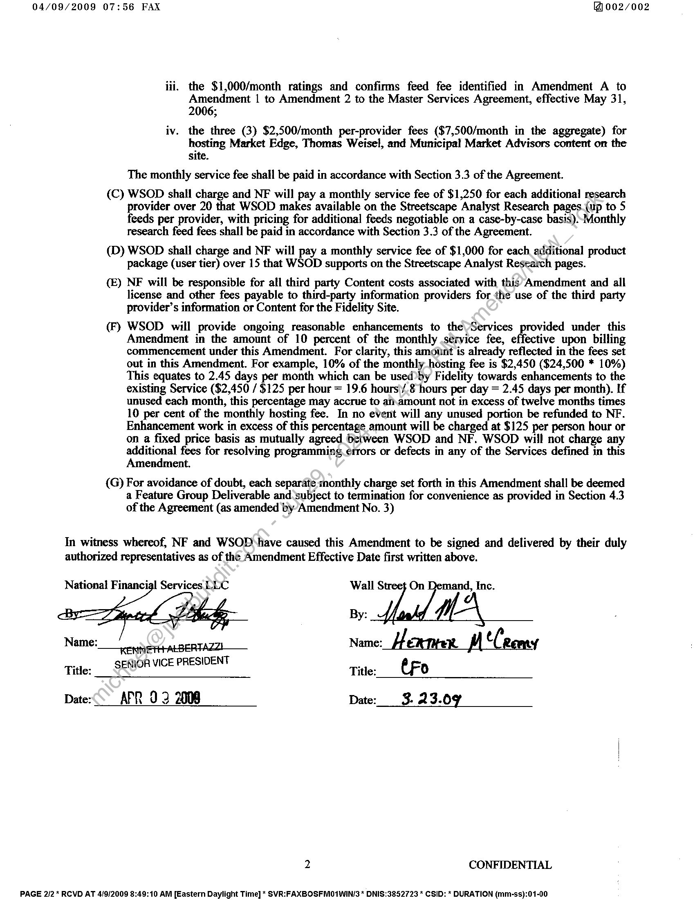

##### Amendment No. 9 to Master Web Services Agreement]

  
````col
```col-md
flexGrow=.5
===
> [!info] [Page 1](_attachments/images_Fidelity-NFS-3.6.1.6.2.100165637.pdf_211433/page_1.png)
> 
```  
```col-md
04/09/2009 07:55 FAX 001/002  
Amendment No. 9
To
Master Web Services Agreement
National Financial Streetscape Analyst Research and Fundamentals Pages  
This Amendment No. 9 to The Master Web Services Agreement (this “Amendment”), dated as of March 19,
2009, is made by and between National Financial Services LLC, a Delaware limited liability company and
Affiliate of NF Brokerage Services LLC, with offices at 82 Devonshire Street, Boston, Massachusetts 02109
(“National Financial” or “NF”), and Wall Street On Demand, Inc., a Delaware corporation with offices at'5718
Central Avenue, Boulder, CO 80301 (“WSOD”). This Amendment is in addition to and not in limitation of the
Agreement. All other terms and conditions of the Agreement remain in full force and effect and shall apply
hereto. In the event there is a conflict between the terms of the Agreement and the terms of this. Amendment,
the terms of this Amendment shall apply.  
WHEREAS, NF and WSOD are parties to that certain Master Web Services Agreement; dated as of January 1,
2003 (as amended from time to time in accordance with its terms, the “Agreement”); and  
WHEREAS, NF and WSOD desire to amend the Agreement as provided herein.
In consideration of the mutual promises contained herein, NF and WSOD covenant and contract as follows:  
1. Services: Pursuant to Section 2.2 Hosted Web Services, the Section entitled “Updates”, WSOD will design,
development, and host the following:  
A. Redesigned National Financial Streetscape Fundamentals pages per agreed upon specifications;
B. Redesigned National Financial Streetscape Analyst Research pages per agreed upon specifications;  
C. Develop and host new National Financial Streetscape Research Watchlist pages, utilizing 20-minute
delayed quotes provided by WSOD; and  
D. Develop and host a new Client Admin Tool that allows up to 5 Fidelity employees, as designated by
Fidelity Product Management, to sebup each firm’s entitlements to up to 15 predetermined National
Financial Streetscape product packages (user tiers). The site supports 10 product packages (user tiers),
as of October 2008. The ClientAdmin Tool may be built as part of a subsequent phase of the project.  
2. Fees & Payments: The fees payable by Fidelity to WSOD, as provided in the Agreement, are amended
effective as of November '!, 2008 as follows:  
(A) WSOD shali-charge and NF will pay WSOD a one-time fee of $32,000 for the Services provided
under this Amendment. The one-time development fees shall be paid in accordance with Section
3.3 ofthe Agreement. The fees include the design and build of the new WSOD Streetscape Analyst
Research, Fundamentals and Research Watchlist pages and the build and development of the Client  
in Tool.  
(B) WSOD shall charge and NF will pay a monthly hosting fee of $24,500 for the Services provided
under this Amendment (including the pages and Client Admin Tool described in Section 1 of this
Amendment). This hosting fee will also cover integration and ongoing support for up to 20 research
providers, up to 15 product packages (user tiers), and up to 4,625,000 monthly page or PDF views.
This fee replaces the following fees:  
i. The $7,500 and $5,000/month IBG fees identified in Exhibit B to the Master Web
Services Agreement, effective January 1, 2003;  
ii. the $3,000/month Streetscape tiers fee identified in Amendment 1 to Amendment 2 to
the Master Web Services Agreement, effective September 27, 2004;  
1 CONFIDENTIAL  
PAGE 1/2 * RCVD AT 4/9/2009 8:49:10 AM [Eastern Daylight Time] * SVR:FAXBOSFM01WIN/3* DNIS:3852723 * CSID: * DURATION (mm-ss):01-00  
```
````
Notes:    
````col
```col-md
flexGrow=.5
===
> [!info] [Page 2](_attachments/images_Fidelity-NFS-3.6.1.6.2.100165637.pdf_211433/page_2.png)
> 
```  
```col-md
04/09/2009 07:56 FAX 002/002  
iti. the $1,000/month ratings and confirms feed fee identified in Amendment A to
Amendment 1 to Amendment 2 to the Master Services Agreement, effective May 31,
2006;  
iv. the three (3) $2,500/month per-provider fees ($7,500/month in the aggregate) for
hosting Market Edge, Thomas Weisel, and Municipal Market Advisors content on the
site.  
The monthly service fee shall be paid in accordance with Section 3.3 of the Agreement.  
(C) WSOD shall charge and NF will pay a monthly service fee of $1,250 for each additional research
provider over 20 that WSOD makes available on the Streetscape Analyst Research pages (up to 5
feeds per provider, with pricing for additional feeds negotiable on a case-by-case basis).  
Monthly
research feed fees.shall be paid in accordance with Section 3.3 of the Agreement.  
(D) WSOD shall charge and NF will pay a monthly service fee of $1,000 for each additional product
package (user tier) over 15 that WSOD supports on the Streetscape Analyst Research pages.  
(£) NF will be responsible for all third party Content costs associated with this’ Amendment and all
license and other fees payable to third-party information providers for the use of the third party
provider’s information or Content for the Fidelity Site.  
(F) WSOD will provide ongoing reasonable enhancements to the Services provided under this
Amendment in the amount of 10 percent of the monthly service fee, effective upon billing
commencement under this Amendment. For clarity, this amount is already reflected in the fees set
out in this Amendment. For example, 10% of the monthly hosting fee is $2,450 ($24,500 * 10%)
This equates to 2.45 days per month which can be used by Fidelity towards enhancements to the
existing Service ($2,450 / $125 per hour = 19.6 hours\/.8 hours per day = 2.45 days per month). If
unused each month, this percentage may accrue to anhamount not in excess of twelve months times
10 per cent of the monthly hosting fee. In no event will any unused portion be refunded to NF.
Enhancement work in excess of this percentage amount will be charged at $125 per person hour or
on a fixed price basis as mutually agreed between WSOD and NF. WSOD will not charge any
additional fees for resolving programming ¢rrors or defects in any of the Services defined in this
Amendment.  
(G) For avoidance of doubt, each separate monthly charge set forth in this Amendment shall be deemed
a Feature Group Deliverable and-subject to termination for convenience as provided in Section 4.3
of the Agreement (as amended by’Amendment No. 3)  
In witness whereof, NF and WSOP have caused this Amendment to be signed and delivered by their duly
authorized representatives as of the Amendment Effective Date first written above.  
National Financial Services LLC Wall Street On Demand, Inc.
By:  
Name: aL BERTAZZI Name: Heamer M ¢Ceeeny
Title: SENIOR VICE PRESIDENT Title: tFo
Date: APR 03 2008 Date:___ 3. 23.097  
2 CONFIDENTIAL  
PAGE 2/2 * RCVD AT 4/9/2009 8:49:10 AM [Eastern Daylight Time] * SVR:FAXBOSFMO1WIN/3 * DNIS:3852723 * CSID: * DURATION (mm-ss):01-00  
```
````
Notes:  


![[_attachments/Fidelity-NFS-3.6.1.6.2.1 00165637.pdf]