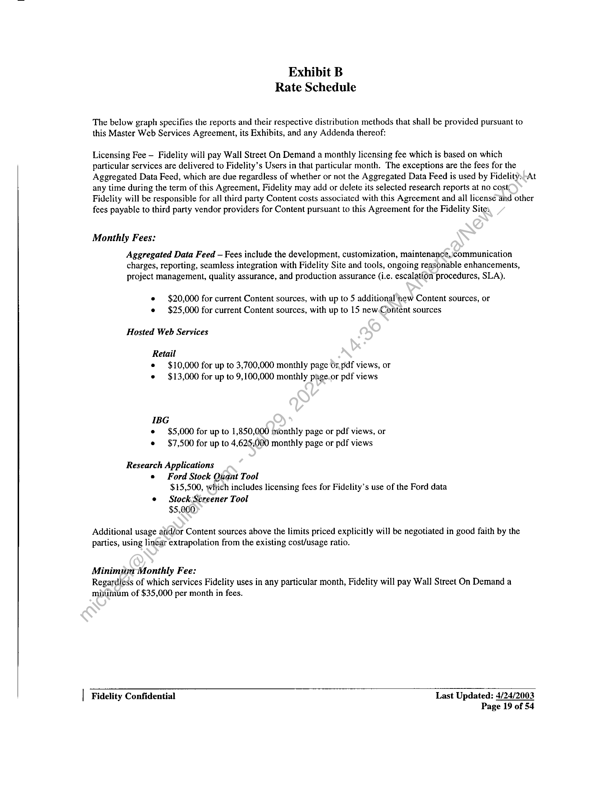
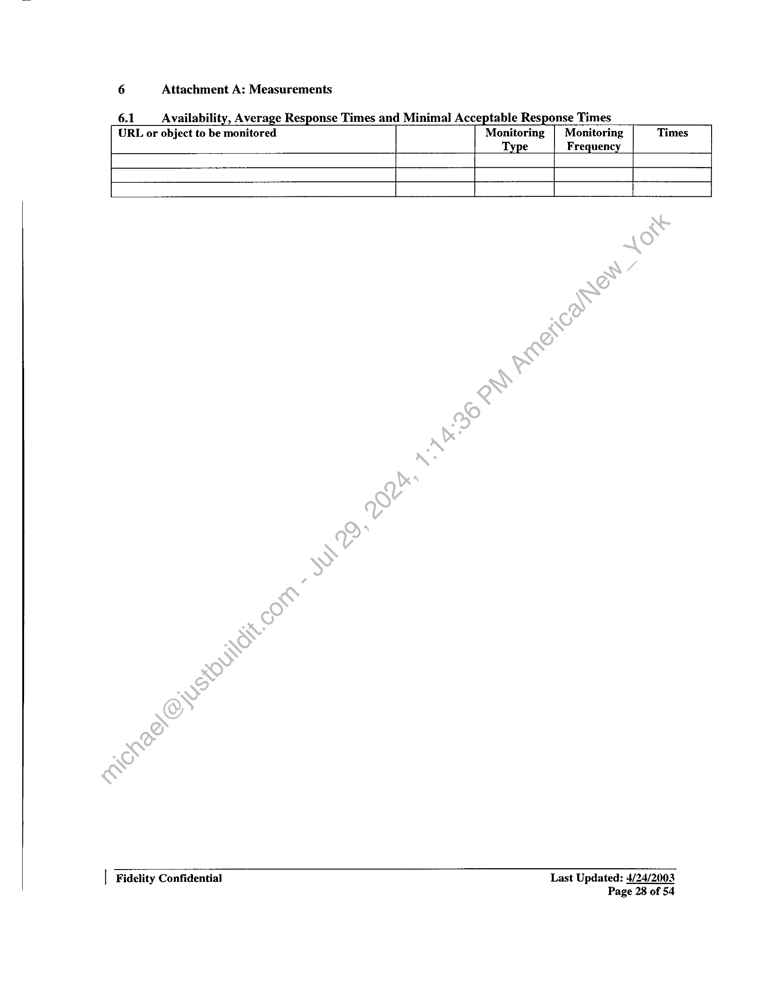
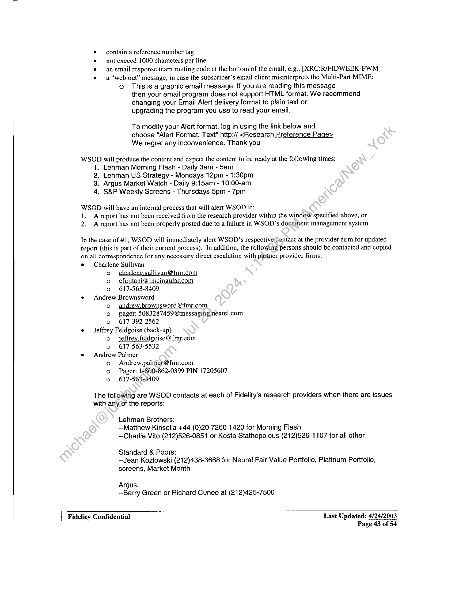

##### MASTER WEB SERVICES AGREEMENT]

  
````col
```col-md
flexGrow=.5
===
> [!info] [Page 1](_attachments/images_Fidelity-NFS-3.6.1.6.2.220030101FidelityWSODMasterServicesAgreement1.pdf_211339/page_1.png)
> 
```  
```col-md
MASTER WEB SERVICES AGREEMENT  
THIS AGREEMENT, dated as of January !, 2003 (the "Effective Date"), is by and between Fidelity Brokerage
Services LLC, a Delaware limited liability company, with offices at 82 Devonshire Strect, Boston, MA 02109, and it
subsidiaries, divisions and Affiliates (collectively referred to herein as “Fidelity “) and Wall Street on Demand, Inc.,
a Delaware corporation with offices at 3005 Center Green Drive, Suite 100, Boulder, CO 80301 (“Wall Street on
Demand”)  
WHEREAS, Fidelity is a provider of various services, including without limitation financial services and in
connection with the provision of such services, Fidelity offers its employees, customers and prospects accéss. to
certain online financial information, research and tools from various Fidelity Sites; and  
WHEREAS, Wall Street on Demand is in the business of acting as a third party aggregator and providing web
hosting services in the form of indexing, databasing, distributing, and creating visual displays ahd<webpages from
data and content delivered to Wall Street on Demand by virtue and in accordance with its customers direct licensing
agreements with various third party content providers (“Content” as hereinafter defined); and  
WHEREAS, Wall Street on Demand is in the business of redistributing, sublicensing and hosting content in
accordance with written agreements between Wall Street on Demand and third party content providers for the
benefit of Wall Street on Demand’s customers; and  
WHEREAS, within this Agreement herein, Wall Street on Demand agrees teprovide Fidelity with online research
aggregation services, reports, and applications delivered as hosted solutidns)(including maintaining the hardware,
software and Internet connectivity), Aggregated Data Feeds and consulting services necessary for Fidelity to provide
the Content designated in Exhibit A on the Fidelity Sites in accordanve with the Service Level Agreement set forth
herein, in return for the payments contemplated hereby.  
NOW, THEREFORE, for and in consideration of the mutual.promises contained herein and other good and valuable
consideration, the receipt and sufficiency of which is hereby acknowledged, the parties hereto agree as follows:  
1. DEFINITIONS  
1.1 "Affiliate" shall mean any entity directly or indirectly Controlling, Controlled by or under common
Control with Fidelity, including, but not limited to Fidelity International Limited and its subsidiaries.  
1.2 "Control" shall mean. an ownership interest of 50% or more, except in the case of Fidelity
International Limited.and any other entity organized with a substantially similar capital structure for
substantially similar-reasons, wherein Control shall mean an ownership interest of 40% or more.  
1.3 “Content” shail mean i) content/information that Fidelity licenses directly with third party content
providers‘including any updates, or successor versions thereof delivered by Fidelity to Wall Street On
Demand) and/or ii) third party contenV/information that Wall Street On Demand sublicenses to Fidelity,
or itv) third party content/information that Wall Street On Demand creates derivative works from third
party content providers.  
1:4 “Customer” shall mean any account holder who utilizes a password to access the Content of a
Fidelity Site  
1.5 “Customer Data” means the physical location, email address, and ali financial or business related
information, including but not limited to credit/debit information, in the possession of Wall Street on
Demand by virtue of providing services to individuals or entities pursuant to this Agreement.  
Fidelity Confidential Last Updated: 4/24/2003
Page 1 of 54  
```
````
Notes:    
````col
```col-md
flexGrow=.5
===
> [!info] [Page 2](_attachments/images_Fidelity-NFS-3.6.1.6.2.220030101FidelityWSODMasterServicesAgreement1.pdf_211339/page_2.png)
> 
```  
```col-md
1.6 “Aggregated Data Feed” shall mean a real-time XML feed of aggregated Content designated by
Fidelity in Exhibit A attached hereto  
1.7 “Fidelity Site” means the electronic software or (intranet or internet based) web site offering of  
Fidelity  
1.8 “Prospect” shall mean any visitor to a Fidelity Site who does not have a Fidelity account or who has
not identified himself/herself with a user id and password  
1.9 “Representative” shall mean Fidelity employees who provide support to Customers and/or
Prospects who have access to the Content  
1.10 “User” shall mean all Customers, Prospects and Representatives  
2. DEFINITION OF SERVICES  
Wall Street On Demand will provide Fidelity with the following classes of services (the “Services’):
Aggregated Data Feed, hosted web services, and research applications. The Lehman,.S&P and Argus research
reports in addition to any new research providers selected by Fidelity during the term of this Agreement to be
hosted by Wall Street On Demand shall be (i) archived by Wall Street On Demand; (1i) accessible in the hosted
web service for at least one (1) year only so long as such Content is being made-available to Fidelity Users; and
(iii) made available to Fidelity via the Aggregated Data Feed; . The Market Guide ProVestor Plus Report and
First Call Earning Valuation Report will not be archived by Wall Street‘on Demand. At any time during the
term of this Agreement, Fidelity may add or delete its selected reports at‘no cost.  
2.1 Aggregated Data Feed. Wall Street On Demand will aggregate, normalize, database and deliver a
comprehensive Aggregated Data Feed of market data andresearch Content.  
Content Description  
Timing  
Updates  
All Content sources désignated by Fidelity in Exhibit A attached hereto will be
included in the Aggregated Data Feed, including certain metadata on every
rescarch report following the RIXML standard, market data, and the research
reports (e.g., PDFs, etc). The metadata, at a minimum, shall include but not be
limited to) the ‘following: research provider, product name, author(s), report
headline, ‘feport abstract, report URL, report date/time, country, sector,
industry, sub industry, primary symbol(s), secondary symbols, subject, report
sizevand document unique ID.  
The Aggregated Data Feed will be designed to provide real-time updates,
allowing for use in time sensitive applications such as alerting. The
Aggregated Data Feed will be made continually available to Fidelity in an
XML format via Wall Street On Demand’s HTTP server. As soon as Wall
Street On Demand’s systems are aware of a change to Content, this change will
be posted on the XML feed.  
The Aggregated Data Feed will be built to Fidelity’s specifications and at
Fidelity’s request modified up to four (4) times per year at no additional cost,
to allow for new data and changes to existing Aggregated Data Feed elements.  
2.2, Hosted Web Services. Wall Strect On Demand will develop and host web-based Content for use on
Fidelity Sites for all Users.  
Services Provided  
Wall Street on Demand shall host and maintain the Content in accordance with
the terms of this Agreement, inclusive of both Exhibit A and Exhibit B
attached hereto, and shall provide hardware, software and personnel support
sufficient to meet the requirements of the Service Level Agreement set forth in  
Fidelity Confidential  
Last Updated: 4/24/2003
Page 2 of 54  
```
````
Notes:    
````col
```col-md
flexGrow=.5
===
> [!info] [Page 3](_attachments/images_Fidelity-NFS-3.6.1.6.2.220030101FidelityWSODMasterServicesAgreement1.pdf_211339/page_3.png)
> 
```  
```col-md
Content Description  
Updates  
Shared Resources  
Exhibit _C, incorporated herein and shal] insure that it at all times meets or
exceeds the Security Requirements set out in Exhibit D.  
All HTML pages and PDF reports currently hosted by Wall Street On Demand,
such as research reports, and company research pages (for IBG). The hosted
web services Content specifically does not include the research applications
that are described herein further below.  
Any hosted web page will be updated, at Fidelity’s request, for “look and feel”
changes at least once per year at no additional cost. Additionally, product
updates such as research report additions/deletions and other typical product
maintenance activities will be provided at no additional cost. Updates that
constitute significant product functionality changes or wholly new products
will be priced per the existing Consulting Agreement 70000317 and/or
Amendments to this Agreement.  
Wall Street on Demand may elect to provide hosting Services using shared
hardware and software, provided that such sharing ;shall in no event excuse
Wall Street on Demand from its obligations (under the Service Level
Agreement. Wall Street on Demand warrants that it has obtained all necessary
rights to share such resources and agrees to/indemnify Fidelity against any
breach of this warranty. Conversely, Fidelity acknowledges and understands
that Wall Street On Demand as primary‘resort shal! perform its obligations
hereunder using a shared resource (infrastructure. Fidelity further understands
and acknowledges that where )Fidelity requests a dedicated resource
environment, Fidelity and WallStreet on Demand shall negotiate in good faith
and produce an Addendum to‘this Agreement describing the terms and cost of a
dedicated resource environment.  
2.3 Research Applications. Wall Street Qn) Demand will develop custom research applications for
Fidelity. The Ford Stock Quant Tool research application, as described further below, may be
delivered as part of the Aggregated DataFeed and/or as a Wall Street on Demand hosted solution on
Fidelity Sites. Screen shots are inchided in Exhibit A attached hereto.  
Ford Stock Quant Tool Custom-designed, built and hosted tool, based on Ford Investor Services  
analytics, offering a letter rating on a number of key analytics for equities.
Additionally, where technically practicable, Content from this application
may be included in the Aggregated Data Feed, at Fidelity’s election, as
specified in Exhibit A, specifically for use in Fidelity’s building,
databasing, and hosting of similar versions of these web pages. For an
additional monthly cost of $15,000, Fidelity is licensed to use the Ford
Stock Quant Tool data for unrestricted use. Wall Street On Demand will
provide sublicenses to Fidelity for any data necessary to fulfill on delivery
of this tool, including the Ford Investor Services data and such Ford
sublicense shall include unrestricted use of the Ford Investor Services data
by Fidelity, excluding Fidelity’s fund management business (FMR Co).
Notwithstanding the foregoing, Fidelity may elect to license such Ford
Investor Services data directly with Ford.  
(i) Includes Ford ratings for over 4,500 US equities, updated weekly.
Ratings will be produced, at Fidelity’s discretion, on either a numerical
or letter-grade scale.  
(ii) Ford ratings on six key areas included for each stock covered: Price
Momentum, Valuation, Earnings Growth, Revenue Momentum,  
Fidelity Confidential  
Last Updated: 4/24/2003
Page 3 of 54  
```
````
Notes:    
````col
```col-md
flexGrow=.5
===
> [!info] [Page 4](_attachments/images_Fidelity-NFS-3.6.1.6.2.220030101FidelityWSODMasterServicesAgreement1.pdf_211339/page_4.png)
> 
```  
```col-md
Stock Screener Tool  
Email Alert Service  
Exclusivity  
Updates  
Profitability, Financial Health. The definitions of these areas may be
modified to include other data or criteria.  
(iii) Every Ford rating will be accompanied by a “Smart Text” explanation
of the significance of the rating. Smart Text is dynamically created text
that explains why a stock has a particular rating, and is written in a
conversational English that seems to be written by a human analyst.  
(iv) For every ratings area, there will be a detail page of data that gives an
expanded analysis of that ratings area. An example of a detail page is
included in Exhibit A.  
(v) At Fidelity’s discretion, the Ford Investor Services ratings may ‘be
presented to Users as Fidelity’s own rating system, or labeled as Ford
Investor Services’ ratings.  
Hosted, customized stock screening application using)a variety of market,
fundamental, analyst and analytical data screening.criteria and may include,
but are not limited to the following:  
(i) Data from multiple information providers, such as Multex, S&P,
Lehman Brothers, Argus and others  
Gi) Offers expert strategies that maybe defined by Fidelity or other third
parties  
(iii)Allows for Users to saye’their screens  
(iv) Offers a customized User interface that allows customers to view the
number of stocks meeting a screening criteria as the user selects the
criteria  
(Vv) Offers the ability to view performance of a saved screen  
(vi)A cscreen results page that offers different “views” and is fully
integrated into the Fidelity Site (e.g. with links to other tools and
Fidelity web pages)  
Wall Street On Demand agrees to fulfill such requirements stated in the
WSOD Vendor Requirements Document attached hereto as Exhibit E at no
charge until notified in writing by Fidelity that such requirements are no
longer needed. The requirements and Content hosted by Wall Street On
Demand for Fidelity’s use in delivering the Email Alert Service are subject
to the SLA as stated in Exhibit C of this Agreement.  
If Fidelity agrees to license the Ford Stock Quant Tool by February 15,
2003 and begins paying fees on the tool by April 30, 2003, Wall Street On
Demand will not license a similar tool using Ford data to any of Fidelity’s
competitors until 2004.  
Any hosted application will be updated, at Fidelity’s request, for “look and
feel”, as well as small functional changes up to twice per year at no
additional cost. These updates do not include adding major new features,
which will be priced per the existing Consulting Agreement 70000317
and/or Amendments to this Agreement.  
| Fidelity Confidential  
Last Updated: 4/24/2003
Page 4 of 54  
```
````
Notes:    
````col
```col-md
flexGrow=.5
===
> [!info] [Page 5](_attachments/images_Fidelity-NFS-3.6.1.6.2.220030101FidelityWSODMasterServicesAgreement1.pdf_211339/page_5.png)
> 
```  
```col-md
2.4 MEASUREMENT & REPORTING. Wall Street on Demand agrees to provide Fidelity with
measurement data on a monthly basis. Both parties shall agree upon those measurement and reporting
statistics that are appropriate and applicable.  
2.5 DELIVERY. The Services described in this Section 2 DEFINITION OF SERVICES will be offered
as part of the Aggregated Data Feed described in provision 2.1 (where applicable), and will also be
offered as a hosted web solution if requested by Fidelity, as specified in Exhibit A  
2.6 DEVELOPMENT/QA ENVIRONMENT. Wall Street On Demand will maintain dedicated
Development and QA environments for Fidelity’s use during the length of the Agreement as defined in
the Service Level Agreement in Exhibit C of this Agreement.  
3. INVOICING AND FEES  
3.1 Audit Rights. At any time, Fidelity may require assurances of compliance from Wall Street on
Demand with regards to Wall Street on Demand’s billing for Services under the Agreement. For the
purpose of this section, Fidelity may audit, upon thirty (30) days prior written notice, any Wall Street
on Demand software or report used to calculate the number of billable html and pdf reports that Wall
Street on Demand provides to Fidelity Customers for the sole purpose of verifying the accuracy of the
number and type of reports billed to Fidelity based on Wall Streetcom Demand’s performance of
Services hereunder.  
3.2 Fees, The applicable fees for Services in accordance with this‘Agreement shall be specified in the
Exhibit B Rate Schedule attached hereto.  
3.3 Invoicing. Each invoice submitted by Wall Street on Demand shall specify the amount due hereunder,
the description of the Content thereof and shall include all applicable federal, state and local taxes as a
separate line item. Unless otherwise specified in the Rate Schedule of Exhibit B or as otherwise
agreed between the parties in a duly executed.addendum to this Agreement, all invoices relating to the
Services herein contained shall be payable within thirty (30) days of receipt by Fidelity.  
3.4 Price Increases. Wall Street on Demand may adjust the fees stated in Exhibit B Rate Schedule
attached hereto by (i) the greater-of the CPI or five percent (5%) based upon the final year’s fees of the
Initial Term (as defined herein per Section 4) by providing written notice to Fidelity at least (60) days
prior to the effective date of such increase or (ii) an increase percentage amount, based upon the final
year’s fees of the Initial Terin, in excess of the increase percentage amount permitted in (i) above by
providing written notice to Fidelity at least ninety (90) days prior to the effective date of such increase;
provided that Wall:Sireet On Demand may not increase any amount set forth on Exhibit B Rate
Schedule more frequently than once during any twelve (12) month period. For purposes herein, “CPI”
shall mean theé.amount of increase (if any) in the Consumer Price Index for all Urban Consumers, U.S.
City Average>(as published by the U.S. Department of Labor, Bureau of Labor Statistics) increased
during the twelve-month period prior to the date of the notice of such increase. The parties
acknowledge that they will work with each other in good faith to manage price increases over the CPI.
If Fidelity objects to any such increase (as described in 3.4 ii), Fidelity may terminate this Agreement
by giving written notice to Wall Street on Demand at any time before the effective date of such
increase. The parties agree that no price increases are permissible during the Initial Term of this
Agreement.  
4. TERM; TERMINATION  
4.1 Term, Unless otherwise terminated as provided for herein, this Agreement shall commence on the
Effective Date and shall continue for an initial term of three (3) years (the “Initial Term”). Thereafter,
this Agreement shall automatically renew for successive one (1) year periods (hereinafter “Renewal
Terms”), unless Fidelity notifies Wall Street on Demand in writing of its decision not to renew at least
thirty (30) days prior to the end of the Initial Term including any Renewal Term thereof.  
| Fidelity Confidential Last Updated: 4/24/2003
Page 5 of 54  
```
````
Notes:    
````col
```col-md
flexGrow=.5
===
> [!info] [Page 6](_attachments/images_Fidelity-NFS-3.6.1.6.2.220030101FidelityWSODMasterServicesAgreement1.pdf_211339/page_6.png)
> 
```  
```col-md
4.2 Material Breach. Either party may terminate this Agreement for a material breach of the terms of this
Agreement, when such material breach is not cured within thirty (30) days from the date that the nonbreaching party provides written notice to the breaching party of the material breach. Notwithstanding
anything to the contrary, Wall Street on Demand shall be obligated to perform services in accordance
with sections 6.1 and 6.2 of this Agreement. For the purpose of clarification, good faith disputes in
payment shall not be considered a material breach of this contract.  
4.2.1 Dispute Resolution, Where notice of breach is received by either party, the individuals
designated under section 15.3.1 of the Agreement shall schedule and conduct weekly
conference calls, in a manner and frequency agreeable to both parties, that include all those
necessary and appropriate individuals from their companies to resolve the written (breach.
This procedure shall remain in place until the issue(s) are resolved in their entiretysor until
either party terminates at a time after the required thirty (30) day notice period.  
4.3 Termination for Convenience. Upon thirty (30) days written notice, Fidelity-may cancel this
agreement for any reason, without liability to Wall Sweet on Demand, other thanpfor charges based on
performance hereunder provided through the effective date of termination. -Tfduring the first six (6)
months of use by Fidelity of any such Wall Street on Demand product deyeloped for Fidelity, Fidelity
elects to exercise its right to terminate for convenience, Fidelity shall pay-Wall Street on Demand the
amount due for six (6) months of any such Wall Street on Demand product developed for Fidelity that
did not include a development fee. Where such notice of termination indicates the need to obtain
transitional support and services, Wall Street on Demand shall’be ‘obligated to perform such services in
accordance with provisions 6.1 and 6.2 of this agreement.  
4.4 Each party shall have the right to terminate this Agreement following the occurrence of
an Event of Default (as defined below) by the othefparty.  
5. EVENTS OF DEFAULT
Each of the events set forth below shall constitute an’Event of Default for the purposes of this Agreement.  
5.1 Fidelity’s failure to pay any chafges,or fees contemplated by this Agreement which are due and
payable, provided that at that tiie*Wall Street on Demand is not in default of any of its obligations
under this Agreement, the obligation to pay is not being disputed in good faith, and the failure to pay
has not been cured within thirty (30) days following Fidelity’s receipt of written notice from Wall
Street on Demand regarding Fidelity’s failure to pay.  
5.2 Wall Street on Dernand’s material breach of this Agreement, provided that such breach has
not been cured within thirty (30) days following Wall Street on Demand’s receipt of written notice
from Fidelitytegarding Wall Street on Demand’s breach.  
5.3 (ian assignment by either party for the benefit of creditors; or  
(ii) the filing of a petition in bankruptcy by either party; or  
(iii) the filing of a petition in bankruptcy against either party by its creditors which petition is not
dismissed within sixty (60) days; or  
(iv) the appointment of a receiver, trustee, liquidator, receiver-manager or similar custodian for
either party and the appointment is not dismissed within sixty (60) days; or  
(v) either party has voluntarily or involuntarily commenced proceedings for dissolution,
liquidation or winding up, or has ceased to carry on its business in the ordinary course; or  
Fidelity Confidential : Last Updated: 4/24/2003
Page 6 of 54  
```
````
Notes:    
````col
```col-md
flexGrow=.5
===
> [!info] [Page 7](_attachments/images_Fidelity-NFS-3.6.1.6.2.220030101FidelityWSODMasterServicesAgreement1.pdf_211339/page_7.png)
> 
```  
```col-md
(vi) the institution of any other proceeding involving the insolvency of either party or the
protection of, or from, its creditors, which proceeding remains undismissed for a period of sixty  
(60) consecutive days.  
6. TERMINATION SUPPORT  
6.1 Cooperation. Wall Street on Demand agrees that upon the termination of this Agreement in
accordance with the provisions of Section 4, Wall Street on Demand shall cooperate to effect an
orderly and efficient transition of services to Fidelity. Wall Street on Demand shall provide full
disclosure to Fidelity of the equipment, software and third party vendor services required to perform
Services for Fidelity. In the event of WSOD default, Fidelity shall have the right to purchasé, at the
greater of net book value or 20% of the purchase price, any fixed assets utilized solely to provide the
Services to Fidelity. Wall Street on Demand shall do a one-time transfer of all Customer/Data and
any Fidclity owned or licensed Content.  
6.2 Transition Services. Wall Street on Demand shall furnish, as reasonably requested in writing by
Fidelity, transitional services for up to one hundred eighty (180) calendar.days to commence upon
notice of termination from Fidelity , on the same terms, conditions, and>charges as provided for in
this Agreement and Exhibit B attached hereto. For such period, and at Fidelity’s reasonable request,
Wall Street on Demand shall continue to provide technicians and?support personnel or additional
personnel sufficient to meet the Service Level Agreement requirements defined under Exhibit C
and the Security requirements of Exhibit D. In all cases, Fidelity shall be responsible for reasonable
hourly fees that may be associated with the transition services that are provided. Notwithstanding
the foregoing, in the event Fidelity terminates this Agreement due to Wall Street on Demand’s
default, Fidelity shall not be responsible for any\hourly fees that may be associated with the
transition services provided by Wall Street on Demand.  
7. REPRESENTATIONS AND WARRANTIES
Wall Street on Demand represents and warrants toFidelity that:  
7A Wall Street on Demand has all the requisite corporate power and authority to execute, deliver and
perform this Agreement and .any/other agreements contemplated thereby and to consummate the
transactions contemplated hereby; Wall Street on Demand represents and warrants that no other
agreement has been or shall-be made with any third party, which interferes with its performance of its
obligations contained herein.  
72 Wall Street on Demand represents and warrants that there are no liens or encumbrances on
any hardware Or software used by Wall Street on Demand to perform its obligation herein.  
7.3. Wall Street'on Demand represents and warrants that it holds title and or the legal right to all
third party software and hardware used by Wall Street on Demand to perform its obligations
hereinndefined.  
7.4 (Wail Street on Demand represents and warrants that it has secured the necessary rights that are required
for it to perform the Services contemplated under this Agreement and that the hardware, software, and
Content sublicensed hereunder, and the use of the same by Fidelity in accordance with the terms of this
Agreement, does not and will not infringe, violate or in any manner contravene or breach any Intellectual
Property Right or other proprietary right or constitute an unauthorized use of or misappropriation of any
Intellectual Property Right or other proprietary right of any third party; and (ii) there are no actions or
proceeding pending or threatened which claim that the hardware or software provided hereunder, or any
part thereof, infringes upon any Intellectual Property Rights or other proprietary right of any third party.  
7.5 Wall Street on Demand represents and warrants that any Services performed hereunder shall be  
| Fidelity Confidential Last Updated: 4/24/2003
: Page 7 of 54  
```
````
Notes:    
````col
```col-md
flexGrow=.5
===
> [!info] [Page 8](_attachments/images_Fidelity-NFS-3.6.1.6.2.220030101FidelityWSODMasterServicesAgreement1.pdf_211339/page_8.png)
> 
```  
```col-md
performed in a professional and workmanlike manner that Wall Street on Demand shall abide by and
fulfill its obligations under the warranties set forth in this Section.  
7.6 Wall Street on Demand represents and warrants that no security measures or other mechanisms have or
will be incorporated in the hardware or software provided pursuant to the obligations hereunder, which
would impair its operation or would enable Wall Street on Demand or any other party to disable the
hardware or software provided hereunder. The hardware or software furnished by Wall Street on Demand
to perform the obligations herein contained do not and shail not contain at the time issued to perform the
Services any disabling procedure.  
8. INDEMNIFICATION  
8.1 Wall Street on Demand shall indemnify, hold harmless and defend Fidelity and its Users from and against,
any and all suits, actions, damages, costs, losses, expenses (including scttlement awards~and attorneys’
fees) and other liabilities arising from or in connection with any legitimate claim alleging that any
hardware, software or Content sublicensed and or used by Wall Street on Demand. in the course of
performing its obligations herein infringes any Intellectual Property Right in any country, and shall pay all
costs and damages awarded. Fidelity shall promptly notify Wall Street on Deniand of any such claim of
which Fidelity is aware. Wall Street on Demand, at Wall Street on Demand’s sole expense, shall maintain
control and direction of the defense of such claim(s) brought against Fidelity, provided, however, that
Fidelity shall have the right to review papers filed regarding dispositive motions, and shall have the right to
participate in such defense at Fidelity’s expense. In addition, Fidelity, shall have the right to pre-approve
any settlement of the claims brought against it.  
If Wall Street on Demand fails or elects not to either defend orsettle any such claim, Fidelity may  
defend and/or settle such claim and Wall Street on Demand\agyees to pay to Fidelity any and all  
damages and expenses (including attorney's fees) incurred and/or amounts paid in settlement by  
Fidelity; and Wall Street on Demand shall not agree t\any settlement that imposes restrictions on  
Fidelity or requires any action by Fidelity without Fidelity's prior written consent, which consent  
shall not be unreasonably withheld subject to appropriate modifications to the terms and conditions of this
Agreement based on such restrictions and/or actions. Fidelity shall have the right to participate in the
defense of any such claim with its own coutisel and shall be responsible for all fees and costs associated
with the same.  
8.2 If any bona fide claim that any of the hardware and software used by Wall Street on Demand to perform the
obligations herein infringes any ‘patent, copyright, trade secret or any other proprietary rights of any third
party, Wall Street on Demand shall, at its option and expense:  
(i) procure for Hidelity the right to continue to use the hardware or software; or  
(ii) replace or modify the hardware and or software or portion thereof so it no longer
infringes such patent, copyright, trade secret or other property rights, so long as the
utility of the same to Fidelity is not materially impaired and the Content continues
to conform in all material respects to the description set forth in this Agreement,
and any Executed Project Addendum and Consulting Agreement executed in
conjunction thereto.  
  
If any temporary or final injunction is obtained against Fidelity's use of the Content or any portion thereof
by reason of an infringement or possible infringement of a patent, copyright, trade secret or other
proprietary right, Wall Street on Demand shall at its expense use its best efforts to accomplish 8.2 (i) and
8.2 (ii). Reasonably failing to accomplish 8.2 (i) or 8.2 (ii), Wall Street on Demand may terminate this
Agreement and or the applicable Service in whole or in part, therewith and refund to Fidelity prorata
amounts paid by Fidelity pursuant to this Agreement (without extinguishing Wall Street on Demand’s
continuing obligations to defend and indemnify as set forth in 8.1 above).  
| Fidelity Confidential Last Updated: 4/24/2003
Page 8 of 54  
```
````
Notes:    
````col
```col-md
flexGrow=.5
===
> [!info] [Page 9](_attachments/images_Fidelity-NFS-3.6.1.6.2.220030101FidelityWSODMasterServicesAgreement1.pdf_211339/page_9.png)
> 
```  
```col-md
9. CONFIDENTIAL INFORMATION  
9.1 Both parties shall maintain as confidential and shall not disclose, copy, nor use for purposes other than the
performance of this Agreement, any information which relates to the other party's or their customer’s
business affairs, trade secrets, technology, research and development, pricing, or the terms of this
Agreement ("Confidential Information") and each agrees to protect that Confidential Information with the
same degree of care it exercises to protect its own confidential information and to prevent the unauthorized,
negligent, or inadvertent use, disclosure, or publication thereof. Upon expiration or termination of this
Agreement, both parties agree to return to each other all such Confidential Information of the other party.
For the purpose of clarity, such confidential information includes any Customer Data and Wall Street on
Demand expressly acknowledges and agrees to return or destroy the same. Breach of confidentiality may
cause irreparable damage and therefore, the injured party shall have the right to seek equitable and
injunctive relief, and to recover the amount of damages (including reasonable attorneys’ fees and expenses)
incurred in connection with such unauthorized use.  
9.2 The parties shall have no obligation under this agreement with respect to any information that is:  
(a) already known at the time of the disclosure; (b) publicly known at the timé/of the disclosure or
becomes publicly known through no wrongful act of the party in receipt of’ the information; (c)
subsequently disclosed on a non-confidential basis by a third party not having/a‘confidential relationship
with the disclosing party which rightfully acquired such information; (d) independently developed by the
party; (e) communicated to a third party with the express written conserit of the disclosing party; or (f)
required to be disclosed to any governmental agency or is required.by\any subpoena, summons, order or
other judicial process.  
9.3. Wall Street on Demand shall, upon termination or expiration of this Agreement, or upon demand  
by Fidelity, whichever is earlier, promptly return to Fidelity. any and all Fidelity Confidential Information
together with any copies or reproductions thereof and. destroy all related data in its computer and other
electronic files. Wall Street on Demand shall at such time provide Fidelity with a certificate signed by an
officer of Wall Street on Demand certifying that all such Fidelity Confidential Information has been
returned to Fidelity or destroyed. Wall Street or1 Demand agrees to ensure that all Fidelity data will be
erased from all forms of magnetic and electronic media using a method, which ensures that it cannot be
recovered. Wall Street on Demand shall state in writing the method of data destruction and the date
completed  
10.  DISCLAHMER OF WARRANTIES; LIMITATION OF LIABILITY, INSURANCE  
10.1 EXCEPT AS SET FORTH IN THIS AGREEMENT, WALL STREET ON DEMAND DOES NOT
WARRANT THE ACCURACY, COMPLETENESS, CURRENTNESS, OR MERCHANTABILITY OR
FITNESS FOR A PARTICULAR PURPOSE OF THE SERVICES OR THE CONTENT.  
10.2 EXCEPT CLAIMS,FOR PERSONAL INJURY, DAMAGE TO TANGIBLE PROPERTY,
INTELLECTUAL PROPERTY INFRINGEMENT AND BREACHES OF CONFIDENTIALITY, IN NO
EVENT WiLL EITHER PARTY BE LIABLE TO THE OTHER FOR ANY CONSEQUENTIAL,
SPECIAL.OR SIMILAR DAMAGES, EVEN IF ADVISED OF THE POSSIBILITY OF SUCH
DAMAGES.  
10.3 Except claims for personal injury, damage to tangible property and breaches of confidentiality, neither
party’s liability to the other party for direct damages shall not exceed the total amount Fidelity has paid
Wall Street on Demand under this Agreement.  
11. INSURANCE  
Wall Street on Demand, at its own expense, shall procure and maintain during the term of this  
Agreement, policies of insurance to include the following coverage: (a) Workers' Compensation Insurance
for its own employees that meets the statutory limits of the states in which Wall Street on Demand operates
and all federal statutes and regulations, (b) Employers Liability of not less than $1,000,000 combined  
Fidelity Confidential Last Updated: 4/24/2003
Page 9 of 54  
```
````
Notes:    
````col
```col-md
flexGrow=.5
===
> [!info] [Page 10](_attachments/images_Fidelity-NFS-3.6.1.6.2.220030101FidelityWSODMasterServicesAgreement1.pdf_211339/page_10.png)
> 
```  
```col-md
single limit per occurrence, (c) Comprehensive General Liability of not less than $1,000,000 per occurrence
including personal injury (d) Comprehensive Automobile Liability (including Automobile Non-Ownership
Liability) with a combined single limit of not less than $1,000,000 per occurrence, and (e) Umbrella or
excess Liability Insurance providing coverage in excess of the coverage listed in (c) and (d) above in an
amount not less than $5,000,000 per occurrence. FMR Corp. and all subsidiary and affiliated companies
are to be named as an additional insured as their interests may appear under the aforementioned policies.
Wall Street on Demand shall furnish Fidelity with a Certificate of Insurance evidencing such coverage and
such Certificate is to provide thirty (30) days written notice to Fidelity prior to the effective date of any
modification or termination of coverage. Nothing in this Section shall he deemed to limit Wall Street on
Demand’s liability to the amounts stated above or to limit any coverage of Wall Street on Demand’s
insurance policies.  
Insurance certificates and notices of modification or termination shall clearly state Wall Street on
Demand’s name and shall be sent to:  
FMR Corp  
82 Devonshire Street R22C  
Boston, MA 02109  
Attn: Insurance & Risk Management  
12. USE OF FIDELITY’s NAME  
Wall Street on Demand shall not in any manner advertise, publish, or disclose the existence of this
Agreement or its terms or that Wall Street on Demand has furnished or has contracted to furnish the
Content described in this Agreement. Furthermore, Wall Stréet‘on Demand shall not use the name or any
tradename, trademark, trade device, service mark, symbol.or any abbreviation, contraction or simulation
thereof of Fidelity in any advertising, promotional literature, customer list or any other material, whether in
written, electronic or other form, without prior written approval of Fidelity, which approval may be
withheld by Fidelity in its discretion without explanation. Wall Street on Demand shall not represent,
directly or indirectly, that any product or service provided by Wall Street on Demand has been approved or
endorsed by Fidelity or any Affiliate thereof,  
13, TECHNICAL CONTACT  
Fidelity and Wall Street on Demand will each designate a technical contact as the primary individuals
responsible for technical and matters relating to the production performance of Services under the
Agreement. For the purpose of clarification, the Fidelity contact name shall be the individual responsible to
maintain the fidelity.cont production environment. Conversely, the technical contact for Wall Street on
Demand shall be the program manager assigned to Fidelity and or the Wall Street on Demand VP of
Customer Support, Either party may change the individuals named hereunder by providing prior written
notice.  
Fidelity Contact:  
Chuck Dziura  
Phone; 603-791-5884
Pager#800-759-8888 PIN#8026727
Email: chuck.dziura@ fmr.com  
Wall Street on Demand:
Sarah Gilbert  
Phone 303-417-9999 x377
Email: sarah.gilbert@wallst.com  
| Fidelity Confidential Last Updated: 4/24/2003
Page 10 of 54  
```
````
Notes:    
````col
```col-md
flexGrow=.5
===
> [!info] [Page 11](_attachments/images_Fidelity-NFS-3.6.1.6.2.220030101FidelityWSODMasterServicesAgreement1.pdf_211339/page_11.png)
> 
```  
```col-md
14. SECURITIES LAWS  
14.1 Bach party shall cooperate fully and in good faith to ensure that the business relationship and any  
Content described herein comply with all applicable laws and regulations, including applicable federal and
state securities laws and regulations. Wall Street on Demand acknowledges that Fidelity and its Affiliates
must comply with applicable federal and state laws and regulations, including Securities and Exchange
Commission (“SEC”) and National Association of Securities Dealers, Inc. (“NASD”) content and filing
requirements, broker-dealer regulations and laws and laws and regulations regarding delivery of personal
financial information. Wall Street on Demand acknowledges that Fidelity or Fidelity’s Affiliates are
registered broker-dealers and/or NASD members. Fidelity acknowledges that Wall Street on Demand may
have to comply with applicable regulations as well.  
14.2 Each party shall communicate to the other party any relevant legal issues of which it becomes
aware. Each party shall work with the other to keep each party solely responsible for its own, compliance
with applicable laws and regulations and is not responsible for the other party’s compliance”, Wall Street on
Demand shall notify Fidelity promptly and in writing if Wall Street on Demand becomes subject to
registration requirements as a broker-dealer or an investment advisor. Fidelity isnot, and will not be
tesponsible for compliance of Wall Street on Demand with SEC and NASD content and filing
requirements.  
14.3 If at any time Fidelity or its Affiliates determines that any part of the Content is not in compliance
with any applicable laws and regulations and/or requirements of any securities organizations
(such as the NASD and the SEC), Wall Street on Demand shall inimediately modify the Content (but in no
event later than three (3) business days following Wall Street.om Demand’s receipt of notice) so as to
conform to said laws, regulations, or requirements.  
14.4 Further, in the event that Fidelity or any of its Affiliates or Wall Street on Demand receives any
notice from any securities organization (such as NASD and the SEC) that the Content is, or is potentially,
in violation of any applicable laws and regulations and/or requirements of any securities organizations, the
parties will immediately consult in order to immediately resolve the potential or actual violation. If at any
time Fidelity or any of its Affiliates belieyes) that the violation is not fully resolvable in a time frame
satisfactory to Fidelity, Fidelity may terminate this Agreement without limiting its other rights and
remedies.  
15. MISCELLANEOUS  
15.1 Assignment. This Agreement shall be binding upon the parties’ respective successors (by merger,
consolidation or otherwise) and permitted assigns. Neither party may assign this Agreement, and/or any of
its rights and obligations hereunder, without the prior written consent of the other party, which consent
shall not be unreasonably withheld. For purposes of this Section, any assignment by operation of law,
order of any.court or pursuant to any plan of merger, consolidation or liquidation shall be deemed an
assignment for which prior written consent is required and any assignment made without such consent shall
be voidcand of no effect as between the parties as it affects this Agreement. Notwithstanding the foregoing
provisions of this Section, Fidelity may transfer or assign its rights and obligations hereunder to an
Affiliate  
15:2-Force Majeure. The performance of either party under this Agreement may be suspended to the extent and
for the period of time that such party is prevented or delayed from fulfilling its obligations due to causes
beyond its reasonable control (including, acts of God, acts of civil or military authority including
government priorities, strikes or other labor disturbances, fires, floods, epidemics, wars, terrorism or riots).
After sixty (60) cumulative days of suspension on the part of one party, the other party may, at its sole
discretion, terminate its obligations without further liability.  
15.3 Notices. Any notices or other communications required or permitted to be given or delivered under this
Agreement shall be in writing (unless otherwise specifically provided herein) and shall be sufficiently  
Fidelity Confidential Last Updated: 4/24/2003
Page 11 of 54  
```
````
Notes:    
````col
```col-md
flexGrow=.5
===
> [!info] [Page 12](_attachments/images_Fidelity-NFS-3.6.1.6.2.220030101FidelityWSODMasterServicesAgreement1.pdf_211339/page_12.png)
> 
```  
```col-md
given if: delivered personally, mailed by certified or registered mail return receipt requested, postage
prepaid or sent by overnight guaranteed delivery service, and addressed to the party’s proper address as set
forth in the beginning of this Agreement or to such other address or addressee as either party may from
time to time designate to the other by written notice. Any such notice or other communication shall be
deemed to be given as of the date it is delivered to the recipient.  
15.3.1 Any notices sent to Fidelity shall go to all of the individuals and Addresses specified below:  
Fidelity Investments
Attn.: Jeffrey Feldgoise
82 Devonshire, R6C
Boston, MA 02109  
With a copy to:  
Fidelity Investments  
Attn: Director of Market Data Contracts
82 Devonshire Street, GSG  
Boston, MA 02109  
Notices sent to Wall Street on Demand shall go to:  
Jim Tanner, President
3005 Center Green Drive
Boulder, CO 80301  
15.4 Law. This Agreement shall be deemed to be subject to}sand shall be construed in accordance with, the
laws of the Commonwealth of Massachusetts without giving effect to its principles of conflicts of laws.  
15.5 Modifications. No modification, amendment, supplement to or waiver of this Agreement or any of its
provisions shall be binding upon the parties“hereto unless made in writing and duly signed by both
parties. A failure or delay of either party to:  
15.5.1 insist upon the performance of any terms or conditions of this Agreement; or  
15.5.2 exercise any rights or privileges conferred in this Agreement shall not be construed as
waiving any such terms, cOnditions, rights or privileges and the same shall continue and remain in
full force and effect.  
15.6 Invalid Provisions. Ia the event any one or more of the provisions of this Agreement shall for any reason
be held to be invalid, illegal or unenforceable, the remaining provisions of this Agreement shall be
unimpaired, andthe invalid, illegal or unenforceable provision shall be replaced by a mutually acceptable
provision, which, being valid, legal and enforceable, comes closest to the intention of the parties
underlying the invalid, illegal or unenforceable provision.  
15.7 Entire) Agreement. The terms and conditions of any and all Exhibits and other attachments to this
Agreement are incorporated herein by this reference and shall constitute part of this Agreement as if fully
set forth herein. This Agreement constitutes the entire Agreement between the parties and is intended as
of the Effective Date to supersede and replace in all respects the Master Web Services Agreement dated
September 1, 2000, including the following addenda: Addendum A dated October 26, 2000, Addendum B
dated November 29, 2000, Addendum D dated February 1, 2002, Addendum E dated August 12, 2002 and
all previous or contemporaneous agreements, promises, representations, whether written or oral, between
the parties with respect to the subject matter hereof. Headings in this Agreement are for the purpose of
assisting the reader and do not constitute a part hereof.  
15.8 Independent Contractors. The relationship of the parties shall be that of independent contractors. Any
employee, servant, subcontractor or agent of Wall Street on Demand who is assigned to provide services  
| Fidelity Confidential Last Updated: 4/24/2003
Page 12 of 54  
```
````
Notes:    
````col
```col-md
flexGrow=.5
===
> [!info] [Page 13](_attachments/images_Fidelity-NFS-3.6.1.6.2.220030101FidelityWSODMasterServicesAgreement1.pdf_211339/page_13.png)
> 
```  
```col-md
under this Agreement shall remain at all times under the exclusive direction and control of Wall Street on
Demand and shall not be deemed to be an employee, servant, subcontractor or agent of Fidelity. Neither
party will represent that it has any authority to assume or create any obligation, express or implied, on
behalf of the other party, or to represent the other party as agent, employee, or in any other capacity,
except as specifically provided herein.  
15.9 Survival. The provisions of Sections “Definitions”, 7,8,9,10,12 and 15 and any other obligation under this
Agreement, which is to survive or be performed after termination of this Agreement, shail survive the
termination of this Agreement.  
15.10 This Agrecment may be executed in two or more counterparts, each of which shall be deemed an  
original, but all of which together shall constitute one and the same instrument. It shall not be a condition
to the effectiveness of this Agreement that each party shall have executed the same counterpart.  
IN WITNESS WHEREOF and intending to be legally bound, Fidelity and Wall Street;on Demand have executed
this Agreement as of the day and year first above written.  
Fidelity: pe pain ervi
‘
By: | van  
p AL By:  
Name: SANIIY Yl Wh MAW Name* an ete:
Title: BV p Title: _jpre@src(eegt  
Date: We 1 __, 2003 Date: Mag A, 2003  
Wall Street  
Sent ¢>  
Fidelity: Fidelity Brokerage Services LLC
- a”
,. 4 AL ae
gel IbAL?  
Title: fk tL den is  
By:  
f  
Name:  
Date: ( fra ue 2003  
| Fidelity Confidential Last Updated: 4/24/2003
Page 13 of 54  
```
````
Notes:    
````col
```col-md
flexGrow=.5
===
> [!info] [Page 14](_attachments/images_Fidelity-NFS-3.6.1.6.2.220030101FidelityWSODMasterServicesAgreement1.pdf_211339/page_14.png)
> 
```  
```col-md
Exhibit A
Content List and Descriptions  
The Content for services performed pursuant to this Master Web Services Agreement are described below.  
Distribution of reports and data for Fidellty  
DISTRIBUTION METHOD
Data Feed Hosted  
Lehman Brothers Research
Moming Meeting Flash &)
US Equity Reports and Notes & iE}
US Fixed Income Reports and Notes
US Daily Economic Commentary Report iE
Global Strategy & Economics Report Od
US Strategy Report &
NY Opening Forex Commentary Report i
Washington Weekly Report i]
Lehman Economies Report & i]
Global Strategy Report iE &
Technical Analysis Report x
10 Uncommon Values Report id 1B]
+40 Uncommon EuroValues Report od
“Best Ideas” Yearly Report &]
US Equity Ratings 1B] o
US Equity Price Targets iJ C]
US Equity Eamings Estimates &) Oo
US Industry Ratings —) oO  
Argus Research
Market Digest Report x] &)
Market Update Report &) [x]
Market Watch Report EAI [x]
Company Reports [x]
Weekly Staff Report ES]
Economy at a Glance [x]
Argus Portiolio Selector {x] i]
Argus Viewpoint iE] xl
Electric Utility Rankings Ea} [x]
Electric Utility Spotlight [xX] id]
Special Situations [x]
‘Argus Master List K] GI
12 month company rating i] oO
company financial strength ES] Oo
5 year company rating iE} oO
Company financial strength & oO
Industry rating fd o
Company target price & oO
Company financial strength J Oo
Other  
Market Guide ProVestor Plus Report rE]
First Call Eaming Valuation Report ES] i  
Vestigo Research
Equity Intraday Notes Report
Corporate Bond Outlook Report
Company Overview (Bond) Report
Corporate Bond Notes Report
Taxable Strategist Report
Municiple Strategist Report
Special Municiple Reports Report
Daily Economic Commentary Report
MarketWatch Report  
Ford Investor. Services
Overview Page
Price Momentum Page
Valuation Page
Eamings Growth Page
Revenue Momentum Page
Profitability Page
Financial Health Page  
Standard & Poors
Stock Reports
Stock News Headlines Report
Industry Reports
Stock consensus Report
Stock Screen Reports
Sector Dynamics Report
Neural Fair Value Report
Platinum Portfolio Report
Five Star Stocks Report
Market Month Report
Star rating
‘Outlook Rating
Fair Value
Eamings/Dividend Rank
Technical Evaluation
Relative Strength Rank
Insider Activity
S&P EPS Estimate
Key Stats
Eamings History
Next Eamings Report Date  
[e] 3]  
x]
ES
Ea
e3]
iE
&
iE]
* &l
&
Kl
xX} 1x
[kK] [kk
xk}
)
&)
K
 &  
ERERRRARE  
&
ra
ie]
[x]  
OOOOOOOODOOHRRRRBS  
Fidelity Confidential  
Last Updated: 4/24/2003  
Page 14 of 54  
```
````
Notes:    
````col
```col-md
flexGrow=.5
===
> [!info] [Page 15](_attachments/images_Fidelity-NFS-3.6.1.6.2.220030101FidelityWSODMasterServicesAgreement1.pdf_211339/page_15.png)
> 
```  
```col-md
Fidelity on  
My Fidelity Quotes & Research  
Example: Ford Stock Quant Tool - Ratings Overview Page  
iOnIN Home! Open an Account | Help |
Planning & Retirement  
Customer Servies  
Thureday, Navambar 14,2002  
Software & Programming  
Microsoft Corp.  
‘Our below average price momentum indicator suggests that
Microsoft is not going any where in the short term. Microsoft closed,
Monday at $56.69, which is 43% below its high.  
Microsoft is trading 2% above our target price. Since mst ideas not
pay a dividend, our target price is based on discounting the value of
MSFT if it grows at the 14% a year that analysts expect. Mare >  
MSFT’s earnings momentum is below average, primarily because it’s
earnings have been decelerating since 2000. That’being said, the
street is anticipating earnings growth in 2003.6f 39%. More >  
- a Revenue 8 Revenue is growing, but at 8 much slowéPrate than previously. This
z OOonc: deceleration is average for the software industry. MSFT is
ihudesiarhae Mas ce oo rae) outperforming companies that have experienced.  
 More >  
Voaras ; erefikabitihy |  
‘os0ft continues to be the most profiteble company in the software
ener? ) | industry. While net profit as @ percent of sales is down from its peak
f At 00. Ta of 39% in 2002, iis still an incredible 27%, More >  
“There is no company in.ths Sofware Industry that is healthier than
MSFT. No debt. $38 billion ii cash. Cash flow is almost as good as its
earnings. Mora >  
MmMicrosoft Corp, Ford Value  
MSFT Undervalued  
Price decreased 2.19
since 1/5/02  
Last Updated: 4/24/2003  
Fidelity Confidential  
Page 15 of 54  
```
````
Notes:    
````col
```col-md
flexGrow=.5
===
> [!info] [Page 16](_attachments/images_Fidelity-NFS-3.6.1.6.2.220030101FidelityWSODMasterServicesAgreement1.pdf_211339/page_16.png)
> 
```  
```col-md
Example: Ford Stock Quant Tool — Earnings Growth Detail Page  
Fidelity.com Home! Open an Account | Help | [ [ser QuoTe  
My Fidelity | Accounts & Trade: |: Quotes & Research | Planning it  
‘Thursday, Nowarnber 14, 2067  
Quotes & Research > Analysis  
Software & Programming  
(m#0 51 Microsoft Corp.  
ALUATION |.  
Microsoft's earnings mamentum is below overage, primarily because
it’s earnings have been decelerating since 2000. That being said, the
street is anticipating earnings growth in 2003 of 39%, which we have
to take seriously because their estimating track record has been close  
Gerad to perfect.
* Lehman Brothers. ai wie
* Standard & Poor's 288i Po Fae Sig0 $183 faa ~—
* Argus Research 3161 parca 4 $0.49
; Updates & Toots 4 9s $0.47.
* Intraday Stock Screener a2 0.46,
: Saminate Blocks 1998 1999 2000 2001 2002
" OF Copyright '4900.2002 FMR Corp.
Fidelity Confidential Last Updated: 4/24/2003  
Page 16 of 54  
```
````
Notes:    
````col
```col-md
flexGrow=.5
===
> [!info] [Page 17](_attachments/images_Fidelity-NFS-3.6.1.6.2.220030101FidelityWSODMasterServicesAgreement1.pdf_211339/page_17.png)
> 
```  
```col-md
Example: Hosted Web Services —- Analyst Research Web page  
GET QUOTE]!  
Fidelily.com cca Home| Onen an Account! Helo __._ BEaReH) [ (cer auore]
} Monday, January 13, 2083
Quotes & Research Stocks >
: Analyst Research
TSO - TESORO PETROLEUM CORP ee ER a  
Trade | Add to Watch Last Change  
Last Trade: (Delayed Quote) 4.10 “4.69% DIA 8,792.64  +7.75  
01/13/2003 3:34pm NASDAQ 1,444,96 72.76
SQP500 926,75 -0.82
FTSE 100 3,948.30 -25.80 go  
Date as of 1/13/2003 3:54pm u  
24 reports found for. Symbel: TSO
Find Reports: On this symbol only  
Advanced Search for Lehman Brothers Reports 4-24 of 24  
‘B Sap Siock Reno Standard & Poor's( Jan 11, 2003  
‘fE) Market Guide Provestor Plus Report Market Guide Jan 11, 2003  
Sap industry Revo Standard &Pooi’s Jan 4, 2003  
fH Sap consensus Report Standard:@Poors Dee 27, 2002  
‘BD First Call Earnings Valuation Report Firsi\Call Dec 23, 2002
ees fl) S&P News Headlines Siantard & Poor's Nov7, 2002
TE Tesoro Peiroleurn Reduce to 2-UW from 2-EW Lehman Brothers Dec 11, 2002 a
* Lehman Brothers 9 | Tesorg Petolourr: Sold Product Pipeline For $110 Million Lehman Brothers Aug 26, 2002 a]
“Ss RP o B® Tesoro Petoteur Sold Product Pipeline For $119 Millién Lehman Brothers Aug 28, 2002 ia
: a ‘BE Tesors Petro‘eure: Summrisinaly Aettar 2002 Results Lehman Brothers Aug 2, 2002
; Argua Research 1B Tesoro Pototeum=- Poor Quarter Linuaitwconcerns Lehman Brothers MA¥7,2002_— a4  
Example: Hosted Web Services — Lehman Brothers Research Web page  
Fidetity.com Home| Open an Account| Help = | canal (eer quae]
My Fidelity | Accounts & Trade: | Quotes & Reseghah) | Planning & Retirement | Products | Customer Service  
Monday, January 13, 2002  
. ‘Quotes & Research Stocks >  
= Stocks. Lehman Brothers
on  
a
Terms of Use for Third Party Content and Research 7  
Lear mere about Lehman Brothers  
, BROTHERS
symbol (Symbol Lookup) LEHMAN Read about Lehman Brothers New Ratings System
Iso 6: [rede
«Analysis ds for? Morning Meeting Flash Global Strateqy & Economics
+ 10.Uncommon Euro Values lan 19.2063 * Global Strategy Jan 13, 2003
+ 10.Uncommon Values * Jani0 2003 + Economics - Jan 13, 2003  
Jano 2093 Washington Weekly Jan 13,
2083  
Lehman Brothers Videos  
a Week On The Stiee! Videos are updated weekly.
iy on i  
Advanced Search fer Lehman Brothers Reports  
Enter one or more criteria below, then click Search  
Ticker Symbol [~~ symbot Loy  
© Find reports on this symbol only
© Find reports where this symbol is mentioned  
Analyst Research’  
{ Lehman Brothers  
Indusuysector [Al  
| Fidelity Confidential Last Updated: 4/24/2003  
Page 17 of 54  
```
````
Notes:    
````col
```col-md
flexGrow=.5
===
> [!info] [Page 18](_attachments/images_Fidelity-NFS-3.6.1.6.2.220030101FidelityWSODMasterServicesAgreement1.pdf_211339/page_18.png)
> 
```  
```col-md
Example: Hosted Web Services — Market Guide Provestor Plus Report (PDF)  
Patan Functwratns  ProVest Pas Lamour apart  
Pr pep tr ts rn at 8 a
params ay ond nt Sah  
Ta Tanks envy banwy saP Foo
Auerge th aw  
ees  
Tack. ac we Coan SPT, C,
Fae hat aN nd ET
ithe kata aa
decnaie of Phase Ere mt da Pee  
Dee eecninr tote  
Fidelity Confidential  
Last Updated: 4/24/2003  
Page 18 of 54  
```
````
Notes:    
````col
```col-md
flexGrow=.5
===
> [!info] [Page 19](_attachments/images_Fidelity-NFS-3.6.1.6.2.220030101FidelityWSODMasterServicesAgreement1.pdf_211339/page_19.png)
> 
```  
```col-md
Exhibit B
Rate Schedule  
The below graph specifies the reports and their respective distribution methods that shall be provided pursuant to
this Master Web Services Agreement, its Exhibits, and any Addenda thereof:  
Licensing Fee — Fidelity will pay Wall Street On Demand a monthly licensing fee which is based on which
particular services are delivered to Fidelity’s Users in that particular month. The exceptions are the fees for the
Aggregated Data Feed, which are due regardless of whether or not the Aggregated Data Feed is used by Fidelitys-At
any time during the term of this Agreement, Fidelity may add or delete its selected research reports at no cost,
Fidelity will be responsible for all third party Content costs associated with this Agreement and all license and other
fees payable to third party vendor providers for Content pursuant to this Agreement for the Fidelity Site:  
Monthly Fees:  
Aggregated Data Feed — Fees include the development, customization, maintenance, communication
charges, reporting, seamless integration with Fidelity Site and tools, ongoing reasonable enhancements,
project management, quality assurance, and production assurance (i.e. escalation procedures, SLA).  
e $20,000 for current Content sources, with up to 5 additional new Content sources, or
$25,000 for current Content sources, with up to 15 new Content sources  
Hosted Web Services  
Retail
e $10,000 for up to 3,700,000 monthly page or, pdf views, or
© $13,000 for up to 9,100,000 monthly page.or pdf views  
IBG
e $5,000 for up to 1,850,000 monthly page or pdf views, or
e $7,500 for up to 4,625,000 monthly page or pdf views  
Research Applications
© Ford Stock Quant Tool
$15,500, which includes licensing fees for Fidelity’s use of the Ford data
© Stock Screener Tool
$5,000  
Additional usage afid/or Content sources above the limits priced explicitly will be negotiated in good faith by the
parties, using linear extrapolation from the existing cost/usage ratio.  
Minimum Monthly Fee:
Regardless of which services Fidelity uses in any particular month, Fidelity will pay Wall Street On Demand a
mivtimum of $35,000 per month in fees.  
Fidelity Confidential Last Updated: 4/24/2003
Page 19 of 54  
```
````
Notes:    
````col
```col-md
flexGrow=.5
===
> [!info] [Page 20](_attachments/images_Fidelity-NFS-3.6.1.6.2.220030101FidelityWSODMasterServicesAgreement1.pdf_211339/page_20.png)
> 
```  
```col-md
Exhibit C
Service Level Agreement  
1. Overview  
The general purpose of this document is to establish an agreement as to the service levels required for the ongoing
support of the Project or services provided to Fidelity by Wall Street on Demand. This Service Level Agreement
(“SLA”) terminates upon the termination of the Agreement.  
In order to effectively manage our vendors, Fidelity has put in place vendor specific SLAs to measure each\ vendor’s
overall service, web site availability and web site performance. The typical SLA has multiple sections including
escalation matrices, contact lists, problem classification definitions, change management procedures, availability
criteria and performance criteria. All of the items mentioned above are important to the relationship between
Fidelity and the third party vendor (“TPV”). This document focuses on the calculations used (a-determine if Wall
Street On Demand is or is not in compliance with the SLA .  
2. Testing Methodology  
Fidelity Investments, specifically the Internet Operations Center (IOC) will use Sitescope and/or Topaz to run all
tests from multiple domestic locations. Fidelity reserves the right to change monitoring tools at its sole discretion.
Notification of a monitoring tool change will be communicated to all involved parties with at least thirty (30) days
prior notice.  
Frequency Components. Evaluated Data Returned  
Benchmark Test 12 times per hour Full HTML/No images DNS, Connect, Redirect, 1*
byte, content  
Transactional Test 12 times per hour Full HTML/No images/ per page | DNS, Connect, Redirect, 1*
data byte, content  
Transactional Test 4 times per hour Fulf HTML/No images/ per page | DNS, Connect, Redirect, 1*
data byte, content  
Full Page Download | | time per hour Full HTML/Images DNS, Connect, Redirect, 1*
byte, content  
All tests will be targeted at the “top level” load balancing URL. URLs will be selected based on the criticality of the
functionality to http://fidelity.com and will be designed to exercise all components of Wall Street on Demand’s
infrastructure. SLA compliance will be evaluated based on the availability of the service to the customer. It is not
necessary that all servers\in Wall Street On Demand’s infrastructure function 100% of the time. It is necessary for
the service to be available to the customer.  
The data collected-from all tests will be evaluated in three different ways: availability, minimum acceptable response
time and average response time (calculations are detailed below). SLA compliance data will be available to Wall
Street On Demand via email reports or a Fidelity Investments hosted web site. On a monthly basis, all tests must
pass for-Wall Street On Demand to be considered in compliance. Wall Street On Demand does not need to pass
every test for every window. A failure to pass any of the three tests on a monthly basis will constitute noncompliance for the month.  
Topaz will conduct tests from their multiple domestic locations at five-minute or fifteen-minute intervals. The
intervals will be calculated by each individual testing agent, allowing a 300 or 900 second “sleep cycle” from the
completion of the first test iteration until the start of the next test iteration. Therefore, due to variances in the
response times at each location we cannot guarantee there will be a consistent number of tests in each window. Test
results will be bucketed for calculation purposes based on the completion time of each test.  
| Fidelity Confidential Last Updated: 4/24/2003
Page 20 of 54  
```
````
Notes:    
````col
```col-md
flexGrow=.5
===
> [!info] [Page 21](_attachments/images_Fidelity-NFS-3.6.1.6.2.220030101FidelityWSODMasterServicesAgreement1.pdf_211339/page_21.png)
> 
```  
```col-md
Simple content tests (Benchmark Test) will run from up to 3+ locations at five minute intervals. Transactional Tests
will run from up to 2 locations at five minute or fifteen minute intervals. A quorum of 40% of the testing locations is
necessary for a Benchmark test five-minute interval to be considered valid. A quorum of 50% of the testing
locations is necessary for a Transactional test fifteen-minute interval to be considered valid. If a five-minute or
fifteen-minute interval is invalid due to failure to meet the quorum criteria then that window will be ignored for SLA
calculation purposes.  
Certain time frames, testing locations or URLs may be exempt from calculation for a variety of reasons: testing
location unavailable, tech window, change window, etc. Exempt items will be excluded from the SLA compliance
calculations.  
Fidelity, through Topaz, executes tests for many different TPVs and clients from the same locations. These test
results give Fidelity the ability to determine if a testing location is functioning properly. In order to.automatically
identify and exempt a testing location (node) the following data cleansing will be performed.  
At least 80% of a node’s scheduled tests must execute for the node to be considered valid for the stated window.
At least 75% of a node’s tests must complete successfully for the node to be considered valid for the stated  
window.
© The average response time of all tests executing at a given node for a given window must be within 100% of the
30 day moving average of all tests from that node for the node to be considered valid for the stated window.  
3. Service Level Requirements  
3.1 Availability  
3.1.1 Testing  
This test is designed to verify the reliability and availability of the service provided by Wall Street On Demand.  
Availability and data quality is considered in this test.OQyefall response time is not considered during this test, unless
the availability threshold is exceeded. This test uses either the Benchmark or Transactional Test.  
Definition [ Threshold |
Threshold Response Time 60 seconds
Periodic Availability Threshold 75.00%  
| Monthly Availability Threshold | Determine After Load testing Completed  
The Availability Test will be calculated as follows for the Benchmark Test examples (Calculation examples are
presented in Attachment D):  
1. The response.time for each test in a five-minute window will be recorded.  
2. The responsestimes for each test within a five-minute window will then be evaluated versus the Threshold
Response Time to determine which tests passed or failed. (If Test Response Time is less than Threshold
Response Time then the test passes, if not it fails)  
3. Basedson the pass/fail status of each test in a given window a Periodic Pass Percentage will be calculated.
(Number of Tests Passed / Number of Tests in Window = Periodic Pass Percentage)  
4.  
<The Periodic Pass Percentage will then be compared to the Periodic Availability Threshold to determine if
the window is a Pass or a Fail. (If Periodic Pass Percentage is greater than Periodic Availability Threshold
then the window passes, if not it fails)  
5. A Monthly Pass Percentage will be calculated based on the pass/fail status of all the windows in a given
month. (Monthly Pass Percentage = Number of Window passes / Number of Windows for the Month)  
6. The Monthly Pass Percentage will then be compared to the Monthly Availability Threshold to determine if
Wall Street On Demand passes or fails the test for the month. (If Monthly Pass Percentage is greater than or
equal to the Monthly Availability Threshold then the month passes, if not it fails)  
Fidelity Confidential Last Updated: 4/24/2003
Page 21 of 54  
```
````
Notes:    
````col
```col-md
flexGrow=.5
===
> [!info] [Page 22](_attachments/images_Fidelity-NFS-3.6.1.6.2.220030101FidelityWSODMasterServicesAgreement1.pdf_211339/page_22.png)
> 
```  
```col-md
Specific items to be tested, the location from which the tests will be run, and the frequency of the tests are presented
in Attachment A. Wall Street on Demand agrees that Attachment A can be amended during the term of this
Agreement with approval of both parties and that all content/services/pages provided by Wall Street on Demand are
subject to the terms of this SLA, even though they may not be included in the performance monitoring.  
3.2 Average Response Time  
3.2.1 Testing  
This test is designed to ensure the service provided by Wall Street On Demand is, on average, delivered to the
customer in a timely manner. While we realize it is unreasonable to expect the customer will receive all responses-in  
a timely manner, it is important to verify that, on average, responses are received in a timely manner. \ Average
response time, availability and data quality are considered in this test.  
Definition Default Threshold i
Monthly Average Response Time Threshold Determine After Load testing Completed |  
The Average Response Time Test will be calculated as follows for a simple content test using the Benchmark Test
(Calculation examples are presented in Attachment E):  
1. The response time for each test in a five-minute window will be recorded.  
2. The response times for each test within a five-minute window will\then be averaged to calculate the
Periodic Average Response Time. This process will be repeated¢forsevery given window throughout the
month.  
3. The Periodic Average Response Times will be averaged together to calculate the Monthly Average Time
Response Time.  
4. The Monthly Average Time will then be compared to the Monthly Average Response Time Threshold to
determine if the month is a Pass or Fail . (If the Monthly Average Response Time is less than or equal to
the Monthly Average Response Time Threshold then the month passes, if not it fails)  
3.3 Minimal Acceptable Response Time
3.3.1 Testing  
This test is designed to ensure the vast majority of the service provided by Wall Street On Demand is delivered to
the customer in a timely manner. While we realize it is unreasonable to expect that the customer will receive all
responses in a timely manner, it isimportant to verify that the vast majority of responses are received in a timely
manner. Response time, availability and data quality are considered in this test. Average response time is not
considered during this test.This test uses either the Benchmark or Transactional Test.  
Definition | Default Threshold
Threshold Responsé Time [10 seconds  
Periodic Availabitity Threshold 75.00% |
Monthly Availability Threshold 97.00%  
The Minimum Acceptable Response Time Test will be calculated as follows for the Benchmark Test (Calculation
exaniples are presented in Attachment F):  
1. The response time for each test in a five-minute window will be recorded.  
2. The response times for each test within a five-minute window will then be evaluated versus the Threshold
Response Time to determine which tests passed or failed. If the test fails because of the web server
application and recycling the servers clears the issue, the five-minute test will be exempt from the overall
calculation. If Test Response Time is less than Threshold Response Time then the test passes, if not it fails.  
| Fidelity Confidential Last Updated: 4/24/2003
Page 22 of 54  
```
````
Notes:    
````col
```col-md
flexGrow=.5
===
> [!info] [Page 23](_attachments/images_Fidelity-NFS-3.6.1.6.2.220030101FidelityWSODMasterServicesAgreement1.pdf_211339/page_23.png)
> 
```  
```col-md
3. Based on the pass/fail status of each test in a given window a Periodic Pass Percentage will be calculated.
(Number of Tests Passed / Number of Tests in a Window = Periodic Pass Percentage)  
4. The Periodic Pass Percentage will then be compared to the Periodic Availability Threshold to determine if
the window is a Pass or a Fail. (If the Periodic Pass Percentage is greater than the Periodic Availability
Threshold then the window passes, if not it fails)  
5. A Monthly Pass Percentage will be calculated based on the pass/fail status of all the windows in a given
month. (Monthly Pass Percentage = Number of Window passes / Number of Windows in the Month)  
6. The Monthly Pass Percentage will then be compared to the Monthly Availability Threshold to determine if
Wall Street On Demand passes or fails the test for the month. (If Monthly Pass Percentage is greater than
or equal to the Monthly Availability Threshold then the month passes, if not it fails)  
Minimal Acceptable Response Time test is calculated using the response times measured from first(byte to
content download. The items to be tested, the location from which the tests will be run, and the frequency of
the tests are presented in Attachment A. Wall Street on Demand agrees that Attachment A can be‘amended
during the term of this Agreement with approval of both parties and that all content/services/pages provided by
Wall Street on Demand are subject to the terms of this SLA, even though they may not-be included in the
performance monitoring.  
3.4. Liquidated Damages  
The damages to Fidelity in the event that Wall Street On Demand fails to pass the-Availability, Average Response
Time or Minimal Acceptable Response Time tests will have a substantial negative impact to Fidelity’s customer
base. Therefore, the parties agree that the Fidelity total fees payable¢to\Wall Street On Demand under this
Agreement shall be reduced by 25% for any month in which Wali Street(On Demand fails to uphold any of the terms
of this Service Level Agreement herein as liquidated damages and not(as.a- penalty.  
The foregoing represents the sole remedy available to Fidelity for'service disruptions. The Service Level Standards
do not include network unavailability resulting from (a) schcdiled network or server maintenance, (b) circuits
provided by common carriers, (c) lack of redundancy in location, firewall, database server, standby database, (d)
behavior of Fidelity-provided applications, hardware equipment, or facilities (e) acts of customer, nature, war, civil
disorder, or other occurrences beyond the reasonable. control of Wall Street on Demand, an external Internet Service
Provider or an Internet exchange point, (g) unknown third party virus attacks not detected or notified by a third party  
security organization.  
3.5. Down Pages  
Wall Street On Demand must provide Fidelity approved Down Pages during scheduled maintenance windows.
Fidelity will display down pages during unplanned service interruptions.  
3.6. Fidelity Supported Browsers  
Wall Street On Demand’s product/service will support the following browsers on the following Operating System
Platforms:  
MSIE 6.0 SP1
INetscape Comm 6.1
Netscape Comm 6.2
Netscape Comm 7.0  
| Fidelity Confidential Last Updated: 4/24/2003
Page 23 of 54  
```
````
Notes:    
````col
```col-md
flexGrow=.5
===
> [!info] [Page 24](_attachments/images_Fidelity-NFS-3.6.1.6.2.220030101FidelityWSODMasterServicesAgreement1.pdf_211339/page_24.png)
> 
```  
```col-md
3.7 Problem Escalation  
Wall Street On Demand must provide a primary contact for reporting Aggregated Feed/ Content and production
issucs 24x7 including weekends and holidays.  
3.7.1. Aggregrated Data Feed:  
1. During Market Hours — Wall Street on Demand will contact the Fidelity Market Data Solutions Group
(“MDS”) Pricing Hotline @ 617-563-4191 and MDS Customer Service will provide onsite support during
the following hours: Monday - Friday 7:00 AM — 5:30 PM EST on Domestic Market open days,—In the
event of an early market close (1/2 day due to the holiday), the MDS Pricing Hotline will provide coverage
for one (1) hour after the NYSE market close. Outside of these hours, the Fidelity Investments Systems
Company Customer Support Center (the “CSC”) will support these calls @ the same number (617-5634191).  
2. After Hours Support: MDS shall provide emergency support 24x7 to resolve problems which render MDS
products inoperable to Fidelity end users or when applications/systems are impairéd’significantly due to an
MDS provided service. For such instances, Wall Street on Demand shalluise the following path of
escalation:  
Support Hours 7:00 AM — 5:30 PM EST, call MDS Pricing Hotline @ 617-563-4191  
Off Hour Support — MDS Pricing Hotline @ 617-563-4191 transfers to the CSC during off-hour
coverage. Callers will be tagged with an MDS “whisper”. Specific escalation procedures have
been given to the CSC for MDS customers. Depending on the severity (see PACE matrix, section
3.8), either a pace ticket will be opened and) put: into the MDS Pricing Hotline queue to be
addressed the following day or greater severity will initiate pages to the MDSSUP Group (Level
2) operations support.  
3. Emergency Support - MDS shall provide emergency support (24x7) to resolve any issue that renders an
MDS product inoperable or due to suspect data-that warrants a SEV I crisis.  
e It should be the preferred process that Wall Street on Demand follow the escalation path of calling  
MDS Pricing Hotline phone number as primary contact to escalate issues into MDSSUP. A ticket
will be opened and MDSSUP will be paged on all pricing problem issues.  
3.8 Service Level Guarantees  
Wall Street On Demand must work to resolve all issues reported by the IOC to the severity level set by Fidelity.
Initial
Response  
Business Incident Vendor Work Schedule
Impact Updates
Time  
Critical/ 10 Minutes | Every hour 7X24 until temporary repair or
Sev - 4 workaround is in place  
Definition  
Business is severely impacted or
there has been a critical work
stoppage by the problem.  
Major/ Business is impacted but not ina 10 Minutes | Every 2
Sev -2 mission critical manner - the hours
problem affects the overall
functionality, but the key elements  
7X24 until temporary repair or
workaround is in place  
are functioning properly with
possible workarounds.  
Fidelity Confidential Last Updated: 4/24/2003
Page 24 of 54  
```
````
Notes:    
````col
```col-md
flexGrow=.5
===
> [!info] [Page 25](_attachments/images_Fidelity-NFS-3.6.1.6.2.220030101FidelityWSODMasterServicesAgreement1.pdf_211339/page_25.png)
> 
```  
```col-md
Vendor Work Schedule  
Incident
Updates  
Initial
Response
Time
30 Minutes  
Business Definition
Impact  
Moderate/ | Business is not significantly Once a day Normal Business Hours  
Sev -3 impacted. There is full
functionality but a defect does
exist which should eventually be  
corrected.  
3.9 Incident Reporting  
Wall Street On Demand must provide the IOC Project Manager with an initial Incident Report (“IR”) within 24
hours of a reported Critical or Major incident. IR’s must be provided to the Fidelity MDS Group for any data
Content or Aggregated Feed issues deemed a SEV1 within 24 hours of an incident. Wall Street OnDemand must
provide a completed Incident Report within 24 hours after resolution of all Critical and Major joutages. The
preferred template for this IR is listed as Attachment B of this SLA. Wall Street On Demand\may use their own
standard template for Incident Reporting if approved by the IOC Project Manager, and Market Data Solutions for
any Aggregated Feed IRs.  
3.10 Production Bugs  
The IOC Project Manager will report any suspected production bugs to Wall\Street On Demand. Wall Street On
Demand will provide the IOC Project Manager with the date on which the production bug will be corrected within 3
business days from the date the bug was reported.  
3.11 Change Management  
Wall Street On Demand must adhere to the Change Management Procedures outlined in Attachment C of this SLA.
MDS would like to be made aware of a change calendar prior to any Wall Street on Demand back end changes to
the Aggregated Feed or network that may have a downstream impact.  
3.12 Relationship Management  
The IOC Project Manager will hold regularly scheduled one-hour conference calls to discuss production issues,  
review incident reports, and discuss any‘changes to the production environment or its support structure. Wall Street
On Demand must be present on this call.  
4, Vendor Responsibilities
41 Pre-Installation  
Wall Street On Demand must provide the following, prior to their product or service going live into production.  
1. A single-point of contact for Operations Management and contact information.
2. Escalation process for reporting production outages.
oO
3. Detailed documentation of Wall Street On Demand’s infrastructure supporting Fidelity Investments,
including:  
o Network infrastructure diagrams.
o Server hardware diagrams
o Process flow charts
o Event error messages
o Escalation procedures
4. Detailed documentation of all monitoring tools used to support the Fidelity environment.  
Fidelity Confidential Last Updated: 4/24/2003
Page 25 of 54  
```
````
Notes:    
````col
```col-md
flexGrow=.5
===
> [!info] [Page 26](_attachments/images_Fidelity-NFS-3.6.1.6.2.220030101FidelityWSODMasterServicesAgreement1.pdf_211339/page_26.png)
> 
```  
```col-md
4.2  
Wall Street On Demand will provide Fidelity Investments 24 x 7 x 365 access to Wall Street On Demand’s
QA testing environments. Notification of testing efforts will be given at least one week in advance so
coordination can be done if necessary. Testing will be executed by Fidelity using Fidelity’s testing region.
Wall Street On Demand will support the testing region during the hours of 8:00 a.m. to 6:00 p.m. ET M-F
and during hardware or application support changes conducted during the Fidelity Tech window (see
Section 8).  
SEV] issues encountered during pre-installation require immediate and sustained recovery efforts during
extended hours.  
Post Installation  
Wall Street on Demand agrees to the requirements below once the Wall Street On Demand product/service\goes live
into production.  
1,  
Wall Street On Demand will attend regularly scheduled meetings or conference calls. The/Wall Street On
Demand Operations Management contact must attend regularly scheduled conferencé\calls with the IOC
Project Manager to review the following:
o Production Outages
Incident Reports
Production Environment Changes
Escalation Changes
SLA Performance  
0000  
Wall Street On Demand will provide the IOC Project Manager-with detailed incident reports of all Sev 1
and Sev 2 outages. The reports must be made available to the IOC Project Manager within 24 hours of
resolution and include the following:
e Incident Date and Description
Problem Discovery Method
Problem Status
Root Cause
Business Impact
Root Cause Analysis
Resolution
Sequence of Events, frontproblem identification to resolution  
Wall Street On Demand will, comply with Change Management policies. Wall Street On Demand must
proactively notify the IOC and FeB Implementation of all changes affecting the Fidelity production
environment according tothe guidelines in Attachment C, Change Management Policies.  
Wall Street On Demand will comply with IOC standard support procedures.  
* The IOC will determine the problem severity level for all outages affecting Fidelity. Wall
StreetOn Demand will address the issue accordingly as detailed in section 2.3 of this document.  
e Support personnel will be familiar with Wall Street On Demand/Fidelity environment and trained
On Fidelity specific escalation procedures.  
®— When contacted by the IOC during an outage or service interruption, Wall Street On Demand will
maintain constant communications by staying on the IOC conference call. Wall Street On Demand
may leave the call only if approved by the IOC, at which time the IOC will specify when to return
to the conference call.  
5. Wall Street On Demand will provide Fidelity 24 x 7 x 365 access to Wall Street On Demand’s QA testing  
environments. Notification of testing efforts will be given at least one week in advance so coordination can
be done if necessary. Testing will be executed by Fidelity using Fidelity’s testing region.  
Fidelity Confidential Last Updated: 4/24/2003  
Page 26 of 54  
```
````
Notes:    
````col
```col-md
flexGrow=.5
===
> [!info] [Page 27](_attachments/images_Fidelity-NFS-3.6.1.6.2.220030101FidelityWSODMasterServicesAgreement1.pdf_211339/page_27.png)
> 
```  
```col-md
6. Wall Street On Demand will support the testing region during the hours of 8:00 a.m. to 6:00 p.m. ET M-F
and during hardware or application support changes conducted during the Fidelity Tech window (see  
Section 8).
7. SEV1 issues encountered during hardware or application support changes conducted during the Fidelity
Tech window (see Section 8) require immediate and sustained recovery efforts during extended hours.  
5 Communicating Service Level Performance  
Fidclity will conduct a monthly review of the Scrvice Level Requirements and procedures outlined in this SLA. The
review will include a look at the number of Wall Street On Demand incidents, Wall Street On Demand availability
level and general adherence to this SLA.  
Fidelity Confidential Last Updated: 4/24/2003
Page 27 of 54  
```
````
Notes:    
````col
```col-md
flexGrow=.5
===
> [!info] [Page 28](_attachments/images_Fidelity-NFS-3.6.1.6.2.220030101FidelityWSODMasterServicesAgreement1.pdf_211339/page_28.png)
> 
```  
```col-md
6 Attachment A: Measurements  
6.1 Availability, Average Response Times and Minimal Acceptable Response Times  
URL or object to be monitored Monitoring | Monitoring Times
Type Frequency  
Fidelity Confidential Last Updated: 4/24/2003
Page 28 of 54  
```
````
Notes:    
````col
```col-md
flexGrow=.5
===
> [!info] [Page 29](_attachments/images_Fidelity-NFS-3.6.1.6.2.220030101FidelityWSODMasterServicesAgreement1.pdf_211339/page_29.png)
> 
```  
```col-md
Z  
Attachment B: Incident Report  
Hot Topic Incident Report  
Fidelity Investments
Preliminary: L] Final: |] V3.0 July 1998  
SUBJECT: INCIDENT DATE: mm/dd/yy
Crisis / Problem Manager: your name
PROBLEM DISCOVERY PROBLEM STATUS
Pro-actively detected im Problem circumvented:  
First detected when im Problem corrected:
customer reported it  
PROBLEM REOCCURRENCE: CT No CJ
ROOT CAUSE  
Not Identified  
Possibly Identified  
Identified (describe below)  
Brief Root Cause Description:  
0 Customer Impact Minutes (Estimated)  
Incident Description  
Business Impact
Root Cause Analysis  
Resolution  
Sequence of Events
[Date]
Se FD  
Action Items  
No. Action — = Due Date _Status*  
IR Prepared on: IR Author: Your Name Company Name
mm/dd/yy  
| Fidelity Confidential Last Updated: 4/24/2003
Page 29 of 54  
```
````
Notes:    
````col
```col-md
flexGrow=.5
===
> [!info] [Page 30](_attachments/images_Fidelity-NFS-3.6.1.6.2.220030101FidelityWSODMasterServicesAgreement1.pdf_211339/page_30.png)
> 
```  
```col-md
8 Attachment C: Change Management Policies  
The following outlines the windows during which changes that impact the Fidelity operating environment may be
implemented. Wall Street On Demand must adhere to this schedule. Wall Street On Demand Availability testing,
Average Response Time testing, and Minimal Acceptable Response Time testing will continue during Wall Street
On Demand’s Tech windows. Wall Street On Demand is required to insert a Fidelity approved Down Page during
tech windows.  
Start Sunday 11:00 p.m. Scheduled installations TFOW/SSJS
End Sunday 6:00 a.m.  
8.1 Change Management Meetings  
All non-emergency changes involving Fidelity eBusiness products must be discussed at the weekly eBusiness
Change Management Meeting. This meeting is held every Friday from 10:00 AM until 11:00 AM- Wall Street On
Demand must notify the IOC (iocconsole@fmr.com) and FeB implementation (febimp @fmr,com) via email of all
changes to be discussed at this meeting. Upon notification of change request, FeB Implementation will contact Wall
Street On Demand with the meeting conference call number. Changes must be reported two weeks in advance in
order to acquire Change Management approval. Optional contact to ensure notification: febitpv @ fmr.com  
8.2 Change Tickets  
All change tickets for the week must be input to Fidelity’s Problem and Change Environment system (“PACE”) by
end of business Thursday for the following week. FeB Implementation will be responsible for opening all PACE
change tickets for Wall Strect On Demand. All change tickets represerited and approved at the Change Management
Meeting will be approved in PACE by the end of business on\Friday. All change tickets not represented nor
approved at the Change Management Meeting will be disapproved in PACE by the end of business on Friday.  
Disapproved tickets must be approved by at least one(member of the eBusiness Operations Management team or
rescheduled for the following week. All change tickets not conforming to the process must be approved by an
eBusinessOperations Management team member.  
Note: PACE is an internal change management system and will be processed from the FeB Implementation team.  
8.3 Change Notification  
This table explains how Wall Street On Demand Operations will notify Fidelity of all changes impacting the
environment as follows:  
Fidelity Confidential Last Updated: 4/24/2003
Page 30 of 54  
```
````
Notes:    
````col
```col-md
flexGrow=.5
===
> [!info] [Page 31](_attachments/images_Fidelity-NFS-3.6.1.6.2.220030101FidelityWSODMasterServicesAgreement1.pdf_211339/page_31.png)
> 
```  
```col-md
Wall Street On Demand shall notify the IOC at
iocconsole @fmr.com of all changes.
*° Two weeks notice will be provided for scheduled  
maintenance.  
Three days notice will be provided for urgent changes.  
Immediate notice will be provided for emergency
changes.  
Email will include install date, contact information,
installation overview, products and machines affected
and, backout procedures.  
IOC may open a PACE change ticket or problem ticket to
track the vendor outage.
If deemed necessary, the IOC will notify Wall Street On
Demand Operations with information regarding the FeB
weekly Change Management Meeting. IOC may request theif
presence on the meeting conference call to discuss the planned
maintenance.  
IOC will notify Wall Street On Demand regarding work
approval/disapproval.  
Wall Street On Demand will notify IOG by: phone upon
maintenance completion.  
[6 __| The 10C will perform regression test to verily functionality  
Fidelity Confidential Last Updated: 4/24/2003
Page 31 of 54  
```
````
Notes:    
````col
```col-md
flexGrow=.5
===
> [!info] [Page 32](_attachments/images_Fidelity-NFS-3.6.1.6.2.220030101FidelityWSODMasterServicesAgreement1.pdf_211339/page_32.png)
> 
```  
```col-md
9 Attachment D: Availability Test Examples  
91 Example 1 Availability Test Five-Minute Window
Number of Testing Nodes = 30  
(Step 1) Sample response times (in seconds) from 30 locations:  
2 3 I 5 60 2 2 2 3 1  
5 25 1 2 2 3 2 42 3 6
60 35 2 2 I 1 1 3 5 4
(Step 2) Sample Threshold Response Time Comparison (Based on Step I above):  
Pass Pass Pass Pass Pass Pass Pass Pass
Pass Pass Pass Pass Pass Pass Pass Pass
Fail Pass | Pass Pass Pass Pass Pass Pass  
(Step 3) Calculate Periodic Pass Percentage (Based on Step 2 above):
Number of Tests Passed / Number of Tests in Window = Periodic Pass Percentage
28/30 = 93.33%  
(Step 4) Determine if Window passes or fails (Based on Step 3 above):  
If Periodic Pass Percentage is greater than Periodic Availability Threshold then the window passes, if not it fails.
Periodic Pass Percentage = 93.33%  
Periodic Availability Threshold = 75.00%  
93.33% > 75.00%  
Window PASSES  
(Step 5) Calculate Monthly Pass Percentage (Based on Step 4 above):
Number of five-minute windows in 30 day month = 8640 (Assumes no exemptions)
12 tests/hour x 24 hours/day x 30 days/month = 8640
12 x 24 x 30 = 8640
Number of five-minute window failures: Assume 13
Number of five-minute window passes
Number of monthly five-minute windows — Number of five-minute window failures
8640 - 13 = 8627
Monthly Pass Percentage = Number of Window passes / Number of Windows for the Month
Monthly Pass Percentage = 8627 / 8640
Monthly Pass Percentage = 99.85%.  
(Step 6) Determine if Month passes or fails (Based on Step 5 above):  
If Monthly Pass Percentagéis greater than or equal to the Monthly Availability Threshold then the month passes, if
not it fails  
Monthly Pass Percentage = 99.85%  
Monthly Availability Threshold = 97.00%  
99.85% = 97.00%  
Month PASSES.  
The availability test calculation above can also be performed using the Transactional Test. In this case, substitute
fifteén>minute for five-minute in steps 1 and 2 and replace Example J with Example 2.  
9.2 Example 2 Availability Test Fifteen-Minute Window
Number of Testing Nodes = 10  
‘Step 1) Sample response times {in seconds) from 10 locations:
2 3 1 [5 [60 2 [2 2 3 1
| Fidelity Confidential Last Updated: 4/24/2003  
Page 32 of 54  
```
````
Notes:    
````col
```col-md
flexGrow=.5
===
> [!info] [Page 33](_attachments/images_Fidelity-NFS-3.6.1.6.2.220030101FidelityWSODMasterServicesAgreement1.pdf_211339/page_33.png)
> 
```  
```col-md
(Step 2) Sample Threshold Response Time Comparison {Based on Step 1 above):
Pass Pass Pass Pass Fail Pass Pass Pass Pass | Pass ]  
(Step 3) Calculate Periodic Pass Percentage (Based on Step 2 above):
Number of Tests Passed / Number of Tests in Window = Periodic Pass Percentage
9/10 = 90.00%  
(Step 4) Determine if Window passes or fails (Based on Step 3 above):  
If Periodic Pass Percentage is greater than Periodic Availability Threshold then the window passes, if not it fails.
Periodic Pass Percentage = 90.00%  
Periodic Availability Threshold = 75%  
90.00% > 75.00%  
Window PASSES  
(Step 5) Calculate Monthly Pass Percentage (Based on Step 4 above):
Number of ffteen-minute windows in 30 day month = 2880 (Assumes no exceptions)
4 tests/hour x 24 hours/day x 30 days/month = 2880
4 x 24 x 30 = 2880
Number of fifteen-minute window failures: Assume 4
Number of fifteen-minute window passes
Number of monthly fifteen-minute windows — Number of fifteen-minute window failures
2880 — 4 = 2876
Monthly Pass Percentage = Number of Window passes / Number of Windows for the Month
Monthly Pass Percentage = 2876 / 2880
Monthly Pass Percentage = 99.86%  
(Step 6) Determine if Month passes or fails (Based on Step 5 above):  
If Monthly Pass Percentage is greater than or equal to the Monthly Availability Threshold then the month passes, if
not it fails  
Monthly Pass Percentage = 99.86%  
Monthly Availability Threshold = 97.00%  
99.86% > 97.00%  
Month PASSES  
Fidelity Confidential : Last Updated: 4/24/2003
Page 33 of 54  
```
````
Notes:    
````col
```col-md
flexGrow=.5
===
> [!info] [Page 34](_attachments/images_Fidelity-NFS-3.6.1.6.2.220030101FidelityWSODMasterServicesAgreement1.pdf_211339/page_34.png)
> 
```  
```col-md
10 Attachment E: Average Response Time Test Examples  
10.1 Example 3 Average Response Time Test Five-Minute Window
Number of Testing Nodes = 30  
(Step 1) Sample response times (in seconds) from 30 locations:  
2 3 1 [3 [60 2 2 2 3 1
5 25 7 [2 2 3 2 #2 3 6
60 35 2 [2 I 1 1 3 5 4  
(Step 2) Calculate Periodic Average Response Time (from Step 1 data above):
Sum of Response Times = 283 seconds  
Number of Responses in Window = 30  
Sum of Response Times / Number of Responses = Periodic Average Response Time
283 /30 = 9.43 seconds  
Periodic Average Response Time = 9.43 seconds  
(Step 3) Calculate Monthly Average Response Time (Based on Step 2 above):  
Sum of Periodic Average Response Times = 27,648 seconds  
Number of Windows = 8640  
Sum of Periodic Average Response Times / Number of Windows = Monthly Average Response Timé
27,648 /8640 = 3.20 seconds  
Periodic Average Response Time = 3.20 seconds  
(Step 4) Determine if Month passes or fails (Based on Step 3 above):  
If Monthly Average Response Time is less than or equal to the Monthly Average Response Time Threshold then the month passes,
if not it fails.  
Monthly Average Response Time = 3.20 seconds  
Monthly Average Response Time Threshold = 5.00 seconds  
3.20 seconds < 5.00 seconds  
Month PASSES  
The average response time test calculation above can also bé performed using the Transactional Test. In this case, substitute
“fifteen-minute” for “five-minute” in steps 1 and 2 and replace\Example 3 with Example 6.  
10.2 Example 4 Average Response Time Test Fifteen‘Minute Window
Number of Testing Nodes = 10  
(Step 1) Sample response times (in seconds) from 10 locations:
2 B i [5 60 2  
(Step 2) Calculate Periodic Average Response Time (from Step I data above):
Sum of Response Times = 81 seconds.  
Number of Responses in Window >10  
Sum of Response Times / Number of Responses = Periodic Average Response Time
81/10 = 8.10 seconds  
Periodic Average Response Time = 8.10 seconds  
(Step 3) CalculateMonthly Average Response Time (Based on Step 2 above):  
Sum of Periodio. Average Response Times = 7229 seconds  
Number of Windows = 2880  
Sum of Periodic Average Response Times / Number of Windows = Monthly Average Response Time
7229 £2880 = 2.51 seconds  
Periodic Average Response Time = 2.51 seconds  
(Step 4) Determine if Month passes or fails (Based on Step 3 above):  
If Monthly Average Response Time is less than or equal to the Monthly Average Response Time Threshold then the month passes,
if not it fails.  
Monthly Average Response Time = 2.51 seconds  
Monthly Average Response Time Threshold = 5.00 seconds  
2.51 seconds < 5.00 seconds  
Fidelity Confidential Last Updated: 4/24/2003
Page 34 of 54  
```
````
Notes:    
````col
```col-md
flexGrow=.5
===
> [!info] [Page 35](_attachments/images_Fidelity-NFS-3.6.1.6.2.220030101FidelityWSODMasterServicesAgreement1.pdf_211339/page_35.png)
> 
```  
```col-md
Month PASSES  
Fidelity Confidential Last Updated: 4/24/2003
Page 35 of 54  
```
````
Notes:    
````col
```col-md
flexGrow=.5
===
> [!info] [Page 36](_attachments/images_Fidelity-NFS-3.6.1.6.2.220030101FidelityWSODMasterServicesAgreement1.pdf_211339/page_36.png)
> 
```  
```col-md
li Attachment F: Minimum Acceptable Response Time Test Examples  
11.1 Example 5 Minimum Acceptable Response Time Five-Minute Window
Number of Testing Nodes = 30  
(Step 1) Sample response times (in seconds) from 30 locations:  
2 3 I 5 60
3 25 lL 2 2
60 35 2 2 i  
(Step 2) Sample Threshold Response Time Comparison (Based on Step I above):
Pass Pass | Pass Pass Fail Pass | Pass Pass  
Pass __| Pass _| Pass Pass Pass Pass __| Pass Fail
Fail | Fail | Pass Pass Pass Pass Pass Pass
(Step 3) Calculate Periodic Pass Percentage (Based on Step 2 above):  
Number of Tests Passed / Number of Tests in Window = Periodic Pass Percentage
26/30 = 86.67%  
(Step 4) Determine if Window passes or fails (Based on Step 3 ubove):  
If Periodic Pass Percentage is greater than Periodic Availability Threshold then the window passes, if not it fails.
Periodic Pass Percentage = 86.67%  
Periodic Availability Threshold = 75.00%  
86.67% > 75.00%  
Window PASSES  
(Step 5) Calculate Monthly Pass Percentage (Based on Step 4 above):
Number of five-minute windows in 30 day month = 8640 (Assumes no exceptions)
12 tests/hour x 24 hours/day x 30 days/month = 8640
12. x 24 x 30 = 8640
Number of five-minute window failures: Assume 82
Number of five-minute window passes
Number of monthly five-minute windows — Number of five-minute window failures
8640 — 83 = 8557
Monthly Pass Percentage = Number of Window passes / Number of Windows for the Month
Monthly Pass Percentage = 8557 / 8640
Monthly Pass Percentage = 99.04%.  
(Step 6) Determine if Month passes or fails (Based on Step 5 above):  
If Monthly Pass Percentagé\is greater than or equal to the Monthly Availability Threshold then the month passes, if
not it fails  
Monthly Pass Percentage = 99.04%  
Monthly Availability Threshold = 97.00%  
99.04% > 97.00%  
Month PASSES.  
The Minimum Acceptable Response Time test calculation above can also be performed using the Transactional
Test. dn this case, substitute “fifteen-minute” for “five-minute” in steps 1 and 2 and replace Example 3 with
Example 4.  
41.2 Example 6 Minimum Acceptable Response Time Fifteen-Minute Window
Number of Testing Nodes = 10  
(Step 1) Sample response times (in seconds) from 10 locations:
60 35 2 2 1 ii 1 3 [5 [4  
| Fidelity Confidential Last Updated: 4/24/2003
Page 36 of 54  
```
````
Notes:    
````col
```col-md
flexGrow=.5
===
> [!info] [Page 37](_attachments/images_Fidelity-NFS-3.6.1.6.2.220030101FidelityWSODMasterServicesAgreement1.pdf_211339/page_37.png)
> 
```  
```col-md
(Step 2) Sample Threshold Response Time Comparison (Based on Step 1 above):
Fail | Fail | Pass Pass | Pass _| Pass Pass Pass _| Pass Pass
(Step 3) Calculate Periodic Pass Percentage (Based on Step 2 above):  
Number of Tests Passed / Number of Tests in Window = Periodic Pass Percentage
8/10 = 80.00%  
(Step 4) Determine if Window passes or fails (Based on Step 3 above):  
If Periodic Pass Percentage is greater than Periodic Availability Threshold then the window passes, if not it fails.
Periodic Pass Percentage = 80.00%  
Periodic Availability Threshold = 75.00%  
80.00% > 75.00%  
Window PASSES  
(Step 5) Calculate Monthly Pass Percentage (Based on Step 4 above):
Number of fifteen-minute windows in 30 day month = 2880 (Assumes no exceptions)
4 tests/hour x 24 hours/day x 30 days/month = 2880
4.x 24 x 30 = 2880
Number of fifteen-minute window failures: Assume 21
Number of fifteen-minute window passes
Number of monthly fifteen-minute windows — Number of fifteen-minute window failures
2880 — 2] = 2859
Monthly Pass Percentage = Number of Window passes / Number of Windows for the Month
Monthly Pass Percentage = 2859 / 2880
Monthly Pass Percentage = 99.27%  
(Step 6) Determine if Month passes or fails (Based on Step 5 above):  
If Monthly Pass Percentage is greater than or equal to the Monthly Availability Threshold then the month passes, if
not it fails  
Monthly Pass Percentage = 99.27%  
Monthly Availability Threshold = 97.00%  
99.27% > 97.00%  
Month PASSES  
Fidelity Confidential Last Updated: 4/24/2003
Page 37 of 54  
```
````
Notes:    
````col
```col-md
flexGrow=.5
===
> [!info] [Page 38](_attachments/images_Fidelity-NFS-3.6.1.6.2.220030101FidelityWSODMasterServicesAgreement1.pdf_211339/page_38.png)
> 
```  
```col-md
Attachment G: Security Requirements
12.1 Physical Security  
Physical access to the Wall Street on Demand Internet Data Center (“IDC”) will be restricted to authorized
personnel only. Access to the Area where Fidelity Customer data is processed will be restricted to those personnel
specifically authorized in writing by Fidelity. Access to the IDC buildings is limited and non-employees are
escorted by Wall Street on Demand personnel. Access to these areas is to be logged for audit purposes. Equipment
which contains Fidelity information will be physically secured within the computer room. The premises are
monitored 24 hours per day and monitoring procedures of the premises will immediately inform Wall Street on
Demand of unauthorized access into the facilities.  
12.2 System Security  
All remote access capabilities (FTP, telnet, http, gopher, shell, console and any others methods) toulhe system root or
areas behind the firewall require authentication procedures. Authentication will be ‘implemented using
username/password verification. Wall Street on Demand will implement a policy that passwords will be selected
such that system passwords are complex enough in length to reduce “dictionary attacks” (o-crack these passwords.
All system access except that absolutely necessary to offer and administer the Service (will be configured by Wall
Street on Demand to prevent an intruder from gaining access to the system. Aliifequests denied access cannot
receive any information about the Wall Street on Demand hardware/software configuration.  
12.3 Application Security  
Access between secured and unsecured portions of the system will not be performed by CGI scripts. No third party
shall have access to Fidelity or its customer’s information or web/server access log files containing URLs used
exclusively by Fidelity and its customers that is physically stored on the same server. All user input and data,
including URL name-value arguments, will be checked for its appropriateness based on its format, size and validity.
All outside data requests (i-e. http/https requests) are allowed in a specified, controlled format which is processed by
Wall Street on Demand according to prescribed procedures and the request results are then sent back to the outside
party. The main Wall Street on Demand servers dp snot have the ability to remotely execute arbitrary outside
requests, except for remote management performed over an encrypted, authenticated VPN.  
12.4 Network Security  
The Wall Street on Demand router contains a packet filter, which has been configured to disallow access to all
protocols. All routers provided to Wall Street on Demand by third parties are to be segmented to provide Wall Street
on Demand’s network traffic in isolation of other network traffic; the Wall Street on Demand’s segment contains a
packet filter which has been configured to disallow access to all protocols. When a protocol (such as http and https)
is allowed to call into the. Wail Street on Demand system, that protocol must a) be explicitly exceptioned into the
packet filters or b) use Specialized hardware which is built to specifically allow only certain protocol calls into the
Wall Street on Demarid system. No dial-up login is possible. Server systems contain no network accounts.
Monitoring procedures of the firewall will immediately inform Wall Street on Demand of any unauthorized access
or otherwise suspicious attempts to access secured portions of the system across the network.  
12.5 General  
Fidelity or designees may inspect Wall Street on Demand’s facilities at any reasonable time, and upon reasonable
ptior notice, to verify and audit Wall Street on Demand’s security procedures.  
Wall Street on Demand shall report any security breaches or compromises to Fidelity within one business day
following the day on which Wall Street on Demand learns of the occurrence.  
Any security breaches or compromises shall be terminated immediately through the best efforts of Wall Street on
Demand  
Fidelity Confidential Last Updated: 4/24/2003
Page 38 of 54  
```
````
Notes:    
````col
```col-md
flexGrow=.5
===
> [!info] [Page 39](_attachments/images_Fidelity-NFS-3.6.1.6.2.220030101FidelityWSODMasterServicesAgreement1.pdf_211339/page_39.png)
> 
```  
```col-md
At no time shall Wall Street on Demand allow any security breach or compromise to persist for any amount of time
in order to determine the identity of the perpetrator or for any other reason, except as required by law or Fidelity or
as deemed necessary by Wall Street on Demand to stop the compromise.  
Wall Street on Demand shall present Fidelity with documentation of the cause, remedial steps, and future plans to
prevent a recurrence within five (5) business days following the day on which Wall Street on Demand learns of the
occurrence of the security breach or compromise. If these measures are not deemed acceptable, based on Fidelity’s
reasonable judgement, Wall Street on Demand shall, upon receipt of written request from Fidelity, enter into good
faith negotiations to address the differences within five (S) business days.  
Fidelity shall be notified of any proposed modifications to these Security Measures at least ten (10) business days
prior to implementation and Fidelity has the right, based on its reasonable judgement, to veto or deny any proposed
modifications in the event that such modifications (i) would lessen the then-current level of security, or (ii) would be
below industry standards.  
Fidelity Confidential Last Updated: 4/24/2003
Page 39 of 54  
```
````
Notes:    
````col
```col-md
flexGrow=.5
===
> [!info] [Page 40](_attachments/images_Fidelity-NFS-3.6.1.6.2.220030101FidelityWSODMasterServicesAgreement1.pdf_211339/page_40.png)
> 
```  
```col-md
Exhibit E  
Fidelity Sik) Investmenis*  
WSOD Vendor Requirements  
FINAL  
Prepared by:
Jeff Bazyk  
Fidelity Confidential Last Updated: 4/24/2003
Page 40 of 54  
```
````
Notes:    
````col
```col-md
flexGrow=.5
===
> [!info] [Page 41](_attachments/images_Fidelity-NFS-3.6.1.6.2.220030101FidelityWSODMasterServicesAgreement1.pdf_211339/page_41.png)
> 
```  
```col-md
Table of Contents  
1. OVERVIEW.   
  
2. TEMPLATES. .   0.      
0.cccsenceseseeceeesseeeeeeenseneeenessaseressaaesesnuaaeensanensensseesesennaes 42
3. EFS PROCESSING REQUIREMENTS .       ::::cccessceseeereeesesesasnenssoneessesessenen 42
3.1 Produce EMAIL COntent .  ccccececccssesssssssessesssssssesssssssssssseessersseesessessssesesesnereriessneeree 42  
3.2 Freeze Content
3.3 Check Content:
3.4 Trigger Subscription, Get Content, and Send
3.5 Archive Content.    
4.0 APPENDIX  
Ad HTML Templates.     
 - 46
4.1.1. Lehman Morning Flash . 46
4.1.2, Lehman US Strategy .   47
4.1.3. Argus Market Watch. 48
4.1.4. S&P Weekly SCFEENS.   
ccceceeserersensesessaseeessiigeterssseressesseesenterscasenepsenereregtetereseetees 49  
A.2 Text Templates 00.  ecececccesceeereeereeesesessssesesessse Dscesescsesteseseesessaaneseasassenenesassaasasieeesesen 50  
4.2.1 Lehman Morning Flash .  

4,2.2 Lehman US Strategy .  

4.2.3 Argus Market Watch.  

4.2.4 S&P Weekly Screens  
5.0 SRA/SDS SIQN-Off .  ccccccsstesteneene feeteeseceeceerectesecetreeecnerseesenestineeeercenentenseneraerenieneerseas 54  
| Fidelity Confidential Last Updated: 4/24/2003
Page 41 of 54  
```
````
Notes:    
````col
```col-md
flexGrow=.5
===
> [!info] [Page 42](_attachments/images_Fidelity-NFS-3.6.1.6.2.220030101FidelityWSODMasterServicesAgreement1.pdf_211339/page_42.png)
> 
```  
```col-md
1. Overview  
Every morning, WSOD will generate the HTML and text content as normal. Instead of emailing the content
anywhere, this newly generated content will get posted to a web server at WSOD. The following rules must apply to
these new pages:  
1. The specific content for each templated report (4 reports / 2 versions each for a total of 8 reports) will live
in the same place every time it is generated, same file name, same URL etc.  
2. New templates will be provided that will remove the need to attach PDFs to the emails and meet our,
internal requirements for personalization.  
Every morning, Fidelity will pick up this newly generated content (via HTTP-GET) and marry it to thévemail list
and send it out to the Fidelity customer base.  
2. Templates  
Fidelity will supply new templates to WSOD that remove the need to have PDFs as attachments in the emails. To
that end, Fidelity will need URLs for any PDFs that were previously attached to emails sent to Fidelity customers
(supplied by WSOD). URLs for unsubscribe and the alert activation will no longer be provided by WSOD, they will
come from FeB to FAA to incorporate into the new templates. Each report will have it’s own directory on the
WSOD server. See appendix for approved templates.  
3. eFS Processing Requirements  
3.1 Produce eMAIL Content
Fidelity will supply new templates to WSGD that remove the need to have PDFs as
attachments in the emails. To that end,Fidelity will need URLs for any PDFs that were
previously attached to emails sent to Fidelity customers (supplied by WSOD). URLs for
unsubscribe and the alert activation will no longer be provided by WSOD, they will come
from FeB to FAA to incorporateinto the new templates. Each report will have it’s own
directory on the WSOD server. See appendix for approved templates, Links will be:  
1, Lehman Morning Flash
http://www. fidelity, wallst.com/alert_content/Flash/LehmanMorningFlash.html  
http://www. fidelity.wallst.com/alert_content/Flash/LehmanMorningFlash.txt  
2. Lehman US Strategy
http://woww. fidelity. wallst.com/alert_content/Strategy/LehmanUSStrategy.html
hup://w)ww. fidelity. wallst.com/alert_content/Strategy/LehmanUSStrategy txt  
3. Argus Market Watch
http://www.fidelity.wallst.com/alert_content/Argus/ArgusMW_html  
http://www. fidelity. wallst.com/alert_content/Arqus/ArqusMW txt  
4. S&P Weekly Screens
http://www. fidelity. wallst.com/alert_content/screens/SPscreen.html
http://www. fidelity.wallst.com/alert_content/screens/Spscreen.txt  
Each link (content) will  
| Fidelity Confidential Last Updated: 4/24/2003
Page 42 of 54  
```
````
Notes:    
````col
```col-md
flexGrow=.5
===
> [!info] [Page 43](_attachments/images_Fidelity-NFS-3.6.1.6.2.220030101FidelityWSODMasterServicesAgreement1.pdf_211339/page_43.png)
> 
```  
```col-md
contain a reference number tag
not exceed 1000 characters per line
an email response team routing code at the bottom of the email, e.g., [KRC:R/FIDWEEK-PWM]
a “web out” message, in case the subscriber’s email client misinterprets the Multi-Part MIME:
oO. This is a graphic email message. If you are reading this message
then your email program does not support HTML format. We recommend
changing your Email Alert delivery format to plain text or
upgrading the program you use to read your email.  
To modify your Alert format, log in using the link below and
choose "Alert Format: Text" http:// <Research Preference Page>
We regret any inconvenience. Thank you  
WSOD will produce the content and expect the content to be ready at the following times:
1. Lehman Morning Flash - Daily 3am - 5am
2. Lehman US Strategy - Mondays 12pm - 1:30pm
3. Argus Market Watch - Daily 9:15am - 10:00-am
4. S&P Weekly Screens - Thursdays 5pm - 7pm  
WSOD will have an internal process that will alert WSOD if:
1. Areport has not been received from the research provider within the window specified above, or
2. Areport has not been properly posted due to a failure in WSOD’s document management system.  
In the case of #1, WSOD will immediately alert WSOD’s respective(Gontact at the provider firm for updated
report (this is part of their current process). In addition, the followitg persons should be contacted and copied
on all correspondence for any necessary direct escalation with partner provider firms:
e = Charlene Sullivan
oa charlene.sullivan@fmr.com
o  cfujitani@imcingular.com
© 617-563-8409
e Andrew Brownsword
o  andrew.brownsword @fmr.com
© pager: 5083287459 @messaging nextel.com
© 617-392-2562
e Jeffrey Feldgoise (back-up)
o  jeffrey.feldgoise@fmr.com
o 617-563-5532
e Andrew Palmer
o Andrew.palmer@fmr.com
o Pager: 1-800-862-0399 PIN 17205607
o 617-563-4409  
The following are WSOD contacts at each of Fidelity’s research providers when there are issues
with anyof the reports:  
Lehman Brothers:
--Matthew Kinsella +44 (0)20 7260 1420 for Morning Flash
--Charlie Vito (212)526-0851 or Kosta Stathopolous (212)526-1107 for all other  
Standard & Poors:
--Jean Kozlowski (212)438-3668 for Neural Fair Value Portfolio, Platinum Portfolio,
screens, Market Month  
Argus:
--Barry Green or Richard Cuneo at (212)425-7500  
| Fidelity Confidential Last Updated: 4/24/2003
Page 43 of 54  
```
````
Notes:    
````col
```col-md
flexGrow=.5
===
> [!info] [Page 44](_attachments/images_Fidelity-NFS-3.6.1.6.2.220030101FidelityWSODMasterServicesAgreement1.pdf_211339/page_44.png)
> 
```  
```col-md
Ifa report is late, then Fidelity system resources do-not need to be contact as the requests will be sent as
soon as the content (WSOD URL) is. updated.  
If any report is out-of-date or mal-formatted (doesn’t look correct), the Fidelity business folks will contact FISC
ES to STOP all processing:
1, Place a PACE ticket
¢ tothe group ENTSOL
© Severity 2
e — State that “Wall Street on Demand emails need to be shut down immediately”
2. and/or call/page the following FISC ES resources to STOP all email processing:
e Yashika Upadhya
© 617-392-8695
© pager, send an email to: yashikaupadhya@imcingular.com
e = Larry Wolf
© 617-392-8814
© pager, send an email to: larrywolf@imcingular.com
e = Jeff Bazyk
© 617-563-5897
© pager, send an email to: 7243000509 @pagebb.com  
As requested by Fidelity, WSOD will be granted an exceptionto overwrite content during the
time specified below (in Section 3.2 Freeze Content), fo appropriately update content, if
necessary.  
3.2 ‘Freeze Content
WSOD will not overwrite the content during the following times
41. Lehman Morning Flash - Daily 5am-11am
2. Lehman US Strategy - Mondays 1:30pm 5:30
3. Argus Market Watch - Daily 10:00am,—.2:30pm
4. S&P Weekly Screens — Friday 8am Friday 1pm  
Exception is noted above in Section 34-/f “Freeze Content” time needs to be extended to
enable update of content, this will be requested by Fidelity.  
3.3. Check Content
At this point Fidelity will
1. Run the URL check (MS - Link Management System) to ensure that content exists at the
following times:
1. Lehman Morning Flash - Daily 6:40-11:20am every 20 minutes
2. Lehman US.Strategy - Mondays 1:00pm — 6:00pm every 20 minutes
3. Argus Market Watch - Daily 9:40am — 3: 00pm every 10 minutes
4. S&PWeekly Screens — Friday 8:40am —1:20pm every 20 minutes  
2. Physically eyeball the content approximately 30 minutes prior to the Trigger times listed in
section 3.4.  
3.4 Trigger Subscription, Get Content, and Send  
The Subscription application will trigger the email requests for eFS processing at the following times:  
1. Lehman Morning Flash - Daily 8am  
2. Lehman US Strategy - Mondays 2:30pm
3. Argus Market Watch - Daily 10:15am  
4. S&P Weekly Screens — Fridays 10pm  
| Fidelity Confidential Last Updated: 4/24/2003
Page 44 of 54  
```
````
Notes:    
````col
```col-md
flexGrow=.5
===
> [!info] [Page 45](_attachments/images_Fidelity-NFS-3.6.1.6.2.220030101FidelityWSODMasterServicesAgreement1.pdf_211339/page_45.png)
> 
```  
```col-md
3.5 Archive Content
e WSOD will archive the content from the directories, leaving the 8 links inoperable until the
next run.  
* Allother links (e.g., PDFs) referenced in the 8 templates should continue to be accessible.  
* The content should be archived by the times below (at the end of the freeze window):
1. Lehman Morning Flash - Daily 11am
2. Lehman US Strategy - Mondays 5:30pm
3. Argus Market Watch - Daily 2:30pm
4. S&P Weekly Screens - Fridays 1pm  
Note: LMS will be run post archive to ensure that the content was taken down-by WSOD
- an alert would be sent at a time determined notifying Fidelity that the content was
taken down. LMS will run according to the times listed in section 3.3  
4.0 Appendix
Note: The actual “approved” templates and associated images were sent to WSOD via a ZIP file under separate  
cover.  
Fidelity Confidential Last Updated: 4/24/2003
Page 45 of 54  
```
````
Notes:    
````col
```col-md
flexGrow=.5
===
> [!info] [Page 46](_attachments/images_Fidelity-NFS-3.6.1.6.2.220030101FidelityWSODMasterServicesAgreement1.pdf_211339/page_46.png)
> 
```  
```col-md
4.1 HTML Templates
4.1.1. Lehman Morning Flash  
k ; | http: //tnw. tne. com/faaework/_email/2431 S:WS0D-FIX/p2-lehman-daily/103/LehmanMomingFlash. htm  
902 LD A
2  
Lehman Brothers Morning Meeting Flash 10k rasemy 3 ervesemence
[login required) e  
Quick Links
View more detail on the stocks covered today: an
20000 2006, 20000, 2006, 20006, 3000 22006 2000, 30000, 200K, Trade lity.com B
XXX, XXX, XXKK, AK, KKK, XX, KKK, XKK, KKK, XK, Research on Fidel
20O0K, 1006, 2000%, 200K, 100K, 2006, 2000, 2001, 23001, 2006,
TOOK, 200K, 000K, OOK, 200, OK, KKK, OOK. Tum Alerts On:  
Change Address for  
Alerts  
Fidelty ofter acces to a broader tange 07 third-party tesearch on Fidelity.com. Fidelity is npPyetommending or endering  
any third-party reseatch by making {available te its customeis o: by netitving it customer: gt Ib jeailabiity. 4
Looking on Gee e008 fitte above will bring you te the ourrent day's Lehman Brothers Malning Meeting Flazh, Fer zeoam te fa
the Mutning Mecting Flash tar the date listed above, simpy access the Lehman Brother Razearoh on Fidel:ly.com and enter u  
the correct date at the bottom of the “Advanced Searoh for Lehman Brother Researon' box. ia
Raviaw Fidelity’s Terms of Lise fot Thitd Party Content and Research.  
Pisase update your e-mail address if it has changed i
Read Fidelitys Commitmentio Privacy =
ityou deovie that you are rol interested in secerving valuable inforpaiieh about Fidetitye products, special ofters, and a
enhenuement te our Wek site, you nay unsubsoribe from ourmailing list. ra
Fidatity Brokerage Sansces LLC, Member NYSE. SIP El
1RRERE [XRUAULEHDAHL. Pi) 7  
EMAIL REFAUSERVICE_PEGUEST_t- REQUIRED)  
@ Copyright 2002 FMR Corp.
Ail nabts ecened_tmnadantLenal infarmatinn  
lelity Confidential Last Updated: 4/24/2003
Page 46 of 54  
```
````
Notes:    
````col
```col-md
flexGrow=.5
===
> [!info] [Page 47](_attachments/images_Fidelity-NFS-3.6.1.6.2.220030101FidelityWSODMasterServicesAgreement1.pdf_211339/page_47.png)
> 
```  
```col-md
4.1.2. Lehman US Strategy  
Here’s your weekly research alert. - Microsoft Intemet Explorer  
iz) hitp://trw. fm. com/taaework/_email/24915-WSOD-FIX/p4-lehman-weekly/103/LehmanUSS!  
Lehman Brothers US Strategy Report 10k
Week of Month XX, XXXX [login required]  
This week's feature story is entitled:
Lorem Ipsum Doloroes  
Quick Links  
Trade on Fidelity.com
Research on Fide  
Turn Alerts OniOft  
Change Address for
Alerts  
update your e-mall address «it has changes
$ Fidelity’s Commitment to Privacy.  
wi dsebda that soe
b site, you may unsubscribe fom our mailifig list  
REQUIREDY  
ing or endeering
Labiiity,  
Foi acaesy te the
and enter tha  
2 net intarasted ip sacelvina valuable informaticn Mbobt Pidalibte products, special offers, and  
Fidelity Confidential  
Last Updated: 4/24/2003
Page 47 of 54  
```
````
Notes:    
````col
```col-md
flexGrow=.5
===
> [!info] [Page 48](_attachments/images_Fidelity-NFS-3.6.1.6.2.220030101FidelityWSODMasterServicesAgreement1.pdf_211339/page_48.png)
> 
```  
```col-md
4.1.3. Argus Market Watch  
7 Here's your daily research alert. - Microsoft Internet Explorer  
1915-WSOD.  
| Froetiry. OM RESEARCH ALERT  
Argus Market Watch
[login required]  
Quick Links
The Daily Spotlight for today’s report is:
Lorem Ipsum Doloroes 1 on Fidelity.com  
earch on Fideli
Today's Stockpicker’s Comer features: Turn Alerts Ono  
Lorem Ipsum Doloroes.
Chanpe Address for
Alerts  
Fidedity offers acnere to a broader range of thlé-party research on Fidelity.com Fidelity is nct teeammanding ot endowing
any thitd-party research by making & available te its oustomess o: by actifeing ty customers of its availablity,  
Linking on the report tite above will bring veu te the Curtent dave Argus Mamet Water.  
Revisw Fi Terms of Use for Thitd Party Content an toh.  
Piease update your e-mail address it t has changed  
Read Fidelitys Commitment to Privacy  
Ht you decite that you ore sot interested in tecessing valuabis information avout Pidatitys products, cpacial afters, and
enhancements to our Web site, you may unsubsodbe trom our mailing lst.  
Fidetity Orckerage Sarvines, Mamber NYSE, SIPS  
188694 [XRC:RIFIDDAILY- PUM]  
EMAIL, REFAUSERVICE REQUEST I REQUIRED]  
@ Copyright 202 FAIR o.  
oo
‘ail hts eseived. Important Legal Information,  
Fidelity Confidential Last Updated: 4/24/2003
Page 48 of 54  
```
````
Notes:    
````col
```col-md
flexGrow=.5
===
> [!info] [Page 49](_attachments/images_Fidelity-NFS-3.6.1.6.2.220030101FidelityWSODMasterServicesAgreement1.pdf_211339/page_49.png)
> 
```  
```col-md
4.1.4. S&P Weekly Screens  
Standard & Poor's® Weekly Stock Screens
[login required]
Quick Links
¢ Ipsum facto monetarum set ipso
Ipsum facto monetarum set ipso Trade on Fidelt
* Ipsum facto monetarum set ipso swatch un Fidelity.com  
* Ipsum facto monetarum set ipso | Turn Alerts On.  
Channe Address for
Aterts  
© Ipsum facto monetarum set ipso  
Fidaidy otters ace
by masang  avaWlabl2 te tts custom!  
a vou ts the castes:
Kuviaws Fidelity’s Terms of Use tor Thitd Party Content and Research,
Please update your e-mail address ir it has changes  
terastad in teceting vatiabis Pots tis, Cpesial afters, ond
you maw ynsutseriba from out matting sit  
be RY SE, SPL  
EMAIL REF HE é I REQUIRED Y  
9 Copydgnt zt
Ail oghts reserved Important Legal Information  
SO ee ee  
Fidelity Confidential ~ Last Updated: 4/24/2003
Page 49 of 54  
```
````
Notes:    
````col
```col-md
flexGrow=.5
===
> [!info] [Page 50](_attachments/images_Fidelity-NFS-3.6.1.6.2.220030101FidelityWSODMasterServicesAgreement1.pdf_211339/page_50.png)
> 
```  
```col-md
4.2 Text Templates
4.2.1 Lehman Morning Flash  
m/faaework/_email/24915-WSND-FiX/textversions/LehmanMoringF lash.txt - Microsoft Internet Explorer  
FIDELITY.COM RESEARCH ALERT
10/16/2002
|| DAILY  
Lehman Brothers Morning Meeting Flash (login required)
https://research. fidelity. com/cegi-bin/core.d11?i19222 6iPC=505csPU=StreamésReport .Name=HMF  
View more detail on the stocks covered today:  
ABI  
ACE  
AFC
http: //activequote.fidelity.com/rtrneus/research frameset. phtml?page=stocks ‘main. phtml%3Fin_page=snay  
AIG  
x
g
&
3
xg
=
é
i
a
@
5
hs
a
a
8
2
cr
a
&
@
§
g
ES
R
e
5
if
2
&
a
a
Hy
HH
H
a
5
i
te
:
o
Hy
e
e
g
3
2
5
3
3
a
3
i
Fy
&
a
8
1
Fy
a
Ea
5
9
=
FA
3
2
Fy
3
S
s
1
Is
a
a
i
¢
B
a  
ALL
http://activequote.fidelity.com/rtrnews/research frameset .phtm1?page=stocks_main. phtml%3Fin_page=snq,  
AMAT
http: //act ivequote. fidelity.com/rtrnews/research_ frameseb, phtml ?page=stocks_main. phtmls3Fin_page=snay  
AMR
netpi//activequote.fidelity.com/rtrnews/research frameset. phtml ?page=stocks_main. phtml+3Fin_page=snq)  
ANPI
http://activequote. fidelity. con/rtrnews/reséarch_frameset.phtml?pagesstocks_main.phtm1%3Fin_page=snay 4  
wd
ae oe  
| Fidelity Confidential Last Updated: 4/24/2003
Page 50 of 54  
```
````
Notes:    
````col
```col-md
flexGrow=.5
===
> [!info] [Page 51](_attachments/images_Fidelity-NFS-3.6.1.6.2.220030101FidelityWSODMasterServicesAgreement1.pdf_211339/page_51.png)
> 
```  
```col-md
4.2.2 Lehman US Strategy  
http://inw. fmr.com/faaework/_email/24915-WSOD- FiX/extversions/LehnarUSStatesy tit Microsoft Internet Explorer xi  
| e| hitp: A dtnw.trnw. conocowah oni A515 WEDD FX everson shar Stem Ut  
FIDELITY.COM RESEARCH ALERT  
10/24/2002
WEEKLY
| &
| #4
i
Lehman Brothers US Strategy Report (login required) Ee
https://research. fidelity. com/cgi-bin/core.d11?i1=2226iPC=505<sPU=StreamésDM=truessReport .Name=Lehmar):  
re
fags  
Week of Oct 24, 200Z  
This week's feature story is entitled:  
Quick Links  
Trade on Fidelity.com
https://webxpress.fidelity.com/ftgu/webxpress/Entroraer  
Research on Fidelity.com
http://personal. fidelity.com/research/ stocks/content/ stocksindex.shtm)  
Turn alerts on/off
https://rnbgal.fmr.com/ftgy/registration/WSODAlerts  
Change Address for Alerts
netps://rnbgal.tmr.com/ftgw/registrat ion/W¥SODEmail  
Fidelity offers access to a broader range of third-party research on Fidelity.com.
hetp://personal.fidelity.com/research/stocks/content/stocksindex.shtmL  
Linking on the report title above vill bring you (to the current day's Lehman Brothers US Strategy Re}
http: //activequote. fidelity.com/rtrnews/research frameset. phtml ?page-stocks_main.phtmi?intro_page=lel.  
idelity is not recommending or endorsing sny vhird-party research by making it available to its cus!  
ag sy  
| Fidelity Confidential Last Updated: 4/24/2003
Page 51 of 54  
```
````
Notes:    
````col
```col-md
flexGrow=.5
===
> [!info] [Page 52](_attachments/images_Fidelity-NFS-3.6.1.6.2.220030101FidelityWSODMasterServicesAgreement1.pdf_211339/page_52.png)
> 
```  
```col-md
4.2.3 Argus Market Watch  
ARGUS DAILY
FIDELITY.COM RESEARCH ALERT  
Date 08/16/2002
DAILY  
Argus Market Vatch
{login required]  
The Daily Spotlight for today's report is:
Philly Fed Index Contracts  
Today's Stockpicker's Corner features:
COMCAST CORP.  
Quick Links  
Trade on Fidelity.com
netps://webxpress. fide lity.com/ftgu/webxpress/Entrorder  
Research on Fidelity.com
http://personal. fidelity, com/research/stocks/content/stocksindex. shtml  
Turn Alerts On/oftt
https: //rnbgal.tmr.com/ftgu/registration/WsODAlerts  
Fidelity offers ancess to a broader range of third-party research on Fidelity.com. a
http:// personal. fidelity.com/research/stocks/content/stocksindex.shtml  
Linking on the report title above will bring you to phevcurrent day's Argus Market Watch.
Fidelity is not recommending or endorsing any thifd@sparty research by making it available to its cust  
Review Fidelity's Terms of Use for Third Parry, Content and Research  
Fidelity Confidential Last Updated: 4/24/2003
Page 52 of 54  
```
````
Notes:    
````col
```col-md
flexGrow=.5
===
> [!info] [Page 53](_attachments/images_Fidelity-NFS-3.6.1.6.2.220030101FidelityWSODMasterServicesAgreement1.pdf_211339/page_53.png)
> 
```  
```col-md
4.2.4 S&P Weekly Screens  
http: //fnw.fme.com/faaework/_email/24915-WSOD-FiX/textversions/Spscreen.txt  
al Lee a  
STANDARD AND POOR'S WEEKLY  
FIDELITY.COM RESEARCH ALERT
06/16/02
WEEKLY  
Standard ¢ Poor's Weekly Stock Screens
{legin required]  
Top Quality ¢ Grovth
http://supplied_by_wsod. html  
Big Price Moves
http://supplied_by_wsod. html  
Strong EPS Record
http://supplied_by_weod. html  
EPS Turnaround
http://supplied_by_wsod. html  
Low Price/High Growth
http: //supplied_by_wsod. html
Quick Links  
Trade on Fidelity.com
https://webxpress. fidelity. cow/ftgu/webxpress/EntrOrder  
Research on Fidelity.com
http://pecsonal. fidelity.com/research/stocks/content/stocksindex.shtml  
Turn alerts on/off
/rnbqal.fmr.com/ftgu/reyistrat ion/JSODAlerts  
i mae  
| Fidelity Confidential Last Updated: 4/24/2003
Page 53 of 54  
```
````
Notes:    
````col
```col-md
flexGrow=.5
===
> [!info] [Page 54](_attachments/images_Fidelity-NFS-3.6.1.6.2.220030101FidelityWSODMasterServicesAgreement1.pdf_211339/page_54.png)
> 
```  
```col-md
5.0 Sign-off  
Approver List:
[ ] _Andrew Palmer {]
{1 David Burns |
[.] _ Charlene Sullivan []
0) { ]  
As an approver for the [] project,  
[] I approve of the SRA / SDS deliverable as they are and give permission for the project to move
to the next module.  
[] I approve of the SRA / SDS dcliverable with minor revisions and_give permission for the
project to move to the next module.
The changes are:  
[ ] I do not approve of the SRA / SDS deliverable.
My reasons for disapproval are:  
Please check one of the boxes and return to Andrew Palmer ASAP. If you do not approve the
deliverable, please provide your reasons)  
Signature Date  
Fidelity Confidential Last Updated: 4/24/2003
Page 54 of 54  
```
````
Notes:  


![[_attachments/Fidelity-NFS-3.6.1.6.2.2 20030101 Fidelity WSOD Master Services Agreement (1).pdf]