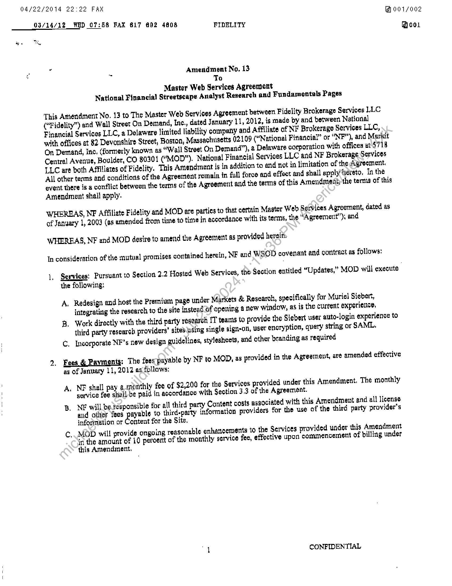
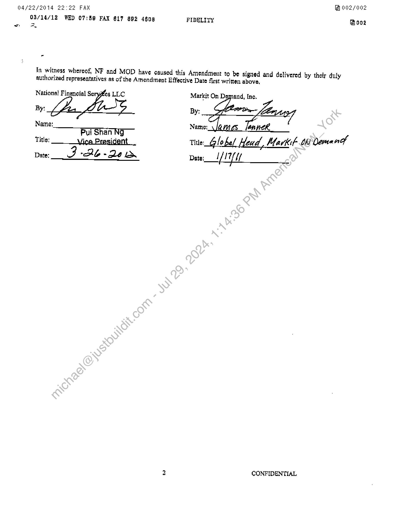

##### Amendment No. 13 to Master Web Services Agreement]

  
````col
```col-md
flexGrow=.5
===
> [!info] [Page 1](_attachments/images_Fidelity-NFS-3.6.1.6.2.300168654.pdf_210347/page_1.png)
> 
```  
```col-md
03/14/12 WED 07:58 Fax 617 €92 4808  
Odf22/2014 22:22 FAX
Moo1/o02  
FIDELITY Boo.  
Amendment No, 13
To
Master Web Services Agreement
National Financial Streetscape Analyst Research and Fundamentals Pages  
This Amendment No. 13 to The Master Web Services Agreement between Fidelity Brokerage Services LLC
(“Fidelity”) and Wall Street On Demand, Inc., dated January 11, 2012, is made by and between National
Financial Services LLC, a Delawere Jimited liability company and Affiliate of NF Brokerage Services LLC,
with offices at 82 Devonshire Street, Boston, Massachusetts 02109 (“National Financial” or “NF"), and Markit
On Demand, Inc. (formerly known as “Wall Street On Demand”), a Delaware corporation with offices at 4718
Central Avenue, Boulder, CO 80301 (“MOD”). National Financial Services LLC and NF Brokerage Services
LLC are both Affiliates of Fidelity. This Amendment is in addition to and not in limitation of the Agreement.
All other terms and conditions of the Agreement remain in full force and effect and shall apply‘hereto, In the
event there is a conflict between the terms of the Agreement and the terms of this Amendment; the terms of this
Amendment shall apply-  
WHEREAS, NF Affiliate Fidelity and MOD are parties to that certain Master Web Services Agreement, dated as
of January 1, 2003 (as amended from time to time in accordance with its terms, the “Apreement’”’), and  
WHEREAS, NF and MOD desite to amend the Agreement as provided hersin.
In consideration of the mutual promises contained herein, NF and WSOD covenant and contract as follows:  
1, Segyices: Pursuant to Section 2.2 Hosted Web Services, the Section entitled “Updates,” MOD will execute
the following:  
A. Redesign and host the Premium page under Mazkets & Research, specifically for Muriel Siebert,  
integrating the research to the site instead of opening a new window, as is the curtent experience,  
B. Work directly with the third party research IT teams to provide the Siebert user auto-login experience to
third party research providers’ sites using single sign-on, user encryption, quety string or SAML.
C. Incorporate NF’s new design guidelines, stylesheets, and other branding as required  
2, Fees & Paymenty: The fees payable by NF to MOD, as provided in the Agreement, are amended effective
as of January 11,2012 as follows:  
A. NEF shall pay a-monthly fee of $2,200 for the Services provided under this Amendment, The monthly
service fee shell-be paid in accordance with Section 3 3 of the Agreement.  
B. NE will be responsible for all third parry Content costs associated with this Amendment and all license
and other feos payable to third-party fnformation providers for the use of the third party provider's
information or Content for the Site.  
C.  
 MOD will provide ongoing reasonable enharicementa to the Services provided under this Amendment
in the amount of LQ percent of the monthly service fee, effective upon commencement of billing under
this Amendment.  
“4 CONFIDENTIAL  
```
````
Notes:    
````col
```col-md
flexGrow=.5
===
> [!info] [Page 2](_attachments/images_Fidelity-NFS-3.6.1.6.2.300168654.pdf_210347/page_2.png)
> 
```  
```col-md
04/22/2014 22:92 FAX
03/14/12 WED 07:58 FAX 617 892 4608  
”  
og2/002  
FIDELITY hove  
In witness whereof, NF and MOD have caused this Amendment to be signed and delivered by their duly
authorized representatives as of the Amendment Effective Date first written above,  
im]  
Markit On Demand, Inc.  
By:  
Nate: ft  
Hee
Title: Global Head, Markit th Demanch
Date; YI  
CONFIDENTIAL  
```
````
Notes:  


![[_attachments/Fidelity-NFS-3.6.1.6.2.3 00168654.pdf]