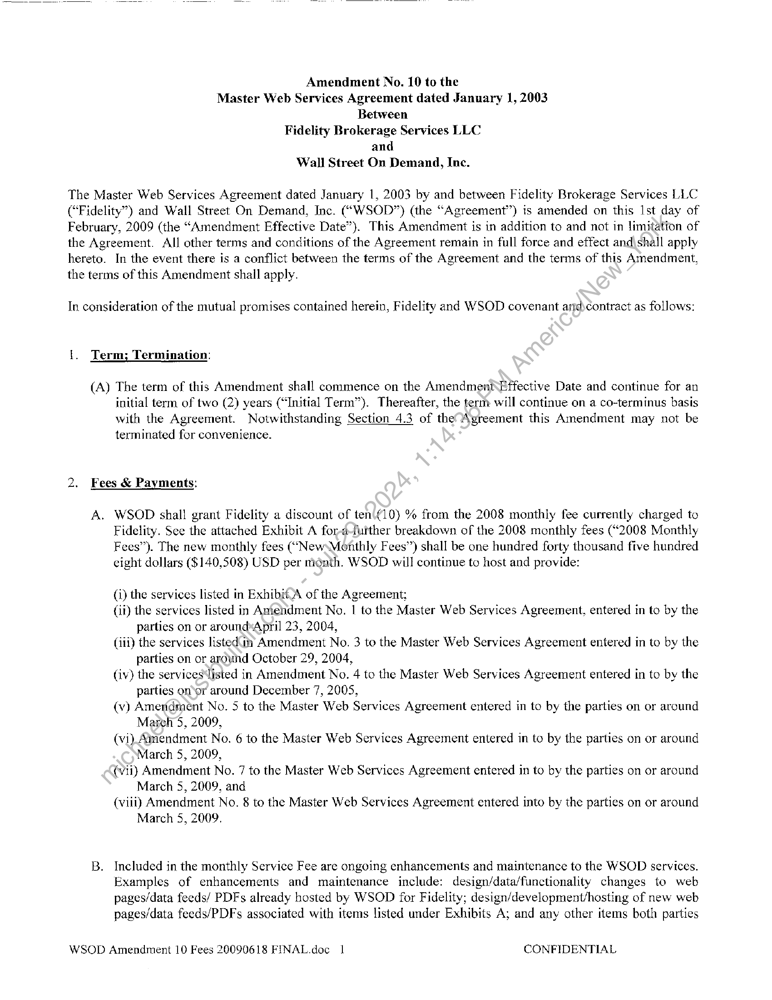
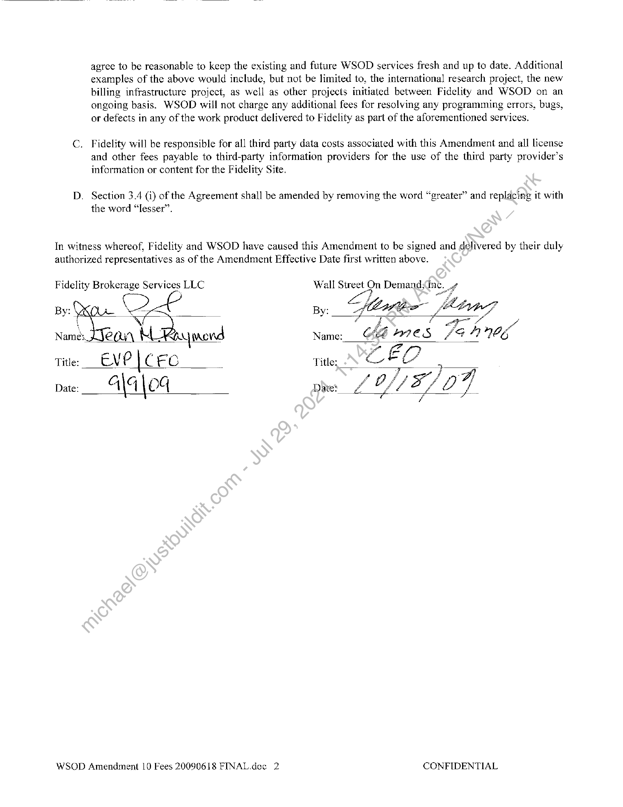
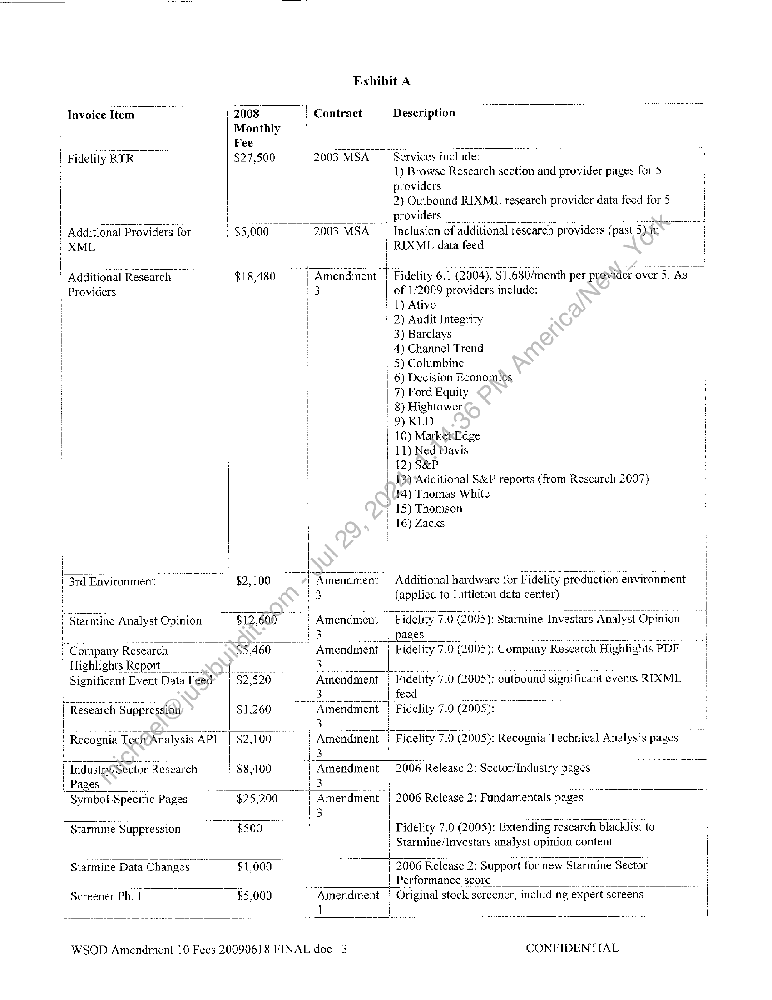
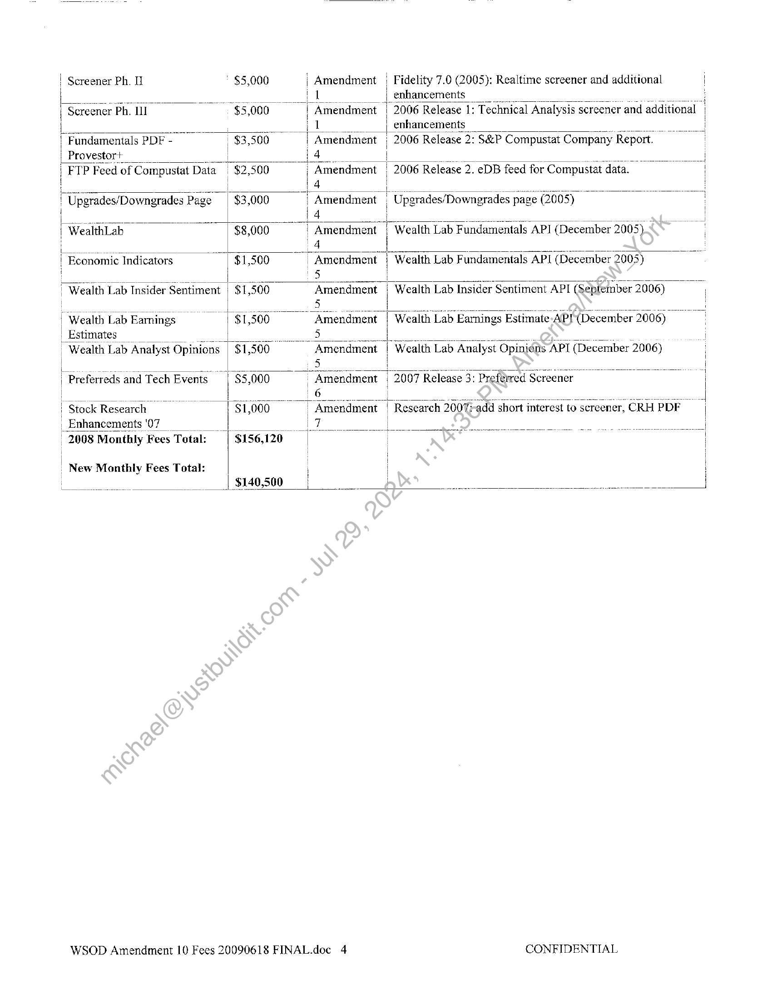

##### Amendment No. 10 to the Master Web Services Agreement]

  
````col
```col-md
flexGrow=.5
===
> [!info] [Page 1](_attachments/images_Fidelity-NFS-3.6.1.6.2.400165638.pdf_210309/page_1.png)
> 
```  
```col-md
Amendment No. 10 to the
Master Web Services Agreement dated January 1, 2003
Between
Fidelity Brokerage Services LLC
and
Wall Street On Demand, Inc.  
The Master Web Services Agreement dated January 1, 2003 by and between Fidelity Brokerage Services LLC
(“Fidelity”) and Wall Street On Demand, Inc. (“WSOD”) (the “Agreement”) is amended on this 1st day of
February, 2009 (the “Amendment Effective Date”). This Amendment is in addition to and not in limitation of
the Agreement. All other terms and conditions of the Agreement remain in full force and effect and\shall apply
hereto. In the event there is a conflict between the terms of the Agreement and the terms of this Amendment,
the terms of this Amendment shall apply.  
In consideration of the mutual promises contained herein, Fidelity and WSOD covenant and)contract as follows:  
{. Term; Termination:  
(A) The term of this Amendment shall commence on the Amendment\Effective Date and continue for an  
initial term of two (2) years (“Initial Term”). Thereafter, the term will continue on a co-terminus basis
with the Agreement. Notwithstanding Section 4.3 of the’ Agreement this Amendment may not be
terminated for convenience.  
2. Fees & Payments:  
A.  
WSOD shal! grant Fidelity a discount of ten\(10) % from the 2008 monthly fee currently charged to
Fidelity. See the attached Exhibit A for-adturther breakdown of the 2008 monthly fees (“2008 Monthly
Fees”). The new monthly fees (“‘NewsMonthly Fees’) shall be one hundred forty thousand five hundred
eight dollars ($140,508) USD per month. WSOD will continue to host and provide:  
(i) the services listed in ExhibitA of the Agreement;  
(ii) the services listed in Aniendment No. 1 to the Master Web Services Agreement, entered in to by the
parties on or aroundApril 23, 2004,  
(iii) the services listedin Amendment No. 3 to the Master Web Services Agreement entered in to by the
parties on or around October 29, 2004,  
(iv) the services‘isted in Amendment No. 4 to the Master Web Services Agreement entered in to by the
parties onor around December 7, 2005,  
(v) Ameridment No. 5 to the Master Web Services Agreement entered in to by the parties on or around
Mareh 5, 2009,  
(vi) Aimendment No. 6 to the Master Web Services Agreement entered in to by the parties on or around
March 5, 2009,  
(vii) Amendment No. 7 to the Master Web Services Agreement entered in to by the parties on or around
March 5, 2009, and  
(viii) Amendment No. 8 to the Master Web Services Agreement entered into by the parties on or around
March 5, 2009.  
Included in the monthly Service Fee are ongoing enhancements and maintenance to the WSOD services.
Examples of enhancements and maintenance include: design/data/functionality changes to web
pages/data feeds/ PDFs already hosted by WSOD for Fidelity; design/development/hosting of new web
pages/data feeds/PDFs associated with items listed under Exhibits A; and any other items both parties  
WSOD Amendment 10 Fees 20090618 FINAL.doc 1 CONFIDENTIAL  
```
````
Notes:    
````col
```col-md
flexGrow=.5
===
> [!info] [Page 2](_attachments/images_Fidelity-NFS-3.6.1.6.2.400165638.pdf_210309/page_2.png)
> 
```  
```col-md
agree to be reasonable to keep the existing and future WSOD services fresh and up to date. Additional
examples of the above would include, but not be limited to, the international research project, the new
billing infrastructure project, as well as other projects initiated between Fidelity and WSOD on an
ongoing basis. WSOD will not charge any additional fees for resolving any programming errors, bugs,
or defects in any of the work product delivered to Fidelity as part of the aforementioned services.  
C. Fidelity will be responsible for all third party data costs associated with this Amendment and all license
and other fees payable to third-party information providers for the use of the third party provider’s
information or content for the Fidelity Site.  
D. Section 3.4 (i) of the Agreement shall be amended by removing the word “greater” and replacing it with
the word “lesser”.  
In witness whereof, Fidelity and WSOD have caused this Amendment to be signed and delivered by their duly
authorized representatives as of the Amendment Effective Date first written above.  
Fidelity Brokerage Services LLC Wall oe On Demand;n¢. aed
By: ; By: flrer tract
rf Ni IG.
Names AJC OY) Name: ae EC AIFE S 4 Ena.  
aa
Title: EV? | € EC Title: eo EO
Date: aa {04 Date: Zo O// 5/0 7  
WSOD Amendment 10 Fees 20090618 FINAL.doc 2 CONFIDENTIAL  
```
````
Notes:    
````col
```col-md
flexGrow=.5
===
> [!info] [Page 3](_attachments/images_Fidelity-NFS-3.6.1.6.2.400165638.pdf_210309/page_3.png)
> 
```  
```col-md
Exhibit A  
! Invoice Item ~ 2008 “| Contract | Description
Monthly i
Fee _ i  
Fidelity RT ‘| $27,500  
2003 MS  
| 1) Browse Research section and provider pages for 5
' providers
2) Outbound RIXML research provider data feed for 5
“Raditional ‘Providers for — 5, 000 2003 MSA Inclusion of additional research providers (past 54 in
i XML | | RIXML data feed.
| Additional Research $18,480 ' Amendment
| Providers 3 | of 1/2009 providers include:
; / | 1) Ativo
: | 2) Audit Integrity
' | _ 3) Barclays
| : _ 4) Channel Trend  
Hi
i
i
]
i
iv  
| Fidelity 61 (2004). $1,680/month per provider over 5. As |  
; _ 5) Columbine  
| 6) Decision Economits  
7) Ford Equity  
_ 8) Hightower :  
! | 9) KLD  
| | | 10) MarkexEdge  
: : | LL) Ned Davis /
| 12) S&P  
13) “Additional S&P reports (from Research 2007) i  
| 4) Thomas White |  
” 15) Thomson  
_ 16) Zacks !  
i
Amendment | Additional hardware for Fidelity production environment |
i  
$2,100
| 3 (applied to Littleton data center)
a =m foe — sane pe anni hn a HE $12,600 , Amendment | Fidelity 7.0 (2005): Starmine-Investars Analyst Opinion
Ae rr
$5,460 | Amendment Fidelity 7.0 (2005): Company Research Highlights PDF
: $2,520 | Amendment | Fidelity 7.0 (2005): outbound significant events RIXML
i Research Suppression $1,260 “Amendment | | ‘Fidelity 7.0 (2005):
ee 3s ee i
| Recognia Tech Analysis API_ | $2,100 Amendment il Fidelity 7.0 (2005): Recognia Technical Analysis pages
i 3
pe) ee 4 — | a i a ~ ane
| Industry/Sector Research $8,400 Amendment | 2006 Release 2: Sect
| Pages a 13 — i
Symbol-Specific Pages $25,200 7 Amendment [2006 Release 2: Fundamentals | pages |
pee _ en es a
| Starmine Suppression $500 | Fidelity 7.0 (2005): Extending research blacklist to :
! | | Starmine/Investars analyst opinion content :
Starmine Data Changes $1,000 : | 2006 Release 2: Support for new Starmine Sector :
i _ { Performance score _ ee
_ Screener Ph. | $5,000 ' Amendment | Original stock screener, including expert screens  
WSOD Amendment 10 Fees 20090618 FINAL.doc 3 CONFIDENTIAL  
```
````
Notes:    
````col
```col-md
flexGrow=.5
===
> [!info] [Page 4](_attachments/images_Fidelity-NFS-3.6.1.6.2.400165638.pdf_210309/page_4.png)
> 
```  
```col-md
Screener Ph. I $5,000 ; Amendment : Fidelity 7.0 (2005): Realtime screener and additional !  
| Screener Ph. I~ “$5,000 Amendment ' 2006 Release 1: Technical A Analysis s screener and additional !
iz oe ee es ee enhancements _ ew
r ‘Fundamentals PDF - $3,500 | Amendment | 2006 Release 2: S&P Compustat Company Report.
| Provestor) = ec a
i | FTP Feed of Compustat Data $2,500 i “Amendment | 2006 Release 2. eDB feed for Compustat data.
L | J4 oe
i ipgrades/Downgrades I Page $3,000 i Amendment | Uperades/Downgrades | page (2005)
1 l4
| WealthLab — $8,000 | Amendment
4
— be a tar el Ieee ee re
i | Economic Indicators $1,500 ~ Amendment Wealth Lab Fundamentals APL (December 2003)
5
' Weaith Lab Insider Sentiment | $1,500 ‘Amendinent | Wealth Lab Insider Sentiment API (September 2006)
| ‘Wealth LabEamings «| $1,500. “Amendment | Wealth Lab Earnings Estimate-AP]- (December 2006)
“Wealth Lab Analyst ‘Opinions | "$1,500 “Amendment : Wealth Lab Analyst Opinions API (December 2006)
|
fe ee [ oo i
Preferreds and Tech Events. $5,000 Amendment | "2007 Release 3: Preferred Screener
_ ee ve 6 |
Stock Research $1,000
Enhancements '07 ee i
2608 Monthly Fees Total: | $156,120 |
| New Monthly Fees Total: | :
a $140,500 } oe —  
WSOD Amendment 10 Fees 20090618 FINAL.doc 4 CONFIDENTIAL  
```
````
Notes:  


![[_attachments/Fidelity-NFS-3.6.1.6.2.4 00165638.pdf]