##### Master Service Agreement]

  
````col
```col-md
flexGrow=.5
===
> [!info] [Page 1](_attachments/images_FinTimes-3.6.1.7.1TheFinancialTimesLTD-MA.pdf_210329/page_1.png)
> 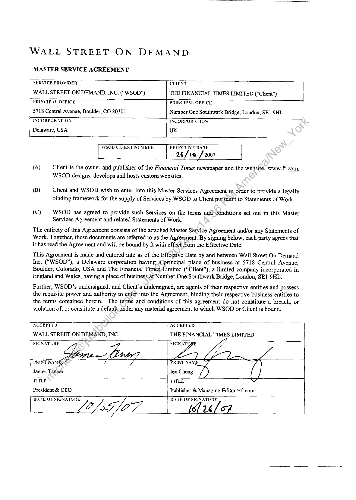
```  
```col-md
WALL STREET ON DEMAND  
MASTER SERVICE AGREEMENT  
SERVICE PROVIDER CLIENT
WALL STREET ON DEMAND, INC. (“WSOD”) THE FINANCIAL TIMES LIMITED (“Client”)  
PRINCIPAL OFFICE PRINCIPAL OFFICE  
5718 Central Avenue, Boulder, CO 80301 Number One Southwark Bridge, London, SE] 9HL
INCORPORATION INCORPORATION  
Delaware, USA UK  
WSOD CLIENT NU  
(A) Client is the owner and publisher of the Financial Times newspaper and the website, www.ft.com.
WSOD designs, develops and hosts custom websites.  
(B) Client and WSOD wish to enter into this Master Services Agreement in order to provide a legally
binding framework for the supply of Services by WSOD to Client pursuant to Statements of Work.  
(C) | WSOD has agreed to provide such Services on the terms and-conditions set out in this Master
Services Agreement and related Statements of Work.  
The entirety of this Agreement consists of the attached Master Service Agreement and/or any Statements of
Work. Together, these documents are referred to as the Agreement. By signing below, each party agrees that
it has read the Agreement and will be bound by it with effect from the Effective Date.  
This Agreement is made and entered into as of the Effective Date by and between Wall Street On Demand
Inc. (“WSOD”), a Delaware corporation having 4 principal place of business at 5718 Central Avenue,
Boulder, Colorado, USA and The Financial Times/Limited (“Client”), a limited company incorporated in
England and Wales, having a place of business atNumber One Southwark Bridge, London, SE1 9HL.  
Further, WSOD’s undersigned, and Client’s undersigned, are agents of their respective entities and possess
the requisite power and authority to enter into the Agreement, binding their respective business entities to
the terms contained herein. The terms and conditions of this agreement do not constitute a breach, or
violation of, or constitute a default.under any material agreement to which WSOD or Client is bound.  
ACCEPTED ACCEPTED
WALL STREET ON DEMAND, INC. THE FINANCIAL TIMES LIMITED  
e ATURE
— mn  
James Tanner  
Ten Cheng  
TITLE FITLE
President & CEO Publisher & Managing Editor FT.com  
DAFE GF SIGNATURE — DATE OF SIGNATURE |
727 ae IE: J  
```
````
Notes:    
````col
```col-md
flexGrow=.5
===
> [!info] [Page 2](_attachments/images_FinTimes-3.6.1.7.1TheFinancialTimesLTD-MA.pdf_210329/page_2.png)
> 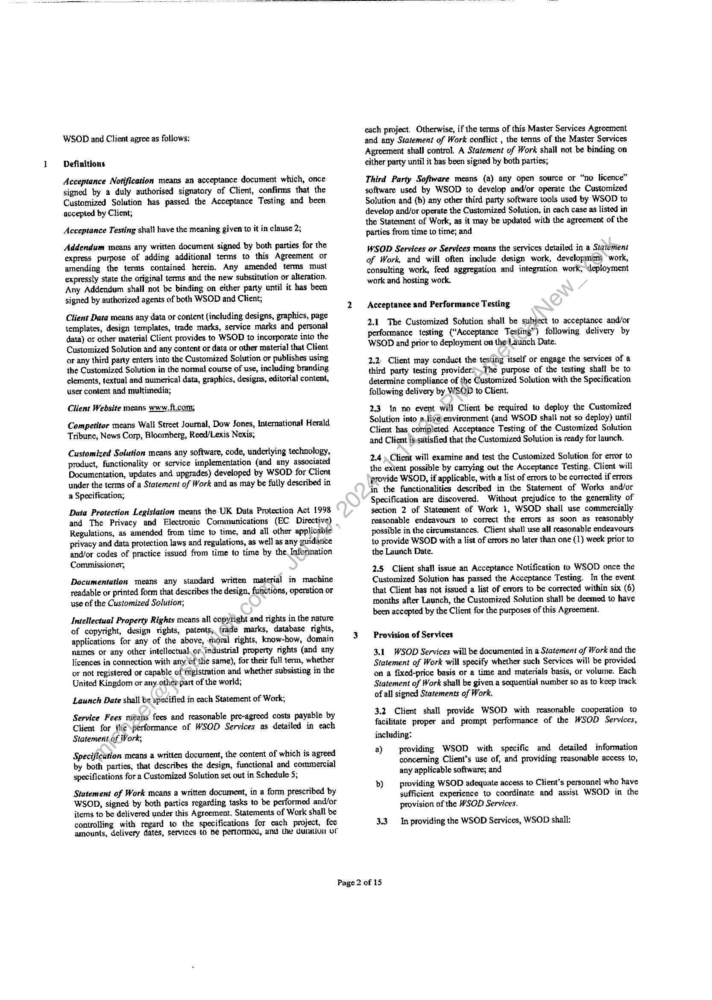
```  
```col-md
WSOD and Client agree as follows:  
Definitions  
Acceptance Notification means an acceptance document which, once
signed by a duly authorised signatory of Client, confirms that the
Customized Solution has passed the Acceptance Testing and been
accepted by Client;  
Acceptance Testing shall have the meaning given to it in clause 2;  
Addendum means any written document signed by both parties for the
express purpose of adding additional terms to this Agreement or
amending the terms contained herein, Any amended terms must
expressly state the original terms and the new substitution or alteration,
Any Addendum shall not be binding on either party until it has been
signed by authorized agents of both WSOD and Client,  
Client Data means any data or content (including designs, graphics, page
templates, design templates, trade marks, service marks and personal
data) or other material Client provides to WSOD to incorporate into the
Customized Solution and any content or data or other material that Client
of any third party enters into the Customized Solution or publishes using
the Customized Solution in the normal course of use, including branding
elements, textual and numerical data, graphics, designs, editorial content,
user content and multimedia;  
Client Website means www.ft.com,  
Competitor means Wall Street Journal, Dow Jones, International Herald
Tribune, News Corp, Bloomberg, Reed/Lexis Nexis;  
Customized Solution means any software, code, underlying technology,
product, functionality or service implementation (and any associated
Documentation, updates and upgrades) developed by WSOD for Client
under the terms of a Statement of Work and as may be fully described in
a Specification,  
Data Protection Legislation means the UK Data Protection Act 1998
and The Privacy and Electronic Communications (EC Directive)
Regulations, as amended from time to time, and all other applicable
privacy and data protection laws and regulations, as well as any guidatice
and/or codes of practice issued from time to time by the Information
Commissioner,  
Documentation means any standard written material in machine
readable or printed form that describes the design, functions, operation or
use of the Customized Solution;  
Intellectual Property Rights means all copyright and rights in the nature
of copyright, design rights, patents; trade marks, database rights,
applications for any of the above, «moral rights, know-how, domain
names or any other intellectual.or industrial property rights (and any
licences in connection with any’of the same), for their full term, whether
or not registered or capable of fégistration and whether subsisting in the
United Kingdom or any other-part of the world;  
Launch Date shall be specified in each Statement of Work;  
Service Fees nitans fees and reasonable pre-agreed costs payable by
Client for iHe\performance of WSOD Services as detailed in tach
Statement of Work,  
Specification means a written document, the content of which is agreed
by both parties, that describes the design, functional and commercial
specifications for a Customized Solution set out in Schedule 5;  
Statement of Work means a written document, in a form prescribed by
WSOD, signed by both partics regarding tasks to be performed and/or
items to be delivered under this Agreement. Statements of Work shall be  
controlling with regard to the specifications for each project, fee
amounts, delivery dates, serviccs {0 be performed, and the durallun oF  
each project. Otherwise, if the terms of this Master Services Agreement
and any Statement of Work conflict , the terms of the Master Services
Agreement shall control. A Statement of Work shall not be binding on
either party until it has been signed by both parties;  
Third Party Software means (a) any open source or “no licence”
software used by WSOD to develop and/or operate the Customized
Solution and (b) any other third party software tools used by WSOD to
develop and/or operate the Customized Solution, in each case as listed in
the Statement of Work, as it may be updated with the agreement of the
parties from time to time; and  
WSOD Services or Services means the services detailed in a Statement
of Work, and will often include design work, development “work,
consulting work, feed aggregation and integration work, deployment
work and hosting work.  
Acceptance and Performance Testing  
2.1. The Customized Solution shall be subject to acceptance and/or
performance testing (“Acceptance Testing”) following delivery by
WSOD and prior to deployment on the'Launch Date.  
2.2: Client may conduct the testing itself or engage the services of a
third party testing providersThe purpose of the testing shall be to
determine compliance of the Customized Solution with the Specification
following delivery by WSOD to Client,  
2.3 In no event will Client be required to deploy the Customized
Solution into a.live)environment (and WSOD shall not so deploy) until
Client has completed Acceptance Testing of the Customized Solution
and Client iS:satisfied that the Customized Solution is ready for launch.  
2.4» Client will examine and test the Customized Solution for error to
the extent possible by carrying out the Acceptance Testing. Client will
provide WSOD, if applicable, with a list of errors to be corrected if errors
in the functionalities described in the Statement of Works and/or
Specification are discovered. Without prejudice to the generality of
section 2 of Statement of Work 1, WSOD shall use commercially
reasonable endeavours to correct the etrors as soon as reasonably
possible in the circumstances. Client shall use all reasonable endeavours
to provide WSOD with a list of errors no later than one (1) week prior to
the Launch Date.  
2.5 Client shall issue an Acceptance Notification to WSOD once the
Customized Solution has passed the Acceptance Testing. In the event
that Client has not issued a list of errors to be corrected within six (6)
months after Launch, the Customized Solution shall be deemed to have
been accepted by the Client for the purposes of this Agreement.  
Provision of Services  
3.1 WSOD Services will be documented in a Statement of Work and the
Statement of Work wiil specify whether such Services will be provided
on a fixed-price basis or a time and materials basis, or volume. Each
Statement of Work shall be given a sequential number so as to keep track
of all signed Statements of Work.  
3.2. Client shall provide WSOD with reasonable cooperation to
facilitate proper and prompt performance of the WSOD Services,
including:  
a) providing WSOD with specific and detailed information
concerning Client’s use of, and providing reasonable access to,
any applicable software; and  
b) providing WSOD adequate access to Client’s personnel who have
sufficient experience to coordinate and assist WSOD in the
provision of the WSOD Services.  
3.3. In providing the WSOD Services, WSOD shall:  
Page 2 of 15  
```
````
Notes:    
````col
```col-md
flexGrow=.5
===
> [!info] [Page 3](_attachments/images_FinTimes-3.6.1.7.1TheFinancialTimesLTD-MA.pdf_210329/page_3.png)
> 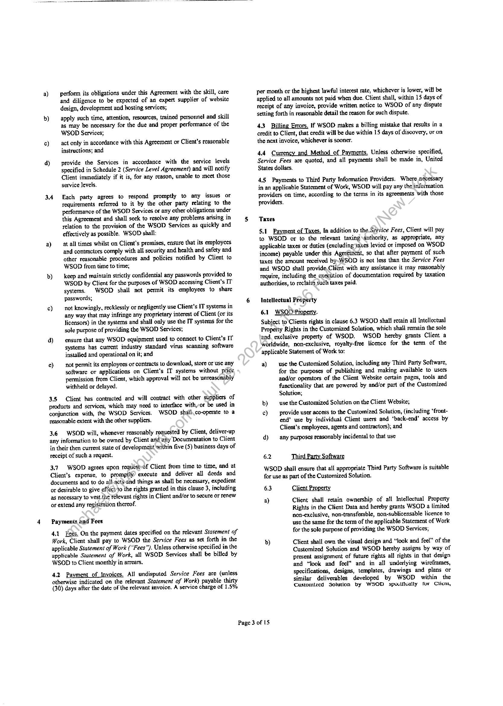
```  
```col-md
a) perform its obligations under this Agreement with the skill, care
and diligence to be expected of an expert supplier of website
design, development and hosting services;  
b) apply such time, attention, resources, trained personnel and skill
as may be necessary for the due and proper performance of the
WSOD Services;  
¢) act only in accordance with this Agreement or Client’s reasonable
instructions; and  
d) provide the Services in accordance with the service levels
specified in Schedule 2 (Service Level Agreement) and will notify
Client immediately jf it is, for any reason, unable to meet those
service levels.  
3.4 Each party agrees to respond promptly to any issues or
requirements referred to it by the other party relating to the
performance of the WSOD Services or any other obligations under
this Agreement and shall seck to resolve any problems arising in
relation to the provision of the WSOD Services as quickly and
effectively as possible. WSOD shall:  
a) at all times whilst on Client's premises, ensue that its employees
and contractors comply with all security and health and safety and
other reasonable procedures and policies notified by Client to
WSOD from time to time;  
b) keep and maintain strictly confidential any passwords provided to
WSOD by Client for the purposes of WSOD accessing Client’s IT
systems. WSOD shall not permit its employees to share
passwords;  
¢) not knowingly, recklessly or negligently use Client’s IT systems in
any way that may infringe any proprietary interest of Client (or its
ficensors) in the systems and shall only use the IT systems for the
sole purpose of providing the WSOD Services;  
d) ensure that any WSOD equipment used to connect to Client’s IT
systems has current industry standard virus scanning software
installed and operational on it; and  
€) _ not permit its employees or contracts to download, store or use any
software or applications on Client’s IT systems without ptior,
permission from Client, which approval will not be ‘unreasonably
withheld or delayed.  
3.5 Client has contracted and will contract with other suppliers of
products and services, which may need to interface withyor be used in
conjunction with, the WSOD Services. WSOD shall.co-operate to a
reasonable extent with the other suppliers.  
3.6 WSOD will, whenever reasonably requested by Client, deliver-up
any information to be owned by Client and any Documentation to Client
in their then current state of development within five (5) business days of
receipt of such a request.  
3.7. WSOD agrees upon requestvof Client from time to time, and at
Client’s expense, to promptly) execute and deliver all deeds and
documents and to do aJl-act3-and things as shall be necessary, expedient
or desirable to give effect to the rights granted in this clause 3, including
as necessary to vest.the télevant rights in Client and/or to secure or renew
or extend any regisifation thereof.  
Payments and Fees  
4,1. Fees. On the payment dates specified on the relevant Statement of
Work, Client shail pay to WSOD the Service Fees as set forth in the
applicable Statement of Work (“Fees”). Unless otherwise specified in the
applicable Statement of Work, all WSOD Services shall be billed by
WSOD to Client monthly in arrears.  
4.2. Payment of Invoices. All undisputed Service Fees are (unless
otherwise indicated on the relevant Statement of Work) payable thirty
(30) days after the date of the relevant invoice. A service charge of 1.5%  
per month or the highest lawful interest rate, whichever is lower, will be
applied to all amounts not paid when due. Client shall, within 15 days of
receipt of any invoice, provide written notice to WSOD of any dispute
setting forth in reasonable detail the reason for such dispute.  
4.3 Billing Esrors. If WSOD makes a billing mistake that results in a
credit to Client, that credit will be due within 15 days of discovery, or on
the next invoice, whichever is sooner.  
4.4 Currency _and Method of Payments. Unless otherwise specified,
Service Fees are quoted, and all payments shall be made in, United
States dollars.  
4,5 Payments to Third Party Information Providers. Where necessary
in an applicable Statement of Work, WSOD will pay any the information.
providers on time, according to the terms in its agreements with those
providers.  
Taxes  
5.1 Payment of Taxes. In addition to the. Szrvice Fees, Client will pay
to WSOD or to the relevant taxing \authority, as appropriate, any
applicable taxes or duties (excluding yaxes levied or imposed on WSOD
income) payable under this Agreétnent, so that after payment of such
taxes the amount received by-WSOD is not tess than the Service Fees
and WSOD shall provide.Client with any assistance it may reasonably
require, including the execttion of documentation required by taxation
authorities, to reclaimn such taxes paid.  
Intellectual Property  
6.1 WSOD Property.  
Subject to'Clients rights in clause 6.3 WSOD shall retain all Intellectual
Propeity Rights in the Customized Solution, which shall remain the sole
and, exclusive property of WSOD, WSOD hereby grants Client a
worldwide, non-exclusive, royalty-free licence for the term of the
applicable Statement of Work to:  
a) use the Customized Solution, including any Third Party Software,
for the purposes of publishing and making available to users
and/or operators of the Client Website certain pages, tools and
fanctionality that are powered by and/or part of the Customized
Solution,  
b) _use the Customized Solution on the Client Website;  
¢) provide user access to the Customized Solution, {including ‘frontend’ use by individual Client users and ‘back-end’ access by
Client’s employees, agents and contractors); and  
d) any purposes reasonably incidental to that use  
62 Third Party Software  
WSOD shall ensure that all appropriate Third Party Software is suitable
for use as part of the Customized Solution.  
63 Client Property
a) Client shall retain ownership of all Intellectual Property  
Rights in the Client Data and hereby grants WSOD a limited
non-exclusive, non-transferable, non-sublicensable licence to
use the same for the term of the applicable Statement of Work
for the sole purpose of providing the WSOD Services;  
bd) Client shall own the visual design and “look and feel” of the
Customized Sofution and WSOD hereby assigns by way of
present assignment of future rights all rights in that design
and “look and feel and in all underlying wireframes,
specifications, designs, templates, drawings and plans or
similar deliverables developed by WSOD within the
Customized Solution vy WSOD spuilically for Client,  
Page 3 of 15  
```
````
Notes:    
````col
```col-md
flexGrow=.5
===
> [!info] [Page 4](_attachments/images_FinTimes-3.6.1.7.1TheFinancialTimesLTD-MA.pdf_210329/page_4.png)
> 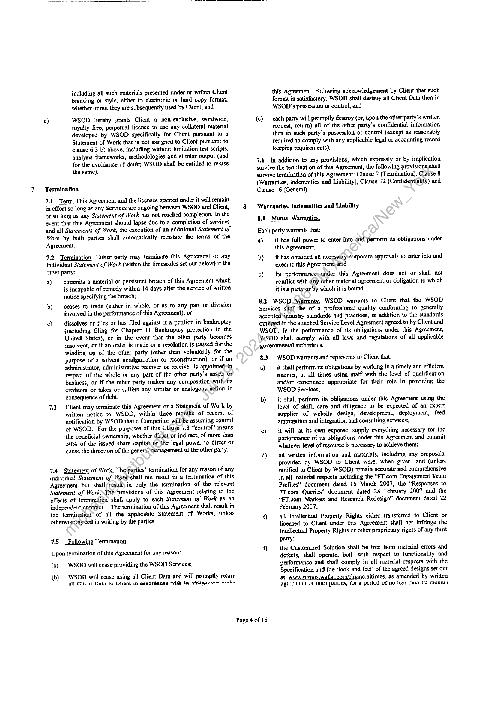
```  
```col-md
including all such materials presented under or within Client
branding or style, either in electronic or hard copy format,
whether or not they are subsequently used by Client; and  
c) WSOD hereby grants Client a non-exclusive, wordwide,
royalty free, perpetual licence to use any collateral material
developed by WSOD specifically for Client pursuant to a
Statement of Work that is not assigned to Client pursuant to
clause 6.3 b) above, including without limitation test scripts,
analysis frameworks, methodologies and similar output (and
for the avoidance of doubt WSOD shall be entitled to re-use
the same).  
Termination  
7.1 Tem, This Agreement and the licenses granted under it will remain
in effect so long as any Services are ongoing between WSOD and Client,
or so long as any Statement of Work has not reached completion. In the
event that this Agreement should lapse duc to a completion of services
and all Statements of Work, the execution of an additional Statement of
Work by both parties shall automatically reinstate the terms of the
Agreement.  
7.2 Termination. Either party may terminate this Agreement or any
individual Statement of Work (within the timescales set out below) if the
other party:  
a) commits a material or persistent breach of this Agreement which
is incapable of remedy within 14 days after the service of written
notice specifying the breach,  
b) ceases to trade (either in whole, or as to any part or division
involved in the performance of this Agreement); or  
©) dissolves or files or has filed against it a petition in bankruptcy
(including filing for Chapter 1] Bankruptcy protection in the
United States), or in the event that the other party becomes
insolvent, or if an order is made or a resolution is passed for the
winding up of the other party (other than voluntarily for the
purpose of a solvent amalgamation or reconstruction), or if an
administrator, administrative receiver or receiver is appointed-in
respect of the whole or any part of the other party’s asseis or
business, or if the other party makes any composition withits
creditors or takes or suffers any similar or analogous. action in
consequence of debt.  
7,3 Client may terminate this Agreement or a Statement of Work by
written notice to WSOD, within three months of receipt of
notification by WSOD that a Competitor will\be assuming control
of WSOD. For the purposes of this Clause 7.3 “control” means
the beneficial ownership, whether direct or indirect, of more than
50% of the issued share capital or the legal power to direct or
cause the direction of the general‘ management of the other party,  
7.4 Statement of Work, The parties’ (rmination for any reason of any
individual Statement of Work’shall not result in a termination of this
Agreement but shall (result) in only the termination of the relevant
Statement of Work’The provisions of this Agreement relating to the
effects of termination shall apply to each Statement of Work as an
independent.contract. The termination of this Agreement shall result in
the termination’ of all the applicable Statement of Works, unless
otherwise greed in writing by the parties.  
7.5 _Following Termination
‘Upon termination of this Agreement for any reason:
(a) | WSOD will cease providing the WSOD Services;  
{b) | WSOD will cease using all Client Data and will promptly return
ull Clivut Datu tv Client in aevordaney with ity vbligations under  
this Agreement. Following acknowledgement by Client that such
format is satisfactory, WSOD shall destroy all Client Data then in
WSOD’s possession or control; and  
(©) _ each party will promptly destroy (or, upon the other party’s written
request, return) all of the other party’s confidential information
then in such party’s possession or control (except as reasonably
required to comply with any applicable legal or accounting record
keeping requirements).  
7.6 In addition to any provisions, which expressly or by implication
survive the termination of this Agreement, the following provisions shall
survive termination of this Agreement: Clause 7 (Termination), Clause 8
(Warranties, indemnities and Liability), Clause 12 (Confidentiality) and
Clause 16 (General).  
Warranties, Indemuitles and Liability
8.1 Mutual Warranties.  
Each party warrants that:
a) it has full power to enter into end perform its obligations under
this Agreement;  
b) _ it has obtained all necessary\corporate approvals to enter into and
execute this Agreementyand  
c) its performancecunder this Agreement does not or shall not
conflict with any other material agreement or obligation to which
it is a party-or by which it is bound.  
8.2 WSOD Warranty. WSOD warrants to Client that the WSOD
Services shall*be of a professional quality conforming to generally
accepted industry standards and practices, in addition to the standards
outlined in the attached Service Level Agreement agreed to by Client and
WSOD. In the performance of its obligations under this Agreement,
WSOD shail comply with all laws and regulations of all applicable
governmental authorities.  
8.3 WSOD warrants and represents to Client that:  
a) it shall perform its obligations by working in a timely and efficient
manner, at all times using staff with the level of qualification
and/or experience appropriate for their role in providing the
WSOD Services;  
b) __ it shall perform its obligations under this Agreement using the
Jevel of skill, care and diligence to be expected of an expert
supplier of website design, development, deployment, feed
aggregation and integration and consulting services;  
c) it will, at its own expense, supply everything necessary for the
performance of its obligations under this Agreement and commit
whatever level of resource is necessary to achieve them;  
d) all written information and materials, including any proposals,
provided by WSOD to Client were, when given, and (unless
notified to Client by WSOD) remain accurate and comprehensive
in all material respects including the “FT.com Engagement Team
Profiles” document dated 15 March 2007, the “Responses to
FT.com Queries” document dated 28 February 2007 and the
“FT.com Markets and Research Redesign” document dated 22
February 2007;  
3) all Intellectual Property Rights either transferred to Client or
licensed to Client under this Agreement shall not infringe the
Intellectual Property Rights or other proprietary rights of any third
party;  
f) the Customized Solution shall be free from material errors and
defects, shall operate, both with respect to functionality and
performance and shall comply in all material respects with the
Specification and the ‘look and feel’ of the agreed designs set out  
at www.protos.wallst.comvfinancialtimes as amended by written
ayrecmcut Uf VoL parucs, Tor a period of nv icss than 12 munis  
Page 4 of 15  
```
````
Notes:    
````col
```col-md
flexGrow=.5
===
> [!info] [Page 5](_attachments/images_FinTimes-3.6.1.7.1TheFinancialTimesLTD-MA.pdf_210329/page_5.png)
> 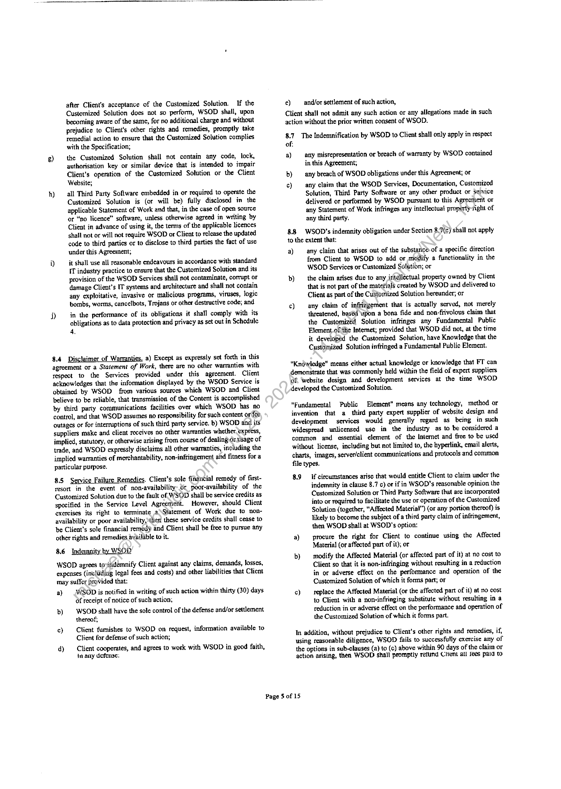
```  
```col-md
after Client's acceptance of the Customized Solution. If the
Customized Solution does not so perform, WSOD shall, upon
becoming aware of the same, for no additional charge and without
prejudice to Client's other rights and remedies, promptly take
remedial action to ensure that the Customized Solution complies
with the Specification;  
2) the Customized Solution shall not contain any code, lock,
authorisation key or similar device that is intended to impair
Client's operation of the Customized Solution or the Client
Website;  
h) all Third Party Software embedded in or required to operate the
Customized Solution is (or will be) fully disclosed in the
applicable Statement of Work and that, in the case of open source
or “no licence” software, unless otherwise agreed in writing by
Client in advance of using it, the terms of the applicable licences
shall not or will not require WSOD or Client to release the updated
code to third parties or to disclose to third parties the fact of use
under this Agreement;  
i) it shall use all reasonable endeavours in accordance with standard
IT industry practice to ensure that the Customized Solution and its
provision of the WSOD Services shall not contaminate, corrupt or
damage Client’s IT systems and architecture and shall not contain
any exploitative, invasive or malicious programs, viruses, logic
bombs, worms, cancelbots, Trojans or other destructive code; and  
Dd in the performance of its obligations it shall comply with its
obligations as to data protection and privacy as set out in Schedule
4.  
8.4 Disclaimer of Warranties, a) Except as expressly set forth in this
agreement or a Statement of Work, there are no other warranties with
respect to the Services provided under this agreement. Client
acknowledges that the information displayed by the WSOD Service is
obtained by WSOD from various sources which WSOD and Client
believe to be reliable, that transmission of the Content is accomplished
by third party coramunications facilities over which WSOD has no
control, and that WSOD assumes no responsibility for such content or for
outages or for interruptions of such third party service. b) WSOD and its
suppliers make and client receives no other warranties whether. express,
implied, statutory, or otherwise arising from course of dealing or.usage of
trade, and WSOD expressly disclaims all other warranties, including the
implied warranties of merchantability, non-infringement and fitness for a
particular purpose.  
8.5 Service Failure Remedies. Client’s sole financial remedy of firstresort in the event of non-availability: Or_poor-availability of the
Customized Solution due to the fault of, WSOD shall be service credits as
specified in the Service Level Agreement. However, should Client
exercises its right to terminate a\Statement of Work due to nonavailability or poor availability, thea these service credits shall cease to
be Chient’s sole financial remedy and Client shall be free to pursue any
other rights and remedies available to it.  
8.6 Indemnity by WSOD  
WSOD agrees tonitidémnify Client against any claims, demands, losses,  
expenses (inclading legal fees and costs) and other liabilities that Client  
may suffer provided that:  
a) WSOD is notified in writing of such action within thirty (30) days
of receipt of notice of such action;  
b}  WSOD shall have the sole control of the defense and/or settlement
thereof;  
c) Client fumishes to WSOD on request, information available to
Client for defense of such action;  
d) Client cooperates, and agrees to work with WSOD in good faith,
in any defense:  
e) and/or settlement of such action,  
Client shall not admit any such action or any allegations made in such
action without the prior written consent of WSOD.  
8.7 The Indemnification by WSOD to Client shall only apply in respect  
of:  
a) any misrepresentation or breach of warranty by WSOD contained
in this Agreement,  
b) —_ any breach of WSOD obligations under this Agreement; or  
c) any claim that the WSOD Services, Documentation, Customized
Solution, Third Party Software or any other product or seivice
delivered or performed by WSOD pursuant to this Agreement or
any Statement of Work infringes any intellectual property-right of
any third party.  
8.8 WSOD’s indemnity obligation under Section 8.7(c) shall not apply
to the extent that:  
a) any claim that arises out of the substarico-of a specific direction
from Client to WSOD to add or modify a functionality in the
WSOD Services or Customized Solution; or  
b) __ the claim arises due to any iritellectual property owned by Client
that is not part of the materials created by WSOD and delivered to
Client as part of the Customized Solution hereunder; or  
c) any claim of infringement that is actually served, not merely
threatened, baséd pon a bona fide and non-frivolous claim that
the Customized Solution infringes any Fundamental Public
Element ofthe Intemet; provided that WSOD did not, at the time
it developéd the Customized Solution, have Knowledge that the
Customized Solution infringed a Fundamental Public Element.  
"Knéwiedge" means either actual knowledge or knowledge that FT can
demonstrate that was commonly held within the field of expert suppliers
Gf. Website design and development services at the time WSOD
developed the Customized Solution.  
“Fundamental Public Element" means any technology, method or
invention that a third party expert supplier of website design and
development services would generally regard as being in such
widespread unlicensed use in the industry as to be considered a
common and essential element of the Internet and free to be used
without license, including but not limited to, the hyperlink, email alerts,
charts, images, server/client communications and protocols and common
file types.  
8.9 If circumstances arise that would entitle Client to claim under the
indemnity in clause 8.7 ¢) or if in WSOD’s reasonable opinion the
Customized Solution or Third Party Software that are incorporated
into or required to facilitate the use or operation of the Customized
Solution (together, “Affected Material”) (or any portion thereof) is
likely to become the subject of a third party claim of infringement,
then WSOD shall at WSOD’s option:  
a) procure the right for Client to continue using the Affected
Material (or affected part of it), or  
b} modify the Affected Material (or affected part of it) at no cost to
Client so that it is non-infringing without resulting in a reduction
in or adverse effect on the performance and operation of the
Customized Solution of which it forms part; or  
c) replace the Affected Material (or the affected part of il) at no cost
to Client with a non-infringing substitute without resulting in a
reduction in or adverse effect on the performance and operation of
the Customized Solution of which it forms part.  
In addition, without prejudice to Client’s other rights and remedies, if,
using reasonable diligence, WSOD fails to successfully exercise any of
the options in sub-clauses (a) to (c) above within 90 days of the claim or
action arisitg, then WSOD shall promptly refund Client all lees paid to  
Page 5 of 15  
```
````
Notes:    
````col
```col-md
flexGrow=.5
===
> [!info] [Page 6](_attachments/images_FinTimes-3.6.1.7.1TheFinancialTimesLTD-MA.pdf_210329/page_6.png)
> 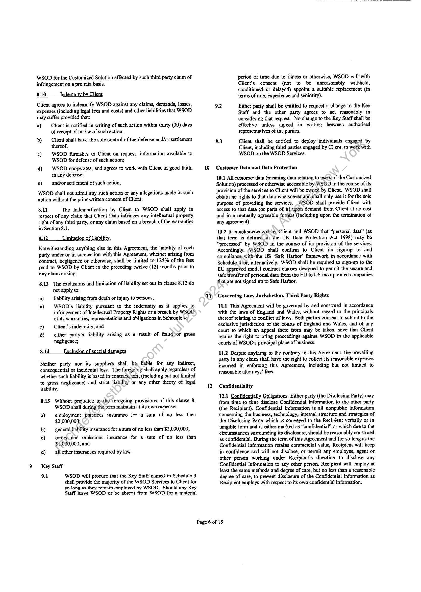
```  
```col-md
WSOD for the Customized Solution affected by such third party claim of
infringement on a pro rata basis.  
8.10 indemnity by Client  
Client agrees to indemnify WSOD against any claims, demands, losses,  
expenses (including legal fees and costs) and other liabilities that WSOD  
may suffer provided that:  
a) Client is notified in writing of such action within thirty (30) days
of receipt of notice of such action;  
b) Client shall have the sole control of the defense and/or settlement
thereof,  
c) | WSOD furnishes to Client on request, information available to
WSOD for defense of such action;  
d)  WSOD cooperates, and agrees to work with Client in good faith,
in any defense:  
e) and/or settlement of such action,  
WSOD shall not admit any such action or any allegations made in such
action without the prior written consent of Client.  
8.11 The Indemnification by Client to WSOD shall apply in
respect of any claim that Client Data infringes any intellectual property
tight of any third party, or any claim based on a breach of the warranties
in Section 8.1.  
8.12 Limitation of Liability.  
Notwithstanding anything else in this Agreement, the liability of each  
party under or in connection with this Agreement, whether arising from  
contract, negligence or otherwise, shall be limited to 125% of the fees  
paid to WSOD by Client in the preceding twelve (12) months prior to  
any claim arising.  
8.13 The exclusions and limitation of liability set out in clause 8.12 do
not apply to:  
a) liability arising from death or injury to persons;  
b) | WSOD’s liability pursuant to the indemnity as it applies to
infringement of Intellectual Property Rights or a breach by WSOD
of its warranties, representations and obligations in Schedule 4;  
¢) Client’s indemnity; and  
d) either party’s liability arising as a result of fraud)or gross
negligence;  
14 ion of special damages  
Neither party nor its suppliers shall be, liable for any indirect,
consequential or incidental loss. The foregoing shall apply regardless of
whether such liability is based in contract, tort, (including but not limited
to gross negligence) and strict liability or any other theory of legal
liability.  
8.15 Without prejudice tothe foregoing provisions of this clause 8,  
WSOD shall during the term maintain at its own expense:  
a) employment practices insurance for a sum of no less then
$2,000,000;  
b) general {iability insurance for a sum of no less than $2,000,000;  
c) errrs.and omissions insurance for a sum of no less than
$1,000,000, and  
d) all other insurances required by law.  
Key Staff  
91 WSOD will procure that the Key Staff named in Schedule 3
shall provide the majority of the WSOD Services to Client for
so long as they remain emploved by WSOD. Should any Key
Staff leave WSOD or be absent from WSOD for a material  
10  
4)  
12  
period of time due to illness or otherwise, WSOD will with
Client’s consent (not to be unreasonably withheld,
conditioned or delayed) appoint a suitable replacement (in
temns of role, experience and seniority).  
9.2 Either party shall be entitled to request a change to the Key
Staff and the other party agrees to act reasonably in
considering that request. No change to the Key Staff shall be
effective unless agreed in writing between authorised
representatives of the parties.  
93 Client shall be entitled to deploy individuals engaged by
Client, including third parties engaged by Client, to work with
‘WSOD on the WSOD Services.  
Customer Data and Data Protection  
10.1 All customer data (meaning data relating to users/of the Customized
Solution) processed or otherwise accessible by WSOD in the course of its
provision of the services to Client will be owned by Client. WSOD shall
obtain no rights to that data whatsoever and shall only use it for the sole
purpose of providing the services, WSOD shall provide Client with
access to that data (or parts of it). upon demand from Ctient at no cost
and in a mutually agreeable format (including upon the termination of
any agreement).  
10.2 It is acknowledged=hy ‘Client and WSOD that “personal data” (as
that term is defined_in the UK Data Protection Act 1998) may be
“processed” by WSOD in the course of its provision of the services,
Accordingly, (WSOD shall confirm to Client its sign-up to and
compliance, with-the US ‘Safe Harbor’ framework in accordance with
Schedule, 4 or, alternatively, WSOD shall be required to sign-up to the
EU approved model contract clauses designed to permit the secure and
safe transfer of personal data from the EU to US incorporated companies
that are not signed up to Safe Harbor.  
Governing Law, Jurisdiction, Third Party Rights  
11.1 This Agreement will be governed by and construed in accordance
with the laws of England and Wales, without regard to the principals
thereof relating to conflict of laws. Both parties consent to submit to the
exclusive jurisdiction of the courts of England and Wales, and of any
court to which an appeal there from may be taken, save that Client
retains the right to bring proceedings against WSOD in the applicable
courts of WSOD's principal place of business.  
11.2 Despite anything to the contrary in this Agreement, the prevailing
party in any claim shall have the right to collect its reasonable expenses
incurred in enforcing this Agreement, including but not timited to
reasonable attorneys’ fees.  
Confidentiality  
12.1 Confidentially Obligations, Either party (the Disclosing Party) may
from time to time disclose Confidential Information to the other party
(the Recipient), Confidential Information is all nonpublic information
conceming the business, technology, internal structure and strategies of
the Disclosing Party which is conveyed to the Recipient verbally or in
tangible form and is either marked as “confidential” or which due to the
circumstances surrounding its disclosure, should be reasonably construed
as confidential. During the term of this Agreement and for so long as the
Confidential Information retains commercial value, Recipient will keep
in confidence and will not disclose, or permit any employee, agent or
other person working under Recipient’s direction to disclose any
Confidential Information to any other person. Recipient will employ at
least the same methods and degree of care, but no less than a reasonable
degree of care, to prevent disclosure of the Confidential Information as
Recipient employs with respect to its own confidential information.  
Page 6 of 15  
```
````
Notes:    
````col
```col-md
flexGrow=.5
===
> [!info] [Page 7](_attachments/images_FinTimes-3.6.1.7.1TheFinancialTimesLTD-MA.pdf_210329/page_7.png)
> 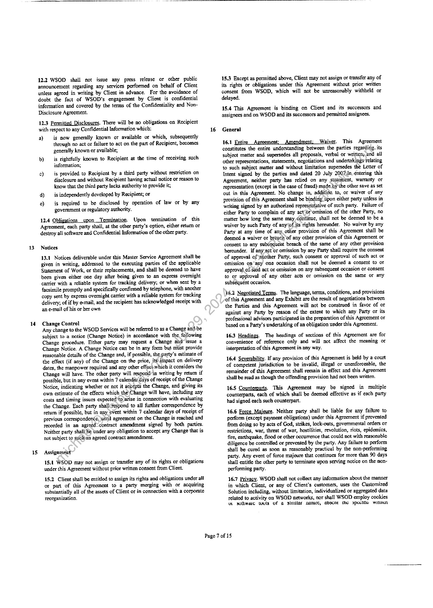
```  
```col-md
13  
14  
15  
12.2 WSOD shall not issue any press release or other public
announcement regarding any services performed on behalf of Client
unless agreed in writing by Client in advance. For the avoidance of
doubt the fact of WSOD’s engagement by Client is confidential
information and covered by the terms of the Confidentiality and NonDisclosure Agreement.  
12.3 Permitted Disclosures. There will be no obligations on Recipient  
with respect to any Confidential Information which:  
a) is now generally known or available or which, subsequently
through no act or failure to act on the part of Recipient, becomes
generally known or available;  
b) _ is rightfully known to Recipient at the time of receiving such
information;  
c) is provided to Recipient by a third party without restriction on
disclosure and without Recipient having actual notice or reason to
know that the third party lacks authority to provide it;  
d) is independently developed by Recipient; or  
¢) is required to be disclosed by operation of law or by any
government or regulatory authority.  
12.4 Obligations upon Termination. Upon termination of this
Agreement, each party shall, at the other party’s option, either return or
destroy all software and Confidential Information of the other party.  
Notices  
13.1 Notices deliverable under this Master Service Agreement shall be
given in writing, addressed to the executing parties of the applicable
Statement of Work, or their replacements, and shall be deemed to have
been given either one day after being given to an express overnight
carrier with a reliable system for tracking delivery; or when sent by a
facsimile promptly and specifically confirmed by telephone, with another
copy sent by express overnight carrier with a reliable system for tracking
delivery; of if by e-mail, and the recipient has acknowledged receipt with
an e-mail of his or her own  
Change Control  
Any change to the WSOD Services will be referred to as a Change and/be
subject to a notice (Change Notice) in accordance with the following
Change procedure. Either party may request a Change ahd” issue a
Change Notice. A Change Notice can be in any form but must provide
reasonable details of the Change and, if possible, the party's estimate of
the effect (if any) of the Change on the price, its\irnpact on delivery
dates, the manpower required and any other effectwhich it considers the
Change will have. The other party will respond-in writing by retum if
possible, but in any event within 7 calendar days of receipt of the Change
Notice, indicating whether or not it accepts the Change, and giving its
own estimate of the effects which the\Change will have, including any
costs and timing issues expected to)arise in connection with evaluating
the Change, Each party shall(tespond to all further correspondence by
retum if possible, but in any event within 7 calendar days of receipt of
previous correspondence, until agreement on the Change is reached and
recorded in an agteed™ contract amendment signed by both parties.
Neither party shall(be under any obligation to accept any Change that is
not subject to such)an agreed contract amendment.  
Assignment  
15.1 WSOD may not assign or transfer any of its rights or obligations
under this Agreement without prior written consent from Client.  
15.2. Client shall be entitled to assign its rights and obligations under all
or part of this Agreement to a party merging with or acquiring
substantially all of the assets of Client or in connection with a corporate
Teorganization.  
16  
15.3 Except as permitted above, Client may not assign or transfer any of
its rights or obligations under this Agreement without prior written
consent from WSOD, which will not be unreasonably withheld or
delayed.  
15.4 This Agreement is binding on Client and its successors and
assignees and on WSOD and its successors and permitted assignees.  
General
16.1 Entire Agreement; Amendment, Waiver. This Agreement  
constitutes the entire understanding between the parties regarding its
subject matter and supersedes all proposals, verbal or written;,and all
other representations, statements, negotiations and undertakings relating
to such subject matter and without limitation supersedes the Letter of
Intent signed by the parties and dated 20 July 2007.In entering this
Agreement, neither party has relied on any statement, warranty or
representation (except in the case of fraud) made. by the other save as set
out in this Agreement. No change in, addition to, or waiver of any
provision of this Agreement shall be binding upon either party unless in
writing signed by an authorized represetative of such patty. Failure of
either Party to complain of any actor omission of the other Party, no
matter how long the same may <ontinue, shall not be deemed to be a
waiver by such Party of any(of its rights hereunder. No waiver by any
Party at any time of any other provision of this Agreement shall be
deemed a waiver or breach of any other provision of this Agreement or
consent to any subsequent breach of the same of any other provision
hereunder. if any-act or omission by any Party shall require the consent
of approval of another Party, such consent or approval of such act or
omission on*any one occasion shall not be deemed a consent to or
approval. of Said act or omission on any subsequent occasion or consent
to or approval of any other acts or omission on the same or any
subsequent occasion,  
V6.2 Negotiated Terms. The language, terms, conditions, and provisions
of this Agreement and any Exhibit are the result of negotiations between
the Parties and this Agreement will not be construed in favor of or
against any Party by reason of the extent to which any Party or its
professional advisors participated in the preparation of this Agreement or
‘based on a Party’s undertaking of an obligation under this Agreement.  
16.3 Headings. The headings of sections of this Agreement are for
convenience of reference only and will not affect the meaning or
interpretation of this Agreement in any way.  
16.4 Severability. If any provision of this Agreement is held by a court
of competent jurisdiction to be invalid, illegal or unenforceable, the
remainder of this Agreement shall remain in effect and this Agreement
shall be read as though the offending provision had not been written.  
16.5 Counterparts. This Agreement may be signed in multiple
counterparts, each of which shall be deemed effective as if each party
had signed each such counterpast.  
16.6 Force Majeure. Neither party shall be liable for any failure to
perform (except payment obligations) under this Agreement if prevented
from doing so by acts of God, strikes, lock-outs, governmental orders or
restrictions, war, threat of war, hostilities, revolution, riots, epidemics,
fire, earthquake, flood or other occurrence that could not with reasonable
diligence be controlled or prevented by the party. Any failure to perform
shall be cured as soon as reasonably practical by the non-performing
party. Any event of force majeure that continues for more than 90 days
shall entitle the other party to terminate upon serving notice on the nonperforming party.  
16.7 Privacy. WSOD shall not collect any information about the manner
in which Client, or any of Client’s customers, uses the Customized
Solution including, without limitation, individualized or aggregated data
related to activity on WSOD networks, nor shall WSOD employ cookies
ui sufwaic wuls of @ Similar nature, abscnt the specific writtun  
Page 7 of 15  
```
````
Notes:    
````col
```col-md
flexGrow=.5
===
> [!info] [Page 8](_attachments/images_FinTimes-3.6.1.7.1TheFinancialTimesLTD-MA.pdf_210329/page_8.png)
> 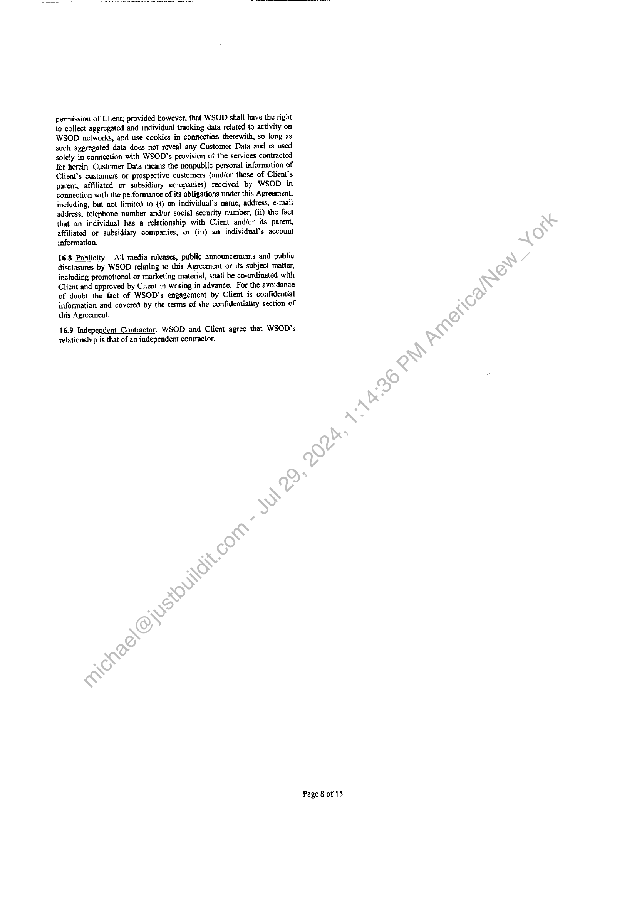
```  
```col-md
permission of Client; provided however, that WSOD shall have the right
to collect aggregated and individual tracking data related to activity on
WSOD networks, and use cookies in connection therewith, so long as
such aggregated data does not reveal any Customer Data and is used
solely in connection with WSOD’s provision of the services contracted
for herein, Customer Data means the nonpublic personal information of
Client’s customers or prospective customers (and/or those of Client’s
parent, affiliated or subsidiary companies) received by WSOD in
connection with the performance of its obligations under this Agreement,
including, but not limited to (i) an individual’s name, address, e-mail
address, telephone number and/or social security number, (ii) the fact
that an individual has a relationship with Client and/or its parent,
affiliated or subsidiary companies, or (iii) an individual’s account
information.  
16.8 Publicity. Alt media releases, public announcements and public
disclosures by WSOD relating to this Agreement or its subject matter,
including promotional or marketing material, shall be co-ordinated with
Client and approved by Client in writing in advance. For the avoidance
of doubt the fact of WSOD’s engagement by Client is confidential
information and covered by the terms of the confidentiality section of
this Agreement.  
16.9 Ind nt_Contractor. WSOD and Client agree that WSOD’s
relationship is that of an independent contractor.  
Page 8 of 15  
```
````
Notes:    
````col
```col-md
flexGrow=.5
===
> [!info] [Page 9](_attachments/images_FinTimes-3.6.1.7.1TheFinancialTimesLTD-MA.pdf_210329/page_9.png)
> 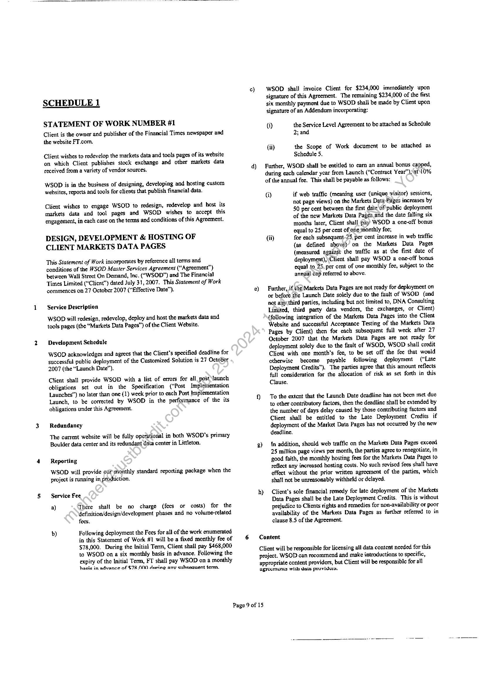
```  
```col-md
SCHEDULE 1  
STATEMENT OF WORK NUMBER #1  
Client is the owner and publisher of the Financial Times newspaper and
the website FT.com.  
Client wishes to redevelop the markets data and tools pages of its website
on which Client publishes stock exchange and other markets data
received from a variety of vendor sources.  
WSOD is in the business of designing, developing and hosting custom
websites, reports and tools for clients that publish financial data.  
Client wishes to engage WSOD to redesign, redevelop and host its
markets data and tool pages and WSOD wishes to accept this
engagement, in each case on the terms and conditions of this Agreement.  
DESIGN, DEVELOPMENT & HOSTING OF
CLIENT MARKETS DATA PAGES  
This Statement of Work incorporates by reference all terms and
conditions of the WSOD Master Services Agreement (“Agreement”)
between Wall Street On Demand, Inc. (“WSOD") and The Financial
Times Limited (“Client”) dated July 31, 2007. This Statement of Work
commences on 27 October 2007 (“Effective Date”).  
Service Description  
WSOD will redesign, redevelop, deploy and host the markets data and
tools pages (the “Markets Data Pages”) of the Client Website.
Development Schedule  
WSOD acknowledges and agrees that the Client's specified deadline for
successful public deployment of the Customized Solution is 27 October
2007 (the “Launch Date’).  
Client shall provide WSOD with a list of errors for all post launch
obligations set out in the Specification (‘Post Implementation
Launches") no later than one (1) week prior to each Post Implementation
Launch, to be corrected by WSOD in the performance of the its
obligations under this Agreement.  
Redundancy  
The current website will be fully operational in both WSOD’s primary
Boulder data center and its redundant data center in Littleton.  
Reporting  
WSOD will provide ourymionthly standard reporting package when the
project is running in production.  
Service Fee  
a) There shall be no charge (fees or costs) for the
definition/design’development phases and no volume-related
fees,  
b) Following deployment the Fees for all of the work enumerated  
in this Statement of Work #1 will be a fixed monthly fee of
$78,000. During the Initial Term, Client shall pay $468,000
to WSOD on a six monthly basis in advance. Following the
expiry of the Initial Term, FT shall pay WSOD on a monthly
hasie in advance of $78,000 during any suhseauent term.  
¢)  WSOD shall invoice Client for $234,000 immediately upon
signature of this Agreement. The remaining $234,000 of the first
six monthly payment due to WSOD shall be made by Client upon
signature of an Addendum incorporating:  
(i) the Service Level Agreement to be attached as Schedule
2; and  
{ii} the Scope of Work document to be attached as
Schedule 5.  
a) Further, WSOD shall be entitled to earn an annual bonus capped,
during each calendar ycar from Launch (“Contract Year”), at'10%
of the annual fee. This shall be payable as follows:  
(a) if web traffic (meaning user (unique visitor) sessions,
not page views) on the Markets Data-Pages increases by
50 per cent between the first date of public deployment
of the new Markets Data Pages and the date falling six
months later, Client shall pay WSOD a one-off bonus
equal to 25 per cent of one monthly fee;  
(ii) for each subsequent-25, per cent increase in web traffic
(as defined above)’ on the Markets Data Pages
(measured against the traffic as at the first date of
deployment), Client shall pay WSOD a one-off bonus
equal to 25. per cent of one monthly fee, subject to the
annual cap referred to above.  
e) Further, if the)Markets Data Pages are not ready for deployment on
or before the Launch Date solely due to the fault of WSOD (and
not any:third parties, including but not limited to, DNA Consulting
Limited, third party data vendors, the exchanges, or Client)
{following integration of the Markets Data Pages into the Client
Website and successful Acceptance Testing of the Markets Data
Pages by Client) then for each subsequent full week after 27
October 2007 that the Markets Data Pages are not ready for
deployment solely due to the fault of WSOD, WSOD shall credit
Client with one month's fee, to be set off the fee that would
otherwise become payable following deployment (“Late
Deployment Credits"). The parties agree that this amount reflects
full consideration for the allocation of risk as set forth in this
Clause.  
f) To the extent that the Launch Date deadline has not been met due
to other contributory factors, then the deadline shall be extended by
the number of days delay caused by those contributing factors and
Client shall be entitled to the Late Deployment Credits if
deployment of the Market Data Pages has not occurred by the new
deadline.  
g) tn addition, should web traffic on the Markets Data Pages exceed
25 million page views per month, the parties agree to renegotiate, in
good faith, the monthly hosting fees for the Markets Data Pages to
reflect any increased hosting costs. No such revised fees shall have
effect without the prior written agreement of the parties, which
shall not be unreasonably withheld or delayed.  
h) Client's sole financial remedy for late deployment of the Markets
Data Pages shall be the Late Deployment Credits. This is without
prejudice to Clients rights and remedies for non-availability or poor
availability of the Markets Data Pages as further referred to in
clause 8.5 of the Agreement.  
Content  
Client will be responsible for licensing all data content needed for this
project. WSOD can recommend and make introductions to specific,  
appropriate content providers, but Client will be responsible for all
agrocmonts with data provides,  
Page 9 of 15  
```
````
Notes:    
````col
```col-md
flexGrow=.5
===
> [!info] [Page 10](_attachments/images_FinTimes-3.6.1.7.1TheFinancialTimesLTD-MA.pdf_210329/page_10.png)
> 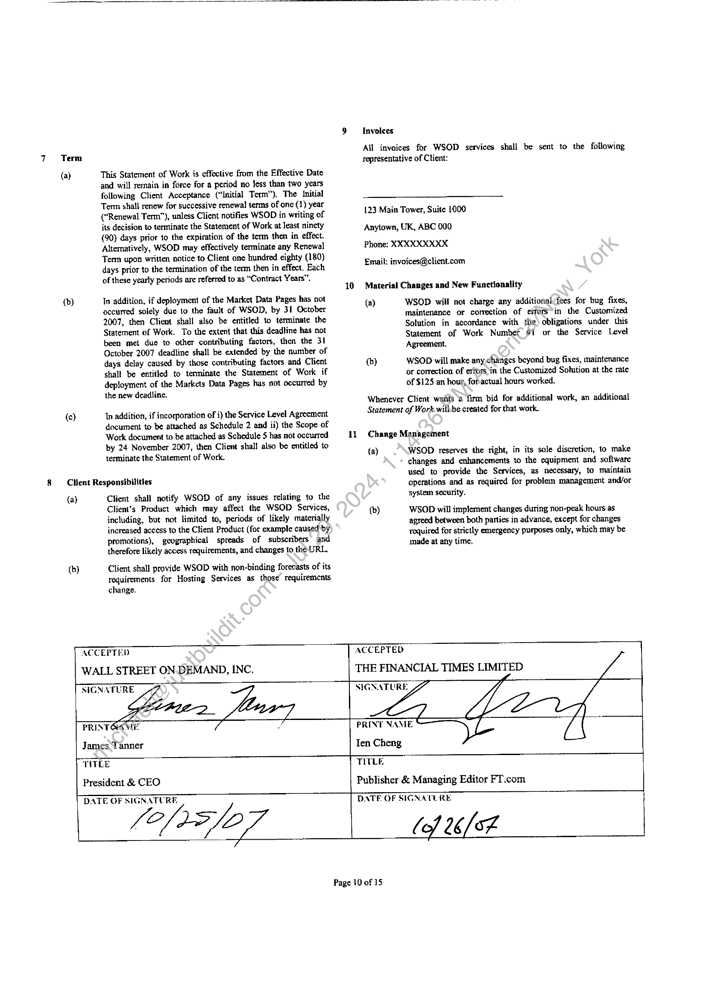
```  
```col-md
7  
Term  
{b)  
(©)  
This Statement of Work is effective from the Effective Date
and will remain in force for a period no Jess than two years
following Client Acceptance (“Initial Term”). The Initial
Term shall renew for successive renewal terms of one (1) year
(“Renewal Term”), unless Client notifies WSOD in writing of
its decision to terminate the Statement of Work at least ninety
(90) days prior to the expiration of the term then in effect.
Alternatively, WSOD may effectively terminate any Renewal
Term upon written notice to Client one hundred eighty (180)
days prior to the termination of the term then in effect. Each
of these yearly periods are referred to as “Contract Years”.  
In addition, if deployment of the Market Data Pages has not
occurred solely due to the fault of WSOD, by 31 October
2007, then Client shall also be entitled to terminate the
Statement of Work. To the extent that this deadline has not
been met due to other contributing factors, then the 31
October 2007 deadline shall be extended by the number of
days delay caused by those contributing factors and Client
shall be entitled to terminate the Statement of Work if
deployment of the Markets Data Pages has not occurred by
the new deadline.  
In addition, if incorporation of i) the Service Level Agreement
document to be attached as Schedule 2 and ii) the Scope of
Work document to be attached as Schedule 5 has not occurred
by 24 November 2007, then Client shall also be entitled to
terminate the Statement of Work.  
Client Responsibilities  
(a}  
(b)  
Client shall notify WSOD of any issues relating to the
Client’s Product which may affect the WSOD Services,
including, but not limited to, periods of likely materially
increased access to the Client Product (for example caused by)
promotions), geographical spreads of subscribers and
therefore likely access requirements, and changes to the URL.  
Client shall provide WSOD with non-binding forecasts of its
requirements for Hosting Services as those requirements
change.  
ACCEPTED
WALL STREET ON.DEMAND, INC.  
9 Invoices  
All invoices for WSOD services shall be sent to the following
representative of Client:  
123 Main Tower, Suite 1000
Anytown, UK, ABC 000
Phone: XXXXXXXXX  
Email: invoices@client.com  
10 Material Changes and New Functionality  
(a) WSOD will not charge any additional<fees for bug fixes,
maintenance or correction of eitors in the Customized
Solution in accordance with the) obligations under this
Statement of Work Number #1 or the Service Level
Agreement.  
(b) WSOD will make any changes beyond bug fixes, maintenance
or correction of ertors\in the Customized Solution at the rate
of $125 an hous, for actual hours worked.  
Whenever Client wafits a firm bid for additional work, an additional  
Statement of Work wilhbe created for that work.  
11 Change Management
(a) WSOD reserves the right, in its sole discretion, to make  
changes and enhancements to the equipment and software
used to provide the Services, as necessary, to maintain
operations and as required for problem management and/or
system security.  
(b) WSOD will implement changes during non-peak hours as
agreed between both parties in advance, except for changes
required for strictly emergency purposes only, which may be
made at any time,  
ACCEPTED  
THE FINANCIAL TIMES LIMITED  
SIGNA  
PRINT!  
James.  
TURE  
Tanner  
TITLE  
——__}—____—.  
President & CEO  
SIGNATURE  
PRINT NAME  
Ten Cheng  
TITLE
Publisher & Managing Editor FT.com  
DATE OF SIGNATURE  
DATE OF SIGNATURE  
“dhe ada lof U/F  
Page 10 of 15  
```
````
Notes:    
````col
```col-md
flexGrow=.5
===
> [!info] [Page 11](_attachments/images_FinTimes-3.6.1.7.1TheFinancialTimesLTD-MA.pdf_210329/page_11.png)
> 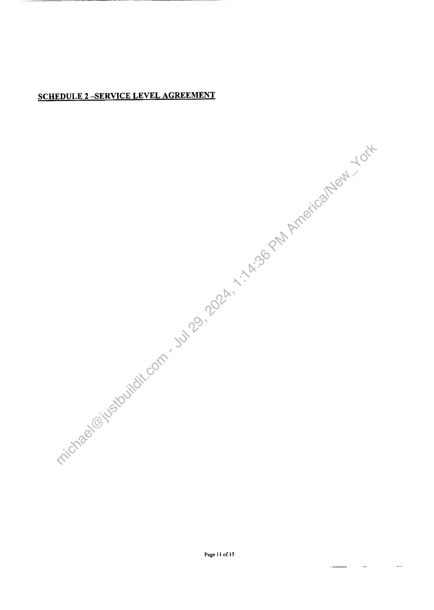
```  
```col-md
SCHEDULE 2 -SERVICE LEVEL AGREEMENT  
eee  
Page 11 of 15  
```
````
Notes:    
````col
```col-md
flexGrow=.5
===
> [!info] [Page 12](_attachments/images_FinTimes-3.6.1.7.1TheFinancialTimesLTD-MA.pdf_210329/page_12.png)
> 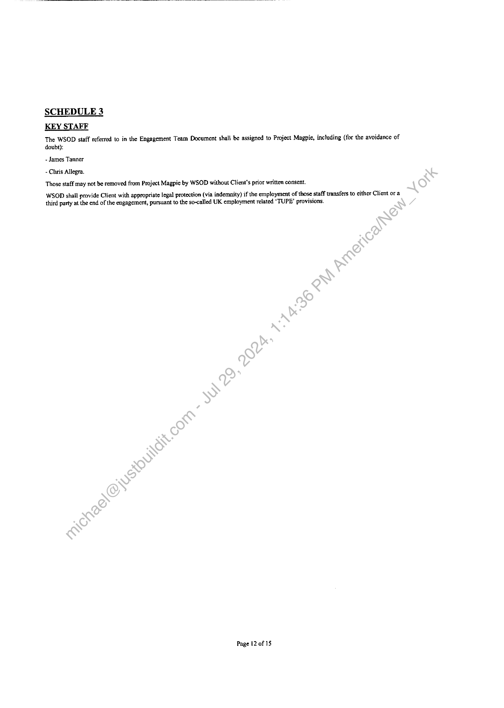
```  
```col-md
SCHEDULE 3
KEY STAFF  
The WSOD staff referred to in the Engagement Team Document shall be assigned to Project Magpie, including (for the avoidance of
doubt):  
~ James Tanner
- Chris Allegra.
Those staff may not be removed from Project Magpie by WSOD without Client's prior written consent.  
WSOD shall provide Client with appropriate legal protection (via indemnity) if the employment of those staff transfers to cither Client or a
third party at the end of the engagement, pursuant to the so-called UK employment related ‘TUPE’ provisions.  
Page [2 of 15  
```
````
Notes:    
````col
```col-md
flexGrow=.5
===
> [!info] [Page 13](_attachments/images_FinTimes-3.6.1.7.1TheFinancialTimesLTD-MA.pdf_210329/page_13.png)
> 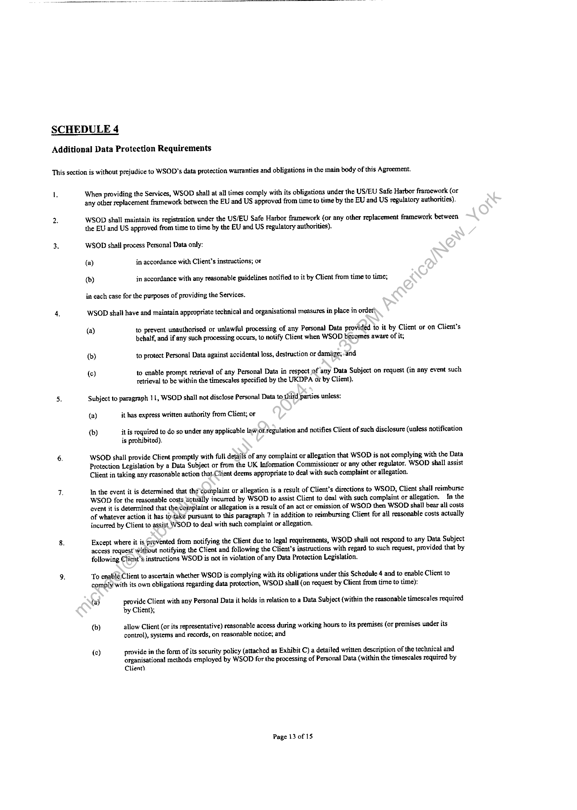
```  
```col-md
SCHEDULE 4  
Additional Data Protection Requirements
This section is without prejudice to WSOD’s data protection warranties and obligations in the main body of this Agreement.  
L When providing the Services, WSOD shall at all times comply with its obligations under the US/EU Safe Harbor framework (or
any other replacement framework between the EU and US approved from time to time by the EU and US regulatory authorities).  
2. WSOD shall maintain its registration under the US/EU Safe Harbor framework (or any other teplacement framework between
the EU and US approved from time to time by the EU and US regulatory authorities).  
3. WSOD shail process Personal Data only:
(a) in accordance with Client’s instructions; or
(b) in accordance with any reasonable guidelines notified to it by Client from time to time;  
in each case for the purposes of providing the Services.  
4. WSOD shall have and maintain appropriate technical and organisational measures in place in ordet}
(a) to prevent unauthorised or unlawful processing of any Personal Data provided to it by Client or on Client’s
behalf, and if any such processing occurs, to notify Client when WSOD becomes aware of it,
(b) to protect Personal Data against accidental loss, destruction or damage; and
(c) to enable prompt retrieval of any Personal Data in respect of any Data Subject on request (in any event such
retrieval to be within the timescales specified by the UKDPA or by Client),
5. Subject to paragraph 11, WSOD shall not disclose Personal Data to third parties unless:
(a) it has express written authority from Client; or
{b) it is required to do so under any applicable lawyor regulation and notifies Client of such disclosure (unless notification
is prohibited).
6. WSOD shall provide Client promptly with full details of any complaint or allegation that WSOD is not complying with the Data  
Protection Legislation by a Data Subject or from the UK Information Commissioner or any other regulator, WSOD shall assist
Client in taking any reasonable action that-Client deems appropriate to deal with such complaint or allegation.  
7. In the event it is determined that thé complaint or allegation is a result of Client’s directions to WSOD, Client shall reimburse
WSOD for the reasonable costs uctually incurred by WSOD to assist Client to deal with such complaint or allegation, In the
event it is determined that the complaint or allegation is a result of an act or omission of WSOD then WSOD shall bear all costs
of whatever action it has tofake pursuant to this paragraph 7 in addition to reimbursing Client for all reasonable costs actually
incurred by Client to assist WSOD to deal with such complaint or allegation.  
8. Except where it is prevented from notifying the Client due to legal requirements, WSOD shall not respond to any Data Subject
access request’ Without notifying the Client and following the Client’s instructions with regard to such request, provided that by
following Client's instructions WSOD is not in violation of any Data Protection Legislation.  
9. To enabilé Client to ascertain whether WSOD is complying with its obligations under this Schedule 4 and to enable Client to  
comply with its own obligations regarding data protection, WSOD shall (on request by Client from time to time):  
fa) provide Client with any Personal Data it holds in relation to a Data Subject (within the reasonable timescales required
by Client);  
(b) allow Client (or its representative) reasonable access during working hours to its premises (or premises under its
control), systems and records, on reasonable notice, and  
{c) provide in the form of its security policy (attached as Exhibit C) a detailed written. description of the technicat and
organisational methods employed by WSOD for the processing of Personal Data (within the timescales required by
Client)  
Page 13 of 15  
```
````
Notes:    
````col
```col-md
flexGrow=.5
===
> [!info] [Page 14](_attachments/images_FinTimes-3.6.1.7.1TheFinancialTimesLTD-MA.pdf_210329/page_14.png)
> 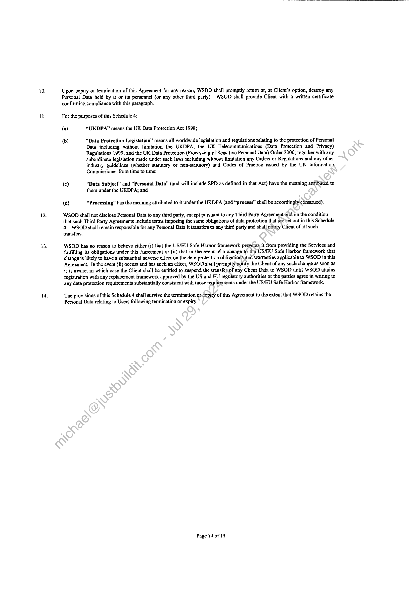
```  
```col-md
10,  
Ik.  
13.  
Upon expiry or termination of this Agreement for any reason, WSOD shall promptly retum or, at Client's option, destroy any
Personal Data held by it or its personnel (or any other third party). WSOD shall provide Client with a written certificate
confirming compliance with this paragraph.  
For the purposes of this Schedule 4:
(a) “UKDPA” means the UK Data Protection Act 1998;
{b) “Data Protection Legislation” means all worldwide legislation and regulations relating to the protection of Personal  
Data including without limitation the UKDPA; the UK Telecommunications (Data Protection and Privacy)
Regulations 1999; and the UK Data Protection (Processing of Sensitive Personal Data) Order 2000; together with any
subordinate legislation made under such laws including without limitation any Orders or Regulations and any other
industry guidelines (whether statutory or non-statutory) and Codes of Practice issued by the UK Information
Commissioner from time to time;  
(c) “Data Subject” and “Personal Data” (and will include SPD as defined in that Act) have the meaning attributed to
them under the UKDPA; and
(d) “Processing” has the meaning attributed to it under the UKDPA (and “process” shail be accordingly construed).  
WSOD shall not disclose Personal Data to any third party, except pursuant to any Third Party Agreement and on the condition.
that such Third Party Agreements include terms imposing the same obligations of data protection that are’set out in this Schedule  
4. WSOD shail remain responsible for any Personal Data it transfers to any third party and shall notify Client of all such
transfers.  
WSOD has no reason to believe either (i) that the US/EU Safe Harbor framework prevents it from providing the Services and
fulfilling its obligations under this Agreement or (ii) that in the event of a change to the US/EU Safe Harbor framework that
change is likely to have a substantial adverse effect on the data protection obligatiors,and warranties applicable to WSOD in this
Agreement, In the event (ii) occurs and has such an effect, WSOD shall promptly notify the Client of any such change as soon as
it is aware, in which case the Client shall be entitled to suspend the transfep.of any Client Data to WSOD until WSOD attains
registration with any replacement framework approved by the US and EU regulatory authorities or the parties agree in writing to
any data protection requirements substantially consistent with those requinements under the US/EU Safe Harbor framework.  
The provisions of this Schedule 4 shall survive the termination or expiry of this Agreement to the extent that WSOD retains the
Personal Data relating to Users following termination or expiry.  
Page 14 of 15  
```
````
Notes:    
````col
```col-md
flexGrow=.5
===
> [!info] [Page 15](_attachments/images_FinTimes-3.6.1.7.1TheFinancialTimesLTD-MA.pdf_210329/page_15.png)
> 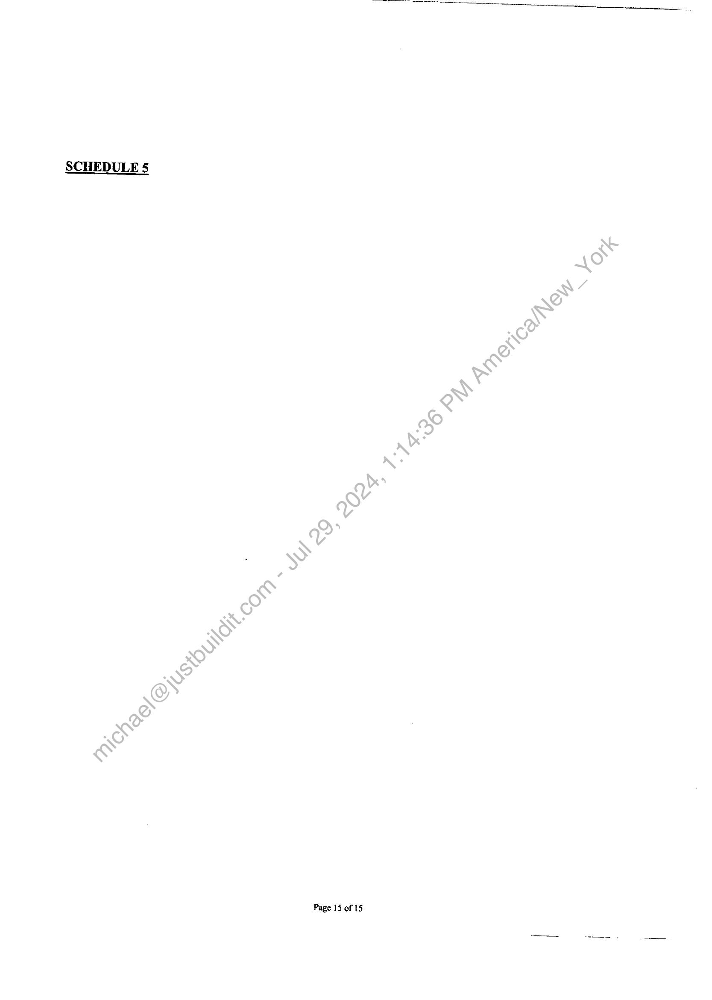
```  
```col-md
SCHEDULE 5  
Page 15 of 15  
```
````
Notes:  


![[_attachments/FinTimes-3.6.1.7.1 The Financial Times LTD - MA.pdf]