##### Statement of Work #32: Design, Development and Hosting of Client’s Market Data Pages and Related Services]

  
````col
```col-md
flexGrow=.5
===
> [!info] [Page 1](_attachments/images_FinTimes-3.6.1.7.200114869.pdf_210116/page_1.png)
> 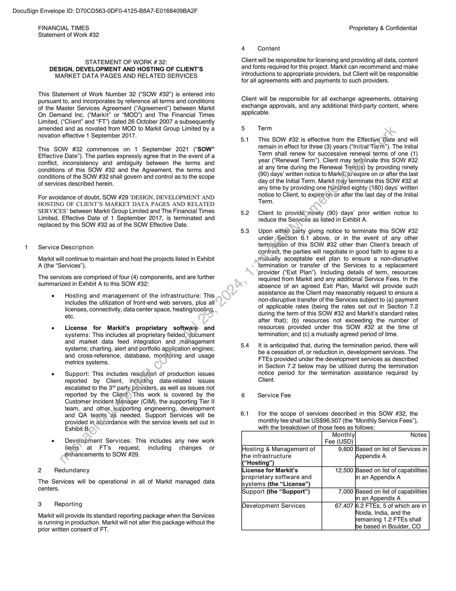
```  
```col-md
DocuSign Envelope ID: D70CD563-0DF0-4125-B8A7-E0168409BA2F  
FINANCIAL TIMES
Statement of Work #32  
STATEMENT OF WORK 32:
DESIGN, DEVELOPMENT AND HOSTING OF CLIENT’S
MARKET DATA PAGES AND RELATED SERVICES  
This Statement of Work Number 32 (“SOW #32”) is entered into
pursuant to, and incorporates by reference all terms and conditions
of the Master Services Agreement (“Agreement”) between Markit
On Demand Inc. (“Markit” or “MOD”) and The Financial Times
Limited, (“Client” and “FT”) dated 26 October 2007 a subsequently
amended and as novated from MOD to Markit Group Limited by a
novation effective 1 September 2017.  
This SOW #32 commences on 1 September 2021 (“SOW”
Effective Date”). The parties expressly agree that in the event of a
conflict, inconsistency and ambiguity between the terms and
conditions of this SOW #32 and the Agreement, the terms and
conditions of the SOW #32 shall govern and control as to the scope
of services described herein.  
For avoidance of doubt, SOW #29 ‘DESIGN, DEVELOPMENT AND
HOSTING OF CLIENT’S MARKET DATA PAGES AND RELATED
SERVICES’ between Markit Group Limited and The Financial Times
Limited, Effective Date of 1 September 2017, is terminated and
replaced by this SOW #32 as of the SOW Effective Date.  
Service Description  
Markit will continue to maintain and host the projects listed in Exhibit
A (the “Services’”).  
The services are comprised of four (4) components, and are further
summarized in Exhibit A to this SOW #32:  
. Hosting and management of the infrastructure: This
includes the utilization of front-end web servers, plus all
licenses, connectivity, data center space, heating/cooling,
etc.  
. License for Markit’s proprietary software. and
systems: This includes all proprietary fielded, document
and market data feed integration and management
systems; charting, alert and portfolio application engines;
and cross-reference, database, monitoring and usage
metrics systems.  
e Support: This includes resolution of production issues
reported by Client, including data-related issues
escalated to the 3” party providers, as well as issues not
reported by the Client.) This work is covered by the
Customer Incident Manager (CIM), the supporting Tier II
team, and other supporting engineering, development
and QA teams ‘as needed. Support Services will be
provided in accordance with the service levels set out in
Exhibit By  
. Development Services: This includes any new work
items’ at FT’s request, including changes or
enhancements to SOW #29.  
2 Redundancy  
The Services will be operational in all of Markit managed data
centers.  
3 Reporting  
Markit will provide its standard reporting package when the Services
is running in production. Markit will not alter this package without the
prior written consent of FT.  
Proprietary & Confidential  
4 Content  
Client will be responsible for licensing and providing all data, content
and fonts required for this project. Markit can recommend and make
introductions to appropriate providers, but Client will be responsible
for all agreements with and payments to such providers.  
Client will be responsible for all exchange agreements, obtaining
exchange approvals, and any additional third-party content, where
applicable.  
5 Term  
5.1. This SOW #382 is effective from the Effective Date and will
remain in effect for three (3) years (“Initial Ferm”). The Initial
Term shall renew for successive renewal terms of one (1)
year (“Renewal Term”). Client may terminate this SOW #32
at any time during the Renewal Term(s) by providing ninety
(90) days’ written notice to Markit; to*expire on or after the last
day of the Initial Term. Markit ray terminate this SOW #32 at
any time by providing one hundred eighty (180) days’ written
notice to Client, to expire‘on or after the last day of the Initial
Term.  
5.2 Client to providésninety (90) days’ prior written notice to
reduce the Services as listed in Exhibit A.  
5.3 Upon either party giving notice to terminate this SOW #32
under Section 6.1 above, or in the event of any other
termination of this SOW #32 other than Client's breach of
contract, the parties will negotiate in good faith to agree to a
mutually acceptable exit plan to ensure a non-disruptive
termination or transfer of the Services to a replacement
provider (“Exit Plan”). Including details of term, resources
required from Markit and any additional Service Fees. In the
absence of an agreed Exit Plan, Markit will provide such
assistance as the Client may reasonably request to ensure a
non-disruptive transfer of the Services subject to (a) payment
of applicable rates (being the rates set out in Section 7.2
during the term of this SOW #32 and Markit’s standard rates
after that); (b) resources not exceeding the number of
resources provided under this SOW #32 at the time of
termination; and (c) a mutually agreed period of time.  
5.4 — It is anticipated that, during the termination period, there will
be a cessation of, or reduction in, development services. The
FTEs provided under the development services as described
in Section 7.2 below may be utilized during the termination
notice period for the termination assistance required by
Client.  
6 Service Fee  
6.1 For the scope of services described in this SOW #32, the
monthly fee shall be US$96,507 (the “Monthly Service Fees”),
with the breakdown of those fees as follows:  
Monthly] Notes
Fee (USD)
Hosting & Management of 9,600 [Based on list of Services in
[the infrastructure Appendix A
(“Hosting”)
License for Markit’s 12,500 [Based on list of capabilities  
proprietary software and
lsystems (the “License”)  
lin an Appendix A  
[Support (the “Support”) 7,000 [Based on list of capabilities
lin an Appendix A
Development Services 67,407 6.2 FTEs, 5 of which are in  
INoida, India, and the
remaining 1.2 FTEs shall
be based in Boulder, CO  
```
````
Notes:    
````col
```col-md
flexGrow=.5
===
> [!info] [Page 2](_attachments/images_FinTimes-3.6.1.7.200114869.pdf_210116/page_2.png)
> 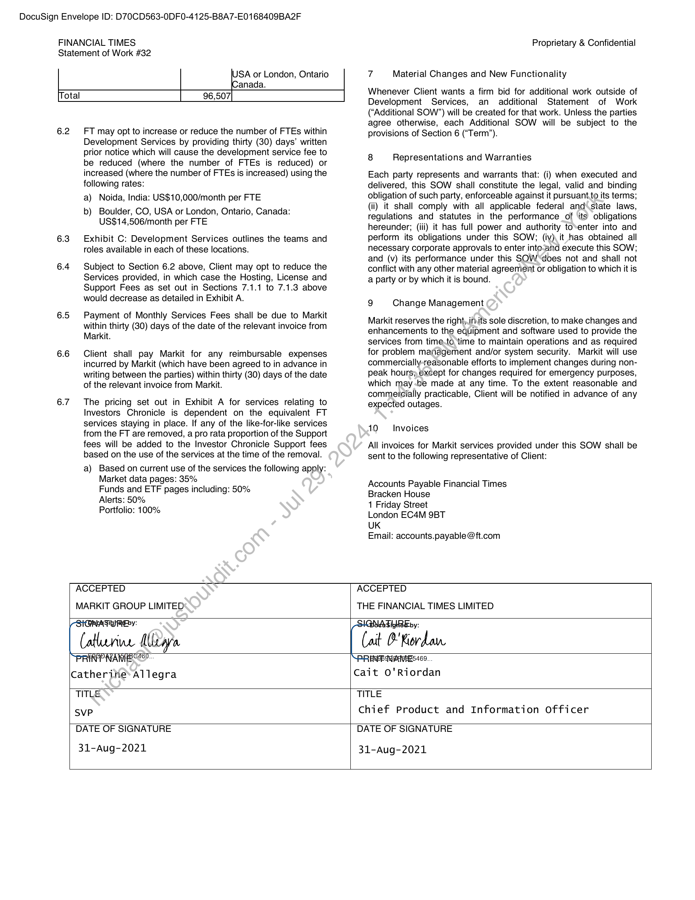
```  
```col-md
DocuSign Envelope ID: D70CD563-0DF0-4125-B8A7-E0168409BA2F  
FINANCIAL TIMES  
Statement of Work #32
USA or London, Ontario
\Canada.  
[Total 96,507]  
6.2 FT may opt to increase or reduce the number of FTEs within
Development Services by providing thirty (30) days’ written
prior notice which will cause the development service fee to
be reduced (where the number of FTEs is reduced) or
increased (where the number of FTEs is increased) using the
following rates:  
a) Noida, India: US$10,000/month per FTE  
b) Boulder, CO, USA or London, Ontario, Canada:
US$14,506/month per FTE  
6.3 Exhibit C: Development Services outlines the teams and
roles available in each of these locations.  
6.4 Subject to Section 6.2 above, Client may opt to reduce the
Services provided, in which case the Hosting, License and
Support Fees as set out in Sections 7.1.1 to 7.1.3 above
would decrease as detailed in Exhibit A.  
6.5 Payment of Monthly Services Fees shall be due to Markit
within thirty (80) days of the date of the relevant invoice from
Markit.  
6.6 Client shall pay Markit for any reimbursable expenses
incurred by Markit (which have been agreed to in advance in
writing between the parties) within thirty (30) days of the date
of the relevant invoice from Markit.  
6.7 The pricing set out in Exhibit A for services relating to
Investors Chronicle is dependent on the equivalent FT
services staying in place. If any of the like-for-like services
from the FT are removed, a pro rata proportion of the Support
fees will be added to the Investor Chronicle Support fees
based on the use of the services at the time of the removal.  
a) Based on current use of the services the following apply:
Market data pages: 35%
Funds and ETF pages including: 50%
Alerts: 50%
Portfolio: 100%  
Proprietary & Confidential  
7 Material Changes and New Functionality  
Whenever Client wants a firm bid for additional work outside of
Development Services, an additional Statement of Work
(‘Additional SOW”) will be created for that work. Unless the parties
agree otherwise, each Additional SOW will be subject to the
provisions of Section 6 (“Term”).  
8 Representations and Warranties  
Each party represents and warrants that: (i) when executed and
delivered, this SOW shall constitute the legal, valid and binding
obligation of such party, enforceable against it pursuant.to its terms;
(ii) it shall comply with all applicable federal and\state laws,
regulations and statutes in the performance of ‘its obligations
hereunder; (iii) it has full power and authority to’enter into and
perform its obligations under this SOW; (iv) it has obtained all
necessary corporate approvals to enter into-and execute this SOW;
and (v) its performance under this SOW “does not and shall not
conflict with any other material agreement or obligation to which it is
a party or by which it is bound.  
9 Change Management  
Markit reserves the right,.inits sole discretion, to make changes and
enhancements to the equipment and software used to provide the
services from time.to,time to maintain operations and as required
for problem management and/or system security. Markit will use
commercially-reasonable efforts to implement changes during nonpeak hours; €xcept for changes required for emergency purposes,
which may -be made at any time. To the extent reasonable and
commercially practicable, Client will be notified in advance of any
expected outages.  
19 Invoices  
All invoices for Markit services provided under this SOW shall be
sent to the following representative of Client:  
Accounts Payable Financial Times
Bracken House  
1 Friday Street  
London EC4M 9BT  
UK  
Email: accounts.payable @ft.com  
ACCEPTED ACCEPTED
MARKIT GROUP LIMITED THE FINANCIAL TIMES LIMITED
SWFA: 1SightBEEby:
(allariae Aya (ait B'Fiordan
REP RRA NEC? ASB IN AHPHES 469.
Catherite Allegra Cait O'Riordan  
TITLE TITLE
svp Chief Product and Information officer
DATE OF SIGNATURE DATE OF SIGNATURE
31-Aug-2021 31-Aug-2021  
```
````
Notes:    
````col
```col-md
flexGrow=.5
===
> [!info] [Page 3](_attachments/images_FinTimes-3.6.1.7.200114869.pdf_210116/page_3.png)
> 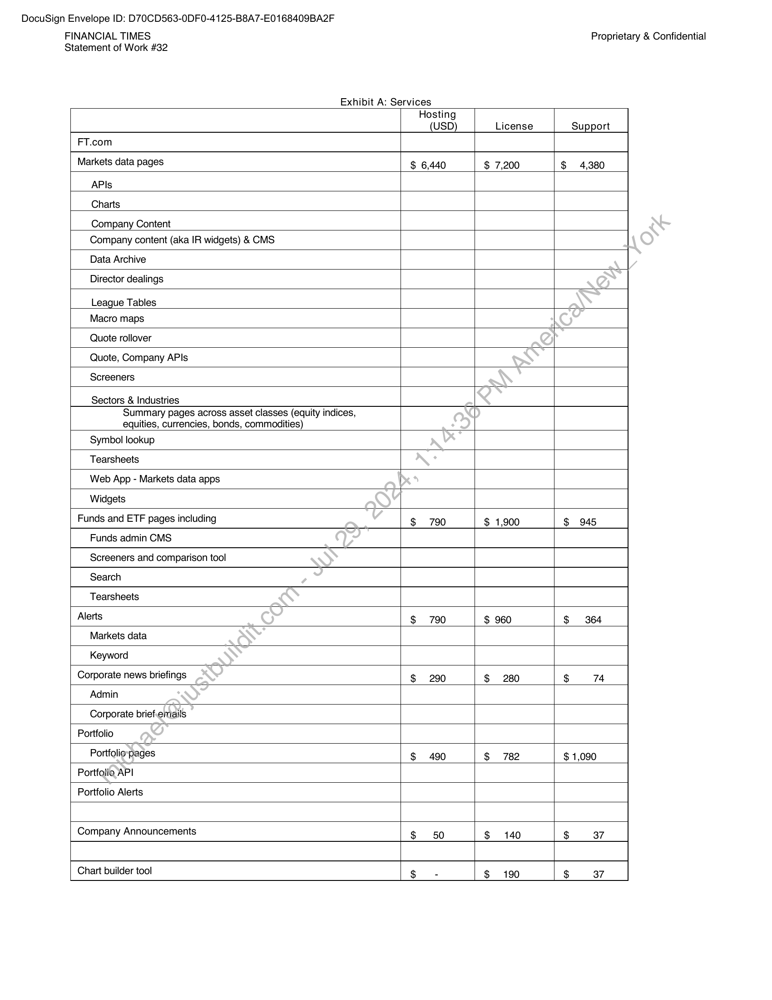
```  
```col-md
DocuSign Envelope ID: D70CD563-0DF0-4125-B8A7-E0168409BA2F  
FINANCIAL TIMES
Statement of Work #32  
Exhibit A: Services  
Proprietary & Confidential  
Hosting
(USD)  
License  
Support  
FT.com  
Markets data pages  
$ 6,440  
$ 7,200  
$ 4,380  
APIs  
Charts  
Company Content  
Company content (aka IR widgets) & CMS  
Data Archive  
Director dealings  
League Tables  
Macro maps  
Quote rollover  
Quote, Company APIs  
Screeners  
Sectors & Industries  
Summary pages across asset classes (equity indices,
equities, currencies, bonds, commodities)  
Symbol lookup  
Tearsheets  
Web App - Markets data apps  
Widgets  
Funds and ETF pages including  
$790  
$ 1,900  
$945  
Funds admin CMS  
Screeners and comparison tool  
Search  
Tearsheets  
Alerts  
$790  
$ 960  
$364  
Markets data  
Keyword  
Corporate news briefings  
$290  
$280  
Admin  
Corporate briefemails  
Portfolio  
Portfoliospages  
$490  
$782  
$ 1,090  
Portfolio API  
Portfolio Alerts  
Company Announcements  
$140  
Chart builder tool  
$190  
```
````
Notes:    
````col
```col-md
flexGrow=.5
===
> [!info] [Page 4](_attachments/images_FinTimes-3.6.1.7.200114869.pdf_210116/page_4.png)
> 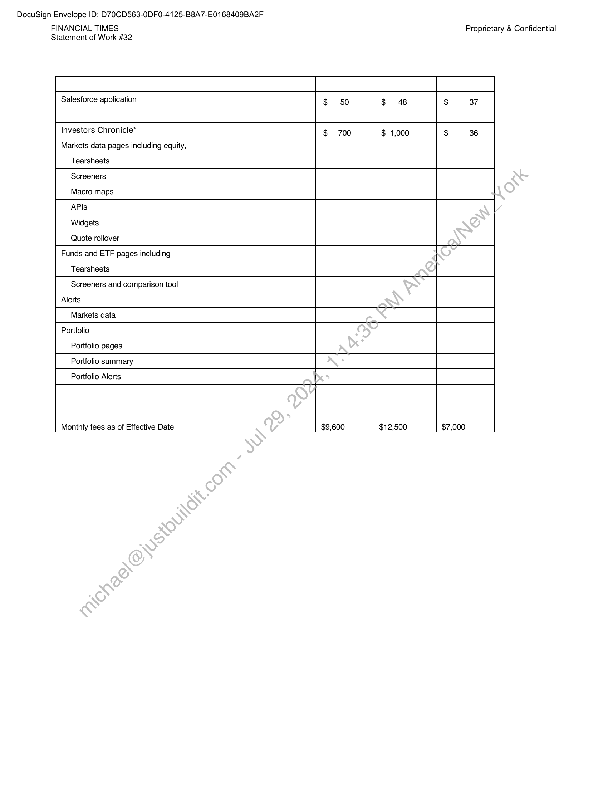
```  
```col-md
DocuSign Envelope ID: D70CD563-0DF0-4125-B8A7-E0168409BA2F  
FINANCIAL TIMES
Statement of Work #32  
Proprietary & Confidential  
Salesforce application  
Investors Chronicle*  
$700  
$ 1,000  
Markets data pages including equity,  
Tearsheets  
Screeners  
Macro maps  
APIs  
Widgets  
Quote rollover  
Funds and ETF pages including  
Tearsheets  
Screeners and comparison tool  
Alerts  
Markets data  
Portfolio  
Portfolio pages  
Portfolio summary  
Portfolio Alerts  
Monthly fees as of Effective Date  
$9,600  
$12,500  
$7,000  
```
````
Notes:    
````col
```col-md
flexGrow=.5
===
> [!info] [Page 5](_attachments/images_FinTimes-3.6.1.7.200114869.pdf_210116/page_5.png)
> 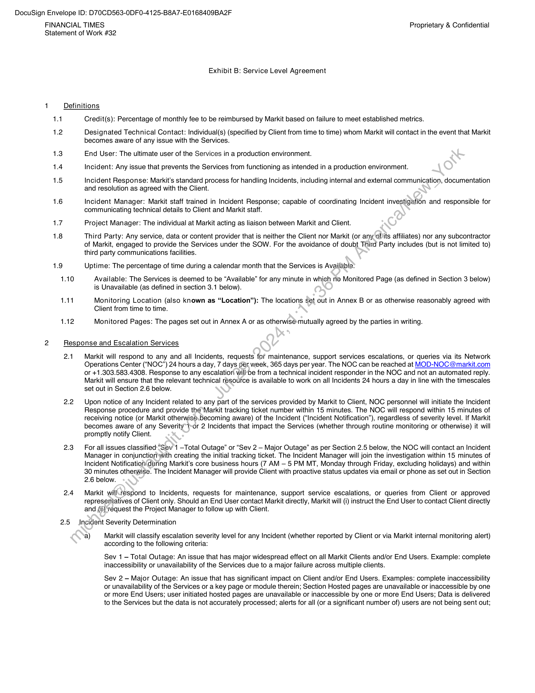
```  
```col-md
DocuSign Envelope ID: D70CD563-0DF0-4125-B8A7-E0168409BA2F  
FINANCIAL TIMES Proprietary & Confidential
Statement of Work #32  
1
14
1.2  
1.3
1.4
1.5  
1.6  
1.7
1.8  
2  
Exhibit B: Service Level Agreement  
Definitions  
Credit(s): Percentage of monthly fee to be reimbursed by Markit based on failure to meet established metrics.  
Designated Technical Contact: Individual(s) (specified by Client from time to time) whom Markit will contact in the event that Markit
becomes aware of any issue with the Services.  
End User: The ultimate user of the Services in a production environment.
Incident: Any issue that prevents the Services from functioning as intended in a production environment.  
Incident Response: Markit’s standard process for handling Incidents, including internal and external communication, documentation
and resolution as agreed with the Client.  
Incident Manager: Markit staff trained in Incident Response; capable of coordinating Incident investigation and responsible for
communicating technical details to Client and Markit staff.  
Project Manager: The individual at Markit acting as liaison between Markit and Client.  
Third Party: Any service, data or content provider that is neither the Client nor Markit (or any ofits affiliates) nor any subcontractor
of Markit, engaged to provide the Services under the SOW. For the avoidance of doubt Third Party includes (but is not limited to)
third party communications facilities.  
Uptime: The percentage of time during a calendar month that the Services is Available:  
Available: The Services is deemed to be “Available” for any minute in which no Monitored Page (as defined in Section 3 below)
is Unavailable (as defined in section 3.1 below).  
Monitoring Location (also known as “Location”): The locations set out in Annex B or as otherwise reasonably agreed with
Client from time to time.  
Monitored Pages: The pages set out in Annex A or as otherwisé-mutually agreed by the parties in writing.  
Response and Escalation Services  
21  
2.2  
2.3  
2.4  
2.5  
Markit will respond to any and all Incidents, requests for maintenance, support services escalations, or queries via its Network
Operations Center (“NOC”) 24 hours a day, 7 days per week, 365 days per year. The NOC can be reached at MOD-NOC @markit.com
or +1.303.583.4308. Response to any escalation willbe from a technical incident responder in the NOC and not an automated reply.
Markit will ensure that the relevant technical resource is available to work on all Incidents 24 hours a day in line with the timescales
set out in Section 2.6 below.  
Upon notice of any Incident related to any part of the services provided by Markit to Client, NOC personnel will initiate the Incident
Response procedure and provide the Markit tracking ticket number within 15 minutes. The NOC will respond within 15 minutes of
receiving notice (or Markit otherwise.becoming aware) of the Incident (“Incident Notification”), regardless of severity level. If Markit
becomes aware of any Severity’t-or 2 Incidents that impact the Services (whether through routine monitoring or otherwise) it will
promptly notify Client.  
For all issues classified “Sev 1 —Total Outage” or “Sev 2 — Major Outage” as per Section 2.5 below, the NOC will contact an Incident
Manager in conjunction with creating the initial tracking ticket. The Incident Manager will join the investigation within 15 minutes of
Incident Notification during Markit’s core business hours (7 AM — 5 PM MT, Monday through Friday, excluding holidays) and within
30 minutes otherwise. The Incident Manager will provide Client with proactive status updates via email or phone as set out in Section
2.6 below.  
Markit will.tespond to Incidents, requests for maintenance, support service escalations, or queries from Client or approved
representatives of Client only. Should an End User contact Markit directly, Markit will (i) instruct the End User to contact Client directly
and (ii) request the Project Manager to follow up with Client.  
Incident Severity Determination  
a) Markit will classify escalation severity level for any Incident (whether reported by Client or via Markit internal monitoring alert)
according to the following criteria:  
Sev 1 - Total Outage: An issue that has major widespread effect on all Markit Clients and/or End Users. Example: complete
inaccessibility or unavailability of the Services due to a major failure across multiple clients.  
Sev 2 — Major Outage: An issue that has significant impact on Client and/or End Users. Examples: complete inaccessibility
or unavailability of the Services or a key page or module therein; Section Hosted pages are unavailable or inaccessible by one
or more End Users; user initiated hosted pages are unavailable or inaccessible by one or more End Users; Data is delivered
to the Services but the data is not accurately processed; alerts for all (or a significant number of) users are not being sent out;  
```
````
Notes:    
````col
```col-md
flexGrow=.5
===
> [!info] [Page 6](_attachments/images_FinTimes-3.6.1.7.200114869.pdf_210116/page_6.png)
> 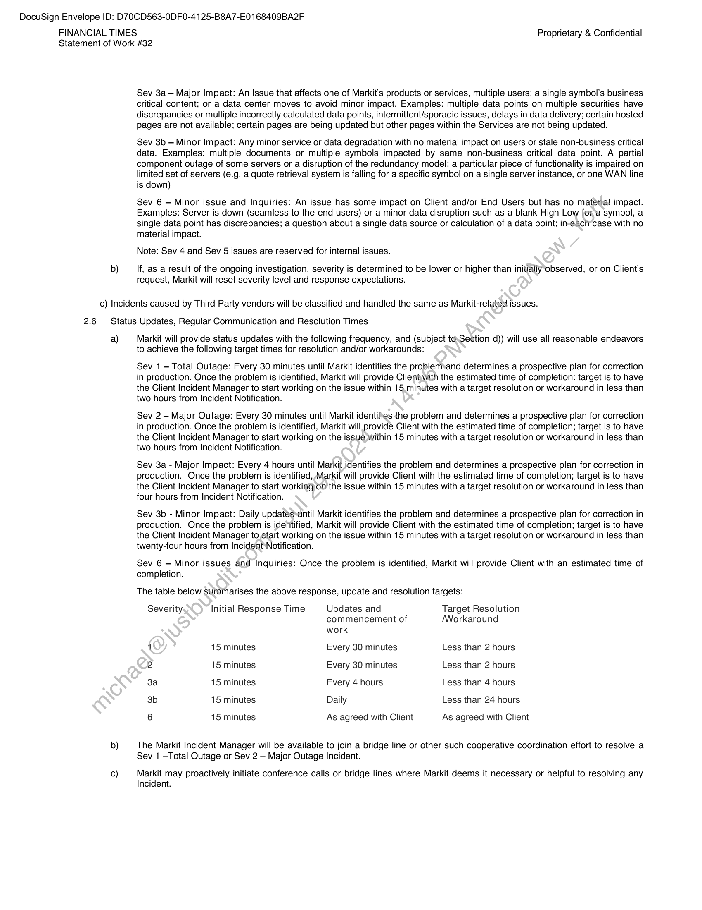
```  
```col-md
DocuSign Envelope ID: D70CD563-0DF0-4125-B8A7-E0168409BA2F  
FINANCIAL TIMES Proprietary & Confidential
Statement of Work #32  
b)  
Sev 3a — Major Impact: An Issue that affects one of Markit’s products or services, multiple users; a single symbol’s business
critical content; or a data center moves to avoid minor impact. Examples: multiple data points on multiple securities have
discrepancies or multiple incorrectly calculated data points, intermittent/sporadic issues, delays in data delivery; certain hosted
pages are not available; certain pages are being updated but other pages within the Services are not being updated.  
Sev 3b — Minor Impact: Any minor service or data degradation with no material impact on users or stale non-business critical
data. Examples: multiple documents or multiple symbols impacted by same non-business critical data point. A partial
component outage of some servers or a disruption of the redundancy model; a particular piece of functionality is impaired on
limited set of servers (e.g. a quote retrieval system is falling for a specific symbol on a single server instance, or one WAN line
is down)  
Sev 6 - Minor issue and Inquiries: An issue has some impact on Client and/or End Users but has no material impact.
Examples: Server is down (seamless to the end users) or a minor data disruption such as a blank High Low for ‘a symbol, a
single data point has discrepancies; a question about a single data source or calculation of a data point; in-eactrcase with no
material impact.  
Note: Sev 4 and Sev 5 issues are reserved for internal issues.  
If, as a result of the ongoing investigation, severity is determined to be lower or higher than initially observed, or on Client's
request, Markit will reset severity level and response expectations.  
c) Incidents caused by Third Party vendors will be classified and handled the same as Markit-related issues.  
2.6 Status Updates, Regular Communication and Resolution Times  
a)  
Markit will provide status updates with the following frequency, and (subject to.Section d)) will use all reasonable endeavors
to achieve the following target times for resolution and/or workarounds:  
Sev 1 - Total Outage: Every 30 minutes until Markit identifies the problem»and determines a prospective plan for correction
in production. Once the problem is identified, Markit will provide Clientwith the estimated time of completion: target is to have
the Client Incident Manager to start working on the issue within 15.minutes with a target resolution or workaround in less than
two hours from Incident Notification.  
Sev 2 - Major Outage: Every 30 minutes until Markit identifies the problem and determines a prospective plan for correction
in production. Once the problem is identified, Markit will provide Client with the estimated time of completion; target is to have
the Client Incident Manager to start working on the issue within 15 minutes with a target resolution or workaround in less than
two hours from Incident Notification.  
Sev 3a - Major Impact: Every 4 hours until Markit identifies the problem and determines a prospective plan for correction in
production. Once the problem is identified, Markit will provide Client with the estimated time of completion; target is to have
the Client Incident Manager to start working on the issue within 15 minutes with a target resolution or workaround in less than
four hours from Incident Notification.  
Sev 3b - Minor Impact: Daily updates~until Markit identifies the problem and determines a prospective plan for correction in
production. Once the problem is identified, Markit will provide Client with the estimated time of completion; target is to have
the Client Incident Manager to start working on the issue within 15 minutes with a target resolution or workaround in less than
twenty-four hours from Incident\Notification.  
Sev 6 - Minor issues and Inquiries: Once the problem is identified, Markit will provide Client with an estimated time of
completion.  
The table below summarises the above response, update and resolution targets:  
Severity. Initial Response Time Updates and Target Resolution
commencement of Workaround
work
1 15 minutes Every 30 minutes Less than 2 hours
2 15 minutes Every 30 minutes Less than 2 hours
8a 15 minutes Every 4 hours Less than 4 hours
3b 15 minutes Daily Less than 24 hours
6 15 minutes As agreed with Client As agreed with Client  
The Markit Incident Manager will be available to join a bridge line or other such cooperative coordination effort to resolve a
Sev 1 —Total Outage or Sev 2 — Major Outage Incident.  
Markit may proactively initiate conference calls or bridge lines where Markit deems it necessary or helpful to resolving any
Incident.  
```
````
Notes:    
````col
```col-md
flexGrow=.5
===
> [!info] [Page 7](_attachments/images_FinTimes-3.6.1.7.200114869.pdf_210116/page_7.png)
> 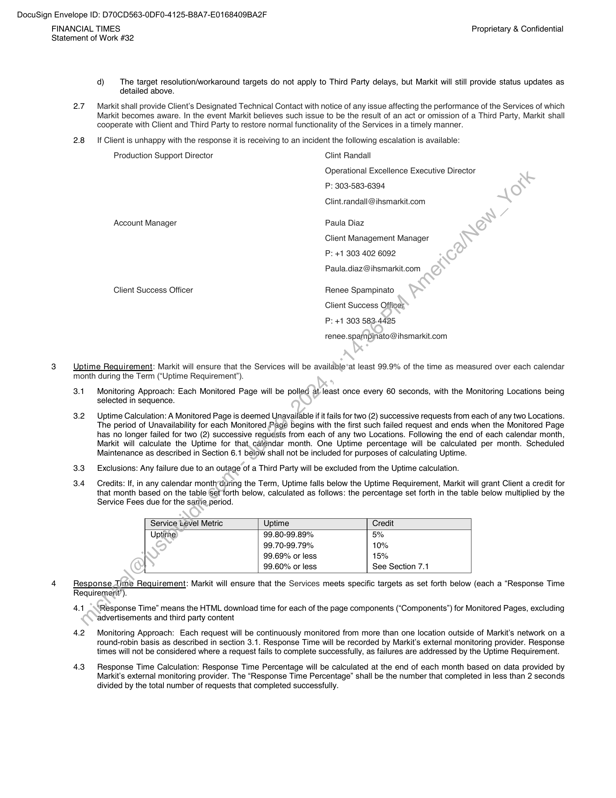
```  
```col-md
DocuSign Envelope ID: D70CD563-0DF0-4125-B8A7-E0168409BA2F  
FINANCIAL TIMES Proprietary & Confidential
Statement of Work #32  
4  
d) The target resolution/workaround targets do not apply to Third Party delays, but Markit will still provide status updates as
detailed above.  
2.7 Markit shall provide Client's Designated Technical Contact with notice of any issue affecting the performance of the Services of which
Markit becomes aware. In the event Markit believes such issue to be the result of an act or omission of a Third Party, Markit shall
cooperate with Client and Third Party to restore normal functionality of the Services in a timely manner.  
2.8 — If Client is unhappy with the response it is receiving to an incident the following escalation is available:
Production Support Director Clint Randall
Operational Excellence Executive Director
P: 303-583-6394  
Clint.randall@ihsmarkit.com  
Account Manager Paula Diaz
Client Management Manager
P: +1 303 402 6092  
Paula.diaz@ihsmarkit.com  
Client Success Officer Renee Spampinato
Client Success Officer
P: +1 303 583-4425  
renee.spampinato @ihsmarkit.com  
Uptime Requirement: Markit will ensure that the Services will be available*at least 99.9% of the time as measured over each calendar
month during the Term (“Uptime Requirement’).  
3.1. Monitoring Approach: Each Monitored Page will be polled at-least once every 60 seconds, with the Monitoring Locations being
selected in sequence.  
3.2 Uptime Calculation: A Monitored Page is deemed Unavailable if it fails for two (2) successive requests from each of any two Locations.
The period of Unavailability for each Monitored Page begins with the first such failed request and ends when the Monitored Page
has no longer failed for two (2) successive requests from each of any two Locations. Following the end of each calendar month,
Markit will calculate the Uptime for that.calendar month. One Uptime percentage will be calculated per month. Scheduled
Maintenance as described in Section 6.1 below shall not be included for purposes of calculating Uptime.  
3.3 Exclusions: Any failure due to an outage of a Third Party will be excluded from the Uptime calculation.  
3.4 Credits: If, in any calendar month‘during the Term, Uptime falls below the Uptime Requirement, Markit will grant Client a credit for
that month based on the table ‘set forth below, calculated as follows: the percentage set forth in the table below multiplied by the
Service Fees due for the same period.  
Service Level Metric Uptime Credit  
Uptime) 99.80-99.89% 5%
99.70-99.79% 10%
99.69% or less 15%
99.60% or less See Section 7.1  
Response Tine Requirement: Markit will ensure that the Services meets specific targets as set forth below (each a “Response Time
Requirement’).  
4.1 _\“Response Time” means the HTML download time for each of the page components (“Components”) for Monitored Pages, excluding
advertisements and third party content  
4.2 Monitoring Approach: Each request will be continuously monitored from more than one location outside of Markit’s network on a
round-robin basis as described in section 3.1. Response Time will be recorded by Markit’s external monitoring provider. Response
times will not be considered where a request fails to complete successfully, as failures are addressed by the Uptime Requirement.  
4.3 Response Time Calculation: Response Time Percentage will be calculated at the end of each month based on data provided by
Markit’s external monitoring provider. The “Response Time Percentage” shall be the number that completed in less than 2 seconds
divided by the total number of requests that completed successfully.  
```
````
Notes:    
````col
```col-md
flexGrow=.5
===
> [!info] [Page 8](_attachments/images_FinTimes-3.6.1.7.200114869.pdf_210116/page_8.png)
> 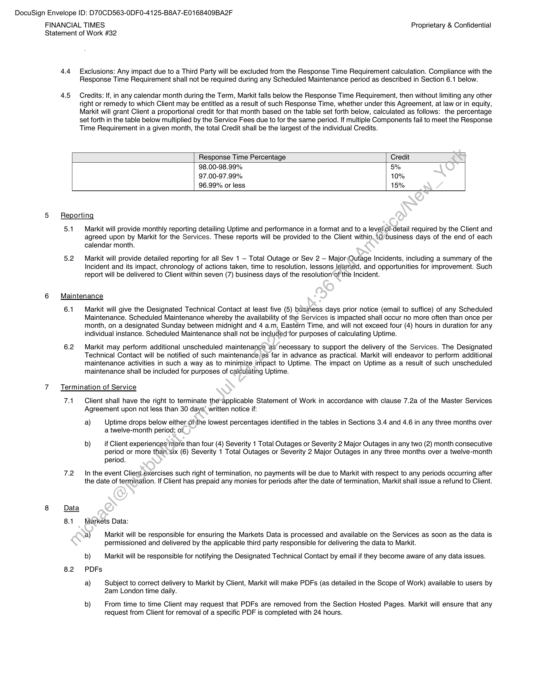
```  
```col-md
DocuSign Envelope ID: D70CD563-0DF0-4125-B8A7-E0168409BA2F  
FINANCIAL TIMES Proprietary & Confidential
Statement of Work #32
4.4 Exclusions: Any impact due to a Third Party will be excluded from the Response Time Requirement calculation. Compliance with the  
4.5  
Response Time Requirement shall not be required during any Scheduled Maintenance period as described in Section 6.1 below.  
Credits: If, in any calendar month during the Term, Markit falls below the Response Time Requirement, then without limiting any other
right or remedy to which Client may be entitled as a result of such Response Time, whether under this Agreement, at law or in equity,
Markit will grant Client a proportional credit for that month based on the table set forth below, calculated as follows: the percentage
set forth in the table below multiplied by the Service Fees due to for the same period. If multiple Components fail to meet the Response
Time Requirement in a given month, the total Credit shall be the largest of the individual Credits.  
Response Time Percentage Credit  
98.00-98.99% 5%
97.00-97.99% 10%
96.99% or less 15%  
5 Reporting  
5.1  
5.2  
Markit will provide monthly reporting detailing Uptime and performance in a format and to a level(of-detail required by the Client and
agreed upon by Markit for the Services. These reports will be provided to the Client within. 10) business days of the end of each
calendar month.  
Markit will provide detailed reporting for all Sev 1 — Total Outage or Sev 2 — Major Outage Incidents, including a summary of the
Incident and its impact, chronology of actions taken, time to resolution, lessons learned, and opportunities for improvement. Such
report will be delivered to Client within seven (7) business days of the resolution‘of the Incident.  
6 Maintenance  
6.1  
6.2  
Markit will give the Designated Technical Contact at least five (5) business days prior notice (email to suffice) of any Scheduled
Maintenance. Scheduled Maintenance whereby the availability of the Services is impacted shall occur no more often than once per
month, on a designated Sunday between midnight and 4 a.m. Eastern Time, and will not exceed four (4) hours in duration for any
individual instance. Scheduled Maintenance shall not be included for purposes of calculating Uptime.  
Markit may perform additional unscheduled maintenance as necessary to support the delivery of the Services. The Designated
Technical Contact will be notified of such maintenance as far in advance as practical. Markit will endeavor to perform additional
maintenance activities in such a way as to minimize impact to Uptime. The impact on Uptime as a result of such unscheduled
maintenance shall be included for purposes of calculating Uptime.  
7 Termination of Service  
7A  
7.2  
Client shall have the right to terminate the~applicable Statement of Work in accordance with clause 7.2a of the Master Services
Agreement upon not less than 30 days’ written notice if:  
a) Uptime drops below either Of\the lowest percentages identified in the tables in Sections 3.4 and 4.6 in any three months over
a twelve-month period; of.  
b) if Client experiences more than four (4) Severity 1 Total Outages or Severity 2 Major Outages in any two (2) month consecutive
period or more thainsix (6) Severity 1 Total Outages or Severity 2 Major Outages in any three months over a twelve-month
period.  
In the event Client-exercises such right of termination, no payments will be due to Markit with respect to any periods occurring after
the date of termination. If Client has prepaid any monies for periods after the date of termination, Markit shall issue a refund to Client.  
8 Data  
8.1  
8.2  
Markets Data:  
a) Markit will be responsible for ensuring the Markets Data is processed and available on the Services as soon as the data is
permissioned and delivered by the applicable third party responsible for delivering the data to Markit.  
b) Markit will be responsible for notifying the Designated Technical Contact by email if they become aware of any data issues.
PDFs  
a) Subject to correct delivery to Markit by Client, Markit will make PDFs (as detailed in the Scope of Work) available to users by
2am London time daily.  
b) From time to time Client may request that PDFs are removed from the Section Hosted Pages. Markit will ensure that any
request from Client for removal of a specific PDF is completed with 24 hours.  
```
````
Notes:    
````col
```col-md
flexGrow=.5
===
> [!info] [Page 9](_attachments/images_FinTimes-3.6.1.7.200114869.pdf_210116/page_9.png)
> 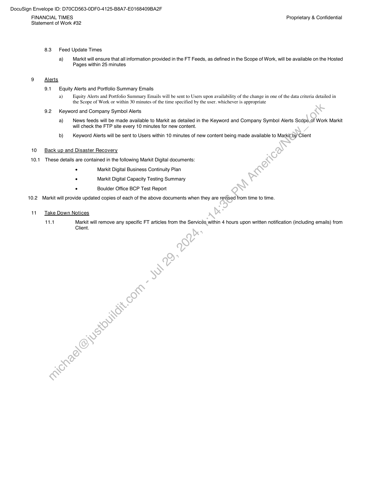
```  
```col-md
DocuSign Envelope ID: D70CD563-0DF0-4125-B8A7-E0168409BA2F  
FINANCIAL TIMES Proprietary & Confidential
Statement of Work #32  
8.3 Feed Update Times  
a) Markit will ensure that all information provided in the FT Feeds, as defined in the Scope of Work, will be available on the Hosted
Pages within 25 minutes  
9 Alerts  
9.1 Equity Alerts and Portfolio Summary Emails  
a) Equity Alerts and Portfolio Summary Emails will be sent to Users upon availability of the change in one of the data criteria detailed in
the Scope of Work or within 30 minutes of the time specified by the user. whichever is appropriate  
9.2 Keyword and Company Symbol Alerts  
a) News feeds will be made available to Markit as detailed in the Keyword and Company Symbol Alerts Scope.of Work Markit
will check the FTP site every 10 minutes for new content.  
b) Keyword Alerts will be sent to Users within 10 minutes of new content being made available to Markit by Client  
10 Back up and Disaster Recovery  
10.1 These details are contained in the following Markit Digital documents:  
. Markit Digital Business Continuity PlanMarkit Digital Capacity Testing SummaryBoulder Office BCP Test Report  
10.2 Markit will provide updated copies of each of the above documents when they are revised from time to time.  
11. Take Down Notices  
114 Markit will remove any specific FT articles from the Services within 4 hours upon written notification (including emails) from
Client.  
```
````
Notes:    
````col
```col-md
flexGrow=.5
===
> [!info] [Page 10](_attachments/images_FinTimes-3.6.1.7.200114869.pdf_210116/page_10.png)
> 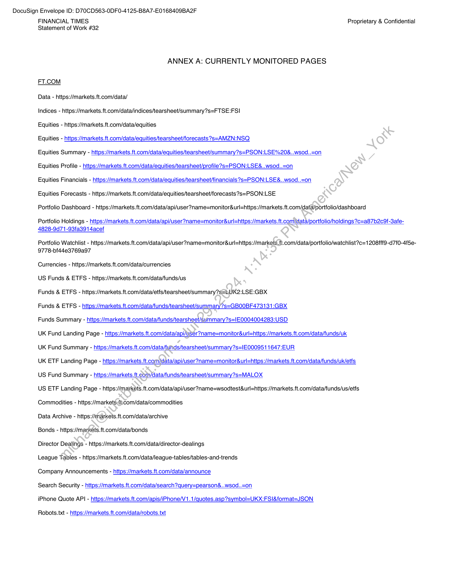
```  
```col-md
DocuSign Envelope ID: D70CD563-0DF0-4125-B8A7-E0168409BA2F  
FINANCIAL TIMES Proprietary & Confidential
Statement of Work #32  
ANNEX A: CURRENTLY MONITORED PAGES  
FT.COM  
Data - https://markets.ft.com/data/  
Indices - https://markets.ft.com/data/indices/tearsheet/summary?s=FTSE:FSI
Equities - https://markets.ft.com/data/equities  
Equities - https://markets.ft.com/data/equities/tearsheet/forecasts ?s=AMZN:NSQ  
Equities Summary - https://markets.ft.com/data/equities/tearsheet/summary?s=PSON:LSE%20&.  
wsod.  
=on  
Equities Profile - https://markets.ft.com/data/equities/tearsheet/profile?s=PSON:LSE&.  
wsod.  
=on  
Equities Financials - https://markets.ft.com/data/equities/tearsheet/financials?s=PSON:LSE&.  
wsod.  
=on  
Equities Forecasts - https://markets.ft.com/data/equities/tearsheet/forecasts ?s=PSON:LSE
Portfolio Dashboard - https://markets.ft.com/data/api/user?name=monitor&url=https://markets.ft.com/data/portfolio/dashboard  
Portfolio Holdings - https://markets.ft.com/data/api/user?name=monitor&url=https ://markets.ft.com/data/portfolio/holdings ?c=a87b2c9f-3afe4828-9d71-93fa3914acef  
Portfolio Watchlist - https://markets.ft.com/data/api/user?name=monitor&url=https://markets.ft.com/data/portfolio/watchlist?c=1 208fff9 -d7f0-4f5e9778-bf44e3769a97  
Currencies - https://markets.ft.com/data/currencies
US Funds & ETFS - https://markets.ft.com/data/funds/us
Funds & ETFS - https://markets.ft.com/data/etfs/tearsheet/summary?s=LUK2:LSE:GBX  
Funds & ETFS - https://markets.ft.com/data/funds/tearsheet/summary?s=GBO0BF473131:GBX  
Funds Summary - https://markets.ft.com/data/funds/tearsheet/summary?s=1E0004004283:USD  
UK Fund Landing Page - https://markets.ft.com/data/api/user?name=monitor&url=https://markets.ft.com/data/funds/uk  
UK Fund Summary - https://markets.ft.com/data/funds/tearsheet/summary?s=IE0009511647:EUR  
UK ETF Landing Page - https://markets.ft.com/data/api/user?name=monitor&url=https ://markets .ft.com/data/funds/uk/etfs  
US Fund Summary - https://markets.ft.com/data/funds/tearsheet/summary?s=MALOX  
US ETF Landing Page - https://markets.ft.com/data/api/user?name=wsodtest&url=https://markets.ft.com/data/funds/us/etfs
Commodities - https://markets-ft.com/data/commodities  
Data Archive - https://markets.ft.com/data/archive  
Bonds - https://markets.ft.com/data/bonds  
Director Dealings - https://markets.ft.com/data/director-dealings  
League Tables - https://markets.ft.com/data/league-tables/tables-and-trends  
Company Announcements - https://markets.ft.com/data/announce  
Search Security - https://markets.ft.com/data/search?query=pearson&.  
wsod.  
=on  
iPhone Quote API - https://markets.ft.com/apis/iPhone/V1.1/quotes.asp?symbol=UKX:FS|&format=JSON  
Robots.txt - https://markets.ft.com/data/robots.txt  
```
````
Notes:    
````col
```col-md
flexGrow=.5
===
> [!info] [Page 11](_attachments/images_FinTimes-3.6.1.7.200114869.pdf_210116/page_11.png)
> 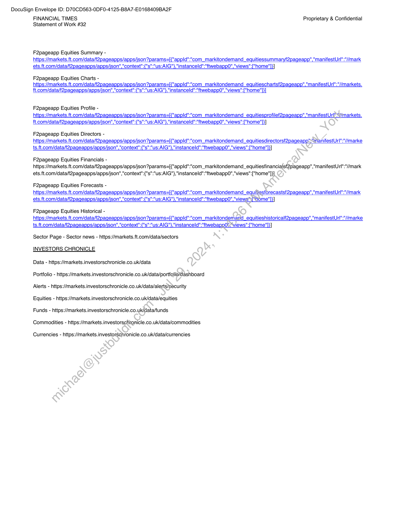
```  
```col-md
DocuSign Envelope ID: D70CD563-0DF0-4125-B8A7-E0168409BA2F  
FINANCIAL TIMES Proprietary & Confidential
Statement of Work #32  
F2pageapp Equities Summary https://markets.ft.com/data/f2pageapps/apps/json?params=[{"appld":"com_markitondemand_equitiessummaryf2pageapp'
ets.ft.com/data/f2pageapps/apps/json","context":{"s":"us:AIG"},"instanceld":"ftwebapp0","views"["home"]}]  
manifestUrl":"//mark  
F2pageapp Equities Charts https://markets. ft.com/data/f2pageapps/apps/json?params=[{"appld":"com_markitondemand_equitieschartsf2pageapp
ft.com/data/f2pageapps/apps/json","context":{"s":"us:AIG"},"instanceld":"ftwebapp0","views" ["home" ]}]  
manifestUrl":"//markets.  
F2pageapp Equities Profile https://markets. ft.com/data/f2pageapps/apps/json?params=[{"appld":"com_markitondemand_equitiesprofilef2pageapp'
ft.com/data/f2pageapps/apps/json","context":{"s":"us:AIG"},"instanceld":"ftwebappO","views":["home"]}]  
manifestUrl!Y/markets.  
F2pageapp Equities Directors https://markets.ft.com/data/f2pageapps/apps/json?params=[{"appld":"com_markitondemand_equitiesdirectorsf2pageapp
ts.ft.com/data/f2pageapps/apps/json","context":{"s":"us:AIG"},"instanceld":"ftwebapp0","views":["home"}}]  
ManifestUrl":"//marke  
F2pageapp Equities Financials https://markets.ft.com/data/f2pageapps/apps/json?params=[{"appld":"com_markitondemand_equitiesfinancialsf2pageapp","manifestUrl":"//mark  
ets. ft.com/data/f2pageapps/apps/json","context":{"s":"us:AlG"},"instanceld":"ftwebapp0","views":["home"]}]  
F2pageapp Equities Forecasts https://markets.ft.com/data/f2pageapps/apps/json?params=[{"appld":"com_markitondemand_equitiesforecastsf2pageapp'
ets.ft.com/data/f2pageapps/apps/json","context":{"s":"us:AIG"},"instanceld":"ftwebappO","views"s[“Home"]}]  
manifestUrl":"//mark  
F2pageapp Equities Historical https://markets.ft.com/data/f2pageapps/apps/json?params=[{"appld":"com_markitondemand_equitieshistoricalf2pageapp
ts.ft.com/data/f2pageapps/apps/json","context":{"s":"us:AlG"}."instanceld":"ftwebapp0."views":["home"]}  
manifestUrl":"//marke  
Sector Page - Sector news - https://markets.ft.com/data/sectors
INVESTORS CHRONICLE  
Data - https://markets.investorschronicle.co.uk/data  
Portfolio - https://markets.investorschronicle.co.uk/data/portfalio/dashboard
Alerts - https://markets.investorschronicle.co.uk/data/alerts/security
Equities - https://markets.investorschronicle.co.uk/data/equities  
Funds - https://markets.investorschronicle.co.uk/data/funds  
Commodities - https://markets.investorschironicle.co.uk/data/commodities  
Currencies - https://markets.investorschronicle.co.uk/data/currencies  
```
````
Notes:    
````col
```col-md
flexGrow=.5
===
> [!info] [Page 12](_attachments/images_FinTimes-3.6.1.7.200114869.pdf_210116/page_12.png)
> 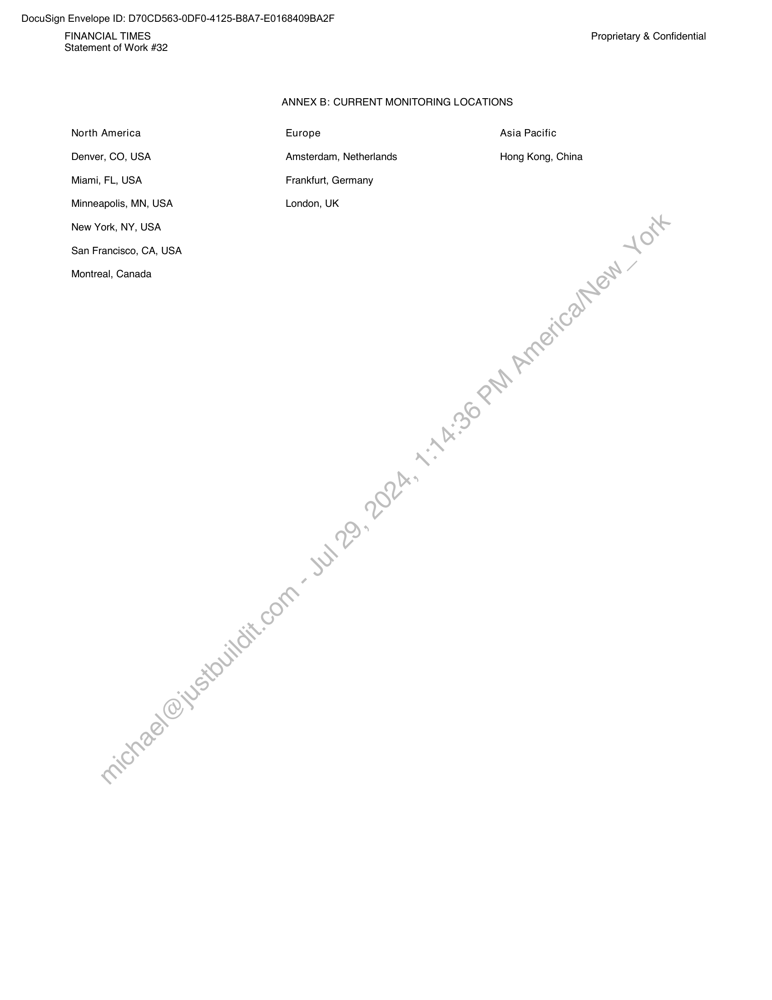
```  
```col-md
DocuSign Envelope ID: D70CD563-0DF0-4125-B8A7-E0168409BA2F  
FINANCIAL TIMES Proprietary & Confidential
Statement of Work #32  
ANNEX B: CURRENT MONITORING LOCATIONS  
North America Europe Asia Pacific
Denver, CO, USA Amsterdam, Netherlands Hong Kong, China
Miami, FL, USA Frankfurt, Germany  
Minneapolis, MN, USA London, UK  
New York, NY, USA
San Francisco, CA, USA  
Montreal, Canada  
```
````
Notes:    
````col
```col-md
flexGrow=.5
===
> [!info] [Page 13](_attachments/images_FinTimes-3.6.1.7.200114869.pdf_210116/page_13.png)
> 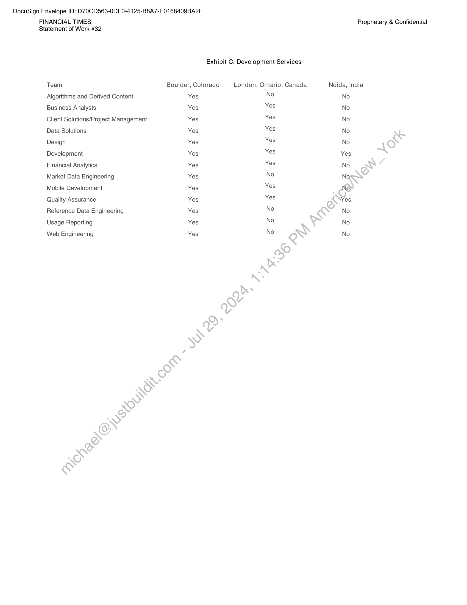
```  
```col-md
DocuSign Envelope ID: D70CD563-0DF0-4125-B8A7-E0168409BA2F  
FINANCIAL TIMES Proprietary & Confidential
Statement of Work #32  
Exhibit C: Development Services  
Team Boulder, Colorado London, Ontario, Canada Noida, India
Algorithms and Derived Content Yes No No
Business Analysts Yes Yes No
Client Solutions/Project Management Yes Yes No
Data Solutions Yes Yes No
Design Yes Yes No
Development Yes Yes Yes
Financial Analytics Yes Yes No
Market Data Engineering Yes No No
Mobile Development Yes Yes No)
Quality Assurance Yes Yes Yes
Reference Data Engineering Yes No No
Usage Reporting Yes No No  
Web Engineering Yes No No  
```
````
Notes:  


![[_attachments/FinTimes-3.6.1.7.2 00114869.pdf]