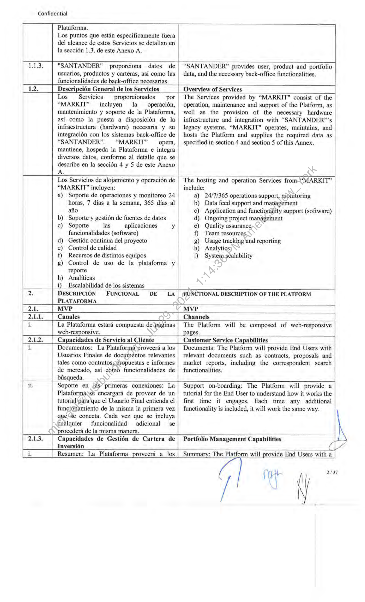
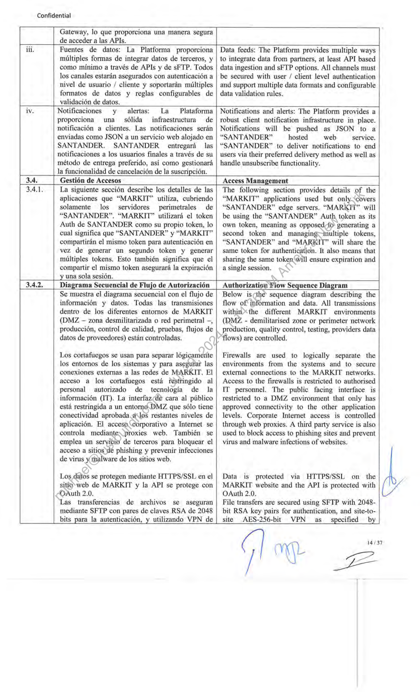
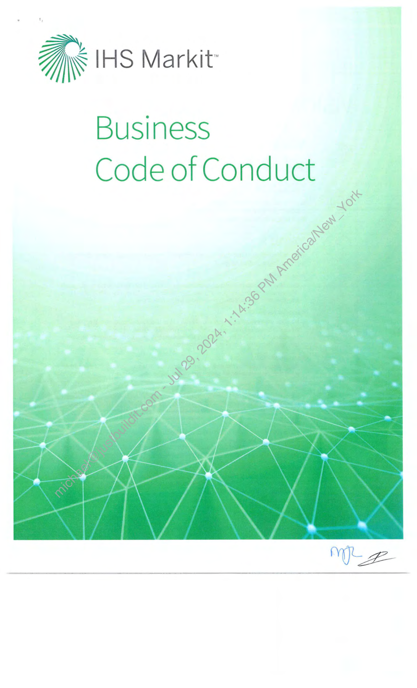
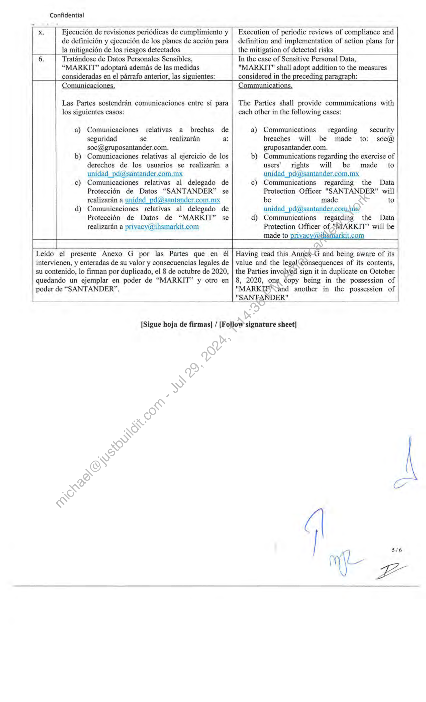
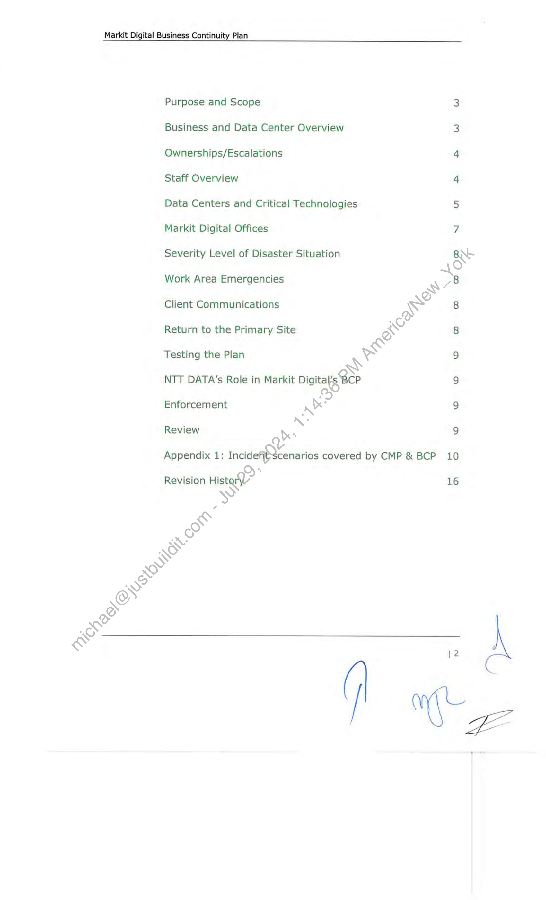
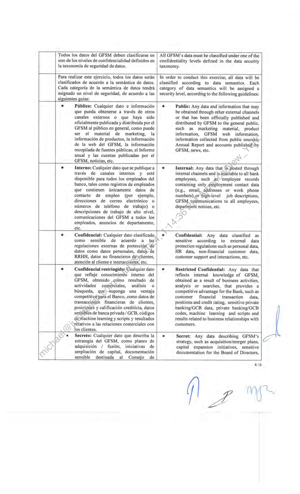

##### No title found]


````col
```col-md
flexGrow=.5
===
> [!info] [Page 1](_attachments/images_Banco-Santander-3.6.1.8.100156062.pdf_190355/page_1.png)
> 
```  
```col-md
Confidential  
SPANISH  
ANEXO A AL CONTRATO DE PRESTACION DE
SERVICIOS DE FECHA 8 DE OCTUBRE DE 2020
(LA “FECHA EFECTIVA”) QUE CELEBRAN POR
UNA PARTE MARKIT GROUP LIMITED A
QUIEN EN LO SUCESIVO SE LE DENOMINARA
COMO “MARKIT”, REPRESENTADO EN ESTE
ACTO POR MICHELLE LOADER Y POR LA OTRA
PARTE BANCO SANTANDER MEXICO S.A.
INSTITUCION DE BANCA MULTIPLE, GRUPO
FINANCIERO SANTANDER MEXICO, A QUIEN
EN LO SUCESIVO SE LE DENOMINARA COMO
“SANTANDER”, REPRESENTADA EN ESTE ACTO
POR SUS APODERADOS JORGE ERNESTO VEGA
CENDEJAS Y RICARDO ZAPIEN GARIBAY DE
CONFORMIDAD CON LAS DECLARACIONES Y
CLAUSULAS SIGUIENTES:  
TODOS LOS TERMINOS EN MAYUSCULA
UTILIZADOS; PERO NO DEFINIDOS EN ESTE
ANEXO E TENDRAN EL SIGNIFICADO DADO A
DICHOS TERMINOS EN EL CONTRATO.  
DESCRIPCION DE LOS SERVICIOS:
OPERACION Y MANTENIMIENTO  
ANEXO A ~- DESCRIPCION DE SERVICIOS
ANNEX A — DESCRIPTION OF SERVICES  
ENGLISH  
ANNEX A TO THE AGREEMENT FOR THE
PROVISION OF SERVICES WITH EFFECTIVE
DATE OF OCTOBER 8, 2020 (“THE “EFFECTIVE
DATE”) BY THE PARTY MARKIT GROUP
LIMITED. WHO SHALL HEREINAFTER BE
REFERRED TO AS THE "MARKIT",
REPRESENTED IN THIS ACT BY MICHELLE
LOADER AND BY THE OTHER PARTY BANCO
SANTANDER MEXICO S.A., INSTITUCION DE
BANCA MULTIPLE, GRUPO FINANCIERO
SANTANDER MEXICO, WHO SHALL
HEREINAFTER BE REFERRED TO = AS
"SANTANDER", REPRESENTED IN THIS ACT BY
ITS LEGAL REPRESENTATIVES JORGE ERNESTO
VEGA CENDEJAS AND RICARDO ZAPIEN
GARIBAY IN ACCORDANCE WITH THE
FOLLOWING RECITALS AND CLAUSES:  
ALL CAPITALIZED TERMS USED’ BUT NOT
DEFINED IN THIS ANNEX E.SHALL HAVE THE
MEANINGS GIVEN TO SUCH’ TERMS IN THE
AGREEMENT.  
DESCRIPTION OF SERVICES: OPERATION
AND MAINTENANCE  
| ee t |  
proceso de transformacién para mejorar sus
capacidades digitales bancarias para clientes
privados, lo que permitira a
"SANTANDER" reforzar su posicién en el
mercado. Como parte de este proceso de
transformacién, "SANTANDER" hastomado
la decisién de implementar una selucién de
inversién (la "Plataforma") para Usuarios
Finales y Asesores.  
LUZ "MARKIT" _ proporciona’ el
desarrollo, operacién“y~ mantenimiento de
una solucién de-\Nistializacién y analisis,
multiproducto ysmulticanal que se integra
con los -sistemas back-office de
"SANTANDER", de acuerdo con los
requisitos) y’ especificaciones y por encargo
de "SANTANDER". La Plataforma esta
compuesta principalmente por la interfaz y
experiencia de usuario (UI/UX),
visualizacion de “customer journeys” y
funcionalidades de analisis. Ademas,
"MARKIT" integra y proporciona datos de
"SANTANDER" y de otros Terceros en la  
s INTRODUCCION INTRODUCTION  
1.1. Contexto y Objetivos Estratégicos de | “SANTANDER” Context and Strategic Objectives
“SANTANDER”  
1.1.1 "SANTANDER" est4é inmersa en un| “SANTANDER” is embarked in a transformation  
diseilo, | “MARKIT"  
journey to improve its banking digital capabilities for
private clients enabling “SANTANDER” to strengthen
its position in the market. As part of this transformation
journey, “SANTANDER” has taken the decision to
implement a digital investment solution (the “Platform”)
for End Users and Advisors.  
provides the design, development,
operations, and maintenance of a multi-product, multichannel research and insights solution which is
integrated with “SANTANDER”’s back-office systems
according to the requirements and specifications and on
behalf of “SANTANDER”. The Platform is mainly
comprised by the user interface and user experience
(UI/UX), workflows visualisation and analysis |
functionalities. In addition, “MARKIT" integrates and
delivers data from “SANTANDER” and other Third
Parties in the Platform.  
The items that are specifically out of scope of this
Services are detailed in section 1.3. of this Annex A.  
```
````
Notes:    
````col
```col-md
flexGrow=.5
===
> [!info] [Page 2](_attachments/images_Banco-Santander-3.6.1.8.100156062.pdf_190355/page_2.png)
> 
```  
```col-md
Confidential  
Plataforma.  
Los puntos que estan especificamente fuera
del alcance de estos Servicios se detallan en
la seccidén 1.3, de este Anexo A.  
“SANTANDER” provides user, product and portfolio
data, and the necessary back-office functionalities.  
Overview of Services  
Teli3s "SANTANDER" proporciona datos de
usuarios, productos y carteras, asi como las
funcionalidades de back-office necesarias.  
1,2. Descripcién General de los Servicios
Los Servicios = proporcionados _ por
“MARKIT”  incluyen la __ operacién,  
mantenimiento y soporte de la Plataforma,
asi como la puesta a disposicién de la
infraestructura (hardware) necesaria y su
integracion con los sistemas back-office de
“SANTANDER”. “MARKIT” _ opera,
mantiene, hospeda la Plataforma e integra  
diversos datos, conforme al detalle que se  
describe en la seccién 4 y 5 de este Anexo  
A.  
Los Servicios de alojamiento y operacién de  
“MARKIT” incluyen:  
a) Soporte de operaciones y monitoreo 24
horas, 7 dias a la semana, 365 dias al
ano  
b) Soporte y gestion de fuentes de datos  
c) Soporte las aplicaciones y
funcionalidades (software)  
d) Gestién continua del proyecto  
e) Control de calidad  
f) Recursos de distintos equipos  
g) Control de uso de la plataforma y
reporte  
h) Analiticas  
i) _Escalabilidad de los sistemas  
DESCRIPCION FUNCIONAL DE LA
PLATAFORMA  
MVP
Canales
La Plataforma estara compuesta de paginas
web-responsive.  
The Services provided by “MARKIT" consist of the
operation, maintenance and support of the Platform, as
well as the provision of the necessary hardware
infrastructure and integration with “SANTANDER”™’s
legacy systems. “MARKIT" operates, maintains, and
hosts the Platform and supplies the required data as
specified in section 4 and section 5 of this Annex.  
The hosting and operation Services from-“MARKIT”
include:
a) 24/7/365 operations support, monitoring
b) Data feed support and mariagement
c) Application and functioriality support (software)
d) Ongoing project management
e) Quality assurance,
f) Team resources.
g) Usage tracking and reporting
Analytics
i) System-scalability  
FUNCTIONAL DESCRIPTION OF THE PLATFORM  
Channels
The Platform will be composed of web-responsive
pages.  
Capacidades de Servicio al Cliente  
Customer Service Capabilities  
i, Documentos: La Plataforma proveera a los
Usuarios Finales de documentos relevantes
tales como contratos,propuestas e informes
de mercado, asi coOm6 funcionalidades de  
busqueda.
ii. Soporte en las~primeras conexiones: La
Plataformass® encargara de proveer de un
tutorial para ‘que el Usuario Final entienda el
funci6namiento de la misma la primera vez
que “se conecta. Cada vez que se incluya
cualquier funcionalidad adicional se
procedera de la misma manera.
Capacidades de Gestién de Cartera de
Inversion  
Documents: The Platform will provide End Users with
relevant documents such as contracts, proposals and
market reports, including the correspondent search
functionalities.  
Support on-boarding: The Platform will provide a
tutorial for the End User to understand how it works the
first time it engages. Each time any additional
functionality is included, it will work the same way.  
Portfolio Management Capabilities  
Y  
Cd  
Resumen: La Plataforma proveerd a los  
Summary: The Platform will provide End Users with a  
2/37  
```
````
Notes:    
````col
```col-md
flexGrow=.5
===
> [!info] [Page 3](_attachments/images_Banco-Santander-3.6.1.8.100156062.pdf_190355/page_3.png)
> 
```  
```col-md
Confidential  
Usuarios Finales de una visualizacién
unificada de sus carteras y la distribucién de
las mismas en los diferentes productos y
activos de inversion que apliquen, asi como
un detalle de las Ultimas transacciones
realizadas sobre las mismas.  
unified visualization of their portfolios and their
distribution in the different products and investment
assets, as well as a detailed view of the last transactions.  
ii.  
2.1.4.
i,  
Historial de transacciones: La Plataforma
sera capaz de mostrar todo el historial de
transacciones asociado al Usuario Final
habilitando el filtrado de las mismas por:
carteras, tipo de operacién, y/o franja
temporal.  
Transaction history: The Platform will be able to display
complete transaction history associated with the End
User, enabling the filtering of the same by: portfolios,
type of operation, and/or time frame.  
—  
Informacién y Mercados  
Vision general y noticias de mercados; La
Plataforma expondra informacién de
mercados tales como precio de acciones y
principales indices, ademas habilitara la
seleccién de indices especificos para su
seguimiento y ofrecera noticias de mercado  
Market Information J
Market news and overview: The Platform will display
market information such as stock prices and major
indices. In addition, it will enable the selection of
specific indices to be tracked and will provide
customized market news for each End User.  
Full Functional Delive
Channels  
App: La Plataforma sera integrada como un
componente mas de la actual app de
“SANTANDER”  
ii.  
Mi.  
2.2.2  
Se integrara un médulo de mensajeria (entre
Asesor y Usuario Final) a la Plataforma,
incluyendo chat instantaneo, navegacién  
App: The Platform will be integratedas‘a component of
the current "SANTANDER" nativeémobile app.  
A messaging tool (betweenyEnd Users and Advisors),
including instant chat, co-browsing, video-conferencing.
will be integrated to the Platform  
compartida y video-conferencia.  
Se integrara un chatbot a la Plataforma: a fin
que la Plataforma disponga de una
capacidad de atender a los Usuarios Finales
de forma automatica a través de un robot
con respuestas predefinidas, para solventar
dudas comiinmente preguntadas  
A chatbot will b®integrated to the Platform: in order for
the Platform (@, have the capacity to attend End Users
automaticallyothrough a robot with predefined answers,
to solve. doubts commonly asked.  
Capacidades de Servicio al Cliente  
ii.  
iii.  
Se integrara una firma digital a la
Plataforma: a fin de habilitar la firma digital
de documentos para que los Ustidrios
Finales que estén conformes cdn ~~ una
propuesta sean capaces de firmarla en el
momento.  
Customer Service Capabilities  
A digital signature will be integrated to the Platform: In
order to enable the digital signature of documents in
order for End Users who are comfortable with a
proposal to be able to sign it on the spot.  
Alertas y notificaciones: LaPlataforma se
encargara de enviar alertas~y notificaciones
a los clientes a través des la web, email, sms
y/o notificaciones-push en las aplicaciones.
Dichas alertas .y“notificaciones responderan
a casuisticastales como: Aparicién de
nuevos infermes de mercado, cambios en
precios ‘dé mercado, eventos corporativos,
nuevé’)propuesta  generada, nueva meta
cumplida, qué ha cambiado desde la ultima
conexion del Usuario Final, calendario de
eventos relevantes para los Usuarios
Finales, otros eventos personalizados que
requieran notificacién a Usuarios Finales.  
Alerts and notifications: The Platform will be able to
provide alerts and notifications to clients through the
following: the web, email, SMS and/or push
notifications in the native applications.  
These alerts and notifications will respond to cases such
as: Appearance of new market reports, changes in
market prices, corporate events, new proposal
generated, new goal met, what has changed since the
last connection of the End User, events calendar
relevant to End Users, other personalized events that
require notification to End Users.  
Informacion de soporte: La _ Plataforma  
Support information: The Platform will provide support  
3/37  
```
````
Notes:    
````col
```col-md
flexGrow=.5
===
> [!info] [Page 4](_attachments/images_Banco-Santander-3.6.1.8.100156062.pdf_190355/page_4.png)
> 
```  
```col-md
Confidential  
proporcionara contenido de soporte para que
los Usuarios Finales puedan utilizar a su
discrecién cuando los necesiten, tales como
tutoriales. Del mismo modo, la Plataforma
permitira bisquedas para facilitar el acceso
a la informacién mencionada a los Usuarios
Finales.  
Personalizacién y ajustes de usuario:
Personalizar la Plataforma desde un punto
de vista visual/disefio, gestién de usuarios
dependiendo quién accede a la Plataforma
(por ejemplo, cuando el cliente es una
empresa ).  
content, such as tutorials for End Users to use at their
discretion when they need. Similarly, the Platform will
enable searches to facilitate access to this information to
End Users.  
Personalization and user settings: Customize the
Platform from a visual/design point of view and user
management depending who is accessing to the
Platform (i.e. client is a company ).  
Capacidades de Gestion de Cartera de
Inversién  
Portfolio Management Capabilities  
Inversiones: La Plataforma proveeré a sus
Usuarios Finales de una representacién
grafica de la rentabilidad de sus carteras
siendo capaz de acotar dicho calculo de
rentabilidad a nivel global, cartera, por
producto y/o en determinada  franja
temporal. La Plataforma también proveera a
los Usuarios Finales de una visualizacion
unificada de sus carteras y la distribucién de
las mismas en los diferentes productos y
activos de inversién que apliquen. Asi
mismo la Plataforma podra, en el futuro,
mostrar comparativa de dicha rentabilidad
contra estudios de mercado y/o grupos de
control anonimizados.  
Investments: The Platform will provide End Users with
a graphical representation of their portfolio’s
performance. End Users will be able to restrict the
performance calculation at a global level, portfolio, by
product and / or in a certain time frame. The*Platform
will also provide End Users with a unified-visualization
of their portfolios and their allocation in different
products and investment assets that apply. Likewise, the
Platform may, in the future, showsa*comparison of this
performance against market studies and/or anonymized
control groups.  
2.2.4,  
Capacidad de agregacién externa: La
Plataforma sera capaz de mostrar
informacién de las posiciones de inversién
en otras entidades, del grupo Santander o
externas, de los Usuarios Finales que asi lo
autoricen.  
Capacidades de Gestién de Productos de
Crédito  
Resumen: Con  sujecién a que
SANTANDER  proporcione los. datos
necesarios, la Plataforma proveeraé a los
Usuarios Finales de una visualizacién de la
distribucién de sus productos de crédito
tales como; tarjetas de-\crédito, créditos
hipotecarios y créditos comerciales, asi
como un detalle deJas/ultimas transacciones
realizadas sobre los-mismas  
iii.  
Historial de traisacciones: La Plataforma
sera capaz.de mostrar todo el historial de
transacciones asociados al Usuario Final
habilitando el filtrado de las mismas por:
tipd@e producto, y/o franja temporal.  
External aggregation capacity: The Platform will be
able to display End User, information of investment
positions \with other entities belonging to Santander
Group or external, preventing the End User authorize it.  
Credit Products Management Capabilities  
Summary: Subject to SANTANDER making available
the required data, the Platform will provide End Users
with a visualization of their credit products’ such as:
credit cards, mortgage credits and commercial credits,
as well as a description of the last transactions.  
Transaction history: The Platform will be able to show
all the history of transactions associated with the End
User enabling the filtering by: type of product, and / or
time frame.  
Aforo: La Plataforma sera capaz de mostrar
el aforo de un Usuario Final en base a su
cartera actual dividiendo entre, el aforo ya
consumido y el potencialmente consumible  
Capacity: The Platform will be able to show the
investment capacity of an End User based on its current
portfolio dividing the investment capacity already
consumed and the one potentially consumable.  
Wate
\ j 4/37  
E |  
```
````
Notes:    
````col
```col-md
flexGrow=.5
===
> [!info] [Page 5](_attachments/images_Banco-Santander-3.6.1.8.100156062.pdf_190355/page_5.png)
> 
```  
```col-md
Confidential  
inversion: La Plataforma habilitara a sus
Usuarios Finales a buscar diferentes
productos de inversiém proporcionando
filtros y categorias*(c6mo valor, tipo de
inversion, divisa, ‘tipo de activo) para refinar
los resultados,))Ademas, la Plataforma
ordenara los sresultados en base a su
relevancia para cada Usuario Final usando
analisisde datos y asi poder proveer a sus
Usuarios Finales con recomendaciones de
inversion personalizadas.  
[ 2.2.5. Capacidades de Asesoramiento Advisory Capabilities  
i. Perfilado de Usuarios Finales: La} End User Profiling: The Platform will display and
Plataforma mostrara y habilitara a través del | enable through the suitability test, End User profiling
test de conveniencia, el perfilado de sus | based on individual’s willingness and ability to take
Usuarios Finales en base a su apetito por el | risk. It will also generate alerts when End Users are
riesgo y su potencial de asumirlo. Asi} trading outside the risk limits associated with their
mismo alertara cuando algun Usuario Final | profile. Finally, the Platform will provide educational
esté operando fuera de los margenes de | modules for End Users to view the main characteristics
riesgo asociados a su perfil. Por ultimo, la | of each of the investment profiles as well as their
plataforma proporcionara mddulos | behavior.
educativos dénde los Usuarios Finales
podran ver las caracteristicas principales de
cada uno de los perfiles de inversiones asi
como su comportamiento.  
ii. Propuestas de inversién interactivas: La | Interactive investment proposals: The Platform will
Plataforma posibilitara a los Usuarios| allow End Users to view investment proposals
Finales visualizar propuestas de inversién | generated by their Advisors, edit them online, compare
generadas por sus Asesores, editarlas online, | the proposal with their current situation and with other
comparar la propuesta con su situacién | proposals, save the proposals, send them, associate
actual y con otras propuestas, guardarlas, | alerts to their status and even schedule an appointment
enviarlas, asociar alertas al estado de las | with their advisor to review.
mismas e incluso programar una cita con su
Asesor para revisarla en persona.  
iii. Propuestas de inversién automaticas: La | Automatic investment proposals;the Platform will be
Plataforma podra generar propuestas | able to generate automatic proposals based on changes
automaticas basadas en cambios o valores | or current values of the different quality indicators of
actuales de los diferentes indicadores de | the End User portfolios.
calidad de las carteras de los Usuarios
Finales.  
iv. Analisis y optimizacién de carteras: La | Portfolio Analysis‘and Optimization: The Platform will
Plataforma proporcionara a sus Usuarios | provide End Users portfolio analysis and valuation
Finales andlisis y valoraciones de sus | capabilities} including a view of their portfolios based
carteras, incluyendo una visién geografica, | on geographies, sectors and currencies. The Platform
sectorial y por divisa de las mismas. Asi | will also be able to include portfolio quality indicators,
mismo la_ plataforma podra  incluir| offering personalized recommendations to optimize
indicadores de calidad de las carteras, |, their profitability.
ofreciéndoles recomendaciones
personalizadas para optimizar suv
rentabilidad.  
2.2.6. Herramientas Financieras Financial Tools  
i. Motor de biisqueda de productos de| Investment Product Search Engine: The Platform will  
enable End Users to search for different investment
products, providing filters and categories (such as value,
investment type, currency, asset type) to refine the
search results. In addition, the Platform will sort the
results based on their relevance to each End User using
data analytics to provide End Users with personalized
investment recommendations.  
ii.  
Simulador de aforo  permitido: La
Plataforma proveera de informacién acerca
del nivel de aforo de los Usuarios Finales en
un determinado momento, asi como de su
capacidad disponible adicional.  
Investment Capacity Simulator: The Platform will
provide information about the End Users investment
capacity level at any given time, as well as their
additional available investment capacity. aa |  
```
````
Notes:    
````col
```col-md
flexGrow=.5
===
> [!info] [Page 6](_attachments/images_Banco-Santander-3.6.1.8.100156062.pdf_190355/page_6.png)
> 
```  
```col-md
Confidential  
2.3.1; El desarrollo y Uso Productivo de la
Plataforma se realizara bajo metodologias
agiles, implementando las funcionalidades
descritas en este Anexo A, en diversos
periodos “sprints” previa la ejecucién de
pruebas que permitan a “SANTANDER?
confirmar que “MARKIT™ entregar “an
trabajo "terminado” y con niveles adeéetiados
de desempeiio, confiabilidad y seguridad, al
final de cada sprint.  
iii. Planificaci6n financiera: que incluyen | Financial planning: including expense tracking and
seguimiento y categorizacién de gastos, | categorization, personalized advice on budgets and
asesoramiento personalizado sobre | savings.
presupuestos y ahorros. —  
iv. Fiscalidad;  capacidad para mostrar | Taxes: ability to display tax information (capital gains /
informacién fiscal (plusvalias /| losses) on each of the products, as well as a simulation
minusvalias), de cada uno de los productos, | of the earnings report.
asi como una simulacién del informe de la
renta.  
2.2.7. Informacion y Mercados Market Information  
i. Perspectivas y andlisis de mercado: La| Market Insights & Analysis: The Platform will provide
Plataforma proveera a los Usuarios Finales | to End Users a section to visualize including market
una seccion en la que visualizar analisis de | view, weekly commentary, top trends, quarterly
mercado, comentarios semanales, | perspectives, exclusive analysis by C-level, highlights
principales tendencias, perspectivas | on market conferences, ranking with top/worst
trimestrales, Exclusivos analisis del nivel-C, | categories, see what customer's peers are asking and
titulares de conferencias de mercado,| read answers from Advisors. In the future, all this
ranking de las mejores y peores categorias, | information will be customized based on the profile,
preguntas de clientes y respuestas de | portfolios and tastes of each End User.  
Asesores, A futuro toda esta informacién
sera personalizada en base al perfil, carteras
y gustos de cada Usuario Final.  
iii. Productos de mercado: La Plataforma | Market products: The Platform will offer End Users
ofrecera a sus Usuarios Finales informacién | information on market products such as: complexity,
de productos de mercado como:| name, category, minimum investment, associated
complejidad, nombre, categoria, inversion | commissions, currency and region’ of investment among
minima, comisiones asociadas, divisa y | others, In addition, it will provide statistics and metrics
region de la inversion entre otros. Ademas | such as profitability of each product in the time frame
de los datos mencionados proporcionaré | that the End User chooses.
estadisticas y métricas como rentabilidad de
cada producto en la franja temporal que el
Usuario Final escoja.  
2.3. Control de Calidad y Pruebas  
The implementation and Productive Use will be carried
out, under agile methodologies, implementing the
various functionalities described in this Annex A, in
various "sprints" prior to the execution of tests that
allow “SANTANDER” to confirm that “MARKIT” will
deliver a "finished" job with adequate levels of
performance, reliability and security at the end of each
sprint.  
Las estrategias de pruebas \disefadas para
cada épica pueden inclui, entre otros:  
a) Enfoque de pruebas para los
distintos tipos de pruebas requeridos
para cada épica, cuando, y donde se
ejecutaran, incluyendo validacién
no=funcional como pruebas de
rendimiento.  
by>Un enfoque de automatizacién que
detalla lo que puede y/o debe ser
automatizado.  
c) Entornos de prueba detallando las  
pruebas planeadas y cémo se
podrian utilizar cada__una,  
Test strategies created for each epic can include, but are
not limited to:  
a) Testing approach for the types of testing
required by this epic, when, and where they’ II
be executed, including _—_ non-functional
verification such as performance testing.  
b) Automation approach detailing what can/should
be automated  
c) Test environments detailing planned and how
each could be used, including details on
integrated test environments  
d) Release control approach detailing quality
decision checkpoints / go-no go decisions
criteria specific to each epic (i.e., UAT signoff)  
/ mi  
6/37
ll  
```
````
Notes:    
````col
```col-md
flexGrow=.5
===
> [!info] [Page 7](_attachments/images_Banco-Santander-3.6.1.8.100156062.pdf_190355/page_7.png)
> 
```  
```col-md
Confidential  
———  
incluyendo detalles sobre los
entornos integrados de pruebas.  
d) Un enfoque de control de versiones
liberadas, detallando los puntos
criticos de toma de decisiones de
calidad/ de proceder o_ parar/
criterios especificos para cada épica  
(Ejemplo: aprobacion de UAT).  
2.3.3. En cada sprint se llevaran a cabo pruebas | Continual incremental testing will be performed for
incrementales y continuas. Una vez que| each sprint. Once “MARKIT" has developed
“MARKIT” haya desarrollado _—las | functionalities of the Platform, it will provide
funcionalidades de la Plataforma, proveera a | “SANTANDER” with access to them in an integrated
“SANTANDER” acceso a las mismas, | environment for “SANTANDER” to begin testing, in  
dentro de un entorno integrado para que
comiencen las pruebas, en el entendido de
que todas las pruebas se realizaran en
entornos controlados y en ningtin momento
se usaran Datos Personales.
Responsabilidades de “SANTANDER”  
the understanding that all tests will be carried out in
controlled environments and at no time will Personal
Data be used.  
2.4,  
Responsibilities of “SANTANDER”  
i. En relacién con los _ Servicios,| In support of the Services, “SANTANDER” must
"SANTANDER"  debera = aportar_~=—lo |_ provide the following:
siguiente: a) Guidelines for UI/UX, particularly style guide
a) Normas para UJ/UX, en particular and sign-off of visuals and workflows
guia de estilos y aprobacién de los b) Client holdings API
disefios visuales y flujos de trabajo c) Advisor API
b) API para posiciones de los Usuarios d) Mapping of advisors to clients
Finales e) Product Information API(s), at a minimum but  
c) API Asesores not limited to, the following products:  
d) Mapeo de Asesores a Usuarios a. Fixed income
Finales b. sinvestment funds
e) API(s) para  informacién de e. “Structured notes
productos, como minimo, pero sin cd: Stocks
limitarse a los siguientes productos: e. Mutual Funds
a. Renta fija f. ETFs
b. Fondos de inversion g. Time deposits
c. Notas estructuradas f) Content, including but not limited to:
d. Acciones a. Educational content
e. Fondos mutuos b. Promotional products
f. ETF g) Web analytics
g. Depésitos a plazo h) Integration methodology, plus monitoring and
f) Contenido, incluyendo; pero no proactive alerting for hardware and software
limitado a: failure
a. Contenidos educativos i) Authentication, plus monitoring and proactive
b. Productés)én promocién alerting for hardware and software failure
g) Analitica web j) All necessary development and __ test  
h) Metodolegia’ de integracién, mas
monitorizacién y alerta proactiva
parafallos de hardware y software  
i) Attenticacién, mds monitorizacién
yalertas proactivas para para fallos
de hardware y software.  
j) Todos los entornos de desarrollo y
prueba necesarios para el desarrollo
y las pruebas de preproduccién  
k) Elementos del ciclo de vida del
desarrollo de software (SDLC) tales
como pruebas y asistencia a la demo  
y aceptacion.  
k)  
environments for pre-production development
and testing
Software development lifecycle (SDLC)
elements such as testing and demo attendance,
acceptance.  
```
````
Notes:    
````col
```col-md
flexGrow=.5
===
> [!info] [Page 8](_attachments/images_Banco-Santander-3.6.1.8.100156062.pdf_190355/page_8.png)
> 
```  
```col-md
Confidential  
Out of Scope  
2.5. | Fuera del Alcance
Los siguientes puntos estan fuera del
alcance de este Servicio:  
a) La modificacion de cualquier
contenido, Bases de Datos de
"SANTANDER" 0 datos de
Terceros con el fin de generar
asesoramiento, orientacion u
opinién sobre cualquier producto
financiero o de inversién.  
b) Ejecucién de operaciones.  
c) CaAlculo del valor de Ja cartera  
d) Almacenamiento de cualquier Dato
Personal  
3. DESCRIPCION TECNICA E
INFRAESTRUCTURA  
Base Tecnoldgica  
Acceso a la Plataforma por parte del
Cliente  
The following items are out of scope of this Service:  
a) Manipulation of any content, “SANTANDER”
Data Bases or Third Party Data so as to
generate advice, guidance or opinion related to
any investment or financial products.  
b) Execution of trades.  
c) Calculation of portfolio value  
d) Storage of any Personal Data  
TECHNICAL OVERVIEW AND INFRASTRUCTURE  
Technology Base
Customer Access to the Platform  
La Plataforma consiste en una aplicacién
que podra ser accedida desde canales de
“SANTANDER” mediante SSO, El Usuario
Final accede al canal (Super Net, Super
Mévil, etc.) con sus credenciales. Dentro del
menu del canal, el Usuario Final accedera a
la opcién de inversiones, donde tendra
acceso a las funcionalidades de la
Plataforma.  
El SSO entre “SANTANDER” y
“MARKIT” se Hlevara a cabo mediante la
implementacién de
“AuthorizationCodeGrantType” de OAuth
2.0. Para que “MARKIT” haga uso del
servidor OAuth sera expuesto a internet,
“MARKIT” ~~ podra—s acceder_ a_i
funcionalidad mediante un access token
previamente generado con el cddigo de
autorizacién concedido por el canal (Super
Net) y el client_id y client_secretade
“MARKIT™  
The Platform consists of an application thatscan be
accessed from “SANTANDER” channels via\SSO. The
End User accesses the channel (Super Net, Super
Mobile, etc.) with their credentials. Within the channel
menu, the End User will access the‘investments option,
where they will have acces’pto the Platform
functionalities.  
The SSO between “SANTANDER” and “MARKIT”
will be performedby implementing OAuth 2.0's
"Authorization@odeGrantType". The OAuth server will
be exposed to the Internet for “MARKIT” to make use
of it. “MARKIT” will be able to access its functionality
through an‘access token previously generated with the  
authorization code granted by the channel (Super Net)
and “MARKIT”’s client_id and client_secret.  
La capa de servicios necesaria’ para
“MARKIT” sera consumida desde la API
externa de “SANTANDER”.  
The service layers required for “MARKIT” will be
consumed from the “SANTANDER” external API.  
La comunicacién entre la Plataforma y los
diferentes canales sera.:por medio de
protocolos seguros\“para mantener la
integridad de la informacién.  
The communication between the Platform and the
different channels will be through secure protocols, to
maintain the integrity of the information.  
mL  
8/37  
```
````
Notes:    
````col
```col-md
flexGrow=.5
===
> [!info] [Page 9](_attachments/images_Banco-Santander-3.6.1.8.100156062.pdf_190355/page_9.png)
> 
```  
```col-md
Confidential  
Q  
Cliente Santander  
HTTPS
-_?>  
Internet
ae  
Arquitectura Técnica
La solucién consiste en un mddulo que se  
integrara a  
SuperNet / SdperMovil
(Canales Digitales)  
: “Autenticado por Santander”  
(Canales Digitales) Core Bancario  
Canales Digitales  
Sistemas
| Santander  
Technical Architecture  
los diferentes canales de  
“SANTANDER”
A continuacién, se explica el esquema de
integracién al canal de Super Net:  
a)  
C  
Ne  
d)  
Super Net y “MARKIT” haran uso del
Generador y Validador de Token Opaco
respectivamente. Por medio de este
mecanismo se llevara a cabo el SingleSign-On (SSO).  
En ningin caso se proporcionara
informacion sensible de los clientes »de,
SANTANDER a “MARKIT” ra
almacenar; se contara con un co) Sollente
que ofusque la informacion necesaria para
la operativa; dicha info ion sera
resguardada en la basede datos del
Componente Generador dé Token Opaco.
¢  
servidor  
El] token opa np er validado por un  
OA “MARKIT”  podra
“péeticién de un Access token  
porcionara un Client_Id y un  
anera el servidor OAuth validara el  
en Opaco. Si la validacién es correcta  
e generara un access Token para poder
hace el consumo de las API’s.  
esti  
La capa de servicios necesaria para
“MARKIT” sera consumida desde un API
Externa de “SANTANDER” que estara
montada sobre IBM Api Connect.  
N  
The solution consists of a madule that will be
integrated into the different; “SANTANDER”
channels.  
The following explain:
the Super Net channel:  
ke Integration Scheme for  
a) Super and “MARKIT™” will make use
te) Opaque Token Generator and
tor respectively. The Single-Sign(On (SSO) will be carried out through this
* 9 mechanism.
ib:
b) Under no circumstances will sensitive
customer information of SANTANDER
be provided to “MARKIT” for storage; a
component will be available to obfuscate
the information needed for operation; said
information will be stored in the Opaque
Token Generator Component database.  
The opaque token will be validated by an
OAuth server. “MARKIT” will be able to
submit a request for an Access token
where a Client_Id and a Client_Secret
plus the Opaque Token will be provided,
in this way the OAuth server will validate
the Opaque Token. If the validation is
successful, an access Token will be
generated in order to be able to consume
the APIs.  
The service layers required for
“MARKIT” will be consumed from a
“SANTANDER” External API that will
be mounted on an IBM API Connect.  
```
````
Notes:    
````col
```col-md
flexGrow=.5
===
> [!info] [Page 10](_attachments/images_Banco-Santander-3.6.1.8.100156062.pdf_190355/page_10.png)
> 
```  
```col-md
Confidential  
Mapa Conceptual de componentes aplicativos  
Cargas/Refresh de Infarmactin  
Precios Servides sotictades Cliente ,
por el clionte con atencién é: >
Un promotor/Ejecutivo © Funcionario
& Funcionalidad nueva a desarrollarlocalmente  
& Funcionalidad nueva a desarrollar por el proveedor  
wf Funcionalidad existente sujeta a posible modificacién  
Anonymization of Information. Components:
Anonymizer:  
a) Its function is to generate an HMAC of
sensitive customer data before being
shared.  
oe 2  
a) Su funcién es generar un HMAC de la
informacién sensible de los clientes antes
de ser compartida.  
```
````
Notes:    
````col
```col-md
flexGrow=.5
===
> [!info] [Page 11](_attachments/images_Banco-Santander-3.6.1.8.100156062.pdf_190355/page_11.png)
> 
```  
```col-md
Confidential  
b) El HMAC sera creado mediante el
algoritmo SHA-256,  
c) Elalgoritmo de HMAC sera aplicado a la  
concatenacién de los siguientes datos:  
b) The HMAC will be created using the
SHA-256 algorithm.  
c) The HMAC algorithm will be applied to
the concatenation of the following data:
Original data, appDestination, SALT, data
type.  
d) The component will only have an
anonymizing function (HMAC).  
datoOriginal, appDestino, SALT,
tipoDato.
d) El componente sdlo tendra la funcién de
anonimizar (HMAC).
Desanonimizador:
a) Su funcién es consultar los datos  
originales de un cliente asociados a un
dato anénimo (HMAC).  
b) La consulta se hara al repositorio central
de datos anénimos.  
c) El componente solo tendra la funcién de
desanonimizar.  
d) El servicio solo podra ser accedido por
aplicaciones de “SANTANDER”.  
3.2. Integracién de Datos
3.2.1  
ii.  
iii.  
Dis-anonymizer:  
a) Its function is to query a customer’s
original data associated with an
anonymous data (HMAC).  
b) The query will be made to the central
anonymous data repository.  
c) The component will only have an
anonymizing function.  
d) The service can only be accessed by
“SANTANDER” applications.  
Data Integration  
A continuacién, se enlistan puntos generales con
relacion a la integracién de datos a la Plataforma:  
Below are high level points related-to data onboarding that will be implemented for the
Platform:  
Los datos sin procesar de “SANTANDER” y
datos de Terceros se consumen mediante una
variedad de medios: APIs de sFTP, XML y JSON  
y flujos de datos en tiempo real.  
Raw “SANTANDER” Data-and Third-Party Data
is brought in through aOvariety of means: sFTP,
XML and JSON APIs~and real-time market data
feeds.  
A continuacién, los datos se procesan mediante
eventos desencadenantes o de forma programada.
Las tareas de procesamiento de datos utilizan
varios lenguajes informaticos: JScript, C#, C++,
Python, etc. dependiendo de la tarea a realizar.  
Data is then processed either via triggers or on a
scheduled basis. The data processing tasks use a
variety of languages: JScript, C#, C++, Python,
etc. depending on the task at hand.  
Luego, los datos procesados se guardan en una
variedad de bases de datos: MSSQL, Hadoop,
Elasticsearch, o en archivos planos (ej. informes).
Una variedad de servicios backend escritas ‘en
C++, Java, Cy alojados tanto en Windows Server
como en RHEL forman una arquitectura orientada
a servicios ("SOA") para distribuir-esos datos a
través de un protocolo de transferencia de datos
propietario o HTTP. Estos servivios backend se
organizan en torno a los distintos tipos de datos
implicados: noticias, datos@e*mercado, generacién
de informes/imagenes;~carteras, gestién de
documentos, etc.  
The*processed data is then stored down to a variety
of data stores: MSSQL, Hadoop, Elasticsearch, or
flat files (ex. Reports).
A variety of backend services written in C++, Java,
Cand hosted on both Windows Server and RHEL
then form a service-oriented architecture (“SOA”)
for distributing that data via proprietary data
transfer protocol or HTTP. These backend services
are organized around the various types of data
involved: news, market data, report/image
generation, portfolios, document management, etc.  
La SOA permiteMa’ flexibilidad de distribucién
posterior paras Satisfacer las necesidades de
cualquier canalde entrega.  
La capa’ de)presentacién/distribucién hace uso de
los datos de la SOA para presentarlos en forma
finaba-los usuarios y sistemas de “SANTANDER”.
Para aplicaciones web, se adoptan las aplicaciones
React o Vue SPA alojadas empleando el servidor
web ligero Caddy.  
Las APIs de datos se documentan con la
especificacién OpenAPI, escritos en NodeJS,
alojados en RHEL, y gestionados con Apiman.  
The SOA allows for downstream distribution
flexibility to meet any delivery channel’s needs.  
The presentation / distribution layer then leverages
the data from the SOA for final presentation to
users and client systems. For web applications, this
takes the form of React or Vue SPA applications
hosted using the lightweight Caddy web server.  
Data APIs are documented with the OpenAPI
specification, written in NodeJS, hosted on RHEL,
and managed by Apiman  
11/37  
EE  
rant  
```
````
Notes:    
````col
```col-md
flexGrow=.5
===
> [!info] [Page 12](_attachments/images_Banco-Santander-3.6.1.8.100156062.pdf_190355/page_12.png)
> 
```  
```col-md
Confidential  
Estas especificaciones técnicas estan sujetas a
cambios en caso de que "MARKIT" identificara
una solucién técnica que mejor soporte a la
Solucion  
These technical specifications are subject to
change shall “MARKIT" identify a technical
solution that better supports the Solution.  
Las capas de presentacién/distribucién y de APIs
se estructuran para apoyar voliimenes altos de
operaciones (estadisticas actuales: ~6 millones de
sesiones web simultaneas en picos diarios, ~13
millones de solicitudes en un dia tipico de
mercado).
Las aplicaciones son escalables en todas las capas,
bien sea de forma horizontal o vertical, para
satisfacer la demanda de los Usuarios Finales.  
Presentation / distribution and API layers are
structured to support high transaction volumes
(current statistics: ~6 million concurrent web
sessions at daily peaks, ~13 million requests on a
typical market day).  
Across all layers, the systems and applications are
scalable either horizontally or vertically in order
to meet End User demand.  
Channets web PING i
= | Responsive Ai (SSO & 1D Mom) Pen H
L al | :
[sms crwao)] | = - | B
> | API Management Gateway (Apgee) | :
ae | USF ae APS —t
9 [wt] | [ee] Cree] Come] [ee] [aaa :
re] “ace | | (Porte ] [everes] [Revers ] [armies] [Ree ¥ 7] i
| | :
N = - :
|O Microsennce Appications | :
| 8 9 9 C1055 Reterencing (Xret) Financial Tools (fpamhetcal Engine) | | i
LY —— =— 50) :
© c Prong Engne (Quote Servet) Analytes (DA and Targerworks) i
£ 3 ry | — = —— jp, 3
G = 3 | Portiota Management (PVE) Inforrhatoh Access (Enttements)
fs} eat 3} | | Chant Engine (image Eng:neenng) ‘Search (Elastc Search) :
| ( ese :
s o E 2 | Market Research (Document Mgmt) (| 3
= = ‘
| | = - 3
2 |8 10 |< | ;
fa) oO lls =] iota \ ayer :
— Qa fond oO :
ZX ta} o o | | r SOL Sevres Cassandea i
a (s) w || | ‘Santander [ Upost Datascope — 4
\¢ | SS :
= |g Fase WN as | __ teen ] i
> | Data Processor
lad = ee a
| edi Reatme Onboarding |  Onboarding/Bu& Queve
; —
1 Data Onboartng (API) Mustplex / Steaming
| SSS = |
| | © Data Adapter (SFTP, batch processor, ETL transtormatons,
ke HTTPS) A. 4
H Exchange and 3rd Panty Oma
7 Providers  
(Nasdaq Motrengstiv, Datascope)  
12/37  
mie  
```
````
Notes:    
````col
```col-md
flexGrow=.5
===
> [!info] [Page 13](_attachments/images_Banco-Santander-3.6.1.8.100156062.pdf_190355/page_13.png)
> 
```  
```col-md
Confidential  
Integration Architecture  
MARKIT también sera tiene de integrar y
agregar en la Plataforma todas las fuentes de datos  
de Terceros, identificadas en este Anexo A y  
requeridas para lograr las  funcionalidades  
descritas en la seccién 2.  
In addition, “MARKIT” is responsible for
integrating the Platform with all required Third
Party Data sources, as identified in this Annex A,
to meet the functionalities described in section 2.  
MWESIOTTADNIBOT) eee b ene ae ee eune Mar kit Digital SE ge ee a ee ee
poe ; Web Tier f Data Tier
HTTPS ' Business Tier Ar,  
, ae Micro ServiceLayer v7  
rc = Ka LUght Weight Webserver LB} wer [cranny |
' Quote Portoto (tr )  
Ss ; Document | Hypo Engine (a
antander ' User Intertace “Sas Anaryocs Store
‘ (Frontend Frameveore) ~,
: UU {
SAMUI swt { z E Eanes
i. : Buslosss Logic
' ’ Boman asia |
Ai Gateway < fr Reveaones |
Data / Trade Logs _] = Dota Logs
Account Datn
Cache 2 ouound
Bd ft 5 une
User / Account Holdings:
'SPNGP (SSO Endpoint)  
Trading Engine
1 Trade Quote  
'
'
‘
'
'
‘
'
’
'
'
1
'
'
'
‘
‘
'
'
1
'
'
1
'  
Seran provistos un minimo de cuatro mecanismos
de integracion:  
Data Aggregation  
J  
Data Ingestion
(rr  
At least four key integration mechanisms must be
provided:  
Aplicaciones web: Las Plataforma  estara
gestionada por MARKIT, integrada a_ los
diferentes canaleS.” de “SANTANDER”.
“SANTANDER’Sproporciona cabeceras y pies de
pagina a través de Open F2
(https://wwav:openf2.org/). Conforme se avance
con los.)desarrollos, se contara con un
“SANTANDER” API que consumira MARKIT
pare integra la Plataforma a los canales de
“SANTANDER”.  
API: La Plataforma emplea APIs basadas en
REST como el mecanismo principal para
gestionar las aplicaciones. Todos los datos para
las aplicaciones se proveen mediante APIs. Las
APIs se exponen a través del MARKIT’s API  
Web Applications: The Platform will be hosted
and managed by “MARKIT” and integrated into
the different © “SANTANDER” channels.
“SANTANDER” provides header and footers
through Open F2 (https://www.openf2.org/). As
developments progress, there will be a
“SANTANDER” API consumed by “MARKIT”
to integrate the Platform into “SANTANDER”
channels.  
API: The Platform uses REST based APIs as the
main mechanism to drive applications. All data
for application is provided through APIs. APIs are
exposed through “MARKIT”’s API Gateway
providing a secure way to access APIs.  
nel  
13/37  
2a  
```
````
Notes:    
````col
```col-md
flexGrow=.5
===
> [!info] [Page 14](_attachments/images_Banco-Santander-3.6.1.8.100156062.pdf_190355/page_14.png)
> 
```  
```col-md
Confidential  
Gateway, lo que proporciona una manera segura
de acceder a las APIs.  
iii.  
Fuentes de datos: La Platforma proporciona
multiples formas de integrar datos de terceros, y
como minimo a través de APIs y de sFTP. Todos
los canales estaran asegurados con autenticacién a
nivel de usuario / cliente y soportaran multiples
formatos de datos y reglas configurables de
validacién de datos,  
3.4.1.  
i  
Notificaciones y  alertas: La Plataforma
proporciona una sdlida_ infraestructura de
notificacién a clientes. Las notificaciones seran
enviadas como JSON a un servicio web alojado en
SANTANDER. SANTANDER  entregara las
notificaciones a los usuarios finales a través de su
método de entrega preferido, asi como gestionara
la funcionalidad de cancelacién de la suscripcién.
Gestion de Accesos  
Data feeds: The Platform provides multiple ways
to integrate data from partners, at least API based
data ingestion and sFTP options. All channels must
be secured with user / client level authentication
and support multiple data formats and configurable
data validation rules.  
Notifications and alerts: The Platform provides a
robust client notification infrastructure in place.
Notifications will be pushed as JSON to a
“SANTANDER” hosted web service.
“SANTANDER” to deliver notifications to end
users via their preferred delivery method as well as
handle unsubscribe functionality.  
Access Management  
La siguiente seccién describe los detalles de las
aplicaciones que “MARKIT™ utiliza, cubriendo
solamente los  servidores perimetrales de
“SANTANDER”. “MARKIT” utilizara el token
Auth de SANTANDER como su propio token, lo
cual significa que “SANTANDER” y “MARKIT”
compartiran el mismo token para autenticacién en
vez de generar un segundo token y generar
multiples tokens, Esto también significa que el
compartir el mismo token asegurara la expiracién  
y una sola sesion.  
3.4.2.  
Diagrama Secuencial de Flujo de Autorizacién  
The following section provides details of the
“MARKIT” applications used but only“covers
“SANTANDER” edge servers, “MARKIT™ will
be using the “SANTANDER” Auth token as its
own token, meaning as opposed;generating a
second token and managing—imultiple tokens,
“SANTANDER” and “MARIRIT” will share the
same token for authentication. It also means that
sharing the same token will ensure expiration and
a single session.  
Authorization Fiow Sequence Diagram  
Se muestra el diagrama secuencial con el flujo de
informacién y datos. Todas las transmisiones
dentro de los diferentes entornos de MARKIT
(DMZ — zona desmilitarizada o red perimetral —,
produccion, control de calidad, pruebas, flujos de
datos de proveedores) estan controladas,  
Los cortafuegos se usan para separar légicamerite
los entornos de los sistemas y para asegurar las
conexiones externas a las redes de MARKIT. El
acceso a los cortafuegos esta festringido al
personal autorizado de tecnologia de la
informacion (IT). La interfazde cara al publico
esta restringida a un entorno.DMZ que solo tiene
conectividad aprobada.a@Vlos restantes niveles de
aplicacion. El acceso \corporativo a Internet se
controla mediante, proxies web. También se
emplea un seryiciv de terceros para bloquear el
acceso a sitios dé phishing y prevenir infecciones
de virus y malware de los sitios web.  
Los datos se protegen mediante HTTPS/SSL en el
sitio’ web de MARKIT y la API se protege con
OAuth 2.0,  
Las transferencias de archivos se aseguran
mediante SFTP con pares de claves RSA de 2048
bits para la autenticacion, y utilizando VPN de  
Below iscthe’ sequence diagram describing the |
flow of information and data. All transmissions
within® the different MARKIT environments
(DMZ - demilitarised zone or perimeter network
production, quality control, testing, providers data
flows) are controlled.  
Firewalls are used to logically separate the
environments from the systems and to secure
external connections to the MARKIT networks.
Access to the firewalls is restricted to authorised
IT personnel. The public facing interface is
restricted to a DMZ environment that only has
approved connectivity to the other application
levels. Corporate Internet access is controlled
through web proxies. A third party service is also
used to block access to phishing sites and prevent
virus and malware infections of websites.  
Data is protected via HTTPS/SSL on the
MARKIT website and the API is protected with
OAuth 2.0.  
File transfers are secured using SFTP with 2048bit RSA key pairs for authentication, and site-to-  
site AES-256-bit VPN as __ specified by  
14/37  
ae  
we  
jie  
```
````
Notes:    
````col
```col-md
flexGrow=.5
===
> [!info] [Page 15](_attachments/images_Banco-Santander-3.6.1.8.100156062.pdf_190355/page_15.png)
> 
```  
```col-md
Confidential  
sitio a sitio AES-256 bits segin lo especificado
por SANTANDER.  
Se han establecido controles para apoyar el acceso
remoto seguro a la infraestructura de la empresa
utilizando soluciones estandar de la industria, que
requieren una autenticacién de dos factores y la
aplicacion de otros controles de prevencién de la
pérdida de datos a fin de mantener la
confidencialidad e integridad de los datos.  
Todo el trafico de los sitios web tiene perfiles SSL
configurados para hacer cumplir el uso de TLS
1.2 y esta configurado para impedir el uso de TLS
1.0 y 1.1, ya que son menos seguros.  
SANTANDER.  
Controls have been established to support secure
remote access to the company's infrastructure
using industry standard solutions, which require
two-factor authentication and the application of
other data loss prevention controls to maintain  
data confidentiality and integrity.  
All website traffic has SSL profiles that are
configured to enforce the use of TLS 1.2 and to
prevent the use of less secure TLS 1.0 and 1.1  
(f  
request! mat beader SA Ohh  
Tepe WroTyTNRT UB Owe 7  
vanioe (rere
er  
core ee fame  
Cy! pe
—  
es  
Consideraciones Adicionales  
Tears Wagis SA OMA toe en HIM Fea  
La expiracion debe ser devuelta con el token (SA
OAuth token) (1) en el diagrama.
a) “MARKIT” tiene previsto gestionar /el
token con expiracién en su caché.
b) El tiempo de expiracién debe, coincidir
con la duracién inicial dada aun usuario
para una sesion de SuperNet,
Para el punto de acceso (2) en el diagrama:
a) El punto de acceso.de datos de usuario
andnimo estard protegido mediante SSL
de 2 vias. G“SANTANDER” - sera
responsablé-dé imponerla y asegurarla.
Una _ especificacién que detalla las
entradas~y salidas de la API. Swagger o
algén~ otro formato estandar para
doecumentar el punto de acceso sera
adecuado.  
b)  
Additional Updates
Expiry should be returned with the token (SA
OAuth token) (1) in diagram
a) “MARKIT” plans to manage the token
with expiry in its cache.
b) The expiry should match the initial length
given to a user for a SuperNet session.  
For endpoint (2) in diagram  
a) It is recommended that the anonymized
user data endpoint be protected through 2way SSL. “SANTANDER” will be
responsible for dictating and securing this.
A specification detailing the inputs and
outputs of the API. Swagger or some
other standard format for documenting the
endpoint will be suitable.  
b)  
iii. “MARKIT” configurara un punto de acceso para
que expire/quite el token SA OAuth en la caché
de “MARKIT”. Los detalles sobre la expiracién se
encuentran mas abajo en la seccién "Revocacién  
de Token".  
iv. Se utilizara un flujo para refrescar o recuperar un | A flow to refresh or retrieve a new token will be
nuevo token. El método_propuesto_para_la | used. The proposed method for the auth refresh is  
“MARKIT" will setup an endpoint to
expire/remove the SA OAuth token in
“MARKIT”’s cache. Details on expiration are
below under the “Token Revocation” section  
15/37  
```
````
Notes:    
````col
```col-md
flexGrow=.5
===
> [!info] [Page 16](_attachments/images_Banco-Santander-3.6.1.8.100156062.pdf_190355/page_16.png)
> 
```  
```col-md
Confidential  
actualizacién de la autenticacién se describe a
continuaci6n en la seccién "Reautenticacién”
Revocacién de Token (Terminacién)  
described below [***]  
“Reauthentication”  
Token Revocation (Termination)  
in Section  
El proceso de revocacién de tokens permite a
“SANTANDER” dar por terminadas las Ilamadas
tanto en los sistemas de “MARKIT” como en los
sistemas de “SANTANDER”.  
The token revocation flow allows
“SANTANDER?” to terminate requests both in the
“MARKIT” and “SANTANDER” systems.  
El siguiente diagrama muestra tanto la
terminacién del token OAuth de “SANTANDER”
como lo que sucederia cuando una solicitud se
realiza con un token invalido.  
The below diagram demonstrates both the
termination of the “SANTANDER” OAuth token
and what would happen when a request is made
with an invalid token.  
Reautenticacién  
Reauthentication  
E] proceso de reautenticacién es similar al proceso
de revocacién en el sentido de que el token inicial
ha caducado y no esta en la caché de Apigeé) Al
no encontrar el token, Apigee volyera a
autenticarse usando el token opaco. En) caso de
éxito, se devolvera un nuevo token SA\OAuth y el
navegador podra volver a realizar sblicitudes de
datos con éxito.  
The reauthentication flow is similar to the
revocation flow in that the initial token is expired
and not in the Apigee cache. Upon not finding the
token, Apigee will re-auth using the Opaque
Token. On success, a new SA OAuth token will be
returned, and the browser can make successful data
requests again.  
16/37  
```
````
Notes:    
````col
```col-md
flexGrow=.5
===
> [!info] [Page 17](_attachments/images_Banco-Santander-3.6.1.8.100156062.pdf_190355/page_17.png)
> 
```  
```col-md
Confidential  
Consideraciones Adicionales  
Additiona} Considerations  
URL de cierre de sesién al cual “MARKIT” puede
redirigir el usuario cuando la sesién no sea valida.
Esquema para la API de datos del usuario
a) Incluye el token de vencimiento de OAuth
b) URL consultado desde el navegador para
mantener abierta la sesidn de SuperNet
del usuario.  
Logout-URL “MARKIT™ can redirect to when a
session is invalid
Schéma for the user data API
a) Including expiry OAuth token
b) URL to ping to from the browser keep the
user’s SuperNet session alive.  
Integracién de API y Prox  
El método a continuacién detalla el proxy de APIs
que pasa de “MARKIT™ al servicio Web de
“SANTANDER”. Apigee serviré~como el proxy
para los servicios de “SANTANDER”.  
Browser  
!
|
'
!
t
'
\  
1: Front-end Application Served.  
2: Ajax Retrieval
of Pil Data  
__ Markit Digital |  
API Integration and Prox:
The below method demonstrates the API proxy
through “MARKIT” to “SANTANDER” Web
Service. Apigee will serve as the proxy for all
“SANTANDER” services.  
Santander |
1 |
1
1 Request w/
1 OAuth token,
tOver HTTPS  
Apigee API
Gateway
(Proxy)  
Seguridad  
| Data and Securi  
La_ Plataforma considera _un_modelo_hibrido,  
The Platform considers _a__hybrid _ model,  
17/37  
```
````
Notes:    
````col
```col-md
flexGrow=.5
===
> [!info] [Page 18](_attachments/images_Banco-Santander-3.6.1.8.100156062.pdf_190355/page_18.png)
> 
```  
```col-md
ili.  
Confidential  
distribuyendo el almacenamiento de datos en
instalaciones de MARKIT y en las instalaciones
existentes en SANTANDER (locales) para
cumplir con la normativa. Cualquier excepcién al
modelo hibrido sera acordada por ambas Partes y  
distributing storage of data into “MARKIT” own
facilities and “SANTANDER” (local) existing
facilities to comply with regulations. Any
exceptions to the hybrid model shall be agreed
upon by both Parties and documented.  
documentada.  
Existen tres categorias de datos en cuanto a las
medidas de seguridad y los _ tratamientos
necesarios:  
a) Informacién sensible (PII) almacenados
exclusivamente en “SANTANDER”.
Cualquier dato sensible que se encuentre
alojado en “MARKIT™ se disocia de los
datos sensibles (PII).  
Los datos publicos y los datos de mercado
de Terceros, como cotizaciones/precios,
noticias, etc., estan alojados en las
instalaciones de “MARKIT” y de sus
Centros de Datos.  
“MARKIT™ ha adoptado, mantiene y cumple con
un programa integral de seguridad de la
informacion que incorpora defensas
administrativas, técnicas y fisicas apropiadas. Se
ha establecido una Politica Corporativa de
Seguridad de la Informacién y una Politica de
Seguridad de la Informacion y Cibernética para
proporcionar una direccién de gestién de arriba
hacia abajo para la seguridad de la informacién.
El gobierno y la estrategia de seguridad de la
informacién estan alineados con las buenas
practicas y estandares de la industria, incluyendo;
18027001, ISF SOGP, SANS Top 20, NIST, etc.
La organizacién global de seguridad de la
informacion de “MARKIT” aplica
politicas/estandares y mide los  riesgos
empresariales y tecnoldgicos. Una Politica de Use.
Aceptable rige el comportamiento de _ {os
empleados y contratistas de “MARKIT™ en esta
materia.  
b)  
c)  
Los derechos de acceso a los sisterhas de
“MARKIT” se basan en los requisitos funcionales
del puesto de trabajo y en el principio de menor
privilegio, El acceso debe-Cser formalmente
autorizado y  documentado antes del
aprovisionamiento y es»revisado periddicamente
para confirmar si esCapropiado. El acceso se
revoca al terminar el'e¢mpleo.  
“MARKIT™ sigue los estandares de clasificacion
de datos; los datos se clasifican a medida que se
capturan ya ‘seguridad se aplica en funcién del
nivel de clasificacién. Se aplica un nivel adecuado
de ciffado a determinados datos en reposo en
funeién del riesgo evaluado del dato. La
encriptacién en traénsito se implementa utilizando
un enfoque basado en el riesgo,  
There are three categories of data in terms of
security measures and treatments required:  
a) PI data stored exclusively at
“SANTANDER”.
b) Any sensitive data that is housed/hosted at  
“MARKIT™ is disassociated from the PII
data.  
Public data and Third Party market data,
like quotes/prices, news etc. is hosted at
“MARKIT” and its Data Centers premises.  
c)  
“MARKIT™ has adopted, maintains and abides by
a comprehensive information security program that
incorporates appropriate administrative, technical,
and physical safeguards. A formal Corporate
Information Security Policy andoan Information
and Cyber Security Policy hawe\been established to
provide top-down management direction for
information security.?;Information __ security
governance and strategy is aligned to industry
good practice and standards, including; ISO27001,
ISF SOGP, SANS Top 20, NIST etc. “MARKIT™'s
global inforniation security organization applies
policies/standards and measures both business and
technology risks. An Acceptable Use Policy
mandates required behaviour of “MARKIT”
employees and contractors.  
Access provisioning for “MARKIT™ systems is
based on functional job requirements and the
principle of least privilege. Access must be
formally authorized and documented prior to
provisioning and is reviewed periodically to
confirm ongoing appropriateness. Access is
revoked promptly upon termination.  
“MARKIT” follows data classification standards;
data is classified as it is captured, and security is ‘
applied based on the level of classification. An
appropriate level of encryption is applied to certain
data at rest based on the assessed risk of the data
point. Encryption in transit is implemented using a | ,—+
risk-based approach.  
pérdida de datos (DLP — Data Loss Prevention)
| para proteger_los datos de la salida_de la  
Se han establecido controles de prevencién de | Data Loss Prevention (DLP) controls have been  
established to protect data from leaving the
organization, —_includin indust recognized  
18/37  
```
````
Notes:    
````col
```col-md
flexGrow=.5
===
> [!info] [Page 19](_attachments/images_Banco-Santander-3.6.1.8.100156062.pdf_190355/page_19.png)
> 
```  
```col-md
Confidential  
organizacién, incluyendo plataformas reconocidas  
en la industria para el acceso remoto, restricciones
légicas al movimiento de datos, segregacién de los
entornos mas bajos de los entornos de produccién,
herramientas y software de seguridad de Internet y
correo electrénico, controles de acceso fisico y
racticas seguras de destruccién de datos.
Ubicacién del Centro de Datos  
platforms for remote access, logical restrictions on
data movement, segregation of lower environments
from production environments, internet and email
security tools/software, physical access controls,
and secure data destruction practices.  
Data Center Location  
i. “MARKIT” ofrece sus soluciones SaaS desde dos
(2) centros de datos totalmente redundantes,
separados geograficamente dentro de los Estados
Unidos de América, gestionados por NTT DATA
Services. Cualquier dato almacenado por
“MARKIT” residira en ambos centros de datos  
INTERNET
2x 2Gbps, burst capacity up to 10Gbps  
Vendor
Firewall  
Vendor Networks  
“MARKIT” delivers its SaaS solutions from two
(2) fully redundant data centers, geographically
separated within the United States of America,
managed by NTT DATA Services. Any data stored
by “MARKIT” will reside in both data centers.  
INTERNET
2x 2Gbps, burst capacity up to 10Gbps  
Vendor Networks  
En la Fecha Efectiva, NTT DATA Services' Plano
Technology Center (PTC) en Plano, Texas, y
Cincinnati Technology Center (CTC) ‘en
Cincinnati, Ohio.  
Cada centro de datos es totalmente redundante y
puede funcionar independientemente de! otro. Los
datos se sincronizan a través de Ja linea MPLS.
“MARKIT” tiene la capacidad de agotar ambos
centros de datos segtin sea “‘necesario o puede
escalar los centros des datos de forma
independiente para satisfacer las demandas de
recursos  
As at Effective Date, NTT DATA Services’ Plano
Technology Center (PTC) in Plano, Texas and
Cincinnati Technology Center (CTC) in
Cincinnati, Ohio.  
Each data center is fully redundant and can run
independent of the other. Data is synched via
MPLS line. “MARKIT” has the ability to run out
of both data centers as needed or can scale data
centers independently to meet resource demands.  
Mientras que las<instalaciones de CTC de NTT
DATA Servicesséstan ubicadas junto con las de
CyrusOne, las~responsabilidades de CyrusOne se
limitan_asla gestién "hasta el suelo", es decir,  
gestionde la energia, refrigeracién, seguridad del
edificio, proteccién contra incendios,
mahtenimiento del edificio, etc.  
APIs de “MARKIT"  
i.  
Categoria de Actividad Responsable
actividad
Creacién de “SANTANDER” *“MARKIT”
USM/XID inserta via "push"  
en MARKIT
ClassificationID “SANTANDER” “MARKIT”  
While NTT DATA Services’ CTC facility is
collocated with CyrusOne, CyrusOne’s
responsibilities are limited to management “up to
the floor”; that is, power management, cooling,
building security, fire protection, building
maintenance, etc.  
API’s Developed for “SANTANDER”
Activity category Activity Responsible  
USM/XID “SANTANDER” “MARKIT”
Creation pushes to  
“MARKIT”
ClassificationID “SANTANDER” “MARKIT™  
pulls from  
```
````
Notes:    
````col
```col-md
flexGrow=.5
===
> [!info] [Page 20](_attachments/images_Banco-Santander-3.6.1.8.100156062.pdf_190355/page_20.png)
> 
```  
```col-md
Confidential  
{necesario para extrae via "pull" de USM/XID “MARKIT”  
creacién de USM/XIEL MARKIT Creation)  
ExchangeID (necesar “SANTANDER” “MARKIT™ ExchangeID “SANTANDER” — “MARKIT™  
para Ja creacién — extrae via "pull" de (Needed for pulls from  
USM/XID) MARKIT USM/XID “MARKIT™  
Creacién de “SANTANDER” “MARKIT” Creation)  
usuario inserta via "push" User Creation “SANTANDER” “MARKIT”
en MARKIT pushes to  
Datos de Productos “SANTANDER” “MARKIT™ “MARKIT™
inserta via “push" Product Data “SANTANDER” “MARKIT”
en MARKIT pushes to  
Relaciones cliente / “SANTANDER” “MARKIT™ “MARKIT™  
asesor inserta via "push" Client / Advisor “SANTANDER” = “MARKIT”
en MARKIT Relationships pushes to  
Permisos “SANTANDER” “MARKIT™ “MARKIT”
inserta via "push" Permissions “SANTANDER” “MARKIT”
en MARKIT pushes to  
Operaciones e “SANTANDER” “MARKIT” “MARKIT”  
inversiones en inserta via “push” Transactions & “SANTANDER” “MARKIT™  
cartera en MARKIT Portfolio Holdings — pushes to  
Informacién del Extraer “SANTANDER” “MARKIT™  
cliente / PII (saldo  directamente —_ del Client Pull directly from = “SANTANDER”  
en cuenta, navegador Information/ PIE the browser  
nombres, etc.) (checking account  
Orden de Ejecucién — Extraer “SANTANDER” balance, names,  
de Operaciones directamente — del ete.)
navegador Trade Ticket Pull directly from = “SANTANDER™  
the browser  
ii. Las APIs emplearan una arquitectura RESTful | The APIs will use a RESTful JSON architecture
JSON y una especificacién de autorizacién OAuth | and use an agreed upon OAuth grant\specification
mutuamente acordada para autorizar y autenticar. _| for authorization and authentication.  
4, | SERVICIOS DE OPERACION Y MANTENIMIENTO OPERATIONAL AND MAINTENANCE SERVICES  
4.1, Resumen de los Servicios Overview of Services
"MARKIT" operaraé la Plataforma y las | “MARKIT” will operate the Platform and the
funcionalidades correspondientes, tal y como se | correspondent functionalities as described in
describe en la Seccién 2, proporcionando | Section 2 by .previding hosting, deployment,
servicios de alojamiento, despliegue, | maintenance and\support services.
mantenimiento y soporte.  
4.2. Alojamniento y Operaciones Hosting aid Operations  
4.2.1, "MARKIT" opera y aloja la Plataforma en sus | “MARKIT” operates and hosts the Platform in its
centros de datos y suministra a la Plataforma los | data‘centers and supplies the Platform with the
datos y contenidos de "SANTANDER" y de| “SANTANDER” data and Third Party data. The
Terceros. El software, la infraestructura y el) underlying software, infrastructure and necessary
hardware necesarios para el funcionamiento deta.) hardware to operate the Platform shall also be
Plataforma también se almacenaran, alojaran/y | stored, hosted and operated on “MARKIT™ data
explotaran en los centros de datos "MARKIT". centers.  
4.2.2. En el dia a dia, el equipo de servicio de| In day-to-day operations, “MARKIT”’s service
"MARKIT" se asegurara de que el software | team will ensure the software runs according to
funcione de acuerdo con los mas altos niveles de | highest quality service levels as stated in the
calidad de servicio, tal y comocse establece en el | Service Level Agreement (Annex B).  
Acuerdo de Nivel de Servicio (Anexo B)  
4.2.3. "MARKIT" proporcionaré “un servicio de alta |“MARKIT” will provide a high-quality service
calidad basado en los.provesos ITIL vigentes para | based on existing ITIL processes for Incident,
la gestion de incidencias, versiones y cambios. Release and Change Management  
43. Despliegue Deployment  
“MARKIT™ desplegara todos los componentes
frontales (mevesarios en la infraestructura de
hardware de los centros de datos de “MARKIT”,
cumpliendo con los requisitos de alojamiento,
seguridad, proteccién de datos y latencia de
comunicacién de componentes. “MARKIT™ sera
completamente responsable de la instalacién y
configuracién de software y servicios (incluyendo
sistema operativo, hipervisor, maquinas virtuales,
software de servidor, agentes de monitorizacién,  
“MARKIT” will deploy all frontend components
as necessary to the hardware infrastructure in
“MARKIT™’s data centers, meeting all
requirements on hosting, security, data protection
and component communication _ latency.
“MARKIT” will be completely responsible for
software and service installation and setup
(including operating system, hypervisor, virtual
machines, server software, monitoring agents,
etc.).  
```
````
Notes:    
````col
```col-md
flexGrow=.5
===
> [!info] [Page 21](_attachments/images_Banco-Santander-3.6.1.8.100156062.pdf_190355/page_21.png)
> 
```  
```col-md
Confidential  
etc.).
Parte de los Servicios es el despliegue de la} Deployment of the Platform on the different
Plataforma en los diferentes entornos, la gestién | environments, handling change & release
de cambios y releases, asi como la operacién y | management and operation & maintenance is part
mantenimiento la Plataforma of the Services.  
Integracion y Entrega Continua Continuous Integ  
— wee fee
ede.  
ation and Delivery Pipeline:  
Ors  
OFISSUES prop UAT QA DEV eh
Gass ran iz
IRA cy 5 SF Jans =
> —§<\!£—. Bren canets pest  
GB cHeck In CHANGES  
Deployment Mechanisms  
“MARKIT” will provide ongoing maintenance
soporte continuo de las aplicaciones desarrolladas | and support of -application(s) developed and
e implementadas en nombre de “SANTANDER”. | deployed on behalf of “SANTANDER”.
Cualquier error 0 mejora se priorizara y se | Any bugs or\enhancements will get prioritized and
ejecutara a través del Ciclo de Vida de Desarrollo | run through the Software Development Life Cycle
de Software (el “SDLC”). Los parches de | (the “SDLC”). Server patches and infrastructure
servidores y las actualizaciones de infraestructura | updates will be deployed on an ongoing basis
se desplegaran de forma continua utilizando | utilizing pre-defined maintenance windows and
ventanas de mantenimiento predefinidas y segtin)| change management processes.  
el proceso de gestién de cambios.  
Los cambios de alto riesgo (incluidos los parch¢s) | High risk changes (including patches) will be  
Mecanismos de Desplieg
“MARKIT”  proporcionara’ mantenimiento y  
se implementaran en ventanas de cambio de\fin de | deployed during weekend change windows where
semana, en las que el centro de datos que recibe las | the data center receiving updates is taken offline in  
actualizaciones se desconecta pafa~evitar el
impacto en los clientes.  
La arquitectura de “MARKIT” permite el uso de
entornos de Desarrollo, Certifi¢acién y Produccién
durante el SDLC. Los despliegues en “MARKIT”
siguen su politica de Gestion del Cambio para
garantizar despliegues\fiables y seguros en todos
los entornos.  
order to prevent customer impact.  
“MARKIT”’s architecture allows for Development,
Acceptance, and Production environments to be
used during the SDLC. Deployments at
“MARKIT™ follow its Change Management policy
to ensure reliable and safe deployments to all
environments  
sponsabilidades
La siguiente-tabla define las responsabilidades de
los servicios de implementaci6n:  
Tipe de actividad Actividad Responsable
onfiguracién Realizar la configuracién “MARKIT™
1. Orinicial inicial la Plataforma,
preparando todos los
formularios y documentacién
necesarios.
Gestion de Gestionar las versiones de la “MARKIT”  
2 cambios y plataforma y los cambios en la
liberaciones solucién, coordinando con
“SANTANDER” /  Terceros  
Responsibilities  
The following table defines the responsibilities for
deployment services:  
Activity category Activity Responsible
Initial Perform initial configuration of “MARKIT”
1 configuration the Customized Solution,  
preparing all necessary forms
and documentation.
Change & release Manage platform releases and “MARKIT”
management changes on the Customized
Solution, coordinating with
“SANTANDER” / Third Parties
as necessary.  
21/37  
mi ae  
```
````
Notes:    
````col
```col-md
flexGrow=.5
===
> [!info] [Page 22](_attachments/images_Banco-Santander-3.6.1.8.100156062.pdf_190355/page_22.png)
> 
```  
```col-md
Confidential  
43.3.  
i,  
segiin sea necesario,  
Release Manage the release and “MARKIT”  
Gestién de Gestionar el proceso de“MARKIT’ | 3 ™amagement —deployment process, resolving
3 versiones liberacion yy — despliegue, issues, remediating failures and
resolviendo problemas, ensuring compliance to
reparando fallos y processes and procedures are
garantizando el cumplimiento fulfilled.
de los procesos y Release Develop quality plans and “MARKIT™
procedimientos, 4 Management back-out plans as appropriate
Gestion de Desarrollar planes de calidad y “MARKIT” for each Release.
a liberaciones planes de retroceso segtin sea 5 Release Ensure that any new Software, “MARKIT”
apropiado para cada Release. Management Equipment, or support services
5 Gestién de Asegurarse de que todo nuevo “MARKIT” tequired for the Release are
liberaciones software, equipo 0 servicio de procured and available when
soporte necesario para la needed (including the testing
versién esté disponible cuando environments).
sea necesario (incluidos los Deployment Deploy the Customized “MARKIT”
entornos de prueba). 6 Solution to corresponding
Despliegue Desplegar la solucién en los “MARKIT” environments.
6 entomnos correspondientes, Monitoring Monitor the Customized “MARKIT”
Monitoreo Supervisar la solucién y sus “MARKIT” 7 Somethin pod! 46 : attached
7 componentes (por ejemplo, components (eg. interfaces.
interfaces, disponibilidad, availability, response times etc.)
tiempos de respuesta, etc.) y and _act_upon any alerts as
actuar sobre las alertas seguin required ‘ ; (during
sea necesario (durante la fase implementation phase).
de implementacién).
Plan de Continuidad de Negocio y/o Plan de| “MARKIT"’s Business Continuity, and/or  
Recuperacién en Caso de Desastres de
“MARKIT”.  
Contingency Plan  
“MARKIT™ cuenta con diversos procedimientos
documentados para garantizar la continuidad del
negocio en caso de una interrupcién en las
operaciones. Dichos procedimientos tienen como
base evaluaciones de riesgo, las pautas del ISO
22301 y la Guia de Buenas Practicas publicada por
el Business Continuity Institute.  
“MARKIT” has documentéd\ procedures for
business continuity planningOin the event of a
disruption to operations; this plan is based on riskbased assessment and’ follows ISO 22301
guidelines as wellSas the Good Practice Guide
established by The Business Continuity Institute.  
El Plan de Recuperacién en caso de desastres
(DRP) de “MARKIT” se basa en su modelo de
centros de datos, el cual funciona en configuracién
Activa/Activa, es decir, cada centro comparte
trafico en tiempo real durante las condiciones
normales. Esta  configuracién Activa/Activa
disminuye el riesgo de que un sitio de respaldo
inactivo no se active correctamente en caso.de una
falta de disponibilidad del sitio principal.  
“MARKIT’’s disaster recovery plan (DRP) is
based on its data center model, which operates in a
Hot/Hot configuration; each data center shares live
traffie during normal conditions. The Hot/Hot
configuration reduces the risk that a cold backup
site won’t come up properly when the primary site
becomes unavailable.  
Para comprobar la capacidad de recuperacién de
desastres, “MARKIT" lleva a cabo) pruebas de
capacidad dos veces al aiio, en Jas’ que deshabilita
un centro de datos por una semana para comprobar
la capacidad de los sistemds)a través de distintas
condiciones de los mercados, incluyendo intervalos
picos. Se envian conwmicados a los clientes al
comienzo y finalvde cada ciclo de pruebas, y
clientes se mantienen involucrados durante la
prueba, segiin\amerita el caso. Los resultados se
recopilan \al/ finalizar la prueba, y se toman
acciones?)Sobre puntos para resolver mediante
ordenes formales de cambio a medida que éstos se
identifican.  
In order to test its Disaster Recovery/failover
capability, “MARKIT” conducts a semi-annual
capacity test to disable one data center for one
week in order to test system capacity across
varying market conditions, including peak
intervals. Client communications are sent at the
start and finish of each testing cycle, and clients are
additionally engaged throughout the test as needed,
Results are summarized upon completion of the
test and remediation items are actioned via formal
change tickets as identified.  
vi.  
Las politicas y procedimientos de gestién de
cambios se han documentado especificamente para
modificaciones de aplicaciones middleware, sitios
web, y la infraestructura que apoya los Servicios de  
Change management policies and procedures have
been formally documented specific to
modifications to middleware applications,
customer websites, and the infrastructure that  
22/37  
fi YY  
```
````
Notes:    
````col
```col-md
flexGrow=.5
===
> [!info] [Page 23](_attachments/images_Banco-Santander-3.6.1.8.100156062.pdf_190355/page_23.png)
> 
```  
```col-md
Confidential  
MARKIT. Los procesos siguen el siguiente orden:
(a) la identificacién y registro de cambios, (b)
evaluacién de los riesgos e impactos potenciales de
tales cambios y (c) comprobacién formal a
aprobacion, (d) revisién experta y (e) pruebas para
verificar la funcionalidad operacional. Favor de ver
el informe “2019 Markit Digital - SOC 2 (TSP
100) Report”, el cual describe el esquema de los
procesos de gestién de cambios tanto para
“MARKIT” (aplicaciones) como para NTT
(infraestructura).  
supports “MARKIT” Services. Processes are as
follows: (a) identification and recording of
changes, (b) assessment of the risk and potential
impact of such changes, (c) formal testing and
approval, (d) peer review, and (e) testing to verify
operational functionality. Please see “2019 Markit
Digital - SOC 2 (TSP 100) Report” for an outline
of both the “MARKIT” (application) and NTT
(infrastructure) change management processes.  
vii. Los cambios de infraestructura se deben registrar
en bitacora y administrar de comienzo al final a
través del sistema central de gestion de ordenes de
cambio de NTT Data. Se requiere revision de los
cambios por parte de al menos una persona, un
experto o ejecutor, 0 ambos (y no el solicitante del
cambio) para que un cambio se implemente en los
entornos de Produccién, Control de Calidad (QA),
o Desarrollo.  
Infrastructure changes must be logged and
managed end to end through NTT Data’s central
change management ticketing system. Changes are
required to be reviewed prior to being submitted
for approval by at least one individual, a peer or
implementer, or both (and not the change
requestor) in order for a change to be implemented
either in Production, QA, or Development
environments.  
viii. E] personal de “MARKIT” autorizado para aprobar
cambios de infraestructura lo hace durante
reuniones periddicas del Change Advisory Board
(el “CAB”). Cualquier cambio a los componentes
actuales 0 ingreso de componentes nuevos al
entorno de Produccién, QA o Desarrollo que tenga
conexi6n a un nivel de servicio o afecte un proceso
de negocio debe establecerse mediante una
solicitud de cambio formal. Todo cambio tiene que
recibir la autorizacion de las areas afectadas antes
de implementarse. Los cambios se ejecutan dentro
de una ventana de tiempo programada para
cambios para los distintos centros de datos. Los
cambios reprogramados requieren una revision
nueva en el foro CAB apropiado. Los cambios
solicitados fuera de las reuniones CAB como
excepciones al proceso normal se considerafan
acelerados y requieren la aprobacién del ‘personal
autorizado de “MARKIT”. Los cambios se
implementan segin los procedimientos de
verificacién documentados en una solicitud de
cambio.  
Infrastructure changes are approved by°MARKIT”
approvers via scheduled Change Advisory Board)
(the “CAB”) meetings. Any chariges to the existing
components or introduction.ofnew components to
the Production, QA, or Deyelopment environment
that connects to a servide level or affects a business
process must be instifuted through a formal Change
Request. All changes need to be authorized by
appropriate impacted areas before the change is
implementédChanges are executed in accordance
with the “scheduled time and available change
window-for the different data centers. Rescheduled
changes are required to be re-reviewed at the
appropriate CAB forum. Changes requested
outside CAB meetings as an exception to the
normal process will be considered Expedited and
require “MARKIT” approvers. Changes are
implemented according to the deployment and
verification procedures documented in the change
request.  
“SANTANDER” recibira notificacion =-y
certificacién de cualquier prueba al Plan de
Continuidad de Negocio y/o al Plan de
Recuperaci6n en Caso’ de Desastres de “MARKIT”
y/o auditoria que‘pueda ocurrir durante la Vigencia
del Contrato.  
“SANTANDER” will be informed and receive
attestation any Business Continuity and/or
Contingency Plan tests and/or audit that may take
place during the Term of the Agreement.  
4.3.4. Auditoria\~ o Controles  
Evalwaciones de Riesgos  
Operativos /  
Audit or Operational Controls / Valuation of
Risks  
“MARKIT™ obtiene un informe SOC2, Tipo 2 de
suQauditor independiente de forma anual. El
informe resume la auditoria del marco de control
de “MARKIT” correspondiente a los principios de
“AICPA Trust Services Security and Availability
Principles” sobre seguridad y disponibilidad de
servicios. Para mayor referencia consulte el
documento SOC2 de MARKIT, “2019 Markit  
On an annual basis, “MARKIT” obtains a SOC 2,
Type 2 report from its independent auditor. The
report summarizes the audit of “MARKIT*’s
control environment relative to the AICPA Trust
Services Security and Availability Principles.
Please see “2019 Markit Digital SOC 2 (TSP 100)
Report.”  
q  
```
````
Notes:    
````col
```col-md
flexGrow=.5
===
> [!info] [Page 24](_attachments/images_Banco-Santander-3.6.1.8.100156062.pdf_190355/page_24.png)
> 
```  
```col-md
Confidential  
| Digital SOC 2 (TSP 100) Report.”  
Adicionalmente, “MARKIT™ cuenta con un  
Additionally, “MARKIT” has prepared a standard  
el cumplimiento de las leyes y regulaciones e
informa al Asesor General y al Comité de Riesgos
de la Junta Directiva. El equipo de Cumplimiento
trabaja en estrecha colaboracién con las funciones
de auditoria interna (la “AI*), Gestién de Riesgos
Empresariales (la “ERM”) y Seguridad de la
Informacién de “MARKIT” para asegurar el  
cumplimiento de las leyes y _ regulaciones
aplicables. Estas funciones operan
independientemente de los Productos’ y
Operaciones de “MARKIT” y _ dependen
regularmente del Comité de Auditoria y del Comité
de Riesgos de “MARKIT”. Cumplimiento  
desarrolla, implementa y gestiona politicas y
procedimientos efectivos, educacién y estrategias
de mitigacién de riesgos relacionados con asuntos
de cumplimiento legal y regulatorio. La AI lleva a
cabo revisiones/auditorias internas relativas a las
directrices de gobierno corporativo y a las mejores
practicas de la industria. El CISO (Chief
Information Security Officer) es responsable de
evaluar, informar y proponer opciones efectivas de
tratamiento de riesgos y supervisar la reduccién de
riesgos para los riesgos relacionados con la
seguridad de la informacion y la ciberseguridad.  
paquete estandar de auditoria externa, disponible | due diligence package available via IHS
en la plataforma «Conozca su Proveedor Tercero» | MARKIT’s Know Your 3rd Party (KY3P)
(KY3P) de IHS MARKIT. | platform.  
4.3.5. Cumplimiento Normativo Regulatory Compliance  
i, El equipo de Cumplimiento de “Markit” supervisa |“MARKIT”’s Compliance team oversees  
compliance with laws and regulations and reports
to the General Counsel and Risk Committee of the
Board of Directors. The Compliance team works
closely with “MARKIT”’s internal audit (the
“IA”), Enterprise Risk Management (the “ERM”),
and Information Security functions to ensure the
company’s compliance with applicable laws and
regulations. These functions operate independently
of “MARKIT’’s Products and Operations and
regularly report to “MARKIT’’s Audit Committee
and Risk Committee, Compliance develops,
implements and manages effective policies and  
procedures, education, and risk mitigation
strategies related to legal and —fegulatory
compliance matters. IA conducts. internal  
reviews/audits relative to corporate governance
guidelines and industry best practices. The CISO
(Chief Information Security Officer) function is
responsible for assessing, reporting, and proposing
effective risk treatment options and overseeing tisk
reduction for information and cyber security
related risks  
La funcién de ERM lleva a cabo evaluaciones de
riesgos a nivel empresarial y realiza un
seguimiento de la titularidad y la reparacién de los
riesgos conocidos. El Risk Manager de “MARKIT>
trabaja en estrecha colaboracién con la gestién de
riesgos empresariales y el negocio y supervisa
diversas evaluaciones de riesgos a mivel de
producto y de tecnologia a lo largo del ‘dfio, La
frecuencia de estas evaluaciones Viepende del
alcance y la naturaleza de la revision.  
iii. El analisis del impacto de riesgés‘en el negocio se
lleva a cabo de forma regular para controlar la
evolucién del entorno desamenazas y la normativa
cambiante, asi como paraasegurar que se tomen las
medidas apropiadas.conforme al perfil de riesgo,
Se mantiene un Yegistro formal de riesgos como
parte de la funcion de riesgo a nivel empresa, que
facilita el/control de riesgos conocidos y da
visibilidad.de los temas a la direccion ejecutiva.  
The ERM function conducts enterprise-level risk
assessments and tracks ownership and remediation
of known risks, “MARKIT™'s Risk Manager works
elosely with enterprise risk management and the
business and oversees various product-level and
technology risk assessments throughout the year.
The frequency of such assessments is dependent on
the scope and nature of review.  
Business risk impact analysis is conducted
regularly to monitor the evolving threat landscape
and changing regulation, and to ensure appropriate
controls are applied and are in alignment with risk
appetite. A formal risk register is maintained as
part of the enterprise risk function, which
facilitates formalized tracking of known risks and
provides visibility to executive management.  
Seguridad de Datos y Gestién de Accesos
“MARKIT” ha adoptado, mantiene y cumple con
un programa integral de seguridad de la
informacion que incorpora defensas
administrativas, técnicas y fisicas apropiadas. Se ha
establecido una Politica Corporativa de Seguridad  
Data Security and Access Management ;
“MARKIT™ has adopted, maintains and abides by a LL
comprehensive information security program that
incorporates appropriate administrative, technical,
and physical safeguards. A formal Corporate
Information Sgetyity Policy and an Information  
24/37  
```
````
Notes:    
````col
```col-md
flexGrow=.5
===
> [!info] [Page 25](_attachments/images_Banco-Santander-3.6.1.8.100156062.pdf_190355/page_25.png)
> 
```  
```col-md
Confidential  
iii.  
de la Informacion y una Politica de Seguridad de la
Informacién y Cibernética para proporcionar una
direccién de gestién de arriba hacia abajo para la
seguridad de Ja informacién. El gobierno y la
estrategia de seguridad de la informacion estan
alineados con Jas buenas practicas y estandares de
la industria, incluyendo; [S027001, ISF SOGP,
SANS Top 20, NIST, ete. La organizacion global
de seguridad de la informacién de “MARKIT”
aplica politicas/estandares y mide los riesgos
empresariales y tecnolégicos. Una Politica de Uso
Aceptable rige el comportamiento de los
empleados y contratistas de “MARKIT” en esta
materia.  
and Cyber Security Policy have been established to  
provide top-down management direction for
information security. Information — security
governance and strategy is aligned to industry good
practice and standards, including; ISO27001, ISF
SOGP, SANS Top 20, NIST etc. “MARKIT”'s
global information security organization applies
policies/standards and measures both business and
technology risks. An Acceptable Use Policy
mandates required behaviour of “MARKIT”
employees and contractors.  
Los derechos de acceso a los sistemas de
“MARKIT” se basan en los requisitos funcionales
del puesto de trabajo y en el principio de menor
privilegio. El acceso debe ser formalmente
autorizado y  documentado antes del
aprovisionamiento y es revisado periddicamente
para confirmar si es apropiado. El acceso se revoca
al terminar la relacién laboral.  
Access provisioning for “MARKIT” systems is
based on functional job requirements and the
principle of least privilege. Access must be
formally authorized and documented prior to
provisioning and is reviewed periodically to
confirm ongoing appropriateness. Access is
revoked promptly upon termination of the
engagement.  
“MARKIT” sigue los estandares de clasificacién
de datos; los datos se clasifican a medida que se
capturan y la seguridad se aplica en funcién del
nivel de clasificacién. Se aplica un nivel adecuado
de cifrado a determinados datos en reposo en
funcién del riesgo evaluado del dato. La
encriptacién en transito se implementa utilizando
un enfoque basado en el riesgo.  
“MARKIT™ follows data classifieation standards;
data is classified as it is captured, and security is
applied based on the level‘ of classification. An
appropriate level of encryption is applied to certain
data at rest based onthe assessed risk of the data
point. EncryptionGn transit is implemented using a
tisk-based approach.  
Se han establecido controles de prevencién de
pérdida de datos (la “DLP”)) para proteger los
datos de la salida de la organizacién, incluyendo
plataformas reconocidas en la industria para el
acceso remoto, restricciones légicas al movimiento
de datos, segregacién de los entornos mas bajos \de
los entornos de produccién, herramieritas’ y
software de seguridad de Internet y (correo
electrénico, controles de acceso fisica\ practicas
seguras de destruccién de datos.  
Data Loss\Prevention (the “DLP”) controls have
beencestablished to protect data from leaving the
organization, including industry recognized
platforms for remote access, logical restrictions on
data movement, segregation of lower environments
from production environments, internet and email
security tools/software, physical access controls,
and secure data destruction practices.  
Control Periédico de Bitacoras dé Acceso  
Periodic Monitoring of Access Logs  
Los siguientes registros se incluiran como parte la
Plataforma:  
a) Registro/bitacora de  Ejecucién de
Operaciones > “MARKIT” no gestiona la
ejecucién)* de operaciones para la
Plataforrna. “MARKIT” puede registrar en
una \bitacora que usuario X solicité ejecutar
\ina operacion a la fecha/hora X. Puede que
“SANTANDER” provea esta bitacora por
su propia cuenta dado que sera el duefio de
la API de ejecucién de
operaciones/transacciones. Este
requerimiento esta por determinar.  
b) Informes de uso - La Plataforma esta
integrada con las etiquetas de Google
Analytics de “SANTANDER” y con las  
The following logs will be included as part of the
Platform:  
a) Trade Execution Log —- “MARKIT” is not
powering the trades for the Platform.
“MARKIT” may save into a log that X
user requested a trade at X_ time.
“SANTANDER” may also end up
providing this log themselves as they will
own the trade API. This requirement is still
to be discussed,  
b) Usage Reporting — Platform is integrated
with “SANTANDER”’s Google analytics
tags as well as “MARKIT’s usage
reporting tags.  
25/37  
```
````
Notes:    
````col
```col-md
flexGrow=.5
===
> [!info] [Page 26](_attachments/images_Banco-Santander-3.6.1.8.100156062.pdf_190355/page_26.png)
> 
```  
```col-md
Confidential  
etiquetas de informes de uso de  
“MARKIT™.  
1,  
4.3.8. Gestion del Riesgo de Vulnerabilidades  
Vulnerability Risk Management  
“MARKIT”  realiza_ revisiones periddicas de
vulnerabilidades en toda la empresa para detectar
posibles brechas en la infraestructura y nuevas
vulnerabilidades de seguridad, Existe un proceso
formal para  identificar y remediar las
vulnerabilidades del sistema y del software que
incluye:  
a) Identificar el descubrimiento o la
publicacién de las vulnerabilidades del
sistema y del software tan pronto como se
conozean (por ejemplo, mediante el
seguimiento de los avisos de CERT, el
seguimiento de los informes de los
investigadores de seguridad o la
suscripcién a los servicios de notificacién
de vulnerabilidades).  
b) Determinar si el cédigo de software que
puede explotar una nueva vulnerabilidad (a
menudo denominada "exploit zero-day")
esta disponible puiblicamente, ya sea como
"prueba de concepto" o en forma de
malware.  
c) Busqueda diaria de  vulnerabilidades
técnicas especificas identificadas
utilizando software anti-virus automatizado
de escaneo.  
d) Resolucién de vulnerabilidades técnicas
empleando procedimientos establecidos de
gestién de riesgo y protocolos de
actualizacion de software.  
“MARKIT” carries out regular vulnerability
scanning across the enterprise to detect potential
gaps in infrastructure and new _ security
vulnerabilities. A formal process to identify and
remediate system and software vulnerabilities is in
place and includes:  
a) Identifying the discovery or publication of
system and software vulnerabilities as soon
as they become known (e.g. by tracking
CERT advisories, monitoring the reports of
security researchers or subscribing to
vulnerability notification services)  
b) Determining whether software code that
can exploit a new vulnerability (often
referred to as a zero-day exploit) is
publicly available, either as a ‘proof of
concept’ or in the form of malware  
c) Scanning for specific, identified technical
vulnerabilities daily using automated anti
virus vulnerability scanning-software  
d) Remediating technical<vulnerabilities via
formally established>\risk management
procedures and patching protocols.  
Pruebas  
“MARKIT” proporciona servicios de pruebas para
asegurar que la solucién cumple con los requisitos
funcionales y técnicos de “SANTANDER”  
Testin
“MARKIT™ provides testing services to ensure
that the Platform meets “SANTANDER”’s  
functional & technical requirements.  
Las actividades de prueba se realizan de forma
iterativa, siguiendo la metodologia de DevOps y
se automatizan lo mas posible. Las “pruebas
siempre se realizaran sobre los datossconstruidos,
no sobre los datos migrados  
iii.  
4.4.1.  
Ademas, “MARKIT” disefiarala fase de prueba
teniendo en cuenta un enfoque de Desarrollo
Basado en Pruebas que requiere que las pruebas se
escriban primero, seguidas de sdlo el software  
suficiente para permitir que la prueba tenga éxito,  
Testing activities must be performed iteratively,
following DevOps methodology and be automated
as much as possible. Testing will always be  
performed on constructed data, not migrated data.  
Additionally, “MARKIT” should design test
phase considering a Test-Driven Development
approach, which requires tests to be written first,
followed by just enough software to allow the test
to succeed,  
Mecanismos de’Prueba  
i.  
“MARKIT” -haycreado un enfoque multi-nivel e
iterativo para asegurar un alto nivel de calidad para
el proyecto. Esto incluye detallar los enfoques de
pruebas» automatizadas que se ejecutaran en  
Testing Mechanisms  
“MARKIT™ has created a multi-level and iterative
approach for ensuring a high level of quality is
delivered for the project. This includes detailing
automated testing approaches that will run in
| parallel with development.  
ii.  
Paralele con el desarrollo.  
A} iniciar el proyecto, “MARKIT” crearaé una
Estrategia de Pruebas a Nivel Funcional (o Plan de
Pruebas) que incluye la visién de calidad y los  
| detalles. Este plan incluira detalles sobre como  
In the initial kick-off phase, “MARKIT” will create
a Feature Level Test Strategy (or Test Plan) that
includes the quality vision and details. This plan
will include details including how to plan to test  
Mi OL  
+ a ae  
26/37  
```
````
Notes:    
````col
```col-md
flexGrow=.5
===
> [!info] [Page 27](_attachments/images_Banco-Santander-3.6.1.8.100156062.pdf_190355/page_27.png)
> 
```  
```col-md
Confidential  
a  
planificar las pruebas de varios elementos la
Plataforma, qué se incluira, qué esta fuera de
alcance y qué técnicas de prueba se aplicaran
(automatizadas, manuales, exploratorias,
regresivas, ad-hoc, negativas, de rendimiento, de
carga, de accesibilidad, etc.).  
various elements of the Platform, what will be
included, what is outside of scope, and what testing
techniques will be applied (automated, manual,
exploratory, regression, ad-hoc, _ negative,
performance, load, accessibility, etc.).  
4.4.2.  
Los equipos de desarrollo y tecnologia de
“SANTANDER” y “MARKIT” _ trabajaran
conjuntamente para crear estrategias especializadas
especificas para cada funcionalidad. Esto asegurara
que “MARKIT” capture cada detalle de la
funcionalidad inicial, y también cualquier requisito
no funcional que esté asociado globalmente al
proyecto o wnicamente a una _funcionalidad
especifica. Estas estrategias pueden incluir: tipos
de pruebas, dependencias de entorno y entregables,
actividades de coordinacién de liberaciones,
cobertura de automatizacién y pruebas, y otras
necesidades_ especificas de “SANTANDER”.
Identificar estas caracteristicas y liberar estrategias
especificas de prueba permiten asegurar un
enfoque continuo en la entrega de un alto nivel de
calidad a través de todas las fases del SDLC.  
“SANTANDER” and “MARKIT”
development/technology teams will partner as the
project continues. Further discussions will allow
for the joint team to create feature specific
specialized strategies. This will ensure “MARKIT”
captures each feature initial functionality, and also
any non-functional requirements that are associated
either globally to the project or uniquely to a
specific feature. These strategies may include:
types of testing, environment and deliverable
dependencies, release coordination activities,
automation and testing coverage, and other specific
“SANTANDER?” needs. Identifying these features
and release specific strategies for testing-allowing
to ensure continuous focus on delivering a high
level of quality through all phases of the SDLC.  
Responsabilidades  
Responsibilities
The following table defines, the responsibilities for
testing services:  
En la_ siguiente tabla se definen las
responsabilidades de los servicios de pruebas:
Tipo d Rus  
Nr = ae ne Actividad Responsable  
Planificacién Crear un plan de prueba que “MARKIT”
1 de pruebas cubra todas las actividades de  
prueba.  
Planificaci6n Revisar y aprobar el plan de “SANTAND  
2. de pruebas prueba. ER”  
Casos de Identificar y documentar los “MARKIT”
3. prueba casos de prueba requeridos para
todos los requisitos funcionales
y no funcionales aplicables
dentro del alcance de la
plataforma.
Casos de Apoyar y  coordinar la “MARKIT”
4 prueba identificacién y documentacién
de los casos de  pruetia
requeridos para todos ‘los
requisitos funcionales no
funcionales para las pruebas de
integracién completa~de los
sistemas externgs.a la Solucién.
Comentarios = “SANTANDER™ para “SANTAND
4a sobre los casos identificar” casos de uso ER”
de prueba extremes y manejo de errores,
Pruebas Tedos)los entregables de cédigo “MARKIT™
5  unitarias/ de son probados por unidad y
regresién ‘Pegresién para asegurar que
puedan ser ejecutados en los
entornos de la plataforma de
destino.
Pruebas — del Unidad / Sistema / Regresién / “MARKIT”
6 Sistema Pruebas de integracién
completa de la plataforma
cambiada / modificada.
Pruebas de Realizar pruebas de integracién “MARKIT”
7 integracién completa (de principio a fin)
completa con los sistemas
“SANTANDER”.
Pruebas de Verificar que las prestaciones “MARKIT”  
8 _rendimiento de la_plataforma cumplen con  
Activity
Nr category  
Test planning \/Create a test plan covering all “MARKIT”
] testing activities,  
Test planning Review and approve the test “SANTAN
2 plan, DER”  
Test Cases Identify and document required “MARKIT”
3 test cases for all functional and
applicable non-functional
requirements within the scope of
the Digital Investment Platform.  
Test cases Support coordinate “MARKIT”  
4 identification and
documentation of required test
cases for all functional and nonfunctional requirements for the
end-to-end integration testing of
the external systems to the
Customized Solution,  
Cases “SANTANDER” to __ identify “SANTAN
edge use cases and error DER”
handling.  
All code deliverables are unit & “MARKIT”  
Activity Responsibl
e  
and  
Test
4a Feedback  
Unit/regression  
5 testing regression tested to ensure they
can be executed in the target
platform environments.
System testing Unit / System / Regression /“MARKIT”
6 End-to-End integration testing
of the changed / modified
platform.
End-to-End Perform end-to-end integration “MARKIT”
7 integration testing with interfacing
testing “SANTANDER” systems.
Performance Verify that the performance of “MARKIT™
8 testing the Digital Investment Platform
meets “SANTANDER™’s
requirements.
Localization The “MARKIT™ is responsible “MARKIT”
9 testing for localization tests.  
27/37  
ge  
MAL  
( /  
```
````
Notes:    
````col
```col-md
flexGrow=.5
===
> [!info] [Page 28](_attachments/images_Banco-Santander-3.6.1.8.100156062.pdf_190355/page_28.png)
> 
```  
```col-md
Confidential  
4.5.  
los requisitos de
“SANTANDER”.  
de “MARKIT” es responsable de “MARKIT”
las pruebas de localizacién  
de Proporcionar el informe de la “MARKIT”
prueba (incluyendo los datos y
resultados de la prueba) a
“SANTANDER™ con
trazabilidad a los requisitos
originales,  
Pruebas
9  localizacién  
Informe
10 prueba  
Eliminacién de Eliminacién
11 defectos  
continua de “MARKIT”
defectos en todas las entregas  
durante el proyecto de
implementacion durante — el  
Periodo de Garantia.  
Informe Verificar que la plataforma “SANTAND
12. preliminar de cumple con los requisitos de ER
aceptacién “SANTANDER”.  
Pruebas de Seguridad  
Test report Provide test report (including “MARKIT”
10 test data and test results) to
“SANTANDER” with
traceability to the original
requirements.
Defect removal Continuous defect removal for “MARKIT”
il all deliveries during the
implementation project during
the Warranty Period,
Verify that the Digital “SANTAN
Investment Platform — meets DER”
“SANTANDER™'s
requirements,  
Preliminary
12 acceptance
report  
Security Testing  
“MARKIT™ proporciona servicios de pruebas de
seguridad para asegurar que la Plataforma cumple
con los requisitos de seguridad interna y externa
de “SANTANDER” acordados mutuamente:  
ii.  
iii.  
Mecanismos de Pruebas de Seguridad
“MARKIT” asegura la seguridad de las
instalaciones del centro de datos (PTC, propiedad y
gestionado por NTT DATA Services y CTC, en
colaboracién con CyrusOne, cuyas
responsabilidades se limitan a la gestién "hasta el
suelo", es decir, gestién de la _ energia,
refrigeracién, seguridad del edificio, proteccién
contra incendios, mantenimiento del edificio, etc.).  
“MARKIT” provides security testing services to
ensure that the Platform meets “SANTANDER”™’s
internal and external security mutually agreed
requirements.  
Security Testing Mechanisms  
“MARKIT” will ensure the security of data center
facilities (PTC, owned and managed by NTT
DATA Services and CTC, @dllocated with
CyrusOne, whose responsibilities are limited to
management “up to the Algor”; that is, power
management, cooling, building security, fire
protection, building maintenance, etc.).  
Todos los sistemas operativos y dispositivos de red
estan protegidos con parametros de seguridad
conformes a la politica de seguridad de
“MARKIT” y consistentes con el nivel de
proteccién requerido para el sistema en particular.
Los sistemas se mantienen actualizados con
parches de seguridad recomendados por los
proveedores de sistemas. Los parches pata
servidores, bases de datos y equipos de red ‘se
implementan utilizando el proceso estandar” de  
gestion de cambios.  
All operating systems and network devices are
hardened with security settings according to
“MARKIT policy and consistent with the level of
protection’ required for the particular system,
Systems are kept up-to date with security patches
revtommended by system vendors. Patches for
servers, databases, and networking equipment are
rolled out using the standard change management
process.  
Todos los productos, servicios, sistemas y
dispositivos de “MARKIT” estan protegidos contra
malware (incluyendo virus informaticos, gusanos,
caballos de Troya, spyware, rootkits, software de
botnet, ransomware y codigo mévil malicioso)
mediante el mantenimiento de software de
proteccién contra malware. Esto se apoya en
procedimientos para gestionar los incidentes de
seguridad relacionados con el malware, lo que
ayuda a garantizar que las infecciones de malware
se aborden en plazos definidos.  
All “MARKIT” products, services, systems and
devices are protected against malware (including
computer viruses, worms, Trojan horses, spyware,
rootkits, botnet software, ransomware and
malicious mobile code) by maintaining up-to-date
malware protection software. This is supported by
procedures for managing malware-related security
incidents, which helps to ensure that malware
infections are addressed within defined timescales.  
iv.  
Seguin ¢lestandar de gestién de Vulnerabilidades
de “MARKIT”, “MARKIT” lleva a cabo un
andlisis mensual de vulnerabilidades en toda la
empresa para detectar posibles brechas en la
infraestructura’ y nuevas vulnerabilidades de
seguridad. Ademas, “MARKIT” realiza escaneos
mensuales de la infraestructura critica en CTC  
As per “MARKIT™’s Vulnerability management
standard, “MARKIT” carries out monthly
vulnerability scanning across the enterprise to
detect potential gaps in infrastructure and new
security vulnerabilities. In addition, “MARKIT™  
carries out monthly scans of the critical
infrastructure in CTC and PTC. Any identified
28/37  
()  
yi  
se  
```
````
Notes:    
````col
```col-md
flexGrow=.5
===
> [!info] [Page 29](_attachments/images_Banco-Santander-3.6.1.8.100156062.pdf_190355/page_29.png)
> 
```  
```col-md
Confidential  
PTC.  Cualquier riesgo _ identificado
descubrimiento sigue el proceso de gestién de  
0 | risks  
or findings follow the defined risk
management process and are tracked until proper
resolution by “MARKIT”’s Risk Manager.  
riesgos definido y es seguido hasta su resolucion
por el Gerente de Riesgos de “MARKIT”
v. “MARKIT” emplea varias herramientas para la  
deteccién de incidentes y problemas dentro de las
aplicaciones y en toda su infraestructura. E] Equipo
de Soporte de Nivel | de “MARKIT” monitorea el
rendimiento del sitio, las fuentes de datos y las
operaciones de infraestructura de red y de sistemas
para el soporte de aplicaciones las 24 horas del dia,
los 7 dias de la semana, los 365 dias del afio, y es
responsable del manejo de cualquier problema de
“SANTANDER” como soporte de primer nivel.
NTT DATA Services también es responsable de la
supervision y el soporte de la infraestructura de red
y de sistemas. La identificacién y resolucién de
problemas se inicia y centraliza dentro del Equipo
de Soporte de Nivel 1 de “MARKIT”; sin embargo,
se utilizan equipos adicionales para el soporte
dependiendo de la naturaleza del problema. Varias
herramientas de Terceros se utilizan para agregar
los origines de Incidentes y los posibles Incidentes
de seguridad en un SIEM (Security Incident and
Event Management) centralizado, y tanto
“MARKIT” como NTT DATA Services utilizan
sistemas de tickets disponibles para documentar la
escalada y resolucién de Incidentes.  
“MARKIT” employs various tools for detection of
incidents and problems within applications and
across its infrastructure. “MARKIT™'s Tier 1
Support Team monitors site performance, data
feeds, and network and system infrastructure
operations for application support 24x7x365 and is
responsible for the handling of any client issues as
first-level support. NTT DATA Services is also
responsible for network and system infrastructure
monitoring and support. Issue identification and
resolution is initiated and centralized within the
“MARKIT™”s Tier 1 Support Team; however,
additional teams are utilized for support depending
on the nature of the issue. Various Third Party
tools are used to aggregate Incident triggers and
potential security Incidents into a entralized
SIEM, and both “MARKIT” and\ NIT DATA
Services utilize off-the-shelf ticketing systems to
document the escalation anil ‘resolution of
Incidents.  
“MARKIT™ tiene una politica de seguridad de red
para protegerse contra las amenazas relacionadas
con el acceso inalambrico y no autorizado. Los
equipos de seguridad de “MARKIT” monitorean el
Servicio en busca de actividades sospechosas, Los
cortafuegos se utilizan para separar l6gicamente los
entornos del sistema y asegurar las conexiones
externas a las redes de “MARKIT”. El acceso_a lps
cortafuegos esta restringido al personal informdatico
autorizado. Los sistemas de deteccién de intrusos y
otras herramientas se utilizan paraCidentificar,
registrar e informar sobre posibles.infracciones de
seguridad y otros incidentes.  
“MARKIT” .has a network security policy to
protect against the threats related to wireless and
unauthorized access. “MARKIT”'s security teams
monitor the Service for suspicious activity.
Firewalls are used to logically separate system
environments and secure external connections to
“MARKIT” networks, Access to firewalls is
restricted to authorized IT personnel. Intrusion
detection systems and other tools are used to
identify, log, and report potential security breaches
and other incidents.  
vii.  
MARKIT tiene contratados servicios de Terceros
de re-enrutamiento para prévenir ataques DDoS.
En caso de ataque, “MARKIT” se encarga de
autorizar la activaciénda-Plataforma.  
“MARKIT” has engaged with a Third-Party vendor
to deploy rerouting services for prevention against
a DDoS attack. In the event of an attack,
“MARKIT” is engaged to provide authorization to
activate the Platform.  
viii.  
El disefio y desarrollo de la aplicacién se adhiere a
OWASP (Open-Web Application Security Project)
y a otros estandares de seguridad definidos por
“MARKIT’. Una lista de pautas de codificacion
segura esta incluida en los Estandares de
Desarrollo Seguro de “MARKIT” que deben ser
incorporados en todo el cédigo desarrollado. Las
herramientas para el desarrollo seguro de cédigo
estan disponibles para apoyar y reforzar atin mas
estos estandares, incluyendo Sonar Qube y
Veracode.  
Application design and development adheres to
OWASP and other “MARKIT”-defined security
standards. A list of secure coding guidelines is
included in “MARKIT”’s Secure Development
Standards that must be incorporated into all
developed code. Tools for the secure development
of code are available to further support and
reinforce these standards, including Sonar Qube
and Veracode.  
```
````
Notes:    
````col
```col-md
flexGrow=.5
===
> [!info] [Page 30](_attachments/images_Banco-Santander-3.6.1.8.100156062.pdf_190355/page_30.png)
> 
```  
```col-md
4,5.2.  
1.  
Confidential  
Responsabilidades  
—ae  
Responsibilities  
La siguiente tabla define las responsabilidades de  
los servicios de pruebas de seguridad:  
iii.  
The following table defines the responsibilities for
security testing services:  
Tipo de Actividad Responsabl
actividad e  
Planificacién de Elaborar un plan de pruebas que “MARKIT™
| pruebas de cubra todas Jas actividades de
seguridad pruebas de seguridad, El plan de
prueba debe descender hasta las
identidades de los distintos
Pparticipes, los grupos de
amenaza_ especificos y las
tacticas de amenaza.  
Planificacién de Revisar y aprobar el plan de “SANTAN  
2 pruebas de pruebas de seguridad. DER”
seguridad
Pruebas de Probar la vulnerabilidad de la “MARKIT™  
Plataforma antes de cada
lanzamiento importante (ver
definicién a continuacién) y
compartir los casos de prueba y
los resultados con
“SANTANDER”.  
Realizar pruebas de penetracién “SANTAN  
bajo demanda (no mas de una DER”  
vez por aio calendario), en (pueden  
coordinacién con“MARKIT™,  Ilevarlo a
cabo
Terceros,
bajo la
direccién y
responsabili
dad de
“SANTAN
DER”)  
Pruebas de Replicar con precisién pruebas “MARKIT”
5 Inteligencia de limitadas de Threat Intelligence  
3 penetracién  
Pruebas de
4 penetracién  
Amenazas Testing en los activos criticos
con cl fin de evaluar
vulnerabilidades potenciales.  
Informe de Proporcionar el informe de “MARKIT”  
6 prueba de pruebas (incluyendo los datos y.  
seguridad resultados de las pruebas) a
“SANTANDER” con
trazabilidad a los  requisitos
originales,  
Evaluacién Coordinar la ejecucién de “MARKIT  
7 independiente —evaluaciones independientes de y
deamenazas  amenazas dirigidas y actores “SANTAN  
dirigidas y malignos: la evaluacién debe-DER”
actores Negar hasta el nivel del
malignos individuo o grupo.  
8  Eliminaciénde Eliminacién —_ continua © de “MARKIT”  
defectos defectos en todas las €ntregas
durante el  periddo = de
implementacién del proyecto  
Informe de Verificar que~ la Plataforma “SANTAN  
9 aceptacién cumple bOn™los requisitos de DER”
seguridad-de “SANTANDER” y  
asi poder lanzar la versi6n MVP.  
Activity Activity Responsibl
Nr category e
Security Test Create a test plan covering all “MARKIT™
| Planning security testing activities. Test
plan should descend all the way
down into individual actor
identities, specific threat groups
and threat tactics,
Security Test | Review and approve the security “SAN’TAN
2 Planning test plan, DER™
Penetration Test the vulnerability of the “MARKIT”
3 Testing Platform prior to every major  
release (see definition below)
and share the test cases and
results with “SANTANDER”.  
Run penetration tests on-demand “SANTAN
(no more than once per calendar DER” (may
year), coordinated with leverage
“MARKIT”, Third
Parties,
fully,
managed
and
Supported
by
“SANTAN
DER")
Threat Accurately replicate limited “MARKIT™
5 Intelligence Threat Intelligenee Testing to  
Penetration
4° Testing  
Testing critical ass@ts~to further test
potential a)nerabilities.  
Security Test Provide test report (including “MARKIT”  
6 Report testy data and test results) to  
“SANTANDER” with
traceability to the original
requirements.  
3rd party Coordinate execution of 3rd “MARKIT™  
7 ‘Targeted threat party targeted threat and threat &
and‘threat actor assessment: Threats and “SANTAN
actor threat actors down to individual DER”
assessment and group level.  
&* Defect Removal Continuous defect removal for “MARKIT”
all deliveries during the
implementation project.  
Verify that the Platform meets “SANTAN
“SANTANDER™’s security DER™
requirements and thus the MVP  
can be launched.  
Acceptance
9 Report  
Las versiones principales son el resultado de
adiciones significativas de funcionalidades o  
cambios /argtitecténicos, incluyendo cambios
significativos en la  interfaz de usuario,
introduecién a un nuevo mercado, nuevos  
algoritmos y mejoras de seguridad, siempre y  
cuando ambas Partes lo acuerden mutuamente.  
Major releases are the result of significant feature
additions or architectural changes, including
significant changes to the user interface,
introduction to a new market, new algorithms and
security enhancements, as long as mutually agreed
by both Parties.  
30/37  
```
````
Notes:    
````col
```col-md
flexGrow=.5
===
> [!info] [Page 31](_attachments/images_Banco-Santander-3.6.1.8.100156062.pdf_190355/page_31.png)
> 
```  
```col-md
Confidential  
MANTENIMIENTO Y SOPORTE  
“MARKIT”  proporcionara servicios ~— de
mantenimiento y soporte, incluyendo la resolucién
de incidentes, creacién y actualizacién de la
documentacién basica para las aplicaciones y
funcionalidades en Uso Productivo, y todas las
otras actividades de soporte a lo largo del ciclo de
vida de la Plataforma. Los servicios de
mantenimiento y atencion al cliente se proveeran  
en inglés  
MAINTENANCE AND SUPPORT  
“MARKIT” shall perform maintenance and
support services, including repairing defects,
creating and updating baseline documentation for
applications and functionalities in Productive Use,
and all other Platform life cycle support activities.
Maintenance and support services shall be
provided in English.  
ii.  
incluye:  
a) Reparacién de defectos  
b) Soporte de las aplicaciones y trabajos
varios no dedicados a una mejora
particular  
c) Pruebas de regresién no dedicadas a una
mejora particular  
d) Pruebas de las aplicaciones en entornos de
producci6n y no-produccién  
e) Evaluacion e investigacién de Incidentes
independientemente de si puede resultar en
una mejora en el futuro  
f) Correccién de cddigo para resolver
incidentes que paran o detienen procesos  
|
El alcance de los servicios de mantenimiento  
The scope of maintenance services includes:  
a) Fixing defects  
b) Application support and any miscellaneous
effort not dedicated to a_ specific
enhancement  
c) Regression testing not dedicated to a
specific enhancement  
d) Application testing in production and nonproduction environments  
e) Triage and investigation of Incidents
regardless of whether it may ‘résult in an
enhancement in the future  
f) Code fixes to resolve Incidents that stop or
hold application progesses.  
g) General application administration  
aplicativos
Gestidn general de las aplicaciones
(Sa. Mejoras  
Enhancements.  
Cualquier nueva caracteristica o funcionalidad  
solicitada por "SANTANDER" no esta incluida y  
sera recogida y definida en una Especificacion de
Trabajo separada.  
Any new features or functionality requested by
“SANTANDER” is not included will be scoped
out and defined under a separate Statement of
Work:  
Gestion de Incidentes  
Ingident Management  
“MARKIT” proporcionara servicios de Gestion de
Incidentes en forma de Soporte de Nivel 2, y
Soporte de Nivel 3. Esto incluye actividades ‘de
apoyo asociadas con el restablecimiento\de’ la
operacién normal la Plataforma Digital de
Inversiones tan pronto como sea posible y la
minimizacién del impacto en el ‘hegocio de
“SANTANDER”, de modo que*se’mantengan los
mejores niveles posiblesy de calidad y  
disponibilidad del servicio,  
“MARKIT” will provide Incident Management
Services in the form of Level 2 Support, and
Level 3 Support. This includes supporting
activities associated with restoring normal
Customized Solution operation as quickly as
possible and minimizing the adverse impact on
business operations of “SANTANDER” so that
the best possible levels of service quality and
availability are maintained.  
Las actividades principales de la gestidn de
incidentes incluyen:  
a) Clasificadién de incidentes y soporte
inicial  
b) Investigacion y diagnéstico de incidentes  
c) Escalamiento de incidentes  
d). Resolucién y recuperacion de incidentes  
€) Responsabilidad, monitoreo, seguimiento
y comunicacion de incidentes  
iii.  
The primary activities of incident management
include:  
a) Incident classification and initial support  
b) Incident investigation and diagnosis  
c) Incident escalation  
d) Incident resolution and recovery  
e) Incident ownership, monitoring, tracking,
and communication  
)“MARKIT” proporcionara captura y transferencia
de conocimiento sobre los procedimientos de
resolucién de incidentes para apoyar el objetivo de  
“MARKIT” shall provide knowledge capture and
transfer regarding Incident resolution procedures to
support the objective of increasing the number of  
aumentar el nimero de incidentes que pueden ser | Incidents capable of being resolved by Level 1  
31/37  
Ys  
```
````
Notes:    
````col
```col-md
flexGrow=.5
===
> [!info] [Page 32](_attachments/images_Banco-Santander-3.6.1.8.100156062.pdf_190355/page_32.png)
> 
```  
```col-md
Confidential  
5.2.1.  
resueltos por el Soporte de Nivel 1.  
incidentes a “SANTANDER” para  
JIRA (dentro de la instancia  
detectado.  
Asimismo, “MARKIT” proporcionara informes de  
facilitar el  
seguimiento y la colaboracién. Para los incidentes
relacionados con la seguridad, se creara un ticket  
JIRA de  
“SANTANDER”) dentro de los primeros 15
minutos después de que el incidente haya sido  
los servicios de gestion de
“MARKIT™ realizara.  
Funciones y responsabilidades en
Gestién de Incidentes  
La tabla a continuacién identifica con mas detalle
incidentes que  
“SANTAN
DER”  
Likewise, “MARKIT” will provide incident reports
to “SANTANDER” to facilitate monitoring and
collaboration. For security-related incidents, a
“SANTANDER’’s JIRA
instance) will be created within the first 15 minutes  
JIRA ticket (within  
after the incident has been detected.  
The following table further identifies the Incident
“MARKIT”  
i™ DER”
x  
Management Services that
perform.  
Incident Management Roles and
Responsibilities  
|. Participate in Incident review  
will  
1. Participar en sesiones de revisién de x
incidentes  
2. Actualizar el progreso de la
resoluci6n de un incidente dentro de
los sistemas de seguimiento de x
incidentes hasta la resolucién y
cierre final.  
3. Informar de los incidentes recibidos
fo antes posible o proporcionar
acceso a la herramienta de gestidn  
de servicios de TL  
4. Documentar soluciones para
resolver incidentes en la base de
conocimientos central para la
asistencia local del Soporte Nivel 1.
Actualizar con precisién toda la
informacion _pertinente a la
incidencia, incluyendo  
general, codigos, etc.  
5. Mantener __registros
histéricos de todos los incidentes y
la resolucién de los mismos durante
la vigencia_ del
proporcionar —_capacidades de
generacion de  informes  y  
tendencias.  
6. Realizar un seguimiento con el  
usuario o personal que haya  
reportado el incidente para validar
que se haya resuelto a su
satisfaccién.  
resolucién oportuna.  
Funciones y respon:
en la Gestion de Incidentes de
ridad  
Actualizar el progreso de la
resolucién de un incidente
dentro de los sistemas (de x
seguimiento de incidehcias
hasta el cierre final:  
SMARKIT"  
x
lenguaje
actuales e€
contrato sy x x  
Los incidentes que se clasifiquen como incidetites
de seguridad se elevaran a “SANTANDER”, que
colaborara con “MARKIT” para dar una respuesta  
“SANTAND
ER”  
2, Si se identifica-inincidente
de seguridad, ~informar a
“SANTANDER” de este
evento ld /antes posible o x
facifitar el acceso a la
heramienta de gestién de
Servicios de TI.  
3.) Resolver el incidente de
seguridad.
“SANTANDER”
colaboraré con “MARKIT™  
discrecién,  
sessions  
2. Update the progress of an
Incident’s resolution within the x
associated tracking — system/s  
through to final closure.  
3. Report incidents received as
early as possible or provide x
access to IT Service management
tool  
4. Document solutions to resolved
Incidents in central knowledge
base for local Tier | support.
Accurately update all
information pertinent to trouble,
ticket including general verbiage,
codes, etc.  
$. Maintain current and_ historical
records of all Incidents’and the
resolution of thoSencident for
the life of ¢he ‘contract and
provide refering and trend
capabilities  
6.  Condict, follow-up with End
Users-9rother staff who reported
the Micident to verify that the
Iticident was resolved to their  
Satisfaction,  
Gestién de Incidentes de Seguridad Security Incident Management  
Incidents that are categorized as security incidents
shall be escalated to “SANTANDER”, who will
collaborate with “MARKIT” to provide a timely  
response and resolution.
Incident Management Roles
and Responsibilities  
Update the progress of an
Incident’s resolution
within the associated
tracking system/s through
to final closure.  
“MARKIT”  
“SANTAND  
2. If a security incident is
identified, inform
“SANTANDER” of this
event as early as possible
or provide access to IT  
Service management tool.  
Resolve the security  
incident. “SANTANDER”  
will collaborate — with  
“MARKIT" at its  
discretion, not preventing  
“MARKIT" from working  
on the security incident  
resolution  
32/37  
```
````
Notes:    
````col
```col-md
flexGrow=.5
===
> [!info] [Page 33](_attachments/images_Banco-Santander-3.6.1.8.100156062.pdf_190355/page_33.png)
> 
```  
```col-md
Confidential  
resolucién del incidente de
seguridad.  
of security — incident  
resolution process  
4. Compartir los analisis y los
resultados del proceso de
resolucin de incidentes de
seguridad  
Un incidente de seguridad es una violacién o
amenaza inminente de violacion de las politicas de
seguridad, las politicas de uso aceptable o las
practicas de seguridad estandar.  
A security incident is a violation or imminent
threat of violation of security policies, acceptable
use policies, or standard security practices.  
5.2.2.  
Gestion de Problemas  
Problem Management  
“MARKIT” prestara servicios de gestion de
problemas para minimizar el impacto adverso de
los incidentes en el negocio de “SANTANDER”
causados por problemas dentro la Plataforma y
para prevenir la recurrencia de Incidentes,
determinando el problema causante de dichos
Incidentes para que “MARKIT” pueda iniciar
acciones para mejorar o corregir la situacion.  
“MARKIT” shall provide problem management
services to minimize the adverse impact of
Incidents on “SANTANDER” business caused by
problems within the Platform to prevent recurrence
of Incidents by determining the problem causing
such Incidents so that “MARKIT” can initiate
actions to improve or correct the situation.  
“MARKIT” proporcionara servicios reactivos de
gestién de problemas, con diagnéstico y resolucién
de problemas en respuesta a uno o mas Incidentes
reportados en el proceso de gestién de Incidentes.
Asi mismo, proporcionara servicios proactivos de
gestion de problemas para identificar y resolver los
problemas y errores conocidos antes de que
ocurran incidentes, incluyendo la realizacién de
actividades de analisis predictiva (siempre y
cuando sea posible) para identificar posibles
problemas futuros, elaborar planes para mitigarlos
e implementar acciones y procesos aprobados para
su mitigacion. “MARKIT” también mantendra,
actualizara y difundiraé informacién sobre
problemas y soluciones apropiadas para que se
vaya reduciendo el nimero y alcance de los
incidentes dentro la Plataforma.  
“MARKIT” shall provide reactive problem
management services by diagnosing and_solving
problems in response to one or more, Incidents that
have been reported through Incident.management
and provide proactive problem\ management to
identify and solve problems@and known errors
before Incidents occur in the first place, including
performing predictive rdlysis activities, where
practical, to identify potential future problems,
develop recommended mitigation plans, and
implement appfoved corrective mitigation actions
and processes, “MARKIT” will also maintain,
update @nd disseminate information about
problems, and the appropriate workarounds and
resolutions, so that the number and impact of
Incidents occurring within the Platform is reduced
over time.  
iii.  
Las actividades principales de
problemas incluyen:  
a) Control de problemas  
b) Control de errores  
c) Prevencién proactiva de problemas  
d) Identificar tendencias que podrian resultar  
en Incidentes 0 problemas
e) Realizacién de revisiones de problemas  
gestién de.  
The primary activities of problem management
include:
a) Problem control
b) Error control
c) Proactive prevention of problems
d) Identifying trends that could result
in Incidents or problems
e) Performing major problem reviews  
importantes f) Providing problem management
f) Proporcionar. informes de gestidn de reporting
problemas  
iv.  
“MARKIT” es responsable de implementar la
resolucién de problemas a través de los
procedimientos de control adecuados,
especialmente la gestion de cambios y la gestién de
liberaciones, asi como de coordinar las actividades
de_gestién de problemas con los distintos equipos
de“MARKIT” y “SANTANDER”. Estos equipos
son tipicamente los responsables de realizar la
gestion de configuraciones, la gestién de
disponibilidad, la gestion de capacidad, la gestion
de continuidad de servicios y las actividades de
estion de Niveles de Servicio.  
“MARKIT” is responsible for implementing
resolutions to problems through the appropriate
control procedures, especially Change management
and release management, as well as coordinating
problem management activities with the various
teams within “MARKIT” and “SANTANDER”
responsible for performing — configuration
management, availability management, capacity
management, service continuity management, and
Service Level management activities.  
33/37  
\\  
```
````
Notes:    
````col
```col-md
flexGrow=.5
===
> [!info] [Page 34](_attachments/images_Banco-Santander-3.6.1.8.100156062.pdf_190355/page_34.png)
> 
```  
```col-md
Confidential  
Vv: La siguiente tabla identifica ademas los servicios | The following table further identifies the problem
de gestién de problemas a realizar por “MARKIT™. | management services that “MARKIT” will perform
Vi. Funciones y responsabilidades | ,, » | “SANTAND Problem management Roles | ,. » | SSANTAND
de la gestién de problemas Mace ER* and Responsibilities MARIGT: ER”
1. Participar en las reuniones 1, Participate in problem
de revision de la gestién de management review
problemas y revisar y meetings and review and x
aprobar o rechazar xX approve or reject
recomendaciones de recommendations for
actividades, cuando sea actions, where appropriate
apropiado, 2. Participate in and review and
2. Participar y revisar y approve or reject as
aprobar 0 rechazar, segan appropriate all problem x
corresponda, toda solicitud x management request for
de cambios de gestién de changes as part of change
problemas como parte de la management
gestion de cambios. 3. Track and report on
Hacer seguimiento Problems and trends or
informar sobre Problemas y failures and identity x
tendencias o fallas e x associated consequences of
identificar las roblems
consecuencias asociadas a 4, Develop and recommend
dichos problemas. corrective actions or
4. Desarrollar y recomendar solutions to address x
actividades correctivas o recurring Incidents and
soluciones para abordar x problems or failures
incidentes recurrentes  y 5. Identify, develop, document,
problemas o fallas. and recommend appropriate
Identificar, elaborar, workarounds for known
documentar y recomendar errors of unresolved
soluciones apropiadas para problems and notify Incident
errores  conocidos = de Management and all other x
Problemas no resueltos y appropriate
notificar a Gestién de x “SANTANDER”
Incidentes y a todos los stakeholders of its
demas grupos relevantes de availability, if approved by
“SANTANDER” de = su “SANTANDER™,
disponibilidad, si 6. Create Request for Change
“SANTANDER” lo (“REC”) documeftation with
aprueba. recommended corrective
Crear documentacién de actions to beévaken to resolve x
Solicitud de Cambio a problem) and submit to
("RFC") con las acciones change) management for
correctivas recomendadas review and aj
para resolver un problema y i problem
presentarla a la management reporting as x
administracién de cambios required by
para su-revisién oy “SANTANDER™
aprobacién_
7. Proporcionar informes de
gestion de problemas segtin
lo requiera SANTANDER
5.3. Solicitud de Plazosde Entrega. 7 —s|_~Reguest Turnaround Times sd  
“MARKIT” proporcionara su TRH ai avaligein Unga | MMANEAT™ alell qe te Sabana EGER | de cada
solicitud de servicio de mejora~recibida de
“SANTANDER” dentro de los-plazos de entrega
especificados por los SLs asoviados.  
“MARKIT” shall provide their assessment of each
service request for enhancement received from
“SANTANDER” within the turnaround times  
specified by the associated SLs.  
Servicios comunes al mantenimiento.  
Services Common to Maintenance  
Gestién del Cambio.  
Change Management  
Existe un proceso formal de gestién de cambios.
Los cambios reqiieren un proceso de revisién por
expertos antes-de desplegarse a un ambiente de
producciénditha revision tiene por objeto validar
que la\ codificacién apropiada, las pruebas
exitosas; la calificacién de riesgo sea apropiada,
que\tenga un plan de restauracién, y aprobacion
de-cambios de urgencia, en caso de ser necesario.
Para la implementacién de cambios al cddigo,  
de cédigo que tienen incorporadas reglas que  
“MARKIT” utilizara herramientas de promocién
limitan los criterios para solicitudes de cambio  
A formal change management process is in place.
Changes are required to be peer reviewed before
deployment to a production environment. The
peer review checks for appropriate coding,
completed testing, rollback plan, an appropriate
risk rating, and emergency change approvals, if
required. “MARKIT” will use code promotion
tools that have built in rules that limit the criteria
for allowable change tickets. Changes that
“SANTANDER” are coordinated between the
Parties prior to release  
34/37  
=“  
<_<  
```
````
Notes:    
````col
```col-md
flexGrow=.5
===
> [!info] [Page 35](_attachments/images_Banco-Santander-3.6.1.8.100156062.pdf_190355/page_35.png)
> 
```  
```col-md
Confidential  
ii.  
ili.  
aceptables. Los cambios que puedan afectar a
“SANTANDER” se coordinaran entre las Partes
antes de implementarse.  
“MARKIT™ tiene una politica de SDLC madura y
sdlida que asegura el control de las liberaciones al
entorno de produccién, con desarrollo y
comprobacién en entornos anteriores y con la
debida autorizacién antes de implementarse en
produccién. El SDLC de “MARKIT” y_ sus
controles de gestion de cambios y las politicas
relacionadas son auditadas de forma anual por los
auditores externos  
Los servicios de gestién de cambios de MARKIT
se realizan  utilizando metodologias = y
procedimientos estandarizados para asegurar una
gestion eficiente y rapida de todos los cambios,
para minimizar el impacto de los mismos sobre la
calidad del servicio y asi mejorar la operacién
diaria de “SANTANDER”.  
iv.  
“MARKIT” apoyara a “SANTANDER” en la
elaboracién de un cronograma para cualquier
cambio, la creacién y pruebas de tal cambio, y las
notas de la versién respectiva para el mismo,
“MARKIT™ también contestara las preguntas del
personal de desarrollo, pruebas y produccién de
“SANTANDER”.  
Vi.  
1) CAB
i Li  
vii.  
“MARKIT™ has a mature, robust SDLC policy
which ensures releases to production are
controlled, have been developed and tested in
lower environments, and have been properly
authorized prior to production implementation.
“MARKIT”’s SDLC and change management
controls and policies are audited annually by
external auditors.  
“MARKIT” shall perform change management
services activities utilizing standardized methods
and procedures to provide efficient and prompt
handling of all changes, in order to minimize the
impact of change upon Service quality and
consequently to improve the day-to-day operations
of “SANTANDER”.  
“MARKIT” shall assist “SANTANDER” in
creating the schedule for any changes, building and
testing such changes, and producing release notes
for such changes. In additions>“MARKIT” shall
answer questions from—\“SANTANDER”’s
development, test and production personnel.  
El proceso de gestién de cambios abarca los
siguientes pasos:  
a) Solicitud de Cambio (RFC — Request for
Change)  
b) Registro/control  
c) Jerarquizacién  
d) Asignacién de responsabilidades  
e) Evaluacién de impacto/riesgo  
f) Establecer y gestionar la planificacign ‘de
cambios aprobados  
g) Determinar los pardmetros para mi¢dir la
eficacia de un cambio  
h) Revisién/aprobacién  
i) Implementacion  
j) Validacién (pruebas)  
k) Cierre  
The change management process includes the
following process steps:  
a) REC process  
b) -Recording/tracking process  
c)?yPrioritization process  
dy Responsibility assignment process  
e) Impact/risk assessment process  
f) Establish and manage the schedule of
approved changes  
g) Determine metrics
effectiveness of a change  
h) Review/approval process  
i) Implementation process  
j) Verification (test) process  
k) Closure process  
for measuring  
a siguiente tabla identifica con mas detalle los
servicios de Gestiém del Cambio que realizara
“MARKIT”:  
Responsabilidades-de la gestién del
cambio  
1) CAB
The following table further identifies the change
management services that “MARKIT” will
perform:  
Change Management Obligations  
1. Coordinar y colaborar con
“SANTANDER” la elaboracién
dé-un cronograma de cambios
planeados y aprobados: el
programa de cambios futuros
(“Forward Schedule of
Changes”, FSC, por sus siglas en  
inglés).  
Proveer opinidn a los detalles del  
cambio.  
1, Coordinate with “SANTANDER”
to assist in the development of a
schedule of planned approved
changes (the “Forward Schedule
of Changes* or *FSC”)  
2. Provide input to change logistics  
3. Provide change documentation as
required, including proposed
metrics as to how effectiveness of
the change might be measured  
4. As requested, participate in CAB  
meetings to review planned.  
```
````
Notes:    
````col
```col-md
flexGrow=.5
===
> [!info] [Page 36](_attachments/images_Banco-Santander-3.6.1.8.100156062.pdf_190355/page_36.png)
> 
```  
```col-md
Confidential  
Suministrar documentacién del changes and results of changes
cambio, conforme a lo solicitado, made  
incluyendo los —_ parametros
propuestos para medir la eficacia
del cambio.  
Participar, conforme a lo  
solicitado, en juntas del CAB
para revisar los cambios
planeados y resultados de
cambios implementados,  
Leido el presente Anexo A por las Partes que en él | Having read this Annex A and being aware of its
intervienen, y enteradas de su valor y consecuencias legales de | value and the legal consequences of its contents,
su contenido, lo firman por duplicado, el 8 de octubre de 2020, | the Parties involved sign it in duplicate on October
quedando un ejemplar en poder de “MARKIT” y otro en | 8, 2020, one copy being in the possession of  
poder de “SANTANDER”. "MARKIT" and another in the possession of
"SANTANDER"
“MARKIT”
Markit Group Limited  
Michelle Loader
Apoderado Legal  
“SANTANDER”  
Itiple,  
“TESTIGO” / “WITNESS®  
Matias Adolfo Rubinzhal
ae  
Firma del Director Responsable de la prestacién de servicios
Signature of the Director Responsible for the provision of services  
LA PRESENTE HOJA DE-PIRMAS CORRESPONDE AL ANEXO A AL CONTRATO DE PRESTACION DE SERVICIOS DE FECHA 8&
DE OCTUBRE DE 2020 (LA “FECHA EFECTIVA”) QUE CELEBRAN DE UNA PARTE MARKIT GROUP LIMITED Y BANCO
SANTANDER MEXI6O, S.A., INSTITUCION DE BANCA MULTIPLE, GRUPO FINANCIERO SANTANDER MEXICO  
THIS SIGNATURE SHEET CORRESPONDS TO ANNEX A TO THE AGREEMENT FOR THE PROVISION OF SERVICES DATED OF  
OCTOBER 8.2020 (THE "EFFECTIVE DATE") SIGNED BY MARKIT GROUP LIMITED AND BANCO SANTANDER MEXICO, S.A.,
INSTITUCION DE BANCA MULTIPLE, GRUPO FINANCIERO SANTANDER MEXICO  
36/37  
so  
```
````
Notes:    
````col
```col-md
flexGrow=.5
===
> [!info] [Page 37](_attachments/images_Banco-Santander-3.6.1.8.100156062.pdf_190355/page_37.png)
> 
```  
```col-md
Confidential  
```
````
Notes:    
````col
```col-md
flexGrow=.5
===
> [!info] [Page 38](_attachments/images_Banco-Santander-3.6.1.8.100156062.pdf_190355/page_38.png)
> 
```  
```col-md
ANEXO B - NIVELES DE SERVICIO
ANNEX B - SERVICE LEVEL AGREEMENT  
SPANISH
ANEXO B AL CONTRATO DE PRESTACION DE
SERVICIOS DE FECHA 8 DE OCTUBRE DE 2020 (LA
“FECHA EFECTIVA”) QUE CELEBRAN POR UNA
PARTE MARKIT GROUP LIMITED A QUIEN EN LO
SUCESIVO SE LE DENOMINARA COMO “MARKIT”,
REPRESENTADO EN ESTE ACTO POR MICHELLE
LOADER Y POR LA OTRA PARTE BANCO
SANTANDER MEXICO §S.A., INSTITUCION DE  
BANCA MULTIPLE, GRUPO FINANCIERO
SANTANDER MEXICO, A QUIEN EN LO SUCESIVO SE
LE DENOMINARA COMO “SANTANDER”,  
REPRESENTADA EN ESTE ACTO POR’ SUS
APODERADOS JORGE ERNESTO VEGA CENDEJAS Y
RICARDO ZAPIEN GARIBAY DE CONFORMIDAD CON
LAS DECLARACIONES Y CLAUSULAS SIGUIENTES:  
TODOS LOS TERMINOS EN MAYUSCULA
UTILIZADOS; PERO NO DEFINIDOS EN ESTE ANEXO E
TENDRAN EL SIGNIFICADO DADO A_ DICHOS
TERMINOS EN EL CONTRATO.  
ENGLISH
ANNEX B TO THE AGREEMENT FOR THE
PROVISION OF SERVICES WITH
EFFECTIVE DATE OF OCTOBER 8, 2020
(“THE “EFFECTIVE DATE”) BY THE PARTY
MARKIT GROUP LIMITED. WHO SHALL
HEREINAFTER BE REFERRED TO AS THE
"MARKIT", REPRESENTED IN THIS ACT BY
MICHELLE LOADER AND BY THE OTHER
PARTY BANCO SANTANDER MEXICO S.A.,
INSTITUCION DE BANCA MULTIPLE,  
GRUPO FINANCIERO SANTANDER
MEXICO, WHO SHALL HEREINAFTER BE
REFERRED TO AS "SANTANDER",  
REPRESENTED IN THIS ACT BY ITSNSEGAL
REPRESENTATIVES JORGE ERNESTO VEGA
CENDEJAS AND RICARDO ~ ZAPIEN
GARIBAY IN ACCORDANCE. WITH THE
FOLLOWING RECITALS AND-CLAUSES:  
ALL CAPITALIZED TERMS USED BUT NOT
DEFINED IN THIS ANNEX E SHALL HAVE
THE MEANINGS.GIVEN TO SUCH TERMS IN
THE AGREEMENT.  
MARCO DE NIVEL DE SERVICIO, PENALIDAD Y  
Este Anexo B describe las metodologias asociadas
con la medicién de los Servicios prestados, ‘los
términos para la presentacion de informes)sebre
los resultados obtenidos con respecto. a los
Niveles de Servicios (tal como sé)definen a
continuacién), las medidas en caso de
incumplimiento a los Niveles de Servicio asi
como los términos en los .que los Niveles de
Servicio pueden ser cambiados o establecidos.  
El presente Anexo B.se-considera y formara parte
integral del ContrateEn caso de conflicto o duda
en relacién con-ta-interpretacién entre el presente
Anexo B y ebContrato, el Contrato prevalecera.  
1.1. Definiciones  
Nos términos definidos con maytscula inicial o
rnayusculas utilizados en el presente Anexo y que
no se encuentren definidos en el presente Anexo
| B, tendran el significado que se les atribuye a los  
mismos en el Contrato o en otros Anexos del
Contrato.  
i SERVICE LEVEL FRAMEWORK,
RECUPERACION PENALTY AND EARN BACK
1, INTRODUCCION INTRODUCTION  
This Annex B describes the methodologies
associated with measurement of the Services
provided and reporting on the results achieved in
respect of the Service Levels (as defined below),
the remedies for Service Level failures and the
terms in which the Service Levels may be
changed or established  
This Annex B shall be considered an integral part
of the Agreement. In case of conflict or question
regarding interpretation between this Annex B and
the Agreement, the Agreement shall prevail.  
Definitions  
The terms defined with initial capitalization 0;
capitalized in this Annex and not defined in thi
Annex B shall have the meaning given to them in
the Agreement or in other Agreement Annexes  
```
````
Notes:    
````col
```col-md
flexGrow=.5
===
> [!info] [Page 39](_attachments/images_Banco-Santander-3.6.1.8.100156062.pdf_190355/page_39.png)
> 
```  
```col-md
1.1.1. Nivel de Servicio o SL Service Level or SLs
Cada “Nivel de Servicio” o “SL” establecido en | Each “Service Level” or “SL” set forth in this
este Anexo B identifica el nivel de rendimiento | Annex B identifies the level of performance that
que se utilizaran para evaluar la prestacion de! will be used to evaluate “MARKIT"s provision of
Servicios por “MARKIT”. Services.
Las Partes discutiran y acordaran mutuamente por | The Parties will discuss and mutually agree in
escrito cualquier mejora en los SL descritos en | writing to any improvement in the SLs described
éste Anexo mediante una modificacién al presente | in this Annex to improve in the service execution
Anexo B para reflejar los nuevos requerimientos | time as an amendment to this Annex B to reflect
de negocio. new business requirements.
Las Partes convienen revisar el contenido del | The parties agree to review the contents of this
presente Anexo una vez al aiio, y cuando} Annex once per year, and where appropriate
corresponda, mejorar los SL como reflejo de la| improve the SLs as a reflection of the
mejora en la prestacién de los Servicios por | improvement in “MARKIT”’s provision of the
“MARKIT”, Services.
En ningtn caso seran incrementados o reducidos
los SL o las Penalizaciones estipuladas en este | In no event, will the SLs or the Penalties set forth
Anexo a menos que se acuerde mutuamente a | in this Annex be increased or reduced, unless
través de un documento escrito en los términos | mutually agreed through a written’ document under
establecidos en éste Anexo y la clausula Vigésima | the terms set forth in this Annex and in clause
Cuarta del Contrato. Twenty Four of the Agreement.
1,1.2. | SLs Criticos Critical SLs
A los SL Criticos (descritos en la seccién 3.1 de | Critical SLs (described in section 3.1 of this
este Anexo B) se les aplica un Crédito por no | Annex B) arédéemed to carry a Credit for failure
lograr el SL. Con el fin de evitar dudas, los SLs | to achieve the SL. For avoidance of doubt, the
Criticos son los siguientes: following-are the Critical SLs:
a) Servicios de respuesta y escalacion a) ‘ Response and Escalation Services
b) Respuesta y resolucién de Incidentes b) Incident Response and Resolution
c) Tiempo de resolucién de vulnerabilidades c) Vulnerability Resolution Time
d) Backup y recuperacién (RPO y RTO) d) Back-up and recovery (RPO and RTO)
e) Rendimiento / disponibilidad e) Performance / Uptime
f) Tiempo de respuesta f) Response Time
1.1.3. | Contacto Técnico Technical Contact
Personal Autorizado empleado por | Authorized Personnel employed by
"SANTANDER" con quienes’ "MARKIT" se | “SANTANDER” whom “MARKIT” will contact
pondra en contacto en casoc\de que "MARKIT" | in the event that “MARKIT” becomes aware of
tenga conocimiento de cualquier problema con los | any issue with the Service Levels.
Niveles de Servicios.
1,1.4. | Recuperacién de Catdstrofes Disaster Recovery
Un evento de amplia difusién con impacto sobre | A wide-spread event which impacts both Data
ambos Centrosde Datos. Centers.
1.1.5. | Periodo de Medicién Measurement Period
El "Periodo de Medicién" significa el periodo de | The “Measurement Period” means the period of
tiempo identificado para la medicién de un Nivel | time identified for the measurement of a specific
de» Servicio especifico. El Periodo de Medicién | Service Level. The Measurement Period is
suele consistir en un solo mes natural. usually a single calendar month.
1.1.6. Cargo Mensual por Servicio Monthly Service Charge  
El “Cargo Mensual por Servicio” significa, en
cada mes natural durante la Vigencia del Contrato,  
The “Monthly Service Charge” means, for any
given calendar month during the Term of the  
2/22  
‘Ee  
```
````
Notes:    
````col
```col-md
flexGrow=.5
===
> [!info] [Page 40](_attachments/images_Banco-Santander-3.6.1.8.100156062.pdf_190355/page_40.png)
> 
```  
```col-md
el importe real en Euros de todas las
Contraprestaciones facturadas a "SANTANDER"
por todas las materias relacionadas con los
Servicios (como se establece en la seccién 2.2.2.
del Anexo C) provisto en ese mes, Para mayor
claridad, el Cargo Mensual por Servicio no
incluye ninguna contraprestacién o gastos de
proyecto o  implementacién que sean
independientes de pero que estén relacionados con
los Servicios.  
Factura Ajustada  
La “Factura Ajustada” significa el Cargo
Mensual por Servicio, excluyendo cargos que se
pasan a terceros, impuestos, proyectos y gastos de
T&M (tiempo y_ materiales), que son
independientes de los Servicios.  
Crédito  
El “Crédito” significa un porcentaje de la Factura
Ajustada que debe ser descontado por "MARKIT"
basado en el incumplimiento por parte de los
estandares establecidos en la seccién 3.1 del
presente Anexo B.  
Agreement, the actual Euro amount of all Fees
billed to “SANTANDER” for all matters the
Services (as set out in section 2.2.2. of Annex C)
provided in such month. For clarity, the Monthly
Service Charge does not include any fees or
expenses related project services or
implementation which are independent of but
related to the Services.  
Adjusted Invoice  
The “Adjusted Invoice” means the Monthly
Service Charge, excluding pass thru charges,
taxes, projects and T&M expenses (time and
materials) which are independent of the Services.  
Credit  
The “Credit” means a percentage of the Adjusted
Invoice to be deducted by “MARKIT” based on
“MARKIT””s failure to meet the metrics set out in
section 3.1 of this Annex B.  
Informe Mensual de Servicios  
Monthly Service Report  
El “Informe Mensual de Servicios” significa el
informe de servicios que MARKIT envia
mensualmente a SANTANDER y en el cual
"MARKIT" incluye todos los datos mutuamente
acordados con "SANTANDER" para determinar
el rendimiento de "MARKIT" en la prestacién de
los Servicios contra los Niveles de Servicio
aplicables.  
Sin limitar lo anterior, "MARKIT" se obliga a
mantener los registros relacionados con los
Servicios que preste a “SANTANDER’,
materialmente completos y precisos durante. no
menos de 18 (dieciocho) meses después del>aiio
en que fueron obtenidos y/o generadgs, y se
obliga a compartir los registros, a solititud, con
las personas a que se refiere la clasula 9.1. del
Contrato.  
1.1.10.  
The “Monthly Service Report” means the report
of services that MARKIT sends to SANTANDER
and where “MARKIT:\includes all data mutually
agreed to with “SANTANDER” to determine
“MARKIT”’s performance in the provision of the
Services against the applicable Service Levels.  
WithoutOlimiting the foregoing, “MARKIT™
commits to maintain materially complete and
aécurate logs of the Services for no less than 18
months after the year in which they were collected
and commits to provide ,upon request, with the
individuals referred to in Section 9.1 of the
Agreement.  
Limite de Resolucién  
E] Limite de Resolucién de un Incidente se define
como:  
Target Resolution  
Target Resolution of an Incident shall be defined
as when:  
ii.  
iii.  
mitiga por completo; o  
confirmado y priorizado,
"SANTANDER" para no requerir una liberacién
inniédiata; o  
El impacto al Uswario Final se resuelve o se  
End User impact is fully resolved or mitigated; or  
La resolucién~del impacto al Usuario Final se ha
junto con  
End User impact resolution has been confirmed
and _ prioritized, in conjunction with
“SANTANDER” to not require an immediate
release’; or  
Se determina que la resolucién de impacto al
Usuario Final es requerida por una entidad ajena a
“MARKIT”; o  
End User impact resolution is determined to be
required by an entity other than “MARKIT™; or  
Se determina que el impacto al Usuario Final es el
resultado de un cambio _ iniciado or  
End User impact is determined to be a result of a
“SANTANDER” or Third  
```
````
Notes:    
````col
```col-md
flexGrow=.5
===
> [!info] [Page 41](_attachments/images_Banco-Santander-3.6.1.8.100156062.pdf_190355/page_41.png)
> 
```  
```col-md
"SANTANDER" o por un Tercero.  
1.1.11.  
Party.  
Excepciones a los Niveles de Servicio  
Service Level Exceptions  
Ademas de los casos de Fuerza Mayor y otras
disposiciones que eximan o mitiguen las
obligaciones de "MARKIT" en virtud del
Contrato, "MARKIT" no sera responsable por el
incumplimiento de cualquier Nivel de Servicio
en la medida en que dicho incumplimiento sea
causado por cualquiera de los siguientes factores:  
In addition to the Force Majeure and other
provisions which excuse or mitigate “MARKIT”’s
obligations under the Agreement, “MARKIT”
shall not be responsible for a failure to meet any
Service Level to the extent that such failure is
directly caused by any of the following:  
En caso de que las interrupciones en la prestacién
de los Servicios se deban a una falla en los
componentes del sistema propiedad de o
controlados por "SANTANDER".  
A fin de acreditar la aplicacién de éste supuesto
de excepcion, en caso de que “MARKIT”
identifique que la causa de incumplimiento del SL
se debe a una falla en los componentes del sistema
propiedad de o controlados por "SANTANDER",
asi lo debera indicar a “SANTANDER” por
escrito, a fin de las Partes Ileven a cabo un anilisis
en conjunto de la causa raiz para determinar las
razones del incumplimiento a los SL.  
When interruptions in the provision of the
Services are due to a failure in the system
components owned or controlled by
“SANTANDER”.  
In order to substantiate the application of this
exception, if “MARKIT” should identify that the
cause of failure to comply with the SL is due to a
failure in the system components owned or
controlled by “SANTANDER”, it—must notify
“SANTANDER” of the same in writing, so that
the Parties can jointly conduet a root cause
analysis to determine reasons*for the failure to
meet the SL.  
Actos u omisiones especificos de
"SANTANDER" 0 de terceros subcontratados por
“SANTANDER”  
Specific acts or omissions by “SANTANDER” or
third parties contracted by “SANTANDER.”.  
iii.  
Cualquier fallo debido a una interrupcién de
servicios prestados por Terceros sera excluido de
los calculos de Disponibilidad y Tiempo de
Respuesta a Incidentes y Tiempo de Resolucién,
siempre que no se trate de los terceros
subcontratados por “MARKIT” especificados en
la Seccién 16.1 (ii) del Contrato. A reserva de lo
anterior, "MARKIT" sera responsable de asegurar
que la Plataforma esté disefiada para proporeionar
una pagina/mensaje de respuesta alternativo’O un
enfoque técnico alternativo para aislar-latalta del
Tercero de la Plataforma y reducir asi ¢l impacto
para el Usuario Final.  
A fin de garantizar la correcta operacién de la
Plataforma, “SANTANDER*> proporcionara a
“MARKIT™ Usuarios de-Prueba. Por "Usuario(s)
de Prueba" se entiende’todo usuario que pueda (a)
ser plenamente autéenticado y (b) ser capaz de
utilizar satisfactoriamente la mayoria de las
funcionalidades del sitio, incluida, entre otras, la
autenticaciény SSO y API en el ambiente de
pruebas.  
Las Partes reconocen que “MARKIT” no contara
cor Usuarios de Prueba en ambientes productivos.  
Sin perjuicio de lo anterior las Partes acuerdan y
reconocen que en caso de producirse un Incidente
sobre la Plataforma en Uso _Productivo,  
Any failure dvte to an outage of services provided
by Third<Parties will be excluded from the
Availability’ and Incident Response and
Resolution Time calculations, as long as the third
parties are not subcontractors of “MARKIT as
listed in Section 16.1(ii)of the Agreement”
Notwithstanding the above, “MARKIT” will be
responsible for ensuring the Platform is designed
to provide an alternative response page/message
or alternative technical approach to isolate the
Third Party failure from the Platform and thus
reduce the impact on the End User.  
In order to guarantee the proper operation of the
Platform, “SANTANDER” will provide
“MARKIT” with Test Users. A “Test User(s)”
means each user that can (a) be fully authenticated
and (b) is able to successfully flow through the
majority of site functionalities, including but not
limited to SSO and API authentication, in the test
environment.  
“MARKIT” will not have Test Users in production | ~~
environments.  
Notwithstanding the foregoing, the Parties agree
and acknowledge that in the event of an Incident
of the Platform in Productive Use, "MARKIT"  
```
````
Notes:    
````col
```col-md
flexGrow=.5
===
> [!info] [Page 42](_attachments/images_Banco-Santander-3.6.1.8.100156062.pdf_190355/page_42.png)
> 
```  
```col-md
“MARKIT” podra requerir a “SANTANDER” que
le proporcione todas las configuraciones necesarias
(por ejemplo, crear un Usuario de prueba en UAT)
para que “MARKIT™” replique el Incidente en el
entorno UAT (Pruebas de Aceptacién de Usuario),
que permita corregir el Incidente notificado por
“SANTANDER” que se presenten sobre la
Plataforma. En dicho caso el Nivel de Servicio
aplicable comenzara a contarse a partir del
momento en que “MARKIT” haya replicado el
Incidente en UAT a efectos de solucionarlo.  
Las Partes convienen en colaborar en los procesos
de identificacién, replica y correccién de cada uno
de los Incidentes que se presenten sobre la
Plataforma o los Servicios con el objetivo de que
las Incidencias se resuelvan en el menor tiempo
posible.  
1.1.12.  
1.1.13.  
Tercero  
may require "SANTANDER" to provide all
necessary configurations (i.e. setting up a Test
User in UAT) for MARKIT to replicate the
Incident or failure in the UAT (User Acceptance
Testing) environment, that allows to correct the
failures that appear on the Platform once notified
by SANTANDER. In the foregoing case, the
applicable Service Level will start counting upon
"MARKIT™” having replicated the Incident in
UAT for the purposes of troubleshooting it.  
Third Party  
“Tercero” significa un tercero que proporcione
cualquier servicio, dato o contenido que no sea
proporcionado por "SANTANDER" ni por
"MARKIT".  
“Third Party” means‘a)third party that provides
any service, data@or content that is neither
provided by “SANTANDER?” nor by “MARKIT”.  
Cambios en los Niveles de Servicio  
Changes te Service Levels  
Las Partes podran acordar modificar, agregar,
eliminar o realizar cambios en el Nivel de
Servicio de acuerdo con el proceso de cambio
descrito a continuacién:  
Sujeto a lo dispuesto en la seccién 1.1.1, segun
sea necesario después de que se hayan establevido
los Niveles de Servicio iniciales, "SANTANDER"
puede solicitar un cambio a cualquier Nivel de
Servicio mediante notificacién pop escrito a
"MARKIT". Este cambio  Solicitado por
"SANTANDER" solo puede ‘entrar en vigor
después de que "MARKIT" haya tenido suficiente
tiempo para revisarlo, determinar si se requieren
modificaciones a los Servicios; determinar si el
cambio se puede\-realizar dentro de la
ContraprestaciénSexistente; y aceptar el cambio
por escrito en los términos de Ja clausula
Vigésima Cuarta del Contrato.  
En caso.déque los cambios sean propuestos por
"MARKIT" y tengan como propésito mejorar el
SLe>entonces "SANTANDER" concedera a
"“WARKIT" un plazo razonable para realizar los
cambios a los Nivel de Servicio y proponer el
documento que refleje las mejoras realizadas.  
Si para mejorar el SL, “MARKIT” requiere algtin
ajuste, actualizacion o reemplazo de los sistemas  
The Partits may agree to modify, add, delete or
otherwise make changes to the Service Levels in
accordance with the change process described
below:  
Subject to section 1.1.1, on an as-needed basis
after the initial start-up Service Levels have been
established, “SANTANDER” can request a
change to any Service Level by providing written
notice to “MARKIT.” This change requested by
“SANTANDER” can take effect only after
“MARKIT™ has had sufficient time to review it,
determine if any modifications are required to the
Services; determine if the change can be made
within existing Fees; and, agree to the change in
writing under the terms set forth in clause Twenty
Four of the Agreement.  
Should changes be proposed by “MARKIT™ and
for the purpose of improving the SL, then
“SANTANDER” will allow “MARKIT”
reasonable time to make the changes to the
Service Level and propose the document
reflecting the improvements made.  
If, in order to improve the SL, “MARKIT”
requires any adjustment, update or replacement of  
fl  
5/22  
```
````
Notes:    
````col
```col-md
flexGrow=.5
===
> [!info] [Page 43](_attachments/images_Banco-Santander-3.6.1.8.100156062.pdf_190355/page_43.png)
> 
```  
```col-md
de “SANTANDER”, "MARKIT" proporcionara
por escrito a "SANTANDER" las condiciones
técnicas que requiere para mejorar el SL, asi como
los datos de rendimiento que se verian mejorados
en caso de implementar el o los  ajustes,
actualizaciones o reemplazos solicitados con el fin
de facilitar a "SANTANDER" la evaluacién sobre
la necesidad de implementar tal(es) cambio(s).  
the “SANTANDER” systems, “MARKIT” will
provide to “SANTANDER”
technical condition it requires to improve the SL,
along with the performance data that would be
improved should the requested adjustments,
updates or replacements be made, for the purpose
of assisting “SANTANDER” in evaluating the
need for implementing such changes.  
in writing the  
Cadencia Inicial  
Startup Timing  
Sobre una base semestral a partir de los seis meses
siguientes a la FECHA  EFECTIVA,
"SANTANDER" y "MARKIT" revisaran los
Niveles de Servicio y los indicadores claves de
rendimiento (KPI) y se pondran de acuerdo sobre
ajustes a los requerimientos 0 nuevos
requerimientos, segin corresponda.  
Servicios Medidos  
On a semi-annual basis beginning six months after
the EFFECTIVE DATE, “SANTANDER” and
“MARKIT” shall review the Service Levels and
the key performance indicators (KPIs) and agree
to adjustments to them or new requirements, as
appropriate.  
Measured Services  
Los “Servicio(s) Medido(s)” incluiran todos los
Servicios para los cuales se haya establecido un
SL en este Anexo B,  
The “Measured Service(s)” shall include all
Services for which an SL has been established in
this Annex B.  
Monitoreo y Medicién del Nivel de Servicio  
"MARKIT"  supervisara continuamente sus
sistemas y los Servicios con el fin de identificar,
reportar y corregir los fallos en el Nivel de
Servicio y para asegurar que "MARKIT" esta
cumpliendo o excediendo el Nivel de Servicio
requerido. "MARKIT" notificara a
SANTANDER" sin demora en el momento que
identifique que ha fallado o no lograra un Nivel de
Servicio.  
Service Level Monitoring and Measurement  
“MARKIT” will continuously monitor its systems
and the Services in order to identify, report and
correct Service Level faildres and to ensure that
“MARKIT” is meeting>or exceeding the Service
Levels as required ereunder. “MARKIT” will
give notice to “SANTANDER” promptly upon
becoming aware that it has failed or will fail to
achieve a Service Level.  
Medicion e Informes de Servicios Medidos  
En o antes del décimo Dia Habil en los Estados
Unidos de América de cada mes_ natural
"MARKIT" entregara a "SANTANDER" Gin
informe (un "Informe Mensual de
Rendimiento"), en forma y formato mutuamente
acordados con "SANTANDER", que contiéne:  
a) para cada Servicio Medido ycdn respecto a)
al mes natural inmediataménte anterior,
todos los datos acordadés-relacionados con
la prestacién de los Servicios durante el  
mes aplicable;  
Measurement and Reporting of Measured
Services  
On or before the tenth Business Day in USA of
éach calendar month “MARKIT™ will deliver to
“SANTANDER” a
Performance Report’), in a form and format
mutually agreed upon by
containing:  
report (a “Monthly  
“SANTANDER”,  
for each Measured Service and with
respect to the immediately preceding
calendar month, all agreed data relating to
the provision of the Services during the
applicable month;  
b) para cada Servicio Medido durante el mes b)
natural inniediatamente anterior, los
detalles “del rendimiento de "MARKIT"
medido,segun se mide con el Nivel de
Servicios para dicho Servicio durante el  
mies aplicable;  
for each Measured Service during the
immediately preceding calendar month,
details of “MARKIT”’s performance as
measured against the Service Levels for
such Service during the applicable month;  
cydetalles de cualquier excepciédn de Nivel
de Servicio que "MARKIT" considere
haya impactado a los Servicios Medidos
durante el mes aplicable; y  
details of any Service Level exception that |\_-“  
“MARKIT™ believes has impacted the
Measured Services during the applicable
month; and  
d) cualquier otra informacion razonablemente d)  
solicitada por "SANTANDER"  
any other information reasonably
requested by “SANTANDER” from time  
ny 6/22  
```
````
Notes:    
````col
```col-md
flexGrow=.5
===
> [!info] [Page 44](_attachments/images_Banco-Santander-3.6.1.8.100156062.pdf_190355/page_44.png)
> 
```  
```col-md
iii.  
d) detalles de los Servicios Medidos que  
ocasionalmente. |  
to time.  
Para cualquier Nivel de Servicio con un Periodo
de Medicién de mas de un mes, la provisién de la
subsecci6n ii. b) anterior se aplicara para el mes
natural en el que caiga la fecha final del Periodo
de Medici6n para dichos Servicios.  
For any Service Levels with a Measurement
Period of longer than a month, the provision of
subsection ii.b) above shall apply for the calendar
month on which the final date of the Measurement
Period where such Services falls.  
Cuando "SANTANDER" solicite datos y detalles
para un Servicio Medido con respecto a un dia en
particular, "MARKIT"  proporcionaraé a
"SANTANDER" un informe, en forma y formato
mutuamente acordados, que contenga, para cada
Servicio Medido:  
a) todos los datos relativos a la prestacion de
cada Servicio Medido durante el dia
aplicable;  
b) detalles del rendimiento de "MARKIT"
medido contra el Nivel de Servicio durante
el dia aplicable;  
c) detalles de los Servicios Medidos que
debian haberse realizado durante un dia
anterior, pero que no se realizaron
completamente segtin los requerimientos;  
Upon “SANTANDER”’s request for data and
details for a Measured Service in respect of a
particular day, “MARKIT” will provide to
“SANTANDER” a report, in a form and format
mutually agreed, containing, for each Measured
Service:  
a) all data relating to the provision of the
Measured Service during the applicable
day;  
b) details of “MARKIT”’s performance as
measured against the Service Levels
during the applicable da’  
c) details of any Measured Services that were
supposed to be performed during the
applicable day that wefe not fully
performed as required; and  
debian haberse realizado durante un dia
anterior pero que no se  realizaron
completamente segtin lo requerido ese dia,
y el estado de dichos Servicios Medidos.  
d) details of any Measured Services that were
supposed to haverbeen performed during a
previous day but that were not fully
performed as’required on that day, and the
status of such Measured Services.  
vi.  
"MARKIT" proporcionara a "SANTANDER" una
transmisién electrénica de todos los datos, sin
demora tras su recopilacion, en forma y formato
acordados de tal manera que "SANTANDER" los
pueda utilizar, copiar, ordenar, manipular,
modificar, analizar, extraer, traducir y cargar sin
necesidad de realizar modificaciones a los datos o
en la forma o el formato en el que hayan,sido
entregados, o en cualquier otra forma y formato
mutuamente acordados por las Partes.  
“MARKIT™\will provide “SANTANDER” with
an electroiie feed of all data, promptly upon
collecting. the data, in an agreed upon form and
format that “SANTANDER” can use, copy, sort,
manipulate, modify, analyze, extract, translate,
and load the data without a requirement to
undertake modifications to the data or the form or
format in which it was delivered in order to do so,
or in any other form and format mutually agreed
to by the Parties.  
Al generar datos para los informes,“IMARKIT"
utilizara para cada Nivel des Servicio, las
herramientas y metodologias demedicién que
haya acordado por escrito con “SANTANDER”
para generar los datos wievesarios para medir
adecuadamente cada Nivel de Servicio en o por
cualquier otro medio miutuamente convenido con
"SANTANDER, \yOque permita a éste ultimo
confirmar el cumplimiento de “MARKIT” con los
Niveles de Servicios.  
vii.  
In generating data for reports , “MARKIT” will
use, for each Service Level, the measurement
tools and methodologies it has agreed to in writing
with “SANTANDER” to generate the data needed
to adequately measure each Service Level in or by
any other means mutually agreed to with
“SANTANDER”, and which allow the latter to
confirm “MARKIT’’s compliance with the
Service Levels.  
Los Informes Mensuales de Rendimiento, los
informe’ »diarios, los datos sin procesar, la
informacion de apoyo detallada y cualquier otro
dato o informacion proporcionado en relacion con
el Nivel de Servicios constituiran Informacién
Confidencial de "MARKIT"; no obstante dicha
informacién podra ser revelada a solicitud de
“SANTANDER, del Auditor interno 0 externo de
“SANTANDER” o de la Comision Nacional  
The Monthly Performance Reports, daily reports,
raw data, detailed supporting information and any
other data or information provided in relation to
the Service Levels will constitute Confidential
Information of "MARKIT;" Nevertheless, such
information may be disclosed at
“SANTANDER’’s request, or that of  
“SANTANDER’’s internal or external Auditor, or
the National Banking and Securities Commission  
```
````
Notes:    
````col
```col-md
flexGrow=.5
===
> [!info] [Page 45](_attachments/images_Banco-Santander-3.6.1.8.100156062.pdf_190355/page_45.png)
> 
```  
```col-md
Bancaria y de Valores o al tercero que ésta
designe en términos de lo establecido en la
Clausula Novena del Contrato.  
INCUMPLIMIENTO DE LOS NIVELES DE SERVICIO  
under the terms set forth in Clause Nine of the
Agreement.  
FAILURE TO MEET SERVICE LEVELS  
Zell; Penalizacién y Recuperacién  
Penalty and Earn Back  
Esta seccién identifica las penalizaciones
(“Penalizaciones”) y recuperacién por
incumplimiento, asi como las medidas para la
recuperacion de los Créditos aplicados.  
This section identifies the penalties (“Penalties”)
and earn back for non-performance, and the
measures to recover the applied Credits.  
Penalizaciones  
Penalties  
Las penalizaciones definidas en esta seccién se
refieren directa y solamente al incumplimiento de
los Niveles de Servicio Criticos definidos en el
presente Anexo B. Las Penalizaciones (como se
definen a continuacién) han sido disefiadas para
fomentar la entrega coherente y puntual de los
Servicios y su valor a "SANTANDER". Las
penalizaciones no  pretenden compensar a
"SANTANDER por los dajios sufridos, sino mas
bien acreditar a "SANTANDER" el valor de los
servicios realmente entregados, e incentivar a
"MARKIT" para que alcance los objetivos
establecidos en el Contrato y se centre en las
necesidades criticas de "SANTANDER".  
The penalties defined in this section relate directly
to, and only to the under performance of the
Critical Service Levels defined in this Annex B.
The Penalties (as defined below) have been
designed to encourage the consistent and.timely
delivery of the Services and value to
“SANTANDER”. The Penalties are rot, intended
to compensate “SANTANDER for damages, but
rather to credit “SANTANDER (the value of the
diminished Services actually delivered, and to
provide incentive to “MARKIT” to achieve the
Agreement’s stated objectives and focus on
“SANTANDER” critical/needs.  
"SANTANDER" y "MARKIT" reconocen que
todos los Niveles de Servicio se han fijado para
cumplir con los requerimientos minimos de
negocio de “SANTANDER” y, por lo tanto,
cuando un Nivel de Servicio no se cumple, se
aplicaran Créditos. El Crédito se aplica como se
describe en las secciones 3.1.2.iv., 3.1.2.v;
3.1.3.v.; 3.1.4.1; 3.1.5.v., 3.1.6.v. y 3.1.6.vi. dé
este Anexo B.  
“SANTANDER® and “MARKIT” acknowledge
that all Servide-Levels have been set to meet the
“SANTANDER”™’s minimum business
requirements and therefore when one Service
Levelvis missed, Credits will apply. The Credit
applies as described under sections 3.1.2.iv.,
3.1.2v; 3.1.3.v., 3.1.4.4, 3.1.5.v., 3.16.v.,
3.1.6.vi. in this Annex B.  
"SANTANDER" tendra derecho a rescindir’ el
Servicio previo aviso con treinta (30)) dias de
anticipacidn por escrito si:  
“SANTANDER” shall have the right to terminate
the Services by providing thirty (30) days prior
written notice if:  
a) Cualquier Nivel de Servicio cae~por debajo
del porcentaje mas bajo identificado en la
respectiva tabla durante ui periodo de tres (3)
meses consecutivos. En caso de que esto
ocurra, "MARKIT*:sera responsable de todos
y cada uno deNids gastos razonables de
terminacién y-transicién segin se definen en
el Contrato;  
a) Any Service Level drops below the lowest
percentage identified in the correspondent
table for a period of three (3) consecutive
months. Should this specific occurrence
take place, “MARKIT” will be responsible
for any and all reasonable termination and  
b) Cualquier Nivel de Servicio Critico cae por
debajo~del porcentaje mas bajo identificado
en(la’ respectiva tabla en tres meses durante
cada periodo de 12 (doce) meses comenzando
en la Fecha Efectiva.  
transition charges as defined in the
Agreement.  
b) Any critical Service Level drops below the
lowest percentage identified in the  
correspondent table in any three months of
each 12 (twelve) month period starting on
Effective Date.  
Las Partes reconocen que ninguna previsién o
acuerdo establecido en éste Anexo podra impedir o  
The Parties recognize that no provision or
agreement established in this Annex may prevent  
8/22  
WO x  
Co
\  
```
````
Notes:    
````col
```col-md
flexGrow=.5
===
> [!info] [Page 46](_attachments/images_Banco-Santander-3.6.1.8.100156062.pdf_190355/page_46.png)
> 
```  
```col-md
reducir la facultad de “SANTANDER” de aplicar
las medidas correctivas que sean consistentes con
articulo 330 de  
las disposiciones del las
Disposiciones generales  aplicables a _ las
Instituciones de Crédito. Las Partes acuerdan que
cualquier incumplimiento de los SL que resulten
de las medidas correctivas de “SANTANDER” se
excluira de los Servicios Medidos.  
or reduce the power of "SANTANDER" to apply  
corrective measures that are consistent with the
provisions of article 330 of the General Provisions
applicable to Credit Institutions. The Parties agree
that any breach of SLAs that result from
“SANTANDER”’s corrective measures will be  
excluded from the Measured Services.  
2.3. Recuperacién Earn Back
2.3.1. | Ambas Partes estan de acuerdo en que el tnico | Both Parties agree that the sole goal of any
objetivo de cualquier Penalizacién que se| Penalties incurred is to drive “MARKIT”’s  
imponga es estimular el rendimiento de
"MARKIT". Por lo tanto, en caso que "MARKIT"
incurra en una Penalizacion (aplicable desde el
primer dia del siguiente Periodo de medicién en el
que se incurrid en el incumplimiento del SLA
("Fecha de Penalizacién"), en forma de un
Crédito que aplicara mediante una reduccién de la
Contraprestacion en la siguiente Factura Ajustada,
"SANTANDER" le dara la oportunidad a
"MARKIT" de recuperar esa reduccién de
Contraprestacién de la siguiente manera:  
performance. Therefore, should “MARKIT” incur
a Penalty (applicable from the first day of the
following Measurement Period where the breach
of SLA was incurred (“Penalty Date”), in the
form of a Credit which shall be applied as a Fees
reduction in the next scheduled Adjusted Invoice,
“SANTANDER” will give “MARKIT” the
opportunity to earn back that Fees redtiction as
follows:  
Si "MARKIT" cumple o excede todos los
Niveles de Servicio durante un periodo de tres
meses consecutivos a contar desde la Fecha de
Penalizacién, "MARKIT" tendra derecho a una
recuperacion equivalente al 50% de la
reduccién de Contraprestacién  aplicada
anteriormente y afadira dicha recuperacion en
la siguiente Factura Ajustada pagadera por
“SANTANDER”.  
Si “MARKIT” continia alcanzando o
superando todos los Niveles de Servicio
durante tres meses consecutivos adicionales
(es decir, seis meses consecutivos a partir de la
Fecha de Penalizacién), "MARKIT" Vtendra
derecho a un reembolso equivalente al 50% de
la reduccién de Contraprestacién aplicada
anteriormente y afiadira dichaecuperacién en
la siguiente Factura Ajustada pagadera por
“SANTANDER”.  
iii.  
Si en cualquiéra-de los plazos sefialados en los
incisos i y ijianteriores "MARKIT" no cumple
cualquier\Nivel de Servicio, las  Partes
convienien que "MARKIT" pierde el derecho a
recobrar el porcentaje del Crédito aplicado, en
ehentendido de que los porcentajes de Créditos
ya recuperados, asi como los pagos ya
realizados por “SANTANDER” quedaran
firmes, aun cuando "MARKIT" incumpla
nuevamente con alguno de los Niveles de
Servicio.  
If “MARKIT” meets yor exceeds all Service
Levels for a period of three consecutive
months following the Penalty Date,
“MARKIT™ Shall be entitled to an earnback
amounting to 50% of the previously applied
Fees Reduction and shall add such earnback
amount in the next scheduled Adjusted Invoice
payable by “SANTANDER”.  
If “MARKIT” continues to meet or exceed all
Service Level for an additional three
consecutive months (i.e. six consecutive
months from the Penalty Date), “MARKIT”
shall be entitled to an earnback amounting to
50% of the previously applied Fees Reduction
and shall add such earnback amount in the next
scheduled Adjusted Invoice payable by
“SANTANDER”.  
If “MARKIT™ should fail to meet any Service
Level in any of the periods listed in sections i
and ii above, the Parties agree that “MARKIT”
loses the right to recover the percentage of the
Credit applied, in the understanding that the
percentages of the Credits already recovered,
as well as the payments already made by
“SANTANDER” shall remain unchanged,
even when “MARKIT” fails to meet one of the
Service Levels.  
Los Créditos no generaran intereses a cargo de |  
The Credits shall not be subject to interest |  
9/22  
```
````
Notes:    
````col
```col-md
flexGrow=.5
===
> [!info] [Page 47](_attachments/images_Banco-Santander-3.6.1.8.100156062.pdf_190355/page_47.png)
> 
```  
```col-md
“SANTANDER”. Sin perjuicio de los
derechos de recuperacibn de “MARKIT”
establecidos en las subsecciones anteriores, las
Partes reconocen y aceptan que el
cumplimiento de los Niveles de Servicio es
una obligacién contractual, por lo que
“MARKIT” no podraé requerir el pago de
premio alguno por dicho concepto, aun
tratandose de cumplimiento en exceso.  
charges to “SANTANDER”. Without
prejudice to MARKIT’s earnback rights stated
in the subsections above, the Parties
acknowledge and accept that meeting the
Service Levels is a contractual obligation, thus
“MARKIT” may not require the payment of
any surcharge under this concept, even when it
exceeds performance.  
3. NIVELES DE SERVICIO SERVICE LEVELS
Los Niveles de Servicio descritos en éste Anexo Service Levels described in this Annex are
son aplicables al periodo de Uso Productivo de la _| applicable to the period of Productive Use of the
Plataforma. Platform.
3.1. Niveles de Servicios Criticos Critical Service Levels
Servicios de Respuesta y Escalacién Response and Escalation Services  
3.1.1.  
"MARKIT" respondera a todos y cada uno de los
Incidentes, solicitudes de  mantenimiento,
escalamientos de servicios de soporte o consultas
requeridas por SANTANDER a través de su
Centro de Soporte Nivel 1 ("Nivel 1") las 24 horas
del dia, 7 dias a la semana, los 365 dias del ano. El
Nivel 1 se puede contactar por correo electrénico
en MOD-NOC@ihsmarkit.com o telefénicamente
en: +1.303.583.4308. La respuesta a cualquier
solicitud por esta via sera de un técnico habilitado
para gestionar incidentes en el Nivel 1 y no una
respuesta automatizada.  
“MARKIT” will respond to any and all Incidents,
requests for maintenance, support. Services
escalations, or queries issued by SANTANDER
via its Tier 1 Support Center (“Tier;i”) 24 hours a
day, 7 days per week, 365 days-per year. Tier 1
can be reached at MOD-NOO@ihsmarkit.com or
+1.303.583.4308. Response to any escalation will
be from a technical ingident responder in the Tier 1
and not an automated reply.  
Tras la notificacién de cualquier Incidente
relacionado con cualquier parte de los Services
proporcionados por "MARKIT" a
"SANTANDER", el personal de Nivel 1 iniciara el
procedimiento de respuesta a_ incidentes y
proporcionara el nimero del ticket de seguimiento
de "MARKIT" dentro de un plazo de 15 minutos.
E] Nivel 1 responderé dentro de los 15) minutos
posteriores a la recepcién de la notificacién del  
|  
Upon notice of any Incident related to any part of
the Services provided by “MARKIT” to
“SANTANDER”, Tier | personnel will initiate the
incident response procedure and provide the
“MARKIT™ tracking ticket number within 15
minutes. Tier ] will respond within 15 minutes of
receiving notice of the Incident, regardless of
severity level.  
Incidente, independientemente del» nivel de
| gravedad.  
iii. Para todos los incidentes clasificados "P1 Critic | For all issues classified “P1 Critic” or “P2 Very
(Critico)"0 "P2 Very (High (Muy Alto)" | High” (mapped to “MARKIT” Priority “Sev | —  
(correspondientes a las ¢lasificaciones de prioridad
de "MARKIT" "Sev 1ssTotal Outage (Interrupcién
Total)" o "Sev 2-\Major Outage (Interrupcién
Mayor)", respectivamente) segin la tabla a
continuacién,e) Nivel 1 se pondra en contacto con
un Gestor de/Ihcidencias junto con la creacién del
ticket de> seguimiento inicial. El Gestor de
Inciden¢ias se unira a la investigacion en un plazo
deCTS minutos durante las horas de soporte
principales de "MARKIT"(24 horas al dia, de lunes
a viernes, excluyendo los dias festivos de los
Estados Unidos de Norteamérica) y dentro de 30
minutos en otro caso (incluyendo fines de semana).  
Total Outage” or “Sev 2 — Major Outage”) as per
the table below, Tier 1 will contact an Incident
Manager in conjunction with creating the initial
tracking ticket. The Incident Manager will join the
investigation within 15 minutes during
“MARKIT”’s core support hours (24 hours a day,
Monday through Friday, excluding United States
holidays) and within 30 minutes otherwise
(including weekends). The Incident Manager will
provide “SANTANDER” with proactive status
updates via email or phone.  
———  
```
````
Notes:    
````col
```col-md
flexGrow=.5
===
> [!info] [Page 48](_attachments/images_Banco-Santander-3.6.1.8.100156062.pdf_190355/page_48.png)
> 
```  
```col-md
El Gestor de Incidencias proporcionara a
"SANTANDER" actualizaciones del estado de la
gestién de la Incidencia de forma proactiva por
correo electrénico o por teléfono.  
iv.  
"MARKIT" respondera tinicamente a Incidentes,
solicitudes de mantenimiento, escalaciones de
servicio de soporte o consultas de "SANTANDER"
o de representantes aprobados de "SANTANDER".
En caso de que un Usuario Final se ponga en
contacto directamente con "MARKIT",
"MARKIT" (i) le indicara al Usuario Final que se
ponga en contacto con "SANTANDER"
directamente y (ii) solicitara al gestor de proyecto
que realice un seguimiento con "SANTANDER".  
Priorida
d de
SANTA
NDER  
Descripcién
Impacto  
de SANTANDER  
P1 Critic | Sevl,  
Sev2  
Pardlisis de las
funciones _ basicas
del Sistema.
Incidentes de
aplicaciones que
afectan en general a
todas las funciones
del sistema y que
causan
imposibilidad del
uso °
indisponibilidad de
los Servicios vitales
para la actividad
empresarial  
P2 Very | Sev2 Afectan a un | 15 24
High numero importante | minutos | Horas
de usuarios oo
cantidades
econémicas
considerables. Un
problema que afecta
significativamente a
varios empleados, 0
que supone un
riesgo para” el
cumplimiento de un
evento econémico
de caracter externo
Sev 3a Los fallos que.) 24
debido a a) horas
acumulacién de
errores o al tiempo
transcurride, » desde
la détebcién, se
convieiten a corto
plazo en prioridades
nis altas  
Problema que
afecta a un pequejio
grupo de empleados
que, como regia
general, tienen una
forma alternativa de
desarrollar el
proceso de negocio
oO que no representa
un riesgo comercial  
minutos  
2 dias  
P3 High  
P4 Sev 3b,
Medium  
Seguin
disponi
bilidad  
PS Low Sev 6 Producen molestias 10 dias
en el
funcionamiento del
sistema, pero  
impiden.  
Seguin
disponi
bilidad  
“MARKIT™ will respond to Incidents, requests for
maintenance, support service escalations, or
queries from “SANTANDER” or approved
representatives of “SANTANDER” only. Should
an End User contact “MARKIT” directly,
“MARKIT” will (i) instruct the End User to
contact “SANTANDER” directly and (ii) request
the project manager to follow up with  
“SANTANDER”.
‘ime
1S  
f SANTANDER's
SANTANDER | ewan
iN Impact
Paralysis of the basic 4 Hours  
PI Critic | Sevl,  
Sev2 functions of the  
System.  
Incidents of
applications that
affect in general to all
the functionality of
the system and that
cause the
impossibility oftusing
or unavailability of
the Services, vital for
the business activit
P2 Very | Sev2 They, affect a| 1S 24
high significant number of | minutes | Hours
users or considerable
economic amounts.
Problem that
significantly affects
multiple employees,
or that poses a risk to
compliance with an
economic event of an
external nature  
minutes  
Sev 3a Failures that, due to | 24
the accumulation of | hours
errors or the time that
has passed since
detection, become in
the short term higher
priorities  
P3 high 2 Days  
P4 Sev 3b
Medium  
Accordi  
Problem that affects a
small group of /ng_ to
employees and that, | availabi
as a general rule, | lity
have an alternative
way to develop the
business process or
do not pose a direct
business risk,  
PS Low | Sev6 They produce | Accordi | 10  
discomfort to the | ng to | Days
operation with the | availabi
system but do not | lity a
impede the operation /
of it, ’
Small improvements
in the process that do
not affect the  
11/22  
```
````
Notes:    
````col
```col-md
flexGrow=.5
===
> [!info] [Page 49](_attachments/images_Banco-Santander-3.6.1.8.100156062.pdf_190355/page_49.png)
> 
```  
```col-md
et  
funcionamiento del
mismo,  
Pequeiias mejoras
en el proceso que
no afectan a la  
operation.  
Para mayor claridad, los niveles de gravedad de
escalamiento de "MARKIT" para Incidentes (ya
sean reportados por "SANTANDER" 0 a través de
sistemas internos de  monitorizacién de
"MARKIT") se clasifican de acuerdo con la tabla a
continuacion:  
Nivel de Definicién de *MARKIT™"  
Prioridad de}  
Un incidente que tiene un gran
efecto generalizado en todos los
clientes de “MARKIT” y/o
Usuarios Finales. Ejemplo:
inaccesibilidad completa o
indisponibilidad de la Plataforma
debido a un fallo importante que
afecte varios clientes.
Un Incidente que tiene un impacto
importante en "SANTANDER" y/o
sus Usuarios Finales. Ejemplos:
inaccesibilidad completa oO
indisponibilidad de la Plataforma o
de una pagina clave o médulo en la
misma.
Un Incidente que afecta a uno de
los Servicios 0 una parte de la
Plataforma de "MARKIT",
multiples usuarios; ~—_ contenido
critico para el negocio de un solo
instrumento financiero; Ejemplos:
varios puntos de datos en varios  
Sev 2 -P
Indisponi
bilidad
Mayor  
Sey 3a Impacto
mayor  
valores tienen discrepancias o
multiples puntos de — datos
calculados incorrectamente,
problemas  
intermitentes/esporadicos.
Cualquier degradacién menor de
los Servicios 0 datos, o datos
obsoletos no criticos para el
negocio. Ejemplos; varios
documentos 0 varios instrumefitbs
financieros afectados por un mistvio
dato.  
Un Incidente tiene algun Ampacto
en "SANTANDER sy/o Usuarios
Finales, pero no\ tiene ningin
impacto material.” Ejemplos: un
unico punta de datos tiene
discrepanciaS; una pregunta sobre
una sola fuente de datos o el
calgulo-de un punto de datos.  
Sev 3b Impacto  
vii.  
"MARKIT"  proporcionara actualizaciones de
estado con la siguiente frecuencia:  
Pl Critic and
P2 Very High  
or via  
For clarity, “MARKIT”’s escalation severity levels
Incidents
“SANTANDER”
monitoring alert) are classified according to the
following table:  
(whether reported by
“MARKIT”’s internal  
MARKIT Definition  
An Incident that has major
widespread effect on all “MARKIT”
clients and/or End Users. Example:
complete inaccessibility or
unavailability of the Platform due to
a major failure across multiple
clients.  
An Incident that has _ significant
impact on “SANTANDER” and/or
its End Users. \Examples: complete
inaccessibility oF Unavailability of the
Platform of key page or module
therein  
An Incident that affects one of
“MARKIT"’s Platform parts or
Services, multiple users; a single
symbol’s business critical content:
Examples: multiple data points on
multiple securities have
discrepancies or multiple incorrectly
calculated data points,
intermittent/sporadic issues.  
Any minor Services or data
degradation or stale non-business  
critical data. Examples: multiple
documents or multiple symbols
impacted by same data point.  
An Incident has some impact on
“SANTANDER and/or End Users
but has no material impact.
Examples: a single data point has
discrepancies; a question about a
single data source or calculation of a
data point.  
“MARKIT” will provide status updates with the
following frequency:  
a 12/22  
```
````
Notes:    
````col
```col-md
flexGrow=.5
===
> [!info] [Page 50](_attachments/images_Banco-Santander-3.6.1.8.100156062.pdf_190355/page_50.png)
> 
```  
```col-md
"MARKI  
Cada 30 minutos hasta que Every 30 minutes until “MARKIT™ identifies th  
Sev 1  —| identifique el problema y determine un plan||Sey 1 — | problem and determines a prospective plan fo
Interrupcién | prospectivo de correccién en produccién. Unal |Total correction in production. Once the problem jj
total vez identificado el problema, "MARKIT}"| |Outage: identified, “MARKIT” will provid  
“SANTANDER™ with the estimated time oj
completion.  
7
Cada 30 minutos hasta que "MARKI
Sev 2. —| identifique el problema y determine un pl
Indisponibili prospectivo de correccién en produccion. U:  
proporcionara a "SANTANDER" con el tiemp
dad mayor vez identificado el problema, "MARKI 7
0  
Every 30 minutes until “MARKIT™ identifies th
problem and determines a prospective plan fo
Major correction in production. Once the problem ip  
Outage identified, “MARKIT” will provide  
“SANTANDER” with the estimated time of  
completion.  
correction in production. Gnte the problem ip  
identified, “MARKIT? will provide  
“SANTANDER” withsihe “estimated time o
Once the problem is identified, “MARKIT™ will
Sev 6 —| provide “SANTANDER” with an estimated tim  
i of completion.  
n  
@  
<  
iS)
'  
estimado de finalizacion.
proporcionaré a "SANTANDER" con el tiemp
estimado de finalizacién.  
Cada 4 horas hasta que "MARKIT" identifiq)  
Sev 3a —| el problema y determine un plan prospecti oe 5 Saat
Rirecit para la correccién en produccién. Una. vq Every 4 hours until MARKIT identifies th
hme identificado el_— problema, + MARKIT"| Sev 3a - problem and determines a prospective plan fo  
Major correction in production. Once the problem i
Impact: identified, “MARKIT” will provid
“SANTANDER” with the estimated time o
completion.  
proporcionaraé a "SANTANDER" con el tiemp
estimado de finalizacién.  
3
Actualizaciones diarias hasta que "MARKI
identifique el problema y determine un pla
prospectivo para la correccién en produccién
Una vez identificado el problema, "MARKI
proporcionara a "SANTANDER" con el tiempo
Una vez identificado el problema, "MARKIT"  
Sev 3b —
Impacto
menor  
Daily updates until “MARKIT” identifies thi
problem and determines a prospective plan fo  
Sev 3b —
Minor
Impact:  
estimado de finalizacion.  
Sev 6 —| proporcionara a "SANTANDER" con B
Indisponibili | tiempo estimado de finalizacién. completion.
dad menor y  
consultas:  
Nota: Las clasificaciones Sev 4 y Sev 5 de "MARKIT" estan
reservadas para problemas internos.  
Inquiries:  
Note;* “MARKIT” Sev 4 and Sev 5 issues are reserved for
internal issues.  
Si, como resultado de la investigacién en curso, \se-| If, as a result of the ongoing investigation, severity
determina que la gravedad es inferior o superior a | is determined to be lower or higher than initially
la observada inicialmente, "MARKIT" restablecera | observed, “MARKIT” will reset severity level and
el nivel de gravedad y las expectativas de | response expectations.  
respuesta.  
Los Incidentes causados por tos proveedores | Incidents caused by “MARKIT”’s third party
externos de "MARKIT" (contratados directamente | vendors (contracted directly by “MARKIT”) will
por "MARKIT") se clasificaran y seran tratados de | be classified and handled the same as “MARKIT”la misma manera. .que’ los relacionados con | related issues.  
"MARKIT".  
Hi El Gestor de“Incidencias de "MARKIT" estaraé | The “MARKIT” Incident Manager will be
disponible para unirse a una teleconferencia u otro | available to join a bridge line or other such
tipo de;¢oordinacién cooperativa para resolver un | cooperative coordination effort to resolve a Sev 1 —
incidente Sev 1 0 Sev 2 — Interrupcién Total o | Total Outage or Sev 2 — Major Outage Incident.
Indisponibilidad Mayor. "MARKIT" puede iniciar | ““MARKIT” may proactively initiate conference
proactivamente llamadas de conferencia o lineas de | calls or bridge lines where “MARKIT” deems it
comunicacién donde "MARKIT" lo considere | necessary or helpful to resolving any Incident.  
necesario o util para resolver cualquier Incidente.  
xi. "MARKIT"  notificara al Contacto Técnico
designado de "SANTANDER" cualquier  
“MARKIT” shall provide “SANTANDER™’s
designated Technical Contact with notice of an  
13/22  
```
````
Notes:    
````col
```col-md
flexGrow=.5
===
> [!info] [Page 51](_attachments/images_Banco-Santander-3.6.1.8.100156062.pdf_190355/page_51.png)
> 
```  
```col-md
problema que afecte al funcionamiento de la
plataforma que es de conocimiento de "MARKIT".
En el caso de que "MARKIT" considere que dicho
problema sea el resultado de un acto u omisién de
un Tercero, "“MARKIT"  cooperara con
"SANTANDER" y el Tercero para restablecer el
funcionamiento normal de los _ Servicios  
9 portunamente  
issue affecting the performance of the platform of
which “MARKIT” becomes aware. In the event
“MARKIT” believes such issue to be the result of
an act or omission of a Third Party, “MARKIT”
shall cooperate with “SANTANDER” and Third
Party to restore normal functionality of the
Services in a timely manner.  
3.1.2.  
Respuesta y Resolucién de Incidentes  
ii.  
Incident Response and Resolution  
Requerimiento de Respuesta y Resolucién de
Incidentes: "MARKIT" asegurara que los
Incidentes se respondan y resuelvan segtin los
objetivos establecidos en la seccién 3.1.1.
("Requerimiento de Respuesta y Resolucién de
Incidentes").  
Enfoque de Monitoreo: El tiempo para responder a
un Incidente se medira desde el momento en que
"SANTANDER" envie un Incidente a "MARKIT"
a través de los métodos descritos en la seccién 3.
1.1 hasta que "MARKIT" responda con un numero
de seguimiento. E] tiempo para resolver un
Incidente se medira desde el momento en que
"SANTANDER" envie un Incidente a "MARKIT"
a través de los métodos descritos en la seccién 3.
1.1 hasta que "MARKIT" resuelva el Incidente, tal
como se define en la seccién 3.1.1.  
iii.  
Calculo del Requerimiento de Respuesta y
Resolucién de Incidentes: un fallo del
Requerimiento de Respuesta y Resolucién de
Incidentes es cuando no se logra el objetivo. El
numero total de fallos durante el mes natural se
dividira por el numero total de Incidentes durante
el mes natural. Se calculara un porcentaje cada
mes.  
Exclusiones: Si en cualquier mes natural’ hay
menos de veinte (20) Incidentes totales, el-Crédito
maximo para el Requerimiento de Respuesta y
Resolucién de Incidentes no serd superior al 0%
para incidentes P4 y P5, y el 5% para incidentes
Pl, P2 y P3. Un (1) fallo del-Requerimiento de
Respuesta y Resolucién de Inetdentes no resulta en
la provision de un Crédito.  
Los Incidentes que sevean afectados por la falta de
Usuarios de Prueba)en entornos de produccién
(como se describe’ en la seccién 1.1.11.v. del
presente Anexo,B), se excluiran de la medicién de
los Niveles\de\Servicio y no daran lugar a Crédito
alguno.  
Incident Response and Resolution Requirement:
“MARKIT” will ensure that Incidents are
responded to and resolved per the targets set forth
in section 3.1.1. (“Incident Response and
Resolution Requirement”).  
Monitoring Approach: The time to respond to an
Incident shall be measured from the time that
“SANTANDER” submits an Incident~ to
“MARKIT” via the methods described) if)section
3.1.1 until “MARKIT™ responds with a tracking
number. The time to resolve an Incident shall be
measured from the time that\““SANTANDER”
submits an Incident to “MARKIT” via the methods
described in section 3.01 until “MARKIT”
resolves the Incident, asdefined in section 3.1.1.  
Incident Resporise ‘and Resolution Requirement
Calculation: A)iailure of the Incident Response and
Resolution;Requirement is when the target is not
met. The>total number of failures during the
calendar ‘month shall be divided by the total
number of Incidents during the calendar month.
One percentage will be calculated each month.  
Exclusions:If in any calendar month there are less
than twenty (20) total Incidents, the maximum
Credit for the Incident Response and Resolution
Requirement shall be no more than 0% for P4 and
PS incidents, and 5% for P1, P2 y P3 Incidents.
One (1) failure of the Incident Response or
Resolution Requirement will not trigger a Credit.  
Incidents impacted by lack of production Test
Users (as described under section 1.1.11.v. above
in this Annex B), will be excluded from the
Service Level measurement and will not trigger
any Credit.  
Créditos: Si, en cualquier mes natural durante la
Vigencia del Contrato, "MARKIT" no alcanza el
Requerimiento de Respuesta y Resolucién de
Incidentes, entonces sin limitar ningun otro
derecho _o reparacion al que "SANTANDER"  
Credits: If, in any calendar month during the Term
of the Agreement, “MARKIT” falls below the
Incident Response and Resolution Requirement,
then without limiting any other right or remedy to
which “SANTANDER” may be entitled as a result |  
\  
14/22  
4] a  
```
````
Notes:    
````col
```col-md
flexGrow=.5
===
> [!info] [Page 52](_attachments/images_Banco-Santander-3.6.1.8.100156062.pdf_190355/page_52.png)
> 
```  
```col-md
pueda tener derecho como resultado de dicha
Respuesta y Resolucién de Incidentes, ya sea en
virtud del Contrato, por derecho o en equidad,
"MARKIT" concedera a "SANTANDER" un
Crédito proporcional para ese mes basado en lo
que se establece en la tabla a continuacién,
calculada como sigue: el porcentaje estipulado en
la tabla siguiente se multiplicara por la Factura
Ajustada que se adeude por ese mismo periodo.  
Requerimiento de
Respuesta y
Resolucion de
Incidentes
90% - 100%
80% - 89,99%
70% - 79,99%
Menos de 69,99%  
5%
12%
15%
Ver seccion 2.2  
0%
2%
5%
Ver seccién 2.2  
Tiempo de Resohicién de Vulnerabilidades  
Requerimiente-dé Tiempo de Resolucién de
Vulnerabilidades: "MARKIT" garantizara que las
vulnerabilidades de seguridad con una puntuacién
Qualys'v3 > 3 se comuniquen a "SANTANDER" y
se cotrijan dentro de los 30 dias posteriores a su
deteccién ("Requerimiento de Tiempo de
Resolucién de Vulnerabilidades").  
Enfoque de Monitoreo: "MARKIT" utilizara a un
Tercero para escanear el Servicio semanalmente.
Se proporcionaran informes mensuales sobre las
vulnerabilidades detectadas en el mes anterior.  
“MARKIT” will grant  
i: Por | Crédito para | Crédito para P4 Credit for Pl,
centaje de | Pl, P2 y P3|\y P5 er | P2 and = P3
solicitudes que | ("MARKIT" 1, | ("MARKIT" ce | (*MARKIT” 1,
cumplen con el | 2 y Sey 3a,) Sev 3b y 6) 2 and Sev 3a,)  
est  
me  
and  
(*MARKIT”
Sev 3b and 6)  
of such Incident Response and Resolution, whether
under the Agreement, at law or in equity,
“SANTANDER”
proportional credit for that month based on the
table set forth below, calculated as follows: the
percentage set forth in the table below multiplied
by the Adjusted Invoice due to for the same period.  
Credit for P4  
a  
PS  
90% - 100%
80% - 89.99%
70% - 79.99%
Less than 69.99%  
5%  
12%  
15%  
See section 2.2  
Vulnerability Resolution Time  
0%
2%
5%  
See section 2.2  
Vulnerability Resolution Time
“MARKIT” ~~ will — ensure  
Resolution Time Requirement”).  
Requirement:
security
vulnerabilities with a Qualys v3 score > 3 are
communicated to “SANTANDER” and remediated
within 30 days of detection (“Vulnerability  
that  
Monitoring Approach: “MARKIT” will use a
Third Party to scan the Services on a weekly basis.
Reports shall be provided on a monthly basis for
vulnerabilities  
tected in the previous month. In  
15/22  
+ 2  
```
````
Notes:    
````col
```col-md
flexGrow=.5
===
> [!info] [Page 53](_attachments/images_Banco-Santander-3.6.1.8.100156062.pdf_190355/page_53.png)
> 
```  
```col-md
iii.  
inmediatamente cualquier filtracién, intrusién o
ataque que se produzca en la plataforma y/o  
Ademas, tal y como se indica en el Contrato, la | addition,
persona designada de "MARKIT" debera notificar | designated person  
as stated on the Agreement, the
from “MARKIT* must
immediately notify any leak, intrusion or attack
arising in the platform and/or Services, once it has
been confirmed, to
cybersecurity@gruposantander.com  
Servicios, una vez confirmada, a
cybersecurity@gruposantander.com
Calculo del Requerimiento de Tiempo de  
Resolucién de Vulnerabilidades: El numero de
vulnerabilidades comunicadas a "SANTANDER"
dentro de un mes determinado se medird
semanalmente y se notificara mensualmente.  
Vulnerability Resolution Time Requirement
Calculation; The number of vulnerabilities
communicated to “SANTANDER” within a given
month will be measured weekly and reported
monthly.  
Exclusiones: cualquier error debido a la falta de
disponibilidad general de una solucién.  
Exclusions: Any failure due
unavailability of a solution.  
to general  
Créditos: Si, en cualquier mes natural durante la
Vigencia del Contrato, el tiempo de Resolucién de
vulnerabilidades cae por debajo del] Requerimiento
de Tiempo de Resolucién de Vulnerabilidad,
"MARKIT" otorgara a "SANTANDER" un
Crédito del 5%, por cada fallo del Requerimiento
de Tiempo de Resolucién de Vulnerabilidades para
ese mes, calculado de la siguiente manera: (nimero
de errores multiplicado por 5%) multiplicado por
la Factura Ajustada adeudada para el mismo
periodo.  
Credits: If, in any calendar month during the Term
of the Agreement, Vulnerability Resolution time
falls below the Vulnerability Resolution Time
Requirement, “MARKIT” will grant
“SANTANDER” a 5% Credit, per Vulnerability
Resolution Time Requirement Failure, -for that
month, calculated as follows: (number of failures
multiplied by 5%) multiplied bythe Adjusted
Invoice due for the same period.  
———
3.1.4,  
Copia de Seguridad y Recuperacién (RPO y
RTO)  
i.  
Back-up and Recovery (RPO and RTO)  
Requerimiento de RPO y RTO: "MARKIT"
garantizara que los Servicios (colectivamente, el
"Requerimiento RPO y RTO"):  
RPO and-RTO Requirement: “MARKIT” will
ensure thaf the Services (collectively, the “RPO
and R'DO Requirement”):  
a) Cumple con el Punto Objetivo de  
Recuperacion ("RPO") dentro del periodo
maximo previsto en el que los datos podrian
perderse de un servicio de TI] debido @ tin
Incidente mayor.  
a)° Meets the Recovery Point Objective
(“RPO”) within the maximum targeted
period in which data might be lost from an
IT service due to a major Incident.  
b) Cumple con el Tiempo OQbjetivo de
Recuperacién ("RTO") dentro de la
duracién de tiempo prevista y un Nivel de
Servicio dentro del cual un proceso de
negocio debe ser restauirado después de un
desastre (0 interrupcion).  
b) Meets the requisite Recovery Time
Objective (“RTO”) within the targeted
duration of time and a Service Level within
which a business process must be restored
after a disaster (or disruption).  
c) Enfoque de Monitoreo: Para cada desastre
(o interrupcién) que requiera copia de
seguridad-y recuperacion, se mediran RPO y
RTO. bes informes para cada uno de ellos
se proporcionaran mensualmente, en caso
de) que se produzca un desastre (o
interrupcién) en ese mes.  
c) Monitoring Approach: For each disaster (or
disruption) that requires back-up and
recovery, RPO and RTO will be measured.
Reports for each shall be provided on a
monthly basis, should a disaster (or
disruption) occur in that month.  
d) Calculo de Requerimientos de RPO y RTO:
Cada incidente que no cumpla con los
Requerimientos de RPO y RTO, contara
como un Incidente. Al final de cada mes en  
d) RPO and RTO Requirement Calculation:
Each Incident that does not meet the RPO
and RTO Requirement, shall count as one
Incident. At the end of each month in which  
4  
mM (L 2  
16/22  
```
````
Notes:    
````col
```col-md
flexGrow=.5
===
> [!info] [Page 54](_attachments/images_Banco-Santander-3.6.1.8.100156062.pdf_190355/page_54.png)
> 
```  
```col-md
el que se produzcan los _Incidentes,
"MARKIT" proporcionara el numero total
de Incidentes que requirieron RPO y RTO,
y el namero de Incidentes que cumplieron
con el Requerimiento de RPO y RTO.  
Incident(s) occur, “MARKIT” shall provide
the total number of Incidents that required
RPO and RTO, and the number of Incidents
which met the RPO and RTO Requirement.  
Exclusiones: Ninguna  
e) Exclusions: None  
f) Créditos: Si, en cualquier mes natural
durante la Vigencia del Contrato, no se
cumple el Requerimiento de RPO y RTO, se
aplicara un Crédito del 2% por Incidente a
la Factura Ajustada adeudada en el mismo
periodo. Por ejemplo, si durante un mes
natural hay tres (3) Incidentes que requieren
RPO y RTO, uno de los cuales cumple con
el Requerimiento RPO y RTO, uno de los
cuales cumple el requerimiento de RTO
pero no el requerimiento de RPO, y uno de
los cuales cumple el requerimiento RPO
pero no el requerimiento de RTO, habra dos  
(2) Incidentes que no cumplen con el  
Requerimiento RPO y RTO:  
(2*2%)*Factura Ajustada.  
f) Credits: If, in any calendar month during the
Term of the Agreement, RPO and RTO
Requirement is not met, a Credit of 2% per
Incident shall be applied to the Adjusted
Invoice due for the same period. For
example, if during a calendar month there
are three (3) Incidents that require RPO and
RTO, one of which meets the RPO and
RTO Requirement, one of which meets the
RTO Requirement but not the RPO
Requirement, and one of which meets the
RPO but not the RTO Requirement, there
shall be two (2) Incidents which do|not meet
the RPO and RTO  (Réquirement:
(2*2%)* Adjusted Invoice.  
Rendimie | Intervalo
Descripcién nto de
objetivo medicién  
RPO
(Punto
Objetiv
o de
Recupe
racién)  
Informe
Mensual en
caso de que
ocurra  
Periodo maximo
en el que los
datos podrian | horas,
perderse de un | objetivo
servicio de TI |e
debido a ur }-recuperaci
Incidente on ante
importante desastres
de 24
horas
Objetivo
de 4 horas  
Objetivo
BAU de?  
RTO
(Tiemp j.¥ Nivel de
° Servicio dentro | BAU,
Objetiv—| del cual se debe } objetivo
ole | restaurar un | de
Reécupe | proceso de | recuperaci
facién) | negocio después | 6n ante
de un desastre (o | desastres
interrupcion) de 24
horas  
Informe
Mensual en
caso de que
ocurra  
Tiempo objetivo  
Target
Performance
e  
Measureme  
Description nt Interval  
RPO
(Recover  
2-hour BAU
target, 24
hours
disaster
recovery
target  
Maximum
targeted period
y Point | in which data
Objectiv | might be lost
e) from an IT
service due to a
major incident
RTO Targeted
(requisit | duration of time
e and a Service
Recover | Level within
y Time | which a
Objectiv | business  
e) process must be
restored after a
disaster (or
disruption)  
Report
Monthly
should
Incident
occur  
4-hour BAU
target, 24hour disaster
recovery
target  
Report
Monthly
should
Incident
occur  
17/22  
ge  
mye  
```
````
Notes:    
````col
```col-md
flexGrow=.5
===
> [!info] [Page 55](_attachments/images_Banco-Santander-3.6.1.8.100156062.pdf_190355/page_55.png)
> 
```  
```col-md
Rendimiento / Disponibilidad  
Performance / Availability  
Requerimiento de Disponibilidad: "MARKIT"
asegurara que la Plataforma estara disponible al
menos el 99,9 % del tiempo medido durante cada
mes natural durante la Vigencia del Contrato
("Requerimiento de Disponibilidad").  
Availability Requirement: “MARKIT” will ensure
that the Platform will be available at least 99.9% of
the time as measured over each calendar month
during the Term of the Agreement (“Uptime
Requirement’).  
ii. Enfoque de monitoreo: "MARKIT" elegira una o
mas paginas de la Plataforma a monitorizar con el
fin de determinar la Disponibilidad. La seleccién
de paginas se revisara con "SANTANDER" para
garantizar su idoneidad. Cada pagina sera
monitoreada continuamente desde mds de una
ubicacion fuera de la red de "MARKIT" de forma
rotatoria al menos una vez por minuto. Una pagina
produce un error en una prueba de. monitorizacién
si dos ubicaciones de monitorizacién no pueden
acceder a una pagina en dos intentos sucesivos
desde cada ubicacién de monitorizacién.  
Monitoring Approach: “MARKIT” will choose one
or more pages of the Platform to monitor in order
to determine Availability. Page selections will be
reviewed with the “SANTANDER” to ensure
appropriateness. Each page will be monitored
continuously from more than one location outside
of “MARKIT”’s network on a round-robin basis at
least once per minute. A page fails a monitoring
test if two monitoring locations fail to access a
page in two successive tries from each monitoring
location.  
iii. Calculo de la Disponibilidad: La Disponibilidad se
calcularé al final de cada mes en funcién de los
datos proporcionados por el proveedor de
monitoreo externo de "MARKIT". Una pagina se
considerara que no esté disponible desde el
momento del primer fallo hasta el primer éxito
posterior. Todos estos intervalos seran revisados y
validados por "MARKIT". La Disponibilidad se
calculara como la suma de todos los periodos
durante los cuales la pagina estuvo disponible
durante el mes natural, dividido por el tiempo total
del mes. Se calculara un porcentaje por mes. El
mantenimiento programado como se describe en la
seccién 3.2. a continuacién no se incluiré a los
efectos de calcular la Disponibilidad.  
Availability Calculation: Availability, \will be
calculated at the end of each month based on data
provided by “MARKIT™’s external “monitoring
provider. A page will be considered to be
unavailable from the time ofthe first failure until
the first subsequent success;-All such intervals will
be reviewed and validated by “MARKIT”.
Availability will theribe calculated as the sum of
all periods during Which the page was available
during the caléndar month, divided by the total
time in the\month. One percentage will be
calculate@sper month. Scheduled maintenance as
described in section 3.2. below shall not be
included for purposes of calculating Availability.  
iv. Exclusiones: Cualquier fallo debido a ura} Exclusions: Any failure due to an outage of a  
interrupcién de un Tercero se excluira del calould
de Disponibilidad.  
—4—  
Vv. Créditos: Si, en cualquier mes natural durante la
Vigencia del Contrato, la Disponibilidad cae por
debajo del Requerimiento de ,Disponibilidad,
"MARKIT" otorgara a "SANTANDER" un Crédito
para ese mes basado en la tabla que se presenta a
continuacién, calculada.de Ja siguiente manera: el
porcentaje establecida pen la tabla siguiente
multiplicado por la ‘Factura Ajustada respecto al
mismo periodo.  
Third Party will be excluded from the Availability
calculation.  
Credits: If, in any calendar month during the Term
of the Agreement, Availability falls below the
Availability Requirement, “MARKIT” will grant
“SANTANDER” a credit for that month based on
the table set forth below, calculated as follows: the
percentage set forth in the table below multiplied
by the Adjusted Invoice due for the same period.  
Disponibilidad  
Service Availability Credit
Level  
Availabili | 99,80-99.89% 5%
ty 99.70-99.79% 10%  
99.69% or less
99.60% or less  
15%
“SANTANDER” shal
have the right t  
18/22  
```
````
Notes:    
````col
```col-md
flexGrow=.5
===
> [!info] [Page 56](_attachments/images_Banco-Santander-3.6.1.8.100156062.pdf_190355/page_56.png)
> 
```  
```col-md
5%
10%  
15%
"SANTANDER™
tendran derecho
terminar el Contrato  
Disponibili
dad  
99,80 - 99,89%
99,70 - 99,79%
99.69% o menos
99.60% o menos  
Tiempo de Respuesta  
El Requerimiento de Tiempo de Respuesta:
"MARKIT" asegurara que la Plataforma cumpla
con los objetivos especificos establecidos a
continuacién ("Requerimiento de Tiempo de
Respuesta").  
Enfoque de monitoreo: Cada  solicitud se
supervisara continuamente desde mas de una
ubicacién fuera de la red de "MARKIT" de forma
rotatoria al menos una vez por minuto. El tiempo
de respuesta se registrara mediante el proveedor de
monitoreo externo de "MARKIT". Los tiempos de
respuesta no se tendran en cuenta para los errores,
ya que los errores se solucionan mediante el
Requerimiento de Disponibilidad.  
Calculo del tiempo de respuesta: El tiempo de
respuesta se calculara al final de cada mes a partir
de los datos proporcionados por el proveedor de
monitoreo externo de "MARKIT". El porcentaje
de solicitudes que satisfacen el Requerimiento de
Tiempo de Respuesta sera el ntimero de
solicitudes que se completaron en menos del
tiempo objetivo asociado dividido por el nimero
total de solicitudes que se completaron con éxito.
Se calculara un porcentaje para cada solicitud
durante el mes.  
a  
terminate
Agreement  
Response Time  
Response Time Requirement “MARKIT” will
ensure that the Platform meets specific targets as
set forth below (“Response Time Requirement”).  
Monitoring Approach: Each request will be
continuously monitored from more than one
location outside of “MARKIT”’s network on a
round-robin basis at least once per minute.
Response time will be recorded by “MARKIT”’s
external monitoring provider. Responge)times will
not be considered for failures, as» failures are
addressed by the Availability Requirement.  
Response Time Calculation: Response Time will
be calculated at the endof each month based on
data provided -by “MARKIT”’s — external
monitoring provider. The percentage of requests
that satisfy the Response Time Requirement shall
be the n@mber that completed in less than the
associated target time divided by the total number
of requests that completed successfully. One
perventage will be calculated for each request
during the month.  
Exclusiones: Cualquier impacto debido -a an
Tercero se excluira del calculo del Requefiimiento
de Tiempo de Respuesta. El cumplimiento del
Requerimiento de Tiempo de Respuesta no sera
necesario durante ningtin.  
yperiodo de
mantenimiento programado como se describe en
la seccion 3.2. a continuacidn,  
Exclusions: Any impact due to a Third Party will
be excluded from the Response Time
Requirement calculation. Compliance with the
Response Time Requirement shall not be required
during any Scheduled Maintenance period as
described in section 3.2. below.  
Créditos: Si, en cualquier mes natural durante la
Vigencia del Contratd,."MARKIT" cae por debajo
del Requerimientode Tiempo de Respuesta,
entonces sin limitar ningiin otro derecho o recurso
al cual "SANTANDER" pueda tener derecho
como resultado de dicho Tiempo de Respuesta, ya
sea eri(virtud del Contrato, por ley o en equidad,
"MARKIT" otorgara a "SANTANDER" un
Crédito proporcional para ese mes sobre la base
de la tabla que se expone a continuacién,
calculada de la siguiente manera: el porcentaje
establecido en la tabla siguiente multiplicado por
la Factura Ajustada adeudada en el mismo  
periodo. Si varias solicitudes no cumplen con el  
Credits: If, in any calendar month during the Term
of the Agreement, “MARKIT” falls below the
Response Time Requirement, then without
limiting any other right or remedy to which
“SANTANDER” may be entitled as a result of
such Response Time, whether under the
Agreement, at law or in equity, “MARKIT” will
grant “SANTANDER” a proportional credit for
that month based on the table set forth below,
calculated as follows: the percentage set forth in
the table below multiplied by the Adjusted
Invoice due to for the same period. If multiple
requests fail to meet the Response Time
Requirement in a given month, the total Credits  
/  
```
````
Notes:    
````col
```col-md
flexGrow=.5
===
> [!info] [Page 57](_attachments/images_Banco-Santander-3.6.1.8.100156062.pdf_190355/page_57.png)
> 
```  
```col-md
Requerimiento de Tiempo de Respuesta en un
mes determinado, el total de Créditos sera el
mayor de los Créditos individuales.  
shall be the largest of the individual Credits.  
Solicitud
Objetivo  
Porcentaje de
que
cumplen con el
Reine
Tiempos de
respuesta de las  
Solicitudes  
5%
10%
15%
Vea seccion 2.2
anterior  
Niveles por
determinar y
mutuamente
acordado
escrito
partes.  
APIs
por
por = las  
Render por parte | Objetivo sin
de impacto en la
"SANTANDER" | Contraprestacién  
"MARKIT" dara a "SANTANDER" al menos
cinco (5) Dias Habiles en los Estados Unidos de
América aviso previo (por correo electrénico sera
suficiente) de cualquier mantenimiento
programado., El mantenimiento programado por el
que la Disponibilidad de los Servicios se vea
afectada sera no mas frecuente que una vez al mes,
el mantenimiento programado no se incluira a los
efectos de calcular la Disponibilidad. El
mantenimiento programado con _ notificacién
insuficiente no se excluira del calculo de la
Disponibilidad.  
Request and | Percentage of | Credit
Target Requests meeting  
Requirement
API Response | Levels TBD and | 5%
Times mutually agreed in | 10%  
writing by the | 15%  
parties. See section 2.2.2.  
above  
SANTANDER | Non-Fee Liable
Side Rendering | Target
Maintenance
“MARKIT” will give “SANTANDER” at deast five
(5) Business Days in USA prior noti¢e\(email to
suffice) of any scheduled maintenance. “Scheduled
maintenance whereby the Availability of the  
Services impacted shall occur\no more often than
once per month, Scheduled-m&intenance shall not
be included for putposes of calculating
Availability. Planned maintenance with insufficient
notification will “not be excluded from the
downtime calculation.  
"MARKIT" puede realizar mantenimiento no
programado adicional segin sea necesario para
soportar la prestacién de los Servicios.
"SANTANDER" sera notificado de dicho
mantenimiento con la mayor antelacién posible)
"MARKIT" se esforzara por realizar actividades ‘de
mantenimiento adicionales de tal manera que
minimice el impacto en la Disponibilidad. El
impacto en la Disponibilidad como resultado de
dicho mantenimiento no programadoyse incluira a
efectos del calculo de la Disponibilidad.  
CREDITO MAXIMO  
El Crédito maximo adeudado a "SANTANDER"
en su conjunto (pot-cualquier incumplimiento de
Niveles de Servicio) en el mes natural aplicable no
excederé el’S0% de la Factura Ajustada. Sin
embargo, en-el’caso de que el total agregado de los
Créditosssume mas del 25% durante tres (3) meses
consecutivos, "SANTANDER" tendra el derecho a
terminar el Contrato por causa justificada de
conformidad con el Contrato.  
Leido el presente Anexo B por las Partes que en él
intervienen, y enteradas de su valor y
consecuencias legales de su contenido, lo firman  
“MARKIT” may perform additional unscheduled
maintenance as necessary to support the delivery of
the Services, “SANTANDER” will be notified of
such maintenance as far in advance as practical.
“MARKIT” will endeavor to perform additional
maintenance activities in such a way as to
minimize impact to Availability. The impact on
Availability as a result of such unscheduled
maintenance shall be included for purposes of
calculating Availability.  
MAXIMUM CREDIT  
The maximum Credit due to “SANTANDER” in
aggregate (for any breach of Service Levels) in the
applicable calendar month shall not exceed 50% of
the Adjusted Invoice. However, in the event the
total aggregate Credits add up to greater than 25%
for three (3) consecutive months, “SANTANDER™
may terminate the Agreement for cause pursuant to/}
the Agreement.  
Having read this Annex B and being aware of its
value and the legal consequences of its contents,
the Parties involved sign it in duplicate on October  
20/22  
ee  
```
````
Notes:    
````col
```col-md
flexGrow=.5
===
> [!info] [Page 58](_attachments/images_Banco-Santander-3.6.1.8.100156062.pdf_190355/page_58.png)
> 
```  
```col-md
por duplicado, el 8 de octubre de 2020, quedando | 8, 2020, one copy being in the possession of
un ejemplar en poder de “MARKIT” y otro en|"MARKIT" and another in the possession of
poder de “SANTANDER”. "SANTANDER"  
[Sigue hoja de firmas] / [Follow signature sheet]  
Nee 21/22  
```
````
Notes:    
````col
```col-md
flexGrow=.5
===
> [!info] [Page 59](_attachments/images_Banco-Santander-3.6.1.8.100156062.pdf_190355/page_59.png)
> 
```  
```col-md
“MARKIT”
Markit Group Limited  
“SANTANDER”
Banco Santander México, S.A., Institucién de Banga Multiple,
Grupo Financiero Santander México  
Firma del Director Responsable de la prestacién de‘servicios
Signature of the Director Responsible for the provision of services  
LA PRESENTE HOJA DE FIRMAS CORRESPONDE AL ANEXO B AL CONTRATO DE PRESTACION DE SERVICIOS DE FECHA 8
DE OCTUBRE DE 2020 (LA “FECHA EFECTIVA”) QUE CELEBRAN DE UNA PARTE MARKIT GROUP LIMITED Y BANCO
SANTANDER MEXICO, S.A., INSTITUCION DE BANCA MULTIPLE, GRUPO FINANCIERO SANTANDER MEXICO  
THIS SIGNATURE SHEET CORRESPONDS TO ANNEX B TO THE AGREEMENT FOR THE PROVISION OF SERVICES DATED OF
OCTOBER 8, 2020 (THE "EFFECTIVE DATE") SIGNED BY MARKIT GROUP LIMITED AND BANCO SANTANDER MEXICO, S.A.,
INSTITUCION DE BANCA MULTIPLE, GRUPO FINANCIERQ-SANTANDER MEXICO  
```
````
Notes:    
````col
```col-md
flexGrow=.5
===
> [!info] [Page 60](_attachments/images_Banco-Santander-3.6.1.8.100156062.pdf_190355/page_60.png)
> 
```  
```col-md
ANEXO C — CONTRAPRESTACION
ANNEX C - FEES  
SPANISH  
ENGLISH  
SERVICIOS DE FECHA 8 DE OCTUBRE DE 2020 (LA
“FECHA EFECTIVA”) QUE CELEBRAN POR UNA
PARTE MARKIT GROUP LIMITED A QUIEN EN LO
SUCESIVO SE LE DENOMINARA COMO “MARKIT”,
REPRESENTADO EN ESTE ACTO POR MICHELLE
LOADER Y POR LA OTRA PARTE BANCO
SANTANDER MEXICO S.A., INSTITUCION DE
BANCA MULTIPLE, GRUPO FINANCIERO
SANTANDER MEXICO, A QUIEN EN LO SUCESIVO
SE LE DENOMINARA COMO “SANTANDER”,
REPRESENTADA EN ESTE ACTO POR SUS
APODERADOS JORGE ERNESTO VEGA CENDEJAS Y
RICARDO ZAPIEN GARIBAY DE CONFORMIDAD  
CON LAS DECLARACIONES Y  CLAUSULAS
SIGUIENTES:
TODOS LOS TERMINOS EN  MAYUSCULA  
UTILIZADOS; PERO NO DEFINIDOS EN ESTE ANEXO
E TENDRAN EL SIGNIFICADO DADO A DICHOS  
TANEXO C AL CONTRATO DE PRESTACION DE | ANNEX C TO THE AGREEMENT FOR THE  
PROVISION OF SERVICES WITH EFFECTIVE
DATE OF OCTOBER 8, 2020 (“THE
“EFFECTIVE DATE”) BY THE PARTY
MARKIT GROUP LIMITED. WHO SHALL
HEREINAFTER BE REFERRED TO AS THE
"MARKIT", REPRESENTED IN THIS ACT BY
MICHELLE LOADER AND BY THE OTHER
PARTY BANCO SANTANDER MEXICO S.A.,
INSTITUCION DE BANCA MULTIPLE,  
GRUPO FINANCIERO SANTANDER
MEXICO, WHO SHALL HEREINAFTER BE
REFERRED TO AS "SANTANDER",  
REPRESENTED IN THIS ACT BY ITS LEGAL
REPRESENTATIVES JORGE ERNESTO VEGA
CENDEJAS AND RICARDO ZAPIEN GARIBAY
IN ACCORDANCE WITH THE FOLLOWING
RECITALS AND CLAUSES:  
ALL CAPITALIZED TERMS.\USED BUT NOT
DEFINED IN THIS ANNEX E SHALL HAVE
THE MEANINGS GIVEN,£O SUCH TERMS IN  
Como Contraprestacion por los Servicios que
“MARKIT” proporciona a “SANTANDER” al
amparo de la Clausula DECIMA SEGUNDA del
Contrato, “SANTANDER” pagara a “MARKIT”
los montos que conjuntamente determinan las
Partes y que se detallan a continuaci6n.  
TERMINOS EN EL CONTRATO. —_ THE AGREEMENT.
CONTRAPRESTACION FEES
eS INTRODUCCION INTRODUCTION  
For the Seryiges that "MARKIT" provides to
"SANTANDER" under Clause TWELFTH of the
Agreement, "SANTANDER" will pay as Fees to
"MARKIT" the amounts jointly determined by the
Parties and detailed below.  
Definiciones  
Definitions  
Todos los términos en mayuscula utilizados, pero
no definidos en este Anexo C tendran el significado
dado a dichos términos en el Contrato.  
All capitalized terms used but not defined in this
Annex C shall have the meanings given to such  
2. ASPECTOS COMERCIALES  
terms in the Agreement.
COMMERCIAL DIMENSIONS  
2.1. Los aspectos comerciales de los Servicios son el The commercial dimensions for the Services are
modelo de precios, la facturaciony 16s impuestos y price model, invoicing, taxes, and duration.
la duracion.  
2.2. | Modelo de Precios Price Model  
|_ 2.2.1 | Licencias Licensing  
La Contraprestaciérpata el uso de la Plataforma y | The Fees for the use of the Platform and provision
la prestacién de los Servicios se basan en licencias | of the Services are based on license fees that
que incluyen-“dos tipos de pagos mensuales | includes two types of ongoing monthly fees: a)
recurrentes:sa) licencia fija ("Monto de Licencia | fixed fee (“Fixed License Fee”) and b) variable fee
Fija") y(b)/ licencia variable ("Monto de Licencia | (“Variable License Fee”) that will be payable by
Variable") que se pagaran por SANTANDER | SANTANDER during the Term of the Agreement.
durante la Vigencia del Contrato.  
2.2.2_| -Importes Fees  
i. El pago por parte de SANTANDER de los
siguientes Monto de Licencia Fija y Monto de
Licencia Variable son mensuales y en Euros:  
__|_monthly basis and in Euros:  
SANTANDER’s payment of the following Fixed
License Fee and Variable License Fee are on a  
ii. Monto de Licencia Fija después de que el MVP esté  
Fixed License Fees after MVP readily available in  
```
````
Notes:    
````col
```col-md
flexGrow=.5
===
> [!info] [Page 61](_attachments/images_Banco-Santander-3.6.1.8.100156062.pdf_190355/page_61.png)
> 
```  
```col-md
en Uso Productivo: EUR 7,500 al mes.  
Monto de Licencia Fija después de la Entrega de  
Funcionalidad Completa de la Plataforma esté en Ee the Platform is readily available in Productive  
Uso Productivo: EUR 15,429 al mes.  
Productive Use: EUR 7,500 per month |  
Fixed License Fee after Fully Functional Delivery  
Use: EUR 15,429 per month  
ili.  
Monto de Licencia Variable: EUR 0,60 al mes por
Usuario Final o cliente de Santander con un
contrato con capacidad de acceso a la Banca
Electronica de Santander una vez que el MVP esté  
Variable License Fee: EUR 0,60 per month per End
User or any client of SANTANDER with a contract
in place giving the ability to access
SANTANDER’ Electronic Banking once the MVP
is readily available in Productive Use.  
2.3.  
en Uso Productivo.
Pagos i  
Payments  
2,3.1.  
"SANTANDER" iniciara el pago de los importes
de Monto de Licencia Fija y Monto de Licencia
Variable descritos anteriormente en el momento en
que la plataforma esté en Uso Productivo. No se
levaran a cabo pagos de licencia por adelantado.
Los importes de Monto de Licencia Variable se
pagaran una vez que los Usuarios Finales accedan
a la Plataforma.  
“SANTANDER”™ shall start paying the Fixed
License Fee and Variable License Fee described
above upon the Platform being readily available in
Productive Use. No upfront license fees are due.
The Variable License Fee will be paid when the
Platform is accessed by End Users.  
Se entiende que la Plataforma esté en Uso
Productivo cuando la Plataforma haya pasado
todas las pruebas establecidas en las secciones 4.4.
y 4.5. del Anexo A y "SANTANDER" haya
aceptado la ultima version como valida, por escrito
(para mayor claridad, bastara con confirmacién por
correo electrénico).  
A partir del momento en que la Plataforma haya
pasado todas las pruebas establecidas en [las
secciones 4.4, y 4.5, del Anexo A y "MARKIT"
entregue la versidn final, “SANTANDER”
dispondra de diez (10) dias (el "Plazo de
Aceptacién") para su aceptacion. Dentro del
Plazo de Aceptacién, "SANTANDER" notificara
por escrito su aceptacién o no aceptacion. En el
caso de que "SANTANDER" no acepte alguna
parte de la Plataforma, "SANTANDER" debera
proporcionar una explicacién adecuada sobreé /los
defectos materiales. Si "SANTANDER". no
notifica por escrito su rechazo, "MARKIVD” podra
considerar que la Plataforma ha side aceptada y
mutuamente acordada por ambas~Partes para
acceso a Usuarios Finales y/o Asesores.  
It is understood that the Platform is in Productive
Use when the Platform has passed all the ’tests set
out in sections 4.4. and 4.5. of Annex A and
“SANTANDER” has accepted the last version as
valid, in writing (for clarity, confirmation by email
shall suffice).  
From the moment inWhich the Platform has passed
all the tests set_oat in sections 4.4. and 4.5. of
Annex A atti’ “MARKIT” delivers the final
version, “SANTANDER” will have ten (10) days
(the “Aceéptance Period”) for acceptance. Within
the Acceptance Period, “SANTANDER” shall
provide written notice of acceptance or nonacceptance. In the event “SANTANDER” does not
accept any part of the Platform, “SANTANDER”
shall provide adequate explanation regarding the
material defects. If “SANTANDER” fails to
provide written notice of rejection, “MARKIT”
may deem the Platform accepted and mutually
agreed as ready to be accessed by End Users and/or
Advisors.  
Facturaci6n y Cobro  
Invoicing and Collection  
Las Partes acuerdan que.la~Contraprestacién =  
los Servicios objeto def Contrato se detalla en la
seccién 2.2.2. (Importés) del presente Anexo C.
Estos precios seNehtienden netos y a ellos se
aftaden los impueStos correspondientes.  
The Parties agree that the Fees for the Services
subject of the Agreement is detailed in section
2.2.2. (Fees) of this Annex C. These fees are
understood to be net and to them are added the
corresponding taxes.  
"MARKIT"cenviaré las facturas trimestralmente.
La fecha ‘ineluida en la factura debe ser la fecha de
envio por’*MARKIT™.  
“MARKIT™ shall send the invoices on a quarterly
basis. The date included on the invoice must be the.
date on which it is sent by “MARKIT”.  
iii.  
El -pago se realizaraé mediante transferencia
hahcaria a la cuenta indicada por "MARKIT" a
nombre de Markit on Demand Inc. con la siguiente
informacion:  
Payment will be made by bank transfer into the
account indicated by “MARKIT” on behalf of
Markit on Demand Inc., with the following details:  
Bank: HSBC Bank USA, 75 Mamaroneck Avenue,  
2/5  
ae  
ss  
(|  
ni L  
```
````
Notes:    
````col
```col-md
flexGrow=.5
===
> [!info] [Page 62](_attachments/images_Banco-Santander-3.6.1.8.100156062.pdf_190355/page_62.png)
> 
```  
```col-md
vi.  
vii.  
2.5els  
Dies  
Bank: HSBC Bank USA, 75 Mamaroneck Avenue,
White Plains, NY 10601  
Bank Routing Code: 021001088  
Account Number 40051557612978  
Account Name; Markit Group Limited  
IBAN: GBMIDL40051557612978  
Las facturas deben ser emitirse por correo
electrénico (como se describe en la seccién v a
continuacién) con la siguiente direccién descrita en
la factura:  
Banco Santander México S.A., Institucién de
Banca Multiple, Grupo Financiero Santander
México  
R.F.C: BSM970519DU8  
Domicilio Fiscal:  
Prolongacién Paseo de la Reforma No. 500  
Col. Lomas de Santa Fe  
Alcaldia Alvaro Obregén  
C.P. 01219  
Ciudad de México  
Las facturas se enviaran solamente por email a las
siguientes direcciones:
gesbanpagosinversionactivo(@)santander.com.mx  
facturacioncorpitmex@santander.com.mx
aramirezbe@santander.com.mx
Para que las facturas sen aceptadas y pagadas,
deben contener como minimo la_ siguiente
informacion:  
e Descripcidn del producto o servicio  
e Numero de referencia  
e Numero de pedido emitido por el  
“SANTANDER”  
e Correo electrénico  
White Plains, NY 10601  
Bank Routing Code: 021001088
Account Number: 40051557612978
Account Name: Markit Group Limited
IBAN: GBMIDL40051557612978  
The invoices must be issued by email (as described
in section v below) with the following address
specified in the invoice:  
Banco Santander México S.A., Institucién de
Banca Multiple, Grupo Financiero Santander
México  
R.F.C: BSM970519DU8  
Domicilio Fiscal:  
Prolongacién Paseo de la Reforma No. 500  
Col. Lomas de Santa Fe  
Alcaldia Alvaro Obregon  
C.P. 01219  
Ciudad de México  
The invoices will be delivered by email‘only to the
following addresses:
gesbanpagosinversionactivo@samander.com.mx
facturacioncorpitmex@santander.com.mx
aramirezbe@santander.comi,mx
In order the invoice tobe accepted and paid, it
must contain the following minimum information:
e Description of the product or service
e Reference number
e Purchase order
“SANTANDER"
e) E-mail address  
number issued by  
En el caso improbable de que el numero de pedido
o el numero de referencia de "SANTANDER" no
estén disponibles, se debera enviar la factura:  
a) A erp.aquanima@aquanima.dém,
adjuntando una versién escaneada) de la
factura fisica o los datos de la factura
correspondiente, asi como ‘ehusuario que
ha contratado el servicio.  
Al responsable del¢\servicio, que le
proporcionara la informacion necesaria  
b)  
In’ the unlikely event that the order number or
“SANTANDER” reference number is not
available, the invoice should be sent:  
a) To erp.aquanima@aquanima.com,
enclosing a scanned version of the physical
invoice or the relevant invoice details, as
well as the user that arranged the service
To the service manager, who will provide
the necessary information  
b)  
Impuestos  
La Contraprestacién ‘se-entiende neta y a ellos se
afladen los impuestos correspondientes y el
importe de las -posibles retenciones que pudieran
ser aplicables dé acuerdo con la legislacién fiscal
aplicable \las\disposiciones del Contrato.  
Taxes  
The Fees are understood to be net and to them are
added the corresponding taxes and the amount of
possible withholdings that could be applicable in
accordance with the relevant tax legislation and the  
provisions of the Agreement.  
Todos los pagos que reciba "MARKIT" en virtud
del Contrato se realizaran sin deduccidn,
compensacién o retencién por o a cuenta de
cualquier impuesto, tasa u_ otra carga
gubernamental presente o futura de cualquier
naturaleza (en adelante y  conjuntamente
"Impuestos"), a menos que "SANTANDER" esté  
All payments to be received by “MARKIT” under
the Agreement shall be made without deduction,
compensation or withholding for or on account of
any present or future taxes, rates or other
governmental charges of whatsoever nature
(hereinafter and jointly “Taxes”), unless
“SANTANDER?” is compelled by law to so deduct  
a  
—_  
( mye  
3/5  
```
````
Notes:    
````col
```col-md
flexGrow=.5
===
> [!info] [Page 63](_attachments/images_Banco-Santander-3.6.1.8.100156062.pdf_190355/page_63.png)
> 
```  
```col-md
obligado por ley a deducir o retener.  
or withhold.  
2.5.3. | En este caso, "SANTANDER" pagara la cantidad
adicional en concepto de Impuestos que sea
necesaria para asegurar que las cantidades
recibidas por "MARKIT" después de dicha
retenci6n o deduccién sean iguales a las
respectivas cantidades. que habrian sido cobradas
en ausencia de dicha retencién o deduccién.
"SANTANDER" pagara a tiempo, o hard que se
pague a la autoridad gubernamental pertinente
cualquier Impuesto de acuerdo con la ley aplicable,
y proporcionara sin demora a "MARKIT" copias
de recibos oficiales u otras pruebas satisfactorias
para "MARKIT" que evidencien que dicho pago ha
_|_sido efectuado.  
In any such event, “SANTANDER?” shall pay such
additional amount in respect of Taxes as may be
necessary to ensure that the amounts received by
“MARKIT” after such withholding or deduction
shall equal the respective amounts that would have
been receivable in the absence of such withholding
or deduction. “SANTANDER” shall timely pay, or
cause to be paid over, to the relevant governmental
authority any Taxes in accordance with applicable
law, and shall promptly provide to “MARKIT”
copies of official receipts or other evidence
satisfactory to “MARKIT” evidencing that such
payment has been made.  
2.5.4. | "MARKIT" entregara a "SANTANDER" un
certificado de residencia fiscal, y cualquier otra
documentacién exigida por la ley aplicable o
razonablemente solicitada por "SANTANDER",
que permitira que dichos pagos se realicen sin
retencion o a una tasa reducida de retencién de
acuerdo con la ley aplicable, y que se actualice
dentro de los plazos requeridos. Si, a peticién
previa de "SANTANDER", "MARKIT" incumple
esta obligacién, "MARKIT" compensara a
"SANTANDER" por el importe de los Impuestos
adicionales pagados como consecuencia del
incumplimiento de "MARKIT", en la medida en
que estos Impuestos no puedan ser reembolsados
por otro procedimiento.  
“MARKIT™ shall deliver to “SANTANDER” a tax
residence certificate, and such other documentation
prescribed by applicable law or reasonably
requested by “SANTANDER”, that will permit
such payments to be made without withholding or
at a reduced rate of withholding in accordance with
applicable law, and to update it within the periods
required. If, upon  prior-S* fequest of
“SANTANDER”, “MARKIT™ fails to comply with
this obligation, “MARKI¥*> shall compensate
“SANTANDER” for thes amount of additional
Taxes paid as a result of *MARKIT™ failure, to the
extent these Taxes €aninot be refunded by another
procedure.  
2.5.5. | Si "SANTANDER" realiza un pago de Impuestos
asumido como un pago incrementado a
"MARKIT" bajo esta clausula) y "MARKIT"
determina, a su sola discrecién ejercida de buena
fe, sin asumir la obligacién de explicar o enviar
informacion sobre sus declaraciones 0 posicién
fiscal, que: (i) existe un crédito, deduccién,
condonacién o devolucién imputable a dicho pago
del Impuesto en México, y "MARKIT" hatfecibido
oportunamente toda la documentacién necesaria
para incluirlo en el correspondiente Pormulario del
Impuesto sobre Sociedades; y (ii) "MARKIT" ha
obtenido, utilizado y retenido dicho crédito fiscal;
"MARKIT" pagara a "SANTANDER" un importe
que "MARKIT" determine le permita estar
(después de ese pagd)en la misma posicién
después de impuestos‘én la que se encontraria si el
pago del Impuesté que da lugar a dicha devolucién
no hubiera sido-requerido por "SANTANDER".  
—  
If “SANTANDER” makes a payment of Taxes
assumed as an increased payment to “MARKIT™
undeit\this clause, and “MARKIT™ determines, in
its sole discretion exercised in good faith, without
assuming the obligation to explain or send
information about its tax returns or position, that:
(i) there is a credit against, relief or remission for,
or repayment attributable to that Tax payment in
Mexico, and “MARKIT” has timely received all
the necessary documentation to include it in the
corresponding Corporation Tax Form; and (ii)
“MARKIT” has obtained, utilised and retained that
tax credit; “MARKIT” shall pay an amount to
“SANTANDER” which “MARKIT” determines
will leave it (after that payment) in the same aftertax position as it would have been in if the Tax
payment giving rise to such refund had not been
required to be made by “SANTANDER”,  
Leido el presente-Anexo C por las Partes que en él
intervienen, y enteradas de su valor y consecuencias legales
de su contenido, lo firman por duplicado, el 8 de octubre de
2020, quedando un ejemplar en poder de “MARKIT™ y otro
en poder de “SANTANDER”.  
Having read this Annex C and being aware of it  
value and the legal consequences of its contents, thi  
Parties involved sign it in duplicate on October 8,
2020, one copy being in the possession of
"MARKIT" and another in the possession of
"SANTANDER"  
[Sigue hoja de firmas]| / [Follow signature sheet]  
yn  
<—  
```
````
Notes:    
````col
```col-md
flexGrow=.5
===
> [!info] [Page 64](_attachments/images_Banco-Santander-3.6.1.8.100156062.pdf_190355/page_64.png)
> 
```  
```col-md
“MARKIT”
Markit Group Limited  
ichelle Loader
Apoderado Legal  
“SANTANDER”
Santander México, S.A., Institucién de Banca Multiple,
Grupo Financiero Santander México  
atdo Zapién;Garibay,  
Jorge Ernesto Vega Cendejas
Apoderado Legal / Legal Representative Apodefa  
“TESTIGO” / “WITNES  
_  
Matias Adolfo Rubinzhal  
Firma del DiréCtor Responsable de la prestacion de servicios
Signature of the Director Responsible for the provision of services  
LA PRESENTE HOJA DE FIRMAS CORRESPONDE‘AL’ ANEXO C AL CONTRATO DE PRESTACION DE SERVICIOS DE FECHA 8
DE OCTUBRE DE 2020 (LA “FECHA EFECTIVA”y QUE CELEBRAN DE UNA PARTE MARKIT GROUP LIMITED Y BANCO
SANTANDER MEXICO, S.A., INSTITUCION DEBANCA MULTIPLE, GRUPO FINANCIERO SANTANDER MEXICO  
THIS SIGNATURE SHEET CORRESPONDS)}TO ANNEX C TO THE AGREEMENT FOR THE PROVISION OF SERVICES DATED OF
OCTOBER 8, 2020 (THE "EFFECTIVE DATE") SIGNED BY MARKIT GROUP LIMITED AND BANCO SANTANDER MEXICO, S.A.,
INSTITUCION DE BANCA MULTIPLE)GRUPO FINANCIERO SANTANDER MEXICO  
```
````
Notes:    
````col
```col-md
flexGrow=.5
===
> [!info] [Page 65](_attachments/images_Banco-Santander-3.6.1.8.100156062.pdf_190355/page_65.png)
> 
```  
```col-md
a IHS Markit  
Business
Code of Conduct  
```
````
Notes:    
````col
```col-md
flexGrow=.5
===
> [!info] [Page 66](_attachments/images_Banco-Santander-3.6.1.8.100156062.pdf_190355/page_66.png)
> 
```  
```col-md
IHS Markit:
Vision, Mission and Values  
<©y To be the leading source for critical information, analytics and insight that powers  
growth, efficiency and value for our customers.  
MISSION  
Gy Delight our customers daily by delivering a powerful combination of world-class
expertise, knowledge and solutions so they can make more informed decisions to enable
their long-term, sustainable growth.  
VALUES  
With each other, our customers and our communities to achieve oir vision and mission
and amplify our impact for good.  
Accountability  
~ Each of us has the ability and opportunity to make a difference and we rise to this challenge. We
take responsibility for our actions and decisions. We identify and accept our individual and team
responsibilities. We make clear commitments and we meet them.  
Customer Focus  
~ Weare passionate about our work and what we can do to delight our customers. Everything
we do is driven by customer needs, andwe.are committed to providing superior products and
services with the highest levels of quality and excellence. By serving our customers well, we
provide sustained value to all of ourstakeholders.  
Inclusiveness  
~ We promote and support a diverse, yet unified team. Each of us has the ability and is given the
opportunity to have an impact on our success.  
Innovation  
~ We look for opportunities to leverage our skills, creativity, technology and entrepreneurial spirit
to deliver more value in new ways. We anticipate change and welcome the opportunities that
arise as.a result. We are curious, nimble and imaginative in everything we do.  
Integrity  
=v We recognize that there is no right way to do a wrong thing. We employ the highest ethical
standards in every action we take with customers, colleagues, shareholders, partners and our
communities. We are respectful, open and honest, treating everyone with the highest degree of
dignity, equality and trust. We deliver on our promises.  
Partnership  
~ We operate as a team to meet common goals while striving to achieve excellence in all we do.
We cooperate with each other, our customers and our communities to achieve our vision and
mission and amplify our impact for good.  
```
````
Notes:    
````col
```col-md
flexGrow=.5
===
> [!info] [Page 67](_attachments/images_Banco-Santander-3.6.1.8.100156062.pdf_190355/page_67.png)
> 
```  
```col-md
Letter from the CEO  
Our customers, shareholders and stakeholders expect and deserve the highest
level of ethics and integrity from everyone at IHS Markit. It is critical that  
we meet and exceed their expectations. This will allow us to build trust and
respect, the foundations of strong collaborative relationships. It is through
these relationships that we will build an enduring future.  
Our corporate culture is built on our six core values: accountability, customer
focus, inclusiveness, innovation, integrity and partnership. | believe that if  
we all embody these principles, it will dramatically impact our personal and
professional success, from the day-to-day enjoyment of our work togethei, to
the quality of the work we deliver, and the way we engage with our customers
and other stakeholders.  
As colleagues, officers and board members of IHS Markit, we afe responsible
for reading, understanding and adhering to our Business Gode of Conduct as
well as setting an example for others. Our Code goes beyond what is required
by law or regulation - it requires each of us to abidé\by our values in every
decision and action we take. It details the high standards we expect when
representing or acting on behalf of IHS Markit.  
| encourage you to bring passion, integrity and energy to everything you do,
and to take advantage of the many opportunities that IHS Markit can  
offer you. Thank you for your commitment and contribution to our
company’s success.  
Lance Uggla
Chairman and CEO  
```
````
Notes:    
````col
```col-md
flexGrow=.5
===
> [!info] [Page 68](_attachments/images_Banco-Santander-3.6.1.8.100156062.pdf_190355/page_68.png)
> 
```  
```col-md
Table of Contents  
LETTER FROM THE CEO  
INTRODUCTION  
Our Shared Commitment
Our Managers’ Responsibilities  
REPORT CONCERNS  
Where to Seek Help and Report Concerns
Reporting Misconduct  
Good-Faith Reporting  
Non-Retaliation  
Handling of Reports  
CO-WORKERS: ACTING WITH RESPECT AND
INTEGRITY TOWARD EACH OTHER  
Inclusion and Diversity  
Discrimination and Harassment  
Workplace Safety and Security  
Employee Information  
Social Media  
Professional Networking  
Media, Government and Public Inquiries  
Public Speaking and Interviews  
Regulators and Government Agencies or Officials  
SHAREHOLDERS: ACTING WITH INTEGRITY TOWARD
OUR SHAREHOLDERS  
Our Commitment to Ethical Business Practices
Conflicts of Interest  
Gifts, Meals and Entertainment
Outside Employment  
Corporate Opportunities  
Personal Relationships and Relatives
Company,Assets  
Information Technology Systems
Intellectual Property  
Third-Party Information  
Aécurate Business Records  
Quality of Public Disclosure  
Records Retention  
```
````
Notes:    
````col
```col-md
flexGrow=.5
===
> [!info] [Page 69](_attachments/images_Banco-Santander-3.6.1.8.100156062.pdf_190355/page_69.png)
> 
```  
```col-md
Investigations and Audits
Trading on Inside Information  
CUSTOMERS: ACTING WITH INTEGRITY TOWARD OUR CUSTOMERS  
Fair Dealing
Gathering Competitive Information
Antitrust and Competition  
GLOBAL COMMUNITY: ACTING WITH INTEGRITY TOWARD
OUR GLOBAL COMMUNITY  
Anti-Corruption  
Global Trade Controls  
Export Controls  
Economic Sanctions  
Anti-Boycott  
Anti-Money Laundering  
Human Rights  
Corporate Sustainability  
WAIVERS AND AMENDMENTS
ENFORCEMENT  
LEGAL NOTICE  
```
````
Notes:    
````col
```col-md
flexGrow=.5
===
> [!info] [Page 70](_attachments/images_Banco-Santander-3.6.1.8.100156062.pdf_190355/page_70.png)
> 
```  
```col-md
Introduction  
We are IHS Markit. With this in mind, each and every colleague makes a
valuable contribution to maintaining our company’s reputation as the leader
in information, analytics and solutions. We further this goal by upholding  
IHS Markit values as we interact with our stakeholders. This requires that we
act with integrity and accountability toward our fellow colleagues, customers,
suppliers, business partners, governments and communities.  
Our Code is the cornerstone of our commitment to acting ethically and in
compliance with the law. It serves as a guide for ethical decision-making,
and it provides information regarding the most common ethical and legal
dilemmas we may face when conducting work on behalf of IHS Markit.
Although our Code is comprehensive, it does not cover every situation that
may arise. Therefore, it may be necessary to reference individual policies,
procedures or guidelines to obtain more detailed information. Regardless of
whether an issue is specifically addressed in our Code, we expect you to usé
good judgement and common sense when making decisions.  
```
````
Notes:    
````col
```col-md
flexGrow=.5
===
> [!info] [Page 71](_attachments/images_Banco-Santander-3.6.1.8.100156062.pdf_190355/page_71.png)
> 
```  
```col-md
Our Shared Commitment  
Our Code applies to all colleagues, officers and board
members in all locations where IHS Markit does business.
We are all expected to read and follow the Code as well  
as all company policies, procedures and guidelines  
that govern our work. Many of these documents are
available on the IHS Markit intranet or are on file with your
regional Human Resources representative. In addition,
individual business units may issue policies that govern
certain business practices. If you need help finding or
understanding a policy, speak with your manager or
anyone listed in the section titled “Where to Seek Help and
Report Concerns.”  
We must also follow all laws and regulations that apply
to our work. At times, these may include laws in place in
more than one country and those in place in a country
other than where you are employed. If you find yourself
in a situation in which local law or customary conduct
conflicts with our Code or other company policies, you
must follow the most restrictive standard.  
If you know about or suspect a violation of our Code,
company policy, law or regulation, you owe it to your
colleagues and to IHS Markit to make your concerns
known. Doing so is necessary to uphold IHS Markit values.
You are encouraged to report any issue to your manager
or anyone listed in “Where to Seek Help and  
Report Concerns.”  
We also expect our suppliers and other business partners
to do business according to the law and the ethical
standards included in our Code. If you know or suspect
that a supplier or other business partner is violating the
law or our ethical standards, you are obligated to report
the situation to your manager or anyone listed in “Where
to Seek Help and Report Concerns” immediately.  
Our Managers’ Responsibilities  
IHS Markit managers are expected to serve as ethical role
models for all colleagues by exemplifying our company’s
values at all times. These leaders must communicate the
importance of the Code and strive to create a positive
work environment in which colleagues feel comfortable
asking for help and raising concerns related to the Code
or other company policies, Managers must also be alert to
situations or actions that may violate the letter or spirit of
the Code or other company policies, or that may damage
the company’s reputation. It is important that managers
take immediate action to address such situations. Under
no circumstances may managers commit an illegal act,
instruct or enable others to do so.  
When a manager receives a report of a situation that
involves potential ethical or legal misconduct, he or  
she must promptly notify our Corporate Compliance
department, his or her regional Human Resoufces
representative or anyone else listed in “Where to Seek
Help and Report Concerns” to make sure the report is
addressed. Managers who know about, or reasonably
should know about, misconduct.and do not act promptly
to report it will be subject to disciplinary action. In
addition, managers must never engage in, tolerate or
condone retaliatory acts made against anyone who reports
misconduct in good faith: Instead, managers are expected
to clearly communicate to their teams our company’s “no
retaliation” policy.  
CO  
```
````
Notes:    
````col
```col-md
flexGrow=.5
===
> [!info] [Page 72](_attachments/images_Banco-Santander-3.6.1.8.100156062.pdf_190355/page_72.png)
> 
```  
```col-md
Report Concerns  
```
````
Notes:    
````col
```col-md
flexGrow=.5
===
> [!info] [Page 73](_attachments/images_Banco-Santander-3.6.1.8.100156062.pdf_190355/page_73.png)
> 
```  
```col-md
Where to Seek Help and Report Concerns  
At times, you may encounter a situation in which you are
unsure of the right course of action. If you face such a
situation, ask yourself the following questions:  
~ Is the decision or action legal
or ethical?  
— Does the decision or action
comply with our Code and
other company policies?  
— Do you have all the
information you need to
make an informed decision?  
— Can you confidently defend
your decision or action to  
your colleagues, manager,
regulators or a government
agency?  
— Would you want the decision,
action or repercussions of
the action to be reported in
the press?  
~ Would you want your friends,
family or colleagues to learn
about the decision or action?  
If your answers to these questions do not clarify whether
you should take the action, seek guidance before
proceeding. Remember, even if an action is technically
legal but appears unethical, you should consider taking an
alternate course.  
If you need help or would like to voice a concern, your
manager is likely the best person to speak to because he
or she knows your department and your work situation.
However, you are also encouraged to contact any of the
following resources when seeking assistance:  
~ Alocal or regional Human — The global head of Human  
Resources representative Resources
~ Alocal or regional Legal - The General Counsel
representative - The CEO  
~ The head of Internal Audit
— The Chief Compliance Officer  
~ Our Compliance Hotline  
The IHS Markit Compliance Hotline is a third-party
telephone- and web-based service that is available 24 hours
per day, seven days per week. When local law allows, calls to
the Compliance Hotline may be placed anonymously. Keep
in mind, however, that maintaining your anonymity may limit
our company’s ability to address your concerns or conduet
an effective investigation. See our Compliance Hotline and
Reporting Misconduct policy or our hotline provider's website
at www.ihsmarkithotline.ethicspoint.com for additional
information about submitting a report.  
Reporting Misconduct  
Your obligation to observe the highest standards of
personal integrity is more than Just an individual
responsibility. You also have.an obligation to promptly
speak up when you see others failing to act with
integrity or violating our Code. This isn’t always easy
or comfortable, but\we expect you to help us maintain
an ethical culture by reporting any concerns using  
the procedufés outlined in our Code. For additional
information about when and how to report misconduct,
refer to.our Compliance Hotline and Reporting
MisConduct policy.  
Good Faith Reporting  
The effectiveness of our Code and company policies  
is dependent on your judgement. We take concerns of
misconduct very seriously and expect that any colleague,
officer or board member who reports misconduct does so
in good faith. Making a report in good faith means that you
provide all of the information you have regarding the issue
and believe the report to be true.  
Bad-faith reporting or misuse of the reporting system
is a violation of our Code and can be very damaging to
IHS Markit and your fellow colleagues.  
Non-Retaliation  
IHS Markit prohibits retaliation against anyone who, in
good faith, reports known or suspected unethical or illegal
misconduct, seeks advice, raises a concern or provides
information in an internal or external investigation or
legal proceeding pertaining to the company. Retaliation
can include, but is not limited to, coercing, intimidating,
threatening, interfering or discriminating against any
person for the purpose of interferingwith any protected
right or because they have exercised any protected  
right or aided or encouraged another person to exercise
any protected right. Allegations of retaliation will be
investigated, as appropriate. Individuals engaging in
retaliatory conduct willbe subject to disciplinary action,
including termination of employment. If you believe you
have experienced retaliation for making a good-faith
report or fof cooperating in an investigation, immediately
contact the Compliance Hotline or anyone listed in “Where
to Seek Help and Report Concerns.”  
Handling of Reports  
All reports of misconduct will be investigated promptly,
and appropriate action will be taken. Reports and
complaints will be kept confidential to the fullest extent
allowed by local law and consistent with the resolution
of the issue. If the reported conduct is determined to be
a violation of our Code, company policy or the law, the
individuals involved will be subject to disciplinary action,
up to and including termination of employment.  
In addition, misconduct may be reported to the  
proper authorities, which may lead to civil and/or
criminal prosecution.  
When required by local law, individuals named in a report
will be provided an opportunity to access the information
reported and to make corrections if the information
reported is incorrect.  
```
````
Notes:    
````col
```col-md
flexGrow=.5
===
> [!info] [Page 74](_attachments/images_Banco-Santander-3.6.1.8.100156062.pdf_190355/page_74.png)
> 
```  
```col-md
Co-Workers  
Acting with Respect and
Integrity Toward Each Other  
```
````
Notes:    
````col
```col-md
flexGrow=.5
===
> [!info] [Page 75](_attachments/images_Banco-Santander-3.6.1.8.100156062.pdf_190355/page_75.png)
> 
```  
```col-md
Inclusion and Diversity  
Teamwork is the key to our success. To work as a team,  
we must value one another and work together to further
our professional excellence. This means we must treat
everyone in the workplace with respect by valuing differing
ideas, opinions and experiences. While we have a right  
to our own personal beliefs and values, we must avoid
imposing them on others when conducting work on behalf
of |HS Markit.  
Discrimination and Harassment  
To maintain an inclusive and diverse workplace, each of  
us must take steps to ensure that it is free from acts of
discrimination. Whether conducting business in one of  
our offices or offsite, always treat others with respect and
dignity, and contribute to a workplace that is characterized
by inclusiveness. Any form of discrimination or harassment
based on a person’s race, color, religion, sex, sexual
orientation, gender identity or expression, national  
origin, disability, age, pregnancy, veteran status or any
other characteristic protected by law is strictly prohibited
and will result in disciplinary action up to and including
termination of employment.  
Harassment is offensive behavior that interferes with
another’s work environment or creates an intimidating
or hostile workplace, Harassment can take many forms
and may or may not be sexual in nature. Harassing or
bullying behavior includes, but is not limited to,
unwelcome sexual advances or remarks, slurs, off-color
jokes or disparaging comments about another’s race,
religion, ethnicity or sexuality. This is true regardless of
whether harassment or bullying is actionable under local
law in the country where you are working.  
Acts of discrimination or harassment will not be tolerated:
If you believe that you or someone else may have
experienced discrimination or harassment, report the
situation to your manager, regional Human Resources
representative or anyone listed in “Where to Seek Help
and Report Concerns.” For additional information, see our
discrimination and harassment policies on the IHS Markit
intranet. You are protected from retaliation for making a
good-faith report.  
Workplace Safety and Security  
We must all work together to maintain a safe and secure
work environment. This means you must always follow all
workplace health and safety rules and procedures as well
as any applicable laws and regulations. This includes our
policies and procedures relating to the maintenance of a
violence-free and substance-free workplace. By keeping
workplace health and safety at the forefront of our minds,
we avoid risk to ourselves and to those around us.  
If you are aware of an unsafe working condition that
poses a danger to yourself or others, you are to report it
immediately to your manager, our Workplace Resources/
Facilities team or your location’s site leader. Site leaders
serve as a key conduit for information-sharing between
the company and local colleagues. If a situation poses
an imminent threat to you or others, report the issue
immediately to your local law enforcement agency, your
onsite security personnel, your manager and our Human
Resources department.  
Employee Information  
During your employment with IHS Markit, you may come
into contact with the personal data of your colleagues.
Each of us has a duty to protect this information by
following all applicable data privacy laws and procedures
that are in place in the locations where we do business.
This means we maynot access another colleague’s
personal information without specific authorization and
a legitimate business-related need. In addition, we may
not share this information with anyone, either inside or
outside the company, who does not have a business need
to know it. At all times, we must properly protect all such
data in our possession.  
Many countries have their own legal requirements
governing the use of personal information. This is a
complex and rapidly changing area of law. Speak with
someone in the Corporate Compliance department if you
have questions about the proper use and dissemination of
personal data.  
```
````
Notes:    
````col
```col-md
flexGrow=.5
===
> [!info] [Page 76](_attachments/images_Banco-Santander-3.6.1.8.100156062.pdf_190355/page_76.png)
> 
```  
```col-md
Social Media  
When speaking in a public forum, you do so as an
individual, and thus—unless previously authorized to do
so—you should not give the impression or appearance
of speaking officially on behalf of IHS Markit. To ensure
acceptable use of social media, be sure to review our
social media policies and resources, which can be found
on the IHS Markit intranet. Use of a personal account on
social media channels or creation and/or use of a blogging
site are subject to applicable company policies as well
as any agreements you have with IHS Markit, such as
those restricting the disclosure and use of confidential
information. If you have questions or concerns about
social media communication, contact our Marketing or
Corporate Communication teams.  
Professional Networking  
Social sites such as LinkedIn and Twitter provide excellent
channels for colleagues to network and exchange
information. Employees, officers and board members
should use good judgement when posting information
about themselves or IHS Markit on any public channels.
What you post about IHS Markit or yourself will reflect  
on all of us. When using professional networking sites,
observe the same standards of professionalism and
integrity described in our Code and follow the social media
guidelines outlined above. For additional information
about your obligations, refer to our Social Media policy.  
Media, Government and Public Enquiries  
To ensure that our communications with the news media,
investors and investment analysts are consistent, accurate
and ready for public disclosure, only designated IHS Markit
spokespersons may make statements to these constituents
on the company’s behalf. If a media representative,
investor or analyst contacts you about a company matter
for which you are not authorized to comment, ask for the
person’s contact information and the nature of the  
query. Then refer him or her to the appropriate  
IHS Markit representative.  
Public Speaking and Interviews  
Before publishing, giving a speech or granting an interview
in your capacity as a colleague, officer or board member
officially representing |HS Markit—or if a publication,
speech or interview might in any way be connected to your
position or role—obtain prior approval from the Corporate
Communications department.  
Regulators and Government Agencies
or Officials  
All requests from regulatory authorities, government
agencies and officials should be directed to the Legal or
Corporate Compliance department. Responses to all
such requests must be approved by Legal or  
Corporate Compliance,  
```
````
Notes:    
````col
```col-md
flexGrow=.5
===
> [!info] [Page 77](_attachments/images_Banco-Santander-3.6.1.8.100156062.pdf_190355/page_77.png)
> 
```  
```col-md
Acting with Integrity Toward Our Shareholders  
```
````
Notes:    
````col
```col-md
flexGrow=.5
===
> [!info] [Page 78](_attachments/images_Banco-Santander-3.6.1.8.100156062.pdf_190355/page_78.png)
> 
```  
```col-md
Our Commitment to Ethical
Business Practices  
We are committed to conducting business with integrity.
Our obligation to act ethically starts with open and honest
communication with our colleagues, customers and all
others with whom we interact. In addition, we have an
obligation to act in the best interests of IHS Markit by
protecting its information and assets, our colleagues and
our customers, and by avoiding situations that could
compromise the ability to act objectively on behalf of  
the company.  
Conflicts of Interest  
Each of us has an obligation to act in an honest and ethical
manner and in the best interests of IHS Markit. Avoid
situations that may present an apparent or actual conflict
between your interests and the company’s interests.  
Aconflict of interest can exist if a personal, social, financial,
professional or political activity interferes, or appears  
to interfere, with your ability to perform your duties
effectively or objectively, or if it interferes, or appears to
interfere, with the interests of IHS Markit generally.  
Itis also a conflict of interest for you to take for yourself
a business opportunity that arises as a result of your
position at IHS Markit, use IHS Markit property or
information or the company’s position for personal gain,
or otherwise compete directly with IHS Markit.  
Although it is not possible to describe every situation  
in which a conflict of interest may arise, some common
examples follow, Remember that these guidelines also
apply to members of your “immediate family,” including  
a spouse, significant other, parent, grandparent, child,
grandchild, sibling, aunt, uncle, niece, nephew, cousin,
in-law, step-relative or any other family member living
with you. Also note that you have a duty to our company to
disclose any situation that involves an actual or potential
conflict of interest to your manager and our Corporate
Compliance department immediately upon discovery. For
additional information about your obligations, refer to our
Conflicts of Interest policy.  
Gifts, Meals and Entertainment  
One of the most common areas in which conflicts of
interest arise is when we offer or receive business
courtesies—typically gifts, meals or entertainment. In
general, modesty should be your guide in these situations.
This means you may offer or accept non-cash gifts of
nominal value when doing so:  
~ Promotes a successful working relationship and
overall goodwill  
~ Relates to a legitimate business interest  
— Conforms to the reasonable and ethical practices of the
country location  
~ Does not create an actual conflict of interest or divided loyalty  
~ Does not create the appearance of an improper attempt to
influence business decisions  
You may also offer or accept customary business meals
and entertainment, provided the meal or entertainment:  
~ |sreasonable in value
~ Occurs at an appropriate venue  
- |snot prohibited by the offeror's or recipient's
business practices  
— Does not influence or give the appearance of an improper
attempt to influence business decisions  
The guidance provided above is typically acceptable in
commercial business environments. However, it may  
be against the lawto offer gifts, meals or entertainment
to government ernployees and officials. As a result, you
may not make any such offer to a government employee
without firstreceiving approval from the Corporate
Compliarice department.  
tn any other situation, if you are unsure whether you may
Offer or accept a gift, meal or entertainment, contact the
Corporate Compliance department.  
Outside Employment  
Conflicts of interest also commonly arise when we engage
in outside employment or other business interests,  
with or without compensation, while employed at IHS
Markit. If you are an employee of IHS Markit, under no
circumstances may you take an outside position as an
employee, consultant or director with a company that is an
IHS Markit customer, supplier or competitor. In addition,
you may not accept outside employment or engage in any
outside business activities if doing so could compete with
IHS Markit business interests or interfere with your ability
to perform your work for IHS Markit.  
```
````
Notes:    
````col
```col-md
flexGrow=.5
===
> [!info] [Page 79](_attachments/images_Banco-Santander-3.6.1.8.100156062.pdf_190355/page_79.png)
> 
```  
```col-md
Corporate Opportunities  
You may not accept or pursue business or personal
opportunities that arise as a result of your position at
IHS Markit or through the use of IHS Markit property
or information.  
This includes:  
— Business or investment opportunities, unless and until our
company has had an opportunity to evaluate them and has
chosen not to pursue them.  
— Opportunities to purchase goods or services for personal
use that are offered by our company’s suppliers on terms other
than those available to the general public or established by
company policy.  
In addition, you may not have a personal interest in a
transaction involving IHS Markit or an IHS Markit customer
or supplier, Finally, at no time while employed by IHS
Markit may you compete in any line of business of IHS
Markit, regardless of the manner in which the opportunity
to do so arises,  
Personal Relationships and Relatives  
To avoid a conflict of interest, including the appearance of
favoritism, you may not work directly for, work in the same
chain of command as, supervise or make employment
decisions about an immediate family member or an
individual with whom you are involved in an intimate
personal relationship. Similarly, you may not have a
business relationship with a company in which you ora
family member has ownership or other financial interest.
Conflict-of-interest situations may not always be obvious
or easy to resolve. However, if you know or become  
aware of any relationship that may constitute an actual  
or potential conflict of interest, you must immediately
disclose it to your manager and our Corporate Compliance
department. For additional information, see our Conflicts
of Interest policy.  
Company Assets  
By working for IHS Markit, we have made acommitment to
each other, our company and our shareholders to use our
company’s assets appropriately. Each-of.us is responsible
for taking care when using IHS Markit property, making
sure our use promotes a legitimate-business purpose. At all
times, we are obligated to protect IHS Markit property from
theft, damage, loss and misuSe. Any actual or suspected
theft, damage, loss or misuse should be immediately
reported to anyone listed in “Where to Seek Help and
Report Concerns.”  
Information Technology Systems  
You must only use IHS Markit information technology (IT)
networks and systems for responsible and authorized
business purposes in accordance with applicable company
policies. Company IT networks and systems must never  
be used to access, create, store or transmit material  
that is defamatory, libelous, sexual, racial, offensive,
indecent, obscene or harassing, or to inappropriately
disclose another’s personal information. In addition, only
company-approved software may be downloaded onto an
IHS Markit computer or device.  
Since the IT systems we use when working for IHS Markit
belong to our company, we should not expect that emails,
internet activity or voicemails transmitted or received on
IHS Markit network systems are private. Our company
may monitor electronic communications and information
created and/or stored on a company asset and may also
review content for specific purposes unless this activity  
is prohibited by local law. See our Acceptable Use of
Technology policy for additional information regarding the
proper use of IHS Markit IT networks and systems.  
```
````
Notes:    
````col
```col-md
flexGrow=.5
===
> [!info] [Page 80](_attachments/images_Banco-Santander-3.6.1.8.100156062.pdf_190355/page_80.png)
> 
```  
```col-md
Intellectual Property  
Our intellectual property and proprietary information are
extremely valuable assets and the result of substantial
monetary investment on the part of IHS Markit, business
planning, research, development and the hard work  
of colleagues, IHS Markit intellectual property and
proprietary information preserve our competitive
advantage in the marketplace and are essential to  
our success.  
Proprietary information is any information that is  
owned by IHS Markit, including information in IHS  
Markit databases and confidential or publicly available
information, whether or not such information is subject
to copyright, patent or other intellectual property right
protections. A few examples of proprietary information
include: IHS Markit publications; technical or financial
information relating to current or future products, services
or research; business or marketing plans or projections;
earnings and other financial data; personnel information,
including executive and organizational changes;  
and software.  
We are obligated to safeguard our company’s proprietary
intellectual property, even if public, which includes our
trademarks, patents, copyrights and inventions. Note
that IHS Markit owns the copyright in works and the
patent rights in innovations that we develop during the
course of our employment. Our obligation to protect this
information continues even after our employment ends.
At that time, we must return all confidential and
proprietary information in our possession. For additional
information about protecting intellectual property, see
our Intellectual Property policy.  
Third-Party Information  
Just as we must act to protect the confidential and
proprietary information that belongs to IHS Markit, we
must also protect any such property belonging to others,
Each of us must take care to avoid infringement of
non-IHS Markit intellectual property by avoiding any.
unauthorized use of a protected invention, identifier (such
as a name or logo) or work (such as a photograph, printed
materials or software). You may never knowingly make
use of that information without obtaining prior permission
from its owner. If you have questions, contact our  
Legal department.  
Accurate Business Records  
We must each do our part to make certain that the
financial documents our company discloses to the public
are full, fair, accurate, timely and understandable. We can
assist in this process by making sure the information we
submit in company records—including personnel, time
and expense records—is accurate and complete. Those
of us whose job duties involve recording this data must
make sure we do so in compliance with our company’s
system of internal controls and all applicable  
accounting requirements.  
In addition, we may only engage in legitimate and
authorized business transactions. We must never hide
company funds or create undisclosed or unrecorded
fund accounts.  
Our obligation to maintain accurate corporate
records includes:  
~ Cooperating fully with accountants and interna! arid
external auditors  
— Ensuring that our books, records and accounts, including time
sheets, invoices, bills and expense reports, are accurately
reported, whether verbally or in writing  
~ Applying accepted accounting principles and other
accounting standards when involved in the preparation of
financial statements  
~ Accurately reporting’sales  
~ Ensuring that business travel and other expenses are in line
with our interfial policies  
Quality of Public Disclosure  
Any reports and documents filed with or submitted
to'regulatory authorities and our other public
communications should always be complete and accurate
and, where applicable, include full, fair, accurate, timely
and understandable disclosures.  
```
````
Notes:    
````col
```col-md
flexGrow=.5
===
> [!info] [Page 81](_attachments/images_Banco-Santander-3.6.1.8.100156062.pdf_190355/page_81.png)
> 
```  
```col-md
Records Retention  
Properly maintaining and destroying records is an
important aspect of keeping accurate business records.
We must retain all IHS Markit records in conformity with
the guidelines set forth by our company as well as local
laws. These guidelines and laws dictate the length of time
to keep business records as well as the way in which they
are to be destroyed.  
If you are notified by our Legal department that the records
you possess are relevant to an anticipated or pending
litigation, investigation or audit, follow the guidelines  
set forth in that notification. Do not destroy documents  
in anticipation of such a notification, and do not alter,
conceal or destroy any covered document unless our Legal
department instructs that you may do so. Further, if you
receive a subpoena or a request for information from a
third party, submit the document to our Legal department
immediately, before taking or promising any action.  
Investigations and Audits  
During the course of our employment, we may be asked
to participate in an investigation or provide information in
connection with an audit. We owe a duty to our company
to fully cooperate with any such request. We must provide
only complete and truthful answers and never attempt to
mislead or improperly influence an auditor or investigator.  
Trading on Inside Information  
While working on behalf of IHS Markit, we may become
aware of material non-public information about our
company, other companies or the market in general.
Material non-public information (also known as “inside
information”) is information about a company that is not
known to the general public and that could influence  
a typical investor’s decision to buy, sell or hold that
company’s securities (or other investment decisions
related to that information). We should always,consider
whether the non-public information we have knowledge
about through our employment is material. Any such
information should be considered non-public until it has
been effectively disclosed to the public and a reasonable
waiting period has passed to allow it to be absorbed by
the marketplace.  
Additionally, we may never share inside information with
anyone outside our company or use this information for
our own benefit. Even within the company, we must not
share inside information with anyone who does not have
a need to know it. In particular, we may not use inside
information to trade in securities or provide a related “tip”
to a family member, friend or any other person. This action
is contrary to IHS Markit policy and may also be a violation
of securities laws.  
Below are some examples of non-public information that
you may encounter in your role at IHS Markit:  
~ Quarterly or annual earnings or sales  
~ Gain or loss of a major customer  
~ Changes in management  
— Major developments specific to an industry  
— Government or IHS Markit reports of economic trends or
indices (e.g., housing starts, employment, PMI, etc.)  
— Major acquisitions or divestitures  
— Major corporate transactions  
For more information, see our Policy.on Trading Securities.
Prior to engaging in any securities transaction, make  
sure to consult all related policies issued by IHS Markit
and, if necessary, contact dur Legal department with any
questions you may have:  
```
````
Notes:    
````col
```col-md
flexGrow=.5
===
> [!info] [Page 82](_attachments/images_Banco-Santander-3.6.1.8.100156062.pdf_190355/page_82.png)
> 
```  
```col-md
Customers  
Acting with Integrity Toward Our Customers  
```
````
Notes:    
````col
```col-md
flexGrow=.5
===
> [!info] [Page 83](_attachments/images_Banco-Santander-3.6.1.8.100156062.pdf_190355/page_83.png)
> 
```  
```col-md
Fair Dealing  
IHS Markit has become an industry leader because of the
quality of the services we provide. Although we compete
vigorously to maintain our market position, we must do
so fairly, being careful to communicate with candor and
to never misrepresent the quality, features or availability
of our products or services. This means maintaining  
high standards of fairness and honesty when engaging  
in marketing, promotion and advertising activities. At no
time may we engage in acts of manipulation, concealment,
abuse of privileged information, misrepresentation of
material facts or other similar practices. We also may not
make untrue statements about our competitors’ products
or services,  
In addition, it is our policy to offer all of our products and
services to customers or potential customers on a fair  
and non-discriminatory basis and in compliance with all
applicable laws and our Code. We expect that our partners
and suppliers will do the same. Under no circumstances
should you engage a third party to perform any act
prohibited by law or by our Code. Similarly, you must avoid
doing business with others who violate the law or the
standards of our Code.  
If you have questions regarding the relevant permissible
guidelines, contact your manager or our Corporate
Compliance department for assistance.  
Gathering Competitive Information  
To compete effectively with our peers, we need to
understand our competitors and their products and
services. Intelligence-gathering through legitimate  
and public sources is crucial to our continued success.
However, we must always exercise caution when engaging
in this activity and make sure that we act in a lawful  
and ethical manner. You must not obtain information
about our competitors through unlawful or unethical
practices. This includes misrepresenting your identity, IHS
Markit or any of our products or services and breaching
contractual terms or intellectual property rights to gain
access. Furthermore, you may not disclose or exchange
commercially sensitive information to~@.competitor
without prior approval from Corporate Compliance  
or Legal.  
If you receive or are offered.data or information about
a competitor under questionable circumstances, do
not distribute or use the data. Speak to your manager
or a member of the Corporate Compliance or Legal
departments to. determine how best to manage  
the information.  
Antitrust and Competition  
To compete fairly, we must also follow the antitrust and
competition laws of the countries where we do business.
These laws are designed to preserve a level playing field
for businesses by prohibiting certain formal and informal
agreements and practices that unreasonably restrain or
inhibit competition. To comply with these laws, we may
not engage in discussions or enter into arrangements with
competitors that may restrain trade, such as price fixing,
bid rigging, limiting production or supply, or dividing or
allocating markets, territories or clients.  
Antitrust and competition laws also prohibit entering into
certain formal or informal agreements with suppliers,
distributors or customers that may restrict competition.
These agreements often involve tying products, fixing
resale prices or refusing to sell to particular clients or
buy from particular suppliers. Exercise caution when
discussing any of these topics, especially when attending
industry association meetings. If a discussion ensues
regarding a prohibited topic, stop the conversation
immediately and report it to our Legal or Corporate
Compliance department or anyone listed in “Where to
Seek Help and Report Concerns.”  
Antitrust and competition {aws can be complex and
violations may subject Our company and its colleagues to
criminal sanctions, including fines, imprisonment and civil
liability. For additional information regarding this topic,
see our Antitrust'and Competition Compliance policy.  
```
````
Notes:    
````col
```col-md
flexGrow=.5
===
> [!info] [Page 84](_attachments/images_Banco-Santander-3.6.1.8.100156062.pdf_190355/page_84.png)
> 
```  
```col-md
Global  
Community  
Acting with Integrity Toward Our Global Community  
```
````
Notes:    
````col
```col-md
flexGrow=.5
===
> [!info] [Page 85](_attachments/images_Banco-Santander-3.6.1.8.100156062.pdf_190355/page_85.png)
> 
```  
```col-md
Anti-Corruption  
The many communities in which we conduct business rely
on us to act according to the highest ethical standards.
These standards require that we never engage in or
otherwise promote bribery or corruption. This means
that we may never make, promise, offer or authorize the
making of a bribe, kickback or other improper payment  
in connection with our company’s business if the purpose
or intent is to improperly retain or obtain business or any
other favorable action.  
Not only is making or accepting bribes strictly prohibited
by our policy, it is against the law in most of the countries
in which we operate. It is our policy to comply fully with
applicable anti-corruption legislation, including but not
limited to the United States Foreign Corrupt Practices Act
and the United Kingdom Bribery Act.  
A “bribe” is broadly defined and includes “anything of
value” that provides a financial or other advantage,
including cash payments, gifts, stock interests, contractual
rights, real estate, debt forgiveness, personal property,
product discounts, loans, meals, entertainment, promises
of employment, travel expenditure, political contributions,
charitable donations and other interests arising from
business relationships. A “kickback” is the return of a  
sum of money already paid or due to be paid as a reward
for making or fostering business arrangements. Keep in
mind that we cannot engage a third party to engage in this
activity on our behalf.  
We have a zero-tolerance policy for offering, promising or
giving a bribe to another person or government official and
requesting, agreeing to receive or accepting a bribe from
another person. Under current laws and regulations in
certain jurisdictions, these actions, if made by a colleague
or third party representative, may constitute an offense
committed by IHS Markit as well.  
Anti-corruption laws are complex, and the consequences
for violating these laws are severe. You are encouraged  
to discuss any concerns you have regarding bribery or
corruption with our Corporate Compliance department.
For additional information about your Obligations, refer to
our Anti-Corruption policy.  
Global Trade ControlS  
Governments around the World regulate trade through
restrictions on exports.and imports of goods, technology,
information and services. As a global company, IHS
Markit is committed’to full compliance with all applicable
export controland sanctions laws, including obtaining
proper export authorization, establishing eligibility of
export retipients and securing all required licenses and
documentation. It is our collective responsibility to know  
and comply with all relevant trade laws and regulations.
Inappropriately exporting or importing goods, services or
technology—even if inadvertent—can result in the loss of
these export/import privileges and/or substantial fines.
Therefore, it is important to understand our company’s
expectations if your work involves export or import
activities. For information on global trade controls and
related IHS Markit procedures, see our Export Controls
and Sanctions Compliance Policy. Contact Corporate
Compliance for guidance.  
Export Controls  
Export control laws impose conditions under which
certain products, software, source code, technology  
and information may be exported or re-exported. These
laws cover more than just physical shipments. Internet
and extranet transfers of technology, information and
e-business activities all may be subject to export rules and
regulations. An “export” occurs when a product, service,
technology or piece of information crosses-a.country’s
border or, in certain circumstances, is transferred between
citizens of different countries, even if the transfer occurs
within a single country.  
Economic Sanctions  
Economic and financial sanctions come in many forms,
and generally prohibit the provision of goods or services
to certain countrieSer destinations, entities and/or
individuals. Accordingly, it is necessary for |HS Markit  
to screen parties to each transaction and block all
transactions with prohibited parties or destinations. The
list of prohibited destinations and entities/individuals can
change frequently; please contact Corporate Compliance
forthe most up-to-date list.  
Anti-Boycott  
Due to our global operations, we must be alert for illegal
boycott requests. A “boycott” is a situation in which one
person, group or country refuses to do business with
certain persons, groups or countries as a means of protest.
As an international public company with a U.S. presence,
we may not participate in or promote foreign boycotts
that the U.S. does not support, such as the Arab League
Boycott of Israel. This means that we may not agree to a
contract, document or verbal request containing language
that could be interpreted as an attempt to enforce an
unsanctioned boycott.  
Requests for boycott cooperation may be difficult to
identify, but they commonly appear in contracts, letters of
credit or bid or proposal materials. It is important to note
that anti-boycott provisions apply to both interstate and
foreign commerce activities as well as to transactions that
occur entirely outside of the U.S.  
```
````
Notes:    
````col
```col-md
flexGrow=.5
===
> [!info] [Page 86](_attachments/images_Banco-Santander-3.6.1.8.100156062.pdf_190355/page_86.png)
> 
```  
```col-md
If you receive a request to participate in any way ina
boycott that is not sanctioned by the U.S., immediately
report it to our Corporate Compliance department, even
if you refuse to participate or do not respond. If you
have questions about boycotts, contact our Corporate
Compliance department for assistance.  
Anti-Money Laundering  
We are committed to preserving our reputation in the
business community by assisting in efforts to combat
money laundering and terrorist financing. Money
laundering is the practice of disguising the ownership
or source of illegally obtained funds through a series of
transactions to “clean” the funds so they appear to be
proceeds from legal activities.  
We have adopted measures to reduce the extent to  
which IHS Markit facilities, products and services can  
be used for a purpose connected with market abuse or
financial crimes. Additionally, where necessary, we screen
customers, potential customers and suppliers to ensure
that our products and services cannot be used to facilitate
money laundering or terrorist activity.  
Contact our Corporate Compliance department if you
have questions or concerns about our internal anti-money
laundering processes and procedures.  
Human Rights  
We are committed to conducting our business in a manner
that respects the rights and dignity of all people, and
that provides a diverse and inclusive workplace where  
all colleagues feel they belong. Through its commitment
to responsible citizenship, IHS Markit supports and
respects international human rights, We believe we can
play a positive role in the communities where we operate.
Reflecting this belief, the IHS Markit Human Rights and
Labor Practices policy outlines our commitment to
ensuring that our corporate practices foster respect aod
dignity in our communities and promote diversity ithe
workplace. This policy further reflects our zero-tolerance
approach to forced labor and human trafficking, both
within our organization and throughoutur supply chain.  
Further, we support the principles:contained in the United
Nations Universal Declaration of Human Rights and the
UK Modern Slavery Act. As a global company, IHS Markit
continues to look for wayste contribute to the promotion
of human rights and to.efforts to create a transparent,
accountable and ethical business society. IHS Markit has
been a long-standing signatory to the World Economic
Forum Partnering against Corruption Initiative (PACI). For
more inforniation, refer to our Human Rights and Labor
Practices policy.  
vat)  
Corporate Sustainability  
At IHS Markit, Corporate Sustainability is part of how we
live our values and is foundational to our success and
culture. Corporate Sustainability is one of our company’s
key goals.  
Our commitment to sustainability helps ensure that we are
structured for long-term success in a changing business
environment and that we are helping our customers
advance their sustainability strategies. When we focus on
sustainability—the economic, environmental and social
aspects of business—we increase the competitiveness of
our company through innovation, become a better place  
in which our colleagues can invest their careers, deliver
sustained shareholder value and improve the communities
in which we live, work and serve.  
Our commitment to our communities reflects our
business ethos: Make a positive impact. In alignment
with and support of the United Nations Sustainable
Development Goals, we are committed to advancing
solutions that address challenges and improve how  
we operate, support our people, interact with our
communities and engage with customers. IHS Markit
offers a global benefit that provides every colleague paid
volunteer time off in their community in accordance with
our volunteer time-off policy:  
Sustainability also means maintaining a healthy and
responsible relationship with our environment. This
includes commitments of resource efficiency through
innovative business practices such as virtual meetings,
green travel'selection, waste reduction and reuse and
recycling in daily decision-making. Through our network of
sustainability champions, every colleague is encouraged to
Bet involved, drive innovation and make a difference.  
For more information, visit Corporate Sustainability
on the IHS Markit intranet or contact the Corporate
Sustainability team.  
```
````
Notes:    
````col
```col-md
flexGrow=.5
===
> [!info] [Page 87](_attachments/images_Banco-Santander-3.6.1.8.100156062.pdf_190355/page_87.png)
> 
```  
```col-md
Waiver and
Amendments  
Any waivers of the provisions in this Code for executive officers or board members
may only be granted by the Board of Directors or a committee thereof and will  
be promptly disclosed to our company’s shareholders. Any waivers of this Code
for other colleagues may only be granted by our Legal department. Amendments
to this Code must be approved by the Board of Directors or a committee thereof
and will be promptly disclosed to our company’s shareholders when doing so is
required by law or regulation.  
Enforcement  
We take the obligations described in our Code very seriously. Our General Counsel
has primary authority and responsibility for the enforcement of our Code, subject
to the supervision of our Board of Directors or a committee thereof. Any colleague,
officer or board member found to have violated our Code may be subject to
disciplinary action, up to and including termination. Violations of the Code that
involve illegal behavior may be reported to the appropriate authorities.  
Legal Notice  
IHS Markit reserves the right to revise this Business Code of Conduct and its
Corporate Compliance program at any time. Nothing inthis-Code constitutes a
contract, promise or guarantee of continued employment. This Code does not
create any contractual or other rights for shareholders, suppliers or any  
other person.  
```
````
Notes:    
````col
```col-md
flexGrow=.5
===
> [!info] [Page 88](_attachments/images_Banco-Santander-3.6.1.8.100156062.pdf_190355/page_88.png)
> 
```  
```col-md
ce)
RY 7
s
&
eS
»
ne
be
iV
O) 4
yy’
RS
eS
oY
e
Ree Y :
& a IHS Markit’  
fi  
Zw  
```
````
Notes:    
````col
```col-md
flexGrow=.5
===
> [!info] [Page 89](_attachments/images_Banco-Santander-3.6.1.8.100156062.pdf_190355/page_89.png)
> 
```  
```col-md
ANEXO E - POLITICA DE SEGURIDAD DE LA INFORMACION  
ANNEX E - INFORMATION SECURITY POLICY  
SERVICIOS DE FECHA 8 DE OCTUBRE DE 2020 (LA
“FECHA EFECTIVA”) QUE CELEBRAN POR UNA
PARTE MARKIT GROUP LIMITED A QUIEN EN LO
SUCESIVO SE LE DENOMINARA COMO “MARKIT”,
REPRESENTADO EN ESTE ACTO POR MICHELLE
LOADER Y POR LA OTRA PARTE BANCO
SANTANDER MEXICO S.A., INSTITUCION DE
BANCA MULTIPLE, GRUPO FINANCIERO
SANTANDER MEXICO, A QUIEN EN LO SUCESIVO
SE LE DENOMINARA COMO “SANTANDER”,
REPRESENTADA EN ESTE ACTO POR SUS
APODERADOS JORGE ERNESTO VEGA CENDEJAS Y
RICARDO ZAPIEN GARIBAY DE CONFORMIDAD
CON LAS DECLARACIONES Y CLAUSULAS
SIGUIENTES:  
TODOS LOS TERMINOS EN MAYUSCULA
UTILIZADOS; PERO NO DEFINIDOS EN ESTE ANEXO
E TENDRAN EL SIGNIFICADO DADO A DICHOS
TERMINOS EN EL CONTRATO.  
POLITICA DE SEGURIDAD
DE LA INFORMACION
1. |“MARKIT” se compromete a salvaguardar los
activos informaticos de “SANTANDER” contra el
mal uso, abuso 0 vulneracién como se establece en el
Contrato y este Anexo E.  
SPANISH ENGLISH
ANEXO E AL CONTRATO DE PRESTACION DE | ANNEX E TO THE AGREEMENT FOR THE  
PROVISION OF SERVICES WITH EFFECTIVE
DATE OF OCTOBER 8, 2020 (“THE “EFFECTIVE
DATE”) BY THE PARTY MARKIT GROUP
LIMITED. WHO SHALL HEREINAFTER BE
REFERRED TO AS THE "“MARKIT",
REPRESENTED IN THIS ACT BY MICHELLE
LOADER AND BY THE OTHER PARTY BANCO
SANTANDER MEXICO S.A., INSTITUCION DE
BANCA MULTIPLE, GRUPO FINANCIERO
SANTANDER MEXICO, WHO SHALL
HEREINAFTER BE REFERRED TO AS
"SANTANDER", REPRESENTED IN THIS ACT
BY ITS LEGAL REPRESENTATIVES JORGE
ERNESTO VEGA CENDEJAS AND RICARDO
ZAPIEN GARIBAY IN ACCORDANCE WITH THE
FOLLOWING RECITALS AND CLAUSES:  
ALL CAPITALIZED TERMS USED BUT NOT
DEFINED IN THIS ANNEX ESSHALL HAVE THE
MEANINGS GIVEN TO SUCH TERMS IN THE
AGREEMENT.  
INFORMATION SECURITY POLICY  
“MARKIT” is‘committed to safeguarding
“SANTANDER?” information assets against misuse,
abuse orcompromise as established in the Agreement
and this Annex E.  
2. | MARKIT adopta y promueve un enfoque basado en
el riesgo de la seguridad informatica, con el objetivo
de implementar de manera consistente la gestion
apropiada de riesgos y las medidas de su mitigacién
para enfrentar la gama de amenazas que enfrenta la
informacion y datos de “MARKIT” y de
“SANTANDER” en la provision de Servicios.  
“MARKIT” adopts and fosters a risk-based approach  
to managing information security, with the goal of  
consistently implementing appropriate risk  
management and mitigation measures to address the  
threat landscape posed to “MARKIT” and  
“SANTANDER”’s data and information in the
rovision of the Services.  
3. | Los principios del negocio y estandares corporativos
de “MARKIT” estan estrechamente alineadas con los
siguientes objetivos de seguridad informatica:  
a)
b)  
Proteger los activos.informaticos y datos
contra acceso no aylorizado.  
Asegurar la confidencialidad de informacion
confidencial:de “MARKIT” y de los clientes.
Mantener fa integridad de los activos
informaticos y datos de “MARKIT™.
Administrar los sistemas informaticos de
“MARKIT” de acuerdo con las mejores
practicas.  
Cumplir con los requisitos normativos
requeridos por “SANTANDER” y
establecidos en el Contrato y los Anexos al
Contrato.  
c)
d)  
e)  
“MARKIT””s business principles and corporate
standards are closely aligned with the following
information security objectives:  
a)
b)  
To protect data and information assets against
unauthorized access.
To assure the confidentiality of “MARKIT”
and Client confidential information.
To maintain the integrity of “MARKIT” data
and information assets.
To manage “MARKIT” information systems
in accordance with best practice.
To comply with legal and regulatory
requirements requested by “SANTANDER”
and set out in the Agreement and the Annexes
to the Agreement.  
f) To produce, maintain and test business
u continuity plans to protect the continuity of  
c)
qd)  
e)  
1/4  
i U-  
```
````
Notes:    
````col
```col-md
flexGrow=.5
===
> [!info] [Page 90](_attachments/images_Banco-Santander-3.6.1.8.100156062.pdf_190355/page_90.png)
> 
```  
```col-md
f) Elaborar, mantener y comprobar planes de
continuidad del negocio para proteger la
continuidad de control y disponibilidad de los
activos informaticos y sistemas de
“MARKIT”.  
g) Asegurar que todos los empleados de
“MARKIT” reciban capacitacién en
Conciencia de Seguridad Informatica
(Security Awareness Training).  
h) Informar, investigar y escalar, segtin aplica,
toda intrusi6n, real o sospechada, interna o
externa.  
i) Evaluar y supervisar la seguridad de su  
cadena logistica segiin aplica  
j) CA10~— Gestion de Riesgos y Eventos.
The selection and management of the core control
requirements are aligned with relevant international
standards and accreditations, including the following
or similar policies:  
5.  
control and availability of “MARKIT™
information assets and systems.  
g) To ensure all “MARKIT” colleagues receive
Information Security Awareness Training.  
h) To report, investigate and escalate, where
appropriate, all information security breaches,
whether actual or suspected, internal or
external.  
i) To assess and monitor the security of their
supply-chain as appropriate.  
MARKIT afirma que su Estructura de Control de
Seguridad Informatica refleja diez requisitos
fundamentales de control. Acatar esta Estructura de
Control de Seguridad Informatica le permite a
MARKIT desplegar controles adecuados de
seguridad y gobierno sobre todos los sistemas de
datos y auxiliares administrados por MARKIT y le
permite a MARKIT demostrar una administracién
segura y eficaz de datos y servicios. Los diez
requisitos fundamentales de control son:  
a) CAI — Gobierno de Seguridad Informatica.  
b) CA2—Gente.  
c) CA3-—Informacién.  
d) CA4-—Sistemas.  
e) CAS— Desarrollo y modificacién de
Sistemas.  
f) CA6— Administracién de aparatos (equipos
de TI).  
g) CA7—Comunicaciones digitales.  
h) CA8—Clientes,  
i) CA9—“MARKIT" y Socios.  
La seleccidn de los requisitos fundamentales de
control esta alineada con estandares y certificaviones
internacionales, incluyendo las siguientes politicas o
similares:  
a) 1[8027001:2015 — Requisites para Sistemas
de Administracién de Seguridad Informatica.  
b) 18027005:2011 — Gestién de Riesgos de
Seguridad Informatica.  
c) 18027014:2013\>Gobierno de Seguridad
Informatica,  
d) COBIT -.Qbjetivos de Control para
Tecnologias Informaticas y Relacionadas de
Seguridad.  
e) NIST SP800-100 - Manual de Tecnologia de
Seguridad Informatica del Instituto Nacional
de Estandares y Tecnologia.  
f) Ley Sarbanes-Oxley de 2002 - Reforma de
Contabilidad y Gobierno de la Ley de
Proteccién de Inversionistas.  
“MARKIT™ states that its Information Security
Control Framework reflects ten core control
requirements. Adherence to this Information Security
Control Framework allows “MARKIT” to deploy
appropriate security controls and governance to all
data and supporting systems managed by
“MARKIT”, and to enable “MARKIT™ to
demonstrate the safe and effective management of
data and services. The ten core contro! requirements
are:  
a) CAI] —InformationSecurity Governance.  
b) CA2-—People.  
c) CA3 -Inforniation.  
d) CA4 -—Systeths.  
e) CAS —System Development and
Modification.  
f) GA6— Device Management (IT equipment),  
g)\CA7 — Electronic Communications.  
h), CA8— Customers.  
i) CA9-—“MARKIT” and Partners.  
j) CAI0-—Risk and Incident Management.  
a) 1I$027001:2015 — Information Security
Management System requirements.  
b) 1S0Q27005:2011 — Information Security Risk
Management.  
c) 18027014:2013 —Governance of Information _
Security.  
d) COBIT - Control Objectives for Information
and Related Technologies for Security.  
e) NIST SP800-100 - National Institute of
Standards and Technology Information
Security Handbook.  
f) The Sarbanes-Oxley Act 2002 — Public
Company Accounting Reform and Investor
Protection Act Governance.  
2/4  
```
````
Notes:    
````col
```col-md
flexGrow=.5
===
> [!info] [Page 91](_attachments/images_Banco-Santander-3.6.1.8.100156062.pdf_190355/page_91.png)
> 
```  
```col-md
El Director General de Gestion de Riesgos y
Cumplimiento de “MARKIT” (0 su equivalente) y su
equipo son responsables de la elaboracion de
politicas y estrategias, cumplimiento, garantia,
supervisiOn y respuesta a incidencias. E] Director
General de Gestién de Riesgos y Cumplimento
reporta directamente al Director General de
Operaciones (COO) de “MARKIT”.  
“MARKIT”’s Risk Management and Compliance
Officer (or equivalent) and her/his team are
responsible for policy development and strategy,
compliance, assurance, monitoring and incident
response. “MARKIT”’s Risk Management and
Compliance Officer reports to “MARKIT”’s Chief
Operating Officer.  
Pre
f=  
—  
El Director General de Gestidn de Riesgos y
Cumplimiento se ocupa e informa regularmente al
equipo directivo de “MARKIT” sobre la posicion de
la compaiiia en materia de seguridad, las tendencias y
la informacién sobre amenazas, junto con la respuesta
a incidentes, el cumplimiento de normativas criticas u
otros asuntos estratégicos, no menos de una vez al
trimestre.  
“MARKIT”’s Risk Management and Compliance
Officer attends and reports on the company’s security
posture, trends and threat intelligence, along with
incident response, critical compliance or other
strategic issues, to the “MARKIT””s leadership team
on a regular basis, no less than quarterly,  
“SANTANDER?” recibir notificacion y certificacion
de cualquier auditoria de seguridad de “MARKIT”  
“SANTANDER?” will be informed and receive  
attestation for any “MARKIT” security audit that may  
que se realice durante la Vigencia del Contrato. take place during the Term of the Agreement.  
Leido el presente Anexo E por las Partes que en él
intervienen, y enteradas de su valor y consecuencias legales
de su contenido, lo firman por duplicado, el 8 de octubre de
2020,
| en poder de “SANTANDER”.  
quedando un ejemplar en poder de “MARKIT” y otro  
Having read this Annex E and being awaré pf its
value and the legal consequences of its contents, the
Parties involved sign it in duplicate.on October 8,
2020, one copy being in the possession of "MARKIT"
and another in the possession-of"'SANTANDER"  
[Sigue hoja de firmas] / [Follow signature sheet]  
```
````
Notes:    
````col
```col-md
flexGrow=.5
===
> [!info] [Page 92](_attachments/images_Banco-Santander-3.6.1.8.100156062.pdf_190355/page_92.png)
> 
```  
```col-md
“MARKIT”
Markit Group Limited  
|
Michelle Loader
Apodetado Legal  
“SANTANDER”
Banco Santander México, S.A., Institucién de Banca Multiple,
Grupo Financiero Santander México  
Matias Adolfo R:  
Firma del Dir esponsable de fa.prestacion de servicios
Signature of the Director Responsible-for the provision of services  
LA PRESENTE HOJA DE FIRMAS CORRESPONDE AL ANEXO'E AL CONTRATO DE PRESTACION DE SERVICIOS DE FECHA 2 DE
OCTUBRE DE 2020 (LA “FECHA EFECTIVA”) QUE CELEBRAN DE UNA PARTE MARKIT GROUP LIMITED Y BANCO SANTANDER
MEXICO, S.A., INSTITUCION DE BANCA MULTIPLE, GRUPO FINANCIERO SANTANDER MEXICO  
THIS SIGNATURE SHEET CORRESPONDS TO._ANNEX E TO THE AGREEMENT FOR THE PROVISION OF SERVICES DATED OF
OCTOBER 2, 2020 (THE "EFFECTIVE DATE") SIGNED BY MARKIT GROUP LIMITED AND BANCO SANTANDER MEXICO, S.A.,  
INSTITUCION DE BANCA MULTIPLE, GRUPO FINANCIERO SANTANDER MEXICO  
4/4  
```
````
Notes:    
````col
```col-md
flexGrow=.5
===
> [!info] [Page 93](_attachments/images_Banco-Santander-3.6.1.8.100156062.pdf_190355/page_93.png)
> 
```  
```col-md
Confidential  
ANEXO G - PROTECCION DE DATOS PERSONALES  
SPANISH  
ANNEX G— PERSONAL DATA PROTECTION  
ENGLISH  
ANEXO G AL CONTRATO DE PRESTACION DE
SERVICIOS DE FECHA 8 DE OCTUBRE DE 2020 (LA
“FECHA EFECTIVA”) QUE CELEBRAN POR UNA
PARTE MARKIT GROUP LIMITED A QUIEN EN LO
SUCESIVO SE LE DENOMINARA COMO “MARKIT”,
REPRESENTADO EN ESTE ACTO POR MICHELLE
LOADER Y POR LA OTRA PARTE BANCO
SANTANDER MEXICO S.A., INSTITUCION DE  
BANCA MULTIPLE, GRUPO FINANCIERO
SANTANDER MEXICO, A QUIEN EN LO SUCESIVO SE
LE DENOMINARA COMO “SANTANDER”,  
REPRESENTADA EN ESTE ACTO POR SUS
APODERADOS JORGE ERNESTO VEGA CENDEJAS Y
RICARDO ZAPIEN GARIBAY DE CONFORMIDAD CON
LAS DECLARACIONES Y CLAUSULAS SIGUIENTES:  
TODOS LOS TERMINOS EN MAYUSCULA
UTILIZADOS; PERO NO DEFINIDOS EN ESTE ANEXO E
TENDRAN EL SIGNIFICADO DADO A_ DICHOS
TERMINOS EN EL CONTRATO.  
PROTECCION DE DATOS PERSONALES  
ANNEX G TO THE AGREEMENT FOR THE
PROVISION OF SERVICES WITH
EFFECTIVE DATE OF OCTOBER 8, 2020
(“THE “EFFECTIVE DATE”) BY THE PARTY
MARKIT GROUP LIMITED. WHO SHALL
HEREINAFTER BE REFERRED TO AS THE
"MARKIT", REPRESENTED IN THIS ACT BY
MICHELLE LOADER AND BY THE OTHER
PARTY BANCO SANTANDER MEXICO S.A.,
INSTITUCION DE BANCA MULTIPLE,  
GRUPO FINANCIERO SANTANDER
MEXICO, WHO SHALL HEREINAFTER BE
REFERRED TO AS "SANTANDER",  
REPRESENTED IN THIS ACT BY ITS LEGAL
REPRESENTATIVES JORGE ERNESTO VEGA
CENDEJAS AND RICARDO <ZAPIEN
GARIBAY IN ACCORDANCE WITH THE
FOLLOWING RECITALS AND CLAUSES:  
ALL CAPITALIZED TERMS\SUSED BUT NOT
DEFINED IN THIS ANNEX E SHALL HAVE
THE MEANINGS GIVEN TO SUCH TERMS IN
THE AGREEMENT.  
PERSQNAL DATA PROTECTION  
INTRODUCCION  
INTRODUCTION  
Por lo que refiere a los Datos Personales a los que
tenga acceso “MARKIT”, asi como de cualquier otro
Dato Personal recabado por el mismo bajo instruccién
de “SANTANDER?” en los términos de lo establecido
en la clausula DECIMO SEXTA — Proteccién-dé
Datos PersonalesA del Contrato, “MARKIT” seéfiala  
ue:  
About the Personal Data to which "MARKIT" has
access; as well as any other Personal Data
collected by the same under the direction of
"SANTANDER" under the terms of the sixteenth
clause of the Contract, "MARKIT" states that:  
2. Accedera a los datos de: It will access the data of:
O Clientes / Accionistas 0) Customers / Shareholders
0 Empleados / Becarios / Jubilados / Asimilados O Employees / Scholars / Retirees / Semi
Professionals
3. Accedera a los siguientes.tipos de datos It will access the following types of personal
personales: data:
3.1. | (Datos Personales Basico OBasic Personal Data  
Datos de <aracter identificativo: Consistentes en
cualquier\documento de caracter oficial emitido por
autoridad-competente, vigente, con fotografia, firma y
en su caso, el domicilio (ejemplo, credencial para
velar, pasaporte, etc.), incluyendo teléfono, firma
electronica avanzada, direccién IP y _ correo
electrénico.  
Datos _relativos a las _caracteristicas personales:  
Identifying data: Consisting of any official
document issued by competent authority, in effect.
with a photograph, signature and, where
applicable, address (example, voter’s registration,
passport, etc.), including telephone, advanced
electronic address signature, IP address and email.  
Data__relating to personal __ characteristics:  
```
````
Notes:    
````col
```col-md
flexGrow=.5
===
> [!info] [Page 94](_attachments/images_Banco-Santander-3.6.1.8.100156062.pdf_190355/page_94.png)
> 
```  
```col-md
Confidential  
Consistentes en estado civil, datos de familia, fecha
de nacimiento, lugar de nacimiento, edad, sexo,
nacionalidad, lengua materna.  
Datos relativos a la personalidad: Consistentes en  
evaluaciones de  perfiles, comportamientos  y
actitudes.
Datos relativos a las circunstancias sociales:  
Consistentes en las caracteristicas de alojamiento,
vivienda, situacién familiar, posesiones, aficiones,
estilos de vida, pertenencia a asociaciones o clubes,
licencias, permisos y autorizaciones.  
Datos relativos a transacciones de bienes y servicios:
Consistentes en bienes y servicios subministrados y/o  
recibidos por el afectado.  
Consisting of marital status, family data, date of
birth, place of birth, age, sex, nationality, mother
tongue.  
Personality data: Consisting of assessments of
profiles, behaviors and attitudes.  
Data relating to social circumstances: Consisting
of the characteristics of housing, housing, family
situation, possessions, hobbies, _ lifestyles,
membership with associations or clubs, licenses,
permits and authorizations.  
Data relating to transactions of goods and
services; Consisting of goods and _ services
supplied and/or received by the affected person.  
3.2. | 1 Datos econdmicos  
Datos econdédmicos, financieros y de  seguros:
Consistentes en ingresos, rentas, inversiones, bienes
patrimoniales, créditos, préstamos, avales, hipotecas,  
datos bancarios, ndéminas, tarjeta de crédito,
deducciones econémicas y subsidios.
Datos que aportan informacién comercial:  
Consistentes en actividades y negocios, licencias
comerciales y publicaciones en medios de
comunicacion,  
3.3. | [1 Datos Personales Sensibles  
Consistentes en aquellos datos relativos al origen
étnico o racial, opiniones politicas, convicciones
religiosas o filoséficas y morales, afiliacién sindical,
informacién genética, datos biométricos dirigidos a
identificar de manera univoca a una persona fisica,
estado de salud, orientacién sexual, condenas e
infracciones penales, asi como cualquier dato que
afecte la esfera mas intima de su titular o cwya
utilizacién indebida pueda dar origen a discriminacién
o conlleve a un riesg  
OEconomic data  
Economic, financial and  insurance> data:
Consisting of income, revenue, ~inVestments,
equity, credits, loans, guarantees, mortgages, bank
details, payroll, credit card, ecomomic deductions
and subsidies.  
Data that provides ;commercial information:
Consisting of activities and businesses,
commercial licenses and publications in social
media.  
OSensitive Personal Data  
Consisting in data related to ethnic or racial
origi, political opinions, religious — or
philosophical and moral beliefs, trade union
affiliation, genetic information, biometric data
aimed at uniquely identifying a natural person,
health status, sexual orientation, convictions and
criminal offenses, as well as any data affecting the
holder’s most intimate sphere or whose misuse
may give rise to discrimination or lead to serious
harm.  
3.4. | O Datos Financieros (Contraseiias de Tarjetas)  
N/A
O Datos de caracter Profesional  
N/A.  
OFinancial Data (Card Passwords)  
N/A  
OProfessional data  
N/A  
O Datos de Infra¢structura  
N/A  
Ulnfrastructure Data  
O Otros (detallar)
Realizara los siguientes tratamientos por cuenta
“SANTANDER” con respecto a los datos
anteriormente mencionados  
O Recogida (captura de informacién donde existen  
datos de caracter personal).  
Other (detail)
Markit will carry out the following processes on
behalf of "SANTANDER" with respect to the data  
7  
OCollection (capture of information where  
2/6  
```
````
Notes:    
````col
```col-md
flexGrow=.5
===
> [!info] [Page 95](_attachments/images_Banco-Santander-3.6.1.8.100156062.pdf_190355/page_95.png)
> 
```  
```col-md
Confidential  
O Registro (inscribir o grabar la informacion en
algin tipo de sistema o dispositivo, automatizado o
no automatizado, para su posterior tratamiento).  
O Organizacién (ordenar y estructurar la informacién
para facilitar su tratamiento).  
O Conservacion (mantener la informacién durante un
determinado periodo de tiempo)  
O Adaptacién o modificacién (alterar o cambiar la
informacion)  
0 Extraccién (obtener la informacién de un sistema 0
dispositivo original para su envio o traspaso a otro
sistema 0 dispositivo)  
O Consulta (buscar los datos sobre el sistema o
dispositivo en el que se encuentra registrada)  
0 Utilizacién (usar la informacion para una finalidad
concreta)  
O Comunicacién por transmisién (enviar los datos a
otro destinatario desde su sistema o dispositivo origen
a través de medios electrénicos)  
O Difusién o cualquier otra forma de habilitacion de
acceso, cotejo, o interconexidn, limitacién (poner a
disposici6n de otros usuarios o destinatarios la
informacion registrada en un sistema o dispositivo)  
OO Supresién (eliminar, hacer desaparecer la
informacion en el sistema 0 dispositivo en el que-ésté
originalmente registrada)  
O Destruccion (inutilizar un soporte fisico para evitar
el acceso a la informacién)  
O Otros (agregar y calcular informacion)  
objeto del Contrato ye! presente Anexo G, con las
medidas de seguridad, de caracter organizativo,
técnico, fisico.<y administrativo, que resulten
apropiadas para, garantizar un nivel de seguridad
adecuado Sal’ riesgo que pudiera derivarse del
tratamiento, garantizar la seguridad, integridad,
disponibilidad de los datos de caracter personal y  
OEntry (register or record the information in
some type of system or device, automated or nonautomated, for further processing).
OOrganization (organize and structure
information to facilitate its treatment).  
OStorage (keep information for a certain period
of time)  
OAdaptation or modification or
changing information)  
(altering  
OExtraction (get information from an original
system or device for shipment or transfer to
another system or device)  
OQuery (find data about the system or device on
which it is registered)  
Ose (use the information for a-specific purpose)  
OTransmission communication (send the data to
another recipient from your source system or
device via electronic means)  
ODisseminatityn ‘or any other form of enabling
access, mafching, or interconnection, limitation
(making/available to other users or recipients the
information recorded on a system or device)  
Suppression (delete, make information
disappear on the system or device on which it is
originally registered)  
ODestruction (disable a physical media to prevent
access to information)  
OOther (detail)
information)  
and calculate  
(aggregate  
5. Cumplira, con respecto a los~Datos Personales a los | Shall comply, with respect to Personal Data to
que tenga acceso durantéyla prestacién de Servicios | which it has access during the provision of  
Services covered under the Agreement and this
Annex G, with the technical, physical and
administrative measures and _ organizational
security measures, that are appropriate to ensure a
level of security appropriate to the risk that may
arise from the processing, ensure the security, the
integrity, the availability of personal data and  
eyitar su alteracién, pérdida, destruccién accidental o | prevent its alteration, loss, accidental or unlawful
ilicita, tratamiento, revelacion 0 acceso no autorizado | destruction, processing, disclosure or unauthorized
en todo momento, habida cuenta del estado de la | at all times, taking into account, the state of
tecnologia, los costes de aplicacion, la naturaleza de | technology, the costs of implementation, the nature
los datos almacenados, el alcance del tratamiento, asi | of the data stored, the scope of the processing, as  
J  
3/6
anaes  
```
````
Notes:    
````col
```col-md
flexGrow=.5
===
> [!info] [Page 96](_attachments/images_Banco-Santander-3.6.1.8.100156062.pdf_190355/page_96.png)
> 
```  
```col-md
Confidential  
como los riesgos a que estén expuestos y el impacto
que esto pudiera tener sobre los derechos y libertades
de las personas fisicas, ya provengan de la accién
humana o del medio fisico o natural, dando asi
cumplimiento a lo exigido por la normativa vigente.
Asimismo, “MARKIT” debera implantar aquellos
mecanismos para restaurar la disponibilidad y el
acceso a los Datos Personales de forma rapida, en caso
de incidente fisico o técnico que de acuerdo con la
evaluacion de riesgos realizada por “SANTANDER” y
lo establecido en la legislacion mexicana vigente,
“MARKIT” adoptara como minimo las siguientes
medidas de seguridad técnicas y organizativas:  
well as the risks to which they are exposed and the
impact this could have on the rights and freedoms
of natural persons, whether they stem from human
action or from physical or natural environment,
thus fulfilling the requirements of the current
regulations. In addition, "MARKIT" - shall
implement mechanisms to restore the availability
and access to Personal Data quickly, in the event of
a physical or technical incident, that in accordance
with the risk assessment carried out by "
SANTANDER" and the provisions of the current
Mexican legislation, , "MARKIT" will adopt at
minimum the following technical and
organizational security measures:  
i. Nombramiento de un responsable en materia de
proteccién de datos, quien debera asegurar el continuo
cumplimiento de la normativa aplicable, que podra
tener la consideracién de delegado de Proteccién de  
Datos, en caso que sea necesario.  
Appointment of a data protection official, who
must ensure the continuous compliance with the
applicable regulations, who may have the
consideration of data protection delegate, if  
necessary. _  
Establishment of functions and responsibilities of
the staff processing personal data  
ii. Establecimiento de funciones y responsabilidades del
personal que trate datos de caracter personal.  
iii. Comunicacién entre el personal de las funciones y
responsabilidades definidas asociadas al  
cumplimiento de la normativa en materia de  
|_proteccidn de datos.  
Communication between the staff.tasked with the
functions and responsibilities>associated with
compliance with data protection regulations  
iv. Definicién de roles y perfiles para los usuarios de las
aplicaciones y sistemas donde se traten dichos datos
de acuerdo a las funciones y responsabilidades
establecidas, de forma que se evite el acceso a datos 0
recursos distintos de los autorizados. Este sistema de
control de acceso deberd garantizar adecuados
mecanismos de identificacién y autenticacién de los
usuarios, como por ejemplo a través del uso de
contrasefas que han de ser renovadas de forma
periddica, uso de datos biométricos, bloqueo
automatico de usuario ante intentos sucesivos fallidos
de acceso, etc.  
Medidas automatizadas que limiten de acceso a
informacion para usuarios no autorizados-O-fuera del
plazo de conservacién mutuamente determinado por
escrito por las Partes, como por ejemplo mediante
técnicas de borrado o de seudonimizacién de datos.  
Definition of roles and\profiles for users of the
applications and systems where such data is
processed according to the established functions
and responsibilities, so as, to avoid access to data
or resources\other than those authorized. This
access control system shall ensure adequate
mechanisms for identifying and authenticating
users; ‘such as, for example, through the use of
passwords to be renewed on a regular basis, use of
biometric data, automatic blocking of the user
after successive failed access attempts, etc  
Automated measures that limit access to
information for unauthorized users or outside the
retention period mutually agreed in writing by the
Parties, such as through data erasure or  
pseudonymization techniques  
vi. Procedimientos que limiten el\acceso fisico a las
instalaciones donde se enéventren ubicados los  
sistemas de informacién.o'los soportes fisicos.  
Procedures that limit physical access to facilities
where information systems or physical media are
located  
Registros de control y aeceso sobre soportes que  
contengan datos de caracter personal, que ademas
deberan contar con‘mecanismos de acceso limitado
p.c. cintas de-bavkup, USBs, dossieres, CDs, etc.  
Media control and access records containing
personal data, which must also have limited access
mechanisms (e.g. backup tapes, USBs, dossiers,
CDs, etc.)  
Procedimientos’de recuperacién de Datos Personales
ante su posible destruccién, pérdida o alteracién, bajo
la supervision y aprobacién del responsable en
matéria de proteccién de datos  
Procedimientos de deteccién, evaluacién y
notificacién, en caso de ser necesario, de incidentes
de seguridad que puedan afectar a los derechos y
libertades de los interesados  
Procedures for the recovery of Personal Data in
the event of possible destruction, loss or
alteration, under the supervision and approval of
the data protection officer  
Procedures for the detection, evaluation an  
notification, if necessary, of security incidents thal
may affect the rights and freedoms of the data
users  
4/6  
```
````
Notes:    
````col
```col-md
flexGrow=.5
===
> [!info] [Page 97](_attachments/images_Banco-Santander-3.6.1.8.100156062.pdf_190355/page_97.png)
> 
```  
```col-md
Confidential  
Ejecucién de revisiones periddicas de cumplimiento y | Execution of periodic reviews of compliance and
de definicién y ejecucién de los planes de accién para | definition and implementation of action plans for
la mitigacion de los riesgos detectados the mitigation of detected risks  
Tratandose de Datos Personales Sensibles, In the case of Sensitive Personal Data,
“MARKIT” adoptara ademas de las medidas "MARKIT" shall adopt addition to the measures
consideradas en el parrafo anterior, las siguientes: considered in the preceding paragraph:
Comunicaciones. Communications.  
Las Partes sostendran comunicaciones entre si para
los siguientes casos:  
The Parties shall provide communications with
each other in the following cases:  
a) Comunicaciones relativas a brechas de
seguridad se realizaran a:
soc@gruposantander.com.  
b) Comunicaciones relativas al ejercicio de los
derechos de los usuarios se realizaran a
unidad_pd@santander.com.mx  
c) Comunicaciones relativas al delegado de
Protecci6n de Datos “SANTANDER” se
realizaran a unidad_pd(@santander.com.mx  
d) Comunicaciones relativas al delegado de
Proteccién de Datos de “MARKIT” se  
realizaran a privacy@ihsmarkit.com  
a) Communications regarding security
breaches will be made to: soc@
gruposantander.com.  
b) Communications regarding the exercise of
users' rights will be made to
unidad_pd@santander.com.mx  
c) Communications regarding the Data
Protection Officer "SANTANDER" will
be made to
unidad_pd@santander.com nse  
d) Communications regarding the Data  
Protection Officer of "MARKIT" will be  
Leido el presente Anexo G por las Partes que en él | Having read this Annex-G and being aware of its
intervienen, y enteradas de su valor y consecuencias legales de | value and the legal‘consequences of its contents,
su contenido, lo firman por duplicado, el 8 de octubre de 2020, | the Parties involved sign it in duplicate on October
quedando un ejemplar en poder de “MARKIT” y otro en | 8, 2020, ong copy being in the possession of
poder de “SANTANDER”. "MARKITF'\and another in the possession of
"SANTANDER"  
[Sigue hoja de firmas] / [Follow’signature sheet]  
```
````
Notes:    
````col
```col-md
flexGrow=.5
===
> [!info] [Page 98](_attachments/images_Banco-Santander-3.6.1.8.100156062.pdf_190355/page_98.png)
> 
```  
```col-md
Confidential  
“MARKIT”
Markit Group Limited  
Mich le Loader
Apoderado Legal  
“SANTANDER”
Banco Santander México, S.A., Institucion de Banca Multiple,
Grupo Financiero Santander México  
—Torge Hmesto Vega Cendejas  
Apoderado Legal / Legal Representative Apoderado  
“TESTIGO” / “WITNESS!  
Adolfo Rubinzhal  
Firma del Director Responsable de la prestacion de servicios
Signature of the Director Responsible for the provision of services  
LA PRESENTE HOJA DE FIRMAS CORRESPONDE AL ANEXO G Al) CONTRATO DE PRESTACION DE SERVICIOS DE FECHA 8
DE OCTUBRE DE 2020 (LA “FECHA EFECTIVA”) QUE CELEBRAN DE UNA PARTE MARKIT GROUP LIMITED Y BANCO
SANTANDER MEXICO, S.A., INSTITUCION DE BANCA MULTIPLE, GRUPO FINANCIERO SANTANDER MEXICO  
THIS SIGNATURE SHEET CORRESPONDS TO ANNEX G'TO°THE AGREEMENT FOR THE PROVISION OF SERVICES DATED OF  
OCTOBER 8, 2020 (THE "EFFECTIVE DATE") SIGNED BY MARKIT GROUP LIMITED AND BANCO SANTANDER MEXICO, S.A.,
INSTITUCION DE BANCA MULTIPLE, GRUPO FINANCIERO SANTANDER MEXICO  
6/6  
```
````
Notes:    
````col
```col-md
flexGrow=.5
===
> [!info] [Page 99](_attachments/images_Banco-Santander-3.6.1.8.100156062.pdf_190355/page_99.png)
> 
```  
```col-md
ANEXO H - PERSONAL AUTORIZADO
ANNEX H —- AUTHORIZED PERSONNEL  
SPANISH ENGLISH
ANEXO H AL CONTRATO DE PRESTACION DE | ANNEX H TO THE AGREEMENT FOR THE  
SERVICIOS DE FECHA 8 DE OCTUBRE DE 2020 (LA
“FECHA EFECTIVA”) QUE CELEBRAN POR UNA
PARTE MARKIT GROUP LIMITED A QUIEN EN LO
SUCESIVO SE LE DENOMINARA COMO “MARKIT”,
REPRESENTADO EN ESTE ACTO POR MICHELLE
LOADER Y POR LA OTRA PARTE BANCO
SANTANDER MEXICO S.A., INSTITUCION DE BANCA
MULTIPLE, GRUPO FINANCIERO SANTANDER
MEXICO, A QUIEN EN LO SUCESIVO SE LE
DENOMINARA COMO “SANTANDER”,
REPRESENTADA EN ESTE ACTO POR SUS
APODERADOS JORGE ERNESTO VEGA CENDEJAS Y
RICARDO ZAPIEN GARIBAY DE CONFORMIDAD CON
LAS DECLARACIONES Y CLAUSULAS SIGUIENTES:  
TODOS LOS TERMINOS EN MAYUSCULA
UTILIZADOS; PERO NO DEFINIDOS EN ESTE ANEXO E
TENDRAN EL SIGNIFICADO DADO A_ DICHOS
TERMINOS EN EL CONTRATO.
PERSONAL AUTORIZADO
1. INTRODUCCION  
PROVISION OF SERVICES WITH
EFFECTIVE DATE OF OCTOBER 8, 2020
(“THE “EFFECTIVE DATE”) BY THE PARTY
MARKIT GROUP LIMITED. WHO SHALL
HEREINAFTER BE REFERRED TO AS THE
"MARKIT", REPRESENTED IN THIS ACT BY
MICHELLE LOADER AND BY THE OTHER
PARTY BANCO SANTANDER MEXICO S.A.,
INSTITUCION DE BANCA MULTIPLE,  
GRUPO FINANCIERO SANTANDER
MEXICO, WHO SHALL HEREINAFTER BE
REFERRED TO AS "SANTANDER",  
REPRESENTED IN THIS ACT BY ITS LEGAL
REPRESENTATIVES JORGE ERNESTO VEGA
CENDEJAS AND RICARDO ZAPIEN GARIBAY
IN ACCORDANCE WITH THE FORLOWING
RECITALS AND CLAUSES:  
ALL CAPITALIZED TERMS-USED BUT NOT
DEFINED IN THIS ANNEX E SHALL HAVE
THE MEANINGS GIVEN TO SUCH TERMS IN
THE AGREEMENT;  
AUTHORIZED PERSONNEL  
INTRODUCTION  
Por medio del presente Anexo, las Partes
convienen nombraran a las personas a que hace
referencia la clausula 1.1.xxxvi. y OCTAVA del
Contrato como su Personal Autorizado y Comité de
Seguimiento, quienes se encargaran de la correcta
ejecucién de cada una de las obligaciones asumidas
en el Contrato  
The Parties hereby agree to appoint the persons
referred-to in Clause 1.1.xxxvi. and EIGHT of the
Agreement as their Authorized Personnel and
Monitoring Committee, who shall be responsible
for the proper execution of each of the obligations
assumed in the Agreement.  
2. Personal Autorizado de MARKIT  
MARKIT’s Authorized Personnel  
a) Commercial and business  
b) IT, Development andProduct  
c) Operations and maintenance  
d) SLA  
e) Information Security  
e Renee Spampinato (renee.spampinato@ihsmarkit.com)
e Karina Simons (karina.simons@ihsmarkit.com)  
e Jon Hentzen (jon.hentzen@ihsmarkit.com)  
© Meredith Chavel (meredith.chavel@ihsmarkit.com)
e Alfredo Rubina (alfredo.rubina@ihsmarkit.com)
e® Marco Di Addezio (marco.diaddezio@ihsmarkit.com)  
e Bethany Baer (bethany.baer@ihsmarkit.com)
Jeff Percell (jeff.percell@ihsmarkit.com)  
Tiffany Ching (tiffany.ching@ihsmarkit.com)
Paul Younger (paul.younger@ihsmarkit.com)
John Pelletier (john.pelletier@ihsmarkit.com)
@ Quentin Rider (quentin.rider@ihsmarkit.com)  
e Clint Randall (clint.randall@ihsmarkit.com)  
```
````
Notes:    
````col
```col-md
flexGrow=.5
===
> [!info] [Page 100](_attachments/images_Banco-Santander-3.6.1.8.100156062.pdf_190355/page_100.png)
> 
```  
```col-md
Comité de Seguimiento de MARKIT | MARKIT’s Monitoring Committee
a) Meredith Chavel (meredith.chavel@ihsmarkit.com)
b) Bethany Baer (bethany.baer@ihsmarkit.com)
c) Renee Spampinato (renee.spampinato@ihsmarkit.com)
d) Alfredo Rubina (alfredo.rubina@ihsmarkit.com)
Personal Autorizado de SANTANDER SANTANDER’s Authorized Personnel
a) Comercial y Producto
e Matias Adolfo Rubinzhal
(marubinzhal@santander.com.mx)
e Sergio Calderén Olvera
(scalderonol@santander.com.mx)
* Francisco Pérez Reyes
(frperez@santander.com.mx)
b) Desarrollo
e Javier Carrasco Guerrero
(jmearrasco@santander.com.mx)
e Jeanette Gutierrez Aguilar
(jeangutierrez@santander.com.mx
)
c) Infraestructura
e Ratl Lopez Martin
(rlopezma@santander.com.mx)
d) CISO
e David Jiménez Dominguez
(djimenezdo@santander.com.mx)  
Comité de Seguimiento de SANTANDER SANTANDER’s Monitoring Committee
e Javier Carrasco Guerrero
(jmcarrasco@santander.com.mx)
e Daniel Concepcion Pérez
L (dconcepcion@santander.com.mx)
Las Partes manifiestan que su voluntad transcrita en este Anexo | The Parties declare that their will transcribed in this
H al Contrato no se vio influida por ningun vicio que pudiera | Annex H to the Agreement was not influenced by
anularlo en todo o en parte, por lo que, enteradas de su /any defect that could annul it in whole or in part, so,
contenido, alcance y fuerza legal, lo suscriben en dos tantos{el | aware of its content, scope and legal force, they
dia 8 de octubre de 2020. subscribe in two copies on October 8, 2020.  
[Sigue hoja de firnias] / [Follow signature sheet]  
```
````
Notes:    
````col
```col-md
flexGrow=.5
===
> [!info] [Page 101](_attachments/images_Banco-Santander-3.6.1.8.100156062.pdf_190355/page_101.png)
> 
```  
```col-md
Markit Group Limited  
ichelle Loader
rado Legal  
“SANTANDER”
Banco Santander México, S.A., Institucién de Banca  
Jorge Ernesto Vega Cendejas a
Apoderado Legal / Legal Representative ado Légal / Legal Represéntative  
“TESTIGO” / “WITNES:  
\
\  
Matias Adolfo Rubinzhial  
Firma del Director Responsable de-la prestacién de servicios  
Signature of the Director Responsible for the provision of services  
LA PRESENTE HOJA DE FIRMAS CORRESPONDE AL‘ANEXO H AL CONTRATO DE PRESTACION DE SERVICIOS DE FECHA 8 DE
OCTUBRE DE 2020 (LA “FECHA EPECTIVA”) QUE CBLEBRAN DE UNA PARTE MARKIT GROUP LIMITED Y BANCO SANTANDER
MEXICO, S.A., INSTITUCION DE BANCA MULTIPLE, GRUPO FINANCIERO SANTANDER MEXICO  
THIS SIGNATURE SHEET CORRESPONDS-1Q°ANNEX H TO THE AGREEMENT FOR THE PROVISION OF SERVICES DATED OF
OCTOBER 8, 2020 (THE "EFFECTIVE DATE”) SIGNED BY MARKIT GROUP LIMITED AND BANCO SANTANDER MEXICO, S.A.,
INSTITUCION DE BANCA MULTIPLE2GRUPO FINANCIERO SANTANDER MEXICO  
```
````
Notes:    
````col
```col-md
flexGrow=.5
===
> [!info] [Page 102](_attachments/images_Banco-Santander-3.6.1.8.100156062.pdf_190355/page_102.png)
> 
```  
```col-md
j\< IHS Markit yy  
ry
oy -  
Markit Digital Business  
P a \
Continuity Plan ie
Version 3.1
Last revision date: 4 December, 2018 ot  
NG
—
gv
Oy »
Ss”
RS
PN
OF :
Cy
&
&  
Confidential | Copyright © 2018 IHS Markit Ltd (\  
) Uo g  
```
````
Notes:    
````col
```col-md
flexGrow=.5
===
> [!info] [Page 103](_attachments/images_Banco-Santander-3.6.1.8.100156062.pdf_190355/page_103.png)
> 
```  
```col-md
Markit Digital Business Continuity Plan  
Purpose and Scope 3
Business and Data Center Overview 3
Ownerships/Escalations 4
Staff Overview 4
Data Centers and Critical Technologies 5
Markit Digital Offices f:
Severity Level of Disaster Situation axe
Work Area Emergencies wr
@
Client Communications S 8
Return to the Primary Site ow 8
Testing the Plan ys 9
NTT DATA’s Role in Markit Digital's BCP 9
Be)
Enforcement rk . 9
Review be 9
Appendix 1: Incident-Scenarios covered by CMP & BCP 10
4
Revision Mites 16
»
a
ws
‘>
XO
oy?
@s
CS
ee
©  
```
````
Notes:    
````col
```col-md
flexGrow=.5
===
> [!info] [Page 104](_attachments/images_Banco-Santander-3.6.1.8.100156062.pdf_190355/page_104.png)
> 
```  
```col-md
Markit Digital Business Continuity Plan  
Purpose and Scope  
Markit Digital, recognizing the need for a central document detailing the organization's intentions and plans
for facing issues regarding any business disruption, has prepared this Business Continuity Plan ("BCP") to
help manage a serious crisis in a controlled and structured manner. The plan describes the processes that
will be used to restore the operational capabilities of Markit Digital in the event of a serious disaster.  
This document describes the Markit Digital production and office environments, plans for dealing with
disruptions, and plans for communicating and organizing staff during disasters.  
Markit Digital's prime Business Continuity objectives are:
¢ to ensure the safety and protection of all our staff,
* to guarantee the integrity of all our systems, data and customer information,  
* to be able to recover and resume our services within acceptable timescales following a serious
incident, and  
* to keep our customers advised of any service disruptions and to retain their goodwill during these
disruptions.  
Business and Data Center Overview  
Markit Digital is dedicated to the delivery and presentation of financial data, transforming;complex
information into elegant user experiences. As a leading Software as a Service (SaaS) provider in the
financial services industry, our innovative visualizations are the standard for interpreting, manipulating and
displaying financial information.  
Markit Digital utilizes two data centers managed by NTT DATA Services:NTT DATA Services’ Plano
Technology Center (PTC) in Plano, Texas, and NTT DATA Services’ collocated Cincinnati Technology
Center (CTC) in Cincinnati, Ohio. It should be noted that while NTT(DATA Services’ CTC facility is collocated
with CyrusOne, CyrusOne's responsibilities are limited to management “up to the floor”; that is, power
management, cooling, building security, fire protection, building maintenance, etc. NTT DATA Services is
responsible for all server management and operational functions.  
Markit Digital's data centers are fully redundant and geographically disperse. Traffic is distributed across the
PTC and CTC data centers in a Hot/Hot data center configuration. We have complete datasets in both data
centers and data can be restored from the alternate data center as required. If a data center becomes
unavailable, failover is typically automatic depending on the nature of the failure, and the affected data center
will no longer be advertised via our Global Server Load Balancing (GSLB) system. Markit Digital will
manually disable fallback to the failed data center until root cause of the issue is determined and the issue is
deemed resolved. Depending on the failure scenario, the initial failover can be triggered manually via the
GSLB system. Markit Digital's two data center model reduces the risk of data unavailability in the event one
data center were to suddenly go offline, as each data center is designed to process all feeds independent of
one another. Upon failure of.a data center, the GSLB system will stop advertising sites in the failed data
center immediately. Most sites are configured to use a 30 second DNS TTL. Markit Digital’s two data center
model and the independent nature of our backend feeds typically eliminates the needs for any refresh or rerequest by the consuming application.  
In addition to"data center redundancy, backups occur daily in the Plano data center. Tape backups of the
Plano datacenter are sent offsite to Iron Mountain for storage on a weekly basis; tapes are stored at Iron
Mouritain’based on predefined retention periods commensurate with the nature of the data.  
wW  
```
````
Notes:    
````col
```col-md
flexGrow=.5
===
> [!info] [Page 105](_attachments/images_Banco-Santander-3.6.1.8.100156062.pdf_190355/page_105.png)
> 
```  
```col-md
Markit Digital Business Continuity Plan  
Ownerships/Escalations  
Ultimate ownership of the BCP is with Markit Digital's CTO, in conjunction with the Global Director of BCP.  
The Incident Response team consists of Markit Digital's CTO and Global Head, the global BCP team, and
key Markit Digital team leads as needed. The Incident Response team is responsible for the declaration and
management of any crisis.  
Markit Digital's key team leads represent various functions, including infrastructure/operations, engineering,
and risk/compliance. Additionally, given the nature of Markit Digital's dependency on NTT DATA Services to
deliver certain business critical services, representatives from NTT DATA Services’ service management
team are engaged as necessary in a BCP situation.  
Staff Overview  
Markit Digital is organized across various functional needs:  
* — Markit Digital's Tier One Support and Client Incident Management teams provide around the clock
application monitoring and incident management functions and manage all client incident
communications.  
* The Markit Digital Technology team creates the various applications that run in the data center.
The Technology team is comprised of subgroups that each have specific functional Objectives.
This ranges from the creation of web pages and document storage systems to.database
administration and data feed systems.  
* — Markit Digital's Client Solutions team directly interfaces with our clients and is responsible for
external projects, as well as a number of internal projects.  
Each Markit Digital team has designated team leads. The team leads-fuifill many roles within the group from
the assignment of resources to the annual reviews of team members. They also provide third level support
on escalation issues.  
Each Markit Digital team employs a Point-of-Contact (POC) system. One individual from each team is
assigned, usually on a weekly basis, to be the point person for all second level escalations to their respective
groups. This person avails his/herself via cell phoriéto‘the Tier One Support and the NTT DATA Services
Service Management on Call (SMOC) staff in non-business hours.  
NTT DATA Services has primary responsibility for infrastructure and facilities monitoring for Markit Digital
data centers. The NTT DATA Services Operations Center maintains an around the clock presence on site
and performs remote and hands-on ‘support functions. Designated Service Management and Information
Security personnel have been appointed to the Markit Digital account to ensure proper support models are in
place.  
|4  
```
````
Notes:    
````col
```col-md
flexGrow=.5
===
> [!info] [Page 106](_attachments/images_Banco-Santander-3.6.1.8.100156062.pdf_190355/page_106.png)
> 
```  
```col-md
Markit Digital Business Continuity Plan  
Data Centers and Critical Technologies
Staffing  
Each NTT DATA Services data center is staffed 24 hours/day, 365 days/year. The staff reacts to all issues
pertaining to the physical structure. Markit Digital has full OS level remote access to all Markit Digital
dedicated systems in NTT DATA Services data centers.  
Power  
Electrical service to the Plano Technology Center campus is fed from ONCOR by a 138-kV grid feed from
two utility substations. A substation on the PTC campus provides redundant transformation and distribution.
Dual, full-capacity underground feeders supply PTC via two diverse routes. Transformers provide 480-volt
service to the mission-critical data center mechanical and computer loads. Transformers are redundant for
reliability.  
In the event the utility power source is lost at PTC, three standby power systems are installed to provide
alternate power sources to the data center and to the Central Plant. Each generator is supplied by a 1500.
gallon day tank, which is maintained by two onsite below-ground diesel storage tanks providing 5 days of
runtime overall under maximum load.  
The PTC data center system consists of four 1,750-kW diesel-fueled engine generators (N+1)connected to
full-capacity automatic transfer switches for each of the six mission-critical electrical services. The four
standby generators are aggregated through paralleling switchgear for enhanced reliability and redundancy.  
The PTC data center system consists of four mission-critical electrical services ta‘provide power to four
UPSs. Each UPS consists of three 600-kW units paralleled, forming a 1,800-kW’system. Multiple static
transfer switches are served by the UPS distribution. Loss of output from.paired UPSs causes the static
switches to transfer to the available UPS source.  
The Cincinnati Technology Center campus has multiple levels of redundancy available within the same
footprint (e.g. N, 2N). There are 13 MW of critical capacity and\séven dedicated substations in the building
which are not shared with other buildings. Diverse power at GTC is delivered by six independent circuits.
CTC utilizes 25kVA single input power distribution units with automatic transfer switches. There are scalable
2 MW Cummins dedicated generators onsite, and a 40,000 fuel capacity for the site.  
Environmental Controls  
The NTT DATA Services Facilities department controls the temperature and humidity at the PTC within the
computer room areas by utilizing the building automation system. In the computer room raised floor areas,
temperature and relative humidity (RH) sensors are installed at multiple locations. These sensors provide
input to the environmental control systems to maintain an average space temperature and RH.  
Chilled water generation at the.PTC campus consists of five centrifugal water chillers totalling 7,500 tons and
producing chilled water for distribution to the campus. The chilled water network is complemented by a
thermal storage tank.that provides thermal redundancy and demand-side energy management. Chilled water
distribution piping networks provide interconnection to redundant secondary pumping stations. Failure of
either pumping.system due to loss of flow or reduction in pressure will automatically transfer from the
preferred to.tne-alternate pumping system.  
The CTG campus has a 24 or 36-inch raised floor design and highly efficient multiple 1200 ton York
Centrifugal chillers. CTC has 115-ton Hunt Air ACU with electronically communicated variable-speed fans;
ether ievels/halls utilize 30 and 40 ton CRAC units. The CTC campus chilled water distribution piping utilizes
aclosed loop chilled water cooling design and redundant water supply and return.  
{5  
```
````
Notes:    
````col
```col-md
flexGrow=.5
===
> [!info] [Page 107](_attachments/images_Banco-Santander-3.6.1.8.100156062.pdf_190355/page_107.png)
> 
```  
```col-md
Markit Digital Business Continuity Plan  
Fire Suppression  
The Plano Technology Center has raised floor computer rooms and mechanical electrical rooms equipped
with a Very Early Smoke Detection Apparatus (VESDA) system for detection of incipient-stage fires. Preaction systems provide coverage to computer room raised floor areas and associated supporting
mechanicalelectrical rooms. Fire suppression sprinkler systems are installed throughout the PTC,  
The Cincinnati Technology Center has raised floor computer rooms and a VESDA system, sampling air in
parts per million. An FM200 clean gas suppression system is also in place for a full flood deployment.  
Security  
The PTC is secured 24 hours a day, 365 days a year using security officers, an access control system,
physical barriers, and video monitoring. The access control system enforces role-based authorization to the
data center through badge readers and pin codes. All visitors are required to register with security and are
only admitted if appropriate pre-approval has been documented in the system. Visitors receive temporary
badges with no card reader access and must be escorted while in the facility.  
The CTC has on-site security guards 24 hours a day, 365 days a year. Additionally, video surveillance and
recording is utilized throughout the exterior and interior of the facility. CTC has a 24x7 staffed NOCC and
remote hands support. Access to the facility is restricted to authorized individuals based on job function» Onsite security guards control access to the lobby, Access beyond the lobby is controlled by both card\readers
and biometic fingerprint readers.All visitors must register with security at the front desk and receive
temporary badges prior to being granted access to the facility.  
The physical structure is reinforced, including the use of concrete bollards. Mantraps an@revolving entrance
doors are utilized, and key cards with 7 levels of security for access allow for rigid acess control.  
Servers  
The Markit Digital server infrastructure consists of a mix of standalone, blade and virtual server technologies.
All mission critical hardware has service contracts in place to expedite repair or replacement and to ensure
spare part availability.  
Connectivity  
The PTC and CTC data centers both have multi carrier, t¢edundant ISP connectivity to the Internet. PTC and
CTC cross data center connectivity utilizes two point to point circuits on unique carriers. Both data centers
are also connected to the IHS Markit MPLS network via redundant circuits to IHS Markit's Texas and New
Jersey data centers.  
Markit Digital's primary office in Boulder; Oolorado has redundant connectivity to IHS Markit's MPLS
network, providing access to corporate'services hosted at IHS Markit data centers and also providing
connectivity to PTC and CTC.  
IP Address and DNS  
Markit Digital owns its.own IP address space for the Plano and Cincinnati data centers, as assigned by
ARIN. We have registered separate Autonomous System Numbers (ASN) for each data center further
ensuring routing in the event of an internet wide outage.  
Public facing/DNS systems utilize a cloud hosting provider to ensure high availability and provide enhanced
security.protections.  
```
````
Notes:    
````col
```col-md
flexGrow=.5
===
> [!info] [Page 108](_attachments/images_Banco-Santander-3.6.1.8.100156062.pdf_190355/page_108.png)
> 
```  
```col-md
Markit Digital Business Continuity Plan  
Telephone System  
IHS Markit has an enterprise-wide VoIP solution with external gateways in three strategic data centers.
Markit Digital is serviced out of Texas, but phone traffic will automatically fail over to New Jersey or London
based on availability. Extensions can be forwarded to mobile phones in the event that the building is
unavailable and staff is working remotely.  
Source Code Repository  
Markit Digital uses Git and Subversion to store source code for all critical applications. Git and Subversion
servers are installed in NTT DATA Services data centers and changes are replicated between the multiple
repositories. Access to the repositories are via HTTPS/SSH and DNS can be used to fail traffic over to the
replicated servers in the event of a problem in the primary data center.  
Critical File Servers and Tools  
Markit Digital has several critical file servers that hold staged builds, installers for critical 3rd party
applications, system documentation, etc. A range of web-based tools are available to promote code, monitor
and support the environment, and perform other such tasks that are critical to business continuity. All such
servers and tools are present in NTT DATA Services or Markit data centers with replication used,-where
appropriate, to ensure that support activities are possible if one data center were lost.  
Markit Digital Offices  
Primary  
Markit Digital's primary office is located at 5775 Flatiron Parkway in Boulder, Colorado and has
approximately 500 employees, representing most Markit Digital functions. Markit Digital also has
approximately 60 staff in the IHS Markit Noida and Guragon, India pffices to provide around the clock
support for Development and Incident Management functions. A small number of Business Development
and Client Solutions staff are present in other IHS Markit offices globally. Each office has a documented
continuity plan.  
Alternate Work Sites  
Markit Digital's BCP recovery site is located at acontracted Sungard disaster recovery site in Thornton,
Colorado. This facility is outfitted with PGs-that are capable of continual management and monitoring of
Markit Digital Production systems.  
Recognizing that there is limited seating available at the recovery site, longer-term events would be handled
using a combination of work area recovery and remote working. Most employees utilize Microsoft RDWeb for
remote connectivity. Employees with company issued laptops have access to VPN connectivity. RDWeb and
VPN services are terminated in multiple data centers for redundancy purposes. Teams would be mobilized
to alternate IHS Markit offices as needed.  
NTT DATA Services Offices  
NTT DATA)Services maintains offices throughout the world. In support of Markit Digital, NTT DATA Services
supportengineers are located in the US, India, Mexico, and Romania. Support engineers have access to
NTDDATA Services offices and/or may have remote access through NTT DATA Services VPN with 2FA.
VPN access, and remote access to Markit Digital resources, is redundant between the PTC and CTC, This  
```
````
Notes:    
````col
```col-md
flexGrow=.5
===
> [!info] [Page 109](_attachments/images_Banco-Santander-3.6.1.8.100156062.pdf_190355/page_109.png)
> 
```  
```col-md
Markit Digital Business Continuity Plan  
global approach insures that support engineers are available when needed regardless of regional incidents
(i.e. hurricanes).  
RTO/RPO Targets  
Markit Digital's Recovery Time Objective is 4 hours.  
Markit Digital's Hot/Hot data center configuration is designed to reduce the risk of data loss in the event of a
single data center disaster scenario. Additionally, Markit Digital has developed its backup strategy to include
daily backups of critical data points. As such, Markit Digital has defined a Recovery Point Objective of 24
hours.  
Severity Level of Disaster Situation  
Markit Digital utilizes a defined severity matrix for incident classification.  
Severity 1  
A Severity 1 incident would constitute a total outage impacting one or more client facing products or a major
disaster in the data center. In the event of a Severity 1 incident, we are unable to access the systems
remotely or physically. We expect the data center to be off-line for a significant amount of time. If possible,
services would need to be shifted to alternate facilities.  
Severity 2  
A Severity 2 incident would constitute a partial outage with major service degradation: Functionality would be
restored by failover to an alternate data center.  
Work Area Emergencies  
lf a workplace emergency is identified, the Incident Response tear will be contacted.  
IHS Markit has an enterprise agreement with Send Word Now to provide communications in the event of an
emergency, at the direction of the Incident Response tearri. Notifications can be sent to specific user groups,
generally setup according to physical location, and the otifications can be sent to personal email, home
phone, mobile phone, etc. All notifications related to building availability, alternative working arrangements,
and general employee safety will be broadcast Yo the firm using this mechanism.  
Client Communications  
Client outreach will be coordinated by the Tier One Support, Client Solutions, and/or Business Development
staff. Normal communications processes will be used wherever possible, including periodic incident
management bulletins. Markit Digital has incident management staff in both Boulder, CO and Noida, India.
Team members from one location can provide incident management services in the case of a local disaster
at the other location.  
Returf? to the Primary Site  
In the-event of a disruption to hosted services only, NTT DATA Services, Tier One Support and other staff
will,determine when traffic can return to an impacted site without causing further end user impact. Global  
```
````
Notes:    
````col
```col-md
flexGrow=.5
===
> [!info] [Page 110](_attachments/images_Banco-Santander-3.6.1.8.100156062.pdf_190355/page_110.png)
> 
```  
```col-md
Markit Digital Business Continuity Plan  
Load Balancers will re-enable traffic to flow to the formerly inactive site(s), and traffic will start to return within
60 seconds based on advertised DNS timeouts.  
In the event of a disruption to our primary place of business, Send Word Now will be used to communicate
instructions to affected staff members. If staff can safely return to the building at a later point in time, those
instructions will be sent and business will return to normal.  
in the event of complete destruction of our primary place of business, a new permanent working location will
need to be established. IHS Markit has relationships with real estate brokers, and our global Facilities team
would work with them to identify an appropriate replacement facility. We expect that we could identify an
appropriate facility within 30 days, sign a lease within 60 days, and have an acceptable office environment
within 90 days.  
Testing the Plan  
This BCP is tested at least once per year. The annual test is led by the Global Director of BCP and includes
participants representing all key business functions. The test includes participant relocation to the alternate
site to perform a portion of their production day duties/responsibilities and confirm network connectivity to
legacy Markit and NTT data centers and validate necessary applications are available to perform required
daily operational duties. Results of the test are summarized in a report which is reviewed by Markit Digital's
Incident Response team, as well as management. Action items identified in the test are tracked Until
resolution by the Global Director of BCP and Markit Digital's Risk Manager. If significant issues are identified
during the test, a subsequent test is scheduled to confirm sufficient resolution of such issues:  
The continuity of all customer-facing web site functionality is tested at least semi-annually during Markit
Digital's scheduled capacity testing exercises. For each week during the test period\Markit Digital disables
one data center during peak traffic intervals to confirm that system capacity is sufficient to address current
system demands. Additionally, website traffic is regularly moved between favilities for maintenance activities,
further testing Markit Digital's failover capabilities.  
NTT DATA’s Role in Markit Digital’s BCP  
Markit Digital recognizes the critical role NTT plays in supporting its BCP. As such, we have engaged NTT to
confirm critical services have been identified and ensure.DR Plans are documented and tested on a regular
basis. Documentation of NTT's DR Plan relative té Markit Digital is available upon request.  
Additionally, Markit Digital has reviewed NTT's BCP to determine whether it has adequately considered key
elements of business continuity and confirm, NTT’s ability to support Markit Digital in a disaster scenario.  
Enforcement  
Any employee found to have Violated this Business Continuity Plan may be subject to disciplinary action, up
to and including termination of employment.  
Review  
The Markit Digital Business Continuity Plan is reviewed annually by the Incident Response team. The Global
Director‘of BCP performs an annual audit of Markit Digital's BCP plans and any recommendations are
incorporated into the annual review process.  
```
````
Notes:    
````col
```col-md
flexGrow=.5
===
> [!info] [Page 111](_attachments/images_Banco-Santander-3.6.1.8.100156062.pdf_190355/page_111.png)
> 
```  
```col-md
suojyesado JeWOU 0} SUIN}AL|  
pur sifedes sayewi yyeW SHI pelipypeinitilpepypeunlul jeuuosied ewog
Bunyiom awou/ajowias ezi|iqoyy feu Af F290] ewos) y 380 Aqueueued
yso},* yep ,AYBIy-ul,, wos  
20e|dy0M ayeuayle|
0} SSeUISNG BONY e}eOO|ey) sip
Sep} 94) Ul Si  
SdOd SIONPOg BHOAUI
dO 89140 HEV SHI 840Au||  
suolesedo {| je00] awo  
Pay|pypauntul
Jauuosiad 4/2907]  
}so| Aquouewiad eyep [e900] II  
Bupyom awoy/ajouias 321|\Go/\)  
a0ejdyom ayeusa}|e|
0} Ssauisng /eoNUO 8yZ00/8y)  
SdOd SIONPOJ BHOAU}
OE 891YO EW SHI @40Au|
IND e40Au|  
au) ul Sjesse ssautsng [IV  
Pepuedsns burping pejeye
v} 4} ul Suonesedo ssauisng jjV|  
(H/W/T)
Buney Buney uolndiioseg
SuODY aIqeqoid yoeduy 1) jenusjog joedwyj ssauisng jenuajog + joedwyj jt joedwysseauisng pooy sasnegd aiqissog OlBUa9S  
(o YWAAGINO| S3dIpo JDAeCW
Ay)  
dDd 8 dD Ag passAod solieusds JUaPOUT :T xipusddy
Se,
(o)
%  
uejg AynuyUOD ssauisng ey61q HeW  
```
````
Notes:    
````col
```col-md
flexGrow=.5
===
> [!info] [Page 112](_attachments/images_Banco-Santander-3.6.1.8.100156062.pdf_190355/page_112.png)
> 
```  
```col-md
48A09 0} jaUUOSIAd 4840 0}
payebajap suoijesedo jeoqud)  
papuadsns aq Aew suoiesedo)
Buroey saw0}sno-uoN}  
papuadsns aq Aew sys)  
Buniom ewoy/a}owal 22\\!\Goy\y  
Jo/pue aoe|dyiom eyeua}/e}
0} Ss@ulsng JeonUo Byeo0|ay)  
SdOd SIONPOld @}OAUI
dO 89140 JU SHI 24OAU|
INO 8}40AU}  
dO” S140 IPE SHI @40Au|  
\
cs)  
Ajayowa. Bury
yeys Aq saoiuas 0} ssao91
@}OWAs 10) puewap Jay6IHq  
4eys yoddns jo yor}
0} anp uoHesOUa}ap Yoddns ||  
suojouny|
uoddns || payoaye uo joeduu)  
pape.Bap 10 papuadsns|  
84} UI Sjasse Ss@UISNd [IV
papuedsns Buipjing  
dO eyoau|} oddns 1| payseye uo jody) ey} U! SuONesedo ssausng |Iy|  
suonoy ejqeqoig  
yoeduj 1) eNUuaod  
yoeduyj ssauisng |eNuajod  
quepiooe jeo180j003  
assaape Buipnjoul}
aunyrey aanjonuyse4yu!
feooyuodsue) sofey\|  
IHW SHI BuiBewep|
you yng Ayuioia|
ayy Bunoeye juepiou|  
FS] Buyey
yoeduyj j} joedwyssauisng pooyiyayiy  
uej}q AyINuIQUOD ssauisng |e}!  
(reejony
‘jeoiBojoipey
‘peo\Bojog ‘peo1wayo)  
JOM WOM/O} [AAY,  
ss900e|
40 [eluep peBuojoid
80140 DUEW SHI UV  
uondiuosag
oueuads  
```
````
Notes:    
````col
```col-md
flexGrow=.5
===
> [!info] [Page 113](_attachments/images_Banco-Santander-3.6.1.8.100156062.pdf_190355/page_113.png)
> 
```  
```col-md
eri  
ayeusayje 0} SSauUIsng /BO)UD|
Payoaye eyed0|e1 0} aw}
4OAO 4OG aYOAu! 0} pseu Aeyy)  
aoe|dsyom|  
ayeusayfe 0} ssauisng jeo1Uo|
pajoaye aje90)e 0} au  
48AO Og @x0Au! 0} paau Ae  
SUOI|oY aIqeqoid  
papuedsns
ase suojeaidde || payeyy  
pepuadsns|
ae suojeoidde | pajeyy  
poeduyj 1) [enuajod  
papuedsns somes paljddns|
Ajjeuseyu! ay} uo Buipuedap|
suojjesado ssauisnq |iV|  
Ajddns|  
49]2M Ou 1 ‘6’ payenoena|
@q 0} paau Aew aoyjo ypyey
papuadsns aoies pariddns|
Ajpeusa}xa au} uo Buipuadap
suonesedo sseuisng ||)  
joedui| ssauisng [euelodg  
(@y0wss) jeueyxy  
SuNyyey) A
eomesjuawdinby  
UMOpyPAA JOUJA}U}  
Addns|
Buyoeye juepioul)
(e}owiss) feusa}x3
eunyey
Oy, eoyasjuewdinb3
C)  
uondusssg
oWeUus9S  
Buney (HANI)  
joedwij 1} Joedussauisng pooyljey!] sasneS)aiqissog  
S&
%
%,  
ueig Aynujuo> ssauisng |ey61q yew  
```
````
Notes:    
````col
```col-md
flexGrow=.5
===
> [!info] [Page 114](_attachments/images_Banco-Santander-3.6.1.8.100156062.pdf_190355/page_114.png)
> 
```  
```col-md
dG LI Aq pasenod Jon  
dnyoeq pai0}sei Uaaq,eney sdnyoeq|
Poob se] WO} paso}sai si Byeq) paiojsa1/peiieda| ay} |nun eyep pur/Suojeoidde|
S| B}ep Wun pasn aq L| payaye ay}esnjouued  
=I} uueo suoneoiidde || pajgayy| suomesado sseuisng'psayy  
‘siapjoyeye}s ‘siawo}sno|
payoaye 0} ayeolunwiuo pasojse./pautedas si y! jqun }s0| dnyoeq poos se} 64)
0} dIND IPHEIN SHI ®40AuI} pasn aq jouued eyep pajayjy) souls palidde seyepdn eyed  
uoldnuos Bjeq  
Joue
uoqeo)\ddejasremyjog erep
Joa Jasp)| jo uoAdnu09/sso7  
equalised ainjonysejui  
Aq pasanoo aq pinoys seuojesedo sawooag  
eIpaw ‘siapjoyayeis| senoweyjoeq|te) yun paydnusip|  
‘SJQWOJSND Pajoaye Oo} Ajuesoduwa} JuauodWod|
BJESIUNWLWOD 0} S4Og JONPO!d| papuedsns| 4) Aay eu) Uo Buipuadeap
Pure IND WHEW SHI eyOAUI] ave Suoneoidde |) peyoayy| suoyeJedo ssauisng jy  
soualise, sinjonysejut  
Aq paieaoo aq pinoys feuonesedo sawosaq)  
Ripa ‘suapjoyaye}s| Jeno|eyyorq)je) |juN paydnusip
‘sJawo}sno payoaye o} Ajuesodua} JuUaUOdWOD|
AJEOIUNWLWOD 0} S4Og JONPOsd| papuedsn 4) Aay ou) uo Buipuadap|
PUR IND IHR SHI e40AUl} ese SuoNeaidde || pa}9eysy| suojje1edo ssauisnq |jy}  
aunyley aseMYOs}
yoeye jeus9}u|
ayids samod)  
q pesned je eunjonyyseuyull  
ainjey oxempuey| 4 | Aoy & Jo aunjey  
ueig AyNUIQUOD ssausng |e}5Ig WHEW  
```
````
Notes:    
````col
```col-md
flexGrow=.5
===
> [!info] [Page 115](_attachments/images_Banco-Santander-3.6.1.8.100156062.pdf_190355/page_115.png)
> 
```  
```col-md
¢T |  
suojesado [eWsOU 0} UIN}el
pue sureda, eyew jwbyy OG  
PIpew ‘siapjoyeyeys|  
— dG Jeluag B}eq ayonu|  
IPHEW SHI << IWS Od
uonesiunuwos Aouabiew3}  
0} suejd aouawwos jw6W OG  
Bipaw ‘suapjoyaye}s|
*siawiojsno pajoaye Oo}
SJEDIUNWUOD 0} WWD exOAUI
Jenoyley ‘yoRqe
— dud 48}U8D eyeq ayoAU|  
WUEW SHI << WW OG
uoneoiunwwoo Aouabiew  
suoNoy ajqeqoid  
180] S| B}ep ewos|  
jsoypeAojsep
S| Juawidinbe || ewos|  
papuadsns suoeorjdde ||  
4SO| S! Byep EWS}  
ysoypakossep|
S| Juawidinbe 4) |I¥|  
pepuadsns suoneoiidde 1)  
joeduy} jf jenuajog  
pebewep A\jejed
si Ja]ua9 e1eq  
0} paidos usag jou sey ynq|  
LO ul papise, yeyy eyep Aue}  
‘a'|— peAoqsap Aquauewied  
aq Aew eyep awos)  
papuadsns saovues ||
(HAW) (HW)  
Huney Buney (Hw)
yoeduy {| yedwyssauisng pooyleyiy  
uonduosag  
yoeduI| ssauisng jeNUa}0g sasheg aiqissod o1euaas  
ued AynuyuoD ssauisng je}161g Hew  
```
````
Notes:    
````col
```col-md
flexGrow=.5
===
> [!info] [Page 116](_attachments/images_Banco-Santander-3.6.1.8.100156062.pdf_190355/page_116.png)
> 
```  
```col-md
quana jo adoos / Aeneas}
pue au ym Bunefesse “(‘o2
‘seoasjsemod ‘ureyo A\ddns),  
SUH} 180 dud
J9]UaQ eyeQ BHulyoau! Jepisuog}  
Ajajowas 9g ayes8dQ yoedwi ayeipawuw! Ajay!)  
Ajaowas Og eye48d0| yoedu! ay2!pawiwi! ON  
Aww} J8A0 dd) ‘WI 4800]
19]U9D eyeg Bulyonu! sapisuoD| joeduu) jeuorjesedo Buyejeos3  
Ajayowias OQ ayesedo) yordui! ayeipaww! On|  
SUO}oYy aIgeqoig joeduyj 1} jeNUaI0g  
Y
&
swore o 6) Auones  
pur own Luh ips  
‘joedu! eyeIpal  
ord ayeipewiuu! ON  
lu} JBA0 JoRduu! Buljejeos3|
joedwi ayeipaww! ON)  
jaedul] ssauisng jenualog  
yoedwj 1] yoedwy sseujsng pooylsy!7  
uel AynuljuoD ssauisng |e3!6/q PHEW  
oiwapue, ‘6a
Quepiou! yyfeay soley)  
asiaape Buipnjo
Sune} SaNonujSe yu i
Jeooyuodsuey) sofeyy) 440M WO14/0} |aAeL,  
UoHeUIWeIUOD ‘Ajaye:
Bulpying ‘aseesip
saseuuoibe| ‘6'a  
~ uepioul Ayayes/yyjeay}|  
uonduoseg
OleUaIS  
```
````
Notes:    
````col
```col-md
flexGrow=.5
===
> [!info] [Page 117](_attachments/images_Banco-Santander-3.6.1.8.100156062.pdf_190355/page_117.png)
> 
```  
```col-md
ZJ\\* IHS Markit’ :  
Revision History  
Date Version Name Description
10/27/2010 1.0 Bob Fortin Original version /
3/28/2012) 1.1 Lydia Perr Updated to Markit template /
6/21/2013 1,2 Bill Hander Additions to cover command center locations, employee
Greg Kotula safety, and return to primary site
6/21/2013 1.2 Ben Taber (CTO) —_ Executive review and approval
11/5/2013, 1.3 Bill Hander (CTO) — Review and modifications to address ownership, work
area emergencies, invoking the plan, and communication
strategies.
2/25/2014 1.4 Bill Hander (CTO) — Minor edits. Hold and include in next official release.
9/2/2014 1.5 Glenn McKinney Annual Review
10/31/2015 1.6 Glenn McKinney Annual Review; update riskratings
11/2/2015 1.7 Paul Algreen (CTO) Annual Review; updaie risk ratings
10/10/2016 2.0 Maggie Cheney Annual Review, update for NTT DATA Services data
center migration
11/10/2016 2.0 Rita Katich Annual Review, update for NTT DATA Services data
center migration
11/30/2016 2.0 Jon Hentzen Annual Review, update for NTT DATA Services data
center migration
11/29/2016 2.0 Johri bittlewood Annual Review, update for NTT DATA Services data
(NTT DATA center migration
Services)
12/4/2016 2.0 Rob Bruce Annual Review, update for NTT DATA Services data
center migration
12/5/2016 .).2.0 Renee Spampinato Annual Review, update for NTT DATA Services data
center migration  
Confidential | Copyright © 2018 IHS Markit Ltd  
```
````
Notes:    
````col
```col-md
flexGrow=.5
===
> [!info] [Page 118](_attachments/images_Banco-Santander-3.6.1.8.100156062.pdf_190355/page_118.png)
> 
```  
```col-md
Markit Digital Business Continuity Plan  
12/6/2016 2.0 Glenn McKinney Annual Review, update for NTT DATA Services data
center migration  
12/9/2016 2.0 Bethany Baer (CTO) Annual Review, update for NTT DATA Services data
center migration  
9/5/2017 3.0 Brett Hobbs Annual Review — Technology  
9/9/2017 30 Gin McKinney Annual Review —BCP 7  
9/13/2017 3.0 Jon Hentzen Annual Review — Technology  
11/1/2017, 3.0 Maggie Cheney Annual Review — Risk Management  
11/15/17 3.0 Renee Spampinato Annual Review -COO  
12/4/17 3.0 Bethany Baer Annual Review — CTO  
10/29/18 3.1 Brett Hobbs Annual Review - Technology  
11/12/2018 3.4 Amy Lorton Minor edits and updates  
11/19/2018 3.1 Jon Hentzen Annual Review - F4@nology —  
12/3/18 3.1 Maggie Cheney Annual Review — Risk Management  
12/6/18 3.1 Glenn McKinney Annual Review - BCP  
12/12/18 3.4 Renee Spampinato’ Annual Review - COO  
12/12/18 3.4 Bethany-Baer Annual Review - CTO  
```
````
Notes:    
````col
```col-md
flexGrow=.5
===
> [!info] [Page 119](_attachments/images_Banco-Santander-3.6.1.8.100156062.pdf_190355/page_119.png)
> 
```  
```col-md
ANEXO J  
SEGURIDAD DE LA INFORMACION
CIBERSEGURIDAD  
POLITICAS  
CLASIFICACION DE DATOS SEGUN
EL NIVEL DE SEGURIDAD  
CAPITULO:
SECCION:
VEMA:
APARTADO:  
ANNEX J  
CHAPTER:
SECTION:
TOPIC;
PARAGRAPH:  
INFORMATION SECURITY
CYBERSECURITY
POLICIES  
DATA CLASSIFICATION BY
SECURITY LEVEL  
Introduccién  
Objetivos y contexto  
El objetivo de esta politica es describir la
clasificacién de los datos de acuerdo a la
sensibilidad a pérdidas potenciales debidas a la
divulgacion o pérdida de confidencialidad de los
datos propiedad del Grupo Financiero Santander
México (GFSM) o sus clientes, considerando:  
Introduction  
Purpose and context  
The purpose of this policy is to describe data
classification by sensitivity to potential losses due to
the disclosure or loss of confidentiality of the data
owned by Grupo Financiero Santander Mexico
(GFSM) or its customers, considering:  
° Las guias para la clasificacion de datos
segiin los niveles deconfidencialidad.  
e La definicién de la taxonomia de seguridad
de datos que describe los diferentes niveles
de confidencialidad.  
El gobierno para la definicién y aprobacién
de la taxonomia de confidencialidad de  
datos y para la clasificacién de los datos de
acuerdo a esta taxonomia.  
e Guidelines for data classification according
to confidentiality levels.  
e The definition of data security taxonomy
describing the different levels of  
confidentiality.  
e Governance of the-definition and approval
of the taxonomyof data confidentiality and
for the classification of data according to
this taxonomy.  
ry
N  
La politica corporativa, a la que se alinea la
presente, esta elaborada por la funcién de gestion
del dato (Chief Data Officer, CDO) y la funcion de
ciberseguridad (Chief Information Security
Officer, CISO) como un documento de desarrollo.
Esta con el Marco Corporativo de Datos ¢
Informacién (céd. 74.01.01.01) y Marco
Corporativo de TI.  
Esta politica aplica a todo el GFSM yeesta alineada
con los requerimientos regulatories internos o
externos vigentes relativos a la seguridad y
confidencialidad de los datos:  
The corporaté policy, to which this is aligned, is
devised by the data management role (Chief Data
Officer, CDO) and the cybersecurity role (Chief
Information Security Officer (CISO) as a
development document, It is kept with the
Corporate Data and Information Framework
(code 74.01.01.01) and Corporate IT Framework.  
This policy applies to the entire GFSM and is aligned
with current internal or external regulatory
requirements regarding data security and
confidentiality.  
Definiciones y alcance  
Definitions and scope  
Tal como se define ‘en el Marco Corporativo de
Datos e Informaeién (céd. 74.01.01.01), los datos
son todos.Mos~ valores objetivos (alfabéticos,
numéricos>9° alfanuméricos) que se usen, en
generalspara elaborar la informacion empleada en
los procesos, analisis, funciones de control y toma
dewecisiones o en informes regulatorios.  
As defined in the Corporate Data and Information
Framework (code. 74.01.01.01) data are all the
values (alphabetical, numerical or  
objective
alphanumeric) that are used, in general, to develop
the information used in processes, analyses, control
and decision-making functions or in regulatory
reports.  
La informacion se define como el conjunto de
datos cuantitativos y explicaciones cualitativas
(comentarios, juicio experto, interpretacién, etc.  
The information is defined as the set of quantitative
data and qualitative explanations (comments, expert
opinion, interpretation, etc.) that, when supervised  
1/6  
wae  
```
````
Notes:    
````col
```col-md
flexGrow=.5
===
> [!info] [Page 120](_attachments/images_Banco-Santander-3.6.1.8.100156062.pdf_190355/page_120.png)
> 
```  
```col-md
que, supervisados y ordenados, permitan al
destinatario cumplir sus funciones y en particular,
tomar decisiones adecuadas.  
and arranged, allow the recipient to perform their
functions and above all make appropriate decisions.  
A fin de garantizar su simplicidad y claridad, esta
politica se refiere a todos ellos con el término
genérico “datos”, que abarca los dos aspectos
anteriormente definidos.  
In order to ensure simplicity and clarity, this policy
refers to all cases with the generic term of "data,"
which covers the two aspects previously defined.  
La clasificacién de los datos consiste en el ejercicio
de categorizar los datos de acuerdo a la semantica
de datos y taxonomias de datos definidas en el
GFSM. En este sentido:  
Data classification consists of the exercise of
categorizing data according to data semantics and
data taxonomies defined in GFSM. In this sense:  
e La semantica de datos es el conjunto de
conceptos y categorias, expresados en
diferentes niveles de jerarquia, de todos los
datos utilizados en el GFSM de acuerdo a
su naturaleza y las relaciones entre ellos.
e Las taxonomias de datos son
agrupaciones para categorizar los datos de
acuerdo a sus propiedades para un
propésito especifico (por ejemplo,
confidencialidad, proteccién, gobierno,
ropiedad, etc.),  
Data semantics is the set of concepts and
categories, expressed by means of different
levels of hierarchy, of all data used in GFSM
according to their nature and the relationships
among them.  
Data taxonomies are groupings fGr the purpose
of categorizing data accérding to their
properties for a specifie> purpose (e.g.,
confidentiality, protection, governance,
ownership, etc.).  
Esta politica desarrolla la taxonomia de datos de
acuerdo a los niveles de confidencialidad. Para
ello, la confidencialidad se define como la
propiedad de los datos que impide su divulgacion
no autorizada.  
This policy develops data taxonomy according to  
confidentiality Aevels. In order to accomplish this,
confidentiality is defined as data ownership that
prevents i(§ unauthorized disclosure.  
SS eee SS  
Esta politica también describe los diferentes roles
que participan en el gobierno de la clasificacién de
datos segtin su nivel de seguridad. Las definiciones
de estos roles se describen en el Modelo de Gestion  
de Datos e Informacién (cd. 74.01.01.62).  
This policy also describes the different roles that
Participate in the governance of data classification
by security level. The definitions of these roles are
described in the Data and _ Information
Management Model (code. 74.01.01.02).  
Esta politica es aplicable a todos\tos datos del
GFSM, incluidos los datos capturadgs intemamente
u obtenidos de fuentes externas. Incluye todos los
datos, independientemente*deé su uso para gestion
interna y procesos de-feporting, 0 uso externo,
proporcionando los datos al publico, partes
interesadas, reguladores, gobierno u otros.  
This policy applies to all GFSM data, including data
captured internally or obtained from external
sources. It includes all data, regardless of its use for
internal management and reporting processes, or
external use, providing data to the public,
stakeholders, regulators, government or others.  
Los criterigs establecidos en esta politica también
son aplicablés a los colaboradores y proveedores
de servicios externos que comparten, generan,
procesan, usan o tienen acceso a datos
pertenecientes al GFSM, por lo que les obliga a
eumplir con los requisitos establecidos.  
The criteria set out in this policy are also applicable
to collaborators and third-party service providers
who share, generate, process, use or have access to
data belonging to the GFSM, hence it requires them
to comply with the established requirements.  
Ambito de aplicacién e implementacién por
subsidiarias  
Scope of application and
subsidiaries  
implementation by  
2/6  
```
````
Notes:    
````col
```col-md
flexGrow=.5
===
> [!info] [Page 121](_attachments/images_Banco-Santander-3.6.1.8.100156062.pdf_190355/page_121.png)
> 
```  
```col-md
La Politica de clasificacién de datos segun el nivel
de seguridad debe ser observada por el GFSM y
subsidiarias en todas las areas y negocios en las que
opera.  
The Data Classification by Security Level Policy
must be followed by the GFSM and subsidiaries in
all areas and businesses in which they operate.  
Las transposiciones locales de esta politica seran
validadas por la Corporacién antes de ser
aprobadas localmente.  
Local versions of this policy will be validated by the
Corporation before being approved locally.  
[21 _|  
CRITERIOS DE CLASIFICACI
SEGURIDAD  
N DE  
SECURITY CLASSIFICATION CRITERIA  
La clasificacién de datos segiin el nivel de
seguridad consiste en la categorizacién de la
semantica de datos de acuerdo a la taxonomia de
seguridad del dato. A tal fin, y para garantizar la
clasificacion de todos los datos segiin el nivel de
seguridad, todos los datos del GFSM deben estar
asignados a una unica categoria de la semantica de
datos.  
Taxonomia de seguridad de datos  
The data classification by security level consists of
the categorization of data semantics according to
data security taxonomy. For this purpose, and to
ensure classification of all data by security level,
all data in GFSM must be assigned to a unique data
semantics category.  
Data security taxonomy  
Los niveles de confidencialidad en la taxonomia de
seguridad de datos se definen en base al dafio
potencial que una pérdida o divulgacion de los
datos e informacién puede causar al GFSM,
teniendo en cuenta los siguientes criterios:  
Confidentiality levels in the data security taxonomy
are defined based on potential damage that a data and
information loss or disclosure efydata could cause
GFSM, considering the following criteria:  
e Publico: Informacién que no concierne| ®@ Public: Information that is not specifically
especificamente al GFSM o que se ha hecho related to.GRSM or that has been made  
ublica a través de los canales oficiales. ublic through official channels.  
e Interno: Informacién que, si se ve} @ Internal: Information that, if compromised,
comprometida, no causaria una disrupcién o would not cause significant disruption or
dajio reputacional significativo para el GFSM, harm the reputation of the GFSM, its
sus clientes o empleados. Esta es la customers or employees. This is the default
clasificacion por defecto para la informacién classification for GFSM information.
del GFSM. d
Confidencial: Informacién que si seve) ©@ Confidential: Information that if  
comprometida podria ser perjudicial paraos
intereses del GFSM o causar dificultddes
significativas para el GFSM, sus clientes o sus
empleados.  
Confidencial _restringido:\—~ Informacién
confidencial de alto valor o sensibilidad que, en
caso de verse compromeétida, podria ocasionar
la pérdida de ventajas¢ompetitivas, aumentar
el fraude directo lo la pérdida de datos
bancarios exclusivos o de conducta propiedad
del GFSM o.desus clientes.  
Secretg:)-Informacion de alto valor o
sensibitidad que, en caso de verse
comprometida, podria ocasionar daiios
graves al GFSM. Los datos clasificados
como secretos estan dirigidos inicamente a
un 0 limitado de destinatarios.  
Guias de clasificacion de datos por nivel de
seguridad  
compromised could be prejudicial to the
interests of GFSM or cause significant
difficulties for GFSM, its customers or its
employees.  
Restricted Confidential: | Confidential
information of high value or sensitivity that,
if compromised, could result in loss of
competitive advantages, increase direct
fraud or loss of exclusive banking data or
conduct proprietary to GFSM or its
customers.  
Secret: High value or sensitivity
information that, if compromised, could
cause serious damage to GFSM. Data
classified as secret is intended for only a
limited group of recipients.  
3  
Data classification guidelines by security level  
3/6  
```
````
Notes:    
````col
```col-md
flexGrow=.5
===
> [!info] [Page 122](_attachments/images_Banco-Santander-3.6.1.8.100156062.pdf_190355/page_122.png)
> 
```  
```col-md
Todos los datos del GFSM deben clasificarse en
uno de los niveles de confidencialidad definidos en
la taxonomia de seguridad de datos.  
All GFSM’s data must be classified under one of the
confidentiality levels defined in the data security
taxonomy.  
Para realizar este ejercicio, todos los datos seran
clasificados de acuerdo a la semantica de datos.
Cada categoria de la semantica de datos tendra
asignado un nivel de seguridad, de acuerdo a las
siguientes guias:  
In order to conduct this exercise, all data will be
classified according to data semantics. Each
category of data semantics will be assigned a
security level, according to the following guidelines:  
Ld Publico: Cualquier dato e informacién
que pueda obtenerse a través de otros
canales externos o que haya sido
oficialmente publicada y distribuida por el
GFSM al ptblico en general, como puede
ser el material de marketing, la
informacién de productos, la informacion
de la web del GFSM, la informacion
recopilada de fuentes publicas, el Informe
anual y las cuentas publicadas por el
GFSM, noticias, etc.  
e Public: Any data and information that may
be obtained through other external channels
or that has been officially published and
distributed by GFSM to the general public,
such as marketing material, product
information, GFSM web _ information,
information collected from public sourcess
Annual Report and accounts published)by
GFSM, news, etc.  
e Interno: Cualquier dato que se publique a
través de canales internos y_ esté
disponible para todos los empleados del
banco, tales como registros de empleados
que contienen tnicamente datos de
contacto de empleo (por ejemplo,
direcciones de correo electrénico o
numeros de teléfono de trabajo) o
descripciones de trabajo de alto nivel,
comunicaciones del GFSM a todos los
empleados, anuncios de departamento,
etc.  
° Confidencial: Cualquier dato clasificado
como sensible de acuerdo a_ las
regulaciones externas de proteccidr de
datos como datos personales, datos, de
RRHH, datos no financieros déyclientes,
atencion al cliente e interaccidnes, etc.  
e Confidencial restringido; Cualquier dato
que refleje conocimienfo interno del
GFSM, obtenido .como resultado de
actividades comerciales, analisis o
busqueda, queSsuponga una ventaja
competitiva’para el Banco, como datos de
transaceiénes financieras de clientes,
posiciones y calificacién crediticia, datos
sensibles de banca privada / GCB, cédigos
demachine learning y scripts y resultados
relativos a las relaciones comerciales con
los clientes.  
s Internal: Any data that is posted through
internal channels and is.@Vailable to all bank
employees, such @s~employee records
containing only employment contact data
(e.g., email addresses or work phone
numbers),or ‘high-level job descriptions,
GFSM_tommunications to all employees,
department notices, etc.  
e Confidential; Any data classified as
sensitive according to external data
protection regulations such as personal data,
HR data, non-financial customer data,
customer support and interactions, etc.  
e Restricted Confidential: Any data that
reflects internal knowledge of GFSM,
obtained as a result of business activities,
analysis or searches, that provides a
competitive advantage for the Bank, such as
customer financial transaction data,
positions and credit rating, sensitive private
banking/GCB data, private banking/GCB
codes, machine learning and scripts and
results related to business relationships with
customers.  
e Secreto: Cualquier dato que describa la
estrategia del GFSM, como planes de
adquisicién / fusién, iniciativas de
ampliacién de capital, documentacién
sensible destinada__al Consejo __de  
° Secret: Any data describing GFSM’s
strategy, such as acquisition/merger plans,
capital expansion initiatives, sensitive
documentation for the Board of Directors,  
\\  
4/6  
```
````
Notes:    
````col
```col-md
flexGrow=.5
===
> [!info] [Page 123](_attachments/images_Banco-Santander-3.6.1.8.100156062.pdf_190355/page_123.png)
> 
```  
```col-md
de Cloud (céd. 48.03.02.03).  
administracién, resultados financieros y
de produccién no publicados, asuntos
legales muy sensibles o que puedan
suponer una amenaza para la seguridad de
las operaciones y actividades bancarias,
como planes de  contingencia de
infraestructura tecnolégica critica, etc.  
El Anexo 10.- Clasificacién de datos aplicable a
todos los datos del GFSM (cdéd. 48.03.06.10)
describe la clasificacién de las categorias mas
relevantes de la semantica de datos de acuerdo a
estos criterios.  
unpublished financial and production
results, very sensitive legal matters or those
that may pose a threat to the security of
banking operations and activities, such as
contingency plans for critical technological
infrastructure, etc.  
Annex 10,- Data classification applicable to all
GFSM data (code. 48.03.06.10) describes the
classification of the most relevant categories of data
semantics according to these criteria.  
En circunstancias temporales, un dato especifico
podria necesitar tener un nivel de seguridad mas
alto o restrictivo del nivel asignado en base a los
criterios generales descritos en esta politica. En
este caso, el propietario del dato debe justificar de
forma clara esta circunstancia y comunicarlo a las
funciones de gestion del dato y seguridad de la
informaci6n. Estas funciones consideraran las
justificaciones e informaran a los Organos de
gobierno correspondientes en caso de ser necesario
y aseguraran que estas excepciones son tenidas en
cuenta en la aplicacién de otros criterios basados
en la clasificacién de datos segin el nivel de
seguridad que pueden estar descritas en otras
politicas, como puede ser la politica de Seguridad  
For temporary circumstances, a specific data
element might need to have a higher or mbre
restricted level of security than the assigned evel
based on the general criteria described in this.policy.
In this case, the data owner must clearly justify this
circumstance and communicate it>to the data
management and informationsécurity officers.
These officers will consider the justifications and
inform the relevant governing bodies if necessary
and ensure that these exceptions are taken into
account in the application of other criteria based on
data classification \by* security level that may be
described in other policies, such as the Cloud
Security poli¢ycode 48,03,02.03).  
llevado a cabo sin perjuicio del cumplimiente.con
las normativas corporativas generales apli¢ables.  
GOBIERNO Y AUTORIDADES GOVERNANCE AND AUTHORITIES  
El gobierno de los criterios anteriores debera_séh|»The governance of the above criteria must be carried  
out without prejudice to compliance with the
applicable general corporate regulations.  
3.1  
Definicién y aprobacién de la clasificacién de
datos por nivel de seguridad  
La funcién de seguridad de)la informacion
corporativa es responsable‘de la definicion de
los niveles de confidencialidad de la
taxonomia de seguridad de datos.  
Definition and approval of the data security
taxonom:
The security officer for corporate information is
responsible for defining the confidentiality levels
for the data security taxonomy.  
Definicién y aptdbacién de la clasificacién de
datos por niveleSeguridad  
El propietariQ del dato es responsable de la
clasificadion de sus propios datos de acuerdo a la
semanti¢a de datos y la taxonomia de seguridad de  
datos)  
Definition and approval of data classification by
security level  
The data owner is responsible for the classification
of his/her own data according to data semantics and
data security taxonomy.  
La-clasificacion de los datos se gestionara y
almacenara en el diccionario de datos corporativo
(LOGOS). LOGOS almacenara la semantica de
datos y su clasificacién de acuerdo a la taxonomia
de seguridad de datos.  
The classification of the data will be managed and
stored in the Corporate Data Dictionary (LOGOS),
LOGOS will store data semantics and classification
according to the data security taxonomy,  
```
````
Notes:    
````col
```col-md
flexGrow=.5
===
> [!info] [Page 124](_attachments/images_Banco-Santander-3.6.1.8.100156062.pdf_190355/page_124.png)
> 
```  
```col-md
EI propietario técnico del dato es responsable de la
clasificacién de sus propios sistemas, de acuerdo a
la clasificacién de seguridad de los datos
gestionados o almacenados en ellos. La
clasificacion de sistemas se gestionara y
almacenara utilizando el inventario de sistemas  
(ORBIS).  
The data technical owner is responsible for the
classification of his/her own systems, according to
the data security classification managed or stored in
them. System classification will be managed and
stored using the ORBIS System Inventory.  
La funci6n de la gestién del dato es responsable de
garantizar que todos los datos se clasifican de
acuerdo a la semantica de datos y la taxonomia de
seguridad de datos, coordinando el ejercicio con
todas las partes necesarias, incluyendo al
propietario del dato, la funcién de seguridad de la
informacién y la funcién de tecnologia de la
informacion, definidas en el Marco Corporativo
de Datos e Informacién (céd. 74.01.01.01).  
The data management officer is responsible for
ensuring that all data is classified according to data
semantics and data security taxonomy, coordinating
the exercise of the same with all necessary parties,
including the data owner, the information security
officer and the information technology officer,
defined in the Corporate Data and Information
Framework (code 74.01.01.01).  
El Comité Ejecutivo del Dato y la Informacién
es responsable de la aprobacién de cualquier
cambio en esta clasificacion. Este Comité revisara
la clasificacion de seguridad de datos aprobada, al
menos una vez al ao o después de cualquier
actualizacién relevante.  
4 GOBIERNO DE LA POLITICA  
Titularidad de la politica  
Las funciones de gestion del dato y seguridad de la
informacién son responsables del desarrollo de
esta politica.  
La politica corporativa, a la que se alinea el presente
documento, esta aprobada por Comité Corporativo
de Ciberseguridad y Comité Ejecutivo del Dato y la
Informacién,  
Interpretacion  
Data management.and\information security roles are  
The Data and Information Executive Committee
is responsible for the approval of any changes'to.this
classification. This Committee shall review, the
approved data security classification at least once a
year or after any relevant update.  
POLICY GOVERNANCE
Policy Owner  
responsible for the development of this policy.  
The corporate policy, to which this document
adheres, is approved by the Corporate Cybersecurity
Committee and The Data and Information Executive
Committee.  
Interpretation  
El Comité Corporativo de Cibersegufitlad y
Comité Ejecutivo del Dato y la Informacién son
responsables de la interpretacién dé a politica
corporativa.  
The Corporate Cybersecurity Committee and The
Data and Information Executive Committee are
responsible for the interpretation of the corporate
policy.  
Fechas de validad y revisiénde la politica  
Effective dates and policy review  
Esta politica entrara en vigor desde la fecha de su
aprobacién, Su contenido sera objetivo de revisién
anual con el fin de realizar las modificaciones o
cambios que se conSideren convenientes.  
This policy will be in effect as of its approval
date. Its content will be subject to annual review
for the purpose of making any modifications or
changes deemed appropriate.  
```
````
Notes:  


![[_attachments/Banco-Santander-3.6.1.8.1 00156062.pdf]