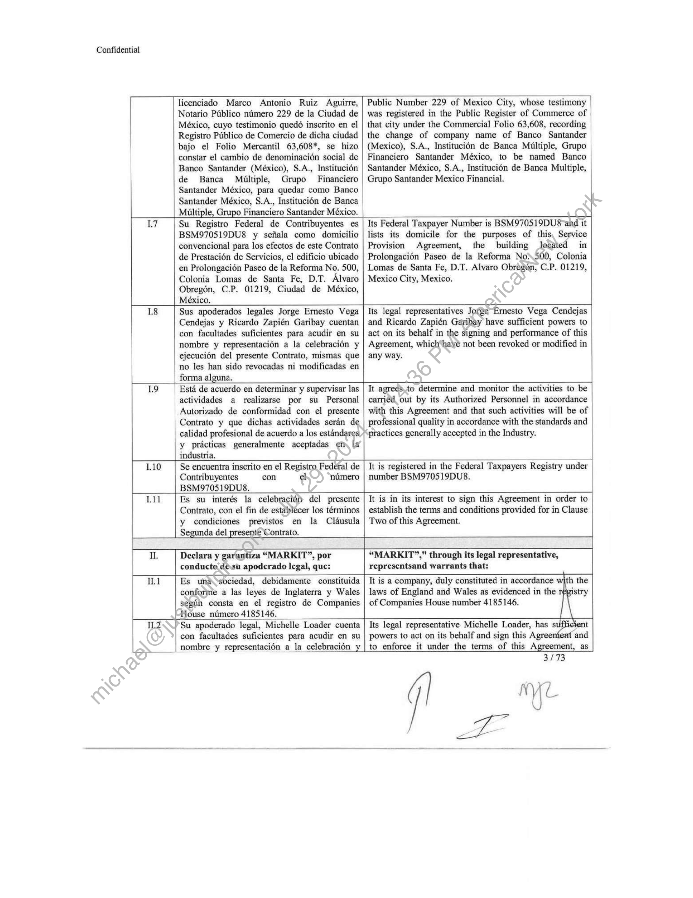
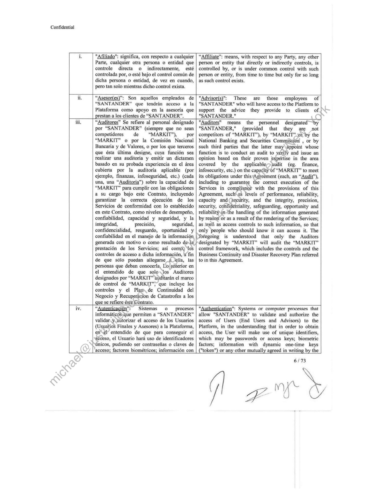
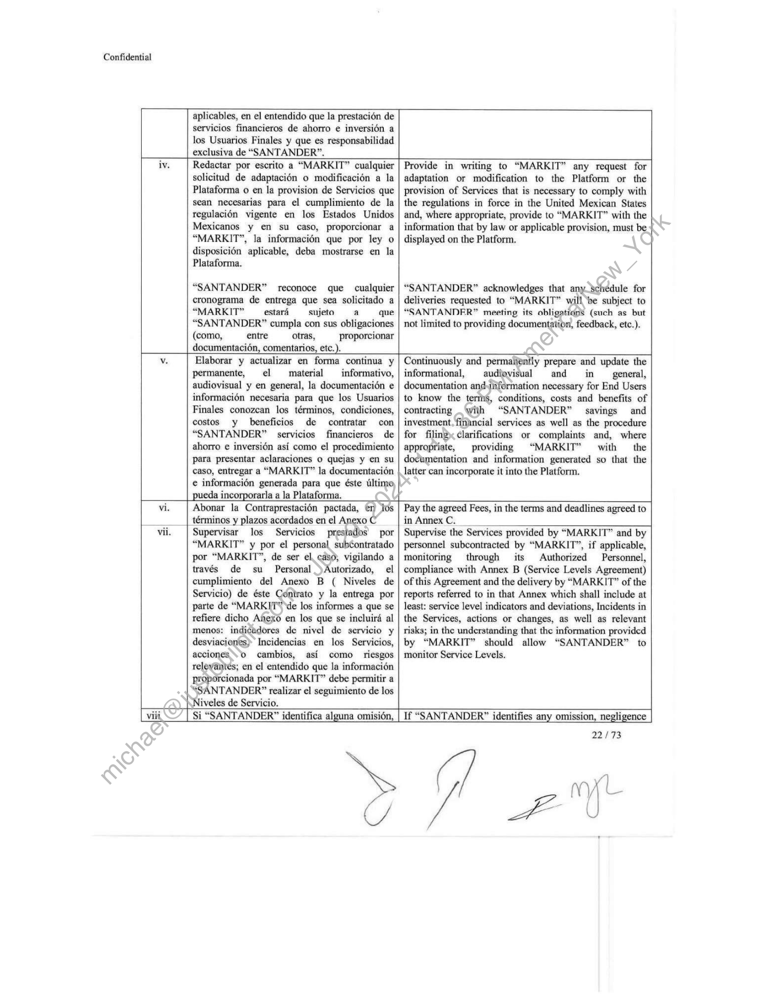
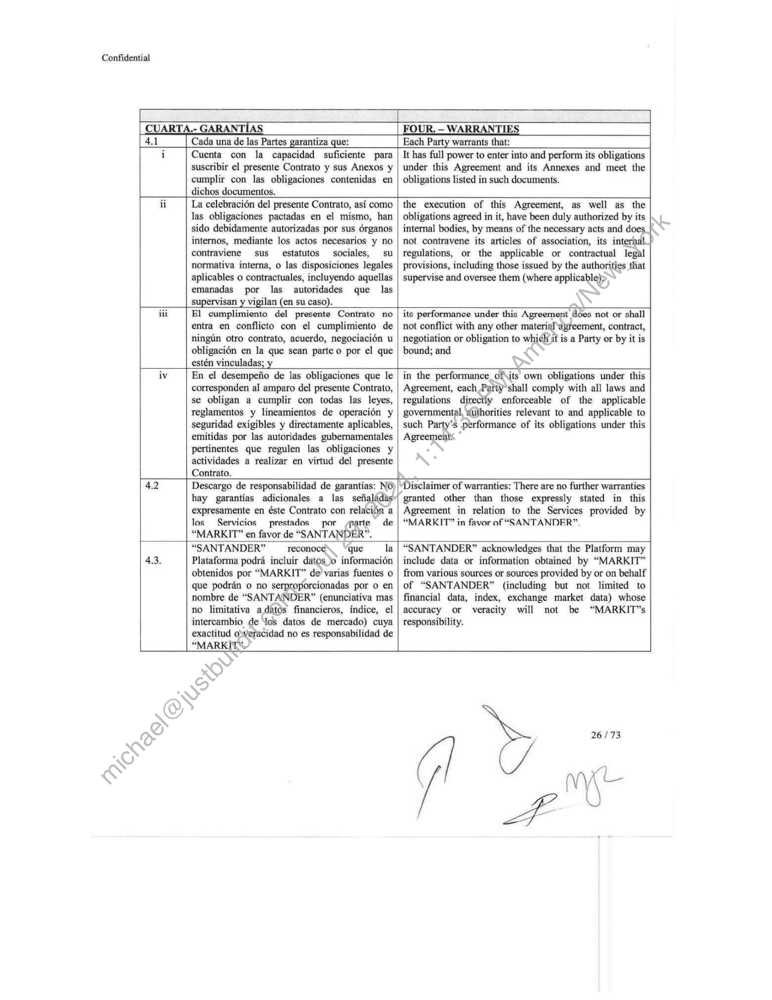
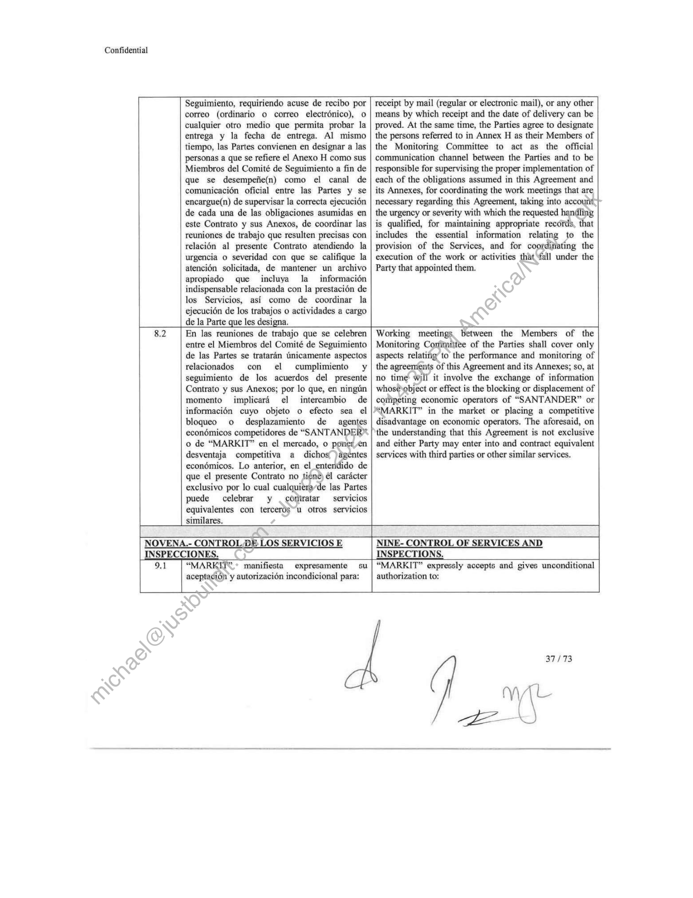
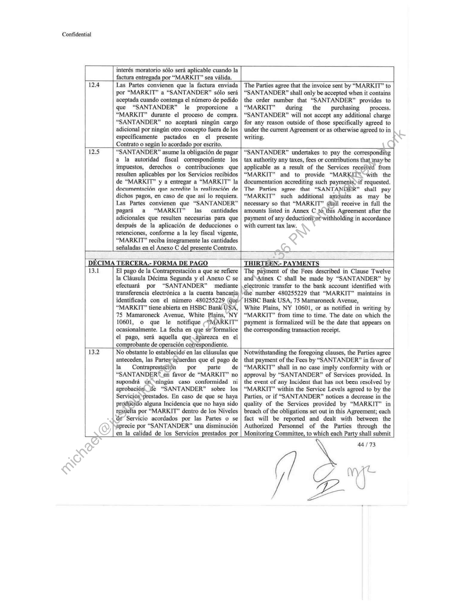

##### No title found]


````col
```col-md
flexGrow=.5
===
> [!info] [Page 1](_attachments/images_Banco-Santander-3.6.1.8.2MSASantander.pdf_190538/page_1.png)
> 
```  
```col-md
Confidential  
SPANISH  
|  
CONTRATO DE PRESTACION DE SERVICIOS DE
FECHA 8 DE OCTUBRE DE 2020 (LA “FECHA
EFECTIVA”) QUE CELEBRAN POR UNA PARTE
MARKIT GROUP LIMITED A QUIEN EN LO
SUCESIVO SE LE DENOMINARA COMO
“MARKIT”, REPRESENTADO EN ESTE ACTO POR
MICHELLE LOADER Y POR LA OTRA PARTE
BANCO SANTANDER MEXICO S.A.,
INSTITUCION DE BANCA MULTIPLE, GRUPO
FINANCIERO SANTANDER MEXICO, A QUIEN
EN LO SUCESIVO SE LE DENOMINARA COMO
“SANTANDER”, REPRESENTADA EN ESTE ACTO
POR SUS APODERADOS JORGE ERNESTO VEGA
CENDEJAS Y RICARDO ZAPIEN GARIBAY DE
CONFORMIDAD CON LAS DECLARACIONES Y  
ENGLISH  
AGREEMENT FOR THE PROVISION OF
SERVICES WITH EFFECTIVE DATE OF OCTOBER
8, 2020 (“THE “EFFECTIVE DATE”) BY THE
PARTY MARKIT GROUP LIMITED. WHO SHALL
HEREINAFTER BE REFERRED TO AS THE
"MARKIT", REPRESENTED IN THIS ACT BY
MICHELLE LOADER AND BY THE OTHER PARTY
BANCO SANTANDER MEXICO S.A.,
INSTITUCION DE BANCA MULTIPLE, GRUPQ
FINANCIERO SANTANDER MEXICO, WHO
SHALL HEREINAFTER BE REFERRED TO\AS
"SANTANDER", REPRESENTED IN THIS ACT BY
ITS LEGAL REPRESENTATIVES JORGE-ERNESTO
VEGA CENDEJAS AND RICARD@) ZAPIEN
GARIBAY IN ACCORDANCE\\\WITH THE
FOLLOWING RECITALS AND CLAUSES:  
CLAUSULAS SIGUIENTES:
DECLARACIONES:
L Declara y garantiza “SANTANDER” por  
conducto de sus apoderados legales, que:  
RECITALS:
"SANTANDER" represerits.and warrants through
its legal representatives; that:  
Il Es una sociedad andénima debidamente
constituida conforme a la legislacién mexicana
y autorizada para operar como institucién de
banca miltiple, segin consta en la escritura
publica ntimero 11,085 de fecha 16 de
noviembre de 1932, otorgada ante la fe del
licenciado Heriberto José Ponce de Leén,
Notario Publico 15 de la Ciudad de México,
cuyo primer testimonio quedé inscrito en el
Registro Puiblico de Comercio de dicha ciudad,
con el nimero ciento treinta y tres ayfojas
cuarenta y seis vuelta, volumen ochenta ly‘tres,
libro tercero,  
It is a public limited ‘company duly constituted in
accordance with Mexican law and authorized to operate
as a multi-banking institution, as stated in public deed
number 11,085ydated November 16, 1932, sworn before
Heriberto José Ponce de Leén, Notary Public 15 of
Mexico Gity, whose first original was registered in the
Publi, Registry of Commerce of that city with the
number one hundred thirty-three on the reverse of page
forty-six, volume eighty-three, third book.  
1.2 Desde la fecha de su constitueién, ha sido
objeto de diversos cambios corperdtivos, entre
los que destacan la fusién de\Banco Santander
Mexicano, S.A., Instituci6n de Banca
Multiple, Grupo Finaneiero Santander Serfin,
como sociedad -filsionante, misma que
subsistié; y Banca Serfin, S.A., Institucion de
Banca Miltiple,Grupo Financiero Santander
Serfin, como*sociedad fusionada y que se
extinguid;) asi como el cambio de
denominacién social de Banco Santander
Meéxieano, S.A.,  Institucién de Banca
Multiple, Grupo Financiero Santander Serfin,
por la de Banco Santander Serfin, S.A.,
Institucién de Banca Multiple, Grupo
Financiero Santander Serfin, la cual consta  
Since its establishment, it has been the subject of several
corporate changes, among which are the merger of
Banco Santander Mexicano, S.A., Institucién de Banca
Multiple, Grupo Financiero Santander Serfin, as a
merger, which continued; and Banca Serfin, S.A.,
Institution of Multiple Banking, Grupo Financiero
Santander Serfin, as a merged company and that became
extinct; as well as the change of company name of
Banco Santander Mexicano, S.A., Institucién de Banca
Multiple, Grupo Financiero Santander Serfin, by Banco
Santander Serfin, S.A., Institucién de Banca Multiple,
Grupo Financiero Santander Serfin, which consists by
public deed 70,725 dated December 13, 2004, sworn
before Miguel Alessio Robles, Notary Public 19 of
Mexico City, whose first original was registered in the
Public Register of Commerce of that city under |the  
1/73  
```
````
Notes:    
````col
```col-md
flexGrow=.5
===
> [!info] [Page 2](_attachments/images_Banco-Santander-3.6.1.8.2MSASantander.pdf_190538/page_2.png)
> 
```  
```col-md
Confidential  
mediante la escritura publica 70,725 de fecha
13 de diciembre de 2004, otorgada ante la fe
del licenciado Miguel Alessio Robles, Notario
Puiblico 19 de la Ciudad de México, cuyo
primer testimonio quedé inscrito en el
Registro Publico de Comercio de dicha ciudad
bajo los folios mercantiles 63,608 y 214,958.  
commercial folios 63,608 and 214,958.  
Por escritura ptiblica 75,211 de fecha 31 de
marzo de 2006, otorgada ante la fe del
licenciado Miguel Alessio Robles, Notario
Publico 19 de la Ciudad de México, cuyo
primer testimonio quedé inscrito en el
Registro Publico de Comercio de dicha ciudad
bajo el folio mercantil 63,608 se hizo constar
el cambio de denominacién social de Banco
Santander Serfin, S.A., Institucién de Banca
Multiple, Grupo Financiero Santander Serfin,
por la de Banco Santander, S.A., Institucién de
Banca Multiple, Grupo Financiero Santander.  
By public deed 75,211 dated 31 March 2006, sworn
before Miguel Alessio Robles, Notary Public 19 of
Mexico City, whose first original was registered in the
Public Register of Commerce of that city under (the
commercial folio 63,608, wherein was recordéd\ the
change of company name of Banco Santander Serfin,
S.A., Institucién de Banca Multiple, Grupo™Financiero
Santander Serfin, to Banco Santander, S»A¢y Institucién
de Banca Multiple, Grupo Financiero Santander.  
14  
Por escritura publica 80,610 de fecha 10 de
abril de 2008, otorgada ante la fe del
licenciado Alfonso Gonzalez Alonso, Notario
Publico 31 de la Ciudad de México, actuando
como suplente en el protocolo de la Notaria 19
de la Ciudad de México, siendo titular el
licenciado Miguel Alessio Robles, se hizo
constar el cambio de denominacién de Banco
Santander, S.A.,  Institucién de Banca
Multiple, Grupo Financiero Santander, por la
de Banco Santander (México), S.A,
Institucién de Banca Miltiple, Grpo
Financiero Santander.  
By public deed 80,610 dated April 10, 2008, sworn
before Alfonso Gonzaléz.Alonso, Notary Public 31 of
Mexico City, acting.as\a replacement in the notarial
book of Notaria.19-of Mexico City, the holder of that
office being Miguel Alessio Robles, in which was
recorded the change of name of Banco Santander, S.A.,
Institucién “dé Banca Multiple, Grupo Financiero
Santander,» to Banco Santander (Mexico), S.A.,
Institucién de Banca Multiple, Grupo Financiero
Santander.  
15  
Por escritura publica 88,542 del 18 de dctubre
de 2012, otorgada ante la fe del licericiado
Miguel Alessio Robles, Notario-Publito 19 de
la Ciudad de México, inscrita en/el Registro
Publico de Comercio de dich’ ciudad bajo el
folio mercantil 63,608, 8e~hizo constar la
protocolizacién del yacta de asamblea
extraordinaria porlaque se hizo constar el  
cambio de denominacién del Grupo
Financiero dé Banco Santander, S.A,,
Institucién® de Banca Miltiple, Grupo  
Financiefo)Santander, para quedar como
actualthente se encuentra vigente Banco
Santander (México), S.A., Institucion de
Banca Multiple, Grupo Financiero Santander
México.  
By public deed 88,542 of October 18, 2012, sworn
before Miguel Alessio Robles, Notary Public 19 of
Mexico City, registered in the Public Register of
Commerce of that city under the commercial folio
63,608, in which was recorded the protocolization of the
act of extraordinary assembly which stated the change of
name of the Financial Group of Banco Santander, S.A.,
Institution of Multiple Banking, Grupo Financiero
Santander, to remain currently in force Banco Santander
(Mexico), S.A., Institution of Multiple Banking, Grupo
Financiero Santander Mexico,  
I6  
Por escritura publica namero 87,947 de fecha
5 de septiembre de 2018 otorgada ante fe del  
By public deed number 87,947 dated September 5, 2018
sworn before Marco Antonio Ruiz Aguirre, Notary  
2 FS  
ZA  
```
````
Notes:    
````col
```col-md
flexGrow=.5
===
> [!info] [Page 3](_attachments/images_Banco-Santander-3.6.1.8.2MSASantander.pdf_190538/page_3.png)
> 
```  
```col-md
Confidential  
licenciado Marco Antonio Ruiz Aguirre,
Notario Publico nimero 229 de la Ciudad de
México, cuyo testimonio qued6 inscrito en el
Registro Publico de Comercio de dicha ciudad
bajo el Folio Mercantil 63,608*, se hizo
constar el cambio de denominacién social de
Banco Santander (México), S.A., Institucién
de Banca Miltiple, Grupo  Financiero
Santander México, para quedar como Banco
Santander México, S.A., Institucién de Banca
Multiple, Grupo Financiero Santander México.  
Public Number 229 of Mexico City, whose testimony
was registered in the Public Register of Commerce of
that city under the Commercial Folio 63,608, recording
the change of company name of Banco Santander
(Mexico), S.A., Institucién de Banca Multiple, Grupo
Financiero Santander México, to be named Banco
Santander México, S.A., Institucion de Banca Multiple,
Grupo Santander Mexico Financial.  
LT  
Su Registro Federal de Contribuyentes es
BSM970519DU8 y sefiala como domicilio
convencional para los efectos de este Contrato
de Prestacién de Servicios, el edificio ubicado
en Prolongacién Paseo de la Reforma No. 500,
Colonia Lomas de Santa Fe, D.T. Alvaro
Obregon, C.P. 01219, Ciudad de México,
México.  
Its Federal Taxpayer Number is BSM970519DU8~and it
lists its domicile for the purposes of this, Service
Provision Agreement, the building located in
Prolongacién Paseo de la Reforma No\500, Colonia
Lomas de Santa Fe, D.T. Alvaro Obregan, C.P. 01219,
Mexico City, Mexico.  
Sus apoderados legales Jorge Ernesto Vega
Cendejas y Ricardo Zapién Garibay cuentan
con facultades suficientes para acudir en su
nombre y representacién a la celebracién y
ejecucién del presente Contrato, mismas que
no les han sido revocadas ni modificadas en
forma alguna.  
Its legal representatives Jofge~Emesto Vega Cendejas
and Ricardo Zapién Garibay have sufficient powers to
act on its behalf in the signing and performance of this
Agreement, which*haye not been revoked or modified in
any way.  
19  
Esta de acuerdo en determinar y supervisar las
actividades a realizarse por su Personal
Autorizado de conformidad con el presente
Contrato y que dichas actividades serén de
calidad profesional de acuerdo a los estandares,
y practicas generalmente aceptadas em la
industria.  
It agrees,to determine and monitor the activities to be
carried out by its Authorized Personnel in accordance
with this Agreement and that such activities will be of
professional quality in accordance with the standards and
practices generally accepted in the Industry.  
1.10  
Se encuentra inscrito en el Registro Federal de
Contribuyentes con ¢l- numero
BSM970519DU8.  
It is registered in the Federal Taxpayers Registry under
number BSM970519DU8.  
1.11  
Es su interés la celebraciéi del presente
Contrato, con el fin de establecer los términos
y condiciones previstos en la Clausula  
Segunda del presente Contrato.  
It is in its interest to sign this Agreement in order to
establish the terms and conditions provided for in Clause
Two of this Agreement.  
Il.  
Declara y garantiza “MARKIT”, por
conducte desu apoderado Icgal, que:  
“MARKIT”," through its legal representative,
representsand warrants that:  
IL.  
Es una sociedad, debidamente constituida
conforme a las leyes de Inglaterra y Wales
segtih consta en el registro de Companies
House_ntimero 4185146.  
ith the
istry  
It is a company, duly constituted in accordance
laws of England and Wales as evidenced in the r
of Companies House number 4185146.  
IL2  
Su apoderado legal, Michelle Loader cuenta
con facultades suficientes para acudir en su
nombre _y representacién a la celebracién_ y  
Its legal representative Michelle Loader, has suf t
powers to act on its behalf and sign this Agree: and
to enforce it under the terms of this Agreement, as  
3/73  
```
````
Notes:    
````col
```col-md
flexGrow=.5
===
> [!info] [Page 4](_attachments/images_Banco-Santander-3.6.1.8.2MSASantander.pdf_190538/page_4.png)
> 
```  
```col-md
Confidential  
ejecucién del presente Contrato y obligarla en
los términos del mismo, segiin consta en el
poder de representacién, mismas que no le
han sido revocadas, ni modificadas, ni
limitadas o disminuidas en forma alguna.  
evidenced in Power of Attorney, which have not been
tevoked, modified, or limited or diminished in any way.  
IL3  
Su apoderado legal, cuenta con plena
capacidad legal para celebrar el presente
Contrato y vincular a “MARKIT” a asumir
cada una de las obligaciones contempladas en
el mismo,  
The representative has full legal capacity to enter into
this Agreement and bind “MARKIT” to assume each of
the obligations set out therein.  
11.4  
Su objeto social vigente permite y autoriza la
celebracién del presente Contrato y el
cumplimiento de cada una de las actividades
derivadas total o parcialmente del mismo, por
lo que la suscripcién del presente documento
constituye un compromiso corporativo valido
en todas sus partes.  
Its current business purpose permits and authorizes
entering into this Agreement and the performance of
each of the activities derived in whole or in part from it,
so the signing of this document constitutes a valid
corporate commitment in all of its parts,  
IL.5  
La celebracién del presente Contrato, asi como
las obligaciones pactadas en el mismo, han
sido debidamente autorizadas por sus 6rganos
internos, mediante los actos necesarios y no
contraviene sus estatutos sociales, su
normativa interna, o las disposiciones legales
aplicables o contractuales, incluyendo aquellas
emanadas por las autoridades que las
supervisan y vigilan (en su caso).  
The execution of this Agreement, as well as the
obligations agreed herein, hay been duly authorized by
means of their internal bodiesthrough the necessary acts
and they do not contravene its bylaws, its internal
regulations, or thé, applicable legal or contractual
provisions includijig-those issued by the authorities that
supervise and monitor them (if any).  
IL.6  
11.7  
La Plataforma fue (i) desarrollada por
empleados, consultores, contratistas
independientes actuales o anteriores de
“MARKIT” bajo contratos conforme a los
cuales dichos empleados,  consultores,
contratistas independientes no se reservarori
derecho de autor y/o patrimonial alguaa, (ii)
desarrollada por contratistas independientes
que han cedido sus derechos~en) favor de
“MARKIT” conforme a contratos escritos, 0
ii) fue adquirida por “MARKIT” de un
tercero.  
The Platform was (i) developed by current or former
employees, consultants, independent contractors of
“MARKIT” under contracts under which such
employees, consultants, or independent contractors did
not reserve any copyright and/or property rights, or (ii)
developed by independent contractors who have
assigned their rights to “MARKIT” under written
contracts, or (iii) was acquired by “MARKIT” from a
third party.  
Se encuentra en pleno conocimiento de la Ley
Federal de Protecciéh. de Datos Personales en
Posesi6n de Particulares y los tratados
internacionales que México tenga celebrado y
estén vigefites en México con relacién a la
materia.  
It is fully aware of the Federal Law on the Protection of
Personal Data in Possession of Individuals and the
international treaties to which Mexico is a party and are
in force in Mexico in this subject matter.  
IL8  
Cuenta\con la experiencia, capacidad, los
recursos financieros, técnicos, materiales y
huthanos necesarios, bastantes y requeridos
para poder desempefiar y ejecutar cada una de
las obligaciones que asume en el presente
Contrato.  
It has the necessary experience, capacity, financial,
technical, material and human resources, sufficient and
required to be able to perform and execute each of the
obligations assumed under this Agreement.  
4/73  
```
````
Notes:    
````col
```col-md
flexGrow=.5
===
> [!info] [Page 5](_attachments/images_Banco-Santander-3.6.1.8.2MSASantander.pdf_190538/page_5.png)
> 
```  
```col-md
Confidential  
IL9 Desde la Fecha Efectiva, presta servicios a
diversas empresas, raz6n por la cual, percibe
ingresos de diversas fuentes, sin tener relacién
de dependencia econémica con  
“SANTANDER”.  
As at the Effective Date, it provides services to various
companies, which is why it receives income from
various sources, without having a relationship of
economic dependence on "SANTANDER."  
11.10 | Es su voluntad y su interés celebrar el presente
Contrato y prestar los servicios definidos en la
Clausula Primera y sefialados en la Clausula
Segunda de éste Contrato, y para tal propésito,
cuenta con la_ infraestructura, recursos
econémicos, personal, asi como medios
técnicos, organizacién administrativa y
experiencia necesaria y suficiente para dar
cumplimiento a este Contrato.  
It desires and finds it in its interest to enter into this
Agreement and provide the services defined in Clause
ONE and referred to in the Clause Two of this
Agreement and that for this purpose, it has the
infrastructure, economic, personal resources, as well ae
technical means, administrative organization (and
necessary and sufficient experience to perform under this
Agreement.  
IL.11 | Se encuentra al corriente y cumple con todas
sus obligaciones patronales y cualesquiera
obligaciones aplicables de conformidad con la
legislacién aplicable como resultado de las  
relaciones de trabajo con sus empleados.  
It is up to date and complies with all\ofits employer
obligations and any applicable obligations in accordance
with the applicable legislation as’ aresult of working
relationships with its employees.  
=|  
IL12 Los empleados a su servicio que desarrollaran
las actividades objeto del Contrato prestan sus
servicios personales y subordinados y reciben  
instrucciones exclusivamente de “MARKIT”.  
Employees at its service who'will carry out the activities
subject to the Agreément provide their personal and
subordinate services and receive instructions exclusively
from “MARKITS"  
11.14 | Cuenta con las autorizaciones, permisos y
licencias aplicables y necesarias para dar
cumplimiento a los compromisos que derivan
de la firma de este Contrato y con los recursos
necesarios para dar cumplimiento a las
disposiciones legales que le son aplicables
incluyendo aquellas emanadas por las
autoridades que las supervisan y vigilan (en stb
caso).  
It has the appli¢able authorizations, permits and licenses
necessary fo-¢omply with the commitments arising from
this Agreement and with the necessary resources to
comply, with the legal provisions that apply to it
including those issued by the authorities that supervise
and monitor them (if any).  
115 | Se encuentra inscrito en el registro de  
contribuyentes con el nimero GB974997828.  
It is registered in the taxpayers' registry under the
number GB974997828.  
11.16 | Es su interés la celebracién™del’ presente
Contrato, con el fin de establecef los términos
y condiciones previstos\en el presente  
Contrato.  
It is in the interest of “MARKIT” to enter into this
Agreement to establish the terms and conditions set forth
in this Agreement.  
Por todo ello, “MARKIT’ sy “SANTANDER”, en
adelante cada una la “Parté%y en su conjunto “las Partes”,
que poseen capacidad juridica para contratar, acuerdan
suscribir cl presente Contrato de prestacién de servicios
que se regira por.Jas)siguientes:  
Therefore, “MARKIT” and "SANTANDER," hereinafter  
each a “Party” and collectively "the Parties" which have  
the legal capacity to contract, agree to enter into this  
provision of services Agreement which shall be
governed by the following:  
CLAUSULAS  
PRIMERA.-\DEFINICIONES E
INTERPRETACION.  
CLAUSES
ONE.- DEFINITIONS AND INTERPRE  
10  
hQ Los términos que se definen a continuacién
tendran los siguientes significados para efectos
del  
esente Contrato:  
The terms defined below shall have the following
meanings for the purposes of this Agreement:  
___  
$/73  
(VY)  
ar  
```
````
Notes:    
````col
```col-md
flexGrow=.5
===
> [!info] [Page 6](_attachments/images_Banco-Santander-3.6.1.8.2MSASantander.pdf_190538/page_6.png)
> 
```  
```col-md
Confidential  
"Afiliado": significa, con respecto a cualquier
Parte, cualquier otra persona o entidad que
controle directa o indirectamente, esté
controlada por, o esté bajo el control comin de
dicha persona o entidad, de vez en cuando,
pero tan solo mientras dicho control exista.  
“Affiliate”: means, with respect to any Party, any other
person or entity that directly or indirectly controls, is
controlled by, or is under common control with such
person or entity, from time to time but only for so long
as such control exists.  
“Asesor(es)”: Son aquellos empleados de
“SANTANDER” que tendran acceso a la  
"Advisor(s)":| These are those employees of
"SANTANDER" who will have access to the Platform to  
Plataforma como apoyo en la asesoria que | support the advice they provide to clients of
prestan a los clientes de “SANTANDER”. "SANTANDER."  
iii. “Auditores” Se refiere al personal designado | "Auditors". means the personnel designated ~ by
por “SANTANDER” (siempre que no sean| "SANTANDER," (provided that they are not  
competidores de “MARKIT”), —_ por
“MARKIT” 0 por la Comisién Nacional
Bancaria y de Valores, o por los que terceros
que ésta Ultima designe, cuya funcién sea
realizar una auditoria y emitir un dictamen
basado en su probada experiencia en el area
cubierta por la auditoria aplicable (por
ejemplo, finanzas, infoseguridad, etc.) (cada
una, una “Auditoria”) sobre la capacidad de
“MARKIT” para cumplir con las obligaciones
a su cargo bajo este Contrato, incluyendo
garantizar la correcta ejecucién de los
Servicios de conformidad con lo establecido
en este Contrato, como niveles de desempefio,
confiabilidad, capacidad y seguridad, y la
integridad, precision, seguridad,
confidencialidad, resguardo, oportunidad y
confiabilidad en el manejo de la informacién,
generada con motivo o como resultado de-la
prestacién de los Servicios; asi com6) ‘los
controles de acceso a dicha informacién, @ fin
de que sdlo puedan allegarse a ella, las
personas que deban conocerla, Lo) anterior en
el entendido de que solo.jos Auditores
designados por “MARKIT” auditaran el marco
de control de “MARKIT”> que incluye los
controles y el Plam de Continuidad del
Negocio y Recuperacion de Catastrofes a los
| que se refiere éste Contrato.  
competitors of “MARKIT”), by “MARKIT*-or by the
National Banking and Securities Commissién , or by
such third parties that the latter may\appoint whose
function is to conduct an audit to verify and issue an
opinion based on their proven expertise in the area
covered by the applicable->audit (eg. finance,
infosecurity, etc.) on the capacity’of “MARKIT” to meet
its obligations under this (Agreement (each, an “Audit”),
including to guarantee the correct execution of the
Services in complian¢e with the provisions of this
Agreement, such\as levels of performance, reliability,
capacity and(security, and the integrity, precision,
security, confidentiality, safeguarding, opportunity and
reliability\in-the handling of the information generated
by reason or as a result of the rendering of the Services;
as well as access controls to such information, so that
only people who should know it can access it. The
foregoing is understood that only the Auditors
designated by “MARKIT®” will audit the “MARKIT”
control framework, which includes the controls and the
Business Continuity and Disaster Recovery Plan referred
to in this Agreement.  
“Autenticagidn”: Sistemas 0  procesos
informaticos,que permiten a “SANTANDER”
validar.yautorizar el acceso de los Usuarios
(Usuatios Finales y Asesores) a la Plataforma,
en \el entendido de que para conseguir el
acceso, el Usuario haré uso de identificadores
‘unicos, pudiendo ser contrasefias o claves de
acceso; factores biométricos; informacién con  
"Authentication": Systems or computer processes that
allow "SANTANDER" to validate and authorize the
access of Users (End Users and Advisors) to the
Platform, in the understanding that in order to obtain
access, the User will make use of unique identifiers,
which may be passwords or access keys; biometric
factors; information with dynamic one-time keys
("token") or any other mutually agreed in writing by the  
6/73  
PALS %  
```
````
Notes:    
````col
```col-md
flexGrow=.5
===
> [!info] [Page 7](_attachments/images_Banco-Santander-3.6.1.8.2MSASantander.pdf_190538/page_7.png)
> 
```  
```col-md
Confidential  
claves dinamicas de un sdlo uso (“token”) 0
cualquier otro que haya sido mutuament
acordado por escrito por las Partes e
incorporado al Contrato como una enmienda o  
| un Anexo.  
Parties and incorporated to this Agreement as an
amendment or an Annex.  
“Aviso _de_ Privacidad”: Documento fisico,
electrénico o en cualquier otro formato
generado por cada una de las Partes en lo
individual, en términos de la Ley Federal de
Proteccién de Datos Personales en Posesién de
los Particulares y su Reglamento, el cual es
puesto a disposicién del Titular de los Datos
Personales previamente a que se realice el
tratamiento de sus Datos Personales.  
“Privacy Notice": Physical, electronic or otherwise
document generated by each Party separately, in terms of
the Federal Law on the Protection of Personal Data in
Possession of Individuals and its Regulations, which is
made available to the owner of the Personal Data prion to
the processing of his/her Personal Data.  
“Banca Electrénica”:; El canal a través del cual
“SANTANDER” presta a los Usuarios Finales
servicios financieros a través de medios
electrénicos.  
"Electronic Banking": The channel Nirough which
"SANTANDER" provides End Users ‘financial services
through electronic means.  
vii.  
“Base(s) de Datos”: El conjunto ordenado de
Informacion Confidencial de SANTANDER,
ya sea que contenga o no Datos Personales,
que se traten o generen con motivo de la
prestacién de los Servicios por parte de
“MARKIT” al amparo de este Contrato  
"Data Base(s)": The ordergd@,'set of SANTANDER’S
Confidential Information( whether or not it contains
Personal Data that is processed or generated in
connection with he ‘provision of the Services by
“MARKIT” undémthis Agreement.  
viii.  
“Business as Usual” 0 “BAU” Se refiere a la
respuesta de un evento que afecte a un tinico
Centro de Datos o una instancia de tecnologia.  
"Business asUsual" or "BAU" refers to the response of
an event that affects a single Data Center or technology
instande.  
“Caso Fortuito_o Fuerza Mayor”: Es aquel
hecho de la naturaleza o del hombre de
caracter imprevisible y general que impide.a
cualquier persona, en forma total o parcial, la
ejecucién de una o varias de las obligavieries
objeto de este Contrato.  
"Eortuitous Case or Force Majeure": It is that fact of
hature or man of an unpredictable and general nature that
prevents any person, in whole or in part, from the
performance of one or more of the obligations under this
Agreement.  
“Confidencialidad”: Se refiere ala propiedad
de la Informacion Confidencialque evita su
revelaci6n no autorizada, dev acuerdo la
Clausula 15 (Confidencialidad)  
"Confidentiality": Means the ownership of Confidential
Information that prevents its unauthorized disclosure as
set out in Clause 15 (Confidentiality)  
xi,  
“Contraprestacién” se refiere al importe de los
Servicios facturados “a “SANTANDER” por
“MARKIT”.”  
"Fees” means the amount for the Services invoiced to
"SANTANDER" by “MARKIT”."  
xii.  
xiii.  
“Contrato”: s¢\refiere a este Contrato de
prestacién de_Servicios asi como los Anexos
aplicables\“incorporados al mismo y
relacignaulos en la Clausula Segunda.
“Contacto Técnico” Se refiere a las persona(s)
designadas por “SANTANDER” con las que
“MARKIT” se pondra en contacto en los
supuestos sefalados por las Partes en el Anexo
de Niveles de Servicio (Anexo B).  
“Agreement”: means this Agreement for the provision of
Services as well as the applicable Annexes incorporated
herein and listed in Clause Two.  
"Technical Contact" refers to the person(s) designated by
"SANTANDER" with whom “MARKIT” will contact in
the cases indicated by the Parties in the Service Levels
Annex (Annex B).  
xiv.  
“Dato(s) Personal(es)”: Significa_cualquier  
"Personal Data": Means any information concerning an  
7/173  
```
````
Notes:    
````col
```col-md
flexGrow=.5
===
> [!info] [Page 8](_attachments/images_Banco-Santander-3.6.1.8.2MSASantander.pdf_190538/page_8.png)
> 
```  
```col-md
Confidential  
informacién concerniente a una persona fisica
identificada o identificable. Los Datos
Personales pueden ser datos respecto a los
cuales (i) “SANTANDER” es responsable del
tratamiento y por lo tanto “MARKIT” actuara
como el Encargado segin dispone la Ley
Federal de Proteccién de Datos Personales en
Posesién de los Particulares y su Reglamento
© bien (ii) aquellos en respecto de los cuales
“SANTANDER” es el Encargado del
tratamiento, por prestar servicios a terceros
con los que tenga suscrito un contrato y en el
que dicho tercero autoriza a “SANTANDER”
a subcontratar los servicios recogidos en el
presente Contrato con “MARKIT”, en cuyo
caso, éste ultimo actuaria como subencargado
del tratamiento.  
identified or identifiable natural person. Personal Data
may be data for which (i) "SANTANDER" is
responsible for the processing and therefore “MARKIT”
will act as the Processor under the Federal Law on the
Protection of Personal Data in Possession of individuals
and their Regulations or (ii) those in respect of which
"SANTANDER" is the Processor, for providing services
to third parties with whom it has a contract and in which
such third party authorizes "SANTANDER" to outsource
the services listed in this Agreement with “MARKIT”,"
in which case, the latter would act as a sub-processor.  
Xv.  
“Dia(s) Habil(es)”: Se refiere a todos los dias
habiles excepto sébados y domingos, en los
que estén obligadas a abrir las oficinas y
sucursales de las instituciones de crédito, de
conformidad con el calendario que anualmente
publica la Comisién Nacional Bancaria y de
Valores (la “CNBV”) en el Diario Oficial de la
Federacion.  
"Business Day(s)": Means for every working day, except
Saturdays and Sundays, on whieh they are required to
open the offices and branches ‘of credit institutions, in
accordance with the annijal timetable published by the
National Banking ahd Securities Commission (the
“CNBV”) in the Daily-federal Gazette.  
xvi.  
“Dia(s) Habil(es) en_los Estados Unidos de  
América”: Se refiere todos los dias habiles,
excepto los sdbados, domingos y feriados
desde donde se prestan los Servicios en los los
Estados Unidos de América.  
“Business Day(s) in USA”: Means for, every working
day, except Saturday, Sunday and bank holidays in the
United States of America.  
xvii.  
xviii.  
“Disponibilidad”: Se refiere a a
disponibilidad de la Plataforma con respectoval
acceso y /o uso, como se describe en el ‘Ahexo
B (Niveles de Servicio).  
“Entidad(es) del Grupo”: Se refiere a cualquier
entidad que opere dentro .del/Territorio
integrante del Grupo Financiéro Santander
México.  
“Availability": Refers to the the availability of the
Platform in respect of access and/or use as described in
Annex B (the Service Levels Agreement). .  
"Group Entity(ies)”: Means any entity that operates
within the Territory that is part of Grupo Financiero
Santander México.  
xix.  
“Entregables_ de disefio” Se refiere a la
arquitectura creativa\yde navegacién de la
Plataforma, asi como la informacién
relacionada, el diséno del marco de respuesta,
la exploracién de disefio visual y los disefios
visuales‘deséritos en este Contrato.  
"Design deliverables" refers to creative and navigational
architecture of the Platform as well as related
information, response frame design, visual design
exploration and visual designs described in this
Agreement.  
XX.  
“Entregables Técnicos” Se refiere a la
arquitettura técnica y légica de la Plataforma y
diagramas y documentos de disefio, modelo de
integracién, documentos de descripcién de
datos, andlisis de sitios web, y otros datos de
trafico y uso de sitios web en relacién con la  
"Technical deliverables" refers to the technical and
logical architecture of the Platform and design diagrams
and documents, integration model, data description
documents, website analysis, and other traffic data and
website usage in relation to the Platform.  
```
````
Notes:    
````col
```col-md
flexGrow=.5
===
> [!info] [Page 9](_attachments/images_Banco-Santander-3.6.1.8.2MSASantander.pdf_190538/page_9.png)
> 
```  
```col-md
Confidential  
Plataforma.  
xxi.  
“Gestor de Incidencias” Se refiere al personal
de “MARKIT” capacitado para dar una
respuesta ante la existencia de Incidentes.
Dicho personal sera encargado de coordinar la
investigacién de los Incidentes y responsable
de comunicar los detalles técnicos a
“SANTANDER” y/o al personal de
“SANTANDER”.  
"Incident Manager" refers to “MARKIT” staff trained to
respond to the occurrence of Incidents. Such personnel
shall be responsible for coordinating the investigation of
Incidents and shall be responsible for communicating
technical details to "SANTANDER" and/or
"SANTANDER" personnel.  
xxii,  
“Incidencia o Incidente” Se refiere a cualquier
eventualidad o cuestién que impida el
funcionamiento de los Servicios
proporcionados por “MARKIT” durante el
Uso Productivo de la Plataforma como se
definen en en el Anexo B (Niveles de
Servicio).  
"Incidence or Incident" refers to any eventuality or issu.
that prevents the proper operation of the Services
provided by “MARKIT” during the Productive Use of
the Platform as defined in Annex B (Service’ Level
Agreement).  
xxiii.  
“Incidente_de_ ciber-seguridad” Es un evento
informatico que tenga por resultado un acceso
no autorizado o divulgacién de los Datos
Personales o Informacién Confidencial de
SANTANDER en conexién con la provisién
de Servicios, tanto si se derivan de actividades
maliciosas como si no.  
"Cyber-security incident": means(4 computer event
which results in an unauthorized access to or disclosure
of SANTANDER’s Personal!’ Data or Confidential
Information in connection ‘with the provision of the
Services; whether derived from malicious activities or
not.  
Xxiv.  
“Informaci6n Confidencial”: Es, por lo que a
las Partes se refiere, pero no esta limitado a:
descubrimientos, disefios, especificaciones,
dibujos, técnicas, modelos, datos, programas,
documentos, procesos, “know how”,
informacién de _ clientes, | empleados,
proveedores, planes y _ politicas de
comercializacion e informacién técnica vo
financiera facilitada por las Partes enfre,sf o
puesta a disposicién de alguna de las Partes 0
de su personal con motivo de este.Contrato, ya
sea que ésta se encuentre en documento,
registro, medio electrénico, médio impreso,
medio acitstico, audiovisual, informacién
verbal o de cualquier otra indole. Asimismo, el
término Informacién’ Confidencial incluye
toda aquella informacién que de conformidad
con el articulo")42 de la Ley de Instituciones
de Crédito\ deba ser considerada como
informacion® respecto de la cual cxiste la
obligacion de guardar el debido secreto
banvario y/o fiduciario. La Informacién
Confidencial no incluye aquella informacién
que estd expresamente excluida en la Seccién
15 de este Contrato.  
"Confidential Isformation": It is, as far as the Parties are
concerned,but is not limited to: discoveries, designs,
specifications, drawings, techniques, models, data,
programs, documents, processes, "know how," customer
information, employees, suppliers, marketing plans and
policies and technical or financial information provided
by the Parties to each other or made available to any of
the Parties or their personnel in connection with this
Agreement, whether it is contained in document,
records, electronic means, printed media, acoustic,
audiovisual, verbal or other information. In addition, the
term Confidential Information includes any information
that pursuant to Section 142 of the Law on Credit
Institutions must be considered as information for which
there is an obligation to keep due banking and/or
fiduciary secrecy. Confidential Information does not
include information that is expressly excluded in Section
15 of this Agreement.  
XX)  
“TIntegridad”: Se refiere a la propiedad de que
los datos no se han modificado o borrado de  
"Integrity": Refers to the property that data has not been
modified or deleted in an unauthorized or undetected  
LV  
9/73  
ee  
```
````
Notes:    
````col
```col-md
flexGrow=.5
===
> [!info] [Page 10](_attachments/images_Banco-Santander-3.6.1.8.2MSASantander.pdf_190538/page_10.png)
> 
```  
```col-md
Confidential  
un modo no autorizado o no detectado (FIPS
140-2, NIST SP 800-21).  
manner (FIPS 140-2, NIST SP 800-21).  
XXvi.  
“MTLS”: Se refiere al proceso de
autenticacién mutua o de dos vias
(bidireccional), que se realiza al mismo tiempo
entre las Partes.  
"MTLS": Refers to the two-way mutual authentication
process, which is performed at the same time between
the Parties.  
xxvii.  
“Mantenimiento_Preventivo” En equipo
hardware significa limpieza del equipo y sus
componentes, y en su caso, la verificacién de
las condiciones fisicas de operacién, tales
como temperatura ambiente, el stress térmico
de encendido, la contaminacién por polvo,
golpes o vibraciones y la corriente eléctrica,
entre otras; traténdose de software, debera
entenderse como la funcionalidad de los
sistemas, plataformas, canales y/o aplicaciones
asi como las medidas de soporte preventivas,
encaminadas a la atencién de los planes de
renovacién tecnolégica y mitigacién de
riesgos tecnolégicos para que se pueda
considerar efectivo, el mantenimiento ya sea
de hardware o software debe ser de naturaleza
esencialmente preventiva, anticipando y
gestionando los riesgos antes de que se
materialicen mediante la aplicacién de las
siguientes medidas: (i) identificacién de
riesgos, (ii) valoracion cuantitativa/cualitativa
del riesgo, (iii) mitigacién/aceptacién del
riesgo y (iv) monitorizacion.  
“Preventive Maintenance" In hardware equipment means
cleaning of the equipment and its components, and
where appropriate, verification of the physical operating
conditions, such as room temperature, thermal stress of
start-up, contamination by dust, shocks or vibrations and.
the electric power supply, among others; in the case of
software, it should be understood as the functionality of
systems, platforms, channels and / or applications as
well as preventive support measures. dimed at
responding to plans for technological ‘renewal and
mitigation of technological risks In’ order to be
considered effective, maintenance of-either hardware or
software must be essentially preventive in nature,
anticipating and managing risks before they materialize
through the adoption of the-following measures: (i) risk
identification, (ii) \\. quantitative/qualitative _ risk
assessment, (iii) 41Skmitigation/acceptance and (iv)
monitoring.  
xxviii.  
“Mantenimiento_Correctivo” en equipo
hardware es el proceso para la ejecucién de
reparaciones; tratandose de software se refiérée
a la correcci6n, reparacién o reinstalacién total
de un sistema, plataforma, canal y/o
aplicacién, Para que se pueda) ‘considerar
efectivo, el mantenimiento, ya sea dé hardware
0 software debe abarcar un .ahdlisis de todos
los eventos (externos e internds) para asegurar:
(i) el dimensionamiento ¢orrecto del impacto,
(ii) la identificacién. de las causas que la
generan, (iii) définicién y ejecucién de
actividades de\contencién y los planes de
mitigaciémncveSarios.  
"Corrective maintenance" in hardware equipment is the
process for executing repairs; in software it refers to the
correction, repair or total reinstallation of a system,
platform, channel and/or application. In order to be
considered effective. maintenance of either hardware or
software must include an analysis of all events (external
and internal) to ensure: (i) the correct assessment of the
impact, (ii) the identification of the causes that generate
it, (iii) the definition and execution of contingency
activities and the necessary mitigation plans.  
Xxix.  
“Nivel. \de > Servicio” Se refiere a las
metodologias asociadas a la medicién del
retidimiento, resultados y/o presentacion de
iformacién en relacién con los Servicios
prestados por “MARKIT” en favor de
“SANTANDER” como se describe mas
detalladamente en el anexo B (Niveles de  
"Service Level" refers to the methodologies associated
with the measurement of performance, results and/or
presentation of information in relation to the Services
provided by “MARKIT® in favor of "SANTANDER” as
further described in Annex B (Service Level
Agreement).  
10/73  
TL  
```
````
Notes:    
````col
```col-md
flexGrow=.5
===
> [!info] [Page 11](_attachments/images_Banco-Santander-3.6.1.8.2MSASantander.pdf_190538/page_11.png)
> 
```  
```col-md
Confidential  
Servicio).  
“Nivel _de Servicio critico” como se describe
mas detalladamente en el anexo B (Niveles de
Servicio).  
"Critical Service Level" as further described in Annex B
(Service Level Agreement).  
XXxi.  
“Objetivo de Nivel de Servicio” Se refiere al
contenido de un Nivel de Servicio en el que
establece una métrica creando contenidos
especificos y medibles como se describe mas
detalladamente en el Anexo B (Niveles de
Servicio).  
"Service Level Objective" refers to the content of a
Service Level in which it establishes a metric creating
specific and measurable content as further described in
Annex B (Service Level Agreement).  
xxii,  
xxiii.  
Plataforma y/o las Servicios  
“Objetivo del Punto de Recuperacién (RPO)”
Se refiere al tiempo que transcurre entre el
momento de la contingencia y el ultimo punto
de restauracién de los datos, es decir, la
cantidad de datos que se podrian perder en
caso de que se produzca un fallo en la  
"Recovery Point Objective (RPO)" refers to the tiiné that
elapses between the time of the contingency and the last
data restoration point, i.e., the amount of data that could
be lost in the event of a failure of the Platform and/or the
Services.  
“Parte(s)” Se refiere en su conjunto o
individualmente a “SANTANDER” y
“MARKIT”.  
xxiv.  
“Permiso de Uso”: Se refiere a la autorizacién
de uso temporal de la Plataforma que se
integrara a los sistemas de “SANTANDER”
descritos en este Contrato con el propésito de
permitir a “SANTANDER” la prestacién de
servicios financieros a través de medios
electrénicos a los Usuarios Finales y en su
caso, permitir a los Asesores el acceso a
determinada informacién de los clientes de
“SANTANDER”. En todo caso, dicha
autorizaci6n se otorga por “MARKIT*) en
favor de “SANTANDER”, de marieta vno
exclusiva, por el Periodo de Uso‘a que se
refiere este Contrato, condicionado a que
“SANTANDER” cumpla conrids_términos de
este Contrato. Lo anterior:en el entendido de
que el Permiso de Uso.se dara por concluido
con la terminacién de este Contrato, salvo que
las Partes convengan“mutuamente por escrito
iniciar el proceso’ de Transicién de los
Servicios a qué $¢\refiere la ClausulaVigésima.  
"Party(ies)" refers as a whole or individually to
"SANTANDER" and “MAREIT”."  
"Permission to Use">Réfers to the authorization of
temporary use of tiie Platform that will be integrated into
the systems of “SANTANDER" as set out in this
Agreement forthe purpose of allowing "SANTANDER"
to provide financial services through electronic means to
End Users) and where applicable allow Advisors to
access ¢ertain information from "SANTANDER" clients.
In afty case, such authorization is granted by “MARKIT”
to, "SANTANDER," in a non-exclusive manner, for the
Period of Use referred to in this Agreement, conditioned
on "SANTANDER" complying with the terms of this
Agreement. The foregoing shall be understood to mean
that the Permission to Use shall be terminated upon
termination of this Agreement, unless the Parties
mutually agree in writing to initiate the Transition of
Services process referred to in Clause Twenty-.  
XXXV.  
“Periodo de. Uso”: Se refiere al plazo de
vigenciadel Permiso de Uso que se contara a
partii.de)la fecha en que las Partes suscriban
un ‘acta para dar inicio al periodo de Uso
Productivo de la Plataforma y hasta la
terminacién de este Contrato, salvo que las
Partes convengan mutuamente por escrito
iniciar el proceso de Transicién de los
Servicios _a_que se _refiere la Clausula  
"Period of Use": Means the term of the Permission to
Use that will be counted from the date on which the
Parties enter into an act to kick off the period of
Productive Use of the Platform and until the termination
of this Agreement, unless the Parties mutually agree in
writing to initiate the Transition process for the Services
referred to in Twenty-.  
a DY a  
pe  
```
````
Notes:    
````col
```col-md
flexGrow=.5
===
> [!info] [Page 12](_attachments/images_Banco-Santander-3.6.1.8.2MSASantander.pdf_190538/page_12.png)
> 
```  
```col-md
Confidential  
Vigésima.  
XXXVI.  
Xxxxvii  
“Personal Autorizado”: Se refiere a los
empleados, contratistas, subcontratistas y
asesores profesionales (que incluye Auditores)
designados porcada Parte y en su caso por las
entidades Afiliadas quienes conforme a las
autorizaciones otorgadas por “SANTANDER”
o por “MARKIT”, segin sea el caso, podran
tener acceso a Informacién Confidencial segan
queda definido en éste Contrato y que guarda
relacién con los Servicios y por tanto han
recibido instrucciones previas sobre el
tratamiento de la Informacién Confidencial.  
"Authorized Personnel": Means each Party’s and where
applicable its Affiliates’ designated employees,
contractors, subcontractors and professional advisors
(which includes Auditors), who according to the
authorizations granted by “SANTANDER” or by
“MARKIT”, as the case may be, may have access to
Confidential Information as set in this Agreement, in
relation to the Services and therefore they have received
previous instructions on the treatment of Confidential
Information.  
"Plataforma _"; Es el sistema desarrollado por
“MARKIT” que se pone a disposicién de
“SANTANDER” bajo un Permiso de Uso, a
fin de que éste tiltimo preste a los Usuarios
Finales servicios financieros a través de
medios electrénicos, bajo la responsabilidad
unica de SANTANDER.  
"Platform": This is the system developed by “NiARKIT”
that is made available to "SANTANDER" under a
Permission to Use, so that the latter provides End Users
with savings and investment financial (sérvices through
electronic means, under SANTANDER’s _ sole
responsibility.  
Xxxviii  
“Periodo de valoracién” Se refiere al periodo
de medicién de un Nivel de Servicio descritos
en el Anexo B (Niveles de Servicio).  
"Valuation period" refers {othe measurement period of a
Service Level as set\out’in Annex B (Service Level  
Agreement).  
XXxix  
“Propiedad Intelectual”: Se refiere a toda la
propiedad intelectual, = incluidas _ilas
invenciones (sean o no patentables), patentes
de cualquier clase, ideas, procesos, métodos,
conceptos, técnicas, sistemas, modelos de
utilidad, derechos de disefio, modelos de
utilidades u otros derechos de invencién
similares, secretos comerciales, marcas
registradas, nombres de marcas y marca§ We
servicio y cualquier otro derecho de propiedad
tangible o no tangible, nombres de.dominio,
derechos en disefios, derechos\*de ‘autor,
hardware, software y firmware (iricluidos el
cédigo fuente y el cddigo de objeto) derechos
morales, derechos de topografia, derechos en
bases de datos, secretos comerciales y
conocimientos, en todds los casos estén o no
registrados o registrables y incluidos los
tegistros y laé solicitudes de registro de
cualquiera de.*estos y los derechos para
solicitar\¢l mismo, y todos los derechos y
formas‘de’proteccién de naturaleza similar o
que(tergan un efecto equivalente o similar a
eualquiera de estos en cualquier parte del
mundo.  
"Intellectual Property": Means all intellectual property,
including inventions (whether or not patentable), patents
of any kind, ideas, processes, methods, concepts,
techniquesy systems, utility models, design rights, utility
models ‘or other similar invention rights, , trade secrets,
trademarks, trademark names and service marks and any
other tangible or non-tangible property rights, domain
names, rights in designs, copyrights, hardware, software
and firmware (including source code and object code)
moral rights, topography rights, rights in databases, trade
secrets and know-how. in all cases whether or not
registered or registrable and including registrations and
applications for registration of any of these and rights to
apply for the same, and all rights and forms of protection
of a similar nature or having equivalent or similar effect
to any of these anywhere in the world.  
xl  
“Proveedor de Servicios de Nube” Es el titular
de los Centros de Datos que “MARKIT”  
"Cloud Service Provider" is the owner of the Data
Centers that “MARKIT” will use for the provision of  
a  
12/73  
gD  
```
````
Notes:    
````col
```col-md
flexGrow=.5
===
> [!info] [Page 13](_attachments/images_Banco-Santander-3.6.1.8.2MSASantander.pdf_190538/page_13.png)
> 
```  
```col-md
Confidential  
utilizaré para la prestacién de Servicios en
favor de “SANTANDER” ubicados en
Estados Unidos de America, los cuales seran
subcontratados por “MARKIT” a la empresa
denominada NTT Data Services LLC,
habiendo otorgado “SANTANDER” = su
conformidad con dicha subcontratacién y a
cualquier reemplazo __ notificado —s por
“MARKIT” a SANTANDER  
Services in favor of "SANTANDER" located in the
United States of America, which will be subcontracted
by “MARKIT” from the company named NTT Data
Services LLC, having granted "SANTANDER" its
agreement with such subcontracting and any
replacement notified by “MARKIT” to
“SANTANDER”.  
xli  
xlii  
“Servicios”: Los servicios de  cardcter
informatico que “MARKIT” presta a
“SANTANDER” en relacién a la Plataforma
para que éste Ultimo en su cardcter de
institucién de banca miltiple permita a los
Usuarios Finales de su Banca Electronica, la
contratacion y uso de productos financieros de
ahorro ee inversién operados por
“SANTANDER”. Como parte de ésta
descripcién general, se entienden incorporados
los siguientes servicios especificos: (i) la
integracién de la Plataforma con el sistema de
autenticacién de Usuarios Finales de
“SANTANDER” conforme a lo referido en el
Anexo A de este Contrato a fin de que en el
curso de una sola sesién de Banca Electrénica,
el Usuario Final pueda ingresar a la Plataforma
y hacer uso de la misma en los términos a que
se refiere el Anexo A; (ii) alojamiento,
administracion y explotacién de diversas bases
de datos y sistemas informaticos a solicitud_y
bajo instrucciones de “SANTANDER?” (iii) el
aseguramiento de la continuidad @e, los
sistemas que se utilicen para dar soporte a la
Plataforma; y (iv) la generacién de reportes de
cumplimiento normativo si-son) acordados
mutuamente por escrito por las |Partes y (v) La
realizaci6n de Mantenimiéntos Preventivos y
Correctivos a la Plataforma:  
"Services"; The computer services that “MARKIT™
provides to "SANTANDER" in respect of the Platform
so that the latter in its nature as a multi-banking
institution allows End Users of their electronic banking,
to contract and use the financial savings arid\investment
products operated by "SANTANDER" As part of this
general description, the following specific services are
understood to be incorporated: (i). th® integration of the
Platform with the authenticatiomsystem for End Users of
"SANTANDER" as set out(in Annex A so that in the
course of a single session-ofElectronic Banking, the End
User may enter the Platform and make use of it in the
terms referred to irhAnnex A; (ii) hosting, administration
and operation.  
ofwarious data bases and computer
systems upon\fequest and under the instructions of
"SANTANDER" as set out in this Agreement (iii)
ensuring the continuity of the systems used to support
the Platform; (iv) the generation of compliance reports if
mutually agreed in writing by the Parties; and (v)
varrying out Preventive and Corrective Maintenance of
the Platform.  
“Respuesta_ante Ineidentes” Se refiere al
proceso estandar de “MARKIT” para la
gestion de, Incidencias, incluyendo
comunicacidén interna y externa,
documehtacién y resolucién aplicables.  
"Incident Response" refers to the standard “MARKIT”
process for Incident management, including the
applicable internal and external communication,
documentation and resolution.  
xliii  
“Territorio”; Se refiere a los Estados Unidos
Mexivanos.  
"Territory": Refers to the United Mexican States.  
xliv  
“Test _de penetracién”: Es una prueba que se
Yealiza sobre sistemas informaticos, una red, 0
una aplicacién web a fin de identificar
Vulnerabilidades que podria explotar un
atacante. Es un ataque simulado autorizado por  
"Penetration Test": This is a test that is performed on
computer systems, a network, or a web application in
order to identify Vulnerabilities that an attacker could
exploit. It is a simulated attack authorized by the Parties
whose purpose is to gain access to Platform data.  
-  
1/78  
```
````
Notes:    
````col
```col-md
flexGrow=.5
===
> [!info] [Page 14](_attachments/images_Banco-Santander-3.6.1.8.2MSASantander.pdf_190538/page_14.png)
> 
```  
```col-md
Confidential  
las Partes cuyo fin es obtener acceso a los
datos de la Plataforma.  
xlv  
“Tiempo _de Recuperacién Objetivo”: Es el  
"Objective Recovery Time": This is the target period of  
periodo de tiempo objetivo en que un proceso,
actividad o recurso debe estar restablecido
después de una contingencia. En cualquier
caso, no debe superar el periodo de disrupcién
tolerable maximo a que se refiere este
Contrato,  
time in which a process, activity, or resource should be
restored after a contingency. In any case, it should not
exceed the maximum tolerable disruption period referred
to in this Agreement.  
xlvi  
“Uso _Productivo" Significa la activacién de
todo o una parte de las funcionalidades de la
Plataforma disponible en el entorno
productivo de “MARKIT” y que este
mutuamente acordado por ambas Partes para
acceso a Usuarios Finales y/o Asesores.  
"Productive Use": Means the activation of all or part of
the functionalities of the Platform made available\ in.
“MARKIT”’s productive environment that both parties
mutually agree is ready to be accessed by End, Users
and/or Advisors.  
xlvii  
“Usuario(s) Final(es)”: Son todos aquellos
clientes de “SANTANDER”, ya sean personas  
fisicas actuando por su propio derecho o
personas fisicas que actien en nombre de
personas morales, que hagan uso de la
Plataforma a través de la Banca Electrénica de
“SANTANDER”.  
"End User(s)": These are all those "SANTANDER" ‘s
customers whether natural persone (acting its own
capacity or natural person(s) actirig*on behalf of legal
entities who make use of thé7Platform through the
Electronic Banking of “SANTANDER.”  
xviii  
“Versién”: Cada nueva _adaptacidon,
actualizacién, optimizacién o ajuste a la
Plataforma realizado por “MARKIT”,  
necesario o conveniente para mejorar la
calidad de los Servicios, modernizar el cédigo,
o en su caso adaptarlo a las nuevas
circunstancias del mercado o a las nuevas
demandas de las entidades en sistemas o
seguridad 0 en su caso introducir pequefias
ampliaciones funcionales, en el entendidé We
que cada adaptacién a la Plataforma) que
realice “MARKIT” sera identificada por un  
numero cronolégico consecutivo.  
xlix  
“Vulnerabilidad”: Es la fragilidad en la
seguridad de la Plataforma que
razonablemente pueda genérar un daiio o
impacto en la seguridad, integridad o
disponibilidad de la Informacién Confidencial
objeto de este Contrato  
"Version": Each new adaptation, update, optimization or
adjustment to_ thé, Platform made by “MARKIT”,"
necessary or.cOnivenient to improve the quality of the
Services, modérnize the code, or adapt it, as the case
may be,\to° new market circumstances or the new
demands, of entities in systems or security or, where
appropriate, to introduce small functional expansions, in
the understanding that each adaptation to the Platform
that “MARKIT” makes will be identified by a
consecutive chronological number.  
"Vulnerability": This is the fragility in the security of the
Platform that can reasonably cause damage or impact on
the security, integrity or availability of the Confidential
Information that is the subject of this Agreement.  
12  
En este Contrato, salvo que el contexto
indique lo coutedrio.  
In this Agreement, unless  
otherwise.  
the context indicates  
Los encabezados de las Cldusulas y Anexos
son pafa‘referencia unicamente, y no seran
considerados para la interpretacién de este
Contrato, sus cldusulas, secciones y sus
‘Anexos especificamente;  
The headings of the Clauses and Annexes are for
reference only, and shall not be considered for the
interpretation of this Agreement, its clauses, sections and
its Annexes specifically;  
ii  
Todos los Anexos, formaran parte del presente
Contrato;  
All Annexes shall form part of this Agreement;  
14/73  
```
````
Notes:    
````col
```col-md
flexGrow=.5
===
> [!info] [Page 15](_attachments/images_Banco-Santander-3.6.1.8.2MSASantander.pdf_190538/page_15.png)
> 
```  
```col-md
Confidential  
iii  
Cualquier referencia a cualquier contrato,
convenio 0 instrumento incluye la referencia a
dicho contrato, convenio o instrumento segin
el mismo sea modificado ya sea total o
parcialmente o de cualquier otra forma
teformado en cualquier momento, y cualquier
ley o reglamento incluye las reformas a los
mismos en cualquier momento o a cualquier  
ley o reglamento que los sustituya;  
Any reference to any contract, agreement or instrument
includes reference to such contract, agreement or
instrument as amended either in whole or in part or as
otherwise modified in any manner at any time, and
reference to any law or regulations include changes to
them at any time or to any law or regulation that replaces
them;  
Las referencias a cualquier convenio, contrato,
instrumento 0 documento, incluird todos los
Anexos u otros documentos adjuntos a dicho
convenio, contrato, instrumento o documento,
todos los convenios, contratos, instrumentos 0
documentos emitidos o celebrados en
sustitucion de dicho convenio, contrato,
instrumento o documento, y cualesquiera
modificacién, adicién, suplemento o
reexpresion a dicho convenio, contrato,
instrumento 0 documento, segiin sea el caso;  
References to any agreement, contract, instrument yor
document shall include all Annexes or other docurhents
attached to that agreement, contract, instrument or
document, all agreements, contracts, instruments or
documents issued or signed in substitution of such
agreement, contract, instrument or document, and any
modification, addition, supplement_or\re-expression of
such agreement, contract, instrument or document, as the
case may be;  
Las palabras “incluye” o “incluyendo” se
entenderan como “incluyendo, sin limitar”;  
The words "includes" ‘op"including" shall be understood
as "including, without limitation";  
vi  
om  
Las palabras “del presente”, “en el presente” y
“conforme al presente” y palabras o frases de
naturaleza similar, se referiran a este Contrato
y no a alguna disposicién en particular de este
Contrato;  
The words “herein', "hereinafter" and "hereunder" and
words or phrases of a similar nature shall refer to this
Agreementand not to any particular provision of this
Agreement)  
vii  
La forma singular incluye la forma plural y la
forma plural incluye la forma singular, y  
The'singular form includes the plural form and the plural
form includes the singular form, and  
viii  
Cualquier referencia a cualquier ley 0
reglamento, incluye las eventuales reformiasa
los mismos, asf como cualquier (ley/o
reglamento que se expida en sustitucién de
ellos a menos que se indique lo.contrario en
este Contrato.  
Any reference to any law or regulation includes any
possible changes thereto, as well as any laws or
regulations issued in place of them unless otherwise
stated in this Agreement.  
otai|  
SEGUNDA.- OBJETO.Y NATURALEZA,
El objeto del presente Contrato es establecer
los términos y coridiciones por los que
“MARKIT™ prestara’los Servicios en favor de
“SANTANDER”, asi como las reglas para el
otorgamiento_de un Permiso de Uso de la
Plataformaeh favor de “SANTANDER” y sus
respéctivas Versiones, para su Uso en
Produetivo en el Territorio.  
TWO.- PURPOSE AND NATURE,  
The purpose of this Agreement is to establish the terms
and conditions under which “MARKIT” will provide the
Services to "SANTANDER", as well as the rules for
granting a Permission to Use of the Platform in favor of
"SANTANDER" and its respective Versions for
Productive Use in the Territory.  
```
````
Notes:    
````col
```col-md
flexGrow=.5
===
> [!info] [Page 16](_attachments/images_Banco-Santander-3.6.1.8.2MSASantander.pdf_190538/page_16.png)
> 
```  
```col-md
Confidential  
22  
El presente Contrato, junto con los Anexos
que se indican a continuacion regiran la
relacion entre las Partes una vez hayan sido
debidamente firmados por sus apoderados
legales.  
This Agreement together with the Annexes indicated
below shall govern the relationship between the Parties
once they have been duly signed by their legal
representatives  
Anexo A Descripeién de los Annex A | Description of the Services.
| Servicios.
Anexo B | Niveles de Servicio Annex B | Service Level Agreement
Anexo C | Contraprestacién Annex C | Fees
Protocolo de Annee D Social and corporate
Anexo D | responsabilidad social y responsibility protocol
| corporativa | Annex E_ | Information security poliy
Aeeew Politica de seguridad de iN
lainformacion si Annex F | Trademark Use Authorization
Autorizacién de uso de
Anexo F fivirca Annex G_| Protection of Personal Data
Proteccién de Datos Authorized-siaff and members of
SuetoG Personales AERTS, the Moijitoring Committee
Personal Autorizado y “MARKIT’”’s Business
Anexo H | miembros del Comité de Annex! | Continuity and Disaster
Seguimiento Recovery policy
Plan de Continuidad del el SANTANDER’s data
Sneroil Negocio y Recuperacion classification policy
de Catastrofes de
“MARKIT”
Politica de clasificacion
Anexo J | de datos de
“SANTANDER”  
23:  
Cualquier modificacién al contenido de @ste
Contrato o de los Anexos sera establecida por
escrito y por mutuo acuerdo entre las Parties y
se formalizaraé mediante un\~convenio
modificatorio.  
Any modification to the content of this Agreement or the
Annexes shall be established in writing and by mutual
agreement between the Parties and shall be formalized in
an amendment agreement.  
2.4  
Las Partes podraén convenir Ja@ampliacién de
los Servicios objeto del présénte Contrato y
para los cuales no existainguna previsién en
el Anexo A, en,-(éb entendido de que
previamente a la~¢ontratacién de cualquier
nuevo servicio y~en caso de que resulte
aplicable, en atencién a la legislacién vigente,
“SANTANDER” debera obtener autorizacion
previa déla Comisién Nacional Bancaria y de
Valores’en la que se incluya la descripcién de
estos nuevos servicios.  
The Parties may agree to the expansion of the Services
subject to this Agreement and for which there is no
provision in Annex A, in the understanding that prior to
the procurement of any new services and if applicable in
light of current legislation, “SANTANDER” must obtain
prior authorization from the National Banking and
Securities Commission that includes the description of
these new services.  
25  
Cualquier acuerdo entre las Partes con relacién
a los nuevos servicios a que se refiere el
numeral 2.4. anterior se documentara mediante  
Any agreement between the Parties with respect to the
new services referred to in section 2.4. above shall be
documented by the formalization of an amendment to  
>  
16/73  
```
````
Notes:    
````col
```col-md
flexGrow=.5
===
> [!info] [Page 17](_attachments/images_Banco-Santander-3.6.1.8.2MSASantander.pdf_190538/page_17.png)
> 
```  
```col-md
Confidential  
la formalizacién de un convenio modificatorio
al presente Contrato en el cual las Partes
describan en forma detallada aspectos como:
(i) el nuevo alcance de los Servicios, (ii) el
personal que se vera involucrado, (iii)
cronogramas de trabajo entre las Partes, (iv)
productos o servicios financieros de
“SANTANDER” que se verdn involucrados,
en su caso, (v) reportes o informacién a ser
entregada, por “MARKIT” 0 por
“SANTANDER”, de ser aplicable, (vi)
responsabilidades adicionales que no esten
seflaladas en este  Contrato; (vii)
infraestructura técnica a utilizar, de ser
aplicable; y (viii) el monto de la
contraprestacin aplicable.  
this Agreement in which the Parties describe in detail
aspects such as: (i) the new scope of the Services, (ii)
personnel who will be involved, (iii) schedules of work
between the Parties, (iv) SANTANDERs financial
products or services that will be impacted by
“MARKIT”’s services, where appropriate, (v) reports or
information to be delivered, by “MARKIT” or by
“SANTANDER”, as applicable, (vi) additional
responsibilities not stated in this Agreement; (vii)
technical infrastructure to be used, if applicable; and.
(viii) the applicable fees.  
3.1  
Sin perjuicio de las obligaciones especificas
establecidas en el presente Contrato,
“MARKIT” se compromete a:  
THREE.- OBLIGATIONS OF. THE PARTIES.
Without prejudice to the speC?fic obligations set forth in
this Agreement, “MARKIf“undertakes to:  
Poner a disposicién de “SANTANDER” los
recursos técnicos, humanos y de organizacién
pertinentes, debiendo contar con los equipos
tecnologicos necesarios y cuantos
profesionales cualificados sean precisos en
cada momento para cumplir satisfactoriamente
el objeto del presente Contrato debiendo cubrir
las bajas tan pronto como se produzcan.
Dichos profesionales formaran parte de sla
plantilla de “MARKIT” y actuaran en¢todo
momento bajo la coordinacién, direécién’ y
supervision de una persona reésporisable
perteneciente a la  organizacion de
“MARKIT”,  
iii’  
La capacitacién del personal que empleara
para la ejecucién y cumplimento del presente
Contrato y/o de los Anexos relacionados con
el mismo. Asimismoy se obliga a facilitar a
“SANTANDER? los informes que este
razonablementé \le solicite sobre evaluacién
del personal, funcionamiento y gestién de los
Servicios, \dsi como aquellos que pueda
igualmente demandar “SANTANDER” con
cardeter extraordinario y/o puntual. Dichos
informes contendran el contenido y estaran en
el formato determinado entre las Partes.  
Make available “to “SANTANDER” the relevant
technical, human ‘and organizational resources, and must
have the necessary technological equipment and as many
qualified professionals as needed at all times to meet the
obligations) under this Agreement and must cover the
vacancies as soon as they occur. The foregoing
professionals will be part of the “MARKIT” staff and
‘will act at all times under the coordination, management
and supervision of a person in charge appertaining to the
organization of “MARKIT”.  
To train the personnel to be used for the performance of
this Agreement and/or the related Annexes. It also
undertakes to provide “SANTANDER” with reports
reasonably requested by it on the evaluation of the
personnel, operation and management of the Services, as
well as those that may also be required by
“SANTANDER?” of an extraordinary and/or occasional
character. The foregoing reports will contain the content
and be in the format determined between the Parties.  
Responder de todas las obligaciones fiscales,
laborales, de prevencién de riesgos laborales y
de seguridad social de su personal y cumplir  
Be responsible for all tax, labor, occupational risk
prevention and social security obligations for its
[| personnel and comply with related authorizations that  
17/73  
```
````
Notes:    
````col
```col-md
flexGrow=.5
===
> [!info] [Page 18](_attachments/images_Banco-Santander-3.6.1.8.2MSASantander.pdf_190538/page_18.png)
> 
```  
```col-md
Confidential  
con cualquier autorizacién que sea requerida
por ley en la provision de Servicios a  
“SANTANDER”. En ningtin caso podra
exigirse responsabilidad alguna a
“SANTANDER” por estos conceptos. La  
organizacién, direccién, control, seleccién,
sustitucién, | aseguramiento, __retribucién,
disciplina y cuantas facultades y obligaciones
atribuya la legislaci6n a un empresario
respecto de sus trabajadores corresponderdn a
“MARKIT™ para con su personal, quedando
“SANTANDER” completamente al margen de
tales relaciones, sin perjuicio de la facultad de
supervision de éste para supervisar la calidad
de los Servicios prestados.  
are required by law for the provision of the Services to
“SANTANDER”. Under no circumstances will
“SANTANDER” be held liable for the foregoing
concepts. The organization, management, control,
selection, substitution, insurance, _ remuneration,
discipline and how many powers and obligations the
legislation confers on an employer with respect to its
workers will correspond to “MARKIT” in respect of its
personnel, leaving “SANTANDER” completely outside
of such relationships, without prejudice to the latter's
supervisory power to monitor the quality of the Services
provided.  
iv.  
Prestar los Servicios con la diligencia y
calidad profesional de conformidad con las
normas y practicas generalmente aceptadas de
la industria.  
Provide the Services with the diligence and professional
quality conforming to generally -a¢éepted industry
standards and practices.  
Comunicar a “SANTANDER” con por lo
menos con 30 (treinta) dias naturales de
anticipacién, cualquier reforma a su objeto
social o cualquier cambio que se pudiera
producir en la composicién de su tenencia
accionaria directa u érganos de gobierno, que
pudiera afectar de modo significativo el
cumplimiento de las obligaciones asumidas y
descritas en este Contrato (por parte de
“MARKIT” © un tercero que haya adquirido
parte de la tenencia accionaria).  
Notify “SANTANDER?” at least'30 (thirty) calendar days
in advance, of any changes»to'its business purpose or any
changes that may occiir in the composition of its direct
shareholding or governing bodies, which could
significantly affeet the fulfilment of the obligations
undertaken and“as set out in this Agreement (by either
“MARKIT® op the new third party that has acquired the
shareholding).  
18/73  
```
````
Notes:    
````col
```col-md
flexGrow=.5
===
> [!info] [Page 19](_attachments/images_Banco-Santander-3.6.1.8.2MSASantander.pdf_190538/page_19.png)
> 
```  
```col-md
Confidential  
Asegurar que, en la parte que le corresponda de
la operacién, la infraestructura técnica y
operativa utilizada para la prestacién de los
Servicios cumple con lo establecido en este
Contrato, sus Anexos, asi como con los
lineamientos minimos de operacién y
seguridad que se sefialan en el Anexo 52 de las
Disposiciones de Caracter General aplicables a
las Instituciones de Crédito.  
Al cumplimiento de éste fin, las Partes
convienen que para la ejecucién de cambios 0
la actualizacién a la infraestructura técnica u
operativa empleada por “MARKIT” para la
correcta ejecucion de los Servicios en
cumplimiento de las disposiciones legales
aplicables incluyendo en su caso lineamientos
sefialado en el Anexo 52 de las Disposiciones
de Cardcter General plicable a las
Instituciones de Credito, “SANTANDER”
debera solicitar a “MARKIT” dichos cambios
© actualizaciones por escrito. Asimismo, las
Partes acuerdan que para la ejecucién de
dichos cambios o actualizaciones deberan
acordar previamente y por escrito, los
términos, plazos de ejecucién y en su caso, los
costos relacionados con la implementacién de
los cambios o actualizaciones requeridos.  
Ensure that, in the part corresponding to the operation,
the technical and operational infrastructure used for the
provision of the Services complies with the provisions
of this Agreement, its Annexes as well as the minimum
operating and safety guidelines contained in Annex 52
of the General Provisions applicable to Credit
Institutions.  
For the sake of complying with the foregoing, the
Parties agree that for the execution of changes or
updates to the technical or operational infrastructure
used by “MARKIT” for the correct_implementation of
the Services in compliance with the\applicable laws,
including where applicable, the guidelines contained in
Annex 52 of the General Provisions applicable to Credit
Institutions, “SANTANDER’S must communicate to
“MARKIT” any such required changes and
corresponding updates-in. writing. Likewise, the Parties
agree that in order.to implement the foregoing changes
or updates theySnust have mutually agreed in writing
and in advance the terms, timelines and where
applicable the costs in implementing such required
changes onupdates.  
19/73  
f,
A  
{
\  
v  
```
````
Notes:    
````col
```col-md
flexGrow=.5
===
> [!info] [Page 20](_attachments/images_Banco-Santander-3.6.1.8.2MSASantander.pdf_190538/page_20.png)
> 
```  
```col-md
Confidential  
vii.  
Realizar un Test de penetracién y pruebas de
“Hacking Etico” a los sistemas e
infraestructura técnica y operativa utilizada
para la prestacién de los Servicios. Dicho Test
de penetracién y pruebas de “Hacking Etico”
se realizaran bajo los requerimientos minimos
de “SANTANDER” que previamente se hayan
convenido mutuamente por escrito con
“MARKIT”  sujeto alas ___restricciones
establecidas en la seccién 9.1 inciso (ii) de este
Contrato y conforme a lo siguiente:  
(a) El Test de penetracién y pruebas de
“Hacking Etico” se realizaran a cargo de
“SANTANDER” cuando no hayan sido
incluidos en el Anexo A de éste Contrato
como Test de penetracidn y pruebas de
“Hacking Etico” a cargo de “MARKIT”;  
(b) Se realizaré en coordinacién con los
equipos operativos de “MARKIT”; y  
(c) La empresa contratada por “MARKIT”
previa aprobacién de “SANTANDER”
para la realizacién del Test de penetracién
© pruebas de “Hacking Etico” deberd
cumplir con los procedimientos estandar
de proteccion, confidencialidad y
seguridad de “MARKIT” (quien podra
requerir la firma de acuerdos de no
divulgacién y acceso a instalaciones).  
Dichos tests se efectuarén con el propésito de
probar la vulnerabilidad de la Plataforma antes:
de cada “Lanzamiento Principal” como»se
describe mas detalladamente en el Anexo ‘A de
éste Contrato. En caso se que se-identifiquen
Vulnerabilidades en la Plataformé,/las Partes
llevaran a cabo la negociacién‘de los términos,
plazos de ejecucién y en st Caso, los costos
relacionados con la implementacién de los
cambios 0 actualizaciones requeridos.  
For these purposes, the Parties agree that any
“MARKIT™ system used for the provision of the
Services will be subject to a Penetration Test and
“Ethical Hacking” tests under the minimum
“SANTANDER” requirements previously agreed in
writing with “MARKIT” " subject to the restrictions set
out in section 9.1(ii) of this Agreement and provided
that:  
(a) The Penetration Test and Ethical Hacking*tests will
be performed at “SANTANDER”’s cost. when these
are not included in Annex A to this Agreement as
Penetration Test and Rthical Hacking tests to he
conducted at “MARKIT””'s cost:  
(b) It is conducted in coordination with “MARKIT”’s
operation teams; and  
(c) An external party @ngaged by “MARKIT” and
approved by “SANTANDER” to conduct the
Penetration Test or‘Ethical Hacking test will comply
with “MARKIT”’s standard safety, confidentiality
and securityprocedures in conducting any such tests
(who (may require the execution of nondisclosure/facility access agreements),  
‘The foregoing tests will be performed with the purpose
of proving the vulnerability of the Platform prior to
every “Major Release” as further described in Annex A
to this Agreement. In the event that Vulnerabilities are
identified in the Platform, the Parties will carry out the
negotiation of the terms, execution times and, where
appropriate, the costs related to the implementation of
the required changes or updates.  
viii.  
Ejecutar pruebas ,al\Plan de Continuidad del
Negocio y Reguperacion de Catastrofe
descritos en el Anexo |  
Run tests to the Business Continuity and Disaster
Recovery Plan as set out in Annex I.  
ix.  
Suscribir Con’ “Personal Autorizado” para la
prestacién’ de los Servicios, un acuerdo de
confideéncialidad con términos sustancialmente
equivalentes a los establecidos en la cléusula
Décima Quinta de este Contrato en el que se
obligue a no divulgar la  Informacién
Confidencial que lleguen a su conocimiento 0 a  
Sign with “Authorized Personnel for the provision of the
Services a confidentiality agreement with terms
substantially equivalent to those established in the
Fifteenth clause of this Agreement in which they are
obliged not to disclose Confidential Information that
come to their knowledge or to which they have access in
connection with or for the provision of the Services.  
4  
20/73  
x oe
Z  
fl  
```
````
Notes:    
````col
```col-md
flexGrow=.5
===
> [!info] [Page 21](_attachments/images_Banco-Santander-3.6.1.8.2MSASantander.pdf_190538/page_21.png)
> 
```  
```col-md
Confidential  
las que tengan acceso en raz6n o con motivo de
la prestacion de los Servicios.  
3.2  
Asumir responsabilidad por las acciénes u
omisiones de su Personal Autorizado que
resulten en incumplimiento de sus obligaciones
de confidencialidad sefialadas en la clausula
Décima Quinta de éste Contrato 0 de las
obligaciones en lo general establecidas en este
Contrato en la misma medida y con las mismas
consecuencias que “MARKIT” tendria ante un
incumplimiento de las obligaciones de
confidencialidad establecidas en el presente
Contrato.  
Assume liability for any action or omission of its
Authorized Personnel which results in any breach of its
confidentiality obligations in accordance with the
provisions of clause Fifteen of this Agreement or the
obligations in general set out in this Agreement, to the
same extent and with the same consequences
“MARKIT” would be exposed to in the event of a
breach of the confidentiality obligations establishedyin
this Agreement.  
Sin perjuicio de las obligaciones especificas
establecidas en el cuerpo del presente Contrato,
“SANTANDER” se compromete a:  
Without prejudice to the specific obligations.established
in the body of this Agreement, “SANTANDER”
undertakes to:  
Asegurar que, en la parte que le corresponda la
operaci6n, la infraestructura técnica y operativa
a su cargo permite a “MARKIT” el 6ptimo
funcionamiento de los sistemas, herramientas
informaticas y demas canales necesarios para
asegurar la conectividad de la Plataforma a sus
sistemas, con el objeto de que “MARKIT”
tenga oportunidad de prestar los Servicios en
los términos a que se refiere este Contrato.  
Ensure, where responsible that the @peration, technical
and operative infrastructure under its control allows
“MARKIT” the optimal Gpération of the systems,
computer tools and other channels necessary to ensure
the connectivity of tlte.Platform to its systems so that
“MARKIT” has the opportunity to provide the Services
under the terms feférred to in this Agreement.  
ii.  
Obtener las autorizaciones técnicas,
comerciales, financieras, regulatorias y
operativas que resulten necesarias para que
“MARKIT” pueda ejecutar los Servicios y
cumplir con las restricciones de licencia que se
establecen en la clausula Décima Cuarta \de
este Contrato y cumplir con las obligaGiones y
testricciones de licencia que se establecen en
este Contrato.  
Obtain, any technical, commercial, financial, regulatory
and Operational authorizations that are necessary for
“MARKIT” to perform the Services and comply the
licence restrictions set out in Fourteenth clause of this
Agreement and comply with its obligations and the
licence restrictions set out in this Agreement.  
iii.  
Facilitar a “MARKIT” la infortaacién que éste
Ultimo le solicite con relacién a los servicios
(incluyendo datos, y  contenidos) y
proporcionar colabéracién suficiente y
asistencia necesaria, que le permita la
adecuada preStatién de los Servicios en
términos del.presente Contrato y sus Anexos;
entre les que quedaran incluidos los medios
neceSarios para dar cumplimiento a lo
dispuesto por la Ley para la Transparencia y
Otdénamiento de los Servicios Financieros, las
Disposiciones de Cardcter General aplicables a
las Entidades Financieras y demas personas
que proporcionen servicios de inversién y las
demas disposiciones legales que le resulten  
Provide “MARKIT” with sufficient and necessary
information requested by “MARKIT” (which includes,
data and content) and assistance, to enable the proper
provision of the Services in terms of this Agreement and
its Annexes; including the necessary means to comply
with the Law on The Transparency and Ordering of
Financial Services, the General Provisions applicable to
Financial Institutions and other persons providing
investment services and other provisions that apply in
the understanding that the provision of savings and
investment services to End Users and which is the sole
responsibility of “SANTANDER”.  
dL  
21/73  
(| mye  
a  
```
````
Notes:    
````col
```col-md
flexGrow=.5
===
> [!info] [Page 22](_attachments/images_Banco-Santander-3.6.1.8.2MSASantander.pdf_190538/page_22.png)
> 
```  
```col-md
Confidential  
aplicables, en el entendido que la prestacién de
servicios financieros de ahorro e inversién a
los Usuarios Finales y que es responsabilidad
exclusiva de “SANTANDER”.  
Redactar por escrito a “MARKIT” cualquier
solicitud de adaptacién o modificacién a la
Plataforma o en la provision de Servicios que
sean necesarias para el cumplimiento de la
regulacién vigente en los Estados Unidos
Mexicanos y en su caso, proporcionar a
“MARKIT”, la informacién que por ley o
disposicién aplicable, deba mostrarse en la
Plataforma.  
“SANTANDER” reconoce que cualquier
cronograma de entrega que sea solicitado a
“MARKIT” estaré sujeto a que
“SANTANDER” cumpla con sus obligaciones
(como, entre otras, proporcionar
documentaci6n, comentarios, etc.).  
Provide in writing to “MARKIT” any request for
adaptation or modification to the Platform or the
provision of Services that is necessary to comply with
the regulations in force in the United Mexican States
and, where appropriate, provide to “MARKIT” with the
information that by law or applicable provision, must be
displayed on the Platform.  
“SANTANDER” acknowledges that any Schedule for
deliveries requested to “MARKIT” will ‘be subject to
“SANTANDER® meeting its obligation’ (such as but
not limited to providing documentation, feedback, etc.).  
Elaborar y actualizar en forma continua y
permanente, el material _—_informativo,
audiovisual y en general, la documentacién e
informacion necesaria para que los Usuarios
Finales conozcan los términos, condiciones,
costos y beneficios de contratar con
“SANTANDER” servicios financieros de
ahorro e€ inversién asi como el procedimiento
para presentar aclaraciones 0 quejas y en su
caso, entregar a “MARKIT” la documentacion
e informacién generada para que éste ultimo,
pueda incorporarla a la Plataforma.  
Continuously and permaiiently prepare and update the
informational, audiovisual and in general,
documentation and-information necessary for End Users
to know the terms, conditions, costs and benefits of
contracting with “SANTANDER” savings and
investment, financial services as well as the procedure
for filing Clarifications or complaints and, where
appropriate, providing “MARKIT” with the
documentation and information generated so that the
latter can incorporate it into the Platform.  
vi.  
Abonar la Contraprestacién pactada, en Tos
términos y plazos acordados en el Anexo ©  
vii.  
Supervisar los Servicios prestados por
“MARKIT” y por el personal subContratado
por “MARKIT”, de ser el. caso, vigilando a
través de su Personal )Autorizado, el
cumplimiento del Anexo B ( Niveles de
Servicio) de éste Cénirato y la entrega por
parte de “MARKIT* de los informes a que se
refiere dicho Afexo en los que se incluiré al
menos: indicadores de nivel de servicio y
desviaciones) Incidencias en los Servicios,
acciones’o cambios, asi como riesgos
releyantes; en el entendido que la informacién
proporcionada por “MARKIT” debe permitir a
“SANTANDER” realizar el seguimiento de los
Niveles de Servicio.  
Pay the agreed Fees, in the terms and deadlines agreed to
in Annex C.  
Supervise the Services provided by “MARKIT” and by
personnel subcontracted by “MARKIT”, if applicable,
monitoring through its Authorized Personnel,
compliance with Annex B (Service Levels Agreement)
of this Agreement and the delivery by “MARKIT” of the
reports referred to in that Annex which shall include at
least: service level indicators and deviations, Incidents in
the Services, actions or changes, as well as relevant
risks; in the understanding that the information provided
by “MARKIT” should allow “SANTANDER” to
monitor Service Levels.  
viii  
Si “SANTANDER” identifica alguna omisi6n,  
If “SANTANDER” identifies any omission, negligence  
Y  
22/73  
```
````
Notes:    
````col
```col-md
flexGrow=.5
===
> [!info] [Page 23](_attachments/images_Banco-Santander-3.6.1.8.2MSASantander.pdf_190538/page_23.png)
> 
```  
```col-md
Confidential  
negligencia. o descuido por parte de
“MARKIT” o su Personal Autorizado que
incumpla con cualquiera de las obligaciones de
“MARKIT” en virtud de este Contrato y dicha
omisién, negligencia o descuido afecta
materialmente la continuidad operativa de los
Servicios o incumple con lo establecido en éste
Contrato, “SANTANDER” puede aplicar las
medidas correctivas establecidas en este
Contrato que sean consistentes con las
disposiciones del Articulo 330 de las
Disposiciones generales aplicables a las
Instituciones de Credito.  
or carelessness by “MARKIT” or its Authorized
Personnel that breaches any of “MARKIT”’s obligations
under this Agreement and such omission, negligence or
carelessness materially impacts the operational
continuity of the Services, from the receipt of
“SANTANDER”’s notification, then “SANTANDER”
may apply the corrective measures established in this
Agreement that are consistent with the provisions of
Article 330 of the General Provisions Applicable to
Credit Institutions.  
ix.  
Cumplir con (i) las leyes aplicables en los
Estados Unidos Mexicanos y los términos de
este Contrato; (ii) las leyes y/o regulaciones
Mexicanas contra la esclavitud o la trata de
personas vigentes y futuras ("Regulaciones
contra la esclavitud”); y (iii) las leyes y
regulaciones Mexicanas de anticorrupcién
aplicables.  
Asimismo, se obliga a establecer y cumplir
durante el plazo de Vigencia de este Contrato
sus propias politicas y procedimientos con
respecto al cumplimiento de la regulacién
vigente contra la esclavitud, antisoborno y
anticorrupcién,  
Comply with the (i) applicable Mexican—Jaws and the
terms of this Agreement,; (ii) applicable Mexican laws
and regulations against human slavery current and future
(“Anti-slavery Regulations”); ,and’ (iii) applicable
Mexican laws and regulations of Anti-Bribery.  
Additionally, it shall establish and comply during the
Term of this Agreeement with its own policies and
procedures witli respect to compliance with current AntiSlavery, AntisBribery and Anti-Corruption regulations.  
Brindar cooperacién total para facilitar el
desempefio adecuado y rapido de )la
Plataforma, lo que incluye proporcionar va
“MARKIT” informacién especifica y détallada
sobre el uso que da “SANTANDER™ a la
Plataforma y proporcionar acceso razOnable a
las especificaciones API aplicables)o' cualquier
especificacién de interfaz réquerida por
“MARKIT”.  
Provide full cooperation to facilitate proper and prompt
performance of the Platform, including providing
“MARKIT” with specific and detailed information
concerning “SANTANDER”’s use of, and providing
reasonable access to, any applicable API specifications
or any required interface specifications required by
“MARKIT”.  
xi  
xi.  
Suscribir con su-“Rersonal Autorizado” que
acceda a informacién en relacién con los
Servicios, uti acuerdo de confidencialidad con
términos ‘sustancialmente equivalentes a los
establecidés en la clausula Décima Quinta de
este Contrato en el que se obligue a no
divulgar la Informacion Confidencial que
W&guen a su conocimiento o a las que tengan
acceso en razén o en conexion la prestacién de  
los Servicios.  
Sign with its “Authorized Personnel” who have access to
information in connection with the Services a
confidentiality agreement with terms substantially
equivalent to those established in the Fifteenth clause of
this Agreement in which they are obliged not to disclose
Confidential Information that come to their knowledge
or to which they have access in connection with the
provision of the Services.  
Asumir responsabilidad por las acciénes_u  
Assume liability for any action or omission of its  
23,1°73  
```
````
Notes:    
````col
```col-md
flexGrow=.5
===
> [!info] [Page 24](_attachments/images_Banco-Santander-3.6.1.8.2MSASantander.pdf_190538/page_24.png)
> 
```  
```col-md
Confidential  
omisiones de su Personal Autorizado que
resulten en incumplimiento de sus obligaciones
de confidencialidad sefialadas en la cléusula
Décima Quinta de éste Contrato.  
Authorized Personnel which results in any breach of its
confidentiality obligations in accordance with the
provisions of clause Fifteen of this Agreement.  
3.3  
3.4  
En animo de garantizar la seguridad de la
informacién, “MARKIT” se obliga a permitir
que “SANTANDER” o un Auditor externo
designado por “SANTANDER”  realice
auditorias y evaluaciones periddicas sobre los
controles de seguridad de la informacién
implementados para la prestacién de los
Servicios, siempre que (a) el alcance de dichas
Auditorias guarde relacién con los Servicios
prestados por “MARKIT”; (b) — dichas
Auditorias se lleven a cabo con un maximo de
una vez cada dos aiios.  
En apoyo a lo anterior, “MARKIT” se obliga a
proporcionar a “SANTANDER” o al Auditor
externo designado por “SANTANDER”, la
informacién necesaria para la ejecucién de sus
funciones (es decir diagramas de flujos de
datos, detalle de la ubicacién de los dato,
informacion sobre los controles aplicados de
ciber-seguridad, descripciones de
almacenamiento de datos y entornos de
servidores compartidos con terceros, asi como
cualquier cambio a dicha informacién). A fin
de evitar confusiones, las Auditorias
mencionadas anteriormente se suman a las
Auditorias enumeradas en la Clausula Novena:  
In order to ensure the security of information,
“MARKIT” undertakes to allow “SANTANDER?” or an
Auditor appointed by “SANTANDER” to carry out
regular audits and evaluations of information security
controls implemented for the provision of the Services,
provided that (a) the scope of such Audits is reasonable;
and (b) these Audits will be carried out no more than
once every two years.  
In support of the foregoing, “MARKIT” will provide to
“SANTANDER” or the appoinfed ‘Auditor, information
reasonably required to support.such Audits (i.e.data flow
diagrams, data location detail; information about applied
cybersecurity controls}data warehouse descriptions and
server environments shared with third parties, as well as
any changes tosuch data Information). For the
avoidance of doubt, the aforesaid Audits are in addition
to the Audits listed in Clause Nine.  
“SANTANDER?” responder en todo moménito
frente a los Usuarios Finales por los servicios
que se presten a través de Plataforma y en
general respondera por los Servigios-prestados
por “MARKIT” aun cuando éstos'se Ileven a
cabo en términos distintos a lo\pactado en este
Contrato. De igual forma, “SANTANDER”
tespondera por el incumplimiento a las
disposiciones en que incurra “MARKIT”
conforme a lo previsto en el Articulo 46 Bis 1
de la Ley de (nstituciones de Crédito. Las
Partes acuerdan*y reconocen que “MARKIT”
unicamente sera responsable del
incumplimiento de obligaciones expresamente
establecidas en el presente Contrato. Derivado
deo anterior, en la medida en que
“SANTANDER” asi lo solicite por escrito a
“MARKIT” y una vez que se hubiere llegado a
un_acuerdo entre las Partes, se podran  
“SANTANDER?” shall at all times be liable to End Users
for services provided through the Platform and will
generally be liable for the Services provided by
“MARKIT” even if they are carried out in terms other
than as agreed in this Agreement. Similarly,
“SANTANDER” will be liable for “MARKIT”’S noncompliance with the provisions incurred by “MARKIT”
in accordance with Article 46 Bis 1 of the Law on Credit
Institutions. The Parties agree and acknowledge that
“MARKIT” will only be responsible for the breach of
obligations expressly established in this Agreement.
Derived from the above, to the cxtent that
“SANTANDER” so requests in writing to “MARKIT”
and once an agreement has been reached between the
Parties, the terms relating to the provision of the
Services may be updated or modified, in order to to
comply with the provisions of the Credit Institutions
Law, the General Provisions Applicable to Credit
Institutions and other provisions applicable to Credit  
Y  
(/  
```
````
Notes:    
````col
```col-md
flexGrow=.5
===
> [!info] [Page 25](_attachments/images_Banco-Santander-3.6.1.8.2MSASantander.pdf_190538/page_25.png)
> 
```  
```col-md
Confidential  
actualizar o modificar los términos relativos a
la prestacién de los Servicios, a fin de dar
cumplimiento a lo establecido en la Ley de
Instituciones de Crédito, las Disposiciones de
caracter General Aplicables a las Instituciones
de Crédito y demas disposiciones aplicables a
Instituciones de Crédito, o modificaciones que
hubieren sido requeridas por una entidad
supervisora de “SANTANDER”, sin que por
ello se entienda que “MARKIT” es una entidad
regulada por las disposiciones financieras
Mexicanas.  
Institutions, or modifications that would have been
required by a “SANTANDER” supervisory entity,
without this meaning that “MARKIT” is an entity
regulated by Mexican financial regulations.  
335:  
Las Partes convienen que en caso de que
“SANTANDER” identifique un
incumplimiento por parte de “MARKIT” a las
disposiciones aplicables descritas en este
Contrato, “SANTANDER” implementaré las
medidas correctivas necesarias en relacién con
los Servicios para evitar que persista dicho
incumplimiento y cuando ello sea posible,
subsanarlo en apego a las disposiciones legales
vigentes. Sin perjuicio de lo anterior,
“SANTANDER” podré, en cualquier
momento, suspender los Servicios de
“MARKIT”, sin que ello implique la
suspensi6én en el pago de la Contraprestacion a
“MARKIT” deacuerdo con los términos de
este Contrato, cuando advierta cambios en su
operacién o en la ejecucién de dichos
Servicios, que a criterio de “SANTANDER” se
aparten cualitativa o cuantitativamente de, las
condiciones de la contratacién, 0 bienyCuando  
advierta incumplimiento por arte de
“MARKIT™ a la normatividad aplicable, que
pudiera ocasionar una ,efectatién no  
subsanable a “SANTANDER” en cuyo caso
“SANTANDER” informatéa la Comisién
Nacional Bancaria y \de Valores y a
“MARKIT” las causas que motivaron la
suspension los Servicios, dentro de los 5
(cinco) Dias Habiles Bancarios siguientes a
que actualicé cijalquiera de los supuestos a que
se refiere éste parrafo.  
The Parties agree that in the event that “SANTANDER”
identifies a breach by “MARKIT” of the. applicable
provisions of this Agreement, “SANTANDER” will
implement the corrective measures _ersrelacion con los
Servicios necessary to prevent.snéh non-compliance
from persisting and, where,‘pessible, remedy it in
compliance with the legal provisions in force. Without
prejudice to the foregoing, “SANTANDER” may, at any
time, suspend the “SMARKIT” Services (without
resulting in the suspension of payment of Fees to
“MARKIT” due ‘under this Agreement) when it notices
changes in itswperation or execution of such Services,
which deviate qualitatively or quantitatively from the
conditions)set forth in this Agreement, or, when it
notices: ‘non- compliance by “MARKIT” to the
applicable regulations, that could cause an impact that
vannot be remedied to “SANTANDER”, in which case
“SANTANDER” will inform the National Banking and
Securities Commission and “MARKIT” of the causes
that led to the suspension of the Services, within 5 (five)
Bank Business Days following the update of any of the
assumptions referred to in this paragraph.  
3.6.  
Lo establecido en los parrafos anteriores sera
sin ‘perjuicio de las responsabilidades civiles,
admiinistrativas o penales, en que “MARKIT”
© sus empleados, puedan incurrir por las
violaciones de las disposiciones legales
aplicables a la prestacién de Servicios a  
The provisions of the preceding paragraphs shall be
without prejudice to the civil, administrative or criminal
liabilities that “MARKIT” or its employees may incur
for violations of the applicable legal provisions to the
provision of Services to “SANTANDER”.  
“SANTANDER”.  
```
````
Notes:    
````col
```col-md
flexGrow=.5
===
> [!info] [Page 26](_attachments/images_Banco-Santander-3.6.1.8.2MSASantander.pdf_190538/page_26.png)
> 
```  
```col-md
Confidential  
CUARTA.- GARANTIAS FOUR. — WARRANTIES
4.1 Cada una de las Partes garantiza que: Each Party warrants that:  
i  
Cuenta con la capacidad suficiente para
suscribir el presente Contrato y sus Anexos y
cumplir con las obligaciones contenidas en
dichos documentos.  
It has full power to enter into and perform its obligations
under this Agreement and its Annexes and meet the
obligations listed in such documents.  
ii  
La celebraci6n del presente Contrato, asi como
las obligaciones pactadas en el mismo, han
sido debidamente autorizadas por sus 6rganos
internos, mediante los actos necesarios y no
contraviene sus  estatutos sociales, su
normativa interna, o las disposiciones legales
aplicables o contractuales, incluyendo aquellas
emanadas por las autoridades que las
supervisan y vigilan (en su caso).  
the execution of this Agreement, as well as the
obligations agreed in it, have been duly authorized by its
internal bodies, by means of the necessary acts and does
not contravene its articles of association, its internal.
regulations, or the applicable or contractual legal
provisions, including those issued by the authorities that
supervise and oversee them (where applicable);  
iii  
El cumplimiento del presente Contrato no
entra en conflicto con el cumplimiento de
ningun otro contrato, acuerdo, negociacién u
obligacién en la que sean parte o por el que
estén vinculadas; y  
its performance under this Agreement does not or shall
not conflict with any other materiql‘agreement, contract,
negotiation or obligation to which it is a Party or by it is
bound; and  
iv  
En el desempefio de las obligaciones que le
corresponden al amparo del presente Contrato,
se obligan a cumplir con todas las leyes,
reglamentos y lineamientos de operacién y
seguridad exigibles y directamente aplicables,
emitidas por las autoridades gubernamentales
pertinentes que regulen las obligaciones y
actividades a realizar en virtud del presente
Contrato.  
4.2  
Descargo de responsabilidad de garantias: NO
hay garantias adicionales a las sefaladas
expresamente en éste Contrato con relacion a
los Servicios prestados por parte de
“MARKIT” en favor de “SANTANDER”.  
in the performance _of\its own obligations under this
Agreement, each Party ’shall comply with all laws and
regulations directly enforceable of the applicable
governmental, duthorities relevant to and applicable to
such Party's performance of its obligations under this
Agreements  
Disclaimer of warranties: There are no further warranties
granted other than those expressly stated in this
Agreement in relation to the Services provided by
“MARKIT” in favor of “SANTANDER”  
4.3.  
“SANTANDER” reconoce que la
Plataforma podra incluir datos o informacion
obtenidos por “MARKIT” de’ varias fuentes o
que podran o no serproporcionadas por o en
nombre de “SANTANDER” (enunciativa mas
no limitativa adatos financieros, indice, el
intercambio de Jos datos de mercado) cuya
exactitud o:veracidad no es responsabilidad de
“MARKIT.  
“SANTANDER” acknowledges that the Platform may
include data or information obtained by “MARKIT”
from various sources or sources provided by or on behalf
of “SANTANDER” (including but not limited to
financial data, index, exchange market data) whose
accuracy or veracity will not be “MARKIT”s
responsibility.  
26/73  
```
````
Notes:    
````col
```col-md
flexGrow=.5
===
> [!info] [Page 27](_attachments/images_Banco-Santander-3.6.1.8.2MSASantander.pdf_190538/page_27.png)
> 
```  
```col-md
Confidential  
“SANTANDER” reconoce que la transmisién
de cualquier dato y/o contenido a través de la
Plataforma se realiza mediante instalaciones de
comunicaciones sobre las cuales “MARKIT”
no tiene control, y de las cuales “MARKIT” no
asume ninguna responsabilidad por dicho
contenido, por cortes o interrupciones del
servicio. Ni “MARKIT”, ni sus proveedores
ofrecen garantia alguna de que los datos y/o el
contenido a que se refiere el numeral 4.3.
estaran libres de errores o seran recibidos por
“MARKIT™ sin interrupcién. Ni “MARKIT”
ni sus proveedores ofrecen, ni
“SANTANDER” recibe de ellos ninguna
garantia, ya sea expresa, implicita, legal o que
pudiera surgir por el curso del trato, uso o
practica comercial.  
“MARKIT” no otorga garantias no sefialadas
expresamente en ésta  cldusula Cuarta,
incluidas las  garantias implicitas de
comerciabilidad, no vulneracién de los
derechos de terceros e idoneidad para un
propésito particular.  
4.4.  
4.5.  
“SANTANDER” acknowledges that the transmission of  
any data and/or content through the Platform is
accomplished by communications facilities over which
“MARKIT” has no control, and that “MARKIT”
assumes no responsibility for such content or for outages
or for interruptions of service. “MARKIT” and it
suppliers make no warranty or representation that the
data and/or content referred to in section 4.3. will be
error free or be received by “MARKIT” without
interruption. Neither “MARKIT” nor its suppliers make:
and “SANTANDER” receives no other warrafties
whether express, implied, statutory, or otherwise-arising
from course of dealing or usage of trade.  
“MARKIT™ expressly disclainis al) other warranties not
expressly provided in this section Four, including the
implied warranties of merchantability, non-infringement
and fitness for a particulatpurpose.  
QUINTA.- SEGURO DE RESPONSIBILIDAD
CIVIL.  
FIVE.- COMMERCIAL GENERAL LIABILITY
INSURANCE  
Si “MARKIT” sera responsable exclusivo del
trabajo que realice su personal en
cumplimiento de lo acordado en este Contrato
ydeclara que previa la firma de éste
documento ha contratado con una compaiia dé
seguros, unapoliza que lo cubra por los
eventos a que se refiere el numeral 5(2) de ésta
Clausula, siendo “MARKIT” el” unico
responsable del pago de las-primas que se
generen por la contratacién_y conservacién de
dicha pdliza durante Ja \vigencia de éste
Contrato.  
“MARKIT” will be exclusively liable for the work of its
personnel in performing what is agreed in this
‘Agreement and declares that it has arranged and keeps in
effect a commercial general liability insurance policy
that covers it for the events referred to in section 5.2. of
this Clause. “MARKIT” will be solely responsible for
arranging this insurance and paying the premiums during
the term of this Agreement.  
5.2 “MARKIT” se obliga a proporcionar a
“SANTANDER”,-€Opia de la caratula emitida
por una compafiia aseguradora, asi como
cualquier tra prueba documental que
razonablemente le requiera “SANTANDER”
con ,el (fin de acreditar que ha contratado la
poliza.de seguro a que se refiere el parrafo
afiterior o que mantiene vigente una poliza de
seguro que proporcione los mismos niveles de
proteccién, durante la Vigencia de éste
Contrato. La péliza que contrate “MARKIT”
debera cubrir a “SANTANDER” por dafios a  
“MARKIT” undertakes to provide “SANTANDER” a
copy of the cover page of the commercial general
liability insurance issued by an insurance company, as
well as any other documentary evidence reasonably
required by “SANTANDER” in order to prove that it has
taken out the insurance policy referred to in the previous
paragraph or that it has in place an insurance policy with
the same levels of protection during the Term of this
Agreement. This policy contracted by “MARKIT”
covers “SANTANDER” for damages to the offices and
facilities of “SANTANDER”, commercial general
liability, independent contractors, personal injury,  
```
````
Notes:    
````col
```col-md
flexGrow=.5
===
> [!info] [Page 28](_attachments/images_Banco-Santander-3.6.1.8.2MSASantander.pdf_190538/page_28.png)
> 
```  
```col-md
Confidential  
las oficinas e instalaciones de
“SANTANDER”, responsabilidad civil,
accidentes personales, incumplimiento en la
prestacidn de los Servicios objeto de éste
Contrato y responsabilidad contractual en
general, con una suma asegurada no inferior a
MX$ 21, 000,000 por siniestro 0 MX$ 42,
000,000 en total.  
services and completed operations and contractual
liability in an amount equivalent to not less than MX$
21,000,000 (twenty- one million mexican pesos) per
occurrence or MX$ 42,000,000 (fourty-two million
Mexican pesos) in aggregate.  
6.1.1 Salvo que se indique lo contrario en el
Anexo B y sin perjuicio de las obligaciones de
confidencialidad y proteccién de Datos
Personales, ninguna de las Partes sera
responsable ante la otra Parte ni “MARKIT”™
sera responsable ante el (los) Usuario(s)~o
clientes de “SANTANDER” por inexactitudes,
errores u omisiones en los datos 'o la
informacién obtenidos por “MARKIT” de
varias fuentes (como, entre otras, datos
financieros, indices, datos de intercambio de
mercado) cuya informacién se muestra en la
Plataforma bajo requerimiento de
“SANTANDER” ;Oypor cualquier dafio (ya sea
directo 0 indire¢to) relacionado con incidentes
que se prodixzean o deriven de dicho hecho.  
Sin lintitar lo anterior, “MARKIT” no tendra
ninigttha responsabilidad para con el Usuario or
cliente de “SANTANDER?” ya sea por la firma
de éste Contrato (incluyendo
indemnizaciones), o responsabilidad civil
(incluida la negligencia), o por la existencia de  
53 “MARKIT” se obliga a mantener vigente la | “MARKIT” shall have a commercial general liability
poliza de seguro a que se refiere esta Clausula | insurance policy in place during the Term of this
durante la Vigencia del presente Contrato; sila | Agreement. Should the above described policy \be
poliza se cancela antes de la fecha de | cancelled before the expiration date thereof or coverage
vencimiento de éste Contrato o los limites de | limits drop below the minimum limits described, above
cobertura caen por debajo de los limites | written notice will be delivered to “SANTANDER”.
minimos sefialados enesta cldusula,  
“MARKIT” se obliga a enviar un aviso por
escrito a “SANTANDER”.  
5.4. En ningiin caso la existencia de pdliza de | In no event will the existence of insurance policies, no
seguro, sin importar su plazo o el importe | matter their term or the avfiount insured, release
asegurado, libera a “MARKIT” de cualquier | “MARKIT” in any way fron its legal liability and
forma de responsabilidad legal en virtud | responsibilities under this Agreement.
del presente Contrato.  
SEXTA. LIMITES DE RESPONSABILIDAD E SIX.- LIABILITY AND INDEMNITIES  
INDEMNIZACION  
6.1 Limitacion de responsabilidad. Limitation of Diability.  
6.1.1, Except as otherwise provided in Annex B and
without prejudice to the confidentiality and Personal
Data protection obligations neither Party shall be liable
to the other Party, nor “MARKIT” to any User or client
of “SANTANDER” for any inaccuracies, errors or
omissions in the data or information obtained by
“MARKIT” from various sources (such as but not
limited to financial data, index, market exchange data)
displayed within the Platform as requested by
“SANTANDER” or for any damages (whether direct or
indirect) in connection with the aforementioned.  
Without limiting the foregoing, “MARKIT” shall not
have any responsibility whatsoever to User or client of
“SANTANDER”, as a result of the signature of this
Agreement (including under any indemnity), in tort
(including negligence), or under any existing a warranty,
under law, statute or otherwise, in respect of any loss or
damage suffered as a result of or in connection with any  
28/73  
emf  
EE  
```
````
Notes:    
````col
```col-md
flexGrow=.5
===
> [!info] [Page 29](_attachments/images_Banco-Santander-3.6.1.8.2MSASantander.pdf_190538/page_29.png)
> 
```  
```col-md
Confidential  
alguna garantia, ley, disposicién legal u otros,
con respecto a cualquier pérdida o dafio sufrido
como resultado de o en relacién con cualquier
consejo, opinién, recomendacién, orientacién,
prondéstico, juicio, publicacién o cualquier otra
conclusién hecha por “SANTANDER” o por
los Asesores de “SANTANDER”, ni ningan
curso de accién determinado por el Usuario
Final, en base a los datos o informacién
obtenida por “MARKIT” devarias fuentes
(como, entre otros, datos financieros, indice,
datos de intercambio de mercado) que se
muestran en la Plataforma bajo requerimiento
de “SANTANDER”.  
advice, opinions, recommendations, guidance, forecasts,
judgments, publication or any other conclusions made
by “SANTANDER” or Advisor of “SANTANDER” nor
any course of action determined, by the End User, based
on the data or information obtained by “MARKIT” from
various sources (such as but not limited tofinancial data,
index, market exchange data) displayed within the
Platform as requested by “SANTANDER”.  
6.1.2. Responsabilidad_agregada. En ningin
caso, a excepcién de las exclusiones detalladas
a continuacién en el numeral 6.1.3, la
responsabilidad total de cada Parte frente a la
otra, ya sea que derive de éste Contrato
(incluyendo indemnizaciones), o de la
existencia de responsabilidad civil (incluida la
negligencia, salvo que sea grave), o de una
garantia, de la ley, disposicién legal u otros,
por cualquier reclamacion, directa o indirecta,
que surja de o guarde relacién con este
Contrato, podra exceder del monto de: (i)
500,000 Euros; o (ii) la contraprestacion
pagada a “MARKIT” por “SANTANDER”, en
los doce (12) meses inmediatamente anteriores
al acto u omisién del cual resulten las pérdidas:  
6.1.2. Aggregate Liability. In no event, except for the
exclusions detailed below in section 6.1.3, will the
aggregate liability of each Party,’ whether in contract
(including under any indemnity), in tort (including  
negligence but excluding gross negligence), under a
warranty, under law, statute or otherwise, for any claim,
direct or indirect, rising out of or in connection with
this Agreement, exceed the higher of (i) EUR 500,000;
or (ii) Fees¢ actually paid to “MARKIT” by
“SANTANDER?” in the twelve (12) months immediately
preceding the act or omission giving rise to the loss.  
6.1.3. Exclusiones: Los _ limites (de
responsabilidad establecidos en la )seécién
6.1.2 anterior no se aplicaran con respetto a:  
a) cualquier responsabilidad Qausada por
negligencia grave, fraude o dolo de
cualquiera de las Partes;  
b) una violacién de~los derechos de
Propiedad Intelectual de cualquiera de
las Partespor la otra; y  
c) el incumplimiento de cualquiera de las
Partés;~a sus  obligaciones de
confidencialidad y de proteccién de
Datos Personales establecidas en este
Contrato.  
6.1.3. Exclusions: The limits on liability set out in
section 6.1.2 above shall not apply in respect of:
a) any liability for gross negligence, fraud or wilful
misconduct by either Party;
b) a breach of the Intellectual Property rights of
either Party by the other; and
c) a breach by either Party of its confidentiality
obligations and Personal Data protection
obligations set out in this Agreement.  
14 Daijios_incidentales. Bajo ninguna
vifcunstancia, ninguna de las Partes tendra
responsabilidad alguna frente a la otra derivada
de la firma de éste Contrato (incluyendo
indemnizaciones), 0 por responsabilidad civil  
6.1.4. Consequential Damages. Under no circumstances
will either Party have any liability arising from contract
(including under any indemnity), in tort (including
negligence), under any warranty (express or implied)
under law, statute or otherwise, in each case for any |  
L Gv  
29/73  
```
````
Notes:    
````col
```col-md
flexGrow=.5
===
> [!info] [Page 30](_attachments/images_Banco-Santander-3.6.1.8.2MSASantander.pdf_190538/page_30.png)
> 
```  
```col-md
Confidential  
(incluida la negligencia); ni tendra ninguna
garantia (expresa o implicita) conforme a la
ley, disposicién u otros, por cualquier daiio
indirecto, incidental, especial o  daiios
consiguentes con respecto al objeto de este
Contrato o sus Anexos, incluyendo ganancias
perdidas, independientemente de si dichos
dafios podrian haberse previsto o prevenido.
Sin perjuicio de lo anterior, cualquiera de las
Partes puede solicitar medidas cautelares y/o
dafios especiales como resultado de cualquier
incumplimiento de la otra Parte a las
obligaciones de confidencialidad establecidas
en este Contrato.  
indirect, incidental, special or consequential damages
with respect to the subject matter of this Agreement or
its Annexes, including loss of profits, regardless of
whether such damages could have been foreseen or
prevented. Notwithstanding the foregoing, either Party
may seek injunctive relief and/or special damages
resulting from any breach by the other Party of the
confidentiality obligations set out in this Agreement.  
6.1.5. Elemento esencial. Las renuncias de
garantia, limitaciones de responsabilidad y
limitaciones de recursos contenidas en este
Contrato se reflejan en el precio de los
Servicios y son elementos esenciales del
Contrato, toda vez que son base del acuerdo
comercial negociado entre las Partes, por lo
que se han tenido en cuenta en la
contraprestacion como un elemento esencial
para celebrar y ejecutar este Contrato.  
6.1.5. Essential Element. These warranty \disclaimers,
limitations on liability and remedy limitations contained
in this Agreement are reflected in-thepricing of the
Services and are essential elements-of the Agreement,
and are materially bargaine@, for, bases of the
commercial agreement between the Parties, and they
have been taken into acount and are reflected in the
consideration given by.each Party to enter into and to
perform the Agreement»  
6.2  
Indemnizacion.  
6.2.1. “SANTANDER” no asumira
responsabilidad alguna en caso de que las
obligaciones y derechos derivados de este
Contrato contravengan o  infrinjan, de
cualquier forma, cualquier contrato o acuerdo
suscrito por “MARKIT” con terceros(~“AL
efecto, “MARKIT” declara que a partif dela
fecha de firma de éste Contrato no ha
celebrado ningin acuerdo o contrato-qne’ pueda
impedir u obstaculizar la firma’ de éste
Contrato y el cumplimiento de sus
obligaciones contractuales, y\sé compromete a
abstenerse de firmar dicho acuerdo durante el
plazo de Vigencia de-este Contrato.  
Indemnity.  
6.2.1. “SANTANDER” accepts no liability whatsoever
in the event that the obligations and rights arising from
this\Agreement contravene or infringe, in any way, any
contract or agreement signed by “MARKIT” with third
parties. For such purposes, “MARKIT” represents that
as of today's date it has not entered into any agreement
or contract that could have any such effect and
undertakes to refrain from signing any such agreement
over the Term of this Agreement.  
6.2.2. “MARKIT™ se obliga a indemnizar
integramente \\a “SANTANDER” de las
pérdidas;, los pasivos, los dafios, los costos y
los gastos (incluidos los honorarios de
abogados y costas legales razonables) que
tengan origen o deriven de cualquier accién
legal Ievada a cabo por un tercero, alegando
que el uso de la Plataforma, los trabajos,
desarrollos, programas y__en__general__los  
6.2.2. “MARKIT” shall — fully ~—indemnify
“SANTANDER” from and against any and all losses,
liabilities, damages, costs (including reasonable
attorneys’ fees) and expenses arising as a result of any
legal action pursued by a third party against
“SANTANDER” alleging that the use of the Platform
and or Services, deliverables, work reports,
developments, programmes, and results produced by
“MARKIT” under _ thi: eement when used by  
30/73  
```
````
Notes:    
````col
```col-md
flexGrow=.5
===
> [!info] [Page 31](_attachments/images_Banco-Santander-3.6.1.8.2MSASantander.pdf_190538/page_31.png)
> 
```  
```col-md
Confidential  
Servicios producidos y  prestados por
“MARKIT” vulneran o infringen patentes,
nombres comerciales, derechos de autor u
otros derechos de Propiedad Intelectual o
industrial.  
6.2.3 Asimismo, cada Parte se obliga a
indemnificar a la otra Parte por todas las
pérdidas, dafios, costes y gastos (incluyendo
los honorarios profesionales y  legales
razonables) gastos o afectaciones causados
derivados de cualquier incumplimiento a las
obligaciones de confidencialidad contempladas
en la Clausula Décima Quinta
(Confidencialidad).  
“SANTANDER” in accordance with the terms of this
Agreement violates or infringes patents, trade names,
copyrights or other intellectual or industrial property  
rights.  
6.2.3, Each Party shall fully indemnify the other from
and against any and all losses, liabilities, damages, costs
(including reasonable professional and attorneys’ fees)
and expenses arising as a result of any breach of its
confidentiality obligations under Clause Fiftéeh
(Confidentiality).  
6.2.4 En las situaciones descritas en el numeral
6.2.2 anterior, “MARKIT” se obliga a hacer
esfuerzos comercialmente razonables para:  
(i) garantizar que “SANTANDER” tenga
derecho a  continuar utilizando la
Plataforma, o la parte de la misma que
infringe los derechos de propiedad
intelectual o industrial mencionados
anteriormente;  
(ii) modificar 0 corregir los Servicios, o la
parte de los mismos que infringe los
derechos de propiedad intelectual o
industrial antes mencionados, sin afectar
negativamente su utilidad o funciones envel  
proceso; 0  
(ii) si ninguno de los anteriores es ‘favtible
comercial, técnica, funcional °
econémicamente, “MARKIT"\ devolvera a
“SANTANDER” (onas’ las
contraprestaciones pagadas por los
Servicios que no puedan)usarse 0 cuyo uso
se vea alterado. ~En el case que
“SANTANDER” “ tome alguna accién  
contra “MARKIT” en relacién con los
Servicios, SANTANDER” no tendra
derecho aecuperar pérdidas en la medida
en que ya hayan sido compensadas por el
monte de las contraprestaciones devueltas
én virtud de esta clausula 6.2.4.  
6.2.4 In the situations described in-séction 6.2.2 above,
“MARKIT” shall use conifnercially reasonable
endeavours to:  
(i) ensure that “SANTANDER” is entitled to continue
using the Platform, or the part thereof that infringes
the aforementioned intellectual or industrial
property rights;  
(ii) modify_or correct the Services, or the part thereof  
that infringes the aforementioned intellectual or  
industrial property rights, without negatively
affecting its utility or functions in the process; or  
if none of the above are commercially, technically,  
functionally or economically feasible, “MARKIT”  
will return to “SANTANDER” all Fees paid for the  
Services whose use is prevented or disturbed.  
Where “SANTANDER” takes any action against  
“MARKIT” in relation to the Services,  
“SANTANDER” will not be entitled to recover  
losses to the extent that they have already been  
compensated by the amount of Fees returned under  
this clause 6.2.4.  
Wii)  
31/73  
```
````
Notes:    
````col
```col-md
flexGrow=.5
===
> [!info] [Page 32](_attachments/images_Banco-Santander-3.6.1.8.2MSASantander.pdf_190538/page_32.png)
> 
```  
```col-md
Confidential  
6.2.5. Por su parte, “SANTANDER” se
compromete a indemnizar integramente a
“MARKIT” por y contra todas y cada una de
las pérdidas, responsabilidades, dafios, costos
(incluidos los honorarios de abogados
razonables) y los gastos que surjan como
resultado de cualquier reclamo presentado
contra “MARKIT” en base a una infraccién de
los derechos de propiedad intelectual o
industrial, siempre que la infraccién se deba al
uso indebido o negligente por parte de
“SANTANDER” de la Plataforma segin lo
establecido en este Contrato. “SANTANDER”
acepta mostrar los términos de licencia que
restringen el uso de la Plataforma a los
Usuarios Finales en el desempefio de
actividades de consumo, visualizacién y
analisis de datos.  
6.2.5. For its part, “SANTANDER” undertakes to fully
indemnify “MARKIT” from and against any and all
losses, liabilities, damages, costs (including reasonable
attorneys’ fees) and expenses arising as a result of any
claim brought against “MARKIT” based on an
infringement of intellectual or industrial property rights,
provided the infringement is due to improper or
negligent use by “SANTANDER” of the Services as set
out in this Agreement. “SANTANDER” agrees to
display licensing terms which restrict the use of the
Platform by Users solely to conduct consumption,
visualization and analyzation of data activities.  
6.2.6 Las obligaciones de indemnizacién de
“MARKIT” bajo los numerales 6.2.2. y 6.2.3.
no se aplicaran a:  
a) cualquier reclamacion derivada de las
acciones Ilevadas a cabo por “MARKIT”
tras haber sido instruida _—por
“SANTANDER?” para agregar 0 modificar
una funcionalidad en la Plataforma a menos
que dicha reclamacién resultare como
consecuencia de alguna accién por parte de
“MARKIT” en la implementacién de dicha
funcionalidad;  
cualquier reclamacién que surja de @™en.  
conexién con la propiedad intelebtual  
propiedad de “SANTANDER” que no sea
parte de la Plataforma;  
c) el Contenido de “SANTANDER”;  
d) cualquier accién en contra de
“SANTANDER” que ‘afirme que la
Plataforma (incluyendo los entregables y/o
resultados incorporados por “MARKIT” a
la Plataforma)-infringe cualquier patente
que reivindi¢a>derechos exclusivos sobre
una tecnologia, método o invencién que
esta_en( uso tan extendido sin licencia por
terceras como para ser considerado un
elemento fundamental de dominio publico
dé internet.  
b  
6.2.6 “MARKIT”’s indemnify,’ obligations under
subclauses 6.2.2. and 6.2.3. shall not apply to:  
a) any claim deriveti from the actions carried out by  
“MARKIT” “after being —instructed ~— by  
“SANTANDER” to add or modify a functionality  
in the Platform, unless said claim results from any  
action by*MARKIT” in the implementation of said
functionality;  
any, claim that arises out of or in connection with  
intellectual property owned by “SANTANDER”  
that is not part of the Platform;  
¢) “SANTANDER” Content;  
d) any action against “SANTANDER” asserting that
the Platform (which includes deliverables and or
results provided by “MARKIT” within the
Platform) infringes any patent claiming exclusive
rights over a technology, method or invention that
is in such widespread unlicensed use by third
parties as to be considered a fundamental public
domain element of the internet.  
b  
```
````
Notes:    
````col
```col-md
flexGrow=.5
===
> [!info] [Page 33](_attachments/images_Banco-Santander-3.6.1.8.2MSASantander.pdf_190538/page_33.png)
> 
```  
```col-md
Confidential  
Por lo anterior, “MARKIT” certifica que, con
excepcién de lo referido en el escrito
proporcionado por “MARKIT” a Banco
“SANTANDER” S.A. el dia 8 de octubre de
2018, a la Fecha Efectiva de este Contrato y
con respecto a los entregables, trabajos,
informes, desarrollos, programas y resultados
que seran proporcionados a “SANTANDER”
en virtud de este Contrato, ni “MARKIT” ni
ninguno de sus clientes que puedan estar
recibiendo trabajos o productos similares han
recibido notificacién de cualquier demanda o
reclamo de terceros en relacién con una
presunta violacién de derechos en los dos (2)
afios inmediatamente anteriores a la Fecha
Efectiva de este Contrato. Asimismo,
“MARKIT”se compromete a_ proporcionar
evidencia de la tecnologia, el método o el uso
generalizado sin licencia de terceros, si
“SANTANDER” lo requiere.  
“MARKIT” hereby certifies that except as disclosed in
writing by “MARKIT” to “SANTANDER” S.A. on 8
October 2018, as of the Effective Date of this
Agreement, regarding the deliverables, works, reports,
developments, programs and results provided by virtue
of this Agreement, that neither “MARKIT” itself, nor
any of its clients that may be receiving similar work or
products, has received notice of any third-party lawsuit
or claim concerning an alleged violation of rights in the
two (2) years immediately preceding the Effective Date
of this Agreement. In addition, “MARKIT” will provide
evidence of the technology, method or inVention’s
widespread unlicensed use by third parties, if required
by “SANTANDER”.  
6.2.7 Salvo lo dispuesto en el numeral 6.2.3,
las obligaciones de indemnizacién de
“SANTANDER” en virtud de esta clausula no
se aplicaran a ninguna Propiedad Intelectual
| propiedad de “MARKIT”.  
6.2.7 Except as provided under subclause 6.2.3,
“SANTANDER”™’s, indemnity obligations under this
clause shall not apply to any intellectual property owned
by “MARKIT*y  
6.2.8 Defensa de reclamacion. Cualquiera de
las Partes ("Indemnizado") debera notificar
oportunamente la existencia de un reclamo del
cual pueda derivar una indemnizacién en
virtud de esta Cldusula y la otra parte
cooperara ("Indemnizador") en su defensa, Eh
hecho que cualquiera de las Parfes mo
proporcione la requerida notificdcjém no
eximiré al Indemnizador de las obligaciones de
indemnizacion a que se refiere.ésté Contrato
asi como de sus deberes de defensa, excepto en
la medida en que. Ja’ capacidad del
Indemnizador de defender o resolver la
reclamacion, dada su relevancia se vea
perjudicada por la-falta de notificacién.  
El Indemnizador tendra derecho a dirigir la
defensa’de da reclamacion, siempre que el
Indemrfizado_ —pueda_participar_ en los
proeedimientos corriendo con sus gastos. El
Indemnizador no realizara sin el
cdnsentimiento previo y por escrito del
Indemnizado, ningin acuerdo o compromiso,
ni hara ninguna atribucién de culpa o
irregularidad, o admisién en nombre del  
6.2.8 Defense of claim. A Party (“Indemnitee”) shall
provide. timely notice of any claim for which it may seek
indemnification under this Section 6.2 and shall
cooperate with the other Party (“Indemnitor”) in the
defense thereof. Either Party's failure to provide such
notice will not excuse the indemnifying Party from its
indemnification obligations set out in this Agreement
and duties to defend, except to the extent that the
Indemnitor ability to defend or settle the relevant claim
is actually prejudiced by such failure to notify).  
The Indemnitor shall have the right to control the
defense of any such claim, provided that the Indemnitee
may participate in the proceedings at its own expense.
The Indemnitor shall not enter into any settlement or
compromise of any such claim, or make any attribution
of fault or wrongdoing to, or admission on behalf of, the
Indemnitee that would impose any material liability or
obligation upon the Indemnitee without the Indemnitee’s  
rior written consent, which consent shall not be  
33/73  
flo  
```
````
Notes:    
````col
```col-md
flexGrow=.5
===
> [!info] [Page 34](_attachments/images_Banco-Santander-3.6.1.8.2MSASantander.pdf_190538/page_34.png)
> 
```  
```col-md
Confidential  
Indemnizado que pueda resultar en la
imposici6n cualquier responsabilidad u
obligacién material sobre el Indemnizado, en
el entendido de que el consentimiento del
Indemnizado, en su caso, no se retendrd,
condicionara o retrasar4 injustificadamente.  
6.2.9  Exencién de ___indemnizacién. El
Indemnizador no estaré obligado a indemnizar
al Indemnizado con respecto a pérdidas que
surjan del fraude, tergiversacién fraudulenta,
negligencia grave o dolo del Indemnizado o un
Afiliado del mismo.  
unreasonably withheld, conditioned or delayed.  
6.2.9 Exemption from Indemnity. The Indemnitor shall
not be obliged to indemnify the Indemnitee with respect
to any loss to the extent such loss arises from the fraud,
fraudulent misrepresentation, gross negligence or willful
misconduct of the Indemnitee or an Affiliate thereof:  
SEPTIMA -PLAN DE CONTINGENCIA Y PLAN DE  
RECUPERACION EN CASO DE DESASTRES.  
71 “MARKIT” se obliga a contar
permanentemente con un Plan de Continuidad
del Negocio (PCN) que incluya planes de
Recuperacién en caso de Desastres (DRP) (el
“Plan de Continuidad de Negocio y
Recuperacion de Catastrofes”) y que debera
incluir por lo menos los términos en los que
“MARKIT” trabajara para proporcionar la
continuidad de los Servicios objeto del
presente Contrato, ante Incidencias de especial
avedad en los siguientes escenarios:  
SEVEN.- CONTINGENCY PLAN-AND DISASTER
RECOVERY PLAN,  
“MARKIT” undertakes to (liave permanently a
Continuity Plan (BCP) in¢iuding Disaster Recovery
Planning (DRP) (the “Busifiess Continuity and Disaster
Recovery Plan”), and\which shall include at least the
terms under whichy“MARKIT” will work towards the
continuity of the Services subject to this Agreement, in
the event of\Particularly serious Incidents in the
following scenarios:  
Indisponibilidad de recursos humanos.  
Unavailability of human resources.  
ii Indisponibilidad de sus instalaciones primarias:  
Unavailability of its primary facilities.  
iii Indisponibilidad o falla de su infraestructura  
tecnolégica.  
Unavailability or failure of its
infrastructure.  
technological  
72 Asimismo “MARKIT” se obliga asmantener
actualizados y a comprobar la ef€vtividad del
Plan de Continuiad del\ Negocio y
Recuperacion de Catastrofe) mediante la
realizacién de pruebas, repories o simulacros.
Las pruebas, reportes_o ‘simulacros a que se
tefiere este parrafo,(deberan realizarse en un
periodo no mayor)‘a un afio de manera
coordinada entre_ambas Partes a través de su
Personal Autorizado.  
“MARKIT” also undertakes to keep the Business
Continuity and Disaster Recovery Plan up-to-date and to
review through tests, reports or drills, the effectiveness
of the foregoing Plan. The tests, reports or drills referred
to in this paragraph shall be conducted in a period of not
more than one year in a coordinated manner between the
two Parties through its Authorized Personnel.  
13. “MARKIF”” se obliga a entregar a  
“SANTANDER?” un informe anual (SOC 2) en
losérminos convenidos por escrito entre las  
Rartes en el Anexo A de éste Contrato.  
EI informe al que se hace referencia en este  
parrafo sera debidamente publicado por el
roveedor externo independiente certificado  
“MARKIT” undertakes to provide to “SANTANDER”
an annual SOC 2 report in the terms agreed in writing by
the Parties and reflected in Annex A of this Agreement.  

The report referred to in this paragraph shall be duly
published by the certified independent third party
provider conducting the SOC 2 report. The Parties agree  
34/73  
and_acknolwedge that “MARKIT” has the right to  
```
````
Notes:    
````col
```col-md
flexGrow=.5
===
> [!info] [Page 35](_attachments/images_Banco-Santander-3.6.1.8.2MSASantander.pdf_190538/page_35.png)
> 
```  
```col-md
Confidential  
TA  
13  
que realiza el informe SOC 2. Las Partes
acuerdan y reconocen que “MARKIT” puede
modificar sus controles segin  estime
conveniente, siempre que no afecte material y
negativamente a la prestacion de Servicios a
“SANTANDER”™  
modify its controls as it sees fit provided that it doesn’t
materially and negatively impact the provision of
Services to “SANTANDER”.  
EI Personal Autorizado de “MARKIT” debera
atender en cualquier momento las
contingencias que se susciten en la prestacion
de los Servicios segiin se indique en el Plan de
Continuidad del Negocio y Recuperacion de
Catastrofes a que hace referencia la presente
cldusula, dentro de los Niveles de Servicio
convenidos en este Contrato.  
The Authorized Personnel of “MARKIT” shall at all
times address the contingencies that may arise in the
provision of the Services as indicated in the Business
Continuity and Disaster Recovery Plan referred to in this.
clause, within the applicable Service Levels agreed to)in
this Agreement.  
Las Partes acordaran mutuamente la estrategia
de continuidad de la operacién de manera
expresa y por escrito antes del inicio de los
Servicios. Los factores que deben considerarse
para definir las estrategias que incluyen,
aunque no se limitan a la evaluacién de:  
The Parties shall mutually agree onthe strategy of
continuity of the operation expressly and in writing prior
to the commencement of the.Setvices. Factors to
consider in defining strategiesinclude, but are not
limited to the evaluation of:  
Qué porcentaje de la capacidad de la
Plataforma se requiere para garantizar la
continuidad de las actividades criticas y de alta
prioridad,  
What percentage of >the capacity of the Digital
Investment Platforin is required to ensure the continuity
of critical and high-priority activities.  
ii  
En cuanto tiempo se debera restablecer dicha
capacidad minima en caso de Incidencias
(Objetivo del tiempo de recuperacién)  
How long itShould take for this minimum capacity to be
restored in vase of incidents (Recovery time objective).  
iti  
En qué momento y como se Ilevara a cabo la
recuperacion de los datos.  
When and which data will be recovered.  
7.6  
“MARKIT” debera tener definidos jy
aprobados los procedimientos de retenciénvy
respaldo, capacidad y tiempo para” la
conmutacion por error a sistemas redundantes
y seguridad de las instalaciones.de respaldo,
asi como los procedimientos de es¢alado y los
planes de respuesta que incluyan al menos: (a)
la identificacién del personal clave; (b) el
personal con roles de) seguridad, y (c)
capacitacién para situaciones de contingencia
que pudieran afectar a “SANTANDER”, asi
mismo especificar si cada Parte tiene acceso
directo al personal clave y bajo qué
circunstandias, los mecanismos para actualizar
y validar tos contactos de forma periddica.  
“MARKIT” shall have defined and approved retention
and backup procedures, capacity and time for failover to
redundant systems and backup facility security, as well
as scaling procedures and response plans that include at
least: (a) the identification of key personnel; (b)
personnel with security roles, and (c) training for
contingency situations that could impact
“SANTANDER”, as well as specifying whether each
Party has direct access to key personnel and under what
circumstances, the mechanisms for updating and
validating contacts on a regular basis.  
at  
“MARKIT” designaré a una persona que sera
el yésponsable de comunicar asuntos a que se
tefiere la presente clausula y que estara en
contacto con el Paersonal Autorizado de
“SANTANDER” para establecer las medida:
precisas_en relacion a la seguridad de  
“MARKIT” shall designate a person who will be
responsible for communicating Business Continuity
matters and who will be in contact with
“SANTANDER” to establish the precise measures in
relation to the security of information and continuity of
the business.  
35/73  
```
````
Notes:    
````col
```col-md
flexGrow=.5
===
> [!info] [Page 36](_attachments/images_Banco-Santander-3.6.1.8.2MSASantander.pdf_190538/page_36.png)
> 
```  
```col-md
Confidential  
informacién y continuidad del negocio.  
78 “MARKIT” podra invocar el Plan de
Continuidad del Negocio y Recuperacion de
Catastrofes en cualquier momento, como
consecuencia de una actividad 0 evento que
ocurra en la provision de los Servicios que a
consideracién de “MARKIT” siguiendo sus
procesos internos pueda poner en riesgo la
operacién normal de los Servicios 0 cuando se
identifique una la limitacién u obstruccién en
la operacién de los Servicios de “MARKIT”.  
“MARKIT” shall invoke BCP or DRP at any time, either
as a result of an activity or event occurring in the
performance of the Services that according to
“MARKIT” following its internal processes may
jeopardize the normal operation of the Services or when
it identifies a limitation or obstruction in the operation of
the Services by “MARKIT”.  
19 Lo anterior, sin menoscabo de la obligacién de
“MARKIT” de: (a) de identificar y declarar
una interrupcién a la continuidad de la
operacion y reportarla a “SANTANDER”; (b)
ejecutar el Plan de Continuidad del Negocio y
Recuperacion de Catastrofes,  
exclusivo a cargo de “MARKIT”.  
con costo  
The above, without prejudice to the obligation of
“MARKIT” to: (a) to identify and declare /an
interruption to the continuity of the operation-and report
it to “SANTANDER”; (b) execute the BCP\or DRP, at
the sole expense of “MARKIT”."  
7.10 EI modelo de calculo y gestién de los Niveles
de Servicio y servicios afectados se describira
detalladamente en el Anexo B (Niveles de  
Servicio).  
The model for calculating and managing the Service
Levels and affected servicesshall be described in detail
in Annex B (Service Level Agreement).  
Las posiciones criticas descritas en este
Contrato deberan contar con la infraestructura
tecnolégica y fisica para atender los Servicios
afectados, dentro de la capacidad total
acordada y con el plazo de recuperacién
establecido en el Anexo B (Niveles de
Servicio).  
Critical positions 2s, sét‘out in this Agreement shall have
the technological ‘tnd physical infrastructure to handle
the affected SefVices, within the total agreed capacity
and with the retovery period set out in Annex B (Service
Level Agreement).  
7.12 Las Partes deberan establecer una definicion
clara de una matriz de responsabilidad para
estructurar un modelo de riesgo apropiado (que.
se aplicara en la gestion de los Servicios, el
cual sera de suma importancia para-crear una
relaci6n armonica entre “MARKIT” y
“SANTANDER”. Las Partes definiran niveles
para dicho modelo, con los roles y
responsabilidades especificog que se hayan
definido para supervisdr y gestionar la
prestacion efectiva de'los Servicios. El modelo
de riesgo debera(Qquedar definido entre las
Partes a mas tafdar a los 3 (tres) meses de la
fecha de firma‘dél Contrato.  
The Parties shall establish a clear definition of a matrix
Of responsibility for structuring an appropriate risk
model to be applied in the management of the Services,
which will be of paramount importance in creating a
harmonious relationship between “MARKIT” and
“SANTANDER”. The Parties shall define levels for
such a model, with the specific roles and responsibilities
that have been defined to monitor and manage the
effective provision of the Services. The risk model shall
be defined between the Parties no later than 3 (three)
months from the date of signature of this Agreement.  
OCTAVA.- MIEMBROS DEL COMITE DE
SEGUIMIENTO,  
8.1 Todas las comunicaciones relacionadas con el
objeto de este Contrato deberén hacerse por
escrito y entregarse a la persona designada por
las Partes como sus Miembros del Comité de  
EIGHT.- MEMBERS OF
COMMITTEE  
All communications relating to the purpose of this
Agreement shall be made in writing and delivered to the
person designated by the Parties as their Members of the
Monitoring Committee, requiring acknowledgement of  
NIT: ING  
36/73  
nV L
ZL 3S)  
—  
```
````
Notes:    
````col
```col-md
flexGrow=.5
===
> [!info] [Page 37](_attachments/images_Banco-Santander-3.6.1.8.2MSASantander.pdf_190538/page_37.png)
> 
```  
```col-md
Confidential  
Seguimiento, requiriendo acuse de recibo por
correo (ordinario o correo electrénico), o
cualquier otro medio que permita probar la
entrega y la fecha de entrega. Al mismo
tiempo, las Partes convienen en designar a las
personas a que se refiere el Anexo H como sus
Miembros del Comité de Seguimiento a fin de
que se desempefie(n) como el canal de
comunicacion oficial entre las Partes y se
encargue(n) de supervisar la correcta ejecucién
de cada una de las obligaciones asumidas en
este Contrato y sus Anexos, de coordinar las
reuniones de trabajo que resulten precisas con
relacién al presente Contrato atendiendo la
urgencia o severidad con que se califique la
atencién solicitada, de mantener un archivo
apropiado que incluya la informacién
indispensable relacionada con la prestacién de
los Servicios, asi como de coordinar la
ejecucién de los trabajos 0 actividades a cargo
de la Parte que les designa.  
receipt by mail (regular or electronic mail), or any other
means by which receipt and the date of delivery can be
proved. At the same time, the Parties agree to designate
the persons referred to in Annex H as their Members of
the Monitoring Committee to act as the official
communication channel between the Parties and to be
responsible for supervising the proper implementation of
each of the obligations assumed in this Agreement and
its Annexes, for coordinating the work meetings that are
necessary regarding this Agreement, taking into account
the urgency or severity with which the requested handling
is qualified, for maintaining appropriate records, that
includes the essential information relating to the
provision of the Services, and for coordifiating the
execution of the work or activities that fall under the
Party that appointed them.  
8.2 En las reuniones de trabajo que se celebren
entre el Miembros del Comité de Seguimiento
de las Partes se trataran unicamente aspectos
relacionados con el cumplimiento y
seguimiento de los acuerdos del presente
Contrato y sus Anexos; por lo que, en ningun
momento implicaré el intercambio de
informacién cuyo objeto o efecto sea el
bloqueo o desplazamiento de agentes
econdémicos competidores de “SANTANDER
o de “MARKIT” en el mercado, o poner en
desventaja competitiva a dichos’ )agentes
econémicos. Lo anterior, en el_entendido de
que el presente Contrato no tiene) él cardcter
exclusivo por lo cual cualquiera/de las Partes  
puede celebrar y | contratar servicios
equivalentes con tercerds~u otros servicios
similares.  
Working meetings. between the Members of the
Monitoring Conimittee of the Parties shall cover only
aspects relatifig’ to the performance and monitoring of
the agreements of this Agreement and its Annexes; so, at
no time will it involve the exchange of information
whose\gbject or effect is the blocking or displacement of
comipeting economic operators of “SANTANDER” or
“MARKIT” in the market or placing a competitive
disadvantage on economic operators. The aforesaid, on
the understanding that this Agreement is not exclusive
and either Party may enter into and contract equivalent
services with third parties or other similar services.  
NOVENA.- CONTROL DE LOS SERVICIOS E
INSPECCIONES.  
9.1 “MARKIT®° manifiesta expresamente su
acepta¢idn y autorizacion incondicional para:  
NINE- CONTROL OF SERVICES AND
INSPECTIONS.  
“MARKIT” expressly accepts and gives unconditional
authorization to:  
```
````
Notes:    
````col
```col-md
flexGrow=.5
===
> [!info] [Page 38](_attachments/images_Banco-Santander-3.6.1.8.2MSASantander.pdf_190538/page_38.png)
> 
```  
```col-md
Confidential  
Recibir visitas domiciliarias por parte del
Auditor externo o interno de “SANTANDER”,
0 en su caso de la CNBV 0 de los terceros que
cualquiera de estos designen en términos de lo
dispuesto por el articulo 117 de la Ley de
Instituciones de Crédito, en cuyo caso, se
realizara la identificacién del Auditor interno 0
externo que Ilevara a cabo la supervisién
correspondiente y en el entendido de que dicha
visita dicha visita se realizaré con el exclusivo
propésito de obtener informacién que permita
constatar que los Servicios contratados por
“SANTANDER” le permiten a este ultimo
cumplir con las disposiciones legales que le
resulten aplicables. Para que se realicen las
visitas referidas, “SANTANDER”  podra
designar un representante.  
“MARKIT™ acepta y autoriza que se realicen
las visitas a que se refiere el presente numeral
y proporcionara acceso directo a la CNBV 0 al
Auditor que ésta designe, sin restricciones a la
informacion de “SANTANDER” y se obliga a
colaborar razonablemente con
“SANTANDER” y con el debido organismo
regulador 0 supervisor, a fin de facilitar el
desarrollo de las Auditorias, de manera que los
poderes de supervision del organismo
regulador no se vean disminuidos ni
obstruidos, y permitiendo que dichos
organismos reguladores 0  supervisores
verifiquen, en las instalaciones de “MARKIT.”;
la idoneidad de los sistemas, herramiéntas,
recursos © aplicaciones utilizados mientras se
cumple con las obligaciones deriyadas de este
Contrato.  
Receive onsite visits by the external or internal Auditor
of “SANTANDER”, or where appropriate by the CNBV
or the third parties that any of these designates in terms
of the provisions of Article 117 of the Law on Credit
Institutions, in which case, the internal or external
Auditor who will carry out the corresponding
supervision will be identified and in the understanding
that such visit will be made for the sole purpose of
obtaining information to verify that the services
contracted by “SANTANDER” allow it to comply with
the legal provisions applicable to it. In order for the
referenced visits to be made, “SANTANDER” fay
designate a representative.  
“MARKIT” accepts and authorises the visits set out in
this section to take lave and will provide direct access
to CNBV or ‘the Auditor it desginates without
restrictions to “SANTANDER”’s information, stating
also that they “agree to reasonably collaborate with
“SANTANDER” and with the due regulatory body or
supervisor, in order to facilitate the development of said
Audits, in a manner that the supervision powers of the
regulatory body will not be diminished nor obstructed,
und allowing said regulatory bodies or supervisors to
verify, in the premises of “MARKIT”, the suitability of
the systems, tools, resources or applications used while
complying with the obligations arising from this
Agreement.  
La realizacién de auditorias\por parte de
“SANTANDER?” en relacién‘gon los Servicios
que son objeto de esteyContrato, a fin de
verificar el cumplimignto de “MARKIT” con
las obligaciones establécidas en este Contrato,
a fin de verificar la observancia de las
disposiciones\aplicables a “SANTANDER”.
En la medida de lo posible “SANTANDER”  
The performance of audits by “SANTANDER” in
relation to the Services that are the subject of this
Agreement, in order to verify compliance of “MARKIT”
with the obligations set out in this Agreement, in order
to verify compliance with the provisions applicable to
“SANTANDER”. To the extent possible prior to the
audit, “SANTANDER” will inform “MARKIT” on the
topics that will be subject to the audit to verify  
previa .a la realizacién de la auditoria,|“MARKIT”’s compliance with the provisions
informara a “MARKIT” sobre los temas que | established in this Agreement.
seranobjeto de la auditoria para verificar el
cumplimiento de “MARKIT” con las
disposiciones establecidas en este Contrato.
38/73  
ort
et  
```
````
Notes:    
````col
```col-md
flexGrow=.5
===
> [!info] [Page 39](_attachments/images_Banco-Santander-3.6.1.8.2MSASantander.pdf_190538/page_39.png)
> 
```  
```col-md
Confidential  
A dichos efectos, “MARKIT” debe
proporcionar a “SANTANDER” y en su caso a
los Auditores designados por “SANTANDER”
todos los datos razonablemente necesarios para
lograr un mejor desempefio de sus funciones
en el desarrollo de las Auditorias. De ser
posible, las Auditorias se produciran durante el
horario comercial habitual de “MARKIT”, de
tal manera que no interfiera con las actividades
comerciales normales de “MARKIT”.
Ademas, los Auditores cumpliran con los
procedimientos estandar de seguridad,
confidencialidad y seguridad de “MARKIT” al
realizar dichas auditoriasy cualquier registro,
informacién o informacién a la que acceda
“SANTANDER” y los Auditores en el
desempefio de dicha Auditoria se considerara
Informacion Confidencial de “MARKIT”.  
To this end, “MARKIT” must provide to
“SANTANDER” and if applicable its Auditors with all
reasonably required data in order to achieve a better
performance of their duties during the Audits. If
possible, the Audits shall be conducted during regular
business hours and in such manner as not to interfere
with the normal business activities of “MARKIT”. In
addition, Auditors will comply with “MARKIT”’s
standard safety, confidentiality and security procedures
in conducting any such Audits and any records, dafa\or
information accessed by “SANTANDER” and the
Auditors in the performance of any such Audit will be
deemed to be the Confidential Infortation of
“MARKIT”.  
iii  
Entregar, a solicitud de “SANTANDER”, al
Auditor interno o externo de “SANTANDER”
y a la Comisién Nacional Bancaria y de
Valores o al tercero que ésta designe, los
libros, sistemas, registros, manuales y
documentos, directamente relacionados con los
Servicios y que no revele informacién
confidencial de otros clientes de “MARKIT”
realizados al amparo de este Contrato.
Asimismo, permitira el acceso al personal
responsable designado por “SANTANDER”
y/o la Comisién Nacional Bancaria y de
Valores a sus oficinas, Centros de Datos &
instalaciones en lo general que guarden
relacién con la prestacién de los Seryivios el
objeto de este Contrato.  
Las Partes acuerdan y reconocen que cualquier
registro, dato o informacién‘a la que accedan
los Auditores 0 que se les~proporcione en el
desempefio de cualquier auditoria se
consideraré Informacion Confidencial de
“MARKIT”, segiin corresponda (en cuyo caso,
“MARKIT” (pede requerir que el Auditor
designada\ por “SANTANDER” firme un
acuerd@ dé confidencialidad antes de que se
lleve’a vabo dicha Auditoria).  
Deliver, at the request of-“SANTANDER”," to the
internal or external Auditorof “SANTANDER” and to
the National Banking*and. Securities Commission or to
the third party designated by it, the books, systems,
records, manual$vand documents directly related to the
Services and which does not display other “MARKIT”
customer’s(-confidential information under _ this
Agreement) It will also allow access to responsible
persofinelh appointed by “SANTANDER” and/or the
National Banking and Securities Commission to its
‘offices, Data Centers and facilities in general related to
the provision of the Services on subject matter of this
Agreement.  
The parties agree and acknoweledge that any records,
data or information accessed by or provided to Auditors
in the performance of any Audit will be deemed to be
the Confidential Information of “MARKIT”, as
applicable (in which case, “MARKIT” may require any
“SANTANDER” appointed Auditor to enter into a
customary confidentiality agreement prior to any such
Audit).  
9.2  
Adieionalmente a lo establecido por las Partes
en el numeral 9.1. anterior, las Partes
convienen que “SANTANDER” podré en
cualquier momento durante la Vigencia del
resente Contrato, realizar las visitas  
In addition to what is established by the Parties in
section 9.1. above, the Parties agree that
“SANTANDER” may at any time during the Term of
this Agreement, conduct the visits and audits referred to
in the points (i) and (ii) of this clause, either in the  
me  
GF  
```
````
Notes:    
````col
```col-md
flexGrow=.5
===
> [!info] [Page 40](_attachments/images_Banco-Santander-3.6.1.8.2MSASantander.pdf_190538/page_40.png)
> 
```  
```col-md
Confidential  
auditorias a que se refieren los incisos (i) y (ii)
de esta clausula, ya sea en ejercicio de sus
facultades de supervision de los Servicios
prestados, o por requerimiento expreso de la
Comisién Nacional Bancaria y de Valores,
quedando obligado “SANTANDER”, en este
ultimo caso, a rendir a la referida autoridad un
informe extraordinario al respecto.  
exercise of its supervisory powers of the Services
provided, or by express request from the National
Banking and Securities Commission, being obliged
“SANTANDER” in the latter case, to provide that
authority with an extraordinary report on this matter.  
9.3  
Sujeto a las restricciones establecidas en este
Contrato, particularmente la Clausula 9,
“SANTANDER”  ejercera las __ facultades
necesarias en cuanto a la verificacién de la
correcta prestacion de los Servicios objeto de
este Contrato y, en su caso, para medir el
desempejio de “MARKIT” en la prestacién de
los Servicios La falta de supervision por parte
de “SANTANDER” no eximira a “MARKIT”
de la responsabilidad que le concierne por la
atencion y solucién de Incidencias y
cumplimiento de Niveles de Servicios.  
Subject to the restrictions set out in this Agreement,
particularly Clause 9, “SANTANDER” shall exercise
the required powers in regard to verifying the correét
provision of the Services subject to this Agreement and,
where appropriate, to measure the performance /of
“MARKIT” in the provision of the Services. The lack of
supervision by “SANTANDER” will “not relieve
“MARKIT™ of its responsibility for the“handling and
resolution of Incidents and compliance with Service
Levels.  
9.4  
9:5  
Si tras la realizacion de una Auditoria se hace
notar el incumplimiento de “MARKIT” a las
obligaciones establecidas en este Contrato, las
Partes convienen acordar mutuamente por
escrito el plazo maximo de resolucion de cada
una de las observaciones contenidas en el
dictamen del Auditor externo, el cual
dependera de la magnitud de las observaciones
realizadas.  
Las Partes reconocen que “SANTANDER”
podra dar por terminado este Contrato, en gaso.
que la magnitud de las observaciones
formuladas por el despacho de_auditoria
externa a “MARKIT™ o el tiempo.cequerido
por “MARKIT” para su solucién, no resulten
aceptables (material y cuantitativamente) de
conforrmidad con las clausulas del presente
Contrato y sus Anexos. La unica proteccion
disponible para dich@\terminacién sera un
reembolso de la Contraprestacion pagada por
“SANTANDER™ x prorrata por el término  
testante de la’Vigencia de los Servicios  
In the event an Audif-indicates a breach of the
obligations set out inthis Agreement by MARKIT, the
Parties agree to fiutually agree in in writing the
maximum time linat for resolving each of the remarks
contained in the, results of the Audit by the external
Auditor, which “will depend on the magnitude of the
commentSymade.  
The Parties acknowledge that “SANTANDER” may
terminate this Agreement if the magnitude of the
comments made by the external Auditor to “MARKIT”
or the time required by “MARKIT” to resolve them are
not acceptable (materially and quantitavely) in
accordance with the terms and conditions of this
Agreement and its Annexes.The only available remedy
for such termination will be a refund of pre-paid Fees on
a pro-rata basis for the remaining Term of the Services.  
En casodé Que “MARKIT” no este conforme
con el contenido del dictamen emitido por el
despacho de auditoria externa, informara a este
Ultimo su desacuerdo, y en su caso entregara
los elementos que soporten la modificacién del
dictamen. No obstante lo anterior, si
“MARKIT™ no acredita el cumplimiento de las  
If “MARKIT” does not agree with the content of the
opinion issued by the external audit firm, it shall inform
the latter of its disagreement and, where appropriate,
provide the elements supporting the amendment of the
opinion. Notwithstanding the foregoing, if “MARKIT”
fails to demonstrate compliance with the material
observations made by the external audit firm within the  
yt  
```
````
Notes:    
````col
```col-md
flexGrow=.5
===
> [!info] [Page 41](_attachments/images_Banco-Santander-3.6.1.8.2MSASantander.pdf_190538/page_41.png)
> 
```  
```col-md
Confidential  
observaciones materiales formuladas por el
despacho de auditoria externa en el plazo
convenido por escrito con “SANTANDER”,
este ultimo procedera a la_ terminacién
anticipada del presente Contrato. La tnica
proteccion disponible para dicha terminacién
sera un reembolso de la Contraprestacion
pagada por “SANTANDER” a prorrata por el
término restante de la Vigencia de los
Servicios.  
time limit mutually agreed in writing with
“SANTANDER”, the latter will proceed to the early
termination of the Agreement. The only available
remedy for such termination will be a refund of pre-paid
Fees on a pro-rata basis for the remaining Term of the
Services.  
9.6 De autorizarse la subcontratacién de todo o
parte de los Servicios conforme a lo
establecido en la clausula vigesima primera la
empresa subcontratada que procese, mantenga
y almacence en sus sistemas la Informacion
Confidencial y/o Datos Personales de
“SANTANDER” debera permitir la realizacién
de visitas domiciliarias en las Auditorias y
debera cooperar con los Auditores para la
ejecucién en la entrega de documentation en
relacién a la provision de Servicios en los
mismos términos referidos en éste Contrato, ya
sea que dichas acciones sean requeridas 0
llevadas a cabo por “SANTANDER”, la
Comisi6n Nacional Bancaria y de Valores o el
tercero que cualquiera de éstos designen por
las leyes o regulaciones applicables. Las Partes
acuerdan y reconocen que la subcontratacién
de personal técnico (personas fisicas) no esta
sujeta a la autorizacién de ni requeriré de
notificacién previa a “SANTANDER”,  
If the subcontracting of all or part of the Services under
clause twenty one is authorized, the subcontracted entity
which processes, hosts and stores “SANTANDER”’S
Confidential Information and/or Personal-Data within
their systems must allow Audits, and_cooperate with the
Auditors in submission of documentation in relation to
the Services under the same terms referred to in this
Agreement, whether requested or undertaken by
“SANTANDER”, the National Banking and Securities
Commission or the third party designated by any of
these, to carry out su¢h.supervisory powers as required
by applicable laws.or regulations.The Parties agree and
acknolwedge tiiat\ the engagement of individual
contractors (natural persons) as subcontractors is not
subject tOynotification to nor does it require
“SANTANDER””s prior authorization.  
Ei f Las Partes acuerdan y reconocef que
“MARKIT” utilizaré a su personal’ éxistente
que proporcionan los Seryicios para
proporcionar el soporte de Auditoria descritos
en la clausula 3.3 y esta clausula 9 sin costo
adicional para “SANTANDER”, en la medida
en que la(s) Auditoria(s), ‘et conjunto, incurran
en mas de 40 horas por afio del tiempo del
personal de “MARKIT”, para proporcionar
soporte, dichafs),Auditorias seran a cargo de
“SANTANDER” y “MARKIT” tendra derecho
a cobrara “SANTANDER” 175 Euros por
hora por dicho exceso,  
The Parties agree and acknowledge that “MARKIT”
shall use its then existing personnel who provide the
Services to provide the Audit support described in clause
3.3 and this clause 9 at no additional cost to
“SANTANDER”. To the extent the Audit(s), in
aggregate, incur in excess of 40 hours per annum of
“MARKIT”’s personnel time, any such Audit(s) shall be
at “SANTANDER”’s expense and “MARKIT™ shall be
entitled to charge “SANTANDER” 175 Euros per hour
for any such excess.  
DECIMAy~ PREVENCION DE _LAVADO DE
DINERO VY FINANCIAMIENTO AL TERRORISMO
Las Partes Convienen que “SANTANDER”
estard facultado para solicitar a “MARKIT” la
informacion y/o documentos que_resulten  
hoy.  
TEN.- PREVENTION OF MONEY LAUNDERING
AND TERRORISM FINANCING  
The Parties agree that “SANTANDER” shall be entitled
to request from “MARKIT” the information and/or
documents that _are reasonably necessary in order to  
41/73  
```
````
Notes:    
````col
```col-md
flexGrow=.5
===
> [!info] [Page 42](_attachments/images_Banco-Santander-3.6.1.8.2MSASantander.pdf_190538/page_42.png)
> 
```  
```col-md
Confidential  
razonablemente necesarios con el fin de dar
cumplimiento a las disposiciones legales
aplicables en materia de prevencién de lavado
de dinero y financiamiento al terrorismo.  
comply with the applicable legal provisions on the
prevention of money laundering and financing of
terrorism.  
DECIMA PRIMERA.- DECLARACION NO  
ELEVEN.- NON-BINDING STATEMENT AND  
VINCULANTE Y COMPROMISO ANTICORRUPTION COMMITMENT.  
ANTICORRUPCION.  
11.1 En la prestacibn de los Servicios que|In “MARKIT”’s provision of Services to
“MARKIT”  realizaraé en favor de | “SANTANDER”, “MARKIT™ must always comply with  
“SANTANDER”, “MARKIT™ debera cumplir
en todo momento con el principio de
transparencia y honestidad, asi como en
cualquier relacién que puedan tener con la
administracién publica y el publico en general,
rechazando cualquier accién que pueda estar
telacionada con el soborna, o cualquier forma
de corrupcién, tanto en el sector piblico como
en el sector privado. “MARKIT” se abstendra
de emprender acciones como ofrecer, entregar
0 recibir comisiones, regalos (excepto cuando
se haya reconocido socialmente) o beneficios
de cualquier tipo que no se permitan bajo sus
politicas de prevencién de la corrupcién y
cédigo de conducta.  
the principle of transparency and honesty in any
relationship that they may have with the public
administration and individuals, rejecting any actions that
may be linked to bribery, influence peddling;sor any
form of corruption, both before the publi¢-séctor and the
private sector. “MARKIT” will refrain from undertaking
actions such as offering, delivering) or receiving
commissions, gifts (excepty\“when _ socially
acknowledged), or benefits of ariy’ kind which are not
allowed under its internal gnticorruption policies and
code of conduct.  
2 “SANTANDER” y “MARKIT” declaran que
derivado de las negociaciones del presente
Contrato no se ha generado ningin tipo de
conflicto de interés por las personas
involucradas, ni se ha dado algun tipo de
vinculo financiero, afinidad 0 participacién
personal que, en cualquier forma, podria haber,
tenido algin tipo de influencia en ~ia
designacién de “MARKIT”, asi come tampoco
ha influido de alguna manera_jen el
establecimiento de las condiciones financieras,
las condiciones de ejecucién,.o’en la firma del
presente Contrato.  
“SANTANDER” and “MARKIT” declare that in the
negotiation Of this Agreement there aren’t and there
haven’t‘been any conflict of interests between, nor has
there been any sort of financial link, affinity or personal
involvement that, in any way, might have had any kind
Of influence when appointing “MARKIT”, or when
establishing the financial terms, the terms of execution,
or the signing of this Agreement.  
11.3 En el caso de presentarsé cualquier situacién
que pudiera considerafse como un conflicto de
intereses durante¢la’ Vigencia del presente
Contrato, cada Parté se apegard a su Cédigo de
Conducta <actyando de manera ética y
profesional. Asimismo cada Parte se obliga a
no iniciay ‘ninguna practica que pudiera de
algufa) manera resultar en la violacién de las
leyes o los reglamentos obligatorios, aplicables
y,Vigentes en la repiblica mexicana y en su
caso la Normativa Antisoborno vigente en el
Reino Unido. A este respecto, ambas Partes  
In the event of any situation that could be deemed as a
conflict of interest during the Term of this Agreement,
each Party shall follow its code of conduct acting
ethically and professionally. Likewise, each Party shall
not initiate any practice that could in any way result in
the violation of the mandatory and applicable laws or
regulations in force in the Mexican Republic and, where
applicable, the Anti-Bribery Regulations in force in the
United Kingdom. In this respect, both Parties state that
as of the date of execution of this Agreement, they
haven’t received any kind of promise of payment,
commission or retribution from the other Party or from  
```
````
Notes:    
````col
```col-md
flexGrow=.5
===
> [!info] [Page 43](_attachments/images_Banco-Santander-3.6.1.8.2MSASantander.pdf_190538/page_43.png)
> 
```  
```col-md
Confidential  
11.4  
declaran que, a la fecha de ejecucién
del presente Contrato, no han recibido ni
recibiran ningiin tipo de promesa de pago,
comisién 0 reembolso de la otra Parte o de
terceros, con el fin de iniciar o mantener
relaciones comerciales con la otra Parte.  
third parties or entities for the purpose of initiating or
maintaining commercial relations with the other Party.  
Cada Parte manifiesta que cuenta con politicas
internas y ha adoptado medidas razonables
desde el punto de vista comercial para prevenir
o reducir al minimo las infracciones cometidas
por los representantes legales o por sus
empleados relacionado con este Contrato.  
Each Party hereby states that they possess internal
policies and has taken commercially reasonable steps to
prevent or minimize wrongdoing by the legal
representatives or by their employees related to this
Agreement.  
Ths  
El incumplimiento de esta Clausula, asi como
cualquier comportamiento no ético que pueda
surgir durante la relacién de negocios
relacionado con este Contrato, se debera
notificar a la Parte afectada a través del
Personal Autorizado.  
The non-compliance with this Clause, as well as any
unethical behavior that may arise during>the business
relationship in relation to this Agreémient, must be
notified to the affected Party via the\duly Authorized  
Personnel.  
12.1  
DECIMA SEGUNDA.- CONTRAPRESTACION  
El monto de la Contraprestacién que
“SANTANDER” estaré obligado a pagar a
“MARKIT” por la prestacién de los Servicios
objeto de éste Contrato se detalla en el Anexo
C. Dicho documento incluye el costo de las
licencias por el uso y mantenimiento de la
Plataforma, asi como los honorarios cuyo pago
se hubieren acordado por las Partes durante la
negociacion de éste Contrato.  
TWELFTH.- REMUNERATION.  
The amount of Fees that “SANTANDER” will pay
“MARKIT” in corisideration for the Services under this
Agreement is-detailed in Annex C. Said document
includes the vosts of the licenses for the use and
maintenance of the Platform, and the fees agreed to by
the Parties during the negotiation of this Agreement.  
12.2  
La Contraprestacién a que se refiere el Anexo
C se pagaraé por “SANTANDER”) va
“MARKIT” dentro de los 30 (treinfa)\ dias
naturales siguientes a la fecha’ en que
“SANTANDER” reciba la factura que en su
caso se presente por “MARKIT” via
electronica a los correos, electrénicos del
Personal Autorizado a que hace referencia el
Anexo H de éste Contrato)  
The Fees referred to in Annex C will be paid by
“SANTANDER” to “MARKIT” within 30 (thirty)
calendar days following the date on which
“SANTANDER” receives an invoice “MARKIT” may
send via email to the email addresses of the Authorized
Personnel listed in Annex H to this Agreement.  
12.3  
En caso de que exista demora por parte de
“SANTANDER’‘en el pago de la factura
presentada pof \“MARKIT” via electrénica,
“SANTANDER” se obliga a pagar a
“MARKIT™ "un interés moratorio sobre el
monte dé la Contraprestacién pendiente de
liquidarse. Dicho interés sera del 2% por
‘endima de la tasa LIBOR, el cual se calculara
diariamente sobre las sumas adeudadas y no
liquidadas por “SANTANDER” pasados los 60
(sesenta) dias naturales de haber recibido la
factura_correspondiente. El pago de dicho  
In the event of a delay by “SANTANDER” in the
payment of the invoice submitted electronically by
“MARKIT”, “SANTANDER” undertakes to pay
“MARKIT” default interest on the amount of Fees
pending payment. The interest rate shall be the LIBOR
rate plus 2%, which will be calculated on a daily basis
on the amounts owed and unpaid by “SANTANDER”
starting 60 calendar daysfrom the date of receipt of the
corresponding invoice. Payment of said default interest
shall only apply when the invoice submitted by
“MARKIT” is valid.  
f_*t  
```
````
Notes:    
````col
```col-md
flexGrow=.5
===
> [!info] [Page 44](_attachments/images_Banco-Santander-3.6.1.8.2MSASantander.pdf_190538/page_44.png)
> 
```  
```col-md
Confidential  
interés moratorio sélo sera aplicable cuando la
factura entregada por “MARKIT™ sea valida.  
12.4  
Las Partes convienen que la factura enviada
por “MARKIT” a “SANTANDER” sdlo sera
aceptada cuando contenga el numero de pedido
que “SANTANDER” le  proporcione a
“MARKIT” durante el proceso de compra.
“SANTANDER” no aceptara ningun cargo
adicional por ningiin otro concepto fuera de los
especificamente pactados en el presente
Contrato o segun lo acordado por escrito.  
The Parties agree that the invoice sent by “MARKIT” to
“SANTANDER?” shall only be accepted when it contains
the order number that “SANTANDER” provides to
“MARKIT” during the purchasing _ process.
“SANTANDER” will not accept any additional charge
for any reason outside of those specifically agreed to
under the current Agreement or as otherwise agreed to in
writing.  
BS  
“SANTANDER” asume la obligacion de pagar
a la autoridad fiscal correspondiente los
impuestos, derechos o contribuciones que
resulten aplicables por los Servicios recibidos
de “MARKIT” y a entregar a “MARKIT” la
documentacién que acredite la realizacidn de
dichos pagos, en caso de que asi lo requiera.
Las Partes convienen que “SANTANDER”
pagaraé a “MARKIT” las _ cantidades
adicionales que resulten necesarias para que
después de la aplicacién de deducciones o
retenciones, conforme a la ley fiscal vigente,
“MARKIT” reciba integramente las cantidades
sefialadas en el Anexo C del presente Contrato.  
“SANTANDER” undertakes to pay the corresponding
tax authority any taxes, fees or contributions that may be
applicable as a result of the Services received from
“MARKIT” and to provide “MARKIT’~with the
documentation accrediting such payments)if requested.
The Parties agree that “SANTANDPR” shall pay
“MARKIT” such additional amiounts as may be
necessary so that “MARKIT” ¢hall receive in full the
amounts listed in Annex C to this Agreement after the
payment of any deduction$,erwithholding in accordance
with current tax law.  
| DECIMA
13.1  
TERCERA.- FORMA DE PAGO  
El pago de la Contraprestacién a que se refiere
la Clausula Décima Segunda y el Anexo C se
efectuaraé por “SANTANDER” mediante
transferencia electrénica a la cuenta bancaria)
identificada con el nimero 480255229 que.
“MARKIT” tiene abierta en HSBC Bank USA,
75 Mamaroneck Avenue, White Plains, NY
10601, 0 que le notifique ¢“*MARKIT”
ocasionalmente. La fecha en que se’ formalice
el pago, sera aquella que aparezca en el
comprobante de operacién correspondiente.  
_[-THIRTEEN.- PAYMENTS  
The payment of the Fees described in Clause Twelve
and‘Annex C shall be made by “SANTANDER” by
electronic transfer to the bank account identified with
the number 480255229 that “MARKIT” maintains in
HSBC Bank USA, 75 Mamaroneck Avenue,  
White Plains, NY 10601, or as notified in writing by
“MARKIT” from time to time, The date on which the
payment is formalized will be the date that appears on
the corresponding transaction receipt.  
13.2  
No obstante lo establecide en las clausulas que
anteceden, las Partes-acuerdan que el pago de
la Contraprestacidn por parte de
“SANTANDER® en favor de “MARKIT” no
supondré cn ningun caso conformidad ni
aprobacién. de “SANTANDER” sobre los
Servicios prestados. En caso de que se haya
produeido alguna Incidencia que no haya sido
tesuelta por “MARKIT™ dentro de los Niveles
de” Servicio acordados por las Partes o se
aprecie por “SANTANDER” una disminucién
en la calidad de los Servicios prestados por  
Notwithstanding the foregoing clauses, the Parties agree
that payment of the Fees by “SANTANDER” in favor of
“MARKIT” shall in no case imply conformity with or
approval by “SANTANDER” of Services provided. In
the event of any Incident that has not been resolved by
“MARKIT” within the Service Levels agreed to by the
Parties, or if “SANTANDER” notices a decrease in the
quality of the Services provided by “MARKIT” in
breach of the obligations set out in this Agreement; each
fact will be reported and dealt with between the
Authorized Personnel of the Parties through the
Monitoring Committee, to which each Party shall submit  
44/73  
(Y) in
ae  
```
````
Notes:    
````col
```col-md
flexGrow=.5
===
> [!info] [Page 45](_attachments/images_Banco-Santander-3.6.1.8.2MSASantander.pdf_190538/page_45.png)
> 
```  
```col-md
Confidential  
“MARKIT” en violacién de las obligaciones
establecidas en este Contrato; cada hecho sera
informado y tratado entre el Personal
Autorizado de las Partes a través del Comité de
Seguimiento, al cual presentaran cada una de
las Partes las evidencias que les permitan
identificar si existe 0 no un incumplimiento
por parte de “MARKIT” a los términos de éste
Contrato y/o sus Anexos y en su caso aplicar
las medidas a que se refiere el Anexo B
(Niveles de Servicio).  
13.3 “MARKIT” no sera responsable por el
incumplimiento, total o parcial, del Contrato
cuando ello se deba al Caso Fortuito 0 Fuerza
Mayor, y sin que dicho incumplimiento sea
causa de resolucion  
evidence to identify whether or not there is a breach by
“MARKIT” of the terms of this Agreement and/or its
Annexes and, where appropriate, apply the measures
referred to in Annex B (Service Levels).  
“MARKIT™ shall not be liable for any breach, iff whole
or in part, of the Agreement where this is due to the
Fortuitous Case or Force Majeure, andsuch noncompliance shall not be a cause for terniination.  
13.4 A los efectos del presente Contrato no sera
considerada como una causa de fuerza mayor
las huelgas o paros convocados o secundados
por los empleados de “MARKIT” o por las
entidades o personal subcontratado por  
“MARKIT” y/o colaboradores.  
For the purposes of this Agreemeni/ strikes or stoppages
called or supported by “MARKIT™ employees or entities
or personnel subcontracted>by “MARKIT” and/or
collaborators shall not be,<onsidered as Force Majeure.  
13d. En el supuesto de que acontezca un supuesto
de fuerza mayor, “MARKIT”  debera
informarlo a “SANTANDER” en el plazo mas
breve posible. En cualquier caso “MARKIT”
deberé adoptar todas las medidas necesarias
comercialmente razonables para minimizar el
impacto de dicho supuesto en el desarrollo de
los Servicios y recuperar los Servicios lo antes  
| posible.  
In the event of @force majeure scenario, “MARKIT”
shall inform "SANTANDER" as soon as possible. In any
case “MARKIT” shall take all necessary commercially
reasonable measures to minimize the impact of such a
scenario on the development of the Services and recover
the Services as soon as possible.  
DECIMACUARTA.- PROPIEDAD INTELECTUAL
E INDUSTRIAL  
14.1 Las Partes convienen en que) todos los
derechos de Propiedad Intelectual
pertenecientes a una Parte antes de la fecha de
firma del presente Contrato  seguiran
correspondiendo a diclia Parte. A este respecto,
“SANTANDER’‘réconoce que “MARKIT”
conservara:  
FOURTEEN.- INTELLECTUAL AND
INDUSTRIAL PROPERTY  
The Parties agree that all the Intellectual Property rights
belonging to a Party prior to the date of this Agreement
shall remain vested in that Party. In this regard,
“SANTANDER” acknowledges that “MARKIT” shall
retain:  
i La propiedad) de todos los programas de  
software, sistemas informaticos y cualesquicra  
otros‘deréchos de Propiedad Intelectual que ya
sei@antes de la firma del presente Contrato;  
Ownership of all software programs, computer systems
and any other Intellectual Property rights that it already
owned before the signing of this Agreement.  
ii Todds los derechos de Propiedad Intelectual
Sobre los conocimientos adquiridos durante la
prestacién de los Servicios en favor de
“SANTANDER” y_ respecto de la
Plataforma; y  
All the Intellectual Property rights over the know-how
acquired while providing the Services to Santander and
concerning the Platform; and  
45/73  
fa"  
```
````
Notes:    
````col
```col-md
flexGrow=.5
===
> [!info] [Page 46](_attachments/images_Banco-Santander-3.6.1.8.2MSASantander.pdf_190538/page_46.png)
> 
```  
```col-md
Confidential  
iii  
La propiedad de todos los derechos y durante
la prestacién de los Servicios en favor de
“SANTANDER”, incluidos todos los objetos y
cédigos fuente, las imagenes generadas por
computadora o también denominadas
“Computer Generated Imagery” (CGI), los
formatos XML, documentaci6n, interfaces de
usuario, y todos los derechos de patente
(incluyendo, sin limitacion, el derecho
exclusivo de hacer, utilizar y vender), registros
y solicitudes de patente, derechos de
negociacién, contratos, derechos de licencia, y
metodologias que le sean propiedad de
“MARKIT”.  
Ownership of all rights and titles created in the provision
of the Services to “SANTANDER,” including all object
and source codes, XML formatting, computer system
designs, documentation, user interfaces, and all patent
rights (including, without limitation, the exclusive right
to make, use and sell), patent registrations and
applications, trade secrets, contract and licensing rights
and methodologies which are owned by “MARKIT™.  
14.2  
Nada de lo dispuesto en el presente Contrato se
interpretara como una cesién de los derechos
de Propiedad Intelectual por parte de
“MARKIT” en favor de “SANTANDER”,
salvo que se especifique expresamente en este
Contrato.  
Nothing herein shall be construed as\a~grant of
intellectual property rights by “MARKIT” to
“SANTANDER,” except as expressly (specified in this
Agreement.  
14.3  
En el caso de que “SANTANDER” contribuya
con cualquier articulo, texto, imagen, metraje
de audio, metraje de video, modelos,
investigacién u otro contenido que sea
propiedad de “SANTANDER” en adelante
“Contenido de SANTANDER” para su
inclusi6n en los Entregables de Disejfio,
“SANTANDER” retendra todos los derechos
de Propiedad Intelectual respecto de dicha
informacion, durante la vigencia de dichos
derechos en los términos que sefiale la ley,
aplicable.  
In the event “SANTANDER” contributes any articles,
text, images, audio footage, video footage, models,
Tesearch, or other \edntent or property owned by
“SANTANDER” (hereinafter “SANTANDER Content”)
for inclusién) in the Design Deliverables,
“SANTANDER” shall retain all such intellectual
property Nights exclusively for the life of such rights
under the terms of the applicable law.  
144  
En la medida en que se requiera) por
“MARKIT™ para la prestacion de los.Servicios,
“SANTANDER” otorgaraé a “MARKIT” una
licencia no exclusiva, libre de regalias, no
transferible, revocable y limitada para usar el
Contenido de SANTANDER por lo que
“MARKIT™ acepta que el uso del Contenido
de SANTANDER” -redundara en beneficio
exclusivo de “SANTANDER”.  
To the extent required by “MARKIT” in order to
perform the Services, “SANTANDER” shall grant
“MARKIT” a non-exclusive, royalty-free, fully-paid,
non-transferable, revocable, limited license to use the
“SANTANDER Content”, thus “MARKIT” agrees that
the use of the “SANTANDER Content” shall inure to
the sole benefit of “SANTANDER.”  
14.5  
“SANTANDER” acepta eximir a “MARKIT”
de cualquiér reclamacién presentada por un
tercero salegando que el Contenido de
SANTANDER infringe derechos de Propiedad
Inteléviwal, cuando exista un uso diligente de
“MARKIT” del Contenido de SANTANDER”
de-acuerdo con lo establecido en este Contrato.
Como resultado de lo anterior,
“SANTANDER” adquiere las _maés_amplias  
“SANTANDER” agrees to hold “MARKIT” harmless
from any infringement claim brought by a third party as
a result of “MARKIT”’s” diligent use of the
“SANTANDER Content” in accordance with this
Agreement. As a_ result of the foregoing,
“SANTANDER” acquires the broadest legal powers to
modify and reproduce the Design Deliverables and the
Technical Deliverables, as well as to assign to third
parties all or part of its rights,  
S  
46/73  
```
````
Notes:    
````col
```col-md
flexGrow=.5
===
> [!info] [Page 47](_attachments/images_Banco-Santander-3.6.1.8.2MSASantander.pdf_190538/page_47.png)
> 
```  
```col-md
Confidential  
facultades legales para modificar y reproducir
los Entregables de Disefio y los Entregables
Técnicos, asi como para asignar a terceros
derechos sobre los mismos 0 parte de ellos.  
14.6  
Sujeto ala obligacién de confidencialidad a
que se refiere la Clausula Décima quinta,
“MARKIT” concede a “SANTANDER”,
una licencia transferible y no exclusiva en
sus derechos de Propiedad
Intelectual relacionados con el uso de
la Plataforma tinicamente con el fin de que el
personal interno de “SANTANDER” preste
asesoria tecnolégica a los Asesores relacionada
con el uso de la misma.  
Subject to the Confidentiality Clause described in Clause
fitfteen, “MARKIT” grants to “SANTANDER” a fully
transferable and non-exclusive licence to its Intellectual
Property Rights related to the use of the Platform solely
to permit internal “SANTANDER” personnel to provide
technological support to the Advisors related to its use;  
15.1  
Cada Parte acepta y reconoce que debido a la
negociacion, ejecucién y firma del presente
Contrato cada Parte tiene y tendra acceso a
Informacion Confidencial de la otra Parte, por
lo cual se compromete a no divulgarla y/o
revelar, utilizar, disponer, reproducir, copiar,
compartir o de alguna otra forma hacer uso de
dicha Informacién Confidencial bajo ninguna
circunstancia y en ningun tiempo que no sea
especificamente para los fines objeto de este
Contrato.  
DECIMA QUINTA.- CONFIDENCIALIDAD, FIFTEEN.- CONFIDENTIALITY.  
Each Party accepts and acknowledges that due to the
negotiation, execution and signature of this Agreement
each Party has and will receive Confidential Information
of the other Party, and therefore undertakes not to
release and/or disclosep.tse, dispose, reproduce, copy,
share or otherwise(make use of Confidential Information
under any circumstances and at any time other than
specifically forthe purposes of this Agreement.  
15.2  
Como consecuencia de lo anteriormente
establecido ambas Partes se comprometen a:  
As aresult, of the foregoing, both Parties agree to:  
Limitar el uso de la Informacién Confidencial
al cumplimiento del objeto del presente
Contrato, obligandose cada una de las Partes a
tratar dicha Informacién Confideéncial
exclusivamente para la ejecucién de los fines
para los cuales fue compartida’ por su
contraparte, comprometiéndose cada una de las
Partes a mantener. la’ més __ estricta
confidencialidad respécto de dicha
Informacién Confidencial, advirtiendo de
dicho deber de corifidencialidad y secreto a sus
empleados, agoviados, directivos, consejeros
entidades 0 personal subcontratado o cualquier
otra pefsona, que, por su relacién con la
misma, deba tener acceso a dicha Informacién
Confidéncial para el correcto cumplimiento de
ld, obligaciones contenidas en este Contrato
yo sus Anexos;  
Limit the use of Confidential Information to the
fulfilment of the subject matter of this Agreement, each
Party agreeing to use the Confidential Information for
the purposes for which it was shared and maintain the
strictest confidentiality with respect to such Confidential
Information, and shall notify of said duty of
confidentiality and secrecy to its employees, associates,
officers, directors, entities or subcontracted personnel or
any other person, who, owing to their relationship with
the same, must have access to such Confidential
Information for their due compliance with the
obligations contained in this Agreement and/or its
Annexes;  
ii  
Proteger y mantener en secreto cualquier
Informacién Confidencial recibida, con al
menos la misma diligencia que la aplicable con  
Protect and keep secret any Confidential Information
received, with at least the same diligence as applicable
with respect to its own Confidential Information, and not  
47/73  
```
````
Notes:    
````col
```col-md
flexGrow=.5
===
> [!info] [Page 48](_attachments/images_Banco-Santander-3.6.1.8.2MSASantander.pdf_190538/page_48.png)
> 
```  
```col-md
Confidential  
respecto a la Informacién Confidencial propia,
nunca menor;  
less;  
iii  
No divulgar, hacer publica o transmitir a
terceros la Informacién Confidencial ya sea de
palabra, por escrito o por cualquier otro medio
0 a través de cualquier soporte, actualmente
conocido 0 que se invente en el futuro, ya sea
con cardcter anterior, simultdneo o posterior a
su firma, sin el consentimiento previo y por
escrito de la otra Parte; salvo a su Personal
Autorizado en la medida en que pudiera
necesitar dicha Informacién Confidencial
unicamente en el contexto y bajo el alcance
expreso del presente Contrato.  
Not disclose, publicize or transmit to third parties, the
Confidential Information either orally, in writing or by
any other means or through any other medium, currently
in existence or which may be invented in the future,
either prior to, concurrent or subsequent to its signature,
without the prior written consent of the other Party,
except for its Authorized Personnel to the extent that it
may need such Confidential Information only in the
context and under the express scope of this Agreement.  
No copiar, duplicar, conservar, utilizar,
almacenar, modificar, crear obras derivadas de
la Informacion Confidencial, realizar andlisis,
obtener datos estadisticos, comportamientos 0
tendencias, ni reproducir, total o parcialmente
la Informacién Confidencial, salvo en lo
estrictamente necesario para la ejecucién del
presente Contrato.  
Not copy, duplicate, retain, use, store, modify, create
derivative works of the Confidential Information,
perform analysis, obtain statistical data, behaviors or
trends, or reproduce, in whole or‘in-part, Confidential
Information, except as strictly necessary for the
performance of this Agreement.  
3  
No se consideraré Informacién Confidencial
aquella que:  
Al recibirla, sea de conocimiento piblico o
llegue a serlo sin que sea por actos u omisiones
negligentes, culposos o dolosos de la Parte
receptora de dicha Informacién Confidencial;  
Confidential Information shall not be considered that
which:  
Upon receipt, fay be publicly known or may become
so, unless it be for negligent acts or omissions, culpable
or willfully committed by the Party receiving said
Confidential Information;  
iii  
Haya sido obtenida por cualquiera de las Partes
a través de un tercero no sujeto a obligacién de
confidencialidad alguna y sin que se tenga
conocimiento de la realizacién de actoS\u
omisiones negligentes, culposos o dolosos por
parte de dicho tercero.  
Has‘been obtained by either Party through a third party
not subject to any obligation of confidentiality and
Without becoming aware of the conduct of negligent,
culpable or willful acts or omissions by such third party.  
Sea requerida por ministerio™de’ ley,
reglamento o disposicién secundaria o como
consecuencia de una sentencia,*resolucién o
sancién dictados por los) organismos o
autoridades competentes, Siempre que la Parte
receptora de la Informiadvién Confidencial tome
las siguientes medidas: (a) comunique por
escrito a la (tra Parte el alcance del
requerimiento\o de la normativa aplicable,
antes de*entregar la Informacién Confidencial
solicitada}.(b) tome las medidas a su alcance
para(miinimizar el perjuicio que de tal
revelacién pudiera derivarse a la otra Parte; y
(cy confirme que la revelacién de la
Informacion Confidencial es necesaria para
evitar incumplimientos a__la__normativa  
Is required by a law, regulation or secondary provision
or as a result of a judgment, resolution or sanction issued
by competent bodies or authorities, provided that the
Party receiving the Confidential Information takes the
measures: (a) communicate in writing to the other Party
the scope of the request or applicable regulations, before
submitting the requested Confidential Information; (b)
take measures at its disposal to minimize the harm that
may arisc from such disclosure to the other Party; and
(c) confirm that disclosure of Confidential Information is
necessary to avoid violations of applicable regulations.
In any event, the Party that is required to deliver all or
part of the Confidential Information shall ensure that it
discloses only the Confidential Information. strictly
necessary to comply with the request at its expense.  
48 / 73  
2  
```
````
Notes:    
````col
```col-md
flexGrow=.5
===
> [!info] [Page 49](_attachments/images_Banco-Santander-3.6.1.8.2MSASantander.pdf_190538/page_49.png)
> 
```  
```col-md
Confidential  
aplicable. En todo caso, la Parte que sea
requerida de entregar todo o parte de la
Informacion Confidencial, debera asegurarse
de revelar sélo la Informacién Confidencial
estrictamente necesaria para cumplir con el
Tequerimiento a su cargo.  
Sea necesario revelar a terceros todo o parte de
la Informacion Confidencial para efectuar las
notificaciones previstas en este Contrato 0 para
su aplicacién,  
Is necessary to disclose to third parties all or part of the
Confidential Information to make the notices provided in
this Agreement or for its application.  
15.4  
Las obligaciones de  confidencialidad
establecidas en la presente clausula tendran
validez durante la Vigencia de este Contrato y
durante los 10 (diez) afios siguientes a su
terminaci6n por cualquier causa, en cuyo caso,
la Parte receptora se compromete a:  
(i) entregar a la otra, toda la Informacion
Confidencial que obre en su poder o en
poder de su Personal Autorizado; o  
(ii) a destruirla a peticion expresa de la otra
Parte y en el modo en que en este
Contrato se establece, sea cual sea el
medio en el que esté registrada esta
informacién; y en cualquiera de los
supuestos anteriores; 0  
(iii) a confirmar por escrito a la otra Parte
que todo material en su poder ha sido
devuelto, borrado o destruido de
conformidad con lo establecido en éste
Contrato y, por tanto, que no dispone dé
ninguna copia de todo o partesde/la
documentacién asociada a la mi$ma.  
No obstante a lo anterior, laPartereceptora
puede retener una copia de [a Informacién
Confidencial relevante.\en la medida
estrictamente necesaria con’el fin de satisfacer
los requisitos legalesyo para cumplir con su
auditoria interna. siempre que  dicha
Informacién Confidencial se trate con el
mismo nivel(d¢cuidado con el que se trata la
Informaciin Confidencial propia,
considérando por lo menos que dicha
informacién no sea facilmente accesible y no
geautilizada para cualquier otro propésito.  
The confidentiality obligations set forth in this\clavse
shall be valid for the Term of this Agreement and for 10
(ten) years following its termination for any\reason, in
which case, the receiving Party undertakes, at is own
option to:  
(i) return to the other, all> Confidential Information
held by receiving Party and its Authorized
Personnel; or  
(ii) destroy it and in the manner set forth in this
Agreement, regardless of the means in which this
information is recorded; and any of the foregoing
cases{ or  
(iii) confinm in writing to the other Party that any
fnaterial in its possession has been returned, erased
or destroyed in accordance with the provisions of
this Agreement and, therefore, that it does not have
any copies of all or part of the documentation
associated with the same.  
Notwithstanding the aforementioned, receiving Party
may retain a copy of the relevant Confidential
Information to the extent strictly necessary for the
purpose of satisfying regulatory requirements or to
comply with its internal audit, provided that such
retained Confidential Information is treated with the
same level of care it treats its own Confidential
Information, considering at least that the information is
no longer readily accessible and shall not be used for
any other purpose.  
Ss  
En ningun caso, “MARKIT” podra delegar la
[gestion o el acceso a la _Informacién  
Under no circumstances may “MARKIT” delegate the
management or__access__ to "SANTANDER’s"  
49/73  
() wat
Pm  
```
````
Notes:    
````col
```col-md
flexGrow=.5
===
> [!info] [Page 50](_attachments/images_Banco-Santander-3.6.1.8.2MSASantander.pdf_190538/page_50.png)
> 
```  
```col-md
Confidential  
Confidencial “SANTANDER” sin el
consentimiento expreso y por escrito de
“SANTANDER”. En el caso de que el
“SANTANDER” preste su consentimiento por
escrito, la entidad o personal subcontratado por
“MARKIT” tendré que asumir por escrito las
obligaciones que en materia de
Confidencialidad y seguridad de la
informaci6n asume “MARKIT” en virtud del
presente Contrato.  
Sin perjuicio de lo establecedo en el presente
numeral, “SANTANDER” manifiesta tener
conocimiento y haber otorgado su autorizacién
para que “MARKIT” (a) procese Informacién
Confidencial a través del personal técnico
subcontratado que proporcionan las empresas
subcontratadas, tal como Globant LLC.; y (b)
procese y almacene Informacién Confidencial
a través de los Centros de Datos operados por
NTT Data Services LLC ubicados en Plano,
Texas (principal) y Cincinnati, Ohio
(alternativa).  
“MARKIT” se compromete a no cambiar de
proveedor de Centro de Datos o procesar
informacién por conducto de un _tercero
distinto de las empresas antes referidas, sin el
consentimiento por escrito de
“SANTANDER”, quien se asegurard de que
esta operacién se realice de conformidad con la,
ley vigente en los Estados Unidos Mexicartos.
Sin perjuicio de lo dicho anteriormenteé, Yen
caso de que “SANTANDER” no otorgué su
conformidad o no obtenga las autorizaciones,
licencias, permisos, 0 en su caso no realice los
avisos a que esté obligado\a fin de que
“MARKIT” pueda subcontratar el
procesamiento de informacién con un tercero
distinto de los antes(sefialados, “MARKIT”
tendra derecho ~a\° dar por terminado
anticipadamente este Contrato y dejar de
| prestar Servicios.a “SANTANDER”  
Confidential Information without the express written
consent of "SANTANDER". In the event that
"SANTANDER" gives its written consent, the entity or
personnel subcontracted by “MARKIT” will have to
assume in writing the obligations assumed by
“MARKIT” in relation to Confidentiality and security
under this Agreement.  
Notwithstanding the aformentioned, SANTANDER is
aware of and hereby consents for “MARKIT™ to (a)
process Confidential Information through the“individual
contractors provided by its subcontractors such as
Globant LLC; and (b) process andstore Confidential
Information in the facilities/infrastructures/ data centers
of third parties or that are operated by NTT Data
Services LLC located at Pldnio, Texas (primary) and
Cincinnati, Ohio (fallback)»  
“MARKIT” agrees to not change Data Center providers
or process information through a third party not listed in
the foregoing, without SANTANDER’s written consent,
who will ensure that this operation is being done in
compliance with the laws of Mexico. Notwithstanding
the aforementioned, in the event that SANTANDER
withholds its consent, doesn’t obtain the authorizations,
licences or consents, or where applicable doesn’t issue
the required notifications with the purpose of allowing
“MARKIT” to subcontract the processing of information
to a third party not listed above, “MARKIT” will have
the right to terminate this Agreement and cease
providing Services to SANTANDER.  
15.6  
Las obliga¢iofies previstas en esta clausula las
tendran\ambas Partes respecto a su Personal
Autorizado. Cada Parte serd responsable de
cualquier incumplimiento de este Contrato u
obligaciones de confidencialidad por parte de
Su Personal Autorizado en la misma medida
[que la Parte receptora_de la Informacion  
The obligations provided under this clause shall be held
by both Parties with respect to its Authorized Personnel.
Each Party will be responsible and liable for any breach
of this Agreement or confidentiality obligations by its
Authorized Personnel to the same extent the receiving
Party of the Confidential Information is responsible for
its own breach.  
50/73  
```
````
Notes:    
````col
```col-md
flexGrow=.5
===
> [!info] [Page 51](_attachments/images_Banco-Santander-3.6.1.8.2MSASantander.pdf_190538/page_51.png)
> 
```  
```col-md
Confidential  
Confidencial es responsable de su propio
incumplimiento.  
Para la ejecucién de los Servicios “MARKIT”
requiere subcontratar a terceros (tal como NTT
Data Services LLC). “SANTANDER” autoriza
el procesamiento y la transferencia de
Informacién Confidencial y Datos Personales
por parte de “MARKIT” y sus subcontratistas
enumerados en este numeral 15.6 y cualquier
personal técnico subcontratado (con al menos
el mismo nivel de proteccién a que esta
obligado “MARKIT” bajo éste Contrato)
dentro de los Estados Unidos Mexicanos y los
Estados Unidos de América, de conformidad
con los términos establecidos en este Contrato.  
Las Partes reconocen que en razon de la
negociacién y firma del Contrato y del
seguimiento a los Servicios que realizaré cada
Parte a través de su Personal Autorizado, cada
Parte tendré acceso a Datos Personales de los
empleados, asociados, directivos, consejeros,
personal subcontratado, consultores 0
contratistas independientes de su contraparte,
tales como nombre, teléfono de contacto,
direccién o correo electrénico, lo cual no se
considera como “procesamiento de
informacion y la transferencia de Informacién
Confidencial y Datos Personales” (descrito en
el parrafo anterior), sin embargo dichu
informacién estara sujeta al deber (dle
confidencialidad y secreto establecido-en la
clausula Décima Sexta de este Contratot  
For the execution of the Services, “MARKIT” needs to
subcontract third parties (such as NTT Data Services
LLC). “SANTANDER” authorizes the processing and
transfer of Confidential Information and Personal Data
by “MARKIT” and its subcontractors listed in this
clause 15.6 and any individual subcontractors (with at
least the same level of protection to which “MARKIT”
is bound under this Contract), within the Ufited
Mexican States and United States of America in
accordance with the terms set out in this Agreement.  
The Parties acknowledge thatdue to the negotiation and
signing of the Agreement(and provision of the Services
each Party will carryout through their Authorized
Personnel, each Party will have access to Personal Data
of employees$associates, managers, directors,
subcontracted\ personnel, consultants or independent
contractors ef the other party, such as name, contact
telephorie-umber, address or email, which is not
consitiered “information processing and transfer of
Confidential Information and Personal Data” (as
described in the paragraph above). However, the
foregoing information will be subject to the duty of
confidentiality and secrecy established in clause Sixteen
of the Agreement.  
DECIMASEXTA.-__ PROTECCION DE DATOS | SIXTEEN.- PROTECTION OF PERSONAL DATA.  
PERSONALES.  
16.1 Sin perjuicio de lo establetido en la Clausula | 16.1. Without prejudice to Clause Fifteen of this
Décima Quinta del presente Contrato, | Agreement, “MARKIT” undertakes to comply with all  
“MARKIT” se obliga a cumplir todas las
obligaciones legales vigentes en materia de
proteccién dé Datos Personales establecidos en
la Ley’ Rederal de Proteccién de Datos
Persenalés en Posesion de los Particulares y su
Reglamiento asi como las siguientes:  
applicable legal obligations regarding the protection of
Personal Data set out in the Federal Law on Protection
of Personal Data Held by Private Parties and its
Regulation, as well as, the following:  
i Deber de secreto  
Tomando en consideracién que “MARKIT”
tendra acceso a Datos Personales, “MARKIT”
se compromete a que dicha informacién
permanezca confidencial.  
Obligation to secrec  
Taking into consideration that “MARKIT” will have
access to Personal Data”, “MARKIT” shall commit to
keeping said information confidential.  
```
````
Notes:    
````col
```col-md
flexGrow=.5
===
> [!info] [Page 52](_attachments/images_Banco-Santander-3.6.1.8.2MSASantander.pdf_190538/page_52.png)
> 
```  
```col-md
Confidential  
Esta obligacién = de _confidencialidad
permanecera incluso después de cesar su
relacién con “SANTANDER” cualquiera que
fuera la causa.  
This confidentiality obligation will remain even after the
cessation of its relationship with "SANTANDER"
regardless of the reason.  
“MARKIT” se compromete a tratar los Datos
Personales y/o Datos Personales Sensibles a
los que tenga acceso tinicamente conforme a
los términos de este Contrato y la Politica de
de clasificacion de datos de “SANTANDER”
(Anexo J) debiendo cumplir con las
instrucciones por escrito que, a tal efecto, le
indique “SANTANDER”, Este compromiso se
extendera en igual medida con respecto a las
transferencias de Datos Personales a terceros
nacionales o extranjeros o una organizacién
internacional.  
“MARKIT” shall commit to processing the Personal
Data and/or Sensitive Personal Data to which it has
access only in accordance with the terms of this
Agreement and SANTANDER’s data classification
policy (Annex J) in compliance with the written
instructions, which to said effect are indicated to it by
"SANTANDER". This commitment will be extended to
the same extent with respect to transfers of Personal
Data to national or foreign third parties \or an
international organization.  
“MARKIT” se compromete a informar sin
demora a “SANTANDER” en el caso en que
una instruccién dirigida por este pudiera
infringir las disposiciones que resulten
aplicables en materia de proteccién de datos
recogidas y demas normatividad aplicable a la
materia.  
“MARKIT” does hereby commit to inform
"SANTANDER" in due course inthe event that an
instruction directed by the [atter may violate the
applicable data protection “provisions collection and
other regulations applicableto the subject matter.  
“MARKIT” se compromete a informar
mediante aviso por escrito a “SANTANDER”
sin retrasos indebidos cualquier Incidente que
afecte a la seguridad de los Datos Personales,
de conformidad con la naturaleza de los datos
tratados, los riesgos asociados a la pérdida,
destruccién o alteracién de dichos Datos
Personales y/o Datos Personales Sensibles y la
informacion de que disponga “MARKIT” afart
de que “SANTANDER” tome las decisiones
oportunas con respecto al Incidente’ de
seguridad producido, las cuales)  seran
trasladadas “MARKIT”. Dicho(/aviso se
realizaré conforme a lo. dispuesto en la
Clausula Vigésima octava de éste Contrato.  
“MARKIT” shal inform "SANTANDER" without
undue delay byywritten notice of any Incident which
impacts the sécurity of Personal Data, in accordance
with the nature of the data that is dealt with, risks
associated with the loss, destruction or alteration of said
Personal Data and/or Sensible Personal Data and
information available to “MARKIT” in order for
"SANTANDER" to make appropriate decisions
regarding the Incident, which will be communicaed to
“MARKIT”. Such notice shall be made in accordance
with the provisions of the Clause Twenty Eight of this
Agreement.  
En la notificacién que -haga “MARKIT” a
“SANTANDER”, sirfiiera posible, informara
lo siguiente:  
In the notification, if possible, “MARKIT” shall report
to “SANTANDER” the following:  
Datos de éste Contrato y del servicio afectado
| por la brecha de seguridad.  
Information on this Agreement and the service affected
by the security breach.  
Naturaleza de la violacién de la seguridad de
los datos, asi como, si fuera posible, las
categorias y el numero aproximado de los
intéresados afectados, y las categorias y el
nimero aproximado de registros de Datos
Personales afectados.  
Nature of data security breach, as well as, if possible,
categories and approximate number of individuals
whose data are affected, and categories and approximate
number of Personal Data records affected.  
El nivel de riesgo estimado para los derechos y  
The estimated level of risk to the rights and freedoms of  
52/73  
C.  
/ a  
```
````
Notes:    
````col
```col-md
flexGrow=.5
===
> [!info] [Page 53](_attachments/images_Banco-Santander-3.6.1.8.2MSASantander.pdf_190538/page_53.png)
> 
```  
```col-md
Confidential  
libertades de las personas fisicas.  
natural persons.  
Medidas adoptados 0 propuestas para remediar
a la brecha de la seguridad y/o para mitigar los
posibles efectos negativos.  
Measures taken or proposed to remedy the security
breach and/or to mitigate potential negative effects.  
Si en un primer momento “MARKIT” no fuera
capaz de informar de todas las cuestiones
indicadas con anterioridad, las comunicara tan
pronto tenga conocimiento de las mismas.  
If at first “MARKIT” is not able to report all the above
issues, it will report them as soon as it becomes aware of
them.  
Deber de diligencia  
Due Diligence  
“MARKIT” se compromete a facilitar a
“SANTANDER” toda aquella informacién
razonablemente requerida para cumplir con sus
obligaciones bajo este Contrato durante las
Auditorias.  
“MARKIT™ commits to provide "SANTANDER" with
all information reasonably required to comply with ts
obligations under this Agreement during Audits.  
En caso de que “MARKIT” esté adscrito a un
cédigo de conducta o mecanismo de
certificacién, “SANTANDER” podra
requerirle en cualquier momento de la
Vigencia de éste Contrato para que lo
justifique documentalmente.  
In the event that “MARKIT” ascribes to a code of
conduct or certification mechanism, “'SANTANDER"
may require it, at any time during)the Term of this
Agreement, to justify it with dgeumentation.  
“MARKIT” facilitara el apoyo que, en su caso,
le pudiera__—solicitar + razonablemente
“SANTANDER” en la realizacién de los
andlisis de impacto que sean requeridas por un
regulador con control regulatorio sobre
SANTANDER.  
“MARKIT” will provide.support that, where reasonably
requested by "SANTANDER" in carrying out impact
analyses which \ate required by a regulator with
regulatory control over SANTANDER.  
iii  
Transferencias de Datos  
Para la ejecucion de los Servicios, “MARKIT”
requiere subcontratar a terceros (NTT Data
Services LLC, Globant LLC y Akamai
Technologies Inc.). Enterado y conforme con
dicha situacién, SANTANDER autoriza/el
procesamiento y la transferencia ‘de “Datos
Personales por parte de “MARKIT” a las
empresas subcontratadas y el personal técnico
subcontratado referidos en Sta Clausula,
siempre que éstas se sujeten a obligaciones
contractuales en materia de proteccién de
Datos Personales con @l menos el mismo nivel
de proteccién a que esta obligado “MARKIT”
bajo éste Contfato, en el entendido de que el
procesamiento) de informacién se llevara a
cabo cn los, Estados Unidos Mexicanos y los
Estado& Unidos de América de conformidad
conls términos establecidos en este Contrato.  
Data Trarisfers  
For ‘the provision of the Services, “MARKIT” requires
the*subcontracting of third parties (NTT Data Services
LLC, Globant LLC and Akamai Technologies Inc.).
SANTANDER is aware and agrees with this and
authorises the processing and transfer of Personal Data
by “MARKIT”,the subcontractors listed in this Clause
and any individual contractors, provided that these are
subject to the contractual obligations in relation to
protection of Personal Data with at least the same level
of protection to which “MARKIT” is obligated under
this Agreement, under the understanding that such
processing of information will take place in Mexico and
the United States of America in compliance with the
terms set out in this Agreement.  
En)taso de que “MARKIT” destine 0 utilice
jos Datos Personales para fines distintos a los
establecidos en el Contrato o efectie una
transferencia incumpliendo las instrucciones
de “SANTANDER”, ademas de lo indicado en  
In the event that “MARKIT” allocates or uses the
Personal Data for purposes other than those set out in the
Agreement or makes a transfer in breach of
"SANTANDER's" instructions, in addition to the
indicated in the preceding paragraph, it will be held as  
53/73  
/ vy.  
```
````
Notes:    
````col
```col-md
flexGrow=.5
===
> [!info] [Page 54](_attachments/images_Banco-Santander-3.6.1.8.2MSASantander.pdf_190538/page_54.png)
> 
```  
```col-md
Confidential  
el parrafo que antecede, sera considerado como
responsable directo frente a “SANTANDER” y
frente a los los titulares de los Datos
Personales, si asi lo dicta expresamente a
legislacion vigente en los Estados Unidos
Mexicanos. En caso de que “MARKIT”, sus
empleados, representantes 0 personal
subcontratado resulte responsables del
incumplimiento a las disposiciones en materia
de  Proteccién de Datos  Personales,
“MARKIT™ sera te responsable directo de
dicho tal incumplimiento y se obliga a liberar y
a sacar en paz y a salvo a “SANTANDER” de  
cualquier inconformidad, reclamacién,
procedimiento, juicio, demanda,
responsabilidad, queja, denuncia, pérdida,  
dafio, sancién, multa, accién o sentencia que
fuere presentada, entablada, dictada o impuesta
por cualquier persona o autoridad competente
en contra de “SANTANDER”.  
directly responsible to SANTANDER and the owners of
Personal Data, if expressly dictated by applicable laws in
force in Mexico. In the event that “MARKIT”," its
employees, representatives or subcontracted personnel
are responsible for non-compliance with the provisions
on the Protection of Personal Data, “MARKIT” will be
directly responsible of such non-compliance and is
obliged to release and hold harmless "SANTANDER"
from any non-conformance, claim, procedure, trial,
lawsuit, liability, complaint, loss, damage, penalty, fine,
action or judgment that is filed, initiated, issued) dr
imposed by any person or competent authority against
"SANTANDER."  
16.2  
A fin de garantizar el cumplimiento de la
presente Clausula, las Partes convienen que en
aquellos Servicios que impliquen un
tratamiento de Datos Personales efectuado por
“MARKIT” por cuenta de “SANTANDER”,
“MARKIT” asume, en relacién con los Datos
Personales que son objeto de tratamiento, los
siguientes compromisos:  
In order to ensure compliance with this Clause, the
Parties agree that im those Services involving the
processing of Persoiial\Data carried out by “MARKIT”
on behalf of "SANTANDER," “MARKIT” assumes, in
respect of the (Personal Data that is being processed, the
following conmmitments:  
Unicamente trataraé los Datos Personales
conforme a las instrucciones expresas de
“SANTANDER”.  
It will only process the Personal Data in accordance with
the express instructions of "SANTANDER."  
ii.  
El Encargado del tratamiento de los Datos
Personales (“MARKIT”) no hara uso @é@ Tos
Datos Personales bajo responsabilidad’ de
“SANTANDER” para un fin distinto’de la
prestacion de los Servicios que tienen
convenidos en este Contrato y sus. Anexos,  
The Processor of Personal Data (“MARKIT”) will not
use the Personal Data which is under "SANTANDER’s"
responsibility for a purpose other than the provision of
the Services agreed to in this Agreement and its
Annexes.  
iii.  
Los Datos Personales se~ destruiran o
devolveran a “SANTANDER”, una vez
prestado el Servicio, en los términos
convenidos por las-Partes.  
Personal Data will be destroyed or returned to
"SANTANDER" once the Service is provided under the
terms agreed upon by the Parties.  
“MARKIT” adoptara, las medidas de indole
técnica, operativa y organizativa necesarias
descritas. én) este Contrato para asegurar la
seguridad.de los Datos Personales y eviten su
alteraei6n, pérdida, tratamiento 0 acceso no
autorizado y que en aquella normativa se
valifican como de nivel medio.  
“MARKIT” shall take the necessary technical,
operational and organizational measures as set out in this
Agreement to ensure the security of the Personal Data it
processes and prevent its alteration, loss, treatment or
unauthorized access which under the regulations are
classified as mid-level.  
16.3,  
Tratandose de cualquier Dato Personal
recibido_por “SANTANDER” de parte de  
In the case of any Personal Data received by
"SANTANDER" from “MARKIT” in connection with  
SD nt  
54/73  
```
````
Notes:    
````col
```col-md
flexGrow=.5
===
> [!info] [Page 55](_attachments/images_Banco-Santander-3.6.1.8.2MSASantander.pdf_190538/page_55.png)
> 
```  
```col-md
Confidential  
“MARKIT” en relacién y para los efectos de
este Contrato, incluyendo sin limitar los
correspondientes a sus empleados,
funcionarios y representantes,
“SANTANDER” se obliga a: (i) no hacer uso
de los Datos Personales para una finalidad
distinta a la expresamente prevista en este
Contrato, y/o de manera que viole alguna
disposicién contenida en las leyes aplicables;
(ii) implementar medidas de seguridad para la
proteccién de Datos Personales, conforme a lo
establecido en las disposiciones aplicables; (iii)
guardar confidencialidad respecto de los Datos
Personales sometidos a tratamiento en los
términos pactados en esta clausula; (iv)
suprimir los Datos Personales objeto de
tratamiento a la terminacién del Contrato o por
instrucciones de “MARKIT”; y (v) no
transferir los Datos Personales, salvo en los
casos expresamente autorizados por escrito por
“MARKIT”.  
and for the purposes of this Agreement, including
without limitation those relating to its employees,
officers and representatives, "SANTANDER" commits
to: (i) not make use of the Personal Data for a purpose
other than that expressly provided for in this Agreement,
and/or in a manner that violates any provision contained
in applicable laws; (ii) implement security measures for
the protection of Personal Data, as set forth in the
applicable provisions; (iii) keep confidentiality with
respect to Personal Data subject to processing under the
terms agreed upon in this clause; (iv) delete the Personal
Data processed, upon termination of the Agreément or
under “MARKIT”’s" instructions; and (v) not transfer
the Personal Data, except in those cases expressly
authorized in writing by “MARKIT”."  
16.4 Las Partes acuerdan y reconocen que durante
la prestacién de Servicios, Santander no
compartira y “MARKIT” no procesara Datos
Personales ni Datos Personales Sensibles de
Clientes de “SANTANDER”. En el caso que
SANTANDER comparta por error Datos
Personales de sus Clientes con “MARKIT”,  
“MARKIT” se obliga a  devolver a )*SANTANDER) such Personal Data.
“SANTANDER” o eliminar dichos Datos  
Personales (segin lo _ solicitado ~por  
SANTANDER”).  
The Parties agree.and acknowledge that during the
provision of the Services, Santander will not share and
“MARKIT” vail not process SANTANDER Client’s
Personal Data nor Sensitive Personal Data. In the event
SANTANDER mistakenly shares its Client’s Personal
Data with “MARKIT”, “MARKIT” shall return to
SANTANDER or delete (as requested by  
DECIMASEPTIMA.- CIBERSEGURIDAD.  
SEVENTEEN.- CYBERSECURITY.  
17.1 “MARKIT” se compromete-a~ adoptar las | “MARKIT” undertakes to put in place the security
medidas de seguridad necesafias para el | measures required for the processing of and access to
tratamiento y el acceso\a los datos de | “SANTANDER’s” data and regularly — at least annually
“SANTANDER” y a) llevar a cabo | —to carry out risk assessments to identify any internal or
regularmente, al menos una vez al afio, una | external threat or hazard that might affect
evaluacion de riesgos para identificar cualquier | “SANTANDER's” Confidential Information (in terms of
amenaza 0 peligro interno 0 externo que pueda | confidentiality, integrity and availability), and hereby
afectar a la jinformacién Confidencial de | agrees to conduct the necessary controls and adjustments
“SANTANDER” (en términos de | to protect such Confidential Information. In order to do
confidéndialidad, integridad y disponibilidad), | this:  
y por'la presente se compromete a realizar los
gOntroles y ajustes necesarios para proteger
dicha Informacion Confidencial. Para poder
hacer esto:
i “MARKIT” identificaré los elementos que se | “MARKIT” will identify elements that are shared with  
comparten con sus otros clientes y las medidas  
its other clients and the measures put in place internally  
55/73  
```
````
Notes:    
````col
```col-md
flexGrow=.5
===
> [!info] [Page 56](_attachments/images_Banco-Santander-3.6.1.8.2MSASantander.pdf_190538/page_56.png)
> 
```  
```col-md
Confidential  
establecidas internamente para segregar el
medio ambiente de acuerdo con la Politica de
de clasificaci6n de datos de “SANTANDER”  
to segregate the environment in accordance with the
Policy of classification of data groups of SANTANDER
described in Annex J: including storage, processing and  
descritos en el Anexo J:  incluyendo | applications.
almacenamiento, procesamiento ¥
aplicaciones.  
ii  
“MARKIT” informara a “SANTANDER” de
cualquier subcontratacién que pueda afectar al
tratamiento de los datos de “SANTANDER” y
deberd tomar todas las medidas necesarias para
cumplir con las leyes y reglamentos aplicables.  
“MARKIT” will inform “SANTANDER” of any
subcontracting that might affect the processing of
“SANTANDER’s” data and must take all necessary
measures to comply with applicable laws and
regulations.  
iti  
“MARKIT” dard aviso_ certificado con
suficiente antelacién de cualquier cambio en
los Servicios que pueda afectar el nivel de
seguridad proporcionado.  
“MARKIT™ will give certified notice sufficiently ‘in
advance of any change in the Services that may. affect
the level of security provided.  
iv  
“MARKIT” estableceraé las medidas de
seguridad adecuadas en relacidn con los
procedimientos de control de acceso
implementados para las aplicaciones y
sistemas, mantendra registros de acceso, que  
debera poner a disposicién de
“SANTANDER”, y notificara a
“SANTANDER” de cualquier acceso o  
descarga no autorizados de informacion  
“MARKIT” will put in place adequate safeguards in
relation to the access control procedures implemented
for applications and systems, will*keep access logs,
which it must make available to®SANTANDER”, and it
will notify “SANTANDER” /of‘any unauthorised access
or downloading of information.  
“MARKIT™ permitiré la gestién de las claves
de encriptacién a través de la infraestructura de
“SANTANDER” (BYOK Bring Your Own
Key), de modo que “SANTANDER” tenga
control absoluto sobre las claves. Si la gestion
se delega en “MARKIT”, éste debera utilizar
elementos disefiados a tal efecto, tales como,
mo6dulos de seguridad de hardware (HSM)vo.
cualquier otro mecanismo que frezca
garantias similares  
“MARKIT” wilfallow for managing encryption keys via
the “SANTANDER’s” infrastructure (BYOK Bring
Your OwnKey), so that “SANTANDER” has absolute
control ‘over the keys. If management is delegated to
“MARKIT”, “MARKIT” must use elements designed
for the purpose such as Hardware Security Modules
{HSMs) or any other mechanism providing similar
safeguards.  
Cualquier acceso remoto a informacion
confidencial puede realizarse exclusivamente a
través de un canal seguro, eomo una red
| privada virtual (VPN).  
Any remote access to confidential information may be
carried out exclusively via a secure channel, such as a
virtual private network (VPN).  
“MARKIT” establecerd “medidas reforzadas
| para controlar a sus usuarios privilegiados.  
“MARKIT” will establish reinforced measures to control
its privileged users.  
viii  
“MARKIT™ garanfizara la confidencialidad de
las transmisiones_de informacién encriptando
la informacion ttilizando protocolos scguros.
Asimismio, l@ informacién almacenada debera
cifrarse‘de acuerdo con los requisitos del nivel
de. séguridad aplicable.  
“MARKIT” will ensure the confidentiality of
information transfers by encrypting the information
using sccure protocols. Stored information must likewise
be encrypted in accordance with the requirements of the
applicable security level.  
“MARKIT™ dispondra de una proteccién antiinalware adecuada para proteger sus sistemas y
detectar cualquier infeccién, y debera asumir el
coste de revertir cualquier efecto causado por  
“MARKIT” will have adequate anti-malware protection
in place to protect its systems and detect any infection,
and must bear the cost of reversing any effect caused by
malicious code.  
56/73  
4 Le
4  
```
````
Notes:    
````col
```col-md
flexGrow=.5
===
> [!info] [Page 57](_attachments/images_Banco-Santander-3.6.1.8.2MSASantander.pdf_190538/page_57.png)
> 
```  
```col-md
Confidential  
cédigo malicioso.  
Si “MARKIT” desarrolla software, debe
garantizar que sigue métodos de desarrollo
seguros. Ademés, debera garantizar que el
codigo entregado no contendra
vulnerabilidades altas 0 criticas al momento de
su entrega y durante la vigencia del presente
Contrato.  
If “MARKIT” develops software, it must warrant that it
follows secure development methods. Additionally, it
shall ensure that the delivered code will not contain any
high or critical vulnerabilities at the time of delivery and
during the term of this Agreement. .  
xi  
Con sujecion a lo dispuesto en las subclausulas
3.1(vi) y 9.1(ii) de este Contrato, “MARKIT”
permitira a “SANTANDER” realizar Pruebas
de penetracién comunicadas y coordinadas con
el “MARKIT” a cargo de SANTANDER para
determinar que no existe vulnerabilidad en los
servicios, tal y como se definen en el Anexo B.  
Subject to sections 3.1(vi) and 9.1(ii) of this Agreement,
“MARKIT” will allow, “SANTANDER” to conduct
annual Penetration Tests communicated and coordiriated
with “MARKIT” at SANTANDER’s cost to determine
that no vulnerability exists in the services, as\defined in
Annex B,  
xii  
“MARKIT” debe realizar andlisis periddicos
de vulnerahilidades en sus sistemas de
informacién y redes, y a peticién de
“SANTANDER” debe  proporcionarle un
resumen ejecutivo de los resultados de las
pruebas que cubran tnicamente el espacio IP  
de “SANTANDER”. Todas las
vulnerabilidades identificadas deben
clasificarse segun CVSSv3. Las
vulnerabilidades criticas deben ser  
comunicadas a “SANTANDER?” y, en su caso,
cuando sea practico subsanadas en el plazo de
30 dias desde su deteccién, debiendo
“MARKIT” mantener su propio hardware y
software actualizado, parcheado y
correctamente configurado (de acuerdo com los
estandares aplicables) para asegurar @ue\ No
existan _ vulnerabilidades que ¢ ) puedan
comprometer la seguridad del. Servicio o
Soluci6n.  
“MARKIT” must perform periodie. vulnerabilities
scanning on its information systems )and networks, and
upon request must provide “SANTANDER” with an
executive summary of the test results covering
“SANTANDER” IP space> only. All vulnerabilities
identified must be classified following CVSSv3. Critical
vulnerabilities must be communicated to
“SANTANDER*\~and, when practical, must be
remediated in\30 days from its detection. “MARKIT”
must keepyits own hardware and software updated,
patched, ‘and correctly configured (according to
applicable standards) to ensure that no vulnerabilities
existthat might compromise the security of the Service
or Solution.  
xiii “MARKIT” debe contar con ura’ seguridad de  
red adecuada (perimetral e interna) mediante la
implementacién y gestidn de elementos de
deteccién y proteccién:  
“MARKIT” must have in place proper network security
(perimeter and internal) by implementing and managing
detection and protection elements.  
xiv  
Todos los eleméntos -— incluidas las
comunicaciones,\la proteccién de la red, los
servidores, Jas bases de datos y las
aplicaciones” dedicadas -— deben ser
supervisadios desde un Centro de Operaciones
de. ‘Seguridad o una unidad similar para
gestionar las alertas que puedan surgir.  
All elements — including communications, network
protection, servers, databases and dedicated applications
— must be monitored from a Security Operations Centre
or similar unit to manage any alerts that may arise.  
XV  
En cualquier caso, “MARKIT” se asegurara de
que los datos no sean procesados 0 utilizados
para fines distintos a la mejora de las
capacidades y funcionalidades de  
In any case, “MARKIT” will ensure data is not
processed or used for any purposes different than
improving “SANTANDER’s” capabilities and features
in the platform  
$7./:73  
```
````
Notes:    
````col
```col-md
flexGrow=.5
===
> [!info] [Page 58](_attachments/images_Banco-Santander-3.6.1.8.2MSASantander.pdf_190538/page_58.png)
> 
```  
```col-md
Confidential  
“SANTANDER?” en la plataforma.  
xvi “MARKIT” debe designar a una persona de su | “MARKIT” must designate a person on its team who
equipo que sera responsable de la seguridad de | will be responsible for information security and will
la informacién y se pondra en contacto con | liaise with “SANTANDER?” to put in place the measures
“SANTANDER” para poner en marcha las | required to ensure information security. In addition, this
medidas necesarias para garantizar la | person must immediately notify any leak, intrusion or
seguridad de la informacién. Asimismo, deber4 | attack arising against the “SANTANDER” services,
comunicar inmediatamente cualquier fuga, | once it has been confirmed, to
intrusi6n 0 ataque contra los servicios de | cybersecurity@gruposantander.com
“SANTANDER”, una vez confirmado, a
cybersecurity@gruposantander.com  
17.2. Para todo lo anterior, “MARKIT” debe contar | For all of the above, “MARKIT” must have a specified
con un procedimiento especifico y probado | and tested procedure for Incident escalation and
para los planes de escalamiento de Incidencias | response plans facing any threat or intrusidm in the
y respuesta ante cualquier amenaza o intrusién | system from a third party or internal staff,
en el sistema por parte de un tercero o personal
interno.  
17:3 Debe haber acceso a los registros y registros de | There must be access to the logs’ and audit trails
auditoria generados por los sistemas a través | generated by the systems through ‘their transmission to
de su transmision a la infraestructura de | “SANTANDER’s” infrastructure. “MARKIT” must
“SANTANDER”. “MARKIT” debe | determine its ability to catyycout a forensic examination
determinar su capacidad de llevar a cabo un | to conduct an investigation:
examen forense para llevar a cabo una
investigacion.  
17.4. “MARKIT” debe asegurarse de que después de | “MARKIT”iitist_ ensure that after processing the
procesar la informacién ser4 borrada completa | information will be completely and securely erased from
y seguramente de sus sistemas, y debe | its systems; and must provide evidence of its destruction.
proporcionar evidencia de su destruccién. Por | Theretore, traces or logs containing information on the
lo tanto, no se podrén almacenar trazas o | identification of clients may not be stored. If debugging
registros que contengan informacién sobre la | processes require error logs, the information must be
identificacién de los clientes. Si los procesgs |/scrambled so that it cannot be linked to any client. If
de depuracién requieren registros de erroresa/) information retention is mandatory for legal reasons, it
informacion debe codificarse para que io | must: have the express written consent of
pueda vincularse a ningun cliente. Si la | “SANTANDER”, be entirely isolated from production
retencién de la informacién es obligajoria por | systems, and remain at the same level of protection as
razones legales, debe: contat/ con el | when it was in use.
consentimiento expreso pdr escrito de
“SANTANDER”, estar totalmente aislado de
los sistemas de produccién, y permanecer en el
mismo nivel de protéccién que cuando se
usaba.  
17.5; Si en opinién fazonable de “SANTANDER” | If in “SANTANDER’s” reasonable view “MARKIT”
“MARKIT® noha corregido alguna deficiencia | has failed to correct any deficiency detected in the risk
detectada ‘er el proceso de evaluacién de | assessment process, “SANTANDER” may require that
riesgos)\“SANTANDER™ podra requerir que | an expert third party selected by both Parties perform a
un €rcero experto seleccionado por ambas | fresh assessment.  
Partes realice una nueva evaluacién.  
17.6 €omo medidas para el tratamiento, | As measures for the treatment, processing and access to
procesamiento y acceso a la Informacién | Confidential Information “MARKIT” must have
Confidencial “MARKIT” deberd contar con | certificates that reflect an effective control the  
58/73  
```
````
Notes:    
````col
```col-md
flexGrow=.5
===
> [!info] [Page 59](_attachments/images_Banco-Santander-3.6.1.8.2MSASantander.pdf_190538/page_59.png)
> 
```  
```col-md
Confidential  
certificados que avalen un control eficaz de los
componentes tecnolégicos empleados para la
prestacién de los Servicios, el aseguramiento
de la seguridad y Disponibilidad de la
Informacién Confidencial; para ello, el tercero
debera entregar anualmente, segiin lo requiera
“SANTANDER” las evaluaciones hechas por
un tercero independiente de las siguientes
certificaciones:  
technological components used for the provision of the
Services, the assurance of security and availability of
Confidential Information, in order to do so, the third
party must deliver on an annual basis, as required by
"SANTANDER" the evaluations made by a third party
independent of the following certifications:  
Service Organizations Controls (SOC): SOC1
| (Tipo 2), SOC2 (Tipo 2) o SOC3  
Service Organizations Controls (SOC): SOC1 (Type 2),
SOC2 (Type 2) or SOC3  
ii  
18027001: 2013  
18027001: 2013  
17.7,  
Adicionalmente, “MARKIT” cumplira con las
siguientes obligaciones requeridas para
Servicios prestados en nube :  
Cumplir con las recomendaciones de la
European Ranking Authority (“ERA”)
relacionadas con la_ subcontratacién a
proveedores de servicios en la nube (EBA /
REC / 2017/03 de fecha 20 de diciembre de
2017) (las "Recomendaciones de EBA")
aplicables al Proveedor (identificado como
"Proveedor de servicios en la nube" en las  
Recomendaciones de EBA) y _ cuando
corresponda al Cliente o sus Arfiliadas
adheridas  correspondientes _(identificadas  
como la "Institucion de Outsourcing" en las
Recomendaciones de la EBA) a partir de la
fecha de la firma de este Contrato o cualquier
disposicién que la reemplace. Si las
Recomendaciones de EBA se actualizan dentro
del plazo de este Contrato, ambas(Partes
acuerdan realizar revisiones conjuntas de las
actualizaciones, identificar y acordar los
cambios comercialmente razonables riecesarios
y ejecutar los cambios en«un plazo acordado
mutuamente y sujeto a un.acuerdo sobre tarifas  
adicionales razonables, si gorresponde.  
In addition, “MARKIT” will be compliant, with the
following obligations required for cloud servives :  
Be compliant with European Banking Authority
(“EBA”) recommendations related tothe outsourcing to
cloud service providers (EBA/REC/2017/03 dated 20
December 2017) (the “EBA Recommendations”)
applicable to Provider (identified as “Cloud Services
Provider” in the EBA»Recommendations) and when
applicable to Clint ‘or its corresponding adhering
Affiliates (identified as the “Outsourcing Institution” in
the EBA Recommendations) as of the date of signature
of this Agreement or any provision replacing it. Should
the EBA Recommendations be updated within the term
of this»Agreement both Parties agree to conduct joint
reyiews the updates, identify and agree on commercially
Teasonable changes necessary and execute changes on a
mutually agreed timeline and subject to agreement on
reasonable additional fees, if any.  
Las partes acuerdan y reconocen que Cloud
Security Alliance\ por lo que refiere a los
servicios en larfiube no es aplicable ya que los
Servicios involucran una nube privada.  
The parties agree and acknowledge that Cloud Security
Alliance for cloud services is not applicable as the
Services involve a private cloud.  
17.8.  
Las Partes\acuerdan que como mecanismo de
seguridad} mantendran el encriptado del correo
electrénico en las comunicaciénes a través del
procéso de MTLS, por medio de intercambios
de certificados para el tipo de comunicaciones
acordadas mutuamente y configuradas por las
Partes.  
  
The Partics agree that, as a sccurity mechanism, they
shall maintain email encryption communication between
SANTANDER and “MARKIT” through the MTLS
process through certificate exchanges for the type of
communications mutually agreed and configured by the
Parties.  
ILS  
“MARKIT” debera_establecer_medidas que  
“MARKIT”must_ establish measures _that__prevent  
a az  
```
````
Notes:    
````col
```col-md
flexGrow=.5
===
> [!info] [Page 60](_attachments/images_Banco-Santander-3.6.1.8.2MSASantander.pdf_190538/page_60.png)
> 
```  
```col-md
Confidential  
eviten fugas de informacion y las detecten en
caso de producirse. Estas pueden ir desde:  
leakages of information and detect them if they occur.
These can range from:  
i Medidas de seguridad en el puesto de usuario
(puerto USB no permitido, cifrado de disco),  
Security measures at the user post
unauthorized, disk encryption),  
(USB port  
ii Medidas de seguridad en el correo (detecte
informacién incluida en los correos, cifrado de
correo, etc.) 0  
Mail security measures (detect information included in
emails, mail encryption, etc.) or  
iii Medidas de seguridad en la navegacién
(bloqueo de portales web mediante reglas en el
__| proxy).  
Navigation security measures (blocking web portals
through proxy rules).  
DECIMA_OCTAVA.-_ DESTRUCCION DE LA
INFORMACION CONFIDENCIAL,  
18.1 A fin de dar un preciso cumplimiento a los
términos de confidencialidad de la informacién
y ciberseguridad establecidos en este Contrato,
“SANTANDER” y “MARKIT” conyienen
sujetarse durante el plazo de la Vigencia del
Contrato a los procesos de eliminacién y
borrado seguro de toda la Informacién
Confidencial, bajo los métodos que mas
adelante se indican, ya sea en raz6n de: (i)
revisiones periddicas realizadas por la Parte
receptora (ii) a solicitud expresa de la Parte
divulgadora; o (iii) con la terminacién de la
relacion contractual. A estos efectos, las Partes
convienen lo siguiente:  
EIGHTEEN.- DESTRUCTION
CONFIDENTIAL INFORMATION.  
In order to accurately fulfill the terms of confidentiality
of information and cybersecurity seteforth in this
Agreement, "SANTANDER" and “MARKIT” agree to
be bound during the Term of this’ Agreement to
processes of the safe deletion ‘and erasure of all
Confidential Information undef-the methods described
below, either by reason of:,(i) periodic reviews carried
out by the receiving Party*(ii) at the express request of
the disclosing Party ; Or (iii) with the termination of the
contractual relationship: To this end, the Parties agree to
the following:  
OF  
i La informacién soportada en papel: Se
destruira mediante la utilizacion de maquinas
trituradoras.  
Paper-supported information: It will be destroyed using
paper shredders.  
ii La  informacién contenida en mediog
magnéticos removibles: Se destruira mediante
la incineracion de la unidad o de acuerdg a la
alternativa mds viable segiin conyengan por
escrito las Partes.  
Information contained in removable magnetic media: It
shall be destroyed by incineration of the unit or
according to the most viable alternative as agreed in
writing by the Parties.  
iii La informacién contenida en ‘medios épticos:
se destruiré mediante maquinas)trituradoras de
papel con posibilidad de tritutar CD's; en caso
contrario, se procedera a ésmerilar las caras de
la unidad a fin de eyita? su lectura, o bien a la
incineraci6n si esto és posible.  
The information contained in optical media: It shall be
destroyed by paper shredding machines with the
possibility of crushing CDs will be used; otherwise, the
faces of the unit shall be grinded in order to avoid
reading them, or by incineration if this is possible.  
iv La informacién almacenada en discos duros no
temovibles.\.o- dispositivos USB podran
sujetarsé\a.cualquiera de los dos tratamientos
siguientes: En caso de que pretenda reutilizarse
el,dispositivo, se recurrira a una herramienta
dé borrado seguro cuyo proceso consiste en
tealizar sobre-escrituras en el dispositivo con
patrones aleatorios en un numero suficiente de  
veces para garantizar_ que no se pueda  
Information stored on non-removable hard drives or
USB devices may be subjected to either of the following
two treatments: If the device intends to be reused, a
secure erase tool will be used, the process of which
consists of perform over-writes on the device with
random patterns in a sufficient number of times to
ensure that it cannot be recovered. If there is no interest
in reusing the device, it shall proceed to the destruction
or incineration of the device.  
60/73  
mye  
a  
```
````
Notes:    
````col
```col-md
flexGrow=.5
===
> [!info] [Page 61](_attachments/images_Banco-Santander-3.6.1.8.2MSASantander.pdf_190538/page_61.png)
> 
```  
```col-md
Confidential  
recuperar. En caso de que no se tenga interés
en reutilizar el dispositivo, se procedera a la
destruccién fisica del mismo o su incineracién.  
18.2 En ese sentido, la Parte receptora se obliga a
devolver y/o destruir en los plazos y formas que
la Parte divulgadora le indique toda la
Informacion Confidencial a la que tenga acceso
para la realizacién del objeto del Contrato. A
solicitud de la Parte divulgadora, la Parte
Receptora debera enviar un certificado de
destruccién de la informacién.  
In this sense, the receiving Party undertakes to return
and/or destroy within the time limits and forms indicated
by the disclosing Party for all the confidential
Information to which it has access to carry out the
subject matter of the Agreement.Upon request of the
disclosing Party, the receiving Party must issue a
certificate of destruction of information.  
DEC SIMA NOVENA.- PUBLICIDAD
19.1 Sin perjuicio de las obligaciones de  
confidencialidad acordadas por ambas Partes
en virtud del presente Contrato, las Partes
acuerdan expresamente no revelar
publicamente a través de cualquier medio,
incluyendo internet, cualquiera de los términos
relacionados con la Informacién Confidencial,
sin el consentimiento previo por escrito de la
otra Parte, tanto en eventos de publicos como
en las presentaciones privadas, cualquiera que
sea su finalidad y alcance.  
NINETEEN,- ADVERTISING.  
Without prejudice of the confidentiality obligations
agreed by the Parties under this Agreement, the Parties
expressly agree not to publicly disclose through any
public means — including the internet — any of the terms
relating to Confidential Information, without the other
Party’s prior written conserif?,both in acts aimed at the
general public, whetherrit ‘be collective, or in private  
presentations, whatevértheir purpose and scope might
be.  
19.2 S6élo se permitird utilizar logotipos 0 marcas
comerciales propiedad de Santander
Investment Bank Limited, previa autorizacion  
r escrito del titular, la cual:  
“MARKIT”)may only use logos or trademarks owned
by Santander Investment Bank Limited, with the prior
writtenpermission of the owner, under which:  
19.3 “MARKIT” reconoce y acepta que el uso de
logotipos o de la marca comercial
SANTANDER® titularidad de Santander
Investment Bank Limited, y en su caso ‘elvuso
del nombre u otros derechos de ‘Propiedad
Intelectual estard limitado a lasprovisién de
Servicios bajo este Contrato en este Contrato;
por tanto “MARKIT” se\cormpromete a no
utilizar los derechos de Propiedad Intelectual
de Santander Investment Bank Limited para
fines distintos de“ los previstos en el
presente Contrato.  
“MARKIT” acknowledges and accepts that the use of
logos or the trademark SANTANDER® owned by
Santander Investment Bank Limited, and where
applicable the use of the name or other Intellectual
Property rights will be limited for the provision of
Services under this Agreement; therefore “MARKIT”
undertakes not to use the Intellectual Property rights of
Santander Investment Bank Limited for purposes other
than those provided for in this Agreement.  
19.4 Como unica jéxcepcién a lo anterior,
SANTANDER permitira la mencién por parte
“MARKIT’’ de la denuminacion social de
“SANTANDER” en presentaciones privadas,
comiovuna simple referencia y sin que se pueda
deducir en ningiin caso vinculacién alguna con  
proyectos 0 servicios concretos.  
As the only exception to the above, SANTANDER
allows “MARKIT” to mention of the business name
“SANTANDER” in private presentations, as a simple
reference and without being able to be linked with any
projects or concrete services.  
WiGESIMA.-DURACION bd
RESOLUCION DEL CONTRATO.  
CAUSAS DE  
TWENTY.-DURATION OF THE AGREEMENT
AND CAUSES FOR TERMINATION,  
61/73  
```
````
Notes:    
````col
```col-md
flexGrow=.5
===
> [!info] [Page 62](_attachments/images_Banco-Santander-3.6.1.8.2MSASantander.pdf_190538/page_62.png)
> 
```  
```col-md
Confidential  
SECCIONI  
SECTION I  
20.1  
Este Contrato tendra una “Vigencia Inicial” de
5 (cinco) afios contados a partir de la Fecha
Efectiva. Llegado el vencimiento de la
Vigencia Inicial, se  prorrogarin las
obligaciones y derechos contenidos en éste
Contrato y sus Anexos de forma automatica
por periodos sucesivos de 1 (un) afio (la
"Vigencia Extendida"), siempre que ninguna
de las Partes manifieste por escrito a la otra su
deseo de dar por terminado el Contrato en los
términos que se sefialan mds adelante en el
presente numeral.  
Cualquiera de las Partes podra dar por
terminado éste Contrato mediante la entrega de
un aviso por escrito a la otra Parte al domicilio
sefialado en la clausula Vigésima Octava con
al menos 12 (doce) meses de anticipacién.  
En el caso de que “SANTANDER” solicite la
terminacién del Contrato durante la Vigencia
Inicial, “SANTANDER” se obliga a pagar a
“MARKIT” una indemnizacién segin el afio
en que surta efectos la terminacién del
Contrato. El monto de la indemnizadién esta
denominado en Euros y serdn pagaderos contra
la entrega de la factura correspondiente.  
+ Notificacién de terminacién entregada
el aiio 1 de la Vigencia Inicial: EUR
1,512,000,00  
+ Notificacién de terminacién entregada
el afio 2 de la Vigencia Inicial:
Vigencia Inicial: EUR 1.134,000,00  
* Notificacion de terminacién eritregada
el afio 3 de la Vigencia Inicial: EUR
756.000,00  
* Notificacién de terminacién entregada
el afio 4 de la Migencia Inicial: EUR
378.000,00  
El pago dela indemizacién se realizara
mediante. transferencia bancaria a la cuenta
indicada. por “MARKIT” en la seccién 2.4. del
Anexoy€ el dia en que se haga efectiva la
termiriacién del Contrato.  
La Vigencia Inicial y la Vigencia Extendida se
denominarén indistintamente para efectos de  
The “Initial Term” of this Agreement shall be 5 (five)
years from the EFFECTIVE DATE. Upon expiration of
the Initial Term, the obligations and rights under the
Agreement and its Annexes shall be extended
automatically for successive periods of 1 (one) year (the
“Extended Term”) provided that neither Party expresses
in writing to the other Party its desire to terminate the
Agreement in accordance with the termination process
described in this section.  
Either Party may terminate this Agreement by delivering
a written notice to the other Party tothe address
indicated in clause twenty eight, at-léast 12 (twelve)
months in advance.  
In the event that SANTANDER terminates this
Agreement during the {nitial Term, SANTANDER shall
pay the following compensation to MARKIT (based on
the year in which the termination notice is issued),
which is payable on the effective date of termination.
The amount ‘of the compensation is denominated in
Euros andx will be payable upon delivery of the
corresponding invoice.  
e Termination notice issued on Year 1 of the
Initial Term: EUR 1.512.000,00  
e Termination notice issued on Year 2 of the
Initial Term: EUR 1.134.000,00  
e Termination notice issued on Year 3 of the
Initial Term: EUR 756.000,00  
e Termination notice issued on Year 4 of the
Initial Term: EUR 378.000,00  
The payment of the compensation shall be made by bank
transfer to the account indicated by "MARKIT" in
section 2.4. of Annex C and payable on the effective
date of termination of this Agreement.  
The Initial Term and the Extended Term shall be
referred to interchangeably in this Agreement and its
Annexes as the “Term”.  
62/73  
fl  
```
````
Notes:    
````col
```col-md
flexGrow=.5
===
> [!info] [Page 63](_attachments/images_Banco-Santander-3.6.1.8.2MSASantander.pdf_190538/page_63.png)
> 
```  
```col-md
Confidential  
éste Contrato y sus Anexos como la  
“Vigencia™.  
20.2  
Sin perjuicio de lo anterior, cualquiera de las
Partes podra dar por terminado inmediatamente
el presente Contrato, sin responsabilidad alguna
a su cargo, y sin necesidad de declaracién
judicial previa con simple aviso con acuse de
recibo que por escrito dirija una parte a la otra al
domicilio sefialado en la cléusula Vigésima
octava, en cualquiera de los siguientes casos:  
Without prejudice to the foregoing, either Party may
terminate this Agreement immediately, without
incurring any liability, and without any need for of a
prior court declaration with simple notice and
acknowledgement of receipt addressed in writing to the
other Party in any of the following cases:  
Si cualquiera de las Partes se declara en
liquidacién o es declarado en concurso
mercantil por un tribunal de jurisdiccién
competente que dicte una orden.  
If either Party is declares itself in liquidation or declared
in commercial bankruptcy by a court of competent
jurisdiction making an order.  
En caso de incumplimiento material por
cualquiera de las Partes en la medida en que la
Parte afectada de aviso por escrito a la otra
Parte del incumplimiento y, siendo este
reparable, no adopte las medidas necesarias
para reparar dentro de los 30 (treinta) dias a
partir de la recepcion del aviso.  
A los efectos del presente Contrato, un
incumplimiento material quiere decir un
incumplimiento grave en el sentido més
amplio del término y con un efecto negativo
sobre cualquiera de las Partes, entre los que se
mencionan: (i) el incumplimiento a cualquiera
de las obligaciones establecidas en las
clausulas 15 (Confidencialidad), 16
(Proteccién de Datos Personales)) V5
(Obligaciones de las Partes), clausula 13, y’el
Anexo C (Remuneracién), cldtsula 19
(Publicidad ) y clausula 9 (Control” de los
servicios e inspecciones) durante la’ Vigencia
de este Contrato; o (ii) ,el incumplimiento
repetido a cualquiera de J6s‘términos de este
Contrato de tal manera que justifique
razonablemente la opinion de que su conducta
es inconsistente eof la intencion o capacidad
de dar efecto a(lostérminos de este Contrato.  
In case of material non-compliance ‘by~either Party
insofar as the affected Party notifies\the other Party in
breach and, this being curable, the later then fails adopt
the measures needed to cure within thirty (30) days from
the date of receipt of the notice, to do so.  
For the purposesvef this Agreement a material breach
means a breath that is serious in the widest sense of
having a serious effect on the benefit which the
terminating Party would otherwise derive from (i)
breachpof any of the obligations set out in clauses 15
(Confidentiality), 16 (personal data protection), 3
(Parties obligations), 13 and Annex C (Fees), 19
(Advertising), and 9 (Control of Services and
inspections) over the Term of this Agreement; or (ii)
repeatedly breaching any of the terms of this Agreement
in such a manner as to reasonably justify the opinion that
its conduct is inconsistent with it having the intention or
ability to give effect to the terms of this Agreement.  
Si “MARKIT” subcontrata, sin la previa
autorization® expresa y por escrito de
SANTANDER, 0 cede los derechos derivados
del presente Contrato y dicho tercero no puede
cimplir las obligaciones asumidas por
“MARKIT” en los términos establecidos en
este Contrato.  
If “MARKIT” subcontracts, without the prior explicit
written consent from SANTANDER, or assigns the
rights under this Agreement of and such third party
cannot meet “MARKIT”’s obligations as set out in this
Agreement.  
Cuando cualquiera de las Partes incumple las
leyes_y regulaciones sobre el lavado de dinero  
Where either Party breaches laws and regulations on
anti-money laundering and_ terrorist financing in  
63/73  
```
````
Notes:    
````col
```col-md
flexGrow=.5
===
> [!info] [Page 64](_attachments/images_Banco-Santander-3.6.1.8.2MSASantander.pdf_190538/page_64.png)
> 
```  
```col-md
Confidential  
y el financiamiento del terrorismo de acuerdo
con los términos de este Contrato.  
accordance with the terms of this Agreement.  
Cuando “MARKIT” no pueda cumplir con sus
obligaciones frente a terceros oo
SANTANDER, cuyo resultado sea: (i)
incumplimiento general de sus obligaciones de
pago; o (ii) procedimientos judiciales o
administrativos iniciados contra “MARKIT”
que pueden conducir a un embargo o subasta
de sus activos.  
Where “MARKIT” is unable to fulfil its obligations to
third parties or SANTANDER as a result of: (i) general
failure to remain current with its payment obligations; or
(ii) court or administrative proceedings instituted against
“MARKIT” that may lead to an attachment or
auctioning of its assets.  
vii  
Si existe una obligacién legal de “MARKIT” a
la terminacién de éste Contrato en virtud del
mandamiento de alguna autoridad legal o
reguladora; (ii) que la provisién de dichos
Servicios, segiin la determinacién de buena fe
de “MARKIT” se haya vuelto ilegal o (iii) en
el caso que los que dichos Servicios hayan
quedado expuestos a una reclamacién sobre
violacién de derechos de un tercero.  
If “MARKIT” is required to terminate this Agreement
by any legal or regulatory authority; (ii) that the
provision of such services has, at “MARKIT’*s good
faith determination, become unlawful or (iii)-that such
Services have become subject to a claim that it infringes
the rights of any third party.  
viii  
Si se inician procedimientos administrativos 0
judiciales contra “MARKIT” que podrian
impedirle cumplir con el objeto de este
Contrato, en cuyo caso “MARKIT” debe
notificar el evento a “SANTANDER con
prontitud una vez que tome conciencia de sus
| posibles efectos.  
If administrative or court yproceedings are instigated
against “MARKIT” that could prevent it from fulfilling
the subject matter ofthis Agreement, in which case
“MARKIT” must promptly notify SANTANDER of the
termination event pon becoming aware of the possible
consequences of such event.  
SECCION II  
SECTION I  
En caso de terminacién del presente Contrato,
a causa de cualquiera de los supuestos
mencionados en la Seccién I, sea con relacién
a una parte o a la totalidad de los Servicios
proporcionados por “MARKIT” a
“SANTANDER”, “SANTANDER” ‘podra
solicitar que se inicie el proceso de Transicién
de los Servicios, y en tal caso; las Partes
realizaran esfuerzos comefcialmente  
razonables para:  
In the event of the termination of this Agreement, in the
case\scenarios listed in Section I, whether in relation to
part or all of the Services provided by “MARKIT” to
“SANTANDER,” SANTANDER will be entitled to
request the initiation of the Process of Transitioning
Services, and in such case, the Parties shall use
reasonable commercial endeavours to:  
En un plazo no mayor de_20 (veinte) Dias
Habiles en los Estados Unidos de América
posteriores a la terminacién del Contrato, las
Partes realicen @)través del Comité de
Seguimiento, unajrevisién del estatus de los
Servicios prestados por “MARKIT” y un
levantamientd de la informacién necesaria para
la formulacion del plan de Transicién de los
Servicios.  
Within a term of not more than 20 (twenty) Business
Days in USA after the termination of the Agreement, the
Parties will endeavour to conduct through the
Monitoring Committee, a review of the status of the
Services provided by “MARKIT” and a collection of the
information necessary for the formulation of the
Services Transition plan.  
ii  
Dentro de los 10 (diez) Dias Habiles en los
§stados Unidos de América posteriores a que
se retina el Comité de Seguimiento, las Partes
realizaran_la_validacion_y aprobacién_mutua  
Within 10 (ten) Business Days in USA after the
Monitoring Committee meets, the Parties will perform
validation and mutual approval in writing of the Services
Transition Plan by the signing of each Party's legal  
64/73  
() pect mn  
```
````
Notes:    
````col
```col-md
flexGrow=.5
===
> [!info] [Page 65](_attachments/images_Banco-Santander-3.6.1.8.2MSASantander.pdf_190538/page_65.png)
> 
```  
```col-md
Confidential  
por escrito del plan de Transicién de los
Servicios mediante su firma por los
representantes legales de cada Parte. El plan de
Transicion de los Servicios debera incluir las
condiciones comerciales de “MARKIT” y
debera ejecutarse a mas tardar a la semana
| posterior de su firma.  
representatives. The Services Transition Plan shall
include “MARKIT”’s" terms and shall be implemented
no later than one week after its signing.  
iii El plan de Transicién de los Servicios se
procurara ejecutar durante un plazo maximo de
180 (ciento ochenta) dias naturales, salvo si se
hubiera acordado de manera distinta entre las
Partes y debera considerar por lo menos las  
siguientes acciones:  
The Services Transition Plan will endeavour to
implement in a maximum period of 180 (one hundred
and eighty) calendar days, unless otherwise agreed
between the Parties and shall consider at leas the
following actions:  
a. Facilitar la liquidacién ordenada y la
transferencia de datos y Servicios a
“SANTANDER” 0 a un proveedor alterno
designado por “SANTANDER”, en cuyo caso,
las partes acordaran mutuamente los articulos
aplicables (como detalles sobre, software de
terceros, datos, informacién de registro,
Propiedad Intelectual de “SANTANDER” y
otros activos 0 soporte que se requeriran para la  
Facilitate the orderly settlement and transferor data and
Services to "SANTANDER" or to an_alternate supplier
designated by "SANTANDER," in which case, the parties
will mutually agree the aplicable.items (such as details
of any third party software, data; registration information,
SANTANDER Intellectual Property and other assets or
support that will be required for continuous operation.)  
distintos de  Globant LLC, Akamai
Technologies Inc. y NTT Data Services LLC
para la ejecucién de los Servicios materia \de
éste Contrato, previa autorizacién por eserito
del Personal Autorizado de “SANTANDER”.
En cualquiera de los casos, “MARKIT”’ sera el
unico responsable de los trabajos realizados
por los terceros contratados, para‘la prestacién
de los Servicios consignados en\¢ste Contrato.  
operacién continua).
VIGESIMA PRIMERA.- SUBCONTRATACION Y | TWENTY ONE.CESION.
21.1 “MARKIT” podra subcontratar a terceros  
SUBCONTRACTING _ AND
ASSIGNMENT.  
“MARKIT” may subcontract third parties which are not
Globant LLC, Akamai, Technologies Inc. and NTT Data
Services LLC for the provision of the Services upon
prior written authorization of "SANTANDER’s"
Authorized Personnel. In any event, “MARKIT” shall be
solely responsible for the work performed by the
contracted third parties for the provision of the Services
entered into under this Agreement.  
21.2 Con la firma de este Contrato,
“SANTANDER” otorga) su autorizacién a  
“MARKIT” para suscfibir con el proveedor de  
Servicios de ¢Nube la  documentacién
contractual qu¢ Sea precisa a fin de asegurar el
aprovisionamiento de la  infraestructura  
necesaria para que “MARKIT” pueda ejecutar
en favor de “SANTANDER” los Servicios; en
el ehfendido de que dicha contratacién implica
vinicamente una autorizacién para el
arrendamiento de infraestructura tecnolégica y
no un permiso a “MARKIT” para delegar 0
encomendar a dicho tercero las obligaciones
asumidas frente a “SANTANDER” al amparo  
With the signing of this Agreement, "SANTANDER"
grants its authorization to “MARKIT” to subscribe with
the Cloud Service provider the contractual
documentation that is necessary to ensure the provision
of the infrastructure necessary for “MARKIT” to be able
to execute the Services in favor of "SANTANDER";
under the understanding that such procurement only
entails an authorization for the lease of technological
infrastructure and not an authorization for “MARKIT” to
delegate or entrust to that third party the obligations
assumed with "SANTANDER” under this Agreement.
On the occasion of this authorization, “MARKIT”
commits to obtain the acceptance by the Cloud Service
Provider (NTT Data Services LLC) for the CNBV to  
65/73  
```
````
Notes:    
````col
```col-md
flexGrow=.5
===
> [!info] [Page 66](_attachments/images_Banco-Santander-3.6.1.8.2MSASantander.pdf_190538/page_66.png)
> 
```  
```col-md
Confidential  
del presente Contrato. Con motivo de la
presente autorizacién, “MARKIT” se obliga a
obtener la aceptacién del Proveedor de
Servicios de Nube (NTT Data Services LLC)
para que la CNBV, pueda supervisar los
sistemas, plataformas y demas elementos
tecnolégicos provistos por este ultimo para la
ejecucién de los Servicios y realizar visitas
domiciliarias a los Centros de Datos, cuando
asi se requiera.  
supervise the systems, platforms and other technological
elements provided by the latter to carry out the Services
and make onsite visits to the Data Centers, as needed.  
21.3  
“SANTANDER” tendra derecho a realizar
pruebas de penetracién, no mas de una vez al
afio, sobre los activos desplegados en la nube
dedicada a estos Servicios 0, al menos, tener
acceso a los resultados, a fin de certificar que
no existen Vulnerabilidades en los Servicios
contratados a “MARKIT”.  
"SANTANDER" shall have the right to carry out
penetration tests, no more than once per year, on the
assets deployed in the dedicated cloud to these Services
or, at least, have access to the results, in order-to certify
that there are no Vulnerabilities in.the~ Services
contracted from “MARKIT”.”  
21.4  
Los derechos de Propiedad Intelectual que
pueda generar cualquier de las empresa
subcontratadas en la parte que pueda llegar a
ejecutar de los Servicios revertiran a
“MARKIT”  
The Intellectual Property rights thatmay be generated by
any subcontracted company in(fhé part where it may
carry out the Services will reyertto “MARKIT”.  
21.5  
Por lo que refiere a los empleados,
profesionistas o cualquier persona contratada o
subcontratada por “MARKIT” que intervengan
en la realizacién del objeto del presente
Contrato, éstos deberén estar debidamente
calificados para mantener el programa de
seguridad de la informacion. Si “MARKIT”
subcontrata las actividades de seguridad de la
informacién en la prestacién de los Servicios
terceros no mencionados expresamente en €St¢
Contrato, “SANTANDER” debera recibi ‘un
aviso por parte de “MARKIT”, donde “éste
Ultimo informe sobre el cambio deyla empresa
subcontratada recibira informacion que valide
que el programa de seguridad de la
informaci6n es el mismo o mejor.  
With regard to employees, professionals or any person
hired or subcontracted by “MARKIT” involved in the
performance ofthe subject matter of this Agreement,
they shall be duly qualified to maintain the information
security program.If “MARKIT” outsources information
security activities in the provision of the Services to
third parties not expressly listed in this Agreement,
"SANTANDER" shall receive a notice from “MARKIT”
where the latter reports on the change of the
subcontracted company that will receive information
that validates that the information security program is
the same or better.  
21.7  
Asi mismo se debera susoribir o debera existir
con las personas designadas para la ejecucién y
cumplimiento de (fos> Servicios del presente
Contrato, previamente a que estos inicien sus
labores, unconvenio de confidencialidad, cuya
suscripciéri deberd acreditarse a la otra Parte,
en caso‘de que esta lo requiriera, ya sea en un
plazo maximo de 7 (siete) dias naturales
tratandose de requerimientos a través de correo
électrénico y en un maximo de 15 (quince)
dias naturales, tratandose de requerimientos
para_el envio de documentos originales, en  
Likewise, prior to beginning work, a confidentiality
agreement shall be entered or be in place with the
persons designated for carrying out and performance of
services provided under this Agreement, and its signing
shall be accredited to the other Party, if the latter is
required, either within a maximum period of 7 (seven)
calendar days in the case of requirements through e-mail
and a maximum of 15 (fifteen) calendar days, in the case
of requirements for the sending of original documents, in
which case the Parties shall agree upon a process for the
custody of documents.  
66 / 73  
oo  
```
````
Notes:    
````col
```col-md
flexGrow=.5
===
> [!info] [Page 67](_attachments/images_Banco-Santander-3.6.1.8.2MSASantander.pdf_190538/page_67.png)
> 
```  
```col-md
Confidential  
cuyo caso las Partes convendraén un proceso
para la custodia de documentos.  
21.8 “SANTANDER”  podraé, sujeto a__ias
restricciones de auditoria establecidas en la
seccion 9.1(ii), evaluar a “MARKIT” a efecto
de analizar los riesgos inherentes al servicio
objeto del Contrato y de determinar una
valoracién de riesgo final y los controles y
mecanismos de mitigacion. Para tal efecto
“MARKIT” = deberé ~—s proporcionar ~— la
informacién y soporte (que se soliciten
razonablemente) que complementen la
informacion requerida por “SANTANDER”.  
"SANTANDER" will be able to, subject to the Audit
restrictions set out in section 9.1(ii), assess “MARKIT”
for the purpose of analyzing the risks inherent in the
Services which are subject matter of this Agreement and
of determining a final risk assessment and mitigation
controls and mechanisms. For this purpose, “MARKIT”
must provide the reasonably requested information and
support that complement the information required .by.
"SANTANDER".  
VIGESIMA SEGUNDA.- NO EXCLUSIVIDAD.  
22.1 El presenteContrato no tiene  cardcter
exclusivo para ninguna de las Partes, y
reconocen que cada una sera libre para
establecer relaciones comerciales con terceros
para la prestacién de los servicios similares 0
diferentes al objeto del presente Contrato.  
TWENTY TWO.- NON-EXCLUSIVIT ¥.  
This Agreement is not exclusive to either Party, and
each Party acknowledges that it will be free to establish
business relationships with third.parties for the provision
of services similar or differént to the purpose of this
Agreement.  
22.2 Lo anterior, en la inteligencia que este
Contrato no constituye, no implica, ni conlleva
ninguna asociacién en participacién, ni
econémica, ni de ninguna otra indole, pues
cada Parte permanece con su _ propia
individualidad juridica y econdmica y
unicamente refleja las obligaciones y acuerdos
que cada parte asume respecto de la Plataforma
y los Servicios que se prestardn seguin »se
establece en el presente Contrato.  
The foregoing, in the understanding that this Agreement
does not constitute;does not imply, nor does it entail any
association_ in participation, economic or any other
nature, as ¢ach Party remains with its own legal and
economic jhdividuality and only reflects the obligations
and agreéments that each Party assumes with respect to
the Platform and the Services to be provided as set out in
this Agreement.  
VIGESIMA TERCERA.- ACUERDO TOTAL,  
23.1 Este Contrato junto con sus Anexos, asi como
la carta proporcionada a Bane6)\Santander S.A.
por “MARKIT” Group Limitedfepresentara el
acuerdo total entre las Partes.con respecto de la
materia que se trata, por 10 que deja sin efectos
y cancela a todos los ‘acuerdos, negociaciones,
verbales 0 €scfitos, compromisos y
entendimientos relacionados con la materia del
mismo que ‘nd hayan quedado expresamente
acordados.en este Contrato.  
TWENTY THREE.- TOTAL AGREEMENT.  
This Agreement together with its Annexes as well as the
letter provided to Banco Santander S.A. by “MARKIT”
Group Limited shall represent the entire agreement
between the Parties with respect to the subject matter in
question, rendering null and void all agreements, verbal
or written negotiations, © commitments and
understandings related to the subject matter of the same
that have not been explicitly agreed to in this
Agreement.  
VIGESIMA CUARTA.- MODIFICACIONES.  
TWENTY FOUR.- MODIFICATIONS.  
67/73  
```
````
Notes:    
````col
```col-md
flexGrow=.5
===
> [!info] [Page 68](_attachments/images_Banco-Santander-3.6.1.8.2MSASantander.pdf_190538/page_68.png)
> 
```  
```col-md
Confidential  
24.1 Las Partes convienen en que cualquier
modificacién a las disposiciones pactadas en el
presente Contrato, se realizaran por escrito y
de comin acuerdo entre las Partes, a través de
un convenio modificatorio, debidamente
firmado por sus representantes _legales,
anexando uno de sus ejemplares al presente
instrumento como parte del mismo.  
The Parties agree that any amendment to the provisions
agreed upon in this Agreement shall be made in writing
and by mutual agreement between the Parties, through
an amending agreement, duly signed by their legal
representatives, annexing one of its copies to the present
instrument as part of the same.  
VIGESIMA QUINTA.- FALTA DE RENUNCIA,  
23.1 Cuando alguna de las Partes se retrase al
ejercitar alguno de sus derechos que obtiene
mediante el presente Contrato 0 cuando deje de
ejercitarlos, no se considerara como renuncia a
tales derechos. El aviso 0 demanda de alguna
de las Partes, no sera considerada como la
renuncia a las obligaciones o derecho que
tiene, para actuar en el futuro sin aviso o
demanda.  
TWENTY FIVE.- DISCLAIMER,  
Where either Party is delayed upon exercising any ofits
rights obtained under this Agreement or when they cease
to exercise them, it shall not be deemed as a waiverof
such rights. The notice or demand of any Party shall not
be deemed as waiving its obligations or-tights to act in
the future without notice or demand.  
25.2 La renuncia tacita o implicita de algun derecho
© recurso en un caso en particular, no sera  
considerada como la renuncia a tal derecho.  
right.  
The tacit or implicit waiver.of any right or remedy in a
given case shall not be deémed to be a waiver of such  
VIGESIMA SEXTA.- INCORPORACION AL
CLAUSULADO.  
26.1 Las Declaraciones otorgadas por las Partes y
teflejadas en este Contrato o mediante
modificacién escrita al Contrato se tienen por
incorporadas en esta clausula por ser objeto de
capacidad juridica y veracidad para el
cumplimiento de los fines de este instrumen{6o)
Ly para todos los efectos legales conducentes,  
TWENTY SIX.- INCORPORATION TO THE
CLAUSES,  
Only those Statements granted by the Parties and
reflected \i this Agreement or through a written
amendment to this Agreement are incorporated into this
clause ‘because they are the subject matter of legal
capacity and veracity for the fulfilment of the purposes
of this instrument and for all lawful legal effect.  
VIGESIMA SEPTIMA.- BASES DE DATOS:  
27.1 “MARKIT” reconoce expresaménte~que las
Bases de Datos que se generer\cor motivo de
la prestacién de los Servivies)o que le sea
proporcionada por “SANTANDER” sera en
todo momento propiedad de “SANTANDER”
y deberd ser utilizada\exclusivamente para la
prestacion de los Servicios, asimismo reconoce
que la documentacién, informacion, datos y
consecuencias \generadas o derivadas de las
Bases de\Datos encomendados al amparo del
presente) Contrato también pasaran a ser
| prepiedad de “SANTANDER”.  
TWENY SEVEN.- DATA BASES.  
“MARKIT” expressly acknowledges that the Data Bases
generated in connection with the provision of the
Services or provided to it by "SANTANDER" will at all
times be the property of "SANTANDER" and must be
used exclusively for the provision of the Services. It also
acknowledges that the documentation, information, data
and consequences generated or derived from the Data
Base(s) entrusted under this Agreement will also become
the property of "SANTANDER."  
VIGESIMA OCTAVA.- DOMICILIOS.  
TWENTY EIGHT.- ADDRESSES,  
28.1 Todos los avisos, notificaciones, | All reports, notices, notifications, requirements,
requerimientos, solicitudes, aprobaciones _y | requests, approvalSNand other communications required
68 / 73  
, Wr  
[ Ve  
```
````
Notes:    
````col
```col-md
flexGrow=.5
===
> [!info] [Page 69](_attachments/images_Banco-Santander-3.6.1.8.2MSASantander.pdf_190538/page_69.png)
> 
```  
```col-md
Confidential  
demas comunicaciones requeridas 0 permitidas
entre las Partes al amparo del presente
Contrato y/o sus Anexos se haran por escrito y
se consideraran como efectuados y efectivos
ya sea al hacer su entrega personalmente a la
Parte a quien van dirigidas, 0, cuando se
envien a través de medios electrénicos o por
cualquier otra tecnologia con acuse de recibo.  
or permitted between the Parties under this Agreement
and/or its Annexes shall be made in writing and shall be
deemed to be made and effective whether by personal
delivery to the Party to whom they are addressing, or
when they are sent via electronic means or by any other
technology with proof of receipt.  
notifiquen entresi el cambio de sus domicilios
con por lo niends 15 (quince) dias naturales de
anticipaviény todas las diligencias, avisos,
notificaciones y emplazamientos judiciales o
extrajudiciales que se realicen en los
dOmicilios antes indicados, se entenderén
validamente practicados.  
28.2 Las Partes sefialan como sus domicilios los | The Parties indicate their addresses as follows:
sefialados a continuacién:  
Los avisos enviados a “MARKIT” se enviaraén | Notices sent to “MARKIT” shall be sent to the  
a lo siguientes: following:  
(a) Para comunicaciones comerciales:  
* Plataforma JIRA o cualquier otra interfaz (a) For business as usual communications:  
disponible por “MARKIT”; y/o e JIRA platform or any other (interface made
* Alfredo Rubina available by “MARKIT“}and/or
(Alfredo.Rubina@ihsmarkit.com); yJeff e Alfredo Rubina
Percel (Jeff.Percel@ihsmarkit com) (Alfredo.Rubina@ilsmarkit.com); and Jeff
Percel (Jeff. Pereel@ihsmarkit”.com)  
(b) para avisos legales o formales:  
A la atencidn del Asesor legal general de IHS | (b) for legal or-fortial notices:  
“MARKIT”, Ropemaker Place, 25 Ropemaker | FAO general counsel at Ropemaker Place, 25  
Street, Londres EC2Y 9LY o segtn lo | Ropemaker Street, London EC2Y 9LY or as otherwise  
notificado por escrito por “MARKIT”. notified in writing by “MARKIT”.  
(d) Las notificaciones con fines de proteccién | (c) Notifications for data protection purposes intended
de datos destinadas al Oficial de /for’“MARKIT”’s Data Protection Officer must be sent
Proteccién de Datos de “MARKIT” deben | to privacy@ihsmarkit.com
enviarse a:
privacy@ihsmarkit.com  
Los avisos enviados a SANTANDER s€ | Notices sent to SANTANDER shall be sent to:  
enviaran a:  
unidad_pd@santander.com.mx
unidad_pd@santander.com ix
28.3 Las Partes acuefdan que en tanto no se | The Parties agree that, as long as they are not mutually  
notified of a change of addresses at least 15 (fifteen)
calendar days in advance, all proceedings, notices,
notifications and judicial or extrajudicial summonses
made at the aforementioned addresses, shall be validly
served.  
- TWENTY NINE- RELATIONSHIP MODEL:
MONITORING COMMITTEES AND TEAM  
69/73  
```
````
Notes:    
````col
```col-md
flexGrow=.5
===
> [!info] [Page 70](_attachments/images_Banco-Santander-3.6.1.8.2MSASantander.pdf_190538/page_70.png)
> 
```  
```col-md
Confidential  
29.1  
DE EQUIPOS.  
Las Partes acordaran por escrito la constitucién
de un Comité de Seguimiento sobre los
Servicios a prestarse por “MARKIT” en el que
se analizard, canalizaré y coordinaran todos los
aspectos relativos relacionados con este
Contrato y sus Anexos. A dichos efectos, cada
una las Partes acuerda nombrar por lo menos, a
un responsable de supervisar: (i) aspectos
técnicos, (ii) de seguridad; (iii) de negocio y que
seran nombrados para dichos efectos como parte
de su Personal Autorizado. Los representantes
de las Partes designados al amparo de la
presente cldusula, integrarén, en caracter de
miembros titulares, el Comité de Seguimiento.  
29.2  
La designacién que hagan las Partes de los
miembros titulares del Comité de Seguimiento
sera informada por escrito a los miembros
titulares de la otra Parte, asi como su sustitucién
| por cualquier causa.  
COORDINATOR.  
The Parties shall agree in writing on the establishment of
a Monitoring Committee on Services to be provided by
“MARKIT” for the establishment, channeling and
coordination of all related aspects with the Agreement
and its Annexes. For this purpose, the Parties agree to
appoint at least one person responsible for supervising: (i)
technical aspects, (ii) security; (iii) and business and they
will be appointed for such purposes as part of their
Authorized Personnel. Representatives of the Parties
designated under this clause shall serve as members of (he.
Monitoring Committee.  
The designation made by the Parties of the members of the
Monitoring Committee shall be reported(if writing to the
members of the other Party, as well ‘a8, their replacement
for any cause.  
29.3  
Los miembros titulares del Comité de
Seguimiento, se encargaran de evaluar por lo
menos cada 6 (seis) meses el grado de
cumplimiento de los acuerdos objeto del
presente Contrato y de resolver los asuntos
relacionados con el mismo. De acuerdo a su
competencia:  
The members of the Monitoring Committee shall be
responsible for evaluatifig at least every 6 (six) months the
degree of compliance with the agreements covered by this
Agreement and {6 resolve matters relating thereto.
According to theifjareas of expertise:  
29.4  
Una de las funciones principales del Comité
seran las reuniones de seguimiento con
“MARKIT”, donde se analizaran las fases para
la implementacién de la Plataforma y se hard)
un seguimiento especial a aquellas cuestidnés
que asi lo requieran. Ademas se trataran otros
temas de interés que hayan sido mutuamente
acordadas por las Partes como la-revisibn de
las funcionalidades de la Plataforma, los
resultados de los Test de penetracion y pruebas
de “Hacking Etico”, los resultados de las
evaluaciones de riesgo, vigilar el pago puntual
de los Servicios y en-general, realizar la toma
de decisiones reléVantes que garanticen el
cumplimiento de_jos compromisos asumidos
por las Partcs.*con la firma dcl presente
Contrato:  
One of ‘the main functions of the Committee will be
holding monitoring meetings with “MARKIT”," where
the phases for the implementation of the Platform will be
analyzed and a special follow-up will be made on those
issues requiring attention. In addition, other topics of
interest which have been mutually agreed by the Parties
may be covered such as the review of the functionalities
of the Platform, the results of the Penetration Tests and
"Ethical Hacking” tests, the results of risk assessments,
monitoring the timely payment of the Services and in
general, making the relevant decision-making that
ensures compliance with the commitments made by the
Parties upon signature of this Agreement,  
29.5  
Dichas \\yeuniones seran, en principio,
mefisualés, estableciéndose un nimero minimo
de reuniones al afio segin lo acordado
mutuamente por las Partes.  
Such meetings shall, in principle, be monthly, with a
minimum number of meetings established per year as
mutually agreed by the Parties.  
El Comité de Seguimiento esta integrado como
minimo por:  
The Monitoring Committee is composed of at least:  
70/73  
```
````
Notes:    
````col
```col-md
flexGrow=.5
===
> [!info] [Page 71](_attachments/images_Banco-Santander-3.6.1.8.2MSASantander.pdf_190538/page_71.png)
> 
```  
```col-md
Confidential  
ii  
Un Gestor del Servicio de “SANTANDER”.  
A "SANTANDER" Service Manager.  
Un Coordinador(a) del equipo de “MARKIT”,
que sera el maximo responsable de la gestion
del Servicio e interlocutor de
“SANTANDER”.  
A coordinator of the “MARKIT” team, who will be the
main person responsible for the management of the
Service and a "SANTANDER" interlocutor.  
29.6  
Los miembros titulares del Comité de
Seguimiento podran designar a un suplente
quien tendra voz y voto en su ausencia temporal
como si se tratara de un miembro titular,
obligaéndose a informar, por escrito sobre dicha
designaci6n a su contraparte.  
The members of the Monitoring Committee may appoint
an alternate who shall have a voice in his/her temporary
absence as if they were a board member, committing
himself to inform his counterpart in writing of such,
designation.  
29.7  
El Comité de Seguimiento sesionaré cuando lo
juzguen conveniente los miembros titulares o
sus suplentes, en cualquier momento, bastando
para tales efectos previa convocatoria realizada
mediante aviso remitido a los miembros titulares
0 en su caso a los suplentes temporales, con por
lo menos (2) dos Dias Habiles en los Estados
Unidos de América de anticipacién, ya sea que
dicho aviso se haga llegar a los domicilios
declarados por las Partes o mediante los correos
electrénicos sefialados por los miembros
titulares y suplentes del Comité para dicho fin.  
The Monitoring Committee shall, where deemed
appropriate, call in session the board members or their
alternates, at any time, sufficing for said piirposes upon
notification by notice sent to the board meémibers or, where
appropriate, to the alternates (2) two\ Business Days in
USA in advance, whether such notice is sent to addresses
declared by the Parties or by,e-mails indicated by the
board and alternate membersof the Committee for that
purpose.  
29.8  
Cualquier sesién del Comité podra celebrarse sin
necesidad de previa convocatoria si asisten, ya
sea presencialmente o mediante Ilamada
telefonica, la totalidad de los miembros titulares  
sus respectivos suplentes  
Any session ofthe Committee may be held without any
need of a.pridr convocation if all the board members or
their respective alternates are present in person or through
conference call.  
30.1  
TRIGESIMA.- JURISDICCION Y COMPETENCIA.  
Este Contrato se suscribe y se interpretaré y
hard exigible de conformidad con, ,y los
derechos de cada una de las Partes se regiran
por, la ley del Estado de Nueya) York, Estados
Unidos de América, en el‘entéfdido que, en
relacién con cualquier accidn’o procedimiento
legal que surja en relacién.con el cumplimiento
a lo establecido en la“Ley de Instituciones de
Crédito, las DispOsiciones de caracter General
Aplicables a_la8 ‘Instituciones de Crédito y
demds disposiciones aplicables a Instituciones
de Créditoy este Contrato sera considerado
como’sustrito conforme a las leyes de México,
y para dichos propésitos sera regido por, €
jatérpretado y hecho exigible de conformidad
con, las leyes de México.  
Cada una de las Partes se somete expresa €  
irrevocablemente a_la_jurisdiccién_de_(a)  
THIRTY. - JURISDICTION AND COMPETENCE.  
This Agreement is signed and will be interpreted and
made enforceable in accordance with, and the rights of
each of the Parties shall be governed by, the law of the
State of New York, United States of America, in the
understanding that, in relation to any legal action or
procedure that arises in relation to compliance with the
provisions of the Law on Credit Institutions, the General
Provisions applicable to Credit Institutions and other
provisions applicable to Credit Institutions, this
Agreement will be considered as signed in accordance
with the laws of Mexico, and for such purposes it will be
governed by, aud interpreted and made enforceable in
accordance with, the laws of Mexico.  
Each Party expressly and irrevocably submits to the
jurisdiction of (a) any New York or federal court based  
TAs  
```
````
Notes:    
````col
```col-md
flexGrow=.5
===
> [!info] [Page 72](_attachments/images_Banco-Santander-3.6.1.8.2MSASantander.pdf_190538/page_72.png)
> 
```  
```col-md
Confidential  
cualquier corte de Nueva York o federal con
sede en el Condado de Manhattan, Ciudad de
Nueva York, Estados Unidos de América y (b)
a los tribunales competentes de la Ciudad de
México, México, tratandose de cualquier
accion o procedimiento legal que surja en
relacién con el cumplimiento a lo establecido
en la Ley de Instituciones de Crédito, las
Disposiciones de caracter General Aplicables a
las Instituciones de Crédito y demas
disposiciones aplicables a Instituciones de
Crédito en lo relativo al presente Contrato.  
Cada una de las Partes renuncian, y acuerdan
en no hacer valer, mediante mocién, como
defensa o de cualquier otra manera, cualquier
reclamacién que no esté sujeta a la jurisdiccién
de dicho tribunal, cualquier objecién que
pudiera hacer valer ahora o en el futuro con
relacion a la equivocacion del lugar en el cual
dicha demanda, accién o procedimiento fue
presentado. En la mayor medida permitida por
ley, cada una de las Partes renuncian expresa e
irrevocablemente a someterse a la jurisdiccién
de cualquier otro tribunal con relacién a
cualquier demanda, accién o procedimiento
derivado de o en relacién con este Contrato,
derecho al cual dicha Parte pudiere tener en
virtud de sus domicilios presentes o futuros o
| por cualquier otro motivo.  
in Manhattan County, New York City, United States of
America and (b) to the competent courts of Mexico City,
Mexico, in the case of any legal action or procedure that
arises in relation to compliance with the provisions of
the Law on Credit Institutions, the General Provisions
applicable to Credit Institutions and other provisions
applicable to Credit Institutions Credit in relation to this
Contract.  
Each Party waives, and agrees not to enforce, by:motion,
as a defense or in any other way, any claim*that is not
subject to the jurisdiction of said court, ‘any objection
that could he asserted now or in the fufiire in relation to
the error of the place in which said-demand, action or
procedure was presented. To thé fullest extent permitted
by law, each of the Parties\expressly and irrevocably
waives to submit to the jufisdiction of any other court in
relation to any lawsuif)action or proceeding arising from
or in connection witi=this Agreement, the right to which
said Party may haye by virtue of their present or future
domiciles or forany other reason.  
Leido el presente Contrato por las Partes que
en el intervienen, y enteradas de su valor y
consecuencias legales de su contenido, lo
firman por duplicado, el 08 de octubre)de 2020
| quedando un ejemplar en poder de Gada Parte.  
The Parties involved having read this Agreement, and
having acknowledged its value and the legal
consequences of its content, they sign it in two originals
on October 08, 2020 each Party retaining a copy.  
(Sigue hoja de firmas)  
(Signature page follows)  
/ 72/73  
myn  
```
````
Notes:    
````col
```col-md
flexGrow=.5
===
> [!info] [Page 73](_attachments/images_Banco-Santander-3.6.1.8.2MSASantander.pdf_190538/page_73.png)
> 
```  
```col-md
Confidential  
“MARKIT”
Markit Group Limited  
“SANTANDER”
Banco Santander México, S.A., Institucién de Banca Multiple,
Grupo Financiero Santander México  
Apoderado Legal / Legal Representative Apoderadg  
“TESTIGO” / “WITNESS:  
Matias Adolf Rul nae ~  
Firma del Director Responsable dela prestacién de servicios
Signature of the Director Responsible for the provision of services
a  
LA PRESENTE HOJA DE FIRMAS CORRESPOQNDE AL AL CONTRATO DE PRESTACION DE SERVICIOS DE FECHA 8 DE
OCTUBRE DE 2020 (LA “FECHA EFECTIVA”)QUE CELEBRAN DE UNA PARTE MARKIT GROUP LIMITED Y BANCO.
SANTANDER MEXICO, S.A., INSTITUCION.DE BANCA MULTIPLE, GRUPO FINANCIERO SANTANDER MEXICO.  
THIS SIGNATURE SHEET CORRESPONDS TO THE AGREEMENT FOR THE PROVISION OF SERVICES DATED OF  
OCTOBER 8, 2020 (THE "EFFECTIVEDATE") SIGNED BY MARKIT GROUP LIMITED AND BANCO SANTANDER MEXICO,
S.A., INSTITUCION DE BANCA.MULTIPLE, GRUPO FINANCIERO SANTANDER MEXICO  
73/73  
```
````
Notes:  


![[_attachments/Banco-Santander-3.6.1.8.2 MSA Santander.pdf]