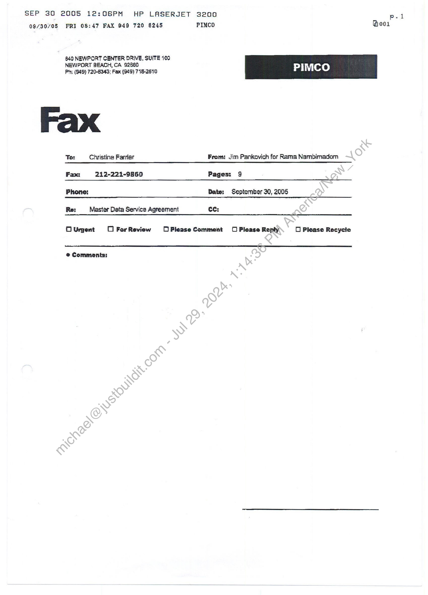

##### Master Data Services Agreement]

  
````col
```col-md
flexGrow=.5
===
> [!info] [Page 1](_attachments/images_PIMCO-3.6.1.9.1MasterDataServicesAgreement1.pdf_212733/page_1.png)
> 
```  
```col-md
SEP 30 2005 12:06PM HP LASERJET 3200
09/30/05 FRI 08:47 FAX 949 720 6245 PINCO Booz  
Master Data es Agreement  
Service Provider: Markit Group Limited (“Markit”)  
Subscriber: Pacific Investment Management Company LLC (“Subscriber”)  
Markit o5 {0 provide [o Subscriber the Markil Data and Markit Services described and referred to In paragraph 2,1 and the Schedule of Services and Fees annexed to
this Master Dala Services Agreement (together with the Schedules altached hereto, ihls “Agreement’), end Subscriber subscribes to such Services In accordance with
tha terms and provisions of this Agreement  
4  
22  
23  
24  
Tamm. Subject (o paragraphs 2.5 and 12, this Agreement shall be effective (fom, and In full force and effect as of, the Acceptance Date (as set fonh on the  
signature page hereto) and shall continue in force for two (2) years from the Acceptance Dete {the “Term’). This Agreement will syiometically renew annually for
additional one (1) yaar parious unlsss Subscriber or Markit gives written notice of terminalicn at leas\ sixty (60) days prior to the expiration of the then cutrent term.  
ackit Send
Provision of Services
Markit will provide Subscriber with accoss to the Markit data (ihe “Marki( Data") and services (the "Markit Services” and collectively with the Merki| Oata, tne
"Sorvices”) specifically suBscrided for in Part 2 of he Schedule of Services and Fees annexed hereto (6s may be amended {rom time to time Dy-egraement of the
parli¢s herelo). Subscriber expressly acknowledges and agrees that ils use of and access to the Services ig solely and exclusively for Its own internat business
purposos in the ordinary course of iis business and that the Services are confidential and proprietary ta Markit, Subscriver’s use of and accesso the Services shail
in each case be subject to and conditioned upon the terms and condiilons of this Agreement and Subscriber's compllance Iherewilth,  
License; Designated Employees 4 .  
{a} Subject to the limitations set forth in thie Agraament, Markit hareby grants to Subsctibar for use by Subscriber and each relevant Oasignated Employee 6
worldwide, personal, non-exclusive, non4ransferable licanse to use the Services only far its awn internal businesé purposes #6 pari of B process lo cresla
books of record (including, on 8 casa-by-cace basis. adopting (ha price provided by Markit as Subscriber's price), and (a.ennbla Subscriber fo crest datved
data {i.e dala hae basen derived, incorporated or used, in each caas through a process by Subscriber in conjunction wilh other dete snd professional
expenance, such that the derived data cannot bs idantified or revarse-enginsarad a5 originating or dirscliy derivedfrom the Data) to use end analyze the
dorived data for (he purpose af daveloping tads ideas to use [or its own business purposes, For the purposes of this Agreemant, “Designated Employees”
means each officar, employes or agan{, each being a Aatural pérson. of Subscriber who is from tima to bme abihorized by Subscriber to access and use the
Services from a designated IP address, Each Designated Emplayde shal! be required by Subseriberto comply with tha terms of this Agraemen(, and
Subscriber hereby agrees, without limiting Markit's ather rights and remedias, that il is responsible for eed liable far any breach of any of the provisions of this
Agroomant by its Designated Employees.  
(Bb) The Sorvies is Intended only far professionals in the financa markot and is nol, snd should not be canstrued 26 financial, legal or olher advice of any kind
Sunscrider may not use the Services in, of |o generale, any advice, recommendalions, guidancé, eublications o¢ alerts made available to Subscriber's cliente
or other third patties, except 3% described in soctlon 2.2(¢) below.  
(c) Subscriber may, as pan of and In the ordinary course of Subscriber's business, redistribute (in writing or Dy electronic means) fo Subscriber's clients in
fepons, presentations, graphs and other publications, limited excerpts of the Date withsul Markh's pelor written congenl, provided, however. {hat {i) tha Oata
30 Incorporsied Is In graphical format only for viewing, noi reproduced or repudlisned by the Subscriber In any format that would enable the recipient to
Incorporate the Data in a database of their own: (Ii) the Data that is ulilised is ofly Supportive and Incidental in nalure fo the substance of such reports.
presentations, graphs and other publications; (ill) Subscriber agree and acknowledge Inat Subscriber shalt assume full ligbaity for any such redistribution of
tne Data and will take reasonable steps to prevent its redistvibulion by recipients, (iv) no Charge it made for or in relation to the Data or the reports: (v)
recipients of the Dota may not use It for Avesiment accounting activities, (nthe oven that Subscriber make such use of kmitad excerpts of the Deta as
permitted above, Subscriber shall give appropriate credit to “Markit Geaup‘ ds the source of such information. If Markit reasanably believe (nal any such
redistribution Is not In accordance with this Agreement, Markit rasarvetheright {0 require Subscriber lo cease redistributing the Data:  
Conditions and Restrictions  
(8) Sudscriber hereby agrees and acknowedges that it Is expressly prohibited from distributing, transferring, sub-licensing, ranting, lending, \ransmitting, selling,
recirculating, repackaging, assigning, easing, reselling, pudHstiing or otherwise distributing, transferring or making available ail or any portion ol the Services,
including without Umitation the Merkit Data, the Markit Services and/or any anatysis of presentation included therein, by whatever means to any cther parson
ar entity. In addition to, and without Ilmiting, the foregoing, (1) Subscriber may not copy, translate, conven, decompile, alter, enhance, disassemble, modify,
change, of create derivative works from the Services or any par thereof, and (li) Subscriber may not enter Into any service, ‘aporting of other agreement or
arrangement with any person or entity pursuant o which the Services Bre used lo produce or distribute Information or services to or for such person or entity  
{b) The Servicas may nat be used for any illegal purpase or In any manner Inconsistent with the pravisions of this Agreement, Subscriber acknowladgas {hat the
Services, including without limitation the Markit Data and Markit Services, were developed, compiled, prepared, revised. selecied and arranged by Markit and
olnars (including certain information sources (a8ch B “Data Provider’) through the applicatlan af methads end standards oj judgment developed and applied
through the axpencture of substential lime, effart and money, and constituie vetvabla intellectus! property and trade eacrets of Markit. Subscriber agrees to
protect the propristary rights of Markiiir the Servicas, including withaut limitation the Markit Dew end Markit Services, during and after the Term of this
Agreement. Subscriber shall hongr\ahd comply wilh sil written requests mada by Markit to protect ita contractusl, sletutory end common (aw fights in the
Services, idtiuding without limitafiontha Merkit Data and Markit Sarvices, Subscriber agrees {9 notify Markit in welling promplly upon becoming aware of any
Claim thal tha Services infrings pon any copyright, trademark or other contractual, statutory of Cammon taw righla.  
(c) Subscriber shat not use afy)of Markil’s trademarks, trade names or gervica marks in any mannar, except colely in connection with its intemal use of the
Services in accordance-with this Agreement and in no avant in a manner accessible by or svallable to any third party. The Subscriber acknowledges hat ®t
has no ownership or license rights in or fo any of (hese namas or marks.  
(d) Subscriber may noluse the Services to develop, create or directly price any index (p.9.  
 any componite financial index).  
(e} Subsceibar acknowisdges that log-on 2¢eass codes are for use anly by Designated Employaea sno Il ensure that each log-an access cade Is kapt
confidential. Subscriber shali maintain e lis of Designated Employees and designsted access codes, and shall make such ilst available for inspection at
Markil's requaét. Subscriber shall use its bast efforis to prohibit or ceage any unauthorized access 10 the Servicas,  
(f) Nothing ,cartsined in any of the ebove provisians or any othar provision contained in this Agreement or any Schedules attached hereto, shall arevent
Subseriber from being abdis to create derived date and use and analyze tha derived cata for the purpose of developing trade eas {0 use for ils own business
purposes.  
Additions! Restrictions.  
(a) Mn addition to the terms and condiiions of Hs Agreement. Subsenber’s access to and use of the Markil.com websile shail be in accordance with the “Terms of
Use" contained thereon, a3 amended or supplemented from time to time; provided, howsyer. that to the éxtent any ferms in such “Terms of Use" are
inconsisient with or conflict with the terms snd conditions of this Agreement, tne terms and condkions of this Agreement shal! control unless specifically
indivaled olhsrwise.  
(>) Subscriber represants. warrants and apreas that Subsctiber shall not, and shall not parmit ita Oasignated Employees, In connection with (I) use of the Markit
Date and/or Merkil Services, (il) access of Markit’s syslems or (iii) delivery af Subscribar Financial Dale {if any); (a) violate any eppiicsble ieca!, stale, national
Or International law. statute, ordinance, rule of tagulation, relating to compatition cr antitrust, (b) intacfare with or digrupt the compyter networks of Markit or
attempt to da so, {c) forge headars or in any mannér ménipulate idantiliere in order to disguise ths origin of any Subscriber Financia) Data {as dofinad below):
{d) upload, post, ransmit, publish, or distribule any material of information (x) that conebtutes or ancaurages conduct thet wavid constiule 3 criminal offense.
Qiva rise {0 othar liability. or otherwise violate applicable law or (y) thal infinges. viclales. braachas or otherwise contravenes the rights of Markit or any third  
Markl Group Limited 9/16/2005  
```
````
Notes:    
````col
```col-md
flexGrow=.5
===
> [!info] [Page 2](_attachments/images_PIMCO-3.6.1.9.1MasterDataServicesAgreement1.pdf_212733/page_2.png)
> 
```  
```col-md
SEP 30  
2005 12:06PM HP LASERJET 3200  
p.3  
09/30/05 FRI 08:47 FAX 949 720 6245 PIMCO Zoos  
_ inetuding any copyright. trademark. patent, rights of privacy of publicity or any other proprietary right: (a) iMerfere wih or disrupt the use of the Markit
Ea arian Mack Semben by any other customer or user; of (f} use or attempt to use the Markit Data, Markit Sorvices and/ar Markit systems in any manner
Nol permitted hereunder or in such 3 manner as to galn unauthorized entry or access to the computer systems of any Other parson or entity  
25 Cancellation of Senices. SubscrBer may terminate this Agreement and cancel ils accase to the Servos:  
(a)
(>)  
©
(@)  
(2)  
(b)  
{c)  
(3)
(8)  
(b)  
{e)  
(d)  
al any time upon nal less than ninety (90) days’ prior written notice and paymnent of the {ermination fee set forth in paragraph (f) of this Agresmeni, ;  
in the cvent of 2 matoriat breach by Markit of any of the provisions of thig Agreement that Is not romediad witli thirty (30) days afer its receipt of writen
lice tnaraok,  
teen neh less than thirty (30) days prior written nolice given wilhin (hiny (30) days of 3 malerial amandmant by Markit {a the Scheduis of Subscriber Finenclsl  
Data or the definition of Sudseriber Financial Dala. . ; ; ;  
upon Markil’s making of an assignmant for the benofil of Ils creditors, Ihe filing by Markit or ils creditors of 8 voluntary or involuntary petition under any  
banknuiptey or insolvency flaw, under the reorganization or arrangement provisions of ihe U.S. Bankruptcy Code or under tha provisions af any law of Ike  
impor.  
In consideration of the rights granted to Subscriber in this Agreement, Subscribar agrees to pay Markit the annual fous es indicated on the Schedule of
Services and Fees (“Annual Fees’) (2s amended from time to time {o reflect additional services or changes in pricing as provided in this Agreement). The
Annual Fees shall be sald in US$ (uniass Subscriber notifies Ma/kil in writing in advance), in semi-annual installments in advance and are due snd psyabla
with thirty (30) days after the date of an Invoice from Markl, ; ;  
in addition to the Annval Fees, Suaseriber will pay all charges for sddillonal services ar dala 3s agresd by Markil and Sudseriver in writing-(Addltionst
Charges") within thirty (30) days after the date of an Invoice for ine same [tom Markit, Subscriber hareby acknowledges that. to the extent Additional Charges
erige from third party charges, they may change without notice if changed by Ihe third pany.  
in addition to the Annual Fees and Additonal Charges, Subscriber will poy (9 Markit or to the relevant taxing authority, as appropriate, any eppicable sales,
usa, goods and senices, value edded or other toxes payable under this Agreement.  
in ali cases, the amounis due under this Agraement will be pald by Sybseribe! In full vAthoul any withholding, set-off, counlerciaim.ordeduction.  
By giving Subecriber no tess than 0 days arlor writien notice before the expiration of the Initial Term or any additonal one yearperiod, Markil may increase or
dacreace all or any portion of the fess making up the Annual Fess thal will apply wih respect fo Subscriber's subscription (or the Services for the immadiatety
succeéding annual term.  
In the event the provisian of the Services is cancelled by Subscriber pursuant to paragraph 2.5(a) or by Markit pursuant (9 perapraph 12(c), Subscriber shall
be liable for all amounts payable pursuant to paragraphs 3(b) and 3(c) hareof through the data tha provision of Services is cancelled plus 6 termination charge
equal to 26% of the Annual Fees and the Addilianal Chatges, ramaining to be paid for the remainder of (he Term,  
In the event of any termination of this Agreamnent pursuant to spction 2,5(a) or 12(c}, {hare will be no refund under any circymstsnces of any Annual Fees
previously pald. In any otner event Markit shat) refund Subscribar on a pro-rata basis. In addition, promptly upon sny termination of this Agreement,
Subseriber shall pay al! Annual Fees, Additions! Charges. taxas and other charges awad thraugh the data,of te(mination.  
N case : :
st Dy Markit, le within forty (40) days of such ri and on a timely basis {hereafter to Markit aK of Subscriber's
finsnclal data which consists of prices of Financial instwwments (as dofined in tha Schedule of Services and Fags), including without limitstion those which
Subscriber has on ifs books of recard. trading books or from feeds to Bulomered trading Systems (‘Subseriber Financtal Data’) by electronic means in the
format gat out in Schedvie of Subscriber Financlol Date provided by Markit (as may be amended from time fo time by Markit), for use by Merkit In creating
8nd providing products Bnd services, Subscriber shal) be obligated to provide such Subscriber Financial Data anly to the extent Subscriber either (I) has such
Subscriber Financial Data reasonably avaliable for vansmission by electronic moans or (ii) provides similar data lo 8 third pany vendor by electronic means.
To {he extent Subserber provides Subscriber Financia Data io Markil pursuani lo Ihit paragraph 4{a), it shall do 6o Bt substantially the same level and at
Jeast the same dagree of securacy, quality, completeness, timeliness, responsivendss and efficiancy as ils other vendors ganeraily receive with respect to the
delivery of dete simiiar to Subscriber Financial Data,  
To the extent and in the event, Subscriber provides Subscriber Financial)Data la Markit, Subseribar grants to Markil, and Markit hereby accepts, @ nonexclusive, world-wide, perpetual and Irrevocable Noense to use such Sybacriber Finencial Date for the development end provision of any of Markit’s servicas
and products; prowided that Markit will not distibule, transfer or make availabla all ar any partion of (he Subscriber Financial Dats to any (rd party except in
cannaction wih the provision of the Markit services and producit.and)in any case, only (o the exten! such Subscriber Fingncial Dela Is not feadily Identifiable
by @ third party as having deen provided by Subscriber, Exceptas specifically provided harein, Subscriber retaing ell rights with respect 10 any Subscriber
Financiet Data contributed to Markit,  
Subject to the righta of Subscriber in peragraph 2.5(¢), Marklt'may at any timo, upon notless than Forty-five (45) days prior writlan nolice, emend the defnition
of Subscriber Financial Dale and/or the Schedule of Subscriber Financial ata, including in a manner which would require Subscriber to provide additional
data.  
In the event Subscriber is prohibited fram providing Markit with (he Subscriber Financial Data due to legal or contraciual restrictions in atfact prior to the date
of thle Agroomant, Subscriber will notify Markit.of such restrictions in writing and will not be fequired {o provide Subscriber Financial Dela to the extent
Subscriber is so restricted and cannot reasqriably elimi such resuicilon,  
Subject to tha limitations Wescribed herein, aach member of Subscriber's Group (as defined beldw) shail be permitied to use tha Services  
Subscsibers Group
solely and exclusively for such Group member's awn infemal business purpoeas in tha ordinary course of Its business, Each of the restrictions, obligations, tama  
and conditions (including, without limitation) the obligation to provide financial data described in paragraph 4 hereof) sat forth in this Agreemanit shail apply to sach
member of Subscriber's Group, mulafis, mmulandis. Furthermore, Subscriber shall raquira each such Group member to comply with the restrictions, obligations,
terms and condkiong set forth In thieeyreement, and Subscriber haréby apreas, without limiting Markit’s other rights and remedies, that It is rosponsibia and liable
{or any breach of, or noncompliance with, any of the restrictions, obligations, terms and conditions of this Agreement by any of ts Group members. Prior ta any use
af the Services by any membér.of Subscridor's Group, Subscriber must deliver 8 written notice to Markit sening forth the name of such Group member and must
cortfy In writing thet such eniliy is @ member of Subscriber's Group. For tho purposes of this Agreement, “Group” means {he ullimate parent compary wholly
owning and controling Subscriver (If any), and all alliliatas of Subscriber {het ere directly or Indiraatly wholly-owned and conirolied by Subseriber or uch ullimale
parent company; provided Ihal ta Ihe extent any such ultimate parent compeny or effiliale (or any group af employees or agents of such entity) are principally
Sot in third-party S8set management of olNerWse pensrally engaged in the business of managing essets, such entlly shalt not bo considered & mamber of
utecrbere Group,  
6  
irements. Subscriber shall, at its awn cos! and expense, procuro and oblain ‘any and ali necessary equipmant required to allow for iho  
delivery eihe Services and tho delivery of the Subscriber Financial Osta (itany), All such equipment must meet the minimum standards and requiraments as sei  
farihyoo Part 2 of the Schedule of Subs¢riber Technical Requiraments (as may
Cosi and expense, ai connections from Its own compuler systems {a tha Mark’
connections, nor any Habliity for any damage thereto.  
mended fram time ta time by Markit), Subserlver shall atso provide, at ibs own
ystems, and Merkit shall have no responsibility for ony suth equipment or  
7. Senice Levels. Markit shall use raazonable efforis to maintaln iis systems ang the avallabilily of tha Services. Markit ahalt have no responsibility for suppor that is
tequired as a result of Subscriber's own systems or its improper sccessing of the Services.  
& = Security  
7)  
Suaseriber sho ensue that il has implemented security systems and procedures tg prevent (he unaulhorized access 10 or misuse of (he Services. This shall
include, at 8 minimum;  
Mackit Group Limited 9/16/2005 2  
```
````
Notes:    
````col
```col-md
flexGrow=.5
===
> [!info] [Page 3](_attachments/images_PIMCO-3.6.1.9.1MasterDataServicesAgreement1.pdf_212733/page_3.png)
> 
```  
```col-md
SEP 30 2005 12:07PM HP LASERJET 3200 ;
09/30/05 FRI 08:48 FAX 949 720 6245 PIMCO Boo  
92  
as  
42.  
() establishing and melniaining ell reasonable procedures io ensure that the Services sre accessible only by Dasignated Employees using thelr respective
jog-on access codes; and 7 —_ ;
(Il) establishing Bnd mainiteining all reesonabla procedures necessary to protect each of Markit'a systems and Subectiber’s systems from unauthorized
thicdepany sccess by or through Subscriber of ita amployaas or aganis. ; : ;
{o) Sudacriber shall immedigtety give written notice of any unauthorized eccess to or miauas of the Servicas. Markil’s systems or Subscriber's systems to Markil,
gafling forth in reasonable detail the nalure of tha security braach and (he maasures taken by Subscriber lo cure such breach.  
Warrentiag 3nd Limitation of Ligbility  
Representation sng Warreniies, Eech panty hereby represents snd warrants to the otner pany as follows,  
(8) il hae the ful right. power gnd authority lo axecuta, deliver and perform thig Agraamant in sccordsnce with lis terms:  
(b) this Agreement hes been duly executed and dalivered by of on bahall of such party and canstitytes a legal. veld and binding obligation of such party,
enforceable agains! such party in accordance with its tarms; and  
proval, authorization or ordar of any parson of entity is required foc the execution delivery or performance ol thls Agreement by such party, and  
neither {he execution, delivery nor perfarmance of this Agresment by such party will (i) conflict with, or result Ina bresch of, or constitule a defaull under, or  
Tazult in a violation of, any organization document of such party of sny agreement or instrumen! to which euch pany (s subject or by which it is bound, ar (ii)  
result in the violtion of any epplicabie Isw, rule or regulation lo which euch pany (5 eudlect,  
(c)  
Each of the parties hereio agrees that the rapresentationg and warrenties get forth in thle peregraph 9,4 shall survive the execution. delivery and termination of this
Agreement.  
Oisclaimer of Warraoties. NEITHER MARKIT, ITS AFFILIATES NOR ANY DATA PROVIDER MAKES ANY WARRANTY, EXPRESS OR IMPLIED AS TO THE
ACCURACY OF THE DATA OR SERVICES OR AS TO RESULTS TO BE ATTAINED BY SUBSCRIBER OR OTHERS FROM THE USE OF THE DATA OR
SERVICES, AND THERE ARE NO EXPRESS OR IMPLIED WARRANTIES OF MERCHANTABILITY OR FITNESS FOR A PARTICULAR PURPOSE OR USE,
MARKIT EXPRESSLY DISCLAIMS ANY CONDITION OF QUALITY AND ANY EXPRESS OR IMPLIED WARRANTY OF TITLE, , MERCHANTABILITY OR
FITNESS FOR A PARTICULAR PURPOSE. SUBSCRIBER MEREBY ACKNOWLEDGES THAT IT HAS NOT RELIED UPON ANY WARRANTY, GUARANTY OR
REPRESENTATION MACE BY MARKIT, [TS AFFILIATES OR ANY DATA PROVIOER, EXCEPT THE REPRESENTATIONS MADE-BYMARKIT SPECIFICALLY
SET FORTH IN THIS AGREEMENT,  
Umnitation of Liabillly  
(8) Neither Markit, lis affilistas nor sny Data Provider shall In any way be Hable to Subscriber or any cltent of Subscriber farany inaccuracies, errors or omisaions,
regardless of cause, In the Markit Dste, Markit Sanicas or any other Service provided hereunder or for any damages (whether diract or indirect!) resulting
therefrom. Without limiting the foregoing, Merkit ahall have no liability whsteoever to Subscriber, whether In contract (lactuding under an indemnity), in tort
{including nepliganca), under e warranty, undar statute or otherwise, In respact of any loss oF damage sufferad by Subscriber ag a rasull of or in conneclion
with eny opiniang, recommendations, forecasts, judgments, or any other conclusions, ar any course of actin determined, by Subscriber or any client of
‘Subscriber, whether or not based on (he Markit Services or Oata.  
{b) Neither party will be lisble for any failure to perform sny obligation hereunder, or for any delay in, He pecformance thereof, due to causes beyond ils
reasonetie contol, including withaut limitation industrial disputes of whatever nsture, acts of God, pudlic enemy, acts of government, failure of a third party
telscommunications provider, fine or other casualty (each, a “Force Majaure Event’). The party prmvented from performance by a Force Majeure Event shall
give the other party wrilten notice af tha Force Majeure Event promptly upon discovery therecf,ahd’shall use best effons to recommence Performance of tha
affected obligations or provide an acceptable alternative.  
(c} UNDER NO CIRCUMSTANCES WILL EITHER PARTY GE LIABLE FOR ANY INDIRECT, INCIDENTAL, SPECIAL OR CONSEQUENTIAL DAMAGES WITH
RESPECT TO THE SUBJECT MATTER OF THIS AGREEMENT, INCLUDING LOST PROFITS. REGARDLESS OF WHETHER SUCH DAMAGES COULD
HAVE BEEN FORESEEN OR PREVENTED.  
(0) Subject to paragraph 9.3(8). in no event will the aggregate liability for either perty, whether in conirect {including under any indemalty), in tort (including
negligence). under @ warranty, under stetule or ofharwise, for any damages, direct ar otherwise, ariging ov of o¢ In connection with this Agreement, excead
the total amouni of Annual Fees actually paid to Markit by Subscriber during thie twenty-four (24) month period immediately preceding the act ar omission
giving rise to (he loss, ragardiess of the causa of form of ection  
(2) The limits on liability set outin this perapreph 2.3 shall not apply In respect of:  
(i) any liedilily for fraud or wiltfll misconduct; or
(ii), abreach by Subscriber ol paregmph 2.2. 2.3, 2.4, 8 or 13; or
(il) obiigations under paragraph 10 below,  
Ingeronificalion. In the event thai Subscriber, through a braach of this Agraament, allows a third party to access all or part of the Services,
through or by means of Subscriber, then Subscriber willindemnity, defend and bold hannless Markit and its affiliates, directors, officers, agents
employees, successors, assigns and all Data Providers) and each of thelr afiliates, directors, Officers, agents, employees, members, pariners,
Succassors and assigne ("Markit ndemnitees") from and against any and all losses, tiabilities, damages, costs and expenses arising as a result
of any claims, suits or proceedings (collectivaly,“Clalms*) brought by any third party against any Markit Indemnitees to the extent such claim, If
brought by Subscriber directly against Markit, would be excluded pursuant to paragraph 9,3(a).  
In the event that section 4 of this agreement is in effect because Subscriber has become a market maker in the securities covered by the
Services, then Subscrber will indemnity, defend and noid narmlass Markit Indemniteas from and against eny and ail Cleims brought by any
third party agains! any Markit Indemaltees arising from, any daim that the providing of Subscriber Financlai Data by Subseriber Infringes or
Tisappropriates any patent, tade secret, copyright or ather proprietary rights of such third party.  
Maekh will indemnity, defend-and hold harmless Subscriber and its affiliates, directors, officers, egents employees, successors and assigns (“Subscriber
Indemnltees") fram and aoainsvany Claim Brought by any third parly againgt any Subscriber Indemnitees grising from any Claim that tho providing of Services by
Maxkit infringes or misappropriates any patent, trade secret, copyright or other roprietary rights of such third pany.  
For the avaidance.of doubl, notwithstancing anything in this Agreement to the contrary, both parties agree thal the Subscrlber Indamnitass and
Markit indemniteés shail not be indemrified by Markit or Subscriber for ANY INDIRECT, INCIDENTAL, SPECIAL OR CONSEQUENTIAL DAMAGES
WITH RESPECT TO THE SUBJECT MATTER OF THIS AGREEMENT, INCLUDING LOST PROFITS, REGARDLESS OF WHETHER SUCH DAMAGES COULD
HAVE BEEN FORESEEN OR PREVENTED.  
Remadgies, (n the event of a breach or (hraaienad breach of any of tha provisions of this Agreement by Subscriber or any of Rs emplayees, represantalivas or
affates. Markit shall be entities to injunclive reilef to enforce Ine provisions of (his Agreement (without the poating of a bond), but nothing hereln shail preclude
Markit from pursuing eny action or other remedy for any breach of threatensd breach of this Agreemant, all of which shall be cumulative. As reasonable protection
of the propriatary righis of Markit and others in the information provided through the Services (and without limiling Markit's rights in any manner), Subscriber
acknowladges (hat (he dissemination or disiributian by Subacnber of Information identicat of similar to that Provided (hrough ine Services (except, on a cage-by¢€as6 basis, where Subscnber has adapted @ prica provided by Markit in ts books of record) shal be doemod a breach of (he terms of paragraphs 2.2 and 2.3 and
Shab give rise to, among other remedies, an immediate right of Markit to cancel the Services,  
Termination. Markit may lerminate this Agreement snd cancel or withdraw all or any pact of any Services;  
Markit Group Limited 9/16/2005 3  
p.4  
```
````
Notes:    
````col
```col-md
flexGrow=.5
===
> [!info] [Page 4](_attachments/images_PIMCO-3.6.1.9.1MasterDataServicesAgreement1.pdf_212733/page_4.png)
> 
```  
```col-md
SEP 30 2005 12:08PM HP LASERJET 3200
09/30/05 FRI 08:49 FAX 249 720 6245 PIMCO Boos  
13.
43.4  
13.2  
(@) upon writen notlce 10 Subscriber et sny time it rsssansbly considers at any time thst the financial dela used to provide such Markit Service(e) iz nol
satstectory In lems al tegality. quality, volume pr significance, .  
(0) upon written notice 10 Subscriber st any lime it determines that the provision of tha Services has become uniawiul or that the Servicas have become subject.to
9 claim (hat they infringe the rights of any third party. . 7 . .  
{c) in the event of 8 breach by Subscriber af any of the provisions of this Agreement that is not remedied within thirty (30) days’ afer ils receipt of written notice
thereof (olhec than paragraphs 2.3. 2.4 and 13 which shall require np cure pariod); ;  
{d) upon any change of control of Subscriber or egle, laase or other Wanefer, directly or indirsctly, of all or substantially ali of the equity interests ov assets of
Subscriber: or  
{e) Upon Subscriber becoming 8 competitor of Markit, or : ; ;  
(f} upon Subscriber's making of an assignment for the banelit of ts craditors, ihe fillng by Subscriber or its creditors of @ voluntary gr involuniary petition under
any bankruptcy or insolvency law, under the reorganization or ermangament provisions of the U.S. Bankrupicy Cade or under the provisions of any law of like
ungoq.  
Confidentiality.  
Subject fo peragraph 13.3 and sny other agreement between ihe parties, aach parly (a “Reciplent”) shall keep the Confidential Infarmation of the other party (ine
“Discloser“) secrat snd canfidantiat and shall not (without the prine writen consent of ihe Discloser) disciase any part of \hat Confidential informstign to any person
othar than fo Ra amployees. contiaciors and agente who require access fo that Confidential Informetion in order for the Recipient to perform lis abligailons under
this Agreement or tacaiva the benefit of its aphis under this Agrsemant. For the purposes of the Agreement|. “Confldentist Information™ means in relation io 3
parly Bll confidantial and prapriatary information (whather such information is in ora! or writien farm gr ig racardad in any other madiym} aboul or pertaifilng to the
business of thal party or ils customers which is disclosed {p the other party or its employaes or contraciors, ar which is acquired by or othersse-comes to the
knowledge cf the other pary or its empioyses or cantractore in connection with this Agreement or eny Juture cooperation between the Panles (including the
performance by 9 party of its obligations hereunder). The "Confidential information” cf Markit includes the Maskil Services and {he information contained therein
(including, without jimitalion, the Markit Data) and the business me(hods and models rajated thereto. The “Confidential Information” of Subscriber includes the
Subsenber Financial Datla (if any) and ihe information contained thersin and busingss informalion relpting to Subscriber that can bs darivad-thisrefrom. but does not
includé the aggregated dala received [fom Markit’s Data Providers. This Agreement and its (aims shall be considered “Confidential Inforrietion”.  
Subject io paragraph 13.3, Recipient and ils employees, contractors and agents shall noi (withaut the prior written consent of IheDistlosar) use the Confidentiat
Information @x¢epl for the purpose of performing ks obligations under |his Agreement pr receiving the denefil of its rights under (is Agreement. Each party shall be
responsible for tha acls and omissions of its employees, contractors and agents.  
Paragraphs 13.1 end 13.2 shall nal apply to:  
(a) any Confidential Information which is or passes inte the public domain, other than diractly ar indirectly aa 8 resuiicl'or In connection with any act or defautt of
the Recipient or any of ils employees, contractors or aganis in breach of this Agraament;  
(b) any Confidential information heid by the Racipient prior to disclosure of such Confidantial Information by th@Disclosar to the Racipient;  
(c) the use or cisctasure of Confidential Information in accordance with rights lawfully granted by a third pariyror  
(2) the disclosure of Confidential Information to the extent required by any eppticable legislation or aubordinsta lagialatian or any court or judicial or administrative
authority of competent authority; prowded however, that prior fo making any such disclosure. {ip disclosing party promplly notifies the other party of such
tequirement or request (where allowed by law lo do £0), and allows (he other party ihe regsonalile’ opportunity to exhaust all ressoneble legal and equttabie
channels for maintaining such Information in confidence.  
a  
(8) Nalices. Whenever any notice or other communication is given by ane party (0 the other ("Notice"). such Notice shall ba in writing and shall be delivered by
facsimile (with confirmation of reccipt duly ebiainad by the sending party) or ragistered-ar cerlified mail, raturn teceipt tequanted, addressed as set forth on the
ae page hereto, Notices properly given in accordance with Ihis paragraph 14(a) shall be effective on tha immadialely succeeding business day afier  
received,  
(b) Entire Agreemen}. This Agreement consiltvies the entira agreement beluweenthe parties wilh respect to its subject mettar and (to the extent permissible by
faw) supersedes al prior representations, writings, negotiations of understandings with respect fo that subject matter. All terms. conditions and warranties nol
stated expressly in this Agreement, and which would in the absence of this provision be implied into Ihis Agreement by statute, common law, equity, trade,
custom ef Usage or othenvise, are exciudad fo ihe maxmum axtent permited by law.  
(c) Assignment, This Agreement snait be binding upon and inurd)to the benef of the partis, their respective persane| representatives, and permitted
SUCSESSOFS AND assigns; provided thal Subscriber may not assign or otherwise transfer any of ils rights or dalagste any of ita duties under this Agreement
pas the prlor writen consent of Markit. Markil shall be ‘entities to assign (his Agrasment or any part thereto to its affiliates, provided no adverse elfecl on  
service.  
() Waiver. No failure to exercise nor sny delay In exeicising, any rtght, power or remedy by 8 pany Operates as a waiver. A single or pertial exercisa of any right,
power of remedy does not praclude any other or further exercise of that or any olher nghi, power or ramady. A waiver ig not valid or binding on (he pany
granting thai waiver unless mada in writing.  
{0} Amendment and Weriation. Except aa otherwise expressly permitted by this Agreement, no variation of this Agreement (or of any of the documents referred to
in this Agreement) shall be velid untass il (2 i weting and signed by or an behall of each of the panies to it. Tho expression “variation” shalt include any
amendmsnt, variation. supplament, dalation or raplacemeni however effaced.  
()  Belalienshio Between the Fariss. Thare ix no joint venture, partnership, agency or fiducisry relationship existing belween the parties and the partics do not
intend to create any such relationship by this Agreement  
(9) Counigtoaris. This Apraement may.b executed in any number of counterpans and by the parties to It on separate Countemparts, €ach of which is an original
Dut all of whith together constitula@one and the same instrument.  
{h)  Javaligity If any provisicn in-ehany ped of this Agreement shell be found (a be illegal or unenforcenble under any enactment of rule of law then that provision  
. of part Shalt to thai extent’be daemed not to form part of this Agreement snd tha remaining provislons shall cominve In full force and effect  
(ly)  Suevval. Paragraphs 22°2°3. 2.2, 3, 9, 10.11, 13 and 14 shall survive tha termination or expiration a! this Agreament.  
Q)  Gaveinina Lay. Tha.chastruction and validity and perfarmance af this Agreement end the transattions contemplated by it shall be governed by the laws of
Now York and ath pany submits to (he jurisdiction of (he state end faderal courts residing In New York, New York for the purposes of determining any
dispule arising out’o! this Agroemont or the transactons contemplated by it  
()  HCITA. The provisions of the Uniform Computer inlormation Trantactions Act UCITA") will not apply to this Agreemant, even If UCITA of a variation thereo!
ls adopted. InNew York after the date harect,  
In witness whereo!, inls Agreement has been execuied as of tha By of September 2005.  
SIGNED for and on behsif of
Pacile Investment Menagement Compeny LLC by:  
| A EGA?  
Name: David Lown “TM  
Tina:  
Executlve Vice President  
Subscriber Address for Notices:
Pacific investment Menagement Company LLC  
Markit Group Limited 9/16/2005 4  
p.S  
```
````
Notes:    
````col
```col-md
flexGrow=.5
===
> [!info] [Page 5](_attachments/images_PIMCO-3.6.1.9.1MasterDataServicesAgreement1.pdf_212733/page_5.png)
> 
```  
```col-md
SEP 30 2005 12:0SPM HP LASERJET 3200
09/30/05 FRI 08:50 FAX 949 720 6245 PIXCO  
640 Newport Genter Drive
Suite 108  
Newport Beach, CA 92880
Aan: David Lown  
Accapted as of the __ day of Seplember 2005 (the "Acceptance Date")  
SIGNED for snd on behelf of
Markit Group Limied by,  
Neme: Rony Grushke
Title: CFO  
Markk Addrass for Meta
10 Bricks Road>  
Markit Group Limitad 9/16/2005  
p-.6
Zao  
```
````
Notes:    
````col
```col-md
flexGrow=.5
===
> [!info] [Page 6](_attachments/images_PIMCO-3.6.1.9.1MasterDataServicesAgreement1.pdf_212733/page_6.png)
> 
```  
```col-md
SEP 30 2005 12:03PM HP LASERJET 3200  
p.7  
09/30/05 FRI 08:50 FAX 949 720 6245 PIMCO @oo7  
Schedule of Services and Fees - PIMCO  
Part 1: General Description of Markit Servicas
The specific Services avallable far subscriptian by the Subscriber are set forth in Part 2 of this Schedule. Such Senices generally fal) within ons of
the following genera} descriptions of the services made available for subsoription by Markit:  
Markit Date ™  
A database of daily closing prices of Financial Instruments. Individual prices obtained from the Subscriber (if any) and other parties, 3 composite
security price as weil as a theorelical price generated using Markit Curves are available for viewing and download by the Subscriber. For the
purposes of this Agreement "Financial Instruments” means securities and exchange-traded or over-the-counter derivative contracts, including fixed
Income securities, floating rate securities ar market standard credit derivatives anc thelr associated Tacovery rates, whose issuars or, In the case of
credit derivatives, reference issuers, are corporate or government entities,  
Markit Curves ™  
A graphical representation of a reference enilty’s credit detault swap and cash securities term structure for which Markit has sufficlentand rallable
data, Financial Data is used to populate a scatter diagram and a best-fit tine is drawn. In addition. data paints on the scatter diagram can be
Nighlighted and the range of prices for thal Financial Instrument viewed.  
Markit Sactors ™
Markit currently constructs sector curves based on Moody's sector classifications, These full curves are fully downloadable in any file format and
accassible via the web Sita under Markit Curves ™/ Sector curves.  
Markit Mappings™ Is an online report of tha currant status of how your upload file has baen mapped to the Markit talabase. The tool siso provides
you with an sbility to edit mappings online on an ongaing basis in the event that changes occur in your dataset.  
Markit History ™
All ma series data js fully downloadable Inio any fila farmat and accessible via the wab site under Markit Curves ™ / History Curve.  
Markit Convertibles ™
Daily Convertible bond pricing  
Markit 4:30 ™
Intarday 4:30pm (Eastern time) pricing from contdloutor banks, brokers and other data servives,  
Markit PY ™  
Markit PV service provides an independent and accurate net present valua for a portfolio of trades laveraging the vast breadth and quality of CDS
dala processed by Markil, Users sutmil trade data over the Internet either frotn & Spreadsheet or via XML delivery. Trades ara priced ising ihe
Markit curves and an independent valuation is supplied back lo Ina user.  
art 2: Services providad to Subser'!
The following services have been subscribed for by the Subscriber (this Ofer is valid for 60 days):  
TOWATDHS™ BownTand Only Seca | Pees TH USOT person  
1.1 Investment Grade COS -Markit 225 for cost of $22,000
composile *  
Services Proposed Description  
Markit returns a daily csv/tab/XML file of al! conlrbuted daily compasites
| lor all maturities for a given entity-via a secure Web connaction.
The-totat number of entities | Subscriber maintains end updates identified entities on Markit wabsila,  
{ fe be iner@ased as outlined 5 lag-ons ara provided for downloading and/ar mapping.  
32S for a cost of $30,000
426 fora cost of $40,000
926 fora cast of $50,000
7S0 for a cast of $76,000
1000 for a cost of $109,000
1800 for a of $125,000
125 for 8 cost of $13,000  
4.2 Sub Investment Grade CDS  
«Markit retuine a daily cav/isb/XML file of all contiaured dally composites
compasite’*  
for al maturitiaa for 8 given entity-vis 6 secure Web connection.
+ Subscriber maintains and updates identified antities an Markil website
« ©Slog-ons are provided for downloading and/or mapping.  
‘The total number of entitles
can be increased s¢ oullinad
below:  
225 tor a cost of $22,000
325 for a cost of $31,000
426 for a cost of $43,000
525 for a cost of $55,000
826 for 2 casi of $85,000  
° Subscribers provide Markit wilh a jist of specific entities to which Markit shall apply such Service (lhe "Invesiment Grade Entity Set” and the
“Sub-Investment Grade Entity Set’),  
“  Subsenber may only abtain Contributor Datalls for an antlty in ts Sub-investment Grade Entity Set to the extent Subscriber holds a bona-fide
position of sub-Investment grade financial instruments of such entity in its ‘proprietary portfolio, and tha inclusion of an entity in Subscriber's
Sub-Investment Grade Entity Set shall be deemed fo be a representation made by Subscriber to Markit that it holds such a position. The  
Markit Group Limited 9116/2005 6  
```
````
Notes:    
````col
```col-md
flexGrow=.5
===
> [!info] [Page 7](_attachments/images_PIMCO-3.6.1.9.1MasterDataServicesAgreement1.pdf_212733/page_7.png)
> 
```  
```col-md
SEP 30 2005 12:09PM HP LASERJET 3200 p.8
09/30/05 FRI 08:50 FAX 949 720 6245 PIMCO Boos  
accuracy of the Sub-investment Grade Entity Set shell he deemed ta be a condition to Subscribers access to tha Markit system and the
Services.  
The above Services wil! be Initiated only for Ihe following types of Financial instruments:  
Securities and exchange-traded or over-the-counter derivative contracts, including fixed inooma sacurilies, floating rate sacurities or markel Standard  
credit derivatives and their associated recovery retes, whose issuers or, in the case of credit derivatives, reference issuers, are corporate or  
governmententties. Examples are:  
1. Market standard credil default swaps.  
2, Bonds with a constant regularly paid coupon, which are no! callable, puttable or amortizing,  
3. Floating Rate Notes that are not callable, puttable, collared or amortizing wilh coupans linked to short term deposit rates and nal capped,
floored, collared or otherwise structured.  
The availability of Markit Data and other Services is subject to quorum requirements based upon the total number of data contributians and the
particular data being contributed by Subscriber. Thess quorum requirements are Subject to change from time fo time al the discretion of Markit,
Piease contact Markit for a descriplion of the quorum requirements currently in effect,  
The Services and types of Financial Instruments to which the Services may be applied are subject lo modificalion by Markit fo reflect statistical,
technical, administrative, market-based or similar changes that Markit determines In good falth are required or desirable to Improve the quality of ne
Services,  
Additional Services;  
Markll may make additional Services avaliable from time to time in Its sole and absolute discretion and in each case“subject to the terms and
conditions of this Agreement as then in effect. The Services will be Subject to modification by Markit to refiect statistical) technical, administrative,
Markal-basad or similar changes that Markit determines in good falth are requited or desirable to improve the quality ofthe Services,  
Markit Group Limhad 9/16/2005 7  
```
````
Notes:    
````col
```col-md
flexGrow=.5
===
> [!info] [Page 8](_attachments/images_PIMCO-3.6.1.9.1MasterDataServicesAgreement1.pdf_212733/page_8.png)
> 
```  
```col-md
SEP 30 2005 12:10PM HP LASERJET 3200
08/30/05 FRI 08:50 FAX 949 720 6245 PIMCO  
Schedule of Subscriber Technical Requirements  
Microsoft NT4 Service Pack 5 of later, Windows 2000
Wndows XP will be upportad once cuslomers stant to use this Operating System
internet Explorer 4.0, 5.0, 5.5 or Netscape 4.7
Cookies must ba swilthed on wilnin lhe browsar
Java Script must be switchad on wilhin the browser
Micrasofl Excet 97 or 2000  
12B Megabytes RAM  
SOOMhz srocessor  
64 kilobits internet connection  
Minimum screen resolutlon: 1024 x 768  
Minimum screen colour deptn 18 bhs (2S,836)  
128 bls encryption (High Encryption Pack)  
Markit Groyp Limked 9/16/2005  
p.3
Boos  
```
````
Notes:    
````col
```col-md
flexGrow=.5
===
> [!info] [Page 9](_attachments/images_PIMCO-3.6.1.9.1MasterDataServicesAgreement1.pdf_212733/page_9.png)
> 
```  
```col-md
SEP 30 2005 12:06PM HP LASERJET 3200  
09/30/05  
FRI 08:47 FAX 949 720 6245 PIMCO  
640 NEWPORT CENTER DRIVE, SUITE 100  
Pp
Boo1  
NEWPORT BEACH, CA 92660
Phi (949) 720-8343; Fax (S49) 718-2610  
To: Christine Farrier Fram: Jim Pankovich for Rama Nambimadom
Fan 212-221-9860 Pages: 9  
Phone: Date: September 30, 2005  
Re: — Master Data Service Agreement ce;  
OUrgent OC ForReview OPlease Comment Please Reply’ O Please Recycie  
@ Comments:  
```
````
Notes:  


![[_attachments/PIMCO-3.6.1.9.1 Master Data Services Agreement (1).pdf]