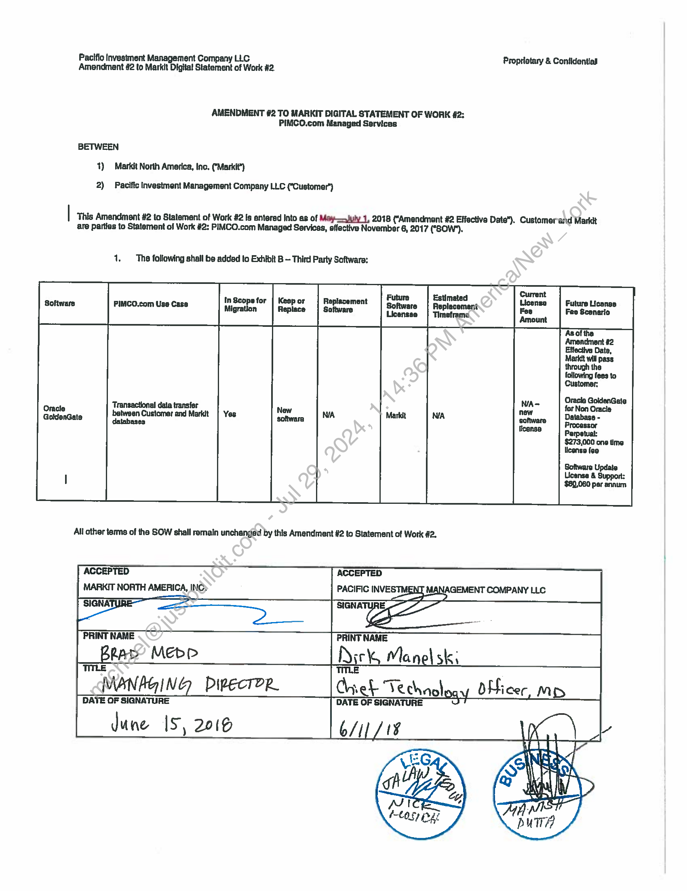

##### Amendment #2 to Markit Digital Statement of Work #2: PIMCO.com Managed Services]

  
````col
```col-md
flexGrow=.5
===
> [!info] [Page 1](_attachments/images_PIMCO-3.6.1.9.200160491.pdf_210345/page_1.png)
> 
```  
```col-md
Pacific Investment Management Company LLG Propristary & Confidential
Amendment #2 to Markit Digital Statement of Work #2.  
AMENDMENT #2 TO MARKIT DIGITAL STATEMENT OF WORK 42:
PIMCO.com Managed Services  
BETWEEN  
1) Markit North America, Inc. (‘Markit’)  
2) Pacific Investment Management Company LLC (‘Customer’)  
This Amendment #2 to Statement of Work #2 fs entered Into as of May—uly 1, 2018 {‘Amendmant #2 Effective Date"). Customerand Maridt
are parties to Statement of Work #2: PIMCO.com Managed Services, affective November 6, 2017 ("GOW").  
1. The following shall be added to Exhibit B — Third Party Software:  
Future
In Scopsfor | Keep or Replacement
mate |S se [ace tn  
New  
All other terms of tha SOW shall remain unchanged by this Amendment #2 to Statement of Work #2.  
Estimated
Replacement
Timeframe  
Transactional dala transfer
between Customer and Markit
ea  
ACCEPTED ACCEPTED  
MARKIT NORTH AMERICA, INC» PACIFIC INVESTMENT MANAGEMENT COMPANY LLC
i a  
PRINT NAME PANT WANE
Dirk, Manel sk;
TITLE TITLE
MANAGING DipecTOR. ret Ve chnoloc OHicer MD  
DATE OF SIGNATURE DATE OF SIGNATURE  
dune 1S, 2016 b/I  
```
````
Notes:  


![[_attachments/PIMCO-3.6.1.9.2 00160491.pdf]