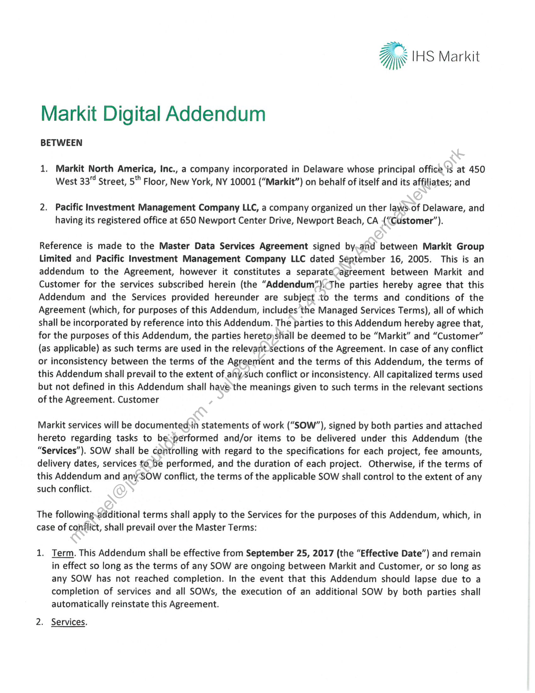
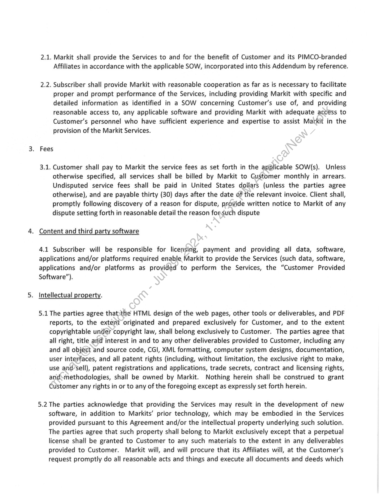
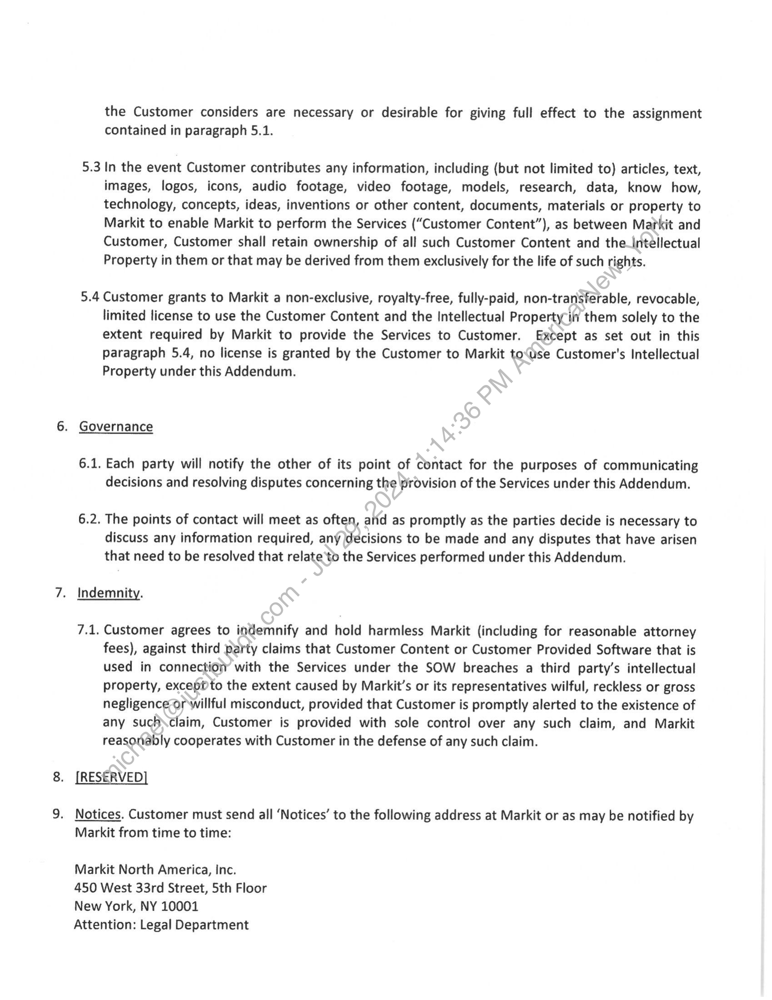
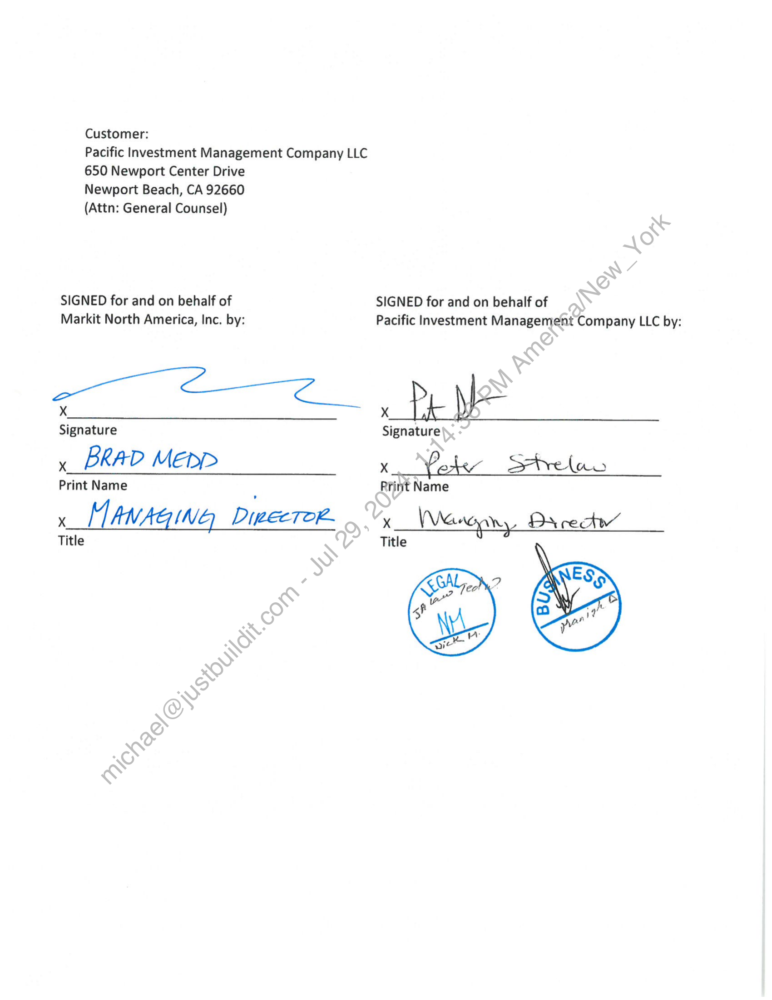
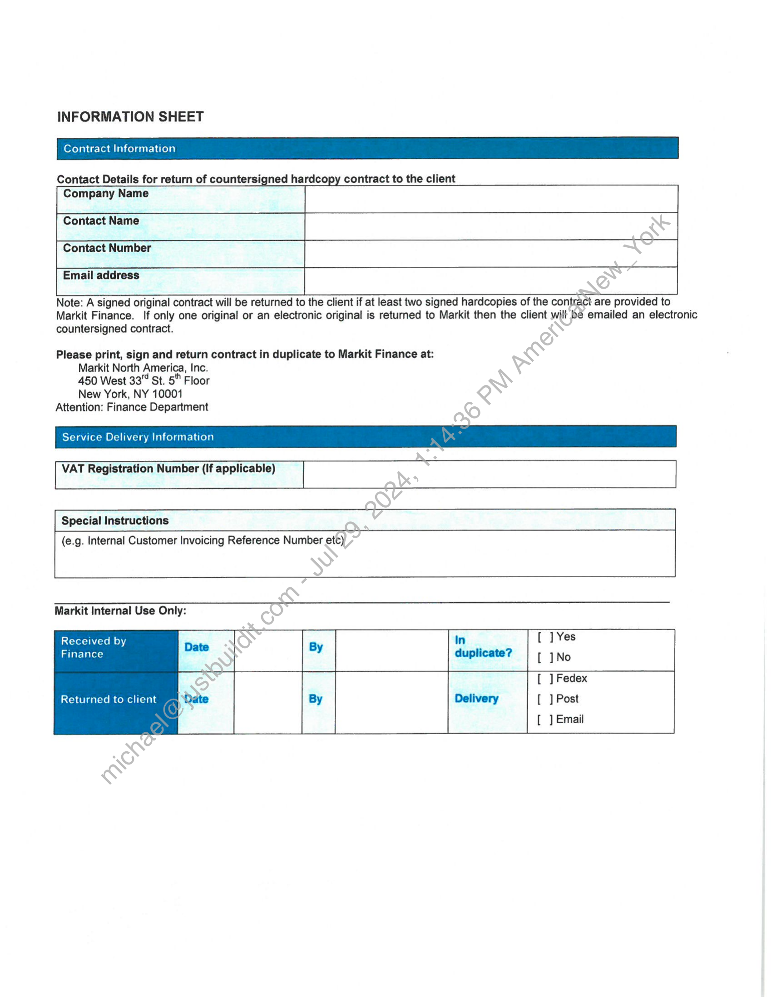
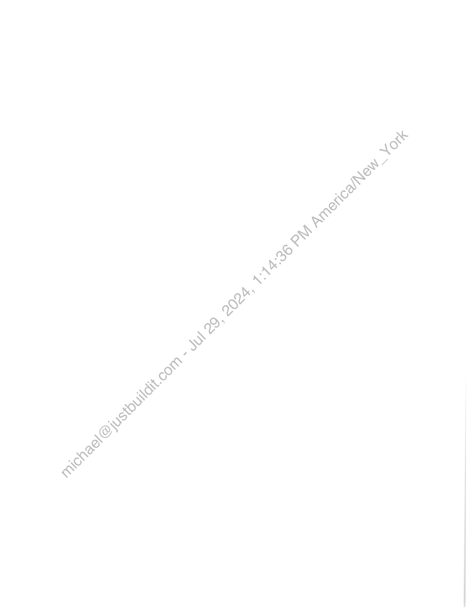

##### Markit Digital Addendum]

  
````col
```col-md
flexGrow=.5
===
> [!info] [Page 1](_attachments/images_PIMCO-3.6.1.9.3MarkitDigitalAddendum_fullysigned_09252017.pdf_205929/page_1.png)
> 
```  
```col-md
a IHS Markit  
Markit Digital Addendum  
BETWEEN  
1. Markit North America, Inc., a company incorporated in Delaware whose principal office is at 450
West 337 Street, 5" Floor, New York, NY 10001 (“Markit”) on behalf of itself and its affiliates; and  
2. Pacific Investment Management Company LLC, a company organized un ther laws-of Delaware, and
having its registered office at 650 Newport Center Drive, Newport Beach, CA (“Customer”).  
Reference is made to the Master Data Services Agreement signed by.and between Markit Group
Limited and Pacific Investment Management Company LLC dated September 16, 2005. This is an
addendum to the Agreement, however it constitutes a separateJagreement between Markit and
Customer for the services subscribed herein (the “Addendum”).The parties hereby agree that this
Addendum and the Services provided hereunder are subject :to the terms and conditions of the
Agreement (which, for purposes of this Addendum, includes the Managed Services Terms), all of which
shall be incorporated by reference into this Addendum. The parties to this Addendum hereby agree that,
for the purposes of this Addendum, the parties heretoyshall be deemed to be “Markit” and “Customer”
(as applicable) as such terms are used in the relevantsections of the Agreement. In case of any conflict
or inconsistency between the terms of the Agreement and the terms of this Addendum, the terms of
this Addendum shall prevail to the extent of ahy Such conflict or inconsistency. All capitalized terms used
but not defined in this Addendum shall have the meanings given to such terms in the relevant sections
of the Agreement. Customer  
Markit services will be documented in statements of work (“SOW”), signed by both parties and attached
hereto regarding tasks to besperformed and/or items to be delivered under this Addendum (the
“Services”). SOW shall be controlling with regard to the specifications for each project, fee amounts,
delivery dates, services to be performed, and the duration of each project. Otherwise, if the terms of
this Addendum and any-SOW conflict, the terms of the applicable SOW shall control to the extent of any
such conflict.  
The following.additional terms shall apply to the Services for the purposes of this Addendum, which, in
case of conflict, shall prevail over the Master Terms:  
1. Term. This Addendum shall be effective from September 25, 2017 (the “Effective Date”) and remain
in effect so long as the terms of any SOW are ongoing between Markit and Customer, or so long as
any SOW has not reached completion. In the event that this Addendum should lapse due to a
completion of services and all SOWs, the execution of an additional SOW by both parties shall
automatically reinstate this Agreement.  
2. Services.  
```
````
Notes:    
````col
```col-md
flexGrow=.5
===
> [!info] [Page 2](_attachments/images_PIMCO-3.6.1.9.3MarkitDigitalAddendum_fullysigned_09252017.pdf_205929/page_2.png)
> 
```  
```col-md
2.1. Markit shall provide the Services to and for the benefit of Customer and its PIMCO-branded
Affiliates in accordance with the applicable SOW, incorporated into this Addendum by reference.  
2.2. Subscriber shall provide Markit with reasonable cooperation as far as is necessary to facilitate
proper and prompt performance of the Services, including providing Markit with specific and
detailed information as identified in a SOW concerning Customer’s use of, and providing
reasonable access to, any applicable software and providing Markit with adequate accéss to
Customer’s personnel who have sufficient experience and expertise to assist Markit in the
provision of the Markit Services.  
Fees  
3.1. Customer shall pay to Markit the service fees as set forth in the applicable SOW(s). Unless
otherwise specified, all services shall be billed by Markit to Gustomer monthly in arrears.
Undisputed service fees shall be paid in United States dollars (unless the parties agree
otherwise), and are payable thirty (30) days after the date of the relevant invoice. Client shall,
promptly following discovery of a reason for dispute, provide written notice to Markit of any
dispute setting forth in reasonable detail the reason forsuch dispute  
. Content and third party software  
4.1 Subscriber will be responsible for licensing, payment and providing all data, software,
applications and/or platforms required enable Markit to provide the Services (such data, software,
applications and/or platforms as provided to perform the Services, the “Customer Provided
Software”).  
. Intellectual property.  
5.1 The parties agree thatthe HTML design of the web pages, other tools or deliverables, and PDF
reports, to the extent originated and prepared exclusively for Customer, and to the extent
copyrightable under copyright law, shall belong exclusively to Customer. The parties agree that
all right, title an@ interest in and to any other deliverables provided to Customer, including any
and all object and source code, CGI, XML formatting, computer system designs, documentation,
user interfaces, and all patent rights (including, without limitation, the exclusive right to make,
use and’sell), patent registrations and applications, trade secrets, contract and licensing rights,
andsmethodologies, shall be owned by Markit. Nothing herein shall be construed to grant
Customer any rights in or to any of the foregoing except as expressly set forth herein.  
5.2 The parties acknowledge that providing the Services may result in the development of new
software, in addition to Markits’ prior technology, which may be embodied in the Services
provided pursuant to this Agreement and/or the intellectual property underlying such solution.
The parties agree that such property shall belong to Markit exclusively except that a perpetual
license shall be granted to Customer to any such materials to the extent in any deliverables
provided to Customer. Markit will, and will procure that its Affiliates will, at the Customer's
request promptly do all reasonable acts and things and execute all documents and deeds which  
```
````
Notes:    
````col
```col-md
flexGrow=.5
===
> [!info] [Page 3](_attachments/images_PIMCO-3.6.1.9.3MarkitDigitalAddendum_fullysigned_09252017.pdf_205929/page_3.png)
> 
```  
```col-md
the Customer considers are necessary or desirable for giving full effect to the assignment
contained in paragraph 5.1.  
5.3 In the event Customer contributes any information, including (but not limited to) articles, text,
images, logos, icons, audio footage, video footage, models, research, data, know how,
technology, concepts, ideas, inventions or other content, documents, materials or property to
Markit to enable Markit to perform the Services (“Customer Content”), as between Markit and
Customer, Customer shall retain ownership of all such Customer Content and the_intellectual
Property in them or that may be derived from them exclusively for the life of such rights.  
5.4 Customer grants to Markit a non-exclusive, royalty-free, fully-paid, non-transferable, revocable,
limited license to use the Customer Content and the Intellectual Property’in them solely to the
extent required by Markit to provide the Services to Customer. Except as set out in this
paragraph 5.4, no license is granted by the Customer to Markit to‘use Customer's Intellectual
Property under this Addendum.  
. Governance  
6.1. Each party will notify the other of its point of contact for the purposes of communicating
decisions and resolving disputes concerning the provision of the Services under this Addendum.  
6.2. The points of contact will meet as often, atid as promptly as the parties decide is necessary to
discuss any information required, any decisions to be made and any disputes that have arisen
that need to be resolved that relate ‘to the Services performed under this Addendum.  
. Indemnity.  
7.1, Customer agrees to indemnify and hold harmless Markit (including for reasonable attorney
fees), against third party claims that Customer Content or Customer Provided Software that is
used in connection with the Services under the SOW breaches a third party’s intellectual
property, exceppto the extent caused by Markit’s or its representatives wilful, reckless or gross
negligence or willful misconduct, provided that Customer is promptly alerted to the existence of
any such\claim, Customer is provided with sole control over any such claim, and Markit
reasonably cooperates with Customer in the defense of any such claim.  
. [RESERVED]  
. Notices. Customer must send all ‘Notices’ to the following address at Markit or as may be notified by
Markit from time to time:  
Markit North America, Inc.  
450 West 33rd Street, 5th Floor
New York, NY 10001  
Attention: Legal Department  
```
````
Notes:    
````col
```col-md
flexGrow=.5
===
> [!info] [Page 4](_attachments/images_PIMCO-3.6.1.9.3MarkitDigitalAddendum_fullysigned_09252017.pdf_205929/page_4.png)
> 
```  
```col-md
Customer:  
Pacific Investment Management Company LLC
650 Newport Center Drive  
Newport Beach, CA 92660  
(Attn: General Counsel)  
SIGNED for and on behalf of SIGNED for and on behalf of  
Markit North America, Inc. by: Pacific Investment Management Company LLC by:
Signature Signature  
¥ BRAD MEpp> x SHhrelao  
Print Name Print Name  
xX MANAGING DieecTor.  
Title  
```
````
Notes:    
````col
```col-md
flexGrow=.5
===
> [!info] [Page 5](_attachments/images_PIMCO-3.6.1.9.3MarkitDigitalAddendum_fullysigned_09252017.pdf_205929/page_5.png)
> 
```  
```col-md
INFORMATION SHEET  
Contract Information  
ined hardcopy contract to the client  
Contact Details for return of countersi
Company Name  
Contact Name  
Contact Number  
Email address  
are provided to
Markit Finance. If only one original or an electronic original is returned to Markit then the client 56 emailed an electronic  
countersigned contract. EN
Please print, sign and return contract in duplicate to Markit Finance at: ~~
Markit North America, Inc. eo
450 West 33” St. 5" Floor ~)
New York, NY 10001 Q
Attention: Finance Department ©  
Service Delivery Information  
Received by
Finance  
[ ] Fedex
[ ] Post
[ ] Email  
Returned to client  
```
````
Notes:    
````col
```col-md
flexGrow=.5
===
> [!info] [Page 6](_attachments/images_PIMCO-3.6.1.9.3MarkitDigitalAddendum_fullysigned_09252017.pdf_205929/page_6.png)
> 
```  
```col-md  
```
````
Notes:  


![[_attachments/PIMCO-3.6.1.9.3 Markit Digital Addendum_fullysigned_09252017.pdf]