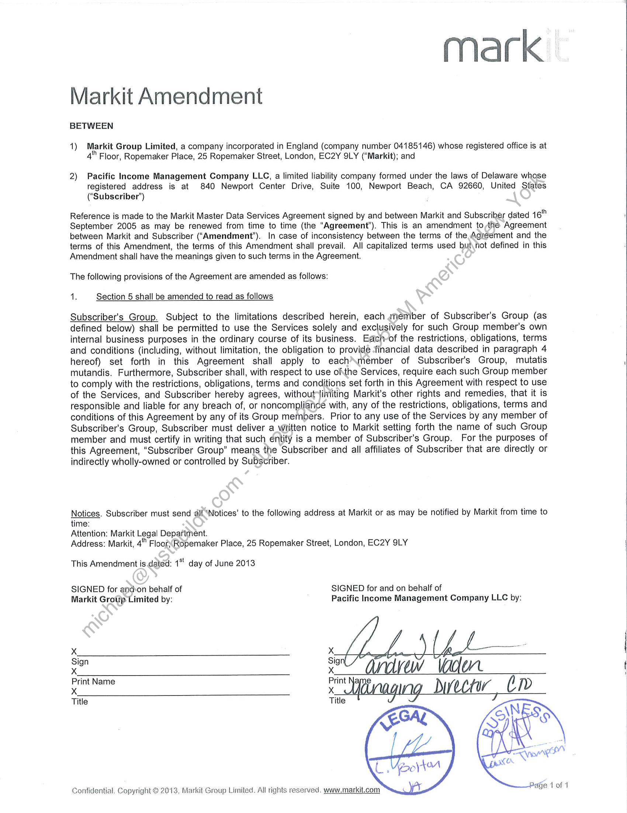
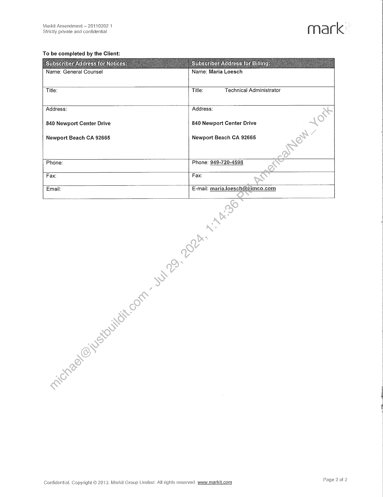
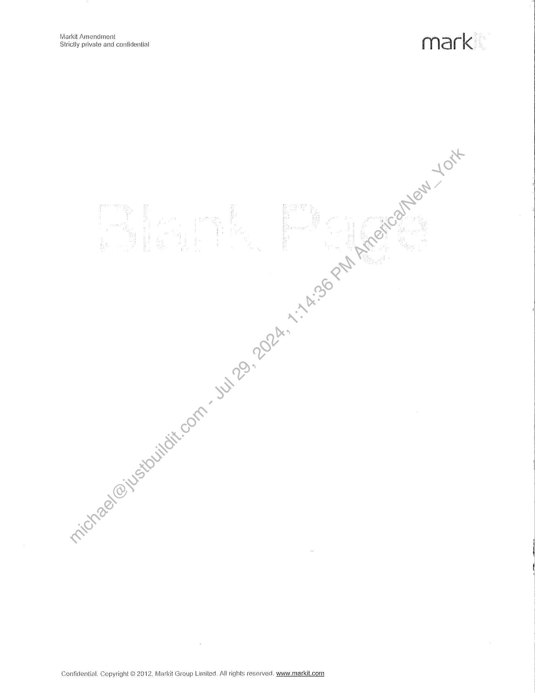
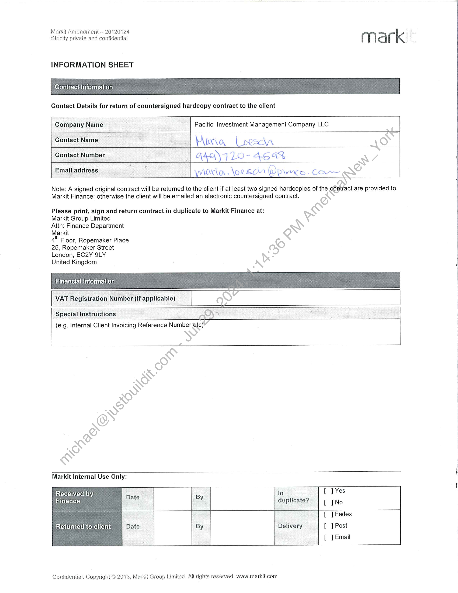

##### Markit Amendment]

  
````col
```col-md
flexGrow=.5
===
> [!info] [Page 1](_attachments/images_PIMCO-3.6.1.9.4PIMCOAmendtoMaster.pdf_210659/page_1.png)
> 
```  
```col-md
mark  
Markit Amendment  
BETWEEN  
1) Markit Group Limited, a company incorporated in England (company number 04185146) whose registered office is at
4" Floor, Ropemaker Place, 25 Ropemaker Street, London, EC2Y 9LY (“Markit); and  
2) Pacific Income Management Company LLC, a limited liability company formed under the laws of Delaware whose
registered address is at 840 Newport Center Drive, Suite 100, Newport Beach, CA 92660, United States
(‘Subscriber’)  
Reference is made to the Markit Master Data Services Agreement signed by and between Markit and Subscriber dated 16"
September 2005 as may be renewed from time to time (the “Agreement’). This is an amendment to,the Agreement
between Markit and Subscriber (“Amendment’). In case of inconsistency between the terms of the Agreement and the
terms of this Amendment, the terms of this Amendment shall prevail. All capitalized terms used but\not defined in this
Amendment shall have the meanings given to such terms in the Agreement.  
The following provisions of the Agreement are amended as follows:  
1. Section 5 shall be amended to read as follows  
Subscriber's Group. Subject to the limitations described herein, each anember of Subscriber's Group (as
defined below) shall be permitted to use the Services solely and exclusively for such Group member's own
internal business purposes in the ordinary course of its business. Each-of the restrictions, obligations, terms
and conditions (including, without limitation, the obligation to provide ‘financial data described in paragraph 4
hereof) set forth in this Agreement shall apply to each’\member of Subscriber's Group, mutatis
mutandis. Furthermore, Subscriber shall, with respect to use ofthe Services, require each such Group member
to comply with the restrictions, obligations, terms and conditions set forth in this Agreement with respect to use
of the Services, and Subscriber hereby agrees, without limiting Markit’s other rights and remedies, that it is
responsible and liable for any breach of, or noncompliance with, any of the restrictions, obligations, terms and
conditions of this Agreement by any of its Group members. Prior to any use of the Services by any member of
Subscriber's Group, Subscriber must deliver a written notice to Markit setting forth the name of such Group
member and must certify in writing that such éntity is a member of Subscriber's Group. For the purposes of
this Agreement, “Subscriber Group” means the Subscriber and all affiliates of Subscriber that are directly or
indirectly wholly-owned or controlled by Subscriber.  
Notices. Subscriber must send all ‘Notices’ to the following address at Markit or as may be notified by Markit from time to
time:  
Attention: Markit Legal Department.  
Address: Markit, 4" Floor; Ropemaker Place, 25 Ropemaker Street, London, EC2Y SLY  
This Amendment is dated: 1° day of June 2013  
SIGNED for andon behalf of SIGNED for and on behalf of
Markit Group Limited by: Pacific Income Management Company LLC by:
Xx X  
xe Gide aden.  
Print Name Print
Tile ey Divector, cP  
Confidential. Copyright © 2013, Markit Group Limited. All rights reserved. www.markit.com  
Ge 1ofd  
```
````
Notes:    
````col
```col-md
flexGrow=.5
===
> [!info] [Page 2](_attachments/images_PIMCO-3.6.1.9.4PIMCOAmendtoMaster.pdf_210659/page_2.png)
> 
```  
```col-md
Markii Amendment ~ 201102024 ue
Strictly private and confidential { | la rk  
To be completed by the Client:  
"Name: General Counsel Name: Maria Loesch | :  
Title: Title: Technical Administrator
Address: Address:  
840 Newport Center Drive 840 Newport Center Drive  
Newport Beach CA 92665 Newport Beach CA 92665  
Phone: Phone: 949-720-4598  
Fax: Fax:  
Email: E-mail: maria foesch@pimco.com  
Confidential. Copyright © 2013, Markit Group Limited. All rights reserved. www.markit.com  
```
````
Notes:    
````col
```col-md
flexGrow=.5
===
> [!info] [Page 3](_attachments/images_PIMCO-3.6.1.9.4PIMCOAmendtoMaster.pdf_210659/page_3.png)
> 
```  
```col-md
Markit Amendment
Strictly private and confidential  
Confidential. Copyright © 2012, Markit Group Limited. All rights reserved. www.markit.com  
mark  
```
````
Notes:    
````col
```col-md
flexGrow=.5
===
> [!info] [Page 4](_attachments/images_PIMCO-3.6.1.9.4PIMCOAmendtoMaster.pdf_210659/page_4.png)
> 
```  
```col-md
Markit Amendment ~ 20120124  
Strictly private and confidential { Y ld rk  
INFORMATION SHEET  
Contract information  
Contact Details for return of countersigned hardcopy contract to the client  
Company Name Pacific Investment Management Company LLC
Contact Name ai a Loe: ac  
Contact Number AAA) I 10 - AS a  
Emalladdress Wiaria. lors Wpwrs. car  
Note: A signed original contract will be returned to the client if at least two signed hardcopies of the contract are provided to
Markit Finance; otherwise the client will be emailed an electronic countersigned contract.  
Please print, sign and return contract in duplicate to Markit Finance at:
Markit Group Limited  
Attn: Finance Department  
Markit  
4h Floor, Ropemaker Place  
25, Ropemaker Street  
London, EC2Y 9LY  
United Kingdom  
Financial Information  
VAT Registration Number (If applicable) |  
Special Instructions mo  
(e.g. Internal Client Invoicing Reference Number etc)  
Markit Internal Use Only:  
Received by In [ ]Yes
Finance BEG BY duplicate? [ ] No
= [ ] Fedex
Returned to client Date By Delivery [ ] Post
[ ] Email  
Confidential. Copyright © 2013, Markit Group Limited. All rights reserved. www.markit.com  
```
````
Notes:  


![[_attachments/PIMCO-3.6.1.9.4 PIMCOAmendtoMaster.pdf]