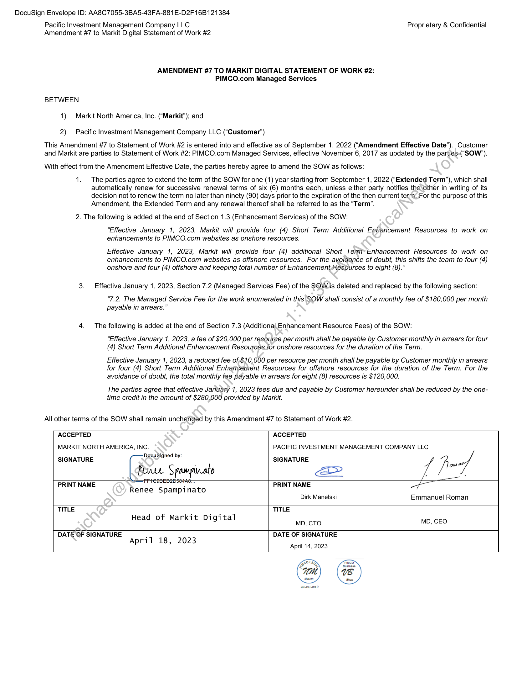

##### Amendment #7 to Markit Digital Statement of Work #2: PIMCO.com Managed Services]

  
````col
```col-md
flexGrow=.5
===
> [!info] [Page 1](_attachments/images_PIMCO-3.6.1.9.500160553.pdf_211035/page_1.png)
> 
```  
```col-md
DocuSign Envelope ID: AA8C7055-3BA5-43FA-881E-D2F 16B121384  
Pacific Investment Management Company LLC
Amendment #7 to Markit Digital Statement of Work #2  
Proprietary & Confidential  
AMENDMENT #7 TO MARKIT DIGITAL STATEMENT OF WORK #2:
PIMCO.com Managed Services  
BETWEEN  
1) Markit North America, Inc. (“Markit”); and  
2) Pacific Investment Management Company LLC (“Customer”)  
This Amendment #7 to Statement of Work #2 is entered into and effective as of September 1, 2022 (“Amendment Effective Date”).
and Markit are parties to Statement of Work #2: PIMCO.com Managed Services, effective November 6, 2017 as updated by the parties-(“SOW’).  
With effect from the Amendment Effective Date, the parties hereby agree to amend the SOW as follows:  
1. The parties agree to extend the term of the SOW for one (1) year starting from September 1, 2022 (“Extended Term’), which shall
automatically renew for successive renewal terms of six (6) months each, unless either party notifies the other in writing of its
decision not to renew the term no later than ninety (90) days prior to the expiration of the then current terra. For the purpose of this  
Amendment, the Extended Term and any renewal thereof shall be referred to as the “Term”.  
2. The following is added at the end of Section 1.3 (Enhancement Services) of the SOW:  
“Effective January 1, 2023, Markit will provide four (4) Short Term Additional Enhancement Resources to work on  
enhancements to PIMCO.com websites as onshore resources.  
Effective January 1, 2023, Markit will provide four (4) additional Short Terr Enhancement Resources to work on
enhancements to PIMCO.com websites as offshore resources. For the avoidance of doubt, this shifts the team to four (4)  
onshore and four (4) offshore and keeping total number of Enhancement Resources to eight (8).”  
3. Effective January 1, 2023, Section 7.2 (Managed Services Fee) of the SOW.is deleted and replaced by the following section:  
“7.2. The Managed Service Fee for the work enumerated in this SOW shall consist of a monthly fee of $180,000 per month  
payable in arrears.”  
4. The following is added at the end of Section 7.3 (Additional. Enhancement Resource Fees) of the SOW:  
“Effective January 1, 2023, a fee of $20,000 per resource per month shall be payable by Customer monthly in arrears for four  
(4) Short Term Additional Enhancement Resouregs jor onshore resources for the duration of the Term.  
Effective January 1, 2023, a reduced fee of $10,000 per resource per month shall be payable by Customer monthly in arrears
for four (4) Short Term Additional Enhancement Resources for offshore resources for the duration of the Term. For the  
avoidance of doubt, the total monthly fee payable in arrears for eight (8) resources is $120,000.  
The parties agree that effective January 1, 2023 fees due and payable by Customer hereunder shall be reduced by the one-  
time credit in the amount of $280,000 provided by Markit.  
All other terms of the SOW shall remain unchanged by this Amendment #7 to Statement of Work #2.  
ACCEPTED
MARKIT NORTH AMERICA, INC.  
ACCEPTED
PACIFIC INVESTMENT MANAGEMENT COMPANY LLC  
—Decusigned by:  
SIGNATURE SIGNATURE Vi 7ow
Ree Spampinato a> / /
PRINT NAME vs PRINT NAME
Renee Spampinato
Dirk Manelski Emmanuel Roman
TITLE TITLE
Head of Markit Digital Mp, cTo MD, CEO
DATE OF SIGNATURE . DATE OF SIGNATURE
April 18, 2023 ;
April 14, 2023  
Customer  
```
````
Notes:  


![[_attachments/PIMCO-3.6.1.9.5 00160553.pdf]