##### No title found]

  
````col
```col-md
flexGrow=.5
===
> [!info] [Page 1](_attachments/images_CommonWealthSecurities-3.6.1.10.1CommonwealthBankofAustralia-MarkITonDemand-MasterAgreement.pdf_212329/page_1.png)
> 
```  
```col-md
Master As-a-Service Agreement  
Commonwealth Bank of Australia  
Markit On Demand, Inc.  
Commonwealth Bank Group  
Legal Services  
Cammonwealth Bank,  
Level 8A, North Building, Commonwealth Bank Place
1 Harbour Street  
SYDNEY NSW 2000  
Australia  
Phone: +612 9118 5723  
Fax: +612 9118 5700
Ref: 3070572  
markit on demand master as-a-service agreement final  
```
````
Notes:    
````col
```col-md
flexGrow=.5
===
> [!info] [Page 2](_attachments/images_CommonWealthSecurities-3.6.1.10.1CommonwealthBankofAustralia-MarkITonDemand-MasterAgreement.pdf_212329/page_2.png)
> 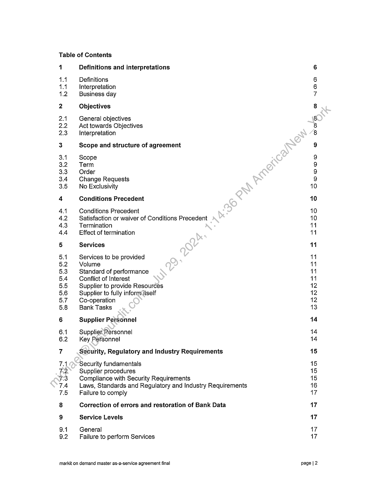
```  
```col-md
Table of Contents  
=  
Definitions and interpretations  
Definitions
Interpretation
Business day  
Objectives  
General objectives
Act towards Objectives
Interpretation  
Scope and structure of agreement  
Scope  
Term  
Order  
Change Requests
No Exclusivity  
Conditions Precedent  
Conditions Precedent  
Satisfaction or waiver of Conditions Precedent
Termination  
Effect of termination  
Services  
Services to be provided
Volume  
Standard of performance
Conflict of Interest  
Supplier to provide Resources
Supplier to fully inform{tself
Co-operation  
Bank Tasks  
Supplier Personnel  
Supplier Personnel
Key Personnel  
Security, Regulatory and Industry Requirements  
Security fundamentals  
Supplier procedures  
Compliance with Security Requirements  
Laws, Standards and Regulatory and Industry Requirements
Failure to comply  
Correction of errors and restoration of Bank Data
Service Levels  
General
Failure to perform Services  
markit on demand master as-a-service agreement final  
SCO OOOo © WOM Ww NOOO ao  
a =
o  
ao
3-00  
=
=  
moana soaan
ONNNSASAAS  
—_
h  
sos
AA  
—_
a  
ee ee Ce
NOON  
=> —
P|  
ao
NN  
page | 2  
```
````
Notes:    
````col
```col-md
flexGrow=.5
===
> [!info] [Page 3](_attachments/images_CommonWealthSecurities-3.6.1.10.1CommonwealthBankofAustralia-MarkITonDemand-MasterAgreement.pdf_212329/page_3.png)
> 
```  
```col-md
9.3
9.4
9.5  
10  
10.1
10.2
10.3  
1  
11.4
11.2
11.3  
12  
12.1
12.2
12.3
12.4
12.5  
13
14  
14.1
14.2
14.3  
15
16  
16.1
16.2
16.3
16.4
16.5
16.6
16.7
16.8  
17  
17.1
17.2  
18  
18.1
18.2
18.3
18.4
18.5
18.6  
19  
Service Credits
Monitoring
Service Level reports  
Training and knowledge transfer  
Training
Knowledge transfer to the Bank
Knowledge transfer to the Supplier  
Supplier Sites  
Supplier Sites
Access to Supplier Sites
Use of work space at the Supplier Sites  
Risk management  
The Supplier's risk management obligations
Quarterly review  
Risk reporting  
Specific requirements  
No limitation  
AMLI/CTF Personnel obligations
Governance  
Representatives
Meetings
Reporting  
Acceptance Tests
Fees and payment  
Fees  
Invoices  
Payment  
Fees inclusive  
Disputes as to.amounts payable
Rights of setoff  
Unused cracits  
Most Favoured Customer  
GST.and Taxes  
GST
Taxes generally  
Warranties  
General  
Services and Supplier Owned Deliverables Warranties
Intellectual property  
Moral rights  
Breach of Warranty  
Warranties separate  
Intellectual Property Rights  
markit on demand master as-a-service agreement final  
18
19
19  
20  
20
21
21  
21  
21
23
23  
23  
23
24
24
24
24  
25
25  
25
26
26  
27
29  
29
29
30
30
30
30
30
30  
31  
31
32  
32  
32
32
33
33
34
34  
35  
page | 3  
```
````
Notes:    
````col
```col-md
flexGrow=.5
===
> [!info] [Page 4](_attachments/images_CommonWealthSecurities-3.6.1.10.1CommonwealthBankofAustralia-MarkITonDemand-MasterAgreement.pdf_212329/page_4.png)
> 
```  
```col-md
19.1 Bank Owned Deliverables 35  
19.2 Licence by the Supplier 35
19.3 Bank Data 35
19.4 Open Source Software 36
19.5 Indemnity and litigation 36
19.6 Conduct of IPR Claims 37
20 Liability and indemnity 38
20.1 Supplier's liability 38
20.2 Indemnity 38
20.3 Bank’s liability 38
21 Termination 39
21.1 Rights to terminate 39
21.2 Regular or habitual breaches 39
21.3 Change in Control 39
21.4 Criminal conduct, fraud, disreputable acts 39
21.5 Termination by the Bank in part 40
21.6 Further Bank rights 40
21.7 Reimbursement of Fees 40
21.8 Delivery up 40
21.9 Transition Out 40
21.10 Consequences of termination 41
22 Confidentiality 41
22.1. Confidentiality 41
22.2 Exclusions 41
22.3 Permitted disclosures 42
22.4 Preventing disclosures 42
22.5 Return of Confidential Information 42
22.6 Remedies for breach 43
22.7 Supplier Employees 43
22.8 Confidentiality of Bank Data 43
23 Privacy 43
24 Dispute resolution 45
24.1 Meeting of Representatives 45
24.2 Escalation of Dispute 45
24,3 Legalproceedings 45
24.4 General 46
25 Insurance 46
291 General 46
25.2 Required Insurances 46
26 Assignment and subcontracting 47
26.1. Assignment by the Bank 47
26.2 Assignment by the Supplier 47
26.3 Subcontracting 47
27 Force Majeure 48  
markit on demand master as-a-service agreement final page | 4  
```
````
Notes:    
````col
```col-md
flexGrow=.5
===
> [!info] [Page 5](_attachments/images_CommonWealthSecurities-3.6.1.10.1CommonwealthBankofAustralia-MarkITonDemand-MasterAgreement.pdf_212329/page_5.png)
> 
```  
```col-md
28 Audit and inspection  
28.1 Audit rights  
28.2 Purposes  
28.3 Co-operation  
28.4 Supplier audits  
28.5 Regulator audits  
28.6 Discrepancies  
28.7 Costs of the audit  
28.8 Document maintenance and retention  
29 Occupational Health and Safety
30 Business Continuity
31 Costs, expenses and duties  
31.1 Costs and expenses
31.2 Duties  
32 General  
32.1 Precedence of documents
32.2 Construction  
32.3 Discretion in exercising rights
32.4 Notices  
32.5 Relationship of the parties
32.6 Governing law and jurisdiction
32.7 Prohibition and enforceability
32.8 Waivers  
32.9 Variation  
32.10 Cumulative rights  
32.11 Further assurances  
32.12 Entire agreement  
32.13 Survival  
32.14 Counterparts  
32.15 To the extent not excluded by law
32.16 Trust  
32.17 Severability  
32.18 Public statements  
Schedule 1 - Dictionary
Schedule.2.->,Femplate Order  
Schedule 3 - Confidentiality Deed
Schedule 4 - Change Request  
Schedule 5 - Executed Orders  
Schedule 6 - Form of Parent Guarantee
Schedule 7 - Bank Security Requirements
Schedule 8 - Not in use  
Schedule 9 - Supplier Sites  
markit on demand master as-a-service agreement final  
48  
48
49
49
50
50
50
50
50  
51
52
53  
53
53  
53  
53
54
54
54
55
55
55
55
56
56
56
56
56
56
56
57
57
57  
59
68
75
80
82
83
84
88
89  
page | 5  
```
````
Notes:    
````col
```col-md
flexGrow=.5
===
> [!info] [Page 6](_attachments/images_CommonWealthSecurities-3.6.1.10.1CommonwealthBankofAustralia-MarkITonDemand-MasterAgreement.pdf_212329/page_6.png)
> 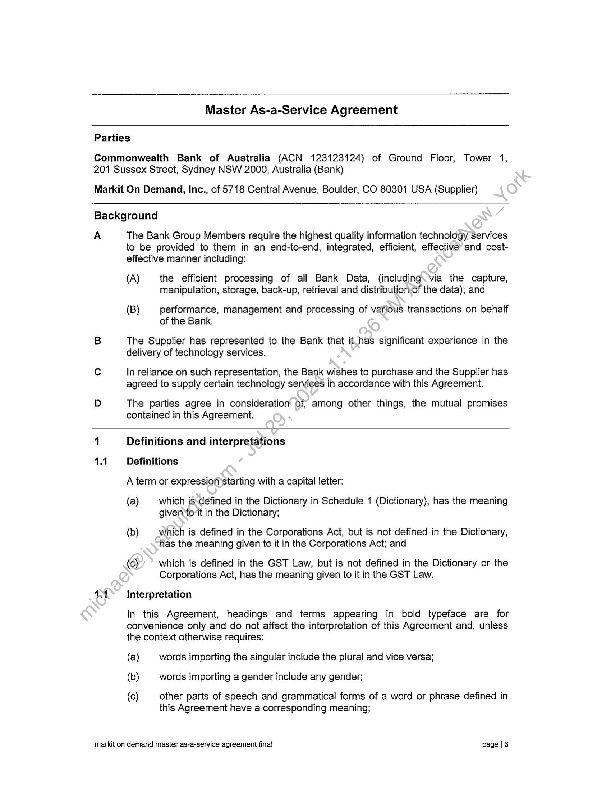
```  
```col-md
Master As-a-Service Agreement  
Parties  
Commonwealth Bank of Australia (ACN 123123124) of Ground Floor, Tower 1,
201 Sussex Street, Sydney NSW 2000, Australia (Bank)  
Markit On Demand, Inc., of 5718 Central Avenue, Boulder, CO 80301 USA (Supplier)  
Background  
A The Bank Group Members require the highest quality information technology Services
to be provided to them in an end-to-end, integrated, efficient, effective’ and costeffective manner including:  
(A) the efficient processing of all Bank Data, (including. via the capture,
manipulation, storage, back-up, retrieval and distributionof the data); and  
(B) performance, management and processing of various transactions on behalf
of the Bank.  
B The Supplier has represented to the Bank that it.has significant experience in the
delivery of technology services.  
Cc In reliance on such representation, the Bank wishes to purchase and the Supplier has
agreed to supply certain technology services in accordance with this Agreement.  
D The parties agree in consideration’ of among other things, the mutual promises
contained in this Agreement.  
1 Definitions and interpretations  
1.1 Definitions
A term or expression starting with a capital letter:  
(a) which isdefined in the Dictionary in Schedule 1 (Dictionary), has the meaning
givento-it in the Dictionary;  
(b) whith is defined in the Corporations Act, but is not defined in the Dictionary,
fas the meaning given to it in the Corporations Act; and  
(cy which is defined in the GST Law, but is not defined in the Dictionary or the
Corporations Act, has the meaning given to it in the GST Law.  
11 interpretation  
In this Agreement, headings and terms appearing in bold typeface are for
convenience only and do not affect the interpretation of this Agreement and, unless
the context otherwise requires:  
(a) words importing the singular include the plural and vice versa;
(b) words importing a gender include any gender;  
(c) other parts of speech and grammatical forms of a word or phrase defined in
this Agreement have a corresponding meaning;  
markit on demand master as-a-service agreement final page | 6  
```
````
Notes:    
````col
```col-md
flexGrow=.5
===
> [!info] [Page 7](_attachments/images_CommonWealthSecurities-3.6.1.10.1CommonwealthBankofAustralia-MarkITonDemand-MasterAgreement.pdf_212329/page_7.png)
> 
```  
```col-md
(d)  
(e)  
(9)  
(h)  
(i)  
()  
(k)  
()  
(n)  
(0)  
(p)  
(q)  
an expression importing a natural person includes any company, partnership,
joint venture, association, corporation or other body corporate and any
Government Agency;  
a reference to any thing (including any right) includes a part of that thing but
nothing in this paragraph (e) implies that performance of part of an obligation
constitutes performance of the obligation;  
subject to paragraph (g), a reference to a clause, party, annexure, attachment,
exhibit or Schedule is a reference to a clause of, and a party, annexure,
exhibit and Schedule to, this Agreement;  
a reference in a Schedule to a clause or paragraph, annexure, attachment,
exhibit or Schedule is a reference to a clause or paragraph of, nd an
annexure, attachment, exhibit and Schedule to, that Schedule;  
a reference in a Schedule to a clause “of the Agreement” is a Teference to a
clause of this Agreement excluding the Schedules;  
a reference to this Agreement includes any annexure, exhibit or Schedule and
any Order;  
a reference to a statute, regulation, proclamation, ordinance or by law includes
all statutes, regulations, proclamations, ordinances or by laws amending,
consolidating or replacing it, whether passed by the same or another
Government Agency with legal power to.do’so, and a reference to a statute
includes all regulations, proclamations, ordinances and by laws issued under
that statute;  
a reference to a document includes all amendments or supplements to, or
replacements or novations of, that document;  
a reference to a party (o-a document includes that party’s successors and
permitted assigns;  
the terms "including", "for example", "such as" and similar terms do not imply
any limitations;  
a reference to software or code includes all computer programs and code
(including. -source code, object code, assembly code and scripts) and
associated documentation;  
except to the extent that any provision expressly states otherwise, if this
Agreement requires a party to perform an obligation by a certain date, the
party will not be in breach of this Agreement if it performs that obligation by
11.59 pm on that date;  
a reference to the Bank includes a reference to any other Bank Group
Member; and  
no provision of this Agreement will be construed adversely to a party solely on
the ground that the party was responsible for the preparation of that provision.  
1.2 Business day  
Where the day on or by which any thing is to be done is not a Business Day, that
thing must be done on or by the next Business Day.  
markit on demand master as-a-service agreement final page | 7  
```
````
Notes:    
````col
```col-md
flexGrow=.5
===
> [!info] [Page 8](_attachments/images_CommonWealthSecurities-3.6.1.10.1CommonwealthBankofAustralia-MarkITonDemand-MasterAgreement.pdf_212329/page_8.png)
> 
```  
```col-md
2 Objectives  
2.1 General objectives  
The objectives of this Agreement are to:  
(a) enable the Bank to achieve “technology and operational excellence" in ondemand information technology services;  
(b) provide the Bank with access to world class on-demand services in a costeffective manner;  
(c) teduce the complexity of the Bank's systems and to increase automation;  
(d) provide highly scalable, resilient, auditable, highly stable, on-demand solutions
that are easy to Use, maintain, support and develop;  
(e) establish, and to put in place a framework for the continued.development of,
an open and co-operative relationship between the Supplierarid the Bank;  
(f) encourage the Supplier and Bank Personnel to work together to identify,
understand and deal with the Bank's business opportunities and barriers as
they arise;  
(g) allow the Supplier to understand the business needs of the Bank;  
(h) enhance the Bank's information technology and telecommunications risk
profile, including by way of the provisionof improved service delivery;  
(i) position the Bank to expand its market access, in line with its distribution
strategy from time to time, including its online strategies; and  
(0) improve over time the quality, value and benefits of the on-demand Services
provided to the Bank.  
(the Objectives).  
2.2. Act towards Objectives  
(a) Unless thecparties otherwise agree, the parties agree to act to develop the
relationship and act otherwise in a manner which is reasonable and consistent
with the Objectives.  
{b) The parties also agree that whenever any matter for agreement, dispute or  
other issue (an Issue) arises which is not provided for expressly in this
Agreement, they will work together to resolve that Issue to give maximum
effect to the Objectives.  
2.3.0) interpretation  
(a)  
In interpreting and construing this Agreement, reference may be made,
without limitation, to the Objectives:  
(i) in determining the Bank's objectives and the Supplier's intentions in
entering into this Agreement; and  
(ii) as an aid to the dispute resolution procedures set out in this
Agreement.  
markit on demand master as-a-service agreement final page [8  
```
````
Notes:    
````col
```col-md
flexGrow=.5
===
> [!info] [Page 9](_attachments/images_CommonWealthSecurities-3.6.1.10.1CommonwealthBankofAustralia-MarkITonDemand-MasterAgreement.pdf_212329/page_9.png)
> 
```  
```col-md
(b) The Objectives are not intended to alter the plain meaning of the specific
terms and conditions of this Agreement.  
3.2  
3.3  
3.4  
Scope and structure of agreement
Scope  
This Agreement sets out the terms on which the Supplier has agreed to supply
Services to the Bank.  
Term  
This Agreement commences on the Commencement Date and continues until\itis
terminated in accordance with clause 21 (the Term).  
Order  
(a) Where the Bank requires the Supplier to provide Services,-the provision of
those Services will be evidenced by an Order executed\by the parties in
accordance with the terms of this Agreement, and whichrwill specify:  
(i) the date on which the Order commences; ‘its ‘term and any renewal
options;  
(ii) the Services to be provided by the Supplier; and
(iii) | the Fees to be payable by the Bank:  
(b) All Orders duly executed by the parties will form Annexures to Schedule 5
(Executed Orders) of this Agreement.  
(c) As at the date of this Agreement, the Orders completed and annexed to this
Agreement have been duly, executed by the parties in accordance with this
clause.  
Change Requests  
(a) If either party requires a change to any Order, that party must issue a Change
Request in respect of each change:  
(i) tothe other party's Commercial Representative ;
(ii) in the form outlined as part of Schedule 4 (Change Request); and
Cit) in accordance with this clause 3.4.  
(b) In order for a Change Request to be effected, it must be duly executed by both
parties.  
(c) Promptly after receipt of a Change Request, both party’s Commercial
Representatives, and where applicable the party's Operational
Representatives, must meet to discuss the proposed change, and within
10 Business Days the party which has received the Change Request must
advise the other party whether the change is accepted or rejected.  
(d) In the event that the Change Request is accepted by the party which received
it, the Change Request must then be executed by both parties without undue
delay and will come into effect on and from the date of execution or otherwise
as agreed between the parties.  
markit on demand master as-a-service agreement final page | 9  
```
````
Notes:    
````col
```col-md
flexGrow=.5
===
> [!info] [Page 10](_attachments/images_CommonWealthSecurities-3.6.1.10.1CommonwealthBankofAustralia-MarkITonDemand-MasterAgreement.pdf_212329/page_10.png)
> 
```  
```col-md
3.5  
4.2  
(e) In the event that the Change Request is rejected by the party which received
it, either party may escalate the Change Request to the Executives detailed in
the relevant Order to which the Change Request relates. If a Change Request
is so escalated, then the Executives will meet as often as required and
negotiate in good faith towards agreement with respect to the Change
Request. If agreement has not been reached within 20 Business Days of the
initial escalation, then the parties may follow the procedure in clause 24.  
(f) The parties agree that they will not exercise the ability to propose Change
Requests arbitrarily or capriciously in recognition that both parties are
committed to the Agreement.  
No Exclusivity  
(a) The Supplier acknowledges that it is not, nor will it be, the exclusive Supplier to
the Bank of the kinds of goods and services contemplated by this Agreement
and that the Bank may, at any time and from time to time, perform, provide or
engage a third party to perform or provide, the whole of any part of the
Services, or any similar services, without the consent‘of or notice to the
Supplier.  
(b) Nothing in this Agreement requires the Bank:  
(i) to purchase, or offer to purchase, goods-or services from the Supplier
or to use or exploit goods or services,supplied by the Supplier; or  
(ii) to place orders for Services, ofto guarantee a minimum spend in any
period during the term of the Agreement.  
(c) Nothing in this clause 3.5 relievés the Bank of any obligation under an Order.  
Conditions Precedent
Conditions Precedent  
The obligations of eachvparty under this Agreement do not come into force until
satisfaction by the Supplier, or waiver by the Bank, on or before the relevant Cut Off
Date, of the following)Conditions Precedent:  
(a) receipPby the Bank of certificates of currency of the insurance policies referred
to in clause 25;  
(b) receipt by the Bank of a parent guarantee duly executed by the Supplier
Parent, which duplicates, in form and substance the draft Deed of Guarantee;
and  
(ce) receipt by the Bank of a legal opinion from an appropriately qualified lawyer
certifying that the parent guarantee was properly executed by a duly
authorised officer of the Supplier Parent in a form and in substance
reasonably satisfactory to the Bank.  
Satisfaction or waiver of Conditions Precedent  
(a) The Supplier must use its best endeavours to satisfy the Conditions Precedent
on or before the relevant Cut Off Date.  
(b) The Supplier must promptly notify the Bank if it discovers that any Condition
Precedent is not satisfied or becomes incapable of being satisfied.  
markit on demand master as-a-service agreement final page | 10  
```
````
Notes:    
````col
```col-md
flexGrow=.5
===
> [!info] [Page 11](_attachments/images_CommonWealthSecurities-3.6.1.10.1CommonwealthBankofAustralia-MarkITonDemand-MasterAgreement.pdf_212329/page_11.png)
> 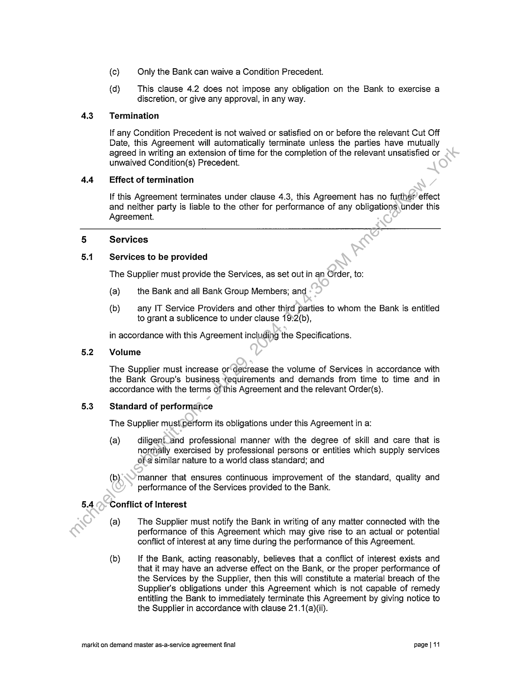
```  
```col-md
4.3  
4.4  
(c) Only the Bank can waive a Condition Precedent.  
(d) This clause 4.2 does not impose any obligation on the Bank to exercise a
discretion, or give any approval, in any way.  
Termination  
lf any Condition Precedent is not waived or satisfied on or before the relevant Cut Off
Date, this Agreement will automatically terminate unless the parties have mutually
agreed in writing an extension of time for the completion of the relevant unsatisfied or
unwaived Condition(s) Precedent.  
Effect of termination  
If this Agreement terminates under clause 4.3, this Agreement has no further effect
and neither party is liable to the other for performance of any obligations under this
Agreement.  
5.2  
5.3  
5.4  
Services  
Services to be provided  
The Supplier must provide the Services, as set out in an Order, to:
(a) the Bank and all Bank Group Members; and  
(b) any IT Service Providers and other third parties to whom the Bank is entitled
to grant a sublicence to under clause 19:2(b),  
in accordance with this Agreement including the Specifications.
Volume  
The Supplier must increase or'decrease the volume of Services in accordance with
the Bank Group’s business tequirements and demands from time to time and in
accordance with the terms of this Agreement and the relevant Order(s).  
Standard of performance
The Supplier must perform its obligations under this Agreement in a:  
{a) diligentland professional manner with the degree of skill and care that is
normally exercised by professional persons or entities which supply services
ofa similar nature to a world class standard; and  
(b). manner that ensures continuous improvement of the standard, quality and
performance of the Services provided to the Bank.  
Conflict of Interest  
(a) The Supplier must notify the Bank in writing of any matter connected with the
performance of this Agreement which may give rise to an actual or potential
conflict of interest at any time during the performance of this Agreement.  
(b) If the Bank, acting reasonably, believes that a conflict of interest exists and
that it may have an adverse effect on the Bank, or the proper performance of
the Services by the Supplier, then this will constitute a material breach of the
Supplier's obligations under this Agreement which is not capable of remedy
entitling the Bank to immediately terminate this Agreement by giving notice to
the Supplier in accordance with clause 21.1({a)(ii).  
markit on demand master as-a-service agreement final page | 11  
```
````
Notes:    
````col
```col-md
flexGrow=.5
===
> [!info] [Page 12](_attachments/images_CommonWealthSecurities-3.6.1.10.1CommonwealthBankofAustralia-MarkITonDemand-MasterAgreement.pdf_212329/page_12.png)
> 
```  
```col-md
5.5 Supplier to provide Resources  
The Supplier must at all times maintain sufficient Resources to fulfil its obligations
under this Agreement.  
5.6 Supplier to fully inform itself  
(a) The Supplier must satisfy itself as to the correctness and sufficiency of any
information provided or identified by the Bank in relation to this Agreement
(the Bank Information).  
(b) The Bank will not be responsible for, and the Supplier will not be entitled-to
any increase in Fees as a result of, any inaccuracy or insufficiency of the Bank
Information, except to the extent caused by the fraud of any Bank employee.  
5.7 Co-operation
(a) The Supplier must:  
(i) when performing its obligations under this Agreement co-operate with
the IT Service Providers and the Bank’s other suppliers;  
(ii) ensure that any Bank Tasks required to bé performed by the Bank or
any IT Service Provider are expressly specified in the relevant Order;  
(iii) provide all assistance reasonably requested by the Bank, an IT Service
Provider, or any other Bank supplier, including by:  
(A) providing such access as may be necessary to the Supplier
Sites and Resources being provided, managed or operated by
the Supplier in the provision of the Services;  
(B) providing such access, and copies, as may be necessary of
Bank Data/in’such format as the Bank reasonably requires;  
(C) providing necessary information, documentation and
instructions for the Services (including for quality assurance and
development and performance acceptance testing) to enable
goods or services to interface, or be integrated, with the
Services, or be operated by the Supplier;  
¢«b) providing assistance and support services to permit such Bank
Group Members, IT Service Providers and other Bank suppliers
to acquire the knowledge necessary efficiently to provide,
receive or operate goods or services;  
(E) participating in training and other familiarisation processes to
permit the Supplier to obtain the knowledge necessary to
receive or operate goods or services provided by such Bank
Group Members, IT Service Providers or other Bank suppliers;
and  
(F) providing access to individual Supplier Personnel, upon the
giving of reasonable notice by the Bank; and  
(iv) give the Bank and the IT Service Providers access to architectural or
design information and related data {including any _ interface
specifications and data models) in respect of any software to the extent  
markit on demand master as-a-service agreement final page | 12  
```
````
Notes:    
````col
```col-md
flexGrow=.5
===
> [!info] [Page 13](_attachments/images_CommonWealthSecurities-3.6.1.10.1CommonwealthBankofAustralia-MarkITonDemand-MasterAgreement.pdf_212329/page_13.png)
> 
```  
```col-md
5.8  
(b)  
necessary to enable the Bank or a Bank Group Member to exercise the
rights granted to it under this Agreement.  
if requested by the Bank, the Supplier must ensure the Services interface with
or can be incorporated into the Bank Systems and comply with the Bank or an
IT Service Provider's network integration requirements (as the case may be)
as provided to the Supplier from time to time.  
Bank Tasks  
(a)  
(b)  
(c)  
(a)  
(e)  
Notwithstanding any other provision of this Agreement, the Bank has no
obligation to perform any Bank Tasks however, remains accountable for the
performance of the Bank Tasks in accordance with this clause 5.8.  
Subject to paragraph (e):  
(i) the Bank agrees that if it does not perform or procure the performance
of a Bank Task the Supplier may be unable tocomply with its
obligations under this Agreement which are dependent on the Bank
Task having been performed; and  
(ii) if the Supplier demonstrates to the reasonable satisfaction of the Bank
that the Supplier is unable to comply with an obligation under this
Agreement which is dependent on a BankoTask being performed:  
(A) the Supplier will not be liable“for its failure to comply with that
obligation; and  
(B) where the obligationis.a timeframe required to be met under
this Agreement, the Bank agrees to adjust that timeframe and
any dependanf timeframe by such period as is reasonable in
the circumstances to reflect the delay.  
The Supplier must promptly notify the Bank of any failure by the Bank to
perform or procurexthe performance of the Bank Task (and, in any event,
within 5 Business Days of becoming aware of such failure) and provide to the
Bank:  
(i) such information as the Supplier has or has access to in relation to the
failure to comply with its obligations under this Agreement; and  
(ii) such information as the Bank may reasonably request in relation to that
failure to comply with its obligations under this Agreement,  
So as to assist the Bank to assess whether such failure was caused by the
non-performance of that Bank Task.  
Where an event of the type specified in paragraph (b) occurs, the Supplier
must use all reasonable endeavours, including by applying additional
Resources, to minimise the impact and duration of any delay caused, or likely
to be caused, as a result of the occurrence of that event.  
Paragraph (b) does not apply:  
(i) to the extent that any failure by the Supplier to comply with its
obligations under this Agreement, or an act or omission of the Supplier,
caused or contributed to the non-performance of the relevant Bank
Task;  
markit on demand master as-a-service agreement fina! page | #3  
```
````
Notes:    
````col
```col-md
flexGrow=.5
===
> [!info] [Page 14](_attachments/images_CommonWealthSecurities-3.6.1.10.1CommonwealthBankofAustralia-MarkITonDemand-MasterAgreement.pdf_212329/page_14.png)
> 
```  
```col-md
(f)  
(ii) to the extent that the Supplier could have avoided its failure to comply
by the taking of reasonable precautions or the use of reasonable
workarounds using existing resources; or  
(iii) | where the Supplier has failed to provide a notice to the Bank as
required by paragraph (c).  
The Supplier has no other rights or remedies in relation to the nonperformance of a Bank Task.  
6.2  
Supplier Personnel  
Supplier Personne!  
(a)  
(b)  
(c)  
(a)  
The Supplier must ensure the Supplier Personnel have appropriate skills,
training and background to perform the Services.  
Where, in the Bank's reasonable opinion, the Supplier Rersonnel are not
performing the Services in an acceptable manner the Supplier must take all
reasonably appropriate steps to remedy the problem within 5 Business Days
following notification from the Bank. If the Bank«is not satisfied with such
remedial steps, the Bank may by giving notice‘to the Supplier, require the
Supplier to replace the relevant Supplier Personnel within a time frame
acceptable to the Bank, but in no event later than 30 calendar days from the
date of such notice.  
The Supplier must ensure that all ‘Supplier Personnel comply with all
reasonable instructions and requirements of the Bank or an IT Service
Provider while on the premises-of the Bank Group or the IT Service Provider
or accessing the Bank Systems>-Bank software or the Bank's network.  
The Supplier must ensure-that its Personnel comply with all of the terms and
conditions of this Agreement, and the Supplier will be liable to the Bank for the
acts, omissions, defaults and negligence of the Supplier Personnel as if they
were the acts, omissions, defaults or negligence of the Supplier.  
Key Personnel  
(a)  
(b)  
()  
()  
(e)  
The Supplier must ensure that any Key Personnel perform and complete the
Services.in accordance with the terms of this Agreement.  
The-Supplier must use its best endeavours to ensure that Key Personnel
devote, to the extent necessary as determined by the Bank, substantially their
full time and effort to the provision of the Services to the Bank.  
Subject to paragraphs (b) and (f), the Supplier must not transfer or reassign
any Key Personnel until a suitable replacement is nominated by the Supplier
and approved by the Bank.  
Before replacing Key Personnel, the Supplier must notify the Bank of the
proposed replacement, introduce the individual to appropriate Bank
representatives, and provide the Bank with a resume and other information
about the individual reasonably requested by the Bank.  
Any replacement Key Personnel! to be provided by the Supplier under this
Agreement must:  
(i) have at least the equivalent skills, experience and qualifications as the
teplaced Key Personnel;  
markit on demand master as-a-service agreement final page | 14  
```
````
Notes:    
````col
```col-md
flexGrow=.5
===
> [!info] [Page 15](_attachments/images_CommonWealthSecurities-3.6.1.10.1CommonwealthBankofAustralia-MarkITonDemand-MasterAgreement.pdf_212329/page_15.png)
> 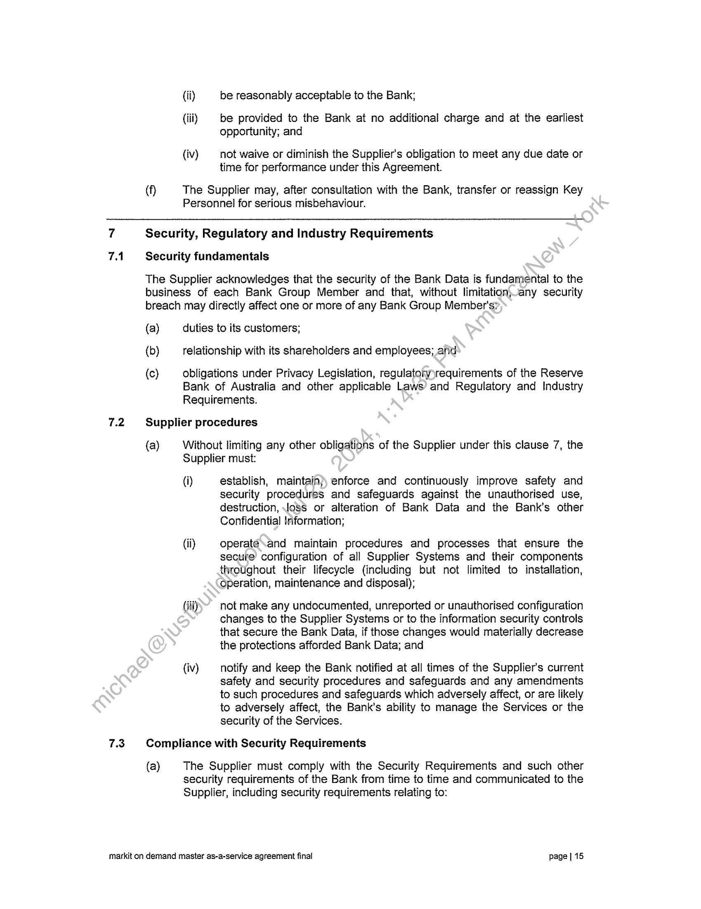
```  
```col-md
(f)  
(ii)
(iti)  
(iv)  
be reasonably acceptable to the Bank;  
be provided to the Bank at no additional charge and at the earliest
opportunity; and  
not waive or diminish the Supplier's obligation to meet any due date or
time for performance under this Agreement.  
The Supplier may, after consultation with the Bank, transfer or reassign Key
Personnel for serious misbehaviour.  
7.2  
7.3  
Security, Regulatory and Industry Requirements  
Security fundamentals  
The Supplier acknowledges that the security of the Bank Data is fundamental to the
business of each Bank Group Member and that, without limitationjany security
breach may directly affect one or more of any Bank Group Member's:  
(a)
(b)
(c)  
duties to its customers;  
relationship with its shareholders and employees; and  
obligations under Privacy Legislation, regulatohyyrequirements of the Reserve
Bank of Australia and other applicable Laws’ and Regulatory and Industry
Requirements.  
Supplier procedures  
(a)  
Without limiting any other obligations of the Supplier under this clause 7, the
Supplier must:  
(i)  
(ii)  
(iii)  
(iv)  
establish, maintain), enforce and continuously improve safety and
security procedures and safeguards against the unauthorised use,
destruction, Joss or alteration of Bank Data and the Bank’s other
Confidential Information;  
Operate sand maintain procedures and processes that ensure the
secure configuration of all Supplier Systems and their components
throughout their lifecycle (including but not limited to installation,
Operation, maintenance and disposal);  
not make any undocumented, unreported or unauthorised configuration
changes to the Supplier Systems or to the information security controls
that secure the Bank Data, if those changes would materially decrease
the protections afforded Bank Data; and  
notify and keep the Bank notified at all times of the Supplier's current
safety and security procedures and safeguards and any amendments
to such procedures and safeguards which adversely affect, or are likely
to adversely affect, the Bank’s ability to manage the Services or the
security of the Services.  
Compliance with Security Requirements  
(a)  
The Supplier must comply with the Security Requirements and such other
security requirements of the Bank from time to time and communicated to the
Supplier, including security requirements relating to:  
markit on demand master as-a-service agreement final page [| 15  
```
````
Notes:    
````col
```col-md
flexGrow=.5
===
> [!info] [Page 16](_attachments/images_CommonWealthSecurities-3.6.1.10.1CommonwealthBankofAustralia-MarkITonDemand-MasterAgreement.pdf_212329/page_16.png)
> 
```  
```col-md
7.4  
(i) access to, and use of, any data, information systems or facilities
provided by the Bank, an IT Service Provider or a third party; and  
(ii) the confidentiality or integrity of the Bank Data or the availability or
security of the Services.  
If the Supplier becomes aware of an actual, alleged or suspected breach of
the Security Requirements or other security requirements in force from time to
time, or becomes aware of an act or omission relating to the security of the
Bank Data and/or Services which impacts the confidentiality or integrity of the
Bank Data or the availability or security of the Services, (together a Security
Breach) it must immediately:  
(i) notify the Bank of the Security Breach;
(ii) identify the cause of the Security Breach;
(iii) rectify any actual Security Breach and its consequences;  
(iv) | ensure that any potential Security Breach does nof become an actual
Security Breach;  
(v) investigate any alleged or suspected Secutity Breach; and either:  
(A) — implement rectification measures if an actual Security Breach
occurred or a Security Breachiis likely to occur; or  
(B) confirm to the Bank that\no actual Security Breach occurred or
is likely to occur;  
(vi) provide the Bank with a'réport detailing the cause of, and procedure for
correcting, the Security Breach;  
(vii) provide the Bank)with reasonable evidence that the Security Breach
will not occur again; and  
(viii) certify thatthe Supplier has taken all commercially reasonable steps to
preventany recurrence of such Security Breach.  
Laws, Standards‘and Regulatory and Industry Requirements  
In order to allow the Bank to comply with all relevant Laws, Standards and Regulatory
and Industry, Requirements, the Supplier must, in the provision of the Services:  
(a)  
(b)  
(c)  
comply with all Industry Standards notified to the Supplier or that should be
known to the Supplier;  
comply with all:  
(i) Bank Policies notified to the Supplier or that should be known to the
Supplier; and  
(ii) Laws, Standards and Regulatory and Industry Requirements relating to
Services and the performance of its obligations under this Agreement;
and  
obtain and maintain any licences, authorisations, consents, approvals and
permits required by applicable Laws, Standards and Regulatory and industry
Requirements to provide the Services and to perform its obligations under this
Agreement.  
markit on demand master as-a-service agreement final page | 16  
```
````
Notes:    
````col
```col-md
flexGrow=.5
===
> [!info] [Page 17](_attachments/images_CommonWealthSecurities-3.6.1.10.1CommonwealthBankofAustralia-MarkITonDemand-MasterAgreement.pdf_212329/page_17.png)
> 
```  
```col-md
7.5  
Failure to comply  
(a)  
(b)  
The Supplier must notify the Bank of any actual, alleged or suspected breach
of, the Bank Policies, Laws and Regulatory and Industry Requirements
immediately after the Supplier has become aware of the actual, alleged or
suspected breach (as the case may be).  
Upon notification under paragraph (a), the Supplier must immediately:
(i) rectify any actual breach; and
(ii) investigate any alleged or suspected breach; and:  
(A) implement rectification measures if an actual breacti has
occurred or a breach is likely to occur; or  
(B) confirm to the Bank that no actual breach has o¢ourred or is
likely to occur.  
Correction of errors and restoration of Bank Data  
(a)  
(a)  
(b)  
Without limiting the Supplier's obligations under this-Agreement, the Supplier
must promptly correct any inaccuracies or omissions in any Bank Data caused
by the Supplier, and restore (including from, back-up tapes) any corrupt or
wrongfully deleted Bank Data, in accordance’ with the Bank's directions.  
Where the Supplier fails to comply with paragraph (a), the Bank may correct
any such inaccuracies or omissions*in any Bank Data, and/or restore
(including from back-up tapes) any corrupt or wrongfully deleted Bank Data at
the Supplier's cost.  
The Supplier must provide-to the Bank:  
(i) such information as the Supplier has or has access to in relation to any
such inaccuracies, omissions, corruptions or wrongful deletions;  
(i) such information as the Bank may reasonably request in relation to
such inaccuracies, omissions, corruptions or wrongful deletions;  
(ii) inforrnation in relation to the adequacy and effectiveness of the
Supplier's current controls; and  
(ii) a detailed outline of the remediation plans and controls, which the
Supplier will put in place to ensure that such inaccuracies, omissions,
corruptions or wrongful deletions of Bank Data caused by the Supplier
will not occur again.  
9.2  
Service Levels  
General  
The Supplier must provide the Services in accordance with the Service Levels.  
Failure to perform Services  
(a)  
If:
(i) the Supplier fails to meet any Service Level;  
(ii) there is a Priority 1 Defect or Priority 2 Defect; or  
markit on demand master as-a-service agreement final page | 17  
```
````
Notes:    
````col
```col-md
flexGrow=.5
===
> [!info] [Page 18](_attachments/images_CommonWealthSecurities-3.6.1.10.1CommonwealthBankofAustralia-MarkITonDemand-MasterAgreement.pdf_212329/page_18.png)
> 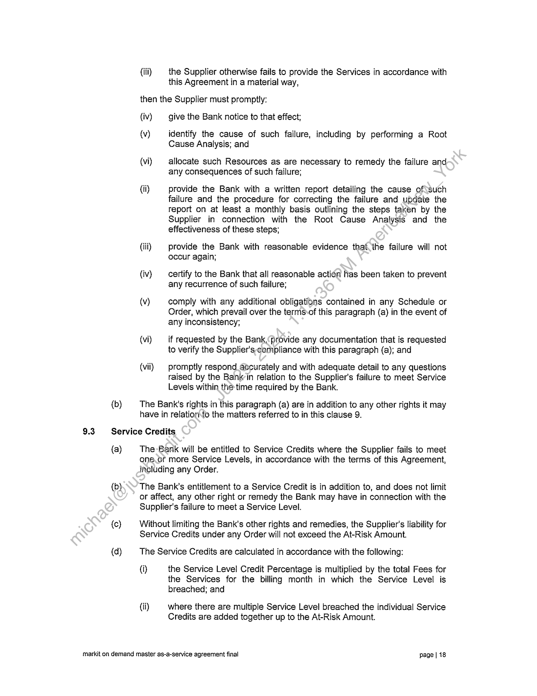
```  
```col-md
(b)  
(iii) | the Supplier otherwise fails to provide the Services in accordance with
this Agreement in a material way,  
then the Supplier must promptly:
(iv) give the Bank notice to that effect;  
(v) identify the cause of such failure, including by performing a Root
Cause Analysis; and  
(vi) allocate such Resources as are necessary to remedy the failure and
any consequences of such failure;  
(ii) provide the Bank with a written report detailing the cause of\such
failure and the procedure for correcting the failure and update the
teport on at least a monthly basis outlining the steps taken by the
Supplier in connection with the Root Cause Analysis and the
effectiveness of these steps;  
(iii) provide the Bank with reasonable evidence that the failure will not
occur again;  
(iv) certify to the Bank that all reasonable action has been taken to prevent
any recurrence of such failure;  
(v) comply with any additional obligations contained in any Schedule or
Order, which prevail over the termsvof this paragraph (a) in the event of
any inconsistency;  
(vi) if requested by the Bank, provide any documentation that is requested
to verify the Supplier's-compliance with this paragraph (a); and  
(vii) promptly respond_aecurately and with adequate detail to any questions
raised by the Bankin relation to the Supplier's failure to meet Service
Levels within the time required by the Bank.  
The Bank's rights in this paragraph (a) are in addition to any other rights it may
have in relationto the matters referred to in this clause 9.  
9.3. Service Credits  
(a)  
(b}  
(c)  
(d)  
The Bank will be entitled to Service Credits where the Supplier fails to meet
one.or more Service Levels, in accordance with the terms of this Agreement,
including any Order.  
The Bank’s entitlement to a Service Credit is in addition to, and does not limit
or affect, any other right or remedy the Bank may have in connection with the
Supplier's failure to meet a Service Level.  
Without limiting the Bank's other rights and remedies, the Supplier's liability for
Service Credits under any Order will not exceed the At-Risk Amount.  
The Service Credits are calculated in accordance with the following:  
(i) the Service Level Credit Percentage is multiplied by the total Fees for
the Services for the billing month in which the Service Level is
breached; and  
(ii) where there are multiple Service Level breached the individual Service
Credits are added together up to the At-Risk Amount.  
markit on demand master as-a-service agreement final page | 18  
```
````
Notes:    
````col
```col-md
flexGrow=.5
===
> [!info] [Page 19](_attachments/images_CommonWealthSecurities-3.6.1.10.1CommonwealthBankofAustralia-MarkITonDemand-MasterAgreement.pdf_212329/page_19.png)
> 
```  
```col-md
9.4  
9.5  
(e)  
Service Credits will be applied to the monthly invoice for the Services provided
under the relevant Order, in accordance with clause 16.2(c).  
Monitoring  
(a)  
(b)  
(c)  
(d)  
(e)  
The Supplier must implement appropriate procedures and automated
measurement, monitoring and management tools to enable it to:  
i) detect and prevent any failure to provide any of the Services or meet
the Service Levels; and  
(ii) notify and report to the Bank in accordance with this clause 9.  
The Supplier must in addition to its obligations under the relevant Order{s)“at
all times provide the Bank with:  
(i) for any tools used to provide the Services:
(A) online access;
(B) all standard data feeds; and  
(C) _ if requested by the Bank, a data extract of all Bank Data used
or stored by the tools; and  
(ii) if requested by the Bank, an up to-date copy of all the Bank Data
produced or stored by such tools,  
to enable the Bank to access the same-data and information that is available
to the Supplier.  
The Supplier must provide the\Bank on request with information concerning,
and access to, such data and measurement, monitoring and management
tools for audit and inspection purposes.  
The Supplier must conduct regular risk assessments in relation to the Service
Levels and the Supplier's compliance with the Service Levels and deliver a
comprehensive Service Level risk register to the Bank upon written request.  
The Suppliefrnust not charge the Bank any run time, or other charges for the
operation of or access to any such data or measurement, monitoring and
management tools or standard data feeds or copies including when the
Supplier is required to separate Bank Data from other Supplier client-specific
data:  
Service Level reports  
(a)  
(b)  
With each invoice contemplated by clause 16.1(d), the Supplier must include a
Service Level report for each Order for the relevant month in a form
acceptable to the Bank.  
As part of the report, the Supplier must in relation to the relevant month:  
(i) certify the extent to which the relevant Service Levels are and are not
being met;  
(ii) certify the applicable Service Credits payable for each of the Services
in accordance with the relevant Service Levels;  
(iti) include any other information referred to in the relevant Order; and  
markit on demand master as-a-service agreement final page] 19  
```
````
Notes:    
````col
```col-md
flexGrow=.5
===
> [!info] [Page 20](_attachments/images_CommonWealthSecurities-3.6.1.10.1CommonwealthBankofAustralia-MarkITonDemand-MasterAgreement.pdf_212329/page_20.png)
> 
```  
```col-md
(d)  
(iv) include any other information requested by the Bank from time to time.
Unless otherwise agreed, all reports must contain a level of detail sufficient to:
(i) verify the Supplier's compliance with the Service Levels; and  
(ii) verify the calculation of Service Credits payable.  
lf at any stage it is discovered that the Supplier has under-paid the amount of
Service Credits payable, then the Supplier will promptly pay the Service
Credits owing.  
10 Training and knowledge transfer  
10.1 Training  
(a)  
(b)  
(c)  
(d)  
The Supplier must provide training services to the Bank under this Agreement
in accordance with a Training Plan developed in accordance‘with this clause
10.1,  
Following commencement of each Order, the Supplier, iin consultation with the
Bank, must design a draft Training Plan in respect.ofthat Order which must:  
(i) be based on the training requirements, ifany, specified by the Bank;  
(ii) describe in detail the training services and training materials to be
provided by the Supplier;  
(iii) describe a training program. that will provide sufficient training for the
Bank’s Personnel who atfend to deliver the outcomes required by the
Bank; and  
(iv) require the Suppliépto provide the Bank with training materials in the
quantity and formatreasonably specified by the Bank (if any).  
The Supplier must submit a copy of the draft Training Plan to the Bank for its
approval by the timeframes set out in this Agreement, or if no such timeframes
are specified;.then at least 10 Business Days prior to the scheduled
commencenient of training.  
If the Bank approves the draft Training Plan, it will become the Training Plan
for the.purposes of that Order.  
ifthe Bank does not approve the draft Training Plan, the Supplier must
promptly make any amendments to the draft Training Plan that are:  
(i) required in order for the draft Training Plan to comply with paragraph
(b); or  
(ii) otherwise reasonable in the circumstances,  
and resubmit a revised draft Training Plan to the Bank for its approval, in
which case paragraph (d) and, if relevant, this paragraph (e) will apply again.  
The Supplier must ensure that the process described in this clause 10.1 is
completed within the timeframes set out in this Agreement, or if no such
timeframes are specified, then prior to the scheduled commencement of
training.  
markit on demand master as-a-service agreement final page | 20  
```
````
Notes:    
````col
```col-md
flexGrow=.5
===
> [!info] [Page 21](_attachments/images_CommonWealthSecurities-3.6.1.10.1CommonwealthBankofAustralia-MarkITonDemand-MasterAgreement.pdf_212329/page_21.png)
> 
```  
```col-md
10.2 Knowledge transfer to the Bank  
The Supplier acknowledges the importance to the Bank Group of knowledge transfer
to the Bank’s Personnel. For the purpose of maximising knowledge transfer the
Supplier must provide comprehensive knowledge transfer Services, including by:  
(a)
(b)  
(c)  
(d)  
(e)  
(9)  
transferring knowledge from the Supplier to the Bank;  
developing or capturing (as may be required) and retaining, the Knowledge
Management Materials in both electronic and hard copy formats;  
promptly updating the Knowledge Management Materials to ensure the
Knowledge Management Materials remain current and accurate at all times
throughout the Term;  
ensuring version control of all electronic and hard copy versions of the
Knowledge Management Materials;  
upon request, providing the Bank with access to the Knowledge Management
Materials at all times throughout the Term;  
upon termination or expiry of this Agreement or therelevant Order, and at any
other time requested by the Bank, providing ‘the Bank with a complete
electronic and hard-copy version of the Knowledge Management Materials;
and  
providing any other or additional knowledge transfer Services required by the
Bank as set out in this Agreement.  
10.3. Knowledge transfer to the Supplier  
(a)  
(b)  
(c)  
The Supplier must actively patticipate in any knowledge transfer, training and
other familiarisation processes to the extent, and otherwise in the manner and
format, required by the Bank from time to time to facilitate the transfer to the
Supplier of knowledge yelevant to the Services.  
Without limiting this clause 10, specific knowledge transfer, training and other
familiarisation‘orocesses may also be set out in an Order.  
The Bank ‘is under no obligation to conduct any such knowledge transfer,
training-or other familiarisation processes. However, the conduct of any such
knowlédge transfer, training or familiarisation processes by the Bank neither:  
{i) relieves the Supplier of any of its obligations under this Agreement; nor  
(ii) acts as a waiver of any of the Bank's rights or remedies under this
Agreement.  
4 Supplier Sites  
11.1. Supplier Sites  
(a)  
The Supplier must supply the specific Services from the address of each
specific Supplier Site listed in Schedule 9 (Supplier Sites) as relevant to each
individual Service, subject to the Supplier providing the Bank with a Risk
Assessment and Mitigation Plan prior to the Bank approving any locations as
Supplier Sites.  
markit on demand master as-a-service agreement final page j 21  
```
````
Notes:    
````col
```col-md
flexGrow=.5
===
> [!info] [Page 22](_attachments/images_CommonWealthSecurities-3.6.1.10.1CommonwealthBankofAustralia-MarkITonDemand-MasterAgreement.pdf_212329/page_22.png)
> 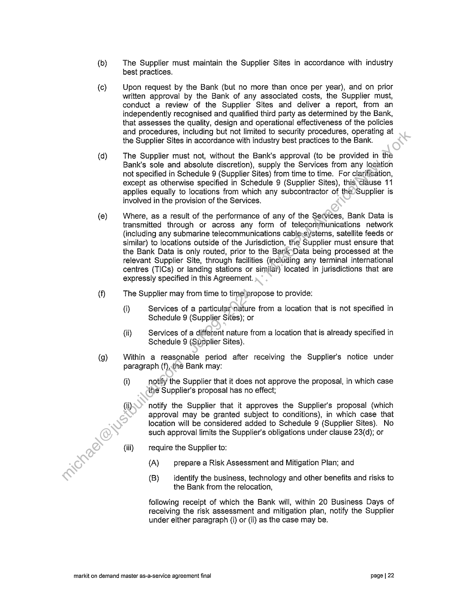
```  
```col-md
(c)  
(d)  
(e)  
(9)  
The Supplier must maintain the Supplier Sites in accordance with industry
best practices.  
Upon request by the Bank (but no more than once per year), and on prior
written approval by the Bank of any associated costs, the Supplier must,
conduct a review of the Supplier Sites and deliver a report, from an
independently recognised and qualified third party as determined by the Bank,
that assesses the quality, design and operational effectiveness of the policies
and procedures, including but not limited to security procedures, operating at
the Supplier Sites in accordance with industry best practices to the Bank.  
The Supplier must not, without the Bank’s approval (to be provided in the
Bank's sole and absolute discretion), supply the Services from any location
not specified in Schedule 9 (Supplier Sites) from time to time. For clarification,
except as otherwise specified in Schedule 9 (Supplier Sites), this clause 11
applies equally to locations from which any subcontractor of the Supplier is
involved in the provision of the Services.  
Where, as a result of the performance of any of the Services, Bank Data is
transmitted through or across any form of telecommunications network
(including any submarine telecommunications cable:systems, satellite feeds or
similar) to locations outside of the Jurisdiction, the Supplier must ensure that
the Bank Data is only routed, prior to the Bank Data being processed at the
relevant Supplier Site, through facilities (including any terminal international
centres (TICs) or landing stations or similaf) located in jurisdictions that are
expressly specified in this Agreement.  
The Supplier may from time to time propose to provide:  
(i) Services of a particularnature from a location that is not specified in
Schedule 9 (Supplier Sites); or  
(ii) Services of a different nature from a location that is already specified in
Schedule 9 (Supplier Sites).  
Within a reasonable period after receiving the Supplier's notice under
paragraph (f),<he Bank may:  
(i) notify the Supplier that it does not approve the proposal, in which case
the Supplier's proposal has no effect;  
(ii) notify the Supplier that it approves the Supplier's proposal (which
approval may be granted subject to conditions), in which case that
location will be considered added to Schedule 9 (Supplier Sites). No
such approval limits the Supplier's obligations under clause 23(d); or  
(iii) require the Supplier to:
(A) prepare a Risk Assessment and Mitigation Plan; and  
(B) identify the business, technology and other benefits and risks to
the Bank from the relocation,  
following receipt of which the Bank will, within 20 Business Days of
receiving the risk assessment and mitigation plan, notify the Supplier
under either paragraph (i) or (ii) as the case may be.  
markit on demand master as-a-service agreement final page | 22  
```
````
Notes:    
````col
```col-md
flexGrow=.5
===
> [!info] [Page 23](_attachments/images_CommonWealthSecurities-3.6.1.10.1CommonwealthBankofAustralia-MarkITonDemand-MasterAgreement.pdf_212329/page_23.png)
> 
```  
```col-md
11.2  
(h) lf no notice is received from the Bank within a reasonable period after
receiving notice from the Supplier, the Bank will be deemed not to have
approved the Supplier’s proposal.  
Access to Supplier Sites  
Subject to the Bank and its nominated third parties agreeing to the Supplier's
reasonable confidentiality undertakings and security requirements, the Supplier must
provide the Bank and its nominated third parties with (or procure for the Bank and its
nominated third parties) timely and full access to the Supplier Sites as the Bank
reasonably requires from time to time. The Bank will provide such notice as_is
reasonably practicable in the circumstances where it requests access under this
clause 11.2.  
Use of work space at the Supplier Sites  
The Supplier must provide the Bank with (or procure for the Bank):.use of, and an
appropriate amount of work space at, any Supplier Site if reasonably required by the
Bank.  
12
12.1  
Risk management
The Supplier’s risk management obligations  
The Supplier must, in a manner that is consistentwith the nature and scope of the
Services, and in accordance with:  
(a) any relevant Bank Policies and Standards; and
(b) industry best practices for risk matiagement  
(the Risk Standards), establish, and use auditable, repeatable and integrated
processes approved by the Bank to effectively identify, manage and report Risks,
including by:  
(c) identifying any Risks, and analysing the likelihood and impact of such Risks
occurring;  
(d) implementing appropriate Risk Controls;
(e) proactively monitoring Risk Controls;  
(f) continuously monitoring and reviewing Risks to allow for changes in factors
affecting Risks and to ensure that the Risk Controls remain up-to-date and
effective; and  
(9) unless the Bank agrees otherwise in writing, maintaining a register of Risks
that enables Risks to be viewed, categorised and reported to the Bank (Risk
Register). Each Risk Register must be kept up-to-date at all times and must
include:  
(i) a detailed description of each Risk;  
(ii) a categorisation of each Risk as determined reasonably by the
Supplier;  
(iii) the likelihood and impact of each Risk occurring; and  
markit on demand master as-a-service agreement final page | 23  
```
````
Notes:    
````col
```col-md
flexGrow=.5
===
> [!info] [Page 24](_attachments/images_CommonWealthSecurities-3.6.1.10.1CommonwealthBankofAustralia-MarkITonDemand-MasterAgreement.pdf_212329/page_24.png)
> 
```  
```col-md
12.2  
12.3  
(iv) the Risk Controls which must be put in place by the Supplier to mitigate
each Risk as described in paragraph (d), and the associated
timeframes and implementation status for those Risk Controls.  
Quarterly review
The Supplier will:  
(a) remain abreast of global developments in Risks relevant to the security of the
Services (including associated infrastructure) including any emerging Risks;
and  
(b) meet with the Bank upon request, to:
(i) discuss any emerging Risks;  
(ii) notify Risks known to it, or identified by it, to the extent not previously
notified to the Bank;  
(iii) discuss and agree upon any emerging Risks which’ pose a sufficient
threat; and  
(iv) discuss and agree upon strategies and/or processes for dealing with
such emerging Risks.  
Risk reporting  
The Supplier must, upon written request, report to the Bank on:
(a) all then current Risks under this Agreement;  
(b  
(c  
the extent to which such Risks)are recorded in the relevant Risk Register; and  
the effectiveness of Risk-Controls in terms of mitigating such Risks.
Specific requirements  
Each Order may specify additional requirements relating to Risks (such as, for
example, specific reporting obligations).  
No limitation  
The identification of Risks by the Supplier in accordance with this clause 12 (including
the identification of Risks that may be affected by the acts or omissions of the Bank,
other Bank Group Members or IT Service Providers) will not limit the Supplier's other
obligations under this Agreement.  
markit on demand master as-a-service agreement final page | 24  
```
````
Notes:    
````col
```col-md
flexGrow=.5
===
> [!info] [Page 25](_attachments/images_CommonWealthSecurities-3.6.1.10.1CommonwealthBankofAustralia-MarkITonDemand-MasterAgreement.pdf_212329/page_25.png)
> 
```  
```col-md
13
(a)  
(b)  
(c)  
AMLICTF Personnel obligations  
Supplier must perform appropriate due diligence on all Supplier Personnel, by putting
in place a Personnel Due Diligence Program which:  
(i) includes appropriate risk based systems and controls for screening prospective
Supplier Personnel against money laundering or terrorism financing risk (for
example identification checks, reference checks, criminal history checks etc);  
(iif) establishes and maintains a system to manage any Supplier Personnel that
fails, without reasonable excuse, fo comply with any system, control~or
procedure established under the Personnel Due Diligence Program.  
The Supplier must comply with its Personnel Due Diligence Program, and, upon
request by the Bank, acknowledge such compliance.  
The Bank may audit or inspect any issue or matter relating tothe Supplier's
compliance with its Personnel Due Diligence Program, and the Supplier must provide
all reasonable assistance and information to the Bank in the conduct of those audits
or inspections.  
14
14.1  
Governance
Representatives  
(a) Both parties must appoint a Commercial Representative to fulfil that party's
obligations in relation to Change Requests, governance, Disputes, and to
execute any agreed upon variations to this Agreement or an Order.  
(b) As at the Commencement Date, the Commercial Representatives for this
Agreement are:  
{i) For the Bank:  
Name: Joe Edwin  
Position: General Manager, EML and Private Bank IT
Address: Level 4c, 1 Harbour St, Sydney NSW 2000
Phone: +61 405 450 461  
Facsimile:  
Email: joseph.edwin@cba.com.au  
(ii) For the Supplier:
Name: Meredith Chavel
Position: Director, Business Development  
Address: 5718 Central Avenue
Boulder, CO 80301 USA  
Phone: +1 303 583 6357
Facsimile: +1 303 444 2586  
Email: meredith.chavel@markit.com  
markit on demand master as-a-service agreement final page | 25  
```
````
Notes:    
````col
```col-md
flexGrow=.5
===
> [!info] [Page 26](_attachments/images_CommonWealthSecurities-3.6.1.10.1CommonwealthBankofAustralia-MarkITonDemand-MasterAgreement.pdf_212329/page_26.png)
> 
```  
```col-md
(c) The Supplier:  
(i) may consult with Bank Personnel with regard to their business
requirements;  
(ii) must, unless otherwise directed by the Bank Commercial
Representative, ensure that this Agreement is used to govern any
future software, hardware or services to be provided by the Supplier;  
(iii) will not take instructions or directions from Bank Personnel with respect
to variations to this Agreement; and  
(iv) must only take instructions from the Bank Commercial Representative
with respect to variations to this Agreement.  
(d) Prior to execution of any Order, both parties must additionally,appoint an
Operational Representative to make day-to-day decisions fegarding the
operational and technical aspects of that Order. For the avoidance of doubt,
the parties' Operational Representatives are not authorised to make decisions
that vary their respective party's obligation or rights undepthis Agreement.  
(e) Either party may replace its Commercial Representative or Operational
Representative by giving notice to the other party.  
14.2 Meetings  
The parties must ensure that their respective’Commercial Representatives and
Operational Representatives (or delegates with appropriate authority):  
(a) meet (at the Bank’s premises-in Sydney or other premises agreed by the
parties) as necessary to discussthis Agreement, including:  
(i) the updating of ahy)documents or processes which form part of the
Bank's Policies;  
(ii) the progress Of performance of any Services;  
(iii) | any othérissue of concern or interest to either party;  
(iv) proposed solutions for addressing issues of concern; and
(v) issues relating to technical coordination; and  
(b) work to resolve any issues of concern, before applying the dispute resolution
procedures set out in clause 24, but in no case will this provision prevent or
delay any party from invoking such procedures in accordance with their terms.  
14.3 oReporting  
(a) At least once a month or otherwise less frequently as required by the Bank,
each Supplier's Operational Representative must submit to the appropriate
Bank Operational Representative a progress report, including:  
(i) whether any part of Documentation requires review and/or updating
and the proposed process for such review and/or updating;  
(ii) in addition to any Service Level reports required under clause 9.5,
Service Level compliance;  
markit on demand master as-a-service agreement final page | 26  
```
````
Notes:    
````col
```col-md
flexGrow=.5
===
> [!info] [Page 27](_attachments/images_CommonWealthSecurities-3.6.1.10.1CommonwealthBankofAustralia-MarkITonDemand-MasterAgreement.pdf_212329/page_27.png)
> 
```  
```col-md
(b)  
(iit)  
(iv)  
(ix)
(x)  
whether any part of the Business Continuity Plan requires review
and/or updating and the proposed process for such review and/or
updating;  
detailed progress reports (indicated the nature of the work completed
and the work yet to be completed) regarding the progress of any:  
(A) design work;  
(B) development work (including development work on new
features or fixes for existing code);  
(C) testing work;
(D) integration work; and
(E) _ training services,  
against any key dates detailed in an executed Order or otherwise
agreed between the parties;  
a summary of past Services provided, and a forecast of future Services
to be provided;  
any delays or defaults and reasons for-such delays and defaults;  
plans for managing any risks (including foreseeable delays and
breaches) to the Services and plans for managing those risks;  
details of outstanding issues: specifying the nature of each issue, the
current status of each issuevand who has responsibility for resolution of
each issue;  
a list of material risks and their current status; and  
detail regarding-any other matter related to the Services as requested
by the Bank.  
The Supplier Commercial Representative must report immediately to the Bank
Commercial! Representative on any existing or anticipated factors which may
have a significant effect on the performance of the Supplier's obligations under
this Agreement.  
15 Acceptance Tests  
(a)  
If the relevant Order requires the Supplier to prepare an Acceptance Test  
Plan:  
(i)  
(ii)  
(iti  
the Supplier must prepare and deliver an Acceptance Test Plan to the
Bank for its approval no later than 60 calendar days prior to the
relevant scheduled Service commencement date;  
the Bank will review such Acceptance Test Plan within a reasonable
time of receipt and notify the Supplier of whether or not it approves of
such plan;  
if the Bank does not approve the relevant Acceptance Test Plan, it will
notify the Supplier of this decision and the Supplier must vary the plan
in the manner reasonably directed by the Bank and resubmit the plan
to the Bank for approval;  
markit on demand master as-a-service agreement final page | 27  
```
````
Notes:    
````col
```col-md
flexGrow=.5
===
> [!info] [Page 28](_attachments/images_CommonWealthSecurities-3.6.1.10.1CommonwealthBankofAustralia-MarkITonDemand-MasterAgreement.pdf_212329/page_28.png)
> 
```  
```col-md
(iv) if the Bank does not approve the Acceptance Test Plan (acting
reasonably) on two or more occasions, then this will constitute a
material breach of the Supplier's obligations under this Agreement
which is not capable of remedy entitling the Bank to immediately
terminate this Agreement by giving notice to the Supplier in
accordance with clause 21.1(a)(ii); and  
(v) if the Bank approves the relevant Acceptance Test Plan, the Bank may
conduct Acceptance Tests for that Service in accordance with the
Acceptance Test Plan.  
(b) The Supplier must provide all assistance reasonably requested by the Bank in
relation to the Acceptance Tests.  
(c) If a Service passes its Acceptance Tests, the Bank will notify the Supplier that
the Bank accepts that Service (an Acceptance Certificate).  
(d) If a Service fails to pass its Acceptance Tests, the Bank may by giving notice
to the Supplier reject that Service, in which case:  
(i) the Supplier must within 14 calendar days\or such longer period
agreed by the Bank), at the Supplier's cost, rectify the Defects that
caused the Service to fail the Acceptance Tests and resubmit it to the
Bank for the Acceptance Tests; and  
(ii) the Acceptance Tests must be\repeated in accordance with this
clause 15,  
unless the Bank issues a notice,with respect to that Service in accordance
with paragraph (f).  
(e) If the Bank rejects any-Service two or more times in accordance with
paragraph (d), then this) will constitute a material breach of the Supplier's
obligations under this. Agreement which is not capable of remedy entitling the
Bank to immediately:  
(i) this Agreement by giving notice to the Supplier in accordance with
clause\21.1(a)(ii); and  
(ii) claim from the Supplier reasonable losses or damage suffered by the
Bank Group, including:  
(A) any costs and expenses reasonably incurred by the Bank as a
result of the Service containing any one or more Defects
(including the costs of contractors required to be retained to
assist the Bank in re-testing the Service); and  
(B) the value of any time reasonably spent by Bank Personnel in
assisting the Supplier to identify and correct any one or more
Defects in the Service; and  
(f) If the Bank agrees to issue an Acceptance Certificate for a Service which
contains Defects:  
(i) the Supplier must correct those Defects as soon as reasonably
possible, and in any event at a date no later than that agreed by the
Bank.  
markit on demand master as-a-service agreement final page | 28  
```
````
Notes:    
````col
```col-md
flexGrow=.5
===
> [!info] [Page 29](_attachments/images_CommonWealthSecurities-3.6.1.10.1CommonwealthBankofAustralia-MarkITonDemand-MasterAgreement.pdf_212329/page_29.png)
> 
```  
```col-md
16
16.1  
(9)  
(ii) if there is a payment linked to the Bank issuing an Acceptance
Certificate, that payment will not be payable until any material Defects
are corrected.  
The issuing by the Bank of an Acceptance Certificate does not relieve the
Supplier of its responsibility or liability in relation to the Service being tested,
and in particular does not relieve the Supplier of its obligation to ensure that
the Service complies with the relevant warranties and with this Agreement.  
Fees and payment  
Fees
(a) In consideration of the Supplier providing the Services, the Bank must pay the  
Supplier the Fees in accordance with this clause 16.  
(b) Unless otherwise agreed between the parties, all Fees are ‘stated in U.S.
dollars and are exclusive of GST.  
(c) Fees are payable monthly in arrears.  
(d) For the avoidance of doubt and without limitation, except as expressly set out
in this Agreement, the Bank is not required to pay any:  
(i) any out-of-pocket expenses; or  
(ii) any amount under this Agreement for services provided or costs
incurred by the Supplier prior to entry into this Agreement.  
Invoices  
(a) When a payment is due in.accordance with this Agreement, the Supplier must
provide a correctly rendered invoice to the Bank.  
(b) An invoice is correctly rendered if:  
(i) the amount claimed in the invoice is due for payment;  
(ii) the inyoice contains a detailed breakdown of the Fees and is
accompanied (where necessary) by relevant documentation
demonstrating that the amount specified in the invoice is calculated in
accordance with this Agreement;  
{iit the invoice is addressed to the Bank and identifies this Agreement;  
(iv) the invoice identifies (where applicable) the time periods to which the
amount payable relates;  
(v) the invoice identifies all information necessary for the Bank to be able
to transfer any required funds by way of electronic transfer;  
(vi) it is accompanied by such other information as is reasonably requested
in advance by the Bank; and  
(vil) itis a valid Tax Invoice.  
(c) In the event that Service Credits become payable by the Supplier in  
accordance with this Agreement (including the relevant Order), the Supplier
will, at the end of each month, credit the Bank with the amount of the payable  
markit on demand master as-a-service agreement final page | 29  
```
````
Notes:    
````col
```col-md
flexGrow=.5
===
> [!info] [Page 30](_attachments/images_CommonWealthSecurities-3.6.1.10.1CommonwealthBankofAustralia-MarkITonDemand-MasterAgreement.pdf_212329/page_30.png)
> 
```  
```col-md
16.4  
Service Credits by providing the Bank with a credit note, or as otherwise
agreed by the Bank.  
(d) The Bank may, on giving reasonable notice, reasonably require the Supplier to
vary the mode of distribution, recipients, content or supporting detail of
invoices for all or part of the Services.  
Payment  
The Bank must make payment within 30 calendar days of the date of receipt of a
correctly rendered invoice.  
Fees inclusive  
The Fees expressly provided for in this Agreement are the only amounts payable by
the Bank in respect of the Services provided to the Bank, and the\ Supplier's
performance of its obligations, under this Agreement.  
Disputes as to amounts payable  
(a) If there is a genuine dispute as to whether the whole\or part of an invoice
submitted by the Supplier is payable, the Bank must.give notice of the dispute
in writing to the Supplier within 30 business days of receipt of the disputed
invoice.  
(b) If requested to do so by the Bank, the, Supplier must promptly provide the
Bank with sufficient evidence to substantiate any amounts invoiced by the
Supplier under this Agreement that are queried or reasonably disputed by the
Bank.  
(c) The Bank may withhold only;the amount in dispute until the resolution of the
dispute in accordance with clause 24, and the parties must otherwise continue
to comply with their obligations under this Agreement until the dispute is
resolved.  
Rights of set-off  
The Bank may by notice to the Supplier reduce any Fees or other charges or costs
payable to the Supplier under this Agreement by any fee, Service Credit or other
amount which-is payable to the Bank by the Supplier pursuant to, or in connection
with, this Agreement.  
Unused credits  
Any unused credits or rebates against future payments to which the Bank is entitled
mustybe paid to the Bank within 30 days after the expiration or termination of this
Agreement.  
Most Favoured Customer  
The Supplier acknowledges the Bank is a most valued customer and agrees that the
Fees will not be in excess of the fees paid by any other customers of the Supplier
receiving similar Services at the time at which such fees become payable by the Bank
under this Agreement.  
markit on demand master as-a-service agreement final page | 30  
```
````
Notes:    
````col
```col-md
flexGrow=.5
===
> [!info] [Page 31](_attachments/images_CommonWealthSecurities-3.6.1.10.1CommonwealthBankofAustralia-MarkITonDemand-MasterAgreement.pdf_212329/page_31.png)
> 
```  
```col-md
17 GST and Taxes  
17.1 GST
(a)  
(b)  
(c)  
(d)  
(e)  
A capitalised term or expression used in this clause 17.1, which has a defined
meaning in the GST Law, has the same meaning as in the GST Law unless
the context otherwise indicates.  
Any fees payable upon termination or suspension of this Agreement and any
other amounts referred to in this Agreement, including the Fees, exclude GST,
unless otherwise agreed between the parties.  
If GST is or becomes payable on a Supply made under or in connection with
this Agreement, an additional amount (an Additional Amount) is payable by
the party providing consideration for the Supply (the Recipient) equal to the
amount of GST payable on that Supply as calculated by the party-making the
Supply (in this clause 17.1 only, the Supplier) in accordance with the GST
Law.  
The Additional Amount payable under paragraph (c)is'\payable at the same
time and in the same manner as the Consideration ‘for the Supply, and the
Supplier must provide the Recipient with a Tax Invoice immediately after the
time of payment of the Additional Amount ifyaTax Invoice has not already
been provided under this Agreement.  
If for any reason (including the occurrence of an Adjustment Event) the
amount of GST payable on a Supply (taking into account any Decreasing or
Increasing Adjustments in relation\to’the Supply) varies from the Additional
Amount payable by the Recipient\under paragraph (c):  
(i) the Supplier must-provide a refund or credit to the Recipient, or the
Recipient must paya further amount to the Supplier, as appropriate;  
(ii) the refund, ‘credit or further amount (as the case may be) will be
calculated by-the Supplier in accordance with the GST Law; and  
(iii) the Supplier must notify the Recipient of the refund, credit or further
amount within 10 Business Days after becoming aware of the variation
tothe amount of GST payable. If there is an Adjustment Event in
relation to the Supply, the requirement for the Supplier to notify the
Recipient will be satisfied by the Supplier issuing to the Recipient an
Adjustment Note within 10 Business Days after becoming aware of the
occurrence of the Adjustment Event.  
If either party is entitled under this Agreement to be paid, reimbursed or
indemnified by the other party for a loss, cost or expense, the payment,
reimbursement or indemnity payment will be reduced by an amount equal to
any input tax credit which may be claimed by the party entitled to be paid,
reimbursed or indemnified (or by its representative member if that party is in a
GST group) in respect of that loss, cost or expense.  
To the extent that the amount referred to in paragraph (c) to be reimbursed or
indemnified by a party represents consideration for a taxable supply by the
recipient of the payment, the paying party must pay the recipient an additional
amount equal to the portion of the amount which is consideration for a taxable
supply multiplied by the GST rate prevailing at the time the relevant taxable  
markit on demand master as-a-service agreement fina! page | 31  
```
````
Notes:    
````col
```col-md
flexGrow=.5
===
> [!info] [Page 32](_attachments/images_CommonWealthSecurities-3.6.1.10.1CommonwealthBankofAustralia-MarkITonDemand-MasterAgreement.pdf_212329/page_32.png)
> 
```  
```col-md
supply is made. This additional amount must be paid at the same time and in
the same manner as the amount to which it relates.  
17.2 Taxes generally  
(a)  
(b)  
Except as specified in clause 17.1, the Supplier will bear and be liable for all
Taxes applied in respect of the provision of the Services under this
Agreement.  
If at any time the Bank is required by law to make a Tax Deduction from any
amount paid or payable to the Supplier, the Bank will:  
(i) notify the Supplier of the obligation as soon as the Bank becames
aware of it (failure to notify does not affect the Bank's right to withhold);  
(ii) reduce the amount of any Fees payable by the amount.of the Tax
Deduction;  
(iii) pay to the relevant taxing authority the amount of the) Tax Deduction;
and  
(iv) provide the Supplier with documentary evidence of the payment of the
Tax Deduction.  
18 Warranties
18.1 General  
The Supplier represents and warrants that throughout the term of the Agreement:  
(a)  
(b)  
(c)  
(d)  
it is entitled to enter into this Agreement and perform its obligations under this
Agreement;  
there are no actions, claims, proceedings or investigations pending or
threatened against it.orby it which may have a material effect on the subject
matter of this Agreement;  
it has and will maintain all licences, authorisations, consents, approvals and
permits required by applicable Laws, Standards and Regulatory and Industry
Requirements in order to perform its obligations under this Agreement, proof
of which)must be provided to the Bank upon request;  
no-conflict of interest concerning the Supplier, its agents or subcontractors
exists or will arise in the performance of its obligations under this Agreement;  
there are no matters which will or may adversely affect its ability to perform its
obligations under this Agreement;  
it will provide and maintain appropriate Resources to enable it to fulfil its
obligations under the Agreement; and  
it will at all times comply with any applicable Laws or Regulatory and Industry
Requirements.  
18.2 Services and Supplier Owned Deliverables Warranties  
The Supplier represents and warrants that:  
(a)  
each Service will comply with its Specifications;  
markit on demand master as-a-service agreement final page | 32  
```
````
Notes:    
````col
```col-md
flexGrow=.5
===
> [!info] [Page 33](_attachments/images_CommonWealthSecurities-3.6.1.10.1CommonwealthBankofAustralia-MarkITonDemand-MasterAgreement.pdf_212329/page_33.png)
> 
```  
```col-md
(b)
(c)  
(d)  
(e)  
(f)  
(9)  
(h)  
(i)  
all Services will be supplied and the Service Levels will be achieved;  
all Services will be supplied in a diligent and professional manner with the
degree of skill and care that is normally exercised by recognised professional
or trades persons or entities which supply services of a similar nature;  
the Supplier Personnel (including for the avoidance of doubt the Key
Personnel) will be sufficiently skilled and qualified to perform the Services;  
all Services will be supplied by sufficient numbers of adequately qualified and
skilled Personnel;  
it will not engage in any activity that is likely to compromise the ability of the
Supplier to perform its obligations under this Agreement fairly’ and
independently;  
Documentation will be accurate and sufficient to enable Bank Personnel to
make full and proper Use of the Services;  
all Supplier Owned Deliverables will:
(i) be free from any Disabling Code; and  
(ii) be free from material Defects or omissions in design, materials,
performance and workmanship; and  
all Services and Supplier Owned Deliverables will be fit for the Bank Group's
purposes made known to the Supplier on or before the date the parties agree
that the Services or Supplier Owned Deliverables were to be provided to the
Bank pursuant to this Agreement.  
18.3 Intellectual property  
The Supplier represents and warrants that:  
(a)  
(b)  
(c)  
(a)  
it has the right to grant to the Bank Group and the IT Service Providers the
tights in clause 19:2;  
it has the rightto assign the Intellectual Property Rights assigned to the Bank
under clause 19.1;  
the provision of the Services by the Supplier, and the Use of the Services and
Supplier Owned Deliverables to the extent permitted under this Agreement,
will not infringe the Intellectual Property Rights or Moral Rights of any person;
and  
the Use, modification, adaptation or other exploitation of the Bank Owned
Deliverables will not infringe the Intellectual Property Rights or Moral Rights of
any person.  
18.4 Moral rights  
(a)  
The Supplier represents and warrants that it will procure from each Supplier
Employee who is an author of any copyright material (including any software)
in which Intellectual Property Rights are to be assigned, or which is licensed to
the Bank under this Agreement (Copyright Material), an irrevocable and
unconditional grant of waiver and consent in respect of their Moral Rights in
respect of such material, to the extent necessary to enable each Bank Group
Member to fully exercise, exploit and enjoy the ownership or licensed rights
(as the case may be) granted under this Agreement.  
markit on demand master as-a-service agreement final page | 33  
```
````
Notes:    
````col
```col-md
flexGrow=.5
===
> [!info] [Page 34](_attachments/images_CommonWealthSecurities-3.6.1.10.1CommonwealthBankofAustralia-MarkITonDemand-MasterAgreement.pdf_212329/page_34.png)
> 
```  
```col-md
(b)  
(c)  
(d)  
(e)  
The Supplier must ensure that each Supplier Employee who is an author of
any Copyright Material, irrevocably and unconditionally consents to each Bank
Group Member Using, developing, reproducing, publishing, transmitting,
communicating, making available to the public in any form, adapting, editing,
abridging, changing, modifying, relocating, combining, merging, translating,
decompiling, destroying and otherwise dealing with, and doing any other acts
or omissions in relation to, the Copyright Material, whether in whole or in part,
whether occurring before or after the giving of the consent, and whether alone
or in combination with any other material, including where such acts or
omissions involve:  
(i) a failure to identify such individual as the author of any work comprised
in the Copyright Material;  
(ii) the false attribution of a person other than such individual as,the author
of any work comprised in the Copyright Material; or  
(iii) the subjection of any work comprised in the Copyright Material to
derogatory treatment (within the meaning of Part/X of the Copyright
Act),  
which acts or omissions would, apart from the“corsent, infringe any Moral
Rights of such individual subsisting in any work comprised in the Copyright
Material.  
The Supplier must ensure that the waiver and consents referred to above
extend to any licensees or successors*in title to a Bank Group Member, as
well as to any person which is authorised by a Bank Group Member or by any
of its licensees or successors intitle to do any act comprised in the copyright
of the Copyright Material (including Use and development of the Copyright
Material).  
The Supplier must, en “equest, produce reasonable evidence in a form
acceptable to the Bankof the Supplier's compliance with this clause 18.4.  
The Bank acknowledges that:  
(i) its rights in respect of the Copyright Material may be limited in
accordance with the terms of licences granted under this Agreement;
and  
(ii) any consent given by any Supplier Employee to do any act going
beyond the terms of any such licence (and the Supplier's obligation to
procure such consent) does not extend or otherwise modify the scope
of the licences granted by the Supplier in respect of Copyright Material
under this Agreement.  
185° Breach of Warranty  
18.6  
In the event of a breach of a warranty in this clause 18, without limiting any other
tights and remedies of the Bank, the Supplier will, at no charge to the Bank, reperform the Services or re-provide the Supplier Owned Deliverables so that they
comply with the warranty breached.  
Warranties separate  
(a)  
Each of the representations and warranties contemplated by this Agreement  
(i) is to be construed independently of the others;  
markit on demand masier as-a-service agreement final page | 34  
```
````
Notes:    
````col
```col-md
flexGrow=.5
===
> [!info] [Page 35](_attachments/images_CommonWealthSecurities-3.6.1.10.1CommonwealthBankofAustralia-MarkITonDemand-MasterAgreement.pdf_212329/page_35.png)
> 
```  
```col-md
(b)  
(ii) is not limited by reference to any other representation or warranty; and  
(iii) is not to be construed as excluding or limiting any other rights or
temedies that the Bank has in relation to the relevant subject matter
under this Agreement or at law.  
The Supplier acknowledges that the Bank, in entering into this Agreement, is
relying on the warranties and on the representations made in or under this
Agreement.  
19
19.1  
Intellectual Property Rights  
Bank Owned Deliverables  
(a)  
(b)  
The Bank will own all right, title and interest in (including Intellectual-Property
Rights) in the Bank Owned Deliverables.  
The Supplier absolutely and unconditionally assigns to the Bank all right, title
and interest (including Intellectual Property Rights) in any,and all Bank Owned
Deliverables immediately upon its creation including by \présent assignment of
future rights.  
Licence by the Supplier  
(a)  
(c)  
The Supplier grants to the Bank and each Bank Group Member a world-wide,
royalty-free licence for the Term to:  
(i) Use the Services in accordance with the terms set out in the relevant
Order; and  
(ii) Use the Supplier Owried-Deliverables in connection with the receipt of
the Services.  
The Bank and any other-Bank Group Member may grant a sublicence to IT
Service Providers and other third parties to Use the Services and Supplier
Owned Deliverables‘in connection with Bank Related Activities.  
The Bank will’ensure that each Bank Group Member, !T Service Provider and
third party,to-the extent that they are users of the Services or Supplier Owned
Deliverables, comply with any terms set out in this Agreement.  
Bank Data  
(a)  
(b)  
Nothing in this Agreement is intended to give the Supplier any Intellectual
Property Rights in, or other rights in respect of, any Bank Data.  
Without the consent of the Bank, the Supplier must not:
(i) Use or Develop the Bank Data; or  
(ii) make the Bank Data available to any Supplier Employee or other third
party,  
for any purpose other than the provision of the Services under this Agreement.  
The Supplier must promptly return any Bank Data in its possession, custody or
control to the Bank (or destroy all copies so they are irretrievable, if required
by the Bank), in accordance with the Bank’s requirements (including data
retention and destruction requirements) notified to the Supplier from time to
time.  
markit on demand master as-a-service agreement final page | 35  
```
````
Notes:    
````col
```col-md
flexGrow=.5
===
> [!info] [Page 36](_attachments/images_CommonWealthSecurities-3.6.1.10.1CommonwealthBankofAustralia-MarkITonDemand-MasterAgreement.pdf_212329/page_36.png)
> 
```  
```col-md
(d) The Supplier must not:  
(i)  
(ii)
(iti
(iv)  
possess or assert any lien or other right against or to the Bank Data;
Deal, except in accordance with this Agreement, with the Bank Data;
sell, lease, dispose or commercially exploit any part of the Bank Data;  
transfer or transmit any Bank Data from the Supplier Locations to any
non-approved locations including through data traffic re-routing.  
19.4 Open Source Software  
(b) Where Supplier uses Open Source Software in Supplier Owned Deliverables:  
(i)  
(i)  
the Supplier will ensure that the use of that Open Source Software will
not result in an obligation to disclose, license or otherwise make
available any part of the Bank Systems, Bank Dataver the Bank’s
Confidential Information to any third party; and  
the use of that Open Source Software will not invany way diminish the
Supplier's obligations under this Agreement,.including in relation to any
warranties, indemnities, support obligations or any provisions dealing
with the licensing or assignment of Intelléctual Property Rights.  
19.5 Indemnity and litigation  
(a) The Supplier indemnifies the Bank Group and the IT Service Providers
against:  
(i)  
(ii)  
(iii)  
any claim, action or proceeding that:  
(A) _ the grant tothe Bank Group and the IT Service Providers of the
rights in clause 19.2;  
(B) the assignment of the Intellectual Property Rights to the Bank
under-clause 19.1; or  
(C) the provision of the Services, or the Use of the Services or
Supplier Owned Deliverables, to the extent permitted under this
Agreement, or  
(D) the Use, modification, adaptation or other exploitation of the
Bank Owned Deliverables,  
infringes the Intellectual Property Rights or Moral Rights of any person
(an IPR Claim); and  
any claim, action, proceeding, damage, loss, liability, cost, charge,
expense (including reasonable legal costs and expenses on a solicitor
and client basis), outgoing or payment paid, suffered or incurred by the
Bank Group or any IT Service Provider arising out of or in connection
with an IPR Claim.  
Supplier's indemnity obligation under this Section 19.5 shall not apply
to:  
(A) any intellectual property owned by Bank that is not part of the
Services;  
markit on demand master as-a-service agreement final page | 36  
```
````
Notes:    
````col
```col-md
flexGrow=.5
===
> [!info] [Page 37](_attachments/images_CommonWealthSecurities-3.6.1.10.1CommonwealthBankofAustralia-MarkITonDemand-MasterAgreement.pdf_212329/page_37.png)
> 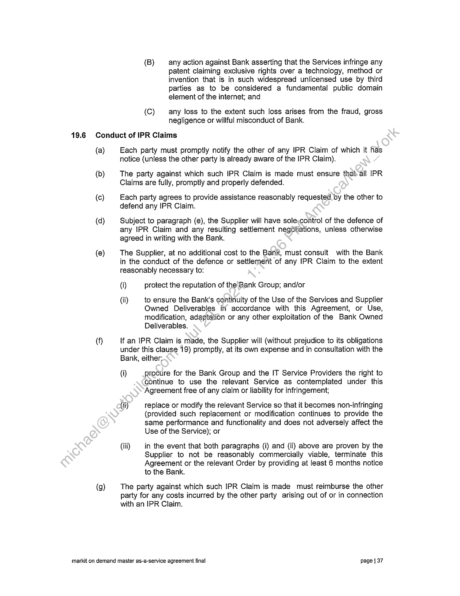
```  
```col-md
(B) any action against Bank asserting that the Services infringe any
patent claiming exclusive rights over a technology, method or
invention that is in such widespread unlicensed use by third
parties as to be considered a fundamental public domain
element of the internet; and  
{C) any loss to the extent such loss arises from the fraud, gross
negligence or willful misconduct of Bank.  
19.6 Conduct of IPR Claims  
(a)  
(b)  
(c)  
(d)  
(e)  
(9)  
Each party must promptly notify the other of any IPR Claim of which it has
notice (unless the other party is already aware of the IPR Claim).  
The party against which such IPR Claim is made must ensure that-all IPR
Claims are fully, promptly and properly defended.  
Each party agrees to provide assistance reasonably requested by the other to
defend any IPR Claim.  
Subject to paragraph (e), the Supplier will have solexcontrol of the defence of
any IPR Claim and any resulting settlement negdtiations, unless otherwise
agreed in writing with the Bank.  
The Supplier, at no additional cost to the Bank, must consult with the Bank
in the conduct of the defence or settlemerit of any IPR Claim to the extent
reasonably necessary to:  
(i) protect the reputation of the Bank Group; and/or  
(ii) to ensure the Bank's continuity of the Use of the Services and Supplier
Owned Deliverables in’ accordance with this Agreement, or Use,
modification, adaptation or any other exploitation of the Bank Owned
Deliverables.  
If an IPR Claim is made, the Supplier will (without prejudice to its obligations
under this clause 19) promptly, at its own expense and in consultation with the
Bank, either:  
{i) procure for the Bank Group and the IT Service Providers the right to
continue to use the relevant Service as contemplated under this
Agreement free of any claim or liability for infringement;  
(ti) replace or modify the relevant Service so that it becomes non-infringing
(provided such replacement or modification continues to provide the
same performance and functionality and does not adversely affect the
Use of the Service); or  
(iii) in the event that both paragraphs (i) and (ii) above are proven by the
Supplier to not be reasonably commercially viable, terminate this
Agreement or the relevant Order by providing at least 6 months notice
to the Bank.  
The party against which such IPR Claim is made must reimburse the other
party for any costs incurred by the other party arising out of or in connection
with an IPR Claim.  
markit on demand master as-a-service agreement final page | 37  
```
````
Notes:    
````col
```col-md
flexGrow=.5
===
> [!info] [Page 38](_attachments/images_CommonWealthSecurities-3.6.1.10.1CommonwealthBankofAustralia-MarkITonDemand-MasterAgreement.pdf_212329/page_38.png)
> 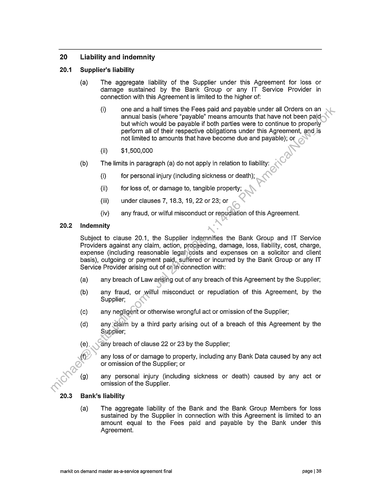
```  
```col-md
20 Liability and indemnity  
20.1 Supplier’s liability  
(a)  
(b)  
The aggregate liability of the Supplier under this Agreement for loss or
damage sustained by the Bank Group or any IT Service Provider in
connection with this Agreement is limited to the higher of:  
(i) one and a half times the Fees paid and payable under all Orders on an
annual basis (where “payable” means amounts that have not been paid
but which would be payable if both parties were to continue to properly
perform all of their respective obligations under this Agreement, and is
not limited to amounts that have become due and payable); or  
(i) $1,500,000  
The limits in paragraph (a) do not apply in relation to liability:
(i) for personal injury (including sickness or death);  
(il) for loss of, or damage to, tangible property;  
(iti) under clauses 7, 18.3, 19, 22 or 23; or  
(iv) any fraud, or wilful misconduct or repudiation of this Agreement.  
20.2 Indemnity  
Subject to clause 20.1, the Supplier indemnifies the Bank Group and IT Service
Providers against any claim, action, proceeding, damage, loss, liability, cost, charge,
expense (including reasonable legalycosts and expenses on a solicitor and client
basis), outgoing or payment paid, suffered or incurred by the Bank Group or any IT
Service Provider arising out of on ia connection with:  
(a)
(b)  
(c)
(d)  
(e)
()  
(9)  
any breach of Law arising out of any breach of this Agreement by the Supplier;  
any fraud, or wilful misconduct or repudiation of this Agreement, by the
Supplier;  
any negligent or otherwise wrongful act or omission of the Supplier;  
any ‘claim by a third party arising out of a breach of this Agreement by the
Supplier;  
any breach of clause 22 or 23 by the Supplier;  
any loss of or damage to property, including any Bank Data caused by any act
or omission of the Supplier; or  
any personal injury (including sickness or death) caused by any act or
omission of the Supplier.  
20.3 Bank’s liability  
(a)  
The aggregate liability of the Bank and the Bank Group Members for loss
sustained by the Supplier in connection with this Agreement is limited to an
amount equal to the Fees paid and payable by the Bank under this
Agreement.  
markit on demand master as-a-service agreement final page | 38  
```
````
Notes:    
````col
```col-md
flexGrow=.5
===
> [!info] [Page 39](_attachments/images_CommonWealthSecurities-3.6.1.10.1CommonwealthBankofAustralia-MarkITonDemand-MasterAgreement.pdf_212329/page_39.png)
> 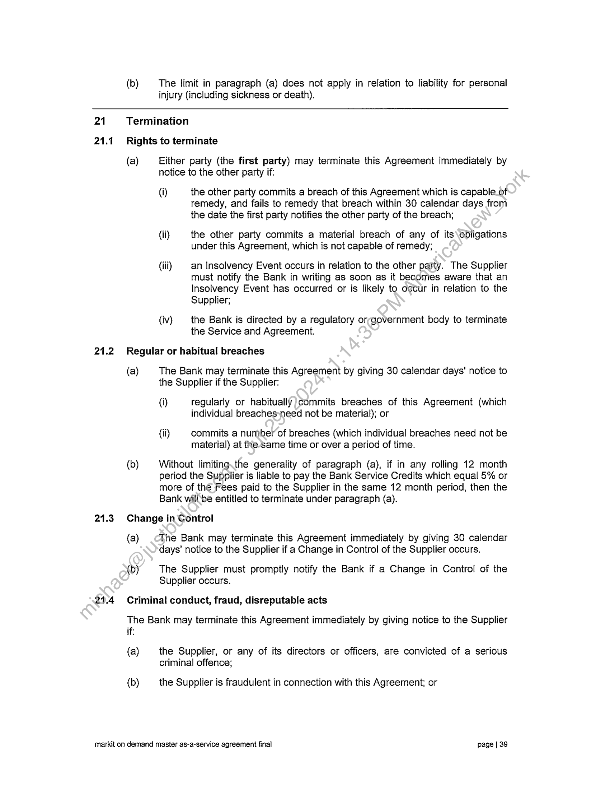
```  
```col-md
(b) The limit in paragraph (a) does not apply in relation to liability for personal
injury (including sickness or death).  
21
21.1  
21.2  
Termination
Rights to terminate  
(a) Either party (the first party) may terminate this Agreement immediately by
notice to the other party if:  
(i) the other party commits a breach of this Agreement which is capable of
remedy, and fails to remedy that breach within 30 calendar days from
the date the first party notifies the other party of the breach;  
(ii) the other party commits a material breach of any of its\obiigations
under this Agreement, which is not capable of remedy;  
(iii) an Insolvency Event occurs in relation to the other party. The Supplier
must notify the Bank in writing as soon as it becomes aware that an
Insolvency Event has occurred or is likely to occur in relation to the
Supplier;  
(iv) the Bank is directed by a regulatory orrgovernment body to terminate
the Service and Agreement.  
Regular or habitual breaches  
(a) The Bank may terminate this Agreement by giving 30 calendar days' notice to
the Supplier if the Supplier:  
(i) regularly or habitually )commits breaches of this Agreement (which
individual breaches»need not be material); or  
(ii) commits a number of breaches (which individual breaches need not be
material) at the same time or over a period of time.  
(b) Without limiting.the generality of paragraph (a), if in any rolling 12 month
period the Supplier is liable to pay the Bank Service Credits which equal 5% or  
more of the Fees paid to the Supplier in the same 12 month period, then the
Bank willbe entitled to terminate under paragraph (a).  
Change in Control  
(a) The Bank may terminate this Agreement immediately by giving 30 calendar
days’ notice to the Supplier if a Change in Control of the Supplier occurs.  
(b) The Supplier must promptly notify the Bank if a Change in Control of the
Supplier occurs.  
Criminal conduct, fraud, disreputable acts  
The Bank may terminate this Agreement immediately by giving notice to the Supplier
if:  
(a) the Supplier, or any of its directors or officers, are convicted of a serious
criminal offence;  
(b) the Supplier is fraudulent in connection with this Agreement; or  
markit on demand master as-a-service agreement final page | 39  
```
````
Notes:    
````col
```col-md
flexGrow=.5
===
> [!info] [Page 40](_attachments/images_CommonWealthSecurities-3.6.1.10.1CommonwealthBankofAustralia-MarkITonDemand-MasterAgreement.pdf_212329/page_40.png)
> 
```  
```col-md
21.5  
21.6  
21.7  
(c) the Supplier, in the reasonable opinion of the Bank, brings or threatens to
bring the Bank Group into disrepute.  
Termination by the Bank in part  
(a) Where the Bank is entitled to terminate this Agreement or any Order(s), the
Bank may terminate this Agreement, or the relevant Order(s), in whole or in
part.  
(b) If the Bank exercises a right to terminate this Agreement in part, the Bank has
the sole and absolute discretion as to which part or parts of this Agreement
are to be terminated. For clarification, only the Bank may terminate in part. if
the Bank elects to terminate this Agreement in part the parties will\use
reasonable efforts to seek to agree, any appropriate variations (to this
Agreement, including to the Services and the Fees.  
(c) If at any time the Bank considers that any aspect of a partial termination is not
proceeding to its satisfaction, it may by notice to the Supplier convert the
partial termination into a full termination.  
Further Bank rights  
If the Bank terminates this Agreement in whole or in partunder clauses 21.1(a), 21.2,
21.3 or 21.4, the Bank may (without limiting its other@ights and remedies) procure
from any other services which are substantially similar to the Services and suitable to
the Bank, and the Supplier will be liable to the Bank for any reasonable extra expense
incurred together with any loss sustained by the Bank.  
Reimbursement of Fees  
(a) Upon termination of this Agrégiment or an Order, for any reason other than
termination in accordance.with clauses 21.1(b) or 21.5 , the Supplier must
within 30 calendar days‘feimburse the Bank any Fees paid to the Supplier in
relation to Services not\péerformed by the Supplier.  
(b) Upon termination ofthis Agreement or an Order in accordance with clauses
21.1(b) or 21.5., the Supplier must within 30 calendar days reimburse the
Bank any Fees paid to the Supplier in relation to Services not performed by
the Suppliérunless the Supplier can demonstrate that it has paid such Fees to
a third party and that it cannot recover those Fees from that party.  
Delivery up  
Upon.termination or expiry of this Agreement for any reason, the Supplier must
promptly provide the Bank with all Bank Owned Bank Owned Deliverables that has
noetvalready been provided, whether completed or work in progress.  
Transition Out  
(a) On the expiry or termination of this Agreement or any Order, the Supplier must
provide all assistance reasonably requested by the Bank in relation to the
termination of this Agreement or relevant Order, including the transition to
alternative third party services or migration of the Bank Data to another
System or to alternative equipment or software (the Transition Out
Services). For clarification, in doing so the Supplier is not required to transfer
to the Bank any software, hardware or other systems, and the Bank is
responsible for obtaining such software, hardware and other systems at its
own cost.  
markit on demand master as-a-service agreement final page | 40  
```
````
Notes:    
````col
```col-md
flexGrow=.5
===
> [!info] [Page 41](_attachments/images_CommonWealthSecurities-3.6.1.10.1CommonwealthBankofAustralia-MarkITonDemand-MasterAgreement.pdf_212329/page_41.png)
> 
```  
```col-md
21.10  
(c)  
(d)  
(b)  
The Supplier must provide the Transition Out Services:  
(i) in the case of expiry, during the period commencing 60 days before
expiry of this Agreement or Order (or as otherwise agreed between the
parties) and ending 6 months after the due date of expiry of this
Agreement or Order; and  
(ii) in the case of termination, on the date on which a party terminates this
Agreement or the particular Order (even if this Agreement provides that
such termination is not effective immediately), and ending 6 months
thereafter, or as otherwise agreed between the parties,  
(the Transition Out Period). The Term of this Agreement is extended during
any Transition Out Period such that it will be considered part of the Term:  
The Supplier must continue to provide the Services to the Bank, and the Bank
may continue to use any Services, in accordance with all theterms of this
Agreement during the Transition Out Period until they are transitioned to the
Bank or its nominee (and the Bank must continue to payany Fees for such
Services).  
The Bank will reimburse the Supplier for any additional out-of-pocket costs
where they are reasonably incurred in relation-to ‘providing such assistance,
except where the termination relates to a breach of this Agreement by the
Supplier.  
Consequences of termination  
(a)  
(b)  
If this Agreement is terminated yi part, the terms of this Agreement will
continue to apply to those parts of the Agreement that remain in force
following the termination in part until those parts of the Agreement expire or
are terminated.  
Any termination of this\Agreement pursuant to this clause 21 will be without
prejudice to any other rights or remedies either party may be entitled to
hereunder or at law and will not affect any accrued rights or liabilities of either
party nor theycoming into or continuance in force of any provisions hereof
which are expressly or by implication intended to come into or continue in
force omor.after such termination.  
22
22.1  
22.2  
Confidentiality  
Confidentiality  
(a) Each party must keep confidential, and not use or disclose, any Confidential
Information of the other party, except as permitted by this Agreement.  
(b) The obligation of confidence in paragraph (a) above extends to Confidential
Information provided to or obtained by a party before entering into this
Agreement.  
Exclusions  
The obligation of confidence in clause 22.1(a) does not apply to Confidential
Information that is:  
(a)  
in the public domain otherwise than as a result of a breach of this Agreement
or another obligation of confidence;  
markit on demand master as-a-service agreement final page | 44  
```
````
Notes:    
````col
```col-md
flexGrow=.5
===
> [!info] [Page 42](_attachments/images_CommonWealthSecurities-3.6.1.10.1CommonwealthBankofAustralia-MarkITonDemand-MasterAgreement.pdf_212329/page_42.png)
> 
```  
```col-md
(b) independently developed by the recipient; or  
(c) already known by the recipient independently of its interaction with the other
party and free of any obligation of confidence.  
22.3 Permitted disclosures
(a) A party (a Recipient) may disclose Confidential Information of the other party:  
(i) required to be disclosed by applicable Law or the rules of any stock
exchange on which the Recipient's securities are listed, as long as the
Recipient:  
(A) discloses only the minimum amount of Confidential Information
required to satisfy the Law or rules; and  
(B) before disclosing any Confidential Information) gives a
reasonable amount of notice to the other parfy-and takes all
reasonable steps (whether required by the other party or not) to
maintain that Confidential Information in confidence; and  
(ii) to Personnel of the Recipient who:  
(A) have a need to know (and onlycto the extent that each has a
need to know) the Confidential information for the purposes of
this Agreement; and  
(B) have been directed and\nave agreed to keep confidential the
Confidential Information on terms not inconsistent with this
Agreement,  
provided the Recipient’ ensures such Personnel comply with the
obligation of confidentiality in clause 22.1(a).  
(b) The Bank may disclose Confidential Information of the Supplier to any IT
Service Provider provided that the IT Service Provider has entered into an
agreement with the Bank to keep confidential all information disclosed to the
IT Service Provider, on terms consistent with the confidentiality obligations of
this Agreement.  
22.4 Preventing disclosures  
Each party.must take all steps and do all things necessary, prudent or desirable in
order to'safeguard the confidentiality of the Confidential Information of the other party.  
22.5 Return of Confidential Information  
A Recipient must immediately on termination of this Agreement or on request from
the other party:  
(a) return to the other party;
(b) destroy and certify in writing to the other party the destruction of, or  
(c) destroy and permit an employee of the other party to witness the destruction
of,  
all the other party’s Confidential Information in the Recipient's possession or control
other than one copy of any notes and other records that the Recipient is required by
Law to retain.  
markit on demand master as-a-service agreement final page | 42  
```
````
Notes:    
````col
```col-md
flexGrow=.5
===
> [!info] [Page 43](_attachments/images_CommonWealthSecurities-3.6.1.10.1CommonwealthBankofAustralia-MarkITonDemand-MasterAgreement.pdf_212329/page_43.png)
> 
```  
```col-md
22.6 Remedies for breach  
22.7  
22.8  
23  
(a)  
(b)  
Each party acknowledges that the value of the other party’s Confidential
Information is such that an award of damages or an account of profits may not
be adequate compensation if this clause 22 is breached.  
Each party acknowledges that, without in any way compromising its right to
seek damages or any other form of relief in the event of a breach of this
clause 22, a party may seek and obtain an ex parte interlocutory or final
injunction to prohibit or restrain the other party or its advisers from any breach
or threatened breach of this clause 22.  
Supplier Employees  
Prior to the commencement of any work under this Agreement by—Supplier
Employees or at any time thereafter, the Supplier must, if requested bythe Bank,
obtain from the Supplier Employees an executed Confidentiality Deed:(substantially in
the form of Schedule 3 (Confidentiality Deed)) in favour of the Bank.  
Confidentiality of Bank Data  
The Supplier must not use any Bank Data for testing purposes unless that Bank Data
has first been masked or de-identified in a manner approved by the Bank.  
Privacy  
(a) This clause 23 applies to any PersonaNnformation provided to, or obtained or
accessed by, the Supplier in the course of providing the Services, or otherwise
in connection with this Agreement.  
(b) If the Supplier collects, uses; discloses, transfers or otherwise handles
Personal Information to which this clause 23 applies, it must comply with:
(i) all applicable Privacy Legislation; and
(ii) any of the Bank’s privacy policies notified to the Supplier from time to  
time.
(c) Without limiting paragraph (b), the Supplier must:  
(i) only use Personal Information to which this clause 23 applies to the
extent necessary to provide the Services in accordance with this
Agreement;  
(ii) not disclose Personal Information to which this clause 23 applies to
any other person without the express, prior written authority of the
Bank, or (subject to paragraph (vi) below) as expressly required by
Law;  
(iii) establish, maintain and enforce appropriate policies and procedures,
and associated access controls and other technological measures, to
ensure that Personal Information to which this clause 23 applies is only
accessible to those Supplier Employees who require such access for
the purpose of performing their duties of engagement;  
(iv) without limiting paragraph (iii) above, ensure that none of the Supplier
Employees who have access to any Personal Information to which this
clause 23 applies use, disclose, transfer or retain such Personal  
markit on demand master as-a-service agreement final page | 43  
```
````
Notes:    
````col
```col-md
flexGrow=.5
===
> [!info] [Page 44](_attachments/images_CommonWealthSecurities-3.6.1.10.1CommonwealthBankofAustralia-MarkITonDemand-MasterAgreement.pdf_212329/page_44.png)
> 
```  
```col-md
(v)  
(vi)  
(vii)  
(viii)  
(ix)  
Information except to the extent necessary to perform their duties of
engagement;  
co-operate with any requests or directions of the Bank concerning the
storage, security, use and disclosure of Personal Information to which
this clause 23 applies, or the rights of individuals to access and correct
such Personal Information;  
notify the Bank as soon as reasonably practicable after the Supplier
becomes aware that a disclosure of Personal Information to which this
clause 23 applies may be required by Law (including under the
applicable Privacy Legislation), and, if requested by the Bank:  
(A) obtain a written legal opinion, from a reputable international law
firm approved by the Bank, confirming that the disclosure is
required by Law; and/or  
(B) assist the Bank to prevent or limit such disclostre;  
ensure that any Supplier Employees who are\required to deal with
Personal Information to which this clause 23 applies are made aware
of the obligations in this clause 23 andi if‘requested by the Bank,
ensure that such Supplier Employees sign written undertakings (in a
form acceptable to the Bank) to coimply with the obligations in this
clause 23;  
without limiting any of the Supplier's obligations under this clause 23,
or otherwise under this Agreement, not do any act or engage in any
practice that would breach jany Privacy Legislation, or which, if done by
or engaged in by the\Bank, would be in breach of any Privacy
Legislation;  
as soon as reasonably practicable notify the Bank if it becomes aware
of a breach of this clause 23; and  
on the termination or expiry of this Agreement for any reason, destroy
or otherwise deal with any Personal Information to which this clause 23
applies (including, for the avoidance of doubt, any such Personal
Information provided to, or obtained or accessed by, the Supplier in the
provision of any transition out in accordance with the directions of the
Bank.  
(d) Without limiting any of the Supplier's obligations under this Agreement, the
Supplier must not allow or permit access to any Personal Information outside
of the countries referred to in paragraph (a) of the definition of the term
“Jurisdiction” (the Relevant Countries) unless it complies with this paragraph
(d). If the Supplier wishes to transfer any Personal Information outside of the
Relevant Countries, the Supplier must, prior to transferring any Personal
Information:  
()  
(ii)  
provide to the Bank all relevant information relating to the proposed
transfer, including the country to which the Personal Information is
intended to be transferred, a detailed description of the Personal
Information that is intended to be transferred and the purpose for which
such transfer is required; and  
obtain the Bank’s prior written approval to the transfer, which approval
may be granted or withheld at the Bank’s sole and absolute discretion.  
markit on demand master as-a-service agreement final page | 44  
```
````
Notes:    
````col
```col-md
flexGrow=.5
===
> [!info] [Page 45](_attachments/images_CommonWealthSecurities-3.6.1.10.1CommonwealthBankofAustralia-MarkITonDemand-MasterAgreement.pdf_212329/page_45.png)
> 
```  
```col-md
As part of considering whether to give such approval, the Bank may
require the Supplier to satisfy the Bank that the arrangements that
have been put in place are sufficient to ensure that the handling of
Personal Information will at all times be conducted in accordance with
this clause 23 and such other standards or conditions as the Bank may
reasonably require.  
24
24.1  
24.2  
Dispute resolution  
Meeting of Representatives  
(a)  
(b)  
If a party considers that a Dispute has arisen, it may give a notice to the other
party. The notice must set out reasonable particulars of the Dispute.  
Promptly after the receipt of a notice of a Dispute, the Supplier Commercial
Representative and Operational Representative (for the Order te which the
Dispute relates) must meet with the Bank Commercial Representative and
Operational Representative (for the Order to which the Dispute relates) to
discuss the Dispute and negotiate in good faith to resolvesthe Dispute without
resorting to any legal proceedings.  
Escalation of Dispute  
(a)  
(b)  
If the parties do not resolve the Dispute in accordance with clause 24.1 within
10 Business Days of receipt of the notice*of the Dispute, either party may
request that the Dispute be escalated. to the persons nominated for the
purpose of this clause by each party in the Order to which the Dispute relates
(the Executives).  
The Executives must:  
(i) negotiate in good: faith to resolve the Dispute without resorting to any
legal proceedings;or  
(ii) attempt to agree on:  
(A) _.a.process to resolve all or at least part of the Dispute without
resorting to any legal proceedings including by mediation,
conciliation or independent expert determination;  
(B) the selection and payment of any person to be appointed by the
parties for, and the involvement of any dispute resolution
organisation in, the process;  
(C) any procedural rules;  
(D) the timetable, including any exchange of relevant information
and documents; and  
(E) the place where any meetings will be held.  
24.3. Legal proceedings  
(a)  
If the Executives have not resolved the Dispute or agreed a process to resolve
the Dispute within 20 Business Days from the date of escalation of the Dispute
under clause 24.2, either party may commence legal proceedings.  
markit on demand master as-a-service agreement final page | 45  
```
````
Notes:    
````col
```col-md
flexGrow=.5
===
> [!info] [Page 46](_attachments/images_CommonWealthSecurities-3.6.1.10.1CommonwealthBankofAustralia-MarkITonDemand-MasterAgreement.pdf_212329/page_46.png)
> 
```  
```col-md
Subject to clause 19, compliance with this clause 24 is a condition precedent
to a party's entitlement to commence legal proceedings in relation to a
Dispute.  
(c) This clause 24 does not prevent a party seeking urgent interim or interlocutory
relief.
24.4 General
(a) Any information or documents disclosed by a party to the other party under
this clause must be kept confidential in accordance with clause 22.
(b) Each party must bear its own costs of resolving a Dispute under this clause
and the parties to the Dispute must bear equally the costs of any expert or
other person jointly appointed by them to resolve or attempt to\réesolve a
Dispute.
25 Insurance
25.1 General
(a) The Supplier must effect and maintain at its cost*the insurances listed in
clause 25.2. The Required Insurances must be,effected with insurers which
are currently rated not less than A- by Staridard & Poor's (or an equivalent
tating agency) and cover all risks whichxare reasonable and prudent in
accordance with good business practice:
(b) Upon execution of this Agreemeni,by the parties, and upon request by the
Bank, the Supplier must provide certificates of currency for the Required
Insurances.
(c) The Supplier will pay any.excess/deductible under the Required Insurances.
(d) The Supplier must notdo or allow anything which would prejudice any of the
Required Insurances) or cause them to be terminated.
(e) The Supplier-must ensure that any subcontractor it engages will effect
insurances which comply with Required Insurances.
25.2 Required Insurances  
(a)  
(c)  
Workers’ Compensation insurance, Work Care or equivalent insurance in
accordance with legislation applicable to any State or Territory in which the
Services are to be performed and in which the Supplier employs persons
together with unlimited cover for common law liability where permissible by
law.  
General Liability Insurance for not less than $10,000,000 in respect of any
single occurrence.  
Professional Indemnity Insurance for an amount not less than $2,000,000 for
any one loss and $4,000,000 in aggregate each policy year; for any civil
liability arising from a breach of professional duty owed in contract or
otherwise. Material Damage Insurance to cover physical loss, destruction or
damage to the property of the Bank relevant to this Agreement or where the
Supplier has accepted the risk of loss or damage. Such property must be
insured for its replacement cost.  
markit on demand master as-a-service agreement final page | 46  
```
````
Notes:    
````col
```col-md
flexGrow=.5
===
> [!info] [Page 47](_attachments/images_CommonWealthSecurities-3.6.1.10.1CommonwealthBankofAustralia-MarkITonDemand-MasterAgreement.pdf_212329/page_47.png)
> 
```  
```col-md
26 Assignment and subcontracting
26.1 Assignment by the Bank  
(a)  
(b)  
(c)  
(d)  
Subject to paragraph (b), this Agreement and ail rights and obligations
hereunder may not be assigned or transferred by the Bank in whole or in part
without the prior written consent of the Supplier, such consent not to be
unreasonably withheld.  
The Bank may at any time, by notice to the Supplier, novate, assign or transfer
its rights and obligations under this Agreement to a Bank Group Member-or
any IT Service Provider. Such novation, assignment or transfer will be at no
additional cost to the Bank, any other Bank Group Member or any IT Service
Provider.  
At the Bank's request, the Supplier agrees to enter, at the Supplier’s own cost,
into an agreement to formalise any novation, assignment of.transfer by the
Bank under paragraph (b).  
The parties acknowledge that an incoming party, assignee or transferee of the
Bank’s obligations and/or rights under this Agreementmay in turn exercise the
rights set out in paragraph (b) and novate, assign or transfer its rights and
obligations under this Agreement to any Bank\Group Member or IT Service
Provider.  
26.2 Assignment by the Supplier  
The Supplier may not assign or transfer in»whole or in part its rights and obligations
under this Agreement without the prior-written consent of the Bank, such consent not
to be unreasonably withheld.  
26.3 Subcontracting  
(a)  
(b)  
(c)  
The Supplier may not subcontract the whole, or any material part, of its
obligations under this Agreement without the prior written consent of the Bank.  
Prior to commeéncing any work under a subcontract arrangement, the Supplier
must ensure.that:  
{i) the proposed subcontractor is aware of all of the terms and conditions
of this Agreement that are relevant to that part of the Services which
the subcontractor proposes to perform under the subcontract
agreement;  
(ii) any proposed subcontract agreement contains clauses the same as
those in this Agreement which relate to that part of the Services that
the subcontractor proposes to perform under the subcontract
agreement;  
(iit) on request by the Bank, the Supplier provides a draft copy of the
proposed subcontract agreement to the Bank for the Bank’s review;
and  
(iv) it makes any changes to the proposed subcontract agreement that the
Bank requests.  
The Supplier must as soon as possible upon notice from the Bank, ensure that
it either:  
markit on demand master as-a-service agreement final page | 47  
```
````
Notes:    
````col
```col-md
flexGrow=.5
===
> [!info] [Page 48](_attachments/images_CommonWealthSecurities-3.6.1.10.1CommonwealthBankofAustralia-MarkITonDemand-MasterAgreement.pdf_212329/page_48.png)
> 
```  
```col-md
(d)  
(i) replaces any subcontractor performing Services for the Bank; or
(il) resumes performance of the relevant Services itself,  
where the Bank determines (acting reasonably) that the performance of the
subcontractor is unsatisfactory.  
Notwithstanding any consent given by the Bank, the Supplier:  
(i) must ensure that each Supplier subcontractor complies with all of the
terms and conditions of this Agreement;  
(ii) will not be relieved of any of its liabilities or obligations under, this
Agreement as a result of entering into any subcontracts>of its
obligations under this Agreement;  
(iii) will be liable to the Bank for the acts, omissions, defaults-or negligence
of each Supplier subcontractor as fully as if they<were the acts,
omissions, defaults or negligence of the Supplier; and  
{iv) | acknowledges that a subcontractor's failure to.perform does not excuse
its failure to perform any part of this Agreementiin any way whatsoever.  
27  
Force Majeure  
(a)  
(b)  
Neither party will be liable for a failure or‘delay in performing its obligations
under this Agreement to the extent that.such failure or delay:  
(i) is directly attributable to a Force Majeure Event; and  
(ii) could not have been~prevented by reasonable precautions or
circumvented or minimised by the non-performing party (eg by means
of alternative sources or work-arounds).  
lf a delay is directly.attriputable to a Force Majeure Event delay exceeds 30
calendar days, either party may immediately terminate this Agreement by
giving notice tothe other party.  
For clarification, the Bank is not required to pay any Fees under this
Agreemént for any Services that the Supplier is unable to provide as a result
of a. Force Majeure Event.  
28
28.1  
Audit and inspection  
Audit rights  
On at least five business days’ notice by the Bank, the Supplier must provide the
Bank, or any Auditor appointed by the Bank, with access to:  
(a)  
(b)  
the Resources used by either or both of the Supplier and any subcontractor in
connection with the supply of the Services; and  
any agreements, arrangements or undertakings relating to this Agreement
between:  
(i) the Supplier and any third party; and  
(ii) the Supplier and any subcontractor;  
markit on demand master as-a-service agreement final page | 48  
```
````
Notes:    
````col
```col-md
flexGrow=.5
===
> [!info] [Page 49](_attachments/images_CommonWealthSecurities-3.6.1.10.1CommonwealthBankofAustralia-MarkITonDemand-MasterAgreement.pdf_212329/page_49.png)
> 
```  
```col-md
(c)  
(d)  
(e)  
(f)  
(9)  
any financial or operational records of either or both of the Supplier and any
subcontractors relating to this Agreement;  
any practices or procedures of either or both of the Supplier and any
subcontractors relating to this Agreement, including any practices or
procedures of the Supplier and subcontractors:  
(i) for managing and monitoring risk in their own businesses; or  
(ii) relating to their capacity or ability to provide complete, accurate and
reliable financial reporting or related disclosures;  
any Bank Data and records in the possession, custody or control of either or
both of the Supplier and any subcontractor;  
any premises from which the whole or any part of the Services\are being
provided; and  
such other premises, documents, records, practices, dataand matters as the
Bank may from time to time wish to audit and inspect in-connection with this
Agreement,  
for the purpose referred to in clause 28.2.  
28.2 Purposes  
The purpose of carrying out the audit and inspection may include, but is not limited, to
the following:  
(a)  
(b)  
(c)  
(d)  
(2)  
to ascertain compliance with (the reporting, disclosure and accounting
requirements of any Bank Group Member from time to time;  
to verify whether the Supplier, and any subcontractor, is supplying the
Services in accordance with any Laws and Regulatory and Industry
Requirements that apply to the Supplier, any Supplier subcontractors or any
Bank Group Member)  
to enable the“Bank to comply with any Laws or Regulatory and Industry
Requirements) or any request or requirement of a Governmental Agency,
including.a ‘request for any information or documentation;  
to verify whether the Supplier is complying with this Agreement, including
whether the Fees invoiced are accurate and whether Service Levels are being
met, and  
such other purposes of which the Bank may notify the Supplier from time to
time, having regard to the changing business needs and requirements of the
Bank.  
28:3. Co-operation  
The Supplier must co-operate fully in any audit and inspection, including:  
(a)
(b)
(c)
(d)  
providing appropriate and secure office facilities in the relevant premises;
providing copies of any documents, records or data;
making appropriate Personnel available to answer questions;  
installing and running audit software on the Supplier Systems; and  
markit on demand master as-a-service agreement final page | 49  
```
````
Notes:    
````col
```col-md
flexGrow=.5
===
> [!info] [Page 50](_attachments/images_CommonWealthSecurities-3.6.1.10.1CommonwealthBankofAustralia-MarkITonDemand-MasterAgreement.pdf_212329/page_50.png)
> 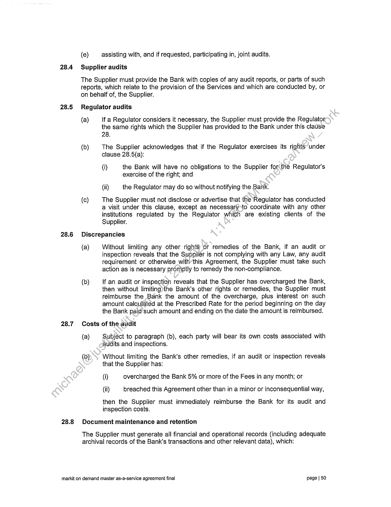
```  
```col-md
28.4  
28.5  
28.6  
28.7  
28.8  
(e)  
assisting with, and if requested, participating in, joint audits.  
Supplier audits  
The Supplier must provide the Bank with copies of any audit reports, or parts of such
teports, which relate to the provision of the Services and which are conducted by, or
on behalf of, the Supplier.  
Regulator audits  
(a)  
(b)  
lf a Regulator considers it necessary, the Supplier must provide the Regulator
the same rights which the Supplier has provided to the Bank under this clause
28.  
The Supplier acknowledges that if the Regulator exercises its rights under
clause 28.5(a):  
(i) the Bank will have no obligations to the Supplier for(the Regulator’s
exercise of the right; and  
(ii) the Regulator may do so without notifying the Bank.  
The Supplier must not disclose or advertise that the Regulator has conducted
a visit under this clause, except as necessary-fo coordinate with any other
institutions regulated by the Regulator which are existing clients of the
Supplier.  
Discrepancies  
(a)  
Without limiting any other rights) or remedies of the Bank, if an audit or
inspection reveals that the Supplier is not complying with any Law, any audit
requirement or otherwise with’this Agreement, the Supplier must take such
action as is necessary proniptly to remedy the non-compliance.  
If an audit or inspection reveals that the Supplier has overcharged the Bank,
then without limiting)the Bank's other rights or remedies, the Supplier must
reimburse the Bank the amount of the overcharge, plus interest on such
amount calculated at the Prescribed Rate for the period beginning on the day
the Bank paid’ such amount and ending on the date the amount is reimbursed.  
Costs of the audit  
(a)  
(b)  
Subjéct to paragraph (b), each party will bear its own costs associated with
audits and inspections.  
Without limiting the Bank's other remedies, if an audit or inspection reveals
that the Supplier has:  
(i) overcharged the Bank 5% or more of the Fees in any month; or
(ii) breached this Agreement other than in a minor or inconsequential way,  
then the Supplier must immediately reimburse the Bank for its audit and
inspection costs.  
Document maintenance and retention  
The Supplier must generate all financial and operational records (including adequate
archival records of the Bank's transactions and other relevant data), which:  
markit on demand master as-a-service agreement final page | 50  
```
````
Notes:    
````col
```col-md
flexGrow=.5
===
> [!info] [Page 51](_attachments/images_CommonWealthSecurities-3.6.1.10.1CommonwealthBankofAustralia-MarkITonDemand-MasterAgreement.pdf_212329/page_51.png)
> 
```  
```col-md
(a) are reasonably required to demonstrate the Supplier's compliance with this
Agreement, and the proper calculation of Fees charged to the Bank; or  
(b) are required by any Law,  
and maintain such records in an accessible and secure form for a period of at least 7
years from the date of their creation, or longer if required by this Agreement or by
Law.  
29 Occupational Health and Safety  
(a) The Supplier warrants that it is familiar with and has the capability, and
resources to comply with all relevant Safety Legislation and Safety
Requirements.  
(b) The Supplier must comply with, and ensure that any and all subcontractors or
other persons engaged in the provision of the Services comply with, all such
Safety Legislation and Safety Requirements. The Supplier must, upon
reasonable request by or on behalf of the Bank, demonstrate compliance with
such requirements including providing evidence of measures taken to achieve
such compliance.  
(c) The Supplier must:  
(i) cooperate with any other suppliers<or contractors or other persons
engaged in or associated with the business of the Bank in order to
maintain uniform and appropriate safety and industrial practices; and  
(ii) cooperate with the Bank) to enable the Bank to comply with its
obligations under all relevant Safety Legislation; and  
(iii) immediately advise the Bank in writing of any act, fact or circumstance
associated with the activities of the Supplier or any other person
relevant to thé. ability of the Supplier to provide the Services in a
manner that is safe and without risks to health.  
(d) The Supplier<must, prior to the provision of the Services, undertake an
assessment of the risks associated with the provision of the Services and
identify-and implement appropriate measures to control all such risks. Details
of theCtisk assessment and evidence of implementation of adequate risk
control measures will be provided to the Bank upon and in accordance with
any reasonable request by or on behalf of the Bank.  
(e) The Supplier must perform all relevant functions and fulfil all relevant duties
under all relevant Safety Legislation of an employer or otherwise applicable to
the role of the Supplier under this Agreement, including notification of
incidents as may be required under the Safety Legislation.  
(f) The Supplier acknowledges that disclosure of the Confidential Information
may compromise the occupational health and safety of persons and the ability
of the Bank and the Supplier to comply with their respective obligations under
relevant Safety Legislation.  
(g) The Supplier must promptly notify the Bank of any accident, injury, property or
environmental damage which occurs during the carrying out of and associated
with the provision of the software and/or Services. The Supplier must, within
two business days of any such incident, provide a written report to the Bank
giving complete details of the incident, including the results of investigations  
markit on demand master as-a-service agreement final page | 51  
```
````
Notes:    
````col
```col-md
flexGrow=.5
===
> [!info] [Page 52](_attachments/images_CommonWealthSecurities-3.6.1.10.1CommonwealthBankofAustralia-MarkITonDemand-MasterAgreement.pdf_212329/page_52.png)
> 
```  
```col-md
30  
(h)  
(i)  
into its cause and any recommendations or strategies for prevention of a
recurrence.  
The Supplier must, where appropriate, supply adequate health and safety
information concerning any goods it (or its agents or subcontractors) may use
for the purpose of providing the software and/or Services and must ensure
that any such goods will be safe when properly used and/or stored. The
Supplier must at all times keep the Bank informed of all relevant information
which becomes known to the Supplier (or its agents or subcontractors)
concerning the use, supply and maintenance and/or storing of the goods.  
Any breach by the Supplier of any part of this clause 29 will be considered a
material breach by the Supplier of its obligations under this Agreement-which
is not capable of remedy, and will entitle the Bank at its option to:  
(i) suspend the whole or part of the work under this Agreement and any
cost incurred by the Bank or the Supplier by reason of the suspension
(including the cost of the replacement of the software/and/or Services
provided or to be provided by the Supplier) awill’be borne by the
Supplier; and/or  
(ii) terminate this Agreement in accordance with clause 21.1(a)(ii).  
Business Continuity  
(a)  
(b)  
(c)  
(a)  
The Supplier must develop and implement a business continuity management
plan prior to execution of this Agreement, to provide for the continuity of critical
business functions at agreed Sefvice Levels in the event of the loss,
disablement, impairment or suspension of key facilities, resources,
technologies or suppliers due to a Force Majeure Event, and also for normal
Service Levels to be fullyfestored within a timeframe acceptable to the Bank
after such an event.  
The Supplier will liaise with the Bank in the development of the plan and
ensure that the plan is acceptable to the Bank.  
The plan must:  
(i) be. based upon a formal assessment of the applicable risks and
business impacts;  
Gi). be developed in accordance with recognised best practice standards ;
(iii) be reviewed and updated at least annually;
(iv) be available to be audited by or on behalf of the Bank at least annually;  
(v) be available to be tested at least annually in accordance with the
Bank's requirements (including performing the tests contemplated by
the Supplier's plan in conjunction with any Bank testing), with a
representative of the Bank present to verify the results of any actions
for rectification; and  
(vi) | adequately protect the Bank's interests at all times in relation to this
Agreement to a level reasonably acceptable to the Bank.  
The Supplier will provide the Bank with:  
markit on demand master as-a-service agreement final page | 52  
```
````
Notes:    
````col
```col-md
flexGrow=.5
===
> [!info] [Page 53](_attachments/images_CommonWealthSecurities-3.6.1.10.1CommonwealthBankofAustralia-MarkITonDemand-MasterAgreement.pdf_212329/page_53.png)
> 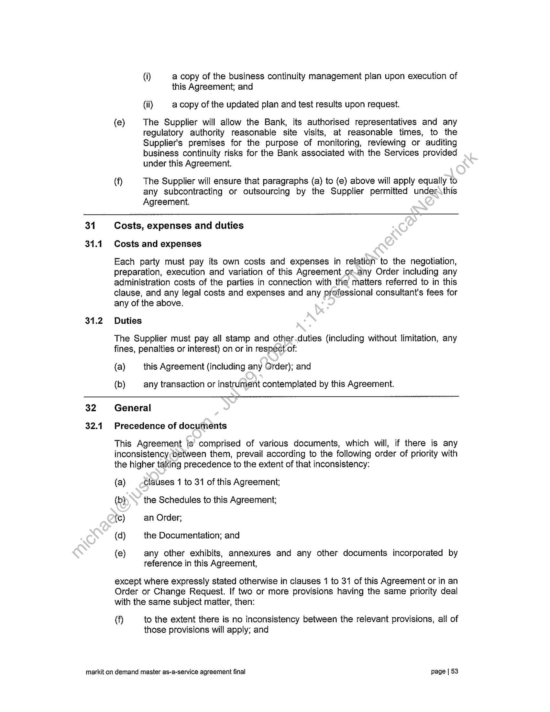
```  
```col-md
(i) a copy of the business continuity management plan upon execution of
this Agreement; and  
(ii) a copy of the updated plan and test results upon request.  
(e) The Supplier will allow the Bank, its authorised representatives and any
regulatory authority reasonable site visits, at reasonable times, to the
Supplier's premises for the purpose of monitoring, reviewing or auditing
business continuity risks for the Bank associated with the Services provided
under this Agreement.  
(f} The Supplier will ensure that paragraphs (a) to (e) above will apply equally to
any subcontracting or outsourcing by the Supplier permitted under\this
Agreement.  
31
31.1  
31.2  
32
32.1  
Costs, expenses and duties
Costs and expenses  
Each party must pay its own costs and expenses in relatian to the negotiation,
preparation, execution and variation of this Agreement orany Order including any
administration costs of the parties in connection with the matters referred to in this
clause, and any legal costs and expenses and any professional consultant's fees for
any of the above,  
Duties  
The Supplier must pay all stamp and other.duties (including without limitation, any
fines, penalties or interest) on or in respect of:  
(a) this Agreement (including any Order); and  
(b) any transaction or instrument contemplated by this Agreement.  
General
Precedence of documents  
This Agreement is comprised of various documents, which will, if there is any
inconsistencybetween them, prevail according to the following order of priority with
the higher taking precedence to the extent of that inconsistency:  
(a) clauses 1 to 31 of this Agreement;
(b) the Schedules to this Agreement;
(c) an Order;  
(d) the Documentation; and  
(e) any other exhibits, annexures and any other documents incorporated by
reference in this Agreement,  
except where expressly stated otherwise in clauses 1 to 31 of this Agreement or in an
Order or Change Request. If two or more provisions having the same priority deal
with the same subject matter, then:  
(f to the extent there is no inconsistency between the relevant provisions, all of
those provisions will apply; and  
markit on demand master as-a-service agreement final page | §3  
```
````
Notes:    
````col
```col-md
flexGrow=.5
===
> [!info] [Page 54](_attachments/images_CommonWealthSecurities-3.6.1.10.1CommonwealthBankofAustralia-MarkITonDemand-MasterAgreement.pdf_212329/page_54.png)
> 
```  
```col-md
(g) if there is an inconsistency between the relevant provisions, the more onerous
provisions will apply to the extent of that inconsistency.  
32.2 Construction  
No rule of construction applies to the disadvantage of a party because that party was
responsible for the preparation of, or seeks to rely on, this Agreement or any part of it.  
32.3. Discretion in exercising rights  
(a) Unless expressly required by the terms of this Agreement, the Bank is not
required to act reasonably in giving or withholding any consent or approval or
exercising any other right, power, authority, discretion or remedy, underior in
connection with this Agreement.  
(b) The Bank may (without any requirement to act reasonably) impose\conditions
on the grant by it of any consent or approval, or any waivet_of any right,
power, authority, discretion or remedy, under or in connection with this
Agreement. Any conditions must be complied with by the-party relying on the
consent, approval or waiver.  
32.4 Notices  
(a) notice or other communication including any\request, demand, consent or
approval, to or by a party to this Agreement:  
(i) must be in legible writing and in. English addressed as shown below:
(A) if to the Bank:
Address: ‘4)Harbour St, Sydney NSW 2000
Attention: Michael Harte
Facsimile: +61 (0) 2 9118 7192;  
with acopy to:  
Address: Ground Floor, Tower 1, 201 Sussex Street,
Sydney NSW 2000
Attention: Company Secretary  
Facsimile: +61 (0) 2 9118 7192; and
(B) if to the Supplier:
Address: 5718 Central Avenue, Boulder, CO 80301 USA
Attention: Meredith Chavel
Facsimile: (303) 444-2586
or as specified to the sender by any party by notice;  
(ii) is regarded as being given by the sender and received by the
addressee:  
(A) if by delivery in person, when delivered to the addressee;  
(B) if by post, 10 Business Days from and including the date of
postage; or  
markit on demand master as-a-service agreement final page | 54  
```
````
Notes:    
````col
```col-md
flexGrow=.5
===
> [!info] [Page 55](_attachments/images_CommonWealthSecurities-3.6.1.10.1CommonwealthBankofAustralia-MarkITonDemand-MasterAgreement.pdf_212329/page_55.png)
> 
```  
```col-md
32.5  
32.7  
32.8  
(b)  
(c)  
(C) _ if by facsimile transmission, when transmitted to the addressee
provided that the facsimile transmission is legible or regarded
as legible under paragraph (b),  
but if the delivery or receipt is on a day which is not a Business Day or
is after 4.00 pm (addressee’s time) it is regarded as received at 9.00
am on the following Business Day; and  
(iii) | can be relied upon by the addressee and the addressee is not liable to
any other person for any consequences of that reliance if the
addressee believes it to be genuine, correct and authorised by the
sender.  
A facsimile transmission is regarded as legible unless the addressee
telephones the sender within 24 hours after transmission is received or
regarded as received under paragraph (a)(ii)(C)and informs the-sender that it
is not legible.  
In this clause 32.4, a reference to an addressee includés.a reference to an
addressee’s officers, agents or employees.  
Relationship of the parties  
Nothing in this Agreement is to be construed as creating’a partnership or joint venture
between the parties nor to constitute any party the/agént of the other party.  
Governing law and jurisdiction  
(a)
(b)  
(c)  
(d)  
This Agreement is governed by the laws of England and Wales.  
Each party irrevocably submits to the non exclusive jurisdiction of the courts of
England and Wales.  
Each party irrevocably.waives any objection to the venue of any legal process
on the basis that the process has been brought in an inconvenient forum.  
Each party irrevocably waives any immunity in respect of its obligations under
this Agreement that it may acquire from the jurisdiction of any court or any
legal process for any reason including any immunity relating to the service of
notice, attachment prior to judgment, attachment in aid of execution or
execution.  
Prohibition and enforceability  
(a)  
Any provision of, or the application of any provision of, this Agreement or any
right, power, authority, discretion or remedy which is prohibited in any
jurisdiction is, in that jurisdiction, ineffective only to the extent of that
prohibition.  
Any provision of, or the application of any provision of, this Agreement which
is void, illegal or unenforceable in any jurisdiction does not affect the validity,
legality or enforceability of that provision in any other jurisdiction or of the
remaining provisions in that or any other jurisdiction.  
Waivers  
(a)  
Waiver of any right, power, authority, discretion or remedy arising from any
breach of this Agreement must be in writing and signed by the party granting
the waiver.  
markit on demand master as-a-service agreement final page | 55  
```
````
Notes:    
````col
```col-md
flexGrow=.5
===
> [!info] [Page 56](_attachments/images_CommonWealthSecurities-3.6.1.10.1CommonwealthBankofAustralia-MarkITonDemand-MasterAgreement.pdf_212329/page_56.png)
> 
```  
```col-md
32.9  
32.10  
32.11  
32.12  
32.13  
32.14  
32.15  
(b) A party is not entitled to rely on a delay in the exercise or non exercise of a
right, power, authority, discretion or remedy arising from a breach of this
Agreement or on a default under this Agreement as constituting a waiver of
that right, power, authority, discretion or remedy.  
(c) A party may not rely on any conduct of another party (including the issuance
of an Acceptance Certificate) as a defence to exercise of a right, power,
authority, discretion or remedy by that other party.  
(a) This clause 32.8 may not itself be waived except by writing.
Variation  
A variation of any term of this Agreement must be in writing, signed on behalf of the
Supplier by the Supplier Commercial Representative or by a person authorised in
writing by the Supplier Commercial Representative to vary this Agreement, and
signed on behalf of the Bank by the Bank Commercial Representative.or by a person
authorised in writing by the Bank Commercial Representative to varythis Agreement.  
Cumulative rights  
The rights, powers, authorities, discretions and remedies-ofthe Bank arising out of or
under this Agreement are cumulative and do not exclude any other right, power,
authority, discretion or remedy of the Bank except-to the extent specified in this
Agreement.  
Further assurances  
Each party must do all things and execute all further documents necessary to give full
effect to this Agreement.  
Entire agreement  
This Agreement supersedes all previous agreements in respect of its subject matter
and embodies the entire agreement between the parties.  
Survival  
(a) The rights, obligations and indemnities in clauses 19, 20, 21, 22, 23 and this
clause 314 survive the termination or expiry of this Agreement.  
(b) Any-clause which contemplates that a party has any rights or obligations after
the termination or expiry of this Agreement survives the termination or expiry
ofthis Agreement.  
(c) Where this Agreement contemplates that Services are to be provided after the
termination or expiry of this Agreement, such Services are to be provided in a
manner, and to a standard, consistent with this Agreement.  
Counterparts  
(a) This Agreement may be executed in any number of counterparts.
(b) All counterparts, taken together, constitute one instrument.  
(c) A party may execute this Agreement by signing any counterpart.
To the extent not excluded by law  
The rights, duties and remedies granted or imposed under the provisions of this
Agreement operate to the extent not excluded by law.  
markit on demand master as-a-service agreement final page [ 56  
```
````
Notes:    
````col
```col-md
flexGrow=.5
===
> [!info] [Page 57](_attachments/images_CommonWealthSecurities-3.6.1.10.1CommonwealthBankofAustralia-MarkITonDemand-MasterAgreement.pdf_212329/page_57.png)
> 
```  
```col-md
32.16 Trust  
(a) The parties acknowledge that the Supplier's obligations under this Agreement
are expressed as obligations to each Bank Group Member and IT Service
Provider. The Bank holds the benefits of such obligations as principal and as
agent for the other Bank Group Members and IT Service Providers.  
(b) The Bank will act in its own right and as the agent of each Bank Group
Member and IT Service Provider in respect of the enforcement of any rights
and remedies under this Agreement, including the recovery of Service Credits
for and on behalf of each Bank Group Member.  
(c) The Bank may sue the Supplier and recover from the Supplier such damages
that any Bank Group Member or IT Service Provider would have beenentitled
to recover against the Supplier directly, to the extent such damagés would
have been recoverable by the Bank from the Supplier had they been suffered
by the Bank.  
(d) The Bank may vary, amend, enforce or otherwise act under, this Agreement
without seeking the approval of the other Bank Group-Members or the IT
Service Provider.  
(e) Without limiting any of the foregoing, the Bank is.entitled to exercise all rights,
powers, authorities, discretions or remedies ‘conferred on the Bank by this
Agreement, or any applicable Laws, as if the:Bank were the sole beneficiary of
the obligations of the Supplier under this Agreement.  
32.17 Severability  
If any provision of this Agreement is held to be invalid, unenforceable or illegal for any
reason, this Agreement will remain otherwise in full force apart from such provision
which will be deemed deleted.  
32.18 Public statements  
A party may not make any public statement about this Agreement, or anything related
to the subject matter,ofsthis Agreement, without the prior express written consent of
the other party.  
Markit on demand master as-a-service agreement final page | 57  
```
````
Notes:    
````col
```col-md
flexGrow=.5
===
> [!info] [Page 58](_attachments/images_CommonWealthSecurities-3.6.1.10.1CommonwealthBankofAustralia-MarkITonDemand-MasterAgreement.pdf_212329/page_58.png)
> 
```  
```col-md
Executed by the parties as an agreement {please date and sign where marked (X)}  
Dated: ().00.2, haa! 2°13  
Signed for and behalf of Commonwealth
Bank of Australia by its authorised
representative in the presence of:  
(X).  
Witness d-representative  
Print name  
Print name  
Signed for and behalf of Markit On
Demand by its authorised representative  
in the presence of:
(x {|| |
wed  
(0.5500 4. PAS. cssrssnsm re  
Print name (>. 4 Brreieerrcrrtrere re pecreerrtcrernr eer eecns Leese  
Print name  
markit on demand master as-a-service agreement final page | 58  
```
````
Notes:    
````col
```col-md
flexGrow=.5
===
> [!info] [Page 59](_attachments/images_CommonWealthSecurities-3.6.1.10.1CommonwealthBankofAustralia-MarkITonDemand-MasterAgreement.pdf_212329/page_59.png)
> 
```  
```col-md
Schedule 1 - Dictionary
1 Dictionary
In this Agreement:  
Acceptance means, in relation to a particular Service, the issuance of an Acceptance
Certificate by the Bank pursuant to clause 15(c) in respect of that Service.  
Acceptance Certificate has the meaning given to that term in clause 15(c).  
Acceptance Test Plan means, in relation to a particular Service, the Acceptance test
plan prepared by the Supplier and approved by the Bank in respect of that Service,
and which sets out (amongst other things) the Acceptance Tests for that Service.  
Acceptance Tests means, in relation to a particular Service, the acceptaice tests in
respect of that Service conducted in accordance with an approved Acceptance Test
Plan.  
Agreement means this document, including any Schedules andAnnexures, and any
Orders.  
Annexure means an Order annexed to Schedule-5 (Executed Orders) of this
Agreement.  
Associate has the meaning given to that term in’the Corporations Act.  
At-Risk Amount means the total amount of Service Credits payable by the Supplier
to the Bank under an Order in any particular‘month, as set out in the relevant Order.  
Auditor means any auditor, inspector, regulator or other representative (with or
without auditing backgrounds or;skills) of a Bank Group Member, any Government
Agency or any other body, which) the Bank nominates in writing from time to time.  
Bank Data means all data and information (including Personal Information) relating to
any Bank Group Member~or associate and their respective operations, facilities,
customers, Personnel(assets, products, sales and transactions in whatever form
such information may exist, including any data produced, generated, or processed in
the provision of the.Services for the Bank, and includes any:  
(a) database in which such information is contained;
(b) documentation or records related to such data or information;
(c) products resulting from the use or manipulation of such data or information;  
(d) any other data and other information entered into, generated by, stored by, or
processed by any Bank equipment or Bank Systems; and  
(e) any and all copies of the above.
Bank Group means the Bank and its Related Bodies Corporate from time to time.
Bank Group Member means the Bank and any other member of the Bank Group.  
Bank Owned Deliverables means any information, materials or literary works
created by Supplier for Bank under this Agreement, including any software, data,
processes, manuals, reports and training materials.  
markit on demand master as-a-service agreement final page | 59  
```
````
Notes:    
````col
```col-md
flexGrow=.5
===
> [!info] [Page 60](_attachments/images_CommonWealthSecurities-3.6.1.10.1CommonwealthBankofAustralia-MarkITonDemand-MasterAgreement.pdf_212329/page_60.png)
> 
```  
```col-md
Bank Policies mean those policies (including any ITIL policies and security policies)
notified to the Supplier by the Bank from time to time.  
Bank Related Activities means:
(a) providing services to the Bank Group;  
(b) third parties offering Bank Group products or services to the public or using
Bank Group technology under a Bank Group Member's oversight; and  
(c) all other use of Services in connection with the Bank Group’s business.  
Bank Systems means the information technology, communications or business
systems (including hardware, software and networks) in conjunction with which the
Services are required to operate.  
Bank Task means any specific task or obligation expressly specified as a “Bank
Task” in this Agreement, and which is to be performed by, or on behalfof, the Bank.  
Business Day means:  
(a) for the purposes of clause 4, a day on which banks are open for business in
the city where the notice or other communicatiomis received, excluding any
Saturday, Sunday or public holiday; and  
(b) for all other purposes, a day on which banks are open for business in New
York and Sydney, excluding any Saturday), Sunday or public holiday.  
Business Hours means 8.00am to 6.00pm on a Business Day.
Change in Control of the Supplier means ‘that after the date of this Agreement:  
(a) a Competitor, either alone or together with any Associate of that person,
becomes entitled (as defined in the Corporations Act) to more than 5% of the
issued voting shares ofthe Supplier or any of its Related Bodies Corporate;  
(b) the Supplier or any-of its Related Bodies Corporate, either alone or together
with any Associate of that person, becomes entitled (as defined in the
Corporations. Act) to more than 5% of the issued voting shares of a
Competitor:  
(c) any .other person, either alone or together with any Associate of that person,
becomes entitled (as defined in the Corporations Act) to more than 15% of the
issued voting shares of the Supplier or any of its Related Bodies Corporate;  
(d). a Competitor appoints a member of the Board of Directors of the Supplier or
any of its Related Bodies Corporate; or  
(e) the Supplier or any of its Related Bodies Corporate appoints a member of the
Board of Directors of a Competitor.  
Change Request has the meaning given to that term it in clause 3.4.  
Commencement Date means fu. 28, 201%  
Commercial Representative means a party's representative nominated for the
purposes of clause 3.4 and clause 7.  
Competitor means any person that conducts business in competition with any Bank
Group Member from time to time.  
markit on demand master as-a-service agreement final page | 60  
```
````
Notes:    
````col
```col-md
flexGrow=.5
===
> [!info] [Page 61](_attachments/images_CommonWealthSecurities-3.6.1.10.1CommonwealthBankofAustralia-MarkITonDemand-MasterAgreement.pdf_212329/page_61.png)
> 
```  
```col-md
Conditions Precedent means the conditions precedent set out in clause 4.
Confidential Information of a party means any information:
(a) regarding the business or affairs of that party or its Related Bodies Corporate;  
(b) regarding the customers, employees or contractors of, or other persons doing
business with, that party or its Related Bodies Corporate;  
(c) regarding the terms of this Agreement, or the commercial arrangements
between the parties;  
(d) which is by its nature confidential or which is designated as confidential by that
party,  
(e) where the Bank is the disclosing party, which is Bank Data;  
(f} which is “personal information” as that term is defined in the Privacy Act 1988
(Cth), and which the Supplier holds, creates or receives.in relation to the
Services; or  
(g) which the other party knows, or ought to know, is confidential.  
Confidentiality Deed means a deed substantially-in» the form of Schedule 3
(Confidentiality Deed).  
Copyright Material has the meaning given to that term in clause 18.3.
Corporations Act means the Corporations Act 2001 (Cth).
Cut Off Date means the date 14 days after the Commencement Date.  
Deal means sell, transfer, assign, dispose of, commercialise, lease, rent, convert,
grant an option over, allot, declare-a trust over, or otherwise deal with.  
Deed of Guarantee means.a document in the form of Schedule 6 (Form of Parent
Guarantee).  
Defect means anything that results in the Services or Supplier Owned Deliverables:  
(a) failing to. comply with the warranties in clause 18 (where applicable) or any
other part of this Agreement (including any Schedule);  
(b) doing something that they were not designed to do;
(c) results in them not doing something that they were designed to do;  
(gd) without limiting the generality of paragraph (a), (b) or (c) above, not operating
in accordance with the Service Levels or Specifications; and/or  
(e) in clause 15, failing to pass its Acceptance Tests.
Delay occurs when the Supplier:  
(A is late in complying with any provision of this Agreement for which the Bank
specifies that time is critical or of the essence, where such delay is due solely
to the action or inaction of Supplier; or  
(g) is more than 3 calendar days late in carrying out any work under this
Agreement, where such delay is due solely to the action or inaction of
Supplier.  
markit on demand master as-a-service agreement final page | 61  
```
````
Notes:    
````col
```col-md
flexGrow=.5
===
> [!info] [Page 62](_attachments/images_CommonWealthSecurities-3.6.1.10.1CommonwealthBankofAustralia-MarkITonDemand-MasterAgreement.pdf_212329/page_62.png)
> 
```  
```col-md
Disabling Code means any virus, bomb, Trojan horse or other malware or computer
programming code, including source and object code, which may impair, deny or
otherwise adversely affect Use of the Services.  
Dispute means any dispute of any form which arises out of or relates to:
(a) the Services; or  
(b) this Agreement, including the entry into, breach, termination or validity of this
Agreement.  
Dispute Notice means a notice that a Dispute exists and which complies with clause
24.1(a).  
Documentation means manuals including release notes, reference \ guides,
specifications or other documents relating to the Services provided to the Bank by the
Supplier.  
Due Diligence Screening means [the screening procedures setout in Schedule 8
(AML Due Diligence Screening).  
Executives means the party’s representatives nominated in an Order for the
purposes of clause 24.2  
Fees means all amounts payable by the Bank under this Agreement for the Services,
as set out in the relevant Order.  
Force Majeure Event means fire, storm, flood) earthquake, explosion, accident, acts
of the public enemy, terrorist acts, war, rebellion, insurrection, sabotage, epidemic,
quarantine restriction, transportation embargo, and strikes by employees of a third
person. A strike by employees of a party or employees of a subcontractor of a party
(or both) is not a Force Majeure-Event unless the strike is part of an industry-wide
campaign which does not arise put of a dispute between that party or subcontractor
and one or more of its employees (proof of which will fall on the party claiming that
the strike is a Force Majeure-Event).  
Government Agency. means any government or any governmental, semi
governmental, administrative, fiscal or judicial body, department, commission,
authority, tribunal,“agency or entity.  
GST Law means A New Tax System (Goods and Services Tax) Act 1999 (Cth).  
Industry Standard means those generally accepted industry standards prevailing
from time to time in the information technology business. For the avoidance of doubt
thissincludes to ISO 9001, ISO/IEC 90003:2004, Cobit Version 4 and CMMI-Dev
Version 1.2.  
Insolvency Event means the occurrence of any one or more of the following events:  
(a) an application is made to a court for an order, or an order is made, that it be
wound up, declared bankrupt or that a provisional liquidator or receiver or
receiver and manager be appointed;  
(b) a liquidator or provisional liquidator is appointed;  
(c) an administrator (as defined in section 9 of the Corporations Act) or a controller
(as defined in section 9 of the Corporations Act) is appointed to any of its
assets;  
markit on demand master as-a-service agreement final page | 62  
```
````
Notes:    
````col
```col-md
flexGrow=.5
===
> [!info] [Page 63](_attachments/images_CommonWealthSecurities-3.6.1.10.1CommonwealthBankofAustralia-MarkITonDemand-MasterAgreement.pdf_212329/page_63.png)
> 
```  
```col-md
(d) it enters into an arrangement or composition with one or more of its creditors, or
an assignment for the benefit of one or more of its creditors, in each case other
than to carry out a reconstruction or amalgamation while solvent;  
(e) it proposes a winding-up, dissolution or reorganisation, moratorium, deed of
company arrangement or other administration involving one or more of its
creditors;  
(f} it is insolvent as disclosed in its accounts or otherwise, states that it is insolvent,
is presumed to be insolvent under an applicable law (including under section
459C(2) or section 585 of the Corporations Act) or otherwise is, or states thatiit
is, unable to pay all its debts as and when they become due and payable;  
(g) it becomes, or states that it is, an insolvent under administration (as defined in
section 9 of the Corporations Act) or action is taken which could result in that
event;  
(h) an order is made, a resolution is passed, proposal put forwerd or any other
action taken, in each case which is preparatory to or could result in any of the
matters referred to in paragraphs (i) to (vii) inclusive;  
(i) itis taken to have failed to comply with a statutory demand as a result of section
459F(1) of the Corporations Act;  
(j) | anotice is issued under sections 601AA or 601AB of the Corporations Act ;
(k) a writ of execution is levied against it or a material part of its property;  
(l) any step is taken by a mortgagee toventer into possession of or dispose of the
whole or any part of the other party's‘assets or business; or  
(m) anything that occurs under-the law of any jurisdiction which has a substantially
similar effect to any of the-above paragraphs of this definition.  
Intellectual Property Rights means:  
(a) all industrial and intellectual property rights throughout the world and includes
rights in respect of copyright, patents, trade marks, designs, trade secrets,
know-how, confidential information and circuit layouts; and  
(b) any application or right to apply for registration of any of the rights referred to
in paragraph (a).  
IPR Claim has the meaning given to that term in clause 19.5(a).
Issue has the meaning given to that term in clause 2.2(b).  
!T Service Provider means any person or persons providing information technology
services to the Bank Group from time to time.  
Jurisdiction means:
(a) Australia and the United States; and
(b) any other jurisdiction specified in Schedule 9 (Supplier Sites).  
Key Personnel means the Personnel of the Supplier specified in an Order who are
required to undertake the supply of the relevant Services.  
Knowledge Management Materials means:  
markit on demand master as-a-service agreement final page | 63  
```
````
Notes:    
````col
```col-md
flexGrow=.5
===
> [!info] [Page 64](_attachments/images_CommonWealthSecurities-3.6.1.10.1CommonwealthBankofAustralia-MarkITonDemand-MasterAgreement.pdf_212329/page_64.png)
> 
```  
```col-md
(a) the Documentation;  
(b) the materials that the Supplier is required to develop or capture under clause
10.2; and  
(c) any additional materials specified as such in this Agreement.
Law means any:  
(a) law of Australia or another Jurisdiction, including Commonwealth, State,
Territory, local government legislation or any regulations, by-laws,
declarations, ministerial directions and other subordinate legislation;  
(b) common law;  
(c) Government Agency requirement or authorisation (including conditions in
tespect of any authorisation); and  
(d) code of conduct, writ, order, injunction or judgment.  
MLI/TF Risk means the risk that the Bank may face that the provision of services by it
might involve or facilitate money laundering or the financing _ofterrorism.  
Moral Rights has the meaning given to that term in the Copyright Act 1968 (Cth).
Objectives means the objectives set out in clause,2. 1:  
Order means an order for Services in the form’ of Schedule 2 (Template Order) (with
such changes to the form as the parties may agree), executed by the parties,
containing the contract details for the provision of the Services.  
Open Source Software means Software that, as a condition of its Use or
development requires that such software, any developments to that software or any
other software with which such Software is combined or distributed be:  
(a) disclosed or distributed: in source code or object code form;
(b) licensed to the general public for development or other purposes; or
(c) redistributable;  
Operational Representative means the person specified in paragraph 8 of an Order
as being a point of contact in relation to the operational aspects of that Order.  
Personhnei Due Diligence Program has the meaning given to that term in clause
13(a):  
Personal Information means information or an opinion (including information or an
opinion forming part of a database) whether true or not, and whether recorded in
material form or not, about an individual whose identity is apparent, or can be
reasonably ascertained, from the information or opinion.  
Personnel means the officers, employees, agents, contractors and subcontractors of
a party, and includes the officers, employees, agents, contractors and subcontractors
of any subcontractor.  
Prescribed Rate means the interest rate for overdrafts of $100,000 or more charged
by the Bank, calculated on daily rests from the due date to the day of payment.  
Priority means the priority assigned by the Bank to a problem as more specifically
set out in the Service Levels.  
markit on demand master as-a-service agreement final page | 64  
```
````
Notes:    
````col
```col-md
flexGrow=.5
===
> [!info] [Page 65](_attachments/images_CommonWealthSecurities-3.6.1.10.1CommonwealthBankofAustralia-MarkITonDemand-MasterAgreement.pdf_212329/page_65.png)
> 
```  
```col-md
Privacy Legislation means:
(a) the Privacy Act 1988 (Cth);  
(b) any legislation (to the extent that such legislation applies to the Bank Group or
the Supplier or any other recipient of Personal Information) from time to time in
force in:  
(i) [the Jurisdiction][any Australian jurisdiction (which includes the
Commonwealth of Australia and any State or Territory of Australia)];
and  
(ii) any other jurisdiction (to the extent that the Bank or any Personal
Information or the Supplier is subject to the laws of that jurisdiction),  
affecting privacy, Personal Information or the collection, handling, storage,
processing, use or disclosure of personal data;  
(c) any ancillary rules, guidelines, orders, directions, directives;codes of conduct
or other instruments made or issued under any of the legislation referred to in
paragraph (b) above, as amended from time to time; and  
(d) without limiting any of the foregoing clauses ofthis definition, any relevant
privacy laws in the Supplier's jurisdiction.  
Protected Information means:  
(a) any Personal Information (including tax file numbers, credit information files or
credit reports or any other information relating to an individual), whether in a
written, oral or other form, in respect of which the Supplier or the Bank:  
(iii) has a duty not to engage in any act or practice which constitutes; or  
(iv) is required to_undértake a specified act or practice, or to provide
specified protection, failure to do or provide which is,  
an interference with privacy; or  
(b) any information which any Bank Group Member must at law or in equity keep
confidential.  
Regulator means any body having regulatory or supervisory authority over any part
of the business or affairs of the Bank including the Australian Prudential Regulation
Authoritysand the Australian Securities and Investments Commission.  
Regulatory and Industry Requirements mean any:  
(a) financial services industry-wide non-statutory rule or obligation;  
(b) other non-statutory rule or non-statutory mandatory code of conduct; and
{c) any industry-wide voluntary code, contract or arrangement,  
applicable and in force in the Jurisdiction or any other jurisdiction where the Services
are provided.  
Repeated Breach means a breach of a warranty that has occurred two or more times
in any rolling 12 month period during the term of this Agreement.  
Required insurances means the insurance policies required to be effected and
maintained by the Supplier in accordance with clause 25.  
markit on demand master as-a-service agreement final page | 65  
```
````
Notes:    
````col
```col-md
flexGrow=.5
===
> [!info] [Page 66](_attachments/images_CommonWealthSecurities-3.6.1.10.1CommonwealthBankofAustralia-MarkITonDemand-MasterAgreement.pdf_212329/page_66.png)
> 
```  
```col-md
Resources means Personnel, facilities, systems, software, equipment, procedures,
processes and other resources.  
Related Body Corporate has the meaning given to that term in the Corporations Act.  
Risk means any reasonably foreseeable internal or external event or issue (whether
relating to Personnel, process, technology or otherwise) that is likely to or could
adversely affect the delivery or performance of the Services or the reputation of the
Bank Group.  
Risk Assessment and Mitigation Plan means:  
{a) an assessment performed and documented by the Supplier for the purpose of
assessing risk to the Bank Group resulting from any proposed act or-matter;
and  
(b) a plan formulated by the Supplier for the purpose of mitigating the risk
contemplated by paragraph (a).  
Risk Control means any processes, policies, activities, actions or things used to
mitigate Risks (and which may specify relevant individuals\who are responsible for
such processes, policies, activities, actions or things).  
Root Cause Analysis means the process by which thé underlying root cause(s) of a
Defect is/are identified.  
Safety Legislation means all applicable ° Occupational Health and Safety,
Environment Protection, Dangerous Goods and Electricity Safety legislation and
regulations made thereunder, together withany directions on safety or notices issued
by any relevant authority or any Code Of Practice or Compliance Code appropriate or
relevant to the supply of the Services.  
Safety Requirements means)any and all directions, instructions, requests or
requirements relevant to, associated with or necessary for compliance by the Supplier
or the Bank with Safety Legislation and including any such matters of which the
Supplier has been informed by the Bank orally or in writing.  
Security Requirements means the security requirements set out in Schedule 7
(Bank Security Requirements).  
Service Credits means the service credits awarded against the Supplier for a failure
to meet Service Levels, as set out in the applicable Order.  
Service Levels means the service levels to be met by the Supplier in relation to the
Services, as set out in the applicable Order.  
Services means the services specified in an Order and any other services provided
by the Supplier under this Agreement.  
Specifications means the following documents (in the following order of priority if
there is any inconsistency between the documents):  
(a) any specifications in this Agreement, including an Order, which specify the
agreed requirements for quality, functionality, performance, interoperability,
testing and other requirements;  
(b) the Documentation; and  
{c) the Supplier's or the manufacturer’s published specifications,  
markit on demand master as-a-service agreement final page | 66  
```
````
Notes:    
````col
```col-md
flexGrow=.5
===
> [!info] [Page 67](_attachments/images_CommonWealthSecurities-3.6.1.10.1CommonwealthBankofAustralia-MarkITonDemand-MasterAgreement.pdf_212329/page_67.png)
> 
```  
```col-md
for the Services.  
Standards means any regulatory or industry standards which are relevant to the
Services being provided under any Order.  
Supplier Employee means, in relation to the Supplier, any employee, secondee,
agent, principal, contractor and subcontractor (including any subcontractor involved in
the supply of the Services regardless of whether they are engaged directly by the
Supplier or by one of the Supplier's subcontractors) who is an individual and includes
any person who is a prospective employee, secondee, agent, principal, contractor or
subcontractor.  
Supplier Owned Deliverables means any information, materials or literary works
provided by the Supplier under this Agreement, including any software.) data,
processes, manuals, reports and training materials (but excluding any Bank Owned
Deliverables or Bank Data).  
Supplier Parent means the Supplier's ultimate parent company, which as at the date
of execution of this Agreement is Markit Group Limited.  
Supplier Sites means any site, facility or other premises used in the performance of
the Services (including sites, facilities or other premises Not-directly controlled by the
Supplier), as set out in Schedule 9 (Supplier Sites) or an.Order.  
Supplier Systems means the Supplier's information technology, communications or
business systems (including hardware, software’and networks).  
Tax means any tax, levy, charge, impost, duty, fee, deduction, compulsory loan or
withholding (including GST) which is assessed, levied, imposed or collected by any
Government Agency and includes any)interest, fine, penalty, charge, fee or other
amount imposed in respect of any of the above.  
Tax Deduction means a deduction or withholding for or on account of Taxes from a
payment.  
Tax Invoice has the meaning given to that term in the GST Law and includes any
document or record treated by the Commissioner of Taxation as a tax invoice or as a
document entitling a jecipient to an input tax credit.  
Term has the meaning given to that term in clause 3.2.  
Use includes install, use, access, modify, copy, develop, enhance, reproduce,
distribute,transmit, perform and display.  
Workaround means a change to the Services, or a different way of using the
Services, which materially reduces the impact of a Defect or error.  
markit on demand master as-a-service agreement final page | 67  
```
````
Notes:    
````col
```col-md
flexGrow=.5
===
> [!info] [Page 68](_attachments/images_CommonWealthSecurities-3.6.1.10.1CommonwealthBankofAustralia-MarkITonDemand-MasterAgreement.pdf_212329/page_68.png)
> 
```  
```col-md
Schedule 2 - Template Order  
Parties  
Commonwealth Bank of Australia (ACN 123 123 124) of Ground Floor, Tower 1,
201 Sussex Street, Sydney NSW 2000, Australia (Bank)  
Markit On Demand, Inc., of 5718 Central Avenue, Boulder, CO 80301 USA (Supplier)  
1  
Oy) & WwW N  
Background  
(a)  
(b)  
(c)  
()  
The parties acknowledge and agree that:  
(i)  
(ii)  
(iii)  
(iv)  
this Order is made pursuant to and is governed by the terms and
conditions of the Master As-a-Service Agreement between the Supplier
and the Bank dated {insert date} (Agreement);  
any terms used but not defined in this'Order have the meaning given to
them in the Agreement;  
this Order forms part of the Agreement and all provisions of the
Agreement are applicable tothis Order;  
any amendments to this Order must be evidenced in writing, signed by
the Supplier and signed/on behalf of the Bank by the Bank Commercial
Representative of)\@ person authorised in writing by the Bank
Commercial Representative to do so.  
The Supplier will provide the Services, as set out in paragraph 2 of this Order
to the Bank, subject to the terms and conditions of the Agreement.  
The Bank must in consideration of the Supplier performing the Services, pay
the Supplier the Fees, as set out in paragraph 4 of this Order.  
The:persons identified in paragraph 5 of this Order are Key Personnel for the
Services which are the subject of this Order.  
Commencement and duration  
Services  
Fees  
Key Personnel  
{Insert names of Key Rersonnel.}  
Acceptance  
(a)  
Acceptance  
(i)  
Acceptance Te
performed on eac
the Agreement}  
line the acceptance tests required to be
ervice in accordance with clause 15(a) of  
markit on demand master as-a-service agreement final page | 68  
```
````
Notes:    
````col
```col-md
flexGrow=.5
===
> [!info] [Page 69](_attachments/images_CommonWealthSecurities-3.6.1.10.1CommonwealthBankofAustralia-MarkITonDemand-MasterAgreement.pdf_212329/page_69.png)
> 
```  
```col-md
(A) ‘Acceptance Date for the Service: {Insert date}  
(b) For every Business Day past the Acceptance Date that the Service remains
not accepted, the aggregate Fees otherwise payable for the relevant Service
will be reduced by an amount equalling {insert} percent (insert%) per day  
(c) The Supplier acknowledges that time is of the essence in respect of the dates
specified in this paragraph 5.  
7 Service Levels and Service Credits  
{Insert details of the Service Levels and Service C
any)}
71 Notification by Bank
(a) The Bank will notify the Supplier's helpdesk of any Defect.with the Service. At
that time, the Bank will instruct the Supplier Personnel of the Priority assigned  
to such Defect, which the Bank must reasonably determine in accordance with
paragraph 7.2.  
(b) Both the Supplier Personnel receiving the call and the Bank Personnel
reporting the Defect will agree on the time of the call (to the nearest minute)
and will record that time.  
(c) On receipt of the call by the Bank to.the Supplier, the Supplier will take the
actions set out below in paragraph 7.2 for the applicable Priority.  
(d) The “Response Time” set out below in paragraph 7.2 is measured as the time
between:  
(i) the recorded time of the relevant call from the Bank to the Supplier is
made; and  
(ii) the time\of receipt of a return call from a representative of the Supplier
qualified to manage the Defect or inquiry.  
(e) The time-frames for “Response Action” set out below in paragraph 7.2 will be
measured as the time between:  
) the recorded time of the relevant call from the Bank to the Supplier is
made; and  
(ii) the time the Supplier completes all required actions.  
7.2.0» Priority Assignment and Service Levels  
markit on demand master as-a-service agreement final page | 69  
```
````
Notes:    
````col
```col-md
flexGrow=.5
===
> [!info] [Page 70](_attachments/images_CommonWealthSecurities-3.6.1.10.1CommonwealthBankofAustralia-MarkITonDemand-MasterAgreement.pdf_212329/page_70.png)
> 
```  
```col-md
Priority 4
“Critical
Defect”  
Priority 2
"Significant
Defect’  
Priority 3
“Low-impact
Defect”  
A Defect | 10 The Supplier will immediately commence  
which minutes | continual problem resolution using best  
causes a endeavors to isolate and diagnose the
critical Defect.  
service Within 30 minutes the Supplier will provide  
impact the Bank with an evaluation of the Defect  
andor a and a plan to resolve it.  
critical pat The plan will include time-frames required to  
3 . le effect a work-around and/or permanent  
not ice ls resolution.  
available or The time-frames set out in the plan must  
not working be acceptable to the Bank.  
correctly, eAs a minimum, the Supplier musteffect a
work-around within 4 hours of the initial
call to the Supplier's helpdesk.  
«The Supplier will implement the agreed
plan and continue work until either:
41. permanent resolution is effected; or
2. a work-around is effected and, upon
agreement by the technical
representatives of both parties (acting
reasonably), the problem is downgraded.  
A Defect | 30 The» Supplier will commence problem  
affects minutes resolution using best endeavors to isolate  
normal and diagnose the Defect.  
operation or + Within 2 hours the Supplier will provide the  
Service Bank with an evaluation of the Defect and  
quality of a plan to resolve it.  
the Service nan F .  
and/or ¢The plan will include time-frames required  
prevents. or to effect a work-around and/or permanent
inhibitsC@he resolution.  
Bank's) Use eThe time-frames set out in the plan must  
of the be acceptable to the Bank.  
Service. eAs a minimum, the Supplier must effect a
work-around within 8 hours of the initial
call to the Supplier's helpdesk.  
eThe Supplier will implement the agreed
plan and continue work until either:
41.permanent resolution is effected; or
2.a work-around is effected and, upon
agreement by the technical
representatives of both parties (acting
reasonably), the problem is downgraded.  
A minor | 2 hours eThe Supplier will commence problem  
Defect that resolution using reasonable endeavors to  
does not isolate and diagnose the Defect, or assess  
affect
normal
operation or
service  
the error in the Documentation or answer
the inquiry, as the case may be.  
eln the case of a Defect, within 24 hours  
markit on demand master as-a-service agreement final  
page | 70  
```
````
Notes:    
````col
```col-md
flexGrow=.5
===
> [!info] [Page 71](_attachments/images_CommonWealthSecurities-3.6.1.10.1CommonwealthBankofAustralia-MarkITonDemand-MasterAgreement.pdf_212329/page_71.png)
> 
```  
```col-md
(a)  
(b)  
(d)  
{e)  
quality of the Supplier will provide the Bank with an  
the Service, evaluation of the Defect and a plan to
or an error resolve it. The plan will include time-frames
in the tequired to effect a work-around and/or
documentati permanent resolution. The time-frames set
on, or a out in the plan must be acceptable to the
technical Bank. As a minimum, the Supplier must  
effect a work-around within 72 hours of the
initial call to the Supplier's helpdesk. The
Supplier will implement the agreed plari
and continue work until permanent
resolution is effected.  
eln the case of an error \in the
Documentation, within 24 hours the
Supplier will clarify the. error and, if
applicable, provide the~Bank with the
corrected information.  
ein the case of an inguiry, within 24 hours  
the Supplier will.answer the inquiry to the
satisfaction ofthe’Bank.  
inquiry.  
Service Creditslf the Supplier fails to meet\a specified combination of Service
Levels as defined below in any calendar month, then without limiting any other
right or remedy, the Bank will be entitled to Service Credits for that calendar
month.  
At the commencement of each-calendar month the Supplier must provide a
report (a Service Level Report) to the Bank reporting on all failures to comply
with the Service Levels (inthe previous month and indicating the total amount
of Service Credits for that‘month.  
Service Credits will be credited to the Bank in accordance with clause 16.2(c)
of the Agreement.  
The amount-of Service Credit payable by the Supplier to the Bank in any
particular. month is based on an amount of money deemed to be at risk (the
At-Risk)Amount). The total At-Risk Amount equals the greater of:  
(iy [20% of the Fees paid or payable by the Bank under Order in the thencurrent Year]; or  
(i) {INSERT}.  
The Service Level failures that give rise to Service Credits and the associated
Service Credit amounts are:  
(i) for any two breaches of timeframes defined in paragraphs 7.1 and 7.2
during a calendar month the Supplier will credit the Bank with 20% of
the At-Risk Amount;  
(ii) for any three breaches of timeframes defined in paragraphs 7.1 and
7.2 during a calendar month the Supplier will credit the Bank with 40%
of the At-Risk Amount;  
markit on demand master as-a-service agreement final page | 71  
```
````
Notes:    
````col
```col-md
flexGrow=.5
===
> [!info] [Page 72](_attachments/images_CommonWealthSecurities-3.6.1.10.1CommonwealthBankofAustralia-MarkITonDemand-MasterAgreement.pdf_212329/page_72.png)
> 
```  
```col-md
7.3  
7.4  
7.1  
(iii) for any four breaches of timeframes defined in paragraphs 7.1 and 7.2
during a calendar month the Supplier will credit the Bank with 60% of
the At-Risk Amount; or  
(iv) for any five breaches of timeframes defined in paragraphs 7.1 and 7.2
during a calendar month the Supplier will credit the Bank with 80% of
the At-Risk Amount.  
(f) The Service Level failures set out in paragraph (e) pertain only to the calendar
month in which they occur. For the avoidance of doubt they cannot be counted
from one calendar month to another.  
(g) Service Credits are a reduction in the amounts payable by the Bank in respect
of the Services and do not include GST. If a Service Credit applies in.cespect
of Services for which the Bank has already paid the Supplier, the Supplier will
pay to the Bank an amount equal to the Service Credit, together with the
amount representing the overpaid GST in accordance with clatise 17 of this
Agreement.  
Limitation on Defect Correction
The Supplier is not permitted to use a correction process:td correct a Defect if:  
(a) the correction process will result in the Service becoming unusable (or its
performance becoming degraded) for mere than a length of time to be
agreeable to the Bank on any one occasion, such time to be agreed prior to
the commencement of any correction process; or  
(b) the correction will require the Bank to upgrade any of the software that is
used, or that the Bank uses, with\the Service,  
and must correct the Defect usingan alternative process, unless the Supplier proves
to the Bank’s satisfaction that there is no other way to correct the Defect.  
Interface Procedure  
The Supplier's helpdesk contact details are as follows:  
Telephone (Business Hours) 1800.20.    
Telephone {all other times) 02).    
Minimuim-information to be supplied by the | {e.g. reference numbers, on-line
Bankwhen placing a call to the helpdesk access order etc.}  
Escalation Procedures  
If there is no response from the Supplier's helpdesk numbers in accordance with the
Service Levels:  
First point of escalation {name and title} {mobile
number}  
Second point of escalation | {name and title} | {mobile
number}  
Documentation  
{Insert details, and number of copies of any Documentation to be provi  
Supplier}  
markit on demand master as-a-service agreement final page | 72  
```
````
Notes:    
````col
```col-md
flexGrow=.5
===
> [!info] [Page 73](_attachments/images_CommonWealthSecurities-3.6.1.10.1CommonwealthBankofAustralia-MarkITonDemand-MasterAgreement.pdf_212329/page_73.png)
> 
```  
```col-md
10  
1  
Bank Tasks
> Bank or an IT Service Provider to perform  
{Specify any tasks that itis essential r
tions under this Order}  
in order to enable the Supplier to f  
Reporting  
Contact Details  
EXECUTIVES  
The Executives nominated for the purposes of clause 3.4 and clause 24.2(b).of the
Agreement, in relation to the Services set out in this Order are:  
(a) for the Bank: the Chief Information Officer of the Bank; and
(b) for the Supplier: {insert job title} of the Supplier.
0) Bank Operational Representatives  
Bank’s first point of {name and title} {mobile
contact with respect to number}
the operational aspects of  
this Order  
Bank’s second point of {name and title} {mobile
contact with respect to number}
the operational aspects of  
this Order  
(ii) Supplier operational representatives  
Supplier's fitst point of {name and title} {mobile
contact.with respect to number}
the operational aspects of  
this Order  
Supplier's second point of {name and title} {mobile
contact with respect to number}
the operational aspects of  
this Order  
Executed by the parties as a work order {please date and sign where marked (X)}  
Dated: (X).    
sseesvccccssccessceeeesennes  
markit on demand master as-a-service agreement final page | 73  
```
````
Notes:    
````col
```col-md
flexGrow=.5
===
> [!info] [Page 74](_attachments/images_CommonWealthSecurities-3.6.1.10.1CommonwealthBankofAustralia-MarkITonDemand-MasterAgreement.pdf_212329/page_74.png)
> 
```  
```col-md
Signed for and behalf of Commonwealth
Bank of Australia by its authorised
representative in the presence of:  
(HK) .eseessecenersscousoessconsenenevessesserectssrvansess (XK) cescccsecsscssstevseesevsrerensneseeeeneesserneenennes  
Witness Authorised representative  
(XK) scersesescsssscensessnesensenseecessuseensesennnesserane  
Print name (X) seep snaecenssaeennansucerassnnervauaasessenesevessunsees
Print name  
Signed for and behalf of Markit On  
Demand, Inc. by its authorised  
representative in the presence of:  
(X).  
ceeeecereers arssvenuvensnenseenererventseseneenesenses (XK) scsssccesqreterescesreeeseseterseeeeee euseenacerseesees  
Witness Authorised representative  
(K) seerssereresevsonenes evectteaeneetsaeeesererssenseenees  
Print name (X).   
  
markit on demand master as-a-service agreement final  
Print name  
page | 74  
```
````
Notes:    
````col
```col-md
flexGrow=.5
===
> [!info] [Page 75](_attachments/images_CommonWealthSecurities-3.6.1.10.1CommonwealthBankofAustralia-MarkITonDemand-MasterAgreement.pdf_212329/page_75.png)
> 
```  
```col-md
Schedule 3 - Confidentiality Deed  
Deed Poll  
Parties  
{Insert name and ABN of disclosing party} of {insert address of disclosing party} (Disclosing
Party  
Background  
A The Supplier has entered into a services agreement with the Bank dated {insert date}.  
B The {insert name of disclosing party} has agreed to disclose thé Confidential
Information to the Recipient so that the Recipient can supply goods/and services to
the Bank Group.  
Cc The Recipient agrees that the Confidential Information is provided to it on the terms of
this Deed Poll and that it will not use or disclose the Confidential Information except
as provided in this Deed Poll.  
12 Definitions and interpretation  
12.1 Definitions  
In this Deed Poll:  
Bank means the Commonwealth Bank. of Australia  
Bank Group means the Bank and-its Related Bodies Corporate from time to time;
Confidential Information means any information:  
{a) regarding the business or affairs of the Owner or its Related Bodies
Corporate;  
(b) regarding the customers, employees or contractors of, or other persons doing
business with, the Owner or its Related Bodies Corporate;  
(c) regarding the terms of this Deed Poll, or the commercial arrangements
between the parties;  
(d) which is by its nature confidential or which is designated as confidential by the
Owner;  
(e) which the Recipient knows, or ought to know, is confidential; or  
(f) in the case of the Bank, bank data, account information, customer information,
transaction information of any kind and any other information processed,
stored or transmitted by the Bank in connection with its operations.  
Law means any:  
(a) Commonwealth, State, Territory or local government legislation, including
regulations, by-laws, declarations, ministerial directions and other subordinate
legislation;  
markit on demand master as-a-service agreement fina! page | 75  
```
````
Notes:    
````col
```col-md
flexGrow=.5
===
> [!info] [Page 76](_attachments/images_CommonWealthSecurities-3.6.1.10.1CommonwealthBankofAustralia-MarkITonDemand-MasterAgreement.pdf_212329/page_76.png)
> 
```  
```col-md
12.2  
13  
(b)
(c)  
(d)  
common law;  
government agency requirement or authorisation (including conditions in
respect of any authorisation); or  
code of conduct, writ, order, injunction or judgment;  
Owner means {insert name of owner of Confidential Information}; and  
Related Body Corporate has the meaning given to that term in the Corporations
Act 2001 (Cth).  
Interpretation  
(a)
(b)  
Headings are for convenience only and do not affect interpretation.
In this Deed Poll, unless the context otherwise requires:
(i) words importing the singular include the plural and vice,versa;  
(ii) a reference to any thing (including any right) includes a part of that
thing but nothing in this paragraph (ii) implies\that performance of part
of an obligation constitutes performance of the obligation;  
(iii) | an expression importing a natural person includes any company,
partnership, joint venture, association, corporation or other body
corporate and any government agency; and  
(iv) a reference to a person includes that person’s successors and legal
personal representatives.  
Disclosure and use of confidential information  
(a)  
(b)  
(c)  
In consideration of the Disclosing Party disclosing Confidential Information to
the Recipient, the Recipient agrees:  
(i) to use the ~Confidential Information solely as permitted by this
paragraph (a);  
(ii) to keep confidential the Confidential Information (subject to disclosure
permitted under paragraph (c)); and  
(iii) otherwise to comply with the terms of this Deed Poll.  
‘The Recipient may use the Confidential Information solely for the purpose of
{state purpose eg supplying goods and services to the Bank Group} (the
Permitted Purpose).  
The Recipient may disclose the Confidential Information:  
(i) required to be disclosed by applicable Law or the rules of any stock
exchange on which the Recipient's securities are listed, as long as the
Recipient:  
(A) discloses only the minimum amount of Confidential Information
required to satisfy the Law or rules; and  
(B) before disclosing any Confidential Information, gives a
reasonable amount of notice to the Owner and takes all
reasonable steps (whether required by the Owner or not) to
maintain that Confidential Information in confidence; and  
markit on demand master as-a-service agreement final page [| 76  
```
````
Notes:    
````col
```col-md
flexGrow=.5
===
> [!info] [Page 77](_attachments/images_CommonWealthSecurities-3.6.1.10.1CommonwealthBankofAustralia-MarkITonDemand-MasterAgreement.pdf_212329/page_77.png)
> 
```  
```col-md
14  
15  
16  
(d)  
(ii) to officers and employees of the Recipient who:  
(A) have a need to know (and only to the extent that each has a
need to know) for the Permitted Purpose; and  
(B) have been directed and have agreed to keep confidential the
Confidential Information on terms not inconsistent with this
Deed Poll.  
The Recipient must, at its own expense:  
(i) ensure, at all times, that each officer and employee to whom the
Confidential information has been disclosed under paragraph (c) keeps
that information confidential;  
(ii) notify the Owner immediately if it becomes aware of a suspected or
actual breach of paragraph (i) ; and  
(iii) immediately take all steps to prevent or stop, and“comply with any
direction issued by the Owner from time to time regarding, a suspected
or actual breach.  
Exceptions to confidentiality obligations  
The obligations of confidence in this Deed Poll-do not apply to Confidential
Information that is:  
(a)  
(b)
(c)  
in the public domain otherwise than asa result of a breach of this Deed Poll or
another obligation of confidence;  
independently developed by the Recipient; or  
already known by the Recipient independently of its interaction with the Owner
and free of any obligation of confidence.  
Security and control  
(a)  
{b)  
The Recipient will:  
(i) establish and maintain effective security measures to safeguard the
Confidential Information from unauthorised access or use;  
(i) keep the Confidential Information under its control; and  
(iii) immediately notify the Owner of any suspected or actual unauthorised
use, copying or disclosure of the Confidential Information.  
The Recipient will provide assistance, reasonably requested by the Owner in
telation to any proceedings that the Owner may take against any person for
unauthorised use, copying or disclosure of the Confidential Information.  
Acknowledgment  
(a)  
(b)  
The Recipient acknowledges that it is aware that any breach of this Deed Poll
may result in damage to the Owner and that the Owner is entitled to enforce
its rights by specific performance or injunction proceedings as monetary
damages may not be sufficient relief.  
The Supplier and the Recipient agree that the Owner may enforce the terms of
this Deed Poll as if the Owner were a party to it.  
markit on demand master as-a-service agreement final page | 77  
```
````
Notes:    
````col
```col-md
flexGrow=.5
===
> [!info] [Page 78](_attachments/images_CommonWealthSecurities-3.6.1.10.1CommonwealthBankofAustralia-MarkITonDemand-MasterAgreement.pdf_212329/page_78.png)
> 
```  
```col-md
17  
18  
19  
20  
21  
Return of confidential information  
The Recipient must immediately on request from the Owner:  
(a) teturn to the Owner;  
(b) destroy and certify in writing to the Owner the destruction of; or  
{c) destroy and permit an employee of the Owner to witness the destruction of;  
all the Confidential Information in the Recipient's possession or control other than one
copy of any notes and other records that the Recipient is required by Law to retain.  
Governing law and jurisdiction
{a) This Deed Poll is governed by the laws of New South Wales.  
(b) The Recipient irrevocably submits to the exclusive jurisdiction of the courts of
New South Wales and the Commonwealth of Australia.  
Waivers  
(a) Waiver of any right, power, authority, discretion orremedy arising on default
under this Deed Poll must be in writing and signed by the party granting the
waiver.  
(b) A failure or delay in exercise, or partial exercise, of a right, power, authority,
discretion or remedy created or arising’on default under this Deed Poll does
not result in a waiver of that right, power, authority, discretion or remedy.  
Variation
Any variation of this Deed Poll must bein writing and signed by the parties.
Entire agreement  
This Deed Poll is the entiréyagreement between the parties in respect of its subject
matter.  
Executed by the parties as)a deed poll {please date and sign where marked (X)}  
Dated: (X).     00:Gapherecceeesceeneree  
r and behalf of {insert name of
company} by its authorised  
representative in the presence of:  
(HK). Qivvessesssssssesssssessnssssssesessstesssneesssseneee (X)ecssssscssseccssesssssssecsseesssssecssanecersserseesees
Witness Authorised representative  
(X) sc ececeeeeeeeeeseeseseesseesensensseneeersesseeeeeenes  
Print name (X) sveeeeeeerecserapecsvanessssoeensceesanseseseenanenenses  
Print name  
markit on demand master as-a-service agreement final page | 78  
```
````
Notes:    
````col
```col-md
flexGrow=.5
===
> [!info] [Page 79](_attachments/images_CommonWealthSecurities-3.6.1.10.1CommonwealthBankofAustralia-MarkITonDemand-MasterAgreement.pdf_212329/page_79.png)
> 
```  
```col-md
Signed for and behalf of {insert name of
| i} by its authorised representative
in the presence of:  
(XK) eosessscsssscsnsecsssessssnscesssssessseessoneessaneeses (K)essssssscssecsssuscsssversssveseansessssseesssseessnnees
Witness Authorised representative
(X)ssesssssrscsssssecesscessossecesesesseneeseareecsssesses  
Print name (XX). seecsesseneseseneesseeseseeseesessseneenenaueaseonss  
Print name  
markit on demand master as-a-service agreement final page | 79  
```
````
Notes:    
````col
```col-md
flexGrow=.5
===
> [!info] [Page 80](_attachments/images_CommonWealthSecurities-3.6.1.10.1CommonwealthBankofAustralia-MarkITonDemand-MasterAgreement.pdf_212329/page_80.png)
> 
```  
```col-md
Schedule 4 - Change Request  
ture of the change, i.e. What is to be changed an  
{Outline the impact, if any, on Business quality, functionality, effectiveness, efficiency,
processes, training, etc}  
markit on demand master as-a-service agreement final page | 80  
```
````
Notes:    
````col
```col-md
flexGrow=.5
===
> [!info] [Page 81](_attachments/images_CommonWealthSecurities-3.6.1.10.1CommonwealthBankofAustralia-MarkITonDemand-MasterAgreement.pdf_212329/page_81.png)
> 
```  
```col-md
{Outline the impact, if any, on the Fees to be payable by the Bank under the related Order}  
xisting executed Order, all changes required to that  
Executed by the parties as a change request {please date and sign where marked (X)}  
Dated: (X).    
ccssccsereectsesescesceneeees  
Signed for and behalf of Commonwealth
Bank of Australia by its authorised
representative in the presence of:  
(MX) seesscrsennsesesseeseesesseeseneesensenseseorsesnenns . (A) secseeccsveeserseeessessnerseessereeeeseeesarsnsensens ve
Witness Authorised representative
Print name (X).   

Print name
Signed for and behalf_of-{insert name of
supplier} by its authorised representative
in the presence of:
(XK) .  
ceseseeneersdiaveerssnssssonsereenereseteeseeterseees (XK) secsssessorensensensseesveesseeeeseesseesesseneesensees
Witness Authorised representative  
Print name  
Print name  
markit on demand master as-a-service agreement final page | 81  
```
````
Notes:    
````col
```col-md
flexGrow=.5
===
> [!info] [Page 82](_attachments/images_CommonWealthSecurities-3.6.1.10.1CommonwealthBankofAustralia-MarkITonDemand-MasterAgreement.pdf_212329/page_82.png)
> 
```  
```col-md
Schedule 5 - Executed Orders  
The Annexures to this Schedule 5 set out the agreed and duly executed Orders under
the Agreement.  
markit on demand master as-a-service agreement final page | 82  
```
````
Notes:    
````col
```col-md
flexGrow=.5
===
> [!info] [Page 83](_attachments/images_CommonWealthSecurities-3.6.1.10.1CommonwealthBankofAustralia-MarkITonDemand-MasterAgreement.pdf_212329/page_83.png)
> 
```  
```col-md
Schedule 6 - Form of Parent Guarantee  
markit on demand master as-a-service agreement final page | 83  
```
````
Notes:    
````col
```col-md
flexGrow=.5
===
> [!info] [Page 84](_attachments/images_CommonWealthSecurities-3.6.1.10.1CommonwealthBankofAustralia-MarkITonDemand-MasterAgreement.pdf_212329/page_84.png)
> 
```  
```col-md
Schedule 7 - Bank Security Requirements
INTRODUCTION  
Without limiting the Supplier's obligations in clauses 22 (Confidentiality) and 23 (Privacy) of
this Agreement, Supplier must satisfy the Security Requirements set out in this Schedule 7
(Bank Security Requirements) in respect of the delivery of the Services and software.  
PART A-ISMS AND STATEMENT OF APPLICABILITY
1 Information Security Management System  
The Supplier shall be responsible for establishing, maintaining, operating, reviewing
and improving an Information Security Management System which consists of
organisational structure, policies, planning activities, responsibilities, practices,
procedures, processes and resources used to manage information security within the
Supplier's group of companies (which includes ITS) including lh Services and
software provided to the Bank under the Agreement (ISMS). (The Supplier must
ensure that its ISMS:  
(a) is commensurate with industry best practices, including any future updates or
amendments; and  
(b) establishes and maintains appropriate technical and organisational security
measures to protect against:  
(i) unauthorised or unlawful\saccess or use or accidental loss or
destruction or damage; and  
(ii) any anticipated threats or hazards to the security or integrity or
availability,  
of the Bank Data and the.sofiware and hardware the Supplier uses to provide the
Services. For the avoidance of doubt, the ISMS will apply to the Supplier as well as to
ITS.  
2 Controls  
(a) The Supplier must ensure that, by no later than the go live, each of the
Supplier and ITS has controls in place to meet the Security Requirements.
Such'controls must be identical to:  
{i} the controls of the Supplier which are described, and which the Bank
has deemed sufficient, in the Bank's Supplier Security Assessment
Questionnaire; and  
(ii) the controls of the Supplier which the Bank has, at the Commencement
Date, deemed not sufficient in the Bank’s Supplier Security
Assessment Questionnaire, but which are rectified in accordance with
the Supplier's obligations under paragraph 3 of this Schedule.  
(b) The Bank will undertake a review, at its own cost, of the controls of each of the
Supplier and ITS has in place under the Supplier's SMS to determine whether
they are deemed sufficient to meet the necessary Security Requirements.  
3 Secure Software development Controls  
The Supplier must ensure that:  
markit on demand master as-a-service agreement final page | 84  
```
````
Notes:    
````col
```col-md
flexGrow=.5
===
> [!info] [Page 85](_attachments/images_CommonWealthSecurities-3.6.1.10.1CommonwealthBankofAustralia-MarkITonDemand-MasterAgreement.pdf_212329/page_85.png)
> 
```  
```col-md
(a)  
(b)  
(c)  
()  
software developed for or delivered to the Bank provides protection against
unauthorised access to or use thereof,  
software developed for or delivered to the Bank is protected against any
anticipated threats or hazards to the security or integrity or availability thereof,  
software developed for the Bank is developed using secure development
methodologies and secure coding techniques in accordance with Industry Best
Practice;  
software developers are appropriately trained in the approved secure
development methodologies and secure coding techniques;  
information security requirements are considered as part of the. software
development process, and consequently defined, documented and-net; and  
software developed for the Bank (including all aspects-of the software
delivered, such as custom code, components, products, and system
configuration) does not have any known or reasonably expected to be known
vulnerabilities.  
4 Rectification of controls  
(a)  
The Supplier must, at its own cost, and within a timeframe agreed between the
parties (and, in any event, prior to\go live), implement any rectification
measures or controls stipulated by\the Bank in order that each of the Supplier
and ITS may sufficiently meet the Security Requirements  
At least 30 days prior to go live, the Supplier must provide the Bank, or any
Auditor appointed by the Bank, with access to the Supplier's ISMS for the
purposes of determining whether the controls which each of the Supplier and
ITS has in place to.meet the Security Requirements, are in accordance with
the descriptions provided by the Supplier and sufficient. If such audit reveals
that the controls.are:  
(i) not inaccordance with the descriptions provided by the Supplier; or
(ii) not sufficient to meet the Security Requirements;,  
thes-Supplier must, at its own cost, implement, or must procure the
implementation of, any rectification measures or controls stipulated by the
Bank in order that the Supplier and ITS may sufficiently meet the Security
Requirements.  
4 Changes to controls  
(a)  
(b)  
In the event of any changes to the controls which the Supplier or ITS has in
place Security Requirements the Supplier must immediately update the
description of its or ITS' controls in the Supplier's ISMS and provide the
updated document to the Bank.  
The Supplier must:  
(i) upon written request by the Bank, conduct a review of its ISMS,
including the controls which each of the Supplier and ITS has in place
to meet the Security Requirements and provide a written report of its  
markit on demand master as-a-service agreement final page | 85  
```
````
Notes:    
````col
```col-md
flexGrow=.5
===
> [!info] [Page 86](_attachments/images_CommonWealthSecurities-3.6.1.10.1CommonwealthBankofAustralia-MarkITonDemand-MasterAgreement.pdf_212329/page_86.png)
> 
```  
```col-md
5  
(iv)  
(c)  
findings and an updated description of the controls to the Bank within
30 calendar days of conducting the review;  
(ii) from time to time (but no more than twice per year), complete a
Supplier Security Assessment Questionnaire from the Bank relating to
its ISMS;  
(iii) participate in a Security Governance Forum chaired by the Bank at
intervals as determined by the Bank;  
(iv) provide security metrics and reporting at a frequency and in a format
and with content as agreed at the Security Governance forums; and  
All reports, responses or updates provided to the Bank under this paragraph
must be approved by an appropriately qualified and authorised representative
of the Supplier (for example, Chief Information Officer or equivalent). The
Supplier represents and warrants any information which it provides to the
Bank in accordance with this paragraph is accurate, complete’and up to date
at the time it is provided to the Bank.  
The Supplier acknowledges that the Bank will_perform regular security
reviews, testing and validation of the continuin@ suitability, adequacy and
effectiveness of the Supplier's ISMS. The Supplier must:  
(i) cooperate with all reasonable requests: for further information as part of
these reviews;  
(ii) permit the Bank to conduct on-site reviews at its and ITS' premises, up
to a maximum of two on-site reviews per Financial Year (unless an onsite review is required by the Bank as a result of a Security Breach (as
defined below), in which case the Bank will be given permission to
conduct the on-sit@\review notwithstanding that such maximum may
have then been reached); and  
(iii) provide or procure, as applicable, appropriate technical and
management support to the Bank or an independent third party in
performing these reviews.  
Responsible Disclosure  
(9)  
The: Supplier acknowledges that the Bank believes in the responsible and
coordinated disclosure of security Vulnerabilities and adheres to the
“Guidelines for Security Vulnerability Reporting and Response V2.0" document
published by the Organization for Internet Safety (OIA), as updated from time
to time, when issuing Vulnerability Advisories to vendors.  
If either party discovers a Vulnerability (as defined in the document referenced
above) within the Supplier developed software:  
{i) the party who discovers the Vulnerability will issue a Vuinerability
Advisory to the other party;  
(ii) if the Bank issues the Vulnerability Advisory to the Supplier, then the
Supplier will replicate the issue and confirm the accuracy of the
Vulnerability Advisory;  
markit on demand master as-a-service agreement final page | 86  
```
````
Notes:    
````col
```col-md
flexGrow=.5
===
> [!info] [Page 87](_attachments/images_CommonWealthSecurities-3.6.1.10.1CommonwealthBankofAustralia-MarkITonDemand-MasterAgreement.pdf_212329/page_87.png)
> 
```  
```col-md
(iii) | the Supplier must, at the Bank's request, promptly implement processes
to remove or minimise the effect of any Vulnerability;  
(iv) | the Supplier will recommend and implement a solution to remediate the
risk must in accordance with any specified Service Levels;  
(i) The Bank may publish vulnerabilities as soon as they are agreed upon. .
5 Notification and Reporting of Security Breaches  
(a) Under the ISMS, the Supplier must implement, and must procure that iTS
implements, best practice monitoring controls to enable identification, and
detection of any actual, alleged or suspected security breaches.  
(b) If the Supplier becomes aware of an act or omission relating to the\security of
the Services, Software or Hardware which impacts or is likelycto’ impact the
confidentiality or integrity of the Bank Data or the availability-or security of the
Services (Security Breach), it must in accordance with any specified Service
Levels:  
(i) notify the Bank of such Security Breach;  
(ii) identify the cause of the Security Breach;  
(iii) remedy the Security Breach and its Consequences;  
(iv) | ensure that any potential Security Breach does not become an actual
Security Breach;  
(v) provide the Bank with a‘report detailing the cause of, and procedure for
correcting, the Security Breach or potential Security Breach;  
(vi) provide the Bank with reasonable evidence that the Security Breach or
potential Security Breach will not occur again; and  
(vil) certify thatthe Supplier has taken all reasonable action to prevent any
recurrerice of such Security Breach or potential Security Breach.  
6 Rectification  
Without limiting»any other rights or remedies of the Bank, if the Bank considers that
any audit, review, certification, site visit or penetration test reveal that the Supplier's
ISMS_ isunable to meet the requirements or objectives set out in this Schedule, the
Supplier must, in a timeframe specified by the Bank or, if no timeframe is specified, as
soonvas is reasonably practical:  
(a)  
(b)  
implement, or procure the implementation of, rectification measures approved
by the Bank, and confirm to the Bank in writing when the rectification has been
completed; or  
request an exception or exemption by the Bank, in which case the Bank will
determine, in its absolute discretion, whether to grant an exception or
exemption and any applicable terms.  
markit on demand master as-a-service agreement final page | 87  
```
````
Notes:    
````col
```col-md
flexGrow=.5
===
> [!info] [Page 88](_attachments/images_CommonWealthSecurities-3.6.1.10.1CommonwealthBankofAustralia-MarkITonDemand-MasterAgreement.pdf_212329/page_88.png)
> 
```  
```col-md
Schedule 8 - Not in use  
markit on demand master as-a-service agreement final page | 88  
```
````
Notes:    
````col
```col-md
flexGrow=.5
===
> [!info] [Page 89](_attachments/images_CommonWealthSecurities-3.6.1.10.1CommonwealthBankofAustralia-MarkITonDemand-MasterAgreement.pdf_212329/page_89.png)
> 
```  
```col-md
Schedule 9 - Supplier Sites  
Markit On Demand, 5718 Central Avenue, Boulder, CO 80301 USA  
markit on demand master as-a-service agreement final page [| 89  
```
````
Notes:  


![[_attachments/CommonWealthSecurities-3.6.1.10.1 Commonwealth Bank of Australia - MarkIT on Demand - Master Agreement.pdf]