##### Order No. 16 - Consolidated Order for Current and Existing Services]

  
````col
```col-md
flexGrow=.5
===
> [!info] [Page 1](_attachments/images_CommonWealthSecurities-3.6.1.10.200110867.pdf_210452/page_1.png)
> 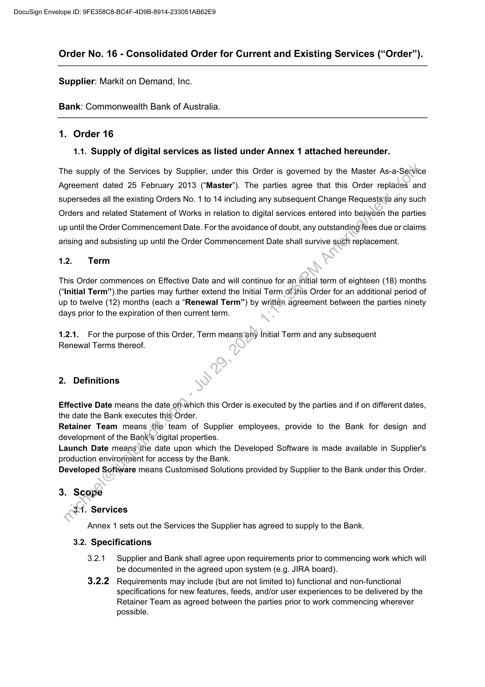
```  
```col-md
DocuSign Envelope ID: 9FE358C8-BC4F-4D9B-8914-233051AB62E9  
Order No. 16 - Consolidated Order for Current and Existing Services (“Order”).  
Supplier: Markit on Demand, Inc.  
Bank: Commonwealth Bank of Australia.  
1. Order 16  
1.1. Supply of digital services as listed under Annex 1 attached hereunder.  
The supply of the Services by Supplier, under this Order is governed by the Master As-a-Service
Agreement dated 25 February 2013 (“Master”). The parties agree that this Order replaces and
supersedes all the existing Orders No. 1 to 14 including any subsequent Change Requests‘to any such
Orders and related Statement of Works in relation to digital services entered into between the parties
up until the Order Commencement Date. For the avoidance of doubt, any outstanding-fees due or claims  
arising and subsisting up until the Order Commencement Date shall survive such replacement.
1.2. Term  
This Order commences on Effective Date and will continue for an initial term of eighteen (18) months
(‘Initial Term”).the parties may further extend the Initial Term Ofthis Order for an additional period of
up to twelve (12) months (each a “Renewal Term”) by written agreement between the parties ninety
days prior to the expiration of then current term.  
1.2.1. For the purpose of this Order, Term meansvany Initial Term and any subsequent
Renewal Terms thereof.  
2. Definitions  
Effective Date means the date onwhich this Order is executed by the parties and if on different dates,
the date the Bank executes this-Order.  
Retainer Team means the’ team of Supplier employees, provide to the Bank for design and
development of the Bank’s digital properties.  
Launch Date means the date upon which the Developed Software is made available in Supplier's
production environment for access by the Bank.  
Developed Software means Customised Solutions provided by Supplier to the Bank under this Order.  
3. Scope
3:1. Services
Annex 1 sets out the Services the Supplier has agreed to supply to the Bank.
3.2. Specifications  
3.2.1. Supplier and Bank shall agree upon requirements prior to commencing work which will
be documented in the agreed upon system (e.g. JIRA board).  
3.2.2 Requirements may include (but are not limited to) functional and non-functional
specifications for new features, feeds, and/or user experiences to be delivered by the
Retainer Team as agreed between the parties prior to work commencing wherever
possible.  
```
````
Notes:    
````col
```col-md
flexGrow=.5
===
> [!info] [Page 2](_attachments/images_CommonWealthSecurities-3.6.1.10.200110867.pdf_210452/page_2.png)
> 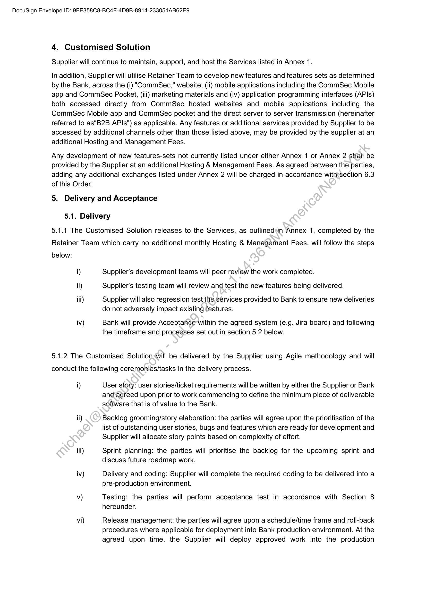
```  
```col-md
DocuSign Envelope ID: 9FE358C8-BC4F-4D9B-8914-233051AB62E9  
4. Customised Solution
Supplier will continue to maintain, support, and host the Services listed in Annex 1.  
In addition, Supplier will utilise Retainer Team to develop new features and features sets as determined
by the Bank, across the (i) "CommSec," website, (ii) mobile applications including the CommSec Mobile
app and CommSec Pocket, (iii) marketing materials and (iv) application programming interfaces (APIs)
both accessed directly from CommSec hosted websites and mobile applications including the
CommSec Mobile app and CommSec pocket and the direct server to server transmission (hereinafter
referred to as“B2B APIs”) as applicable. Any features or additional services provided by Supplier to be
accessed by additional channels other than those listed above, may be provided by the supplier at an
additional Hosting and Management Fees.  
Any development of new features-sets not currently listed under either Annex 1 or Annex 2 shall be
provided by the Supplier at an additional Hosting & Management Fees. As agreed between the parties,
adding any additional exchanges listed under Annex 2 will be charged in accordance with:section 6.3
of this Order.  
5. Delivery and Acceptance  
5.1. Delivery  
5.1.1 The Customised Solution releases to the Services, as outlinedsin Annex 1, completed by the  
Retainer Team which carry no additional monthly Hosting & Management Fees, will follow the steps  
below:
i) Supplier's development teams will peer review the work completed.
ii) Supplier's testing team will review and test the new features being delivered.
iii) Supplier will also regression test the, services provided to Bank to ensure new deliveries  
do not adversely impact existing features.  
iv) Bank will provide Acceptance-within the agreed system (e.g. Jira board) and following
the timeframe and processes set out in section 5.2 below.  
5.1.2 The Customised Solutionwill be delivered by the Supplier using Agile methodology and will  
conduct the following ceremonies/tasks in the delivery process.  
i) User story: user stories/ticket requirements will be written by either the Supplier or Bank
andsagreed upon prior to work commencing to define the minimum piece of deliverable
software that is of value to the Bank.  
ii) Backlog grooming/story elaboration: the parties will agree upon the prioritisation of the
list of outstanding user stories, bugs and features which are ready for development and
Supplier will allocate story points based on complexity of effort.  
iii) Sprint planning: the parties will prioritise the backlog for the upcoming sprint and
discuss future roadmap work.  
iv) Delivery and coding: Supplier will complete the required coding to be delivered into a
pre-production environment.  
v) Testing: the parties will perform acceptance test in accordance with Section 8
hereunder.  
vi) Release management: the parties will agree upon a schedule/time frame and roll-back  
procedures where applicable for deployment into Bank production environment. At the
agreed upon time, the Supplier will deploy approved work into the production  
```
````
Notes:    
````col
```col-md
flexGrow=.5
===
> [!info] [Page 3](_attachments/images_CommonWealthSecurities-3.6.1.10.200110867.pdf_210452/page_3.png)
> 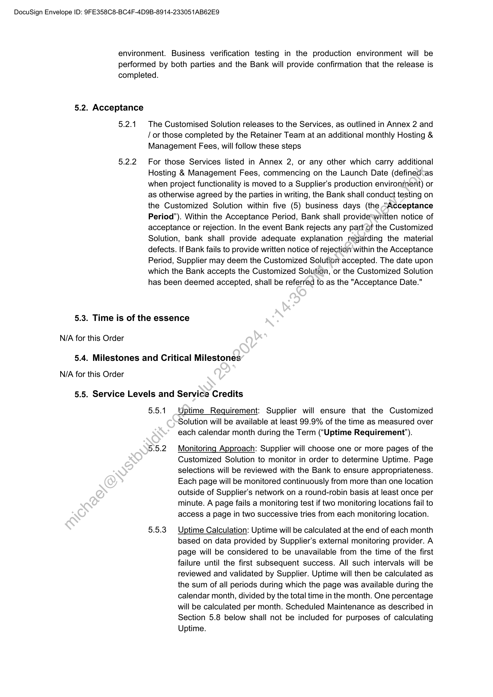
```  
```col-md
DocuSign Envelope ID: 9FE358C8-BC4F-4D9B-8914-233051AB62E9  
environment. Business verification testing in the production environment will be
performed by both parties and the Bank will provide confirmation that the release is
completed.  
5.2. Acceptance  
5.2.1  
5.2.2  
The Customised Solution releases to the Services, as outlined in Annex 2 and
/ or those completed by the Retainer Team at an additional monthly Hosting &
Management Fees, will follow these steps  
For those Services listed in Annex 2, or any other which carry additional
Hosting & Management Fees, commencing on the Launch Date (defined-as
when project functionality is moved to a Supplier's production environment) or
as otherwise agreed by the parties in writing, the Bank shall conduct testing on
the Customized Solution within five (5) business days (the “Acceptance
Period”). Within the Acceptance Period, Bank shall providewwritten notice of
acceptance or rejection. In the event Bank rejects any part of the Customized
Solution, bank shall provide adequate explanation regarding the material
defects. If Bank fails to provide written notice of rejection within the Acceptance
Period, Supplier may deem the Customized Solution accepted. The date upon
which the Bank accepts the Customized Solution, or the Customized Solution
has been deemed accepted, shall be referred to as the "Acceptance Date."  
5.3. Time is of the essence  
N/A for this Order  
5.4. Milestones and Critical Milestones  
N/A for this Order  
5.5. Service Levels and Service Credits  
5.5.1 Uptime Requirement: Supplier will ensure that the Customized
Solution will be available at least 99.9% of the time as measured over
each calendar month during the Term (“Uptime Requirement’).  
5.5.2 Monitoring Approach: Supplier will choose one or more pages of the
Customized Solution to monitor in order to determine Uptime. Page
selections will be reviewed with the Bank to ensure appropriateness.
Each page will be monitored continuously from more than one location
outside of Supplier's network on a round-robin basis at least once per
minute. A page fails a monitoring test if two monitoring locations fail to
access a page in two successive tries from each monitoring location.  
5.5.3 Uptime Calculation: Uptime will be calculated at the end of each month
based on data provided by Supplier's external monitoring provider. A
page will be considered to be unavailable from the time of the first
failure until the first subsequent success. All such intervals will be
reviewed and validated by Supplier. Uptime will then be calculated as
the sum of all periods during which the page was available during the
calendar month, divided by the total time in the month. One percentage
will be calculated per month. Scheduled Maintenance as described in
Section 5.8 below shall not be included for purposes of calculating
Uptime.  
```
````
Notes:    
````col
```col-md
flexGrow=.5
===
> [!info] [Page 4](_attachments/images_CommonWealthSecurities-3.6.1.10.200110867.pdf_210452/page_4.png)
> 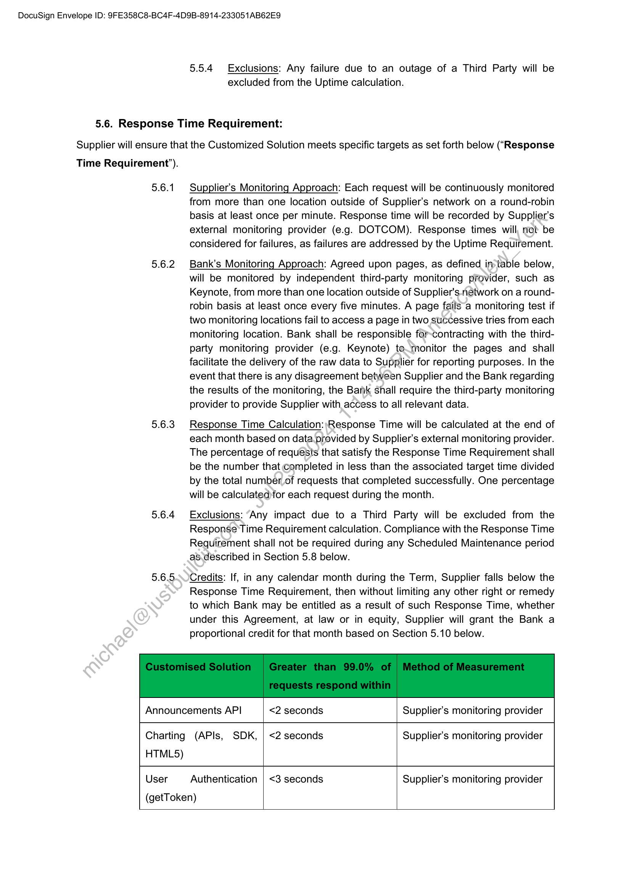
```  
```col-md
DocuSign Envelope ID: 9FE358C8-BC4F-4D9B-8914-233051AB62E9  
5.5.4 Exclusions: Any failure due to an outage of a Third Party will be
excluded from the Uptime calculation.  
5.6. Response Time Requirement:  
Supplier will ensure that the Customized Solution meets specific targets as set forth below (“Response  
Time Requirement’).  
5.6.1  
5.6.5  
Announcements API <2 seconds Supplier's monitoring provider  
Supplier's Monitoring Approach: Each request will be continuously monitored
from more than one location outside of Supplier's network on a round-robin
basis at least once per minute. Response time will be recorded by Supplier's
external monitoring provider (e.g. DOTCOM). Response times will, mot be
considered for failures, as failures are addressed by the Uptime Requirement.  
Bank’s Monitoring Approach: Agreed upon pages, as defined in-table below,
will be monitored by independent third-party monitoring provider, such as
Keynote, from more than one location outside of Supplier's-network on a roundrobin basis at least once every five minutes. A page fails“a monitoring test if
two monitoring locations fail to access a page in two successive tries from each
monitoring location. Bank shall be responsible for-contracting with the thirdparty monitoring provider (e.g. Keynote) te.monitor the pages and shall
facilitate the delivery of the raw data to Supplier for reporting purposes. In the
event that there is any disagreement between Supplier and the Bank regarding
the results of the monitoring, the Bank shall require the third-party monitoring
provider to provide Supplier with access to all relevant data.  
Response Time Calculation:;Response Time will be calculated at the end of
each month based on data.provided by Supplier’s external monitoring provider.
The percentage of requests that satisfy the Response Time Requirement shall
be the number that Completed in less than the associated target time divided
by the total number of requests that completed successfully. One percentage
will be calculated)for each request during the month.  
Exclusions: “Any impact due to a Third Party will be excluded from the
Response’ Time Requirement calculation. Compliance with the Response Time
Requirement shall not be required during any Scheduled Maintenance period
as described in Section 5.8 below.  
Credits: If, in any calendar month during the Term, Supplier falls below the
Response Time Requirement, then without limiting any other right or remedy
to which Bank may be entitled as a result of such Response Time, whether
under this Agreement, at law or in equity, Supplier will grant the Bank a
proportional credit for that month based on Section 5.10 below.  
Charting (APIs, SDK, | <2 seconds Supplier's monitoring provider
HTML5)  
User  
(getToken)  
Authentication | <3 seconds Supplier's monitoring provider  
```
````
Notes:    
````col
```col-md
flexGrow=.5
===
> [!info] [Page 5](_attachments/images_CommonWealthSecurities-3.6.1.10.200110867.pdf_210452/page_5.png)
> 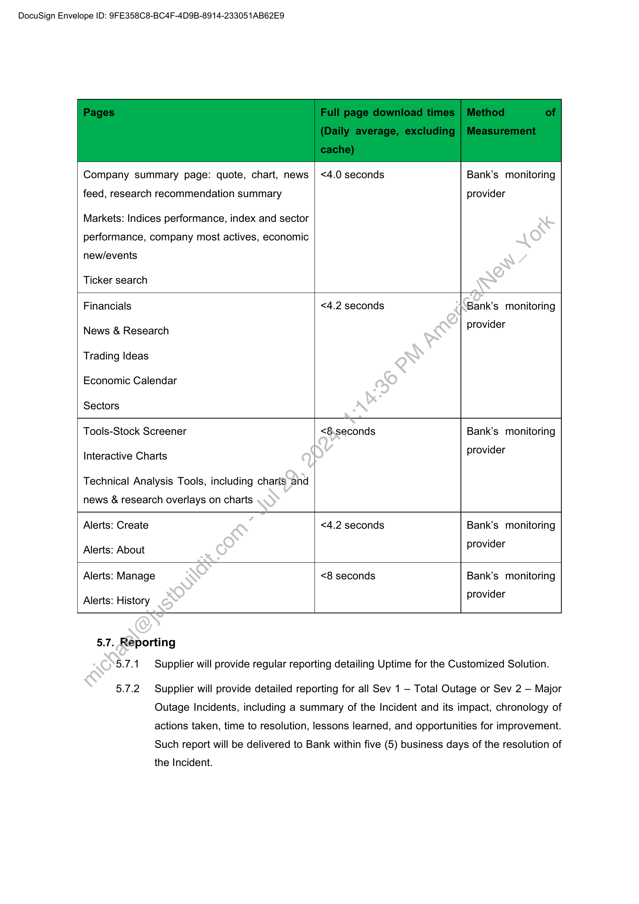
```  
```col-md
DocuSign Envelope ID: 9FE358C8-BC4F-4D9B-8914-233051AB62E9  
Company summary page: quote, chart, news | <4.0 seconds Bank’s monitoring  
feed, research recommendation summary provider  
Markets: Indices performance, index and sector
performance, company most actives, economic  
new/events  
Ticker search  
Financials <4.2 seconds Bank’s monitoring
News & Research provider
Trading Ideas  
Economic Calendar  
Sectors  
Tools-Stock Screener <8.seconds Bank’s monitoring  
Interactive Charts provider  
Technical Analysis Tools, including charts and  
news & research overlays on charts  
Alerts: Create <4.2 seconds Bank’s monitoring  
Alerts: About provider  
Alerts: Manage <8 seconds Bank’s monitoring
provider  
Alerts: History  
5.7. Reporting  
5.7.1 Supplier will provide regular reporting detailing Uptime for the Customized Solution.  
5.7.2 Supplier will provide detailed reporting for all Sev 1 — Total Outage or Sev 2 — Major
Outage Incidents, including a summary of the Incident and its impact, chronology of
actions taken, time to resolution, lessons learned, and opportunities for improvement.
Such report will be delivered to Bank within five (5) business days of the resolution of  
the Incident.  
```
````
Notes:    
````col
```col-md
flexGrow=.5
===
> [!info] [Page 6](_attachments/images_CommonWealthSecurities-3.6.1.10.200110867.pdf_210452/page_6.png)
> 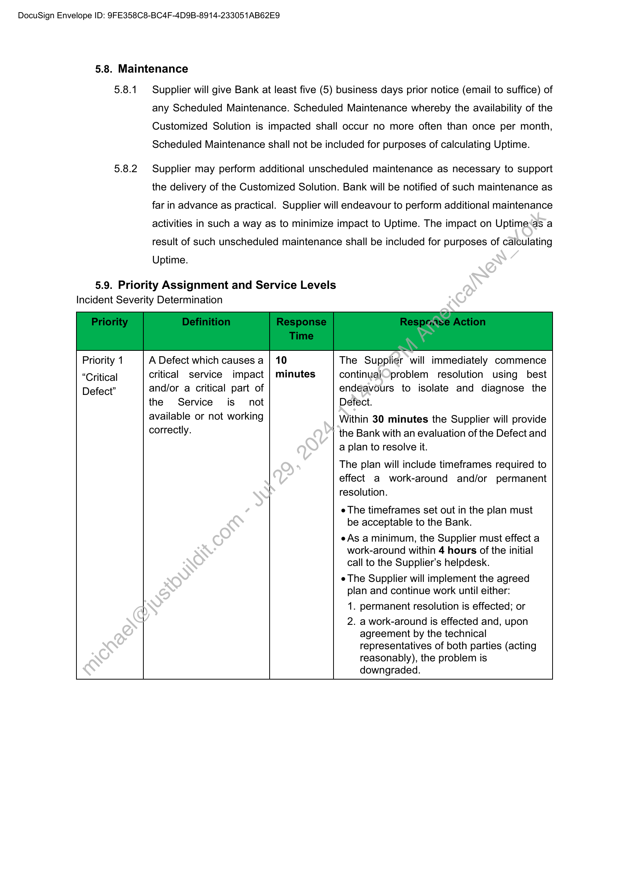
```  
```col-md
DocuSign Envelope ID: 9FE358C8-BC4F-4D9B-8914-233051AB62E9  
5.8. Maintenance  
5.8.1 Supplier will give Bank at least five (5) business days prior notice (email to suffice) of
any Scheduled Maintenance. Scheduled Maintenance whereby the availability of the
Customized Solution is impacted shall occur no more often than once per month,  
Scheduled Maintenance shall not be included for purposes of calculating Uptime.  
5.8.2 Supplier may perform additional unscheduled maintenance as necessary to support
the delivery of the Customized Solution. Bank will be notified of such maintenance as
far in advance as practical. Supplier will endeavour to perform additional maintenance
activities in such a way as to minimize impact to Uptime. The impact on Uptime:as a
result of such unscheduled maintenance shall be included for purposes of calculating
Uptime.  
5.9. Priority Assignment and Service Levels
Incident Severity Determination  
Priority 1 A Defect which causes a | 10 The Supplier will immediately commence
“Critical critical service impact | minutes continual problem resolution using best
Defect” and/or a critical part of endeavours to isolate and diagnose the
the Service is not Defect.
available or not working Within 30 minutes the Supplier will provide
correctly. the Bank with an evaluation of the Defect and  
a plan to resolve it.  
The plan will include timeframes required to
effect a work-around and/or permanent
resolution.  
e The timeframes set out in the plan must
be acceptable to the Bank.  
eAs a minimum, the Supplier must effect a
work-around within 4 hours of the initial
call to the Supplier's helpdesk.  
e The Supplier will implement the agreed
plan and continue work until either:  
1. permanent resolution is effected; or  
2. a work-around is effected and, upon
agreement by the technical
representatives of both parties (acting
reasonably), the problem is
downgraded.  
```
````
Notes:    
````col
```col-md
flexGrow=.5
===
> [!info] [Page 7](_attachments/images_CommonWealthSecurities-3.6.1.10.200110867.pdf_210452/page_7.png)
> 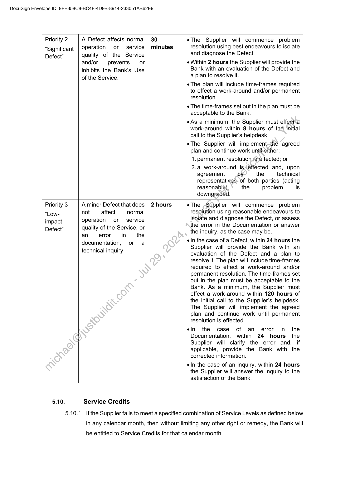
```  
```col-md
DocuSign Envelope ID: 9FE358C8-BC4F-4D9B-8914-233051AB62E9  
Priority 2  
“Significant
Defect”  
A Defect affects normal
operation or service
quality of the Service
and/or prevents or
inhibits the Bank’s Use
of the Service.  
30
minutes  
eThe Supplier will commence problem
resolution using best endeavours to isolate
and diagnose the Defect.  
e Within 2 hours the Supplier will provide the
Bank with an evaluation of the Defect and
a plan to resolve it.  
e The plan will include time-frames required
to effect a work-around and/or permanent
resolution.  
e The time-frames set out in the plan must be
acceptable to the Bank.  
eAs a minimum, the Supplier must effect.a
work-around within 8 hours of the initial
call to the Supplier's helpdesk.  
eThe Supplier will implement-the agreed
plan and continue work until-either:  
1. permanent resolution isjeffected; or  
2.a work-around is<effected and, upon
agreement by the technical
representatives. of both parties (acting
reasonably), the problem is
downgraded.  
Priority 3
“Lowimpact
Defect”  
A minor Defect that does
not affect normal
operation or service
quality of the Service, or
an error in the
documentation, or a
technical inquiry.  
2 hours  
eThe -Supplier will commence problem
resolution using reasonable endeavours to
isolate and diagnose the Defect, or assess
the error in the Documentation or answer
the inquiry, as the case may be.  
e|n the case of a Defect, within 24 hours the
Supplier will provide the Bank with an
evaluation of the Defect and a plan to
resolve it. The plan will include time-frames
required to effect a work-around and/or
permanent resolution. The time-frames set
out in the plan must be acceptable to the
Bank. As a minimum, the Supplier must
effect a work-around within 120 hours of
the initial call to the Supplier's helpdesk.
The Supplier will implement the agreed
plan and continue work until permanent
resolution is effected.  
eln the case of an error in the
Documentation, within 24 hours the
Supplier will clarify the error and, if
applicable, provide the Bank with the
corrected information.  
eln the case of an inquiry, within 24 hours
the Supplier will answer the inquiry to the
satisfaction of the Bank.  
5.10.  
Service Credits  
5.10.1 Ifthe Supplier fails to meet a specified combination of Service Levels as defined below
in any calendar month, then without limiting any other right or remedy, the Bank will  
be entitled to Service Credits for that calendar month.  
```
````
Notes:    
````col
```col-md
flexGrow=.5
===
> [!info] [Page 8](_attachments/images_CommonWealthSecurities-3.6.1.10.200110867.pdf_210452/page_8.png)
> 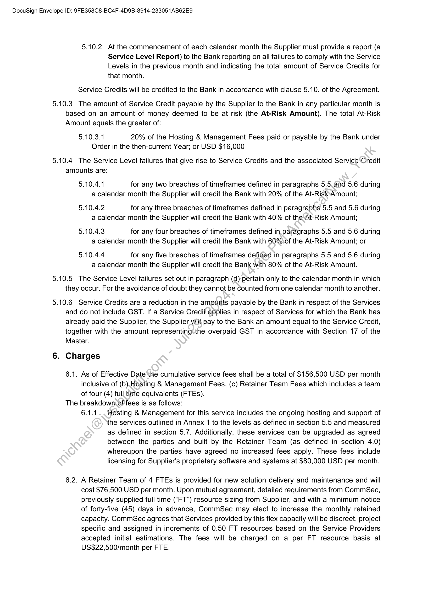
```  
```col-md
DocuSign Envelope ID: 9FE358C8-BC4F-4D9B-8914-233051AB62E9  
5.10.2 At the commencement of each calendar month the Supplier must provide a report (a
Service Level Report) to the Bank reporting on all failures to comply with the Service
Levels in the previous month and indicating the total amount of Service Credits for
that month.  
Service Credits will be credited to the Bank in accordance with clause 5.10. of the Agreement.  
5.10.3 The amount of Service Credit payable by the Supplier to the Bank in any particular month is
based on an amount of money deemed to be at risk (the At-Risk Amount). The total At-Risk
Amount equals the greater of:  
5.10.3.1 20% of the Hosting & Management Fees paid or payable by the Bank under
Order in the then-current Year; or USD $16,000  
5.10.4 The Service Level failures that give rise to Service Credits and the associated Service Credit
amounts are:  
5.10.4.1 for any two breaches of timeframes defined in paragraphs 5.5.and 5.6 during
a calendar month the Supplier will credit the Bank with 20% of the At-Risk\Amount;  
5.10.4.2 for any three breaches of timeframes defined in paragraphs 5.5 and 5.6 during
a calendar month the Supplier will credit the Bank with 40% of the At-Risk Amount;  
5.10.4.3 for any four breaches of timeframes defined in paragraphs 5.5 and 5.6 during
a calendar month the Supplier will credit the Bank with 60%\of the At-Risk Amount; or  
5.10.4.4 for any five breaches of timeframes defined in paragraphs 5.5 and 5.6 during
a calendar month the Supplier will credit the Bank with 80% of the At-Risk Amount.  
5.10.5 The Service Level failures set out in paragraph (d) pertain only to the calendar month in which
they occur. For the avoidance of doubt they cannot be counted from one calendar month to another.  
5.10.6 Service Credits are a reduction in the amounts payable by the Bank in respect of the Services
and do not include GST. If a Service Credit applies in respect of Services for which the Bank has
already paid the Supplier, the Supplier will, pay to the Bank an amount equal to the Service Credit,
together with the amount representing the overpaid GST in accordance with Section 17 of the
Master.  
6. Charges  
6.1. As of Effective Date the cumulative service fees shall be a total of $156,500 USD per month
inclusive of (b).Hosting & Management Fees, (c) Retainer Team Fees which includes a team
of four (4) full time equivalents (FTEs).  
The breakdown.of fees is as follows:  
6.1.1. Hosting & Management for this service includes the ongoing hosting and support of
the services outlined in Annex 1 to the levels as defined in section 5.5 and measured
as defined in section 5.7. Additionally, these services can be upgraded as agreed
between the parties and built by the Retainer Team (as defined in section 4.0)
whereupon the parties have agreed no increased fees apply. These fees include
licensing for Supplier’s proprietary software and systems at $80,000 USD per month.  
6.2. A Retainer Team of 4 FTEs is provided for new solution delivery and maintenance and will
cost $76,500 USD per month. Upon mutual agreement, detailed requirements from CommSec,
previously supplied full time (“FT”) resource sizing from Supplier, and with a minimum notice
of forty-five (45) days in advance, CommSec may elect to increase the monthly retained
capacity. CommSec agrees that Services provided by this flex capacity will be discreet, project
specific and assigned in increments of 0.50 FT resources based on the Service Providers
accepted initial estimations. The fees will be charged on a per FT resource basis at
US$22,500/month per FTE.  
```
````
Notes:    
````col
```col-md
flexGrow=.5
===
> [!info] [Page 9](_attachments/images_CommonWealthSecurities-3.6.1.10.200110867.pdf_210452/page_9.png)
> 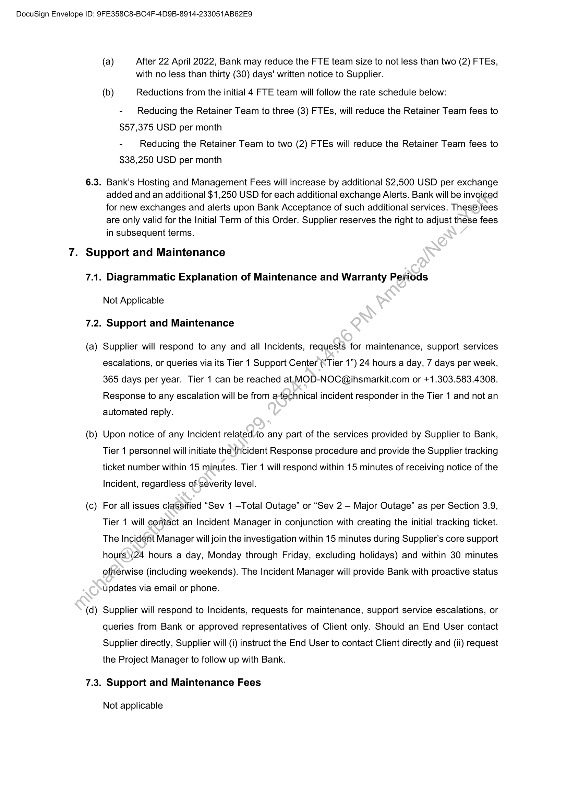
```  
```col-md
DocuSign Envelope ID: 9FE358C8-BC4F-4D9B-8914-233051AB62E9  
(a) After 22 April 2022, Bank may reduce the FTE team size to not less than two (2) FTEs,
with no less than thirty (30) days' written notice to Supplier.  
(b) Reductions from the initial 4 FTE team will follow the rate schedule below:
- Reducing the Retainer Team to three (3) FTEs, will reduce the Retainer Team fees to
$57,375 USD per month
- Reducing the Retainer Team to two (2) FTEs will reduce the Retainer Team fees to
$38,250 USD per month  
6.3. Bank’s Hosting and Management Fees will increase by additional $2,500 USD per exchange
added and an additional $1,250 USD for each additional exchange Alerts. Bank will be invoiced
for new exchanges and alerts upon Bank Acceptance of such additional services. Thes@yfees
are only valid for the Initial Term of this Order. Supplier reserves the right to adjust these fees
in subsequent terms.  
7. Support and Maintenance
7.1. Diagrammatic Explanation of Maintenance and Warranty Periods
Not Applicable
7.2. Support and Maintenance  
(a) Supplier will respond to any and all Incidents, requests for maintenance, support services
escalations, or queries via its Tier 1 Support Center (“Tier 1”) 24 hours a day, 7 days per week,
365 days per year. Tier 1 can be reached at. MOD-NOC@ihsmarkit.com or +1.303.583.4308.
Response to any escalation will be from a-technical incident responder in the Tier 1 and not an
automated reply.  
(b  
aS  
Upon notice of any Incident relatedto any part of the services provided by Supplier to Bank,
Tier 1 personnel will initiate the Incident Response procedure and provide the Supplier tracking
ticket number within 15 minutes. Tier 1 will respond within 15 minutes of receiving notice of the  
Incident, regardless of severity level.  
(c  
ww  
For all issues classified “Sev 1 —Total Outage” or “Sev 2 — Major Outage” as per Section 3.9,
Tier 1 will contact an Incident Manager in conjunction with creating the initial tracking ticket.
The Incident Manager will join the investigation within 15 minutes during Supplier’s core support
hours)(24 hours a day, Monday through Friday, excluding holidays) and within 30 minutes
otherwise (including weekends). The Incident Manager will provide Bank with proactive status
updates via email or phone.  
(d  
=  
Supplier will respond to Incidents, requests for maintenance, support service escalations, or
queries from Bank or approved representatives of Client only. Should an End User contact
Supplier directly, Supplier will (i) instruct the End User to contact Client directly and (ii) request
the Project Manager to follow up with Bank.  
7.3. Support and Maintenance Fees  
Not applicable  
```
````
Notes:    
````col
```col-md
flexGrow=.5
===
> [!info] [Page 10](_attachments/images_CommonWealthSecurities-3.6.1.10.200110867.pdf_210452/page_10.png)
> 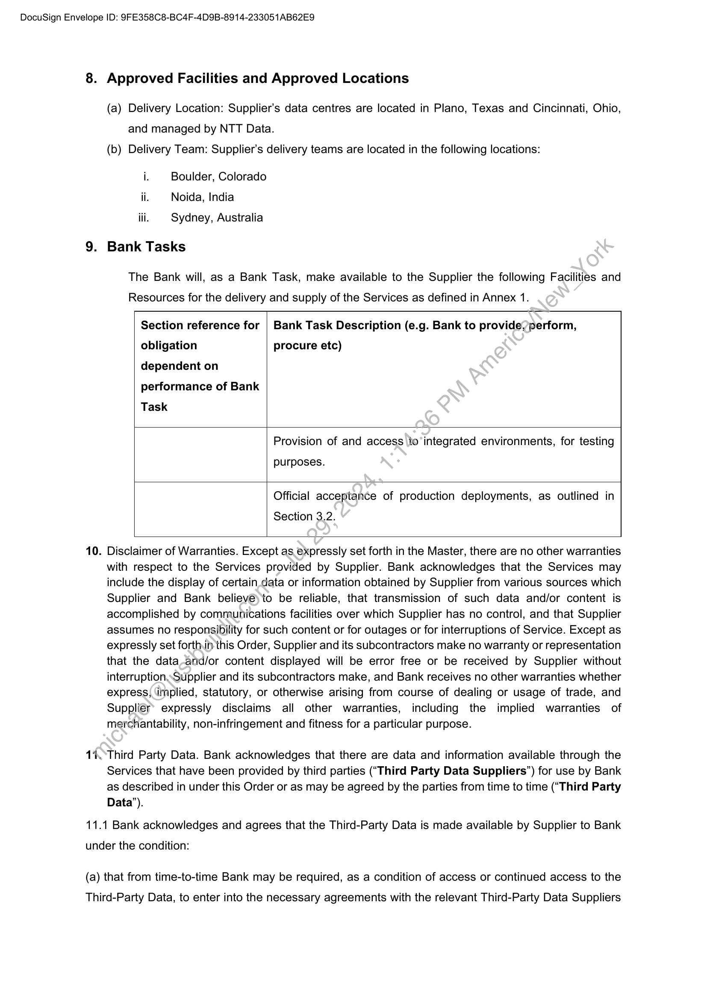
```  
```col-md
DocuSign Envelope ID: 9FE358C8-BC4F-4D9B-8914-233051AB62E9  
8.  
9.  
Approved Facilities and Approved Locations  
(a) Delivery Location: Supplier's data centres are located in Plano, Texas and Cincinnati, Ohio,
and managed by NTT Data.  
(b) Delivery Team: Supplier’s delivery teams are located in the following locations:  
i. Boulder, Colorado
ii. Noida, India  
iii. Sydney, Australia
Bank Tasks  
The Bank will, as a Bank Task, make available to the Supplier the following Facilities and  
Resources for the delivery and supply of the Services as defined in Annex 1.  
Section reference for | Bank Task Description (e.g. Bank to provide,perform,
obligation procure etc)  
dependent on
performance of Bank
Task  
Provision of and access \to integrated environments, for testing  
purposes.  
Official acceptance of production deployments, as outlined in
Section 3.2.  
10. Disclaimer of Warranties. Except as expressly set forth in the Master, there are no other warranties  
Th.  
with respect to the Services provided by Supplier. Bank acknowledges that the Services may
include the display of certain data or information obtained by Supplier from various sources which
Supplier and Bank believe) to be reliable, that transmission of such data and/or content is
accomplished by communications facilities over which Supplier has no control, and that Supplier
assumes no responsibility for such content or for outages or for interruptions of Service. Except as
expressly set forth.in this Order, Supplier and its subcontractors make no warranty or representation
that the data-and/or content displayed will be error free or be received by Supplier without
interruption.  
Supplier and its subcontractors make, and Bank receives no other warranties whether
express) ‘implied, statutory, or otherwise arising from course of dealing or usage of trade, and
Supplier’ expressly disclaims all other warranties, including the implied warranties of
merchantability, non-infringement and fitness for a particular purpose.  
Third Party Data. Bank acknowledges that there are data and information available through the
Services that have been provided by third parties (“Third Party Data Suppliers”) for use by Bank
as described in under this Order or as may be agreed by the parties from time to time (“Third Party
Data’).  
11.1 Bank acknowledges and agrees that the Third-Party Data is made available by Supplier to Bank  
under the condition:  
(a) that from time-to-time Bank may be required, as a condition of access or continued access to the  
Third-Party Data, to enter into the necessary agreements with the relevant Third-Party Data Suppliers  
```
````
Notes:    
````col
```col-md
flexGrow=.5
===
> [!info] [Page 11](_attachments/images_CommonWealthSecurities-3.6.1.10.200110867.pdf_210452/page_11.png)
> 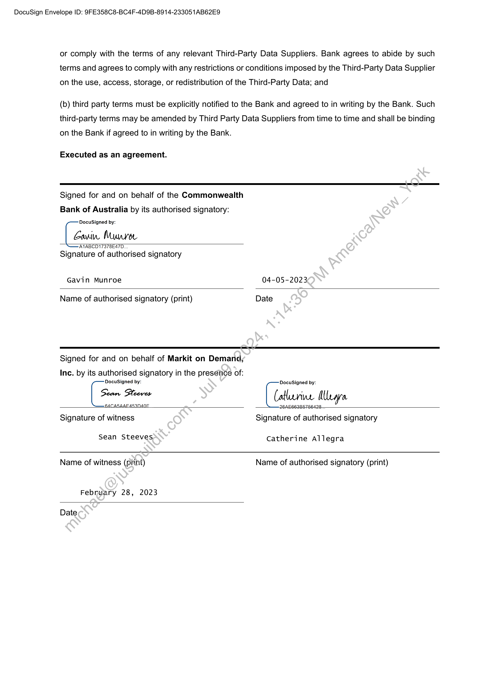
```  
```col-md
DocuSign Envelope ID: 9FE358C8-BC4F-4D9B-8914-233051AB62E9  
or comply with the terms of any relevant Third-Party Data Suppliers. Bank agrees to abide by such
terms and agrees to comply with any restrictions or conditions imposed by the Third-Party Data Supplier  
on the use, access, storage, or redistribution of the Third-Party Data; and  
(b) third party terms must be explicitly notified to the Bank and agreed to in writing by the Bank. Such
third-party terms may be amended by Third Party Data Suppliers from time to time and shall be binding
on the Bank if agreed to in writing by the Bank.  
Executed as an agreement.  
Signed for and on behalf of the Commonwealth  
Bank of Australia by its authorised signatory:  
DocuSigned by:  
Gorin Munror
A1ABCD17378E47D.
Signature of authorised signatory
Gavin Munroe 04-05-2023
Name of authorised signatory (print) Date  
Signed for and on behalf of Markit on Demand,  
Inc. by its authorised signatory in the presence of:  
DocuSigned by: DocuSigned by:
Sean Heever Catluerive MUeara  
64CASAAEAS3D40E £6638!  
Signature of witness Signature of authorised signatory
Sean Steeves Catherine Allegra
Name of witness (print) Name of authorised signatory (print)  
February 28, 2023  
Date  
```
````
Notes:    
````col
```col-md
flexGrow=.5
===
> [!info] [Page 12](_attachments/images_CommonWealthSecurities-3.6.1.10.200110867.pdf_210452/page_12.png)
> 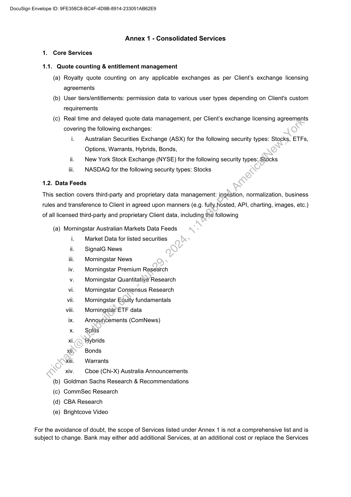
```  
```col-md
DocuSign Envelope ID: 9FE358C8-BC4F-4D9B-8914-233051AB62E9  
Annex 1 - Consolidated Services  
1. Core Services  
1.1. Quote counting & entitlement management
(a) Royalty quote counting on any applicable exchanges as per Client’s exchange licensing
agreements
(b) User tiers/entitlements: permission data to various user types depending on Client's custom
requirements
(c) Real time and delayed quote data management, per Client’s exchange licensing agreements
covering the following exchanges:
i. Australian Securities Exchange (ASX) for the following security types: Stocks, ETFs,
Options, Warrants, Hybrids, Bonds,
ii. New York Stock Exchange (NYSE) for the following security types:,Stocks
iii. NASDAQ for the following security types: Stocks  
1.2. Data Feeds
This section covers third-party and proprietary data management: ingestion, normalization, business
rules and transference to Client in agreed upon manners (e.g. fully.hosted, API, charting, images, etc.)  
of all licensed third-party and proprietary Client data, including the following  
(a) Morningstar Australian Markets Data Feeds
i. Market Data for listed securities
ii. SignalG News
iii. Morningstar News
iv. Morningstar Premium Research
v. Morningstar Quantitative Research
vi. Morningstar Consensus Research
vii. Morningstar Equity fundamentals
viii. Morningstar ETF data  
ix. Announcements (ComNews)  
x. Splits  
xi. Hybrids
xii. Bonds
xiii. Warrants  
xiv. Cboe (Chi-X) Australia Announcements
(b) Goldman Sachs Research & Recommendations
(c) CommSec Research
(d) CBA Research
(e) Brightcove Video  
For the avoidance of doubt, the scope of Services listed under Annex 1 is not a comprehensive list and is
subject to change. Bank may either add additional Services, at an additional cost or replace the Services  
```
````
Notes:    
````col
```col-md
flexGrow=.5
===
> [!info] [Page 13](_attachments/images_CommonWealthSecurities-3.6.1.10.200110867.pdf_210452/page_13.png)
> 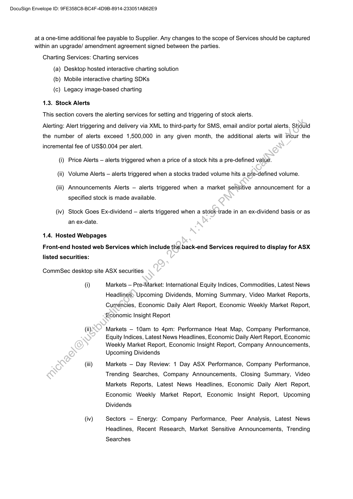
```  
```col-md
DocuSign Envelope ID: 9FE358C8-BC4F-4D9B-8914-233051AB62E9  
at a one-time additional fee payable to Supplier. Any changes to the scope of Services should be captured
within an upgrade/ amendment agreement signed between the parties.  
Charting Services: Charting services  
(a) Desktop hosted interactive charting solution
(b) Mobile interactive charting SDKs  
(c) Legacy image-based charting  
1.3. Stock Alerts  
This section covers the alerting services for setting and triggering of stock alerts.  
Alerting: Alert triggering and delivery via XML to third-party for SMS, email and/or portal alerts. Should  
the number of alerts exceed 1,500,000 in any given month, the additional alerts will incur the  
incremental fee of US$0.004 per alert.  
(i  
=  
Price Alerts — alerts triggered when a price of a stock hits a pre-defined value.  
(ii) Volume Alerts — alerts triggered when a stocks traded volume hits a pre-defined volume.  
(iii) Announcements Alerts — alerts triggered when a market sensitive announcement for a  
specified stock is made available.  
(iv) Stock Goes Ex-dividend — alerts triggered when a stock-trade in an ex-dividend basis or as  
an ex-date.  
1.4. Hosted Webpages  
Front-end hosted web Services which include the back-end Services required to display for ASX  
listed securities:  
CommSec desktop site ASX securities  
(i)  
(ii)  
(iii)  
(iv)  
Markets — Pre-Market: International Equity Indices, Commodities, Latest News
Headlines; Upcoming Dividends, Morning Summary, Video Market Reports,
Currencies, Economic Daily Alert Report, Economic Weekly Market Report,
Economic Insight Report  
Markets — 10am to 4pm: Performance Heat Map, Company Performance,
Equity Indices, Latest News Headlines, Economic Daily Alert Report, Economic
Weekly Market Report, Economic Insight Report, Company Announcements,
Upcoming Dividends  
Markets — Day Review: 1 Day ASX Performance, Company Performance,
Trending Searches, Company Announcements, Closing Summary, Video
Markets Reports, Latest News Headlines, Economic Daily Alert Report,
Economic Weekly Market Report, Economic Insight Report, Upcoming
Dividends  
Sectors — Energy: Company Performance, Peer Analysis, Latest News
Headlines, Recent Research, Market Sensitive Announcements, Trending  
Searches  
```
````
Notes:    
````col
```col-md
flexGrow=.5
===
> [!info] [Page 14](_attachments/images_CommonWealthSecurities-3.6.1.10.200110867.pdf_210452/page_14.png)
> 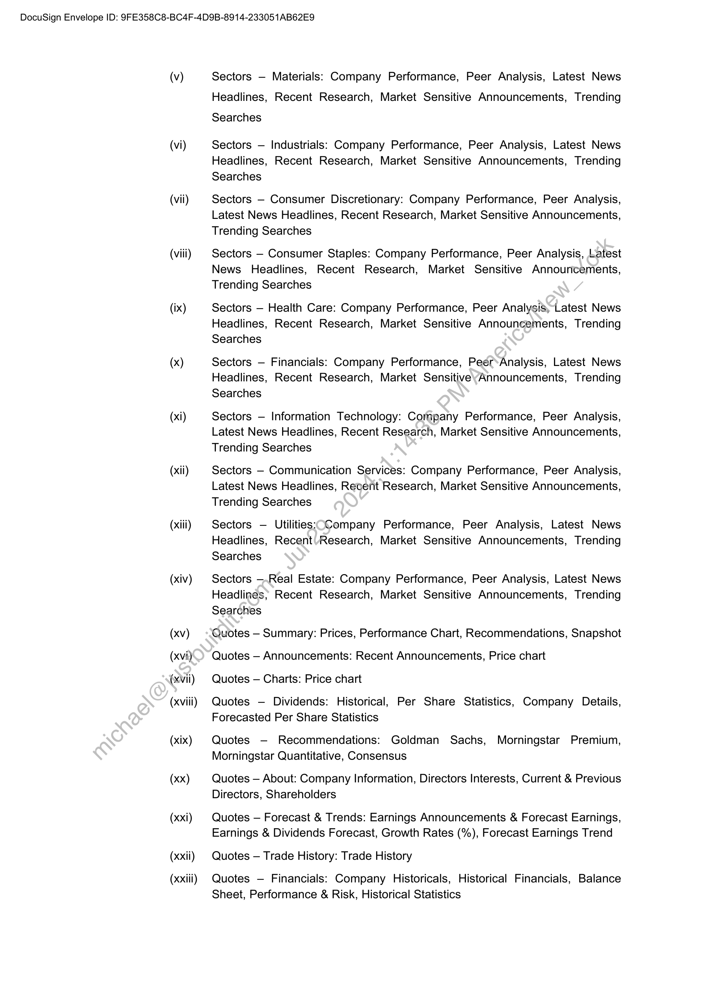
```  
```col-md
DocuSign Envelope ID: 9FE358C8-BC4F-4D9B-8914-233051AB62E9  
(v)  
(vii)  
(viii)  
(xiii)  
(xiv)  
(xxi)  
(xxii)  
(xxiii)  
Sectors — Materials: Company Performance, Peer Analysis, Latest News
Headlines, Recent Research, Market Sensitive Announcements, Trending  
Searches  
Sectors — Industrials: Company Performance, Peer Analysis, Latest News
Headlines, Recent Research, Market Sensitive Announcements, Trending
Searches  
Sectors — Consumer Discretionary: Company Performance, Peer Analysis,
Latest News Headlines, Recent Research, Market Sensitive Announcements,
Trending Searches  
Sectors — Consumer Staples: Company Performance, Peer Analysis, Latest
News Headlines, Recent Research, Market Sensitive Announcements,
Trending Searches  
Sectors — Health Care: Company Performance, Peer Analysis,-Latest News
Headlines, Recent Research, Market Sensitive Announcements, Trending
Searches  
Sectors — Financials: Company Performance, Peer*Analysis, Latest News
Headlines, Recent Research, Market SensitiveyAnnouncements, Trending
Searches  
Sectors — Information Technology: Company Performance, Peer Analysis,
Latest News Headlines, Recent Research, Market Sensitive Announcements,
Trending Searches  
Sectors — Communication Services: Company Performance, Peer Analysis,
Latest News Headlines, Recent Research, Market Sensitive Announcements,
Trending Searches  
Sectors — Utilities; Company Performance, Peer Analysis, Latest News
Headlines, Recent Research, Market Sensitive Announcements, Trending
Searches  
Sectors —.Real Estate: Company Performance, Peer Analysis, Latest News
Headlines, Recent Research, Market Sensitive Announcements, Trending
Searches  
Quotes — Summary: Prices, Performance Chart, Recommendations, Snapshot
Quotes — Announcements: Recent Announcements, Price chart
Quotes — Charts: Price chart  
Quotes — Dividends: Historical, Per Share Statistics, Company Details,
Forecasted Per Share Statistics  
Quotes — Recommendations: Goldman Sachs, Morningstar Premium,
Morningstar Quantitative, Consensus  
Quotes — About: Company Information, Directors Interests, Current & Previous
Directors, Shareholders  
Quotes — Forecast & Trends: Earnings Announcements & Forecast Earnings,
Earnings & Dividends Forecast, Growth Rates (%), Forecast Earnings Trend  
Quotes — Trade History: Trade History  
Quotes — Financials: Company Historicals, Historical Financials, Balance
Sheet, Performance & Risk, Historical Statistics  
```
````
Notes:    
````col
```col-md
flexGrow=.5
===
> [!info] [Page 15](_attachments/images_CommonWealthSecurities-3.6.1.10.200110867.pdf_210452/page_15.png)
> 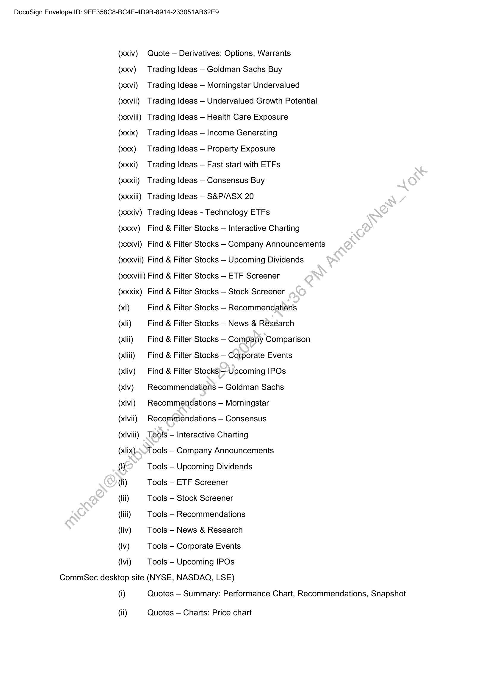
```  
```col-md
DocuSign Envelope ID: 9FE358C8-BC4F-4D9B-8914-233051AB62E9  
xxiv) Quote — Derivatives: Options, Warrants  
xxv) | Trading Ideas — Goldman Sachs Buy  
xxvi) Trading Ideas — Morningstar Undervalued
xxvii) Trading Ideas — Undervalued Growth Potential
xxviii) Trading Ideas — Health Care Exposure  
xxix) Trading Ideas — Income Generating  
xxx) Trading Ideas — Property Exposure  
xxxi) Trading Ideas — Fast start with ETFs  
xxxii) Trading Ideas — Consensus Buy  
xxxiii) Trading Ideas — S&P/ASX 20  
xxxiv) Trading Ideas - Technology ETFs  
xxxv) Find & Filter Stocks — Interactive Charting
xxxvi) Find & Filter Stocks - Company Announcements
xxxvii) Find & Filter Stocks — Upcoming Dividends
xxxviii) Find & Filter Stocks — ETF Screener  
xxxix) Find & Filter Stocks — Stock Screener  
xl) Find & Filter Stocks — Recommendations
xli) Find & Filter Stocks —- News & Research
xlii) Find & Filter Stocks - Company Comparison
xliii) Find & Filter Stocks — Corporate Events
xliv) Find & Filter Stocks)—Upcoming IPOs  
xlv) | Recommendations — Goldman Sachs  
xlvi) Recommendations — Morningstar  
xlvii) Recommendations — Consensus  
xIviiil) Tools — Interactive Charting  
xlix)\OTools — Company Announcements  
y Tools — Upcoming Dividends  
li) Tools — ETF Screener  
lii) Tools — Stock Screener  
lili) Tools — Recommendations  
liv) Tools — News & Research  
lv) Tools — Corporate Events  
(Ivi) Tools — Upcoming IPOs
CommSec desktop site (NYSE, NASDAQ, LSE)  
(i) Quotes — Summary: Performance Chart, Recommendations, Snapshot  
(ii) Quotes — Charts: Price chart  
```
````
Notes:    
````col
```col-md
flexGrow=.5
===
> [!info] [Page 16](_attachments/images_CommonWealthSecurities-3.6.1.10.200110867.pdf_210452/page_16.png)
> 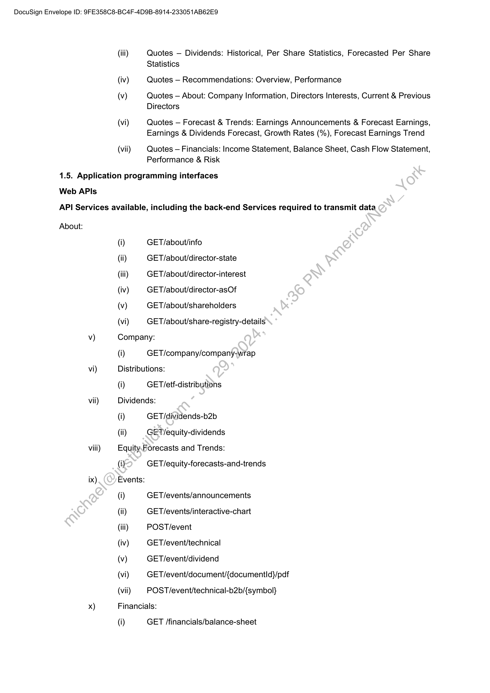
```  
```col-md
DocuSign Envelope ID: 9FE358C8-BC4F-4D9B-8914-233051AB62E9  
(iii) Quotes — Dividends: Historical, Per Share Statistics, Forecasted Per Share
Statistics  
(iv) Quotes — Recommendations: Overview, Performance  
(v) Quotes — About: Company Information, Directors Interests, Current & Previous
Directors  
(vi) Quotes — Forecast & Trends: Earnings Announcements & Forecast Earnings,
Earnings & Dividends Forecast, Growth Rates (%), Forecast Earnings Trend  
(vii) Quotes — Financials: Income Statement, Balance Sheet, Cash Flow Statement,
Performance & Risk  
1.5. Application programming interfaces  
Web APIs  
API Services available, including the back-end Services required to transmit data  
About:  
v)  
vi)  
vii)  
viii)  
ix)  
x)  
i) GET/about/info  
ii) GET/about/director-state  
iii) GET/about/director-interest
iv) GET/about/director-asOf  
v) GET/about/shareholders  
vi) GET/about/share-registry-details
Company:  
(i) GET/company/company-wrap
Distributions:  
(i) GET/etf-distributions
Dividends:  
(i) GET/dividends-b2b  
(ii) GET/equity-dividends
Equity.Forecasts and Trends:  
(i) GET/equity-forecasts-and-trends  
Events:
i) GET/events/announcements
ii) GET/events/interactive-chart
iii) POST/event
) GET/event/technical  
(  
(  
(
(iv
(v) GET/event/dividend  
(vi) GET/event/document/{documentld}/pdf
(vii) POST/event/technical-b2b/{symbol}
Financials:  
(i) GET /financials/balance-sheet  
```
````
Notes:    
````col
```col-md
flexGrow=.5
===
> [!info] [Page 17](_attachments/images_CommonWealthSecurities-3.6.1.10.200110867.pdf_210452/page_17.png)
> 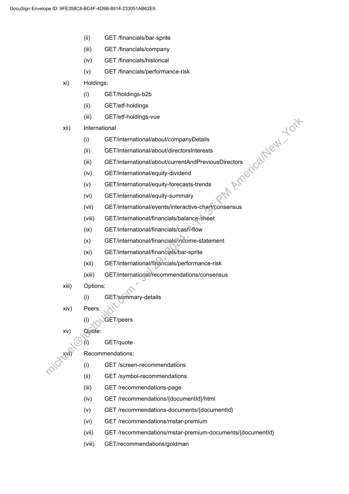
```  
```col-md
DocuSign Envelope ID: 9FE358C8-BC4F-4D9B-8914-233051AB62E9  
(ii) GET /financials/bar-sprite  
(iii) GET /financials/company  
(iv) GET /financials/historical  
(v) GET /financials/performance-risk
xi) Holdings:  
(i) GET/holdings-b2b  
(ii) GET/etf-holdings  
(iii) GET/etf-holdings-vue  
xii) International
(i) GET/international/about/companyDetails
(ii) GET/international/about/directorsInterests  
(iii) GET/international/about/currentAndPreviousDirectors
(iv) GET/international/equity-dividend  
(v) GET/international/equity-forecasts-trends  
(vi) GET/international/equity-summary  
(vii) GET/international/events/interactive-chart/consensus
(viii) | GET/international/financials/balance-sheet  
(ix) GET/international/financials/cash=flow  
(x) GET/international/financials/income-statement  
(xi) GET/international/financials/bar-sprite  
(xii) GET/international/financials/performance-risk  
(xiii) | GET/international/recommendations/consensus  
xiii) Options:  
(i GET/summary-details
xiv) eers:  
(i GET/peers  
xv) Quote:  
(i GET/quote
xv) ecommendations:
(i GET /screen-recommendations
(ii) GET /symbol-recommendations
(iii) GET /recommendations-page
(iv) GET /recommendations/{documentld}/html
(v) GET /recommendations-documents/{documentld}
(vi) GET /recommendations/mstar-premium
(vii) GET /recommendations/mstar-premium-documents/{documentld}
(viii) | GET/recommendations/goldman  
```
````
Notes:    
````col
```col-md
flexGrow=.5
===
> [!info] [Page 18](_attachments/images_CommonWealthSecurities-3.6.1.10.200110867.pdf_210452/page_18.png)
> 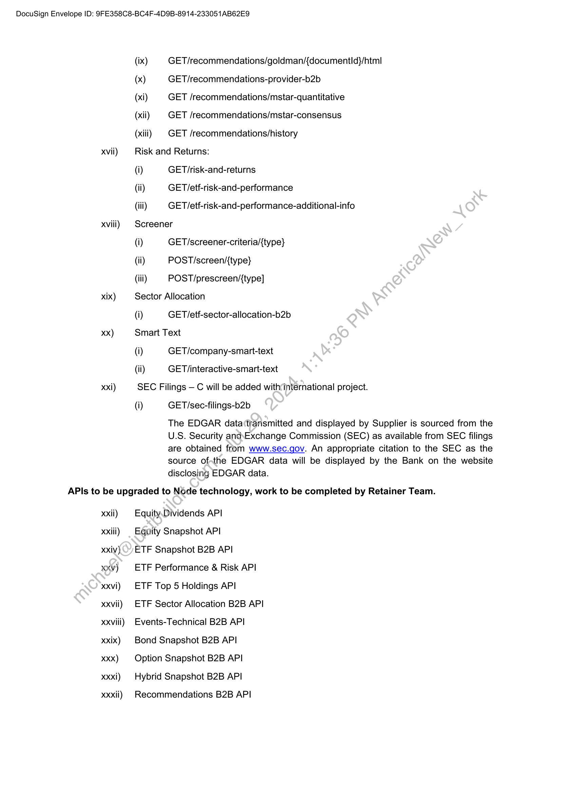
```  
```col-md
DocuSign Envelope ID: 9FE358C8-BC4F-4D9B-8914-233051AB62E9  
xvii)  
xviii)  
xix)  
Xx)  
xxi)  
APIs to be upgraded to Node technology, work to be completed by Retainer Team.  
xxii)
xxiii)
xxiv)
xxv)
xxvi)
xxvii)
xxviii)
xxix)
XXX)
Xxxi)  
Xxxii)  
(ix)
(x)  
(xi)
(xii)
(  
xiii)  
GET/recommendations/goldman/{documentld}/html
GET/recommendations-provider-b2b  
GET /recommendations/mstar-quantitative  
GET /recommendations/mstar-consensus  
GET /recommendations/history  
Risk and Returns:  
(i)
(ii)
(iii)  
GET/risk-and-returns
GET/etf-risk-and-performance  
GET/etf-risk-and-performance-additional-info  
Screener  
(i)
(ii)
(iii)  
GET/screener-criteria/{type}
POST/screen/{type}
POST/prescreen/{type]  
Sector Allocation  
(i) GET/etf-sector-allocation-b2b
Smart Text
(i) GET/company-smart-text  
(ii)  
GET/interactive-smart-text  
SEC Filings — C will be added with“international project.  
(i)  
GET/sec-filings-b2b  
The EDGAR data‘trarsmitted and displayed by Supplier is sourced from the
U.S. Security and\Exchange Commission (SEC) as available from SEC filings
are obtained from www.sec.gov. An appropriate citation to the SEC as the
source of-the EDGAR data will be displayed by the Bank on the website  
disclosing EDGAR data.  
Equity.Dividends API  
Equity Snapshot API
ETF Snapshot B2B API
ETF Performance & Risk API  
ETF Top 5 Holdings API  
ETF Sector Allocation B2B API  
Events-Technical B2B API  
Bond Snapshot B2B API  
Option Snapshot B2B API  
Hybrid Snapshot B2B API  
Recommendations B2B API  
```
````
Notes:    
````col
```col-md
flexGrow=.5
===
> [!info] [Page 19](_attachments/images_CommonWealthSecurities-3.6.1.10.200110867.pdf_210452/page_19.png)
> 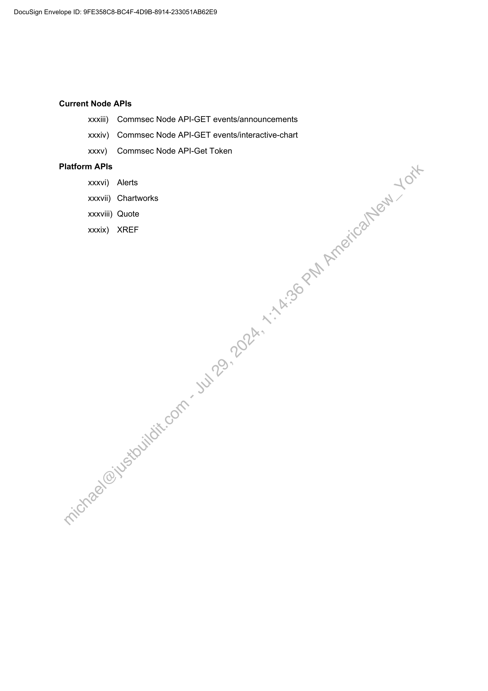
```  
```col-md
DocuSign Envelope ID: 9FE358C8-BC4F-4D9B-8914-233051AB62E9  
Current Node APIs
xxxiii) _Commsec Node API-GET events/announcements
xxxiv) Commsec Node API-GET events/interactive-chart
xxxv) Commsec Node API-Get Token  
Platform APIs
xxxvi) Alerts
xxxvii) Chartworks
xxxviii) Quote  
Xxxix) XREF  
```
````
Notes:    
````col
```col-md
flexGrow=.5
===
> [!info] [Page 20](_attachments/images_CommonWealthSecurities-3.6.1.10.200110867.pdf_210452/page_20.png)
> 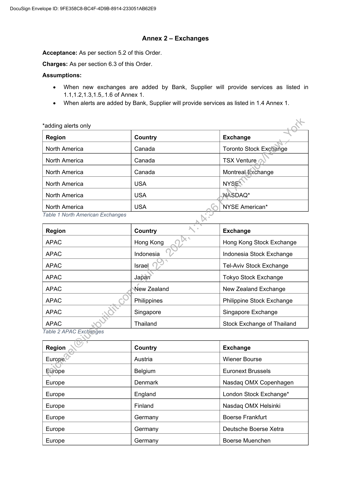
```  
```col-md
DocuSign Envelope ID: 9FE358C8-BC4F-4D9B-8914-233051AB62E9  
Annex 2 — Exchanges  
Acceptance: As per section 5.2 of this Order.
Charges: As per section 6.3 of this Order.
Assumptions:  
e When new exchanges are added by Bank, Supplier will provide services as listed in
1.1,1.2,1.3,1.5,.1.6 of Annex 1.
e When alerts are added by Bank, Supplier will provide services as listed in 1.4 Annex 1.  
*adding alerts only  
Region Country Exchange  
North America Canada Toronto Stock Exchange
North America Canada TSX Venture  
North America Canada Montreal-Exchange
North America USA NYSE*  
North America USA NASDAQ*  
North America USA NYSE American*  
Table 1 North American Exchanges  
Region Country Exchange  
APAC Hong Kong Hong Kong Stock Exchange
APAC Indonesia Indonesia Stock Exchange
APAC Israel Tel-Aviv Stock Exchange
APAC Japan Tokyo Stock Exchange
APAC New Zealand New Zealand Exchange
APAC Philippines Philippine Stock Exchange
APAC Singapore Singapore Exchange  
APAC Thailand Stock Exchange of Thailand  
Table 2 APAC Exchanges  
Region Country Exchange  
Europe. Austria Wiener Bourse  
Europe Belgium Euronext Brussels  
Europe Denmark Nasdaq OMX Copenhagen
Europe England London Stock Exchange*
Europe Finland Nasdaq OMX Helsinki
Europe Germany Boerse Frankfurt  
Europe Germany Deutsche Boerse Xetra  
Europe Germany Boerse Muenchen  
```
````
Notes:    
````col
```col-md
flexGrow=.5
===
> [!info] [Page 21](_attachments/images_CommonWealthSecurities-3.6.1.10.200110867.pdf_210452/page_21.png)
> 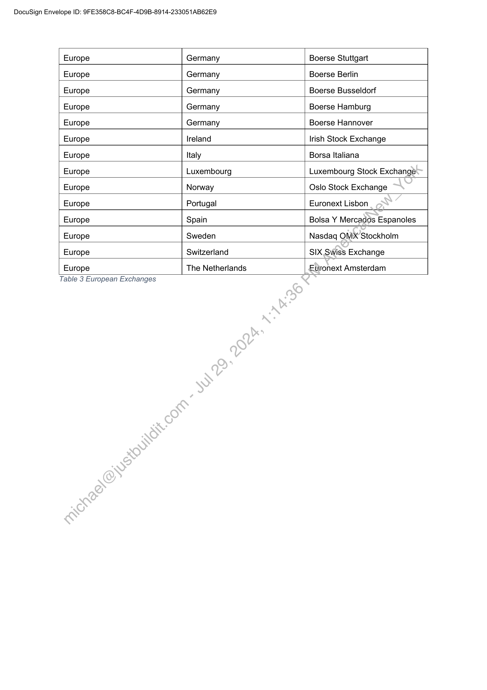
```  
```col-md
DocuSign Envelope ID: 9FE358C8-BC4F-4D9B-8914-233051AB62E9  
Europe Germany Boerse Stuttgart  
Europe Germany Boerse Berlin  
Europe Germany Boerse Busseldorf  
Europe Germany Boerse Hamburg  
Europe Germany Boerse Hannover  
Europe Ireland Irish Stock Exchange  
Europe Italy Borsa Italiana  
Europe Luxembourg Luxembourg Stock Exchange
Europe Norway Oslo Stock Exchange  
Europe Portugal Euronext Lisbon  
Europe Spain Bolsa Y Mercados Espanoles
Europe Sweden Nasdaq OMX Stockholm
Europe Switzerland SIX.Swiss Exchange  
Europe The Netherlands Euronext Amsterdam  
Table 3 European Exchanges  
```
````
Notes:  


![[_attachments/CommonWealthSecurities-3.6.1.10.2 00110867.pdf]