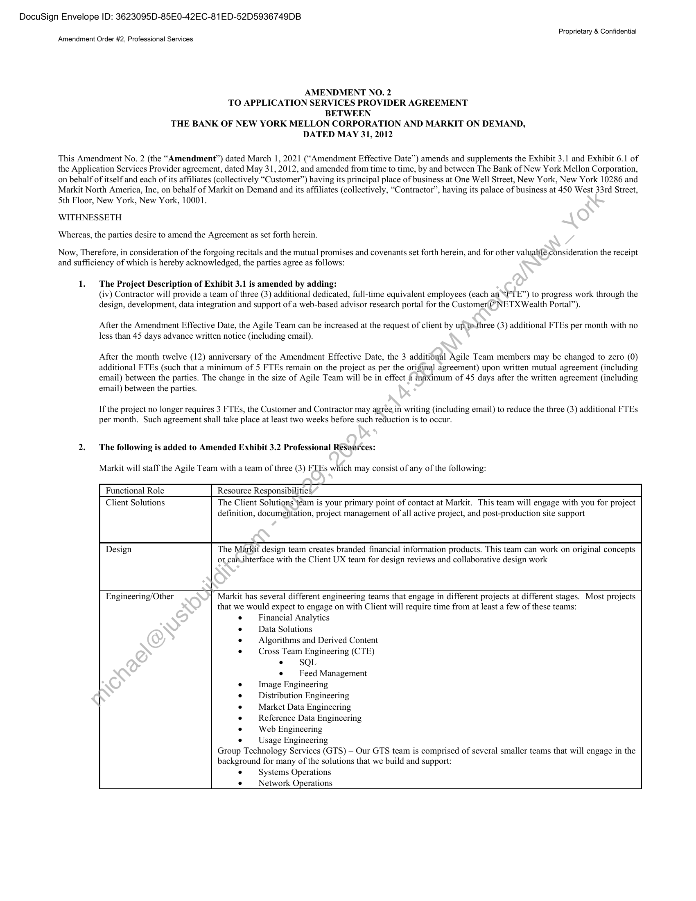
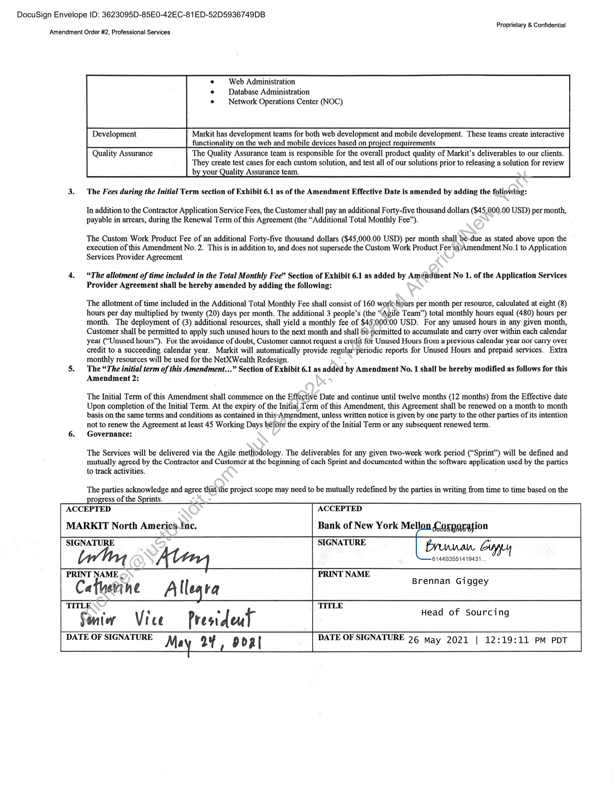

##### Amendment No. 2 to Application Services Provider Agreement]

  
````col
```col-md
flexGrow=.5
===
> [!info] [Page 1](_attachments/images_BNYMellon-3.6.1.11.100194295-b.pdf_210159/page_1.png)
> 
```  
```col-md
DocuSign Envelope ID: 3623095D-85E0-42EC-81ED-52D5936749DB  
Proprietary & Confidential
Amendment Order #2, Professional Services  
AMENDMENT NO. 2
TO APPLICATION SERVICES PROVIDER AGREEMENT
BETWEEN
THE BANK OF NEW YORK MELLON CORPORATION AND MARKIT ON DEMAND,
DATED MAY 31, 2012  
This Amendment No. 2 (the “Amendment”) dated March 1, 2021 (“Amendment Effective Date”) amends and supplements the Exhibit 3.1 and Exhibit 6.1 of
the Application Services Provider agreement, dated May 31, 2012, and amended from time to time, by and between The Bank of New York Mellon Corporation,
on behalf of itself and each of its affiliates (collectively “Customer”) having its principal place of business at One Well Street, New York, New York 10286 and
Markit North America, Inc, on behalf of Markit on Demand and its affiliates (collectively, “Contractor”, having its palace of business at 450 West 33rd Street,
5th Floor, New York, New York, 10001.  
WITHNESSETH
Whereas, the parties desire to amend the Agreement as set forth herein.  
Now, Therefore, in consideration of the forgoing recitals and the mutual promises and covenants set forth herein, and for other valuable,consideration the receipt
and sufficiency of which is hereby acknowledged, the parties agree as follows:  
1. The Project Description of Exhibit 3.1 is amended by adding:
(iv) Contractor will provide a team of three (3) additional dedicated, full-time equivalent employees (each an “FTE”) to progress work through the
design, development, data integration and support of a web-based advisor research portal for the Customer (“NETX Wealth Portal”).  
After the Amendment Effective Date, the Agile Team can be increased at the request of client by up to-three (3) additional FTEs per month with no
less than 45 days advance written notice (including email).  
After the month twelve (12) anniversary of the Amendment Effective Date, the 3 additional Agile Team members may be changed to zero (0)
additional FTEs (such that a minimum of 5 FTEs remain on the project as per the original agreement) upon written mutual agreement (including
email) between the parties. The change in the size of Agile Team will be in effect 4 maximum of 45 days after the written agreement (including
email) between the parties.  
If the project no longer requires 3 FTEs, the Customer and Contractor may agree, in writing (including email) to reduce the three (3) additional FTEs
per month. Such agreement shall take place at least two weeks before such reduction is to occur.  
2. The following is added to Amended Exhibit 3.2 Professional Resources:  
Markit will staff the Agile Team with a team of three (3) FTEs which may consist of any of the following:  
Functional Role Resource Responsibilities,  
Client Solutions The Client Solutions team is your primary point of contact at Markit. This team will engage with you for project
definition, documentation, project management of all active project, and post-production site support  
Design The Markit design team creates branded financial information products. This team can work on original concepts
or can.ihterface with the Client UX team for design reviews and collaborative design work  
Engineering/Other Markit has several different engineering teams that engage in different projects at different stages. Most projects
that we would expect to engage on with Client will require time from at least a few of these tear
Financial Analytics
Data Solutions
Algorithms and Derived Content
Cross Team Engineering (CTE)
* SQLFeed Management
Image Engineering
Distribution Engineering
Market Data Engineering
Reference Data Engineering
Web Engineering
e —_ Usage Engineering
Group Technology Services (GTS) — Our GTS team is comprised of several smaller teams that will engage in the
background for many of the solutions that we build and support:Systems Operations
e Network Operations  
```
````
Notes:    
````col
```col-md
flexGrow=.5
===
> [!info] [Page 2](_attachments/images_BNYMellon-3.6.1.11.100194295-b.pdf_210159/page_2.png)
> 
```  
```col-md
DocuSign Envelope ID: 3623095D-85E0-42EC-81ED-52D5936749DB  
Proprietary & Confidential
Amendment Order #2, Professional Services  
Web Administration
Database Administration
Network Operations Center (NOC)  
Development Markit has development teams for both web development and mobile development. These teams create interactive
functionality on the web and mobile devices based on project requirements  
They create test cases for each custom solution, and test all of our solutions prior to releasing a solution for review
by your Quality Assurance team.  
Quality Assurance The Quality Assurance team is responsible for the overall product quality of Markit’s deliverables to our clients.  
3. The Fees during the Initial Term section of Exhibit 6.1 as of the Amendment Effective Date is amended by adding the following:  
In addition to the Contractor Application Service Fees, the Customer shall pay an additional Forty-five thousand dollars ($45,000.00 USD) per month,
payable in arrears, during the Renewal Term of this Agreement (the “Additional Total Monthly Fee”).  
The Custom Work Product Fee of an additional Forty-five thousand dollars ($45,000.00 USD) per month shall bé-due as stated above upon the
execution of this Amendment No. 2. This is in addition to, and does not supersede the Custom Work Product Fee in/Amendment No.1 to Application
Services Provider Agreement  
4. “The allotment of time included in the Total Monthly Fee” Section of Exhibit 6.1 as added by Améndment No 1. of the Application Services
Provider Agreement shall be hereby amended by adding the following:  
The allotment of time included in the Additional Total Monthly Fee shall consist of 160 work-hours per month per resource, calculated at eight (8)
hours per day multiplied by twenty (20) days per month. The additional 3 people’s (the “Agile Team”) total monthly hours equal (480) hours per
month. The deployment of (3) additional resources, shall yield a monthly fee of $45,000:00 USD. For any unused hours in any given month,
Customer shall be permitted to apply such unused hours to the next month and shall 6@-permitted to accumulate and carry over within each calendar
year (“Unused hours”). For the avoidance of doubt, Customer cannot request a credit for Unused Hours from a previous calendar year nor carry over
credit to a succeeding calendar year. Markit will automatically provide regular‘periodic reports for Unused Hours and prepaid services. Extra
monthly resources will be used for the NetXWealth Redesign.  
5. The “The initial term of this Amendment.  ” Section of Exhibit 6.1 as added by Amendment No. 1 shall be hereby modified as follows for this
Amendment 2:  
The Initial Term of this Amendment shall commence on the Effective Date and continue until twelve months (12 months) from the Effective date
Upon completion of the Initial Term. At the expiry of the Initial Term of this Amendment, this Agreement shall be renewed on a month to month
basis on the same terms and conditions as contained in this7Amendment, unless written notice is given by one party to the other parties of its intention
not to renew the Agreement at least 45 Working Days before the expiry of the Initial Term or any subsequent renewed term.  
6. Governance:  
The Services will be delivered via the Agile methodology. The deliverables for any given two-week work period (“Sprint”) will be defined and
mutually agreed by the Contractor and Customér at the beginning of cach Sprint and documented within the software application used by the parties
to track activities.  
The parties acknowledge and agree tliat the project scope may need to be mutually redefined by the parties in writing from time to time based on the  
progress of the Sprints.
ACCEPTED ACCEPTED  
MARKIT North Americatnc. Bank of New York Mell
SIGNATURE SIGNATURE  
Laxpavagion  
Bruunan. Gyyey  
6144B3551419431  
PRINT NAME < PRINT NAME  
Catherine All ra Brennan Giggey
Le  
Sunt Vice Presideut Head of Sourcing  
DATE OF SIGNATURE Mar 94 dbdal DATE OF SIGNATURE 26 may 2021 | 12:19:11 PM PDT  
```
````
Notes:  


![[_attachments/BNYMellon-3.6.1.11.1 00194295 - b.pdf]