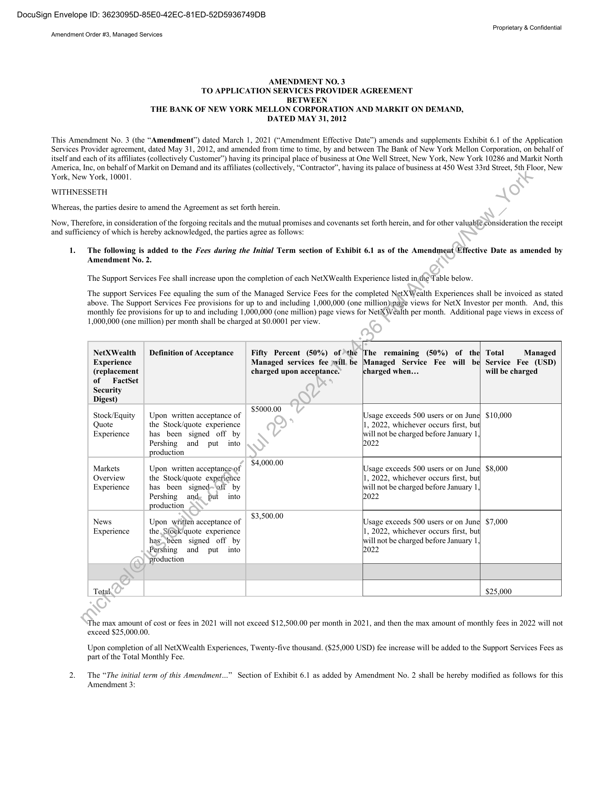
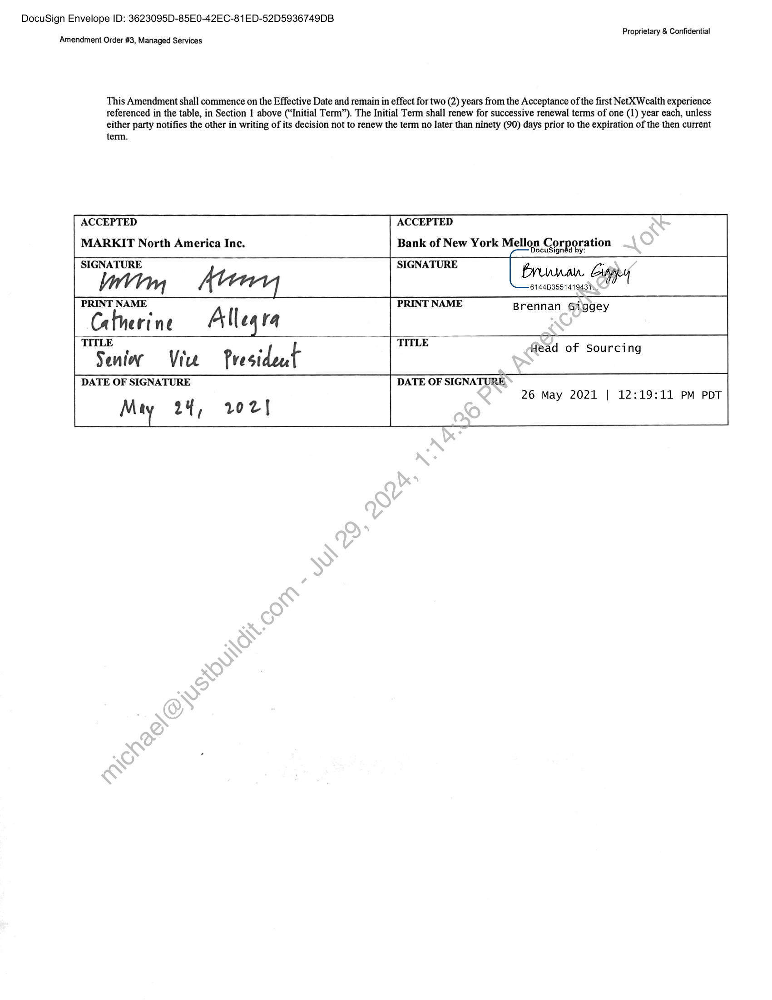

##### Amendment No. 3 to Application Services Provider Agreement]

  
````col
```col-md
flexGrow=.5
===
> [!info] [Page 1](_attachments/images_BNYMellon-3.6.1.11.200194295-a.pdf_210207/page_1.png)
> 
```  
```col-md
DocuSign Envelope ID: 3623095D-85E0-42EC-81ED-52D5936749DB  
Proprietary & Confidential
Amendment Order #3, Managed Services  
AMENDMENT NO. 3
TO APPLICATION SERVICES PROVIDER AGREEMENT
BETWEEN
THE BANK OF NEW YORK MELLON CORPORATION AND MARKIT ON DEMAND,
DATED MAY 31, 2012  
This Amendment No. 3 (the “Amendment”) dated March 1, 2021 (“Amendment Effective Date”) amends and supplements Exhibit 6.1 of the Application
Services Provider agreement, dated May 31, 2012, and amended from time to time, by and between The Bank of New York Mellon Corporation, on behalf of
itself and each of its affiliates (collectively Customer”) having its principal place of business at One Well Street, New York, New York 10286 and Markit North
America, Inc, on behalf of Markit on Demand and its affiliates (collectively, “Contractor”, having its palace of business at 450 West 33rd Street, Sth Floor, New
York, New York, 10001.  
WITHNESSETH
Whereas, the parties desire to amend the Agreement as set forth herein.  
Now, Therefore, in consideration of the forgoing recitals and the mutual promises and covenants set forth herein, and for other valuable consideration the receipt
and sufficiency of which is hereby acknowledged, the parties agree as follows:  
1. The following is added to the Fees during the Initial Term section of Exhibit 6.1 as of the Amendment Effective Date as amended by
Amendment No. 2.  
The Support Services Fee shall increase upon the completion of each NetXWealth Experience listed inthe Table below.  
The support Services Fee equaling the sum of the Managed Service Fees for the completed NetX Wealth Experiences shall be invoiced as stated
above. The Support Services Fee provisions for up to and including 1,000,000 (one million)ypage views for NetX Investor per month. And, this
monthly fee provisions for up to and including 1,000,000 (one million) page views for NetX Wealth per month. Additional page views in excess of
1,000,000 (one million) per month shall be charged at $0.0001 per view.  
NetXWealth Definition of Acceptance Fifty Percent (50%) of the [The remaining (50%) of the Total Managed
Experience Managed services fee will. be [Managed Service Fee will be} Service Fee (USD)
(replacement charged upon acceptance. charged when.  will be charged
of FactSet
Security
Digest). . | $5000.00
Stock/Equity | Upon written acceptance of [Usage exceeds 500 users or on June| $10,000
Quote the Stock/quote experience ‘1, 2022, whichever occurs first, but
Experience has been signed off by ill not be charged before January 1 |
Pershing and put into 2022
production¢, $4,000.00
Markets Upon written acceptanceof [Usage exceeds 500 users or on June} $8,000
Overview the Stock/quote expefierice ‘1, 2022, whichever occurs first, but
Experience has been signed= off by ill not be charged before January 1 |
Pershing and, put into 2022
production
‘ . | $3,500.00
News Upon written acceptance of [Usage exceeds 500 users or on June} $7,000
Experience the Sfoek/quote experience ‘1, 2022, whichever occurs first, but
hasbeen signed off by ill not be charged before January 1 |
Pershing and put into 2022
production
Total, $25,000  
The max amount of cost or fees in 2021 will not exceed $12,500.00 per month in 2021, and then the max amount of monthly fees in 2022 will not
exceed $25,000.00.  
Upon completion of all NetX Wealth Experiences, Twenty-five thousand. ($25,000 USD) fee increase will be added to the Support Services Fees as
part of the Total Monthly Fee.  
2. The “The initial term of this Amendment.  ” Section of Exhibit 6.1 as added by Amendment No. 2 shall be hereby modified as follows for this
Amendment 3:  
```
````
Notes:    
````col
```col-md
flexGrow=.5
===
> [!info] [Page 2](_attachments/images_BNYMellon-3.6.1.11.200194295-a.pdf_210207/page_2.png)
> 
```  
```col-md
DocuSign Envelope ID: 3623095D-85E0-42EC-81ED-52D5936749DB  
Amendment Order #3, Managed Services  
Proprietary & Confidential  
This Amendment shall commence on the Effective Date and remain in effect for two (2) years from the Acceptance of the first NetXWealth experience
referenced in the table, in Section 1 above (“Initial Term”). The Initial Term shall renew for successive renewal terms of one (1) year each, unless
either party notifies the other in writing of its decision not to renew the term no later than ninety (90) days prior to the expiration of the then current  
term.
ACCEPTED ACCEPTED
MARKIT North America Inc. Bank of New York Mellon Corporation
SIGNATURE SIGNATURE [e Giggey
btm Prova.
PRINT NAME PRINT NAME Brennan Giggey
Catherine Allegra
TR nin Vie President TITLE fead of Sourcing
DATE OF SIGNATURE DATE OF SIGNATURE
26 May 2021 | 12:19:11 PM PDT
Mty 24, 102]  
```
````
Notes:  


![[_attachments/BNYMellon-3.6.1.11.2 00194295 - a.pdf]