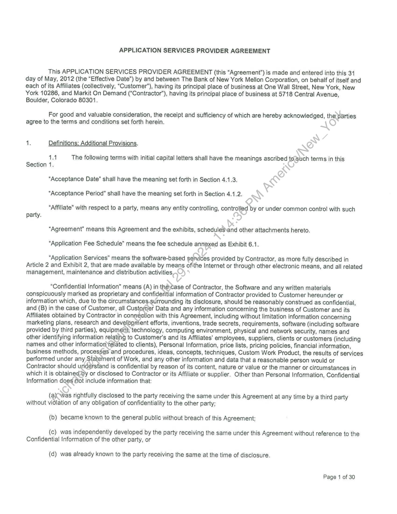
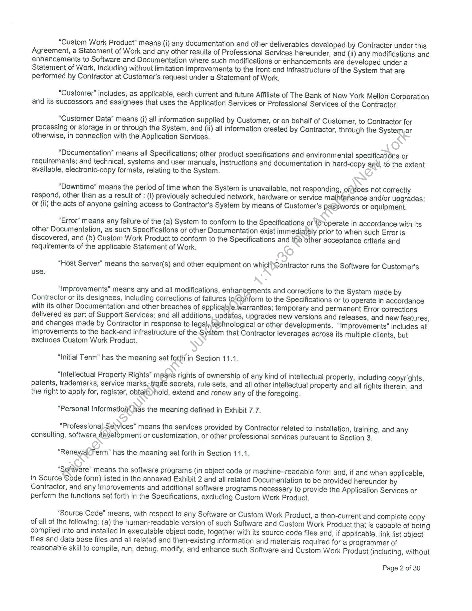
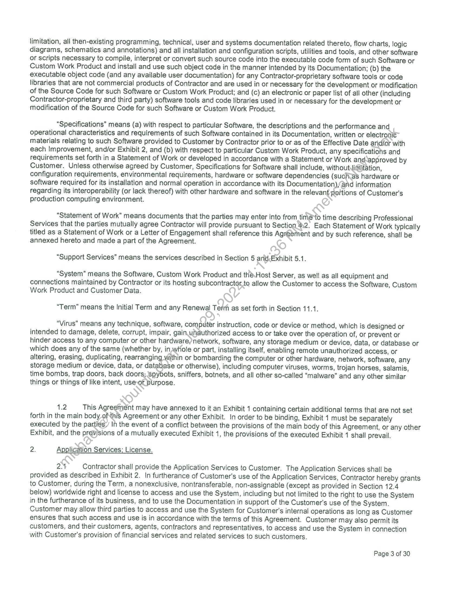
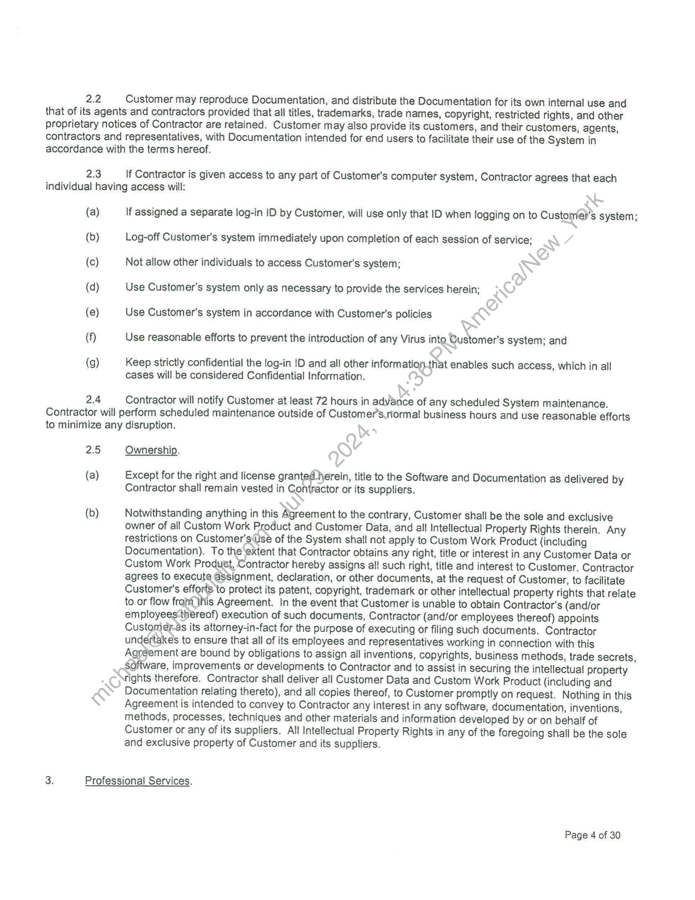
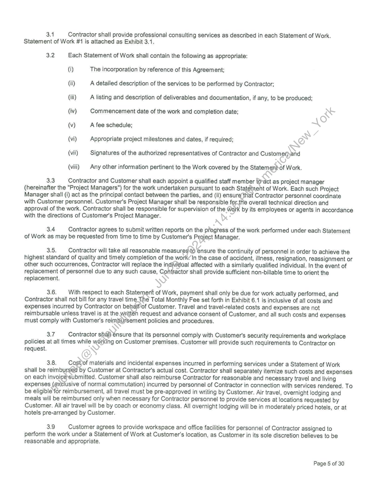
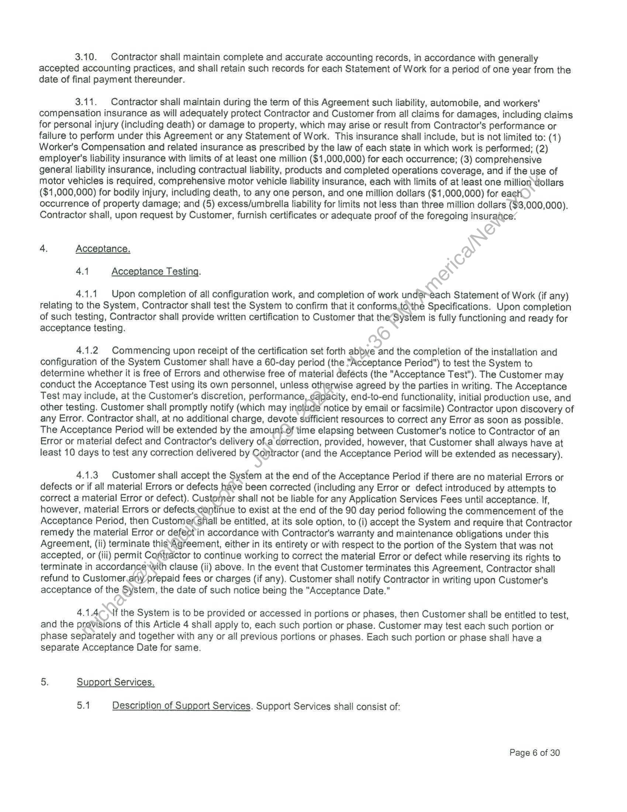
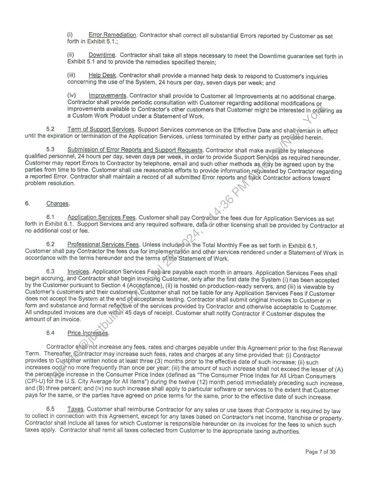

##### APPLICATION SERVICES PROVIDER AGREEMENT]

  
````col
```col-md
flexGrow=.5
===
> [!info] [Page 1](_attachments/images_BNYMellon-3.6.1.11.320120529BNYMSAandExhibits1and2.pdf_210030/page_1.png)
> 
```  
```col-md
APPLICATION SERVICES PROVIDER AGREEMENT  
This APPLICATION SERVICES PROVIDER AGREEMENT (this “Agreement”) is made and entered into this 34
day of May, 2012 (the “Effective Date”) by and between The Bank of New York Mellon Corporation, on behalf of itself and
each of its Affiliates (collectively, “Customer”), having its principal place of business at One Wall Street, New York, New  
York 10286, and Markit On Demand (“Contractor”), having its principal place of business at 5718 Central Avenue,
Boulder, Colorado 80301.  
For good and valuable consideration, the receipt and sufficiency of which are hereby acknowledged, the parties
agree to the terms and conditions set forth herein.  
i, Definitions; Additional Provisions.
434 The following terms with initial capital letters shall have the meanings ascribed tosuch terms in this
Section 1.  
“Acceptance Date” shall have the meaning set forth in Section 4.1.3.  
“Acceptance Period” shall have the meaning set forth in Section 4.1.2.  
“Affiliate” with respect to a party, means any entity controlling, controlled by or under common contro! with such
party.  
“Agreement” means this Agreement and the exhibits, schedules\and other attachments hereto.
“Application Fee Schedule” means the fee schedule annexed as Exhibit 6.1.  
“Application Services" means the software-based seiwices provided by Contractor, as more fully described in
Article 2 and Exhibit 2, that are made available by means ofthe Internet or through other electronic means, and all related
management, maintenance and distribution activities,  
“Confidential Information” means (A) in thé)¢ase of Contractor, the Software and any written materials
conspicuously marked as proprietary and confidential information of Contractor provided to Customer hereunder or
information which, due to the circumstances-surrounding its disclosure, should be reasonably construed as confidential,
and (B) in the case of Customer, all Customer Data and any information concerning the business of Customer and its
Affiliates obtained by Contractor in conrestion with this Agreement, including without limitation information concerning
marketing plans, research and development efforts, inventions, trade secrets, requirements, software (including software
provided by third parties), equipmen}; technology, computing environment, physical and network security, names and
other identifying information relating to Customer's and its Affiliates’ employees, suppliers, clients or customers (including
names and other information elated to clients), Personal Information, price lists, pricing policies, financial information,
business methods, processes and procedures, ideas, concepts, techniques, Custom Work Product, the results of services
performed under any Statement of Work, and any other information and data that a reasonable person would or
Contractor should understand is confidential by reason of its content, nature or value or the manner or circumstances in
which it is obtainedby or disclosed to Contractor or its Affiliate or supplier. Other than Personal Information, Confidential
Information does Mot include information that:  
(a)Qwas rightfully disclosed to the party receiving the same under this Agreement at any time by a third party
without violation of any obligation of confidentiality to the other party;  
(b) became known to the general public without breach of this Agreement;  
(c) was independently developed by the party receiving the same under this Agreement without reference to the
Confidential Information of the other party, or  
(d) was already known to the party receiving the same at the time of disclosure.  
Page 1 of 30  
```
````
Notes:    
````col
```col-md
flexGrow=.5
===
> [!info] [Page 2](_attachments/images_BNYMellon-3.6.1.11.320120529BNYMSAandExhibits1and2.pdf_210030/page_2.png)
> 
```  
```col-md
“Custom Work Product” means (i) any documentation and other deliverables developed by Contractor under this
Agreement, a Statement of Work and any other results of Professional Services hereunder, and (ii) any modifications and
enhancements to Software and Documentation where such modifications or enhancements are developed under a
Statement of Work, including without limitation improvements to the front-end infrastructure of the System that are
performed by Contractor at Customer’s request under a Statement of Work.  
“Customer” includes, as applicable, each current and future Affiliate of The Bank of New York Mellon Corporation
and its successors and assignees that uses the Application Services or Professional Services of the Contractor.  
“Customer Data” means (i) all information supplied by Customer, or on behalf of Customer, to Contractor for
processing or storage in or through the System, and (ii) all information created by Contractor, through the System, or
otherwise, in connection with the Application Services.  
“Documentation” means all Specifications; other product specifications and environmental specifications or
requirements; and technical, systems and user manuals, instructions and documentation in hard-copy and, to the extent
available, electronic-copy formats, relating to the System.  
“Downtime” means the period of time when the System is unavailable, not responding, of?does not correctly
respond, other than as a result of : (i) previously scheduled network, hardware or service maintenance and/or upgrades;
or (il) the acts of anyone gaining access to Contractor's System by means of Customer's passwords or equipment.  
“Error” means any failure of the (a) System to conform to the Specifications or te-operate in accordance with its
other Documentation, as such Specifications or other Documentation exist immediatély prior to when such Error is
discovered, and (b) Custom Work Product to conform to the Specifications and the other acceptance criteria and
requirements of the applicable Statement of Work.  
“Host Server” means the server(s) and other equipment on whicHContractor runs the Software for Customer's
use.  
“Improvements” means any and all modifications, enhantements and corrections to the System made by
Contractor or its designees, including corrections of failures toConform to the Specifications or to operate in accordance
with its other Documentation and other breaches of applicable Warranties: temporary and permanent Error corrections
delivered as part of Support Services; and all additions, updates, upgrades new versions and releases, and new features,
and changes made by Contractor in response to legal; technological or other developments. “Improvements” includes all
improvements to the back-end infrastructure of the System that Contractor leverages across its multiple clients, but
excludes Custom Work Product.  
“Initial Term” has the meaning set forth in Section 11.1.  
“Intellectual Property Rights” means rights of ownership of any kind of intellectual property, including copyrights,
patents, trademarks, service marks, trade secrets, rule sets, and all other intellectual property and all rights therein, and
the right to apply for, register, obtain)yhold, extend and renew any of the foregoing.  
“Personal Information’ has the meaning defined in Exhibit 7.7.  
“Professional Services” means the services provided by Contractor related to installation, training, and any
consulting, software development or customization, or other professional services pursuant to Section 3.  
“RenewalFerm” has the meaning set forth in Section 11.1.  
“Software” means the software programs (in object code or machine-readable form and, if and when applicable,
in Source Code form) listed in the annexed Exhibit 2 and all related Documentation to be provided hereunder by
Contractor, and any Improvements and additional software programs necessary to provide the Application Services or
perform the functions set forth in the Specifications, excluding Custom Work Product.  
“Source Code” means, with respect to any Software or Custom Work Product, a then-current and complete copy
of all of the following: (a) the human-readable version of such Software and Custom Work Product that is capable of being
compiled into and installed in executable object code, together with its source code files and, if applicable, link list object
files and data base files and all related and then-existing information and materials required for a programmer of
reasonable skill to compile, run, debug, modify, and enhance such Software and Custom Work Product (including, without  
Page 2 of 30  
```
````
Notes:    
````col
```col-md
flexGrow=.5
===
> [!info] [Page 3](_attachments/images_BNYMellon-3.6.1.11.320120529BNYMSAandExhibits1and2.pdf_210030/page_3.png)
> 
```  
```col-md
limitation, all then-existing programming, technical, user and systems documentation related thereto, flow charts, logic
diagrams, schematics and annotations) and ail installation and configuration scripts, utilities and tools, and other software
or scripts necessary to compile, interpret or convert such source code into the executable code form of such Software or
Custom Work Product and install and use such object code in the manner intended by its Documentation; (b) the
executable object code (and any available user documentation) for any Contractor-proprietary software tools or code
libraries that are not commercial products of Contractor and are used in or necessary for the development or modification
of the Source Code for such Software or Custom Work Product; and (c) an electronic or paper list of all other (including
Contractor-proprietary and third party) software tools and code libraries used in or necessary for the development or
modification of the Source Code for such Software or Custom Work Product.  
“Specifications” means (a) with respect to particular Software, the descriptions and the performance and
operational characteristics and requirements of such Software contained in its Documentation, written or electronic
materials relating to such Software provided to Customer by Contractor prior to or as of the Effective Date arid/or with
each Improvement, and/or Exhibit 2, and (b) with respect to particular Custom Work Product, any specifications and
requirements set forth in a Statement of Work or developed in accordance with a Statement or Work and ‘approved by
Customer. Unless otherwise agreed by Customer, Specifications for Software shall include, withoutJiMitation,
configuration requirements, environmental requirements, hardware or software dependencies (suchas hardware or
software required for its installation and normal operation in accordance with its Documentation),and information
regarding its interoperability (or lack thereof) with other hardware and software in the relevant portions of Customer's
production computing environment.  
“Statement of Work” means documents that the parties may enter into from time to time describing Professional
Services that the parties mutually agree Contractor will provide pursuant to Section %2. Each Statement of Work typically
titled as a Statement of Work or a Letter of Engagement shall reference this Agreement and by such reference, shall be
annexed hereto and made a part of the Agreement.  
“Support Services” means the services described in Section 5 ant-Exhibit 5.1.  
“System” means the Software, Custom Work Product and tha\Host Server, as well as all equipment and
connections maintained by Contractor or its hosting subcontractor,to allow the Customer to access the Software, Custom
Work Product and Customer Data.  
“Term” means the Initial Term and any Renewal Terrh as set forth in Section 11.1.  
“Virus” means any technique, software, computer instruction, code or device or method, which is designed or
intended to damage, delete, corrupt, impair, gain.uhauthorized access to or take over the operation of, or prevent or
hinder access to any computer or other hardware,network, software, any storage medium or device, data, or database or
which does any of the same (whether by, in,whole or part, installing itself, enabling remote unauthorized access, or
altering, erasing, duplicating, rearranging within or bombarding the computer or other hardware, network, software, any
storage medium or device, data, or database or otherwise), including computer viruses, worms, trojan horses, salamis,
time bombs, trap doors, back doors; Spybots, sniffers, botnets, and all other so-called “malware” and any other similar
things or things of like intent, use-of purpose.  
Wd This Agreement may have annexed to it an Exhibit 1 containing certain additional terms that are not set
forth in the main body ofthis Agreement or any other Exhibit. In order to be binding, Exhibit 1 must be separately
executed by the parties, In the event of a conflict between the provisions of the main body of this Agreement, or any other
Exhibit, and the provisions of a mutually executed Exhibit 1, the provisions of the executed Exhibit 1 shall prevail.  
2. Application Services: License.  
2. Contractor shall provide the Application Services to Customer. The Application Services shall be
provided as described in Exhibit 2. In furtherance of Customer's use of the Application Services, Contractor hereby grants
to Customer, during the Term, a nonexclusive, nontransferable, non-assignable (except as provided in Section 12.4
below) worldwide right and license to access and use the System, including but not limited to the right to use the System
in the furtherance of its business, and to use the Documentation in support of the Customer's use of the System.
Customer may allow third parties to access and use the System for Customer's internal operations as long as Customer
ensures that such access and use is in accordance with the terms of this Agreement. Customer may also permit its
customers, and their customers, agents, contractors and representatives, to access and use the System in connection
with Customer's provision of financial services and related services to such customers.  
Page 3 of 30  
```
````
Notes:    
````col
```col-md
flexGrow=.5
===
> [!info] [Page 4](_attachments/images_BNYMellon-3.6.1.11.320120529BNYMSAandExhibits1and2.pdf_210030/page_4.png)
> 
```  
```col-md
2.2  
Customer may reproduce Documentation, and distribute the Documentation for its own internal use and  
that of its agents and contractors provided that all titles, trademarks, trade names, copyright, restricted rights, and other
proprietary notices of Contractor are retained. Customer may also provide its customers, and their customers, agents,
contractors and representatives, with Documentation intended for end users to facilitate their use of the System in
accordance with the terms hereof.  
2.3  
lf Contractor is given access to any part of Customer's computer system, Contractor agrees that each  
individual having access will:  
(a)
(b)
(c)
(d)
(e)
(f)
(9)  
2.4  
If assigned a separate log-in ID by Customer, will use only that ID when logging on to Custome?’s system;
Log-off Customer's system immediately upon completion of each session of service;  
Not allow other individuals to access Customer's system;  
Use Customer's system only as necessary to provide the services herein;  
Use Customer's system in accordance with Customer's policies  
Use reasonable efforts to prevent the introduction of any Virus into Oustomer’s system; and  
Keep strictly confidential the log-in ID and all other information.that enables such access, which in all
cases will be considered Confidential Information.  
Contractor will notify Customer at least 72 hours in advance of any scheduled System maintenance.  
Contractor will perform scheduled maintenance outside of Customer’s.riormal business hours and use reasonable efforts
to minimize any disruption.  
2.5  
(a)  
(b)  
Ownership.  
Except for the right and license granted herein, title to the Software and Documentation as delivered by
Contractor shall remain vested in Contractor or its suppliers.  
Notwithstanding anything in this Agreement to the contrary, Customer shall be the sole and exclusive
owner of all Custom Work Product and Customer Data, and all Intellectual Property Rights therein. Any
restrictions on Customer's\Usé of the System shall not apply to Custom Work Product (including
Documentation). To the extent that Contractor obtains any right, title or interest in any Customer Data or
Custom Work Produst, Contractor hereby assigns al! such right, title and interest to Customer. Contractor
agrees to execute assignment, declaration, or other documents, at the request of Customer, to facilitate
Customer's efforts to protect its patent, copyright, trademark or other intellectual property rights that relate
to or flow fron this Agreement. In the event that Customer is unable to obtain Contractor's (and/or
employees thereof) execution of such documents, Contractor (and/or employees thereof) appoints
Customer-as its attorney-in-fact for the purpose of executing or filing such documents. Contractor
undertakes to ensure that all of its employees and representatives working in connection with this
Agreement are bound by obligations to assign all inventions, copyrights, business methods, trade secrets
Software, improvements or developments to Contractor and to assist in securing the intellectual property
tights therefore. Contractor shall deliver all Customer Data and Custom Work Product (including and
Documentation relating thereto), and all copies thereof, to Customer promptly on request. Nothing in this
Agreement is intended to convey to Contractor any interest in any software, documentation, inventions,
methods, processes, techniques and other materials and information developed by or on behalf of
Customer or any of its suppliers. All Intellectual Property Rights in any of the foregoing shall be the sole
and exclusive property of Customer and its suppliers.  
3. Professional Services.  
Page 4 of 30  
```
````
Notes:    
````col
```col-md
flexGrow=.5
===
> [!info] [Page 5](_attachments/images_BNYMellon-3.6.1.11.320120529BNYMSAandExhibits1and2.pdf_210030/page_5.png)
> 
```  
```col-md
3.1 Contractor shall provide professional consulting services as described in each Statement of Work.
Statement of Work #1 is attached as Exhibit 3.1.  
3.2 Each Statement of Work shall contain the following as appropriate:
(i) The incorporation by reference of this Agreement;
(ii) A detailed description of the services to be performed by Contractor;
{iii) A listing and description of deliverables and documentation, if any, to be produced;
(iv) Commencement date of the work and completion date;
(v) A fee schedule;
(vi) Appropriate project milestones and dates, if required;
(vii) Signatures of the authorized representatives of Contractor and Customerpand
(vill) Any other information pertinent to the Work covered by the Statementof Work.  
3.3 Contractor and Customer shall each appoint a qualified staff member t@-act as project manager
(hereinafter the "Project Managers") for the work undertaken pursuant to each Statement of Work. Each such Project
Manager shall (i) act as the principal contact between the parties, and (ii) ensure that Contractor personnel coordinate
with Customer personnel. Customer's Project Manager shall be responsible for.the overall technical direction and  
approval of the work. Contractor shall be responsible for supervision of the Werk by its employees or agents in accordance
with the directions of Customer's Project Manager.  
3.4 Contractor agrees to submit written reports on the progress of the work performed under each Statement
of Work as may be requested from time to time by Customer's Project Manager.  
35: Contractor will take all reasonable measuresto ensure the continuity of personnel in order to achieve the
highest standard of quality and timely completion of the work¢In the case of accident, illness, resignation, reassignment or
other such occurrences, Contractor will replace the individual affected with a similarly qualified individual. In the event of
replacement of personnel due to any such cause, Contractor shall provide sufficient non-billable time to orient the
replacement.  
Kio With respect to each Statement of Work, payment shall only be due for work actually performed, and
Contractor shall not bill for any travel time The Total Monthly Fee set forth in Exhibit 6.1 is inclusive of all costs and
expenses incurred by Contractor on behalf/of Customer. Travel and travel-related costs and expenses are not
reimbursable unless travel is at the weittén request and advance consent of Customer, and all such costs and expenses
must comply with Customer's reimbursement policies and procedures.  
37 Contractor shal) ensure that its personnel comply with Customer's security requirements and workplace
policies at all times while working on Customer premises. Customer will provide such requirements to Contractor on
request.  
3.8. Cogstof materials and incidental expenses incurred in performing services under a Statement of Work
shall be reimbursed by Customer at Contractor's actual cost. Contractor shall separately itemize such costs and expenses
on each invoice submitted. Customer shall also reimburse Contractor for reasonable and necessary travel and living
expenses (exclusive of normal commutation) incurred by personnel of Contractor in connection with services rendered. To
be eligible for reimbursement, all travel must be pre-approved in writing by Customer. Air travel, overnight lodging and
meals will be reimbursed only when necessary for Contractor personnel to provide services at locations requested by  
Customer. All air travel will be by coach or economy class. All overnight lodging will be in moderately priced hotels, or at
hotels pre-arranged by Customer.  
3.9 Customer agrees to provide workspace and office facilities for personnel of Contractor assigned to
perform the work under a Statement of Work at Customer's location, as Customer in its sole discretion believes to be
reasonable and appropriate.  
Page 5 of 30  
```
````
Notes:    
````col
```col-md
flexGrow=.5
===
> [!info] [Page 6](_attachments/images_BNYMellon-3.6.1.11.320120529BNYMSAandExhibits1and2.pdf_210030/page_6.png)
> 
```  
```col-md
3.10. | Contractor shall maintain complete and accurate accounting records, in accordance with generally
accepted accounting practices, and shall retain such records for each Statement of Work for a period of one year from the
date of final payment thereunder.  
3.11. Contractor shall maintain during the term of this Agreement such liability, automobile, and workers'
compensation insurance as will adequately protect Contractor and Customer from all claims for damages, including claims
for personal injury (including death) or damage to property, which may arise or result from Contractor's performance or
failure to perform under this Agreement or any Statement of Work. This insurance shall include, but is not limited to: (1)
Worker's Compensation and related insurance as prescribed by the law of each state in which work is performed; (2)
employer's liability insurance with limits of at least one million ($1,000,000) for each occurrence; (3) comprehensive
general liability insurance, including contractual liability, products and completed operations coverage, and if the use of
motor vehicles is required, comprehensive motor vehicle liability insurance, each with limits of at least one million dollars
($1,000,000) for bodily injury, including death, to any one person, and one million dollars ($1,000,000) for eactt
occurrence of property damage; and (5) excess/umbrella liability for limits not less than three million dollars ($3,000,000).
Contractor shall, upon request by Customer, furnish certificates or adequate proof of the foregoing insurafce’  
4. Acceptance.
44 Acceptance Testing.  
4.1.1 | Upon completion of all configuration work, and completion of work undéréach Statement of Work (if any)
relating to the System, Contractor shall test the System to confirm that it conforms.to\the Specifications. Upon completion
of such testing, Contractor shall provide written certification to Customer that the System is fully functioning and ready for
acceptance testing.  
4.1.2 Commencing upon receipt of the certification set forth abbye and the completion of the installation and
configuration of the System Customer shall have a 60-day period (the "Acceptance Period") to test the System to
determine whether it is free of Errors and otherwise free of material defécts (the "Acceptance Test"). The Customer may
conduct the Acceptance Test using its own personnel, unless otherwise agreed by the parties in writing. The Acceptance
Test may include, at the Customer's discretion, performance, ¢apacity, end-to-end functionality, initial production use, and
other testing. Customer shall promptly notify (which may inelude notice by email or facsimile) Contractor upon discovery of
any Error. Contractor shall, at no additional charge, devote sufficient resources to correct any Error as soon as possible.
The Acceptance Period will be extended by the amount-of time elapsing between Customer's notice to Contractor of an
Error or material defect and Contractor's delivery of.a correction, provided, however, that Customer shall always have at
least 10 days to test any correction delivered by Contractor (and the Acceptance Period will be extended as necessary).  
4.1.3 Customer shall accept the System at the end of the Acceptance Period if there are no material Errors or
defects or if all material Errors or defects have been corrected (including any Error or defect introduced by attempts to
correct a material Error or defect). Customer shall not be liable for any Application Services Fees until acceptance. If,
however, material Errors or defects continue to exist at the end of the 90 day period following the commencement of the
Acceptance Period, then Customer shall be entitled, at its sole option, to (i) accept the System and require that Contractor
remedy the material Error or defect in accordance with Contractor's warranty and maintenance obligations under this
Agreement, (ii) terminate thisAgreement, either in its entirety or with respect to the portion of the System that was not
accepted, or (iii) permit Contractor to continue working to correct the material Error or defect while reserving its rights to
terminate in accordance with clause (ii) above. In the event that Customer terminates this Agreement, Contractor shall
refund to Customer.any prepaid fees or charges (if any). Customer shall notify Contractor in writing upon Customer's
acceptance of the System, the date of such notice being the "Acceptance Date."  
4.1.4¢ Mf the System is to be provided or accessed in portions or phases, then Customer shall be entitled to test,
and the provisions of this Article 4 shall apply to, each such portion or phase. Customer may test each such portion or
phase separately and together with any or all previous portions or phases. Each such portion or phase shall have a
separate Acceptance Date for same.  
5. Support Services.  
5A Description of Support Services. Support Services shall consist of:  
Page 6 of 30  
```
````
Notes:    
````col
```col-md
flexGrow=.5
===
> [!info] [Page 7](_attachments/images_BNYMellon-3.6.1.11.320120529BNYMSAandExhibits1and2.pdf_210030/page_7.png)
> 
```  
```col-md
(i) Error Remediation. Contractor shall correct all substantial Errors reported by Customer as set
forth in Exhibit 5.1.;  
(ii) Downtime. Contractor shail take all steps necessary to meet the Downtime guarantee set forth in
Exhibit 5.1 and to provide the remedies specified therein;  
(iii) Help Desk. Contractor shall provide a manned help desk to respond to Customer's inquiries
concerning the use of the System, 24 hours per day, seven days per week; and  
(iv) Improvements. Contractor shall provide to Customer all Improvements at no additional charge.
Contractor shall provide periodic consultation with Customer regarding additional modifications or
improvements available to Contractor's other customers that Customer might be interested in otdering as
a Custom Work Product under a Statement of Work.  
6.2 Term of Support Services. Support Services commence on the Effective Date and shallfemain in effect
until the expiration or termination of the Application Services, unless terminated by either party as provided herein.  
5.3 Submission of Error Reports and Support Requests. Contractor shall make available by telephone
qualified personnel, 24 hours per day, seven days per week, in order to provide Support Services as required hereunder.
Customer may report Errors to Contractor by telephone, email and such other methods as (fay be agreed upon by the
parties from time to time. Customer shall use reasonable efforts to provide information requested by Contractor regarding
a reported Error. Contractor shall maintain a record of all submitted Error reports and track Contractor actions toward
problem resolution.  
6. Charges.  
6.1 Application Services Fees. Customer shall pay Contractor the fees due for Application Services as set
forth in Exhibit 6.1. Support Services and any required software, dat&.or other licensing shall be provided by Contractor at
no additional cost or fee.  
6.2 Professional Services Fees. Unless includediin the Total Monthly Fee as set forth in Exhibit 6.1,
Customer shall pay Contractor the fees due for implementation and other services rendered under a Statement of Work in
accordance with the terms hereunder and the terms ofthe Statement of Work.  
6.3 Invoices. Application Services Feesare payable each month in arrears. Application Services Fees shall
begin accruing, and Contractor shall begin invoicing Customer, only after the first date the System (i) has been accepted
by the Customer pursuant to Section 4 (Acceptance), (ii) is hosted on production-ready servers, and (iil) is viewable by
Customer's customers and their customers.  
Customer shall not be liable for any Application Services Fees if Customer
does not accept the System at the end ofacceptance testing. Contractor shall submit original invoices to Customer in
form and substance and format reflective of the services provided by Contractor and otherwise acceptable to Customer.
All undisputed invoices are due within 45 days of receipt. Customer shall notify Contractor if Customer disputes the
amount of an invoice.  
6.4 Price Increases.  
Contractor shall/not increase any fees, rates and charges payable under this Agreement prior to the first Renewal
Term. Thereafter, (Contractor may increase such fees, rates and charges at any time provided that: (i) Contractor
provides to Custonier written notice at least three (3) months prior to the effective date of such increase; (ii) such
increases oc¢urno more frequently than once per year; (iii) the amount of such increase shall not exceed the lesser of (A)
the percentage increase in the Consumer Price Index (defined as "The Consumer Price Index for All Urban Consumers
(CPI-U) for the U.S. City Average for All Items") during the twelve (12) month period immediately preceding such increase,
and (8) three percent; and (iv) no such increase shall apply to particular software or services to the extent that Customer
pays for the same, or the parties have agreed on price terms for the same, prior to the effective date of such increase.  
6.5 Taxes. Customer shall reimburse Contractor for any sales or use taxes that Contractor is required by law
to collect in connection with this Agreement, except for any taxes based on Contractor's net income, franchise or property.
Contractor shall include all taxes for which Customer is responsible hereunder on its invoices for the fees to which such
taxes apply. Contractor shall remit all taxes collected from Customer to the appropriate taxing authorities.  
Page 7 of 30  
```
````
Notes:  


![[_attachments/BNYMellon-3.6.1.11.3 20120529 BNY MSA and Exhibits 1 and 2.pdf]