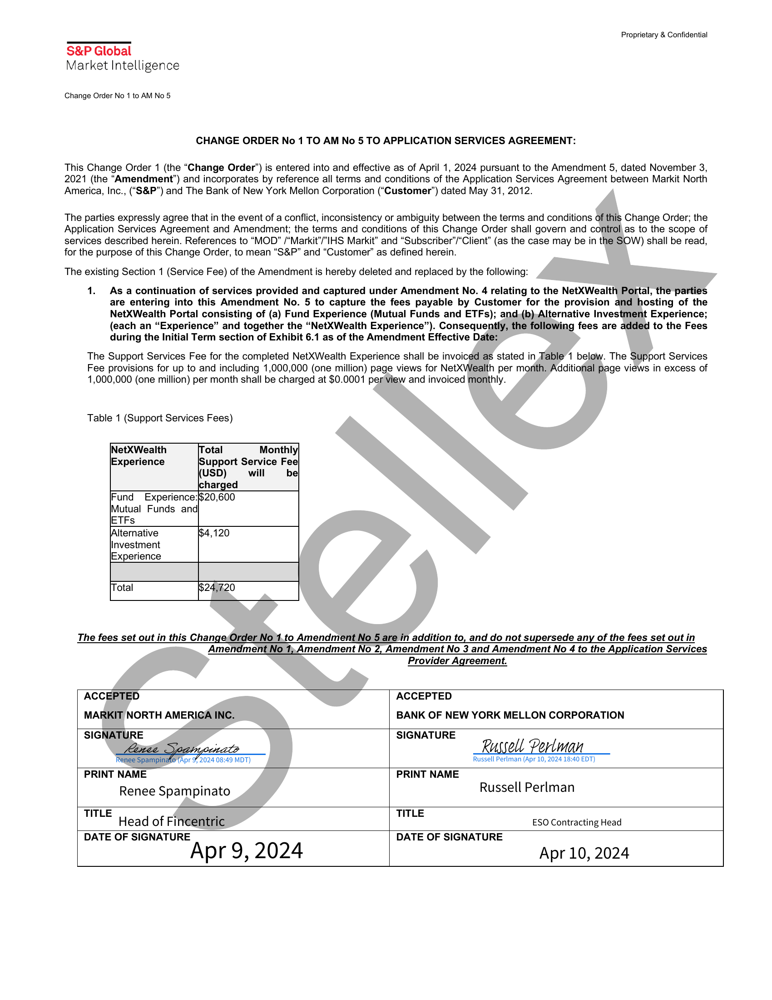

##### Change Order No 1 to Amendment No 5 to Application Services Agreement]

  
````col
```col-md
flexGrow=.5
===
> [!info] [Page 1](_attachments/images_BNYMellon-3.6.1.11.400260885.pdf_211255/page_1.png)
> 
```  
```col-md
Proprietary & Confidential  
S&P Global
Market Intelligence  
Change Order No 1 to AM No 5.  
CHANGE ORDER No 1 TO AM No 5 TO APPLICATION SERVICES AGREEMENT:  
This Change Order 1 (the “Change Order”) is entered into and effective as of April 1, 2024 pursuant to the Amendment 5, dated November 3,
2021 (the “Amendment’) and incorporates by reference all terms and conditions of the Application Services Agreement between Markit North
America, Inc., (“S&P”) and The Bank of New York Mellon Corporation (“Customer”) dated May 31, 2012.  
The parties expressly agree that in the event of a conflict, inconsistency or ambiguity between the terms and conditions of this Change Order; the
Application Services Agreement and Amendment; the terms and conditions of this Change Order shall govern and control as to the scope of
services described herein. References to “MOD” /“Markit’/"IHS Markit” and “Subscriber’/“Client” (as the case may be in the SOW) shall be read,
for the purpose of this Change Order, to mean “S&P” and “Customer” as defined herein.  
The existing Section 1 (Service Fee) of the Amendment is hereby deleted and replaced by the following:  
1. As acontinuation of services provided and captured under Amendment No. 4 relating to the NetXWealth Portal, the parties
are entering into this Amendment No. 5 to capture the fees payable by Customer for the provision and hosting of the
NetXWealth Portal consisting of (a) Fund Experience (Mutual Funds and ETFs); and,(b),Alternative Investment Experience;
(each an “Experience” and together the “NetXWealth Experience”). Consequently, the following fees are added to the Fees
during the Initial Term section of Exhibit 6.1 as of the Amendment Effective Date:  
The Support Services Fee for the completed NetXWealth Experience shall be invoiced as stated in Table 1 below. The Support Services
Fee provisions for up to and including 1,000,000 (one million) page views for NetXWealth per month. Additional page views in excess of
1,000,000 (one million) per month shall be charged at $0.0001 per view and invoiced monthly.  
Table 1 (Support Services Fees)  
NetXWealth Total Monthly]  
Experience Support Service Fee}
(USD) will _be'
\charged  
Fund Experience:$20,600
Mutual Funds and  
ETFs  
(Alternative 4,120
Investment  
Experience  
[Total 24,720  
The fees set out in this ChangeOrder No 14.to Amendment No 5 are in addition to, and do not supersede any of the fees set out in
Amendment No 1; Amendment No 2, Amendment No 3 and Amendment No 4 to the Application Services
Provider Agreement.  
Renee Spampinato  
ACCEPTED ACCEPTED
MARKIT NORTH AMERIGA INC. BANK OF NEW YORK MELLON CORPORATION
SIGNATURE SIGNATURE  
Abe Yoairyacinate —_ oll Perlman  
Renee Spampinato {Apr %'2024 08:49 MDT) Russell Perlman (Apr 10, 2024 18:40 EDT)
PRINT NAME PRINT NAME  
Russell Perlman  
TITLE y .
Head of Fincentric  
TITLE
ESO Contracting Head  
DATE OF SIGNATURE  
Apr 9, 2024  
DATE OF SIGNATURE  
Apr 10, 2024  
```
````
Notes:    
````col
```col-md
flexGrow=.5
===
> [!info] [Page 2](_attachments/images_BNYMellon-3.6.1.11.400260885.pdf_211255/page_2.png)
> 
```  
```col-md
Proprietary & Confidential  
S&P Global
Market Intelligence  
Change Order No 1 to AM No 5  
S
g
oO  
```
````
Notes:  


![[_attachments/BNYMellon-3.6.1.11.4 00260885.pdf]