##### Change Request 23 to Services Agreement (CON-002772)]

  
````col
```col-md
flexGrow=.5
===
> [!info] [Page 1](_attachments/images_NationalAusBank-3.6.1.12.1.100218210.pdf_210014/page_1.png)
> 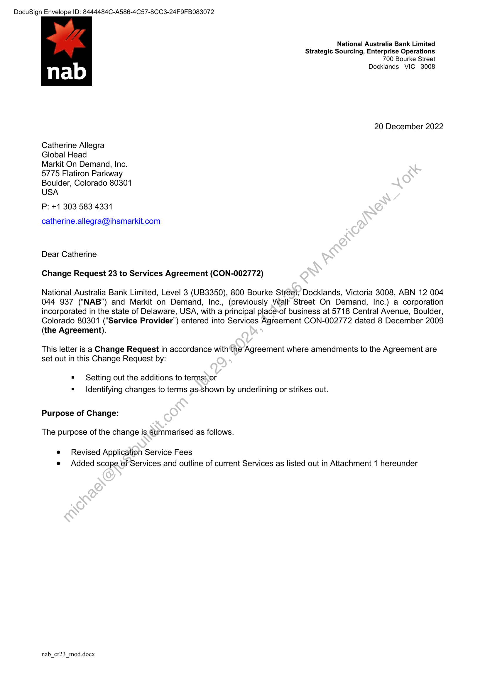
```  
```col-md
DocuSign Envelope ID: 8444484C-A586-4C57-8CC3-24F9FB083072  
National Australia Bank Limited  
Strategic Sourcing, Enterprise Operations
700 Bourke Street  
Docklands VIC 3008  
20 December 2022  
Catherine Allegra  
Global Head  
Markit On Demand, Inc.
5775 Flatiron Parkway
Boulder, Colorado 80301
USA  
P: +1 303 583 4331  
catherine.allegra@ihsmarkit.com  
Dear Catherine  
Change Request 23 to Services Agreement (CON-002772)  
National Australia Bank Limited, Level 3 (UB3350), 800 Bourke Street; Docklands, Victoria 3008, ABN 12 004
044 937 (“NAB”) and Markit on Demand, Inc., (previously Wall Street On Demand, Inc.) a corporation
incorporated in the state of Delaware, USA, with a principal place-of business at 5718 Central Avenue, Boulder,
Colorado 80301 (“Service Provider’) entered into Services Agreement CON-002772 dated 8 December 2009
(the Agreement).  
This letter is a Change Request in accordance with the Agreement where amendments to the Agreement are
set out in this Change Request by:  
= Setting out the additions to terms;or
= Identifying changes to terms as-Shown by underlining or strikes out.  
Purpose of Change:
The purpose of the change is Summarised as follows.  
e Revised Application Service Fees
e Added scope of Services and outline of current Services as listed out in Attachment 1 hereunder  
nab_cr23_mod.docx  
```
````
Notes:    
````col
```col-md
flexGrow=.5
===
> [!info] [Page 2](_attachments/images_NationalAusBank-3.6.1.12.1.100218210.pdf_210014/page_2.png)
> 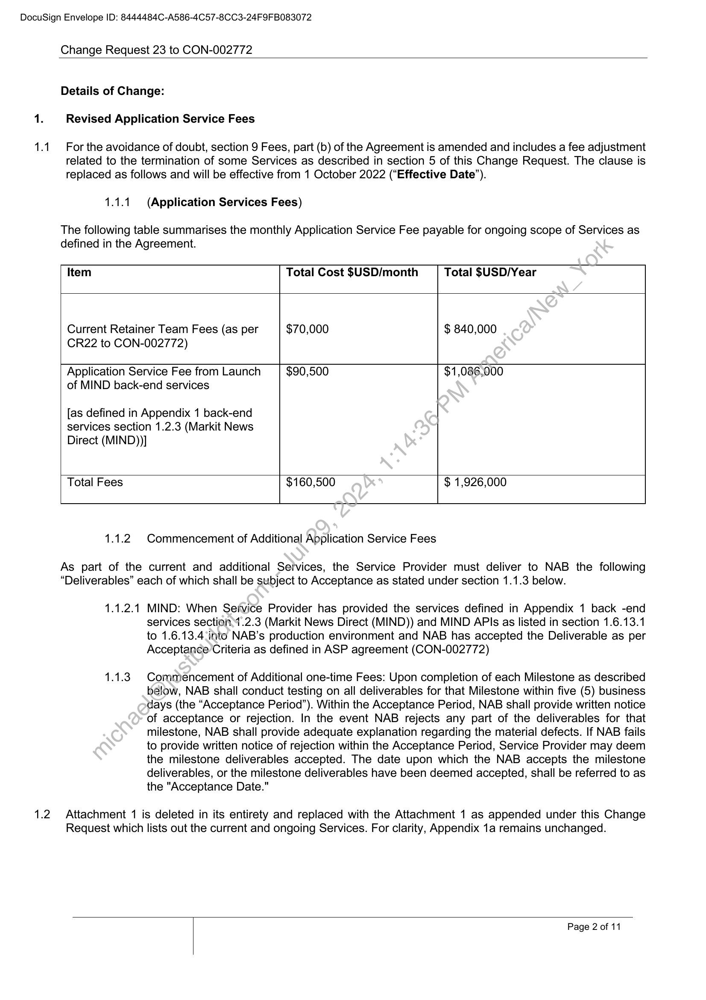
```  
```col-md
DocuSign Envelope ID: 8444484C-A586-4C57-8CC3-24F9FB083072  
1.1  
Change Request 23 to CON-002772  
Details of Change:  
Revised Application Service Fees  
For the avoidance of doubt, section 9 Fees, part (b) of the Agreement is amended and includes a fee adjustment
related to the termination of some Services as described in section 5 of this Change Request. The clause is  
replaced as follows and will be effective from 1 October 2022 (“Effective Date”).  
1.1.1. (Application Services Fees)  
The following table summarises the monthly Application Service Fee payable for ongoing scope of Services as  
defined in the Agreement.  
Item Total Cost $USD/month Total $USD/Year
Current Retainer Team Fees (as per $70,000 $ 840,000
CR22 to CON-002772)
Application Service Fee from Launch $90,500 $1,086,000
of MIND back-end services
[as defined in Appendix 1 back-end
services section 1.2.3 (Markit News
Direct (MIND))]
Total Fees $160,500 $ 1,926,000
1.1.2 Commencement of Additional Application Service Fees  
As part of the current and additional Services, the Service Provider must deliver to NAB the following
“Deliverables” each of which shall be subject to Acceptance as stated under section 1.1.3 below.  
1.1.2.1 MIND: When Service Provider has provided the services defined in Appendix 1 back -end  
services section.1.2.3 (Markit News Direct (MIND)) and MIND APIs as listed in section 1.6.13.1
to 1.6.13.4:into NAB’s production environment and NAB has accepted the Deliverable as per
Acceptance Criteria as defined in ASP agreement (CON-002772)  
Commencement of Additional one-time Fees: Upon completion of each Milestone as described
below, NAB shall conduct testing on all deliverables for that Milestone within five (5) business
days (the “Acceptance Period”). Within the Acceptance Period, NAB shall provide written notice
of acceptance or rejection. In the event NAB rejects any part of the deliverables for that
milestone, NAB shall provide adequate explanation regarding the material defects. If NAB fails
to provide written notice of rejection within the Acceptance Period, Service Provider may deem
the milestone deliverables accepted. The date upon which the NAB accepts the milestone
deliverables, or the milestone deliverables have been deemed accepted, shall be referred to as
the "Acceptance Date."  
1.2 Attachment 1 is deleted in its entirety and replaced with the Attachment 1 as appended under this Change
Request which lists out the current and ongoing Services. For clarity, Appendix 1a remains unchanged.  
Page 2 of 11  
```
````
Notes:    
````col
```col-md
flexGrow=.5
===
> [!info] [Page 3](_attachments/images_NationalAusBank-3.6.1.12.1.100218210.pdf_210014/page_3.png)
> 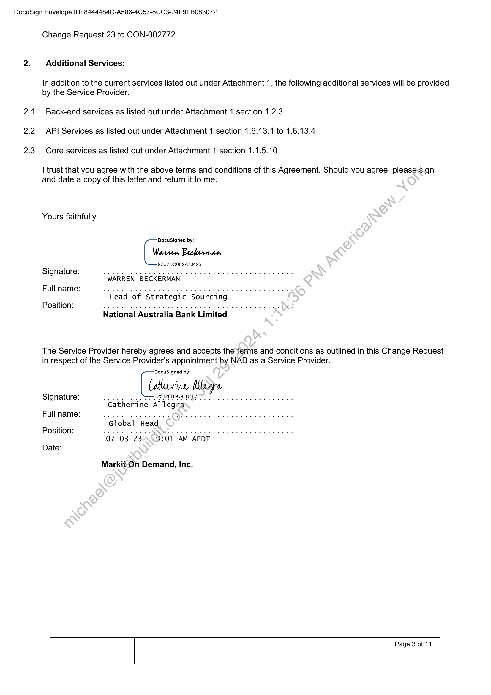
```  
```col-md
DocuSign Envelope ID: 8444484C-A586-4C57-8CC3-24F9FB083072  
2.  
2.1  
2.2  
2.3  
Change Request 23 to CON-002772  
Additional Services:  
In addition to the current services listed out under Attachment 1, the following additional services will be provided
by the Service Provider.  
Back-end services as listed out under Attachment 1 section 1.2.3.
API Services as listed out under Attachment 1 section 1.6.13.1 to 1.6.13.4
Core services as listed out under Attachment 1 section 1.1.5.10  
| trust that you agree with the above terms and conditions of this Agreement. Should you agree, please.sign
and date a copy of this letter and return it to me.  
Yours faithfully  
DocuSigned by:
Warren Beckerman
'97C2DCOE2A70425.  
Signature: keene
WARREN BECKERMAN  
Fullname: weet
Head of Strategic Sourcing  
Position: ete ee ne DE  
National Australia Bank Limited  
The Service Provider hereby agrees and accepts the terms and conditions as outlined in this Change Request
in respect of the Service Provider's appointment by NAB as a Service Provider.  
DocuSigned by:  
Catlurive Meare  
Signature: we FRIESE eee  
Fullname: weet
Global Head  
Position: NN eee
07-03-23.\\.9:01 AM AEDT  
Date: cece eee  
Markit-On Demand, Inc.  
Page 3 of 11  
```
````
Notes:    
````col
```col-md
flexGrow=.5
===
> [!info] [Page 4](_attachments/images_NationalAusBank-3.6.1.12.1.100218210.pdf_210014/page_4.png)
> 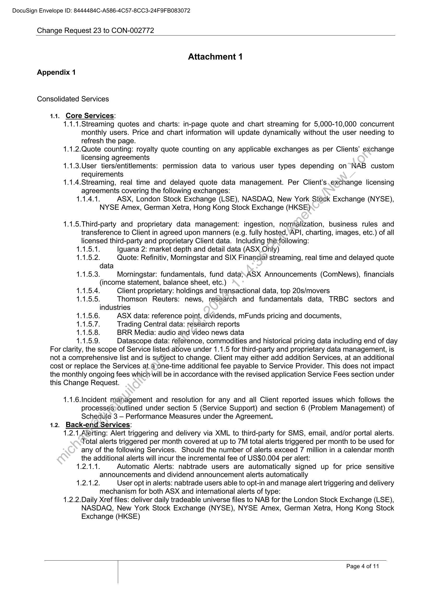
```  
```col-md
DocuSign Envelope ID: 8444484C-A586-4C57-8CC3-24F9FB083072  
Change Request 23 to CON-002772  
Attachment 1  
Appendix 1  
Consolidated Services  
1.1. Core Services:  
1.1.1.Streaming quotes and charts: in-page quote and chart streaming for 5,000-10,000 concurrent
monthly users. Price and chart information will update dynamically without the user needing to
refresh the page.  
1.1.2.Quote counting: royalty quote counting on any applicable exchanges as per Clients’ exchange
licensing agreements  
1.1.3.User tiers/entitlements: permission data to various user types depending on NAB custom
requirements  
1.1.4.Streaming, real time and delayed quote data management. Per Client’s exchange licensing
agreements covering the following exchanges:  
1.1.4.1. ASX, London Stock Exchange (LSE), NASDAQ, New York Stock Exchange (NYSE),
NYSE Amex, German Xetra, Hong Kong Stock Exchange (HKSE)  
1.1.5.Third-party and proprietary data management: ingestion, normalization, business rules and
transference to Client in agreed upon manners (e.g. fully hosted, API, charting, images, etc.) of all
licensed third-party and proprietary Client data. Including thésfollowing:  
1.1.5.1. Iguana 2: market depth and detail data (ASX Only)  
1.1.5.2. Quote: Refinitiv, Morningstar and SIX Financial! streaming, real time and delayed quote
data  
1.1.5.3. Morningstar: fundamentals, fund data\ASX Announcements (ComNews), financials
(income statement, balance sheet, etc.)  
1.1.5.4. Client proprietary: holdings and transactional data, top 20s/movers  
1.1.5.5. Thomson Reuters: news, research and fundamentals data, TRBC sectors and
industries  
1.1.5.6. ASX data: reference point, dividends, mFunds pricing and documents,  
1.1.5.7. Trading Central data: research reports  
1.1.5.8. BRR Media: audio aind video news data  
1.1.5.9. Datascope data: reference, commodities and historical pricing data including end of day
For clarity, the scope of Service listed-above under 1.1.5 for third-party and proprietary data management, is
not a comprehensive list and is subject to change. Client may either add addition Services, at an additional
cost or replace the Services at.ajone-time additional fee payable to Service Provider. This does not impact
the monthly ongoing fees which-will be in accordance with the revised application Service Fees section under
this Change Request.  
1.1.6.Incident management and resolution for any and all Client reported issues which follows the
processes) outlined under section 5 (Service Support) and section 6 (Problem Management) of
Schedule 3 — Performance Measures under the Agreement.  
1.2. Back-end Services:  
1.2.1,Alerting: Alert triggering and delivery via XML to third-party for SMS, email, and/or portal alerts.
Total alerts triggered per month covered at up to 7M total alerts triggered per month to be used for
any of the following Services. Should the number of alerts exceed 7 million in a calendar month
the additional alerts will incur the incremental fee of US$0.004 per alert:  
1.2.1.1. Automatic Alerts: nabtrade users are automatically signed up for price sensitive
announcements and dividend announcement alerts automatically
1.2.1.2. User opt in alerts: nabtrade users able to opt-in and manage alert triggering and delivery  
mechanism for both ASX and international alerts of type:
1.2.2.Daily Xref files: deliver daily tradeable universe files to NAB for the London Stock Exchange (LSE),
NASDAQ, New York Stock Exchange (NYSE), NYSE Amex, German Xetra, Hong Kong Stock
Exchange (HKSE)  
Page 4 of 11  
```
````
Notes:    
````col
```col-md
flexGrow=.5
===
> [!info] [Page 5](_attachments/images_NationalAusBank-3.6.1.12.1.100218210.pdf_210014/page_5.png)
> 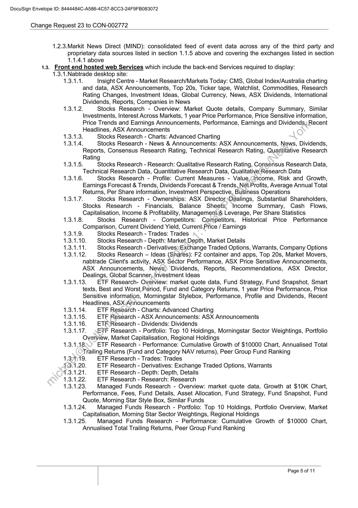
```  
```col-md
DocuSign Envelope ID: 8444484C-A586-4C57-8CC3-24F9FB083072  
Change Request 23 to CON-002772  
1.2.3.Markit News Direct (MIND): consolidated feed of event data across any of the third party and
proprietary data sources listed in section 1.1.5 above and covering the exchanges listed in section
1.1.4.1 above
1.3. Front end hosted web Services which include the back-end Services required to display:
1.3.1.Nabtrade desktop site:
1.3.1.1. Insight Centre - Market Research/Markets Today: CMS, Global Index/Australia charting
and data, ASX Announcements, Top 20s, Ticker tape, Watchlist, Commodities, Research
Rating Changes, Investment Ideas, Global Currency, News, ASX Dividends, International
Dividends, Reports, Companies in News
1.3.1.2. Stocks Research - Overview: Market Quote details, Company Summary, Similar
Investments, Interest Across Markets, 1 year Price Performance, Price Sensitive information,
Price Trends and Earnings Announcements, Performance, Earnings and Dividends, Recent
Headlines, ASX Announcements
3.1.3. Stocks Research - Charts: Advanced Charting
3.1.4. Stocks Research - News & Announcements: ASX Announcements, News, Dividends,
Reports, Consensus Research Rating, Technical Research Rating, Quantitative Research
Rating
1.3.1.5. Stocks Research - Research: Qualitative Research Rating, Conssnsus Research Data,
Technical Research Data, Quantitative Research Data, Qualitative Research Data
1.3.1.6. Stocks Research - Profile: Current Measures - Value,ancome, Risk and Growth,
Earnings Forecast & Trends, Dividends Forecast & Trends, Net.Profits, Average Annual Total
Returns, Per Share information, Investment Perspective, Business Operations
1.3.1.7. Stocks Research - Ownerships: ASX Director «Dealings, Substantial Shareholders,
Stocks Research - Financials, Balance Sheets; Income Summary, Cash Flows,
Capitalisation, Income & Profitability, Management Leverage, Per Share Statistics
1.3.1.8. Stocks Research - Competitors: Competitors, Historical Price Performance
Comparison, Current Dividend Yield, Current,Price / Earnings
Stocks Research - Trades: Trades
0 Stocks Research - Depth: Market Depth, Market Details
1. Stocks Research - Derivatives:Exchange Traded Options, Warrants, Company Options
2 Stocks Research — Ideas (Shares): F2 container and apps, Top 20s, Market Movers,
nabtrade Client's activity, ASX Sector Performance, ASX Price Sensitive Announcements,
ASX Announcements, News,) ‘Dividends, Reports, Recommendations, ASX _ Director,
Dealings, Global Scanner; Investment Ideas
1.3.1.13. ETF Research- Overview: market quote data, Fund Strategy, Fund Snapshot, Smart
texts, Best and Worst,Period, Fund and Category Returns, 1 year Price Performance, Price
Sensitive information, Morningstar Stylebox, Performance, Profile and Dividends, Recent
Headlines, ASX Announcements  
=e  
1.3.1.14. ETF Research - Charts: Advanced Charting  
1.3.1.15. ETF Research - ASX Announcements: ASX Announcements  
1.3.1.16. ETF Research - Dividends: Dividends  
1.3.1.17. EF Research - Portfolio: Top 10 Holdings, Morningstar Sector Weightings, Portfolio  
Overview, Market Capitalisation, Regional Holdings  
1.3.1.18, ETF Research - Performance: Cumulative Growth of $10000 Chart, Annualised Total
Trailing Returns (Fund and Category NAV returns), Peer Group Fund Ranking  
1.391519. ETF Research - Trades: Trades  
43.1.20. ETF Research - Derivatives: Exchange Traded Options, Warrants  
1.3.1.21. ETF Research - Depth: Depth, Details  
1.3.1.22. ETF Research - Research: Research  
1.3.1.23. Managed Funds Research - Overview: market quote data, Growth at $10K Chart,
Performance, Fees, Fund Details, Asset Allocation, Fund Strategy, Fund Snapshot, Fund
Quote, Morning Star Style Box, Similar Funds  
1.3.1.24. Managed Funds Research - Portfolio: Top 10 Holdings, Portfolio Overview, Market
Capitalisation, Morning Star Sector Weightings, Regional Holdings  
1.3.1.25. Managed Funds Research - Performance: Cumulative Growth of $10000 Chart,
Annualised Total Trailing Returns, Peer Group Fund Ranking  
Page 5 of 11  
```
````
Notes:    
````col
```col-md
flexGrow=.5
===
> [!info] [Page 6](_attachments/images_NationalAusBank-3.6.1.12.1.100218210.pdf_210014/page_6.png)
> 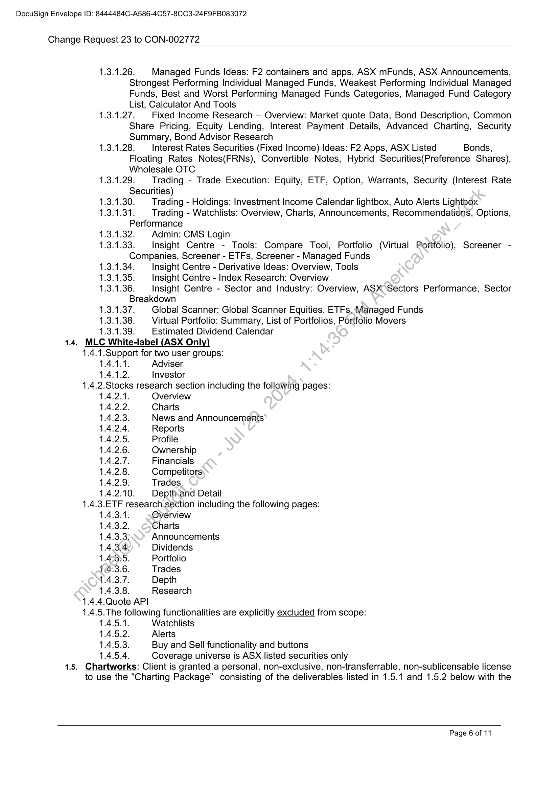
```  
```col-md
DocuSign Envelope ID: 8444484C-A586-4C57-8CC3-24F9FB083072  
Change Request 23 to CON-002772  
1.3.1.26. Managed Funds Ideas: F2 containers and apps, ASX mFunds, ASX Announcements,
Strongest Performing Individual Managed Funds, Weakest Performing Individual Managed
Funds, Best and Worst Performing Managed Funds Categories, Managed Fund Category
List, Calculator And Tools  
1.3.1.27. Fixed Income Research — Overview: Market quote Data, Bond Description, Common
Share Pricing, Equity Lending, Interest Payment Details, Advanced Charting, Security
Summary, Bond Advisor Research  
1.3.1.28. Interest Rates Securities (Fixed Income) Ideas: F2 Apps, ASX Listed Bonds,
Floating Rates Notes(FRNs), Convertible Notes, Hybrid Securities(Preference Shares),
Wholesale OTC  
1.3.1.29. | Trading - Trade Execution: Equity, ETF, Option, Warrants, Security (Interest Rate
Securities)  
1.3.1.30. Trading - Holdings: Investment Income Calendar lightbox, Auto Alerts Lightbox  
1.3.1.31. Trading - Watchlists: Overview, Charts, Announcements, Recommendations, Options,
Performance  
1.3.1.32. | Admin: CMS Login  
1.3.1.33. Insight Centre - Tools: Compare Tool, Portfolio (Virtual Portfolio), Screener Companies, Screener - ETFs, Screener - Managed Funds  
1.3.1.34. Insight Centre - Derivative Ideas: Overview, Tools  
1.3.1.35. Insight Centre - Index Research: Overview  
1.3.1.36. Insight Centre - Sector and Industry: Overview, ASX Sectors Performance, Sector
Breakdown  
1.3.1.37. Global Scanner: Global Scanner Equities, ETFs, Managed Funds
1.3.1.38. Virtual Portfolio: Summary, List of Portfolios, Portfolio Movers
1.3.1.39. Estimated Dividend Calendar  
. MLC White-label (ASX Only)  
1.4.1.Support for two user groups:  
1.4.1.1. Adviser
1.4.1.2. Investor  
1.4.2.Stocks research section including the follawing pages:  
1.4.2.1. Overview  
1.4.2.2. Charts  
1.4.2.3. News and Announcements
1.4.2.4. Reports  
1.4.2.5. Profile  
1.4.2.6. Ownership  
1.4.2.7. Financials  
1.4.2.8. Competitors  
1.4.2.9. Trades  
1.4.2.10. Depth.and Detail  
1.4.3.ETF research.section including the following pages:  
1.4.3.1. Overview
1.4.3.2. Charts  
1.4.3.3: Announcements
1.4.3.4; Dividends
1.46335. Portfolio  
14.3.6. Trades  
1.4.3.7. Depth  
1.4.3.8. Research  
1.4.4.Quote API
1.4.5.The following functionalities are explicitly excluded from scope:  
1.4.5.1. Watchlists  
1.4.5.2. Alerts  
1.4.5.3. Buy and Sell functionality and buttons  
1.4.5.4. Coverage universe is ASX listed securities only  
1.5. Chartworks: Client is granted a personal, non-exclusive, non-transferrable, non-sublicensable license
to use the “Charting Package” consisting of the deliverables listed in 1.5.1 and 1.5.2 below with the  
Page 6 of 11  
```
````
Notes:    
````col
```col-md
flexGrow=.5
===
> [!info] [Page 7](_attachments/images_NationalAusBank-3.6.1.12.1.100218210.pdf_210014/page_7.png)
> 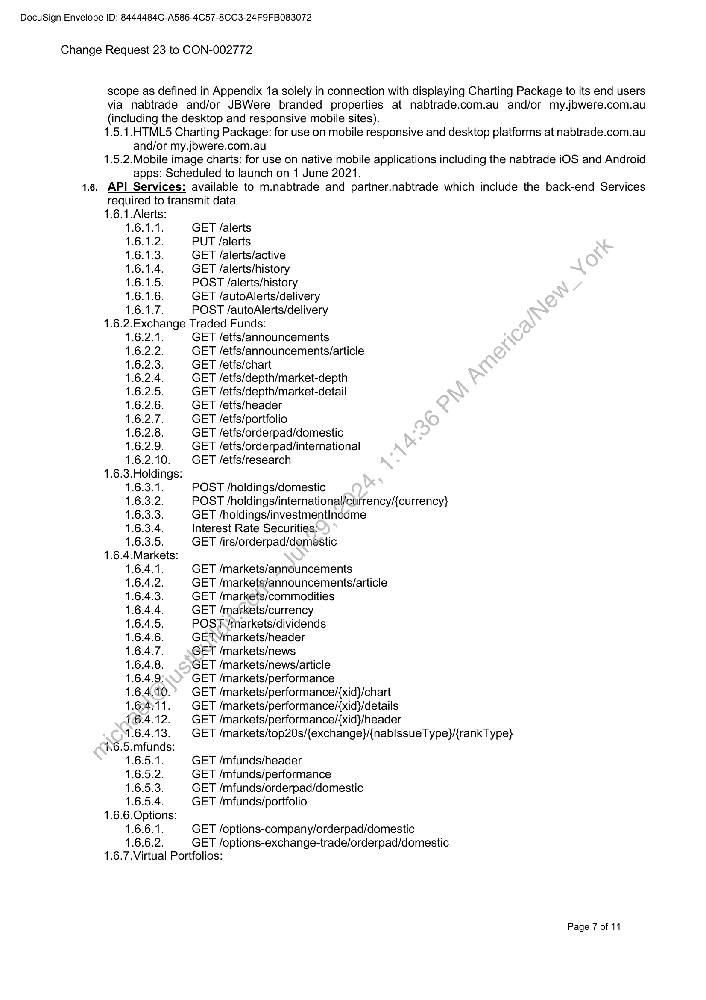
```  
```col-md
DocuSign Envelope ID: 8444484C-A586-4C57-8CC3-24F9FB083072  
Change Request 23 to CON-002772  
scope as defined in Appendix 1a solely in connection with displaying Charting Package to its end users
via nabtrade and/or JBWere branded properties at nabtrade.com.au and/or my.jbwere.com.au  
(including the desktop and responsive mobile sites).  
1.5.1.HTML5 Charting Package: for use on mobile responsive and desktop platforms at nabtrade.com.au  
and/or my.jowere.com.au  
1.5.2.Mobile image charts: for use on native mobile applications including the nabtrade iOS and Android  
apps: Scheduled to launch on 1 June 2021.  
1.6.7.Virtual Portfolios:  
. API Services: available to m.nabtrade and partner.nabtrade which include the back-end Services
required to transmit data
1.6.1.Alerts:
1.6.1.1. GET /alerts
1.6.1.2. PUT /alerts
1.6.1.3. GET /alerts/active
1.6.1.4. GET /alerts/history
1.6.1.5. POST /alerts/history
1.6.1.6. GET /autoAlerts/delivery
1.6.1.7. POST /autoAlerts/delivery
1.6.2.Exchange Traded Funds:
1.6.2.1. GET /etfs/announcements
1.6.2.2. GET /etfs/announcements/article
1.6.2.3. GET /etfs/chart
1.6.2.4. GET /etfs/depth/market-depth
1.6.2.5. GET /etfs/depth/market-detail
1.6.2.6. GET /etfs/header
1.6.2.7. GET /etfs/portfolio
1.6.2.8. GET /etfs/orderpad/domestic
1.6.2.9. GET /etfs/orderpad/international
1.6.2.10. GET /etfs/research
1.6.3.Holdings:
1.6.3.1. POST /holdings/domestic
1.6.3.2. POST /holdings/international/currency/{currency}
1.6.3.3. GET /holdings/investmentIncome
1.6.3.4. Interest Rate Securities:
1.6.3.5. GET /irs/orderpad/damestic
1.6.4.Markets:
1.6.4.1. GET /markets/announcements
1.6.4.2. GET /markets/announcements/article
1.6.4.3. GET /markets/commodities
1.6.4.4. GET /markets/currency
1.6.4.5. POST /markets/dividends
1.6.4.6. GET/markets/header
1.6.4.7. GET /markets/news
1.6.4.8. GET /markets/news/article
1.6.4.9: GET /markets/performance
1.64.10. GET /markets/performance/{xid}/chart
1.64111. GET /markets/performance/{xid}/details
6.4.12. GET /markets/performance/{xid}/header
1.6.4.13. GET /markets/top20s/{exchange}/{nablssueType}/{rankT ype}
4.6.5.mfunds:
1.6.5.1. GET /mfunds/header
1.6.5.2. GET /mfunds/performance
1.6.5.3. GET /mfunds/orderpad/domestic
1.6.5.4. GET /mfunds/portfolio
1.6.6.Options:
1.6.6.1. GET /options-company/orderpad/domestic
1.6.6.2. GET /options-exchange-trade/orderpad/domestic  
Page 7 of 11  
```
````
Notes:    
````col
```col-md
flexGrow=.5
===
> [!info] [Page 8](_attachments/images_NationalAusBank-3.6.1.12.1.100218210.pdf_210014/page_8.png)
> 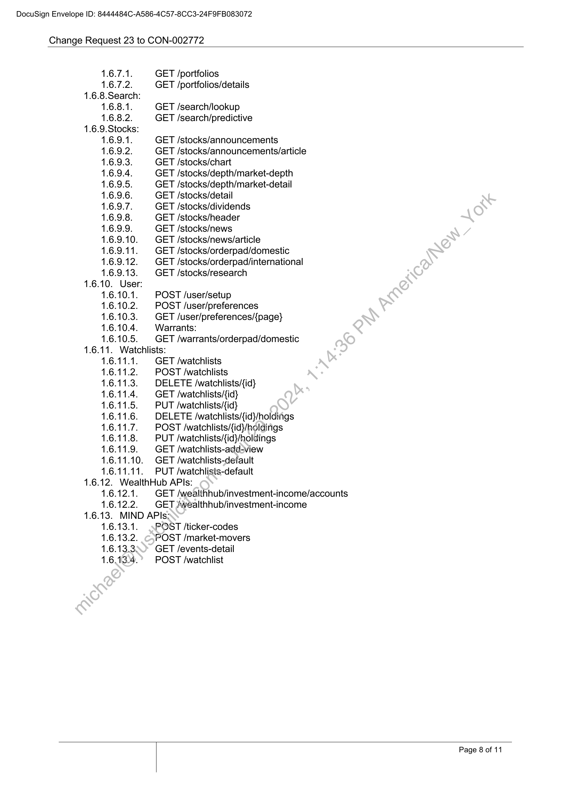
```  
```col-md
DocuSign Envelope ID: 8444484C-A586-4C57-8CC3-24F9FB083072  
Change Request 23 to CON-002772  
1.6.7.1. GET /portfolios  
1.6.7.2. GET /portfolios/details
1.6.8.Search:  
1.6.8.1. GET /search/lookup  
1.6.8.2. GET /search/predictive
1.6.9.Stocks:  
1.6.9.1. GET /stocks/announcements  
1.6.9.2. GET /stocks/announcements/article  
1.6.9.3. GET /stocks/chart  
1.6.9.4. GET /stocks/depth/market-depth  
1.6.9.5. GET /stocks/depth/market-detail  
1.6.9.6. GET /stocks/detail  
1.6.9.7. GET /stocks/dividends  
1.6.9.8. GET /stocks/header  
1.6.9.9. GET /stocks/news  
1.6.9.10. GET /stocks/news/article  
1.6.9.11. GET /stocks/orderpad/domestic  
1.6.9.12. GET /stocks/orderpad/international  
1.6.9.13. GET /stocks/research
1.6.10. User:  
1.6.10.1. POST /user/setup  
1.6.10.2. POST /user/preferences  
1.6.10.3. GET /user/preferences/{page}  
1.6.10.4. Warrants:  
1.6.10.5. GET /warrants/orderpad/domestic
1.6.11. Watchlists:  
1.6.11.1. GET /watchlists  
1.6.11.2. POST /watchlists  
1.6.11.3. DELETE /watchlists/{id}  
1.6.11.4. | GET /watchlists/{id}  
1.6.11.5. PUT /watchlists/{id}  
1.6.11.6. DELETE /watchlists/{id}/holdings  
1.6.11.7. POST /watchlists/{id}/holdings  
1.6.11.8. PUT /watchlists/{id}/holdings  
1.6.11.9. GET /watchlists-add-view  
1.6.11.10. GET /watchlists-default  
1.6.11.11. PUT /watchlists-default
1.6.12. WealthHub APIs:  
1.6.12.1. GET /wealthhub/investment-income/accounts  
1.6.12.2. GET /wealthhub/investment-income
1.6.13. MIND APIs:  
1.6.13.1. POST /ticker-codes  
1.6.13.2. POST /market-movers  
1.6.13.3, GET /events-detail  
1.6.134. POST /watchlist  
Page 8 of 11  
```
````
Notes:    
````col
```col-md
flexGrow=.5
===
> [!info] [Page 9](_attachments/images_NationalAusBank-3.6.1.12.1.100218210.pdf_210014/page_9.png)
> 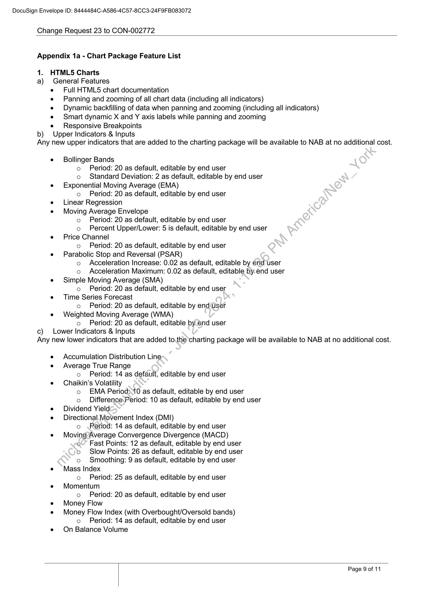
```  
```col-md
DocuSign Envelope ID: 8444484C-A586-4C57-8CC3-24F9FB083072  
Change Request 23 to CON-002772  
Appendix 1a - Chart Package Feature List  
1. HTML5 Charts
a) General Features  
b)  
Full HTML5 chart documentation  
Panning and zooming of all chart data (including all indicators)  
Dynamic backfilling of data when panning and zooming (including all indicators)
Smart dynamic X and Y axis labels while panning and zooming  
Responsive Breakpoints  
Upper Indicators & Inputs  
Any new upper indicators that are added to the charting package will be available to NAB at no additional cost.  
c)  
Bollinger Bands
o Period: 20 as default, editable by end user
o Standard Deviation: 2 as default, editable by end user
Exponential Moving Average (EMA)
o Period: 20 as default, editable by end user
Linear Regression
Moving Average Envelope
o Period: 20 as default, editable by end user
o Percent Upper/Lower: 5 is default, editable by end user
Price Channel
o Period: 20 as default, editable by end user
Parabolic Stop and Reversal (PSAR)
o Acceleration Increase: 0.02 as default, editable by end user
o Acceleration Maximum: 0.02 as default, editable by.end user
Simple Moving Average (SMA)
o Period: 20 as default, editable by end user
Time Series Forecast
o Period: 20 as default, editable by end ‘user
Weighted Moving Average (WMA)
o Period: 20 as default, editable by.end user  
Lower Indicators & Inputs  
Any new lower indicators that are added to.the charting package will be available to NAB at no additional cost.  
Accumulation Distribution Line
Average True Range
o Period: 14 as default, editable by end user
Chaikin’s Volatility
o EMA Periods10 as default, editable by end user
o Difference,Period: 10 as default, editable by end user
Dividend Yield
Directional. Movement Index (DMI)
o Period: 14 as default, editable by end user
Moving Average Convergence Divergence (MACD)
© Fast Points: 12 as default, editable by end user
o Slow Points: 26 as default, editable by end user
o Smoothing: 9 as default, editable by end user
Mass Index
o Period: 25 as default, editable by end user
Momentum
o Period: 20 as default, editable by end user
Money Flow
Money Flow Index (with Overbought/Oversold bands)
o Period: 14 as default, editable by end user
On Balance Volume  
Page 9 of 11  
```
````
Notes:    
````col
```col-md
flexGrow=.5
===
> [!info] [Page 10](_attachments/images_NationalAusBank-3.6.1.12.1.100218210.pdf_210014/page_10.png)
> 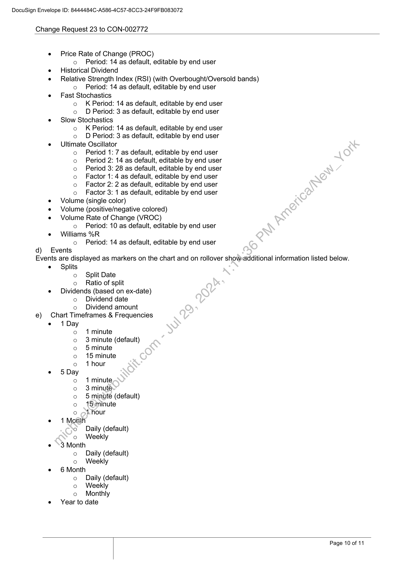
```  
```col-md
DocuSign Envelope ID: 8444484C-A586-4C57-8CC3-24F9FB083072  
Change Request 23 to CON-002772  
qd)  
Price Rate of Change (PROC)  
o Period: 14 as default, editable by end user
Historical Dividend
Relative Strength Index (RSI) (with Overbought/Oversold bands)  
o Period: 14 as default, editable by end user
Fast Stochastics  
o K Period: 14 as default, editable by end user  
o D Period: 3 as default, editable by end user
Slow Stochastics  
o K Period: 14 as default, editable by end user  
o D Period: 3 as default, editable by end user
Ultimate Oscillator  
o Period 1: 7 as default, editable by end user
Period 2: 14 as default, editable by end user
Period 3: 28 as default, editable by end user
Factor 1: 4 as default, editable by end user
Factor 2: 2 as default, editable by end user
Factor 3: 1 as default, editable by end user
Volume (single color)
Volume (positive/negative colored)
Volume Rate of Change (VROC)  
o Period: 10 as default, editable by end user
Williams %R  
o Period: 14 as default, editable by end user  
oOo000  
Events  
Events are displayed as markers on the chart and on rollover show:additional information listed below.
Splits
o Split Date  
e)  
o Ratio of split
Dividends (based on ex-date)  
o Dividend date  
o Dividend amount  
Chart Timeframes & Frequencies  
1 Day
o 1minute
o 3minute (default)
o 5minute
o 15 minute
o 1hour
5 Day
o 1minute
o 3minute
o 5 minute (default)
o  15\minute
o hour
1 Month
© Daily (default)
o Weekly
3 Month
o Daily (default)
o Weekly
6 Month
o Daily (default)
o Weekly
o Monthly  
Year to date  
Page 10 of 11  
```
````
Notes:    
````col
```col-md
flexGrow=.5
===
> [!info] [Page 11](_attachments/images_NationalAusBank-3.6.1.12.1.100218210.pdf_210014/page_11.png)
> 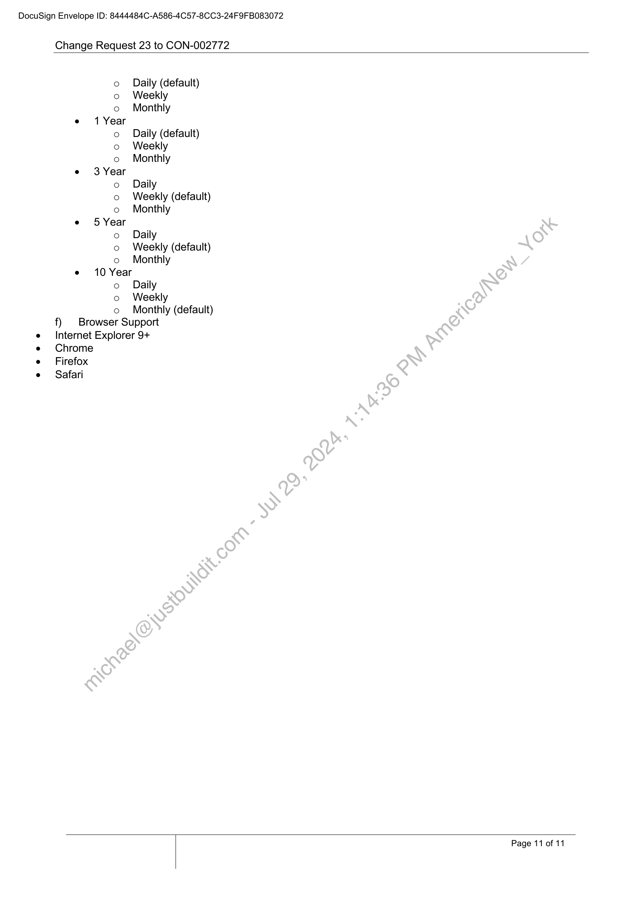
```  
```col-md
DocuSign Envelope ID: 8444484C-A586-4C57-8CC3-24F9FB083072  
Change Request 23 to CON-002772  
o Daily (default)  
o Weekly
o Monthly
e 1 Year
o Daily (default)
o Weekly
o Monthly
e 3 Year
o Daily
o Weekly (default)
o Monthly
e 5 Year
o Daily
o Weekly (default)
o Monthly
e 10 Year
o Daily
o Weekly  
o Monthly (default)
f) | Browser Support
Internet Explorer 9+
Chrome
Firefox
Safari  
Page 11 of 11  
```
````
Notes:  


![[_attachments/NationalAusBank-3.6.1.12.1.1 00218210.pdf]