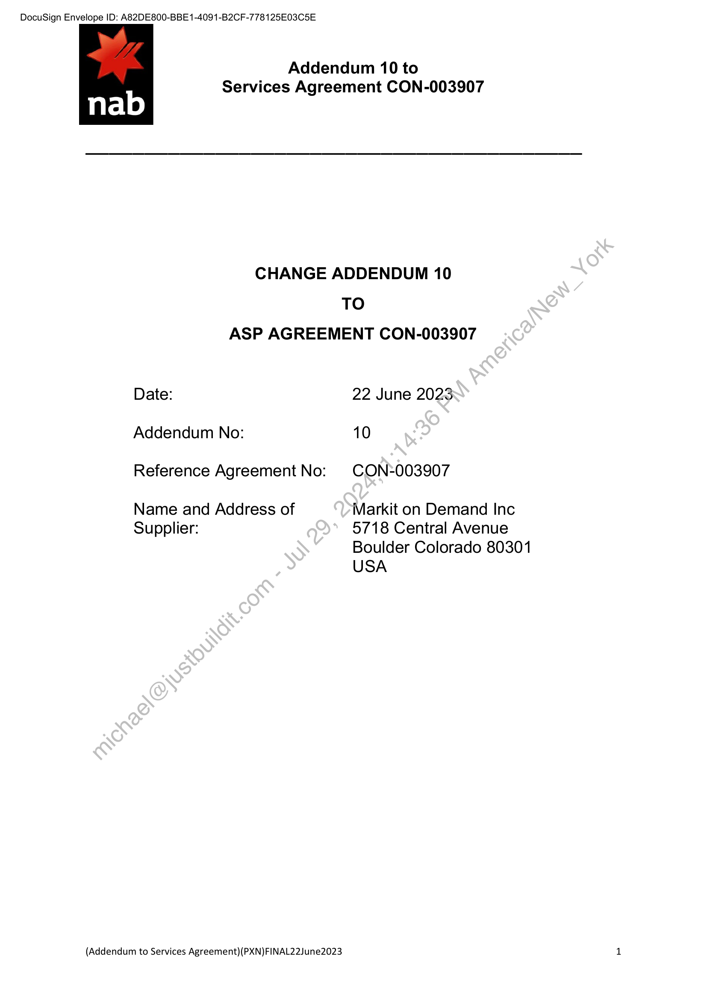
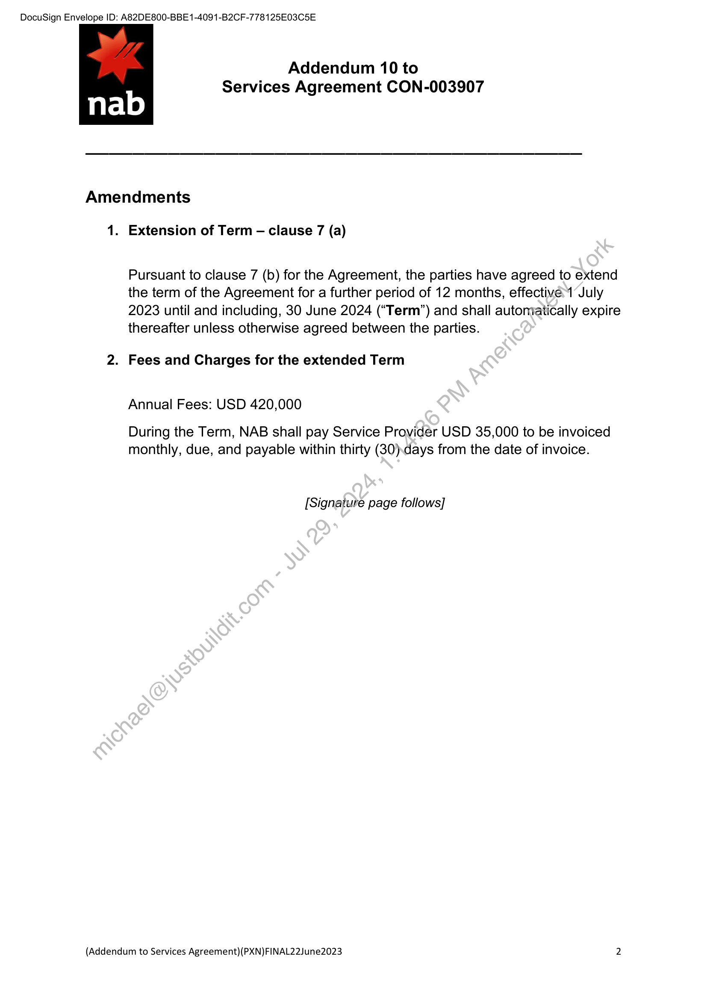
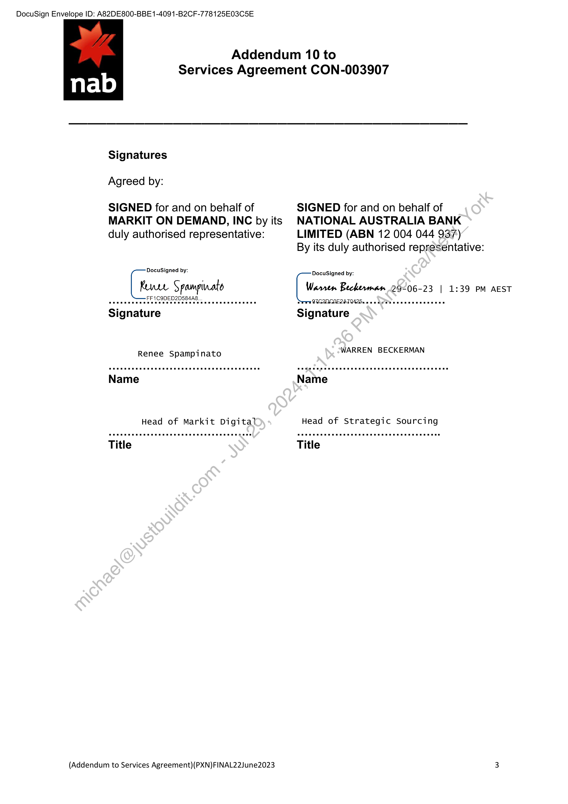

##### Addendum 10 to Services Agreement CON-003907]

  
````col
```col-md
flexGrow=.5
===
> [!info] [Page 1](_attachments/images_NationalAusBank-3.6.1.12.1.200157190.pdf_205911/page_1.png)
> 
```  
```col-md
DocuSign Envelope ID: A82DE800-BBE1-4091-B2CF-778125E03C5E  
Addendum 10 to
Services Agreement CON-003907  
CHANGE ADDENDUM 10
TO
ASP AGREEMENT CON-003907  
Date: 22 June 2023
Addendum No: 10  
Reference Agreement No: CON-003907  
Name and Address of Markit on Demand Inc  
Supplier: 5718 Central Avenue
Boulder Colorado 80301
USA  
(Addendum to Services Agreement)(PXN)FINAL22June2023  
```
````
Notes:    
````col
```col-md
flexGrow=.5
===
> [!info] [Page 2](_attachments/images_NationalAusBank-3.6.1.12.1.200157190.pdf_205911/page_2.png)
> 
```  
```col-md
DocuSign Envelope ID: A82DE800-BBE1-4091-B2CF-778125E03C5E  
Addendum 10 to
Services Agreement CON-003907  
Amendments  
1. Extension of Term — clause 7 (a)  
Pursuant to clause 7 (b) for the Agreement, the parties have agreed to extend
the term of the Agreement for a further period of 12 months, effective 1 July
2023 until and including, 30 June 2024 (“Term”) and shall automatically expire
thereafter unless otherwise agreed between the parties.  
2. Fees and Charges for the extended Term  
Annual Fees: USD 420,000  
During the Term, NAB shall pay Service Provider USD 35,000 to be invoiced
monthly, due, and payable within thirty (30).days from the date of invoice.  
[Signature page follows]  
(Addendum to Services Agreement)(PXN)FINAL22June2023  
```
````
Notes:    
````col
```col-md
flexGrow=.5
===
> [!info] [Page 3](_attachments/images_NationalAusBank-3.6.1.12.1.200157190.pdf_205911/page_3.png)
> 
```  
```col-md
DocuSign Envelope ID: A82DE800-BBE1-4091-B2CF-778125E03C5E  
Addendum 10 to
Services Agreement CON-003907  
Signatures  
Agreed by:  
SIGNED for and on behalf of SIGNED for and on behalf of
MARKIT ON DEMAND, INC by its NATIONAL AUSTRALIA BANK
duly authorised representative: LIMITED (ABN 12 004 044 937)  
By its duly authorised representative:  
DocuSigned by:  
DocuSigned by:
Renee Spampivato Cc Beckerman 29-06-23 | 1:39 PM AEST  
seeeeeeees Heer et a a aeeeeeeenaees Serr QZG2NCOE2AT025 ea na pee eeeeeeeeeeees  
Signature Signature  
Renee Spampinato WARREN BECKERMAN  
Name Name
Head of Markit Digital Head of Strategic Sourcing
Title Title  
(Addendum to Services Agreement)(PXN)FINAL22June2023 3  
```
````
Notes:  


![[_attachments/NationalAusBank-3.6.1.12.1.2 00157190.pdf]