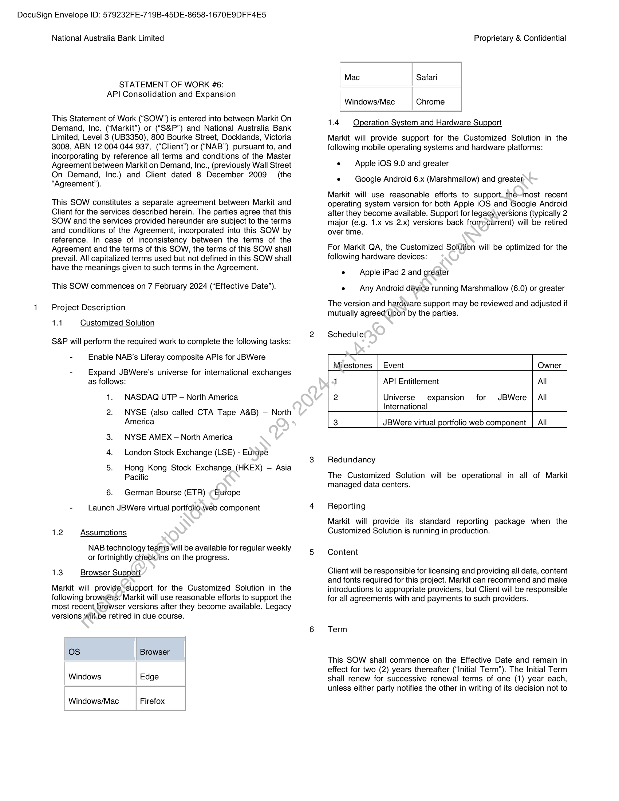
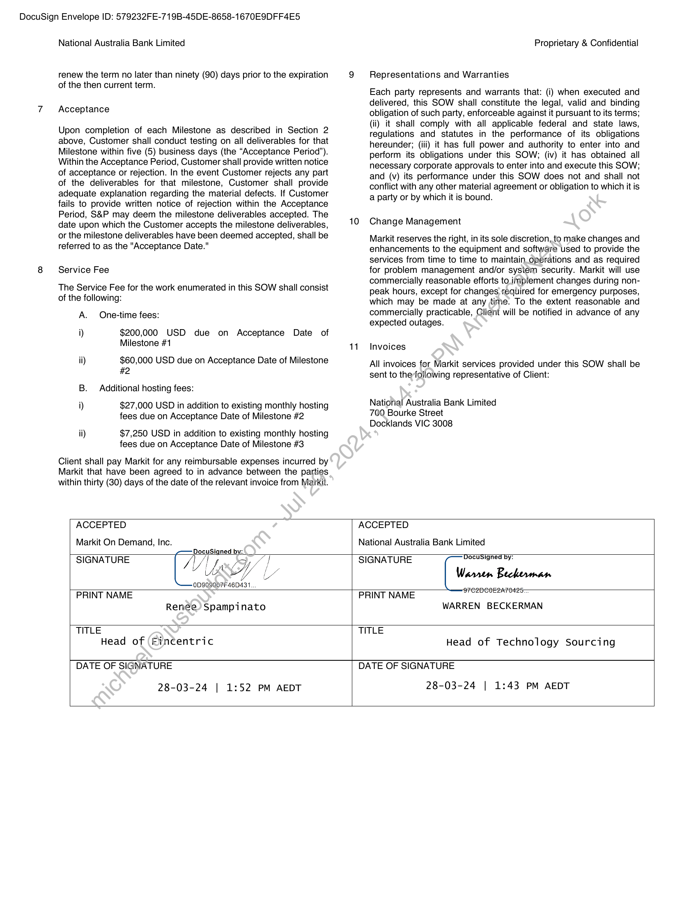
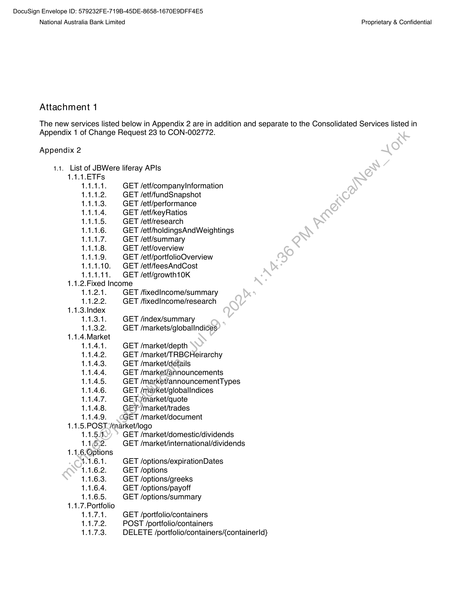
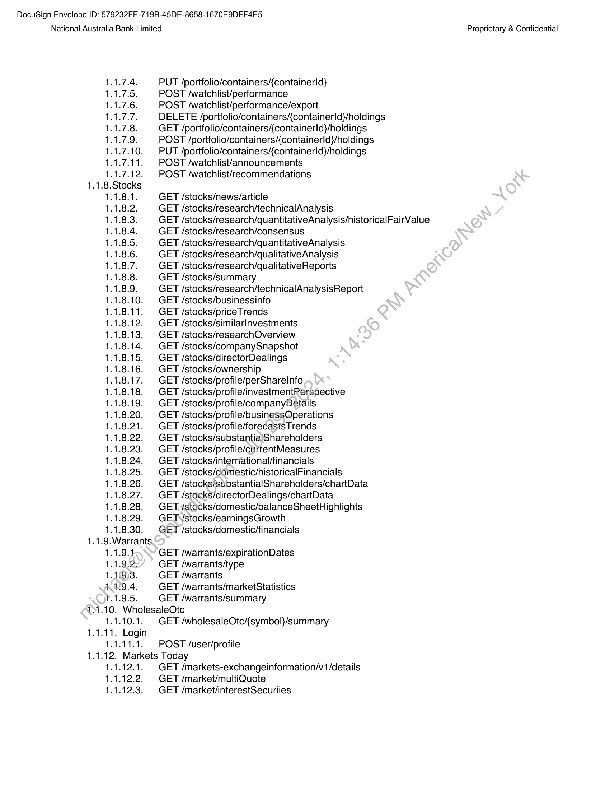
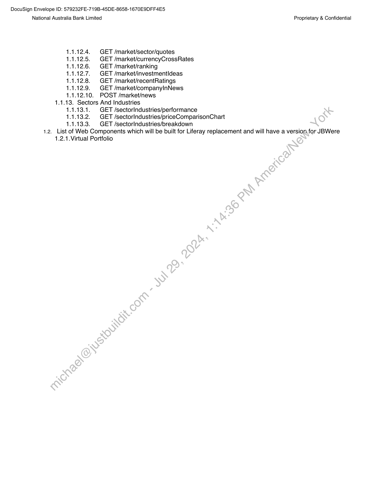
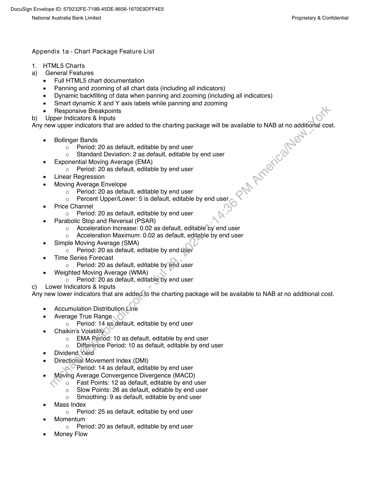
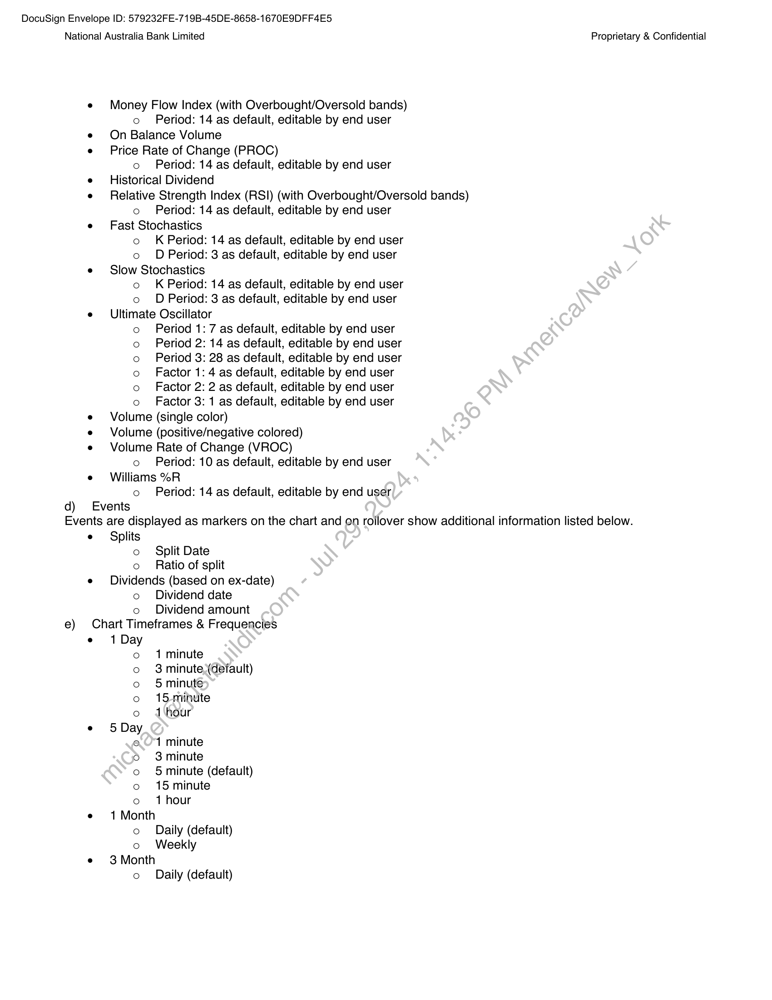
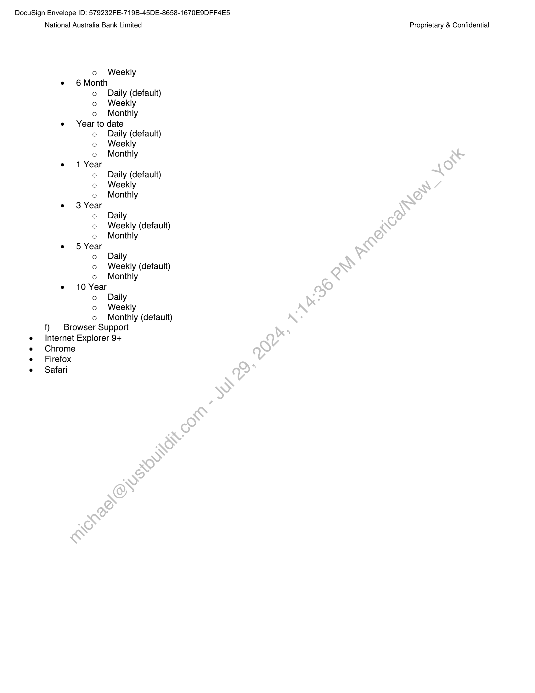

##### Statement of Work #6: API Consolidation and Expansion]

  
````col
```col-md
flexGrow=.5
===
> [!info] [Page 1](_attachments/images_NationalAusBank-3.6.1.12.1.300160066.pdf_210020/page_1.png)
> 
```  
```col-md
DocuSign Envelope ID: 579232FE-719B-45DE-8658-1670E9DFF4E5  
National Australia Bank Limited  
STATEMENT OF WORK #6:
API Consolidation and Expansion  
This Statement of Work (“SOW”) is entered into between Markit On
Demand, Inc. (“Markit”) or (“S&P”) and National Australia Bank
Limited, Level 3 (UB3350), 800 Bourke Street, Docklands, Victoria
3008, ABN 12 004 044 937, (“Client”) or (“NAB”) pursuant to, and
incorporating by reference all terms and conditions of the Master
Agreement between Markit on Demand, Inc., (previously Wall Street
On Demand, Inc.) and Client dated 8 December 2009 (the
“Agreement’).  
This SOW constitutes a separate agreement between Markit and
Client for the services described herein. The parties agree that this
SOW and the services provided hereunder are subject to the terms
and conditions of the Agreement, incorporated into this SOW by
reference. In case of inconsistency between the terms of the
Agreement and the terms of this SOW, the terms of this SOW shall
prevail. All capitalized terms used but not defined in this SOW shall
have the meanings given to such terms in the Agreement.  
This SOW commences on 7 February 2024 (“Effective Date”).  
Project Description  
14 Customized Solution  
S&P will perform the required work to complete the following tasks:
- Enable NAB’s Liferay composite APIs for JBWere  
- Expand JBWere’s universe for international exchanges
as follows:  
1. NASDAQ UTP — North America  
2. NYSE (also called CTA Tape A&B) — North
America  
3. NYSE AMEX — North America
4. London Stock Exchange (LSE) - Europe  
5. Hong Kong Stock Exchange (HKEX) — Asia
Pacific  
6. German Bourse (ETR) ~Europe  
- Launch JBWere virtual portfolio web component  
1.2 Assumptions  
NAB technology teams will be available for regular weekly
or fortnightly check ins on the progress.  
1.3 Browser Support  
Markit will provide “support for the Customized Solution in the
following browsers: Markit will use reasonable efforts to support the
most recent browser versions after they become available. Legacy
versions willbe retired in due course.  
os Browser  
Windows Edge  
Windows/Mac Firefox  
Proprietary & Confidential  
Mac Safari  
Windows/Mac Chrome  
1.4 Operation System and Hardware Support  
Markit will provide support for the Customized Solution in the
following mobile operating systems and hardware platforms:  
« Apple iOS 9.0 and greater
e — Google Android 6.x (Marshmallow) and greater,  
Markit will use reasonable efforts to support.the~most recent
operating system version for both Apple iOS and Google Android
after they become available. Support for legacyversions (typically 2
major (e.g. 1.x vs 2.x) versions back from»current) will be retired
over time.  
For Markit QA, the Customized Solution will be optimized for the
following hardware devices:  
e — Apple iPad 2 and greater
e — Any Android device running Marshmallow (6.0) or greater  
The version and hardware support may be reviewed and adjusted if
mutually agreed upon by the parties.  
Schedule
Milestones | Event Owner
1 API Entitlement All
2 Universe expansion for JBWere | All
International
3 JBWere virtual portfolio web component | All
Redundancy  
The Customized Solution will be operational in all of Markit
managed data centers.  
Reporting  
Markit will provide its standard reporting package when the
Customized Solution is running in production.  
Content  
Client will be responsible for licensing and providing all data, content
and fonts required for this project. Markit can recommend and make
introductions to appropriate providers, but Client will be responsible
for all agreements with and payments to such providers.  
Term  
This SOW shall commence on the Effective Date and remain in
effect for two (2) years thereafter (“Initial Term”). The Initial Term
shall renew for successive renewal terms of one (1) year each,
unless either party notifies the other in writing of its decision not to  
```
````
Notes:    
````col
```col-md
flexGrow=.5
===
> [!info] [Page 2](_attachments/images_NationalAusBank-3.6.1.12.1.300160066.pdf_210020/page_2.png)
> 
```  
```col-md
DocuSign Envelope ID: 579232FE-719B-45DE-8658-1670E9DFF4E5  
National Australia Bank Limited  
Proprietary & Confidential  
renew the term no later than ninety (90) days prior to the expiration 9 Representations and Warranties
of the then current term. .
Each party represents and warrants that: (i) when executed and
delivered, this SOW shall constitute the legal, valid and binding
Acceptance obligation of such party, enforceable against it pursuant to its terms;. , . : (ii) it shall comply with all applicable federal and state laws,
Upon completion of each Milestone as described in Section 2 regulations and statutes in the performance of its obligations
above, Customer shall conduct testing on all deliverables for that hereunder; (iii) it has full power and authority to enter into and
Milestone within five (5) business days (the “Acceptance Period”). perform its obligations under this SOW; (iv) it has obtained all
Within the Acceptance Period, Customer shall provide written notice necessary corporate approvals to enter into and execute this SOW;
of acceptance or rejection. In the event Customer rejects any part and (v) its performance under this SOW does not and shall not
of the deliverables for that milestone, Customer shall provide conflict with any other material agreement or obligation to which it is
adequate explanation regarding the material defects. If Customer a party or by which it is bound
fails to provide written notice of rejection within the Acceptance .
Period, S&P may deem the milestone deliverables accepted. The
date upon which the Customer accepts the milestone deliverables, 10 Change Management
or the milestone deliverables have been deemed accepted, shall be Markit reserves the right, in its sole discretion, to make changes and
referred to as the "Acceptance Date. enhancements to the equipment and software used to provide the
services from time to time to maintain_opérations and as required
Service Fee for problem management and/or system security. Markit will use. . . commercially reasonable efforts to implement changes during nonThe Service Fee for the work enumerated in this SOW shall consist peak hours, except for changes required for emergency purposes.
of the following: which may be made at any time. To the extent reasonable and
A. One-time fees: commercially practicable, Client will be notified in advance of any
expected outages.
i) $200,000 USD due on Acceptance Date of
Milestone #1 41. Invoices
ii) $60,000 USD due on Acceptance Date of Milestone All invoices for Markit services provided under this SOW shall be
#2 sent to thefollowing representative of Client:
B. Additional hosting fees:
i) $27,000 USD in addition to existing monthly hosting National Australia Bank Limited
fees due on Acceptance Date of Milestone #2 700 Bourke Street
Docklands VIC 3008
ii) $7,250 USD in addition to existing monthly hosting
fees due on Acceptance Date of Milestone #3
Client shall pay Markit for any reimbursable expenses incurred by
Markit that have been agreed to in advance between the parties
within thirty (30) days of the date of the relevant invoice from Markit.
ACCEPTED ACCEPTED  
Markit On Demand, Inc.  
National Australia Bank Limited  
Head of (Fincentric  
Wy ned bys 7 Docusigned by:
SIGNATURE /f yi ys, / | SIGNATURE .
VILA IL
v Wes wy ea Warren Beckerman
ODSQ9007F46D431  
PRINT NAME PRINT NAME eeeceee«»  
Renae) Spampinato WARREN BECKERMAN
TITLE TITLE  
Head of Technology Sourcing  
DATE OF SIGNATURE  
28-03-24 | 1:52 PM AEDT  
DATE OF SIGNATURE  
28-03-24 | 1:43 PM AEDT  
```
````
Notes:    
````col
```col-md
flexGrow=.5
===
> [!info] [Page 3](_attachments/images_NationalAusBank-3.6.1.12.1.300160066.pdf_210020/page_3.png)
> 
```  
```col-md
DocuSign Envelope ID: 579232FE-719B-45DE-8658-1670E9DFF4E5
National Australia Bank Limited  
Attachment 1  
Proprietary & Confidential  
The new services listed below in Appendix 2 are in addition and separate to the Consolidated Services listed in
Appendix 1 of Change Request 23 to CON-002772.  
Appendix 2  
14.  
1.  
1.  
1.  
1.  
1.  
1.  
ua  
u  
1.  
1.  
1.  
1.  
List of JBWere liferay APIs
1.1.1.ETFs
1.1.1.1. GET /etf/companylInformation
1.1.1.2. GET /etf/fundSnapshot
1.1.1.3. GET /etf/performance
1.1.1.4. GET /etf/keyRatios
1.1.1.5. GET /etf/research
1.1.1.6. GET /etf/holdingsAndWeightings
1.1.1.7. GET /etf/summary
1.1.1.8. GET /etf/overview
1.1.1.9. GET /etf/portfolioOverview
1.1.1.10. GET /etf/feesAndCost
1.1.1.11. | GET /etf/growth10K
2.Fixed Income
1.1.2.1. GET /fixediIncome/summary
1.1.2.2. GET /fixedincome/research
3.Index
1.1.3.1. GET /index/summary
1.1.3.2. GET /markets/globallndices
4.Market
1.1.4.1. GET /market/depth
1.1.4.2. GET /market/TRBCHeirarchy
1.1.4.3. GET /market/details
1.1.4.4. GET /market/announcements
1.1.4.5. GET /market/announcementTypes
1.1.4.6. GET /market/globallndices
1.1.4.7. GET./market/quote
1.1.4.8. GET /market/trades
1.1.4.9. GET /market/document
5.POST_/market/logo
1.1.5.0 GET /market/domestic/dividends
1.16.2. GET /market/international/dividends6.Options
4.1.6.1. GET /options/expirationDates
1.1.6.2. GET /options
1.1.6.3. GET /options/greeks
1.1.6.4. GET /options/payoff
1.1.6.5. GET /options/summary7.Portfolio
1.1.7.1. GET /portfolio/containers
1.1.7.2. POST /portfolio/containers
1.1.7.3. DELETE /portfolio/containers{containerld}  
```
````
Notes:    
````col
```col-md
flexGrow=.5
===
> [!info] [Page 4](_attachments/images_NationalAusBank-3.6.1.12.1.300160066.pdf_210020/page_4.png)
> 
```  
```col-md
DocuSign Envelope ID: 579232FE-719B-45DE-8658-1670E9DFF4E5
National Australia Bank Limited Proprietary & Confidential  
PUT /portfolio/containers{containerld}  
POST /watchlist/performance  
POST /watchlist/performance/export  
DELETE /portfolio/containers{containerld}/holdings
GET /portfolio/containerscontainerld}/holdings
POST /portfolio/containers{containerld}/holdings
PUT /portfolio/containers{containerld}/holdings
POST /watchlist/announcements  
POST /watchlist/recommendations  
SOEMNOAR  
o  
uo
pa  
1.1.8.  
@SNNNNNNNNN
a
on  
u  
1.  
1.  
1.  
1.  
1.  
1.  
1.  
1.  
1.  
8  
1 GET /stocks/news/article  
1 GET /stocks/research/technicalAnalysis  
1 GET /stocks/research/quantitativeAnalysis/historicalFairValue
1 GET /stocks/research/consensus  
1 GET /stocks/research/quantitativeAnalysis  
1 GET /stocks/research/qualitativeAnalysis  
1 GET /stocks/research/qualitativeReports  
1 GET /stocks/summary  
1 . GET /stocks/research/technicalAnalysisReport
1.1.8.10. | GET /stocks/businessinfo  
1.1.8.11. | GET /stocks/priceTrends  
1.1.8.12. | GET /stocks/similarlnvestments  
1.1.8.13. | GET /stocks/researchOverview  
1.1.8.14. | GET /stocks/companySnapshot
1.
1.
1.
1.
1.
1.
1.
1.
1.
1.
1.
1.
1.
1.
1.
1.
9.
1.
1.
1.
AN
T.  
SIP Papa na ura ra ra a, a
92 G9 Co CO G0 GO CO
OPNOAPRWON  
a
o
©  
1.8.15. | GET /stocks/directorDealings
1.8.16. | GET /stocks/ownership
1.8.17. | GET /stocks/profile/perSharelnfo
1.8.18. | GET /stocks/profile/investmentRerspective
1.8.19. | GET /stocks/profile/companyDetails
1.8.20. | GET /stocks/profile/ousinessOQperations
1.8.21. | GET /stocks/profile/forecastsTrends
1.8.22. GET /stocks/substantialShareholders
1.8.23. | GET /stocks/profile/currentMeasures
1.8.24. | GET /stocks/international/financials
1.8.25. | GET /stocks/domestic/historicalFinancials
1.8.26. GET /stocks/substantialShareholders/chartData
1.8.27. GET /stocks/directorDealings/chartData
1.8.28. | GET./stocks/domestic/balanceSheetHighlights
1.8.29. | GETvYstocks/earningsGrowth
1.8.30. GET /stocks/domestic/financials
Warrants.
1.9.4. GET /warrants/expirationDates
9.2: GET /warrants/type
G3. GET /warrants
9.4. GET /warrants/marketStatistics
9.5. GET /warrants/summary
121.10. WholesaleOtc
1.1.10.1. GET /wholesaleOtc{symbol}/summary
1.1.11. Login
1.1.11.1. | POST /user/profile
1.1.12. Markets Today
1.1.12.1.  
 GET /markets-exchangeinformation/v1/details
1.1.12.2. GET /market/multiQuote
1.1.12.3. | GET /market/interestSecuriies  
1.1.  
u  
uuu  
```
````
Notes:    
````col
```col-md
flexGrow=.5
===
> [!info] [Page 5](_attachments/images_NationalAusBank-3.6.1.12.1.300160066.pdf_210020/page_5.png)
> 
```  
```col-md
DocuSign Envelope ID: 579232FE-719B-45DE-8658-1670E9DFF4E5  
National Australia Bank Limited Proprietary & Confidential  
.12.4.  
 GET /market/sector/quotes  
12.5. GET /market/currencyCrossRates
12.6. GET /market/ranking  
12.7. GET /market/investmentideas
12.8. GET /market/recentRatings  
12.9. GET /market/companyInNews12.10. POST /market/news  
pee ee ee ce er ee
aren ee nen nee ne ee  
1.1.13. Sectors And Industries
1.1.13.1. GET /sectorIndustries/performance
1.1.13.2. GET /sectorlndustries/priceComparisonChart
1.1.13.3. | GET /sectorIndustries/breakdown  
1.2. List of Web Components which will be built for Liferay replacement and will have a version for JBWere
1.2.1.Virtual Portfolio  
```
````
Notes:    
````col
```col-md
flexGrow=.5
===
> [!info] [Page 6](_attachments/images_NationalAusBank-3.6.1.12.1.300160066.pdf_210020/page_6.png)
> 
```  
```col-md
DocuSign Envelope ID: 579232FE-719B-45DE-8658-1670E9DFF4E5
National Australia Bank Limited  
Appendix 1a - Chart Package Feature List  
1. HTML5 Charts  
a) General Features  
Full HTML5 chart documentation  
Panning and zooming of all chart data (including all indicators)  
Dynamic backfilling of data when panning and zooming (including all indicators)
Smart dynamic X and Y axis labels while panning and zooming  
Responsive Breakpoints  
b) Upper Indicators & Inputs  
Proprietary & Confidential  
Any new upper indicators that are added to the charting package will be available to NAB at no additional cost.  
e Bollinger Bands
o Period: 20 as default, editable by end user
o Standard Deviation: 2 as default, editable by end user
e Exponential Moving Average (EMA)
o Period: 20 as default, editable by end user
e Linear Regression
e Moving Average Envelope
o Period: 20 as default, editable by end user
o Percent Upper/Lower: 5 is default, editable by end user
e Price Channel
o Period: 20 as default, editable by end user
e Parabolic Stop and Reversal (PSAR)
o Acceleration Increase: 0.02 as default, editable by end user
o Acceleration Maximum: 0.02 as default, editable by end user
e Simple Moving Average (SMA)
o Period: 20 as default, editable by end User
e Time Series Forecast
o Period: 20 as default, editable by end user
e Weighted Moving Average (WMA)
o Period: 20 as default, editable by end user
c) Lower Indicators & Inputs  
Any new lower indicators that are added.to the charting package will be available to NAB at no additional cost.  
e Accumulation Distribution Line
e Average True Range
o Period: 14 as,default, editable by end user
e = Chaikin’s Volatility
o EMA Period: 10 as default, editable by end user
o Difference Period: 10 as default, editable by end user
e Dividend Yield
e Directional Movement Index (DMI)
o.~ Period: 14 as default, editable by end user
e Moving Average Convergence Divergence (MACD)
o Fast Points: 12 as default, editable by end user
o Slow Points: 26 as default, editable by end user
o Smoothing: 9 as default, editable by end user
e Mass Index
o Period: 25 as default, editable by end user
e Momentum
o Period: 20 as default, editable by end user
e Money Flow  
```
````
Notes:    
````col
```col-md
flexGrow=.5
===
> [!info] [Page 7](_attachments/images_NationalAusBank-3.6.1.12.1.300160066.pdf_210020/page_7.png)
> 
```  
```col-md
DocuSign Envelope ID: 579232FE-719B-45DE-8658-1670E9DFF4E5  
National Australia Bank Limited  
qd)  
Money Flow Index (with Overbought/Oversold bands)  
o Period: 14 as default, editable by end user
On Balance Volume
Price Rate of Change (PROC)  
o Period: 14 as default, editable by end user
Historical Dividend
Relative Strength Index (RSI) (with Overbought/Oversold bands)  
o Period: 14 as default, editable by end user
Fast Stochastics  
o K Period: 14 as default, editable by end user  
o D Period: 3 as default, editable by end user
Slow Stochastics  
o K Period: 14 as default, editable by end user  
o D Period: 3 as default, editable by end user
Ultimate Oscillator  
o Period 1: 7 as default, editable by end user
Period 2: 14 as default, editable by end user
Period 3: 28 as default, editable by end user
Factor 1: 4 as default, editable by end user
Factor 2: 2 as default, editable by end user
Factor 3: 1 as default, editable by end user
Volume (single color)
Volume (positive/negative colored)
Volume Rate of Change (VROC)  
o Period: 10 as default, editable by end user
Williams %R  
o Period: 14 as default, editable by end user  
oOo0o00  
Events  
Proprietary & Confidential  
Events are displayed as markers on the chart and on rollover show additional information listed below.
Splits
o Split Date  
e)  
o Ratio of split
Dividends (based on ex-date)  
o Dividend date  
o Dividend amount  
Chart Timeframes & Frequencies  
o 1 minute  
o 3 minute,(default)
o 5minute
fe}  
fe}  
15-minute
1 hour
5 Day
e011 minute
6 3minute
o 5 minute (default)
o 15 minute
o 1 hour
1 Month
o Daily (default)
o Weekly
3 Month  
o Daily (default)  
```
````
Notes:    
````col
```col-md
flexGrow=.5
===
> [!info] [Page 8](_attachments/images_NationalAusBank-3.6.1.12.1.300160066.pdf_210020/page_8.png)
> 
```  
```col-md
DocuSign Envelope ID: 579232FE-719B-45DE-8658-1670E9DFF4E5  
National Australia Bank Limited Proprietary & Confidential  
o Weekly  
e 6Month
o Daily (default)
o Weekly
o Monthly  
e Year to date
o Daily (default)
o Weekly
o Monthly  
e 61 Year
o Daily (default)
o Weekly
o Monthly  
e 3 Year
o Daily
o Weekly (default)
o Monthly  
e 5 Year
o Daily
o Weekly (default)
o Monthly  
e 10 Year
o Daily
o Weekly
o Monthly (default)  
f) | Browser Support
Internet Explorer 9+
Chrome  
Firefox  
Safari  
```
````
Notes:  


![[_attachments/NationalAusBank-3.6.1.12.1.3 00160066.pdf]