##### Change Request 22 to Services Agreement CON-002772]

  
````col
```col-md
flexGrow=.5
===
> [!info] [Page 1](_attachments/images_NationalAusBank-3.6.1.12.1.400218213.pdf_211028/page_1.png)
> 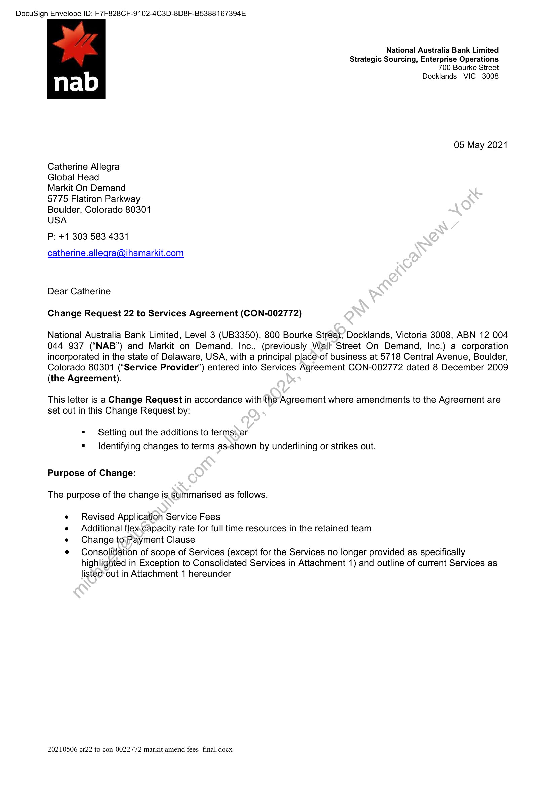
```  
```col-md
DocuSign Envelope ID: F7F828CF-9102-4C3D-8D8F-B5388167394E  
National Australia Bank Limited  
Strategic Sourcing, Enterprise Operations
700 Bourke Street  
Docklands VIC 3008  
05 May 2021  
Catherine Allegra  
Global Head  
Markit On Demand  
5775 Flatiron Parkway
Boulder, Colorado 80301
USA  
P: +1 303 583 4331  
catherine.allegra@ihsmarkit.com  
Dear Catherine
Change Request 22 to Services Agreement (CON-002772)  
National Australia Bank Limited, Level 3 (UB3350), 800 Bourke Street; Docklands, Victoria 3008, ABN 12 004
044 937 (“NAB”) and Markit on Demand, Inc., (previously Wall Street On Demand, Inc.) a corporation
incorporated in the state of Delaware, USA, with a principal place-of business at 5718 Central Avenue, Boulder,
Colorado 80301 (“Service Provider’) entered into Services Agreement CON-002772 dated 8 December 2009
(the Agreement).  
This letter is a Change Request in accordance with the Agreement where amendments to the Agreement are
set out in this Change Request by:  
= Setting out the additions to terms;,or
= Identifying changes to terms as-shown by underlining or strikes out.  
Purpose of Change:
The purpose of the change is summarised as follows.  
Revised Application Service Fees  
Additional flex.capacity rate for full time resources in the retained team  
Change to:Payment Clause  
Consolidation of scope of Services (except for the Services no longer provided as specifically
highlighted in Exception to Consolidated Services in Attachment 1) and outline of current Services as
listed out in Attachment 1 hereunder  
20210506 cr22 to con-0022772 markit amend fees_final.docx  
```
````
Notes:    
````col
```col-md
flexGrow=.5
===
> [!info] [Page 2](_attachments/images_NationalAusBank-3.6.1.12.1.400218213.pdf_211028/page_2.png)
> 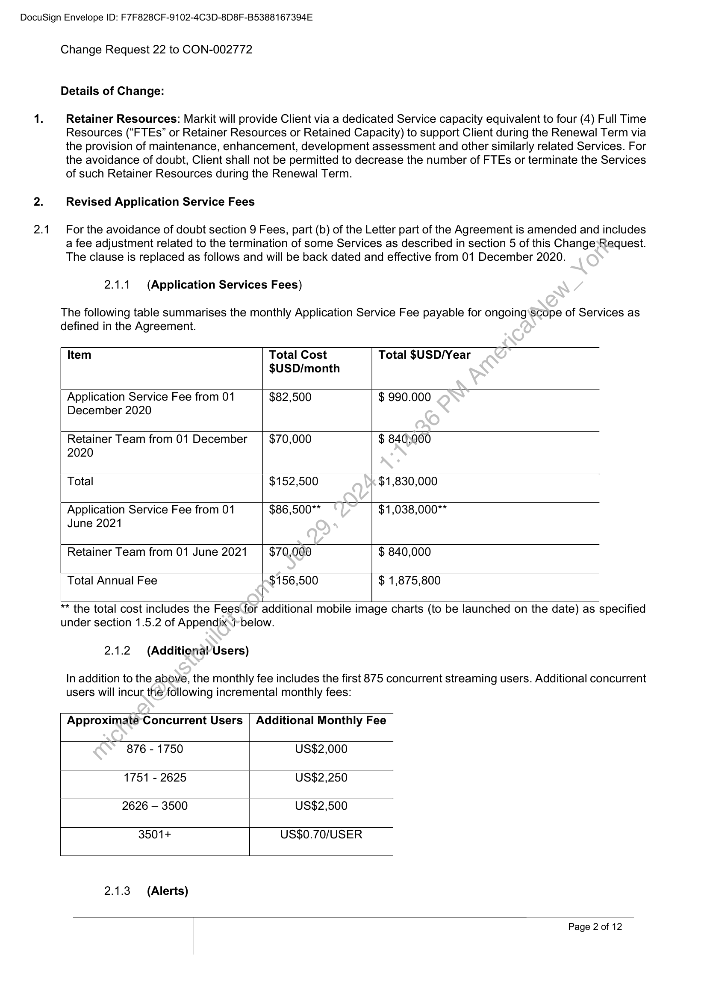
```  
```col-md
DocuSign Envelope ID: F7F828CF-9102-4C3D-8D8F-B5388167394E  
2.1  
Change Request 22 to CON-002772  
Details of Change:  
Retainer Resources: Markit will provide Client via a dedicated Service capacity equivalent to four (4) Full Time
Resources (“FTEs” or Retainer Resources or Retained Capacity) to support Client during the Renewal Term via
the provision of maintenance, enhancement, development assessment and other similarly related Services. For
the avoidance of doubt, Client shall not be permitted to decrease the number of FTEs or terminate the Services
of such Retainer Resources during the Renewal Term.  
Revised Application Service Fees
For the avoidance of doubt section 9 Fees, part (b) of the Letter part of the Agreement is amended and includes  
a fee adjustment related to the termination of some Services as described in section 5 of this Change;Request.
The clause is replaced as follows and will be back dated and effective from 01 December 2020.  
2.1.1. (Application Services Fees)  
The following table summarises the monthly Application Service Fee payable for ongoing'scope of Services as  
defined in the Agreement.  
Item Total Cost Total $USD/Year
$USD/month  
Application Service Fee from 01 82,500 $ 990.000  
December 2020  
Retainer Team from 01 December 70,000 $ 840;000  
2020  
Total 152,500 $1,830,000  
Application Service Fee from 01 86,500** $1,038,000**  
June 2021  
Retainer Team from 01 June 2021 70,000 $ 840,000  
Total Annual Fee 156,500 $ 1,875,800  
** the total cost includes the Fees for additional mobile image charts (to be launched on the date) as specified  
under section 1.5.2 of Appendix.i- below.  
2.1.2 (Additional Users)  
In addition to the above, the monthly fee includes the first 875 concurrent streaming users. Additional concurrent
users will incur the following incremental monthly fees:  
Approximate Concurrent Users  
Additional Monthly Fee  
876 - 1750 US$2,000
1751 - 2625 US$2,250
2626 — 3500 US$2,500  
3501+ US$0.70/USER
2.1.3. (Alerts)  
Page 2 of 12  
```
````
Notes:    
````col
```col-md
flexGrow=.5
===
> [!info] [Page 3](_attachments/images_NationalAusBank-3.6.1.12.1.400218213.pdf_211028/page_3.png)
> 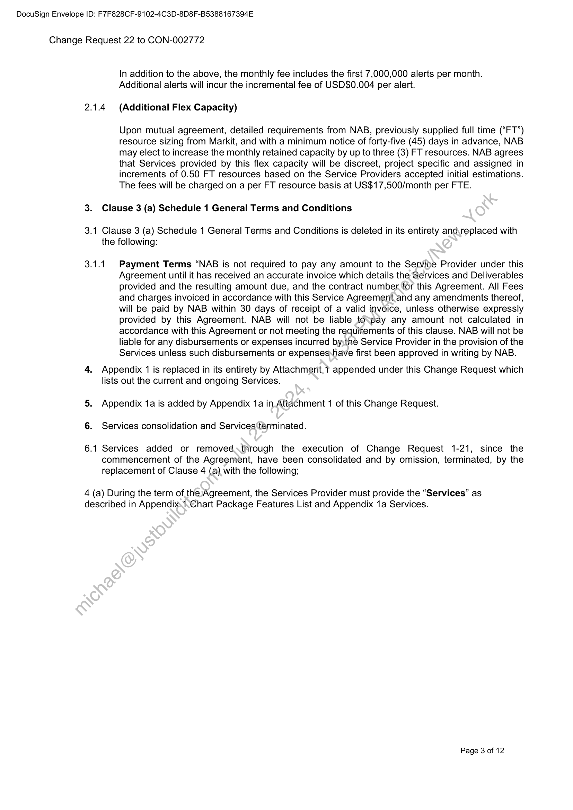
```  
```col-md
DocuSign Envelope ID: F7F828CF-9102-4C3D-8D8F-B5388167394E  
Change Request 22 to CON-002772  
3.  
3.  
6.  
a  
1.  
a  
In addition to the above, the monthly fee includes the first 7,000,000 alerts per month.
Additional alerts will incur the incremental fee of USD$0.004 per alert.  
(Additional Flex Capacity)  
Upon mutual agreement, detailed requirements from NAB, previously supplied full time (“FT”)
resource sizing from Markit, and with a minimum notice of forty-five (45) days in advance, NAB
may elect to increase the monthly retained capacity by up to three (3) FT resources. NAB agrees
that Services provided by this flex capacity will be discreet, project specific and assigned in
increments of 0.50 FT resources based on the Service Providers accepted initial estimations.
The fees will be charged on a per FT resource basis at US$17,500/month per FTE.  
Clause 3 (a) Schedule 1 General Terms and Conditions  
Clause 3 (a) Schedule 1 General Terms and Conditions is deleted in its entirety and\replaced with
the following:  
1  
Payment Terms “NAB is not required to pay any amount to the Service Provider under this
Agreement until it has received an accurate invoice which details the Services and Deliverables
provided and the resulting amount due, and the contract number for this Agreement. All Fees
and charges invoiced in accordance with this Service Agreement.and any amendments thereof,
will be paid by NAB within 30 days of receipt of a valid invoice, unless otherwise expressly
provided by this Agreement. NAB will not be liable tospay any amount not calculated in
accordance with this Agreement or not meeting the requirements of this clause. NAB will not be
liable for any disbursements or expenses incurred bythe Service Provider in the provision of the
Services unless such disbursements or expenses have first been approved in writing by NAB.  
Appendix 1 is replaced in its entirety by Attachment, ? appended under this Change Request which
lists out the current and ongoing Services.  
Appendix 1a is added by Appendix 1a in Attachment 1 of this Change Request.  
Services consolidation and Services‘terminated.  
Services added or removed,through the execution of Change Request 1-21, since the
commencement of the Agreement, have been consolidated and by omission, terminated, by the
replacement of Clause 4 (a) with the following;  
4 (a) During the term of the Agreement, the Services Provider must provide the “Services” as
described in Appendix.  
Chart Package Features List and Appendix 1a Services.  
Page 3 of 12  
```
````
Notes:    
````col
```col-md
flexGrow=.5
===
> [!info] [Page 4](_attachments/images_NationalAusBank-3.6.1.12.1.400218213.pdf_211028/page_4.png)
> 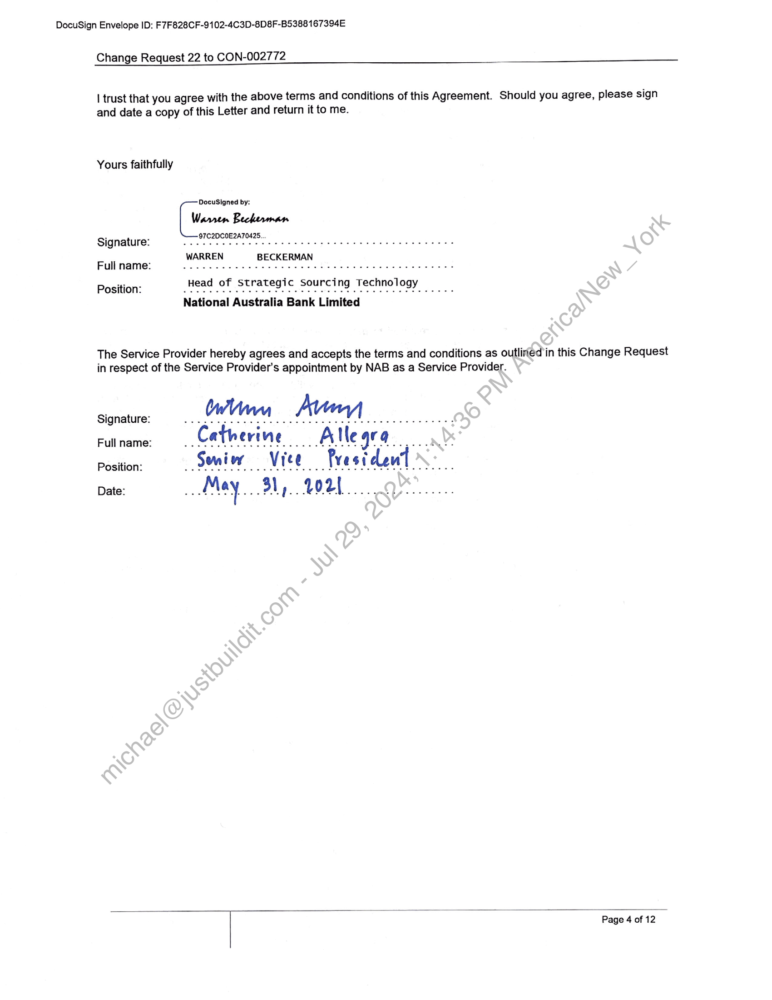
```  
```col-md
DocuSign Envelope ID: F7F828CF-9102-4C3D-8D8F-B5388167394E  
Change Request 22 to CON-002772  
| trust that you agree with the above terms and conditions of this Agreement. Should you agree, please sign
and date a copy of this Letter and return it to me.  
Yours faithfully
DocuSigned by:
Warren Beckerman97C2DC' 25.
Signature. >.  Se eet. nie utd afta seaeie ws oes eR TERRE
WARREN BECKERMAN
Fullname: we ee tet eeenee
a rategi i
Position: Head of Strategic Sourcing Technology  
National Australia Bank Limited  
The Service Provider hereby agrees and accepts the terms and conditions as outlined in this Change Request
in respect of the Service Provider's appointment by NAB as a Service Provider.  
Signature: ( m™ / it v 1  
Full name: ia Catheri ne ei aisiw ard Alle 4
Position: Semi Ww V ree Pre $ i dew  
Date: May 31 1.  VOU  
Page 4 of 12  
```
````
Notes:    
````col
```col-md
flexGrow=.5
===
> [!info] [Page 5](_attachments/images_NationalAusBank-3.6.1.12.1.400218213.pdf_211028/page_5.png)
> 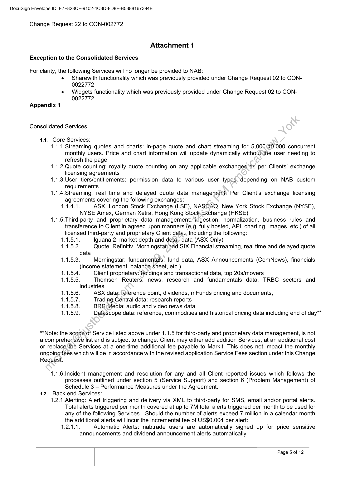
```  
```col-md
DocuSign Envelope ID: F7F828CF-9102-4C3D-8D8F-B5388167394E  
Change Request 22 to CON-002772  
Attachment 1
Exception to the Consolidated Services  
For clarity, the following Services will no longer be provided to NAB:
e Sharewith functionality which was previously provided under Change Request 02 to CON0022772
e Widgets functionality which was previously provided under Change Request 02 to CON0022772
Appendix 1  
Consolidated Services  
1.1. Core Services:
1.1.1.Streaming quotes and charts: in-page quote and chart streaming for 5,00070,000 concurrent
monthly users. Price and chart information will update dynamically without.the user needing to
refresh the page.
1.1.2.Quote counting: royalty quote counting on any applicable exchanges ‘as per Clients’ exchange
licensing agreements
1.1.3.User tiers/entitlements: permission data to various user types depending on NAB custom
requirements
1.1.4.Streaming, real time and delayed quote data management: Per Client’s exchange licensing
agreements covering the following exchanges:
1.1.4.1. ASX, London Stock Exchange (LSE), NASDAQ, New York Stock Exchange (NYSE),
NYSE Amex, German Xetra, Hong Kong Stock,Exchange (HKSE)5.Third-party and proprietary data management: ingestion, normalization, business rules and
transference to Client in agreed upon manners (e.g. fully hosted, API, charting, images, etc.) of all
licensed third-party and proprietary Client data., Including the following:  
1.  
ua  
1.1.5.1. Iguana 2: market depth and detail data (ASX Only)  
1.1.5.2. Quote: Refinitiv, Morningstar arid SIX Financial streaming, real time and delayed quote
data  
1.1.5.3. Morningstar: fundamentals, fund data, ASX Announcements (ComNews), financials
(income statement, balance sheet, etc.)  
1.1.5.4. Client proprietary: holdings and transactional data, top 20s/movers  
1.1.5.5 Thomson Reuters: news, research and fundamentals data, TRBC sectors and
industries  
ASX data: reference point, dividends, mFunds pricing and documents,  
Trading. Central data: research reports  
BRR Media: audio and video news data  
Datascope data: reference, commodities and historical pricing data including end of day**  
**Note: the scope‘of Service listed above under 1.1.5 for third-party and proprietary data management, is not
a comprehensive list and is subject to change. Client may either add addition Services, at an additional cost
or replace ‘the Services at a one-time additional fee payable to Markit. This does not impact the monthly
ongoing fees which will be in accordance with the revised application Service Fees section under this Change
Request.  
1.1.6.Incident management and resolution for any and all Client reported issues which follows the
processes outlined under section 5 (Service Support) and section 6 (Problem Management) of
Schedule 3 — Performance Measures under the Agreement.
1.2. Back end Services:  
1.2.1.Alerting: Alert triggering and delivery via XML to third-party for SMS, email and/or portal alerts.
Total alerts triggered per month covered at up to 7M total alerts triggered per month to be used for
any of the following Services. Should the number of alerts exceed 7 million in a calendar month  
the additional alerts will incur the incremental fee of US$0.004 per alert:
1.2.1.1. Automatic Alerts: nabtrade users are automatically signed up for price sensitive  
announcements and dividend announcement alerts automatically  
Page 5 of 12  
```
````
Notes:    
````col
```col-md
flexGrow=.5
===
> [!info] [Page 6](_attachments/images_NationalAusBank-3.6.1.12.1.400218213.pdf_211028/page_6.png)
> 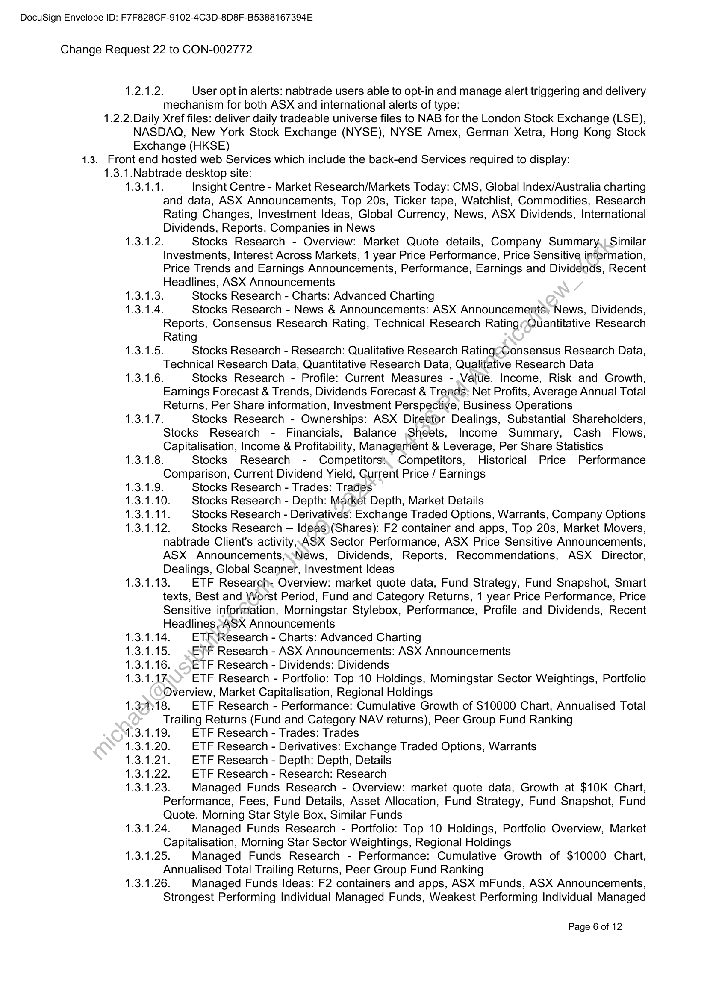
```  
```col-md
DocuSign Envelope ID: F7F828CF-9102-4C3D-8D8F-B5388167394E  
Change Request 22 to CON-002772  
1.2.1.2. User opt in alerts: nabtrade users able to opt-in and manage alert triggering and delivery
mechanism for both ASX and international alerts of type:
1.2.2.Daily Xref files: deliver daily tradeable universe files to NAB for the London Stock Exchange (LSE),
NASDAQ, New York Stock Exchange (NYSE), NYSE Amex, German Xetra, Hong Kong Stock
Exchange (HKSE)
1.3. Front end hosted web Services which include the back-end Services required to display:
1.3.1.Nabtrade desktop site:
1.3.1.1. Insight Centre - Market Research/Markets Today: CMS, Global Index/Australia charting
and data, ASX Announcements, Top 20s, Ticker tape, Watchlist, Commodities, Research
Rating Changes, Investment Ideas, Global Currency, News, ASX Dividends, International
Dividends, Reports, Companies in News
1.3.1.2. Stocks Research - Overview: Market Quote details, Company Summary, Similar
Investments, Interest Across Markets, 1 year Price Performance, Price Sensitive information,
Price Trends and Earnings Announcements, Performance, Earnings and Dividends, Recent
Headlines, ASX Announcements
3 Stocks Research - Charts: Advanced Charting
A. Stocks Research - News & Announcements: ASX Announcements; News, Dividends,
Reports, Consensus Research Rating, Technical Research RatingQuantitative Research
Rating
1.3.1.5. Stocks Research - Research: Qualitative Research Rating°Consensus Research Data,
Technical Research Data, Quantitative Research Data, Qualitative Research Data
1.3.1.6. Stocks Research - Profile: Current Measures - Value, Income, Risk and Growth,
Earnings Forecast & Trends, Dividends Forecast & Trends; Net Profits, Average Annual Total
Returns, Per Share information, Investment Perspective, Business Operations
1.3.1.7. Stocks Research - Ownerships: ASX Director Dealings, Substantial Shareholders,
Stocks Research - Financials, Balance Sheets, Income Summary, Cash Flows,
Capitalisation, Income & Profitability, Management & Leverage, Per Share Statistics
1.3.1.8. Stocks Research - Competitors; Competitors, Historical Price Performance
Comparison, Current Dividend Yield, Gurrent Price / Earnings
Stocks Research - Trades: Trades
0 Stocks Research - Depth: Market Depth, Market Details
1. Stocks Research - Derivatives: Exchange Traded Options, Warrants, Company Options
2 Stocks Research — Ideas)(Shares): F2 container and apps, Top 20s, Market Movers,
nabtrade Client's activity, ASX Sector Performance, ASX Price Sensitive Announcements,
ASX Announcements,\\News, Dividends, Reports, Recommendations, ASX Director,
Dealings, Global Scanner, Investment Ideas
1.3.1.13. ETF Research- Overview: market quote data, Fund Strategy, Fund Snapshot, Smart
texts, Best and Worst Period, Fund and Category Returns, 1 year Price Performance, Price
Sensitive information, Morningstar Stylebox, Performance, Profile and Dividends, Recent
Headlines “ASX Announcements
1.14. ETF Research - Charts: Advanced Charting
1.15. ETF Research - ASX Announcements: ASX Announcements
1.16. ETF Research - Dividends: Dividends
1.17. ETF Research - Portfolio: Top 10 Holdings, Morningstar Sector Weightings, Portfolio
Overview, Market Capitalisation, Regional Holdings
1.31518. ETF Research - Performance: Cumulative Growth of $10000 Chart, Annualised Total
Trailing Returns (Fund and Category NAV returns), Peer Group Fund Ranking
ETF Research - Trades: Trades
1.20. ETF Research - Derivatives: Exchange Traded Options, Warrants
1.21. ETF Research - Depth: Depth, Details
1.22. ETF Research - Research: Research
1.23. Managed Funds Research - Overview: market quote data, Growth at $10K Chart,
Performance, Fees, Fund Details, Asset Allocation, Fund Strategy, Fund Snapshot, Fund
Quote, Morning Star Style Box, Similar Funds
1.3.1.24. Managed Funds Research - Portfolio: Top 10 Holdings, Portfolio Overview, Market
Capitalisation, Morning Star Sector Weightings, Regional Holdings
1.3.1.25. Managed Funds Research - Performance: Cumulative Growth of $10000 Chart,
Annualised Total Trailing Returns, Peer Group Fund Ranking
1.3.1.26. Managed Funds Ideas: F2 containers and apps, ASX mFunds, ASX Announcements,
Strongest Performing Individual Managed Funds, Weakest Performing Individual Managed  
Page 6 of 12  
```
````
Notes:    
````col
```col-md
flexGrow=.5
===
> [!info] [Page 7](_attachments/images_NationalAusBank-3.6.1.12.1.400218213.pdf_211028/page_7.png)
> 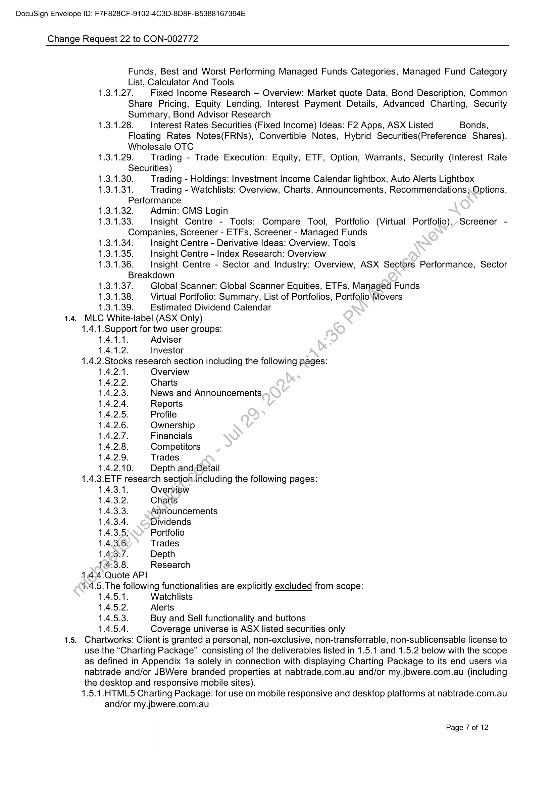
```  
```col-md
DocuSign Envelope ID: F7F828CF-9102-4C3D-8D8F-B5388167394E  
Change Request 22 to CON-002772  
Funds, Best and Worst Performing Managed Funds Categories, Managed Fund Category  
List, Calculator And Tools  
1.3.1.27. Fixed Income Research — Overview: Market quote Data, Bond Description, Common
Share Pricing, Equity Lending, Interest Payment Details, Advanced Charting, Security  
Summary, Bond Advisor Research
1.3.1.28. Interest Rates Securities (Fixed Income) Ideas: F2 Apps, ASX Listed  
Floating Rates Notes(FRNs), Convertible Notes, Hybrid Securities(Preference Shares),  
Wholesale OTC  
1.3.1.29. | Trading - Trade Execution: Equity, ETF, Option, Warrants, Security (Interest Rate  
Securities)  
1.3.1.30. Trading - Holdings: Investment Income Calendar lightbox, Auto Alerts Lightbox
1.3.1.31. Trading - Watchlists: Overview, Charts, Announcements, Recommendations; Options,  
Performance
1.3.1.32. | Admin: CMS Login
1.3  
3.1.33. Insight Centre - Tools: Compare Tool, Portfolio (Virtual Portfolio),,-Screener -  
Companies, Screener - ETFs, Screener - Managed Funds
1.3.1.34. Insight Centre - Derivative Ideas: Overview, Tools
1.3.1.35. Insight Centre - Index Research: Overview
1.3.  
1.36. Insight Centre - Sector and Industry: Overview, ASX Sectors Performance, Sector  
Breakdown
1.3.1.37. Global Scanner: Global Scanner Equities, ETFs, Managed Funds
1.3.1.38. Virtual Portfolio: Summary, List of Portfolios, Portfolio Movers
1.3.1.39. Estimated Dividend Calendar
1.4. MLC White-label (ASX Only)
1.4.1.Support for two user groups:
1.4.1.1. Adviser  
1.4.1.2. Investor
1.4.2.Stocks research section including the following pages:
1.4.2.1. Overview
1.4.2.2. Charts
1.4.2.3. News and Announcements  
1.4.2.4. Reports
1.4.2.5. Profile
1.4.2.6. Ownership
1.4.2.7. Financials
1.4.2.8. Competitors
1.4.2.9. Trades
1.4.2.10. Depth and,Detail
1.4.3.ETF research section including the following pages:  
1.4.3.1. Overview
1.4.3.2. Charts
1.4.3.3. Anriouncements  
1.4.3.4. Dividends
1.4.3.5: Portfolio
1.4.3.6: Trades
1.423:7. Depth
14.3.8. Research
14.4.Quote API
1.4.5.The following functionalities are explicitly excluded from scope:
1.4.5.1. Watchlists
1.4.6.2. Alerts
1.4.5.3. Buy and Sell functionality and buttons
1.4.5.4. Coverage universe is ASX listed securities only  
1.5. Chartworks: Client is granted a personal, non-exclusive, non-transferrable, non-sublicensable license to
use the “Charting Package” consisting of the deliverables listed in 1.5.1 and 1.5.2 below with the scope
as defined in Appendix 1a solely in connection with displaying Charting Package to its end users via
nabtrade and/or JBWere branded properties at nabtrade.com.au and/or my.jowere.com.au (including  
the desktop and responsive mobile sites).  
1.5.1. HTML5 Charting Package: for use on mobile responsive and desktop platforms at nabtrade.com.au  
and/or my.jbwere.com.au  
```
````
Notes:    
````col
```col-md
flexGrow=.5
===
> [!info] [Page 8](_attachments/images_NationalAusBank-3.6.1.12.1.400218213.pdf_211028/page_8.png)
> 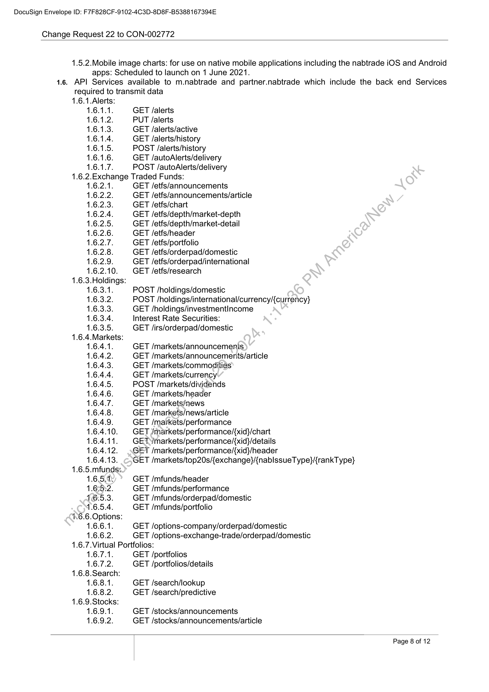
```  
```col-md
DocuSign Envelope ID: F7F828CF-9102-4C3D-8D8F-B5388167394E  
Change Request 22 to CON-002772  
1.5.2.Mobile image charts: for use on native mobile applications including the nabtrade iOS and Android
apps: Scheduled to launch on 1 June 2021.
1.6. API Services available to m.nabtrade and partner.nabtrade which include the back end Services
required to transmit data  
1.6.1.Alerts:
1.6.1.1. GET /alerts
1.6.1.2 PUT /alerts
1.6.1.3. GET /alerts/active
1.6.1.4. GET /alerts/history
1.6.1.5 POST /alerts/history
1.6.1.6 GET /autoAlerts/delivery
1.6.1.7. POST /autoAlerts/delivery
1.6.2.Exchange Traded Funds:
1.6.2.1. GET /etfs/announcements
1.6.2.2. GET /etfs/announcements/article  
1.6.2.3. GET /etfs/chart
1.6.2.4. GET /etfs/depth/market-depth
1.6.2.5. GET /etfs/depth/market-detail
1.6.2.6. GET /etfs/header
1.6.2.7. GET /etfs/portfolio
1.6.2.8. GET /etfs/orderpad/domestic
1.6.2.9. GET /etfs/orderpad/international
1.6.2.10. GET /etfs/research
1.6.3.Holdings:
1.6.3.1. POST /holdings/domestic
1.6.3.2. POST /holdings/international/currency/{currency}
1.6.3.3. GET /holdings/investmentIncome
1.6.3.4. Interest Rate Securities:
1.6.3.5. GET /irs/orderpad/domestic
1.6.4.Markets:
1.6.4.1. GET /markets/announcemenis.
1.6.4.2. GET /markets/announcements/article
1.6.4.3. GET /markets/commodities
1.6.4.4. GET /markets/currency
1.6.4.5. POST /markets/dividends
1.6.4.6. GET /markets/header
1.6.4.7. GET /markets/news
1.6.4.8. GET /markets/news/article
1.6.4.9. GET /markets/performance
1.6.4.10. GET /markets/performance/{xid}/chart
1.6.4.11. GETYmarkets/performance/{xid}/details
1.6.4.12. GET /markets/performance/{xid}/header
1.6.4.13. GET /markets/top20s/{exchange}/{nablssueType}/{rankT ype}
1.6.5.mfunds:
1.6.5.9: GET /mfunds/header
1.65532. GET /mfunds/performance
16.5.3. GET /mfunds/orderpad/domestic
1.6.5.4. GET /mfunds/portfolio
1.6.6.Options:
1.6.6.1. GET /options-company/orderpad/domestic
1.6.6.2. GET /options-exchange-trade/orderpad/domestic
1.6.7.Virtual Portfolios:
1.6.7.1. GET /portfolios
1.6.7.2. GET /portfolios/details
1.6.8.Search:
1.6.8.1. GET /search/lookup
1.6.8.2. GET /search/predictive  
1.6.9.Stocks:
1.6.9.1. GET /stocks/announcements
1.6.9.2. GET /stocks/announcements/article  
Page 8 of 12  
```
````
Notes:    
````col
```col-md
flexGrow=.5
===
> [!info] [Page 9](_attachments/images_NationalAusBank-3.6.1.12.1.400218213.pdf_211028/page_9.png)
> 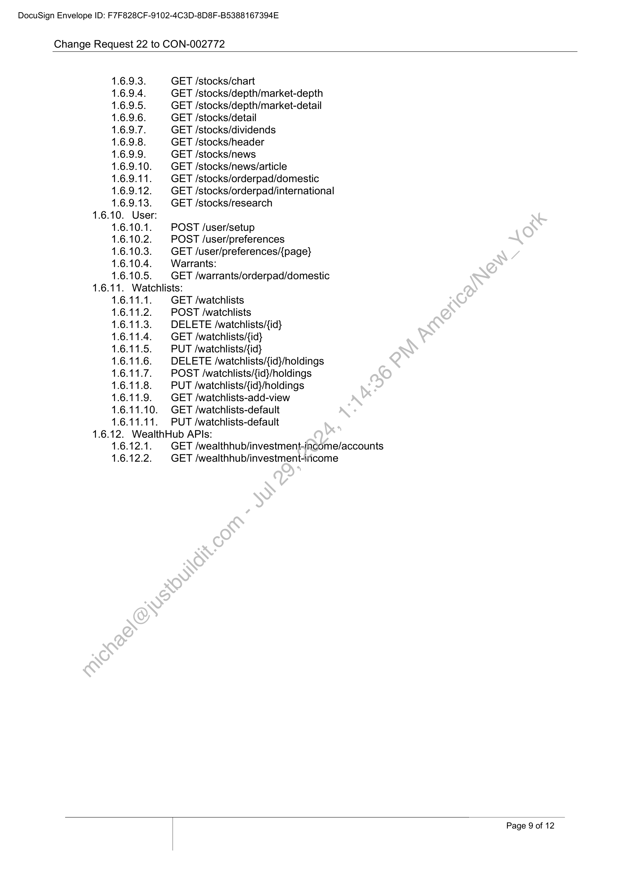
```  
```col-md
DocuSign Envelope ID: F7F828CF-9102-4C3D-8D8F-B5388167394E  
Change Request 22 to CON-002772  
1.6.9.3.
1.6.9.4.
1.6.9.5.
1.6.9.6.
1.6.9.7.
1.6.9.8.
1.6.9.9.
1.6.9.10.
1.6.9.11.
1.6.9.12.
1.6.9.13.
1.6.10. User:
1.6.10.1.
1.6.10.2.
1.6.10.3.
1.6.10.4.
1.6.10.5.  
1.6.11. Watchlists:  
GET /stocks/chart  
GET /stocks/depth/market-depth
GET /stocks/depth/market-detail
GET /stocks/detail  
GET /stocks/dividends  
GET /stocks/header  
GET /stocks/news  
GET /stocks/news/article  
GET /stocks/orderpad/domestic
GET /stocks/orderpad/international
GET /stocks/research  
POST /user/setup  
POST /user/preferences  
GET /user/preferences/{page}
Warrants:  
GET /warrants/orderpad/domestic  
GET /watchlists  
POST /watchlists  
DELETE /watchlists/{id}  
GET /watchlists/{id}  
PUT /watchlists/{id}  
DELETE /watchlists/{id}/holdings
POST /watchlists/{id}/holdings
PUT /watchlists/{id}/holdings
GET /watchlists-add-view
GET /watchlists-default  
PUT /watchlists-default  
1.6.12. WealthHub APIs:  
1.6.12.1.
1.6.12.2.  
GET /wealthhub/investment-income/accounts
GET /wealthhub/investment-income  
Page 9 of 12  
```
````
Notes:    
````col
```col-md
flexGrow=.5
===
> [!info] [Page 10](_attachments/images_NationalAusBank-3.6.1.12.1.400218213.pdf_211028/page_10.png)
> 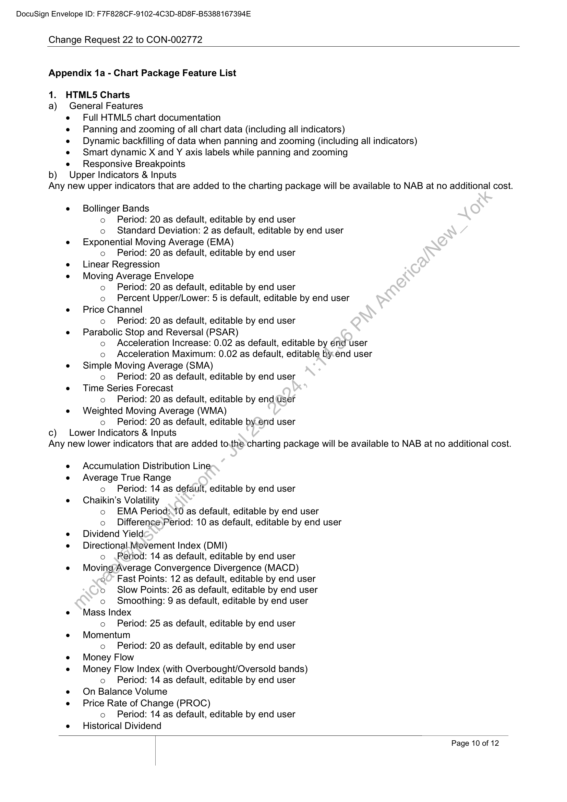
```  
```col-md
DocuSign Envelope ID: F7F828CF-9102-4C3D-8D8F-B5388167394E  
Change Request 22 to CON-002772  
Appendix 1a - Chart Package Feature List  
1. HTML5 Charts
a) General Features  
Full HTMLS5 chart documentation  
Panning and zooming of all chart data (including all indicators)  
Dynamic backfilling of data when panning and zooming (including all indicators)
Smart dynamic X and Y axis labels while panning and zooming  
Responsive Breakpoints  
b) Upper Indicators & Inputs
Any new upper indicators that are added to the charting package will be available to NAB at no additional cost.  
Bollinger Bands
o Period: 20 as default, editable by end user
o Standard Deviation: 2 as default, editable by end user
Exponential Moving Average (EMA)
o Period: 20 as default, editable by end user
Linear Regression
Moving Average Envelope
o Period: 20 as default, editable by end user
o Percent Upper/Lower: 5 is default, editable by end user
Price Channel
o Period: 20 as default, editable by end user
Parabolic Stop and Reversal (PSAR)
o Acceleration Increase: 0.02 as default, editable by end user
o Acceleration Maximum: 0.02 as default, editable by.end user
Simple Moving Average (SMA)
o Period: 20 as default, editable by end user
Time Series Forecast
o Period: 20 as default, editable by end User
Weighted Moving Average (WMA)
o Period: 20 as default, editable by.end user  
c) Lower Indicators & Inputs
Any new lower indicators that are added to.the charting package will be available to NAB at no additional cost.  
Accumulation Distribution Line
Average True Range
o Period: 14 as default, editable by end user
Chaikin’s Volatility
o EMA Periods10 as default, editable by end user
o Difference,Period: 10 as default, editable by end user
Dividend Yield
Directiona!. Movement Index (DMI)
o Period: 14 as default, editable by end user
MovingAverage Convergence Divergence (MACD)
oC Fast Points: 12 as default, editable by end user
o Slow Points: 26 as default, editable by end user
o Smoothing: 9 as default, editable by end user
Mass Index
o Period: 25 as default, editable by end user
Momentum
o Period: 20 as default, editable by end user
Money Flow
Money Flow Index (with Overbought/Oversold bands)
o Period: 14 as default, editable by end user
On Balance Volume
Price Rate of Change (PROC)
o Period: 14 as default, editable by end user
Historical Dividend  
Page 10 of 12  
```
````
Notes:    
````col
```col-md
flexGrow=.5
===
> [!info] [Page 11](_attachments/images_NationalAusBank-3.6.1.12.1.400218213.pdf_211028/page_11.png)
> 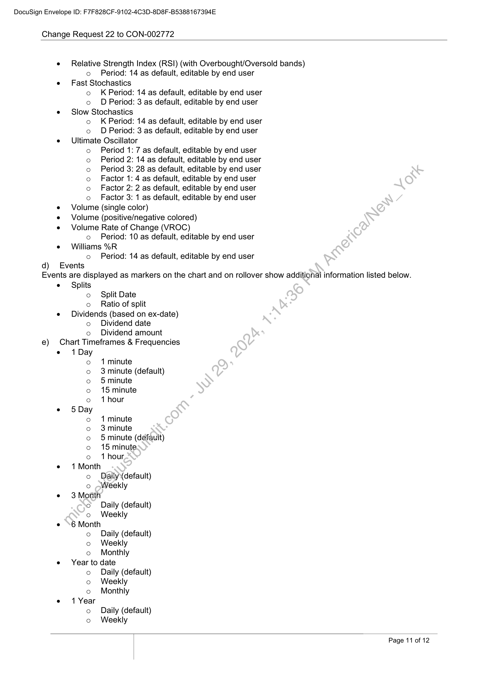
```  
```col-md
DocuSign Envelope ID: F7F828CF-9102-4C3D-8D8F-B5388167394E  
Change Request 22 to CON-002772  
e Relative Strength Index (RSI) (with Overbought/Oversold bands)  
o Period: 14 as default, editable by end user  
e Fast Sto  
chastics  
o K Period: 14 as default, editable by end user  
o D Period: 3 as default, editable by end user
e Slow Stochastics  
o K Period: 14 as default, editable by end user  
fe)
e Ultimate
fe)  
fe)
fe)
fe)
fe)
fe)
e Volume
e Volume
e Volume  
fe)  
D Period: 3 as default, editable by end user
Oscillator  
Period 1: 7 as default, editable by end user
Period 2: 14 as default, editable by end user
Period 3: 28 as default, editable by end user
Factor 1: 4 as default, editable by end user
Factor 2: 2 as default, editable by end user
Factor 3: 1 as default, editable by end user
(single color)  
(positive/negative colored)  
Rate of Change (VROC)  
Period: 10 as default, editable by end user  
e =Williams %R  
fe)
d) Events  
Period: 14 as default, editable by end user  
Events are displayed as markers on the chart and on rollover show additional information listed below.  
e = Splits
fe)
fe)  
Split Date
Ratio of split  
e Dividends (based on ex-date)  
fe)
fe)  
Dividend date
Dividend amount  
e) Chart Timeframes & Frequencies  
e 1 Day
fe)
fe)
fe)
fe)
fe)  
e 5 Day
fe)
fe)
fe)
fe)
fe)  
e 1 Month
fe)
fe)  
e 3 Month
‘9)
fe)  
e 6 Month  
fe)
fe)
fe)  
e Year to date  
fe)
fe)
fe)  
e 1 Year
fe)
fe)  
1 minute  
3 minute (default)
5 minute  
15 minute  
1 hour  
1 minute  
3 minute  
5 minute (default)
15 minute  
1 hour  
Daily (default
Weekly  
Daily (default
Weekly  
Daily (default
Weekly
Monthly  
Daily (default
Weekly
Monthly  
Daily (default
Weekly  
Page 11 of 12  
```
````
Notes:    
````col
```col-md
flexGrow=.5
===
> [!info] [Page 12](_attachments/images_NationalAusBank-3.6.1.12.1.400218213.pdf_211028/page_12.png)
> 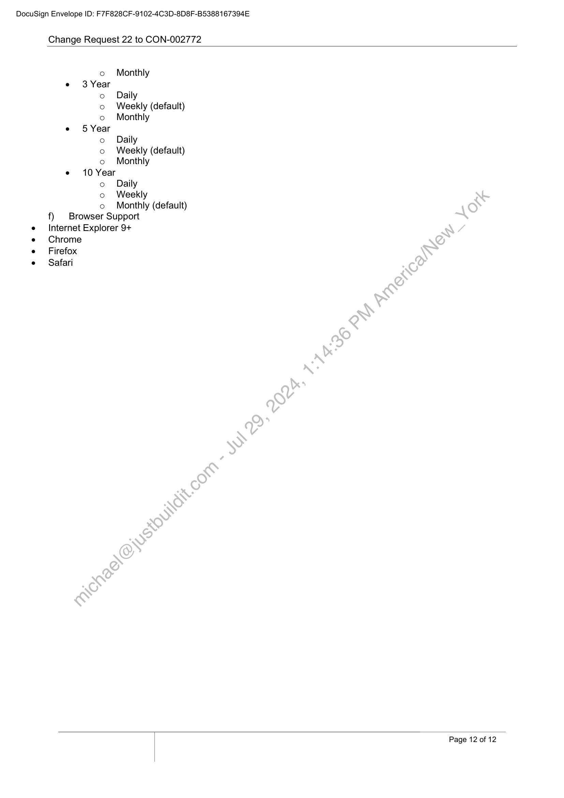
```  
```col-md
DocuSign Envelope ID: F7F828CF-9102-4C3D-8D8F-B5388167394E  
Change Request 22 to CON-002772  
o Monthly
e 3 Year
o Daily
o Weekly (default)
o Monthly
e 5 Year
o Daily
o Weekly (default)
o Monthly
e 10 Year
o Daily
o Weekly  
o Monthly (default)
f) | Browser Support
Internet Explorer 9+
Chrome
Firefox
Safari  
Page 12 of 12  
```
````
Notes:  


![[_attachments/NationalAusBank-3.6.1.12.1.4 00218213.pdf]