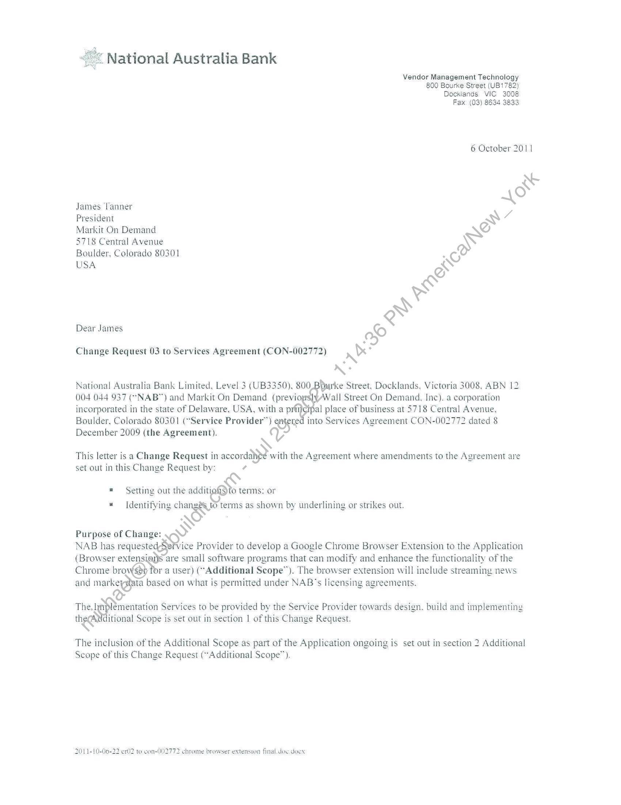
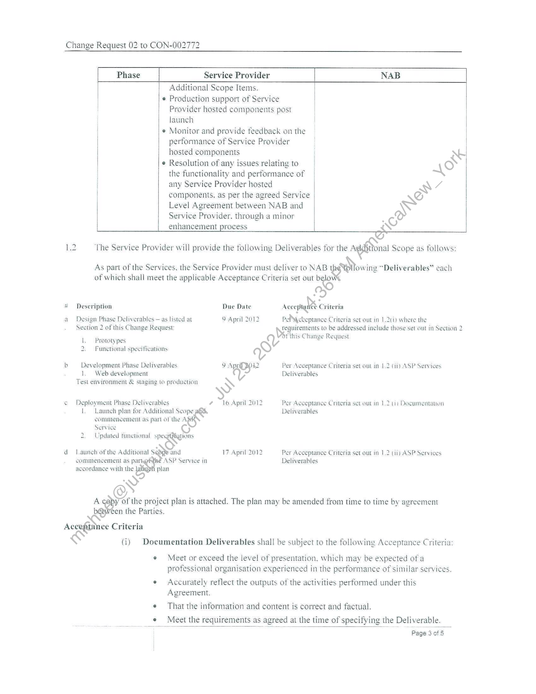
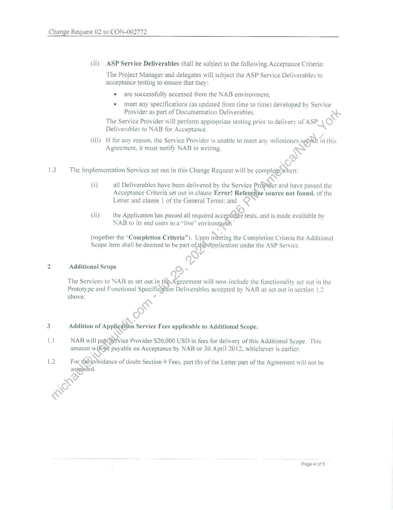
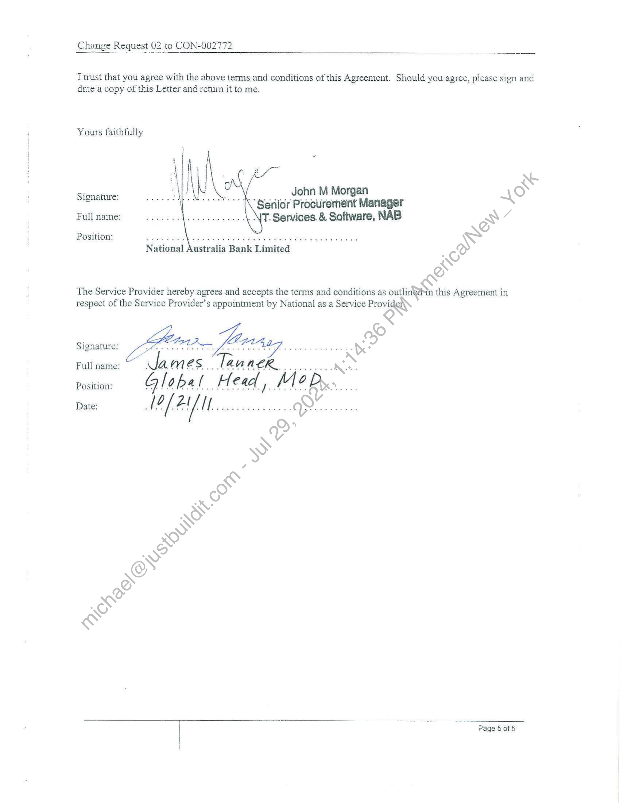

##### Change Request 03 to Services Agreement (CON-002772)]

  
````col
```col-md
flexGrow=.5
===
> [!info] [Page 1](_attachments/images_NationalAusBank-3.6.1.12.1.500157183.pdf_212611/page_1.png)
> 
```  
```col-md
National Australia Bank  
Vendor Management Technology
800 Bourke Street (UB1782)
Docklands VIC 3008  
Fax (03) 8634 3833  
6 October 2011  
James Tanner  
President RY a
Markit On Demand We
5718 Central Avenue \  
Boulder, Colorado 80301 . ge  
S ~\
USA ee  
Dear James a&
Change Request 03 to Services Agreement (CON-002772) rk .  
Nn:
National Australia Bank Limited, Level 3 (UB3350), 800, Durke Street, Docklands. Victoria 3008, ABN 12
004 044 937 (“NAB”) and Markit On Demand (previo; all Street On Demand. Inc). a corporation
incorporated in the state of Delaware, USA, with a prfijcipal place of business at 5718 Central Avenue,
Boulder, Colorado 80301 (“Service Provider”) RO into Services Agreement CON-002772 dated 8
December 2009 (the Agreement). N/  
This letter is a Change Request in accordahge with the Agreement where amendments to the Agreement are
set out in this Change Request by: ¢  
= Setting out the additiof9to terms: or
«Identifying chang&&_t6 terms as shown by underlining or strikes out.  
\  
Purpose of Change: \)
NAB has requeste vice Provider to develop a Google Chrome Browser Extension to the Application
(Browser extensians are small software programs that can modify and enhance the functionality of the
Chrome brow or a user) (“Additional Scope”). The browser extension will include streaming news
and markeygtata based on what is permitted under NAB’s licensing agreements.  
&
The. .plémentaton Services to be provided by the Service Provider towards design. build and implementing
thegs ditional Scope is set out in section 1 of this Change Request.  
The inclusion of the Additional Scope as part of the Application ongoing is set out in section 2 Additional
Scope of this Change Request (“Additional Scope”).  
2011-10-06-22 cr02 to con-002772 chrome browser extension final doc. doex  
```
````
Notes:    
````col
```col-md
flexGrow=.5
===
> [!info] [Page 2](_attachments/images_NationalAusBank-3.6.1.12.1.500157183.pdf_212611/page_2.png)
> 
```  
```col-md
Change Request 02 to CON-002772  
Phase Service Provider NAB  
Additional Scope Items.  
¢ Production support of Service
Provider hosted components post
launch  
¢ Monitor and provide feedback on the
performance of Service Provider
hosted components  
e Resolution of any issues relating to
the functionality and performance of |  
| any Service Provider hosted  
components. as per the agreed Service  
Level Agreement between NAB and  
Service Provider. through a minor  
enhancement process oo  
epftona Scope as follows:  
As part of the Services, the Service Provider must deliver to NAB ws Wowin “Deliverables” each
of which shall meet the applicable Acceptance Criteria set out b :  
so)  
hed ‘The Service Provider will provide the following Deliverables for the /  
.
Re
* Description Due Date Acceptance Criteria
°
a Design Phase Deliverables — as listed at 9 April 2012 PeP\cteptance Criteria set out in 1.201) where the
Section 2 of this Change Request: Teguuirements to be addressed include those set out in Section 2  
Ot this Change Request
lL. Prototypes S  
2. Functional specifications v  
b Development Phase Deliverables. 9 Ape Per Acceptance Criteria set out in 1,2 (ii) ASP Services
1, Web development Deliverables
Test environment & staging to production >
¢ Deployment Phase Deliverables ¢ 16 April 2012 Per Acceptanee Criteria set out in 1.2 (i) Documentation
[, Launch plan for Additional Scope a Deliverables
commencement as part of the me
Service (S)
2. Updated functional Sa
d- Launch of the Additional and 17 April 2012 Per Acceptance Criteria set out in 1,2 (ii) ASP Services
commencement as part SP Service in Deliverables
accordance with the s plan  
A of the project plan is attached. The plan may be amended from time to time by agreement
een the Parties.  
Acca @tnce Criteria
€ (i) Documentation Deliverables shall be subject to the following Acceptance Criteria:
e¢ Meet or exceed the level of presentation, which may be expected of a
professional organisation experienced in the performance of similar services.
e Accurately reflect the outputs of the activities performed under this
Agreement.
e That the information and content is correct and factual.
¢ Meet the requirements as agreed at the time of specifying the Deliverable.
—— : Page 30f 5  
```
````
Notes:    
````col
```col-md
flexGrow=.5
===
> [!info] [Page 3](_attachments/images_NationalAusBank-3.6.1.12.1.500157183.pdf_212611/page_3.png)
> 
```  
```col-md
Change Request 02 to CON-002772  
(ii) ASP Service Deliverables shall be subject to the following Acceptance Criteria:  
The Project Manager and delegates will subject the ASP Service Deliverables to
acceptance testing to ensure that they:  
e are successfully accessed from the NAB environment.
® meet any specifications (as updated from time to time) developed by Service
Provider as part of Documentation Deliverables. AS
The Service Provider will perform appropriate testing prior to delivery of ASP \O
Deliverables to NAB for Acceptance.  
(iii) If for any reason, the Service Provider is unable to meet any milestones soph in this
Agreement. it must notify NAB in writing.  
13 The Implementation Services set out in this Change Request will be compleypywhen:
(i) all Deliverables have been delivered by the Service Provider and have passed the  
Acceptance Criteria set out in clause Error! Reter source not found, of the
Letter and clause | of the General Terms: and  
(ii) the Application has passed all required ncn tests, and is made available by
NAB to its end users in a “live” envio .*  
(together the “Completion Criteria”). Upon Mbctine the Completion Criteria the Additional
Scope item shall be deemed to be part ita under the ASP Service.  
©
2 Additional Scope O)*  
The Services to NAB as set out ge Races will now include the functionality set out in the  
Prototype and Functional Specification Deliverables accepted by NAB as set out in section 1,2
above. “  
O
a Addition of Application Service Fees applicable to Additional Scope.
\  
11 NAB will par Pie Provider $20,000 USD in fees for delivery of this Additional Scope. This
amount wi payable on Acceptance by NAB or 30 April 2012. whichever is earlier.  
L.2 For. @ idance of doubt Section 9 Fees, part (b) of the Letter part of the Agreement will not be
any ed.  
Page 4 of 5  
```
````
Notes:    
````col
```col-md
flexGrow=.5
===
> [!info] [Page 4](_attachments/images_NationalAusBank-3.6.1.12.1.500157183.pdf_212611/page_4.png)
> 
```  
```col-md
Change Request 02 to CON-002772  
I trust that you agree with the above terms and conditions of this Agreement. Should you agree, please sign and
date a copy of this Letter and return it to me.  
Yours faithfully  
’ . John M Morgan fe)
ecemeiideaad henbaasiens Sériior Procurement Manager a
Full name: T. Services. & Software, NAB RY 7  
POsitons === sg wos g wow wow wan y Aes 9 RGA 8 Y RORY BOR g dae FG Be w  
National Australia Bank Limited  
The Service Provider hereby agrees and accepts the terms and conditions as outlinghin this Agreement in
respect of the Service Provider’s appointment by National as a Service Provi  
Signature:
Full name:
Position:  
Date:  
Page 5 of 5  
```
````
Notes:  


![[_attachments/NationalAusBank-3.6.1.12.1.5 00157183.pdf]